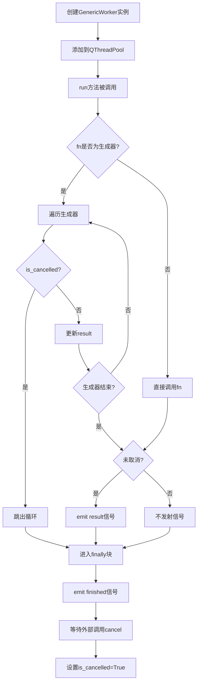
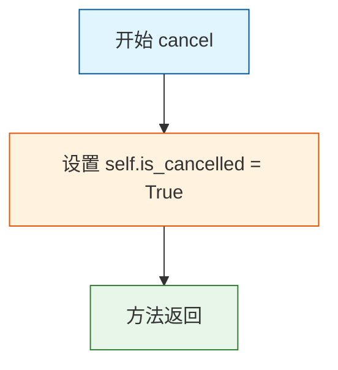

# `comic-translate\app\thread_worker.py` 详细设计文档

这是一个基于PySide6的通用异步任务运行器，通过QRunnable和信号槽机制实现后台任务的执行、结果返回、异常处理和取消功能，支持普通函数和生成器函数两种执行模式。

## 整体流程



## 类结构

```
QObject (Qt基类)
├── WorkerSignals
QRunnable (Qt基类)
└── GenericWorker
```

## 全局变量及字段


### `WorkerSignals.finished`
    
任务完成信号

类型：`Signal`
    


### `WorkerSignals.error`
    
任务异常信号

类型：`Signal(tuple)`
    


### `WorkerSignals.result`
    
任务结果信号

类型：`Signal(object)`
    


### `GenericWorker.fn`
    
要执行的函数或生成器

类型：`callable`
    


### `GenericWorker.args`
    
位置参数

类型：`tuple`
    


### `GenericWorker.kwargs`
    
关键字参数

类型：`dict`
    


### `GenericWorker.signals`
    
信号管理器

类型：`WorkerSignals`
    


### `GenericWorker.is_cancelled`
    
取消标志

类型：`bool`
    
    

## 全局函数及方法


### `GenericWorker.run`

该方法是 `GenericWorker` 类的核心执行逻辑，在 Qt 的 QRunnable 线程池中异步运行。它负责执行传入的任务函数（支持普通函数和生成器函数），处理取消操作，捕获异常，并通过 Qt 信号机制将结果、错误或完成状态传递给主线程。

参数：此方法无显式参数。执行所需的参数存储在实例属性中：
- `self.fn`：待执行的函数或生成器
- `self.args`：位置参数元组
- `self.kwargs`：关键字参数字典
- `self.is_cancelled`：取消标志

返回值：`None`（无返回值），结果通过信号机制传递。

#### 流程图

```mermaid
flowchart TD
    A[开始执行 run] --> B{是否是生成器函数?}
    
    B -->|是| C[初始化 result = None]
    C --> D[遍历生成器 yield]
    D --> E{is_cancelled?}
    E -->|是| F[break 退出循环]
    E -->|否| G[更新 result]
    G --> D
    
    D --> H{生成器耗尽?}
    H -->|否| D
    H -->|是| I{is_cancelled?}
    I -->|否| J[signals.result.emit result]
    I -->|是| K[跳过结果发送]
    J --> L[signals.finished.emit]
    K --> L
    
    B -->|否| M[直接调用函数 result = fn(*args, **kwargs)]
    M --> N{is_cancelled?}
    N -->|否| J
    N -->|是| O[跳过结果发送]
    O --> L
    
    L --> P[结束]
    
    -- 异常捕获分支 --
    A --> Q[异常捕获: try-except]
    Q --> R[获取 exctype, value]
    R --> S[signals.error.emit 发送错误信号]
    S --> T[signals.finished.emit]
    T --> P
```

#### 带注释源码

```python
def run(self):
    """
    在独立的线程中执行任务。
    支持普通函数和生成器函数两种模式。
    任务执行完成后无论成功或失败都会发出 finished 信号。
    """
    try:
        # 检查是否为生成器函数（使用 yield 的函数）
        if isinstance(self.fn, types.GeneratorType):
            result = None  # 初始化结果变量
            
            # 遍历生成器的每一个 yield 值
            for r in self.fn:
                # 检查是否被外部请求取消
                if self.is_cancelled:
                    break  # 跳出循环，停止生成器迭代
                result = r  # 更新结果为当前 yield 的值
            
            # 仅在未被取消时发送结果信号
            if not self.is_cancelled:
                self.signals.result.emit(result)
        else:
            # 普通函数：直接调用并传递参数
            result = self.fn(*self.args, **self.kwargs)
            
            # 仅在未被取消时发送结果信号
            if not self.is_cancelled:
                self.signals.result.emit(result)
    except:
        # 捕获所有异常（包括系统退出异常）
        exctype, value = sys.exc_info()[:2]  # 获取异常类型和值
        # 发送错误信号，包含异常信息元组
        self.signals.error.emit((exctype, value, traceback.format_exc()))
    finally:
        # 无论成功、取消或出错，都发送完成信号
        # 这是通知调用者任务已结束的关键信号
        self.signals.finished.emit()
```


### `GenericWorker.cancel`

取消任务执行，通过设置取消标志使正在运行的任务能够检测到取消请求并停止执行。

参数：
- `self`：`GenericWorker`，代表当前worker实例本身，无需显式传递

返回值：`None`，无返回值

#### 流程图



#### 带注释源码

```python
def cancel(self):
    """
    取消当前任务的执行。
    
    该方法通过将 is_cancelled 标志设置为 True 来请求取消任务。
    任务在执行过程中会检查该标志，如果检测到取消请求则会提前终止执行。
    注意：cancel 方法本身不会立即停止任务，而是设置一个标志位，
    实际的停止操作由任务在 run() 方法中自行检测并处理。
    """
    self.is_cancelled = True  # 设置取消标志为 True，任务运行时将检查此标志
```

## 关键组件


### WorkerSignals

Qt信号容器类，定义工作线程与主线程通信的信号接口，包含finished、error和result三个信号，用于报告任务完成、错误和结果。

### GenericWorker

通用的QRunnable子类，用于在后台线程中执行函数或生成器，支持取消操作、异常捕获和结果回调。

### is_cancelled

布尔类型标志位，用于标识任务是否被取消，用于在生成器迭代过程中检查并提前退出循环。

### fn

可调用对象类型，存储要执行的函数或生成器对象。

### args

元组类型，存储传递给目标函数的位置参数。

### kwargs

字典类型，存储传递给目标函数的关键字参数。

### signals

WorkerSignals类型，信号管理器实例，用于发射完成、错误和结果信号。

### run方法

线程执行入口，判断fn是否为生成器，若是则迭代执行并发送最后一个结果，否则直接调用函数并发送结果，发射finished信号。

### cancel方法

设置is_cancelled标志为True，用于请求取消正在执行的生成器任务。

### 生成器支持

通过isinstance检查和types.GeneratorType判断，实现对生成器函数的特殊处理，在迭代过程中支持取消操作。

### 异常处理机制

使用try-except捕获所有异常，提取异常类型、值和完整traceback，通过error信号发射给主线程处理。


## 问题及建议


### 已知问题

-   **取消机制形同虚设**：在 `run` 方法的普通函数（非 Generator）执行分支中，代码并未在运行期间检查 `is_cancelled` 标志。调用 `cancel()` 仅会阻止 `result` 信号的发送，但函数本身仍会完整执行完毕，消耗计算资源并可能产生副作用，无法实现真正的“取消”操作。
-   **Generator 结果丢失**：当 `self.fn` 是生成器时，代码会遍历所有迭代值，但最终仅发射最后一次迭代的结果。如果使用生成器的目的是为了汇报进度，中间的所有结果数据都会被丢弃。
-   **异常捕获过于宽泛**：使用了裸的 `except:` 语句，这会捕获包括 `SystemExit`、`KeyboardInterrupt` 在内的所有异常，可能掩盖严重的系统级错误并阻止 Python 解释器的正常退出流程。
-   **缺乏类型安全**：代码中完全没有使用 Python 类型注解（Type Hints），导致无法利用静态分析工具进行类型检查，降低了代码的可维护性和重构安全性。
-   **信号参数黑盒效应**：`error` 信号定义为 `Signal(tuple)`，使得调用者在连接信号时无法通过类型推断获知错误详情（具体包含异常类型、值、追踪字符串），必须依赖文档或源码，增加了使用时的认知负担。

### 优化建议

-   **实现真正的取消逻辑**：针对非 Generator 函数，建议在执行循环中加入对 `self.is_cancelled` 的检查（若函数支持检查点），或者在类文档中明确说明“取消”仅保证“不返回结果”。对于 Generator，保持当前的循环检查机制。此外，建议新增 `progress = Signal(object)` 信号，在 Generator 迭代过程中实时发射中间值，以满足 UI 进度条更新等需求。
-   **精确异常处理**：将 `except:` 修改为 `except Exception:`，排除系统退出异常。同时，建议在 `error` 信号中明确参数类型，例如定义为 `Signal(str, str, str)` (message, exception_type, traceback)，以增强接口的清晰度。
-   **完善类型注解**：引入 `typing` 模块，为 `fn`, `args`, `kwargs` 以及信号槽口添加明确的类型标注，提升代码健壮性。
-   **资源与生命周期管理**：虽然 `QRunnable` 不是 `QObject`，但建议在注释中明确说明信号发射的线程环境（当前在 `QRunnable` 所在的线程），提醒使用者在接收信号时需注意跨线程调用的常见坑（如使用 `Qt.QueuedConnection`）。


## 其它


### 设计目标与约束

该代码旨在提供一个通用的后台任务执行框架，支持在Qt主线程之外执行耗时操作，并通过信号机制将结果返回给主线程。设计约束包括：必须与PySide6的QThreadPool配合使用；仅支持可调用对象（函数/方法）作为任务入口；生成器函数仅支持顺序执行且无法精确控制每一步的进度回调。

### 错误处理与异常设计

代码采用异常捕获并通过信号传递的机制。run方法中使用裸except捕获所有异常，获取异常类型、值和完整堆栈信息，通过error信号以元组形式(exctype, value, traceback_string)发射。调用方需连接error信号并解析元组以获取详细错误信息。finally块确保finished信号必定发射，用于资源清理和状态重置。

### 数据流与状态机

工作线程生命周期状态：创建（Ready）→ 入池（Scheduled）→ 执行中（Running）→ 完成（Finished）/ 取消（Cancelled）。数据流向：外部通过构造函数传入fn、args、kwargs → run方法执行并产生result → 通过signals.result发射 → 调用方接收。取消机制通过is_cancelled标志位实现，仅在下次迭代或函数调用前检查。

### 外部依赖与接口契约

依赖PySide6.QtCore模块的QRunnable、Signal、QObject类，以及Python标准库的types、sys、traceback模块。调用方必须遵守的契约：fn应为可调用对象；args和kwargs将直接透传给fn；使用前需将worker加入QThreadPool；取消功能仅在函数内部循环或生成器迭代时生效。

### 线程安全考虑

is_cancelled标志位的读写操作在多线程环境下存在竞态条件，但因Qt事件循环特性，实际使用中通常可接受。signals对象由QRunnable创建，在Qt内部线程模型下信号发射到目标线程（默认情况下信号在发射线程执行），需确保槽函数线程安全性。

### 性能特征与资源需求

每个Worker对象独立持有fn引用和参数副本，无共享状态。每个Worker创建时实例化WorkerSignals对象，产生少量内存开销。生成器模式下的迭代在当前线程执行，不会创建额外线程。

### 使用示例

```python
worker = GenericWorker(my_function, arg1, arg2, kwarg1=value)
worker.signals.result.connect(handle_result)
worker.signals.error.connect(handle_error)
worker.signals.finished.connect(task_finished)
QThreadPool.globalInstance().start(worker)
```

### 生命周期管理

Worker对象由QThreadPool负责生命周期管理，任务完成后Pool可能缓存或释放Worker。外部不应长时间持有大量已完成Worker的引用。cancel()方法可从任意线程调用，设置标志位后run方法将在下次检查点退出。

    