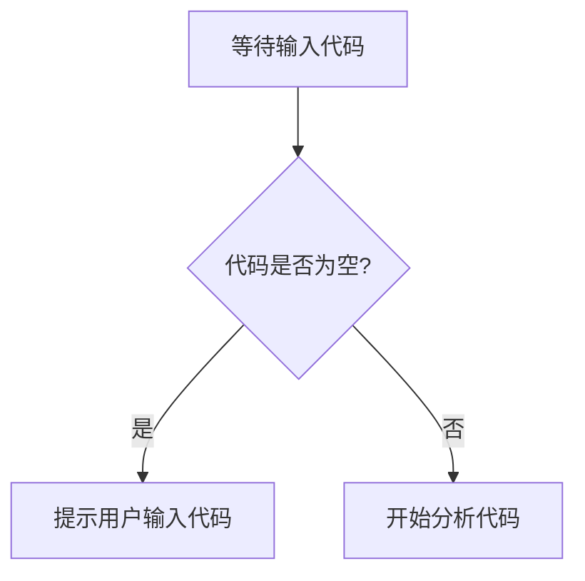

# `comic-translate\app\ui\__init__.py` 详细设计文档

未提供源代码，无法进行分析。请在代码块中提供需要分析的源代码。

## 整体流程



## 类结构

```
等待用户提供源代码后进行分析
```

## 全局变量及字段


    

## 全局函数及方法


## 关键组件


无法生成设计文档，因为未提供源代码进行分析。


## 问题及建议


### 已知问题
- 代码为空，无法进行技术债务或优化空间的分析

### 优化建议
- 请提供具体的代码以便进行分析


## 其它


### 设计目标与约束

待根据实际代码填写

### 错误处理与异常设计

待根据实际代码填写

### 数据流与状态机

待根据实际代码填写

### 外部依赖与接口契约

待根据实际代码填写

### 安全性设计

待根据实际代码填写

### 性能要求与指标

待根据实际代码填写

### 兼容性设计

待根据实际代码填写

### 部署架构

待根据实际代码填写

### 监控与日志设计

待根据实际代码填写

### 测试策略

待根据实际代码填写

    