# `comic-translate\app\ui\canvas\drawing_manager.py` 详细设计文档

这是一个Qt图形场景的绘图管理器，负责协调画笔和橡皮擦工具的绘制操作、笔画状态管理、撤销/重做命令、掩码生成以及分割线绘制等功能，支持Webtoon模式和普通模式下的图像标注。

## 整体流程

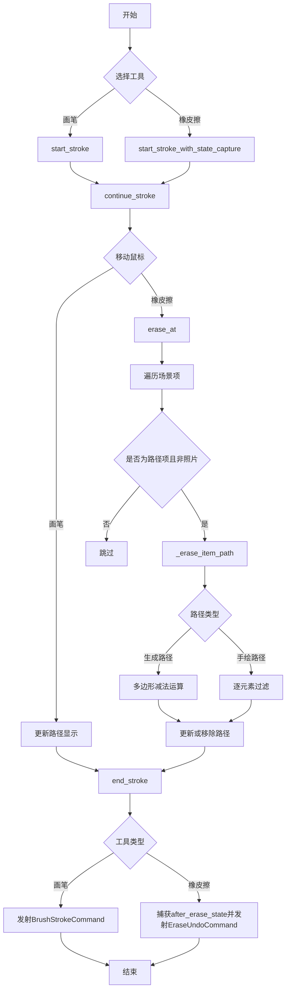

## 类结构

```
DrawingManager (绘图管理器核心类)
```

## 全局变量及字段


### `DrawingManager.viewer`
    
图形查看器引用

类型：`Viewer`
    


### `DrawingManager._scene`
    
Qt图形场景对象

类型：`QGraphicsScene`
    


### `DrawingManager.brush_color`
    
画笔颜色

类型：`QColor`
    


### `DrawingManager.brush_size`
    
画笔大小

类型：`int`
    


### `DrawingManager.eraser_size`
    
橡皮擦大小

类型：`int`
    


### `DrawingManager.brush_cursor`
    
画笔光标

类型：`QCursor`
    


### `DrawingManager.eraser_cursor`
    
橡皮擦光标

类型：`QCursor`
    


### `DrawingManager.current_path`
    
当前正在绘制的路径

类型：`QPainterPath`
    


### `DrawingManager.current_path_item`
    
当前路径的图形项

类型：`QGraphicsPathItem`
    


### `DrawingManager.before_erase_state`
    
橡皮擦操作前的状态列表

类型：`List`
    


### `DrawingManager.after_erase_state`
    
橡皮擦操作后的状态列表

类型：`List`
    
    

## 全局函数及方法


### `DrawingManager.__init__`

该方法是`DrawingManager`类的构造函数，用于初始化绘图管理器的核心状态。它接收一个图像查看器(`viewer`)对象作为参数，初始化画笔颜色、画笔大小、橡皮擦大小、光标、当前路径状态以及橡皮擦操作的前后状态快照等关键属性，为后续的绘图和擦除操作做好准备。

参数：

- `viewer`：对象，一个图像查看器实例，用于访问场景(_scene)和当前工具状态等信息

返回值：`None`，该方法为构造函数，不返回任何值

#### 流程图

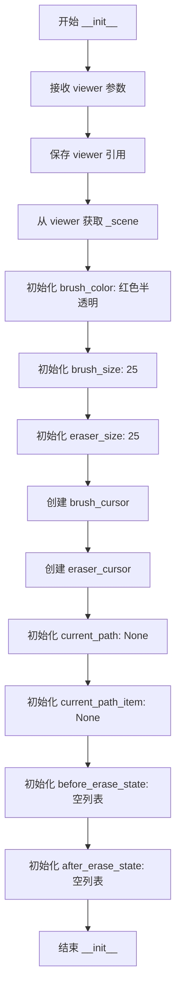

#### 带注释源码

```python
def __init__(self, viewer):
    """初始化 DrawingManager 实例。
    
    参数:
        viewer: 图像查看器对象，提供对场景和工具状态的访问
    """
    # 保存viewer引用，用于后续访问viewer的属性和方法
    self.viewer = viewer
    # 从viewer获取场景对象，用于添加/删除图形项
    self._scene = viewer._scene

    # 初始化画笔颜色：红色半透明 (RGBA: 255, 0, 0, 100)
    self.brush_color = QColor(255, 0, 0, 100)
    # 初始化画笔大小为25像素
    self.brush_size = 25
    # 初始化橡皮擦大小为25像素
    self.eraser_size = 25
    
    # 创建自定义画笔光标（红色半透明圆形）
    self.brush_cursor = self.create_inpaint_cursor('brush', self.brush_size)
    # 创建自定义橡皮擦光标（透明圆形带黑色边框）
    self.eraser_cursor = self.create_inpaint_cursor('eraser', self.eraser_size)

    # 当前绘制的路径对象（QPainterPath类型）
    self.current_path = None
    # 当前路径对应的图形项（QGraphicsPathItem类型）
    self.current_path_item = None
    
    # 橡皮擦操作前的状态快照列表，用于支持撤销功能
    self.before_erase_state = []
    # 橡皮擦操作后的状态快照列表，用于支持撤销功能
    self.after_erase_state = []
```


### `DrawingManager.start_stroke`

该方法用于在绘图场景中启动新的画笔或橡皮擦笔划，根据当前工具类型初始化绘图路径并记录橡皮擦操作的初始状态。

参数：

- `scene_pos`：`QPointF`，鼠标在场景中的位置坐标，用于确定笔划的起始点

返回值：`None`，该方法无返回值，主要通过修改对象状态和场景中的图形项来完成功能

#### 流程图

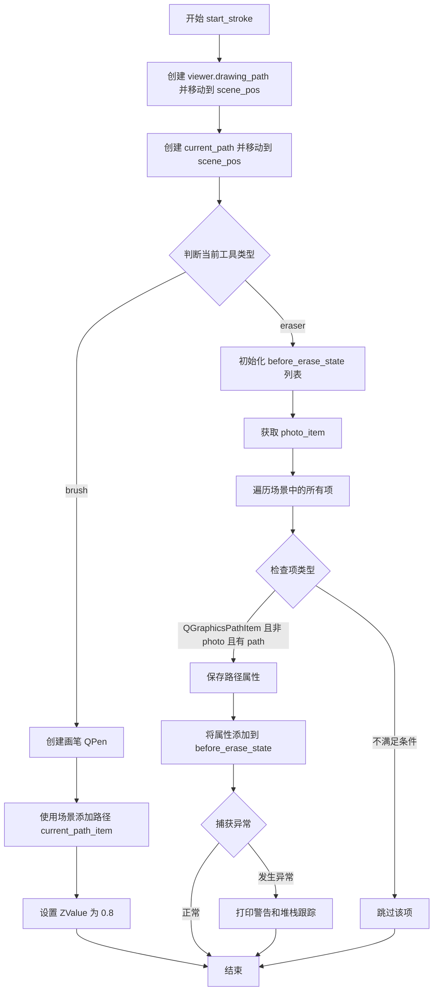

#### 带注释源码

```python
def start_stroke(self, scene_pos: QPointF):
    """Starts a new drawing or erasing stroke."""
    
    # 初始化 viewer 上的 drawing_path 并将笔触移动到指定位置
    self.viewer.drawing_path = QPainterPath() 
    self.viewer.drawing_path.moveTo(scene_pos)
    
    # 创建本地 current_path 用于管理当前笔划
    self.current_path = QPainterPath()
    self.current_path.moveTo(scene_pos)

    # 根据当前工具类型执行不同逻辑
    if self.viewer.current_tool == 'brush':
        # 创建画笔：设置颜色、大小、线型、端点样式和连接样式
        pen = QPen(self.brush_color, self.brush_size, 
                   Qt.SolidLine, Qt.RoundCap, Qt.RoundJoin)
        
        # 将路径添加到场景并获取图形项引用
        self.current_path_item = self._scene.addPath(self.current_path, pen)
        
        # 设置 Z 值确保笔划显示在照片之上（ZValue 0.8）
        self.current_path_item.setZValue(0.8)  
    
    # 处理橡皮擦工具的初始化逻辑
    elif self.viewer.current_tool == 'eraser':
        # 清空橡皮擦操作前的状态列表
        self.before_erase_state = []
        
        try:
            # 获取 viewer 中的照片项（可能为 None）
            photo_item = getattr(self.viewer, 'photo', None)
            
            # 遍历场景中的所有图形项
            for item in self._scene.items():
                # 筛选条件：
                # 1. 是 QGraphicsPathItem 类型
                # 2. 不是照片项（照片作为背景不应被擦除）
                # 3. 具有 path 方法（确保是可绘制路径）
                if (isinstance(item, QGraphicsPathItem) and 
                    item != photo_item and
                    hasattr(item, 'path')):
                    
                    # 使用命令基类保存路径属性（颜色、宽度等）
                    props = pcb.save_path_properties(item)
                    
                    # 只添加有效的属性字典
                    if props:
                        self.before_erase_state.append(props)
        except Exception as e:
            # 捕获并记录保存状态时的错误
            print(f"Warning: Error capturing before_erase_state: {e}")
            import traceback
            traceback.print_exc()
            # 确保异常情况下列表为空
            self.before_erase_state = []
```


### `DrawingManager.continue_stroke`

该方法用于在用户绘制或擦除时，根据鼠标当前位置继续更新当前的笔触路径。对于画笔工具，它直接将路径连接到新位置并更新图形项；对于擦除工具，它在当前位置执行擦除操作。

参数：

- `scene_pos`：`QPointF`，鼠标在场景中的当前位置，用于更新笔触路径

返回值：`None`，该方法仅执行副作用操作，不返回任何值

#### 流程图

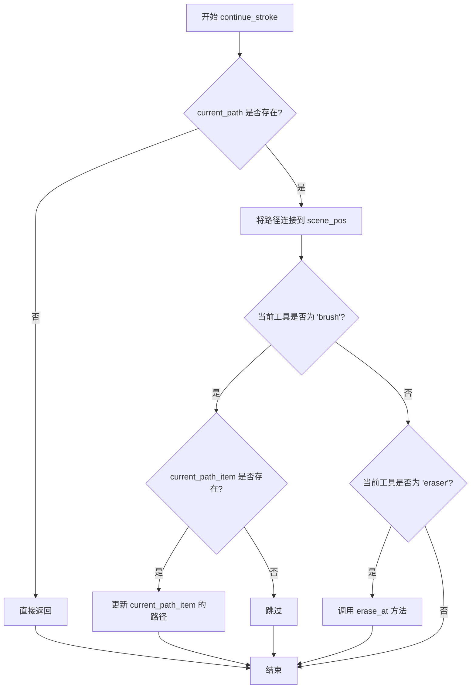

#### 带注释源码

```python
def continue_stroke(self, scene_pos: QPointF):
    """Continues an existing drawing or erasing stroke."""
    # 检查是否存在当前的路径，如果没有则直接返回，不进行任何操作
    if not self.current_path:
        return

    # 将当前路径连接到新的场景位置，形成连续的笔触
    self.current_path.lineTo(scene_pos)
    
    # 根据当前工具类型执行不同的处理逻辑
    if self.viewer.current_tool == 'brush' and self.current_path_item:
        # 对于画笔工具，直接更新图形项的路径以实时显示绘制效果
        self.current_path_item.setPath(self.current_path)
    elif self.viewer.current_tool == 'eraser':
        # 对于擦除工具，在当前位置执行擦除操作
        self.erase_at(scene_pos)
```


### `DrawingManager.end_stroke`

该方法用于结束当前的绘制或擦除笔触，根据当前工具类型（画笔或橡皮擦）创建对应的撤销命令，并将相关状态重置。

参数： （无参数）

返回值：`None`，该方法直接修改对象内部状态并通过信号机制发送命令，不返回任何值。

#### 流程图

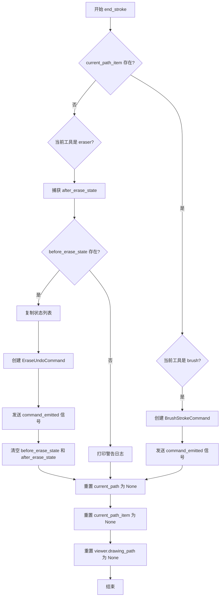

#### 带注释源码

```python
def end_stroke(self):
    """Finalizes the current stroke and creates an undo command."""
    # 检查当前是否有路径项存在
    if self.current_path_item:
        # 如果当前工具是画笔，则创建画笔笔触命令
        if self.viewer.current_tool == 'brush':
            # 创建 BrushStrokeCommand，传入 viewer 和当前路径项
            command = BrushStrokeCommand(self.viewer, self.current_path_item)
            # 发送命令信号，供命令栈处理撤销/重做
            self.viewer.command_emitted.emit(command)

    # 如果当前工具是橡皮擦
    if self.viewer.current_tool == 'eraser':
        # 捕获擦除操作后的当前状态
        self.after_erase_state = []
        try:
            # 获取照片项（用于排除）
            photo_item = getattr(self.viewer, 'photo', None)
            # 遍历场景中的所有图形路径项
            for item in self._scene.items():
                # 筛选有效的路径项：排除照片项且具有 path 方法
                if (isinstance(item, QGraphicsPathItem) and 
                    item != photo_item and
                    hasattr(item, 'path')):  # Ensure item has path method
                    # 保存路径属性（颜色、宽度等）
                    props = pcb.save_path_properties(item)
                    if props:  # Only add valid properties
                        self.after_erase_state.append(props)
        except Exception as e:
            print(f"Warning: Error capturing after_erase_state: {e}")
            import traceback
            traceback.print_exc()
            self.after_erase_state = []
        
        # 仅在有有效的擦除前后状态时创建撤销命令
        if hasattr(self, 'before_erase_state'):
            # 创建列表副本，避免传递后被清空导致的问题
            before_copy = list(self.before_erase_state)
            after_copy = list(self.after_erase_state)
            # 创建擦除撤销命令，传入viewer和前后状态
            command = EraseUndoCommand(self.viewer, before_copy, after_copy)
            # 发送命令信号
            self.viewer.command_emitted.emit(command)
            # 清空状态列表，为下一次擦除操作做准备
            self.before_erase_state.clear()
            self.after_erase_state.clear()
        else:
            print("Warning: No before_erase_state found, skipping undo command creation")
    
    # 重置所有与当前笔触相关的状态
    self.current_path = None
    self.current_path_item = None
    self.viewer.drawing_path = None
```


### `DrawingManager.erase_at`

在指定位置创建一个椭圆形的擦除区域，遍历该区域内的所有路径项（排除照片项），并对每个路径项调用内部擦除方法进行擦除处理。

参数：

- `pos`：`QPointF`，鼠标在场景中的当前位置，作为擦除操作的中心点

返回值：`None`，该方法无返回值，直接修改场景中的路径项

#### 流程图

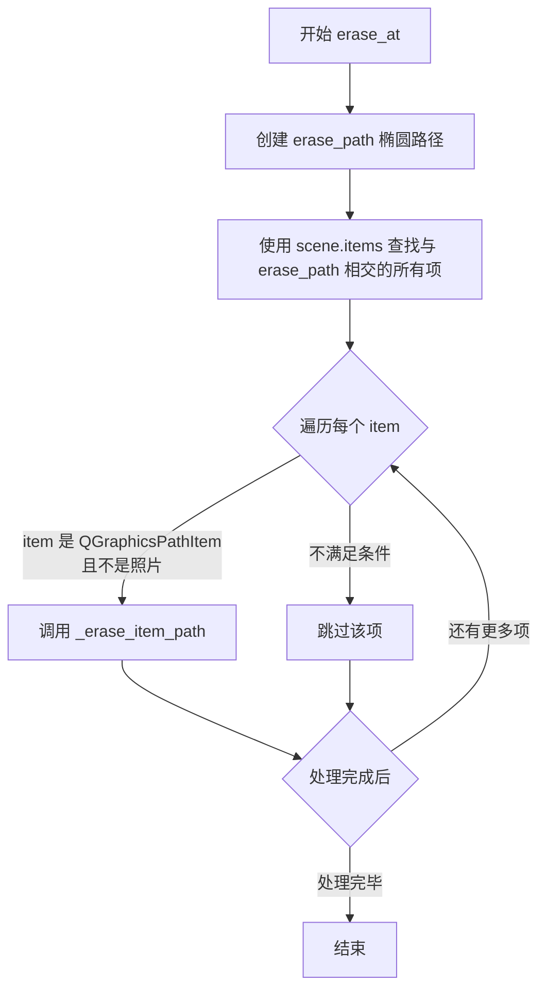

#### 带注释源码

```python
def erase_at(self, pos: QPointF):
    """在指定位置执行擦除操作
    
    Args:
        pos: QPointF，擦除操作的中心点位置（场景坐标）
    """
    # 1. 创建以 pos 为中心、eraser_size 为半径的椭圆擦除路径
    erase_path = QPainterPath()
    erase_path.addEllipse(pos, self.eraser_size, self.eraser_size)

    # 2. 获取场景中与擦除路径相交的所有图形项
    for item in self._scene.items(erase_path):
        # 3. 过滤条件：只处理 QGraphicsPathItem 且不是照片项
        if isinstance(item, QGraphicsPathItem) and item != self.viewer.photo:
            # 4. 调用内部方法对路径进行具体的擦除处理
            self._erase_item_path(item, erase_path, pos)
```


### `DrawingManager._erase_item_path`

该方法执行实际的路径擦除操作，根据路径类型（生成的填充分割路径或人工绘制的笔划）采用不同的擦除策略：对于填充的分割路径使用布尔减法运算，对于人工笔划则逐点检测并移除被擦除区域覆盖的路径元素。

参数：

- `item`：`QGraphicsPathItem`，要擦除的图形路径项
- `erase_path`：`QPainterPath`，擦除区域的路径（通常为椭圆/圆形）
- `pos`：`QPointF`，擦除操作的位置点

返回值：`None`，无返回值（直接修改传入的 item 或从场景中移除）

#### 流程图

```mermaid
flowchart TD
    A[开始 _erase_item_path] --> B[获取item的原始路径]
    B --> C[创建新路径 new_path]
    C --> D[获取item的笔刷颜色]
    D --> E{颜色是否为 #80ff0000<br/>（生成的分割路径）?}
    
    E -->|是| F[将erase_path映射到item局部坐标]
    F --> G[设置填充规则为WindingFill]
    G --> H[执行路径减法: path.subtracted<br/>local_erase_path]
    H --> I{结果不为空?}
    
    E -->|否| J[遍历路径的每个元素]
    J --> K{元素点在erase_path内?}
    K -->|是| L[跳过该点,检查下一个元素]
    K -->|否| M[将点添加到new_path]
    M --> N{处理CurveToElement?}
    N -->|是| O[检查控制点是否也在擦除区域内]
    O --> P{控制点不在区域内?}
    P -->|是| Q[添加立方体曲线cubicTo]
    P -->|否| R[跳过该曲线元素]
    N -->|否| L
    L --> S{还有更多元素?}
    S -->|是| K
    S -->|否| T
    
    I -->|是| U[new_path = result]
    I -->|否| V[新路径为空]
    
    T --> V
    
    U --> W{new_path.isEmpty?}
    V --> W
    
    W -->|是| X[从场景移除item]
    W -->|否| Y[item.setPath(new_path)]
    
    X --> Z[结束]
    Y --> Z
```

#### 带注释源码

```python
def _erase_item_path(self, item, erase_path, pos):
    """
    擦除路径项目中的特定区域。
    
    参数:
        item: QGraphicsPathItem - 要擦除的图形路径项
        erase_path: QPainterPath - 擦除区域的路径（椭圆/圆形）
        pos: QPointF - 擦除位置
    """
    # 获取要修改的原始路径
    path = item.path()
    
    # 创建新的空路径用于存储擦除后的结果
    new_path = QPainterPath()
    
    # 获取项目的笔刷颜色（用于判断路径类型）
    brush_color = QColor(item.brush().color().name(QColor.HexArgb))
    
    # 判断是否为生成的填充分割路径
    if brush_color == "#80ff0000":  # Generated (filled) segmentation path
        # 将擦除形状映射到item的局部坐标，确保布尔运算的鲁棒性
        try:
            local_erase_path = item.mapFromScene(erase_path)
        except Exception:
            # 回退方案：如果映射不可用，则通过平移转换
            local_erase_path = QPainterPath(erase_path)
            local_erase_path.translate(-item.pos().x(), -item.pos().y())

        # 设置一致的填充规则，确保填充多边形减法的正确性
        path.setFillRule(Qt.FillRule.WindingFill)
        local_erase_path.setFillRule(Qt.FillRule.WindingFill)

        # 执行路径减法运算（布尔减法）
        result = path.subtracted(local_erase_path)
        if not result.isEmpty():
            new_path = result
    else: 
        # 人工绘制的笔划：逐点检测并移除被擦除覆盖的元素
        element_count = path.elementCount()
        i = 0
        while i < element_count:
            # 获取当前路径元素
            e = path.elementAt(i)
            point = QPointF(e.x, e.y)
            
            # 如果该点不在擦除区域内，则保留
            if not erase_path.contains(point):
                # 根据元素类型构建新路径
                if e.type == QPainterPath.ElementType.MoveToElement: 
                    new_path.moveTo(point)
                elif e.type == QPainterPath.ElementType.LineToElement: 
                    new_path.lineTo(point)
                elif e.type == QPainterPath.ElementType.CurveToElement:
                    # 曲线元素需要处理两个控制点
                    if i + 2 < element_count:
                        c1, c2 = path.elementAt(i + 1), path.elementAt(i + 2)
                        c1_p, c2_p = QPointF(c1.x, c1.y), QPointF(c2.x, c2.y)
                        # 仅当控制点也不在擦除区域内时才保留曲线
                        if not (erase_path.contains(c1_p) or erase_path.contains(c2_p)):
                            new_path.cubicTo(point, c1_p, c2_p)
                    i += 2  # 曲线元素占用3个索引位置
            else:
                # 该点在擦除区域内，检查下一个元素作为新的起点
                if (i + 1) < element_count:
                    next_e = path.elementAt(i + 1)
                    next_p = QPointF(next_e.x, next_e.y)
                    if not erase_path.contains(next_p):
                        new_path.moveTo(next_p)
                        # 如果下一个是曲线数据元素，跳过其控制点
                        if next_e.type == QPainterPath.ElementType.CurveToDataElement:
                            i += 2
            i += 1

    # 根据处理结果更新或移除item
    if new_path.isEmpty():
        # 新路径为空，完全移除该item
        self._scene.removeItem(item)
    else:
        # 更新item的路径为擦除后的新路径
        item.setPath(new_path)
```


### `DrawingManager.set_brush_size`

该方法用于设置绘图工具的笔刷大小，同时根据传入的缩放后的大小更新对应的光标显示。

参数：

- `size`：`int`，原始的笔刷大小值，直接赋值给实例属性 `brush_size`
- `scaled_size`：`int`，经过缩放处理后的笔刷大小，用于创建对应的光标对象

返回值：`None`，该方法为 void 方法，不返回任何值

#### 流程图

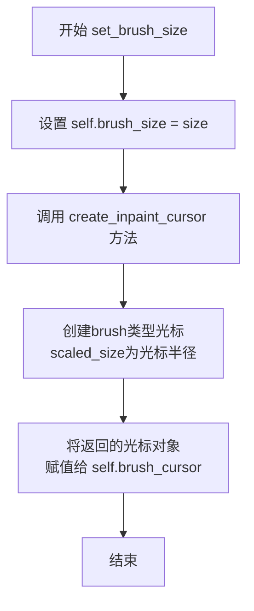

#### 带注释源码

```python
def set_brush_size(self, size, scaled_size):
    """
    设置笔刷大小并更新对应的光标。
    
    Args:
        size: 原始笔刷大小，用于内部状态管理
        scaled_size: 缩放后的笔刷大小，用于光标可视化
    """
    # 更新内部存储的笔刷大小值
    self.brush_size = size
    
    # 创建新的笔刷光标（基于缩放后的大小）
    # create_inpaint_cursor 方法会根据 cursor_type 和 size 生成对应的 QCursor 对象
    self.brush_cursor = self.create_inpaint_cursor("brush", scaled_size)
```


### `DrawingManager.set_eraser_size`

该方法用于设置橡皮擦工具的大小，同时根据缩放后的尺寸重新创建对应的橡皮擦光标，以确保在不同缩放级别下光标大小与实际橡皮擦尺寸保持一致。

参数：

- `size`：`int`，橡皮擦的基础大小，用于内部状态记录
- `scaled_size`：`int`，经过缩放计算后的橡皮擦大小，用于光标可视化

返回值：`None`，该方法仅更新对象内部状态，不返回任何值

#### 流程图

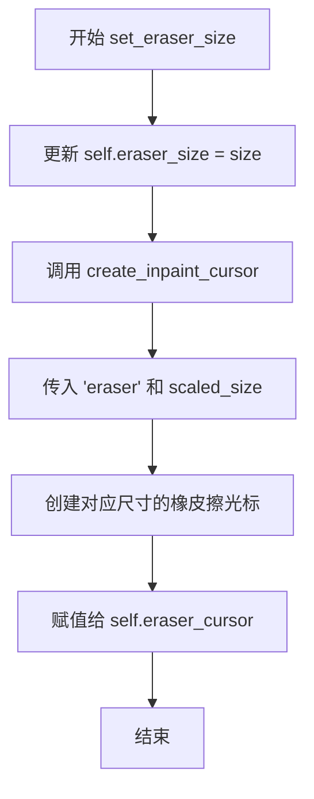

#### 带注释源码

```python
def set_eraser_size(self, size, scaled_size):
    """
    设置橡皮擦工具的大小。
    
    该方法同时更新橡皮擦的内部尺寸和对应的光标显示。
    需要传入两个尺寸参数：原始尺寸用于内部状态管理，
    缩放尺寸用于在当前视图缩放比例下正确显示光标。
    
    参数:
        size: 橡皮擦的基础大小，用于记录当前橡皮擦的实际尺寸
        scaled_size: 经过视图缩放计算后的尺寸，用于创建匹配当前视图的光标
    """
    # 更新橡皮擦的基础大小属性，用于后续绘图操作中的擦除半径计算
    self.eraser_size = size
    
    # 根据缩放后的尺寸重新创建橡皮擦光标
    # create_inpaint_cursor 会生成一个椭圆形的透明光标
    # 传入 'eraser' 参数指定创建橡皮擦样式的光标
    self.eraser_cursor = self.create_inpaint_cursor("eraser", scaled_size)
```


### `DrawingManager.create_inpaint_cursor`

该方法用于创建自定义的绘图光标（QCursor），根据传入的光标类型（画笔或橡皮擦）和尺寸，生成对应的圆形光标图像，用于在画布上显示当前的绘图工具状态。

参数：

- `self`：隐式参数，DrawingManager 实例的引用
- `cursor_type`：`str`，表示要创建的光标类型，可选值为 "brush"（画笔）或 "eraser"（橡皮擦）
- `size`：`int`，光标的直径尺寸（像素）

返回值：`QCursor`，返回创建完成的自定义 Qt 光标对象，热点位于光标中心

#### 流程图

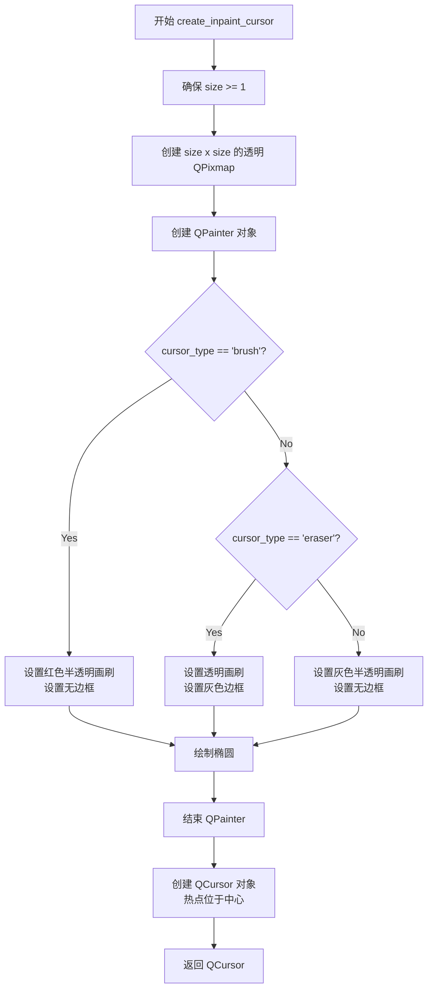

#### 带注释源码

```python
def create_inpaint_cursor(self, cursor_type, size):
    """创建自定义绘图光标
    
    参数:
        cursor_type: 光标类型，"brush" 或 "eraser"
        size: 光标尺寸（直径）
    
    返回:
        QCursor: 定制化的光标对象
    """
    # 确保尺寸至少为1，防止创建无效的光标
    size = max(1, size)
    
    # 创建一个正方形透明位图作为光标基础
    pixmap = QPixmap(size, size)
    pixmap.fill(Qt.transparent)  # 填充透明背景
    
    # 创建绘图器用于在 pixmap 上绘制图形
    painter = QPainter(pixmap)
    
    # 根据光标类型设置不同的样式
    if cursor_type == "brush":
        # 画笔光标：红色半透明圆形填充，无边框
        painter.setBrush(QBrush(QColor(255, 0, 0, 127)))  # RGBA: 红色半透明
        painter.setPen(Qt.PenStyle.NoPen)  # 无边框
    elif cursor_type == "eraser":
        # 橡皮擦光标：透明填充，灰色边框（轮廓）
        painter.setBrush(QBrush(QColor(0, 0, 0, 0)))  # 完全透明
        painter.setPen(QColor(0, 0, 0, 127))  # 灰色半透明边框
    else:
        # 默认光标：灰色半透明填充，无边框
        painter.setBrush(QBrush(QColor(0, 0, 0, 127)))
        painter.setPen(Qt.PenStyle.NoPen)
    
    # 绘制圆形光标轮廓
    # 使用 size-1 确保边缘在像素边界内，避免抗锯齿模糊
    painter.drawEllipse(0, 0, (size - 1), (size - 1))
    
    # 结束绘图，释放资源
    painter.end()
    
    # 创建 QCursor 对象，热点（点击点）位于光标中心
    # size // 2 计算中心点坐标
    return QCursor(pixmap, size // 2, size // 2)
```


### `DrawingManager.save_brush_strokes`

该方法负责将当前绘图场景中所有可见的笔触（Brush Strokes）和橡皮擦痕迹序列化为字典列表。它遍历场景中的图形项，筛选出非背景照片的路径项，并提取其路径数据、颜色及线宽信息，以便用于保存或传输绘图状态。

参数：  
无（仅包含实例属性 `self`）

返回值：`List[Dict]`，返回一个包含多个字典的列表。每个字典代表一个笔触，键值对包括：
- `'path'`：笔触的路径对象 (`QPainterPath`)
- `'pen'`：画笔颜色的十六进制字符串 (`str`)
- `'brush'`：笔刷颜色的十六进制字符串 (`str`)
- `'width'`：线条宽度 (`int`)

#### 流程图

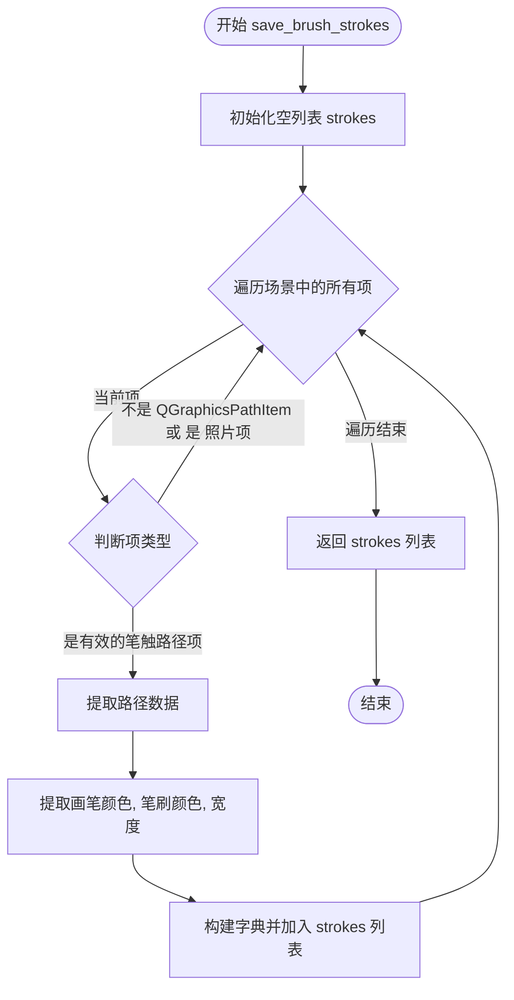

#### 带注释源码

```python
def save_brush_strokes(self) -> List[Dict]:
    """
    保存当前的笔触状态。
    遍历场景，收集所有自定义绘制的路径项（排除背景照片）。
    """
    strokes = []
    
    # 遍历场景中的所有项
    for item in self._scene.items():
        # 检查该 item 是否为路径图形项，且不是用于显示照片的 item
        if isinstance(item, QGraphicsPathItem) and item != self.viewer.photo:
            # 提取该笔触的路径对象
            path = item.path()
            
            # 获取画笔和笔刷的颜色，并转换为十六进制 ARGB 字符串
            # item.pen().color().name(QColor.HexArgb) 确保获取透明度信息
            pen_color = item.pen().color().name(QColor.HexArgb)
            brush_color = item.brush().color().name(QColor.HexArgb)
            
            # 获取线条宽度
            width = item.pen().width()
            
            # 将该笔触的属性组装为字典
            strokes.append({
                'path': path,
                'pen': pen_color,
                'brush': brush_color,
                'width': width
            })
            
    return strokes
```


### `DrawingManager.load_brush_strokes`

该方法用于从保存的笔触数据中重新加载并绘制笔触到场景中，支持页面切换时的笔触恢复功能。

参数：

- `strokes`：`List[Dict]`，笔触数据列表，每个字典包含路径、画笔颜色、画刷颜色和宽度信息

返回值：`None`，无返回值

#### 流程图

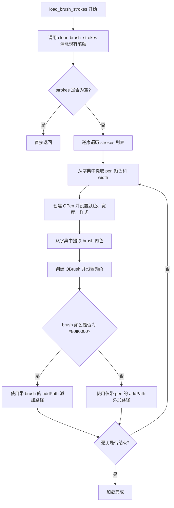

#### 带注释源码

```python
def load_brush_strokes(self, strokes: List[Dict]):
    """从笔触数据列表加载并恢复笔触到场景中
    
    参数:
        strokes: 笔触数据字典列表，每个字典包含:
            - 'path': QPainterPath 对象
            - 'pen': 画笔颜色的十六进制字符串 (如 "#80ff0000")
            - 'brush': 画刷颜色的十六进制字符串
            - 'width': 画笔宽度
    
    返回:
        None
    """
    # 首先清除当前场景中的所有笔触，page_switch=True 表示不创建撤销命令
    self.clear_brush_strokes(page_switch=True)
    
    # 逆序遍历笔触数据，确保按照原始顺序恢复（后进先出）
    for stroke in reversed(strokes):
        # 创建画笔对象
        pen = QPen()
        # 设置画笔颜色
        pen.setColor(QColor(stroke['pen']))
        # 设置画笔宽度
        pen.setWidth(stroke['width'])
        # 设置画笔样式为实线
        pen.setStyle(Qt.SolidLine)
        # 设置线帽样式为圆头
        pen.setCapStyle(Qt.RoundCap)
        # 设置连接样式为圆角
        pen.setJoinStyle(Qt.RoundJoin)
        
        # 创建画刷对象
        brush = QBrush(QColor(stroke['brush']))
        
        # 判断是否为生成的分割路径（通过特定颜色判断）
        # #80ff0000 表示半透明红色，这是生成的分段路径的标识颜色
        if brush.color() == QColor("#80ff0000"):
            # 带填充的路径（生成的分割区域）
            self._scene.addPath(stroke['path'], pen, brush)
        else:
            # 无填充的路径（人工绘制的笔触）
            self._scene.addPath(stroke['path'], pen)
```


### `DrawingManager.clear_brush_strokes`

清除场景中的画笔笔触，根据 `page_switch` 参数决定是直接移除图形项还是通过命令方式清除（支持撤销）。

参数：

- `self`：`DrawingManager`，隐式参数，方法所属的类实例
- `page_switch`：`bool`，标志位，为 `True` 时表示在页面切换场景下直接移除笔触图形项；为 `False` 时通过发送撤销命令清除笔触

返回值：`None`，该方法无返回值

#### 流程图

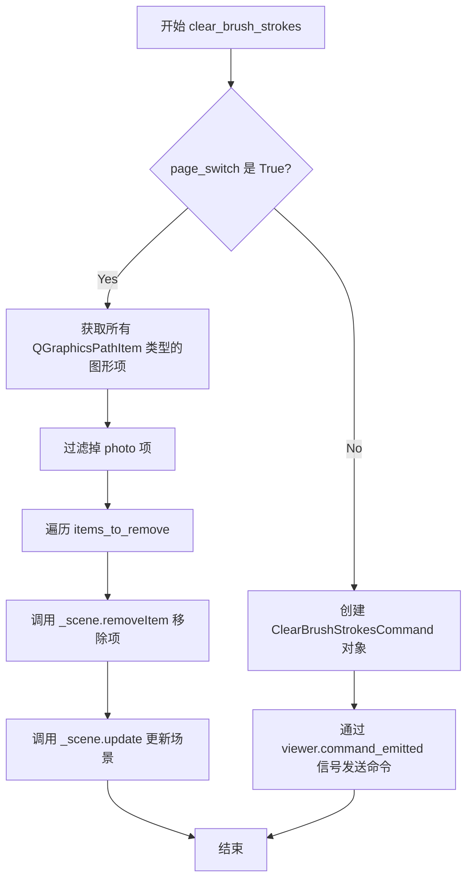

#### 带注释源码

```python
def clear_brush_strokes(self, page_switch=False):
    """清除场景中的画笔笔触。
    
    Args:
        page_switch: bool, 标志位。为 True 时直接移除图形项（用于页面切换场景）；
                     为 False 时通过命令方式清除（支持撤销操作）。
    """
    # 分支处理：page_switch 为 True 时直接移除图形项
    if page_switch:      
        # 列表推导式过滤出需要移除的图形项：所有 QGraphicsPathItem 且非 photo 项
        items_to_remove = [item for item in self._scene.items()
                           if isinstance(item, QGraphicsPathItem) and item != self.viewer.photo]
        # 遍历逐个从场景中移除
        for item in items_to_remove:
            self._scene.removeItem(item)
        # 强制更新场景重绘
        self._scene.update()
    else:
        # page_switch 为 False 时，通过命令模式发送清除指令（支持撤销）
        command = ClearBrushStrokesCommand(self.viewer)
        # 发射信号，由上层处理命令的执行与撤销堆栈管理
        self.viewer.command_emitted.emit(command)
```


### `DrawingManager.has_drawn_elements`

检查场景中是否存在用户绘制的元素（路径项目），用于判断是否有可处理的笔触。

参数：无

返回值：`bool`，如果场景中存在除照片以外的 `QGraphicsPathItem`（绘制的笔触），返回 `True`；否则返回 `False`

#### 流程图

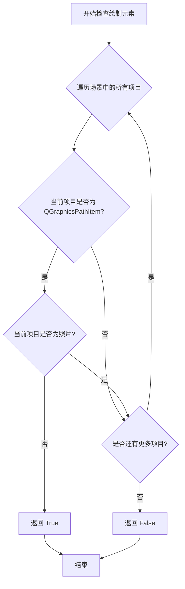

#### 带注释源码

```python
def has_drawn_elements(self):
    """
    检查场景中是否存在用户绘制的元素。
    
    遍历场景中的所有图形项目，判断是否存在除了照片以外的 QGraphicsPathItem。
    通常用于判断是否可以生成掩码或执行某些需要笔触的操作。
    
    Returns:
        bool: 如果存在绘制的元素返回 True，否则返回 False
    """
    # 遍历场景中的所有项目
    for item in self._scene.items():
        # 检查项目是否为 QGraphicsPathItem 类型
        if isinstance(item, QGraphicsPathItem) and item != self.viewer.photo:
            # 找到绘制的元素（不是照片），返回 True
            return True
    # 遍历完所有项目未找到绘制元素，返回 False
    return False
```


### `DrawingManager.generate_mask_from_strokes`

该方法负责从当前场景中的所有绘图笔触（Brush Strokes）生成一个用于图像修复（Inpainting）或分割的二进制掩码（Mask）。它区分了人工绘制的笔触和自动生成的分割路径（Segmentations），分别进行绘制、膨胀（Dilation）处理，最终合并为一个统一的掩码。在处理过程中，它还特别考虑了“Webtoon模式”下的坐标变换，以确保掩码与可视区域对齐。

参数：

-  `self`：`DrawingManager`，当前管理实例的引用。

返回值：`np.ndarray | None`，返回合并并膨胀后的 `uint8` 类型二值掩码（0或255）。如果 viewer 没有照片或场景中没有笔触，则返回 `None`。

#### 流程图

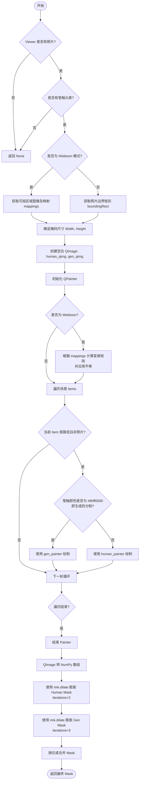

#### 带注释源码

```python
def generate_mask_from_strokes(self):
    # 1. 前置检查：确保视图中有照片
    if not self.viewer.hasPhoto(): 
        return None
    
    # 2. 检查是否有任何笔触需要处理
    if not self.has_drawn_elements():
        return None

    # 3. 处理不同模式下的图像尺寸
    # Webtoon 模式通常用于长图卷轴模式，尺寸基于可见区域
    is_webtoon_mode = self.viewer.webtoon_mode
    if is_webtoon_mode:
        # 在 Webtoon 模式下，使用可见区域图像的尺寸
        visible_image, mappings = self.viewer.get_visible_area_image()
        if visible_image is None:
            return None
        height, width = visible_image.shape[:2]
    else:
        # 普通模式下，直接使用照片项的尺寸
        image_rect = self.viewer.photo.boundingRect()
        width, height = int(image_rect.width()), int(image_rect.height())
    
    # 4. 尺寸有效性校验
    if width <= 0 or height <= 0:
        return None
    
    # 5. 初始化用于绘制掩码的 QImage (灰度图)
    # human_qimg: 存放人工绘制的笔触
    # gen_qimg: 存放模型生成的分割路径
    human_qimg = QImage(width, height, QImage.Format_Grayscale8)
    gen_qimg = QImage(width, height, QImage.Format_Grayscale8)
    human_qimg.fill(0)
    gen_qimg.fill(0)

    human_painter, gen_painter = QPainter(human_qimg), QPainter(gen_qimg)
    
    # 用于调试日志的变换值初始化
    visible_scene_top = 0
    visible_scene_left = 0
    
    # 6. 坐标变换处理 (关键逻辑：处理 Webtoon 的坐标偏移)
    if is_webtoon_mode:
        # 再次获取映射数据以进行坐标转换计算
        visible_image, mappings = self.viewer.get_visible_area_image()
        if mappings:
            # 获取可见区域在场景坐标中的起始点 (通常 Y 轴变化)
            visible_scene_top = mappings[0]['scene_y_start']
            visible_scene_left = 0  # 假设 Webtoon 宽度从 0 开始
            
            # 执行坐标变换：将场景坐标映射到可视区域图像坐标
            # 这里使用负向平移来抵消 Scene 坐标，使绘制落在正确的图像位置
            human_painter.translate(-visible_scene_left, -visible_scene_top)
            gen_painter.translate(-visible_scene_left, -visible_scene_top)
        else:
            print(f"[DEBUG] No mappings available, using direct scene coordinates")
    
    # 7. 设置画笔和画刷属性
    # 人工笔触使用较大的笔刷宽度 (self.brush_size)
    human_pen = QPen(QColor(255, 255, 255), self.brush_size)
    # 生成的路径通常较细
    gen_pen = QPen(QColor(255, 255, 255), 2, Qt.SolidLine)
    human_painter.setPen(human_pen)
    gen_painter.setPen(gen_pen)
    brush = QBrush(QColor(255, 255, 255))
    human_painter.setBrush(brush)
    gen_painter.setBrush(brush)

    # 8. 遍历场景中的所有图形项并绘制
    for item in self._scene.items():
        # 筛选出路径项且排除照片本身
        if isinstance(item, QGraphicsPathItem) and item != self.viewer.photo:
            # 根据笔触颜色判断类型：#80ff0000 是生成的分割结果，其他颜色是人工笔触
            is_generated = QColor(item.brush().color().name(QColor.HexArgb)) == "#80ff0000"
            painter = gen_painter if is_generated else human_painter
            
            # 获取笔触在场景中的位置
            item_pos = item.pos()
            
            # 保存绘图状态 -> 平移 -> 绘制路径 -> 恢复状态
            # 因为路径是相对于 Item 自身的，所以我们需要先移动 Painter 到 Item 的位置
            painter.save()
            painter.translate(item_pos)
            painter.drawPath(item.path())
            painter.restore()
    
    # 9. 结束绘图，释放资源
    human_painter.end()
    gen_painter.end()
    
    # 10. 定义 QImage 转 NumPy 数组的辅助函数
    def qimage_to_np(qimg):
        if qimg.width() <= 0 or qimg.height() <= 0:
            return np.zeros((max(1, qimg.height()), max(1, qimg.width())), dtype=np.uint8)
        
        # 将 QImage 内存指针转换为 NumPy 数组
        ptr = qimg.constBits()
        # 注意：bytesPerLine 可能大于 width，需要切片
        arr = np.array(ptr).reshape(qimg.height(), qimg.bytesPerLine())
        return arr[:, :qimg.width()]
        
    # 11. 转换为 NumPy 数组
    human_mask = qimage_to_np(human_qimg)
    gen_mask = qimage_to_np(gen_qimg)

    # 12. 膨胀操作 (使用 imkit 库)
    # 人工笔触膨胀较少，生成的分隔膨胀较多以保证覆盖
    kernel = np.ones((5,5), np.uint8)
    human_mask = imk.dilate(human_mask, kernel, iterations=2)
    gen_mask = imk.dilate(gen_mask, kernel, iterations=3)

    # 13. 合并掩码 (逻辑或操作)
    final_mask = np.where((human_mask > 0) | (gen_mask > 0), 255, 0).astype(np.uint8)
    return final_mask
```


### `DrawingManager.draw_segmentation_lines`

该方法接收一组边界框（bboxes），通过`make_segmentation_stroke_data`将边界框转换为合并的笔触路径数据，然后创建`QGraphicsPathItem`并使用`SegmentBoxesCommand`命令将其添加到场景中，实现分割线的绘制。

参数：

- `bboxes`：`List[Tuple[float, float, float, float]]`，边界框列表，每个边界框包含四个坐标值 (x1, y1, x2, y2)

返回值：`None`，该方法无返回值（隐式返回None）

#### 流程图

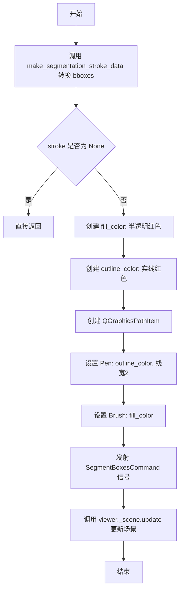

#### 带注释源码

```python
def draw_segmentation_lines(self, bboxes):
    """
    将边界框列表转换为分割线并绘制到场景中。
    
    参数:
        bboxes: 边界框列表，每个元素为 (x1, y1, x2, y2) 格式的元组
    """
    # 调用 make_segmentation_stroke_data 将 bboxes 转换为笔触数据
    # 该方法内部会进行ROI计算、下采样、形态学闭运算、轮廓提取等处理
    stroke = self.make_segmentation_stroke_data(bboxes)
    
    # 如果 stroke 为 None（无有效边界框或轮廓），直接返回
    if stroke is None:
        return

    # ========== 创建图形项 ==========
    
    # 定义填充颜色: 半透明红色 (RGBA: 255, 0, 0, 128)
    fill_color = QtGui.QColor(255, 0, 0, 128)
    
    # 定义轮廓颜色: 实线红色
    outline_color = QtGui.QColor(255, 0, 0)
    
    # 使用转换后的路径创建 QGraphicsPathItem
    item = QtWidgets.QGraphicsPathItem(stroke['path'])
    
    # 设置轮廓笔: 红色, 线宽2, 实线
    item.setPen(QtGui.QPen(outline_color, 2, QtCore.Qt.SolidLine))
    
    # 设置填充笔刷: 半透明红色
    item.setBrush(QtGui.QBrush(fill_color))

    # ========== 发送命令到命令系统 ==========
    
    # 创建 SegmentBoxesCommand 命令，传入 viewer 和图形项列表
    # 该命令会被添加到命令栈中，支持撤销/重做
    self.viewer.command_emitted.emit(SegmentBoxesCommand(self.viewer, [item]))
    
    # 确保场景更新，使新绘制的分割线可见
    self.viewer._scene.update()
```


### `DrawingManager.make_segmentation_stroke_data`

该方法接收一组边界框（bboxes），通过图像处理技术（形态学闭运算、轮廓提取）将离散的矩形区域合并转换为Qt的QPainterPath对象，生成一个连续的分割线路径数据，供后续渲染和命令执行使用。

参数：

- `bboxes`：`List[Tuple[float, float, float, float]]`，边界框列表，每个元素为(x1, y1, x2, y2)格式的浮点数元组，表示矩形的左上角和右下角坐标

返回值：`Optional[Dict]`，包含路径、画笔颜色、画刷颜色和线宽的字典；若bboxes为空或处理后无有效轮廓则返回None

#### 流程图

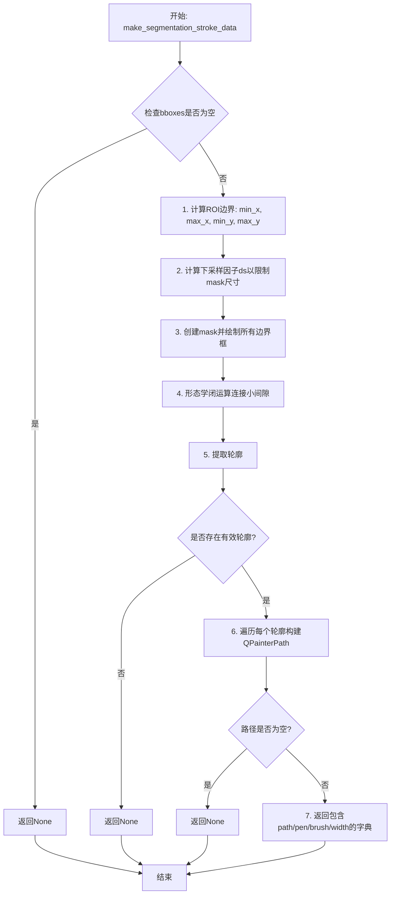

#### 带注释源码

```
def make_segmentation_stroke_data(self, bboxes):
    # 边界框有效性检查，若为空直接返回
    if not bboxes:
        return None

    # 1) 计算紧凑的ROI（感兴趣区域），使mask保持较小尺寸
    # 提取所有边界框的x坐标
    xs = [x for x1, _, x2, _ in bboxes for x in (x1, x2)]
    # 提取所有边界框的y坐标
    ys = [y for _, y1, _, y2 in bboxes for y in (y1, y2)]
    # 计算ROI的边界整数坐标
    min_x, max_x = int(min(xs)), int(max(xs))
    min_y, max_y = int(min(ys)), int(max(ys))
    # 计算ROI的宽和高（加1确保包含边界像素）
    w, h = max_x - min_x + 1, max_y - min_y + 1

    # 2) 计算下采样因子以限制mask最大边长为2048像素
    long_edge = 2048
    ds = max(1.0, max(w, h) / long_edge)
    # 计算下采样后的mask尺寸（加2为保留边界缓冲）
    mw, mh = int(w / ds) + 2, int(h / ds) + 2

    # 3) 在下采样mask上绘制所有边界框（填充白色255）
    mask = np.zeros((mh, mw), np.uint8)
    for x1, y1, x2, y2 in bboxes:
        # 将原始坐标映射到下采样后的mask坐标空间
        x1i = int((x1 - min_x) / ds)
        y1i = int((y1 - min_y) / ds)
        x2i = int((x2 - min_x) / ds)
        y2i = int((y2 - min_y) / ds)
        # 使用imkit库绘制填充矩形
        mask = imk.rectangle(mask, (x1i, y1i), (x2i, y2i), 255, -1)

    # 4) 形态学闭运算：先膨胀后腐蚀，用于连接小的间隙和凹坑
    ksize = 15
    kernel = imk.get_structuring_element(imk.MORPH_RECT, (ksize, ksize))
    mask_closed = imk.morphology_ex(mask, imk.MORPH_CLOSE, kernel)

    # 5) 从闭运算后的mask中提取轮廓
    contours, _ = imk.find_contours(mask_closed)
    if not contours:
        return None

    # 6) 构建合并后的轮廓路径
    path = QtGui.QPainterPath()
    path.setFillRule(Qt.FillRule.WindingFill)  # 设置填充规则为WindingFill以正确处理复杂形状
    for cnt in contours:
        pts = cnt.squeeze(1)
        # 跳过无效轮廓（维度不对或点数不足）
        if pts.ndim != 2 or pts.shape[0] < 3:
            continue
        # 移动到第一个点（下采样坐标转换回原始坐标）
        x0, y0 = pts[0]
        path.moveTo(x0 * ds + min_x, y0 * ds + min_y)
        # 依次连接后续点
        for x, y in pts[1:]:
            path.lineTo(x * ds + min_x, y * ds + min_y)
        # 封闭当前轮廓
        path.closeSubpath()

    # 检查最终路径是否为空
    if path.isEmpty():
        return None

    # 7) 返回包含路径及渲染属性的字典
    return {
        'path': path,
        'pen': QColor(255, 0, 0).name(QColor.HexArgb),           # 纯红色轮廓
        'brush': QColor(255, 0, 0, 128).name(QColor.HexArgb),    # 半透明红色填充
        'width': 2,
    }
```

## 关键组件


### DrawingManager 类

核心管理类，负责协调所有绘图相关工具（包括笔刷和橡皮擦）、处理Qt图形场景中的路径编辑、管理描边状态，以及生成用于分割的掩码。

### 笔刷工具管理组件

管理笔刷的颜色（brush_color）、大小（brush_size）和自定义光标（brush_cursor），支持笔刷描边的创建、绘制和撤销。

### 橡皮擦工具管理组件

管理橡皮擦的大小（eraser_size）和自定义光标（eraser_cursor），包含橡皮擦操作的特殊状态管理（before_erase_state、after_erase_state），支持基于路径的擦除和撤销功能。

### 路径绘制生命周期组件

包含 start_stroke、continue_stroke 和 end_stroke 三个核心方法，管理绘图路径的创建、更新和最终提交，支持笔刷和橡皮擦两种工具的描边流程。

### 橡皮擦路径运算组件

erase_at 和 _erase_item_path 方法实现了复杂的路径布尔运算，包括对填充路径（生成的分段）的减法运算和对人类绘制描边的点级过滤，实现精确的区域擦除。

### 光标创建组件

create_inpaint_cursor 方法动态生成自定义的圆形光标，支持笔刷（半透明红色填充）和橡皮擦（透明填充带轮廓）两种类型，用于图像修复操作的视觉反馈。

### 描边持久化组件

save_brush_strokes 和 load_brush_strokes 方法实现描边数据的序列化和反序列化，支持将场景中的路径项保存为字典列表，并在需要时恢复绘图状态。

### 掩码生成组件

generate_mask_from_strokes 方法将场景中的笔刷描边转换为二进制掩码，区分人类绘制路径和生成路径，分别使用不同的画笔宽度，并结合形态学膨胀操作增强掩码效果。

### 分割线生成组件

draw_segmentation_lines 和 make_segmentation_stroke_data 方法将边界框列表转换为填充的Qt图形路径，包含ROI计算、形态学闭运算和轮廓提取等图像处理步骤。

### Webtoon模式支持组件

代码中包含对webtoon_mode的处理逻辑，支持在可见区域模式下获取图像尺寸和坐标转换，用于处理长卷漫画的特殊显示需求。


## 问题及建议


### 已知问题

- **硬编码的魔法值与颜色**：多处使用硬编码的颜色值（如 `#80ff0000` 用于判断生成路径、`brush_color = QColor(255, 0, 0, 100)`）和数值（如 `zValue=0.8`、`kernel = np.ones((5,5))`），缺乏配置或常量定义，降低了可维护性。
- **代码重复**：捕获擦除前后状态的逻辑在 `start_stroke` 和 `end_stroke` 中重复出现；`set_brush_size` 和 `set_eraser_size` 方法结构高度相似，可抽象。
- **职责过重**：`DrawingManager` 类同时承担了工具状态管理、绘图逻辑、掩码生成、命令封装等多项职责，违反了单一职责原则（SRP），增加了维护难度。
- **性能隐患**：`generate_mask_from_strokes` 方法在每次调用时创建多个 `QImage` 和 `QPainter` 对象，且对每个场景项进行遍历和绘制操作，在大图像或频繁调用时可能成为性能瓶颈。`erase_at` 方法中使用 `items(erase_path)` 获取碰撞项也可能效率不高。
- **脆弱的错误处理**：多处使用 `try-except` 捕获异常后仅打印堆栈跟踪（如 `start_stroke` 和 `end_stroke` 中的状态捕获），未能有效恢复或上报错误状态，可能导致静默失败。`erase_at` 中假设 `self.viewer.photo` 存在但未显式验证。
- **逻辑不一致与冗余**：`continue_stroke` 方法中对于 eraser 工具直接调用 `erase_at`，但未更新 `self.current_path_item`（因为 eraser 不需要可视化路径），逻辑可读性稍差。`before_erase_state` 和 `after_erase_state` 的检查在 `end_stroke` 中使用 `hasattr` 而非直接检查列表长度，语义不清。
- **未清理的代码**：存在被注释掉的旧版 `draw_segmentation_lines` 方法，表明代码演进过程中存在遗留代码。

### 优化建议

- **提取常量与配置**：将硬编码的颜色、尺寸、阈值等提取为类常量或配置文件（如 `BRUSH_COLOR`, `GENERATED_PATH_HEX`, `MASK_KERNEL_SIZE` 等），提高可维护性。
- **重构以遵循 SRP**：考虑将掩码生成逻辑（`generate_mask_from_strokes`）拆分到独立的掩码处理器类，或将状态捕获逻辑提取为独立方法，减少 `DrawingManager` 的职责。
- **优化性能**：在 `generate_mask_from_strokes` 中考虑重用 `QPainter` 对象，或使用更高效的 numpy 操作代替部分 Qt 绘图操作；对于 `erase_at`，可考虑空间索引优化（虽然 Qt 本身有优化）。
- **改进错误处理**：为关键操作（如状态捕获、photo 属性访问）实现更robust的错误处理和降级策略，而非仅打印日志；使用结构化日志或错误回调。
- **简化逻辑**：统一 `before_erase_state` 的检查方式；为 eraser 工具的绘图逻辑添加更清晰的注释或拆分方法以提高可读性。
- **清理代码**：移除被注释掉的旧代码，保持代码库整洁。

## 其它


### 设计目标与约束
- 设计目标：为图像查看器提供一套完整的绘图管理功能，支持画笔和橡皮擦工具、笔画的创建、撤销与重做、笔画的保存与加载、从笔画生成掩码以及绘制分割线。主要用于交互式图像标注和编辑场景。
- 约束条件：
  - 必须基于 PySide6 的 QGraphicsScene 实现绘图项目管理，确保与 Qt 事件循环兼容。
  - 撤销/重做必须通过自定义命令机制（command_emitted）实现，以保持与应用程序命令栈的一致性。
  - 必须区分人工绘制笔画和生成式分割笔画（通过颜色和笔刷属性判断），并分别处理。
  - 在 Webtoon 模式下需支持横向大图的可见区域处理，需根据 get_visible_area_image 动态计算掩码。
  - 性能需满足实时绘制和掩码生成的交互需求，避免阻塞主线程。

### 错误处理与异常设计
- 异常捕获策略：在 `start_stroke`、`end_stroke` 中捕获获取场景项属性时的异常，使用 try-except 块并通过 `print` 和 `traceback` 打印警告，防止因单个项损坏导致整个绘制流程中断。
- 降级处理：在 `_erase_item_path` 中，如果 `mapFromScene` 失败，则使用平移 fallback；掩码生成时若图像尺寸无效返回 None。
- 验证手段：使用 `isinstance` 检查类型，使用 `hasattr` 和 `getattr` 检查可选属性，避免属性缺失导致崩溃。
- 日志记录：使用 `print` 输出调试信息，如 "[DEBUG] No mappings available"，未使用正式日志框架。
- 接口契约：公开方法（如 `start_stroke`、`continue_stroke`、`end_stroke`）假设传入有效的 `QPointF`，若传入 None 可能导致异常，调用方需保证参数合法。

### 数据流与状态机
- 状态管理：
  - `current_tool`：标识当前工具（'brush' 或 'eraser'），决定绘制行为。
  - `current_path` / `current_path_item`：维护当前正在绘制的笔画路径和对应的图形项。
  - `before_erase_state` / `after_erase_state`：在橡皮擦操作前后保存场景中所有路径项的属性，用于撤销命令。
- 笔画绘制流程：
  1. 鼠标按下 → `start_stroke`：初始化 `drawing_path` 与 `current_path`，若为画笔则创建 `QGraphicsPathItem`；若为橡皮擦则记录当前状态。
  2. 鼠标移动 → `continue_stroke`：若为画笔则更新路径；若为橡皮擦则调用 `erase_at` 执行逐点擦除。
  3. 鼠标释放 → `end_stroke`：若为画笔则发射 `BrushStrokeCommand`；若为橡皮擦则记录最终状态并发射 `EraseUndoCommand`。
- 掩码生成流程：
  - `generate_mask_from_strokes`：遍历场景中的路径项，根据笔刷颜色区分人工笔画与生成式笔画，分别绘制到灰度 QImage，转为 numpy 数组，进行膨胀操作，最后合并为最终掩码。
- 分割线绘制流程：
  - `draw_segmentation_lines`：接收边界框列表，下采样、绘制矩形、形态学闭运算、提取轮廓，构建合并的 QPainterPath，发射 `SegmentBoxesCommand`。

### 外部依赖与接口契约
- 核心依赖：
  - **PySide6**：提供 QtWidgets、QtCore、QtGui，用于图形场景、绘图路径、图像处理。
  - **numpy**：用于掩码数组操作。
  - **imkit (imk)**：图像处理库，提供 `dilate`、`morphology_ex`、`find_contours`、`rectangle`、`get_structuring_element` 等函数。
  - **自定义命令模块**：`app.ui.commands.brush` 与 `app.ui.commands.base`，提供撤销/重做命令基类。
- 接口要求：
  - `DrawingManager` 初始化时接收 `viewer` 对象，该对象必须包含属性：`_scene`（QGraphicsScene）、`drawing_path`（QPainterPath）、`current_tool`（str）、`photo`（QGraphicsPixmapItem）、`command_emitted`（Signal）、`webtoon_mode`（bool）、`hasPhoto()`（方法）、`get_visible_area_image()`（方法）。
  - `viewer` 对象还需提供 `photo` 属性以区分背景图像与其他绘制项。
  - 公共方法 `start_stroke`、`continue_stroke`、`end_stroke`、`erase_at` 必须接受 `QPointF` 类型的场景坐标。
  - `save_brush_strokes` 与 `load_brush_strokes` 用于序列化和反序列化笔画，格式为字典列表，包含 'path'、'pen'、'brush'、'width' 键。
  - `generate_mask_from_strokes` 返回 `numpy.ndarray` 或 None。
- 兼容性注意事项：
  - 代码假设 Qt 的 `QPainterPath.ElementType` 包含 `MoveToElement`、`LineToElement`、`CurveToElement`、`CurveToDataElement`。
  - 掩码生成依赖 imkit 的特定函数签名，若 imkit 版本升级需保持接口兼容。

    