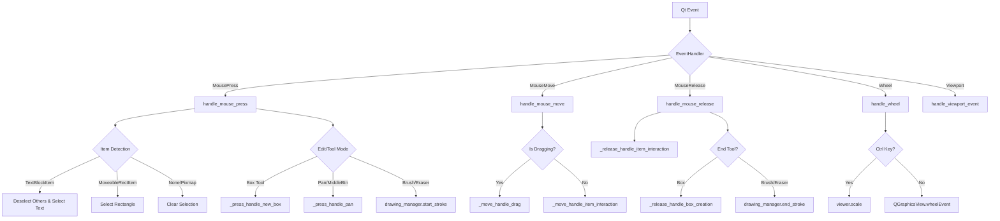
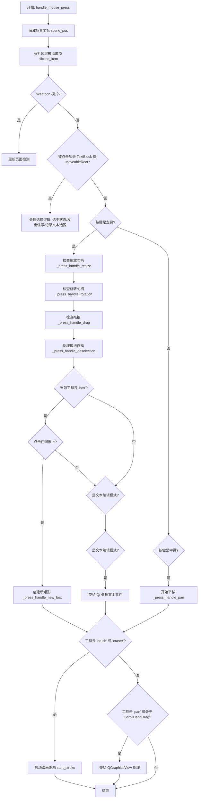
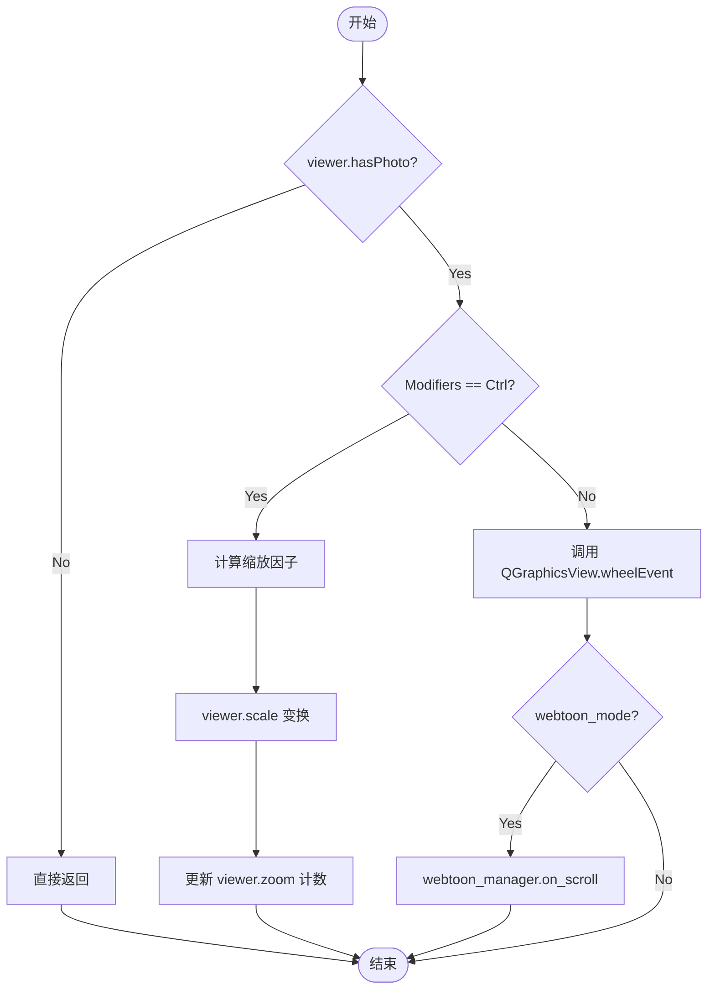
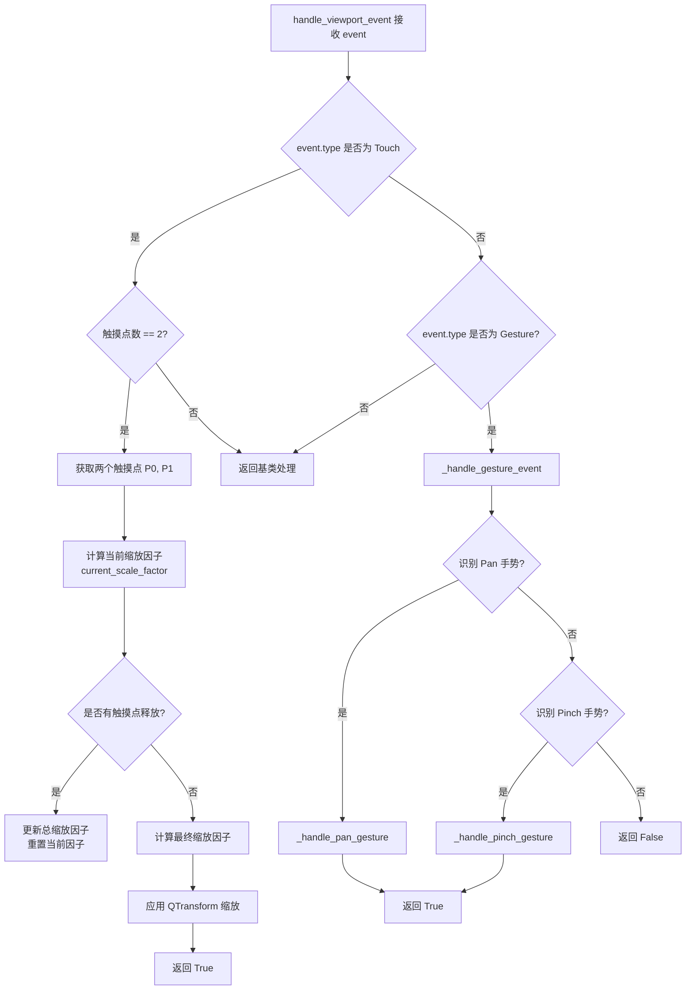
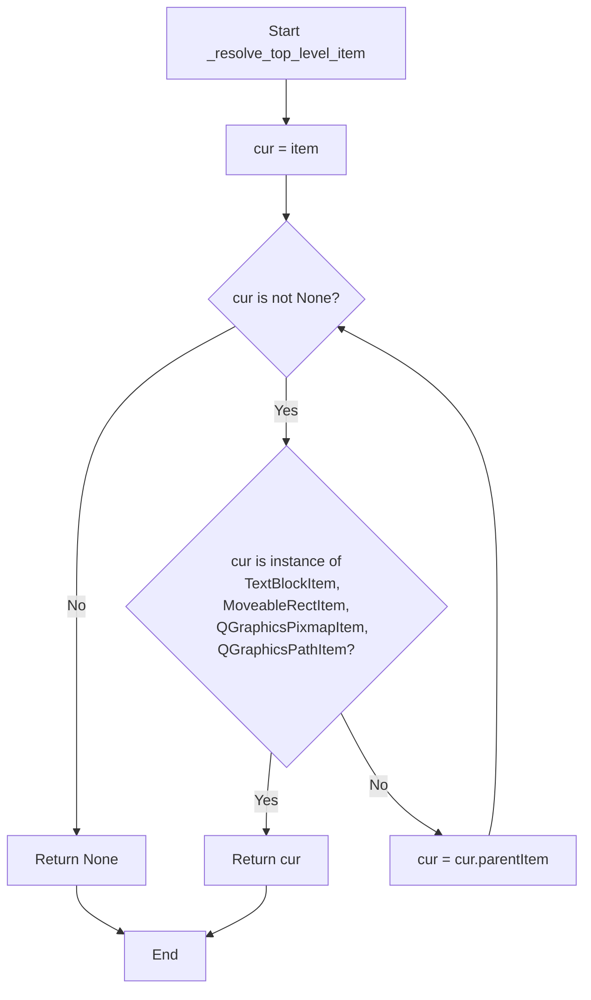
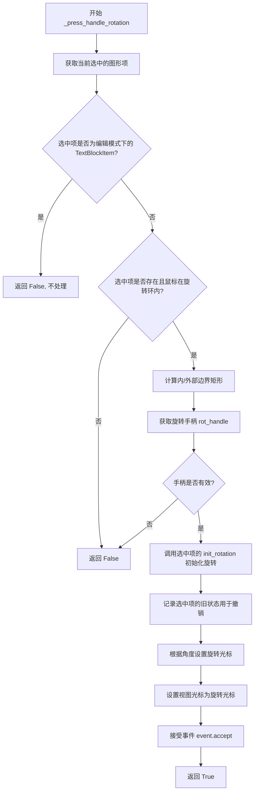
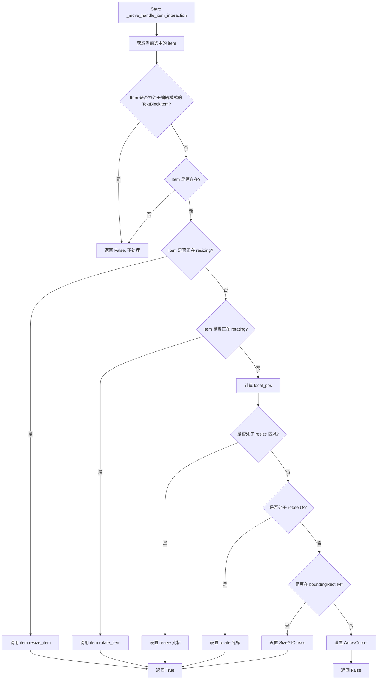
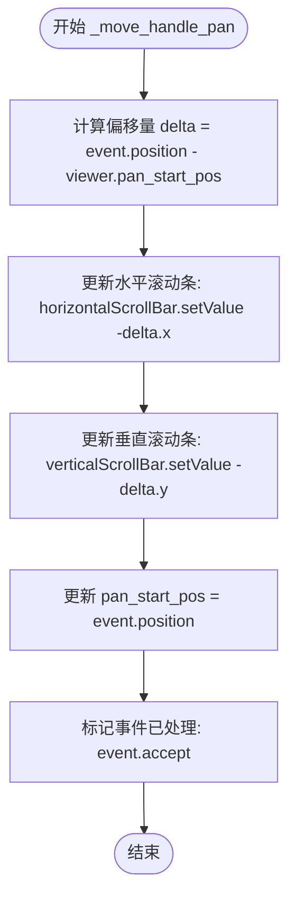
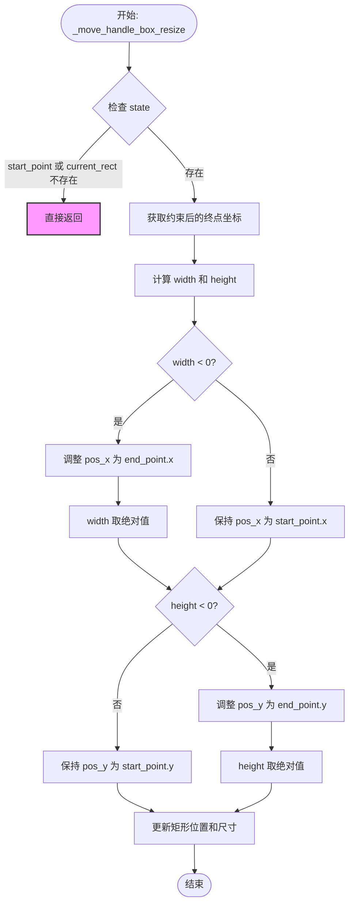
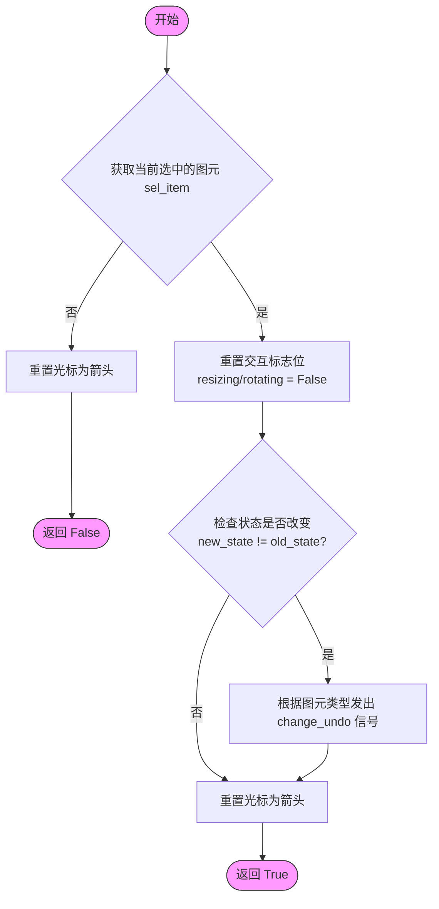

# `comic-translate\app\ui\canvas\event_handler.py` 详细设计文档

ImageViewer的事件处理模块，通过组合模式封装了对Qt鼠标、滚轮、触摸及手势事件的处理逻辑，主要负责图形元素（文本块、矩形）的选中、拖拽、缩放、旋转交互，以及画笔、橡皮擦、框选工具和Webtoon翻页功能的底层事件分发与状态管理。

## 整体流程



## 类结构

```
EventHandler (事件处理器)
└── 依赖关系:
    ├── ImageViewer (宿主视图)
    ├── TextBlockItem (文本图形项)
    ├── MoveableRectItem (矩形图形项)
    ├── drawing_manager (绘图管理器)
    └── webtoon_manager (Webtoon管理器)
```

## 全局变量及字段


### `EventHandler.viewer`
    
宿主图形视图引用

类型：`ImageViewer`
    


### `EventHandler.dragged_item`
    
当前正在拖拽的图形项

类型：`QGraphicsItem`
    


### `EventHandler.last_scene_pos`
    
上一次鼠标事件的场景坐标，用于计算增量

类型：`QPointF`
    
    

## 全局函数及方法


### `EventHandler.handle_mouse_press`

#### 描述
这是 ImageViewer 的核心事件分发方法之一，负责处理鼠标按键按下的事件。它首先将屏幕坐标映射到场景坐标，识别被点击的图形项（TextBlockItem 或 MoveableRectItem），并根据按下的鼠标键（左键、中键）或当前激活的工具（框选、画笔、橡皮擦）来触发选择逻辑、几何变换（拖拽、缩放、旋转）的准备阶段，或启动绘图/漫游交互。

#### 参数

-  `event`：`QtGui.QMouseEvent`，Qt 鼠标事件对象，包含了鼠标位置、按键类型、修饰键等信息。

#### 返回值
`None`（无返回值）。该方法主要通过修改对象状态（如 `selected` 属性）、发送信号（如 `item_selected`）、或调用 `event.accept()` 来处理事件。

#### 流程图



#### 带注释源码

```python
def handle_mouse_press(self, event: QtGui.QMouseEvent):
    # 1. 坐标转换：将视图坐标转换为场景坐标，用于后续的碰撞检测
    scene_pos = self.viewer.mapToScene(event.position().toPoint())
    # 解析被点击的项，追溯到顶层项（处理嵌套在组中的项）
    clicked_item = self._resolve_top_level_item(self.viewer.itemAt(event.pos()))
    
    # 2. Webtoon 模式页面切换检测
    if self.viewer.webtoon_mode:
        self.viewer.webtoon_manager.update_page_on_click(scene_pos)

    # 3. 处理自定义图形项（文本块、矩形）的选中逻辑
    if isinstance(clicked_item, (TextBlockItem, MoveableRectItem)):
        if not clicked_item.selected:
            # 发射项特定的选中信号
            if isinstance(clicked_item, TextBlockItem):
                self.viewer.deselect_all()
                clicked_item.selected = True 
                clicked_item.setSelected(True)
                # 记录当前文本选区，以便在释放鼠标时检测选区是否变化
                try:
                    clicked_item.last_selection = clicked_item.textCursor().selection()
                except Exception:
                    clicked_item.last_selection = None
                # 如果不在编辑模式，发射选中信号
                if not clicked_item.editing_mode:
                    clicked_item.item_selected.emit(clicked_item)
            elif isinstance(clicked_item, MoveableRectItem):
                self.viewer.select_rectangle(clicked_item)
    
    # 4. 左键处理逻辑：交互优先级最高（变换 > 拖拽 > 取消选择 > 工具）
    if event.button() == Qt.LeftButton:
        # 顺序很重要：先检查变换句柄，再检查拖拽，最后处理一般的取消选择
        if self._press_handle_resize(event, scene_pos): return # 处理缩放
        if self._press_handle_rotation(event, scene_pos): return # 处理旋转
        if self._press_handle_drag(event, scene_pos): return # 处理拖拽移动
        self._press_handle_deselection(clicked_item) # 处理空白处点击取消选择

        # 5. 工具模式处理：Box（新建矩形）
        if self.viewer.current_tool == 'box' and not isinstance(clicked_item, (TextBlockItem, MoveableRectItem)):
            if self._is_on_image(scene_pos):
                self._press_handle_new_box(scene_pos)
                return # 停止进一步处理

        # 6. 文本编辑模式：将控制权交还给 Qt 的文本编辑机制
        if isinstance(clicked_item, TextBlockItem) and clicked_item.editing_mode:
            QtWidgets.QGraphicsView.mousePressEvent(self.viewer, event)
            return

    # 7. 中键处理：平移（Pan）
    if event.button() == Qt.MiddleButton:
        self._press_handle_pan(event)
        return

    # 8. 绘画工具处理：画笔或橡皮擦
    if self.viewer.current_tool in ['brush', 'eraser'] and self.viewer.hasPhoto():
        if self._is_on_image(scene_pos):
            self.viewer.drawing_manager.start_stroke(scene_pos)

    # 9. 传递给 QGraphicsView：处理平移或基于工具的特定交互
    # 检查是否处于平移工具或 Qt 的手型拖拽模式
    scroll = self.viewer.dragMode() == QtWidgets.QGraphicsView.DragMode.ScrollHandDrag
    if self.viewer.current_tool == 'pan' or scroll:
        QtWidgets.QGraphicsView.mousePressEvent(self.viewer, event)
```


### `EventHandler.handle_mouse_move`

该方法是图像查看器（ImageViewer）的核心交互调度中心，负责处理鼠标移动事件。它根据当前的状态（如是否有选中的可移动项、是否正在拖拽、当前激活的工具等）分发事件流，优先处理自定义的图形项交互（拖拽、悬停），其次处理视图级别的交互（平移），最后处理工具级别的交互（绘图、框选）。

参数：

-  `event`：`QtGui.QMouseEvent`，包含鼠标的当前位置、按下的按钮状态以及相关的场景坐标信息。

返回值：`None`，该方法通过直接修改对象状态（位置、绘图路径）或调用 Qt 底层的视图事件来处理事件，不返回具体值。

#### 流程图

```mermaid
flowchart TD
    A([开始 handle_mouse_move]) --> B[获取场景坐标 scene_pos]
    B --> C{_move_handle_drag? <br/>(是否正在拖拽图形项)}
    C -- 是 --> D[调用 item.move_item 移动图形项]
    D --> E[更新 last_scene_pos]
    E --> Z([结束])
    C -- 否 --> F{_move_handle_item_interaction? <br/>(悬停/激活缩放/旋转)}
    F -- 是 --> Z
    F -- 否 --> G[调用 QGraphicsView.mouseMoveEvent <br/>(处理默认拖拽模式)]
    G --> H{viewer.panning? <br/>(是否处于平移模式)}
    H -- 是 --> I[_move_handle_pan 移动视图]
    I --> Z
    H -- 否 --> J{current_tool <br/> in ['brush', 'eraser']}
    J -- 是 --> K{current_path 存在?}
    K -- 是 --> L[drawing_manager.continue_stroke 续绘笔触]
    K -- 否 --> M
    J -- 否 --> M{current_tool == 'box'}
    M -- 是 --> N[_move_handle_box_resize 调整矩形框]
    M -- 否 --> O[更新 last_scene_pos 为下一帧做准备]
    O --> Z
    L --> O
    N --> O
```

#### 带注释源码

```python
def handle_mouse_move(self, event: QtGui.QMouseEvent):
    """
    处理鼠标移动事件，分发至对应的交互逻辑（拖拽、悬停、平移、绘图、Box绘制）。
    """
    # 1. 获取鼠标在场景坐标系中的位置
    scene_pos = self.viewer.mapToScene(event.position().toPoint())

    # 2. 显式处理自定义图形项的拖拽（优先级最高）
    # 如果在 mousePress 中开始了拖拽，这里继续执行移动逻辑
    if self._move_handle_drag(event, scene_pos):
        self.last_scene_pos = scene_pos
        return # 拖拽期间阻止其他交互（如平移或绘图）

    # 3. 处理图形项的交互状态（悬停光标、激活缩放/旋转）
    # 如果鼠标悬停在选中的文本或矩形上，或者是正在进行缩放/旋转操作
    if self._move_handle_item_interaction(scene_pos): 
        return

    # 4. 交由 QGraphicsView 处理其默认行为
    # 例如：当没有选中自定义项时，允许 Qt 处理 ScrollHandDrag 模式（手型拖动）
    QtWidgets.QGraphicsView.mouseMoveEvent(self.viewer, event)

    # 5. 处理视图级别的平移交互
    if self.viewer.panning: 
        self._move_handle_pan(event)
        return
    
    # 6. 处理绘图工具（画笔/橡皮擦）的笔触续绘
    if self.viewer.current_tool in ['brush', 'eraser'] and self.viewer.drawing_manager.current_path:
        if self._is_on_image(scene_pos):
            self.viewer.drawing_manager.continue_stroke(scene_pos)
    
    # 7. 处理 Box 工具的绘制过程（如果正在画矩形）
    if self.viewer.current_tool == 'box':
        self._move_handle_box_resize(scene_pos)

    # 8. 记录当前位置，供下一次 move 事件计算增量使用
    self.last_scene_pos = scene_pos
```


### `EventHandler.handle_mouse_release`

描述：处理鼠标释放事件，是交互流程的终点。该方法负责结束自定义项的拖拽/缩放/旋转状态，检测状态变化并提交Undo记录；同时处理绘图（画笔/橡皮擦）和框选工具的笔画/矩形创建结束逻辑，并将事件传递给基类以维持QGraphicsView的默认行为（如平移滚动结束）。

参数：
- `event`：`QtGui.QMouseEvent`，鼠标释放事件对象，包含释放的按钮和位置信息。

返回值：`None`。虽然内部调用了返回布尔值的辅助函数来决定是否阻止基类事件，但该方法本身不返回具体值。

#### 流程图

```mermaid
flowchart TD
    Start([开始 handle_mouse_release])
    IsLeftBtn{button == LeftButton?}
    CallReleaseHelper[调用 _release_handle_item_interaction]
    InteractionHandled{交互是否已处理?}
    ResetCursor[重置光标为箭头]
    CheckTextSel[检查 TextBlock 选中变化]
    ReturnEarly[return - 阻止基类处理]
    CallBaseClass[调用 QGraphicsView.mouseReleaseEvent]
    IsMiddleBtn{button == MiddleButton?}
    ReleasePan[调用 _release_handle_pan]
    IsBrushEraser{current_tool in ['brush', 'eraser']?}
    EndStroke[调用 drawing_manager.end_stroke]
    IsBox{current_tool == 'box'?}
    ReleaseBox[调用 _release_handle_box_creation]
    End([结束])

    Start --> IsLeftBtn
    IsLeftBtn -->|Yes| CallReleaseHelper
    CallReleaseHelper --> InteractionHandled
    InteractionHandled -->|Yes| ResetCursor
    ResetCursor --> CheckTextSel
    CheckTextSel --> ReturnEarly
    InteractionHandled -->|No| CallBaseClass
    
    IsLeftBtn -->|No| CallBaseClass
    CallBaseClass --> IsMiddleBtn
    IsMiddleBtn -->|Yes| ReleasePan
    ReleasePan --> ReturnEarly
    IsMiddleBtn -->|No| IsBrushEraser
    IsBrushEraser -->|Yes| EndStroke
    IsBrushEraser -->|No| IsBox
    IsBox -->|Yes| ReleaseBox
    IsBox -->|No| End
    EndStroke --> End
    ReleaseBox --> End
    ReturnEarly --> End
```

#### 带注释源码

```python
def handle_mouse_release(self, event: QtGui.QMouseEvent):
    interaction_finished = False # 标记，用于追踪我们是否处理了自定义交互

    # 1. 处理鼠标左键释放
    if event.button() == Qt.LeftButton:
        # 尝试结束自定义的拖拽、缩放或旋转交互
        interaction_finished = self._release_handle_item_interaction()

        # 如果一个自定义交互刚刚结束，在此停止事件
        # 以防止基类 QGraphicsView 取消选择该项
        if interaction_finished:
            self.viewer.viewport().setCursor(Qt.CursorShape.ArrowCursor)
            
            # 如果我们处理了交互，同时检查 TextBlockItem 的选中变化
            blk_item, rect_item = self.viewer.sel_rot_item()
            sel_item = blk_item or rect_item
            if isinstance(sel_item, TextBlockItem):
                try:
                    current_selection = sel_item.textCursor().selection()
                    # 如果当前选中文本与按下时的选中文本不同，触发变化事件
                    if current_selection != getattr(sel_item, 'last_selection', None):
                        sel_item.on_selection_changed()
                    sel_item.last_selection = current_selection
                except Exception:
                    pass
            return # 结束处理，不传递给基类

    # 2. 将释放事件传递给 QGraphicsView 处理其默认行为（例如 ScrollHandDrag 结束）
    QtWidgets.QGraphicsView.mouseReleaseEvent(self.viewer, event)

    # 3. 处理中键（平移）释放
    if event.button() == Qt.MiddleButton:
        self._release_handle_pan()
        return
    
    # 4. 处理绘图工具（画笔/橡皮）释放
    if self.viewer.current_tool in ['brush', 'eraser']:
        self.viewer.drawing_manager.end_stroke()
        
    # 5. 处理框选工具释放
    if self.viewer.current_tool == 'box':
        self._release_handle_box_creation()
```


### `EventHandler.handle_wheel`

该方法负责处理图像查看器的滚轮事件。它首先检查查看器是否加载了图片，然后根据是否按下 `Ctrl` 键来区分操作：按住 `Ctrl` 时执行缩放（放大或缩小），否则执行默认的页面滚动（通过调用 `QGraphicsView` 的原生滚轮事件），并且在 Webtoon 模式下还会触发分页管理器的滚动回调。

参数：

-  `event`：`QtGui.QWheelEvent`，Qt 滚轮事件对象，包含滚轮方向、Modifiers（修饰键）等信息。

返回值：`None`，该方法直接修改 viewer 的状态或转发事件，不返回数据。

#### 流程图



#### 带注释源码

```python
def handle_wheel(self, event: QtGui.QWheelEvent):
    """Handle wheel events for zooming (Ctrl+Wheel) or scrolling (Wheel).
    
    Args:
        event: The Qt wheel event containing delta and modifier information.
    """
    # 1. 安全检查：如果当前没有加载图片，则忽略滚轮事件
    if not self.viewer.hasPhoto(): 
        return
    
    # 2. 判断是否为缩放操作（Ctrl + 滚轮）
    if event.modifiers() == Qt.KeyboardModifier.ControlModifier:
        # 3. 根据滚轮方向（向上滚动 y > 0）确定缩放因子
        # 向上滚放大 1.25 倍，向下滚缩小 1/1.25 倍
        factor = 1.25 if event.angleDelta().y() > 0 else 1 / 1.25
        
        # 4. 执行视图缩放变换
        self.viewer.scale(factor, factor)
        
        # 5. 更新内部的缩放级别计数（用于状态记录或UI显示）
        self.viewer.zoom += 1 if factor > 1 else -1
    else:
        # 6. 普通滚动模式：将事件传递给 QGraphicsView 处理默认的滚动行为
        QtWidgets.QGraphicsView.wheelEvent(self.viewer, event)
        
        # 7. 特殊模式处理：如果处于 Webtoon（长图分页）模式，
        # 在滚动到底部/顶部时触发分页逻辑
        if self.viewer.webtoon_mode:
            self.viewer.webtoon_manager.on_scroll()
```


### `EventHandler.handle_viewport_event`

#### 描述

该函数是视口事件的总入口，负责拦截并处理触摸（Touch）事件和手势（Gesture）事件。它专门用于识别双指缩放（Two-finger Pinch）和平移（Pan）操作。当检测到双指触摸时，通过计算两点距离手动计算缩放系数实现缩放；当检测到 Qt 手势时，则分发至专门的手势处理函数（`_handle_pan_gesture` 和 `_handle_pinch_gesture`）。对于不感兴趣的事件，则转发给父类 `QGraphicsView.viewportEvent` 处理。

#### 参数

-  `event`：`QtCore.QEvent`，通用的 Qt 事件对象，可能是触摸事件（TouchBegin/Update/End）或手势事件（Gesture）。

#### 返回值

- `bool`，如果事件被处理（触摸或手势）返回 `True`，否则返回基类 `QGraphicsView.viewportEvent` 的处理结果。

#### 流程图



#### 带注释源码

```python
def handle_viewport_event(self, event: QtCore.QEvent):
    """
    处理视口事件，识别双指缩放和手势。
    """
    # 1. 处理触摸事件 (Touch Events) - 主要用于双指缩放 (Pinch-to-Zoom)
    if event.type() in (QEvent.Type.TouchBegin, QEvent.Type.TouchUpdate, QEvent.Type.TouchEnd):
        touch_points = event.points()
        
        # 只有当有2个触摸点时才进行缩放计算
        if len(touch_points) == 2:
            touchPoint0, touchPoint1 = touch_points[0], touch_points[1]
            
            # 计算当前双指之间的距离
            current_scale_factor = (
                QLineF(touchPoint0.pos(), touchPoint1.pos()).length() /
                QLineF(touchPoint0.startPos(), touchPoint1.startPos()).length()
            )
            
            # 逻辑：处理缩放的累加。
            # 如果任何一个手指释放了，说明这一轮缩放动作结束，需要将当前的缩放结果累加到总缩放因子中，
            # 并将当前因子重置为1.0，以免导致叠加错误。
            if any(tp.state() == QEventPoint.State.Released for tp in touch_points):
                self.viewer.total_scale_factor *= current_scale_factor
                current_scale_factor = 1.0
                
            # 最终应用缩放 = 之前累计的缩放 * 当前手势产生的缩放
            scale_factor = self.viewer.total_scale_factor * current_scale_factor
            self.viewer.setTransform(QTransform.fromScale(scale_factor, scale_factor))
            return True # 标记为已处理，不再传递给 View 默认行为

    # 2. 处理手势事件 (Gesture Events) - Pan/Pinch
    if event.type() == QEvent.Type.Gesture:
        return self._handle_gesture_event(event)
        
    # 3. 默认处理：传递给 QGraphicsView 的默认视口事件处理器
    return QtWidgets.QGraphicsView.viewportEvent(self.viewer, event)

def _handle_gesture_event(self, event):
    """
    分发具体的手势类型。
    """
    # 处理平移手势 (Pan)
    if pan := event.gesture(Qt.GestureType.PanGesture): 
        return self._handle_pan_gesture(pan)
        
    # 处理捏合手势 (Pinch)
    if pinch := event.gesture(Qt.GestureType.PinchGesture): 
        return self._handle_pinch_gesture(pinch)
        
    return False

def _handle_pan_gesture(self, gesture):
    """
    处理单指或双指平移（Pan）手势，更新滚动条位置。
    """
    delta = gesture.delta().toPoint()
    # 计算新的位置（这里似乎有一个累积逻辑 bug，通常直接用 delta 更新）
    new_pos = self.viewer.last_pan_pos + delta
    
    self.viewer.horizontalScrollBar().setValue(self.viewer.horizontalScrollBar().value() - (new_pos.x() - self.viewer.last_pan_pos.x()))
    self.viewer.verticalScrollBar().setValue(self.viewer.verticalScrollBar().value() - (new_pos.y() - self.viewer.last_pan_pos.y()))
    self.viewer.last_pan_pos = new_pos
    return True

def _handle_pinch_gesture(self, gesture):
    """
    处理捏合（Pinch）手势，实现标准的 Qt 缩放。
    """
    scale = gesture.scaleFactor()
    
    # 手势开始时记录缩放中心
    if gesture.state() == Qt.GestureState.GestureStarted:
        self.viewer._pinch_center = self.viewer.mapToScene(gesture.centerPoint().toPoint())
        
    # 执行缩放
    if scale != 1.0:
        self.viewer.scale(scale, scale)
        self.viewer.zoom += (scale - 1)
        
    # 手势结束时清理中心点
    if gesture.state() == Qt.GestureState.GestureFinished:
        self.viewer._pinch_center = QPointF()
        
    return True
```


### `EventHandler._resolve_top_level_item`

该函数是一个递归查找方法，用于在图形场景中从给定的子项（如内部句柄、子控件或复杂图形的组成部分）出发，**沿着Qt的父对象链（Parent Chain）向上查找**，直到找到定义好的顶层交互项（文本块、矩形框、图片或路径项）为止。这确保了无论用户点击的是图形的哪个部分，都能获取到正确的操作目标。

参数：

- `item`：`QGraphicsItem | None`，从 `itemAt` 获取的起始图形项，可能为 `None`。

返回值：`QGraphicsItem | None`，返回找到的顶层 `TextBlockItem`、`MoveableRectItem`、`QGraphicsPixmapItem` 或 `QGraphicsPathItem` 实例。如果向上遍历到根节点仍未找到匹配类型，则返回 `None`。

#### 流程图



#### 带注释源码

```python
def _resolve_top_level_item(self, item):
    """Walk up the parent chain to find a top-level TextBlockItem, MoveableRectItem, or QGraphicsPathItem."""
    # 初始化当前检查对象为传入的 item
    cur = item
    
    # 循环条件：当前对象不为空 且 当前对象不属于目标类型
    # 目标类型包括：文本块、矩形框、图片项、路径笔触项
    while cur is not None and not isinstance(
        cur, (TextBlockItem, MoveableRectItem, QGraphicsPixmapItem, QGraphicsPathItem)):
        
        # 条件不满足（是目标类型），则跳出循环
        # 条件满足（不是目标类型），则将当前对象更新为其父对象，继续向上查找
        cur = cur.parentItem()
        
    # 循环结束，要么找到了目标项（cur 不为空且是目标类型），要么查到了根节点（cur 为 None）
    return cur
```


### `EventHandler._is_on_image`

#### 描述

该方法用于判断传入的场景坐标（`scene_pos`）是否位于当前视图所显示的图像边界内。它根据 `viewer` 是否处于 Webtoon（长图分页）模式来决定检测逻辑：在 Webtoon 模式下，它会遍历所有可见的图像切片进行碰撞检测；在普通单页模式下，它直接检测主图像项 `photo` 是否包含该坐标。

参数：

-  `scene_pos`：`QPointF`，需要进行检测的场景坐标系中的点坐标。

返回值：`bool`，如果坐标位于当前图像范围内返回 `True`，否则返回 `False`。

#### 流程图

```mermaid
flowchart TD
    A([开始: 输入 scene_pos]) --> B{webtoon_mode 是否开启?}
    
    B -- 是 (True) --> C[遍历 webtoon_manager 中的所有 image_items]
    C --> D{当前遍历的 Item}
    D --> E[item.mapFromScene(scene_pos)]
    E --> F{item.contains(local_pos)}
    F -- 是 --> G[返回 True]
    F -- 否 --> D
    C -- 遍历完毕且无匹配 --> H[返回 False]
    
    B -- 否 (False) --> I[返回 viewer.photo.contains(scene_pos)]
```

#### 带注释源码

```python
def _is_on_image(self, scene_pos: QPointF) -> bool:
    """
    判断场景坐标是否位于当前图像范围内。
    
    参数:
        scene_pos (QPointF): 需要检测的场景坐标点。
        
    返回:
        bool: 如果坐标在图像内返回 True，否则返回 False。
    """
    # 检查是否处于 Webtoon（长图滚动）模式
    if self.viewer.webtoon_mode:
        # 在 Webtoon 模式下，可能存在多个图像切片（image_items）
        # 使用生成器表达式检查 scene_pos 是否在任何图像切片的范围内
        # 注意：需要将 scene_pos 转换为每个图像项的局部坐标系 (mapFromScene) 再进行 contains 检测
        return any(
            item.contains(item.mapFromScene(scene_pos)) 
            for item in self.viewer.webtoon_manager.image_items.values()
        )
    
    # 普通模式下，直接判断主图像项 (self.viewer.photo) 是否包含该点
    return self.viewer.photo.contains(scene_pos)
```


### `EventHandler._press_handle_drag`

该方法负责检测鼠标按下操作是否意图在选中的自定义图形项（文本块或矩形）上启动拖拽移动。它验证点击位置是否在图形项的边界矩形内，如果是，则锁定该项进行拖拽操作，并保存当前状态以支持后续的撤销（Undo）功能，同时更新界面光标。

参数：

-  `event`：`QtGui.QMouseEvent`，Qt鼠标事件对象，包含按钮状态等信息，用于判断事件是否已被处理（`event.accept()`）。
-  `scene_pos`：`QPointF`，鼠标事件在图形场景（Graphics Scene）坐标系下的坐标点。

返回值：`bool`，如果成功检测并初始化了拖拽操作则返回 `True`，否则返回 `False`。

#### 流程图

```mermaid
flowchart TD
    A([开始 _press_handle_drag]) --> B[获取当前选中的图形项<br>sel_rot_item]
    B --> C{是否存在选中的项?}
    C -->|否| D[返回 False]
    C -->|是| E{选中项是否为文本块<br>且处于编辑模式?}
    E -->|是| D
    E -->|否| F[将场景坐标转换为项的局部坐标<br>mapFromScene]
    F --> G{局部坐标是否在项的<br>边界矩形 boundingRect 内?}
    G -->|否| D
    G -->是 --> H[锁定拖拽项<br>self.dragged_item = sel_item]
    H --> I[记录起始位置<br>self.last_scene_pos = scene_pos]
    I --> J{根据类型保存旧状态<br>用于撤销}
    J --> K[更新光标为闭合手型<br>ClosedHandCursor]
    K --> L[接受事件<br>event.accept()]
    L --> M([返回 True])
```

#### 带注释源码

```python
def _press_handle_drag(self, event: QtGui.QMouseEvent, scene_pos: QPointF) -> bool:
    """Checks if a drag should be initiated on a custom item."""
    # 1. 获取当前被选中的图形项（文本块或矩形）
    blk_item, rect_item = self.viewer.sel_rot_item()
    sel_item = blk_item or rect_item

    # 2. 如果选中的是文本块且正处于文本编辑模式，则不允许拖拽（由Qt处理文本选择）
    if isinstance(sel_item, TextBlockItem) and sel_item.editing_mode:
        return False

    # 3. 如果没有选中任何有效项，直接返回
    if not sel_item:
        return False

    # 4. 计算鼠标点击在选中项局部坐标系中的位置
    local_pos = sel_item.mapFromScene(scene_pos)
    
    # 5. 判断点击位置是否在项的边界矩形内
    if sel_item.boundingRect().contains(local_pos):
        # --- 初始化拖拽 ---
        
        # 记录被拖拽的项，供 handle_mouse_move 使用
        self.dragged_item = sel_item
        # 记录初始场景位置，用于计算拖拽位移增量
        self.last_scene_pos = scene_pos
        
        # --- 记录状态用于撤销 (Undo) ---
        # 不直接调用 mousePressEvent，而是手动序列化状态
        if isinstance(sel_item, TextBlockItem):
            sel_item.old_state = TextBlockState.from_item(sel_item)
        elif isinstance(sel_item, MoveableRectItem):
            sel_item.old_state = RectState.from_item(sel_item)
            
        # --- UI 反馈 ---
        # 设置光标为闭合手型，表示抓取物体
        self.viewer.viewport().setCursor(Qt.CursorShape.ClosedHandCursor)
        
        # 标记事件已被处理，不再传递给父类
        event.accept()
        return True

    return False
```


### `EventHandler._press_handle_resize`

该方法负责处理鼠标按下事件，检测鼠标光标是否位于当前选中项目（文本块或矩形）的调整大小（Resize）热区内。如果检测成功，它会初始化项目的缩放状态，记录操作前的快照以支持撤销功能，并设置对应的光标样式。

参数：
- `event`：`QtGui.QMouseEvent`，Qt的鼠标事件对象，携带了鼠标按键和视图坐标信息。
- `scene_pos`：`QPointF`，鼠标点击位置在 Graphics Scene（场景）坐标系下的坐标。

返回值：`bool`，如果成功识别并初始化了缩放操作返回 `True`，否则返回 `False`（表示未处理该事件）。

#### 流程图

```mermaid
flowchart TD
    A[开始: _press_handle_resize] --> B[获取当前选中的项目 sel_item]
    B --> C{sel_item 是 TextBlockItem 且处于编辑模式?}
    C -- 是 --> Z[返回 False: 禁止在编辑文本时缩放]
    C -- 否 --> D{sel_item 存在 且 鼠标在缩放区域内?}
    D -- 否 --> Z
    D -- 是 --> E[将 scene_pos 映射到 item 的局部坐标 local_pos]
    E --> F[获取具体的缩放句柄 handle]
    F --> G[sel_item.resize_handle = handle]
    G --> H[sel_item.init_resize(scene_pos) 初始化缩放]
    H --> I[记录 old_state 用于撤销]
    I --> J[设置对应的光标样式]
    J --> K[event.accept() 接受事件]
    K --> Y[返回 True]
```

#### 带注释源码

```python
def _press_handle_resize(self, event, scene_pos) -> bool:
    # 1. 获取当前被选中的项目（优先获取 TextBlockItem，否则获取 MoveableRectItem）
    blk_item, rect_item = self.viewer.sel_rot_item()
    sel_item = blk_item or rect_item
    
    # 2. 逻辑拦截：如果当前选中的是正在编辑文本的 TextBlockItem，则不允许进行缩放操作
    if isinstance(sel_item, TextBlockItem) and sel_item.editing_mode:
        return False
        
    # 3. 核心检测：判断鼠标位置 (scene_pos) 是否位于选中项的缩放热区内
    if sel_item and self.viewer.interaction_manager._in_resize_area(sel_item, scene_pos):
        # 4. 坐标转换：将场景坐标转换为 item 的局部坐标，以便计算具体哪个角被点击
        local_pos = sel_item.mapFromScene(scene_pos)
        
        # 5. 获取具体的缩放句柄（如左上角、右下角等）
        handle = self.viewer.interaction_manager.get_resize_handle(sel_item, local_pos)
        
        if handle:
            # 6. 绑定句柄到项目对象，标记项目当前正在进行缩放
            sel_item.resize_handle = handle
            
            # 7. 调用项目自身的初始化方法，准备开始缩放计算
            sel_item.init_resize(scene_pos)
            
            # 8. 状态保存：记录缩放前的几何状态，用于实现撤销 (Undo) 功能
            if isinstance(sel_item, TextBlockItem):
                sel_item.old_state = TextBlockState.from_item(sel_item)
            elif isinstance(sel_item, MoveableRectItem):
                sel_item.old_state = RectState.from_item(sel_item)
            
            # 9. UI 反馈：根据缩放方向设置对应的光标（如上下双向箭头、对角线箭头等）
            cursor = self.viewer.interaction_manager.get_resize_cursor(sel_item, local_pos)
            self.viewer.viewport().setCursor(cursor)
            
            # 10. 事件接受：告诉 Qt 此事件已被处理，不再传递给默认的视图处理机制
            event.accept()
            return True
            
    # 11. 默认逻辑：未触发缩放
    return False
```


### `EventHandler._press_handle_rotation`

该方法负责检测鼠标事件是否发生在选定图形项（如文本块或矩形）的旋转区域内，如果是，则初始化旋转操作所需的参数（如记录旧状态、设置旋转手柄、调整光标），并标记事件已被处理。

参数：

-  `event`：`QtGui.QMouseEvent`，Qt鼠标事件对象，包含点击的具体信息。
-  `scene_pos`：`QPointF`，鼠标在场景坐标系下的坐标位置。

返回值：`bool`，如果成功检测并初始化了旋转操作返回 `True`，否则返回 `False`。

#### 流程图



#### 带注释源码

```python
def _press_handle_rotation(self, event, scene_pos) -> bool:
    """
    检测并初始化旋转操作。
    
    参数:
        event: Qt鼠标事件对象。
        scene_pos: 鼠标在场景中的坐标。
        
    返回值:
        bool: 是否成功处理了旋转操作。
    """
    # 1. 获取当前被选中的图形项（文本块或矩形）
    blk_item, rect_item = self.viewer.sel_rot_item()
    sel_item = blk_item or rect_item

    # 2. 如果选中的是文本块且处于编辑模式，则不处理旋转（避免与文本光标冲突）
    if isinstance(sel_item, TextBlockItem) and sel_item.editing_mode:
        return False

    # 3. 检查鼠标位置是否在旋转环（Rotate Ring）内
    # interaction_manager._in_rotate_ring 用于判断距离中心的距离是否在旋转区域
    if sel_item and self.viewer.interaction_manager._in_rotate_ring(sel_item, scene_pos):
        
        # 获取当前旋转角度
        angle = sel_item.rotation()
        
        # 计算边界矩形：内部为物体原本大小，外部预留旋转手柄的空间
        inner_rect = sel_item.boundingRect()
        # rotate_margin_max 定义了旋转手柄允许的最大偏移量
        outer_rect = inner_rect.adjusted(
            -self.viewer.interaction_manager.rotate_margin_max, 
            -self.viewer.interaction_manager.rotate_margin_max, 
            self.viewer.interaction_manager.rotate_margin_max, 
            self.viewer.interaction_manager.rotate_margin_max
        )
        
        # 将场景坐标转换为图形项的局部坐标，以计算具体的手柄位置
        local_pos = sel_item.mapFromScene(scene_pos)
        
        # 获取旋转手柄的具体信息（例如确定了上下左右哪个角或边）
        sel_item.rot_handle = self.viewer.interaction_manager.get_rotate_handle(outer_rect, local_pos, angle)
        
        if sel_item.rot_handle:
            # 4. 初始化旋转状态
            sel_item.init_rotation(scene_pos)
            
            # 5. 记录状态以便撤销：保存操作前的状态对象
            if isinstance(sel_item, TextBlockItem):
                sel_item.old_state = TextBlockState.from_item(sel_item)
            elif isinstance(sel_item, MoveableRectItem):
                sel_item.old_state = RectState.from_item(sel_item)
            
            # 6. 设置光标：根据当前旋转角度和局部位置获取对应的光标形状
            cursor = self.viewer.interaction_manager.get_rotation_cursor(outer_rect, local_pos, angle)
            self.viewer.viewport().setCursor(cursor)
            
            # 标记事件已被处理，不再传递给父类
            event.accept()
            return True
            
    return False
```


### `EventHandler._press_handle_deselection`

该方法负责处理鼠标按下时对场景中的项目进行取消选中的逻辑。当用户点击空白区域、背景图片（Pixmap）或者非目标区域时，触发此方法以清除当前的编辑状态或选中状态，保证 UI 的一致性。

参数：

- `clicked_item`：`Any` (可以是 `None` 或 `QGraphicsItem` 的子类实例)，代表当前被点击的图形项，用于判断点击位置是否为有效的可交互项。

返回值：`None`，该方法通过修改信号槽和对象状态来产生副作用，不返回任何值。

#### 流程图

```mermaid
flowchart TD
    A[Start: _press_handle_deselection] --> B{clicked_item is None or<br>isinstance(clicked_item, QGraphicsPixmapItem)?}
    B -- Yes --> C[Emit clear_text_edits signal]
    C --> D[Call viewer.deselect_all()]
    D --> Z[End]
    
    B -- No --> E{isinstance(clicked_item, QGraphicsPathItem)?}
    E -- Yes --> F[Loop through scene items]
    F --> G{Item is TextBlockItem?}
    G -- Yes --> H[Call item.handleDeselection]
    G -- No --> I{Item is MoveableRectItem?}
    I -- Yes --> J[Call viewer.deselect_rect]
    I -- No --> K[Continue Loop]
    H --> K
    J --> K
    K --> Z
    
    E -- No (General Case) --> L[Loop through scene items]
    L --> M{Item is (TextBlockItem or MoveableRectItem)<br>and Item != clicked_item?}
    M -- Yes --> N[If TextBlockItem: handleDeselection<br>Else: deselect_rect]
    M -- No --> O[Continue Loop]
    N --> O
    O --> Z
```

#### 带注释源码

```python
def _press_handle_deselection(self, clicked_item):
    """
    处理点击空白处或非目标项时的取消选中逻辑。
    
    参数:
        clicked_item: 被点击的图形项，如果点击空白处则为 None。
    """
    # 情况1：点击空白处 (None) 或 点击了背景图片 (QGraphicsPixmapItem)
    # 此时需要清除所有文本编辑状态并取消所有项的选中状态
    if clicked_item is None or isinstance(clicked_item, QGraphicsPixmapItem):
        self.viewer.clear_text_edits.emit()
        self.viewer.deselect_all()
    
    # 情况2：点击了路径项 (QGraphicsPathItem)，通常是笔触或分割线
    # 此时只取消其他文本/矩形项的选中，但不断言清除文本编辑（可能是在编辑路径相关的上下文）
    elif isinstance(clicked_item, QGraphicsPathItem):
        # 遍历场景中的所有项，查找自定义的可交互项
        for item in self.viewer._scene.items():
            if isinstance(item, (TextBlockItem, MoveableRectItem)):
                if isinstance(item, TextBlockItem): 
                    # 处理文本块的取消选中逻辑（如结束编辑状态）
                    item.handleDeselection()
                else: 
                    # 处理矩形的取消选中
                    self.viewer.deselect_rect(item)
    
    # 情况3：点击了其他区域（例如点击了画布但不是上述特定项）
    # 逻辑基本同情况2，排除被点击的项本身
    else:
        for item in self.viewer._scene.items():
            if isinstance(item, (TextBlockItem, MoveableRectItem)) and item != clicked_item:
                if isinstance(item, TextBlockItem): 
                    item.handleDeselection()
                else: 
                    self.viewer.deselect_rect(item)
```


### `EventHandler._press_handle_pan`

该方法用于初始化视图的“中键平移”模式。当用户按下鼠标中键（滚轮键）时触发，标记视图为平移状态，记录起始坐标，并更改光标样式以提供交互反馈。

参数：
- `event`：`QtGui.QMouseEvent`，当前的鼠标按下事件对象，包含事件的位置信息。

返回值：`None`，无返回值。

#### 流程图

```mermaid
flowchart TD
    A([_press_handle_pan 调用]) --> B[设置 viewer.panning = True]
    B --> C[获取 event.position()]
    C --> D[保存位置至 viewer.pan_start_pos]
    D --> E[设置光标为 ClosedHandCursor]
    E --> F[调用 event.accept 阻止默认行为]
    F --> G([结束])
```

#### 带注释源码

```python
def _press_handle_pan(self, event):
    """
    初始化中键平移模式。
    
    1. 设置 panning 标志位为 True，通知后续的 mouseMove 事件处理器执行平移逻辑。
    2. 记录鼠标按下的起始位置 (pan_start_pos)，用于在移动时计算 delta（偏移量）。
    3. 修改光标为闭合手型 (ClosedHandCursor)，直观告知用户当前处于拖拽状态。
    """
    self.viewer.panning = True
    self.viewer.pan_start_pos = event.position()
    self.viewer.viewport().setCursor(Qt.CursorShape.ClosedHandCursor)
    event.accept()
```


### `EventHandler._press_handle_new_box`

该方法用于在用户选择“框选”（box）工具并点击图像区域时，初始化一个新的矩形框。它记录点击位置作为起点，在场景中创建一个临时的零尺寸矩形，并将其位置设置为点击点，以便在鼠标移动时进行尺寸调整。

参数：

- `scene_pos`：`QPointF`，鼠标点击在场景坐标系中的位置。

返回值：`None`，该方法无返回值，主要通过修改 `viewer` 的属性状态来工作。

#### 流程图

```mermaid
graph TD
    A[开始: 用户点击 'box' 工具] --> B[设置起点: viewer.start_point = scene_pos]
    B --> C[创建矩形: viewer.current_rect = viewer.create_rect_item (0,0,0,0)]
    C --> D[定位矩形: viewer.current_rect.setPos(scene_pos)]
    D --> E[结束: 等待鼠标移动事件进行拉伸]
```

#### 带注释源码

```python
def _press_handle_new_box(self, scene_pos):
    """
    初始化新建矩形框。
    当用户点击 'box' 工具并处于空白区域时调用，创建一个临时的矩形项以便后续拖拽拉伸。
    
    Args:
        scene_pos (QPointF): 鼠标点击在场景中的坐标。
    """
    # 1. 记录鼠标按下的起始点，用于后续计算矩形的宽和高
    self.viewer.start_point = scene_pos
    
    # 2. 创建一个新的矩形图形项（初始宽高为0）
    # create_rect_item 方法通常返回一个 MoveableRectItem 实例
    self.viewer.current_rect = self.viewer.create_rect_item(QtCore.QRectF(0, 0, 0, 0))
    
    # 3. 将矩形的左上角位置设置为点击的 scene_pos
    # 这样矩形的初始位置就是鼠标点击的点，后续拉伸会向四周扩展
    self.viewer.current_rect.setPos(scene_pos)
```


### `EventHandler._move_handle_drag`

该函数是图形项拖拽移动的核心处理逻辑，通过计算当前场景位置与上一场景位置的差值，调用图形项自身的 `move_item` 方法实现精确的拖拽位移，并返回操作是否成功的布尔标志。

**参数：**

- `self`：`EventHandler`，隐式参数，表示事件处理器实例本身
- `event`：`QtGui.QMouseEvent`，鼠标事件对象，包含事件状态信息
- `scene_pos`：`QPointF`，当前鼠标在场景坐标系下的位置点

**返回值：** `bool`，返回 `True` 表示成功执行了拖拽操作，返回 `False` 表示未执行拖拽（如没有选中项）

#### 流程图

```mermaid
flowchart TD
    A[开始 _move_handle_drag] --> B{self.dragged_item 是否存在?}
    B -- 否 --> C[返回 False]
    B -- 是 --> D[获取被拖拽的图形项 sel_item]
    D --> E[将 scene_pos 映射到图形项的本地坐标系得到 local_pos]
    E --> F{self.last_scene_pos 是否存在?}
    F -- 否 --> G[使用当前 scene_pos 作为 last_scene_pos]
    F -- 是 --> H[使用 self.last_scene_pos 作为 last_scene_pos]
    G --> I[将 last_scene_pos 映射到图形项的本地坐标系]
    H --> I
    I --> J[调用 sel_item.move_item(local_pos, last_local_pos)]
    J --> K[event.accept 标记事件已处理]
    K --> L[返回 True]
```

#### 带注释源码

```python
def _move_handle_drag(self, event: QtGui.QMouseEvent, scene_pos: QPointF) -> bool:
    """Performs a drag by calling the item's specific move method."""
    
    # 检查是否有正在被拖拽的图形项
    # 如果没有选中任何可拖拽项，直接返回 False，交给其他处理器处理
    if not self.dragged_item:
        return False

    # 获取当前被拖拽的图形项
    sel_item = self.dragged_item

    # 将场景坐标转换为图形项的本地坐标
    # 这样可以获取鼠标相对于图形项自身坐标系的位置
    local_pos = sel_item.mapFromScene(scene_pos)
    
    # 获取上一次记录的鼠标场景位置
    # 如果没有记录（首次移动），则使用当前位置作为上一次位置
    # 注意：这里不使用 event.lastScenePos()，因为 QMouseEvent 没有这个属性
    last_scene_pos = self.last_scene_pos if self.last_scene_pos else scene_pos
    last_local_pos = sel_item.mapFromScene(last_scene_pos)

    # 调用图形项自身的 move_item 方法执行实际的移动逻辑
    # 传入当前本地位置和上一次本地位置，用于计算移动向量
    sel_item.move_item(local_pos, last_local_pos)

    # 标记事件已被处理，阻止事件继续传递
    event.accept()
    
    # 返回 True 表示已成功处理拖拽操作
    return True
```


### `EventHandler._move_handle_item_interaction`

该方法负责处理非拖拽（即静态选择）状态下的光标悬停效果以及正在进行的缩放/旋转操作。当鼠标移动时，它会检测当前是否悬停在调整大小句柄、旋转环或项目本身上，并相应地更新光标形状；如果项目正在进行缩放或旋转操作，它则直接调用对应的处理函数。

参数：
- `scene_pos`：`QPointF`，鼠标在图形场景坐标系下的当前位置。

返回值：`bool`，如果处理了光标更新或 active 操作（resizing/rotating）则返回 `True`，否则返回 `False`。

#### 流程图



#### 带注释源码

```python
def _move_handle_item_interaction(self, scene_pos) -> bool:
    """
    处理非拖拽状态下的光标悬停效果（Resize/Rotate）以及正在进行的交互。
    """
    # 1. 获取当前选中的图形项（优先选中文本块，否则选中原型）
    blk_item, rect_item = self.viewer.sel_rot_item()
    sel_item = blk_item or rect_item

    # 2. 如果正处于文本编辑模式，忽略悬停处理，交给 Qt 处理文本鼠标事件
    if isinstance(sel_item, TextBlockItem) and sel_item.editing_mode:
        return False

    # 3. 如果没有选中任何自定义项目，直接返回
    if not sel_item: 
        return False

    # 4. 处理正在进行的主动操作（Resize/Rotate），优先于悬停检测
    if sel_item.resizing:
        sel_item.resize_item(scene_pos)
        return True
    
    if sel_item.rotating and sel_item.center_scene_pos:
        sel_item.rotate_item(scene_pos)
        return True
    
    # 5. 转换为局部坐标，用于边界检测
    local_pos = sel_item.mapFromScene(scene_pos)

    # 6. 检测是否悬停在缩放句柄区域
    if self.viewer.interaction_manager._in_resize_area(sel_item, scene_pos):
        cursor = self.viewer.interaction_manager.get_resize_cursor(sel_item, local_pos)
        self.viewer.viewport().setCursor(cursor)
        return True
    
    # 7. 检测是否悬停在旋转环区域
    if self.viewer.interaction_manager._in_rotate_ring(sel_item, scene_pos):
        # 计算旋转环的外接矩形以确定光标方向
        outer_rect = sel_item.boundingRect().adjusted(-self.viewer.interaction_manager.rotate_margin_max, 
                                       -self.viewer.interaction_manager.rotate_margin_max, 
                                       self.viewer.interaction_manager.rotate_margin_max, 
                                       self.viewer.interaction_manager.rotate_margin_max)
        cursor = self.viewer.interaction_manager.get_rotation_cursor(outer_rect, local_pos, sel_item.rotation())
        self.viewer.viewport().setCursor(cursor)
        return True
    
    # 8. 检测是否在项目本体内部（移动光标）
    if sel_item.boundingRect().contains(local_pos):
        self.viewer.viewport().setCursor(Qt.CursorShape.SizeAllCursor)
        return True

    # 9. 默认情况：重置为默认光标
    self.viewer.viewport().setCursor(Qt.CursorShape.ArrowCursor)
    return False
```


### `EventHandler._move_handle_pan`

该方法负责执行视口（ViewPort）的平移滚动操作。当用户处于平移模式（MiddleButton按下或选中Pan工具）并移动鼠标时，此方法会计算鼠标位置的偏移量，并反向调整QGraphicsView的水平与垂直滚动条，从而实现视图的拖拽效果。

参数：

-  `event`：`QtGui.QMouseEvent`，当前发生的鼠标移动事件对象，包含了鼠标的实时位置信息（`position()`）。

返回值：`None`，该方法不返回任何值，主要通过修改视图的滚动条状态来产生视觉平移效果。

#### 流程图



#### 带注释源码

```python
def _move_handle_pan(self, event):
    # 计算当前鼠标位置与上次记录（pan_start_pos）之间的向量差
    delta = event.position() - self.viewer.pan_start_pos
    
    # 反向调整水平滚动条的位置，实现向左拖拽视图向左移动的效果
    self.viewer.horizontalScrollBar().setValue(self.viewer.horizontalScrollBar().value() - delta.x())
    
    # 反向调整垂直滚动条的位置
    self.viewer.verticalScrollBar().setValue(self.viewer.verticalScrollBar().value() - delta.y())
    
    # 更新起始位置，为下一次鼠标移动计算差值做准备
    self.viewer.pan_start_pos = event.position()
    
    # 接受该事件，阻止事件继续传递给父类组件
    event.accept()
```


### `EventHandler._move_handle_box_resize`

该函数负责在用户使用“矩形工具”绘制新矩形时，动态更新矩形的尺寸。当鼠标在场景中拖动时，此方法会根据当前的鼠标位置和矩形的起始点，计算出矩形的正确宽高和位置。特别地，它处理了用户向起始点相反方向拖动（产生负宽高）的情况，确保矩形能够正确地向四周扩展。

参数：

-  `scene_pos`：`QPointF`，鼠标在图形场景（Graphics Scene）中的当前坐标。

返回值：`None`，该函数直接修改 `self.viewer.current_rect` 的几何属性，不返回任何值。

#### 流程图



#### 带注释源码

```python
def _move_handle_box_resize(self, scene_pos):
    """
    动态更新新建矩形的尺寸。
    当用户拖动鼠标时，根据起始点和当前鼠标位置更新矩形的几何形状。
    """
    # 1. 检查是否存在正在绘制的矩形和起始点
    if not self.viewer.start_point or not self.viewer.current_rect:
        return
    
    # 2. 获取鼠标在场景中的终点位置，并进行边界约束（如果有的话）
    end_point = self.viewer.constrain_point(scene_pos)
    
    # 3. 计算基于起始点的原始宽高
    width = end_point.x() - self.viewer.start_point.x()
    height = end_point.y() - self.viewer.start_point.y()
    
    # 4. 记录起始位置作为矩形的锚点（默认左上角）
    pos_x, pos_y = self.viewer.start_point.x(), self.viewer.start_point.y()
    
    # 5. 处理负向拖动（用户向左或向上拖动）
    # 如果 width 为负，说明鼠标在起始点左侧，需要调整矩形的左上角位置为当前鼠标处，并将宽度设为正数
    if width < 0:
        pos_x = end_point.x()
        width = abs(width)
        
    # 同理处理高度
    if height < 0:
        pos_y = end_point.y() 
        height = abs(height)
    
    # 6. 应用更新：先设置位置，再设置尺寸
    # 注意：setRect 通常以 (0,0) 为局部坐标原点，因此需要先 setPos 移动整个item
    self.viewer.current_rect.setPos(QPointF(pos_x, pos_y))
    self.viewer.current_rect.setRect(QtCore.QRectF(0, 0, width, height))
```


### `EventHandler._release_handle_item_interaction`

该函数负责处理用户与图形项交互的结束阶段（鼠标释放）。它重置图元的交互状态标志位（如调整大小、旋转），恢复光标样式，并检测图元在交互过程中是否发生了属性变化。若发生变化，则发出撤销（undo）信号以记录状态变更。

参数：

-  `self`：`EventHandler`，处理 Qt 事件的控制器实例，隐式参数。

返回值：`bool`，如果成功处理了图元的交互结束操作（例如重置了状态或发出了信号）则返回 `True`，否则返回 `False`。

#### 流程图



#### 带注释源码

```python
def _release_handle_item_interaction(self) -> bool: # Add return type hint for clarity
    # 获取当前选中的文本块或矩形图元
    blk_item, rect_item = self.viewer.sel_rot_item()
    sel_item = blk_item or rect_item
    
    # 如果当前有选中的图元正在交互
    if sel_item:
        # 1. 重置所有的交互状态标志位
        sel_item.resizing = False          # 标记不再处于调整大小状态
        sel_item.resize_handle = None      # 清除调整大小的句柄信息
        sel_item.resize_start = None       # 清除调整大小的起始位置
        sel_item.rotating = False           # 标记不再处于旋转状态
        sel_item.center_scene_pos = None    # 清除旋转中心点
        sel_item.rot_handle = None          # 清除旋转句柄信息
        
        # 清除正在拖拽的图元引用
        if self.dragged_item:
            self.dragged_item = None

        # 2. 状态管理与撤销逻辑
        # 如果是 TextBlockItem，检查状态变化并发出变更信号
        if isinstance(sel_item, TextBlockItem) and sel_item.old_state:
            new_state = TextBlockState.from_item(sel_item)
            # 如果新状态与操作前的状态不同，则记录以供撤销
            if new_state != sel_item.old_state:
                sel_item.change_undo.emit(sel_item.old_state, new_state)
        # 如果是 MoveableRectItem，执行相同逻辑
        elif isinstance(sel_item, MoveableRectItem) and sel_item.old_state:
            new_state = RectState.from_item(sel_item)
            if new_state != sel_item.old_state:
                # 注意：MoveableRectItem 的信号可能在 signals 属性下
                sel_item.signals.change_undo.emit(sel_item.old_state, new_state)

        # 3. UI 恢复：操作结束后将光标恢复为默认箭头
        self.viewer.viewport().setCursor(Qt.CursorShape.ArrowCursor)
        return True 

    # 如果没有选中的图元，直接重置光标并返回 False
    self.viewer.viewport().setCursor(Qt.CursorShape.ArrowCursor)
    return False 
```


### `EventHandler._release_handle_pan`

结束平移模式。当用户释放鼠标中键（MiddleButton）时，此方法被调用，用于重置视图的平移状态标志位，并将光标恢复为默认的箭头形状，从而结束平移交互。

参数： 无

返回值： `None`，无返回值。

#### 流程图

```mermaid
flowchart TD
    A[开始: 释放鼠标中键] --> B[设置视图平移状态]
    B --> C[self.viewer.panning = False]
    C --> D[重置光标样式]
    D --> E[setCursor(ArrowCursor)]
    E --> F[结束]
```

#### 带注释源码

```python
def _release_handle_pan(self):
    """
    结束平移模式。
    当鼠标中键释放时调用，标记平移操作结束，并恢复默认光标。
    """
    # 1. 重置视图的平移状态标志位，使其不再响应鼠标移动事件进行平移
    self.viewer.panning = False
    
    # 2. 将视口光标恢复为默认的箭头形状（从平移时的 '闭合手' 形状恢复）
    self.viewer.viewport().setCursor(Qt.CursorShape.ArrowCursor)
```


### `EventHandler._release_handle_box_creation`

该方法用于完成矩形框（Box）的创建流程。当用户在图像上按下并拖动鼠标释放后，此方法被调用。它负责检查创建的矩形是否具有有效的面积（宽度和高度均大于0），如果是，则将矩形正式添加到场景数据中并发送创建信号；如果矩形面积为0（即仅点击未拖动），则将其从场景中移除，以免留下无效对象。

参数：
- 无显式参数（依赖 `self.viewer` 的内部状态，如 `current_rect`, `start_point` 等）。

返回值：`None`，无返回值。

#### 流程图

```mermaid
flowchart TD
    A([开始 _release_handle_box_creation]) --> B{检查 current_rect 是否存在且有效}
    B -- 否/空 --> C([直接跳至结束])
    B -- 是 --> D{矩形宽度 > 0 且 高度 > 0?}
    
    D -- 是 --> E[将 current_rect 添加到 viewer.rectangles 列表]
    E --> F[发射 viewer.rectangle_created 信号]
    
    D -- 否 --> G[从场景中移除 current_rect]
    
    F --> H[重置 viewer.current_rect 为 None]
    G --> H
    C --> H
    
    H([结束])
```

#### 带注释源码

```python
def _release_handle_box_creation(self):
    """
    完成矩形框创建并加入场景。
    在鼠标释放时调用，检查当前绘制的矩形是否有有效面积。
    """
    # 检查当前是否存在正在绘制的矩形，且其宽高均大于0
    if self.viewer.current_rect and self.viewer.current_rect.rect().width() > 0 and self.viewer.current_rect.rect().height() > 0:
        # 1. 将有效的矩形添加到 viewer 的 rectangles 列表中进行管理
        self.viewer.rectangles.append(self.viewer.current_rect)
        
        # 2. 发射矩形创建信号，通知其他组件（如属性面板或撤销栈）
        self.viewer.rectangle_created.emit(self.viewer.current_rect)
        
    # 如果矩形存在但面积为零（例如用户只是点击了一下而没有拖动）
    elif self.viewer.current_rect:
        # 从图形场景中移除该无效项，防止残留
        self.viewer._scene.removeItem(self.viewer.current_rect)
        
    # 3. 无论成功与否，都需要重置当前矩形引用，准备下一次绘制
    self.viewer.current_rect = None
```


### `EventHandler._handle_pan_gesture`

该方法负责处理 Qt 的平移（Pan）手势事件。当用户在触摸板或触摸屏上滑动时，此方法会被触发，它通过计算手势的位移增量（delta）来更新图像查看器（Viewer）的滚动条位置，从而实现平滑的视图平移效果。

参数：

-  `gesture`：`QtGui.QPanGesture`，从手势事件中获取的 Pan 手势对象，包含了当前的位移信息和状态。

返回值：`bool`，返回 `True` 表示该手势已被处理，不再传递给父类事件处理器。

#### 流程图

```mermaid
flowchart TD
    A[开始处理 Pan 手势] --> B[获取手势位移增量: gesture.delta().toPoint()]
    B --> C[计算新的累积位置: new_pos = viewer.last_pan_pos + delta]
    C --> D{判断水平滚动}
    D -- 是 --> E[调整水平滚动条: setValue - (new_pos.x - last_pan_pos.x)]
    D -- 否 --> F
    E --> G[调整垂直滚动条: setValue - (new_pos.y - last_pan_pos.y)]
    G --> H[更新视图的平移状态: viewer.last_pan_pos = new_pos]
    H --> I[返回 True, 事件处理完成]
    F --> H
```

#### 带注释源码

```python
def _handle_pan_gesture(self, gesture):
    """处理 Pan 手势以进行视图平移。
    
    参数:
        gesture: 包含手势运动数据的 QPanGesture 对象。
    """
    # 1. 获取手势产生的位移增量 (dx, dy)
    delta = gesture.delta().toPoint()
    
    # 2. 计算新的累积位置（基于上一次记录的位置加上当前位移）
    new_pos = self.viewer.last_pan_pos + delta
    
    # 3. 调整水平滚动条：
    #    逻辑：手指向右滑（delta.x > 0），我们希望看到视图向右移动，
    #    这意味着内容向左跑，因此需要减少滚动条的值 (current - delta)。
    self.viewer.horizontalScrollBar().setValue(
        self.viewer.horizontalScrollBar().value() - (new_pos.x() - self.viewer.last_pan_pos.x())
    )
    
    # 4. 调整垂直滚动条
    self.viewer.verticalScrollBar().setValue(
        self.viewer.verticalScrollBar().value() - (new_pos.y() - self.viewer.last_pan_pos.y())
    )
    
    # 5. 更新记录的上一次平移位置，供下一帧计算使用
    self.viewer.last_pan_pos = new_pos
    
    # 6. 返回 True，标记该手势事件已被成功处理
    return True
```


### `EventHandler._handle_pinch_gesture`

处理Pinch手势（双指缩放），用于实现图像查看器的触摸板或触摸屏缩放功能。该方法提取手势的缩放因子，根据缩放状态更新查看器的视图变换矩阵，调整缩放级别计数，并管理缩放中心点以确保以正确的点为中心进行缩放。

参数：

-  `gesture`：`QtGui.QPinchGesture`，手势对象，包含缩放因子（scaleFactor）、状态（state）和中心点（centerPoint）等信息。

返回值：`bool`，返回 `True` 表示该手势事件已被处理，不再传递给父类。

#### 流程图

```mermaid
flowchart TD
    A([Start _handle_pinch_gesture]) --> B[获取缩放因子: scale = gesture.scaleFactor()]
    B --> C{状态 == GestureStarted?}
    C -- Yes --> D[计算场景中心点: mapToScene]
    D --> E[保存缩放中心: viewer._pinch_center = center]
    C -- No --> F{scale != 1.0?}
    E --> F
    F -- Yes --> G[应用缩放: viewer.scale(scale, scale)]
    G --> H[更新Zoom: viewer.zoom += (scale - 1)]
    F -- No --> I{状态 == GestureFinished?}
    H --> I
    I -- Yes --> J[重置中心点: viewer._pinch_center = QPointF()]
    I -- No --> K([Return True])
    J --> K
```

#### 带注释源码

```python
def _handle_pinch_gesture(self, gesture):
    """
    处理 Pinch (双指缩放) 手势事件。
    
    参数:
        gesture (QtGui.QPinchGesture): 包含缩放因子和状态的手势对象。
        
    返回:
        bool: 事件已处理，返回 True。
    """
    # 1. 获取当前的缩放比例因子
    scale = gesture.scaleFactor()
    
    # 2. 处理手势开始状态：记录缩放中心点
    # 如果是手势开始阶段，需要将屏幕坐标系的中心点转换为场景坐标系的中心点，
    # 以便后续缩放时能够以双指中心为原点进行缩放。
    if gesture.state() == Qt.GestureState.GestureStarted:
        self.viewer._pinch_center = self.viewer.mapToScene(gesture.centerPoint().toPoint())
        
    # 3. 执行实际的缩放操作
    # 只有当缩放因子不为1.0时，才进行视图变换和Zoom值的更新
    if scale != 1.0:
        # 应用变换矩阵进行缩放
        self.viewer.scale(scale, scale)
        # 更新自定义的缩放级别计数器 (放大为正，缩小为负)
        self.viewer.zoom += (scale - 1)
        
    # 4. 处理手势结束状态：清理中心点
    # 手势结束后，重置中心点，表示缩放操作已完成
    if gesture.state() == Qt.GestureState.GestureFinished:
        self.viewer._pinch_center = QPointF()
        
    # 5. 返回True，标记事件已被处理，防止传递给父类
    return True
```


### `EventHandler._enable_page_detection`

该方法用于启用页面检测功能（辅助Webtoon模式），通过将viewer的_programmatic_scroll标志设置为False，允许响应用户的滚动操作以触发页面更新检测。

参数：

- 无

返回值：`None`，无返回值（Python方法默认返回None）

#### 流程图

```mermaid
graph TD
    A[开始 _enable_page_detection] --> B{设置 viewer._programmatic_scroll = False}
    B --> C[结束]
```

#### 带注释源码

```python
def _enable_page_detection(self):
    """启用页面检测（辅助Webtoon）
    
    该方法将 _programmatic_scroll 标志设置为 False，
    表明当前滚动是由用户手动触发的，而非程序代码触发的。
    这使得 Webtoon 管理器能够响应滚动事件来更新页面检测。
    """
    # 禁用程序化滚动标志，允许页面检测机制在用户滚动时正常工作
    self.viewer._programmatic_scroll = False
```

## 关键组件


### EventHandler (事件处理器核心)
负责拦截并处理 ImageViewer 的所有 Qt 事件（鼠标、滚轮、触控、手势），并协调各模块完成交互。

### Interaction State Management (交互状态管理)
处理图元的不同交互状态，包括拖拽(Drag)、缩放(Resize)、旋转(Rotation)、平移(Pan)和框选(Box Creation)。

### Tool Dispatcher (工具调度器)
根据 `self.viewer.current_tool` ('box', 'brush', 'eraser', 'pan') 分发事件，执行对应的绘制、擦除或工具行为。

### Selection & Deselection Logic (选择与反选逻辑)
处理鼠标点击时的图元选中、取消选中逻辑，以及点击空白处的全局反选。

### Undo/Redo State Capture (撤销/重做状态捕获)
在图元操作开始前捕获状态 (`old_state`)，并在操作结束时对比状态变化以触发撤销信号。

### Gesture & Touch Handling (手势与触控处理)
支持双指触控的捏合缩放(Pinch)和平移(Pan)操作。

### Webtoon Mode Support (Webtoon 模式支持)
集成 `webtoon_manager` 处理懒加载模式下的点击翻页和滚动事件。

### Drawing Stroke Management (绘制笔触管理)
集成 `drawing_manager` 处理笔刷和橡皮擦的起笔、续笔和收笔逻辑。

## 问题及建议


### 已知问题

-   **高耦合度**：`EventHandler`类与`viewer`紧密耦合，大量直接访问`self.viewer`的内部属性（如`panning`, `current_tool`, `start_point`, `current_rect`等），违反封装原则，使得代码难以独立测试和复用。
-   **代码重复**：在`_press_handle_drag`、`_press_handle_resize`、`_press_handle_rotation`三个方法中存在大量重复模式（获取选中项、检查editing_mode、记录undo状态），可以提取公共逻辑。
-   **Magic Numbers**：存在硬编码的数值如缩放因子`1.25`、Timer延迟`200`、旋转边距等，应提取为常量或配置参数。
-   **异常处理过于简单**：多处使用`try-except Exception: pass`捕获异常并静默忽略（如`last_selection`的获取），可能导致隐藏的错误难以调试。
-   **方法职责不单一**：`handle_mouse_press`等事件处理方法过长（超过50行），混杂了多种交互逻辑（选择、拖拽、缩放、旋转、工具切换等），难以维护。
-   **状态管理混乱**：通过直接修改`sel_item`的多个属性（如`resizing`, `rotating`, `resize_handle`等）来管理状态，容易产生状态不一致。
-   **缺少类型提示**：部分方法参数和返回值缺少类型注解（如`_press_handle_resize`、`_press_handle_deselection`等）。
-   **潜在的N+1查询**：在`_press_handle_deselection`和类似方法中遍历`self.viewer._scene.items()`检查类型，可能影响性能。

### 优化建议

-   **解耦viewer依赖**：通过定义接口或数据类传递所需信息，减少对`self.viewer`内部状态的直接访问，将状态查询和修改封装到viewer的方法中。
-   **提取公共逻辑**：将重复的选中项获取、状态记录逻辑抽取为私有方法如`_get_selected_item()`和`_record_undo_state(item)`。
-   **常量定义**：将`1.25`、`200`、旋转边距等数值定义为类常量或配置常量。
-   **增强日志记录**：将静默吞掉的异常改为记录日志，以便排查问题。
-   **拆分巨型方法**：将`handle_mouse_press`等方法按功能模块拆分为更小的方法，每个方法负责单一交互逻辑。
-   **完善类型注解**：为所有方法添加完整的类型提示，提高代码可读性和IDE支持。
-   **使用集合存储类型**：在需要频繁检查类型的地方，考虑使用元组或集合存储类型列表，避免每次调用`isinstance`时重复传入。

## 其它


### 设计目标与约束

**设计目标**：通过组合模式（Composition）将ImageViewer中的所有Qt事件处理逻辑解耦到EventHandler类中，实现交互逻辑的集中管理，支持多工具（拖动、框选、画笔、橡皮擦、平移）、多手势（触摸缩放、捏合）以及与TextBlockItem和MoveableRectItem的复杂交互（如拖动、调整大小、旋转），同时保持与Webtoon模式和绘图管理器的集成。

**约束条件**：
- 依赖Qt框架（PySide6），必须在Qt事件循环中运行。
- EventHandler通过引用viewer对象访问场景、管理器和工具状态，耦合度较高。
- 事件处理需高效，避免阻塞UI线程，尤其在绘制和拖动时。
- 代码假定viewer对象已初始化webtoon_manager、drawing_manager、interaction_manager等协作组件。

### 错误处理与异常设计

**异常处理策略**：
- 在鼠标释放事件中处理文本选择变化时，使用try-except捕获异常（如`AttributeError`、`RuntimeError`），防止文本编辑状态异常导致崩溃。
- 在状态保存（如`TextBlockState.from_item`）时，假定item对象具有必要属性，若缺失则静默失败或记录日志。
- 事件处理方法（如`_press_handle_drag`）中，对sel_item的类型和状态进行预检查，避免对无效对象操作。

**错误传播**：
- 事件处理中通过返回布尔值标记是否已处理事件（如`_release_handle_item_interaction`），未处理时传递给基类（QGraphicsView）。
- 严重错误（如场景对象缺失）通过viewer的信号（如`clear_text_edits`）触发UI重置，而非直接抛出异常。

### 数据流与状态机

**数据流**：
- 用户输入（鼠标、触摸、滚轮） -> EventHandler事件方法（handle_*） -> 委托给_helper方法（_press_handle_*、_move_handle_*、_release_handle_*） -> 操作viewer属性或调用item方法 -> 更新场景状态或触发信号。

**状态机**：
- **空闲状态**：无交互，cursor为箭头。
- **拖动状态**：_press_handle_drag设置dragged_item，_move_handle_drag更新位置，_release_handle_item_interaction提交undo并重置。
- **调整大小状态**：_press_handle_resize设置resize_handle和resizing标志，_move_handle_item_interaction调用resize_item。
- **旋转状态**：类似调整大小，_press_handle_rotation设置rot_handle和rotating标志。
- **框选状态**：_press_handle_new_box创建current_rect，_move_handle_box_resize更新矩形，_release_handle_box_creation提交矩形。
- **绘制状态**：drawing_manager管理笔触路径。
- **平移状态**：panning标志控制，_move_handle_pan更新滚动条。

### 外部依赖与接口契约

**外部依赖**：
- **Qt框架**：PySide6.QtWidgets、QtCore、QtGui，用于事件类型（QMouseEvent）、图形项（QGraphicsPixmapItem）和变换（QTransform）。
- **本地模块**：text_item（TextBlockItem、TextBlockState）、rectangle（MoveableRectItem、RectState）。

**接口契约**：
- **viewer对象**：EventHandler通过`self.viewer`访问，必须具有以下属性/方法：
  - `itemAt(pos)`：返回场景项。
  - `mapToScene(point)`：坐标转换。
  - `sel_rot_item()`：返回选中的TextBlockItem和MoveableRectItem。
  - `webtoon_mode`、`drawing_manager`、`webtoon_manager`、`interaction_manager`：管理组件。
  - `current_tool`：当前工具字符串。
  - `panning`、`pan_start_pos`、`start_point`、`current_rect`等状态属性。
  - 信号：`deselect_all`、`clear_text_edits`、`rectangle_created`。
- **item对象**（TextBlockItem、MoveableRectItem）：
  - 必须实现`move_item(local_pos, last_local_pos)`、`resize_item(scene_pos)`、`rotate_item(scene_pos)`方法。
  - 属性：`selected`、`editing_mode`、`resizing`、`rotating`、`old_state`。
  - 信号：`item_selected`、`change_undo`。

### 其它项目

**性能优化建议**：
- 事件处理中频繁调用`mapToScene`和`mapFromScene`，可考虑缓存转换结果。
- `_move_handle_item_interaction`中每次都计算outer_rect，可预计算并缓存。
- 大量绘制路径时，drawing_manager的current_path可能占用内存，需及时清理。

**可测试性**：
- EventHandler的方法多为private（_开头），建议将核心逻辑提取为protected或public方法以便于单元测试。
- 依赖viewer对象，可通过mock viewer进行隔离测试。

**代码可维护性**：
- EventHandler类目前较长（约500行），可按交互类型（拖动、调整、旋转、绘制、框选）拆分为更小的handler类或模块。
- 魔法数字（如200ms定时器、1.25缩放因子）应提取为常量或配置。
</think>
    