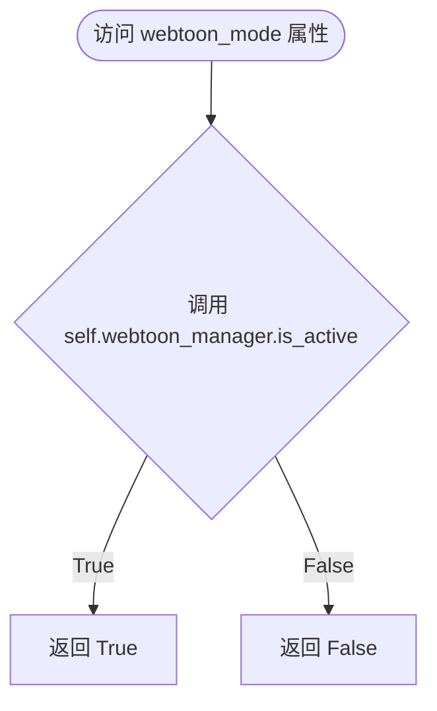

# `comic-translate\app\ui\canvas\image_viewer.py` 详细设计文档

基于PySide6 QGraphicsView的图像查看器组件，支持单图和webtoon（条漫）模式的懒加载显示，具备绘图、文本编辑、矩形框标注、缩放平移等交互功能，采用组合模式管理绘图、交互和事件处理。

## 整体流程


## 类结构

```
ImageViewer (QGraphicsView 图像查看器核心类)
```

## 全局变量及字段


### `rectangle_created`
    
矩形创建信号

类型：`Signal`
    


### `rectangle_selected`
    
矩形选中信号

类型：`Signal`
    


### `rectangle_deleted`
    
矩形删除信号

类型：`Signal`
    


### `command_emitted`
    
命令发射信号

类型：`Signal`
    


### `connect_rect_item`
    
矩形项连接信号

类型：`Signal`
    


### `connect_text_item`
    
文本项连接信号

类型：`Signal`
    


### `page_changed`
    
页面变更信号

类型：`Signal`
    


### `clear_text_edits`
    
清除文本编辑信号

类型：`Signal`
    


### `ImageViewer._scene`
    
图形场景

类型：`QGraphicsScene`
    


### `ImageViewer.photo`
    
当前显示的主图像项

类型：`QGraphicsPixmapItem`
    


### `ImageViewer.drawing_manager`
    
绘图管理器

类型：`DrawingManager`
    


### `ImageViewer.webtoon_manager`
    
条漫懒加载管理器

类型：`LazyWebtoonManager`
    


### `ImageViewer.interaction_manager`
    
交互管理器

类型：`InteractionManager`
    


### `ImageViewer.event_handler`
    
事件处理器

类型：`EventHandler`
    


### `ImageViewer.empty`
    
图像是否为空

类型：`bool`
    


### `ImageViewer.zoom`
    
缩放级别

类型：`int`
    


### `ImageViewer.current_tool`
    
当前工具类型

类型：`str`
    


### `ImageViewer.panning`
    
是否正在平移

类型：`bool`
    


### `ImageViewer.pan_start_pos`
    
平移起始位置

类型：`QPointF`
    


### `ImageViewer.last_pan_pos`
    
上次平移位置

类型：`QPoint`
    


### `ImageViewer.total_scale_factor`
    
总缩放因子

类型：`float`
    


### `ImageViewer.rotate_cursors`
    
旋转光标

类型：`RotateHandleCursors`
    


### `ImageViewer.webtoon_view_state`
    
条漫视图状态

类型：`dict`
    


### `ImageViewer._programmatic_scroll`
    
程序化滚动标志

类型：`bool`
    


### `ImageViewer.rectangles`
    
矩形框列表

类型：`list`
    


### `ImageViewer.text_items`
    
文本项列表

类型：`list`
    


### `ImageViewer.selected_rect`
    
当前选中的矩形

类型：`MoveableRectItem`
    


### `ImageViewer.start_point`
    
绘制起始点

类型：`QPointF`
    


### `ImageViewer.current_rect`
    
当前绘制的矩形

类型：`MoveableRectItem`
    
    

## 全局函数及方法


### `ImageViewer.webtoon_mode`

该属性是一个只读（Read-only）属性，用于判断当前图像查看器是否处于 **Webtoon（条漫/长图）模式**。它作为一个代理接口，将具体的模式判断逻辑委托给其成员属性 `self.webtoon_manager` 的 `is_active()` 方法。

参数：

- `self`：`ImageViewer`，查看器实例本身（隐式参数）。

返回值：`bool`，如果当前处于 Webtoon 模式返回 `True`，否则返回 `False`。

#### 流程图



#### 带注释源码

```python
    @property
    def webtoon_mode(self):
        """Read-only proxy to check if webtoon mode is active."""
        # 委托给 webtoon_manager 组件的具体实现来判断当前是否激活了 Webtoon 模式
        return self.webtoon_manager.is_active()
```


### `ImageViewer.brush_size`

这是一个画笔大小属性（property），为 `ImageViewer` 类提供对绘图管理器画笔粗细的便捷访问。它作为代理属性，允许外部代码通过 `ImageViewer` 实例获取或设置当前画笔的大小，同时保持与 `DrawingManager` 的解耦。

参数（setter）：

- `size`：`int`，要设置的画笔大小（以像素为单位）

返回值（getter）：`int`，当前画笔的粗细大小

返回值（setter）：`None`，无返回值

#### 流程图


#### 带注释源码

```python
@property
def brush_size(self):
    """
    获取当前画笔的粗细大小。
    
    这是一个代理属性，它从 DrawingManager 获取当前的画笔大小，
    允许外部代码通过 ImageViewer 实例直接访问画笔属性。
    
    返回值:
        int: 当前的画笔大小（像素）
    """
    return self.drawing_manager.brush_size

@brush_size.setter
def brush_size(self, size: int):
    """
    设置画笔的粗细大小。
    
    尝试使用 DrawingManager 的 set_brush_size 方法进行设置，
    如果失败则直接赋值。这提供了两种设置途径以增强鲁棒性。
    
    参数:
        size (int): 要设置的画笔大小，必须为正整数
        
    注意:
        该方法会同时设置画笔的水平 和垂直大小为相同值，
        保证画笔形状为正方形。如果需要非正方形画笔，
        应直接调用 DrawingManager.set_brush_size()
    """
    try:
        # 优先尝试调用专门的设置方法，可能包含验证或附加逻辑
        self.drawing_manager.set_brush_size(size, size)
    except Exception:
        # 如果专用方法失败（如参数验证失败），则直接设置属性
        # 这提供了一种降级方案
        self.drawing_manager.brush_size = size
```


### `ImageViewer.eraser_size`

橡皮擦大小属性（Property），用于获取或设置当前绘图管理器的橡皮擦尺寸。该属性充当了 `DrawingManager` 中 `eraser_size` 的代理，通过 getter 获取当前橡皮擦直径，并通过 setter 更新橡皮擦大小。Setter 内部尝试调用 `DrawingManager` 的方法进行设置，若失败则退回到直接赋值，以确保操作的鲁棒性。

参数：

- `size`：`int`，要设置的橡皮擦直径大小（像素值）。仅在 setter（写操作）时使用。

返回值：`int`，当前橡皮擦的直径大小。仅在 getter（读操作）时返回。

#### 流程图

```mermaid
graph TD
    subgraph Setter 流程 (设置大小)
        S_Start[开始: 设置 eraser_size] --> S_Try{尝试调用 drawing_manager.set_eraser_size(size, size)}
        S_Try -->|成功| S_End[结束]
        S_Try -->|异常| S_Fallback[直接赋值 drawing_manager.eraser_size = size]
        S_Fallback --> S_End
    end

    subgraph Getter 流程 (获取大小)
        G_Start[开始: 获取 eraser_size] --> G_Return[返回 drawing_manager.eraser_size]
    end
```

#### 带注释源码

```python
@property
def eraser_size(self):
    """
    Getter: 获取当前橡皮擦的大小。
    代理自 self.drawing_manager.eraser_size。
    """
    return self.drawing_manager.eraser_size

@eraser_size.setter
def eraser_size(self, size: int):
    """
    Setter: 设置橡皮擦的大小。
    尝试通过 DrawingManager 的方法设置大小，如果发生异常则直接赋值，以保证功能正常。
    """
    try:
        # 尝试调用管理器的方法设置宽高均为 size 的橡皮擦
        self.drawing_manager.set_eraser_size(size, size)
    except Exception:
        # 如果方法调用失败（例如不支持），则直接设置属性
        self.drawing_manager.eraser_size = size
```


### `ImageViewer.__init__`

该方法是 `ImageViewer` 类的构造函数，负责初始化整个图像查看器的核心组件、场景、管理器和状态。它通过组合模式整合了绘图管理、Webtoon管理、交互管理和事件处理等模块，并配置了 Qt 图形视图的各种属性。

参数：

- `parent`：用于指定父窗口部件，传递给 `QGraphicsView` 的父类构造函数

返回值：无（`None`），构造函数不返回任何值

#### 流程图

```mermaid
flowchart TD
    A[开始 __init__] --> B[调用父类 QGraphicsView.__init__]
    B --> C[创建 QGraphicsScene]
    C --> D[创建 QGraphicsPixmapItem (self.photo)]
    D --> E[设置 photo 的 ShapeMode 为 BoundingRectShape]
    E --> F[将 photo 添加到 scene]
    F --> G[初始化 Managers - Composition 模式]
    G --> G1[DrawingManager]
    G --> G2[LazyWebtoonManager]
    G --> G3[InteractionManager]
    G --> G4[EventHandler]
    G1 --> H[配置 Viewer Properties]
    H --> I[设置 Anchor、ScrollBar、Background、Frame、Focus]
    I --> J[启用 TouchEvents 和 PanGesture]
    J --> K[设置默认 DragMode 为 NoDrag]
    K --> L[初始化 State 变量]
    L --> L1[empty=True, zoom=0, current_tool=None]
    L1 --> L2[panning=False, pan_start_pos=None]
    L2 --> L3[total_scale_factor=0.2, rotate_cursors, webtoon_view_state]
    L3 --> L4[_programmatic_scroll=False]
    L4 --> M[初始化 Item Lists]
    M --> M1[rectangles=[], text_items=[]]
    M1 --> M2[selected_rect=None]
    M2 --> N[初始化 Box Drawing 状态]
    N --> N1[start_point=None]
    N1 --> N2[current_rect=None]
    N2 --> O[结束 __init__]
```

#### 带注释源码

```python
def __init__(self, parent):
    # 调用父类 QGraphicsView 的构造函数，传递 parent 参数
    super().__init__(parent)
    
    # ==================== Core Setup 核心设置 ====================
    # 创建 QGraphicsScene 作为图形项的容器，关联到当前视图
    self._scene = QGraphicsScene(self)
    # 将场景设置到视图中
    self.setScene(self._scene)
    
    # 创建主图像项，用于显示加载的图片
    self.photo = QGraphicsPixmapItem()
    # 设置形状模式为边界矩形形状，用于精确的碰撞检测
    self.photo.setShapeMode(QGraphicsPixmapItem.BoundingRectShape)
    # 将图像项添加到场景中
    self._scene.addItem(self.photo)

    # ==================== Managers using Composition 使用组合模式初始化管理器 ====================
    # 绘图管理器：处理画笔、橡皮擦、遮罩生成等绘图功能
    self.drawing_manager = DrawingManager(self)
    # Webtoon 懒加载管理器：处理长图/漫画模式的分页加载和显示
    self.webtoon_manager = LazyWebtoonManager(self)
    # 交互管理器：处理矩形框、文本项的选择、取消选择、清除等操作
    self.interaction_manager = InteractionManager(self)
    # 事件处理器：集中处理鼠标、滚轮、视口等各类事件
    self.event_handler = EventHandler(self)

    # ==================== Viewer Properties 视图属性配置 ====================
    # 设置变换锚点和调整大小锚点为鼠标当前位置
    self.setTransformationAnchor(QGraphicsView.AnchorUnderMouse)
    self.setResizeAnchor(QGraphicsView.AnchorUnderMouse)
    # 根据需要显示垂直和水平滚动条
    self.setVerticalScrollBarPolicy(Qt.ScrollBarAsNeeded)
    self.setHorizontalScrollBarPolicy(Qt.ScrollBarAsNeeded)
    # 设置深灰色背景
    self.setBackgroundBrush(QtGui.QBrush(QtGui.QColor(30, 30, 30)))
    # 移除视图边框
    self.setFrameShape(QtWidgets.QFrame.NoFrame)
    # 设置强焦点策略，支持键盘交互
    self.setFocusPolicy(Qt.FocusPolicy.StrongFocus)
    # 启用视口的触摸事件支持
    self.viewport().setAttribute(Qt.WidgetAttribute.WA_AcceptTouchEvents, True)
    # 注册平移手势
    self.viewport().grabGesture(Qt.GestureType.PanGesture)
    # 默认拖拽模式为无，仅在激活 'pan' 工具时启用 ScrollHandDrag
    self.setDragMode(QGraphicsView.DragMode.NoDrag)
    
    # ==================== State 状态变量初始化 ====================
    # 标记当前是否没有加载图像
    self.empty = True
    # 当前缩放级别
    self.zoom = 0
    # 当前选中的工具（pan, brush, eraser 等）
    self.current_tool = None
    # 是否正在进行平移操作
    self.panning = False
    # 平移操作的起始位置
    self.pan_start_pos = None
    # 记录上一次平移的位置
    self.last_pan_pos = QtCore.QPoint()
    # 默认缩放因子
    self.total_scale_factor = 0.2 
    # 旋转句柄光标管理器
    self.rotate_cursors = RotateHandleCursors()
    # Webtoon 视图状态字典
    self.webtoon_view_state = {}

    # Page detection state (used by webtoon and event handlers)
    # 编程方式触发的滚动标志，用于区分用户主动滚动和程序触发的滚动
    self._programmatic_scroll = False
    
    # ==================== Item lists 项目列表初始化 ====================
    # 存储场景中所有矩形框的列表
    self.rectangles: list[MoveableRectItem] = []
    # 存储场景中所有文本项的列表
    self.text_items: list[TextBlockItem] = []
    # 当前选中的矩形框
    self.selected_rect: MoveableRectItem = None
    
    # ==================== Box drawing state 框绘制状态初始化 ====================
    # 绘制矩形时的起始点
    self.start_point: QPointF = None
    # 当前正在绘制的矩形项
    self.current_rect: MoveableRectItem = None
```


### `ImageViewer.hasPhoto`

检查视图是否当前显示有图像内容（照片或Webtoon页面）。

参数：
- （无参数，除隐含的 `self`）

返回值：`bool`，返回 `True` 表示视图中有图像内容，返回 `False` 表示视图为空

#### 流程图


#### 带注释源码

```python
def hasPhoto(self) -> bool:
    """
    检查视图是否当前显示有图像内容。
    
    在Webtoon模式下，需要同时满足：
    1. 视图不为空 (self.empty 为 False)
    2. 至少有一个页面已被加载 (loaded_pages 列表非空)
    
    在普通模式下，只需检查视图不为空即可。
    
    Returns:
        bool: 视图是否包含图像内容
    """
    # 检查是否处于Webtoon模式（长条漫画浏览模式）
    if self.webtoon_mode:
        # Webtoon模式：需同时满足"不为空"且"有已加载页面"
        return not self.empty and len(self.webtoon_manager.loaded_pages) > 0
    
    # 普通模式：仅检查是否设置过图像（即 self.empty 标志）
    return not self.empty
```


### `ImageViewer.load_images_webtoon`

该方法是一个委托方法，用于在 Webtoon 模式下加载图像文件，通过调用内部的 LazyWebtoonManager 实现懒加载策略，并返回加载是否成功的布尔值。

参数：

- `file_paths`：`List[str]`，图像文件的路径列表
- `current_page`：`int`，当前页码，默认为 0，表示首次加载时显示的页面索引

返回值：`bool`，加载成功返回 True，否则返回 False

#### 流程图


#### 带注释源码

```python
def load_images_webtoon(self, file_paths: List[str], current_page: int = 0) -> bool:
    """
    Load images using lazy loading strategy.
    
    This method delegates the actual loading logic to the webtoon_manager,
    which implements a lazy loading strategy for efficient memory usage
    when dealing with large webtoon images.
    
    Args:
        file_paths: List of file paths to the image files
        current_page: The initial page index to display (default: 0)
    
    Returns:
        bool: True if images were loaded successfully, False otherwise
    """
    # Delegate to the lazy loading manager
    return self.webtoon_manager.load_images_lazy(file_paths, current_page)
```


### `ImageViewer.scroll_to_page`

在 Webtoon 模式下，将视图滚动到指定页码的核心方法。通过委托给 `LazyWebtoonManager` 实现实际的滚动逻辑，支持指定滚动位置（如顶部）。

参数：

- `page_index`：`int`，要滚动到的页码索引（从 0 开始）
- `position`：`str`，滚动位置，默认为 `'top'`，可传入 `'center'` 等其他 Qt 对齐方式

返回值：`None`，该方法无返回值，仅执行滚动操作

#### 流程图


#### 带注释源码

```python
def scroll_to_page(self, page_index: int, position='top'):
    """
    在 Webtoon 模式下滚动到指定页码。
    
    Args:
        page_index: 要滚动到的页码索引（从 0 开始）
        position: 滚动位置，'top' 表示滚动到页面顶部，
                  也可以是 'center' 等其他对齐方式
    """
    # 检查当前是否处于 Webtoon 模式
    if self.webtoon_mode:
        # 委托给 LazyWebtoonManager 执行实际滚动
        # LazyWebtoonManager 内部处理图像懒加载和视图定位
        self.webtoon_manager.scroll_to_page(page_index, position)
    
    # 如果不是 Webtoon 模式，此方法不做任何操作
    # 这是合理的设计，因为单图模式下不存在"页码"概念
```


### `ImageViewer.fitInView`

该方法负责将图像或 Webtoon 页面适应到视图窗口中，根据当前模式（Webtoon 模式或普通单图模式）计算并应用合适的缩放比例，使图像内容完整且居中显示在视口中央。

参数：无

返回值：`None`，无返回值描述

#### 流程图

```mermaid
flowchart TD
    A[开始 fitInView] --> B{是否为 Webtoon 模式?}
    
    B -->|是| C{是否有图像且 image_items 不为空?}
    C -->|否| L[结束]
    C -->|是| D[遍历查找第一个已加载的图像项]
    
    D --> E{找到 first_item?}
    E -->|是| F[根据 first_item 位置和边界构建 image_rect]
    E -->|否| G[使用估算值: image_positions[0], image_heights[0], webtoon_width]
    G --> F
    
    F --> H{image_rect 是否有效?}
    H -->|否| L
    H -->|是| I[应用 20 像素内边距 padding]
    I --> J[重置缩放: unity = transform.mapRect]
    J --> K[计算缩放因子: factor = min(viewport宽/scene宽, viewport高/scene高)]
    K --> M[应用缩放并居中视图]
    M --> N[设置完整场景矩形用于滚动]
    N --> L
    
    B -->|否| O{hasPhoto 是否有照片?}
    O -->|否| L
    O -->|是| P[获取 photo.boundingRect]
    P --> Q{rect 是否有效?}
    Q -->|否| L
    Q -->|是| R[设置场景矩形为 rect]
    R --> S[重置缩放]
    S --> T[计算缩放因子]
    T --> U[应用缩放并居中视图]
    U --> L
```

#### 带注释源码

```python
def fitInView(self):
    """
    将图像/页面适应到视图中。根据当前模式（webtoon_mode 或普通模式）
    计算并应用合适的缩放比例，使内容完整显示并居中。
    """
    # 处理 Webtoon 懒加载模式
    if self.webtoon_mode:
        # 检查是否有图像且已加载图像项
        if not self.empty and self.webtoon_manager.image_items:
            # 使用第一个已加载的图像，或回退到第一个位置
            first_item = None
            # 遍历查找第一个已加载的图像项
            for i in range(len(self.webtoon_manager.image_file_paths)):
                if i in self.webtoon_manager.image_items:
                    first_item = self.webtoon_manager.image_items[i]
                    break
            
            if first_item:
                # 根据第一个图像项的位置和边界构建矩形
                image_rect = QRectF(first_item.pos(), first_item.boundingRect().size())
            else:
                # 回退到估算的第一页边界
                y_pos = self.webtoon_manager.image_positions[0] if self.webtoon_manager.image_positions else 100
                height = self.webtoon_manager.image_heights[0] if self.webtoon_manager.image_heights else 1000
                width = self.webtoon_manager.webtoon_width
                image_rect = QRectF(0, y_pos, width, height)
            
            # 如果图像矩形有效
            if not image_rect.isNull():
                # 添加内边距，使图像不紧贴边缘
                padding = 20
                padded_rect = image_rect.adjusted(-padding, -padding, padding, padding)
                
                # 设置场景矩形
                self.setSceneRect(padded_rect)
                # 重置当前变换到单位矩阵，获取 unity 矩形
                unity = self.transform().mapRect(QRectF(0, 0, 1, 1))
                self.scale(1 / unity.width(), 1 / unity.height())
                
                # 计算视口和场景的尺寸
                viewrect = self.viewport().rect()
                scenerect = self.transform().mapRect(padded_rect)
                # 计算缩放因子，使图像完全适应视口
                factor = min(viewrect.width() / scenerect.width(),
                             viewrect.height() / scenerect.height())
                # 应用缩放
                self.scale(factor, factor)
                # 居中视图到图像中心
                self.centerOn(image_rect.center())
                
                # 设置完整的场景矩形以支持滚动
                self.setSceneRect(0, 0, self.webtoon_manager.webtoon_width, self.webtoon_manager.total_height)

    # 处理普通单图模式
    elif self.hasPhoto():
        # 获取照片的边界矩形
        rect = self.photo.boundingRect()
        if not rect.isNull():
            # 设置场景矩形
            self.setSceneRect(rect)
            # 重置变换
            unity = self.transform().mapRect(QRectF(0, 0, 1, 1))
            self.scale(1 / unity.width(), 1 / unity.height())
            
            # 计算缩放因子
            viewrect = self.viewport().rect()
            scenerect = self.transform().mapRect(rect)
            factor = min(viewrect.width() / scenerect.width(),
                         viewrect.height() / scenerect.height())
            # 应用缩放并居中
            self.scale(factor, factor)
            self.centerOn(rect.center())
```


### `ImageViewer.set_tool`

该方法用于切换 ImageViewer 的当前工具状态。它根据传入的工具名称更新内部工具状态，并相应地调整视图的拖拽模式（DragMode）和光标（Cursor），以适配不同的交互需求，如平移、绘画或擦除。

参数：

-  `tool`：`str`，需要激活的工具名称（如 `'pan'`（平移）、`'brush'`（画笔）、`'eraser'`（橡皮擦）等）。

返回值：`None`，该方法仅修改实例状态，不返回任何值。

#### 流程图

```mermaid
graph TD
    A[开始: set_tool(tool)] --> B[设置 self.current_tool = tool]
    B --> C{tool == 'pan'?}
    C -- 是 --> D[设置拖拽模式: ScrollHandDrag]
    D --> Z[结束]
    C -- 否 --> E{tool in ['brush', 'eraser']?}
    E -- 是 --> F[设置拖拽模式: NoDrag]
    F --> G{tool == 'brush'?}
    G -- 是 --> H[获取 brush_cursor]
    G -- 否 --> I[获取 eraser_cursor]
    H --> J[设置光标: self.setCursor(cursor)]
    I --> J
    J --> Z
    E -- 否 --> K[设置拖拽模式: NoDrag]
    K --> Z
```

#### 带注释源码

```python
def set_tool(self, tool: str):
    """
    切换当前工具。
    
    参数:
        tool (str): 工具名称，选项包括 'pan', 'brush', 'eraser' 或其他。
    """
    # 1. 更新内部状态，记录当前选中的工具
    self.current_tool = tool
    
    # 2. 判断工具类型并执行对应的视图交互配置
    
    # 2.1 如果是 'pan' (平移工具)
    if tool == 'pan':
        # 开启 ScrollHandDrag 模式，允许通过鼠标拖拽来滚动视图
        self.setDragMode(QGraphicsView.ScrollHandDrag)
        
    # 2.2 如果是 'brush' (画笔) 或 'eraser' (橡皮擦)
    elif tool in ['brush', 'eraser']:
        # 禁用视图的默认拖拽行为，以免与绘图操作冲突
        self.setDragMode(QGraphicsView.NoDrag)
        
        # 根据具体工具从 drawing_manager 获取对应的光标
        if tool == 'brush':
            cursor = self.drawing_manager.brush_cursor
        else:
            cursor = self.drawing_manager.eraser_cursor
            
        # 应用自定义光标
        self.setCursor(cursor)
        
    # 2.3 其他工具（例如选择、文本等）
    else:
        # 默认禁用拖拽模式
        self.setDragMode(QGraphicsView.NoDrag)
```


### `ImageViewer.set_br_er_size`

该方法用于根据当前选定的工具（画笔或橡皮擦）动态调整绘图工具的尺寸，并更新光标显示。

参数：

- `size`：`int`，原始尺寸值，用于设置绘图工具的基础大小
- `scaled_size`：`int`，缩放后的尺寸值，用于在高分辨率或缩放场景下的实际绘图尺寸

返回值：`None`，该方法无返回值，仅执行状态修改和光标更新操作

#### 流程图


#### 带注释源码

```python
def set_br_er_size(self, size, scaled_size):
    """
    设置画笔或橡皮擦的大小。
    
    根据当前选定的工具类型，调用相应的 DrawingManager 方法来调整工具尺寸，
    并更新视图光标以提供视觉反馈。
    
    参数:
        size: 原始尺寸值，传递给 DrawingManager 的基础大小参数
        scaled_size: 缩放后的尺寸值，用于处理视图缩放情况下的尺寸计算
    """
    # 检查当前工具是否为画笔
    if self.current_tool == 'brush':
        # 调用 drawing_manager 设置画笔的原始尺寸和缩放尺寸
        self.drawing_manager.set_brush_size(size, scaled_size)
        # 更新视图光标为画笔对应的光标样式
        self.setCursor(self.drawing_manager.brush_cursor)
    # 检查当前工具是否为橡皮擦
    elif self.current_tool == 'eraser':
        # 调用 drawing_manager 设置橡皮擦的原始尺寸和缩放尺寸
        self.drawing_manager.set_eraser_size(size, scaled_size)
        # 更新视图光标为橡皮擦对应的光标样式
        self.setCursor(self.drawing_manager.eraser_cursor)
```


### `ImageViewer.constrain_point`

该方法用于将给定的场景坐标点限制在当前视图的有效区域内，确保坐标不会超出图像或Webtoon模式的边界。

参数：

- `point`：`QPointF`，需要限制在有效范围内的场景坐标点

返回值：`QPointF`，限制后在有效区域内的坐标点

#### 流程图


#### 带注释源码

```python
def constrain_point(self, point: QPointF) -> QPointF:
    """
    将给定的场景坐标点限制在当前视图的有效区域内。
    
    在 Webtoon 模式下，限制点在整个 Webtoon 画布范围内；
    在普通模式下，限制点在当前加载的图片范围内；
    如果没有加载任何图片，则返回原始点。
    
    参数:
        point: QPointF，需要限制范围的目标点坐标
        
    返回:
        QPointF: 限制后的安全坐标点
    """
    # 判断当前是否处于 Webtoon 模式
    if self.webtoon_mode:
        # 获取 Webtoon 画布的宽度和总高度
        webtoon_width = self.webtoon_manager.webtoon_width
        total_height = self.webtoon_manager.total_height
        
        # 使用 max(0, min(...)) 夹逼法将坐标限制在 [0, 边界值] 范围内
        constrained_x = max(0, min(point.x(), webtoon_width))
        constrained_y = max(0, min(point.y(), total_height))
        
        return QPointF(constrained_x, constrained_y)

    # 判断当前是否已加载图片
    elif self.hasPhoto():
        # 获取当前图片的像素尺寸
        pixmap_width = self.photo.pixmap().width()
        pixmap_height = self.photo.pixmap().height()
        
        # 使用夹逼法限制坐标在图片尺寸范围内
        constrained_x = max(0, min(point.x(), pixmap_width))
        constrained_y = max(0, min(point.y(), pixmap_height))
        
        return QPointF(constrained_x, constrained_y)
    
    # 如果既不是 Webtoon 模式也没有加载图片，直接返回原始点
    return point
```


### `ImageViewer.get_image_array`

该方法负责将当前视图中的图像数据提取为 NumPy 数组。它支持两种模式：Webtoon 模式（长图滚动）和普通单图模式。在普通模式下，它可以选择渲染高质量的整图，或者仅合成当前的照片和覆盖层（patches）为一个二维图像数组。

参数：

- `paint_all`：`bool`，默认为 `False`。如果为 `True`，则重置视图变换以渲染高分辨率的完整场景图像；如果为 `False`，则仅处理当前的照片和补丁。
- `include_patches`：`bool`，默认为 `True`。如果为 `True`，该方法会遍历场景中的所有项目，将除主照片以外的 `QGraphicsPixmapItem`（如补丁）绘制到图像上；如果为 `False`，则仅返回纯照片图像。

返回值：`np.ndarray | None`，返回包含图像数据的 NumPy 数组（格式为 RGB，形状为 (height, width, 3)），如果没有加载图像则返回 `None`。

#### 流程图

```mermaid
flowchart TD
    A([Start get_image_array]) --> B{hasPhoto?}
    B -- No --> C[Return None]
    B -- Yes --> D{webtoon_mode?}
    D -- Yes --> E[Delegate to webtoon_manager.get_visible_area_image]
    E --> F[Return Result]
    D -- No --> G{photo.pixmap exists?}
    G -- No --> C
    G -- Yes --> H{paint_all?}
    
    %% High Res Path
    H -- Yes --> I[Calculate Scale Factor 2x]
    I --> J[Create Scaled QImage]
    J --> K[Backup Transform]
    K --> L[Reset View Transform]
    L --> M[Render Full Scene]
    M --> N[Scale Down to Original]
    N --> O[Restore Transform]
    
    %% Standard Path
    H -- No --> P{include_patches?}
    
    %% Composite Path
    P -- Yes --> Q[Create Transparent QImage]
    Q --> R[Draw Photo Pixmap]
    R --> S[Iterate Scene Items]
    S --> T{Item is Patch?}
    T -- Yes --> U[Draw Patch Pixmap]
    T -- No --> V[Next Item]
    V --> S
    S --> W[End Loop]
    
    %% Raw Path
    P -- No --> X[Get QImage from Photo]
    
    %% Merge Paths
    O --> Y[Convert QImage to Format_RGB888]
    W --> Y
    X --> Y
    
    Y --> Z[Validate Bytes]
    Z --> AA[Create NumPy Array (reshape/pad)]
    AA --> AB([Return Array])
```

#### 带注释源码

```python
def get_image_array(self, paint_all=False, include_patches=True):
    """
    Get image array data. In webtoon mode, returns the visible area image.
    In regular mode, returns the single photo image with optional patches/scene items.
    """
    # 1. Check if an image is loaded
    if not self.hasPhoto():
        return None

    # 2. Handle Webtoon Mode (Vertical scrolling long image)
    if self.webtoon_mode:
        # Delegate to the specialized webtoon manager
        result, _ = self.webtoon_manager.get_visible_area_image(paint_all, include_patches)
        return result

    # 3. Handle Regular Single Image Mode
    # Check if the main photo pixmap exists
    if self.photo.pixmap() is None:
        return None

    qimage = None
    
    # --- Path A: High Resolution Full Image ---
    if paint_all:
        # Create a high-resolution QImage
        scale_factor = 2 # Increase this for higher resolution
        pixmap = self.photo.pixmap()
        original_size = pixmap.size()
        scaled_size = original_size * scale_factor

        # Initialize image with transparency
        qimage = QtGui.QImage(scaled_size, QtGui.QImage.Format_ARGB32)
        qimage.fill(Qt.transparent)

        # Create a QPainter with antialiasing
        painter = QtGui.QPainter(qimage)
        painter.setRenderHint(QtGui.QPainter.RenderHint.Antialiasing, True)
        painter.setRenderHint(QtGui.QPainter.RenderHint.TextAntialiasing, True)
        painter.setRenderHint(QtGui.QPainter.RenderHint.SmoothPixmapTransform, True)
        
        # Reset transform to render the "flat" view (as if fitInView was called on full image)
        original_transform = self.transform()
        self._scene.views()[0].resetTransform()
        self._scene.setSceneRect(0, 0, original_size.width(), original_size.height())
        
        # Render the entire scene
        self._scene.render(painter)
        painter.end()

        # Scale down the image to the original size
        qimage = qimage.scaled(
            original_size, 
            QtCore.Qt.AspectRatioMode.KeepAspectRatio, 
            QtCore.Qt.TransformationMode.SmoothTransformation
        )

        # Restore the original transformation (zoom/pan state)
        self._scene.views()[0].setTransform(original_transform)
    
    # --- Path B: Standard Composite or Raw ---
    elif include_patches:
        # Create an image container matching photo size
        pixmap = self.photo.pixmap()
        qimage = QtGui.QImage(pixmap.size(), QtGui.QImage.Format_ARGB32)
        qimage.fill(Qt.transparent)
        painter = QtGui.QPainter(qimage)
        painter.setRenderHint(QtGui.QPainter.RenderHint.SmoothPixmapTransform, True)
        
        # Draw the base photo
        painter.drawPixmap(0, 0, pixmap)
        
        # Iterate over scene items to find patches (extra pixmap items)
        # Updated patch detection logic - patches are now added directly to scene
        for item in self._scene.items():
            if isinstance(item, QGraphicsPixmapItem) and item != self.photo:
                # Check if this is a patch item (has the hash key data)
                if item.data(0) is not None:  # HASH_KEY = 0 from PatchCommandBase
                    pos = item.pos()
                    painter.drawPixmap(int(pos.x()), int(pos.y()), item.pixmap())
        painter.end()
    else:
        # Just get the raw photo image
        qimage = self.photo.pixmap().toImage()

    # --- Step 4: Convert QImage to NumPy Array ---
    
    # Convert to RGB888 format suitable for numpy
    qimage = qimage.convertToFormat(QtGui.QImage.Format.Format_RGB888)
    width = qimage.width()
    height = qimage.height()
    bytes_per_line = qimage.bytesPerLine()

    byte_count = qimage.sizeInBytes()
    expected_size = height * bytes_per_line  # bytes per line can include padding

    if byte_count != expected_size:
        print(f"QImage sizeInBytes: {byte_count}, Expected size: {expected_size}")
        print(f"Image dimensions: ({width}, {height}), Format: {qimage.format()}")
        raise ValueError(f"Byte count mismatch: got {byte_count} but expected {expected_size}")

    ptr = qimage.bits()

    # Convert memoryview to a numpy array considering the complete data with padding
    arr = np.array(ptr).reshape((height, bytes_per_line))
    # Exclude the padding bytes, keeping only the relevant image data
    arr = arr[:, :width * 3]
    # Reshape to the correct dimensions without the padding bytes
    arr = arr.reshape((height, width, 3))

    return arr
```


### `ImageViewer.qimage_from_array`

该方法将 NumPy 数组转换为 Qt 的 QImage 对象，实现图像数据的跨框架转换，使 NumPy 数组形式的图像数据能够在 Qt 图形场景中显示或进一步处理。

参数：

- `img_array`：`np.ndarray`，输入的图像数组，预期形状为 (height, width, channel)，其中 channel 通常为 3（RGB）

返回值：`QtGui.QImage`，转换后的 Qt 图像对象，格式为 RGB888

#### 流程图


#### 带注释源码

```
def qimage_from_array(self, img_array: np.ndarray):
    """
    将NumPy数组转换为Qt QImage对象
    
    参数:
        img_array: numpy数组，形状为 (height, width, channels)，通道顺序为RGB
        
    返回:
        QtGui.QImage: 格式为RGB888的Qt图像对象
    """
    # 从数组形状中提取高度、宽度和通道数
    height, width, channel = img_array.shape
    
    # 计算每行像素的字节数（3字节 = 24位 = RGB888格式）
    bytes_per_line = 3 * width
    
    # 使用NumPy数组的底层数据缓冲区直接构造QImage
    # 这种方式避免了数据拷贝，提高了性能
    qimage = QtGui.QImage(
        img_array.data,      # 底层数据指针
        width,               # 图像宽度
        height,              # 图像高度
        bytes_per_line,      # 每行字节数
        QtGui.QImage.Format.Format_RGB888  # 24位RGB格式
    )
    
    return qimage
```


### `ImageViewer.display_image_array`

该方法接收一个 NumPy 图像数组 (`img_array`)，将其转换为 Qt 可显示的 Pixmap 格式，清除当前场景中的所有内容（如已有的漫画页、矩形框或文本），然后将新的图像设置为查看器的主照片。如果 `fit` 参数为 `True`，它还会自动调整视图以完整显示图像。

参数：

- `img_array`：`np.ndarray`，待显示的图像数据，通常为形状 `(height, width, 3)` 的 RGB 数组。
- `fit`：`bool` (默认为 `True`)，是否在加载图像后自动调用 `fitInView` 以适应视图。

返回值：`None`，该方法直接操作视图状态，不返回数据。

#### 流程图


#### 带注释源码

```python
    def display_image_array(self, img_array: np.ndarray, fit: bool = True):
        """
        将 numpy 数组格式的图像数据显示在 ImageViewer 中。
        
        Args:
            img_array: numpy 数组格式的图像数据。
            fit: 是否在加载后适应视图。
        """
        # 1. 将 NumPy 数组转换为 Qt 的 QImage 对象
        # 这里调用了类内定义的 qimage_from_array 方法
        qimage = self.qimage_from_array(img_array)
        
        # 2. 将 QImage 转换为适合在 GUI 上显示的 QPixmap
        pixmap = QtGui.QPixmap.fromImage(qimage)
        
        # 3. 清除场景中的旧内容（如旧的图片、矩形框、文字等）
        self.clear_scene()
        
        # 4. 设置新的 Pixmap 为当前显示的图片，并处理缩放逻辑
        self.setPhoto(pixmap, fit=fit)
```


### `ImageViewer.clear_scene`

该方法用于重置图像查看器场景到初始状态，清除所有项目（包括webtoon管理器、场景元素、矩形和文本项），并重新初始化主图像项。

参数：

- 该方法无参数（仅包含隐式`self`参数）

返回值：`None`，无返回值

#### 流程图


#### 带注释源码

```python
def clear_scene(self):
    """
    清除场景中的所有内容并将查看器重置为初始状态。
    包括清空webtoon管理器、场景、矩形列表、文本项列表，
    并重新创建主图像项。
    """
    # 清除webtoon管理器中的所有数据和状态
    self.webtoon_manager.clear() 
    
    # 清除图形场景中的所有项目（矩形、文本、绘制笔画等）
    self._scene.clear()
    
    # 清空内部维护的矩形项目列表
    self.rectangles.clear()
    
    # 清空内部维护的文本项目列表
    self.text_items.clear()
    
    # 重置当前选中的矩形为None
    self.selected_rect = None
    
    # 重新创建主图像项（photo）
    # 旧的photo已被scene.clear()删除，需要新建
    self.photo = QGraphicsPixmapItem()
    
    # 设置图像项的形状模式为边界矩形形状
    # 这影响鼠标事件检测和边界计算
    self.photo.setShapeMode(QGraphicsPixmapItem.BoundingRectShape)
    
    # 将新创建的photo项添加到场景中
    self._scene.addItem(self.photo)
```


### `ImageViewer.setPhoto`

该方法用于设置并显示图像查看器中的图片。如果提供了有效的 pixmap，则将其设置为显示的图片，并根据 fit 参数决定是否自动适应视图；如果未提供有效的 pixmap，则清除当前图片并重置相关状态。

参数：

- `pixmap`：`QtGui.QPixmap`，要显示的图片像素映射对象，默认为 None，当为 None 或空时表示清除图片
- `fit`：`bool`，是否在显示图片时自动适应视图以完整显示图片，默认为 True

返回值：`None`，该方法无返回值

#### 流程图


#### 带注释源码

```python
def setPhoto(self, pixmap: QtGui.QPixmap = None, fit: bool = True):
    """
    设置图像查看器中显示的图片
    
    参数:
        pixmap: 要显示的 QPixmap 对象，如果为 None 或空则清除图片
        fit: 是否在显示时自动适应视图大小
    """
    # 检查 pixmap 是否有效（存在且不为空）
    if pixmap and not pixmap.isNull():
        self.empty = False  # 标记状态为非空
        self.photo.setPixmap(pixmap)  # 将 pixmap 设置到 graphics 项
        
        # 如果需要适应视图
        if fit:
            self.fitInView()  # 调整视图以完整显示图片
    else:
        # pixmap 无效，清除图片
        self.empty = True  # 标记状态为空
        self.photo.setPixmap(QtGui.QPixmap())  # 清除 pixmap
    
    # 重置缩放级别
    self.zoom = 0
```


### `ImageViewer.get_mask_for_inpainting`

获取用于图像修复（inpainting）的掩码，通过委托给绘图管理器从当前笔触生成掩码。

参数：
- 无显式参数（仅包含隐式 `self` 参数）

返回值：`Mask`（掩码类型，由 `DrawingManager.generate_mask_from_strokes()` 返回），返回当前场景中笔触所生成的掩码，用于图像修复操作。

#### 流程图


#### 带注释源码

```python
def get_mask_for_inpainting(self):
    """
    获取用于图像修复（inpainting）的掩码。
    
    该方法委托给 DrawingManager 来根据当前场景中的笔触（strokes）
    生成一个掩码图像。该掩码通常用于指示需要修复或填充的图像区域。
    
    Returns:
        Mask: 由绘图管理器生成的掩码，用于后续的图像修复处理
    """
    # 调用 drawing_manager 的方法从笔触生成掩码
    mask = self.drawing_manager.generate_mask_from_strokes()
    # 返回生成的掩码
    return mask
```


### `ImageViewer.create_rect_item`

该方法用于创建一个可移动的矩形图形项（MoveableRectItem），将其添加到QGraphicsScene场景中，并返回该矩形项对象。

参数：

- `rect`：`QRectF`，定义矩形的几何尺寸和位置
- `scene_pos`：`QPointF`，可选参数，表示场景中的目标位置（当前方法中未使用）

返回值：`MoveableRectItem`，返回新创建的矩形图形项对象

#### 流程图


#### 带注释源码

```python
def create_rect_item(self, rect: QRectF, scene_pos: QPointF = None) -> MoveableRectItem:
    """
    创建一个可移动的矩形图形项并添加到场景中。
    
    Args:
        rect: QRectF，定义矩形的几何尺寸和位置
        scene_pos: QPointF，可选参数，表示场景中的目标位置（当前方法中未使用）
    
    Returns:
        MoveableRectItem: 创建的矩形图形项对象
    """
    # 使用传入的 rect 创建 MoveableRectItem 实例
    # 参数 (rect, None) - rect 定义几何形状，None 为父项
    rect_item = MoveableRectItem(rect, None)
    
    # 将新创建的矩形项添加到 QGraphicsScene 场景中
    self._scene.addItem(rect_item)
    
    # 返回创建成功的矩形项，供调用者进一步操作
    return rect_item
```


### `ImageViewer.add_rectangle`

该方法负责在图像查看器的场景中创建一个可移动的矩形项（MoveableRectItem），设置其位置、旋转角度和旋转原点，并将其添加到场景和内部列表中进行管理，同时发射信号通知其他组件新矩形项已创建。

参数：

- `self`：`ImageViewer`，方法所属的实例对象
- `rect`：`QRectF`，矩形的几何尺寸（宽度和高度）
- `position`：`QPointF`，矩形在场景中的位置坐标
- `rotation`：`float`，矩形的旋转角度（度），默认为 0
- `origin`：`QPointF`，矩形的旋转原点，默认为 None

返回值：`MoveableRectItem`，创建并添加到场景中的可移动矩形项

#### 流程图


#### 带注释源码

```python
def add_rectangle(self, rect: QRectF, position: QPointF, rotation: float = 0, origin: QPointF = None) -> MoveableRectItem:
    """
    创建并添加一个可移动矩形项到场景中。
    
    Args:
        rect: 矩形的几何尺寸 (QRectF)
        position: 矩形在场景中的位置 (QPointF)
        rotation: 旋转角度，默认为 0 (float)
        origin: 旋转原点，默认为 None (QPointF)
    
    Returns:
        创建的 MoveableRectItem 实例
    """
    # 1. 调用内部方法创建矩形图形项
    rect_item = self.create_rect_item(rect)
    
    # 2. 设置矩形在场景中的位置
    rect_item.setPos(position)
    
    # 3. 设置矩形的旋转角度
    rect_item.setRotation(rotation)
    
    # 4. 如果提供了旋转原点，则设置旋转中心点
    if origin:
        rect_item.setTransformOriginPoint(origin)
    
    # 5. 发射信号通知其他组件新矩形项已创建
    self.connect_rect_item.emit(rect_item)
    
    # 6. 将矩形项添加到内部列表进行追踪管理
    self.rectangles.append(rect_item)
    
    # 7. 返回创建的矩形项供调用者使用
    return rect_item
```


### `ImageViewer.add_text_item`

该方法负责根据提供的 `TextItemProperties` 属性配置，在场景中创建并添加一个 `TextBlockItem` 文本项目，支持从字典或 `TextItemProperties` 对象加载配置，并触发相应的信号通知。

参数：

- `properties`：`TextItemProperties | dict`，文本项目属性对象或字典，包含文本内容、字体、颜色、对齐方式等所有配置信息

返回值：`TextBlockItem`，创建并添加到场景中的文本项目实例

#### 流程图

```mermaid
flowchart TD
    A[开始 add_text_item] --> B{properties 是 dict?}
    B -->|是| C[调用 TextItemProperties.from_dict 转换]
    B -->|否| D[保持 properties 不变]
    C --> E
    D --> E
    E[创建 TextBlockItem 实例] --> F{properties.width 不为 None?}
    F -->|是| G[调用 item.set_text 设置文本和宽度]
    F -->|否| H
    G --> H
    H[设置文本方向] --> I{properties.transform_origin 存在?}
    I -->|是| J[设置变换原点]
    I -->|否| K
    J --> K
    K[设置位置、旋转和缩放] --> L[设置垂直排列和颜色]
    L --> M[复制选中的轮廓]
    M --> N[更新文本项目]
    N --> O[添加到场景]
    O --> P[添加到 text_items 列表]
    P --> Q[发射 connect_text_item 信号]
    Q --> R[返回创建的 TextBlockItem]
```

#### 带注释源码

```python
def add_text_item(self, properties) -> TextBlockItem:
    """
    Create and add a TextBlockItem to the scene using TextItemProperties.
    
    Args:
        properties: TextItemProperties dataclass containing all text item settings
        
    Returns:
        TextBlockItem: The created text item
    """
    
    # 如果传入的是字典，则转换为 TextItemProperties 对象
    if isinstance(properties, dict):
        properties = TextItemProperties.from_dict(properties)
    
    # 使用属性参数构造 TextBlockItem
    # 基于 load_state 函数的最新构造逻辑
    item = TextBlockItem(
        text=properties.text, 
        font_family=properties.font_family,
        font_size=properties.font_size, 
        render_color=properties.text_color,
        alignment=properties.alignment, 
        line_spacing=properties.line_spacing,
        outline_color=properties.outline_color, 
        outline_width=properties.outline_width,
        bold=properties.bold, 
        italic=properties.italic, 
        underline=properties.underline,
        direction=properties.direction,
    )
    
    # 如果指定了宽度，则应用宽度设置
    if properties.width is not None:
        item.set_text(properties.text, properties.width)
    
    # 设置文本方向（水平/垂直）
    item.set_direction(properties.direction)
    
    # 如果指定了变换原点，则设置
    if properties.transform_origin:
        item.setTransformOriginPoint(QPointF(*properties.transform_origin))
    
    # 设置位置、旋转角度和缩放
    item.setPos(QPointF(*properties.position))
    item.setRotation(properties.rotation)
    item.setScale(properties.scale)

    # 设置垂直排列标志和文本颜色
    item.set_vertical(bool(properties.vertical))
    item.set_color(properties.text_color)
            
    # 复制选中轮廓配置
    item.selection_outlines = properties.selection_outlines.copy()
    
    # 刷新项目渲染
    item.update()

    # 添加到场景并跟踪管理
    self._scene.addItem(item)
    self.text_items.append(item)
    
    # 发射连接信号，通知其他组件有新文本项被添加
    self.connect_text_item.emit(item)
    
    return item
```


### `ImageViewer.sel_rot_item`

该方法是一个代理方法（Proxy Method），它将图形视图中的选择与旋转交互逻辑委托给内部持有的 `InteractionManager` 实例进行处理。通常用于响应用户的特定交互操作（如点击旋转手柄）来触发选择或旋转状态。

参数：
- 无（仅包含隐式参数 `self`）

返回值：`Any`，返回 `InteractionManager.sel_rot_item()` 方法的执行结果。具体返回值类型取决于 `InteractionManager` 的内部实现（例如选中的图形项 `MoveableRectItem` 或操作状态 `None`）。

#### 流程图

```mermaid
graph TD
    A([Start: sel_rot_item 调用]) --> B{调用 InteractionManager}
    B -->|传递控制权| C[self.interaction_manager.sel_rot_item]
    C --> D([Return: 返回结果])
    
    style B fill:#f9f,stroke:#333,stroke-width:2px
    style C fill:#ff9,stroke:#333,stroke-width:2px
```

#### 带注释源码

```python
def sel_rot_item(self):
    """
    代理方法：将选择与旋转逻辑委托给 InteractionManager。
    
    此方法不包含具体的交互逻辑，只是简单地将调用转发给管理器的实现。
    这样可以保持 ImageViewer 类的职责单一（负责视图显示），
    而将交互细节封装在 InteractionManager 中。
    """
    return self.interaction_manager.sel_rot_item()
```


### `ImageViewer.select_rectangle`

该方法是一个代理方法，将矩形选择操作委托给 `InteractionManager` 处理，用于在场景中选择一个 `MoveableRectItem` 矩形项，更新当前选中的矩形状态并触发相应的选择信号。

参数：

- `rect`：`MoveableRectItem`，需要选择的矩形项对象

返回值：`None`，该方法通过委托给 `InteractionManager` 执行选择操作，不直接返回结果

#### 流程图

```mermaid
flowchart TD
    A[ImageViewer.select_rectangle] --> B{rect参数是否有效?}
    B -->|是| C[调用interaction_manager.select_rectangle]
    B -->|否| D[直接返回]
    C --> E[InteractionManager内部处理]
    E --> F[更新selected_rect状态]
    F --> G[发出rectangle_selected信号]
    G --> H[返回None]
```

#### 带注释源码

```python
def select_rectangle(self, rect: MoveableRectItem):
    """
    代理方法：将矩形选择操作委托给InteractionManager处理。
    
    该方法是一个代理模式(Proxy Pattern)的实现，将具体的矩形选择逻辑
    委托给interaction_manager组件执行。InteractionManager负责处理
    选中状态的切换、信号发射以及与场景中其他元素的交互逻辑。
    
    参数:
        rect: MoveableRectItem类型，要选择的矩形项
        
    返回:
        None: 通过委托的InteractionManager处理选择逻辑，
              当前方法本身不返回任何值
    """
    return self.interaction_manager.select_rectangle(rect)
```


### `ImageViewer.deselect_rect`

取消选中指定的矩形项，通过委托给 `InteractionManager` 来执行实际的取消选中操作。

参数：

- `rect`：`MoveableRectItem`，要取消选中的矩形项

返回值：`Unknown`，返回 `InteractionManager.deselect_rect()` 的执行结果（具体类型依赖于 `InteractionManager` 的实现，代码中未提供）

#### 流程图

```mermaid
flowchart TD
    A[开始 deselect_rect] --> B[接收 rect 参数: MoveableRectItem]
    B --> C{检查 rect 是否有效}
    C -->|有效| D[调用 self.interaction_manager.deselect_rect(rect)]
    C -->|无效| E[直接返回 None 或按原样传递]
    D --> F[返回执行结果]
    E --> F
```

#### 带注释源码

```python
def deselect_rect(self, rect: MoveableRectItem):
    """
    取消选中指定的矩形项。
    
    这是一个代理方法，将实际的处理逻辑委托给 InteractionManager。
    当用户取消选择某个矩形（MoveableRectItem）时调用此方法。
    
    Args:
        rect: MoveableRectItem，要取消选中的矩形项
        
    Returns:
        InteractionManager.deselect_rect() 的返回值
    """
    return self.interaction_manager.deselect_rect(rect)
```


### `ImageViewer.deselect_all`

该方法是 `ImageViewer` 类的公共 API 之一，作为一个代理方法，将取消选择操作委托给内部的 `InteractionManager` 处理。它用于清除当前所有选中的矩形框（`MoveableRectItem`）的选择状态。

参数：
- 无（仅包含 `self` 隐式参数）

返回值：`Unknown`（取决于 `InteractionManager.deselect_all()` 的返回值，代码中未明确声明返回类型），该方法返回交互管理器取消选择操作的结果。

#### 流程图

```mermaid
flowchart TD
    A[调用 ImageViewer.deselect_all] --> B{检查 interaction_manager 是否存在}
    B -->|是| C[调用 self.interaction_manager.deselect_all]
    B -->|否| D[可能引发 AttributeError]
    C --> E[返回交互管理器的取消选择结果]
    E --> F[结束]
```

#### 带注释源码

```python
def deselect_all(self):
    """
    取消选择当前所有选中的项目。
    
    这是一个代理方法，将实际操作委托给 InteractionManager 处理。
    内部会调用 interaction_manager.deselect_all() 来执行具体的取消选择逻辑，
    包括清除 selected_rect 状态以及相关的事件处理。
    
    Returns:
        Any: 返回 InteractionManager.deselect_all() 的结果，通常为 None
    """
    return self.interaction_manager.deselect_all()
```


### `ImageViewer.clear_rectangles`

该方法是一个代理方法（Proxy Method），用于将矩形清除的操作委托给内部的 `InteractionManager` 实例。它允许调用者通过 `page_switch` 参数指定清除操作是否发生在页面切换的上下文中，从而影响清除的具体行为（例如是否保留跨页元素等）。

参数：

- `page_switch`：`bool`，默认值为 `False`。一个布尔标志，指示此清除操作是否作为页面切换的一部分被调用。如果为 `True`，管理器可能会根据页面状态保留或特定的清除逻辑来处理矩形。

返回值：`Any`（取决于 `InteractionManager.clear_rectangles` 的具体实现），返回委托管理器执行清除操作后的结果。

#### 流程图

```mermaid
sequenceDiagram
    participant Caller as 调用者 (ImageViewer外部)
    participant IV as ImageViewer
    participant IM as InteractionManager

    Caller->>IV: clear_rectangles(page_switch=True/False)
    IV->>IM: clear_rectangles(page_switch)
    IM-->>IV: (执行清除逻辑)
    IV-->>Caller: (返回结果)
```

#### 带注释源码

```python
def clear_rectangles(self, page_switch=False):
    """
    清除场景中的矩形项。

    此方法作为代理，将具体的清除逻辑委托给 InteractionManager。
    它传递 page_switch 标志，以便管理器可以根据当前是否正在切换页面来调整其行为（例如，仅清除当前页的矩形）。

    Args:
        page_switch (bool): 指示是否在页面切换上下文中调用的标志。
    """
    return self.interaction_manager.clear_rectangles(page_switch)
```


### `ImageViewer.clear_rectangles_in_visible_area`

清除当前视口可见区域内的所有矩形元素。

参数：

- 无显式参数（`self` 为隐式参数）

返回值：`任意类型`，返回 `InteractionManager.clear_rectangles_in_visible_area()` 的执行结果

#### 流程图

```mermaid
flowchart TD
    A[开始 clear_rectangles_in_visible_area] --> B{检查 interaction_manager 是否存在}
    B -->|是| C[调用 interaction_manager.clear_rectangles_in_visible_area]
    B -->|否| D[返回 None]
    C --> E[返回结果]
    
    style A fill:#f9f,stroke:#333
    style C fill:#9f9,stroke:#333
    style E fill:#9ff,stroke:#333
```

#### 带注释源码

```python
def clear_rectangles_in_visible_area(self):
    """Clear rectangles that are within the currently visible viewport area."""
    # 这是一个代理方法，将实际逻辑委托给 InteractionManager
    # 该方法清除当前视口可见区域内的所有矩形元素
    return self.interaction_manager.clear_rectangles_in_visible_area()
```

---

**补充说明**：

- 该方法是 **代理模式（Proxy Pattern）** 的实现，将具体业务逻辑委托给 `InteractionManager` 类处理
- 实际清除逻辑不在 `ImageViewer` 中实现，而是在 `InteractionManager` 类中
- 此类设计遵循了 **组合优于继承** 的原则，通过组合多个管理器类（`DrawingManager`, `WebtoonManager`, `InteractionManager`, `EventHandler`）来扩展功能
- 调用此方法会触发对当前视口可见区域的矩形清理，但具体清理逻辑需参考 `InteractionManager` 类的实现


### `ImageViewer.clear_text_items`

该方法是一个代理方法，将文本项的清理操作委托给 `InteractionManager` 处理。它根据 `delete` 参数决定是仅从列表中移除文本项还是同时从场景中删除它们。

参数：

- `delete`：`bool`，指定是否从场景中删除文本项。`True` 表示同时从场景中删除，`False` 表示仅从列表中移除。

返回值：依赖于 `InteractionManager.clear_text_items` 的返回值，通常为 `None` 或表示操作状态的布尔值。

#### 流程图

```mermaid
flowchart TD
    A[开始 clear_text_items] --> B{检查 delete 参数}
    B -->|delete=True| C[调用 interaction_manager.clear_text_items<br/>参数: delete=True]
    B -->|delete=False| D[调用 interaction_manager.clear_text_items<br/>参数: delete=False]
    C --> E[InteractionManager 执行完整清理流程]
    D --> E
    E --> F[返回结果]
    F --> G[结束]
```

#### 带注释源码

```python
def clear_text_items(self, delete=True):
    """
    清除当前视图中的所有文本项。
    
    这是一个代理方法，将清理操作委托给 InteractionManager 处理。
    采用代理模式解耦 ImageViewer 与具体的清理逻辑。
    
    参数:
        delete: bool, 默认为 True.
                True - 从场景中删除文本项并清空列表
                False - 仅清空列表，不从场景中删除
    
    返回:
        依赖 InteractionManager.clear_text_items 的返回值
    """
    return self.interaction_manager.clear_text_items(delete)
```


### `ImageViewer.clear_brush_strokes`

这是一个代理方法（Proxy Method），作为 `ImageViewer` 类与底层 `DrawingManager` 之间的桥梁。它接收来自视图层（如工具栏切换或页面切换）的清除画笔笔触的请求，并将其转发给绘图管理器执行具体的清除逻辑。该方法支持在页面切换时执行不同策略的清除操作（例如保留跨页笔触或完全清除）。

参数：

-  `page_switch`：`bool`，默认为 `False`。标志位，指示此调用是否发生在页面切换（Page Switch）过程中。用于决定是否需要清除与当前页无关的笔触数据。

返回值：`None`，该方法不返回任何值，仅执行副作用（修改 DrawingManager 的内部状态）。

#### 流程图

```mermaid
flowchart TD
    A([开始 clear_brush_strokes]) --> B{接收 page_switch 参数}
    B --> C[调用 self.drawing_manager.clear_brush_strokes]
    C --> D([结束])
    
    subgraph DrawingManager
    C
    end
```

#### 带注释源码

```python
def clear_brush_strokes(self, page_switch=False):
    """
    清除当前视图中的画笔笔触。
    
    这是一个代理方法，将清除逻辑委托给 DrawingManager。
    如果在页面切换期间调用，可能会有不同的清除策略（例如保留全局笔触）。

    参数:
        page_switch (bool): 指示是否在页面切换上下文中调用。
                            某些实现可能会根据此标志保留或清除特定数据。
    """
    # 委托给 DrawingManager 实例处理具体的清除逻辑
    self.drawing_manager.clear_brush_strokes(page_switch)
```


### `ImageViewer.load_brush_strokes`

加载笔触数据到图像查看器中，实际通过委托模式调用 DrawingManager 的方法来处理笔触数据的加载。

参数：

- `strokes`：`List[Dict]`，一个包含笔触数据的字典列表，每个字典代表一个笔触的相关信息（如位置、压力、大小等）

返回值：`None`，该方法没有返回值，仅执行委托调用

#### 流程图

```mermaid
flowchart TD
    A[开始 load_brush_strokes] --> B[接收 strokes 参数<br/>List[Dict]]
    B --> C{检查 strokes 是否有效}
    C -->|有效| D[调用 self.drawing_manager.load_brush_strokes]
    C -->|无效/空| E[直接返回]
    D --> F[结束]
    E --> F
```

#### 带注释源码

```python
def load_brush_strokes(self, strokes: List[Dict]):
    """
    加载笔触数据到图像查看器中。
    
    这是一个委托方法，将笔触数据的加载工作交给 DrawingManager 处理。
    DrawingManager 负责实际的笔触渲染和数据管理。
    
    Args:
        strokes: 包含笔触数据的字典列表，每个字典通常包含笔触的
                 位置、压力、大小、颜色等信息
    """
    # 委托给 drawing_manager 进行实际的笔触加载处理
    self.drawing_manager.load_brush_strokes(strokes)
```


### `ImageViewer.save_brush_strokes`

该方法是 `ImageViewer` 类的公共代理接口，通过组合模式将笔触保存的请求委托给内部的 `DrawingManager` 组件执行。它返回当前编辑器中所有笔触的序列化数据，以便用于状态保存或项目持久化。

参数： 无（隐含 `self` 参数）

返回值：`List[Dict]`，返回保存的笔触列表，每个字典包含笔触的完整绘制数据（如位置、尺寸、颜色、笔刷类型等）

#### 流程图

```mermaid
flowchart TD
    A[调用 save_brush_strokes] --> B{检查 DrawingManager 组件}
    B -->|组件存在| C[调用 drawing_manager.save_brush_strokes]
    B -->|组件不存在| D[返回空列表]
    C --> E[获取序列化后的笔触数据]
    E --> F[返回 List[Dict] 给调用者]
```

#### 带注释源码

```python
def save_brush_strokes(self) -> List[Dict]:
    """
    Save all brush strokes to a serializable format.
    
    This method acts as a proxy that delegates the actual saving logic
    to the DrawingManager component through composition. It returns a list
    of dictionaries where each dictionary contains the complete stroke
    data including position, size, color, brush type, and other relevant
    properties for serialization.
    
    Returns:
        List[Dict]: A list of dictionaries containing brush stroke data,
                   suitable for JSON serialization or state persistence.
    """
    # Delegate the save operation to the DrawingManager component
    # The DrawingManager handles the actual serialization logic
    return self.drawing_manager.save_brush_strokes()
```


### `ImageViewer.draw_segmentation_lines`

该方法是一个委托方法，负责将分割线绘制任务转发给 DrawingManager 对象进行处理。

参数：

- `bboxes`：`Any`（根据调用约定推断为边界框数据），表示需要绘制的分割线边界框数据

返回值：`None`，该方法不返回任何值，仅执行委托调用

#### 流程图

```mermaid
flowchart TD
    A[调用 draw_segmentation_lines] --> B[接收 bboxes 参数]
    B --> C[调用 DrawingManager 实例的 draw_segmentation_lines 方法]
    C --> D[将 bboxes 传递给 drawing_manager]
    D --> E[结束]
```

#### 带注释源码

```
def draw_segmentation_lines(self, bboxes):
    """
    绘制分割线。
    
    这是一个委托方法，将分割线绘制任务转发给 DrawingManager 对象。
    实际的绘制逻辑在 DrawingManager 类中实现。
    
    参数:
        bboxes: 边界框数据，包含需要绘制为分割线的信息
    """
    # 委托给 drawing_manager 进行实际的分割线绘制
    self.drawing_manager.draw_segmentation_lines(bboxes)
```


### `ImageViewer.has_drawn_elements`

该方法是一个委托方法，用于检查场景中是否存在绘制的元素（如笔触等）。它通过调用 DrawingManager 的同名方法来确定当前是否有任何可绘制的元素存在，从而为外部调用者提供统一的接口来查询绘图状态。

参数：

- （无参数，仅包含隐式参数 `self`）

返回值：`bool`，如果场景中存在绘制的元素则返回 `True`，否则返回 `False`

#### 流程图

```mermaid
flowchart TD
    A[开始 has_drawn_elements] --> B{self.drawing_manager.has_drawn_elements}
    B -->|True| C[返回 True]
    B -->|False| D[返回 False]
    C --> E[结束]
    D --> E
```

#### 带注释源码

```python
def has_drawn_elements(self) -> bool:
    """
    检查场景中是否存在绘制的元素。
    
    这是一个委托方法，将调用转发给 DrawingManager 来判断
    当前是否有任何笔触或其他绘制元素存在于场景中。
    
    Returns:
        bool: 如果存在绘制的元素返回 True，否则返回 False
    """
    # 委托给 drawing_manager 对象执行实际的检查逻辑
    # drawing_manager 在 __init__ 中通过组合方式初始化
    return self.drawing_manager.has_drawn_elements()
```


### `ImageViewer.scene_to_page_coordinates`

该方法用于将场景坐标系的点转换为页面坐标。当处于网页漫画模式时，它委托给 WebtoonManager 的布局管理器进行坐标转换；在非网页漫画模式下，此方法不执行任何操作（隐式返回 None）。

参数：

- `scene_pos`：`QPointF`，场景坐标系中的点位置

返回值：`Tuple[int, QPointF]`，包含页面索引（int）和该页面内的局部位置（QPointF）

#### 流程图

```mermaid
flowchart TD
    A[开始: scene_to_page_coordinates] --> B{是否处于网页漫画模式?}
    B -- 是 --> C[调用 webtoon_manager.layout_manager.scene_to_page_coordinates]
    C --> D[返回页面索引和局部坐标]
    B -- 否 --> E[隐式返回 None]
```

#### 带注释源码

```python
def scene_to_page_coordinates(self, scene_pos: QPointF) -> Tuple[int, QPointF]:
    """
    将场景坐标转换为页面坐标。
    
    参数:
        scene_pos: QPointF - 场景坐标系中的点
        
    返回:
        Tuple[int, QPointF] - (页面索引, 该页面内的局部坐标)
    """
    # 检查是否处于网页漫画模式
    if self.webtoon_mode:
        # 委托给布局管理器进行坐标转换
        return self.webtoon_manager.layout_manager.scene_to_page_coordinates(scene_pos)
    # 非网页漫画模式下返回 None（隐式）
```


### `ImageViewer.page_to_scene_coordinates`

将页面坐标转换为场景坐标，用于在 Webtoon 模式下根据页面索引和页面内的局部位置计算对应的场景坐标位置。

参数：

- `page_index`：`int`，页面索引，指定要转换坐标的目标页面编号
- `local_pos`：`QPointF`，本地坐标，表示在指定页面内的局部位置（相对于页面左上角）

返回值：`QPointF`，场景坐标，返回转换后在整个场景中的坐标位置

#### 流程图

```mermaid
flowchart TD
    A[开始: page_to_scene_coordinates] --> B{是否处于 Webtoon 模式?}
    B -->|是| C[调用 webtoon_manager.layout_manager.page_to_scene_coordinates]
    C --> D[返回转换后的场景坐标 QPointF]
    B -->|否| E[隐式返回 None]
    
    style A fill:#f9f,color:#000
    style D fill:#9f9,color:#000
    style E fill:#ff9,color:#000
```

#### 带注释源码

```python
def page_to_scene_coordinates(self, page_index: int, local_pos: QPointF) -> QPointF:
    """
    将页面坐标转换为场景坐标。
    
    Args:
        page_index: 页面索引，表示目标页面的编号
        local_pos: 页面内的局部坐标位置
    
    Returns:
        转换后的场景坐标点。如果不在 Webtoon 模式下则返回 None。
    """
    # 检查当前是否处于 Webtoon 模式
    if self.webtoon_mode:
        # 委托给布局管理器执行实际的坐标转换逻辑
        return self.webtoon_manager.layout_manager.page_to_scene_coordinates(page_index, local_pos)
    
    # 非 Webtoon 模式下，该方法不执行操作，隐式返回 None
```


### `ImageViewer.get_visible_area_image`

该方法是 ImageViewer 类的公共 API 方法，用于获取当前视图可见区域的图像数据。在 Webtoon 模式下，它委托给 Webtoon 管理器获取垂直滚动的长图可见区域；在普通模式下，由于未实现直接返回逻辑，该方法的结果依赖于调用者对返回值类型（Tuple[np.ndarray, list]）的预期处理。

参数：

- `paint_all`：`bool`，可选，默认 `False`。是否以高分辨率绘制完整场景（包含所有元素），而非仅当前可见区域。
- `include_patches`：`bool`，可选，默认 `True`。是否包含场景中已添加的补丁项（如修复图像的片段）。

返回值：`Tuple[np.ndarray, list]`，返回可见区域的图像数据（numpy 数组格式）和相关列表。具体结构取决于 `webtoon_manager` 的实现。

#### 流程图

```mermaid
flowchart TD
    A[开始 get_visible_area_image] --> B{self.webtoon_mode 是否为真}
    B -- 是 --> C[调用 self.webtoon_manager.get_visible_area_image<br/>传入 paint_all 和 include_patches]
    C --> D[返回 Tuple[np.ndarray, list]]
    B -- 否 --> E[隐式返回 None<br/>Python 函数默认返回]
    D --> F[结束]
    E --> F
```

#### 带注释源码

```python
def get_visible_area_image(self, paint_all=False, include_patches=True) -> Tuple[np.ndarray, list]:
    """
    获取当前视图可见区域的图像。
    
    在 Webtoon 模式下委托给 webtoon_manager 处理；
    在普通模式下由于未实现直接返回逻辑，实际上会返回 None（隐式）。
    
    参数:
        paint_all: 是否绘制完整高分辨率图像（包含所有场景元素）
        include_patches: 是否包含补丁项（如 QGraphicsPixmapItem 中存储的图像片段）
    
    返回:
        Tuple[np.ndarray, list]: 图像数组和列表，具体格式取决于 webtoon_manager 实现
    """
    # 检查是否处于 Webtoon（长图滚动）模式
    if self.webtoon_mode:
        # 委托给 LazyWebtoonManager 的同名方法执行实际获取逻辑
        # 该方法内部处理视口计算、图像裁剪和补丁合成
        return self.webtoon_manager.get_visible_area_image(paint_all, include_patches)
    
    # 注意：普通模式下未显式返回数据，仅在 Webtoon 模式下有实际实现
    # 调用方需自行处理 None 返回值或仅在 webtoon_mode 为真时调用此方法
```


### `ImageViewer.save_state`

该方法负责将当前图像查看器的视图状态（包含视图变换矩阵、场景几何信息）以及场景中所有交互元素（矩形和文本块）的当前属性序列化为一个字典，以便后续可以通过 `load_state` 进行状态恢复。

参数：
- `self`：`ImageViewer`，隐式参数，表示当前视图实例。

返回值：`Dict`，返回一个包含以下键值的字典：
- `rectangles`：场景中所有 `MoveableRectItem` 的位置、尺寸、旋转和变换原点信息列表。
- `transform`：视图的 3x3 变换矩阵元组（包含缩放、平移信息）。
- `center`：视口中心点在场景坐标系中的坐标。
- `scene_rect`：场景的矩形边界。
- `text_items_state`：场景中所有 `TextBlockItem` 的序列化属性列表。

#### 流程图

```mermaid
flowchart TD
    A([开始 save_state]) --> B[获取视图变换矩阵 self.transform]
    B --> C[计算视口中心在场景中的坐标]
    C --> D[遍历场景元素]
    D --> E{当前元素是否为 MoveableRectItem?}
    E -- 是 --> F[提取矩形位置、尺寸、旋转、变换原点并加入列表]
    F --> G
    E -- 否 --> G
    G --> H{当前元素是否为 TextBlockItem?}
    H -- 是 --> I[使用 TextItemProperties 序列化文本属性并加入列表]
    I --> J
    H -- 否 --> J
    J --> K{是否还有未遍历元素?}
    K -- 是 --> D
    K -- 否 --> L[构建包含所有状态信息的结果字典]
    L --> M([返回字典])
```

#### 带注释源码

```python
def save_state(self) -> Dict:
    # 1. 获取当前的视图变换矩阵（例如缩放比例和平移量）
    transform = self.transform()
    
    # 2. 计算视口中心点在场景坐标系中的位置，用于恢复视图的焦点
    center = self.mapToScene(self.viewport().rect().center())
    
    # 3. 遍历场景收集所有 MoveableRectItem 的状态信息
    rectangles_state = []
    for item in self._scene.items():
        if isinstance(item, MoveableRectItem):
            # 提取位置、边界框尺寸、旋转角度和变换原点
            rectangles_state.append({
                'rect': (item.pos().x(), item.pos().y(), item.boundingRect().width(), item.boundingRect().height()),
                'rotation': item.rotation(),
                'transform_origin': (item.transformOriginPoint().x(), item.transformOriginPoint().y())
            })
            
    # 4. 遍历场景收集所有 TextBlockItem 的状态信息
    text_items_state = []
    for item in self._scene.items():
        if isinstance(item, TextBlockItem):
            # 使用 TextItemProperties 类进行标准化的序列化
            text_props = TextItemProperties.from_text_item(item)
            text_items_state.append(text_props.to_dict())

    # 5. 组装并返回包含视图几何信息和场景元素状态的字典
    return {
        'rectangles': rectangles_state,
        # 将 QTransform 分解为 3x3 矩阵的 9 个分量
        'transform': (transform.m11(), transform.m12(), transform.m13(),
                      transform.m21(), transform.m22(), transform.m23(),
                      transform.m31(), transform.m32(), transform.m33()),
        'center': (center.x(), center.y()),
        # 保存当前场景的视口矩形
        'scene_rect': (self.sceneRect().x(), self.sceneRect().y(), 
                       self.sceneRect().width(), self.sceneRect().height()),
        'text_items_state': text_items_state
    }
```


### `ImageViewer.load_state`

该方法用于从字典状态数据中恢复ImageViewer的完整状态，包括视图变换矩阵、中心点、场景矩形、矩形标注和文本项等，实现图像查看器的状态回滚功能。

参数：

- `state`：`Dict`，状态字典，包含视图变换矩阵(center, transform, scene_rect)、矩形标注数据(rectangles)和文本项数据(text_items_state)

返回值：`None`，无返回值

#### 流程图

```mermaid
graph TD
    A[开始 load_state] --> B[从state提取transform]
    B --> C[设置视图变换矩阵 setTransform]
    C --> D[从state提取center]
    D --> E[视图居中 centerOn]
    E --> F[从state提取scene_rect]
    F --> G[设置场景矩形 setSceneRect]
    G --> H{rectangles列表是否为空}
    H -->|否| I[遍历rectangles数据]
    H -->|是| J{text_items_state列表是否为空}
    I --> K[提取rect: x, y, w, h]
    K --> L[获取transform_origin]
    L --> M[调用add_rectangle添加矩形]
    M --> J
    J -->|否| N[遍历text_items_state数据]
    J -->|是| O[结束]
    N --> P[调用add_text_item添加文本项]
    P --> O
```

#### 带注释源码

```python
def load_state(self, state: Dict):
    """
    从状态字典恢复ImageViewer的完整状态
    
    参数:
        state: 包含以下键的字典
            - transform: 3x3变换矩阵的9个分量
            - center: 视图中心点坐标 (x, y)
            - scene_rect: 场景矩形 (x, y, width, height)
            - rectangles: 矩形标注列表，每个包含rect, rotation, transform_origin
            - text_items_state: 文本项属性字典列表
    """
    # 从状态字典中提取变换矩阵并应用到视图
    # transform是一个包含9个分量的元组，对应QTransform的3x3矩阵
    self.setTransform(QtGui.QTransform(*state['transform']))
    
    # 从状态中恢复视图的中心点位置
    # 将(center_x, center_y)元组转换为QPointF并使视图居中
    self.centerOn(QPointF(*state['center']))
    
    # 恢复场景矩形的尺寸和位置
    # 格式为 (x, y, width, height)
    self.setSceneRect(QRectF(*state['scene_rect']))

    # 遍历状态中的所有矩形标注数据并逐一恢复
    for data in state['rectangles']:
        # 从rect元组中解包位置和尺寸
        x, y, w, h = data['rect']
        
        # 获取变换原点，如果未定义则默认为(0,0)
        # transform_origin用于旋转和缩放的基准点
        origin = QPointF(*data.get('transform_origin', (0,0))) if 'transform_origin' in data else None
        
        # 调用add_rectangle方法重建矩形标注
        # 参数: 矩形几何信息, 位置, 旋转角度, 变换原点
        self.add_rectangle(QRectF(0,0,w,h), QPointF(x,y), data.get('rotation', 0), origin)

    # 遍历状态中的所有文本项数据并逐一恢复
    for data in state.get('text_items_state', []):
        # 使用add_text_item方法统一创建和添加文本项
        # 该方法内部会处理TextItemProperties的转换和场景添加
        self.add_text_item(data)
```


### `ImageViewer.mousePressEvent`

该方法是 `ImageViewer` 类的鼠标按下事件处理函数，采用委托模式将鼠标按下事件转发给 `EventHandler` 组件的 `handle_mouse_press` 方法进行处理，以实现事件处理的解耦和职责分离。

参数：

- `event`：`QtGui.QMouseEvent`，Qt 框架的鼠标事件对象，包含鼠标按键、位置、 modifiers 等信息

返回值：`None`，该方法不返回任何值，仅执行事件委托逻辑

#### 流程图

```mermaid
flowchart TD
    A[鼠标按下事件触发] --> B{ImageViewer.mousePressEvent}
    B --> C[调用 event_handler.handle_mouse_press]
    C --> D[EventHandler 处理具体逻辑]
    D --> E[返回 None]
    
    style A fill:#f9f,color:#333
    style B fill:#bbf,color:#333
    style C fill:#dfd,color:#333
    style D fill:#ffd,color:#333
    style E fill:#ddd,color:#333
```

#### 带注释源码

```python
def mousePressEvent(self, event):
    """
    处理鼠标按下事件的入口方法。
    
    采用委托模式（Delegate Pattern），将鼠标事件的处理逻辑
    委托给 EventHandler 组件，以保持 ImageViewer 类的职责单一性。
    
    Args:
        event: QtGui.QMouseEvent 对象，包含鼠标按键类型、位置坐标、
               键盘修饰符（Shift、Ctrl 等）等信息
               
    Returns:
        None
        
    Note:
        具体的鼠标处理逻辑（如选择矩形、绘制图形、拖拽等）
        全部在 EventHandler.handle_mouse_press 方法中实现
    """
    # 将鼠标按下事件委托给 EventHandler 进行处理
    # EventHandler 会根据当前工具状态、鼠标位置等因素
    # 执行相应的操作（如创建矩形、选择元素、平移视图等）
    self.event_handler.handle_mouse_press(event)
```


### ImageViewer.mouseMoveEvent

该方法是一个委托方法，负责将鼠标移动事件转发给 EventHandler 对象进行处理，以实现职责分离和代码解耦。

参数：

-  `event`：`QtCore.QEvent`（具体为 `QtGui.QMouseEvent`），Qt 框架的鼠标事件对象，包含鼠标位置、按钮状态等鼠标移动相关数据

返回值：`None`，该方法不返回任何值，仅执行事件委托

#### 流程图

```mermaid
graph TD
    A[鼠标移动事件触发] --> B{检查是否为绘制模式}
    B -->|是| C[处理绘制笔刷/橡皮擦移动]
    B -->|否| D{检查是否为框选模式}
    D -->|是| E[更新当前框选矩形的大小和位置]
    D -->|否| F{检查是否为旋转模式}
    F -->|是| G[处理旋转手柄的移动]
    F -->|否| H{检查是否为平移模式}
    H -->|是| I[执行视图平移操作]
    H -->|否| J{检查是否为调整大小模式}
    J -->|是| K[处理矩形项的调整大小]
    J -->|否| L[更新光标位置]
```

#### 带注释源码

```python
def mouseMoveEvent(self, event):
    """
    处理鼠标移动事件的委托方法。
    
    该方法采用委托模式，将鼠标移动事件转发给 EventHandler 进行具体处理。
    这样做的好处是将复杂的事件处理逻辑与 ImageViewer 类解耦，便于维护和扩展。
    
    参数:
        event: Qt 鼠标事件对象，包含了鼠标移动时的各种状态信息，
               如当前光标位置、鼠标按键状态等
               
    返回值:
        None
    """
    # 将鼠标移动事件委托给 EventHandler 处理
    # EventHandler 封装了所有与用户交互相关的事件处理逻辑
    self.event_handler.handle_mouse_move(event)
```


### `ImageViewer.mouseReleaseEvent`

该方法是 Qt 框架中 `mouseReleaseEvent` 的重写实现。在当前设计中，它不直接处理具体的交互逻辑，而是作为 **委托模式 (Delegation Pattern)** 的典型应用，将鼠标释放事件转发给内部的 `EventHandler` 组件进行处理。这种设计实现了视图层与交互逻辑的解耦，使得 ImageViewer 专注于图像展示，而将绘图、框选、平移等状态管理交给专门的处理者。

参数：

-  `event`：`QtGui.QMouseEvent`，Qt 鼠标事件对象，包含了鼠标释放时的坐标、释放的按钮（如左键、右键）以及 modifiers 状态（如 Shift、Ctrl）等信息。

返回值：`None`，该方法为 void 类型，不返回值，主要通过副作用（调用 EventHandler）生效。

#### 流程图

```mermaid
flowchart TD
    A([Start: mouseReleaseEvent]) --> B{Delegate to EventHandler}
    B --> C[EventHandler.handle_mouse_release<br/>event]
    C --> D([End])
    
    style B fill:#f9f,stroke:#333,stroke-width:2px
```

#### 带注释源码

```python
def mouseReleaseEvent(self, event):
    """
    处理鼠标按键释放事件。
    委托给 self.event_handler 来处理具体的业务逻辑，
    例如：结束绘图笔划、结束框选、平移结束等。
    
    Args:
        event: QtGui.QMouseEvent, 包含鼠标释放事件的数据。
    """
    self.event_handler.handle_mouse_release(event)
```


### `ImageViewer.wheelEvent`

该方法是一个事件委托方法，当用户使用鼠标滚轮时触发，用于处理视图的缩放或滚动操作。方法内部将滚轮事件委托给 `EventHandler` 对象的 `handle_wheel` 方法进行处理，实现了事件处理逻辑的解耦。

参数：

-  `event`：`QtGui.QWheelEvent`，Qt 框架的滚轮事件对象，包含滚轮的角度、位置、按键状态等信息

返回值：`None`，该方法为事件处理方法，不返回任何值

#### 流程图

```mermaid
flowchart TD
    A[wheelEvent 被触发] --> B{检查 event 对象}
    B -->|有效 event| C[调用 event_handler.handle_wheel event]
    C --> D[EventHandler 处理缩放/滚动逻辑]
    D --> E[完成事件处理]
    B -->|无效 event| E
```

#### 带注释源码

```python
def wheelEvent(self, event):
    """
    处理鼠标滚轮事件。
    
    当用户滚动鼠标滚轮时，Qt 框架会自动调用此方法。
    该方法将事件委托给 EventHandler 进行实际处理，实现关注点分离。
    
    参数:
        event: QtGui.QWheelEvent 对象，包含滚轮事件的详细信息
              如滚轮 delta 值、位置、按键状态等
    """
    # 将滚轮事件委托给 EventHandler 处理
    # EventHandler 封装了所有与滚轮相关的业务逻辑
    # 如缩放比例计算、缩放焦点控制等
    self.event_handler.handle_wheel(event)
```


### `ImageViewer.viewportEvent`

该方法重写了 `QGraphicsView` 的视图视口事件处理逻辑，用于将所有的视口事件（如触摸事件、手势事件）委托给内部组合的 `EventHandler` 对象进行统一分发和处理。这是典型的职责分离（Separation of Concerns）设计，将具体的交互逻辑从视图类中剥离。

参数：

- `event`：`QEvent`，Qt 框架传递的视口事件对象（如触摸开始、手势等）。

返回值：`bool`，表示事件是否已被处理并被接受。

#### 流程图

```mermaid
graph TD
    A[ImageViewer.viewportEvent 被调用] --> B{调用 EventHandler.handle_viewport_event}
    B --> C{返回处理结果}
    C --> D[将结果返回给 Qt 事件循环]
```

#### 带注释源码

```python
def viewportEvent(self, event):
    """
    重写视口事件处理，将事件委托给 EventHandler。
    
    该方法充当代理，将 QGraphicsView 接收到的底层事件转发给
    专门的事件处理器，以保持 ImageViewer 类的简洁性。
    
    参数:
        event (QEvent): Qt 系统传递的视口事件。
        
    返回:
        bool: 事件处理的结果（True 表示已处理）。
    """
    return self.event_handler.handle_viewport_event(event)
```

## 关键组件


### LazyWebtoonManager (惰性加载管理器)

负责漫画/长图像的懒加载显示，支持分页管理和可见区域图像获取，实现按需加载页面以优化内存使用。

### DrawingManager (绘图管理器)

处理画笔和橡皮擦工具的绘制逻辑，管理笔触大小、生成绘图遮罩以及保存/加载笔触数据。

### InteractionManager (交互管理器)

处理矩形和文本项目的选择、取消选择、清除等交互操作，管理场景中项目的选中状态。

### EventHandler (事件处理器)

统一处理鼠标、键盘、滚轮和视口事件，将事件委托给相应的管理器执行，负责视图的缩放和平移交互。

### MoveableRectItem (可移动矩形项目)

场景中可自由移动和旋转的矩形图形元素，支持坐标变换和交互操作。

### TextBlockItem (文本项目)

场景中的文本图形项目，支持富文本渲染、字体样式、方向设置和文本属性管理。

### 图像数据转换模块

get_image_array方法将QImage转换为NumPy数组，支持可见区域渲染和场景项目合成，涉及ARGB32到RGB888的格式转换和内存管理。

### 视图变换与缩放模块

fitInView方法实现视图自适应显示，支持漫画模式和普通图像模式，处理场景矩形和缩放因子的计算。

### 坐标转换系统

constrain_point、scene_to_page_coordinates和page_to_scene_coordinates方法提供场景坐标与页面坐标的相互转换，支持视口边界约束。

### 状态序列化系统

save_state和load_state方法实现场景状态的保存与恢复，包括变换矩阵、矩形项目和文本项目的序列化。


## 问题及建议


### 已知问题

- **未使用的成员变量**: `self.webtoon_view_state = {}` 被声明但在代码中从未被使用。
- **未发射的信号**: `rectangle_created`, `rectangle_selected`, `rectangle_deleted`, `page_changed` 等信号已定义但在代码中从未被发射，降低了这些信号的有效性。
- **属性设置器的异常处理不当**: `brush_size` 和 `eraser_size` 的 setter 方法中，try-except 块捕获异常后直接设置属性，可能导致属性值不一致或隐藏潜在错误。
- **硬编码的魔法数字**: 代码中包含多个硬编码值如 `self.total_scale_factor = 0.2`、`padding = 20`、`scale_factor = 2` 等，应提取为常量以提高可维护性。
- **`get_image_array` 方法的 numpy 操作复杂**: 当前的重塑逻辑 `arr = np.array(ptr).reshape((height, bytes_per_line))...` 较为复杂且容易出错，可使用 `np.frombuffer` 简化。
- **`save_state` 方法效率低下**: 遍历 `self._scene.items()` 两次（一次遍历矩形，一次遍历文本项），可合并为单次遍历。
- **`clear_scene` 方法存在潜在内存泄漏**: 重新创建 `self.photo` 时未显式清理旧项目，且 `photo` 之前可能仍被其他对象引用。
- **`fitInView` 方法代码重复**: Webtoon模式和普通模式的视图适配逻辑存在大量重复代码，可提取为私有方法。
- **类型提示不一致**: 混用 `typing.List` 和内置 `list` (如 `list[MoveableRectItem]`)，且部分方法缺少返回类型提示（如 `set_tool`、`clear_scene`）。
- **`load_state` 缺少错误处理**: 解析 state 字典时未验证必要键是否存在，可能导致 KeyError 异常。

### 优化建议

- 移除未使用的 `webtoon_view_state` 成员变量，或实现其预期功能。
- 在适当的时机发射已定义的信号（如创建、选择、删除矩形时），或移除未使用的信号以避免混淆。
- 重构属性 setter 的异常处理逻辑，使用更明确的错误报告机制。
- 创建配置类或常量文件，集中管理可配置参数（如缩放因子、边距、分辨率倍数等）。
- 重构 `get_image_array` 方法使用 `np.frombuffer` 或 `QImage` 的直接转换方法，简化 numpy 数组操作。
- 优化 `save_state` 方法，在单次迭代中同时收集矩形和文本项的状态。
- 在 `clear_scene` 方法中添加显式的资源清理逻辑，确保旧项目被正确移除。
- 提取 `fitInView` 中的通用逻辑为私有方法如 `_fit_view_with_rect()`，减少代码重复。
- 统一代码库的类型提示风格，确保所有公开方法都有适当的类型标注。
- 在 `load_state` 方法中添加健壮的状态验证和错误处理机制。

## 其它


### 设计目标与约束

**设计目标**：
- 提供一个功能丰富的图像查看器，支持单图模式和webtoon（漫画）模式
- 实现灵活的交互系统，支持绘制、文本编辑、矩形框选、旋转等操作
- 支持懒加载策略以高效处理大量漫画页面
- 将事件处理委托给专用EventHandler类，实现关注点分离

**约束条件**：
- 依赖PySide6框架（Qt for Python）
- 需要numpy进行图像数组处理
- 必须与DrawingManager、LazyWebtoonManager、InteractionManager协同工作
- QGraphicsView场景架构限制

### 错误处理与异常设计

**异常处理策略**：
- 图像加载失败时返回None或False，调用方负责处理空值
- 字节计数不匹配时抛出ValueError并打印诊断信息
- 画笔/橡皮擦大小设置使用try-except保护，失败时使用默认值
- webtoon模式操作前检查is_active()状态

**关键异常点**：
- `get_image_array`: QImage大小不匹配时抛出ValueError
- `fitInView`: 空图像处理使用isNull()检查
- `load_state`: 假设传入的state字典格式正确，无显式验证

### 数据流与状态机

**主要状态**：
- `empty`: 布尔值，标记是否有图像加载
- `zoom`: 整数值，记录缩放级别
- `current_tool`: 字符串，当前激活的工具（'pan', 'brush', 'eraser', None）
- `webtoon_mode`: 只读属性，通过webtoon_manager.is_active()确定
- `panning`: 布尔值，标记是否正在平移
- `selected_rect`: 当前选中的矩形项

**数据流**：
- 图像数据：QPixmap → QGraphicsPixmapItem → QImage → numpy.ndarray
- 工具状态：通过set_tool()设置，影响鼠标事件处理行为
- 页面切换：webtoon_manager管理页面加载和滚动

### 外部依赖与接口契约

**直接依赖**：
- PySide6.QtWidgets, QtCore, QtGui - UI框架
- numpy - 图像数组处理
- typing - 类型提示

**内部模块依赖**：
- TextBlockItem - 文本项类
- MoveableRectItem - 可移动矩形类
- DrawingManager - 绘制管理
- LazyWebtoonManager - 漫画懒加载管理
- InteractionManager - 交互管理
- EventHandler - 事件处理
- RotateHandleCursors - 旋转光标
- TextItemProperties - 文本属性数据类

**信号契约**：
- `rectangle_created(rect_item)` - 矩形创建后发射
- `rectangle_selected(rect)` - 矩形选中后发射
- `rectangle_deleted(rect)` - 矩形删除后发射
- `command_emitted(cmd)` - 命令发射（用于撤销/重做）
- `connect_rect_item(rect_item)` - 矩形项连接
- `connect_text_item(text_item)` - 文本项连接
- `page_changed(page_index)` - 页面改变
- `clear_text_edits()` - 清除文本编辑

### 性能考虑

**优化策略**：
- 懒加载：LazyWebtoonManager只加载可见页面
- 绘制优化：使用QGraphicsScene的层次渲染
- 图像缓存：webtoon模式缓存已加载页面
- 变换优化：使用mapRect减少重复计算
- 批处理：scene.render()一次性渲染整个场景

**性能瓶颈**：
- 高分辨率图像paint_all模式可能较慢
- 大量文本项或矩形项时场景渲染
- numpy数组reshape操作

### 线程模型

**线程策略**：
- 主线程：所有UI操作必须在主线程
- 图像加载：webtoon_manager的懒加载可能在后台线程（需要确认实现）
- 信号槽：跨线程信号需要使用Qt.QueuedConnection

### 资源管理

**资源类型**：
- QGraphicsPixmapItem - 照片项，重复使用
- 列表：rectangles、text_items跟踪所有项目
- 变换矩阵：QTransform对象
- 光标：RotateHandleCursors缓存

**清理策略**：
- clear_scene()清除所有项目并重置状态
- page_switch参数支持部分清理
- 场景clear时自动释放图形项

### 安全性考虑

**输入验证**：
- constrain_point()限制坐标在有效范围内
- 文件路径列表非空检查
- 状态字典缺少键时的默认处理

**内存安全**：
- QImage到numpy数组转换时检查字节大小
- 避免悬挂指针：使用值传递或深拷贝

### 国际化/本地化

**本地化需求**：
- 工具名称（'pan', 'brush', 'eraser'）可考虑外部化
- 错误消息目前为英文硬编码
- 日期/数字格式未处理

### 配置与扩展性

**扩展点**：
- 工具系统：可通过添加新的tool字符串扩展
- 事件处理：EventHandler类可独立替换
- 管理器模式：DrawingManager等可通过接口替换

**配置选项**：
- 缩放因子：total_scale_factor = 0.2
- 背景色：QColor(30, 30, 30)
- 滚动策略：按需显示滚动条

### 测试策略

**建议测试用例**：
- 图像加载和显示流程
- 缩放和平移操作
- 工具切换行为
- 状态保存和恢复
- webtoon模式页面切换
- 边界条件：空图像、无效输入

### 版本兼容性

**依赖版本**：
- PySide6 - 需确认兼容版本
- numpy - 数组操作兼容
- Python 3.8+（typing扩展）

### 缓存策略

**缓存内容**：
- webtoon_manager.loaded_pages - 已加载页面缓存
- webtoon_manager.image_items - 图像项缓存
- drawing_manager笔刷/橡皮擦光标缓存

### 日志与监控

**日志点**：
- 图像大小不匹配时打印诊断信息
- 缺少显式日志记录（生产环境需添加）


    