# `comic-translate\app\ui\canvas\interaction_manager.py` 详细设计文档

InteractionManager是一个PySide6 Qt图形场景交互管理器，负责处理场景中项目的选择、旋转和调整大小等交互操作，通过管理旋转和调整边距区域、光标变化、句柄检测来实现直观的用户交互体验。

## 整体流程

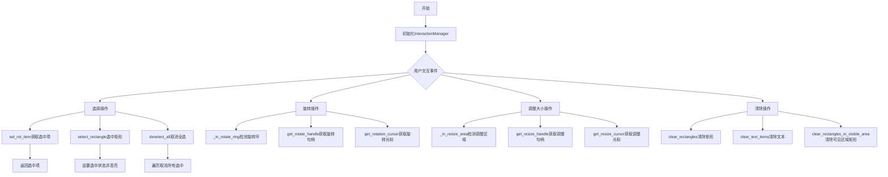

## 类结构

```
InteractionManager (交互管理器)
├── 依赖组件:
│   ├── TextBlockItem (文本块项)
│   ├── MoveableRectItem (可移动矩形项)
│   └── ClearRectsCommand (清除矩形命令)
└── 视图引用: viewer (主视图实例)
```

## 全局变量及字段


### `InteractionManager.viewer`
    
视图引用，用于访问场景和选中的元素

类型：`Any`
    


### `InteractionManager.rotate_margin_min`
    
旋转环内边距，决定旋转热区的内边界

类型：`int`
    


### `InteractionManager.rotate_margin_max`
    
旋转环外边距，决定旋转热区的外边界

类型：`int`
    


### `InteractionManager.resize_margin_min`
    
调整大小区域内边距，决定调整大小热区的内边界

类型：`int`
    


### `InteractionManager.resize_margin_max`
    
调整大小区域外边距，决定调整大小热区的外边界

类型：`int`
    
    

## 全局函数及方法


### `InteractionManager.__init__`

这是 `InteractionManager` 类的构造函数，用于初始化交互管理器实例。它接收一个 viewer 对象作为参数，并设置旋转和调整大小的边距默认值，为后续的场景交互（如选择、旋转和缩放）提供配置基础。

参数：

- `self`：隐式参数，表示类的实例本身
- `viewer`：任意类型（具体类型取决于调用上下文，通常是图像或文档查看器对象），传入的查看器实例，用于管理场景中的交互对象

返回值：`None`，构造函数不返回任何值，仅初始化实例状态

#### 流程图

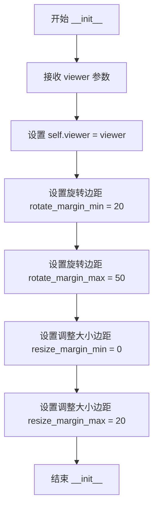

#### 带注释源码

```python
def __init__(self, viewer):
    """
    初始化 InteractionManager 实例。
    
    参数:
        viewer: 传入的查看器对象，用于访问场景和选中项等信息
    """
    # 保存查看器引用，以便后续方法访问场景、选中项等
    self.viewer = viewer
    
    # Rotation margins - 旋转操作的热区边距范围（单位：像素）
    # 最小边距：20px，表示旋转环内边缘
    self.rotate_margin_min = 20
    # 最大边距：50px，表示旋转环外边缘
    self.rotate_margin_max = 50
    
    # Resize margins - 调整大小操作的热区边距范围（单位：像素）
    # 最小边距：0px，表示调整区域的内边缘（紧贴元素边缘）
    self.resize_margin_min = 0
    # 最大边距：20px，表示调整区域的外边缘
    self.resize_margin_max = 20
```


### `InteractionManager.set_rotate_ring`

设置旋转环的内边距和外边距，用于定义旋转操作的有效区域范围。

参数：

- `inner`：`int`，旋转环的内边距（最小距离）
- `outer`：`int`，旋转环的外边距（最大距离），必须大于 inner

返回值：`None`，无返回值，该方法直接修改对象的内部状态

#### 流程图

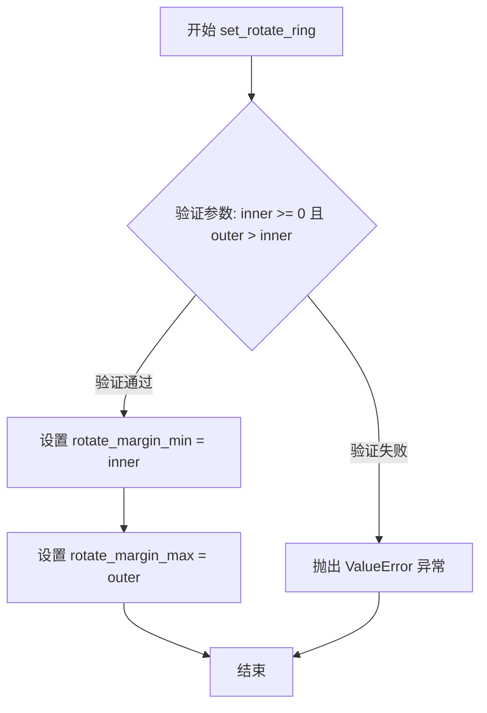

#### 带注释源码

```python
def set_rotate_ring(self, inner: int, outer: int):
    """
    设置旋转环的内边距和外边距。
    
    旋转环用于定义一个环绕物体的圆环区域，当鼠标位于该区域内时，
    可以触发旋转操作。内环和外环定义了有效旋转区域的边界。
    
    参数:
        inner: int，旋转环的内边距（距离物体边缘的最小距离）
        outer: int，旋转环的外边距（距离物体边缘的最大距离）
    
    异常:
        ValueError: 当 inner < 0 或 outer <= inner 时抛出
    
    示例:
        # 设置旋转环从20像素到50像素
        manager.set_rotate_ring(20, 50)
    """
    # 参数验证：确保内环非负且外环大于内环
    if inner < 0 or outer <= inner:
        raise ValueError("outer must be > inner ≥ 0")
    
    # 更新旋转区域内边距
    self.rotate_margin_min = inner
    
    # 更新旋转区域外边距
    self.rotate_margin_max = outer
```


### `InteractionManager.set_resize_ring`

该方法用于设置调整大小操作的外边距范围，验证参数有效性后更新内部边距值。

参数：

- `inner`：`int`，内边距最小值，表示调整区域的内侧边界
- `outer`：`int`，外边距最大值，表示调整区域的外侧边界

返回值：`None`，无返回值描述

#### 流程图

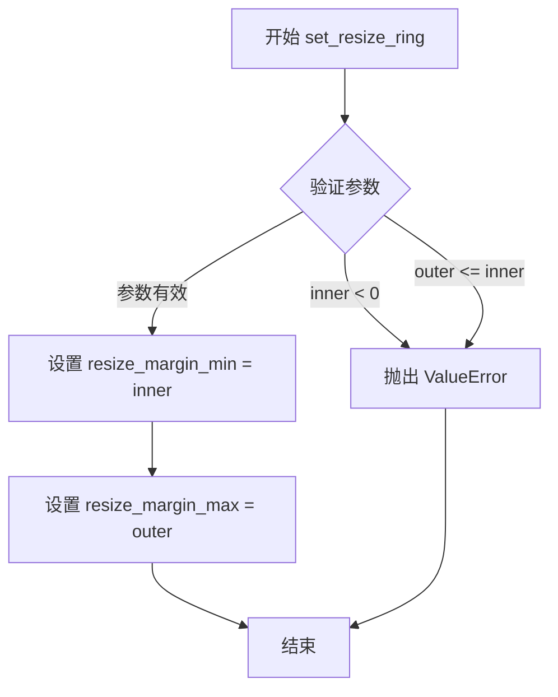

#### 带注释源码

```python
def set_resize_ring(self, inner: int, outer: int):
    """
    设置调整大小操作的外边距范围。
    
    参数:
        inner: 内边距最小值，必须 >= 0
        outer: 外边距最大值，必须 > inner
        
    异常:
        ValueError: 当 inner < 0 或 outer <= inner 时抛出
    """
    # 参数有效性检查：内边距不能为负
    if inner < 0 or outer <= inner:
        raise ValueError("outer must be > inner ≥ 0")
    
    # 更新内部属性：调整区域最小边距
    self.resize_margin_min = inner
    
    # 更新内部属性：调整区域最大边距
    self.resize_margin_max = outer
```


### `InteractionManager.sel_rot_item`

该方法负责从当前场景中检索被选中的文本块项目和矩形框项目。它通过遍历场景中的所有项目，过滤出类型为 `TextBlockItem` 且 `selected` 属性为真的第一个项目，以及类型为 `MoveableRectItem` 且 `selected` 属性为真的第一个项目，并以元组的形式返回它们。

参数：

- `self`：`InteractionManager`，交互管理器实例本身，包含对 viewer 的引用。

返回值：`Tuple[Optional[TextBlockItem], Optional[MoveableRectItem]]`，返回一个包含选中文本块和选中矩形的元组。如果未找到对应的项目，则返回 `None`。

#### 流程图

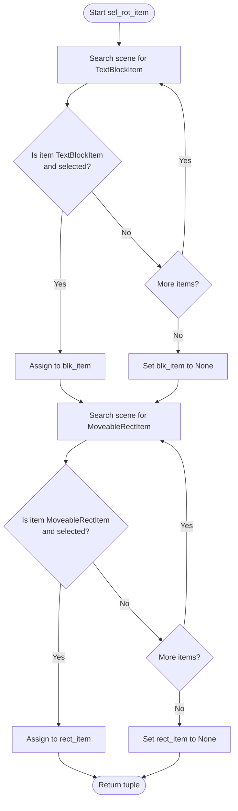

#### 带注释源码

```python
def sel_rot_item(self):
    """
    检索当前场景中被选中的文本块和矩形框。
    
    遍历场景项目，寻找第一个处于选中状态的 TextBlockItem 和 MoveableRectItem。
    """
    # 查找场景中第一个被选中的 TextBlockItem
    # 使用 next() 获取第一个匹配项，如果没有则返回 None
    blk_item = next(
        (item for item in self.viewer._scene.items() if (
            isinstance(item, TextBlockItem) and item.selected)
        ), None )

    # 查找场景中第一个被选中的 MoveableRectItem
    rect_item = next(
        (item for item in self.viewer._scene.items() if (
            isinstance(item, MoveableRectItem) and item.selected)
        ),  None )
        
    # 返回找到的文本块和矩形框的元组
    return blk_item, rect_item
```


### `InteractionManager._in_rotate_ring`

检查场景位置是否位于图形项的旋转环（即旋转控制区域）内。

参数：

- `item`：`Optional[MoveableRectItem|TextBlockItem]`，要检查的图形项（可移动矩形或文本块）
- `scene_pos`：场景坐标位置（QPointF 类型），需要判断是否在旋转环内

返回值：`bool`，返回 True 表示位置在旋转环内（介于最小和最大旋转边距之间），否则返回 False

#### 流程图

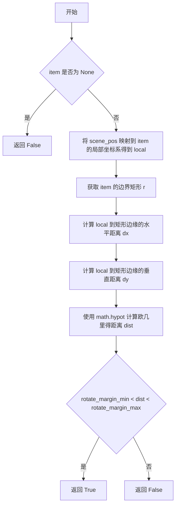

#### 带注释源码

```python
def _in_rotate_ring(self, item: Optional[MoveableRectItem | TextBlockItem], scene_pos) -> bool:
    """Checks if a scene position is within the item's rotation ring."""
    # 如果 item 为 None，直接返回 False
    if not item: 
        return False
    
    # 将场景坐标 scene_pos 转换为 item 的局部坐标系坐标
    local = item.mapFromScene(scene_pos)
    
    # 获取 item 的边界矩形
    r = item.boundingRect()
    
    # 计算点到矩形边缘的水平和垂直距离
    # max(左距离, 0, 右距离) 计算超出左侧或右侧的距离
    dx = max(r.left() - local.x(), 0, local.x() - r.right())
    dy = max(r.top() - local.y(), 0, local.y() - r.bottom())
    
    # 计算欧几里得距离（点到矩形最近边的距离）
    dist = math.hypot(dx, dy)
    
    # 判断距离是否在旋转环范围内（大于内边距且小于外边距）
    return self.rotate_margin_min < dist < self.rotate_margin_max
```


### `InteractionManager._in_resize_area`

该方法用于判断场景中的指定位置（`scene_pos`）是否位于目标图元（`item`）的可调整大小区域（resize area）内。该区域由图元边界框向外扩展的一段距离（`resize_margin_min` 到 `resize_margin_max`）构成，常用于实现鼠标悬停时显示调整大小手柄或触发调整大小交互。

参数：

-  `item`：`Optional[MoveableRectItem | TextBlockItem]`，目标图元对象，用于计算其边界和位置。
-  `scene_pos`：`QPointF`（推断），场景坐标系下的鼠标位置。

返回值：`bool`，如果 `scene_pos` 位于图元的调整大小区域内（既不在图元内部，也不在外部），则返回 `True`，否则返回 `False`。

#### 流程图

```mermaid
flowchart TD
    A([Start _in_resize_area]) --> B{item is None?}
    B -- Yes --> C[Return False]
    B -- No --> D[local = item.mapFromScene(scene_pos)]
    D --> E[r = item.boundingRect]
    E --> F[dx = max(r.left - local.x, 0, local.x - r.right)]
    F --> G[dy = max(r.top - local.y, 0, local.y - r.bottom)]
    G --> H[dist = math.hypot(dx, dy)]
    H --> I{resize_margin_min<br/>&lt; dist <br/>&lt; resize_margin_max?}
    I -- Yes --> J[Return True]
    I -- No --> K[Return False]
```

#### 带注释源码

```python
def _in_resize_area(self, item: Optional[MoveableRectItem|TextBlockItem], scene_pos) -> bool:
    """Checks if a scene position is within the item's resize area."""
    # 1. 如果图元不存在，直接返回 False
    if not item: return False
    
    # 2. 将场景坐标转换为图元的本地坐标
    local = item.mapFromScene(scene_pos)
    
    # 3. 获取图元的边界矩形
    r = item.boundingRect()
    
    # 4. 计算鼠标位置到矩形边缘的最近距离（水平方向和垂直方向）
    #    如果鼠标在矩形右侧，dx 为正；在左侧为负。max(..., 0) 确保只计算矩形外的距离。
    dx = max(r.left() - local.x(), 0, local.x() - r.right())
    dy = max(r.top() - local.y(), 0, local.y() - r.bottom())
    
    # 5. 使用欧几里得距离公式计算综合距离
    dist = math.hypot(dx, dy)
    
    # 6. 判断距离是否在缩放环（Ring）内
    #    即：是否位于 [resize_margin_min, resize_margin_max] 之间
    return self.resize_margin_min < dist < self.resize_margin_max
```


### `InteractionManager.rotate_cursor`

该方法用于根据对象的旋转角度（步数）计算并返回对应的调整大小光标形状。当对象（例如矩形）发生旋转时，水平/垂直的调整光标需要相应旋转为对角线光标，以保证视觉一致性。

参数：

- `cursor`：`Qt.CursorShape`，当前的基本光标形状（例如 `Qt.SizeVerCursor`，即垂直调整大小光标）。
- `steps`：`int`，旋转的步数（0到7之间），对应不同的旋转角度区间。

返回值：`Qt.CursorShape`，经过旋转计算后得到的新光标形状。

#### 流程图

```mermaid
graph TD
    A[开始: rotate_cursor] --> B{检查 cursor 是否在 cursor_map 中}
    B -- 是 --> C[获取对应的光标序列列表]
    B -- 否 --> D[构建默认列表: [cursor] * 8]
    C --> E[返回列表中索引为 steps 的光标]
    D --> E
```

#### 带注释源码

```python
def rotate_cursor(self, cursor, steps):
    """
    根据旋转步数旋转光标形状。
    
    这是一个查找表实现。当对象旋转时，基础光标（如垂直调整大小）
    需要映射到旋转后的光标（如对角线调整大小）。
    """
    # 定义光标映射：键为基础光标，值为旋转后的光标序列（重复两次以覆盖 0-360 度）
    # 顺序逻辑：基础 -> 顺时针45度 -> 90度 -> 135度 -> 180度 -> ...
    cursor_map = {
        Qt.SizeVerCursor: [Qt.SizeVerCursor, Qt.SizeBDiagCursor, Qt.SizeHorCursor, Qt.SizeFDiagCursor] * 2,
        Qt.SizeHorCursor: [Qt.SizeHorCursor, Qt.SizeFDiagCursor, Qt.SizeVerCursor, Qt.SizeBDiagCursor] * 2,
        Qt.SizeFDiagCursor: [Qt.SizeFDiagCursor, Qt.SizeVerCursor, Qt.SizeBDiagCursor, Qt.SizeHorCursor] * 2,
        Qt.SizeBDiagCursor: [Qt.SizeBDiagCursor, Qt.SizeHorCursor, Qt.SizeFDiagCursor, Qt.SizeVerCursor] * 2
    }
    # 如果光标不在 map 中（例如 ArrowCursor），则保持原样
    # 从 map 中获取列表，如果不存在则使用包含 8 个原光标的列表
    return cursor_map.get(cursor, [cursor] * 8)[steps]
```


### `InteractionManager.get_resize_cursor`

该函数用于根据鼠标悬停的句柄位置和图形的旋转角度，计算并返回正确的调整大小光标。当用户悬停在图形的某个调整块（Handle）上时，该方法会查询基础光标形状，并根据图形的当前旋转角度（0-360度）进行逻辑映射，以确保光标指示的方向与图形实际被拖动的物理方向一致。如果未悬停在调整区域，则返回默认箭头光标。

参数：

-  `item`：`MoveableRectItem | TextBlockItem`，目标图形项对象，必须具有 `boundingRect()`（获取局部边界框）和 `rotation()`（获取旋转角度）方法。
-  `pos`：`QPointF`，鼠标光标的位置。**注意：此坐标必须位于图形项的局部坐标系中（即与 `item.boundingRect()` 的坐标系统一致），而不是场景坐标。**

返回值：`QtGui.QCursor`，返回对应的 Qt 光标对象。如果在调整区域内，返回根据旋转角度修正后的方向光标（如双向箭头）；否则返回 `ArrowCursor`（箭头光标）。

#### 流程图

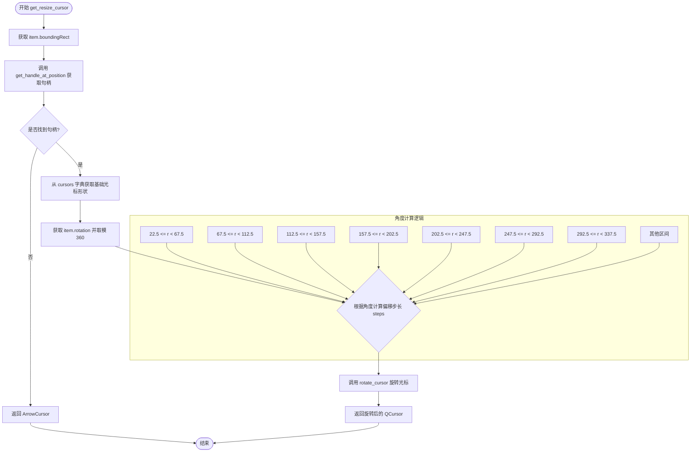

#### 带注释源码

```python
def get_resize_cursor(self, item: MoveableRectItem | TextBlockItem, pos: QPointF) -> QtGui.QCursor:
    """Gets the appropriate resize cursor for a given position."""
    # 1. 获取图形项在局部坐标系下的边界矩形
    rect = item.boundingRect()
    
    # 2. 判断鼠标位置是否位于某个调整块（Handle）上
    # 注意：pos 必须是局部坐标，因为 boundingRect 是局部坐标
    handle = self.get_handle_at_position(pos, rect)
    
    # 定义调整块与基础光标形状的映射（未旋转时的状态）
    cursors = {
        'top_left': Qt.CursorShape.SizeFDiagCursor,     # 左上 -> 左上右下的双向箭头
        'top_right': Qt.CursorShape.SizeBDiagCursor,    # 右上 -> 右上左下的双向箭头
        'bottom_left': Qt.CursorShape.SizeBDiagCursor,
        'bottom_right': Qt.CursorShape.SizeFDiagCursor,
        'top': Qt.CursorShape.SizeVerCursor,            # 上 -> 垂直双向箭头
        'bottom': Qt.CursorShape.SizeVerCursor,
        'left': Qt.CursorShape.SizeHorCursor,            # 左 -> 水平双向箭头
        'right': Qt.CursorShape.SizeHorCursor,
    }
    
    if handle:
        # 3. 找到对应的基础光标
        cursor = cursors.get(handle, Qt.CursorShape.ArrowCursor)
        
        # 4. 根据图形旋转角度调整光标
        # 获取旋转角度 (0-360)
        rotation = item.rotation() % 360
        steps = 0
        
        # 将旋转角度映射为 0-7 的步长，用于轮转光标方向
        # 这里的逻辑是将360度分为8个区间，每个区间45度
        if 22.5 <= rotation < 67.5:
            steps = 1
        elif 67.5 <= rotation < 112.5:
            steps = 2
        elif 112.5 <= rotation < 157.5:
            steps = 3
        elif 157.5 <= rotation < 202.5:
            steps = 4
        elif 202.5 <= rotation < 247.5:
            steps = 5
        elif 247.5 <= rotation < 292.5:
            steps = 6
        elif 292.5 <= rotation < 337.5:
            steps = 7
        
        # 5. 使用辅助方法计算旋转后的光标形状并返回
        rotated_shape = self.rotate_cursor(cursor, steps)
        return QtGui.QCursor(rotated_shape)
    
    # 如果不在调整区域内，返回默认箭头光标
    return QtGui.QCursor(QtCore.Qt.ArrowCursor)
```


### `InteractionManager.get_resize_handle`

该方法用于确定在给定的局部坐标位置（`pos`）上，是否触发了某个调整大小（Resize）的操作句柄（如左上角、右下角等）。它通过调用内部方法 `get_handle_at_position` 计算几何区域来判断位置。

参数：

-  `item`：`MoveableRectItem | TextBlockItem`，被检测的场景项对象（矩形或文本块）。
-  `pos`：`QPointF`，在 item 局部坐标系中的位置点。

返回值：`str | None`，如果该点位于某个调整大小句柄的区域内，则返回句柄的名称字符串（例如 `'top_left'`，`'bottom_right'`）；如果未命中任何句柄，则返回 `None`。

#### 流程图

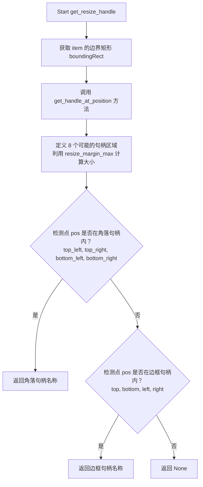

#### 带注释源码

```python
def get_resize_handle(self, item: MoveableRectItem | TextBlockItem, pos: QPointF) -> str | None:
    """Determines which resize handle is at a position (pos is in item's local coordinates)."""
    # 委托给内部方法，传入局部坐标位置和 item 的边界矩形
    return self.get_handle_at_position(pos, item.boundingRect())

def get_handle_at_position(self, pos, rect):
    """
    根据位置和矩形计算具体的句柄类型。
    
    参数:
        pos (QPointF): 检查的点（局部坐标）。
        rect (QRectF): 项目的边界矩形。
        
    返回:
        str | None: 句柄名称或 None。
    """
    # 使用管理器中定义的属性作为句柄的大小
    handle_size = self.resize_margin_max 
    # 转换为整数矩形以便于坐标计算
    rect_rect = rect.toRect()
    top_left = rect_rect.topLeft()
    bottom_right = rect_rect.bottomRight()

    # 定义 8 个可能的调整区域（左上，右上，左下，右下，上，下，左，右）
    # 每个区域是一个 QRectF，范围由 handle_size 决定
    handles = {
        'top_left': QRectF(top_left.x() - handle_size/2, top_left.y() - handle_size/2, handle_size, handle_size),
        'top_right': QRectF(bottom_right.x() - handle_size/2, top_left.y() - handle_size/2, handle_size, handle_size),
        'bottom_left': QRectF(top_left.x() - handle_size/2, bottom_right.y() - handle_size/2, handle_size, handle_size),
        'bottom_right': QRectF(bottom_right.x() - handle_size/2, bottom_right.y() - handle_size/2, handle_size, handle_size),
        'top': QRectF(top_left.x(), top_left.y() - handle_size/2, rect_rect.width(), handle_size),
        'bottom': QRectF(top_left.x(), bottom_right.y() - handle_size/2, rect_rect.width(), handle_size),
        'left': QRectF(top_left.x() - handle_size/2, top_left.y(), handle_size, rect_rect.height()),
        'right': QRectF(bottom_right.x() - handle_size/2, top_left.y(), handle_size, rect_rect.height()),
    }

    # 优先检查角落句柄，因为角落和边可能会重叠
    corner_handles = ['top_left', 'top_right', 'bottom_left', 'bottom_right']
    for handle in corner_handles:
        if handles[handle].contains(pos):
            return handle
    
    # 再检查边句柄
    side_handles = ['top', 'bottom', 'left', 'right']
    for handle in side_handles:
         if handles[handle].contains(pos):
            return handle

    return None
```


### `InteractionManager.get_handle_at_position`

该方法用于确定给定的场景位置（pos）位于目标矩形（rect）的哪个调整大小句柄（resize handle）区域范围内。它通过在矩形的四个角和四条边创建检测区域矩形，并按优先级（角优先于边）进行碰撞检测来确定返回值。

参数：

- `pos`：`PySide6.QtCore.QPointF`，场景中的鼠标或触摸位置坐标
- `rect`：`PySide6.QtCore.QRectF`，目标项的边界矩形（通常为 `boundingRect()` 的返回值）

返回值：`str | None`，如果位置在某个调整句柄区域内则返回句柄名称（如 `'top_left'`, `'bottom'`, `'right'` 等），否则返回 `None`

#### 流程图

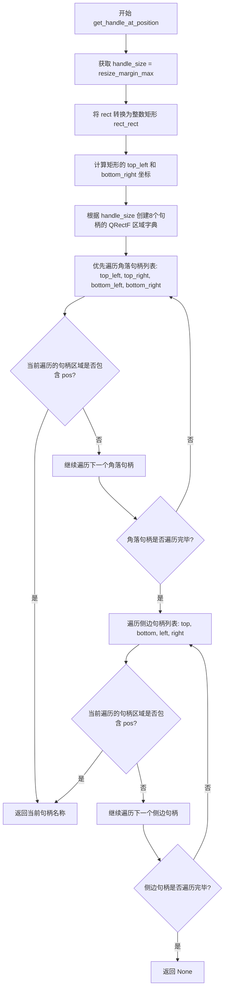

#### 带注释源码

```
def get_handle_at_position(self, pos, rect):
    """Determines which resize handle (e.g., 'top_left') is at a given position."""
    # 获取调整区域的大小，使用管理器配置的最大调整边距
    handle_size = self.resize_margin_max 
    
    # 将输入的浮点矩形转换为整数矩形以便于坐标计算
    rect_rect = rect.toRect()
    
    # 提取矩形的左上角和右下角坐标
    top_left = rect_rect.topLeft()
    bottom_right = rect_rect.bottomRight()

    # 定义8个可能的调整句柄区域（4个角 + 4个边）
    # 每个区域都是一个 QRectF，用于碰撞检测
    handles = {
        'top_left': QRectF(
            top_left.x() - handle_size/2, 
            top_left.y() - handle_size/2, 
            handle_size, handle_size
        ),
        'top_right': QRectF(
            bottom_right.x() - handle_size/2, 
            top_left.y() - handle_size/2, 
            handle_size, handle_size
        ),
        'bottom_left': QRectF(
            top_left.x() - handle_size/2, 
            bottom_right.y() - handle_size/2, 
            handle_size, handle_size
        ),
        'bottom_right': QRectF(
            bottom_right.x() - handle_size/2, 
            bottom_right.y() - handle_size/2, 
            handle_size, handle_size
        ),
        # 边调整区域：宽度或高度覆盖整个边
        'top': QRectF(
            top_left.x(), 
            top_left.y() - handle_size/2, 
            rect_rect.width(), handle_size
        ),
        'bottom': QRectF(
            top_left.x(), 
            bottom_right.y() - handle_size/2, 
            rect_rect.width(), handle_size
        ),
        'left': QRectF(
            top_left.x() - handle_size/2, 
            top_left.y(), 
            handle_size, rect_rect.height()
        ),
        'right': QRectF(
            bottom_right.x() - handle_size/2, 
            top_left.y(), 
            handle_size, rect_rect.height()
        ),
    }

    # 优先检查角落句柄，因为角落区域会与边区域重叠
    corner_handles = ['top_left', 'top_right', 'bottom_left', 'bottom_right']
    for handle in corner_handles:
        if handles[handle].contains(pos):
            return handle
    
    # 检查边句柄
    side_handles = ['top', 'bottom', 'left', 'right']
    for handle in side_handles:
         if handles[handle].contains(pos):
            return handle

    # 如果不在任何调整句柄区域内，返回 None
    return None
```


### `InteractionManager.get_rotation_cursor`

该方法用于根据给定位置和旋转角度获取合适的旋转光标。它通过计算内层矩形来确定鼠标位置是否处于旋转环区域内，并调用内部方法解析具体的旋转手柄类型，最后返回对应的光标对象。

参数：

- `outer_rect`：`QRectF`，表示旋转环的外层边界矩形
- `pos`：`QPointF`，表示场景中鼠标当前的位置
- `angle`：`float`，表示当前的旋转角度（单位为度）

返回值：`QtGui.QCursor`，返回适合当前旋转操作的光标对象，如果位置不在旋转环内则返回默认箭头光标

#### 流程图

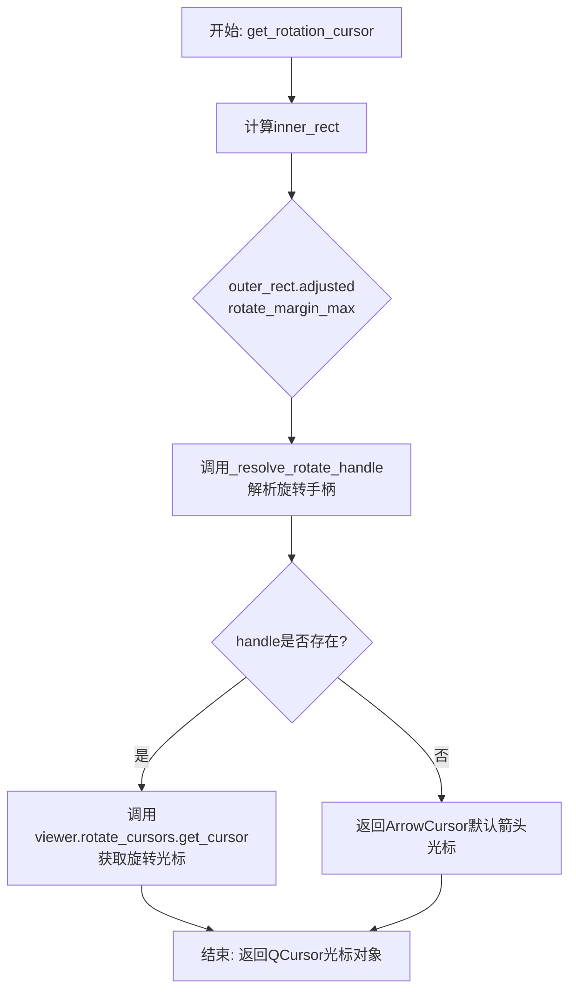

#### 带注释源码

```python
def get_rotation_cursor(self, outer_rect, pos, angle):
    """Gets the appropriate rotation cursor for a given position."""
    # 根据旋转环的外边距创建内层矩形
    # outer_rect.adjusted(x1, y1, x2, y2) 分别表示向左、向上、向右、向下调整的偏移量
    # 这里通过向外扩展rotate_margin_max来创建内层矩形的边界
    inner_rect = outer_rect.adjusted(self.rotate_margin_max, self.rotate_margin_max,
                                     -self.rotate_margin_max, -self.rotate_margin_max)
    
    # 调用内部方法解析旋转手柄位置，确定鼠标位于哪个旋转区域
    # 可能返回 'top_left', 'top_right', 'bottom_left', 'bottom_right', 'top', 'bottom', 'left', 'right' 或 None
    handle = self._resolve_rotate_handle(inner_rect, outer_rect, pos, angle)
    
    # 如果成功解析到旋转手柄，则从viewer的旋转光标管理器获取对应的光标
    # 否则返回默认的箭头光标，表示当前不在旋转操作区域内
    return self.viewer.rotate_cursors.get_cursor(handle) if handle else QtGui.QCursor(QtCore.Qt.ArrowCursor)
```


### `InteractionManager.get_rotate_handle`

该方法用于确定在给定位置存在哪个旋转手柄（如'top_left'、'top_right'等）。它通过计算内、外矩形区域，并结合旋转角度来解析具体的手柄位置。

参数：

- `outer_rect`：`QRectF`，表示旋转环的外边界矩形
- `pos`：`QPointF`，表示场景中待检测的位置点
- `angle`：`float`，表示当前的旋转角度（度）

返回值：`str | None`，返回旋转手柄的名称（如'top_left'、'top_right'、'left'、'right'等），如果位置不在旋转环内则返回None

#### 流程图

```mermaid
flowchart TD
    A[开始 get_rotate_handle] --> B[计算内矩形 inner_rect]
    B --> C[调用 _resolve_rotate_handle]
    C --> D{pos是否在outer_rect内且不在inner_rect内?}
    D -->|否| E[返回 None]
    D -->|是| F[计算旋转中心 centre]
    F --> G[构建逆旋转变换矩阵]
    G --> H[将pos映射到未旋转的坐标系 p = rot.map(pos)]
    H --> I{判断p相对于inner_rect的位置}
    I -->|p.y < inner.top| J{p.x < inner.left?}
    I -->|p.y > inner.bottom| K{p.x < inner.left?}
    I -->|其他| L{p.x < inner.left?}
    J -->|是| M[返回 'top_left']
    J -->|否| N{p.x > inner.right?}
    N -->|否| O[返回 'top']
    N -->|是| P[返回 'top_right']
    K -->|是| Q[返回 'bottom_left']
    K -->|否| R{p.x > inner.right?}
    R -->|否| S[返回 'bottom']
    R -->|是| T[返回 'bottom_right']
    L -->|是| U[返回 'left']
    L -->|否| V[返回 'right']
```

#### 带注释源码

```
def get_rotate_handle(self, outer_rect, pos, angle):
    """Determines which rotation handle (e.g., 'top_left') is at a position."""
    # 根据旋转边距计算内矩形（旋转环的内边界）
    # 通过从外矩形四边向内收缩rotate_margin_max的距离来形成环形区域
    inner_rect = outer_rect.adjusted(
        self.rotate_margin_max,  # 左边向左移
        self.rotate_margin_max,  # 上边向上移
        -self.rotate_margin_max, # 右边向右移（负值表示向内）
        -self.rotate_margin_max  # 下边向下移
    )
    # 委托给内部方法解析具体的手柄位置
    return self._resolve_rotate_handle(inner_rect, outer_rect, pos, angle)
```


### `InteractionManager._resolve_rotate_handle`

该方法负责根据当前的旋转角度和鼠标在场景中的位置，精确判断鼠标落在哪个旋转手柄区域（角或边）内。它通过构建逆变换矩阵将坐标映射回未旋转状态，从而简化了区域判断逻辑。

参数：

- `inner`：`QRectF`，内部矩形，剔除旋转手柄后的实际物体有效区域。
- `outer`：`QRectF`，外部矩形，包含旋转手柄的整个外围区域。
- `pos`：`QPointF`，场景坐标中的查询点（通常是鼠标位置）。
- `angle`：`float`，物体当前的旋转角度（度）。

返回值：`str | None`，返回具体的手柄名称（如 `'top_left'`, `'bottom'`, `'right'` 等），如果点不在手柄区域内则返回 `None`。

#### 流程图

```mermaid
flowchart TD
    A[Start _resolve_rotate_handle] --> B{pos 是否在 outer 范围内\n且不在 inner 范围内?}
    B -- No --> C[Return None]
    B -- Yes --> D[计算 inner 的中心点 centre]
    D --> E[创建逆变换矩阵 rot\n(围绕中心点旋转 -angle)]
    E --> F[使用 rot 将 pos 映射为 p]
    F --> G{p.y 是否小于 inner.top?}
    G -- Yes --> H{p.x 小于 inner.left?}
    H -- Yes --> I[Return 'top_left']
    H -- No --> J{p.x 大于 inner.right?}
    J -- Yes --> K[Return 'top_right']
    J -- No --> L[Return 'top']
    G -- No --> M{p.y 是否大于 inner.bottom?}
    M -- Yes --> N{p.x 小于 inner.left?}
    N -- Yes --> O[Return 'bottom_left']
    N -- No --> P{p.x 大于 inner.right?}
    P -- Yes --> Q[Return 'bottom_right']
    P -- No --> R[Return 'bottom']
    M -- No --> S{p.x 小于 inner.left?}
    S -- Yes --> T[Return 'left']
    S -- No --> U[Return 'right']
```

#### 带注释源码

```python
def _resolve_rotate_handle(self, inner: QRectF, outer: QRectF, pos: QPointF, angle: float) -> str | None:
    # 1. 边界检查：首先确认查询点 pos 是否位于旋转手柄的“环带”内（即在 outer 内但不在 inner 内）。
    if not outer.contains(pos) or inner.contains(pos):
        return None
    
    # 2. 坐标归一化：获取内部矩形中心点。
    centre = inner.center()
    
    # 3. 逆变换构建：为了将已旋转的坐标点 pos 转换为相对于未旋转矩形的位置，
    # 我们创建一个逆向变换矩阵：先平移到中心，逆时针旋转 -angle，再平移回去。
    rot = QtGui.QTransform().translate(centre.x(), centre.y()).rotate(-angle).translate(-centre.x(), -centre.y())
    
    # 4. 坐标映射：将场景中的 pos 通过逆变换映射到新的坐标点 p。
    # 此时 p 的坐标相当于物体没有旋转时的坐标，便于使用简单的上下左右判断。
    p = rot.map(pos)

    # 5. 区域判定：根据映射后的点 p 相对于 inner 矩形的位置，判断具体的手柄。
    if p.y() < inner.top():
        # 位于上方区域
        return 'top_left' if p.x() < inner.left() else 'top_right' if p.x() > inner.right() else 'top'
    elif p.y() > inner.bottom():
        # 位于下方区域
        return 'bottom_left' if p.x() < inner.left() else 'bottom_right' if p.x() > inner.right() else 'bottom'
    else:
        # 位于中间区域（仅剩左右）
        return 'left' if p.x() < inner.left() else 'right'
```


### `InteractionManager.select_rectangle`

该方法用于在场景中选择一个矩形框（MoveableRectItem），首先取消选中所有其他项目，然后设置指定矩形为选中状态，并设置其画刷颜色为半透明红色，同时更新查看器的选中矩形引用并发出选中信号。

参数：

- `rect`：`MoveableRectItem`，要选择的矩形对象

返回值：`None`，无返回值

#### 流程图

```mermaid
flowchart TD
    A([开始 select_rectangle]) --> B[调用 deselect_all<br/>取消所有当前选中项目]
    B --> C{rect 是否存在?}
    C -->|否| D([结束])
    C -->|是| E[设置 rect.selected = True<br/>标记矩形为选中状态]
    E --> F[设置 rect 画刷<br/>QBrush(QColor(255,0,0,100))<br/>半透明红色填充]
    F --> G[设置 viewer.selected_rect = rect<br/>更新查看器的选中矩形引用]
    G --> H[发出信号 viewer.rectangle_selected.emit<br/>传递矩形在场景中的坐标]
    H --> D
```

#### 带注释源码

```
def select_rectangle(self, rect: MoveableRectItem):
    """选择指定的矩形框并将其设置为当前选中状态
    
    参数:
        rect: MoveableRectItem 要选择的矩形对象
    """
    # 1. 首先取消所有当前选中的项目（矩形和文本项）
    self.deselect_all()
    
    # 2. 检查传入的矩形对象是否存在
    if rect:
        # 3. 设置矩形为选中状态
        rect.selected = True
        
        # 4. 设置矩形的填充画刷为半透明红色 (RGBA: 255,0,0,100)
        rect.setBrush(QtGui.QBrush(QtGui.QColor(255, 0, 0, 100)))
        
        # 5. 更新查看器的选中矩形引用
        self.viewer.selected_rect = rect
        
        # 6. 发出矩形选中信号，传递矩形在场景坐标系中的矩形区域
        self.viewer.rectangle_selected.emit(rect.mapRectToScene(rect.rect()))
```


### `InteractionManager.deselect_rect`

取消选中指定的矩形项，将其视觉效果恢复为默认状态（浅粉色半透明），并更新其选中状态标志。

参数：

- `rect`：`MoveableRectItem`，需要取消选中的矩形对象

返回值：`None`，无返回值

#### 流程图

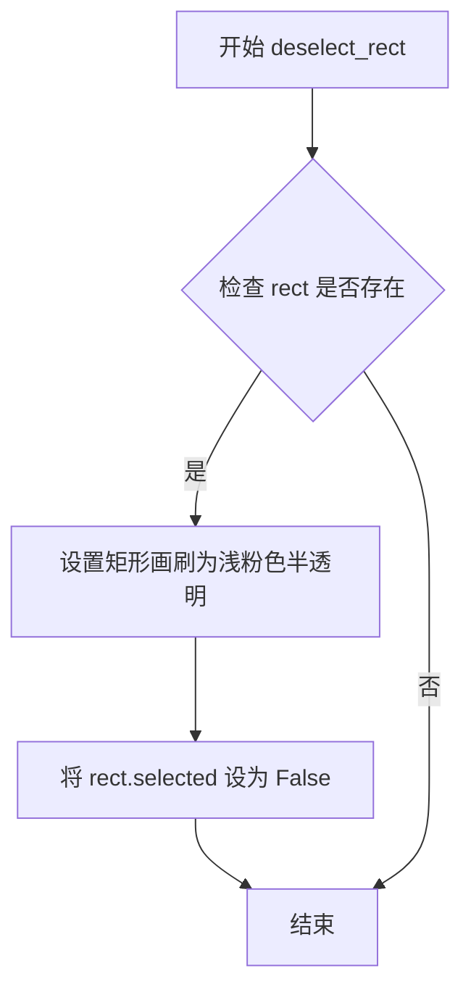

#### 带注释源码

```
def deselect_rect(self, rect: MoveableRectItem):
    """
    取消选中指定的矩形项。
    
    该方法执行以下操作：
    1. 将矩形的填充颜色设置为浅粉色半透明 (RGBA: 255, 192, 203, 125)
    2. 将矩形的 selected 属性设置为 False
    
    注意：此方法不会清除 viewer 的 selected_rect 引用，
    如需完全清除选中状态，建议使用 deselect_all() 方法。
    
    参数:
        rect: MoveableRectItem - 需要取消选中的矩形对象
    """
    # 设置矩形画刷为浅粉色半透明，颜色值为 RGBA(255, 192, 203, 125)
    rect.setBrush(QtGui.QBrush(QtGui.QColor(255, 192, 203, 125)))
    
    # 更新矩形的选中状态标志为 False
    rect.selected = False
```


### `InteractionManager.deselect_all`

取消选择当前场景中所有选中的矩形和文本项，并将选中的矩形引用重置为 None，同时恢复默认光标。

参数：

- 无参数（仅包含 self 隐式参数）

返回值：`None`，无返回值，执行完毕后状态被重置

#### 流程图

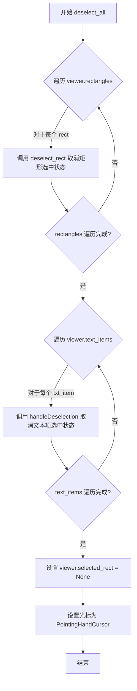

#### 带注释源码

```
def deselect_all(self):
    """
    取消选择当前场景中所有的矩形和文本项，
    并重置选中状态和光标。
    """
    # 遍历所有矩形项，调用 deselect_rect 取消每个矩形的选中状态
    for rect in self.viewer.rectangles:
        self.deselect_rect(rect)
    
    # 遍历所有文本项，调用各自的取消选中处理方法
    for txt_item in self.viewer.text_items:
        txt_item.handleDeselection()
    
    # 重置当前选中的矩形引用为 None
    self.viewer.selected_rect = None
    
    # 恢复光标为默认的 PointingHandCursor 形态
    self.viewer.setCursor(QtGui.QCursor(QtCore.Qt.CursorShape.PointingHandCursor))
```


### `InteractionManager.clear_rectangles`

该方法用于清除场景中的矩形元素，根据 `page_switch` 参数决定是直接清除所有矩形（页面切换时），还是通过命令模式撤销所有矩形。

参数：

- `page_switch`：`bool`，默认为 `False`。当为 `True` 时，直接从场景中移除所有矩形并清空列表；当为 `False` 时，通过命令模式发送撤销命令。

返回值：`None`，该方法无返回值。

#### 流程图

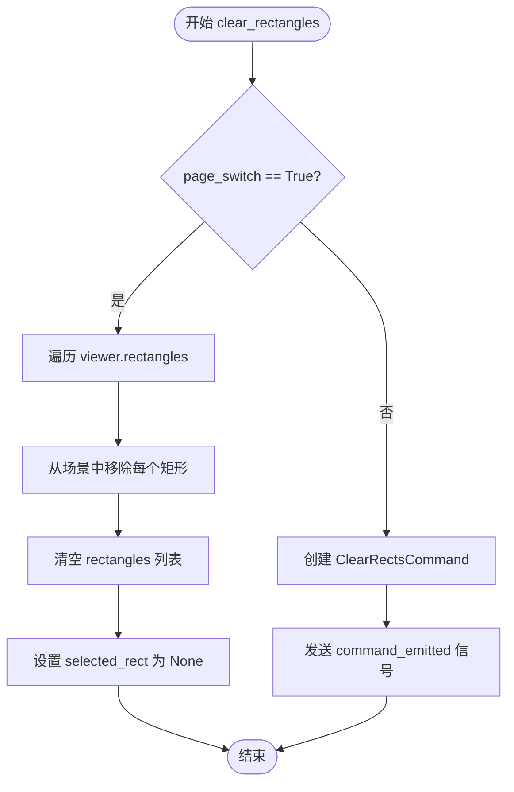

#### 带注释源码

```python
def clear_rectangles(self, page_switch=False):
    """
    清除场景中的矩形元素。
    
    参数:
        page_switch: bool, 默认为False。True时直接清除所有矩形，False时通过命令模式清除。
    """
    # 如果是页面切换模式，直接移除所有矩形
    if page_switch:
        # 遍历所有矩形项，从场景中移除
        for rect in self.viewer.rectangles:
            self.viewer._scene.removeItem(rect)
        # 清空矩形列表
        self.viewer.rectangles.clear()
        # 重置选中的矩形为None
        self.viewer.selected_rect = None
    else:
        # 非页面切换模式，通过命令模式撤销
        # 创建清除矩形的命令对象
        command = ClearRectsCommand(self.viewer)
        # 发送命令信号，由命令管理器处理
        self.viewer.command_emitted.emit(command)
```


### `InteractionManager.clear_text_items`

该方法用于清除场景中所有的文本项目。它通过遍历 `viewer` 对象中的文本项列表，逐个将其从 Qt 图形场景中移除；随后根据传入的 `delete` 参数决定是否同时清空内部的数据列表。

参数：

- `delete`：`bool`，可选，默认值为 `True`。指定是否在移除场景中的项目后清空 `self.viewer.text_items` 列表。设为 `False` 时，项目会从视图界面消失，但会保留在内存列表中。

返回值：`None`，该方法无返回值，仅执行状态修改操作。

#### 流程图

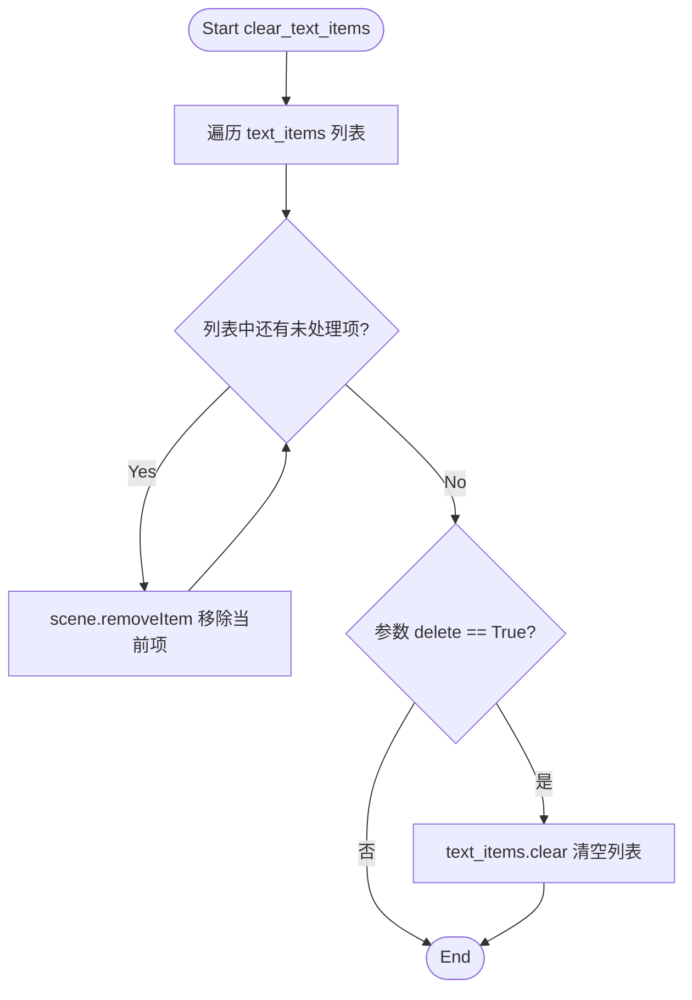

#### 带注释源码

```python
def clear_text_items(self, delete=True):
    # Clear from scene
    # 遍历 viewer 中所有的文本项
    for item in self.viewer.text_items:
        # 将该文本项从 Qt 场景中移除（使其在视图中消失）
        self.viewer._scene.removeItem(item)
    
    # 如果 delete 为 True，则清空存储文本项的列表，释放对象引用
    if delete:
        self.viewer.text_items.clear()
```


### `InteractionManager.clear_rectangles_in_visible_area`

该方法用于在 Webtoon（长图滚动）模式下，清除当前可视区域（viewport）内的所有矩形元素。它通过获取可见区域的 Y 轴边界，判断每个矩形是否与可见区域重叠，并将重叠的矩形从场景和列表中移除。

参数：无

返回值：`None`，无返回值

#### 流程图

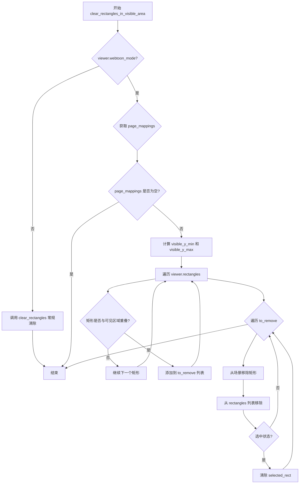

#### 带注释源码

```
def clear_rectangles_in_visible_area(self):
    """Clear rectangles that are within the currently visible viewport area."""
    
    # 检查是否处于 Webtoon（长图滚动）模式
    # 如果不是，则回退到常规的矩形清除方法
    if not self.viewer.webtoon_mode:
        # Not in lazy webtoon mode, fall back to regular clear
        self.clear_rectangles()
        return
        
    # 从 Webtoon 管理器获取可见区域的页面映射信息
    # 这些映射包含每个页面在场景中的 Y 轴位置信息
    _, page_mappings = self.viewer.webtoon_manager.get_visible_area_image()
    
    # 如果没有可见的页面映射，则直接返回，不执行清除操作
    if not page_mappings:
        return
        
    # 计算可见区域在场景中的 Y 轴范围
    # 取所有映射中 scene_y_start 的最小值作为可见区域起点
    visible_y_min = min(mapping['scene_y_start'] for mapping in page_mappings)
    # 取所有映射中 scene_y_end 的最大值作为可见区域终点
    visible_y_max = max(mapping['scene_y_end'] for mapping in page_mappings)
    
    # 遍历所有矩形，找出与可见区域重叠的矩形
    to_remove = []
    for rect in self.viewer.rectangles:
        # 获取矩形在场景中的 Y 坐标（顶部）
        rect_y = rect.pos().y()
        # 获取矩形的自身高度
        rect_h = rect.rect().height()
        # 计算矩形底部的 Y 坐标
        rect_bottom_y = rect_y + rect_h
        
        # 判断矩形是否与可见区域重叠
        # 重叠条件：矩形的底部 > 可见区域顶部 AND 矩形的顶部 < 可见区域底部
        # 即：not (rect_bottom_y <= visible_y_min or rect_y >= visible_y_max)
        if not (rect_bottom_y <= visible_y_min or rect_y >= visible_y_max):
            # 将重叠的矩形添加到待移除列表
            to_remove.append(rect)
    
    # 遍历待移除的矩形列表，执行实际的移除操作
    for rect in to_remove:
        # 从 Qt 场景中移除图形项
        self.viewer._scene.removeItem(rect)
        # 从 viewer 的矩形列表中移除
        self.viewer.rectangles.remove(rect)
        # 如果被移除的矩形当前是选中的，则清除选中状态
        if self.viewer.selected_rect == rect:
            self.viewer.selected_rect = None
```

## 关键组件


### 旋转环（Rotation Ring）系统

管理旋转交互的环形区域，通过rotate_margin_min和rotate_margin_max定义内外部边界，用于判断鼠标位置是否进入旋转操作区域。

### 调整大小区域（Resize Area）系统

管理调整大小交互的区域，使用resize_margin_min和resize_margin_max定义调整大小热区的范围，支持8个方向（上下左右及四角）的调整操作。

### 选中项管理（Selection Management）

负责追踪和管理当前选中的TextBlockItem和MoveableRectItem，提供选中、取消选中、清除所有选中等操作，支持与命令系统集成实现撤销功能。

### 光标映射与旋转（Cursor Mapping & Rotation）

根据旋转角度动态计算调整大小光标的形状，使用8个步骤映射基础光标到旋转后的光标，支持对角线和轴向光标的360度旋转适配。

### 旋转手柄解析（Rotation Handle Resolution）

通过坐标变换将鼠标位置逆旋转到未旋转状态，判断鼠标相对于内部矩形的位置，确定旋转手柄（top/bottom/left/right及其组合）的位置。

### 可见区域矩形清除（Visible Area Rectangle Clearing）

在Webtoon模式下，获取当前可见页面的Y轴范围，仅清除与可见区域重叠的矩形，实现惰性加载和内存优化。

### 场景坐标映射（Scene Coordinate Mapping）

提供场景坐标与本地坐标的相互转换功能，通过mapFromScene和Qt变换矩阵处理旋转和缩放后的坐标转换。


## 问题及建议


### 已知问题

-   **硬编码的颜色值**：在 `select_rectangle` 和 `deselect_rect` 方法中使用了硬编码的 `QColor(255, 0, 0, 100)` 和 `QColor(255, 192, 203, 125)`，这些值应该提取为类常量或配置参数以提高可维护性。
-   **重复的逻辑代码**：`_in_rotate_ring` 和 `_in_resize_area` 方法几乎完全相同，仅比较的阈值不同，可以提取为单个通用方法并参数化。
-   **魔法数字**：在 `get_resize_cursor` 方法中存在大量未解释的角度阈值（22.5, 67.5, 112.5等），应定义为类常量或枚举。
-   **旋转光标映射表冗余**：`rotate_cursor` 方法中的 `cursor_map` 使用了 `* 2` 重复创建列表元素，看起来是冗余的，可能导致理解混淆。
-   **命名不一致**：代码混合使用了不同命名风格，如 `sel_rot_item`（缩写）、`_in_rotate_ring`（下划线）、`get_resize_cursor`（camelCase），应统一命名规范。
-   **类型注解不够精确**：`sel_rot_item` 方法没有返回类型注解；`get_handle_at_position` 方法参数类型使用了简写但未完整导入。
-   **与 viewer 高度耦合**：`InteractionManager` 直接访问 `viewer` 的多个内部属性（如 `_scene`, `rectangles`, `text_items`, `selected_rect`, `webtoon_manager` 等），违反了依赖倒置原则，建议通过接口或参数传递依赖。
-   **性能隐患**：`sel_rot_item` 方法每次调用都遍历所有场景项，在场景项目很多时可能导致性能问题，应考虑缓存或优化查询逻辑。
-   **命令模式使用不一致**：`clear_rectangles` 方法中，`page_switch=True` 时直接操作，`False` 时使用命令模式，两种行为的设计意图不清晰。
-   **文档字符串不完整**：部分方法如 `get_handle_at_position` 缺少参数和返回值的文档说明。

### 优化建议

-   **提取常量**：将颜色值、角度阈值、边距默认值等提取为类级别常量或配置文件。
-   **重构重复代码**：创建通用的距离检测方法，消除 `_in_rotate_ring` 和 `_in_resize_area` 的重复逻辑。
-   **统一命名风格**：遵循 Python 的 PEP8 命名规范，全部使用下划线命名法。
-   **改进类型注解**：为所有方法添加完整的类型注解，使用 `from __future__ import annotations` 或明确类型。
-   **解耦设计**：通过依赖注入或接口抽象，减少对 `viewer` 内部属性的直接访问。
-   **优化性能**：使用字典或集合存储选中项的引用，避免每次遍历场景。
-   **完善文档**：为所有公开方法添加完整的 docstring，包括参数、返回值和异常说明。
-   **统一命令模式**：明确命令模式的使用场景，确保所有修改操作都通过命令执行以支持撤销/重做功能。
-   **简化旋转光标逻辑**：检查 `rotate_cursor` 中的映射表是否确实需要重复元素，清理冗余代码。


## 其它


### 设计目标与约束

InteractionManager的核心设计目标是提供一个统一的交互管理框架，用于处理场景中项目的选择、旋转和调整大小操作。该类采用组合模式设计，通过依赖注入的方式与viewer对象解耦。设计约束包括：1）仅支持TextBlockItem和MoveableRectItem两种类型的交互项目；2）旋转和调整大小的边距范围必须在0到无穷大之间，且外边距必须大于内边距；3）所有坐标计算基于场景坐标系统；4）光标计算需考虑项目当前的旋转角度。

### 错误处理与异常设计

代码中的异常处理主要体现在边距设置的参数校验上。set_rotate_ring和set_resize_ring方法会检查inner和outer参数是否满足outer > inner ≥ 0的条件，若不满足则抛出ValueError并附带明确的错误信息。其他方法如_in_rotate_ring、_in_resize_area等采用防御式编程，对None输入返回False或执行安全检查，避免空指针异常。clear_rectangles方法在page_switch为True时直接操作场景，False时通过命令模式发送指令，两种路径均无异常抛出设计。

### 数据流与状态机

InteractionManager本身不维护复杂的状态机，其状态转换由viewer对象管理。该类主要提供状态查询功能：sel_rot_item方法从场景中查询当前选中的TextBlockItem和MoveableRectItem；get_resize_handle和get_rotate_handle方法根据鼠标位置确定具体的操作句柄；get_resize_cursor和get_rotation_cursor方法根据项目状态计算应显示的光标形状。数据流向为：用户输入(viewer事件) → 位置计算(InteractionManager) → 状态判断 → 光标/操作执行。

### 外部依赖与接口契约

该类依赖以下外部组件：1）PySide6.QtCore和PySide6.QtGui提供Qt框架基础功能；2）TextBlockItem和MoveableRectItem两个自定义类作为交互目标；3）ClearRectsCommand命令类用于撤销/重做功能；4）viewer对象作为主控制器提供场景访问和信号发射。对外接口包括：set_rotate_ring(inner, outer)设置旋转环范围、set_resize_ring(inner, outer)设置调整大小区域、sel_rot_item()返回选中项目、select_rectangle/deselect_rect/deselect_all管理选择状态、clear_rectangles系列方法管理项目生命周期。

### 性能考虑

性能关键点在于get_handle_at_position方法的频繁调用，该方法在每次鼠标移动时都会被触发。优化措施包括：1）resize_margin_max作为handle_size缓存，避免重复计算；2）corner_handles优先检查以利用早返回特性；3）使用QRectF.toRect()进行整数坐标转换以加速.contains()判断；4）旋转光标计算使用预定义的cursor_map避免运行时查表。潜在性能瓶颈：get_visible_area_image()在clear_rectangles_in_visible_area中每次调用，若该方法涉及复杂计算可能影响响应速度。

### 线程安全

该类未实现任何线程同步机制。设计假设：所有交互操作均在主线程(Qt的GUI线程)中执行。访问viewer对象的_scene、rectangles、text_items等集合时未加锁，若存在后台线程修改这些集合的场景，可能导致竞态条件。建议：仅在主线程调用InteractionManager的所有公开方法，或在调用前确保线程安全。

### 内存管理

该类本身不管理复杂内存，主要涉及Qt对象生命周期。deselect_all、clear_rectangles、clear_text_items等方法通过Qt的removeItem将项目从场景中移除，但未显式delete对象，依赖Qt的父对象内存管理机制。to_remove列表在方法结束时自动销毁。需要注意：clear_rectangles_in_visible_area中创建的to_remove列表可能包含较多对象，但生命周期短，影响有限。

### 安全性考虑

该代码属于前端交互层，不涉及敏感数据处理或网络通信。安全考量主要集中在：1）参数校验防止无效的边距值导致几何计算异常；2）mapFromScene和mapRectToScene的坐标转换需确保输入坐标在合理范围内；3）通过.isinstance检查类型防止类型混淆攻击；4）cursor_map的get方法使用默认值防止未知光标类型导致崩溃。

### 可测试性

该类具有较好的可测试性：1）方法职责单一，易于单元测试；2）依赖的viewer对象可通过mock替换；3）所有几何计算方法(get_handle_at_position、_in_rotate_ring等)为纯函数，输入输出确定。建议测试场景：边界值测试(边距为0、负数、相等值)、坐标变换测试(场景坐标与局部坐标转换)、旋转角度与光标映射测试(0°、45°、90°等关键角度)、多项目选择时的优先级测试。

### 国际化/本地化

该类未包含用户可见的字符串文本，不涉及国际化需求。所有错误信息使用英文(如"outer must be > inner ≥ 0")，若需支持多语言应提取至资源文件。未来若添加用户交互提示(如"请选择要旋转的项目")，应使用Qt的QCoreApplication.translate或QObject.tr进行封装。

### 配置管理

该类的可配置参数包括：rotate_margin_min/max(旋转环内外半径)、resize_margin_min/max(调整大小区域内外半径)。这些参数通过set_rotate_ring和set_resize_ring方法动态设置。设计建议：1）默认值(20/50和0/20)应作为类常量定义；2）可考虑从配置文件或用户偏好中加载初始值；3）边距值应限制在合理范围内防止UI异常。

### 版本兼容性

该代码使用Python 3的类型注解(typing.Optional、联合类型MoveableRectItem|TextBlockItem)，需要Python 3.10+或from __future__ import annotations。PySide6版本应兼容6.0+以支持QPointF、QRectF的类型提示。未使用PySide6的实验性API或已废弃方法，向后兼容性较好。需要注意：Qt.CursorShape枚举在PySide6中需通过QtCore.Qt或QtGui.QCursor访问，具体取决于版本。


    