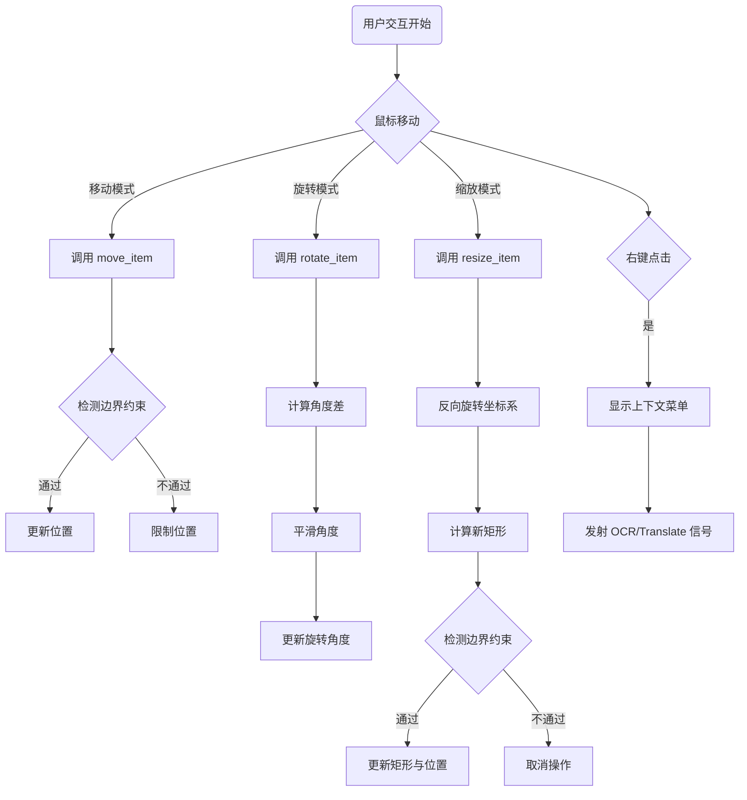
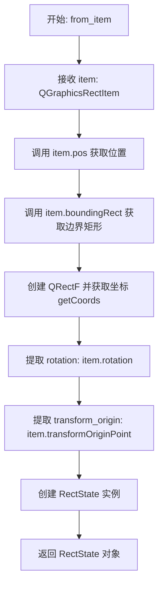
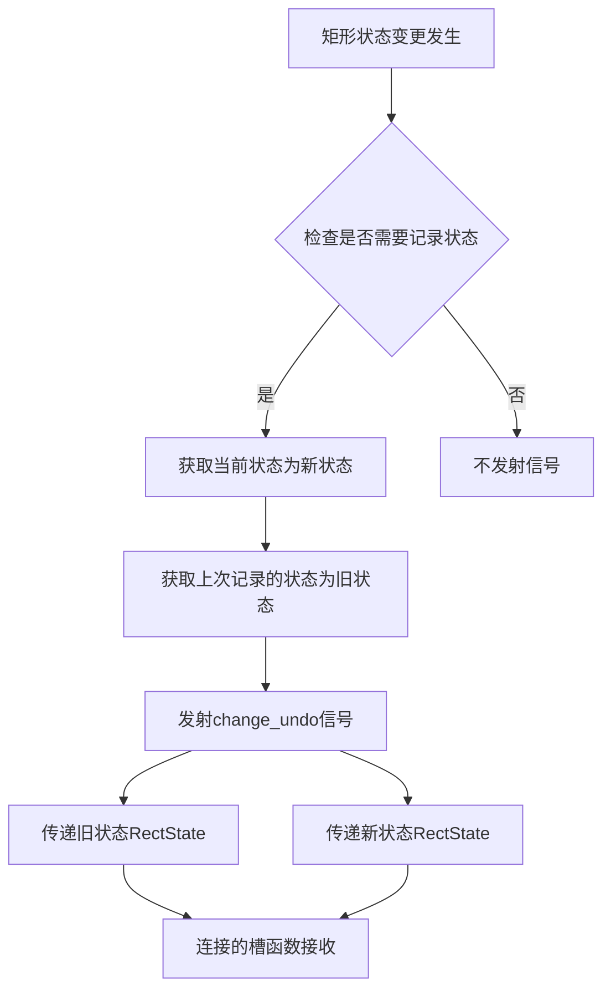
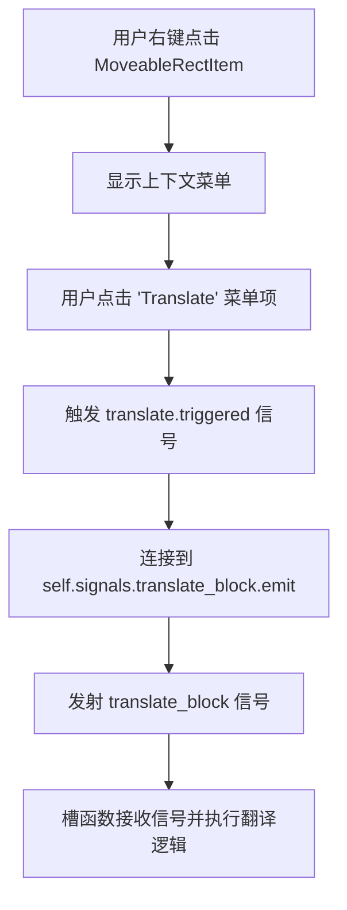
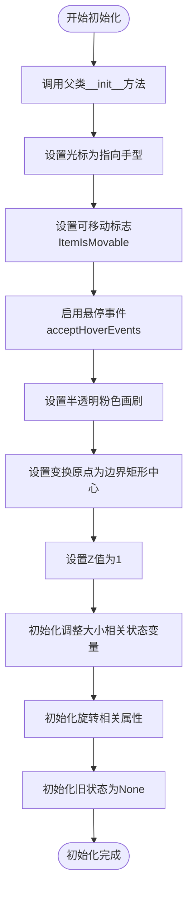
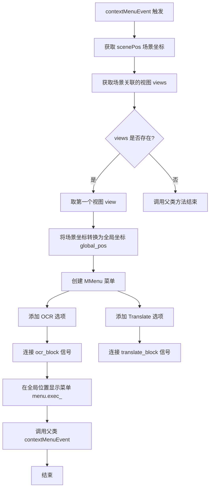
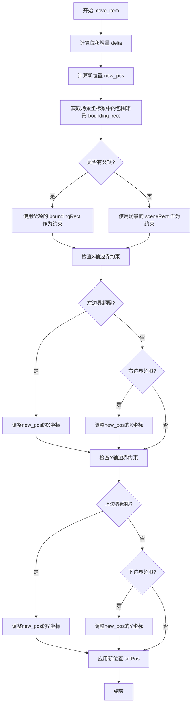
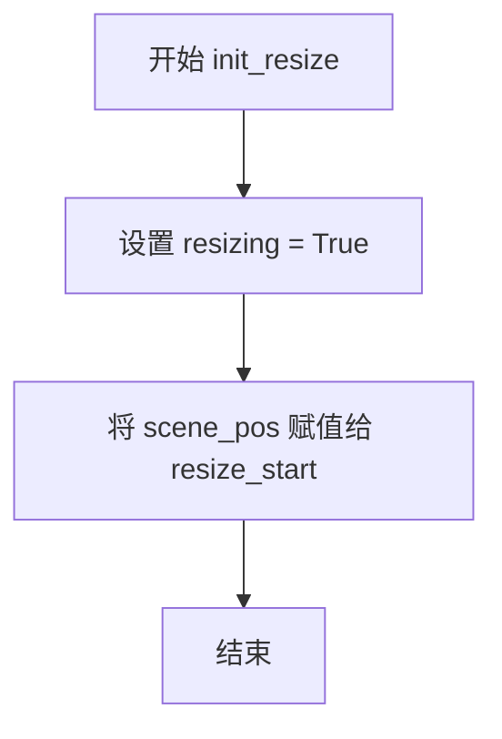
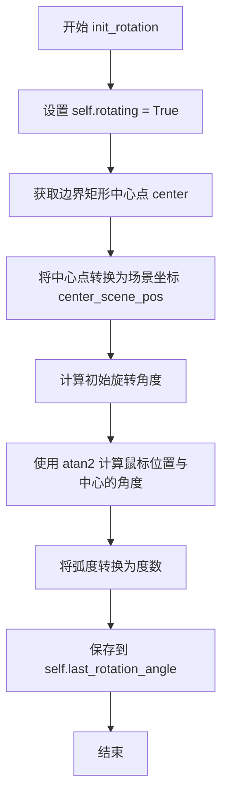

# `comic-translate\app\ui\canvas\rectangle.py` 详细设计文档

该模块实现了一个基于 PySide6 的可交互图形矩形项 (MoveableRectItem)，支持用户在场景中通过鼠标拖拽、调整大小和旋转，并集成了上下文菜单用于 OCR 和翻译功能，同时包含完善的边界约束检测。

## 整体流程



## 类结构

```
QObject (Qt 基类)
├── RectSignals (信号发射类)
dataclass
└── RectState (状态数据类)
QGraphicsRectItem (Qt 图形项基类)
└── MoveableRectItem (主要交互类)
```

## 全局变量及字段


### `RectState`
    
矩形状态数据类，用于存储矩形的坐标、旋转角度和变换原点

类型：`dataclass`
    


### `RectSignals`
    
矩形图形项的信号类，定义了状态变更、OCR和翻译的信号

类型：`QObject subclass`
    


### `RectState.rect`
    
矩形坐标 (x1, y1, x2, y2)

类型：`tuple`
    


### `RectState.rotation`
    
旋转角度

类型：`float`
    


### `RectState.transform_origin`
    
变换原点

类型：`QPointF`
    


### `RectState.from_item`
    
从 QGraphicsRectItem 对象创建 RectState 实例

类型：`classmethod`
    


### `MoveableRectItem.signals`
    
实例化的事件信号对象

类型：`RectSignals`
    


### `MoveableRectItem.resize_handle`
    
当前使用的调整大小手柄标识

类型：`str/None`
    


### `MoveableRectItem.resize_start`
    
调整大小操作开始的场景坐标

类型：`QPointF/None`
    


### `MoveableRectItem.selected`
    
是否处于选中状态

类型：`bool`
    


### `MoveableRectItem.resizing`
    
是否正在执行调整大小操作

类型：`bool`
    


### `MoveableRectItem.rot_handle`
    
旋转手柄（代码中定义但未充分使用）

类型：`any`
    


### `MoveableRectItem.rotating`
    
是否正在执行旋转操作

类型：`bool`
    


### `MoveableRectItem.last_rotation_angle`
    
上次旋转结束时的角度

类型：`float`
    


### `MoveableRectItem.rotation_smoothing`
    
旋转灵敏度系数

类型：`float`
    


### `MoveableRectItem.center_scene_pos`
    
旋转中心在场景中的坐标

类型：`QPointF`
    


### `MoveableRectItem.old_state`
    
操作前的状态快照

类型：`RectState/None`
    
    

## 全局函数及方法


### `RectState.from_item`

从 QGraphicsRectItem 对象创建 RectState 实例，用于保存图形矩形项的当前状态（位置、尺寸、旋转角度和变换原点）。

参数：

- `item`：`QGraphicsRectItem`，需要提取状态信息的图形矩形项对象

返回值：`RectState`，包含图形项当前状态（矩形坐标、旋转角度、变换原点）的新实例

#### 流程图



#### 带注释源码

```python
@classmethod
def from_item(cls, item: QGraphicsRectItem):
    """Create RectState from a MoveableRectItem"""
    # 使用 item 的位置和边界矩形大小创建 QRectF，并获取坐标元组 (x1, y1, x2, y2)
    rect = QRectF(item.pos(), item.boundingRect().size()).getCoords()
    
    # 返回新的 RectState 实例，包含：
    # - rect: 矩形的坐标元组 (x1, y1, x2, y2)
    # - rotation: 图形项的当前旋转角度
    # - transform_origin: 图形项的变换原点
    return cls(
        rect=rect,
        rotation=item.rotation(),
        transform_origin=item.transformOriginPoint()
    )
```


### `RectSignals.change_undo`

撤销状态变更信号，用于在矩形项状态发生变化时记录旧状态和新状态，以便实现撤销功能。当矩形项发生移动、旋转或缩放时，此信号会被发射，传递变更前后的 RectState 对象。

参数：

- 无（此为 Signal 定义，参数在 Signal 创建时指定）

返回值：

- `Signal`，Qt 信号对象本身，无直接返回值

#### 流程图



#### 带注释源码

```python
class RectSignals(QObject):
    """
    Qt信号类，用于管理矩形图形项的各种状态变更信号
    继承自QObject以支持Qt的信号-槽机制
    """
    
    # 撤销状态变更信号
    # 参数1: 变更前的RectState对象（旧状态）
    # 参数2: 变更后的RectState对象（新状态）
    # 该信号在MoveableRectItem的状态发生变化时发射，
    # 使得外部可以记录状态变更历史以实现撤销功能
    change_undo = Signal(RectState, RectState)
    
    # OCR识别信号，无参数
    # 当用户通过上下文菜单选择OCR功能时发射
    ocr_block = Signal()
    
    # 翻译信号，无参数
    # 当用户通过上下文菜单选择翻译功能时发射
    translate_block = Signal()
```


### RectSignals.ocr_block

OCR 处理信号，用于在上下文菜单触发 OCR 操作时通知相关槽函数执行 OCR 识别功能。

参数： 无（Signal 不接受任何参数）

返回值： 无（Signal 无返回值，仅用于发出信号）

#### 流程图

```mermaid
sequenceDiagram
    participant User as 用户
    participant Menu as MMenu
    participant Rect as MoveableRectItem
    participant Signal as RectSignals.ocr_block
    participant Handler as OCR处理槽
    
    User->>Rect: 右键点击矩形
    Rect->>Menu: contextMenuEvent
    Menu->>User: 显示上下文菜单
    User->>Menu: 点击"OCR"菜单项
    Menu->>Rect: ocr.triggered 信号
    Rect->>Signal: signals.ocr_block.emit()
    Signal->>Handler: 发出信号通知订阅者
```

#### 带注释源码

```python
class RectSignals(QObject):
    """
    信号集合类，用于定义与矩形操作相关的各种信号
    """
    # 信号定义：当矩形状态发生可撤销变化时发出，携带旧状态和新状态
    # 参数：RectState（旧状态）, RectState（新状态）
    change_undo = Signal(RectState, RectState)
    
    # ========== 目标信号 ==========
    # OCR处理信号，无参数
    # 用途：当用户在矩形项的上下文菜单中点击"OCR"选项时发出
    # 连接：通常连接到执行OCR识别功能的槽函数
    ocr_block = Signal()
    
    # 翻译处理信号，无参数
    # 用途：当用户在矩形项的上下文菜单中点击"Translate"选项时发出
    translate_block = Signal()
```

#### 信号使用示例

```python
# 在 MoveableRectItem 类中的上下文菜单中使用
def contextMenuEvent(self, event):
    # ... 菜单创建代码 ...
    
    # 连接信号到菜单项
    # 当用户点击 OCR 菜单项时，发出 ocr_block 信号
    ocr.triggered.connect(self.signals.ocr_block.emit)
    
    # 外部可以这样订阅信号：
    # rect_item.signals.ocr_block.connect(self.do_ocr_processing)
```


### `RectSignals.translate_block`

翻译处理信号，用于在用户通过右键菜单选择“翻译”操作时触发翻译功能。

参数：

- 无参数（Signal() 不携带任何参数）

返回值：`void`，信号发射后不返回任何值，仅通知已连接的槽函数执行翻译操作

#### 流程图



#### 带注释源码

```python
class RectSignals(QObject):
    # 定义信号：矩形状态变化撤销信号，携带旧状态和新状态
    change_undo = Signal(RectState, RectState)
    
    # 定义信号：OCR处理信号，无参数
    ocr_block = Signal()
    
    # 定义信号：翻译处理信号，无参数
    # 当用户在上下文菜单中点击"翻译"选项时发射此信号
    translate_block = Signal()

# 在 MoveableRectItem 类中使用该信号
class MoveableRectItem(QGraphicsRectItem):
    signals = RectSignals()  # 创建信号实例
    
    def contextMenuEvent(self, event):
        # ... 获取菜单位置代码 ...
        
        # 创建菜单
        menu = MMenu(parent=view)
        ocr = menu.addAction(view.tr('OCR'))
        translate = menu.addAction(view.tr('Translate'))
        
        # 将菜单项的 triggered 信号连接到对应的自定义信号
        # 当用户点击 OCR 时，发射 ocr_block 信号
        ocr.triggered.connect(self.signals.ocr_block.emit)
        
        # 当用户点击 Translate 时，发射 translate_block 信号
        # 该信号通知其他组件执行翻译操作
        translate.triggered.connect(self.signals.translate_block.emit)
        
        menu.exec_(global_pos)
```


### `MoveableRectItem.__init__`

初始化 MoveableRectItem 图形项，设置光标样式、拖拽标志、画刷颜色、变换原点以及初始化与调整大小、旋转相关的状态属性。

#### 参数

- `rect`：`Optional[QRectF]`，可选参数，矩形区域，用于初始化 QGraphicsRectItem 的几何形状，默认为 None
- `parent`：`Optional[QGraphicsItem]`，可选参数，父图形项，用于建立项的层级关系，默认为 None

#### 返回值

`None`，无返回值（__init__ 方法）

#### 流程图



#### 带注释源码

```python
def __init__(self, rect=None, parent=None):
    """
    初始化 MoveableRectItem 图形项
    
    Args:
        rect: 可选的矩形区域，用于初始化 QGraphicsRectItem
        parent: 可选的父图形项
    """
    # 调用父类 QGraphicsRectItem 的初始化方法
    super().__init__(rect, parent)
    
    # 设置鼠标悬停时的光标样式为指向手型
    self.setCursor(QCursor(Qt.CursorShape.PointingHandCursor))
    
    # 设置图形项可移动
    self.setFlag(QGraphicsRectItem.GraphicsItemFlag.ItemIsMovable, True)
    
    # 启用悬停事件，用于检测鼠标进入/离开图形项
    self.setAcceptHoverEvents(True)
    
    # 设置填充画刷为半透明粉色 (RGBA: 255, 192, 203, 125)
    self.setBrush(QBrush(QColor(255, 192, 203, 125)))  # Transparent pink
    
    # 设置旋转变换的原点为边界矩形的中心
    self.setTransformOriginPoint(self.boundingRect().center())
    
    # 设置 Z 值，确保图形项显示在其它项之上
    self.setZValue(1)
    
    # === 初始化调整大小相关状态变量 ===
    self.resize_handle = None      # 当前调整大小的句柄位置
    self.resize_start = None       # 调整大小操作的起始位置
    self.selected = False          # 选中状态标志
    self.resizing = False          # 是否正在进行调整大小操作
    
    # === 初始化旋转相关属性 ===
    self.rot_handle = None         # 旋转句柄
    self.rotating = False          # 是否正在进行旋转操作
    self.last_rotation_angle = 0   # 上一次的旋转角度
    self.rotation_smoothing = 1.0  # 旋转灵敏度（平滑系数）
    self.center_scene_pos = None   # 旋转中心在场景坐标系中的位置
    
    # 用于存储操作前的状态，支持撤销功能
    self.old_state = None
```


### `MoveableRectItem.focusOutEvent`

失去焦点事件处理，重置光标和选中状态

参数：

-  `event`：`QFocusEvent`，Qt 焦点事件对象，包含焦点事件的相关信息（如焦点Lost/Gain）

返回值：`None`，无返回值

#### 流程图

```mermaid
flowchart TD
    A([开始 focusOutEvent]) --> B[设置光标为手型指针<br/>setCursor(PointingHandCursor)]
    B --> C[重置选中状态<br/>selected = False]
    C --> D[触发重绘<br/>update]
    D --> E[调用父类方法<br/>super().focusOutEvent]
    E --> F([结束])
```

#### 带注释源码

```python
def focusOutEvent(self, event):
    """
    失去焦点事件处理
    
    当该图形项失去键盘焦点时调用此方法，用于重置UI状态：
    - 恢复默认光标形状
    - 清除选中标志
    - 触发界面更新
    
    参数:
        event: QFocusEvent，Qt焦点事件对象
        
    返回值:
        None
    """
    # 1. 恢复默认光标为手型指针
    self.setCursor(QCursor(Qt.CursorShape.PointingHandCursor))
    
    # 2. 重置选中状态标志
    self.selected = False
    
    # 3. 触发该项的重绘，刷新图形显示
    self.update()
    
    # 4. 调用父类实现，保持Qt事件处理链完整
    super().focusOutEvent(event)
```


### `MoveableRectItem.contextMenuEvent`

右键菜单事件处理，弹出 OCR/翻译选项

参数：

-  `event`：`QGraphicsSceneContextMenuEvent`，右键菜单事件对象，包含事件触发时的场景位置信息

返回值：`None`，该方法继承自父类，调用父类方法后无返回值

#### 流程图



#### 带注释源码

```python
def contextMenuEvent(self, event):
    """
    处理右键菜单事件，弹出 OCR/翻译选项
    
    参数:
        event: QGraphicsSceneContextMenuEvent，右键菜单事件对象
    """
    # 获取事件发生的场景坐标位置
    scene_pos = event.scenePos()  # Position in the scene
    
    # 获取与该场景关联的所有视图（View）列表
    views = self.scene().views()  # Get all views associated with the scene

    # 检查是否存在可用的视图
    if views:
        # 取第一个视图用于显示菜单
        view = views[0]
        
        # 将场景坐标转换为视图坐标，再转换为全局屏幕坐标
        # 这样可以确保菜单在正确的屏幕位置弹出
        global_pos = view.mapToGlobal(view.mapFromScene(scene_pos))

        # 创建右键菜单，父对象设为视图
        menu = MMenu(parent=view)
        
        # 添加 OCR 操作选项（带翻译支持）
        ocr = menu.addAction(view.tr('OCR'))
        
        # 添加翻译操作选项（带翻译支持）
        translate = menu.addAction(view.tr('Translate'))

        # 将菜单项的 triggered 信号连接到对应的信号发射器
        # 点击 OCR 时触发 ocr_block 信号
        ocr.triggered.connect(self.signals.ocr_block.emit)
        
        # 点击 Translate 时触发 translate_block 信号
        translate.triggered.connect(self.signals.translate_block.emit)

        # 在全局屏幕位置显示菜单，并阻塞等待用户选择
        menu.exec_(global_pos)

        # 调用父类的 contextMenuEvent 处理默认行为
        super().contextMenuEvent(event)
```


### MoveableRectItem.move_item

处理矩形移动逻辑，包含基于父项或场景的边界约束检查。

参数：

- `local_pos`：`QtCore.QPointF`，当前鼠标/触摸的本地坐标位置
- `last_local_pos`：`QtCore.QPointF`，上一次移动时的本地坐标位置

返回值：`None`，无返回值（直接在对象上修改位置）

#### 流程图



#### 带注释源码

```python
def move_item(self, local_pos: QtCore.QPointF, last_local_pos: QtCore.QPointF):
    """
    处理矩形项的移动，包含基于父项或场景的边界约束检查
    
    参数:
        local_pos: QtCore.QPointF - 当前本地坐标位置
        last_local_pos: QtCore.QPointF - 上一次移动时的本地坐标位置
    返回:
        None (直接修改对象位置)
    """
    
    # 计算位移增量：将本地坐标转换为父坐标后相减
    delta = self.mapToParent(local_pos) - self.mapToParent(last_local_pos)
    
    # 计算移动后的理论新位置
    new_pos = self.pos() + delta
    
    # 计算旋转后的矩形在场景坐标系中的包围矩形
    # self.mapToScene将矩形从本地坐标映射到场景坐标
    scene_rect = self.mapToScene(self.boundingRect())
    bounding_rect = scene_rect.boundingRect()
    
    # 获取约束边界：优先使用父项，否则使用场景边界
    if self.parentItem():
        # 有父项时，使用父项的边界作为约束
        parent_rect = self.parentItem().boundingRect()
    else:
        # 无父项时（如webtoon模式或独立项），使用场景边界
        scene_rect = self.scene().sceneRect()
        parent_rect = scene_rect
    
    # X轴方向边界约束检查
    # 检查左侧边界：移动后左边界是否超出父项/场景左边界
    if bounding_rect.left() + delta.x() < parent_rect.left():
        # 超界时，将新位置设置为恰好贴边界的位置
        new_pos.setX(self.pos().x() - (bounding_rect.left() - parent_rect.left()))
    # 检查右侧边界：移动后右边界是否超出父项/场景右边界
    elif bounding_rect.right() + delta.x() > parent_rect.right():
        new_pos.setX(self.pos().x() + parent_rect.right() - bounding_rect.right())
    
    # Y轴方向边界约束检查
    # 检查上边界
    if bounding_rect.top() + delta.y() < parent_rect.top():
        new_pos.setY(self.pos().y() - (bounding_rect.top() - parent_rect.top()))
    # 检查下边界
    elif bounding_rect.bottom() + delta.y() > parent_rect.bottom():
        new_pos.setY(self.pos().y() + parent_rect.bottom() - bounding_rect.bottom())
    
    # 应用计算后的新位置
    self.setPos(new_pos)
```


### `MoveableRectItem.init_resize`

初始化调整大小状态，记录起始位置

参数：

-  `scene_pos`：`QPointF`，场景坐标位置（鼠标按下时的位置），用于记录调整大小的起始点

返回值：`None`，无返回值

#### 流程图



#### 带注释源码

```python
def init_resize(self, scene_pos: QPointF):
    """
    初始化调整大小状态，记录起始位置
    
    参数:
        scene_pos: QPointF, 场景坐标位置（鼠标按下时的位置）
    返回:
        None
    """
    self.resizing = True  # 标记当前处于调整大小状态
    self.resize_start = scene_pos  # 记录调整大小的起始位置
```


### MoveableRectItem.init_rotation

初始化旋转状态，计算初始角度和中心点

参数：

- `scene_pos`：`QPointF`，鼠标在场景中的当前位置，用于计算旋转的起始角度

返回值：`None`，无返回值，用于初始化旋转状态

#### 流程图



#### 带注释源码

```python
def init_rotation(self, scene_pos):
    """
    初始化旋转状态，计算初始角度和中心点
    
    参数:
        scene_pos: QPointF，鼠标在场景中的当前位置
    """
    # 1. 设置旋转标志为True，表示开始旋转操作
    self.rotating = True
    
    # 2. 获取当前边界矩形的中心点（本地坐标）
    center = self.boundingRect().center()
    
    # 3. 将本地坐标的中心点转换为场景坐标
    # 这确保了旋转中心在场景中是固定的
    self.center_scene_pos = self.mapToScene(center)
    
    # 4. 计算初始旋转角度
    # 使用 atan2 计算鼠标位置与旋转中心之间的角度
    # math.atan2(y, x) 返回弧度值
    self.last_rotation_angle = math.degrees(math.atan2(
        scene_pos.y() - self.center_scene_pos.y(),  # 鼠标Y坐标相对于中心的偏移
        scene_pos.x() - self.center_scene_pos.x()   # 鼠标X坐标相对于中心的偏移
    ))
```


### MoveableRectItem.rotate_item

该方法根据当前鼠标在场景中的位置计算旋转角度，并通过平滑系数处理后应用到矩形项上，实现交互式旋转功能。

参数：

- `scene_pos`：`QtCore.QPointF`，鼠标在场景坐标系中的当前位置，用于计算相对于矩形中心点的角度

返回值：`None`，该方法直接修改对象的旋转状态，不返回任何值

#### 流程图

```mermaid
flowchart TD
    A[开始 rotate_item] --> B[设置变换原点为矩形中心]
    B --> C[计算当前角度: atan2(scene_pos - center_scene_pos)]
    C --> D[计算角度差: current_angle - last_rotation_angle]
    D --> E{角度差是否大于180?}
    E -->|是| F[角度差减360]
    E -->|否| G{角度差是否小于-180?}
    F --> H
    G -->|是| I[角度差加360]
    G -->|否| H
    I --> H
    H --> J[应用平滑系数: smoothed_angle = angle_diff / rotation_smoothing]
    J --> K[计算新旋转角度: new_rotation = self.rotation + smoothed_angle]
    K --> L[设置新旋转角度]
    L --> M[更新last_rotation_angle为current_angle]
    M --> N[结束]
```

#### 带注释源码

```python
def rotate_item(self, scene_pos):
    """
    根据当前鼠标位置计算并应用旋转角度
    
    参数:
        scene_pos: QPointF，鼠标在场景中的当前位置
    """
    # 1. 设置旋转中心点为矩形的几何中心
    #    确保旋转围绕矩形的几何中心进行
    self.setTransformOriginPoint(self.boundingRect().center())
    
    # 2. 计算当前鼠标位置相对于旋转中心的角度（弧度转度数）
    #    使用atan2计算从中心点到鼠标位置的向量角度
    current_angle = math.degrees(math.atan2(
        scene_pos.y() - self.center_scene_pos.y(),  # y方向偏移量
        scene_pos.x() - self.center_scene_pos.x()   # x方向偏移量
    ))
    
    # 3. 计算角度变化量
    #    当前角度与上一次记录的角度之差
    angle_diff = current_angle - self.last_rotation_angle
    
    # 4. 处理角度跨越-180/180度边界的情况
    #    当角度差超过180度时，需要进行调整以保持角度连续性
    if angle_diff > 180:
        angle_diff -= 360
    elif angle_diff < -180:
        angle_diff += 360
    
    # 5. 应用旋转平滑系数
    #    rotation_smoothing默认为1.0，值越大旋转越缓慢
    smoothed_angle = angle_diff / self.rotation_smoothing
    
    # 6. 计算新的旋转角度
    #    在当前旋转角度基础上加上平滑后的角度变化
    new_rotation = self.rotation() + smoothed_angle
    
    # 7. 应用新的旋转角度到图形项
    self.setRotation(new_rotation)
    
    # 8. 更新上一次的旋转角度
    #    为下一次旋转计算做准备
    self.last_rotation_angle = current_angle
```


### `MoveableRectItem.resize_item`

计算新的矩形尺寸和位置，包含坐标系反向旋转以适应物体自身角度，并进行边界检查。

参数：

- `scene_pos`：`QPointF`，当前鼠标在场景坐标中的位置，用于计算拖拽增量

返回值：`None`，无返回值（该方法直接修改对象的尺寸和位置）

#### 流程图

```mermaid
flowchart TD
    A[开始 resize_item] --> B{检查 resize_start 和 resize_handle 存在?}
    B -->|否| C[提前返回]
    B -->|是| D[计算场景增量 scene_delta]
    D --> E[反向旋转增量到物品未旋转的坐标系]
    E --> F[根据拖拽手柄位置应用增量到矩形]
    F --> G{宽度 < 最小尺寸 20?}
    G -->|是| H[调整宽度到最小尺寸]
    G -->|否| I{高度 < 最小尺寸 20?}
    H --> I
    I -->|是| J[调整高度到最小尺寸]
    I -->|否| K[将新矩形转换到场景坐标]
    J --> K
    K[L[获取约束边界<br/>parentItem 或 sceneRect]
    L --> M{新矩形超出边界?}
    M -->|是| C
    M -->|否| N[计算位置偏移量]
    N --> O[更新位置和矩形尺寸]
    O --> P[更新 resize_start 为当前场景位置]
```

#### 带注释源码

```python
def resize_item(self, scene_pos: QPointF):
    """
    处理矩形的缩放操作，包括坐标系转换和边界检查
    
    参数:
        scene_pos: QPointF - 当前鼠标在场景中的位置
    """
    # 1. 检查必要的初始化数据是否存在
    if not self.resize_start or not self.resize_handle:
        return

    # 2. 计算从缩放开始到当前位置的场景增量
    scene_delta = scene_pos - self.resize_start

    # 3. 反向旋转增量以对齐物品的未旋转坐标系
    #    这样可以在物品旋转时仍能正确处理缩放方向
    angle_rad = math.radians(-self.rotation())  # 取负角度实现反向旋转
    rotated_delta_x = scene_delta.x() * math.cos(angle_rad) - scene_delta.y() * math.sin(angle_rad)
    rotated_delta_y = scene_delta.x() * math.sin(angle_rad) + scene_delta.y() * math.cos(angle_rad)
    rotated_delta = QPointF(rotated_delta_x, rotated_delta_y)

    # 4. 获取当前矩形并创建新矩形进行修改
    rect = self.rect()
    new_rect = QRectF(rect)

    # 5. 根据拖拽的手柄位置应用增量
    #    left/right 手柄影响 x 坐标
    if self.resize_handle in ['left', 'top_left', 'bottom_left']:
        new_rect.setLeft(rect.left() + rotated_delta.x())
    if self.resize_handle in ['right', 'top_right', 'bottom_right']:
        new_rect.setRight(rect.right() + rotated_delta.x())
    #    top/bottom 手柄影响 y 坐标
    if self.resize_handle in ['top', 'top_left', 'top_right']:
        new_rect.setTop(rect.top() + rotated_delta.y())
    if self.resize_handle in ['bottom', 'bottom_left', 'bottom_right']:
        new_rect.setBottom(rect.bottom() + rotated_delta.y())

    # 6. 确保最小尺寸限制 (20x20)
    min_size = 20
    if new_rect.width() < min_size:
        if 'left' in self.resize_handle: 
            new_rect.setLeft(new_rect.right() - min_size)
        else: 
            new_rect.setRight(new_rect.left() + min_size)
    if new_rect.height() < min_size:
        if 'top' in self.resize_handle: 
            new_rect.setTop(new_rect.bottom() - min_size)
        else: 
            new_rect.setBottom(new_rect.top() + min_size)

    # 7. 将新矩形转换到场景坐标以检查边界
    prospective_scene_rect = self.mapRectToScene(new_rect)
    
    # 8. 获取约束边界（优先使用父对象，其次使用场景）
    constraint_rect = None
    if self.parentItem():
        constraint_rect = self.parentItem().sceneBoundingRect()
    elif self.scene():
        constraint_rect = self.scene().sceneRect()
    
    # 9. 边界检查：超出边界则中止缩放
    if constraint_rect:
        if (prospective_scene_rect.left() < constraint_rect.left() or
            prospective_scene_rect.right() > constraint_rect.right() or
            prospective_scene_rect.top() < constraint_rect.top() or
            prospective_scene_rect.bottom() > constraint_rect.bottom()):
            return  # 中止操作

    # 10. 计算父坐标系中的位置偏移
    pos_delta = self.mapToParent(new_rect.topLeft()) - self.mapToParent(rect.topLeft())
    new_pos = self.pos() + pos_delta

    # 11. 应用更新：设置新位置、新矩形尺寸
    self.setPos(new_pos)
    self.setRect(0, 0, new_rect.width(), new_rect.height())
    
    # 12. 更新缩放起始点，为下一次缩放做准备
    self.resize_start = scene_pos
```

## 关键组件


### RectState 数据类

用于存储矩形的状态信息，包括位置坐标、旋转角度和变换原点，支持从QGraphicsRectItem实例创建状态对象。

### RectSignals 信号类

定义矩形项的Qt信号系统，包含三个信号：change_undo（状态变化撤销）、ocr_block（OCR操作触发）、translate_block（翻译操作触发）。

### MoveableRectItem 主类

继承QGraphicsRectItem的可交互矩形图形项，实现完整的移动、旋转、调整大小功能，支持右键菜单、边界约束和焦点管理。

### 移动约束逻辑

在move_item方法中实现，通过计算旋转矩形的场景边界并与父项或场景矩形进行对比，确保矩形移动时不会超出允许的范围。

### 旋转平滑处理

通过rotation_smoothing属性控制旋转灵敏度，使用atan2计算角度差并进行平滑处理，支持360度角度跳变的正确处理。

### 反向旋转变换

在resize_item方法中使用旋转矩阵公式将场景坐标系的拖拽delta转换到矩形未旋转的局部坐标系，确保拖拽方向与视觉方向一致。

### 边界检查与限制

在resize_item中实现prospective_scene_rect检查，预测调整后的矩形在场景中的位置，确保不会超出父项或场景的边界。

### 右键上下文菜单

通过contextMenuEvent实现，集成MMenu创建OCR和翻译操作菜单，使用场景坐标到全局坐标的转换确保菜单位置正确。


## 问题及建议


### 已知问题

- **信号单例模式导致的潜在bug**: `RectSignals` 作为类属性被创建，实际上是所有 `MoveableRectItem` 实例共享同一个信号对象，会导致信号触发时所有实例都能收到，影响独立性和事件隔离
- **未实现的交互手柄**: `resize_handle` 和 `rot_handle` 被声明为实例属性但始终为 `None`，缺少实际的手柄可视化组件和交互逻辑
- **`scene_rect` 变量遮蔽**: 在 `move_item` 方法中，计算后的 `scene_rect`（包围盒）被后续的 `scene_rect = self.scene().sceneRect()` 覆盖，导致之前的计算结果丢失
- **状态管理不完整**: `old_state` 属性被声明但从未被使用，`RectState` 数据类已定义但未用于实际的状态保存与回滚操作，`change_undo` 信号也存在但未被触发
- **类型注解不一致**: `init_rotation` 方法的 `scene_pos` 参数缺少类型注解；部分地方使用 `QtCore.QPointF`，部分使用 `QPointF`，风格不统一
- **缺少空值检查**: 多个方法直接访问 `self.scene()` 而未检查其是否为 `None`，在项目未添加到场景时会导致 `AttributeError`
- **魔法数字**: 最小尺寸 `20`、旋转灵敏度 `1.0`、颜色 RGBA 值 (255, 192, 203, 125) 等均为硬编码，应提取为常量或配置参数

### 优化建议

- 将 `RectSignals` 改为在 `__init__` 中创建实例，确保每个 `MoveableRectItem` 拥有独立的信号对象
- 实现完整的交互手柄系统，包括手柄的绘制、事件处理和位置计算
- 完成撤销/重做功能，利用已有的 `RectState` 和 `change_undo` 信号实现状态保存与恢复
- 统一类型注解风格，使用 `from __future__ import annotations` 或统一导入路径
- 在所有访问 `self.scene()` 的方法开头添加 `if self.scene() is None: return` 保护逻辑
- 将魔法数字提取为类常量或配置文件，如 `MIN_SIZE = 20`，`DEFAULT_ROTATION_SMOOTHING = 1.0`，`DEFAULT_BRUSH_COLOR = QColor(255, 192, 203, 125)`
- 修复 `move_item` 中的变量命名遮蔽问题，将场景边界变量重命名为 `scene_bounds` 以区分包围盒 `scene_rect`
- 考虑将上下文菜单的创建逻辑抽离到单独方法或缓存菜单实例，避免每次右键点击时重新创建


## 其它


### 设计目标与约束

本模块旨在实现一个可交互的图形矩形项目，支持拖拽移动、调整大小、旋转等操作，并提供右键上下文菜单触发OCR和翻译功能。设计约束包括：1) 必须继承自QGraphicsRectItem以兼容Qt图形视图框架；2) 移动范围受限于父项目或场景边界；3) 最小尺寸限制为20像素；4) 旋转和平滑系数可通过rotation_smoothing参数调整。

### 错误处理与异常设计

代码中的错误处理主要体现在边界检测上：当调整大小时超出父项目或场景边界时会直接return终止操作。潜在异常包括：1) parentItem()或scene()可能返回None导致AttributeError；2) resize_handle为None时resize_item直接返回；3) 移动约束计算中除零风险需注意。建议增加try-except包装和None检查。

### 数据流与状态机

状态机包含三种主要状态：普通状态（selected=False, resizing=False, rotating=False）、调整大小状态（resizing=True）和旋转状态（rotating=True）。状态转换通过init_resize()和init_rotation()方法触发，通过focusOutEvent()重置。数据流：鼠标事件→场景坐标→局部坐标→计算偏移量→应用变换→边界约束检查→更新位置/尺寸。

### 外部依赖与接口契约

核心依赖包括：1) PySide6.QtWidgets.QGraphicsRectItem - 图形项基类；2) PySide6.QtCore (Signal, QObject, QRectF, Qt, QPointF) - 核心功能；3) PySide6.QtGui (QColor, QBrush, QCursor) - 图形外观；4) dataclasses.RectState - 状态数据类；5) ..dayu_widgets.menu.MMenu - 外部菜单组件。接口契约：signals.change_undo信号在状态变化时发射两个RectState参数；ocr_block和translate_block信号为无参数信号。

### 性能考虑

性能优化点：1) 边界计算使用boundingRect()而非每次重新计算；2) 旋转计算使用math.radians/degrees转换，避免重复调用；3) 场景坐标转换使用mapToScene/mapRectToScene减少转换开销。建议：可添加dirty flag避免不必要的重绘，复杂场景下考虑批量更新。

### 兼容性考虑

代码使用PySide6，为Qt for Python实现。Qt版本兼容性需确认支持Qt6。Python版本需3.8+以支持dataclass。Dayu Widgets依赖需单独安装。跨平台性：Qt原生支持Windows/Linux/macOS，但mapToGlobal等方法在 不同平台行为一致。

### 边界条件与限制

1) 移动边界：仅检查上下左右四个方向，超出时吸附到边界而非完全阻止；2) 旋转角度：未设置角度限制，可自由旋转360度；3) 尺寸限制：最小宽高均为20像素；4) 父子层级：支持嵌套但未处理循环引用；5) 多视图场景：仅使用views()[0]第一个视图，可能不适用于多视图场景。

### 事件处理流程

鼠标事件处理流程：1) contextMenuEvent → 显示右键菜单 → 触发ocr_block或translate_block信号；2) 移动操作通过ItemIsMovable标志自动处理；3) 自定义move_item处理边界约束；4) resize_item和rotate_item需外部调用（通常在mouseMoveEvent中）。焦点丢失通过focusOutEvent重置选中状态。

### 配置参数说明

可配置参数包括：1) rotation_smoothing (float, 默认1.0) - 旋转灵敏度，值越大旋转越慢；2) min_size (int, 默认20) - 最小尺寸限制；3) 画笔颜色 QColor(255, 192, 203, 125) - 半透明粉色，可通过setBrush修改；4) zValue (int, 默认1) - 渲染层级；5) cursor形状 - 可通过setCursor修改。

### 测试建议

单元测试要点：1) RectState.from_item()正确保存和恢复状态；2) move_item边界约束逻辑；3) rotate_item角度计算；4) resize_item各方向把手处理。集成测试：1) 与QGraphicsScene/QGraphicsView配合；2) 右键菜单信号触发；3) 多项目嵌套场景；4) 极端尺寸/旋转角度测试。

### 日志与调试

建议添加日志点：1) 信号发射时记录；2) 边界约束触发时记录；3) 状态转换时记录。调试建议：可临时设置不同颜色标记resizing/rotating状态，添加QDebug输出辅助排查问题。


    