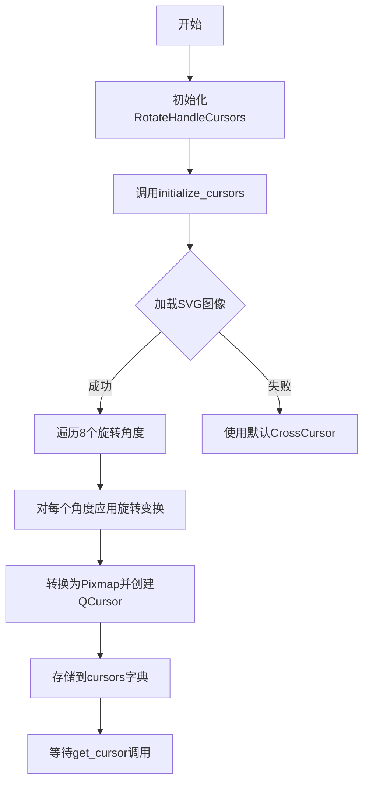
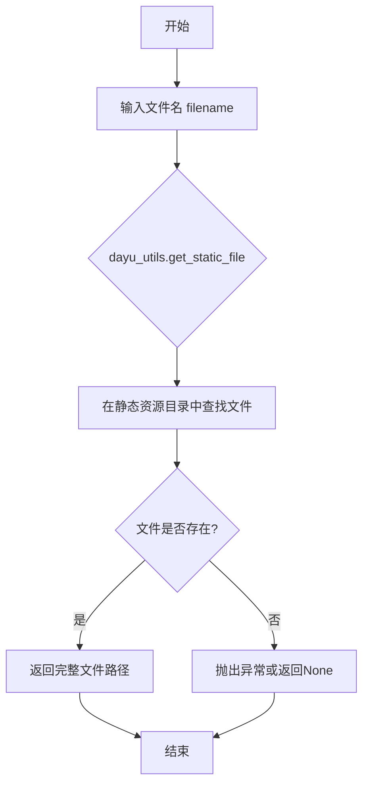
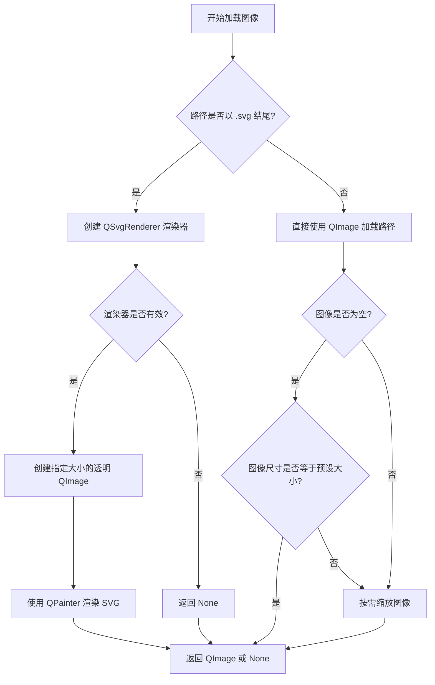
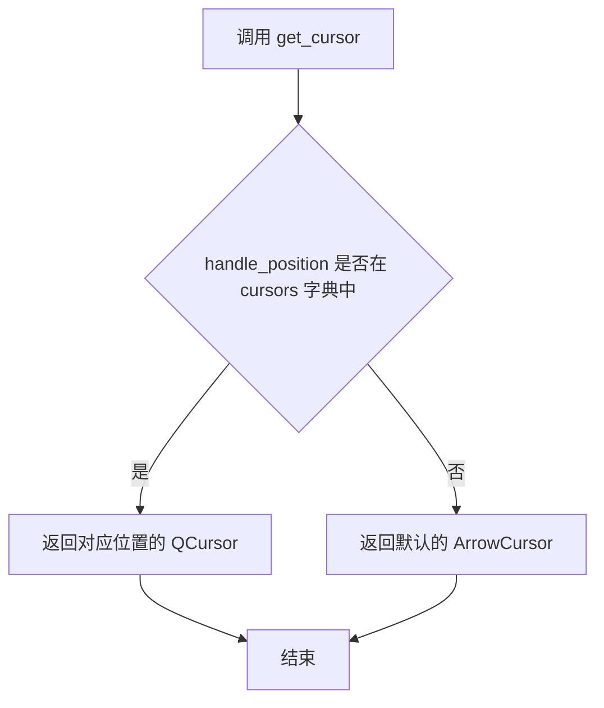
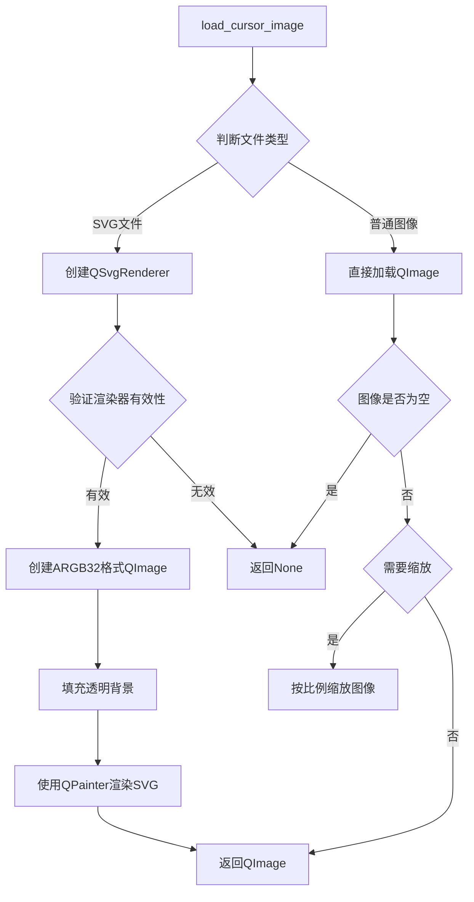
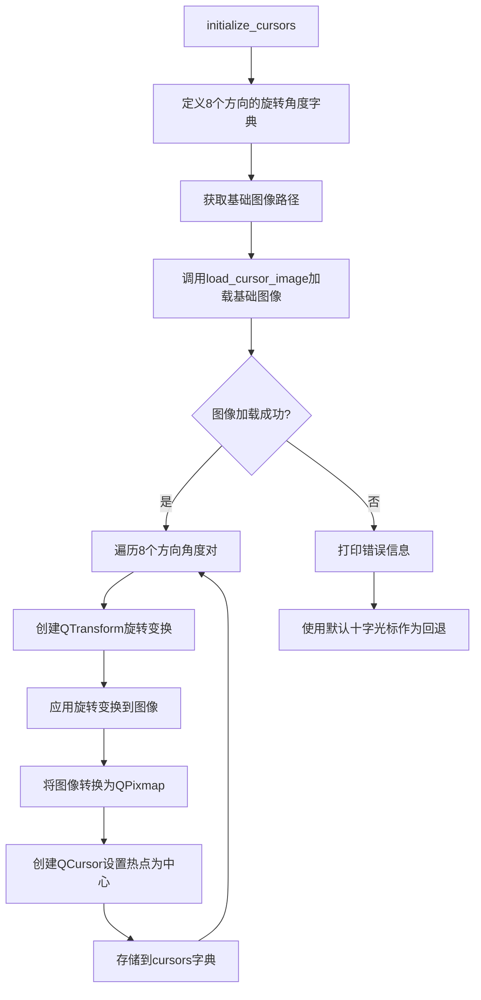

# `comic-translate\app\ui\canvas\rotate_cursor.py` 详细设计文档

一个用于处理旋转手柄光标的Qt组件，能够从SVG或图像文件加载光标图像，并根据8个方向（top, top_right, right, bottom_right, bottom, bottom_left, left, top_left）生成对应的旋转光标，支持动态获取不同位置的光标对象

## 整体流程



## 类结构

```
RotateHandleCursors (光标管理类)
```

## 全局变量及字段


### `rot_svg_path`
    
旋转箭头SVG文件的静态路径

类型：`str`
    


### `RotateHandleCursors.size`
    
光标尺寸

类型：`int`
    


### `RotateHandleCursors.cursors`
    
存储各方向光标的字典

类型：`dict`
    
    

## 全局函数及方法


### `dayu_utils.get_static_file`

获取静态文件路径的外部函数，用于定位应用程序资源目录中的静态文件（如SVG图标、图片等），常用于UI组件中加载光标、图标等资源。

参数：

- `filename`：`str`，要获取的静态文件的名称（包括扩展名），例如 `'rotate-arrow-top.svg'`

返回值：`str`，返回静态文件的完整文件系统路径

#### 流程图



#### 带注释源码

```python
# 注意：此函数定义在 app/ui/dayu_utils 模块中
# 当前代码文件只是调用该函数，未包含其完整实现
# 函数调用示例：
rot_svg_path = dayu_utils.get_static_file('rotate-arrow-top.svg')

# 根据调用上下文推断的函数签名和功能：
# def get_static_file(filename: str) -> str:
#     """
#     获取静态资源文件的完整路径
#     
#     参数:
#         filename: 静态文件名，如 'rotate-arrow-top.svg'
#     
#     返回值:
#         静态文件的完整文件系统路径字符串
#     
#     实现推测:
#         - 根据应用配置的资源路径规则
#         - 将文件名与基础资源路径拼接
#         - 返回完整的绝对或相对路径
#     """
```


### `RotateHandleCursors.__init__`

该方法为旋转句柄光标类的构造函数，接收光标尺寸参数，初始化实例属性并调用 `initialize_cursors()` 方法生成八个方向的光标对象。

参数：

- `size`：`int`，光标的尺寸大小，默认为 24 像素

返回值：`None`，构造函数无返回值

#### 流程图

```mermaid
flowchart TD
    A[开始 __init__] --> B{接收 size 参数}
    B --> C[默认 size = 24]
    C --> D[设置 self.size = size]
    E[初始化 self.cursors = {}]
    D --> E
    E --> F[调用 self.initialize_cursors]
    F --> G[结束]
```

#### 带注释源码

```
def __init__(self, size=24):
    """初始化旋转句柄光标对象
    
    Args:
        size: 光标的尺寸大小，默认为 24 像素
    
    Returns:
        None
    """
    # 设置实例属性 size，记录光标的尺寸
    self.size = size
    
    # 初始化空字典，用于存储八个方向的光标对象
    self.cursors = {}
    
    # 调用内部方法生成所有旋转角度的光标
    self.initialize_cursors()
```


### `RotateHandleCursors.load_cursor_image`

该方法用于加载SVG或常规图像文件，并将其转换为QImage对象返回，支持根据预设尺寸进行自动缩放。

参数：

- `path`：`str`，图像文件的路径，可以是SVG文件（以.svg结尾）或其他常见图像格式（如PNG、JPG等）

返回值：`QImage | None`，成功加载并转换后返回QImage对象，若加载失败或文件无效则返回None

#### 流程图



#### 带注释源码

```python
def load_cursor_image(self, path):
    """Load either an image or SVG file and return a QImage"""
    # 判断文件是否为SVG格式
    if path.lower().endswith('.svg'):
        # --- 处理SVG文件 ---
        # 创建SVG渲染器对象
        renderer = QtSvg.QSvgRenderer(path)
        # 检查SVG文件是否有效
        if renderer.isValid():
            # 创建指定大小的32位ARGB格式图像（支持透明通道）
            image = QtGui.QImage(self.size, self.size, QtGui.QImage.Format_ARGB32)
            # 使用透明色填充图像背景
            image.fill(QtCore.Qt.transparent)
            # 创建画家对象用于渲染
            painter = QtGui.QPainter(image)
            # 将SVG渲染到图像上
            renderer.render(painter)
            # 结束绘画操作，释放资源
            painter.end()
            # 返回渲染后的图像
            return image
        # SVG无效时返回空
        return None
    else:
        # --- 处理常规图像文件 ---
        # 直接加载图像文件
        image = QtGui.QImage(path)
        # 检查图像是否成功加载（非空）
        if not image.isNull():
            # 判断是否需要调整大小
            if image.size() != QtCore.QSize(self.size, self.size):
                # 按比例缩放图像，使用平滑变换算法
                image = image.scaled(self.size, self.size, 
                                  QtCore.Qt.KeepAspectRatio, 
                                  QtCore.Qt.SmoothTransformation)
        # 返回图像（可能为空的QImage对象）
        return image
```


### `RotateHandleCursors.initialize_cursors`

该方法负责初始化8个方向（top、top_right、right、bottom_right、bottom、bottom_left、left、top_left）的光标对象，通过加载基础光标图像并根据各方向角度进行旋转，生成对应的QCursor对象存储到self.cursors字典中；若图像加载失败则回退到系统默认的十字光标。

参数：

- 该方法无参数（仅包含self参数）

返回值：`None`，无返回值描述

#### 流程图

```mermaid
flowchart TD
    A[开始 initialize_cursors] --> B[定义8个方向的旋转角度字典<br/>rotations = {'top': 0, 'top_right': 45, ...}]
    B --> C[获取光标图像路径 image_path = rot_svg_path]
    C --> D{调用 load_cursor_image<br/>加载基础图像}
    D -->|图像加载成功| E[遍历 rotations 字典]
    D -->|图像加载失败| F[打印错误信息]
    F --> G[为每个方向设置默认十字光标<br/>Qt.CrossCursor]
    G --> Z[结束]
    
    E --> H[创建 QTransform 旋转变换]
    H --> I[使用 transform.rotate 旋转图像]
    I --> J[将旋转后的图像转换为 QPixmap]
    J --> K[创建 QCursor 并设置热点为中心<br/>self.size//2, self.size//2]
    K --> L[存储到 self.cursors 字典]
    L --> M{还有更多方向?}
    M -->|是| E
    M -->|否| Z
```

#### 带注释源码

```python
def initialize_cursors(self):
    """
    初始化8个方向的光标对象
    通过加载基础光标图像并按角度旋转，生成各方向对应的QCursor
    """
    
    # 定义8个手柄方向的旋转角度（单位：度）
    # top: 0度, top_right: 45度, right: 90度, bottom_right: 135度
    # bottom: 180度, bottom_left: 225度, left: 270度, top_left: 315度
    rotations = {
        'top': 0,
        'top_right': 45,
        'right': 90,
        'bottom_right': 135,
        'bottom': 180,
        'bottom_left': 225,
        'left': 270,
        'top_left': 315
    }
    
    # 获取光标图像路径（支持SVG或普通图像格式）
    image_path = rot_svg_path
    
    # 调用 load_cursor_image 方法加载基础光标图像
    # 返回 QImage 对象或 None（加载失败时）
    base_image = self.load_cursor_image(image_path)
    
    # 检查基础图像是否加载成功
    if base_image is not None:
        # 遍历所有方向和对应角度
        for handle, angle in rotations.items():
            # 创建 QTransform 旋转变换对象
            transform = QtGui.QTransform()
            # 设置旋转角度
            transform.rotate(angle)
            
            # 使用平滑变换对图像进行旋转
            # Qt.SmoothTransformation 提供抗锯齿效果
            rotated_image = base_image.transformed(transform, QtCore.Qt.SmoothTransformation)
            
            # 将旋转后的 QImage 转换为 QPixmap
            # QPixmap 用于创建 QCursor 对象
            pixmap = QtGui.QPixmap.fromImage(rotated_image)
            
            # 创建 QCursor 对象
            # 参数: pixmap - 光标图像
            #       self.size//2 - 热点X坐标（图像中心）
            #       self.size//2 - 热点Y坐标（图像中心）
            self.cursors[handle] = QtGui.QCursor(pixmap, self.size//2, self.size//2)
    else:
        # 图像加载失败时的降级处理
        # 打印错误信息便于调试
        print(f"Failed to load cursor image from {image_path}")
        
        # 为所有方向设置系统默认的十字光标作为回退
        for handle in rotations.keys():
            self.cursors[handle] = QtGui.QCursor(QtCore.Qt.CrossCursor)
```


### `RotateHandleCursors.get_cursor`

根据指定的位置名称从预生成的光标字典中获取对应的旋转光标，如果未找到对应位置的光标则返回默认的箭头光标。

参数：

- `handle_position`：`str`，表示把柄位置（如 'top'、'top_right'、'right' 等 8 个方向）

返回值：`QtGui.QCursor`，返回指定位置对应的旋转光标对象，若位置不存在则返回默认箭头光标

#### 流程图



#### 带注释源码

```python
def get_cursor(self, handle_position):
    """
    获取指定位置的光标
    
    参数:
        handle_position: str, 表示把柄位置 (如 'top', 'top_right', 'right', 
                        'bottom_right', 'bottom', 'bottom_left', 'left', 'top_left')
    
    返回:
        QtGui.QCursor: 对应位置的光标，若未找到则返回默认箭头光标
    """
    # 从 self.cursors 字典中查找对应位置的光标
    # 如果 handle_position 不在字典中，则返回第二个参数作为默认值
    return self.cursors.get(handle_position, QtGui.QCursor(QtCore.Qt.ArrowCursor))
```

## 关键组件


### 核心功能概述

该代码实现了一个旋转句柄光标管理器（RotateHandleCursors），用于在PySide6图形界面中提供8个方向（顶部、右上、右、右下、下、左下、左、左上）的旋转光标，支持从SVG或普通图像文件加载并根据角度旋转生成对应的光标对象，同时具备热键中心点自动居中的功能。

### 文件整体运行流程

1. 模块导入阶段：导入PySide6的QtCore、QtGui、QtSvg以及应用工具模块
2. 静态资源加载：从dayu_utils获取旋转箭头SVG的路径
3. RotateHandleCursors类实例化：创建光标管理器对象
4. 初始化阶段：调用initialize_cursors()加载基础图像并生成8个旋转光标
5. 运行时调用：通过get_cursor()根据句柄位置获取对应的光标对象

### 类详细信息

#### RotateHandleCursors 类

**类字段：**

| 字段名 | 类型 | 描述 |
|--------|------|------|
| size | int | 光标图像的目标尺寸（默认24像素） |
| cursors | dict | 存储8个方向光标的字典，键为方向字符串，值为QCursor对象 |

**类方法：**

##### load_cursor_image

- **名称**：load_cursor_image
- **参数**：
  - path (str): 图像文件路径
- **参数类型**：str
- **参数描述**：要加载的图像或SVG文件的完整路径
- **返回值类型**：QtGui.QImage 或 None
- **返回值描述**：返回加载并缩放后的QImage对象，如果加载失败返回None

**mermaid流程图：**



**带注释源码：**

```python
def load_cursor_image(self, path):
    """Load either an image or SVG file and return a QImage"""
    if path.lower().endswith('.svg'):
        # Handle SVG files
        renderer = QtSvg.QSvgRenderer(path)
        if renderer.isValid():
            image = QtGui.QImage(self.size, self.size, QtGui.QImage.Format_ARGB32)
            image.fill(QtCore.Qt.transparent)
            painter = QtGui.QPainter(image)
            renderer.render(painter)
            painter.end()
            return image
        return None
    else:
        # Handle regular image files
        image = QtGui.QImage(path)
        if not image.isNull():
            # Resize if needed
            if image.size() != QtCore.QSize(self.size, self.size):
                image = image.scaled(self.size, self.size, 
                                  QtCore.Qt.KeepAspectRatio, 
                                  QtCore.Qt.SmoothTransformation)
        return image
```

##### initialize_cursors

- **名称**：initialize_cursors
- **参数**：无
- **参数类型**：无
- **参数描述**：无
- **返回值类型**：None
- **返回值描述**：无返回值，仅初始化光标字典

**mermaid流程图：**



**带注释源码：**

```python
def initialize_cursors(self):
    # Define rotation angles for each handle
    rotations = {
        'top': 0,
        'top_right': 45,
        'right': 90,
        'bottom_right': 135,
        'bottom': 180,
        'bottom_left': 225,
        'left': 270,
        'top_left': 315
    }
    
    # Path to cursor image (can be SVG or regular image)
    image_path = rot_svg_path
    
    # Load the base image
    base_image = self.load_cursor_image(image_path)
    
    if base_image is not None:
        for handle, angle in rotations.items():
            # Create transform for rotation
            transform = QtGui.QTransform()
            transform.rotate(angle)
            
            # Apply rotation to image
            rotated_image = base_image.transformed(transform, QtCore.Qt.SmoothTransformation)
            
            # Convert to pixmap and create cursor
            pixmap = QtGui.QPixmap.fromImage(rotated_image)
            # Set hot spot to center using self.size
            self.cursors[handle] = QtGui.QCursor(pixmap, self.size//2, self.size//2)
    else:
        # Fallback to default cursors if image loading fails
        print(f"Failed to load cursor image from {image_path}")
        for handle in rotations.keys():
            self.cursors[handle] = QtGui.QCursor(QtCore.Qt.CrossCursor)
```

##### get_cursor

- **名称**：get_cursor
- **参数**：
  - handle_position (str): 光标位置标识符
- **参数类型**：str
- **参数描述**：要获取的光标位置（如'top', 'right', 'bottom_left'等）
- **返回值类型**：QtGui.QCursor
- **返回值描述**：返回指定位置的QCursor对象，如果位置不存在则返回默认箭头光标

**带注释源码：**

```python
def get_cursor(self, handle_position):
    return self.cursors.get(handle_position, QtGui.QCursor(QtCore.Qt.ArrowCursor))
```

### 全局变量和函数

| 名称 | 类型 | 描述 |
|------|------|------|
| rot_svg_path | str | 全局变量，存储旋转箭头SVG文件的静态路径，通过dayu_utils.get_static_file获取 |

### 关键组件信息

#### 组件1：SVG渲染与转换引擎

负责将SVG矢量图形转换为可作为光标使用的QImage对象，支持透明背景渲染和高质量平滑变换。

#### 组件2：多方向光标生成器

通过角度映射字典和QTransform旋转矩阵，实现从单一基础图像生成8个方向变体光标的核心逻辑。

#### 组件3：光标热点自动计算

使用size//2计算光标热点（hot spot）到图像中心，确保光标交互位置精确。

#### 组件4：资源路径管理

通过dayu_utils.get_static_file统一管理静态资源路径，实现资源与代码的解耦。

### 潜在技术债务与优化空间

1. **硬编码尺寸限制**：size固定为24像素，缺少灵活性配置，建议改为可配置参数
2. **错误处理不完善**：使用print输出错误信息，应改用正式的日志系统
3. **SVG缓存机制缺失**：每次实例化都重新加载和渲染SVG，性能可优化
4. **内存占用隐患**：8个旋转图像同时驻留内存，大尺寸场景可能有内存压力
5. **缺少资源存在性检查**：get_static_file返回路径后未验证文件是否真实存在
6. **回退逻辑过于简单**：仅使用CrossCursor作为回退，未考虑平台兼容性

### 其它项目

#### 设计目标与约束
- 目标：提供统一的光标资源管理和多方向旋转能力
- 约束：依赖PySide6图形库和特定SVG资源文件

#### 错误处理与异常设计
- SVG渲染失败：返回None并由上层处理
- 图像加载失败：打印错误并使用系统默认光标作为回退
- 未知位置请求：返回标准箭头光标而非抛出异常

#### 数据流与状态机
- 状态流：初始化（加载→旋转→转换→存储）→就绪（可查询）→使用（返回光标）
- 初始化完成后，光标字典为不可变状态

#### 外部依赖与接口契约
- 依赖：PySide6.QtCore, PySide6.QtGui, PySide6.QtSvg, app.ui.dayu_widgets.utils
- 预期输入：有效的SVG或图像文件路径
- 预期输出：8个QCursor对象或相应的回退对象


## 问题及建议


### 已知问题

-   **错误处理不完善**：`initialize_cursors()` 方法在加载图片失败时仅使用 `print` 输出错误，没有抛出异常或提供降级机制，可能导致静默失败难以调试
-   **SVG渲染失败时无回退机制**：当 `QtSvg.QSvgRenderer` 的 `isValid()` 返回 `False` 时直接返回 `None`，没有尝试其他格式或默认处理
-   **资源未缓存**：每次创建 `RotateHandleCursors` 实例时都会重新加载和旋转图像，在频繁使用场景下会造成性能浪费
-   **硬编码的图像路径依赖**：全局变量 `rot_svg_path` 依赖外部模块获取，如果文件不存在会导致后续所有游标初始化失败
-   **图片缩放可能导致失真**：对于非SVG格式图片，使用 `KeepAspectRatio` 缩放后可能无法精确匹配 `self.size`，导致游标尺寸不一致
-   **缺少类型注解**：方法参数和返回值缺少类型提示，影响代码可读性和IDE支持

### 优化建议

-   **添加异常处理与日志**：使用 `logging` 模块替代 `print`，并根据严重程度决定是否抛出异常
-   **实现缓存机制**：考虑使用单例模式或类级别的缓存，避免重复加载和旋转图像
-   **增强SVG加载错误处理**：当SVG渲染失败时，尝试加载备用图像或使用默认游标
-   **添加类型注解**：为所有方法参数和返回值添加类型提示，提升代码质量
-   **配置化设计**：将旋转角度映射、默认游标等配置提取为类属性或配置常量，便于维护和扩展

## 其它


### 设计目标与约束

本类旨在为 UI 旋转手柄提供一组旋转的光标图像，支持 SVG 与光栅图像格式，并在图像加载失败时回退到默认光标。约束包括：仅依赖 PySide6、依赖 dayu_utils 获取静态文件路径、仅支持 8 个手柄位置、默认光标大小为 24 像素。

### 错误处理与异常设计

- `load_cursor_image` 在文件不存在、格式不支持或渲染失败时返回 `None`。  
- `initialize_cursors` 在 `base_image` 为 `None` 时打印错误信息并使用默认光标（`Qt.CrossCursor`）作为回退。  
- `get_cursor` 在查询不存在的 `handle_position` 时返回默认箭头光标（`Qt.ArrowCursor`）。  
- 未定义自定义异常，所有错误均通过返回值与标准输出传递。

### 数据流与状态机

数据流如下：  
1. 初始化时通过 `dayu_utils.get_static_file` 获取基础光标图像路径。  
2. `load_cursor_image` 读取并（若需要）缩放图像，返回 `QImage`。  
3. `initialize_cursors` 遍历预定义的 8 个旋转角度，对基础图像进行旋转并生成 `QPixmap`，再创建 `QCursor` 存入 `self.cursors` 字典。  
4. 调用 `get_cursor(handle_position)` 时直接返回对应 `QCursor`。  
该过程无状态机，属于一次性初始化、后续只读查询的模式。

### 外部依赖与接口契约

- **依赖**：  
  - `PySide6.QtCore`、`PySide6.QtGui`、`PySide6.QtSvg`  
  - `app.ui.dayu_utils`（提供 `get_static_file` 函数）  
  - 静态资源文件 `rotate-arrow-top.svg`（必须存在于资源路径中）  
- **接口**：  
  - `RotateHandleCursors(size=24)`：构造方法，接受光标尺寸参数。  
  - `get_cursor(handle_position)`：参数 `handle_position` 必须为 `'top'、'top_right'、'right'、'bottom_right'、'bottom'、'bottom_left'、'left'、'top_left'` 之一；返回 `QtGui.QCursor` 对象。  
- **返回值**：若对应光标不存在，返回 `QtGui.QCursor(QtCore.Qt.ArrowCursor)`。

### 性能考虑

- 图像加载与旋转在 `__init__` 中一次性完成，后续 `get_cursor` 调用为 O(1) 字典查找，性能开销极低。  
- 每次实例化会创建 8 个 `QPixmap` 对象，若在短时间内大量创建实例可能导致内存峰值，建议采用单例或全局实例复用。  
- 当前实现不支持懒加载，若光标图片非常大或需要动态切换，可考虑延迟初始化或缓存机制。

### 安全性与权限

- 本类仅读取本地文件系统中的图像资源，不涉及网络请求或用户输入验证，安全风险较低。  
- 依赖的静态文件路径由内部 `dayu_utils` 管理，需确保资源文件部署在合法路径下，避免路径注入或文件泄漏。

### 兼容性

- 基于 `PySide6`（Qt for Python）实现，理论上兼容 Qt6 正式版。  
- 代码使用了 `QtSvg.QSvgRenderer`、`QtGui.QImage`、`QtGui.QPixmap`、`QtCore.Qt` 枚举等 Qt6 API，若迁移到 PyQt5 或 Qt5 可能需要适配（如 `QtCore.Qt` 命名空间差异）。  
- 仅在桌面平台（Windows、macOS、Linux）上测试，未覆盖移动端。

### 可扩展性

- **新增手柄位置**：只需在 `rotations` 字典中增加对应的角度条目，即可自动生成对应光标。  
- **自定义基础图像**：可在 `initialize_cursors` 中接受外部传入的图像路径或 `QImage`，实现更灵活的资源加载。  
- **动态尺寸**：构造参数 `size` 已支持自定义光标尺寸，可进一步提供 setter 方法实现运行时尺寸切换。  
- **更多图像格式**：`load_cursor_image` 使用 `QImage` 自动支持常见格式（BMP、JPG、PNG、GIF 等），若需更多格式可自行扩展。

### 测试策略

- **单元测试**：  
  - `test_load_cursor_image_with_svg`：验证 SVG 文件正确加载并返回非空 `QImage`。  
  - `test_load_cursor_image_with_png`：验证 PNG 文件加载并按尺寸缩放。  
  - `test_load_cursor_image_invalid_path`：验证无效路径返回 `None`。  
  - `test_initialize_cursors_success`：检查 `self.cursors` 包含 8 个键值对，且每个值为 `QCursor` 实例。  
  - `test_initialize_cursors_fallback`：模拟 `load_cursor_image` 返回 `None`，验证回退到 `Qt.CrossCursor`。  
  - `test_get_cursor_valid_handle`：传入合法 `handle_position`，返回非默认 `QCursor`。  
  - `test_get_cursor_invalid_handle`：传入未知 `handle_position`，返回 `Qt.ArrowCursor`。  
- **集成测试**：在实际 UI 环境中使用 `RotateHandleCursors` 替换标准光标，验证视觉效果与交互符合预期。  
- **性能测试**：创建大量实例并测量内存占用与初始化时间，确保在可接受范围内。

### 部署与运维

- 本类以 Python 源码形式分发，无需额外编译。部署时需确保：  
  - 目标环境已安装 `PySide6`（建议使用 `pip install PySide6`）。  
  - `app.ui.dayu_utils` 模块及其依赖的静态资源文件（`rotate-arrow-top.svg`）已正确打包并位于可搜索路径中。  
- 运维建议：  
  - 将 `print` 替换为标准日志库（如 `logging`），便于线上环境捕获错误。  
  - 提供配置接口，使光标图片路径可外部指定，提升灵活性。  
  - 若在高频场景下使用，考虑实现单例模式或全局缓存，避免重复初始化。

    