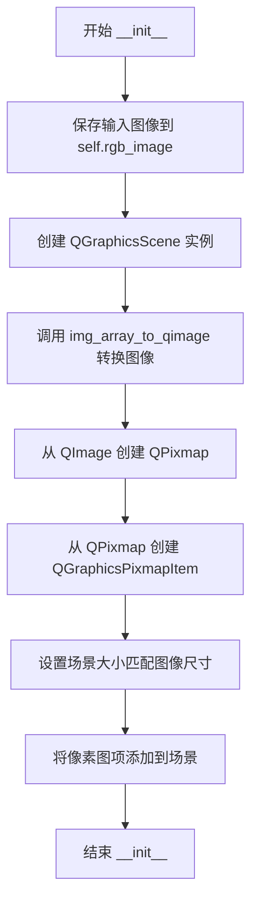
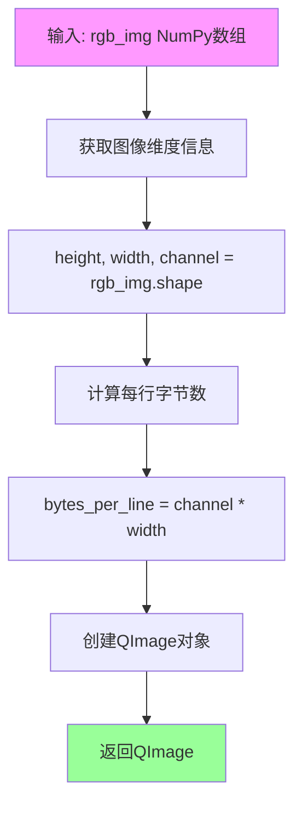
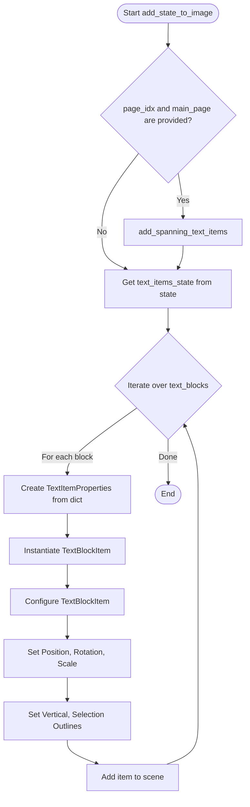
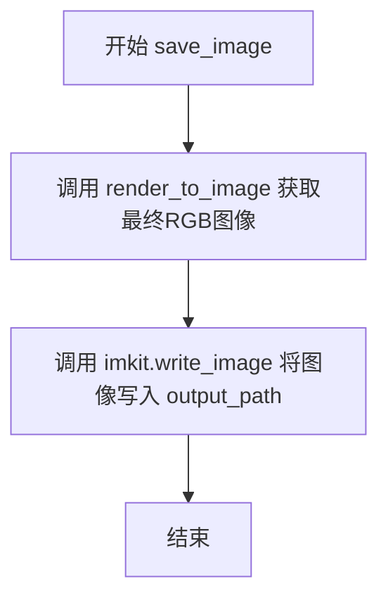

# `comic-translate\app\ui\canvas\save_renderer.py` 详细设计文档

这是一个图像渲染器类（ImageSaveRenderer），它使用 PySide6 的图形场景（QGraphicsScene）将文本块和修补补丁（inpainting patches）合成到基础的 NumPy 图像数组上，并支持高分辨率抗锯齿渲染最终输出为图像文件。

## 整体流程

```mermaid
graph TD
    A[开始: 输入图像 (numpy array) & 状态 (state)] --> B[初始化: 创建 QGraphicsScene]
    B --> C[转换图像: numpy array 转 QImage/QPixmap]
    C --> D[添加基础图像到场景: addItem(pixmap_item)]
    D --> E{是否需要处理跨页文本?}
    E -- 是 --> F[调用 add_spanning_text_items 处理跨页逻辑]
    F --> G
    E -- 否 --> G
    G[遍历 text_items_state] --> H[创建 TextBlockItem]
    H --> I[配置文本样式 (字体, 颜色, 旋转等)]
    I --> J[将文本项添加到场景]
    J --> K{是否有修补补丁 (patches)?}
    K -- 是 --> L[遍历 patches]
    L --> M[读取补丁图像/数据]
    M --> N[创建 QGraphicsPixmapItem]
    N --> O[设置位置并添加为子项]
    O --> P
    K -- 否 --> P
    P[调用 render_to_image] --> Q[放大渲染 (2x scale) + 抗锯齿]
    Q --> R[缩小到原始尺寸]
    R --> S[QImage 转 NumPy Array]
    S --> T[调用 imk.write_image 保存]
    T --> U[结束]
```

## 类结构

```
ImageSaveRenderer (主渲染类)
```

## 全局变量及字段


### `ImageSaveRenderer.self.rgb_image`
    
原始输入的RGB图像数据

类型：`np.ndarray`
    


### `ImageSaveRenderer.self.scene`
    
用于管理所有图形项的场景画布

类型：`QtWidgets.QGraphicsScene`
    


### `ImageSaveRenderer.self.qimage`
    
Qt格式的图像对象

类型：`QtGui.QImage`
    


### `ImageSaveRenderer.self.pixmap`
    
用于显示的像素图对象

类型：`QtGui.QPixmap`
    


### `ImageSaveRenderer.self.pixmap_item`
    
场景中代表基础图像的图形项

类型：`QtWidgets.QGraphicsPixmapItem`
    
    

## 全局函数及方法


### `ImageSaveRenderer.__init__`

该方法是 `ImageSaveRenderer` 类的构造函数，负责将输入的 NumPy 数组图像转换为 Qt 可用的图像格式，并初始化图形场景（QGraphicsScene）以及用于渲染的像素图项（QGraphicsPixmapItem），为后续的图像保存和编辑操作提供基础的渲染环境。

参数：

- `image`：`np.ndarray`，传入的 RGB 彩色图像数据，以 NumPy 多维数组形式表示

返回值：无（`__init__` 方法不返回值，仅完成对象的初始化）

#### 流程图



#### 带注释源码

```python
def __init__(self, image: np.ndarray):
    # 将传入的NumPy数组图像保存为实例变量，后续操作都基于此图像数据
    self.rgb_image = image
    
    # 创建Qt图形场景，用于管理所有的图形项（如像素图、文本项等）
    self.scene = QtWidgets.QGraphicsScene()

    # 将NumPy数组格式的图像转换为Qt的QImage格式，以便Qt图形系统使用
    self.qimage = self.img_array_to_qimage(image)
    
    # 从QImage创建QPixmap（像素图），QPixmap是用于屏幕显示的图像优化格式
    self.pixmap = QtGui.QPixmap.fromImage(self.qimage)
    
    # 创建QGraphicsPixmapItem图形项，将像素图添加到图形项系统中
    # 该item将作为场景中的一个可渲染元素
    self.pixmap_item = QtWidgets.QGraphicsPixmapItem(self.pixmap)

    # 设置场景的矩形区域大小，使其与图像的宽高匹配
    # 确保场景的渲染范围与图像尺寸一致
    self.scene.setSceneRect(0, 0, self.qimage.width(), self.qimage.height())

    # 将创建好的像素图项添加到场景中，使其成为场景的一部分
    # 这样在渲染场景时，像素图项会被绘制出来
    self.scene.addItem(self.pixmap_item)
```


### `ImageSaveRenderer.img_array_to_qimage`

该方法负责将 NumPy 数组格式的 RGB 图像数据转换为 Qt 的 QImage 对象，以便后续在 Qt 图形场景中进行渲染和处理。

参数：

- `rgb_img`：`np.ndarray`，输入的 RGB 图像 NumPy 数组，形状为 (height, width, channel)，其中 channel 通常为 3（RGB 三通道）

返回值：`QtGui.QImage`，转换后的 Qt 图像对象，可用于创建 QPixmap 或直接在 Qt 图形系统中使用

#### 流程图



#### 带注释源码

```python
def img_array_to_qimage(self, rgb_img: np.ndarray) -> QtGui.QImage:
    """
    将NumPy数组格式的RGB图像转换为Qt的QImage对象。
    
    参数:
        rgb_img: NumPy数组，形状为 (height, width, channel)，channel通常为3
        
    返回:
        QtGui.QImage: 转换后的Qt图像对象
    """
    # 从NumPy数组中提取图像的维度信息
    # height: 图像高度（行数）
    # width: 图像宽度（列数）
    # channel: 通道数（通常为3，表示RGB）
    height, width, channel = rgb_img.shape
    
    # 计算每行像素的字节数
    # 每个通道占1字节，因此 bytes_per_line = channel * width
    bytes_per_line = channel * width
    
    # 使用QImage构造函数创建图像对象
    # 参数说明:
    #   rgb_img.data: 指向NumPy数组底层内存的指针
    #   width: 图像宽度
    #   height: 图像高度
    #   bytes_per_line: 每行字节数（用于连续内存布局）
    #   QtGui.QImage.Format.Format_RGB888: 指定图像格式为RGB888（8位3通道）
    return QtGui.QImage(
        rgb_img.data,          # 图像数据指针
        width,                 # 图像宽度
        height,                # 图像高度
        bytes_per_line,        # 每行字节数
        QtGui.QImage.Format.Format_RGB888  # 图像格式
    )
```


### `ImageSaveRenderer.add_state_to_image`

该方法充当了数据转换层的角色，将包含文本状态信息的字典对象转换为 Qt 图形场景中的可视化 `TextBlockItem` 对象。它首先检查并处理跨页文本（Spanning Text），随后遍历当前页面的文本块数据，利用 `TextItemProperties` 构建统一的属性集，并实例化图形项，最终将其定位、旋转、缩放并添加到渲染场景中。

参数：

-   `self`：隐式参数，表示 `ImageSaveRenderer` 的实例本身。
-   `state`：`dict`，包含页面渲染状态的数据字典，必须包含 `text_items_state` 键，其值为文本块的属性列表。
-   `page_idx`：`int | None`，可选参数，指定当前渲染的页面索引，用于处理跨页文本逻辑。
-   `main_page`：`object | None`，可选参数，指向主页面对象的引用，通常包含所有页面图像文件路径及对应的状态缓存，用于获取相邻页面的文本状态。

返回值：`None` (无返回值)。该方法通过修改 `self.scene` 对象来产生副作用，将文本项添加到场景中。

#### 流程图



#### 带注释源码

```python
def add_state_to_image(self, state, page_idx=None, main_page=None):
    # 如果提供了页面索引和主页面对象，则处理跨页文本（跨越多页的文本块）
    if page_idx is not None and main_page is not None:
        self.add_spanning_text_items(state, page_idx, main_page)

    # 遍历状态中所有的文本块
    for text_block in state.get('text_items_state', []):
        # 使用 TextItemProperties 根据字典数据构建一致的属性对象
        text_props = TextItemProperties.from_dict(text_block)
        
        # 创建 TextBlockItem 实例，传入从 props 中解析出的所有样式参数
        text_item = TextBlockItem(
            text=text_props.text,
            font_family=text_props.font_family,
            font_size=text_props.font_size,
            render_color=text_props.text_color,
            alignment=text_props.alignment,
            line_spacing=text_props.line_spacing,
            outline_color=text_props.outline_color,
            outline_width=text_props.outline_width,
            bold=text_props.bold,
            italic=text_props.italic,
            underline=text_props.underline,
            direction=text_props.direction,
        )

        # 设置文本内容和宽度
        text_item.set_text(text_props.text, text_props.width)
        
        # 设置文本方向（如果有）
        if text_props.direction:
            text_item.set_direction(text_props.direction)
            
        # 设置变换原点（用于旋转和缩放）
        if text_props.transform_origin:
            text_item.setTransformOriginPoint(QtCore.QPointF(*text_props.transform_origin))
            
        # 设置位置、旋转、缩放
        text_item.setPos(QtCore.QPointF(*text_props.position))
        text_item.setRotation(text_props.rotation)
        text_item.setScale(text_props.scale)
        
        # 设置垂直排列标志
        text_item.set_vertical(bool(text_props.vertical))
        
        # 应用选中状态描边并更新
        text_item.selection_outlines = text_props.selection_outlines
        text_item.update()

        # 将处理好的图形项添加到场景中
        self.scene.addItem(text_item)
```


### ImageSaveRenderer.add_spanning_text_items

该方法用于处理跨页文本块（Spanning Text Blocks）的渲染。它通过“位置裁剪”（Positional Clipping）技术，将跨越多个页面的文本项正确地渲染到当前页面上。对于相邻页面中超出边界的文本，该方法会计算并调整其在当前页面画布上的位置，使得渲染器能够裁剪掉不可见部分，从而只显示溢出到当前页面的文本部分。

参数：

- `self`：`ImageSaveRenderer` 实例本身，无需显式传递。
- `viewer_state`：`dict`，包含当前页面的查看器状态，其中键 `'text_items_state'` 对应一个文本项列表，用于存储当前页面的所有文本项状态。
- `page_idx`：`int`，当前正在渲染的页面的索引。
- `main_page`：`MainPage` 对象（类型通常为项目内部定义的对象，此处未提供具体类名，根据上下文推断），包含所有页面的信息，如 `image_files`（图像文件路径列表）和 `image_states`（每个图像对应的状态字典）。

返回值：`None`，该方法直接修改 `viewer_state` 字典中的 `text_items_state` 列表，不返回任何值。

#### 流程图

```mermaid
flowchart TD
    A[开始 add_spanning_text_items] --> B[获取 viewer_state 中的 text_items_state]
    B --> C[获取当前页面图像路径和高度]
    C --> D{遍历 main_page.image_files 中的每一页}
    D --> E{当前页 == other_page_idx?}
    E -->|是| D
    E -->|否| F{other_image_path 在 image_states 中?}
    F -->|否| D
    F --> G{page_gap == 1 或 -1?}
    G -->|否| D
    G -->|是| H[获取相邻页面的图像和文本项]
    H --> I{遍历相邻页面的文本项}
    I --> J{计算文本项的 Y2 位置}
    J --> K{page_gap == 1 且 Y2 > other_page_height?}
    K -->|是| L[计算新位置 new_y]
    K -->|否| M{page_gap == -1 且 Y1 < 0?}
    L --> N{创建 spanning_text_item 副本}
    M -->|是| O[计算新位置 new_y]
    M -->|否| I
    O --> N
    N --> P[添加到 existing_text_items]
    P --> Q[更新 viewer_state['text_items_state']]
    Q --> R[结束]
```

#### 带注释源码

```python
def add_spanning_text_items(self, viewer_state, page_idx, main_page):
    """
    Add text items from spanning blocks that should appear on this page.
    This function uses 'positional clipping': it places the full text item
    on the render canvas but adjusts its position so that the parts outside
    the intended visible area are positioned off-canvas and are clipped by
    the renderer.
    """
    # 1. 获取当前 viewer_state 中已有的文本项列表
    existing_text_items = viewer_state.get('text_items_state', [])

    # 2. 获取当前页面的图像路径和高度
    current_image_path = main_page.image_files[page_idx]
    current_image = imk.read_image(current_image_path)
    current_page_height = current_image.shape[0]

    # 3. 遍历所有页面，寻找与当前页面相邻的页面
    for other_page_idx, other_image_path in enumerate(main_page.image_files):
        # 跳过当前页面本身
        if other_page_idx == page_idx:
            continue

        # 如果相邻页面没有对应的状态记录，则跳过
        if other_image_path not in main_page.image_states:
            continue

        # 计算当前页面与相邻页面的索引差（页距）
        page_gap = page_idx - other_page_idx
        # 只处理上一页和下一页（绝对页距为1）
        if abs(page_gap) != 1:  # Only check adjacent pages
            continue

        # 4. 获取相邻页面的图像高度和文本项
        other_image = imk.read_image(other_image_path)
        other_page_height = other_image.shape[0]
        other_viewer_state = main_page.image_states[other_image_path].get('viewer_state', {})
        other_text_items = other_viewer_state.get('text_items_state', [])

        if not other_text_items:
            continue

        # 5. 遍历相邻页面上的文本项，检查是否有跨页文本
        for text_item in other_text_items:
            pos = text_item.get('position', (0, 0))
            item_x1, item_y1 = pos
            height = text_item.get('height', 0)
            item_y2 = item_y1 + height

            new_pos = None

            # 6. 处理当前页在相邻页下方的情况 (page_gap == 1)
            # 此时检查上方页面的文本是否向下延伸超出了其页面底部
            if page_gap == 1:  # Current page is BELOW other page
                # Check if text from the page above extends below its bottom boundary
                if item_y2 > other_page_height:
                    # Position the item on the current page's canvas such that its top is
                    # shifted up by the height of the portion visible on the page above.
                    # This makes the renderer clip the top and show only the overflowing bottom part.
                    # 计算新的 Y 坐标：通过将文本项上移，使其在当前页面显示溢出的底部
                    new_y = -(other_page_height - item_y1)
                    new_pos = (item_x1, new_y)

            # 7. 处理当前页在相邻页上方的情况 (page_gap == -1)
            # 此时检查下方页面的文本是否向上延伸超出了其页面顶部（即 y 坐标为负）
            elif page_gap == -1:  # Current page is ABOVE other page
                # Check if text from the page below extends above its top boundary (i.e., has a negative y)
                if item_y1 < 0:
                    # Position the item on the current page's canvas so its top aligns with where
                    # it should appear at the bottom of the current page. The renderer will clip the
                    # rest of the text block that falls below the page's bottom boundary.
                    # 计算新的 Y 坐标：通过将文本项下移，使其在当前页面顶部开始渲染
                    new_y = current_page_height + item_y1
                    new_pos = (item_x1, new_y)

            # 8. 如果计算出了新的位置，则创建新的文本项状态并添加
            if new_pos:
                # Create a new text item state for the spanning portion.
                # It's a full copy, but its position causes clipping.
                spanning_text_item = text_item.copy()
                spanning_text_item['position'] = new_pos
                existing_text_items.append(spanning_text_item)

    # 9. 将更新后的文本项列表写回 viewer_state
    viewer_state['text_items_state'] = existing_text_items
```


### ImageSaveRenderer.render_to_image

该方法负责将QGraphicsScene中渲染的内容导出为numpy数组格式的RGB图像，通过创建高分辨率QImage、设置抗锯齿渲染、缩放处理以及将QImage位数据转换为numpy数组的流程，最终返回标准的OpenCV兼容图像格式。

参数：
- （无，仅使用实例属性 `self`）

返回值：`np.ndarray`，返回转换后的RGB图像数组，形状为 (height, width, 3)，可直接用于OpenCV等图像处理库

#### 流程图

```mermaid
flowchart TD
    A[开始 render_to_image] --> B[创建缩放因子为2的高分辨率QImage]
    B --> C[用透明色填充QImage]
    C --> D[创建QPainter并设置抗锯齿渲染提示]
    D --> E[调用scene.render渲染场景到painter]
    E --> F[结束painter绘制]
    F --> G[将图像缩放回原始尺寸]
    G --> H[转换为RGB888格式]
    H --> I[获取图像字节数据]
    I --> J[验证字节数匹配]
    J --> K{验证通过?}
    K -->|否| L[抛出ValueError异常]
    K -->|是| M[将位数据转换为numpy数组]
    M --> N[去除填充字节]
    N --> O[重塑为(height, width, 3)形状]
    O --> P[返回RGB numpy数组]
```

#### 带注释源码

```python
def render_to_image(self):
    # 创建一个高分辨率的QImage，scale_factor控制输出分辨率
    # 2表示放大2倍，后续会缩放回原始尺寸以实现超采样抗锯齿效果
    scale_factor = 2  # Increase this for higher resolution
    original_size = self.pixmap.size()  # 获取原始图像尺寸
    scaled_size = original_size * scale_factor  # 计算放大后的尺寸
    
    # 创建ARGB32格式的QImage用于渲染，支持透明通道
    qimage = QtGui.QImage(scaled_size, QtGui.QImage.Format.Format_ARGB32)
    qimage.fill(QtCore.Qt.transparent)  # 用透明色填充初始图像

    # 创建QPainter并配置高质量渲染选项
    painter = QtGui.QPainter(qimage)
    painter.setRenderHint(QtGui.QPainter.RenderHint.Antialiasing, True)  # 启用形状抗锯齿
    painter.setRenderHint(QtGui.QPainter.RenderHint.TextAntialiasing, True)  # 启用文本抗锯齿
    painter.setRenderHint(QtGui.QPainter.RenderHint.SmoothPixmapTransform, True)  # 启用平滑图像变换

    # 将场景内容渲染到painter，即绘制到QImage上
    self.scene.render(painter)
    painter.end()  # 结束绘制，释放资源

    # 将高分辨率图像缩放回原始尺寸，实现超采样效果提升质量
    qimage = qimage.scaled(original_size, 
                        QtCore.Qt.AspectRatioMode.KeepAspectRatio, 
                        QtCore.Qt.TransformationMode.SmoothTransformation)

    # 转换为RGB888格式（每像素3字节，RGB顺序）
    qimage = qimage.convertToFormat(QtGui.QImage.Format.Format_RGB888)
    width = qimage.width()  # 获取图像宽度
    height = qimage.height()  # 获取图像高度
    bytes_per_line = qimage.bytesPerLine()  # 获取每行字节数（可能包含填充）

    # 获取图像总字节数
    byte_count = qimage.sizeInBytes()
    expected_size = height * bytes_per_line  # 计算预期大小

    # 验证图像数据完整性，检测内存对齐或格式问题
    if byte_count != expected_size:
        print(f"QImage sizeInBytes: {byte_count}, Expected size: {expected_size}")
        print(f"Image dimensions: ({width}, {height}), Format: {qimage.format()}")
        raise ValueError(f"Byte count mismatch: got {byte_count} but expected {expected_size}")

    ptr = qimage.bits()  # 获取图像原始像素数据的指针

    # 将内存数据转换为numpy数组，考虑可能的填充字节
    # 注意：bytes_per_line可能大于width*3（每行像素×3通道），存在内存对齐填充
    arr = np.array(ptr).reshape((height, bytes_per_line))
    # 去除填充字节，只保留实际的图像数据
    arr = arr[:, :width * 3]
    # 重塑为标准的三通道RGB图像格式 (height, width, channels)
    arr = arr.reshape((height, width, 3))

    return arr  # 返回numpy数组，可直接用于OpenCV等库
```


### `ImageSaveRenderer.save_image`

将渲染完成的图像保存到指定的文件路径。

参数：

- `output_path`：`str`，输出图像文件的路径

返回值：`None`，无返回值（直接将图像写入文件）

#### 流程图



#### 带注释源码

```
def save_image(self, output_path: str):
    """
    将渲染后的图像保存到指定的文件路径。
    
    该方法是图像保存流程的最终步骤，调用 render_to_image()
    获取当前场景的渲染结果，然后使用 imkit 库将图像写入磁盘。
    
    参数:
        output_path: str, 输出图像文件的路径
        
    返回:
        None: 无返回值，图像直接写入文件
        
    注意:
        - 依赖 render_to_image() 方法的成功执行
        - 依赖 imkit.write_image 函数进行文件写入
        - 如果文件路径无效或磁盘空间不足可能会抛出异常
    """
    # 调用 render_to_image 方法获取渲染后的 RGB 图像数组
    final_rgb = self.render_to_image()
    
    # 使用 imkit 库的 write_image 函数将图像写入指定路径
    imk.write_image(output_path, final_rgb)
```

#### 关联信息

**所在类**：`ImageSaveRenderer`

**类功能概述**：负责将 NumPy 数组格式的图像转换为 Qt 图形场景，添加文本状态和修补内容，最终渲染并保存为图像文件。

**相关方法**：

- `render_to_image()`：将 Qt 图形场景渲染为 NumPy 数组，是 `save_image` 的前置依赖方法
- `img_array_to_qimage()`：辅助方法，用于将 NumPy 数组转换为 QImage
- `apply_patches()`：应用图像修补（inpainting）到场景中


### `ImageSaveRenderer.apply_patches`

该方法用于将图像修复（inpainting）补丁应用到图像渲染场景中，通过读取补丁图像或PNG文件，创建图形项并定位到原始图像的指定位置。

参数：

- `patches`：`list[dict]`，待应用的补丁列表，每个字典需包含 `bbox` 键（格式为 `[x, y, w, h]`），可选 `png_path` 键（PNG文件路径）或 `image` 键（直接图像数据）

返回值：`None`，该方法直接在场景中修改图形项，无返回值

#### 流程图

```mermaid
flowchart TD
    A[开始 apply_patches] --> B{遍历 patches 列表}
    B -->|遍历| C[提取 patch 中的 bbox: x, y, w, h]
    C --> D{判断 'png_path' in patch}
    D -->|是| E[使用 imk.read_image 读取 PNG 文件]
    D -->|否| F[直接使用 patch['image'] 数据]
    E --> G[调用 img_array_to_qimage 转换为 QImage]
    F --> G
    G --> H[使用 QPixmap.fromImage 转换为 QPixmap]
    H --> I[创建 QGraphicsPixmapItem, 父项为 self.pixmap_item]
    I --> J[使用 setPos 设置补丁位置为 x, y]
    J --> K[使用 setZValue 设置 Z 值, 确保在原图像上方]
    K --> B
    B -->|遍历完成| L[结束]
```

#### 带注释源码

```
def apply_patches(self, patches: list[dict]):
    """Apply inpainting patches to the image."""

    # 遍历每个待应用的补丁
    for patch in patches:
        # 从补丁字典中提取边界框坐标
        # bbox 格式: [x, y, width, height]
        x, y, w, h = patch['bbox']
        
        # 判断补丁数据来源：PNG文件路径 或 直接图像数据
        if 'png_path' in patch:
            # 通过文件路径读取补丁图像
            patch_image = imk.read_image(patch['png_path'])
        else:
            # 处理直接传入的图像数据（期望为 RGB 格式）
            patch_image = patch['image']
        
        # 将补丁图像数组转换为 QImage 格式
        # 调用类内部方法 img_array_to_qimage 进行格式转换
        patch_qimage = self.img_array_to_qimage(patch_image)
        
        # 将 QImage 转换为 QPixmap（用于图形项显示）
        patch_pixmap = QtGui.QPixmap.fromImage(patch_qimage)
        
        # 创建图形补丁项，设置父项为原始图像的 pixmap_item
        # 这样可以保持与原始图像的层级关系
        patch_item = QtWidgets.QGraphicsPixmapItem(patch_pixmap, self.pixmap_item)
        
        # 设置补丁在场景中的位置（相对于父项）
        patch_item.setPos(x, y)
        
        # 设置 Z 值确保补丁显示在原图像上方
        # 通过在原图像 Z 值基础上增加 0.5 实现层叠效果
        patch_item.setZValue(self.pixmap_item.zValue() + 0.5)
```

## 关键组件


### ImageSaveRenderer 类

主渲染器类，负责将NumPy数组格式的图像与文本项目结合，生成最终的高分辨率渲染图像，支持跨页文本处理和图像修补。

### img_array_to_qimage 方法

将NumPy数组格式的RGB图像转换为Qt的QImage对象，用于Qt图形场景的渲染。

### add_state_to_image 方法

将状态中的文本项目添加到Qt图形场景中，支持文本的字体、颜色、对齐方式、旋转、缩放等属性的配置和渲染。

### add_spanning_text_items 方法

处理跨页文本的渲染，使用位置裁剪技术将跨越多页的文本项正确放置在当前页面画布上，通过调整位置使溢出的部分被渲染器裁剪。

### render_to_image 方法

将Qt图形场景渲染为高分辨率的NumPy数组图像，支持抗锯齿和光滑变换，最后将图像转换为RGB格式返回。

### save_image 方法

将渲染后的图像保存到指定路径，调用render_to_image生成最终图像并使用imkit库写入文件。

### apply_patches 方法

应用图像修补（inpainting），将额外的图像补丁叠加到主图像上，支持从文件路径读取或直接使用图像数据。


## 问题及建议


### 已知问题

- **重复的图像读取操作**：在 `add_spanning_text_items` 方法中，每次调用都会通过 `imk.read_image` 重新读取相邻页面的图像，导致大量冗余的 I/O 操作，且未对已读取的图像进行缓存。
- **内存使用效率低下**：`render_to_image` 方法创建了放大 2 倍的图像（scale_factor=2），然后再缩放回原始尺寸，这一过程会产生不必要的内存占用和计算开销。
- **数据所有权风险**：`img_array_to_qimage` 方法直接使用 `rgb_img.data` 创建 QImage，若 numpy 数组被垃圾回收或重新分配，可能导致未定义行为。
- **类型注解不完整**：部分方法参数缺少类型注解（如 `add_state_to_image` 中的 `state` 参数），降低了代码的可读性和静态检查能力。
- **硬编码配置值**：`scale_factor` 等关键参数被硬编码在方法内部，无法根据不同使用场景进行灵活配置。
- **Patch 应用缺乏精细控制**：`apply_patches` 方法仅通过简单的 Z 值叠加来放置 patch，无法满足复杂的图层管理和精确定位需求。
- **Qt 常量使用方式不规范**：使用了过时的字符串形式（如 `QtGui.QImage.Format.Format_RGB888`），应直接使用枚举值（如 `QtGui.QImage.Format_RGB888`）。
- **类职责过于耦合**：`ImageSaveRenderer` 集场景管理、渲染、图像转换、补丁应用于一体，单一类的职责过多，不利于维护和扩展。

### 优化建议

- **引入图像缓存机制**：在 `add_spanning_text_items` 中实现图像缓存或预先加载逻辑，避免重复读取相同图像。
- **优化渲染流程**：考虑提供可配置的 scale_factor，或直接在原始尺寸上渲染以减少内存占用。
- **安全的数据转换**：在 `img_array_to_qimage` 中对 numpy 数组进行显式拷贝（`np.copy`），确保 Qt 持有独立的数据副本。
- **完善类型注解**：为所有公开方法添加完整的类型注解，提升代码可维护性。
- **配置外部化**：将 scale_factor 等配置项提取为类的初始化参数或配置文件。
- **解耦类职责**：考虑将场景管理、渲染、补丁应用等功能拆分为独立的组件类，通过组合方式实现功能。
- **更新 Qt API 使用**：将字符串形式的常量替换为标准的枚举成员，提高代码规范性和性能。

## 其它


### 设计目标与约束

该模块的设计目标是将包含文本状态和修补（patches）的numpy图像数组渲染并保存为图像文件。核心约束包括：1) 输入必须是RGB格式的numpy数组；2) 依赖PySide6进行图形渲染；3) 支持跨页文本的连续渲染；4) 输出为高分辨率图像（默认2倍缩放）。

### 错误处理与异常设计

1. 字节数不匹配错误：在`render_to_image`方法中，如果QImage的字节数与预期不符，会抛出`ValueError`并打印详细诊断信息。
2. 图像格式转换：使用`Format_RGB888`进行转换，确保与输入numpy数组格式匹配。
3. 文件路径验证：由底层`imk.write_image`处理。

### 数据流与状态机

数据流如下：
1. 输入：`rgb_image` (numpy数组) → 转换为QImage → 创建QGraphicsPixmapItem
2. 文本渲染：`state`字典 → TextItemProperties解析 → TextBlockItem创建 → 添加到scene
3. 跨页文本：遍历相邻页面状态 → 计算位置偏移 → 添加裁剪后的文本项
4. 修补应用：patch列表 → 创建GraphicsPixmapItem → 叠加到主图像
5. 输出：scene渲染 → numpy数组 → 调用imk.write_image保存

### 外部依赖与接口契约

1. **imkit (imk)**：提供`read_image`和`write_image`函数，用于图像读写
2. **PySide6**：QtCore、QtGui、QtWidgets提供图形渲染能力
3. **numpy**：图像数据处理
4. **TextBlockItem**：本地模块，提供文本块渲染功能
5. **TextItemProperties**：本地模块，提供文本属性解析

### 接口契约

- `__init__(image: np.ndarray)`：接收RGB格式的numpy数组
- `save_image(output_path: str)`：输出路径字符串，无返回值
- `apply_patches(patches: list[dict])`：patches列表包含bbox、png_path或image字段

### 关键组件信息

1. **QGraphicsScene**：Qt图形场景容器，用于组织所有可渲染元素
2. **QGraphicsPixmapItem**：图像像素图项，作为底层背景
3. **TextBlockItem**：文本块渲染项，支持旋转、缩放、方向等变换
4. **裁剪机制**：通过位置偏移将跨页文本放置在视口外，由渲染器自动裁剪

### 潜在技术债务与优化空间

1. **硬编码缩放因子**：scale_factor = 2固定，可提取为配置参数
2. **重复图像读取**：add_spanning_text_items中多次调用imk.read_image，可缓存
3. **内存效率**：render_to_image中创建大尺寸临时QImage，高分辨率时内存占用高
4. **错误恢复**：patch加载失败时缺乏错误处理，可能导致部分修补丢失
5. **线程安全**：QGraphicsScene非线程安全，多线程场景需加锁

### 其它项目

**版本兼容性**：代码使用PySide6较新API（如`QtCore.Qt.AspectRatioMode.KeepAspectRatio`），需确保PySide6版本 >= 6.3

**性能考量**：每次调用render_to_image都会创建新的QPainter和QImage，频繁调用时存在性能开销，可考虑缓存机制

    