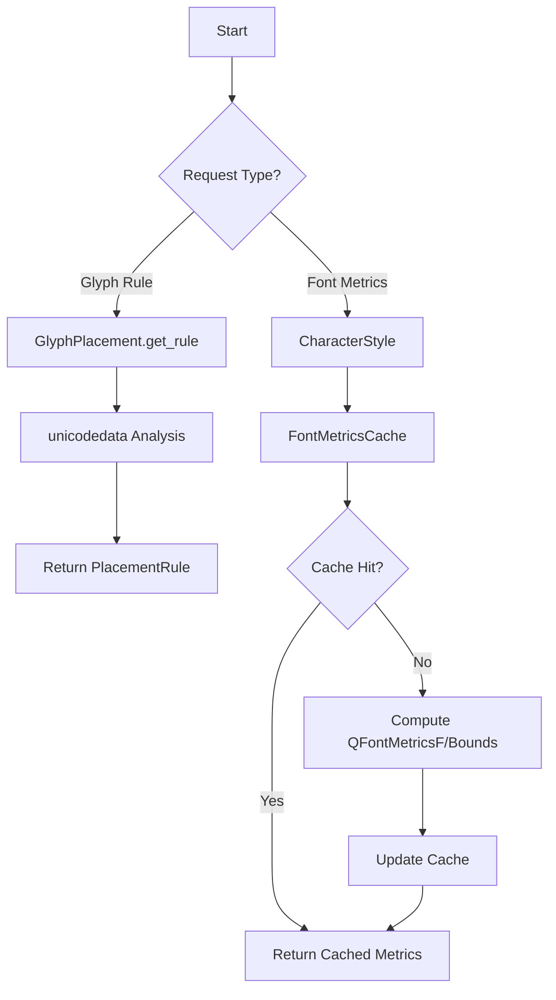
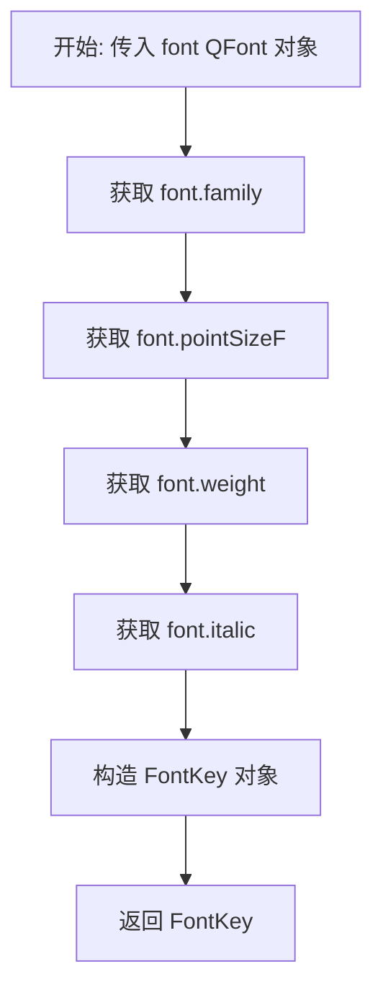
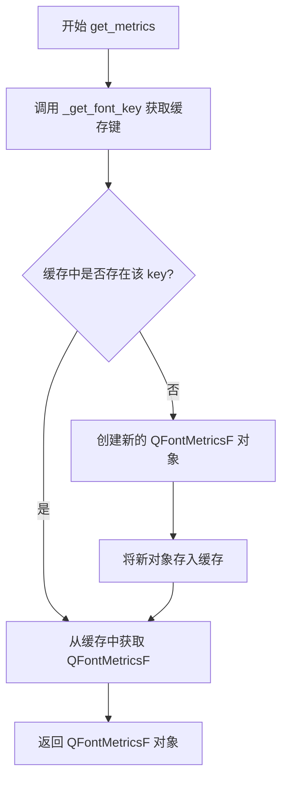
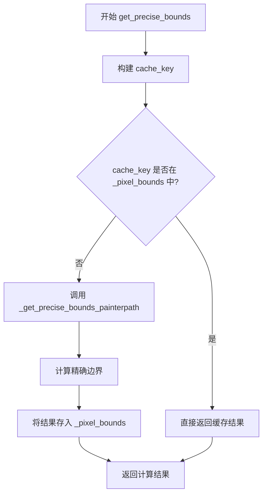
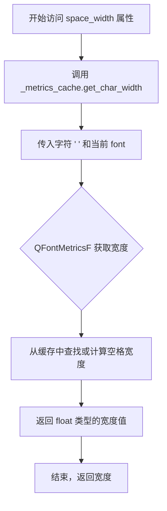

# `comic-translate\app\ui\canvas\text\metrics.py` 详细设计文档

A PySide6 utility module for vertical CJK text rendering, providing glyph placement rules and a font metric caching system to optimize text layout calculations.

## 整体流程



## 类结构

```
PlacementRule (Enum)
GlyphPlacement (Class)
FontKey (Dataclass)
FontMetricsCache (Class)
CharacterStyle (Class)
```

## 全局变量及字段


### `PlacementRule.UPRIGHT`
    
枚举值，表示字符直立且按边缘对齐的放置规则

类型：`PlacementRule`
    


### `PlacementRule.UPRIGHT_CENTERED`
    
枚举值，表示字符直立且居中的放置规则

类型：`PlacementRule`
    


### `PlacementRule.ROTATE_EDGE_ALIGNED`
    
枚举值，表示字符旋转且按边缘对齐的放置规则

类型：`PlacementRule`
    


### `PlacementRule.ROTATE_CENTERED`
    
枚举值，表示字符旋转且居中的放置规则

类型：`PlacementRule`
    


### `GlyphPlacement._FORCE_CENTERED_PUNCTUATION`
    
需要强制居中的标点符号集合，用于垂直文本布局

类型：`set`
    


### `FontKey.family`
    
字体家族名称

类型：`str`
    


### `FontKey.point_size`
    
字体点大小

类型：`float`
    


### `FontKey.weight`
    
字体粗细权重

类型：`int`
    


### `FontKey.italic`
    
字体是否斜体

类型：`bool`
    


### `FontMetricsCache._fonts`
    
字体对象缓存字典，用于存储QFont对象

类型：`dict`
    


### `FontMetricsCache._metrics`
    
字体度量缓存字典，用于存储QFontMetricsF对象

类型：`dict`
    


### `FontMetricsCache._char_widths`
    
字符宽度缓存字典，用于存储字符宽度计算结果

类型：`dict`
    


### `FontMetricsCache._bounding_rects`
    
边界矩形缓存字典，用于存储字符的tightBoundingRect和boundingRect

类型：`dict`
    


### `FontMetricsCache._pixel_bounds`
    
像素边界缓存字典，用于存储精确的像素边界计算结果

类型：`dict`
    


### `CharacterStyle.char_format`
    
Qt文本字符格式对象，包含字体和文本样式信息

类型：`QTextCharFormat`
    


### `CharacterStyle.font`
    
Qt字体对象，用于文本渲染

类型：`QFont`
    


### `CharacterStyle.stroke_width`
    
文本轮廓笔触宽度的一半，用于边界计算

类型：`float`
    


### `CharacterStyle.font_metrics`
    
Qt字体度量对象，提供字体度量信息

类型：`QFontMetricsF`
    


### `CharacterStyle._metrics_cache`
    
类级别的字体度量缓存实例，用于跨对象共享缓存

类型：`FontMetricsCache`
    
    

## 全局函数及方法


### `GlyphPlacement.get_rule`

该方法是一个类方法，用于确定给定字符在竖排文本中的放置规则。它通过分析字符的 Unicode 类别和东亚宽度属性，结合字符是否为字母数字来判断字符应采用直立、居中还是旋转的布局方式，并返回对应的放置规则以及是否为括号标记。

参数：

- `char`：`str`，需要确定布局规则的单个字符

返回值：`tuple[PlacementRule, bool, bool]`，返回一个元组，包含：
  - `PlacementRule`：字符的主要布局规则（直立、直立居中、旋转边缘对齐、旋转居中）
  - `is_open_bracket`：布尔值，是否为左括号或左引号
  - `is_close_bracket`：布尔值，是否为右括号或右引号

#### 流程图

```mermaid
flowchart TD
    A[开始: get_rule char] --> B[cat = unicodedata.category char]
    B --> C[eaw = unicodedata.east_asian_width char]
    C --> D{cat == "Ps"<br/>左括号?}
    D -->|Yes| E[is_open = True]
    D -->|No| F{cat == "Pe"<br/>右括号?}
    F -->|Yes| G[is_close = True]
    F -->|No| H[is_open = False<br/>is_close = False]
    E --> I{is_open or is_close?}
    G --> I
    H --> J{eaw in ("Na", "H")<br/>且不是字母数字?}
    I -->|Yes| K[返回 ROTATE_EDGE_ALIGNED<br/>is_open is_close]
    I -->|No| J
    J -->|Yes| L[返回 ROTATE_CENTERED<br/>False False]
    J -->|No| M{char in<br/>_FORCE_CENTERED_PUNCTUATION?}
    M -->|Yes| N[返回 UPRIGHT_CENTERED<br/>False False]
    M -->|No| O[返回 UPRIGHT<br/>False False]
```

#### 带注释源码

```python
@classmethod
@lru_cache(maxsize=1024)
def get_rule(cls, char: str) -> tuple[PlacementRule, bool, bool]:
    """
    Determines the placement rule for a character.

    Returns:
        - PlacementRule: The primary layout rule.
        - is_open_bracket: True if it's an opening bracket/quote.
        - is_close_bracket: True if it's a closing bracket/quote.
    """
    # 获取字符的Unicode类别（如 "Ps"=左括号, "Pe"=右括号, "Lu"=大写字母等）
    cat = unicodedata.category(char)
    # 获取字符的东亚宽度属性（如 "W"=全宽, "Na"=窄, "H"=半宽等）
    eaw = unicodedata.east_asian_width(char)

    # 判断是否为左括号/左引号（Unicode类别 "Ps"）
    is_open = cat == "Ps"
    # 判断是否为右括号/右引号（Unicode类别 "Pe"）
    is_close = cat == "Pe"

    # Rule 1: 需要旋转的标点和符号处理
    # 排除字母数字字符（字母/数字），即使它们是"窄"(Na)或"半宽"(H)
    # 以支持直立的拉丁/西里尔/泰文等字符
    if is_open or is_close or (eaw in ("Na", "H") and not char.isalnum()):
        # 对于括号，对齐方式基于开/闭状态
        if is_open or is_close:
            # 返回旋转边缘对齐规则，并附带是否为括号标记
            return (PlacementRule.ROTATE_EDGE_ALIGNED, is_open, is_close)
        # 对于其他半宽字符或连接符，旋转时将它们居中
        else:
            # 返回旋转居中规则
            return (PlacementRule.ROTATE_CENTERED, False, False)

    # Rule 2: 保持直立但必须居中的标点符号
    # 检查字符是否在强制居中的标点符号集合中
    if char in cls._FORCE_CENTERED_PUNCTUATION:
        # 返回直立居中规则
        return (PlacementRule.UPRIGHT_CENTERED, False, False)

    # Rule 3: CJK和其他标准字符的默认处理
    # 返回直立规则
    return (PlacementRule.UPRIGHT, False, False)
```


### `FontMetricsCache._get_font_key`

从 QFont 对象中提取字体属性（家族、字号、字重、斜体），生成一个不可变的 FontKey 对象，作为字体度量缓存的键值。

参数：

- `font`：`QFont`，Qt 字体对象，用于提取字体属性

返回值：`FontKey`，包含字体家族、字号、字重和斜体信息的不可变数据类对象

#### 流程图



#### 带注释源码

```python
def _get_font_key(self, font: QFont) -> FontKey:
    """
    从 QFont 对象生成字体缓存键。

    该方法将 Qt 字体对象转换为不可变的 FontKey 数据类，
    作为缓存字典的键，用于缓存字体度量信息。

    参数:
        font: QFont - Qt 字体对象

    返回:
        FontKey - 包含字体属性的不可变数据类对象
    """
    return FontKey(
        font.family(),      # 获取字体家族名称（如 "SimSun", "Arial"）
        font.pointSizeF(),  # 获取字体大小（浮点数，支持 fractional points）
        font.weight(),      # 获取字体粗细权重（整数值）
        font.italic()       # 获取是否斜体（布尔值）
    )
```


### `FontMetricsCache.get_metrics`

该方法用于获取指定字体的度量信息（FontMetrics），采用缓存机制避免重复创建相同的 QFontMetricsF 对象，从而提升性能。

参数：

- `font`：`QFont`，需要获取度量信息的字体对象

返回值：`QFontMetricsF`，字体的度量信息对象，包含字体的各种度量属性（如高度、宽度等）

#### 流程图



#### 带注释源码

```python
def get_metrics(self, font: QFont) -> QFontMetricsF:
    """
    获取指定字体的度量信息。
    使用缓存机制避免重复创建相同的 QFontMetricsF 对象。
    
    参数:
        font: QFont，需要获取度量信息的字体对象
        
    返回:
        QFontMetricsF，字体的度量信息对象
    """
    # 使用 _get_font_key 方法将 QFont 转换为可哈希的 FontKey
    # FontKey 包含 family, point_size, weight, italic 四个属性
    key = self._get_font_key(font)
    
    # 检查缓存字典中是否已存在该字体的度量信息
    if key not in self._metrics:
        # 缓存未命中，创建新的 QFontMetricsF 对象
        self._metrics[key] = QFontMetricsF(font)
    
    # 返回缓存的或新创建的 QFontMetricsF 对象
    return self._metrics[key]
```


### `FontMetricsCache.get_char_width`

获取特定字符在指定字体下的水平 advance（宽度），并使用缓存机制优化性能。如果该字符在该字体下的宽度已经被计算过，则直接从缓存字典中返回；否则计算后存入缓存。

参数：

- `char`：`str`，需要测量宽度的字符。
- `font`：`QFont`，用于测量的字体对象。

返回值：`float`，字符的水平 advance 宽度（通常为像素单位）。

#### 流程图

```mermaid
flowchart TD
    A([开始 get_char_width]) --> B[根据 font 生成 FontKey]
    B --> C[组合 cache_key = (FontKey, char)]
    C --> D{cache_key 是否在 _char_widths 中?}
    D -- 是 --> E[直接从缓存字典获取宽度]
    D -- 否 --> F[调用 get_metrics 获取 QFontMetricsF 实例]
    F --> G[调用 fm.horizontalAdvance 计算宽度]
    G --> H[将结果存入 _char_widths 缓存]
    H --> E
    E --> I([返回宽度值])
```

#### 带注释源码

```python
def get_char_width(self, char: str, font: QFont) -> float:
    """
    获取字符的宽度。

    参数:
        char: 单个字符。
        font: QFont 对象。

    返回:
        字符的 float 宽度。
    """
    # 1. 将 QFont 对象转换为可哈希的 FontKey
    key = self._get_font_key(font)
    
    # 2. 构建缓存键 (FontKey, char)
    cache_key = (key, char)
    
    # 3. 检查缓存中是否存在该字符的宽度
    if cache_key not in self._char_widths:
        # 4. 如果缓存未命中，获取该字体的度量对象
        fm = self.get_metrics(font)
        
        # 5. 计算字符水平宽度并写入缓存
        self._char_widths[cache_key] = fm.horizontalAdvance(char)
    
    # 6. 返回缓存中的宽度值
    return self._char_widths[cache_key]
```


### `FontMetricsCache.get_bounding_rects`

该方法用于获取特定字符在给定字体下的紧密边界矩形（tight bounding rect）和标准边界矩形（bounding rect）。它首先检查内部缓存，如果未命中则计算并存储结果，从而避免重复的字体度量计算。

参数：
- `char`：`str`，需要计算边界的字符。
- `font`：`QFont`，Qt字体对象，用于获取字体度量。

返回值：`tuple[QRectF, QRectF]`，返回一个包含两个 `QRectF` 的元组。其中元组的第一个元素是紧密边界矩形，第二个元素是标准边界矩形。

#### 流程图

```mermaid
graph TD
    A([调用 get_bounding_rects]) --> B[根据 font 生成 FontKey]
    B --> C[生成 cache_key (FontKey, char)]
    C --> D{检查 cache_key 是否在 _bounding_rects 中}
    D -- 是 --> E[直接返回缓存的值]
    D -- 否 --> F[调用 get_metrics 获取 QFontMetricsF]
    F --> G[计算 tightRect = fm.tightBoundingRect(char)]
    G --> H[计算 stdRect = fm.boundingRect(char)]
    H --> I[将结果存入缓存 _bounding_rects]
    I --> E
```

#### 带注释源码

```python
def get_bounding_rects(self, char: str, font: QFont) -> tuple[QRectF, QRectF]:
    """
    获取字符的紧密边界矩形和标准边界矩形。

    参数:
        char: str, 要测量边界的字符。
        font: QFont, 字体对象。

    返回:
        tuple[QRectF, QRectF]: (紧密边界矩形, 标准边界矩形)。
    """
    # 1. 获取或生成字体键（FontKey）
    key = self._get_font_key(font)
    
    # 2. 组合缓存键：结合字体键和字符，确保唯一性
    cache_key = (key, char)
    
    # 3. 检查缓存中是否存在该字符的边界矩形
    if cache_key not in self._bounding_rects:
        # 4. 如果缓存未命中，获取字体度量对象
        fm = self.get_metrics(font)
        
        # 5. 计算并缓存紧密边界矩形和标准边界矩形
        # tightBoundingRect 返回字符笔画的紧致框
        # boundingRect 返回字符的标准框（通常包含间距）
        self._bounding_rects[cache_key] = (fm.tightBoundingRect(char), fm.boundingRect(char))
    
    # 6. 返回缓存的结果
    return self._bounding_rects[cache_key]
```


### `FontMetricsCache.get_precise_bounds`

获取文本行的精确边界框，通过 QPainterPath 计算高精度的文本轮廓，并使用缓存机制避免重复计算。

参数：

- `self`：`FontMetricsCache`，类的实例自身
- `line_text`：`str`，要计算边界框的文本行内容
- `line`：`QTextLine`，Qt 的文本行对象，提供 ascent()、height()、naturalTextWidth() 等方法
- `font`：`QFont`，Qt 字体对象，用于渲染文本
- `stroke_width`：`float`，文本描边宽度的一半，用于边界扩展计算
- `space_shift`：`float`，空格偏移量，默认为 0，用于调整字符间距

返回值：`list[float]`，包含四个元素的列表 [x, y, w, h]，分别表示边界框的左下角坐标 (x, y) 和宽高 (w, h)，所有值均不小于 0 或 1

#### 流程图



#### 带注释源码

```python
def get_precise_bounds(self, line_text: str, line: QTextLine, font: QFont, stroke_width: float, space_shift: float = 0) -> list[float]:
    """
    获取文本行的精确边界框，使用缓存机制优化性能。
    
    参数:
        line_text: 要计算边界框的文本行内容
        line: Qt文本行对象，提供 ascent、height 等信息
        font: Qt字体对象
        stroke_width: 描边宽度的一半，用于边界扩展
        space_shift: 空格偏移量，默认为0
    
    返回:
        包含 [x, y, w, h] 的列表，表示边界框的坐标和尺寸
    """
    # 根据字体和渲染参数构建缓存键
    key = self._get_font_key(font)
    cache_key = (key, line_text, stroke_width, int(line.height()), int(line.naturalTextWidth()), space_shift)
    
    # 缓存命中时直接返回，避免重复计算
    if cache_key in self._pixel_bounds:
        return self._pixel_bounds[cache_key]
    
    # 缓存未命中，调用高精度路径计算方法
    result = self._get_precise_bounds_painterpath(line_text, line, font, stroke_width, space_shift)

    # 将结果存入缓存供后续使用
    self._pixel_bounds[cache_key] = result
    return result
```


### `FontMetricsCache._get_precise_bounds_painterpath`

该方法通过 Qt 的 QPainterPath API 绘制文本轮廓来计算高精度的像素边界矩形，用于精确的文本布局定位和碰撞检测，支持描边宽度的调整和空间偏移补偿。

参数：

- `line_text`：`str`，要计算精确边界的文本字符串
- `line`：`QTextLine`，Qt 文本行对象，提供 ascent() 等文本度量信息
- `font`：`QFont`，Qt 字体对象，用于渲染文本
- `stroke_width`：`float`，文本描边宽度，用于边界扩展计算
- `space_shift`：`float`，水平空间偏移量，用于调整字符起始位置

返回值：`list[float]`，返回 [x, y, w, h] 四个浮点数，表示调整后的像素边界矩形（x 坐标、y 坐标、宽度、高度），保证最小值为 0 或 1

#### 流程图

```mermaid
flowchart TD
    A[开始] --> B[创建 QPainterPath 对象]
    B --> C[获取文本基线位置: baseline_y = line.ascent()]
    C --> D[初始化当前X坐标: current_x = -space_shift]
    D --> E{遍历 line_text 中的每个字符}
    E -->|每个字符| F[使用 path.addText 添加字符到路径]
    F --> G[current_x += 字符宽度]
    G --> E
    E -->|遍历完成| H[获取路径边界: bounds = path.boundingRect]
    H --> I[计算调整后的边界<br/>x = bounds.x - stroke_width<br/>y = bounds.y - stroke_width<br/>w = bounds.width + 2*stroke_width<br/>h = bounds.height + 2*stroke_width]
    I --> J[确保最小值: max(0, x), max(0, y), max(1, w), max(1, h)]
    J --> K[返回 [x, y, w, h] 列表]
```

#### 带注释源码

```python
def _get_precise_bounds_painterpath(self, line_text: str, line: QTextLine, font: QFont, stroke_width: float, space_shift: float) -> list[float]:
    """High accuracy method using QPainterPath for text outline."""
    # 步骤1: 创建 QPainterPath 对象，用于构建文本轮廓路径
    path = QPainterPath()
    
    # 步骤2: 获取文本的基线位置（ascent 是基线到字符顶部的距离）
    baseline_y = line.ascent()
    
    # 步骤3: 初始化当前 X 坐标，减去 space_shift 以支持偏移调整
    current_x = -space_shift
    
    # 步骤4: 遍历文本中的每个字符，依次添加到路径中
    for char in line_text:
        # 使用 Qt 的 addText 方法将字符添加到路径，指定位置和字体
        path.addText(QPointF(current_x, baseline_y), font, char)
        # 累加字符宽度，更新下一个字符的 X 坐标位置
        current_x += QFontMetricsF(font).horizontalAdvance(char)
    
    # 步骤5: 获取整个路径的边界矩形（包括所有字符）
    bounds = path.boundingRect()
    
    # 步骤6: 根据描边宽度调整边界（向外扩展 stroke_width 距离）
    x = bounds.x() - stroke_width          # 左侧扩展
    y = bounds.y() - stroke_width           # 顶部扩展
    w = bounds.width() + stroke_width * 2   # 左右两侧扩展
    h = bounds.height() + stroke_width * 2  # 上下两侧扩展
    
    # 步骤7: 确保边界值有效（坐标不小于0，宽高不小于1）
    return [max(0, x), max(0, y), max(1, w), max(1, h)]
```


### `CharacterStyle.__init__`

初始化 CharacterStyle 实例，根据传入的 QTextCharFormat 对象设置字体、笔画宽度等文本渲染所需的度量信息。

参数：

- `char_format`：`QTextCharFormat`，Qt 文本字符格式对象，包含字体、颜色、轮廓等文本样式信息

返回值：`None`，构造函数无返回值

#### 流程图

```mermaid
flowchart TD
    A[开始 __init__] --> B[接收 char_format 参数]
    B --> C[将 char_format 存储到实例变量 self.char_format]
    C --> D[从 char_format 获取字体对象 QFont]
    D --> E[将字体存储到 self.font]
    E --> F[计算笔画宽度: textOutline().widthF() / 2]
    F --> G[将 stroke_width 存储到实例变量]
    G --> H[调用 FontMetricsCache 获取字体度量]
    H --> I[将 QFontMetricsF 存储到 self.font_metrics]
    I --> J[结束 __init__]
```

#### 带注释源码

```python
def __init__(self, char_format: QTextCharFormat):
    """
    初始化 CharacterStyle 实例。
    
    参数:
        char_format: QTextCharFormat 对象，包含文本格式信息
    """
    # 存储文本字符格式对象，用于后续获取字体和文本轮廓信息
    self.char_format = char_format
    
    # 从格式对象中提取 QFont 字体对象
    self.font = self.char_format.font()
    
    # 计算笔画宽度：文本轮廓宽度的一半
    # 注意：textOutline() 返回 QPen，widthF() 返回浮点型宽度
    # 除以2是因为轮廓是内外各一半
    self.stroke_width = self.char_format.textOutline().widthF() / 2
    
    # 使用类级别的字体度量缓存获取当前字体的度量信息
    # QFontMetricsF 提供字符宽度、高度等度量数据
    self.font_metrics = self._metrics_cache.get_metrics(self.font)
```


### `CharacterStyle.standard_char_bounds`

该方法是一个缓存属性，用于计算文本排版中使用的“标准字符边界矩形”。它通过获取一个汉字（'木'）和一个代表性标点/符号（'啊'）的边界框，取其水平方向的并集来确定标准宽度，同时保留汉字的垂直高度，从而为字符布局提供一个统一的基准。

参数：

- `self`：`CharacterStyle`，调用该方法的类实例本身。

返回值：`QRectF`，返回计算得出的标准边界矩形，包含字符的标准宽度和高度信息。

#### 流程图

```mermaid
graph TD
    A[Start] --> B[获取字符 '木' 的通用边界矩形 br_hanzi]
    B --> C[获取字符 '啊' 的通用边界矩形 br_punct]
    C --> D[计算左侧边界: min(br_hanzi.left, br_punct.left)]
    D --> E[计算右侧边界: max(br_hanzi.right, br_punct.right)]
    E --> F[返回 QRectF: 左=计算左, 顶=br_hanzi.top, 宽=右-左, 高=br_hanzi.height]
```

#### 带注释源码

```python
@cached_property
def standard_char_bounds(self) -> QRectF:
    """
    计算标准字符边界矩形。
    选取具有代表性的汉字和符号进行边界计算，以确定通用的排版基准。
    """
    # 获取汉字 '木' 的通用边界矩形 (General Bounding Rect)
    # 返回值为 (tightRect, boundingRect)，这里取第二个元素
    _, br_hanzi = self._metrics_cache.get_bounding_rects('木', self.font)
    
    # 获取字符 '啊' 的通用边界矩形
    # '啊' 包含底部横笔，用于与 '木' 结合确定水平方向的最大伸展范围
    _, br_punct = self._metrics_cache.get_bounding_rects('啊', self.font)
    
    # 计算合并后的左侧边界（取两者最左边的最小值）
    left = min(br_hanzi.left(), br_punct.left())
    
    # 计算合并后的右侧边界（取两者最右边的最大值）
    right = max(br_hanzi.right(), br_punct.right())
    
    # 构建并返回标准边界矩形
    # 垂直方向使用汉字 '木' 的顶部和高度，
    # 水平方向宽度为两者的并集总宽度
    return QRectF(left, br_hanzi.top(), right - left, br_hanzi.height())
```


### `CharacterStyle.tight_char_bounds`

这是一个缓存属性（`cached_property`），用于计算竖排文本中字符的紧凑边界。它通过获取具有代表性的汉字（“木”）和标点符号（“啊”）的紧边界（Bounding Rect），取两者左边界最小值与右边界最大值，生成一个能同时容纳这两类字符的安全垂直列宽区域。

参数：

- `self`：`CharacterStyle`，调用此属性的类实例，包含了字体格式（QTextCharFormat）和字体（QFont）信息。

返回值：`QRectF`，返回计算得出的紧凑边界矩形（x, y, width, height），用于定义竖排文本的列宽。

#### 流程图

```mermaid
graph TD
    A([Start tight_char_bounds]) --> B[调用缓存获取字符 '木' 的紧边界]
    B --> C[调用缓存获取字符 '啊' 的紧边界]
    C --> D{计算左边界}
    D --> D1[left = min(tbr_hanzi.left, tbr_punct.left)]
    D1 --> E{计算右边界}
    E --> E1[right = max(tbr_hanzi.right, tbr_punct.right)]
    E1 --> F[构建新矩形: QRectF(left, top, width, height)]
    F --> G([Return QRectF])
```

#### 带注释源码

```python
    @cached_property
    def tight_char_bounds(self) -> QRectF:
        # 获取标准汉字“木”的紧边界（Bounding Rect）
        # QFontMetricsF.tightBoundingRect 返回字符实际渲染的最小包围盒
        tbr_hanzi, _ = self._metrics_cache.get_bounding_rects('木', self.font)
        
        # 获取常见标点符号“啊”的紧边界
        # 标点符号的宽度或高度通常与汉字不同，需要合并考虑以确保排版安全
        tbr_punct, _ = self._metrics_cache.get_bounding_rects('啊', self.font)
        
        # 核心逻辑：计算并集
        # 取两者左边界最小值，确保最靠左的字符不被切除
        left = min(tbr_hanzi.left(), tbr_punct.left())
        
        # 取两者右边界最大值，确保最靠右的字符不被切除
        right = max(tbr_hanzi.right(), tbr_punct.right())
        
        # 构建最终的 QRectF
        # x, y: 使用合并后的左右边界和汉字的顶部高度
        # width: 右边界 - 左边界
        # height: 汉字的高度（假设汉字高度具有代表性）
        return QRectF(left, tbr_hanzi.top(), right - left, tbr_hanzi.height())
```


### `CharacterStyle.space_width`

该属性用于获取当前字符样式中空格字符的宽度，通过调用字体度量缓存的 `get_char_width` 方法获取空格(' ')在当前字体下的水平advance宽度。

参数：无（这是一个属性访问器，不接受任何参数）

返回值：`float`，返回空格字符在当前字体下的水平advance宽度（以字体单位计）

#### 流程图



#### 带注释源码

```python
@property
def space_width(self) -> float:
    """
    获取空格字符的宽度。
    
    该属性是一个只读的属性访问器，通过调用字体度量缓存的
    get_char_width 方法来获取空格字符(' ')在当前字体下的
    水平advance宽度。
    
    Returns:
        float: 空格字符在当前字体下的水平advance宽度（以字体单位计）
    """
    return self._metrics_cache.get_char_width(' ', self.font)
```


### `CharacterStyle.get_char_bounds`

获取指定字符的紧密边界矩形（tight bounding rect）和标准边界矩形（bounding rect），用于文本渲染和字符定位。

参数：

- `char`：`str`，需要获取边界矩形的单个字符

返回值：`tuple[QRectF, QRectF]`，返回两个QRectF组成的元组，第一个是tightBoundingRect（紧密边界矩形），第二个是boundingRect（标准边界矩形）

#### 流程图

```mermaid
flowchart TD
    A[开始 get_char_bounds] --> B[调用 _metrics_cache.get_bounding_rects]
    B --> C{缓存键是否已存在?}
    C -->|是| D[直接返回缓存的边界矩形]
    C -->|否| E[获取字体度量对象]
    E --> F[计算 tightBoundingRect 和 boundingRect]
    F --> G[存入缓存]
    G --> D
    D --> H[返回 tuple[QRectF, QRectF]]
```

#### 带注释源码

```python
def get_char_bounds(self, char: str) -> tuple[QRectF, QRectF]:
    """
    获取指定字符的边界矩形。
    
    该方法委托给 FontMetricsCache 的 get_bounding_rects 方法，
    利用缓存机制避免重复计算相同的字符边界。
    
    参数:
        char: str - 需要获取边界矩形的单个字符
        
    返回:
        tuple[QRectF, QRectF] - 包含两个QRectF的元组：
            - 第一个元素：tightBoundingRect，字符的紧密边界矩形
            - 第二个元素：boundingRect，字符的标准边界矩形（包含字形 ascent/descent）
    """
    return self._metrics_cache.get_bounding_rects(char, self.font)
```


### `CharacterStyle.get_precise_bounds`

该方法作为 `CharacterStyle` 类的核心接口，用于计算文本行在屏幕上的精确像素边界框。它通过调用内部维护的 `FontMetricsCache` 实例，委托其执行基于 `QPainterPath` 的高精度测量。该方法考虑了字体属性、描边宽度（stroke_width）以及额外的间距偏移，能够生成包含坐标 X、Y 和宽度、高度 `width, height` 的精确列表，主要用于高精度的文字排版和定位。

参数：

-  `line_text`：`str`，需要计算边界的文本行内容。
-  `line`：`QTextLine`，Qt 文本行对象，提供了文本的布局信息（如升部 ascent 和自然宽度）。
-  `space_shift`：`float`，可选，默认为 0。用于调整文本起始位置的水平偏移量。

返回值：`list[float]`，返回一个包含四个浮点数的列表 `[x, y, width, height]`，分别表示边界框的左上角坐标、宽度和高度。

#### 流程图

```mermaid
graph TD
    A([Start]) --> B[调用 FontMetricsCache.get_precise_bounds]
    B --> C{缓存检查}
    
    C -- 命中 --> D[返回缓存的 [x, y, w, h]]
    
    C -- 未命中 --> E[调用 _get_precise_bounds_painterpath]
    
    E --> F[创建 QPainterPath]
    F --> G[获取基线位置 baseline_y]
    G --> H[初始化起始 X 坐标 current_x]
    
    H --> I{遍历 line_text 中的字符}
    I -- 遍历中 --> J[path.addText 添加字符]
    J --> K[current_x += 字符宽度]
    K --> I
    
    I -- 遍历结束 --> L[获取 path.boundingRect]
    L --> M[根据 stroke_width 调整边界]
    M --> N[确保最小尺寸 (max(0,..), max(1,..))]
    N --> O[存入缓存]
    O --> D
    
    D --> P([End])
```

#### 带注释源码

```python
def get_precise_bounds(self, line_text: str, line: QTextLine, space_shift: float = 0) -> list[float]:
    """
    获取文本行的精确像素边界。

    该方法是一个委托调用，将具体的计算逻辑转发给内部维护的 FontMetricsCache 实例。
    它使用了 QPainterPath 来获取高精度的文字轮廓，从而计算出包含描边宽度的精确包围盒。

    参数:
        line_text (str): 文本行的内容。
        line (QTextLine): Qt 的文本行对象，用于获取 ascent 等布局信息。
        space_shift (float, optional): 水平的空间偏移量，用于微调起始位置。默认为 0。

    返回:
        list[float]: 包含 [x, y, width, height] 的边界框列表。
    """
    # 调用缓存管理器的方法，传入当前样式自己的字体和描边宽度
    return self._metrics_cache.get_precise_bounds(line_text, line, self.font, self.stroke_width, space_shift)
```

## 关键组件


### GlyphPlacement (字符放置规则确定)

负责确定字符在竖排文本中的放置规则，通过缓存机制提高性能，支持判断开闭括号和Unicode属性。

### FontMetricsCache (字体度量缓存)

管理字体指标、字符宽度和边界框的缓存系统，提供高效的字体度量查询接口，使用PainterPath进行精确边界计算。

### CharacterStyle (字符样式接口)

提供字符样式和字体度量查询的主要接口类，计算标准字符边界和紧凑边界，管理字符格式和描边宽度。

### PlacementRule (放置规则枚举)

定义四种文本放置规则：直立、居中直立、旋转边缘对齐、旋转居中对齐。

### FontKey (字体键)

不可变数据类，用于缓存管理，存储字体家族、字号、粗体和斜体状态作为缓存键。

### 缓存机制 (惰性加载)

使用@lru_cache和@cached_property实现字符放置规则的内存缓存和字体度量结果的惰性加载，优化重复查询性能。

### 精确边界计算

通过QPainterPath获取文本轮廓，提供高精度的字符边界计算，支持描边宽度调整和空格偏移补偿。

## 问题及建议


### 已知问题

-   **缓存无清理机制**：`FontMetricsCache` 类使用多个字典作为缓存，但没有任何缓存清理或大小限制方法，可能导致长期运行时内存持续增长。
-   **硬编码的标点符号集合不完整**：`_FORCE_CENTERED_PUNCTUATION` 仅包含少量日文标点，缺少中文全角标点（如"「」『』"等）的处理。
-   **硬编码基准字符**：`standard_char_bounds` 和 `tight_char_bounds` 中使用 '木' 和 '啊' 作为基准字符，这些字符的度量可能不适用于所有字体和语言。
-   **缺少输入验证**：`get_char_width`、`get_bounding_rects` 等方法未对空字符串或 `None` 输入进行检查，可能导致 `QFontMetricsF` 异常。
-   **缓存键精度损失**：`get_precise_bounds` 的缓存键对 `line.height()` 和 `line.naturalTextWidth()` 进行 `int()` 转换，可能导致不同行的错误缓存命中。
-   **`cached_property` 与类级别缓存混用**：`CharacterStyle` 使用 `@cached_property`，但共享的 `_metrics_cache` 可能导致不同 `CharacterStyle` 实例间的缓存键冲突风险。
-   **缓存实现过于复杂**：多层级字典嵌套（`_fonts`、`_metrics`、`_char_widths`、`_bounding_rects`、`_pixel_bounds`）维护困难，且 `_fonts` 字典从未被使用。
-   **线程安全问题**：类级别的共享缓存（`_metrics_cache`、`lru_cache`）在多线程环境下访问时存在数据竞争风险。

### 优化建议

-   为 `FontMetricsCache` 添加缓存大小限制和清理方法（如 LRU 策略或定期清理）。
-   扩展 `_FORCE_CENTERED_PUNCTUATION` 集合，或从配置文件/Unicode数据动态加载需要居中的标点。
-   将基准字符改为更通用的方案，或提供配置接口让用户自定义参考字符。
-   在所有公开方法中添加输入验证，检查空字符串、`None` 等边界情况并给出明确错误处理。
-   调整缓存键策略，使用更高精度的浮点值或改用对象标识作为缓存键。
-   考虑使用 `functools.cache` 或线程安全的缓存实现，或在访问缓存时添加锁机制。
-   移除未使用的 `_fonts` 字典，简化缓存结构；或使用单一的数据结构统一管理缓存。
-   将 `@lru_cache` 改为支持更多参数的版本，或确保缓存键的完整性。


## 其它


### 设计目标与约束

本模块旨在为垂直文本布局提供精确的字符放置规则和字体度量计算支持。设计目标包括：通过缓存机制提升性能，支持CJK字符与拉丁字母的混合排版，处理不同Unicode属性的字符（标点、括号、字母等）的旋转与对齐逻辑。主要约束为依赖PySide6 Qt库，且主要针对垂直文本场景优化。

### 错误处理与异常设计

代码中未实现显式的异常处理机制。潜在异常场景包括：传入无效的QFont对象、非法字符参数、缓存键冲突等。建议在调用get_rule时添加字符有效性检查，在FontMetricsCache中处理QFontMetricsF创建失败的情况，并考虑为缓存满或内存不足场景设计降级策略。

### 数据流与状态机

数据流为主动拉取模式：CharacterStyle接收QTextCharFormat → 初始化FontMetricsCache → 按需缓存字体度量 → 计算字符边界。状态机体现在PlacementRule的四状态转换：UPRIGHT（默认）→ UPRIGHT_CENTERED（强制居中标点）→ ROTATE_EDGE_ALIGNED（括号对齐）→ ROTATE_CENTERED（半宽字符旋转），规则判定依赖Unicode分类（category）和东亚宽度（east_asian_width）属性。

### 外部依赖与接口契约

主要外部依赖为PySide6.QtCore（QRectF、QPointF、QTextLine）和PySide6.QtGui（QTextCharFormat、QFont、QFontMetricsF、QPainterPath），以及标准库unicodedata、functools、dataclasses、enum。接口契约：GlyphPlacement.get_rule返回(PlacementRule, is_open_bracket, is_close_bracket)三元组；FontMetricsCache方法返回QFontMetricsF、float、tuple[QRectF, QRectF]或list[float]；CharacterStyle提供boundaries和width属性及get_precise_bounds方法。

### 性能考虑

性能优化手段包括：@lru_cache装饰器缓存get_rule结果（maxsize=1024），FontMetricsCache多级缓存字典（_metrics、_char_widths、_bounding_rects、_pixel_bounds），@cached_property缓存标准字符边界计算结果。潜在瓶颈：QPainterPath绘制精确边界计算量较大，缓存键包含stroke_width等参数可能导致缓存膨胀，建议监控缓存命中率并考虑LRU策略动态调整。

### 线程安全性

当前实现非线程安全。FontMetricsCache实例通过类变量_metrics_cache共享，字典操作无锁保护。若在多线程Qt环境中使用，建议对缓存访问加锁或使用线程本地存储（threading.local），或重构为不可变缓存配合读写锁。

### 国际化与本地化

模块依赖Unicode标准（unicodedata.category、unicodedata.east_asian_width）实现多语言支持，已覆盖Latin、Cyrillic、Thai等脚本。_FORCE_CENTERED_PUNCTUATION集合当前硬编码中文标点，扩展支持其他语言标点（如韩文、越南文）需更新此集合或提供配置接口。

### 配置与扩展性

扩展点包括：_FORCE_CENTERED_PUNCTUATION集合可外部注入，PlacementRule枚举可追加新规则，FontMetricsCache可继承实现自定义缓存策略（如磁盘缓存）。当前通过@classmethod和@property提供有限配置能力，建议未来将放置规则表外化为可配置文件。

### 测试考量

建议测试场景：Unicode各分类字符（Ps/Pe/So/Lu/Ll/Nd等）的规则判定，混合CJK+Latin文本的边界计算，FontMetricsCache缓存键冲突场景，垂直排版标点（、。！？）的居中效果，性能基准测试（缓存命中率、首次/重复计算耗时），多线程并发访问下的数据一致性。

    