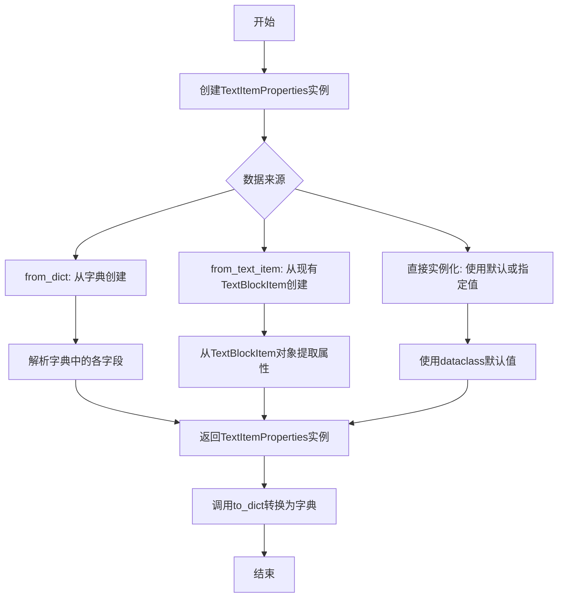
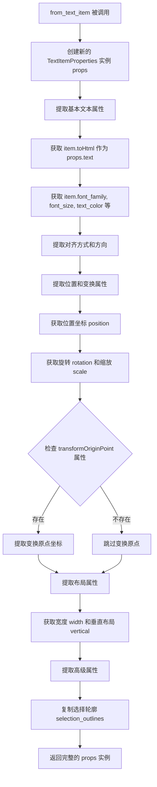
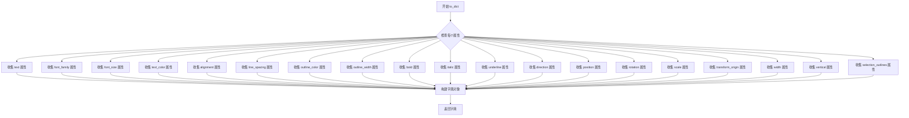

# `comic-translate\app\ui\canvas\text\text_item_properties.py` 详细设计文档

这是一个PySide6 Qt数据类，用于封装文本块项目(TextBlockItem)的各种属性，包括文本内容、字体样式、颜色、排列方式、位置变换和布局属性，并提供从字典和现有文本项目创建实例以及转换为字典的便捷方法。

## 整体流程



## 类结构

```
TextItemProperties (dataclass)
└── 方法: from_dict, from_text_item, to_dict
```

## 全局变量及字段


### `TextItemProperties.text`
    
文本内容

类型：`str`
    


### `TextItemProperties.font_family`
    
字体家族

类型：`str`
    


### `TextItemProperties.font_size`
    
字体大小

类型：`float`
    


### `TextItemProperties.text_color`
    
文本颜色

类型：`QColor`
    


### `TextItemProperties.alignment`
    
对齐方式

类型：`Qt.AlignmentFlag`
    


### `TextItemProperties.line_spacing`
    
行间距

类型：`float`
    


### `TextItemProperties.outline_color`
    
轮廓颜色

类型：`Optional[QColor]`
    


### `TextItemProperties.outline_width`
    
轮廓宽度

类型：`float`
    


### `TextItemProperties.bold`
    
是否粗体

类型：`bool`
    


### `TextItemProperties.italic`
    
是否斜体

类型：`bool`
    


### `TextItemProperties.underline`
    
是否下划线

类型：`bool`
    


### `TextItemProperties.direction`
    
文本方向

类型：`Qt.LayoutDirection`
    


### `TextItemProperties.position`
    
位置坐标(x,y)

类型：`tuple`
    


### `TextItemProperties.rotation`
    
旋转角度

类型：`float`
    


### `TextItemProperties.scale`
    
缩放比例

类型：`float`
    


### `TextItemProperties.transform_origin`
    
变换原点(x,y)

类型：`Optional[tuple]`
    


### `TextItemProperties.width`
    
宽度

类型：`Optional[float]`
    


### `TextItemProperties.vertical`
    
是否垂直排列

类型：`bool`
    


### `TextItemProperties.selection_outlines`
    
选中轮廓列表

类型：`list`
    


### `TextItemProperties.from_dict`
    
从字典创建实例的类方法

类型：`classmethod`
    


### `TextItemProperties.from_text_item`
    
从现有TextBlockItem创建实例的类方法

类型：`classmethod`
    


### `TextItemProperties.to_dict`
    
将实例转换为字典的实例方法

类型：`instance method`
    
    

## 全局函数及方法


### `TextItemProperties.from_dict`

从字典数据创建 `TextItemProperties` 实例的类方法。该方法接收包含文本样式、颜色、对齐、位置、变换等属性的字典，通过安全的方式提取并转换各项数据，最终返回一个完整的 `TextItemProperties` 对象，适用于从序列化数据（如JSON、配置文件）恢复对象状态。

参数：

- `data`：`dict`，包含文本项属性的字典，键包括 text、font_family、font_size、text_color、alignment、line_spacing、outline_color、outline_width、bold、italic、underline、direction、position、rotation、scale、transform_origin、width、vertical、selection_outlines 等

返回值：`TextItemProperties`，从字典数据构建的新实例

#### 流程图

```mermaid
flowchart TD
    A[开始 from_dict] --> B[创建空 TextItemProperties 实例 props]
    B --> C[提取基础文本属性<br/>text, font_family, font_size<br/>line_spacing, bold, italic, underline]
    C --> D{text_color 在 data 中?}
    D -->|是| E{data[text_color] 是 QColor 实例?]
    D -->|否| F{outline_color 在 data 中?}
    E -->|是| G[直接赋值 props.text_color = data[text_color]]
    E -->|否| H[创建 QColor 实例<br/>props.text_color = QColor(data[text_color])]
    G --> I[提取 outline_width]
    H --> I
    F -->|是| J{data[outline_color] 是 QColor 实例?]
    F -->|否| K{alignment 在 data 中?}
    J -->|是| L[直接赋值 props.outline_color = data[outline_color]]
    J -->|否| M[创建 QColor 实例<br/>props.outline_color = QColor(data[outline_color])]
    L --> I
    M --> I
    K -->|是| N{data[alignment] 是 int?]
    K -->|否| O{direction 在 data 中?}
    N -->|是| P[props.alignment = Qt.AlignmentFlag(data[alignment])]
    N -->|否| Q[props.alignment = data[alignment]]
    P --> O
    Q --> O
    O --> R[提取位置和变换属性<br/>position, rotation, scale<br/>transform_origin]
    R --> S[提取布局属性<br/>width, vertical]
    S --> T[提取高级属性<br/>selection_outlines]
    T --> U[返回 props 实例]
```

#### 带注释源码

```python
@classmethod
def from_dict(cls, data: dict) -> 'TextItemProperties':
    """Create TextItemProperties from dictionary state"""
    # 1. 创建空的 TextItemProperties 实例
    props = cls()
    
    # ===== 基础文本属性 =====
    # 提取文本内容，默认为空字符串
    props.text = data.get('text', '')
    # 提取字体族，默认为空字符串
    props.font_family = data.get('font_family', '')
    # 提取字体大小，默认为 20
    props.font_size = data.get('font_size', 20)
    # 提取行间距，默认为 1.2
    props.line_spacing = data.get('line_spacing', 1.2)
    # 提取粗体标志，默认为 False
    props.bold = data.get('bold', False)
    # 提取斜体标志，默认为 False
    props.italic = data.get('italic', False)
    # 提取下划线标志，默认为 False
    props.underline = data.get('underline', False)
    
    # ===== 颜色属性 =====
    # 处理文本颜色：可能是 QColor 实例、字符串或 None
    if 'text_color' in data:
        if isinstance(data['text_color'], QColor):
            # 已经是 QColor 实例，直接赋值
            props.text_color = data['text_color']
        elif data['text_color'] is not None:
            # 需要从字符串等创建 QColor 对象
            props.text_color = QColor(data['text_color'])
    
    # 处理轮廓颜色：可能是 QColor 实例、字符串或 None
    if 'outline_color' in data:
        if isinstance(data['outline_color'], QColor):
            # 已经是 QColor 实例，直接赋值
            props.outline_color = data['outline_color']
        elif data['outline_color']:
            # 需要从字符串等创建 QColor 对象
            props.outline_color = QColor(data['outline_color'])
    
    # 提取轮廓宽度，默认为 1
    props.outline_width = data.get('outline_width', 1)
    
    # ===== 对齐方式 =====
    if 'alignment' in data:
        if isinstance(data['alignment'], int):
            # 如果是整数，转换为 Qt.AlignmentFlag 枚举
            props.alignment = Qt.AlignmentFlag(data['alignment'])
        else:
            # 已经是枚举类型，直接赋值
            props.alignment = data['alignment']
            
    # ===== 文本方向 =====
    if 'direction' in data:
        # 直接赋值 Qt.LayoutDirection 枚举
        props.direction = data['direction']
        
    # ===== 位置和变换属性 =====
    # 提取位置坐标，默认为 (0, 0)
    props.position = data.get('position', (0, 0))
    # 提取旋转角度，默认为 0
    props.rotation = data.get('rotation', 0)
    # 提取缩放比例，默认为 1.0
    props.scale = data.get('scale', 1.0)
    # 提取变换原点，可为 None
    props.transform_origin = data.get('transform_origin')
    
    # ===== 布局属性 =====
    # 提取宽度，可为 None
    props.width = data.get('width')
    # 提取垂直标志，默认为 False
    props.vertical = data.get('vertical', False)
    
    # ===== 高级属性 =====
    # 提取选择轮廓列表，默认为空列表
    props.selection_outlines = data.get('selection_outlines', [])
    
    # 返回构建完成的实例
    return props
```


### `TextItemProperties.from_text_item`

这是一个类方法，用于从现有的 `TextBlockItem` 对象创建 `TextItemProperties` 实例。它通过提取 `TextBlockItem` 的所有相关属性（如文本内容、字体样式、颜色、位置、变换等），将这些属性复制到新创建的 `TextItemProperties` 数据类对象中，实现从图形项目到属性数据结构的转换。

参数：

- `cls`：`Class[TextItemProperties]`，类方法隐含的类引用参数
- `item`：任意类型（实际应为 `TextBlockItem` 对象），源文本块项目对象，从中提取属性以创建新的 `TextItemProperties` 实例

返回值：`TextItemProperties`，包含从源 `TextBlockItem` 提取的所有属性值的新实例

#### 流程图



#### 带注释源码

```python
@classmethod
def from_text_item(cls, item) -> 'TextItemProperties':
    """Create TextItemProperties from an existing TextBlockItem"""
    # 创建新的 TextItemProperties 空实例，所有属性使用默认值
    props = cls()
    
    # ===== 基本文本属性 =====
    # 从 item 获取 HTML 格式的文本内容（保留富文本格式）
    props.text = item.toHtml()
    # 字体系列名称
    props.font_family = item.font_family
    # 字体大小
    props.font_size = item.font_size
    # 文本颜色
    props.text_color = item.text_color
    # 文本对齐方式
    props.alignment = item.alignment
    # 行间距倍数
    props.line_spacing = item.line_spacing
    # 轮廓颜色
    props.outline_color = item.outline_color
    # 轮廓宽度
    props.outline_width = item.outline_width
    # 字体样式：粗体、斜体、下划线
    props.bold = item.bold
    props.italic = item.italic
    props.underline = item.underline
    # 文本方向（从左到右或从右到左）
    props.direction = item.direction
    
    # ===== 位置和变换属性 =====
    # 从 QGraphicsItem 的 pos() 获取 x, y 坐标组成元组
    props.position = (item.pos().x(), item.pos().y())
    # 旋转角度
    props.rotation = item.rotation()
    # 缩放比例
    props.scale = item.scale()
    # 检查是否存在 transformOriginPoint 方法（Qt 5.14+）
    if hasattr(item, 'transformOriginPoint'):
        # 获取变换原点并提取坐标
        origin = item.transformOriginPoint()
        props.transform_origin = (origin.x(), origin.y())
    
    # ===== 布局属性 =====
    # 从边界矩形获取宽度
    props.width = item.boundingRect().width()
    # 垂直布局标志，使用 getattr 提供默认值
    props.vertical = getattr(item, 'vertical', False)
    
    # ===== 高级属性 =====
    # 复制选择轮廓列表（使用 copy() 避免引用共享）
    props.selection_outlines = getattr(item, 'selection_outlines', []).copy()
    
    # 返回填充好的 TextItemProperties 实例
    return props
```


### `TextItemProperties.to_dict`

将 TextItemProperties 类的实例转换为字典类型，返回包含所有文本项属性的字典，用于序列化或数据传输。

参数：

- `self`：`TextItemProperties`，调用该方法的实例本身，无需显式传递

返回值：`dict`，返回包含以下键值对的字典：text（文本内容）、font_family（字体族）、font_size（字体大小）、text_color（文本颜色）、alignment（对齐方式）、line_spacing（行间距）、outline_color（轮廓颜色）、outline_width（轮廓宽度）、bold（粗体）、italic（斜体）、underline（下划线）、direction（布局方向）、position（位置）、rotation（旋转角度）、scale（缩放）、transform_origin（变换原点）、width（宽度）、vertical（垂直布局）、selection_outlines（选区轮廓列表）

#### 流程图



#### 带注释源码

```python
def to_dict(self) -> dict:
    """
    将 TextItemProperties 实例转换为字典
    
    返回值:
        dict: 包含所有文本项属性的字典，可用于序列化或数据传递
    """
    # 构建并返回包含所有属性的字典
    return {
        # 基础文本属性
        'text': self.text,                  # 文本内容字符串
        'font_family': self.font_family,    # 字体家族名称
        'font_size': self.font_size,        # 字体大小数值
        
        # 颜色与样式属性
        'text_color': self.text_color,      # 文本颜色 QColor 对象
        'alignment': self.alignment,        # 对齐方式 Qt.AlignmentFlag
        'line_spacing': self.line_spacing,  # 行间距倍数
        
        # 轮廓属性
        'outline_color': self.outline_color,    # 轮廓颜色 QColor 或 None
        'outline_width': self.outline_width,    # 轮廓宽度数值
        
        # 字体样式属性
        'bold': self.bold,                  # 是否粗体布尔值
        'italic': self.italic,              # 是否斜体布尔值
        'underline': self.underline,        # 是否下划线布尔值
        
        # 布局方向属性
        'direction': self.direction,        # 文本方向 Qt.LayoutDirection
        
        # 位置与变换属性
        'position': self.position,          # 位置坐标元组 (x, y)
        'rotation': self.rotation,          # 旋转角度数值
        'scale': self.scale,                # 缩放比例数值
        'transform_origin': self.transform_origin,  # 变换原点坐标元组或 None
        
        # 布局属性
        'width': self.width,                # 宽度数值或 None
        'vertical': self.vertical,          # 是否垂直布局布尔值
        
        # 高级属性
        'selection_outlines': self.selection_outlines,  # 选区轮廓列表
    }
```

## 关键组件


### TextItemProperties 数据类

一个 dataclass，用于存储文本块项目的所有属性，包括文本内容、字体样式、颜色、位置、变换和布局配置，减少构造时的重复代码。

### 基础文本属性组件

包含 text（文本内容）、font_family（字体家族）、font_size（字体大小）、text_color（文本颜色）、alignment（对齐方式）、line_spacing（行间距）等核心属性，用于定义文本的基本外观。

### 描边属性组件

包含 outline_color（描边颜色）和 outline_width（描边宽度）属性，用于为文本添加轮廓效果。

### 字体样式属性组件

包含 bold（粗体）、italic（斜体）、underline（下划线）三个布尔属性，用于控制文本的字体样式。

### 方向属性组件

direction 属性（Qt.LayoutDirection 类型），用于指定文本的阅读方向，支持从左到右、从右到左等布局方向。

### 位置和变换属性组件

包含 position（位置坐标元组）、rotation（旋转角度）、scale（缩放比例）、transform_origin（变换原点坐标）属性，用于控制文本的空间变换。

### 布局属性组件

包含 width（宽度）和 vertical（垂直布局）属性，用于控制文本的布局方式。

### 高级属性组件

selection_outlines 属性（列表类型），用于存储选中的轮廓信息，支持高级交互功能。

### from_dict 类方法

类方法，从字典数据创建 TextItemProperties 对象，支持类型转换和默认值处理，包括颜色对象的创建、Qt 枚举的转换等。

### from_text_item 类方法

类方法，从现有的 TextBlockItem 对象提取属性创建 TextItemProperties，用于对象序列化和属性复制，支持从图形项到数据属性的转换。

### to_dict 实例方法

实例方法，将 TextItemProperties 对象转换为字典格式，用于数据持久化和序列化，包含所有属性的字典表示。


## 问题及建议


### 已知问题

-   **类型注解不一致**：`text_color: QColor = None` 应该是 `text_color: Optional[QColor] = None`，当前会导致类型检查器警告
-   **类型注解不够精确**：`position: tuple` 和 `transform_origin: Optional[tuple]` 应改为 `tuple[float, float]` 和 `Optional[tuple[float, float]]`，`selection_outlines: list` 缺少泛型类型
-   **from_dict 冗余逻辑**：对 `text_color` 和 `outline_color` 的处理存在重复的条件判断，可简化
- **alignment 类型处理隐患**：在 `from_dict` 中先将 `int` 转换为 `Qt.AlignmentFlag`，但如果传入的已是 `Qt.AlignmentFlag` 类型则可能产生意外行为
- **to_dict 序列化风险**：直接返回 `QColor` 对象会导致 JSON 序列化失败，应转换为可序列化格式（如 hex 字符串）
- **缺少输入验证**：如 `font_size`、`outline_width` 应大于 0，`position` 和 `transform_origin` 的元组长度应验证为 2
- **from_text_item 封装性破坏**：直接访问 `item` 的内部状态（如 `font_family`、`toHtml()`），若 `item` 属性不存在会抛出 `AttributeError`，缺乏防御性编程
- **缺少默认值验证**：使用 `dataclass` 但未定义 `__post_init__` 来验证字段值的合法性

### 优化建议

-   修正所有类型注解，使用 `Optional` 和具体泛型以提升类型安全
-   将 `to_dict` 改为返回可序列化格式（如将 `QColor` 转为 `#RRGGBB` 字符串）
-   在 `from_dict` 中使用 `getattr` 或 `hasattr` 增强对属性存在性的检查
-   添加 `__post_init__` 方法验证关键字段（如 `font_size > 0`、`outline_width >= 0`）
-   考虑将序列化/反序列化逻辑抽取到独立的序列化器类中，实现关注点分离
-   为 `from_text_item` 添加 `try-except` 或使用 `getattr` 带默认值，提高容错性


## 其它


### 设计目标与约束

本类旨在解决TextBlockItem对象属性冗余和重复定义的问题，通过统一的dataclass集中管理文本项目的所有属性。设计约束包括：属性类型必须与PySide6的Qt枚举兼容，颜色属性支持QColor对象或字符串格式，位置和变换属性使用元组而非QPointF以简化序列化。

### 错误处理与异常设计

from_dict方法在处理颜色值时进行了类型检查，若数据格式不符合预期会捕获并创建默认QColor。当required字段缺失时使用默认值填充，而非抛出异常。from_text_item方法使用getattr处理可选属性，避免属性缺失导致的AttributeError。to_dict方法直接返回字典，不进行深度复制，调用者需注意数据修改的影响。

### 外部依赖与接口契约

本类依赖PySide6.QtGui.QColor和PySide6.QtCore.Qt模块。from_text_item方法假设传入对象具有特定属性集（font_family、font_size、text_color等），若属性不存在会导致默认值生效而非报错。对外接口包括：构造函数、from_dict类方法、from_text_item类方法、to_dict实例方法，所有方法均返回确定类型以保证调用方类型安全。

### 使用场景与示例

典型场景包括：1）文本项目的序列化存储，通过to_dict转换为JSON兼容格式；2）从外部配置恢复文本属性，通过from_dict重建对象；3）复制现有文本项目的属性，通过from_text_item创建新的属性集。示例代码展示了从字典创建、转换为字典、从现有对象复制的基本用法。

### 性能考量与优化建议

dataclass自动生成的__init__和__repr__方法已满足需求，性能开销主要在颜色对象创建和类型转换上。优化方向包括：缓存QColor转换结果避免重复创建，考虑使用__slots__减少内存占用（但会失去dataclass部分优势），对大量属性操作时可考虑__post_init__验证逻辑集中化。

### 线程安全与并发考量

本类作为纯数据容器不包含可变状态，实例之间相互独立，在多线程场景下可安全共享。但需注意Qt对象（如QColor）本身非线程安全，若在非主线程使用应进行深拷贝。当前实现适合单线程UI操作环境。

### 版本兼容性说明

代码使用Python 3.7+的dataclass和3.9+的类型注解语法。Qt枚举访问方式采用PySide6风格（Qt.AlignmentFlag），与PyQt5的Qt.AlignCenter枚举值不完全兼容。from_dict中对alignment的类型处理已考虑int和枚举两种输入，具有一定向前兼容性。

    