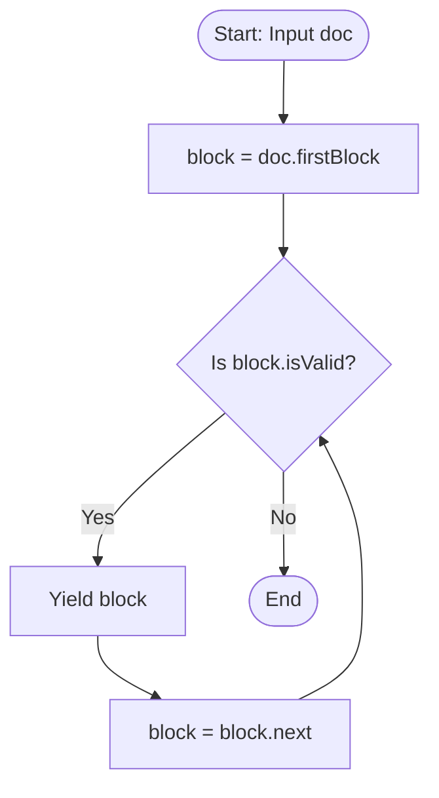
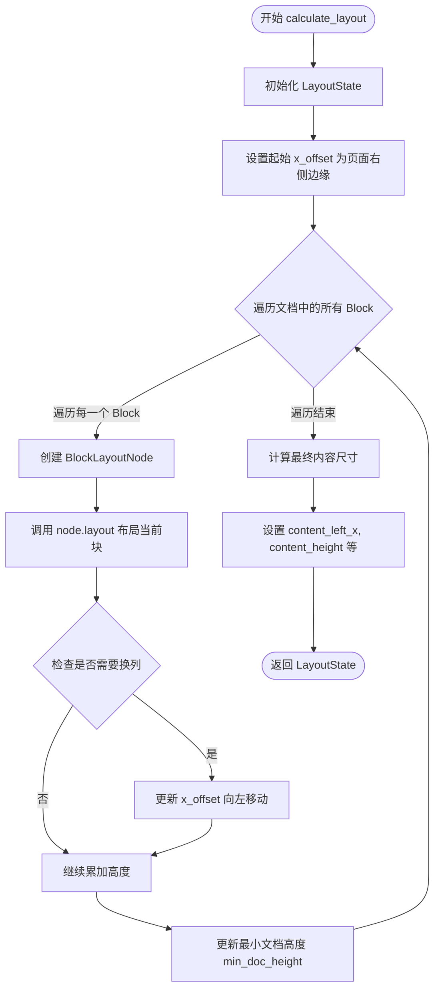
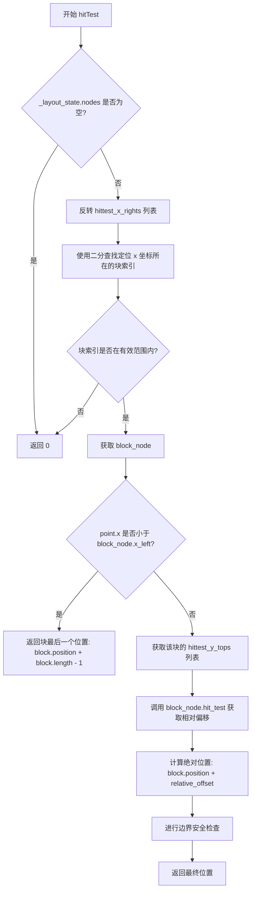
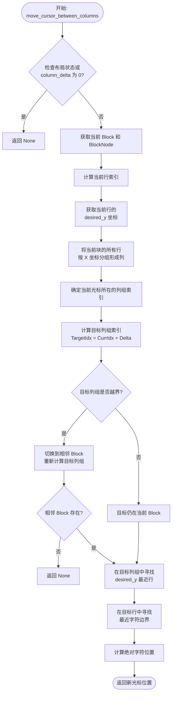
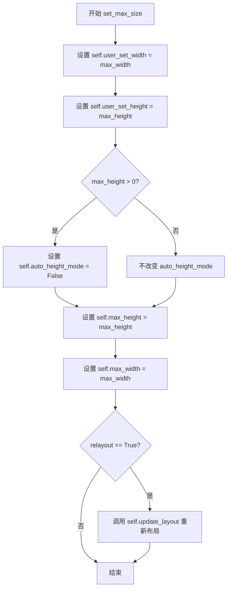
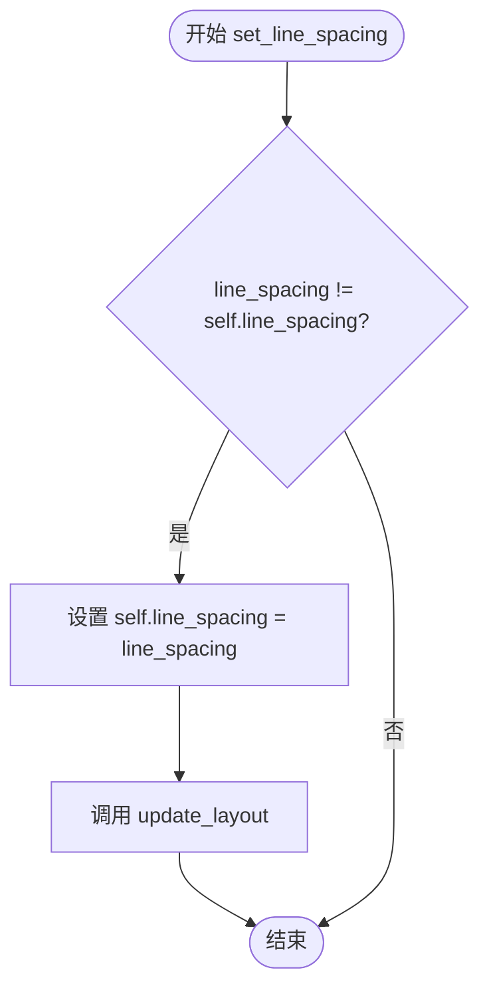
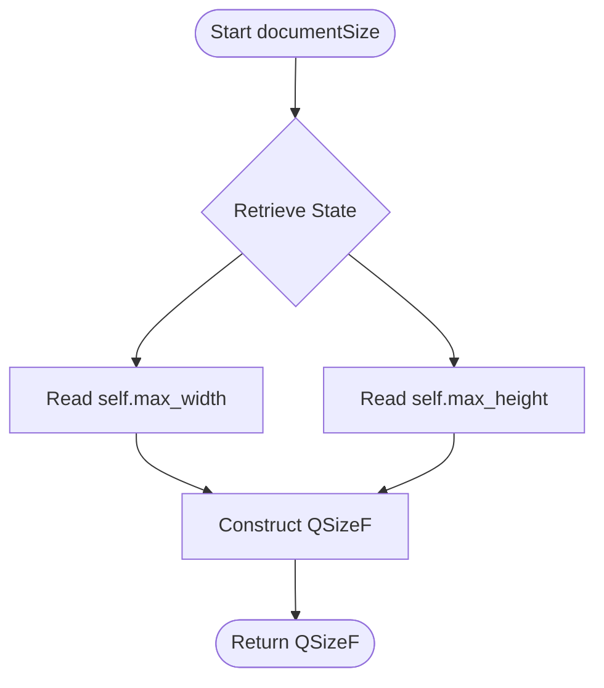
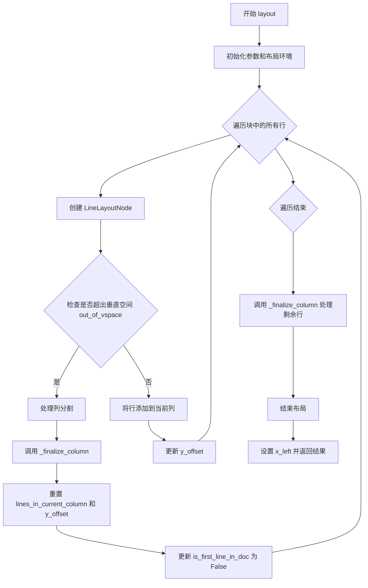
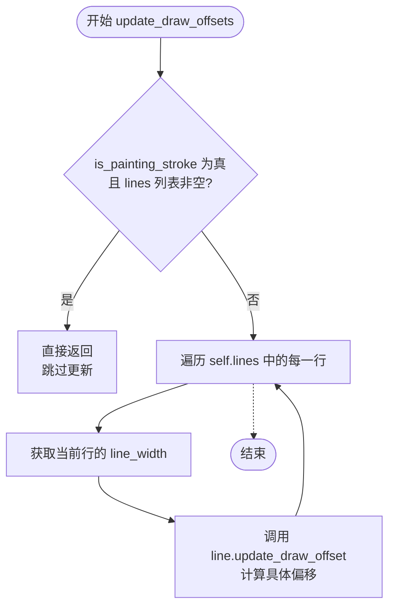
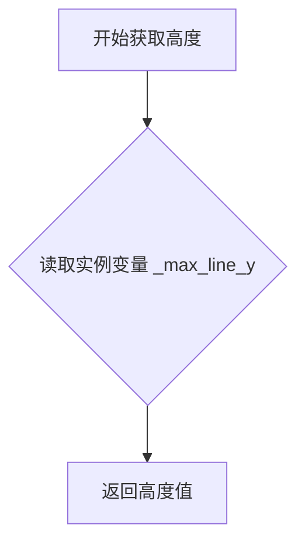

# `comic-translate\app\ui\canvas\text\vertical_layout.py` 详细设计文档

A custom PySide6 text layout engine that implements QAbstractTextDocumentLayout to render QTextDocument in vertical orientation (right-to-left columns), handling complex CJK glyph placement (rotation vs upright), column breaking, and precise cursor hit-testing.

## 整体流程

```mermaid
graph TD
A[Document Content Changed] --> B[update_layout Triggered]
B --> C{Max Iterations Loop < 5}
C -->|Yes| D[Create LayoutContext]
D --> E[calculate_layout (Stateless)]
E --> F[Iterate QTextBlocks]
F --> G[Create BlockLayoutNode]
G --> H{Layout Lines in Block}
H --> I[Create LineLayoutNode]
I --> J{Column Break Check}
J -- Out of Vertical Space --> K[_finalize_column]
K --> H
J -- Fits --> L[Next Block]
L --> F
E --> M{Check Size Constraints}
M -- Content Overflow --> N[Adjust max_width/max_height]
N --> C
M -- Fits --> O[Commit LayoutState]
O --> P[_update_all_draw_offsets]
P --> Q[End]
Q --> R[draw / hitTest]
```

## 类结构

```
VerticalTextDocumentLayout (Inherits QAbstractTextDocumentLayout)
├── LayoutContext (Data Class: Configuration)
├── LayoutState (Data Class: Result Cache)
│   └── nodes: list[BlockLayoutNode]
├── BlockLayoutNode
│   └── lines: list[LineLayoutNode]
│   └── chars: dict[int, CharLayoutInfo]
├── LineLayoutNode
│   └── char_style: CharacterStyle (from .metrics)
└── CharLayoutInfo (Data Class)
```

## 全局变量及字段


### `iter_blocks`
    
Provides a Pythonic iterator over the blocks in a QTextDocument.

类型：`function`
    


### `CharLayoutInfo.line_width`
    
Stores the calculated line width for a character.

类型：`float`
    


### `LayoutContext.document`
    
The text document to be laid out.

类型：`QTextDocument`
    


### `LayoutContext.available_size`
    
The available size for layout calculation.

类型：`QSizeF`
    


### `LayoutContext.line_spacing`
    
Spacing factor between lines.

类型：`float`
    


### `LayoutContext.letter_spacing`
    
Spacing factor for letters.

类型：`float`
    


### `LayoutContext.doc_margin`
    
The document margin (cached property).

类型：`float`
    


### `LayoutContext.available_height`
    
The available height for content (cached property).

类型：`float`
    


### `LayoutState.nodes`
    
List of block layout nodes representing the document structure.

类型：`list[BlockLayoutNode]`
    


### `LayoutState.width`
    
Total width of the layout.

类型：`float`
    


### `LayoutState.height`
    
Total height of the layout.

类型：`float`
    


### `LayoutState.content_width`
    
Width of the content area.

类型：`float`
    


### `LayoutState.content_height`
    
Height of the content area.

类型：`float`
    


### `LayoutState.content_left_x`
    
X coordinate of the left edge of content.

类型：`float`
    


### `LayoutState.min_required_height`
    
Minimum height required to fit all content.

类型：`float`
    


### `LayoutState.hittest_x_rights`
    
Cached right X boundaries for hit-testing (cached property).

类型：`list[float]`
    


### `LayoutState.hittest_y_tops`
    
Cached top Y boundaries for hit-testing per block (cached property).

类型：`list[list[float]]`
    


### `LineLayoutNode.qt_line`
    
The underlying Qt text line object.

类型：`QTextLine`
    


### `LineLayoutNode.start_char_index_in_block`
    
Starting character index within the block.

类型：`int`
    


### `LineLayoutNode.parent_block`
    
Reference to the parent block layout node.

类型：`BlockLayoutNode`
    


### `LineLayoutNode.context`
    
Reference to the layout context.

类型：`LayoutContext`
    


### `LineLayoutNode.text_len`
    
Length of the text in this line.

类型：`int`
    


### `LineLayoutNode.char_style`
    
Character style for the effective character in this line.

类型：`CharacterStyle`
    


### `LineLayoutNode.char_width`
    
Width of the character.

类型：`float`
    


### `LineLayoutNode.space_width`
    
Width of a space character.

类型：`float`
    


### `LineLayoutNode.left_spaces`
    
Number of leading spaces in the line.

类型：`int`
    


### `LineLayoutNode.right_spaces`
    
Number of trailing spaces in the line.

类型：`int`
    


### `LineLayoutNode.effective_char_idx`
    
Index of the first non-space character in the line.

类型：`int`
    


### `LineLayoutNode.calculated_height`
    
Calculated height of the line for layout purposes.

类型：`float`
    


### `LineLayoutNode.char_y_offsets`
    
Y offsets for each character boundary in the line.

类型：`list[float]`
    


### `LineLayoutNode.y_boundary`
    
Top and bottom Y boundaries of the line [top, bottom].

类型：`list[float]`
    


### `LineLayoutNode.draw_offset`
    
Offset for drawing the line correctly.

类型：`QPointF`
    


### `BlockLayoutNode.qt_block`
    
The underlying Qt text block object.

类型：`QTextBlock`
    


### `BlockLayoutNode.block_number`
    
The sequential number of this block in the document.

类型：`int`
    


### `BlockLayoutNode.context`
    
Reference to the layout context.

类型：`LayoutContext`
    


### `BlockLayoutNode.char_style_list`
    
List of character styles for each fragment in the block.

类型：`list[CharacterStyle]`
    


### `BlockLayoutNode.map_charidx2frag`
    
Mapping from character index to fragment index.

类型：`dict[int, int]`
    


### `BlockLayoutNode.ideal_width`
    
Ideal width for the block based on its content.

类型：`float`
    


### `BlockLayoutNode.x_right`
    
Right X coordinate of the block.

类型：`float`
    


### `BlockLayoutNode.x_left`
    
Left X coordinate of the block.

类型：`float`
    


### `BlockLayoutNode.lines`
    
List of line layout nodes in this block.

类型：`list[LineLayoutNode]`
    


### `BlockLayoutNode.chars`
    
Mapping from character index to layout info for hit-testing.

类型：`dict[int, CharLayoutInfo]`
    


### `BlockLayoutNode.min_required_height`
    
Minimum height required for this block.

类型：`float`
    


### `VerticalTextDocumentLayout.line_spacing`
    
Spacing factor between lines.

类型：`float`
    


### `VerticalTextDocumentLayout.letter_spacing`
    
Spacing factor for letters.

类型：`float`
    


### `VerticalTextDocumentLayout.max_width`
    
Maximum width of the layout area.

类型：`float`
    


### `VerticalTextDocumentLayout.max_height`
    
Maximum height of the layout area.

类型：`float`
    


### `VerticalTextDocumentLayout._layout_state`
    
The current layout state containing all layout results.

类型：`LayoutState`
    


### `VerticalTextDocumentLayout.update_layout_on_changed`
    
Flag to control whether layout updates on document changes.

类型：`bool`
    


### `VerticalTextDocumentLayout._is_painting_stroke`
    
Internal flag indicating if currently painting for stroke.

类型：`bool`
    


### `VerticalTextDocumentLayout.has_selection`
    
Flag indicating if there is currently a text selection.

类型：`bool`
    
    

## 全局函数及方法


### `iter_blocks`

这是一个生成器函数，用于将 Qt 原生的 `QTextDocument` 块迭代器模式转换为 Python 风格的生成器。它简化了对文档中所有文本块（段落或行）的遍历操作，使得在 Python 代码中可以直接使用 `for` 循环来消费文档块。

参数：

-  `doc`：`QTextDocument`，输入的 Qt 文本文档对象。

返回值：`Iterator[QTextBlock]`，一个生成器迭代器，用于逐个产出文档中的 `QTextBlock` 对象。

#### 流程图



#### 带注释源码

```python
def iter_blocks(doc: QTextDocument) -> Iterator[QTextBlock]:
    """Provides a Pythonic iterator over the blocks in a QTextDocument."""
    # 1. 获取文档的第一个文本块
    block = doc.firstBlock()
    
    # 2. 循环检查当前块是否有效（Qt 迭代器的标准模式）
    while block.isValid():
        # 3. 产出当前块，将控制权交给调用者
        yield block
        # 4. 获取下一个块
        block = block.next()
```


### `VerticalTextDocumentLayout.update_layout`

这是 `VerticalTextDocumentLayout` 的核心布局引擎触发器。该方法执行一个迭代循环：首先根据当前的容器大小（`max_width`, `max_height`）计算布局状态；然后检查内容是否溢出或是否有大量空白（收缩/扩张）；如果尺寸发生变化（例如自动增高模式开启），它会调整容器大小并重新计算，直到内容完美适配或达到最大迭代次数。最后，它更新所有绘制偏移量并发出文档大小更改的信号。

参数：  
无（该方法仅使用实例属性 `self` 进行操作）

返回值： `None`，无返回值（该方法主要通过修改内部状态 `_layout_state` 和发送信号 `documentSizeChanged` 来产生影响）

#### 流程图

```mermaid
flowchart TD
    Start[开始 update_layout] --> LoopSetup[设置最大迭代次数: 5]
    LoopSetup --> LoopStart{循环迭代}
    
    LoopStart -->|每次迭代| CreateContext[创建 LayoutContext<br>包含文档、可用尺寸、行间距、字间距]
    CreateContext --> CalcLayout[调用 calculate_layout<br>计算临时布局状态]
    
    CalcLayout --> Analyze[分析计算结果]
    Analyze --> CheckWidth[检查宽度需求]
    
    CheckWidth -->|内容过宽 (>120%)| Contract[收缩 max_width]
    CheckWidth -->|内容溢出左边距| ExpandWidth[扩张 max_width]
    CheckWidth -->|宽度合适| CheckHeight[检查高度需求]
    
    ExpandWidth --> SetEnlarged[标记 enlarged = True]
    Contract --> SetEnlarged
    
    CheckHeight -->|内容过高 & 自动高度模式| ExpandHeight[扩张 max_height]
    CheckHeight -->|高度合适| CheckFit
    ExpandHeight --> SetEnlarged
    
    CheckFit{enlarged?}
    SetEnlarged --> CheckFit
    
    CheckFit -->|是 (需要重绘)| EmitSignal[发送 size_enlarged 信号]
    EmitSignal --> LoopStart
    
    CheckFit -->|否 (已完成)| CommitState[提交状态: self._layout_state = current_state]
    CommitState --> Break[break 退出循环]
    LoopStart -->|达到最大次数| Break
    
    Break --> PostProcess[调用 _update_all_draw_offsets<br>更新绘制偏移]
    PostProcess --> EmitSizeChange[发送 documentSizeChanged 信号]
    EmitSizeChange --> End[结束]
```

#### 带注释源码

```python
def update_layout(self):
    # 此循环允许布局在发现需要更多空间时重新运行。
    # 这支持自动调整文档大小（例如，当文本增加导致垂直高度超出时）。
    max_iterations = 5  
    for _ in range(max_iterations):
        # 1. 为本次布局传递创建上下文
        # 包含文档对象、当前可用尺寸、以及排版相关的间距参数
        context = LayoutContext(
            document=self.document(),
            available_size=QSizeF(self.max_width, self.max_height),
            line_spacing=self.line_spacing,
            letter_spacing=self.letter_spacing,
        )

        # 2. 运行无状态的布局引擎以获得潜在的布局结果
        # calculate_layout 是一个纯函数，计算并返回 LayoutState 对象
        current_state = self.calculate_layout(context)

        # 3. 分析结果并决定是否需要调整尺寸
        enlarged = False
        doc_margin = context.doc_margin

        # 计算内容实际需要的宽度
        # content_left_x 是内容最左侧的坐标，width - left - margin 即为内容宽度
        content_width_needed = self.max_width - current_state.content_left_x + doc_margin
        # 确保不小于用户设置的最小宽度
        min_width_needed = max(content_width_needed + doc_margin, self.user_set_width)

        # 宽度收缩：如果当前宽度过大（>120% 且非用户强制设定），则缩小
        if self.max_width > min_width_needed * 1.2 and self.max_width > self.user_set_width:
            self.max_width = min_width_needed
            enlarged = True
        # 宽度扩张：如果内容左侧溢出边距，说明需要更宽
        elif current_state.content_left_x < doc_margin:
            self.max_width += (doc_margin - current_state.content_left_x)
            enlarged = True

        # 高度扩张：如果内容高度超出可用高度，且处于自动增高模式
        if current_state.min_required_height > context.available_height + doc_margin:
            if self.auto_height_mode:
                self.max_height = current_state.min_required_height + doc_margin
                enlarged = True

        # 决策分支
        if enlarged:
            # 如果尺寸改变了，需要发出信号通知外部（可能是 QML/UI 层），
            # 并 continue 重新计算布局以适应新尺寸
            self.size_enlarged.emit()
            continue  # Re-run the layout with new dimensions
        else:
            # 成功！布局已适配当前尺寸。
            # 将临时计算的状态提交到真正的实例状态中。
            self._layout_state = current_state
            break  # Layout fits, exit the loop

    # 布局计算完成后，更新所有行的绘制偏移量
    # 这决定了字符在垂直列中的精确绘制位置（旋转、直立等）
    self._update_all_draw_offsets()
    
    # 发出文档大小已更改的信号，通常会触发 Qt 的重绘
    self.documentSizeChanged.emit(self.documentSize())
```


### `VerticalTextDocumentLayout.calculate_layout`

该方法是一个无状态的布局计算引擎，接收布局上下文（包含文档和可用尺寸），通过遍历文档中的所有文本块，为每个块创建布局节点并执行排版（处理换列），最终生成并返回一个包含所有节点位置、内容尺寸和最小所需高度的完整布局状态对象。

参数：

-  `context`：`LayoutContext`，包含文档对象、可用尺寸、行间距、字母间距等布局所需的全部配置信息。

返回值：`LayoutState`，返回一个包含布局结果的 LayoutState 对象，其中存储了所有的块布局节点（nodes）以及计算后的内容宽度、高度和左边距等关键指标。

#### 流程图



#### 带注释源码

```python
def calculate_layout(self, context: LayoutContext) -> LayoutState:
    """
    根据给定的上下文计算整个文档的布局。
    这是一个无状态操作，返回一个新的 LayoutState。
    """
    # 1. 初始化状态对象
    state = LayoutState(
        width=context.available_size.width(), 
        height=context.available_size.height()
    )

    doc = context.document
    doc_margin = context.doc_margin
    
    # 2. 初始化垂直布局的起始位置（从右向左书写）
    x_offset = context.available_size.width() - doc_margin
    min_doc_height = 0
    is_first_line_in_doc = True

    # 3. 计算当前可用的垂直空间（考虑页边距）
    current_available_height = context.available_height + doc_margin

    # 4. 遍历文档中的每一个文本块
    for block_no, block in enumerate(iter_blocks(doc)):
        # 为当前块创建布局节点
        node = BlockLayoutNode(block, block_no, context)
        
        # 执行块的布局计算（处理列/栏的分割）
        # 返回新的 x_offset（如果发生了换列）、块所需的最小高度、以及是否为文档首行
        x_offset, block_min_height, is_first_line_in_doc = node.layout(
            x_offset, current_available_height, is_first_line_in_doc
        )
        
        # 将布局好的节点添加到状态中
        state.nodes.append(node)

        # 5. 更新文档级别的最小高度需求
        # 比较当前块的底部位置
        min_doc_height = max(min_doc_height, block_min_height)
        
        actual_height_needed = node.height() + doc_margin
        min_doc_height = max(min_doc_height, actual_height_needed)

        # 如果当前块的高度超过了可用高度，说明发生了换列，需要为换列预留空间
        if node.height() > current_available_height - doc_margin:
            min_doc_height = max(min_doc_height, node.height() + doc_margin * 2)

    # 6. 计算最终的内容尺寸
    # 最左边的列的 x 坐标决定了内容的左边界
    state.content_left_x = x_offset
    # 内容高度取所有块中最大的高度
    state.content_height = max((node.height() for node in state.nodes), default=doc_margin) - doc_margin
    # 内容宽度是总宽度减去左边界和右边距
    state.content_width = context.available_size.width() - state.content_left_x - doc_margin
    state.min_required_height = min_doc_height

    return state
```


### `VerticalTextDocumentLayout.draw`

该方法是 `VerticalTextDocumentLayout` 的主渲染入口点。它接收 Qt 的绘图上下文，遍历内部维护的布局节点树来绘制文本内容，并负责处理文本光标（Cursor）的绘制逻辑。

参数：

-  `painter`：`QPainter`，Qt 绘图引擎，用于执行具体的绘图指令。
-  `context`：`QAbstractTextDocumentLayout.PaintContext`，包含绘制上下文信息，如当前光标位置、选中文本信息等。

返回值：`None`，该方法通过副作用（修改 Painter 状态）完成绘制，无返回值。

#### 流程图

```mermaid
graph TD
    A([开始 draw]) --> B[painter.save()]
    B --> C[解析 context 中的选择区和光标位置]
    C --> D{遍历 layout_state.nodes}
    D -->|每个 Block| E[调用 block_node.draw]
    E --> D
    D --> F{光标是否有效且可见?}
    F -->|是| G[查找光标所在的 block_node]
    G --> H[获取 line 信息与字符索引]
    H --> I[计算光标 Y 坐标<br>根据 char_y_offsets 精确定位]
    I --> J[获取光标所在行的宽度 line_width]
    J --> K[绘制光标矩形<br>高度固定为 2px, 宽度为字符宽度]
    F -->|否| L[跳过光标绘制]
    K --> M[发射 update 信号]
    L --> M
    M --> N[painter.restore()]
    N --> Z([结束])
```

#### 带注释源码

```python
def draw(self, painter: QPainter, context: QAbstractTextDocumentLayout.PaintContext) -> None:
    """绘制整个文档的垂直文本布局。"""
    painter.save()  # 保存当前的 Painter 状态，防止污染其他绘制操作
    
    # 1. 提取上下文信息
    context_sel = context.selections  # 获取选中文本列表
    has_selection = len(context_sel) > 0  # 标记是否存在选中
    # 优先处理第一个选区，如果没有选区则传入 None 供 block 绘制使用
    selection = context_sel[0] if has_selection else None
    # 查找光标所在的文本块
    cursor_block = self.document().findBlock(context.cursorPosition)

    # 2. 遍历并绘制所有布局块 (Delegation Pattern)
    # 这里遍历的是我们在 calculate_layout 中生成的布局树节点
    for block_node in self._layout_state.nodes:
        block_node.draw(painter, selection)

    # 3. 绘制文本光标 (Text Cursor)
    # 这是一个布局级别的职责，需要手动计算光标的几何位置
    if cursor_block.isValid() and cursor_block.isVisible():
        # 获取光标所在块的编号
        blk_no = cursor_block.blockNumber()
        if blk_no < len(self._layout_state.nodes):
            block_node = self._layout_state.nodes[blk_no]
            layout = cursor_block.layout()
            # 计算光标在当前块内的相对位置
            cpos_in_block = context.cursorPosition - cursor_block.position()
            # 获取该位置对应的 QTextLine (Qt 内部的行对象)
            line = layout.lineForTextPosition(cpos_in_block)
            
            if line.isValid():
                pos = line.position()
                x, y = pos.x(), pos.y()

                line_width = 0  # 默认宽度
                line_idx = line.lineNumber()
                
                # 获取该行的详细信息，用于精确定位
                if line_idx < len(block_node.lines):
                    line_info = block_node.lines[line_idx]
                    # 尝试从 chars 字典中获取该字符的精确宽度
                    char_info = block_node.chars.get(line_info.effective_char_idx)
                    if char_info: 
                        line_width = char_info.line_width

                    # *** 关键逻辑：Y 轴精确定位 ***
                    # 计算光标在当前行字符数组中的索引
                    y_idx = cpos_in_block - line_info.start_char_index_in_block
                    # 如果在有效范围内，直接使用预计算的字符边界作为光标的 Y 坐标
                    if 0 <= y_idx < len(line_info.char_y_offsets):
                        y = line_info.char_y_offsets[y_idx]

                # 如果仍未获取到宽度（例如只有空格），使用字符格式的默认宽度
                if line_width == 0:
                    line_width = CharacterStyle(cursor_block.charFormat()).tight_char_bounds.width()

                # 使用 RasterOp_NotDestination 模式绘制光标，确保在深色或浅色背景下都可见（颜色取反）
                painter.setCompositionMode(QPainter.CompositionMode.RasterOp_NotDestination)
                # 绘制光标：这是一个细长的矩形，模拟竖排光标
                painter.fillRect(QRectF(x, y, line_width, 2), painter.pen().brush())

    # 4. 信号处理与状态恢复
    # 如果有选中区域或光标位置发生变化，发射更新信号以触发重绘
    if context.cursorPosition != -1 or has_selection:
        self.update.emit()
    if self.has_selection != has_selection:
        self.update.emit()
    else:
        self.update.emit()
    self.has_selection = has_selection
    
    painter.restore()  # 恢复 Painter 状态
```


### `VerticalTextDocumentLayout.hitTest`

该方法实现了在垂直文本布局中对任意坐标点进行命中测试，返回该坐标点对应的文档中的字符位置索引。它首先根据x坐标定位到具体的文本块（列），然后在块内根据y坐标定位到具体的行和字符偏移。

参数：

- `point`：`QPointF`，待测试的坐标点（通常为鼠标点击位置）
- `accuracy`：`Qt.HitTestAccuracy`，命中测试的精度要求（Qt枚举值）

返回值：`int`，返回文档中对应位置的字符索引（绝对位置，从0开始），如果未命中有效内容则返回0

#### 流程图



#### 带注释源码

```python
def hitTest(self, point: QPointF, accuracy: Qt.HitTestAccuracy) -> int:
    # 检查布局状态是否有节点，如果没有则返回0（未命中任何内容）
    if not self._layout_state.nodes:
        return 0

    # 垂直布局中列是从右向左排列的，所以需要反转x_rights列表
    # 用于二分查找确定点击位置属于哪个列（块）
    rev_x_rights = self._layout_state.hittest_x_rights[::-1]
    
    # 使用bisect_left查找point.x应该插入的位置（左侧插入）
    # 这能确定点击位置在哪个列的右侧边界范围内
    rev_idx = bisect.bisect_left(rev_x_rights, point.x())
    
    # 将反转后的索引转换回原始的块索引
    # 因为列表反转了，所以需要这样计算
    block_idx = len(self._layout_state.hittest_x_rights) - 1 - rev_idx

    # 验证块索引的有效性
    if not (0 <= block_idx < len(self._layout_state.nodes)):
        return 0

    # 获取命中的块节点
    block_node = self._layout_state.nodes[block_idx]

    # 如果点击位置在该块的最左边（内容区左侧），返回该块的最后一个有效位置
    # 这是为了处理点击在列间距中的情况
    if point.x() < block_node.x_left:
        return block_node.qt_block.position() + block_node.qt_block.length() - 1

    # 获取该块的行顶部y坐标列表，用于在块内进行y方向的命中测试
    line_y_tops = self._layout_state.hittest_y_tops[block_idx]
    
    # 委托给BlockLayoutNode的hit_test方法，计算在块内的相对字符偏移
    relative_offset = block_node.hit_test(point, line_y_tops)
    
    # 将相对偏移转换为文档中的绝对字符位置
    result = block_node.qt_block.position() + relative_offset
    
    # 最终安全检查：确保结果在文档的有效字符范围内
    doc_length = self.document().characterCount()
    return max(0, min(result, doc_length - 1))
```


### `VerticalTextDocumentLayout.move_cursor_between_columns`

该方法负责在垂直文本布局中处理光标在视觉列之间的移动逻辑。由于垂直布局通常会将文本排列成从右向左的多列（Multi-column），因此“水平”移动光标实际上意味着跳转到上一列或下一列。该函数的核心目标是：在跳转时尽可能保持光标在文档中的**视觉Y坐标（高度）不变**，从而为用户提供流畅的阅读体验。

参数：

-  `cursor_pos`：`int`，当前光标在 QTextDocument 中的绝对字符位置。
-  `column_delta`：`int`，表示移动方向。`+1` 表示移动到下一个视觉列（视觉上的左侧/下方），`-1` 表示移动到上一个视觉列（视觉上的右侧/上方）。正负值与列的排列方向（从右向左）相关。

返回值：`Optional[int]`，移动后的新绝对光标位置。如果目标位置不存在（例如已到达文档边界且无法换行），则返回 `None`。

#### 流程图



#### 带注释源码

```python
def move_cursor_between_columns(self, cursor_pos: int, column_delta: int) -> Optional[int]:
    """
    Moves a cursor between visual columns in the vertical layout, attempting to
    keep the same visual Y position. Returns a new absolute cursor position, or
    None if movement isn't possible.

    `column_delta`: +1 moves to the next column to the left, -1 moves to the
    column to the right (matching how this layout places columns right-to-left).
    """
    # 1. 前置检查：确保布局数据存在且移动方向有效
    if not self._layout_state.nodes or column_delta == 0:
        return None

    doc = self.document()
    # 2. 定位当前光标所在的 Block
    block = doc.findBlock(cursor_pos)
    if not block.isValid():
        return None

    blk_no = block.blockNumber()
    if not (0 <= blk_no < len(self._layout_state.nodes)):
        return None

    block_node = self._layout_state.nodes[blk_no]
    if not block_node.lines:
        return None

    # 3. 确定当前行和期望的视觉 Y 坐标 (desired_y)
    #    这一步是为了保持光标移动后的视觉高度一致
    pos_in_block = max(0, cursor_pos - block.position())

    # 获取 Qt 行对象
    layout = block.layout()
    qt_line = layout.lineForTextPosition(pos_in_block)
    line_idx = qt_line.lineNumber() if qt_line.isValid() else 0
    
    # 如果 Qt 行无效，通过字符范围扫描找到行索引
    if not (0 <= line_idx < len(block_node.lines)):
        line_idx = 0
        for i, line_info in enumerate(block_node.lines):
            start = line_info.start_char_index_in_block
            end = start + max(1, line_info.text_len)
            if start <= pos_in_block < end or (pos_in_block == end and i == len(block_node.lines) - 1):
                line_idx = i
                break

    cur_line_info = block_node.lines[line_idx]
    
    # 计算目标 Y 坐标：查找当前字符在行内的 Y 偏移
    y_idx = pos_in_block - cur_line_info.start_char_index_in_block
    if 0 <= y_idx < len(cur_line_info.char_y_offsets):
        desired_y = cur_line_info.char_y_offsets[y_idx]
    else:
        # 如果索引越界，使用行的顶部边界
        desired_y = cur_line_info.y_boundary[0]

    # 4. 分组：将当前 Block 的行按 X 坐标（视觉列）分组
    lines = block_node.lines
    groups: list[tuple[float, int, int]] = []
    tol = 0.01 # 浮点误差容差
    start_idx = 0
    # 获取第一行的 X 坐标作为基准
    cur_x = lines[0].qt_line.position().x() if lines[0].qt_line.isValid() else 0.0
    
    for i in range(1, len(lines)):
        x = lines[i].qt_line.position().x() if lines[i].qt_line.isValid() else cur_x
        # 如果 X 坐标变化超过容差，则视为进入了新的“列”
        if abs(x - cur_x) > tol:
            groups.append((cur_x, start_idx, i)) # (X坐标, 起始行索引, 结束行索引)
            start_idx = i
            cur_x = x
    # 添加最后一组
    groups.append((cur_x, start_idx, len(lines)))
    if not groups:
        return None

    # 5. 找到当前行属于哪一组（哪一列）
    group_idx = 0
    for gi, (_, gs, ge) in enumerate(groups):
        if gs <= line_idx < ge:
            group_idx = gi
            break

    # 6. 计算目标列索引
    target_group_idx = group_idx + (1 if column_delta > 0 else -1)

    target_block_node = block_node
    
    # 7. 处理跨列/跨块移动
    if target_group_idx < 0 or target_group_idx >= len(groups):
        # 如果在当前块内无法找到目标列，则尝试切换到相邻的 Block
        target_blk_no = blk_no + (1 if column_delta > 0 else -1)
        if not (0 <= target_blk_no < len(self._layout_state.nodes)):
            return None
        
        target_block_node = self._layout_state.nodes[target_blk_no]
        if not target_block_node.lines:
            # 如果目标 Block 为空，直接返回该 Block 的起始位置
            return target_block_node.qt_block.position()

        # 为新的 Block 重新构建列组
        lines = target_block_node.lines
        groups = []
        start_idx = 0
        cur_x = lines[0].qt_line.position().x() if lines[0].qt_line.isValid() else 0.0
        for i in range(1, len(lines)):
            x = lines[i].qt_line.position().x() if lines[i].qt_line.isValid() else cur_x
            if abs(x - cur_x) > tol:
                groups.append((cur_x, start_idx, i))
                start_idx = i
                cur_x = x
        groups.append((cur_x, start_idx, len(lines)))
        
        # 确定目标列：如果 column_delta > 0 (向左)，取最左边的列(0)；否则取最右边的列
        target_group_idx = 0 if column_delta > 0 else (len(groups) - 1)

    # 8. 在目标列组中寻找与 desired_y 最接近的行
    _, gs, ge = groups[target_group_idx]
    if ge <= gs:
        return None

    best_idx = gs
    best_dist = float("inf")
    for i in range(gs, ge):
        top, bottom = lines[i].y_boundary
        # 优先选择完全覆盖 desired_y 的行
        if top <= desired_y <= bottom:
            best_idx = i
            best_dist = 0.0
            break
        # 否则选择边界距离最小的行
        dist = min(abs(desired_y - top), abs(desired_y - bottom))
        if dist < best_dist:
            best_dist = dist
            best_idx = i

    # 9. 在找到的目标行中，精确定位字符索引
    target_line_info = lines[best_idx]
    offsets = target_line_info.char_y_offsets
    if offsets:
        # 使用二分查找找到 desired_y 对应的字符边界索引
        insert_idx = bisect.bisect_left(offsets, desired_y)
        if insert_idx <= 0:
            boundary_idx = 0
        elif insert_idx >= len(offsets):
            boundary_idx = len(offsets) - 1
        else:
            before = offsets[insert_idx - 1]
            after = offsets[insert_idx]
            # 选择距离更近的边界
            boundary_idx = insert_idx - 1 if (desired_y - before) <= (after - desired_y) else insert_idx
    else:
        boundary_idx = 0

    # 10. 转换为绝对文档位置
    rel_pos_in_block = target_line_info.start_char_index_in_block + boundary_idx
    # 限制索引在合法范围内
    rel_pos_in_block = max(0, min(rel_pos_in_block, target_block_node.qt_block.length() - 1))
    return target_block_node.qt_block.position() + rel_pos_in_block
```


### `VerticalTextDocumentLayout.set_max_size`

该方法用于设置文档布局的最大尺寸，根据传入的宽度和高度参数更新布局状态，并根据 `relayout` 参数决定是否触发重新布局。

参数：
- `max_width`：`int`，文档的最大宽度
- `max_height`：`int`，文档的最大高度
- `relayout`：`bool`，是否在设置尺寸后触发重新布局（默认为 `True`）

返回值：`None`，无返回值

#### 流程图



#### 带注释源码

```python
def set_max_size(self, max_width: int, max_height: int, relayout=True):
    # 设置用户指定的宽度，保存用户期望的宽度值
    self.user_set_width = max_width
    
    # 设置用户指定的高度，保存用户期望的高度值
    self.user_set_height = max_height
    
    # 如果指定了有效的高度值，则关闭自动高度模式
    # 这意味着布局不再自动扩展高度以适应内容
    if max_height > 0:
        self.auto_height_mode = False

    # 更新布局引擎的最大高度限制
    self.max_height = max_height
    
    # 更新布局引擎的最大宽度限制
    self.max_width = max_width
    
    # 如果 relayout 为 True，则立即触发布局重新计算
    # 这会根据新的尺寸限制重新计算所有块和行的位置
    if relayout:
        self.update_layout()
```


### VerticalTextDocumentLayout.set_line_spacing

设置垂直文本文档布局的行间距。当行间距值发生变化时，触发文档重新布局。

参数：
- `line_spacing`：`float`，要设置的行间距值。

返回值：`None`，无返回值。该方法直接修改对象状态并触发布局更新。

#### 流程图



#### 带注释源码

```
def set_line_spacing(self, line_spacing: float):
    """
    设置行间距。
    
    参数:
        line_spacing (float): 要设置的行间距值。
    
    返回:
        None: 此方法不返回任何值。
    """
    # 检查传入的行间距是否与当前存储的行间距不同
    if self.line_spacing != line_spacing:
        # 更新实例的行间距属性
        self.line_spacing = line_spacing
        # 触发文档重新布局以应用新的行间距
        self.update_layout()
```


### `VerticalTextDocumentLayout.set_letter_spacing`

该方法用于设置文档的字间距（Letter Spacing）。它包含一个脏检查（Dirty Check）机制，只有当新的字间距值与当前值不同时，才会更新内部状态并触发昂贵的布局重算流程（`update_layout`），从而避免不必要的性能开销。

参数：
- `letter_spacing`：`float`，目标字间距系数（例如 1.0 为正常间距，1.15 为加宽间距）。

返回值：`None`（无返回值，该操作会触发界面更新信号）。

#### 流程图

```mermaid
flowchart TD
    Start[开始: set_letter_spacing] --> Check{letter_spacing != self.letter_spacing?}
    Check -- 否 (值未改变) --> End[结束: 保持现状]
    Check -- 是 (值已改变) --> UpdateState[更新状态: self.letter_spacing = letter_spacing]
    UpdateState --> TriggerLayout[触发重算: self.update_layout()]
    TriggerLayout --> End
```

#### 带注释源码

```python
def set_letter_spacing(self, letter_spacing: float):
    """
    设置垂直文本的字间距。
    
    参数:
        letter_spacing (float): 新的字间距乘数。例如 1.0 是默认间距，
                                大于 1.0 表示增加间距（加宽），小于 1.0 表示减少间距。
    """
    # 检查新值是否与当前存储的值不同，避免不必要的重绘
    if self.letter_spacing != letter_spacing:
        self.letter_spacing = letter_spacing
        
        # 触发完整的文档布局重算，这通常是一个重量级操作
        self.update_layout()
```


### `VerticalTextDocumentLayout.blockBoundingRect`

该方法重写了 `QAbstractTextDocumentLayout` 的标准方法，用于返回给定文本块（Block）在垂直布局中的几何边界矩形。它通过查找内部布局状态中对应的 `BlockLayoutNode` 来获取块的位置和尺寸信息。

参数：
-  `block`：`QTextBlock`，Qt 的文本块对象，表示需要计算边界矩形的段落。

返回值：`QRectF`，返回该文本块在文档坐标系下的边界矩形（x, y, width, height）。如果块无效或未布局，则返回空矩形。**注意：当前实现中 Y 坐标被硬编码为 0，这取决于具体的布局假设（例如所有块起始行对齐或仅用于尺寸计算）。**

#### 流程图

```mermaid
flowchart TD
    A[输入: block (QTextBlock)] --> B{block.isValid()?}
    B -- 否 --> C[返回 空 QRectF]
    B -- 是 --> D[获取 block.blockNumber()]
    D --> E{block_no < len(_layout_state.nodes)?}
    E -- 否 --> C
    E -- 是 --> F[获取对应的 BlockLayoutNode]
    F --> G[提取 node.x_left, node.width, node.height]
    G --> H[构造 QRectF: (x_left, 0, width, height)]
    C --> I[结束]
    H --> I
```

#### 带注释源码

```python
def blockBoundingRect(self, block: QTextBlock) -> QRectF:
    """
    获取特定文本块的边界矩形。

    参数:
        block: Qt文本块对象。

    返回:
        QRectF: 包含左坐标(x)、顶坐标(y)、宽度(width)和高度(height)的矩形。
                如果块无效或未布局，返回空矩形。
    """
    # 1. 校验输入的块是否有效
    if not block.isValid():
        return QRectF()
    
    # 2. 获取块在文档中的编号
    block_no = block.blockNumber()
    
    # 3. 检查该编号的块是否已经完成布局计算
    # _layout_state.nodes 存储了所有计算过的 BlockLayoutNode
    if block_no < len(self._layout_state.nodes):
        node = self._layout_state.nodes[block_no]
        
        # 4. 计算并返回边界矩形
        # x: 块的左侧 x 坐标 (node.x_left)
        # y: 垂直坐标，在当前实现中硬编码为 0
        # width: 块的宽度 (x_right - x_left)
        # height: 块的最大垂直高度 (_max_line_y)
        return QRectF(node.x_left, 0, node.width(), node.height())
    
    # 如果块编号超出范围（未布局），返回空矩形
    return QRectF()
```


### `VerticalTextDocumentLayout.documentSize`

该方法是 `VerticalTextDocumentLayout` 类的核心查询方法之一，继承自 `QAbstractTextDocumentLayout`。它直接返回当前布局引擎计算并维护的文档尺寸（宽度和高度），供 Qt 框架及上层应用查询视口大小或进行绘制决策。

参数：

- `self`：`VerticalTextDocumentLayout`，表示调用此方法的布局实例本身。

返回值：`QSizeF`，返回当前文档的尺寸，包含 `width` 和 `height` 两个浮点数值，分别对应文档的最大宽度和最大高度。

#### 流程图



#### 带注释源码

```python
def documentSize(self) -> QSizeF:
    """
    返回文档的尺寸。
    
    此方法是 QAbstractTextDocumentLayout 的抽象方法实现。
    它直接返回内部维护的 max_width 和 max_height 变量。
    这些变量通常由 set_max_size 或 update_layout 流程更新，
    代表了内容布局所需的最终空间。
    
    Returns:
        QSizeF: 包含当前布局宽度和高度的尺寸对象。
    """
    return QSizeF(self.max_width, self.max_height)
```


### `VerticalTextDocumentLayout.documentChanged`

这是一个重写的槽函数（Slot），用于响应 Qt 文本文档内容的变更。当文档中的文本被修改（插入或删除）时，Qt 框架会自动调用此方法。它充当了布局更新的触发器，负责检查更新标志并启动全文档的重新布局计算。

参数：

- `position`：`int`，表示文档中发生修改的起始字符索引。
- `charsRemoved`：`int`，表示从该位置移除的字符数量。
- `charsAdded`：`int`，表示从该位置新增的字符数量。

返回值：`None`，该方法不返回任何值。

#### 流程图

```mermaid
flowchart TD
    A([Start: 文档内容变更]) --> B{Check: update_layout_on_changed?}
    B -- No (False) --> C([Return: 不进行布局更新])
    B -- Yes (True) --> D[Call: update_layout()]
    D --> E([End: 布局已更新])
```

#### 带注释源码

```python
def documentChanged(self, position: int, charsRemoved: int, charsAdded: int) -> None:
    """
    槽函数：当文档内容发生更改时被 Qt 框架调用。
    
    该方法监听文档的修改事件，是触发响应式重绘（Re-layout）的入口点。
    它确保了用户的每一次输入或删除操作都能立即反映在视觉布局上。
    """
    
    # 守卫条件（Guard Clause）：
    # 检查是否允许在文档更改时自动更新布局。
    # 如果 self.update_layout_on_changed 被设置为 False（例如在进行批量文本插入
    # 或光标操作时为了性能考虑），则直接返回，不执行昂贵的布局计算。
    if not self.update_layout_on_changed:
        return
    
    # 触发全文档的重新布局计算。
    # update_layout() 方法会重新遍历所有文本块和行，计算它们在垂直布局中的
    # 确切位置和尺寸，并处理列的换行（Column breaking）。
    self.update_layout()
```


### `BlockLayoutNode._precalculate_formats`

该方法为 `BlockLayoutNode` 类的私有初始化方法，负责在布局计算前对单个文本块的数据进行预处理。它遍历 Qt 文本块中的所有片段，提取字符样式信息，计算该块所需的理想宽度（取最大字符宽度），并建立字符索引到片段索引的映射表，以便后续高效查询字符格式。

参数：

- 无显式参数（依赖于实例属性 `self.qt_block`）

返回值：`None`，无返回值。该方法通过修改实例属性 (`self.char_style_list`, `self.ideal_width`, `self.map_charidx2frag`) 来存储计算结果。

#### 流程图

```mermaid
flowchart TD
    A([开始 _precalculate_formats]) --> B[初始化: char_idx=0, frag_idx=0]
    B --> C{迭代器 it 是否到达末尾?}
    C -- 是 --> D{ideal_width < 0?}
    C -- 否 --> E[获取当前片段 fragment]
    E --> F[根据 fragment.charFormat() 创建 CharacterStyle]
    F --> G[将 char_style 添加到列表]
    G --> H[获取字符标准宽度 w_]
    H --> I{ideal_width < w_?}
    I -- 是 --> J[更新 ideal_width = w_]
    I -- 否 --> K[跳过]
    J --> L[循环映射字符索引到片段索引]
    L --> M[char_idx++, frag_idx++]
    M --> N[迭代器前进]
    N --> C
    D -- 是 --> O[使用块默认格式计算宽度]
    D -- 否 --> P([结束])
    O --> P
```

#### 带注释源码

```python
def _precalculate_formats(self):
    """Caches font formats and ideal dimensions for this specific block."""
    # 初始化字符在块中的索引和当前片段的索引
    char_idx = 0
    # 获取 QTextBlock 的片段迭代器
    it = self.qt_block.begin()
    frag_idx = 0
    
    # 遍历文本块中的所有文本片段 (Text Fragment)
    while not it.atEnd():
        # 获取当前片段对象
        fragment = it.fragment()
        
        # 根据片段的字符格式 (CharFormat) 创建一个 CharacterStyle 对象
        # CharacterStyle 封装了字体度量等信息，用于后续的布局计算
        char_style = CharacterStyle(fragment.charFormat())
        self.char_style_list.append(char_style)

        # 获取该字符的标准边界宽度
        w_ = char_style.standard_char_bounds.width()
        
        # 更新该块的理想宽度 (ideal_width)，取所有字符宽度的最大值
        # 这决定了该块在垂直布局中所占的列宽
        if self.ideal_width < w_:
            self.ideal_width = w_

        # 构建映射表：将块内字符索引映射到片段索引
        # 这样在布局时可以通过字符索引快速找到对应的 CharacterStyle
        for _ in range(fragment.length()):
            self.map_charidx2frag[char_idx] = frag_idx
            char_idx += 1
        
        # 移动迭代器到下一个片段
        it += 1
        frag_idx += 1

    # 后备逻辑：如果循环结束后 ideal_width 仍为负数（例如块为空或只有孤立字符）
    # 则使用该块本身的默认字符格式来计算一个基准宽度
    if self.ideal_width < 0:
        self.ideal_width = CharacterStyle(self.qt_block.charFormat()).tight_char_bounds.width()
```


### `BlockLayoutNode.get_char_fontfmt`

根据给定的字符索引检索对应的 `CharacterStyle` 对象，用于获取该字符的字体格式信息。该方法在布局计算过程中被频繁调用，以获取每个字符的字体度量、字间距等样式数据，是文本渲染链路中的关键数据访问方法。

参数：

- `char_idx`：`int`，字符在文本块中的索引位置，用于定位需要获取字体格式的字符

返回值：`CharacterStyle`，返回指定索引位置字符的字体格式对象，包含字体度量、字宽、字符边界框等信息。如果索引超出范围或映射为空，则返回fallback值。

#### 流程图

```mermaid
flowchart TD
    A[开始: get_char_fontfmt] --> B{map_charidx2frag 是否为空?}
    B -- 是 --> C[返回 char_style_list[0] 或新建 CharacterStyle]
    B -- 否 --> D{char_idx 是否在映射中?}
    D -- 否 --> E[char_idx = 映射长度 - 1]
    D -- 是 --> F[获取 frag_idx = map_charidx2frag[char_idx]]
    E --> F
    F --> G[返回 char_style_list[frag_idx]]
    C --> H[结束]
    G --> H
```

#### 带注释源码

```python
def get_char_fontfmt(self, char_idx: int) -> CharacterStyle:
    """Gets the CharacterStyle for a character index within this block."""
    # 情况1：map_charidx2frag为空（空块），返回第一个样式或基于块格式新建
    if not self.map_charidx2frag:
        # Fallback for empty blocks
        return self.char_style_list[0] if self.char_style_list else CharacterStyle(self.qt_block.charFormat())
    
    # 情况2：索引不在映射中（如越界），使用最后一个有效索引
    if char_idx not in self.map_charidx2frag:
        # Fallback for positions at the very end of the block
        char_idx = len(self.map_charidx2frag) - 1
    
    # 情况3：正常查找，通过字符索引获取片段索引，再获取对应的CharacterStyle
    frag_idx = self.map_charidx2frag[char_idx]
    return self.char_style_list[frag_idx]
```


### `BlockLayoutNode.layout`

该方法负责对单个文本块（QTextBlock）进行垂直布局计算。它根据可用高度将文本块中的行分配到不同的视觉列（列布局），计算每列的最终位置和几何信息，并返回更新后的水平偏移量、块的最小所需高度以及一个标志。

参数：

-  `x_offset`：`float`，当前布局列的右边缘水平位置（用于确定文本的起始X坐标）
-  `available_height`：`float`，当前列/区域的可用于布局的垂直高度
-  `is_first_line_in_doc`：`bool`，标记当前块中的行是否是文档的第一个可见行（影响行间距）

返回值：`tuple[float, float, bool]`，返回一个包含三个元素的元组：
-  `float`：更新后的 x_offset（下一个列的起始位置）
-  `float`：该文本块所需的最小高度
-  `bool`：始终返回 False（可能是遗留或扩展用的占位符）

#### 流程图



#### 带注释源码

```python
def layout(self, x_offset: float, available_height: float, is_first_line_in_doc: bool) -> tuple[float, float, bool]:
    """
    执行单个文本块的垂直布局计算。
    核心逻辑：将文本行分布到多个视觉列中（当内容超出可用高度时）。
    """
    # 1. 初始化布局环境
    self.x_right = x_offset  # 记录当前列的右边界
    self.qt_block.clearLayout()  # 清除Qt内部的旧布局信息
    
    doc_margin = self.context.doc_margin  # 获取文档边距
    
    # 2. 配置Qt文本布局器
    tl = self.qt_block.layout()
    tl.beginLayout()
    option = self.context.document.defaultTextOption()
    option.setWrapMode(QTextOption.WrapMode.WrapAnywhere)  # 设置任意位置换行
    tl.setTextOption(option)
    
    # 3. 获取块文本信息
    blk_text = self.qt_block.text()
    blk_text_len = len(blk_text)
    # 计算块的宽度：优先使用预计算的理想宽度，否则使用字符格式的紧边界宽度
    block_width = self.ideal_width if blk_text_len > 0 else CharacterStyle(self.qt_block.charFormat()).tight_char_bounds.width()
    
    char_idx_in_block = 0  # 块内字符索引
    
    # 4. 初始化垂直布局状态
    y_offset = doc_margin  # 垂直偏移，从文档边距开始
    lines_in_current_column = []  # 当前列中的行列表
    # 检查是否是文档的第一个块
    is_first_block_in_doc = self.qt_block == self.context.document.firstBlock()
    
    # 5. 主循环：遍历块中的所有行
    while char_idx_in_block <= blk_text_len:
        # 创建新的文本行
        line = tl.createLine()
        if not line.isValid(): 
            break  # 没有更多行时退出
        
        # 配置行宽（这是垂直布局的关键：固定宽度，字符垂直排列）
        line.setLineWidth(block_width)
        line.setNumColumns(1)  # 单列布局
        
        # 为该行创建布局节点
        line_node = LineLayoutNode(line, char_idx_in_block, self, self.context)
        
        # 6. 计算布局几何信息
        char_bottom = y_offset + line_node.calculated_height  # 当前字符的底部位置
        end_of_block = char_idx_in_block + line_node.text_len >= blk_text_len  # 是否到达块末尾
        # 检查是否超出可用垂直空间（考虑字母间距偏移）
        out_of_vspace = char_bottom - max(line_node.letter_spacing_offset, 0) > available_height
        
        # 7. 决策：是否需要分列
        if out_of_vspace:
            # 情况A：当前行在当前列放不下，需要分列
            if char_idx_in_block == 0 and is_first_block_in_doc:
                # 如果是第一行的第一个字符且在第一列，记录最小所需高度
                self.min_required_height = doc_margin + line_node.calculated_height
            
            # 更新最小高度要求（取较大值）
            actual_height_needed = char_bottom + doc_margin
            self.min_required_height = max(self.min_required_height, actual_height_needed)
            
            # 完成当前列的布局计算
            x_offset = self._finalize_column(lines_in_current_column, x_offset, available_height, is_first_line_in_doc)
            
            # 重置状态，开始新的一列
            lines_in_current_column = [line_node]
            y_offset = doc_margin
            is_first_line_in_doc = False
        else:
            # 情况B：该行可以放在当前列中
            lines_in_current_column.append(line_node)
        
        # 8. 更新垂直偏移，准备处理下一行
        y_offset += line_node.calculated_height
        
        # 更新字符索引
        char_idx_in_block += line_node.text_len
        if end_of_block: 
            break
    
    # 9. 处理最后一批行（最后的列）
    x_offset = self._finalize_column(lines_in_current_column, x_offset, available_height, is_first_line_in_doc)
    
    # 10. 清理并返回结果
    tl.endLayout()
    self.x_left = x_offset  # 记录布局后的左边界
    
    return x_offset, self.min_required_height, False
```


### `BlockLayoutNode._finalize_column`

该方法负责将一组行节点（Lines）封装并计算为一个完整的垂直文本列。它计算该列的宽度，调整全局水平偏移量（`x_offset`）以留出列空间，然后遍历每一行设置其在文档中的绝对坐标，触发最终的几何计算，并更新块级节点的高度与字符映射信息。

参数：

- `lines`：`list[LineLayoutNode]`，需要合并到当前列的行节点列表，通常是因为垂直高度溢出而需要换页/换列的连续行。
- `x_offset`：`float`，当前列在文档水平轴上的参考起始位置（随着列的生成会向左回溯）。
- `available_height`：`float`，当前列可用的最大垂直高度，用于限制行节点的布局边界。
- `is_first_line`：`bool`，标记当前列的第一行是否为整个文档的首行，用于决定是否应用特殊的行间距系数。

返回值：`float`，返回处理完当前列后更新后的 `x_offset`，作为下一个新列的起始基准。

#### 流程图

```mermaid
graph TD
    A[Start: _finalize_column] --> B{lines is empty?}
    B -- Yes --> C[Return original x_offset]
    B -- No --> D[Get document margin]
    D --> E[Calculate max char_width from lines]
    E --> F[Calculate idea_line_width]
    F --> G{is_first_line?}
    G -- Yes --> H[line_spacing = 1.0]
    G -- No --> I[line_spacing = context.line_spacing]
    H --> J[x_offset -= idea_line_width * line_spacing]
    I --> J
    J --> K[Initialize y_pos = doc_margin]
    K --> L{Loop for each line_node in lines}
    L --> M[Set line position (x_offset, y_pos)]
    M --> N[Calculate final geometry, update y_pos]
    N --> O[Update self._max_line_y]
    O --> P[Append line_node to self.lines]
    P --> Q{line_node.effective_char_idx != -1?}
    Q -- Yes --> R[Record char width info in self.chars]
    Q -- No --> S[End Loop]
    R --> S
    S --> T[Return new x_offset]
```

#### 带注释源码

```python
def _finalize_column(self, lines: list[LineLayoutNode], x_offset: float, available_height: float, is_first_line: bool):
    """
    最终化一个垂直文本列的布局。
    当一行因空间不足而换列时，之前累积的行会被传入此方法进行最终的几何处理。
    """
    # 如果没有行需要处理，直接返回当前的 x_offset，不进行列的创建
    if not lines:
        return x_offset
    
    # 获取文档边距
    doc_margin = self.context.doc_margin

    # 计算该列中所有行的最大字符宽度，以此作为该列的统一列宽
    width_list = [l.char_width for l in lines if l.char_style]
    if not width_list:
        width_list = [self.ideal_width]
    idea_line_width = max(width_list)

    # 确定行间距：如果是文档首行，通常保持 1.0 倍间距；否则使用上下文设定的行间距
    line_spacing = 1.0 if is_first_line else self.context.line_spacing
    
    # 向左移动 x_offset 以留出当前列的空间 (垂直文本通常从右向左排列)
    x_offset -= idea_line_width * line_spacing

    # 初始化当前列的 Y 轴起始位置
    y_pos = doc_margin
    
    # 遍历列表中的每一行，进行最终的几何定位和计算
    for line_node in lines:
        # 设置该行在当前列中的绝对坐标
        line_node.set_position(QPointF(x_offset, y_pos))
        
        # 计算该行内部字符的 Y 轴偏移分布，并更新该列当前的底部 Y 坐标
        y_pos = line_node.calculate_final_geometry(y_pos, available_height)
        
        # 更新当前块节点的最大高度记录
        self._max_line_y = max(self._max_line_y, y_pos)
        
        # 将处理完成的行节点加入当前块的行列表
        self.lines.append(line_node)

        # 记录该行代表字符（首字符）的布局宽度信息，供绘制和交互命中测试使用
        if line_node.effective_char_idx != -1:
            self.chars[line_node.effective_char_idx] = CharLayoutInfo(idea_line_width)

    # 返回更新后的 x_offset，用于后续列的计算
    return x_offset
```


### `BlockLayoutNode.update_draw_offsets`

该方法作为布局计算的关键环节，负责计算并更新块内每一行文本的绘制偏移量（Draw Offset）。它根据传入的绘制模式标志位决定是否跳过计算，并从块级别的字符宽度缓存中提取数据，委托给子节点 `LineLayoutNode` 完成精确的几何定位。

参数：

- `is_painting_stroke`：`bool`，标识当前是否处于“描边绘制”模式。如果为 `True` 且块内已存在行数据（通常意味着几何信息已就绪），则该方法会提前返回，避免重复计算；否则遍历所有行进行偏移量更新。

返回值：`None`，该方法直接修改 `LineLayoutNode` 内部的 `draw_offset` 属性，不返回任何值。

#### 流程图



#### 带注释源码

```python
def update_draw_offsets(self, is_painting_stroke: bool):
    """Delegates draw offset calculation to child lines."""
    # 优化逻辑：如果当前处于描边绘制模式(Stroke)且块内已有行布局，
    # 通常意味着偏移量已在之前计算或无需更新，因此直接返回以提升性能。
    if is_painting_stroke and self.lines:
        return
    
    # 遍历当前文本块中的所有行节点
    for line in self.lines:
        # 从块级缓存 self.chars 中获取该行有效字符对应的行宽。
        # 如果缓存中没有（例如该字符未参与宽度计算），则回退使用行自身的 char_width。
        # CharLayoutInfo 存储了计算好的 line_width。
        line_width = self.chars.get(line.effective_char_idx, CharLayoutInfo(line.char_width)).line_width
        
        # 调用行级方法，根据计算出的行宽和字符规则，
        # 精确计算该行文本在画布上的绘制偏移量 (x, y)。
        line.update_draw_offset(line_width)
```


### `BlockLayoutNode.set_x_shift`

该方法负责对文本块（Block）及其包含的所有文本行（Line）进行水平位置更新。在布局重算（例如列切换或宽度调整）的过程中，它通过直接修改内部边界变量（`x_left`, `x_right`）并调用 Qt 底层接口移动 `QTextLine` 对象，来实现视觉上的水平平移效果。

#### 参数

- `shift`：`float`，水平方向的偏移量。正值表示向右（或者根据具体坐标系向左）移动，负值表示反向移动。

#### 返回值

`None`。该方法直接修改对象状态，不返回任何值。

#### 流程图

```mermaid
graph TD
    A([开始 set_x_shift]) --> B[更新自身边界: x_right += shift]
    B --> C[更新自身边界: x_left += shift]
    C --> D{遍历所有 Line 节点}
    D --> E[获取当前行的 Qt 位置 pos]
    E --> F[计算新位置: pos + QPointF(shift, 0)]
    F --> G[调用 line.set_position 设置新位置]
    G --> D
    D --> H([结束])
```

#### 带注释源码

```python
def set_x_shift(self, shift: float):
    """Applies a horizontal shift to the block and its lines."""
    # 1. 更新块自身的边界坐标，用于维护布局状态中的宽高信息
    self.x_right += shift
    self.x_left += shift
    
    # 2. 遍历块内的每一行（LineLayoutNode），更新其物理绘制位置
    for line in self.lines:
        # 获取 Qt 文本行当前的绝对坐标
        pos = line.qt_line.position()
        
        # 计算新的坐标：只在 X 轴方向增加偏移量，Y 轴保持不变
        # QPointF 是 PySide6 中用于表示二维坐标的类
        line.set_position(pos + QPointF(shift, 0))
```

#### 关联类信息摘要 (`BlockLayoutNode`)

*   **类职责**：代表并计算 `QTextBlock`（文本块）的布局。主要负责管理块内的字符格式缓存、文本行列表以及块在文档中的坐标边界。
*   **关键字段**：
    *   `lines`: `list[LineLayoutNode]`，存储该块所有的行布局节点。
    *   `x_right`, `x_left`: `float`，分别记录块的最右侧和最左侧 X 坐标。
*   **调用场景**：此方法通常在 `_finalize_column` 方法中被调用，用于在列式布局中，当一列写满需要切换到下一列时，将新列的内容向左（或向右）平移以留出空间。

#### 潜在技术债务与优化空间

1.  **硬编码的位移向量**：在 `line.set_position(pos + QPointF(shift, 0))` 中，Y 轴位移被硬编码为 0。虽然方法名是 `set_x_shift`，但如果未来布局逻辑发生变化（例如允许行在垂直方向也有微小调整），这种硬编码可能会导致 bug。建议如果未来需要通用位移，可扩展参数为 `QPointF`。
2.  **状态同步风险**：该方法直接修改 `x_left` 和 `x_right`。如果调用方没有在合适的时机（例如布局计算完成后）调用，可能导致布局状态（LayoutState）内部的 `hittest_x_rights` 缓存（用于点击测试）与实际视觉位置不一致。不过在当前代码流程中（仅在列生成时调用），风险较低。

#### 错误处理与异常设计

*   **空列表保护**：代码依赖 `self.lines` 列表的迭代。如果 `self.lines` 为空（通常发生在刚初始化但还未布局的块），循环体不会执行，这是符合预期的行为（一个没有内容的块移动后自然还是没有内容）。
*   **Qt 对象有效性**：假设传入的 `line.qt_line` 是有效的 `QTextLine` 对象。调用 `set_position` 前，Qt 内部会处理无效线条的情况，但在极早期的初始化阶段需确保 `layout()` 已执行。


### `BlockLayoutNode.height`

该方法用于获取当前块（Block）的布局高度。在垂直文本布局中，块的高度由其内部所有行（Line）在Y轴方向上的累积位置决定，具体为布局过程中记录的最大Y坐标（`_max_line_y`）。

参数：

- `self`：`BlockLayoutNode`，调用此方法的块布局节点实例本身。

返回值：`float`，返回块布局的垂直高度（以像素为单位）。

#### 流程图



#### 带注释源码

```python
def height(self):
    """返回当前块布局的垂直高度。
    
    此高度是在布局过程中通过 _finalize_column 方法累加计算的。
    它代表了块内最后一行字符底部的 Y 坐标。
    """
    return self._max_line_y
```


### `BlockLayoutNode.width`

获取当前文本块（Block）的宽度。该方法通过计算右边缘坐标与左边缘坐标的差值来得到块的宽度。

参数：

- (无)

返回值：`float`，返回块的布局宽度，计算方式为右边缘 `x_right` 减去左边缘 `x_left`。

#### 流程图

```mermaid
graph LR
    A[开始] --> B[获取属性 x_right 和 x_left]
    B --> C{检查属性是否存在}
    C -- 是 --> D[计算差值: x_right - x_left]
    D --> E[返回结果]
    C -- 否 --> F[返回 0.0 或默认值]
    E --> G[结束]
    F --> G
```

*注：实际上该类在正常使用流程中 `x_right` 和 `x_left` 总是会被 `layout` 或 `_finalize_column` 赋值，因此直接计算差值。*

#### 带注释源码

```python
def width(self):
    """
    获取此块布局节点的宽度。

    宽度是通过将块的右边缘 x 坐标 (x_right) 减去左边缘 x 坐标 (x_left) 计算得出的。
    x_right 和 x_left 分别表示块在垂直列布局中最右侧和最左侧的 x 坐标。

    返回值:
        float: 块的宽度。
    """
    return self.x_right - self.x_left
```


### `BlockLayoutNode.hit_test`

该方法负责在特定的文本块（Block）内执行命中测试（Hit Test）。给定一个视图坐标点 `point` 和预计算的每行顶部 Y 坐标列表 `line_y_tops`，它使用二分查找定位目标行，然后根据字符的精确垂直边界或行边界来计算点击位置相对于该块起始处的字符偏移量。

参数：

-  `point`：`QPointF`，待测试的视图坐标点（主要使用其 Y 坐标来确定行位置）。
-  `line_y_tops`：`list[float]`，当前文本块中所有行顶部的 Y 坐标列表，用于二分查找快速定位行索引。

返回值：`int`，返回点击位置相对于当前 `QTextBlock` 起始处的字符索引偏移量。

#### 流程图

```mermaid
graph TD
    A([Start hit_test]) --> B[Binary Search line_idx in line_y_tops]
    B --> C{Is line_idx valid?}
    C -- No --> D{Is line_idx < 0?}
    D -- Yes --> E[Return 0 (Before first line)]
    D -- No --> F[Return qt_block.length - 1 (After last line)]
    C -- Yes --> G[Get LineLayoutNode]
    G --> H{Check Y position vs [line_top, line_bottom]}
    H -- Y < line_top --> I[off = line.textStart]
    H -- Y > line_bottom --> J[off = line.textStart + line.textLength]
    H -- Inside Vertical Range --> K{Has char_y_offsets?}
    K -- Yes --> L[Iterate y_offsets to find closest boundary]
    L --> M[Calculate off + start_char_index_in_block]
    K -- No --> N[Fallback: Simple binary logic based on distance]
    I --> O[Clamp off to [0, block.length - 1]]
    J --> O
    M --> O
    N --> O
    O --> P([Return relative offset])
```

#### 带注释源码

```python
def hit_test(self, point: QPointF, line_y_tops: list[float]) -> int:
    """Performs a hit test within this block."""
    # 1. 使用二分查找确定点击的 Y 坐标对应的行索引
    # bisect_right 找到 point.y() 应该插入的位置（保持有序），减 1 得到当前行的索引
    line_idx = bisect.bisect_right(line_y_tops, point.y()) - 1

    # 2. 处理边界情况：如果索引无效（例如点击在块的最上方或最下方）
    if not (0 <= line_idx < len(self.lines)):
        # Return start of block for positions before first line, end for positions after last line
        if line_idx < 0:
            return 0  # Return relative position 0 for before first line
        else:
            # Return the last valid position in this block
            return max(0, self.qt_block.length() - 1)

    # 3. 获取该行的具体信息
    line_info = self.lines[line_idx]
    line_top, line_bottom = line_info.y_boundary
    y = point.y()

    off = 0
    # 4. 判断点击位置是位于行上方、行下方还是行内部
    if y < line_top:
        # 点击在行顶之上，将光标放在行首
        off = line_info.qt_line.textStart()
    elif y > line_bottom:
        # 点击在行底之下，将光标放在行尾
        off = line_info.qt_line.textStart() + line_info.qt_line.textLength()
    else:
        # 5. 点击在行的垂直范围内，进行精确的字符定位
        # Always use char_y_offsets for accurate cursor positioning
        y_offsets = line_info.char_y_offsets
        if y_offsets and len(y_offsets) > 1:
            # 遍历该行所有字符的 Y 边界，找到点击位置最近的字符边界
            for i, (ytop, ybottom) in enumerate(zip(y_offsets[:-1], y_offsets[1:])):
                if ytop <= y < ybottom:
                    dis_top, dis_bottom = y - ytop, ybottom - y
                    # 选择距离较近的边界
                    off = i if dis_top < dis_bottom else i + 1
                    break
            else:
                # 如果没有找到区间（例如点击在最后），则使用最后一个边界
                off = len(y_offsets) - 1
            
            # 加上该行在块中的起始字符索引，得到块内的相对偏移
            off += line_info.start_char_index_in_block
        else:
            # Fallback for lines without char_y_offsets (e.g., empty lines)
            qt_line = line_info.qt_line
            off = qt_line.textStart()
            if qt_line.textLength() > 1:
                # Simple binary division for fallback case
                if line_bottom - y < y - line_top:
                    off += qt_line.textLength()
            elif line_bottom - y < y - line_top:
                off += 1

    # 6. 最终校验：确保偏移量在块的合法字符范围内
    off = max(0, min(off, self.qt_block.length() - 1))
    return off  # Return relative offset, not absolute position
```


### `BlockLayoutNode.draw`

负责将当前块（Block）的绘制任务委托给其子节点——行布局节点（`LineLayoutNode`）。它遍历块中的每一行，并调用对应行对象的绘制方法，以完成整个文本块的可视化渲染。

参数：

- `painter`：`QPainter`，Qt 画家实例，用于执行具体的图形绘制指令。
- `selection`：`QAbstractTextDocumentLayout.Selection`，包含当前文本选区的格式和光标信息，用于处理选中文本的高亮绘制。

返回值：`None`（无），该方法直接修改绘图上下文，不返回任何值。

#### 流程图

```mermaid
flowchart TD
    A([Start draw]) --> B{Iterate over self.lines}
    B -->|For each line_node| C[Call line_node.draw]
    C --> B
    B -->|No more lines| D([End])
```

#### 带注释源码

```python
def draw(self, painter: QPainter, selection: QAbstractTextDocumentLayout.Selection):
    """Delegates drawing to child LineLayoutNode instances."""
    # 遍历当前块中的所有行节点
    for line_node in self.lines:
        # 将绘制任务委托给具体的行绘制方法
        line_node.draw(painter, selection)
```


### `LineLayoutNode._calculate_initial_properties`

该方法负责计算行的“初始属性”，即在不知道确切列宽的情况下，预先估算该行所需的高度（`calculated_height`）。这个高度用于决定当前列是否空间不足需要“断列”（开辟新的一列）。它通过分析行内的有效字符、获取其字符样式，并根据 `PlacementRule`（放置规则，是竖排旋转还是直立）来计算基础高度，同时考虑字母间距的影响。

参数：
- （无显式参数，依赖于实例属性 `self`）

返回值：
- （无返回值，结果存储在实例属性 `self.calculated_height` 及相关变量中）

#### 流程图

```mermaid
graph TD
    A[开始计算初始属性] --> B[获取块文本blk_text]
    B --> C[提取当前行文本片段并去除换行符]
    C --> D[计算右空格和左空格数量]
    D --> E[计算有效字符索引 effective_char_idx]
    E --> F{有效字符是否存在?}
    
    F -- 是 --> G[获取字符样式 char_style]
    G --> H[获取字符和放置规则 Rule]
    H --> I{规则类型?}
    
    I -- ROTATE_EDGE_ALIGNED 或 ROTATE_CENTERED --> J[基础高度 = 行自然宽度 - 前导空格宽]
    I -- UPRIGHT_CENTERED --> K[基础高度 = 字符紧边界高 + 字體 descent]
    I -- UPRIGHT (默认) --> L[基础高度 = 字符紧边界高]
    
    J --> M[应用字母间距偏移: base_h + offset]
    K --> M
    L --> M
    
    F -- 否 --> N{块中是否还有文本仅包含空格?}
    N -- 是 --> O[使用字符样式计算高度 + descent]
    N -- 否 --> P[使用块的 CharFormat 创建默认样式并计算高度]
    
    M --> Q[设置 calculated_height]
    O --> Q
    P --> Q
    
    Q --> R[结束]
```

#### 带注释源码

```python
def _calculate_initial_properties(self):
    """Calculates a preliminary line height for column-breaking decisions."""
    # 1. 获取当前文本块的全部文本
    blk_text = self.parent_block.qt_block.text()
    blk_text_len = len(blk_text)

    # 2. 提取当前行对应的文本片段，并移除换行符（因为换行在竖排中可能被视为宽字符或分隔符）
    text = blk_text[self.start_char_index_in_block : self.start_char_index_in_block + self.text_len].replace('\n', '')
    
    # 3. 计算前导空格和尾随空格的数量，用于后续计算有效字符位置
    self.right_spaces = self.text_len - len(text.rstrip())
    self.left_spaces = self.text_len - len(text.lstrip())
    
    # 4. 确定该行第一个“有效”字符（即非前导空格）的索引
    self.effective_char_idx = self.start_char_index_in_block + self.left_spaces

    tbr_h = 0  # 初始化临时行高计算变量

    # 5. 分支判断：是否存在有效字符？
    if self.effective_char_idx < blk_text_len:
        # 获取该字符的样式信息（包含字体、字宽等）
        self.char_style = self.parent_block.get_char_fontfmt(self.effective_char_idx)
        char = blk_text[self.effective_char_idx]

        # 基础属性获取
        self.space_width = self.char_style.space_width
        self.char_width = self.char_style.tight_char_bounds.width()
        
        # 计算字母间距带来的高度偏移
        self.letter_spacing_offset = self.char_style.tight_char_bounds.height() * (self.context.letter_spacing - 1)

        # 根据 GlyphPlacement 规则获取该字符的放置类型（旋转/直立等）
        rule, _, _ = GlyphPlacement.get_rule(char)
        
        base_h = 0
        # 6. 根据放置规则计算基础高度
        if rule == PlacementRule.ROTATE_EDGE_ALIGNED or rule == PlacementRule.ROTATE_CENTERED:
            # 对于旋转字符（如中文括号『』），高度通常取决于 Qt 行对象的自然宽度
            base_h = self.qt_line.naturalTextWidth()
            # 减去前导空格宽，因为它们不参与旋转高度的贡献
            if self.left_spaces > 0:
                base_h -= self.left_spaces * self.space_width

        elif rule == PlacementRule.UPRIGHT_CENTERED:
            # 对于居中的标点（如居中的逗号），高度由紧边界加上 descent（下降部）决定
            tbr, _ = self.char_style.get_char_bounds(char)
            base_h = tbr.height() + self.char_style.font_metrics.descent()

        else:  # Default case: PlacementRule.UPRIGHT
            # 普通直立字符，高度就是紧边界高度
            base_h = self.char_style.tight_char_bounds.height()
        
        # 7. 应用字母间距偏移到计算出的基础高度上
        tbr_h = base_h + self.letter_spacing_offset

    # 8. 分支判断：如果没有有效字符（例如整行都是空格）
    elif self.start_char_index_in_block < blk_text_len:
        # 此时行内只有空格，使用块级样式作为回退
        self.char_style = self.parent_block.get_char_fontfmt(self.start_char_index_in_block)
        tbr_h = self.char_style.tight_char_bounds.height() + self.char_style.font_metrics.descent()
        self.space_width = self.char_style.space_width
        self.char_width = self.char_style.tight_char_bounds.width()

    # 9. 分支判断：完全空的块（例如由回车键产生的尾随空段落）
    else:
        # 使用该块的 CharFormat 创建全新的默认样式
        self.char_style = CharacterStyle(self.parent_block.qt_block.charFormat())
        self.space_width = self.char_style.space_width
        self.char_width = self.char_style.tight_char_bounds.width()
        self.letter_spacing_offset = self.char_style.tight_char_bounds.height() * (self.context.letter_spacing - 1)
        tbr_h = self.char_style.tight_char_bounds.height() + self.letter_spacing_offset
        self.effective_char_idx = -1 # 标记为无效字符索引

    # 10. 最终设置计算出的行高，确保非负
    self.calculated_height = max(0, tbr_h)
```


### `LineLayoutNode.calculate_final_geometry`

该方法负责计算垂直文本布局中单行文本的最终几何形状。它根据传入的行起始偏移量和列可用高度，精确计算行内每个字符（包括前后空格）的垂直坐标（y_offsets），并确定行的视觉边界。此过程确保字符堆叠符合垂直书写的逻辑，并处理列断开时的边界约束。

#### 参数

- `y_offset`：`float`，行在列中的起始 Y 坐标。
- `available_height`：`float`，当前列或页面的可用高度。

#### 返回值

`float`，返回计算后的行底部 Y 坐标（line_bottom），通常用作下一行的 `y_offset`。

#### 流程图

```mermaid
graph TD
    A([开始 calculate_final_geometry]) --> B[初始化 char_y_offsets = [y_offset]]
    B --> C{左侧空格 > 0?}
    C -->|Yes| D[循环添加左侧空格偏移量]
    D --> E[计算主字符底部位置]
    C -->|No| E
    E --> F[添加主字符底部坐标到列表]
    F --> G{右侧空格 > 0?}
    G -->|Yes| H[循环添加右侧空格偏移量]
    G -->|No| I{实际字符数 > 1?}
    H --> I
    I -->|Yes| J[循环添加剩余字符的偏移量]
    I -->|No| K[设置 y_boundary 边界]
    J --> K
    K --> L[返回 line_bottom]
    L --> Z([结束])
    
    subgraph D [左侧空格处理]
    D1[next_offset = last + space_width]
    D2[clamp to available_height - calculated_height]
    end
```

#### 带注释源码

```python
def calculate_final_geometry(self, y_offset: float, available_height: float) -> float:
    """Calculates final y-offsets for characters based on the line's starting y_offset."""
    # 1. 初始化字符Y轴偏移量数组，起始点为行的Y轴起点
    self.char_y_offsets = [y_offset]
    
    # 2. 处理前导空格（Leading spaces）
    # 这些空格位于有效字符之前，但在垂直布局中通常需要占据一定的垂直空间
    for _ in range(self.left_spaces):
        # 计算下一个位置：当前位置 + 空格宽度
        # 同时使用 min 限制，确保不会超过 (可用高度 - 字符高度)，防止内容超出列底边
        self.char_y_offsets.append(min(available_height - self.calculated_height, self.char_y_offsets[-1] + self.space_width))
    
    # 3. 计算并添加主字符（第一个有效字符）的底部位置
    # 主字符确定了行的基本高度
    char_bottom = self.char_y_offsets[-1] + self.calculated_height
    self.char_y_offsets.append(char_bottom)
    
    # 4. 处理尾随空格（Trailing spaces）
    for _ in range(self.right_spaces):
        # 同样添加空格偏移，但限制条件略有不同，主要防止超过可用高度
        self.char_y_offsets.append(min(self.char_y_offsets[-1] + self.space_width, available_height))
    
    # 5. 处理该行中除第一个有效字符外的其他字符（如 "ABC" 中的 'B', 'C'）
    # 在垂直布局中，多余的字符会像砖块一样堆叠在前一个字符的上方/下方
    actual_char_count = self.text_len - self.left_spaces - self.right_spaces
    if actual_char_count > 1:
        chars_already_accounted = 1  # 已经计算了第一个有效字符
        remaining_chars = actual_char_count - chars_already_accounted
        
        for _ in range(remaining_chars):
            # 每个后续字符都占据 calculated_height 的高度
            next_char_bottom = self.char_y_offsets[-1] + self.calculated_height
            # 同样需要确保不超过可用高度
            self.char_y_offsets.append(min(next_char_bottom, available_height))
    
    # 6. 确定行的视觉边界 (y_boundary)
    # 顶部是第一个有效字符的起始位置，底部是最后一个偏移量
    line_bottom = self.char_y_offsets[-1]
    self.y_boundary = [self.char_y_offsets[self.left_spaces], line_bottom]
    return line_bottom
```


### `LineLayoutNode.update_draw_offset`

该方法位于 `LineLayoutNode` 类中，负责根据字符的排版规则（如垂直旋转、直立）和当前行的宽度，计算文本绘制时的精确偏移量 (`draw_offset`)。这一步骤对于在垂直文本布局中正确对齐字符（尤其是标点符号和括号）至关重要。

参数：

-  `line_width`：`float`，当前行（列）的可用宽度，用于在垂直方向上计算字符的对齐方式（例如居中或右对齐）。

返回值：`None` (无返回值，结果直接修改实例属性 `self.draw_offset`)。

#### 流程图

```mermaid
graph TD
    A[开始 update_draw_offset] --> B{检查 char_style 或 text_len 是否有效?}
    B -->|否| C[直接返回]
    B -->|是| D[获取块文本、字符索引、字符]
    D --> E[计算 space_shift (前导空格宽度)]
    D --> F[获取 qt_line 文本片段]
    D --> G[调用 get_precise_bounds 获取 act_rect (x,y,w,h)]
    G --> H[调用 GlyphPlacement.get_rule 获取规则]
    H --> I{规则类型?}
    
    I -->|ROTATE_EDGE_ALIGNED / ROTATE_CENTERED| J[计算基础 yoff, xoff]
    J --> K{规则 == ROTATE_EDGE_ALIGNED?}
    K -->|是| L[如果是开括号, yoff -= (line_width - h) 实现右对齐]
    K -->|否| M[否则 yoff -= (line_width - h) / 2 实现居中]
    L --> N{char.isalpha?}
    M --> N
    
    N -->|是| O[覆盖 yoff 使用 ascent/capHeight; xoff=0]
    N -->|否| P[继续]
    
    I -->|UPRIGHT_CENTERED| Q[计算 yoff (top) 和 xoff (居中)]
    Q --> R{char in FORCE_CENTERED_PUNCTUATION?}
    R -->|是| S[微调 yoff 以对齐视觉中心]
    R -->|否| T[继续]
    
    I -->|Default (UPRIGHT)| U[计算 yoff (修正 baseline); xoff (居中)]
    
    P --> V[设置 self.draw_offset = QPointF(xoff, yoff)]
    O --> V
    S --> V
    T --> V
    U --> V
    C --> Z[结束]
```

#### 带注释源码

```python
def update_draw_offset(self, line_width: float):
    """Calculates the precise drawing offset to align glyphs correctly."""
    # 如果没有字符样式或文本长度为0，则无需计算偏移，直接返回
    if not self.char_style or self.text_len == 0: 
        return

    # 获取当前块的完整文本
    blk_text = self.parent_block.qt_block.text()
    # 获取该行有效字符（去除前后空格后的第一个字符）的索引
    char_idx = self.effective_char_idx
    # 获取具体字符
    char = blk_text[char_idx]

    # 计算前导空格(leading spaces)所带来的水平偏移量
    # 这影响字符在垂直行中的起始位置
    space_shift = self.left_spaces * self.char_style.space_width if self.left_spaces > 0 else 0
    
    # 获取当前 QTextLine 在块中的文本片段
    line_start = self.qt_line.textStart()
    line_len = self.qt_line.textLength()
    line_text = blk_text[line_start : line_start + line_len]
    
    # 获取字符在当前行布局中的精确边界矩形 (x, y, w, h)
    # 考虑了 space_shift 的影响
    act_rect = self.char_style.get_precise_bounds(line_text, self.qt_line, space_shift=space_shift)

    # 根据字符获取排版放置规则 (PlacementRule)
    # 包含：ROTATE_EDGE_ALIGNED, ROTATE_CENTERED, UPRIGHT_CENTERED, UPRIGHT
    rule, is_open, is_close = GlyphPlacement.get_rule(char)
    
    # 初始化偏移量
    xoff, yoff = 0, 0

    # --- 分支处理：旋转类字符 (用于竖排文字) ---
    if rule == PlacementRule.ROTATE_EDGE_ALIGNED or rule == PlacementRule.ROTATE_CENTERED:
        # 计算基础偏移：将字符底部与参考线对齐
        # act_rect[1] 是 y (top), act_rect[3] 是 height
        yoff = -act_rect[1] - act_rect[3] 
        xoff = -act_rect[0] 
        
        # 根据子规则进行垂直对齐调整
        if rule == PlacementRule.ROTATE_EDGE_ALIGNED:
            # 针对左侧开括号（如 '「'），在竖排中需右对齐（视觉右侧）
            if is_open: 
                # 减去差值以将字符底边对齐到行宽底部
                yoff -= (line_width - act_rect[3])
            # 闭合括号默认左对齐，无需调整
        else: 
            # ROTATE_CENTERED: 垂直居中
            yoff -= (line_width - act_rect[3]) / 2
            
        # 特殊处理：如果是拉丁字母（Alpha），通常需要特殊对待以保持可读性
        if char.isalpha(): 
            # 覆盖之前的计算，使用 ascent 和 capHeight 进行更精细的垂直居中
            yoff = -self.qt_line.ascent() - (line_width - self.char_style.font_metrics.capHeight()) / 2
            xoff = 0 # 重置水平偏移

    # --- 分支处理：直立居中 (通常用于标点) ---
    elif rule == PlacementRule.UPRIGHT_CENTERED:
        # Y轴偏移为字符顶部
        yoff = -act_rect[1]
        # X轴偏移计算：字符左侧 + (可用宽度 - 字符宽度) / 2
        xoff = -act_rect[0] + (line_width - act_rect[2]) / 2
        
        # 特殊标点微调：对某些强制居中的标点进行额外的垂直居中修正
        if char in GlyphPlacement._FORCE_CENTERED_PUNCTUATION and char not in {'！', '？'}:
            tbr, _ = self.char_style.get_char_bounds(char)
            # 调整偏移以匹配视觉中心
            yoff += (tbr.height() + self.char_style.font_metrics.descent() - act_rect[3]) / 2

    # --- 分支处理：默认直立 (UPRIGHT) ---
    else: 
        # 计算 Y 轴偏移：修正 standard bounds 和 tight bounds 之间的差异以及 baseline
        yoff = min(self.char_style.standard_char_bounds.top() - self.char_style.tight_char_bounds.top(), -self.char_style.tight_char_bounds.top() - self.qt_line.ascent())
        # X 轴居中
        xoff = -act_rect[0] + (line_width - act_rect[2]) / 2

    # 将计算出的偏移应用到实例属性 draw_offset
    self.draw_offset = QPointF(xoff, yoff)
```


### `LineLayoutNode.set_position`

该方法直接调用 Qt 内部文本行对象的定位函数，将当前文本行 (`QTextLine`) 移动到指定的坐标点，从而确定该行在垂直布局中的视觉位置。

参数：

-  `pos`：`QPointF`，目标位置坐标，定义了文本行在文档中的 X 和 Y 偏移量。

返回值：`None`，该方法不返回任何值，仅执行副作用（更新 Qt 对象状态）。

#### 流程图

```mermaid
graph LR
    A[开始 set_position] --> B[调用 self.qt_line.setPosition]
    B --> C[更新 QTextLine 内部位置状态]
    C --> D[结束]
```

#### 带注释源码

```python
def set_position(self, pos: QPointF):
    """
    设置底层 Qt 文本行的位置。
    
    参数:
        pos: QPointF, 目标坐标点。
    """
    # 调用 Qt QTextLine 对象的方法，传入坐标参数 pos
    self.qt_line.setPosition(pos)
```


### `LineLayoutNode.draw`

该方法负责绘制单个垂直文本行，根据字符的放置规则（旋转或直立）应用相应的坐标变换，并处理选中文本的高亮显示。

参数：

- `painter`：`QPainter`，绘图设备，用于执行实际的绘制操作。
- `selection`：`QAbstractTextDocumentLayout.Selection`，可选的选区信息，用于高亮选中的文本。如果为 `None` 或不选中，则不绘制高亮背景。

返回值：`None`，该方法直接在绘图设备上绘制内容，不返回任何值。

#### 流程图

```mermaid
flowchart TD
    A([开始 draw 方法]) --> B{text_len == 0?}
    B -->|是| C[直接返回]
    B -->|否| D{effective_char_idx < 0?}
    D -->|是| E[绘制原始行 at (0,0)]
    D -->|否| F[获取 draw_offset 和字符信息]
    F --> G{selection 存在且与本行重叠?}
    G -->|否| H[计算 line_width 和 line_text]
    G -->|是| I[计算选区状态 selected]
    I --> H
    H --> J{字符规则为旋转?}
    J -->|是| K[构建旋转变换矩阵]
    K --> L{selected?}
    L -->|是| M[绘制旋转+选中文本]
    L -->|否| N[绘制旋转文本]
    J -->|否| O{selected?}
    O -->|是| P[绘制非旋转+选中文本]
    O -->|否| Q[绘制非旋转文本]
    M --> R([结束])
    N --> R
    P --> R
    Q --> R
    C --> R
    E --> R
```

#### 带注释源码

```python
def draw(self, painter: QPainter, selection: QAbstractTextDocumentLayout.Selection):
    """Draws this single line of text, handling rotation and selection."""
    # 如果行长度为0，则不进行绘制，直接返回
    if self.text_len == 0:
        return

    # 获取父块（BlockLayoutNode）对应的 Qt 文本块
    block = self.parent_block.qt_block
    # 获取块在文档中的起始位置
    blpos = block.position()
    # 获取块的完整文本
    blk_text = block.text()

    # 如果没有有效的字符索引（例如空行），则回退到直接绘制原始行
    if self.effective_char_idx < 0:
        # Fallback for lines that don't map to an effective character (e.g., empty lines).
        # Draw the raw line at (0,0) relative to its calculated position.
        self.qt_line.draw(painter, QPointF(0, 0))
        return

    # 从预计算的 draw_offset 获取绘制偏移量
    xoff, yoff = self.draw_offset.x(), self.draw_offset.y()
    # 获取当前行的代表字符
    char = blk_text[self.effective_char_idx]
    # 获取该字符对应的字符样式（包含字体度量等信息）
    char_style = self.char_style

    # Determine if any part of this line intersects the current selection.
    selected = False
    # 检查是否存在选区，并且选区是否与当前行有交集
    if selection:
        # 计算选区在块内的相对起始和结束位置
        sel_start = selection.cursor.selectionStart() - blpos
        sel_end = selection.cursor.selectionEnd() - blpos
        # 当前行的字符范围
        line_start = self.start_char_index_in_block
        line_end = self.start_char_index_in_block + self.text_len
        # 判断是否有重叠：选区起点小于行结束 且 选区终点大于行开始
        selected = sel_start < line_end and sel_end > line_start

    # 获取当前行的宽度，如果未找到则使用字符样式的紧凑边界宽度作为默认值
    line_width = self.parent_block.chars.get(self.effective_char_idx, CharLayoutInfo(char_style.tight_char_bounds.width())).line_width
    # 提取当前行在块中的实际文本内容
    line_text = blk_text[self.qt_line.textStart(): self.qt_line.textStart() + self.qt_line.textLength()]

    # 根据字符获取其放置规则（旋转或直立）
    rule, _, _ = GlyphPlacement.get_rule(char)
    # 判断是否需要旋转绘制
    is_rotated = (rule == PlacementRule.ROTATE_EDGE_ALIGNED or rule == PlacementRule.ROTATE_CENTERED)
    
    # === 处理需要旋转的文本 ===
    if is_rotated:
        # 获取当前行在文档中的基础坐标
        line_x, line_y = self.qt_line.x(), self.qt_line.y()
        # 构建 90 度旋转矩阵：原点移到 (line_x + line_y, line_y - line_x)
        # 变换公式：x' = 0*x + 1*y + tx, y' = -1*x + 0*y + ty
        transform = QTransform(0, 1, -1, 0, line_x + line_y, line_y - line_x)
        # 应用旋转变换
        painter.setTransform(transform, True)
        
        # Embedded line_draw logic for rotated text
        # 如果当前行被选中
        if selected and selection:
            painter.save()
            # 计算覆盖矩形的区域（基于原始坐标，因为变换会影响坐标系）
            overlay_rect = QRectF(self.qt_line.x() + xoff, self.qt_line.y() + yoff, self.qt_line.naturalTextWidth(), self.qt_line.height())
            # 填充选区背景色
            painter.fillRect(overlay_rect, selection.format.background())
            # 设置选中文本的前景色（文字颜色）
            painter.setPen(selection.format.foreground().color())
            # 使用偏移量绘制旋转后的文本行
            self.qt_line.draw(painter, QPointF(xoff, yoff))
            painter.restore()
        else:
            # 未选中，直接绘制旋转文本
            self.qt_line.draw(painter, QPointF(xoff, yoff))
        
        # 恢复变换矩阵（撤销旋转）
        painter.setTransform(transform.inverted()[0], True)
    else:
        # === 处理非旋转（直立）文本 ===
        # Embedded line_draw logic for non-rotated text
        if selected and selection:
            painter.save()
            
            # 计算覆盖矩形
            if char_style is None:
                # 如果没有字符样式，使用简单的覆盖矩形
                overlay_rect = QRectF(self.qt_line.x() + xoff, self.qt_line.y() + yoff, self.qt_line.naturalTextWidth(), self.qt_line.height())
            else:
                # 获取精确的字符边界
                bound_rect = char_style.get_precise_bounds(line_text, self.qt_line)
                # 调整边界矩形以匹配行宽和字符高度
                bound_rect = QRectF(0, bound_rect[1], line_width, bound_rect[3])
                # 计算最终的覆盖矩形，考虑了绘制偏移
                overlay_rect = QRectF(self.qt_line.x() + xoff, self.qt_line.y() + yoff + bound_rect.y(), line_width, bound_rect.height())

            # 填充选区背景
            painter.fillRect(overlay_rect, selection.format.background())
            # 设置选中文本的前景色
            painter.setPen(selection.format.foreground().color())
            # 绘制直立文本
            self.qt_line.draw(painter, QPointF(xoff, yoff))
            painter.restore()
        else:
            # 未选中，直接绘制直立文本
            self.qt_line.draw(painter, QPointF(xoff, yoff))
```

## 关键组件


### CharLayoutInfo

用于存储单个字符计算后的行宽信息的数据类，是布局计算中的最小粒度单位。

### LayoutContext

布局上下文管理类，封装了文档、可用尺寸、行间距和字间距等布局所需的全部配置信息，并提供文档边距和可用高度的缓存属性。

### LayoutState

布局结果容器，保存单次布局计算后的所有节点列表、尺寸信息以及用于命中测试的X轴和Y轴边界缓存。

### LineLayoutNode

单行垂直文本布局节点，负责处理单个文本行的几何计算、字符偏移量确定和绘制逻辑。支持根据放置规则（ROTATE_EDGE_ALIGNED、ROTATE_CENTERED、UPRIGHT_CENTERED、UPRIGHT）进行字符旋转或竖排计算。

### BlockLayoutNode

文本块布局节点，管理QTextBlock的完整布局流程。负责块内字符格式缓存、行节点列表维护、列分割计算以及块级命中测试。

### VerticalTextDocumentLayout

核心布局引擎类，继承自QAbstractTextDocumentLayout。实现多栏垂直文本布局算法，支持自动高度调整、光标在列间移动、命中测试和自定义绘制。包含布局迭代优化逻辑和动态尺寸调整机制。

### CharacterStyle (来自 .metrics)

字符样式封装类，提供字符的字形边界框计算、字体度量和精确边界获取功能。

### GlyphPlacement (来自 .metrics)

字形放置规则管理类，定义字符的放置策略（旋转竖排、居中、直立等）并提供规则查询接口。

### PlacementRule (来自 .metrics)

枚举类型，定义字符放置规则的常量，包括 ROTATE_EDGE_ALIGNED、ROTATE_CENTERED、UPRIGHT_CENTERED 和 UPRIGHT 四种基本规则。

### iter_blocks

全局迭代器函数，提供对QTextDocument块的Pythonic遍历方式。

### 布局状态机与数据流

VerticalTextDocumentLayout通过update_layout触发完整布局流程：创建LayoutContext、调用calculate_layout生成临时LayoutState、分析结果并决策是否需要扩展尺寸、最终提交有效状态。绘制时按层次结构从Block到Line逐层 delegation。

### 关键技术特征

惰性加载通过cached_property实现hittest_x_rights和hittest_y_tops缓存；多栏布局通过_finalize_column方法动态分割列；命中测试使用二分查找结合字符偏移量精确定位；旋转文本通过QTransform实现90度旋转绘制。

## 问题及建议


### 已知问题

1.  **布局迭代性能瓶颈**：在 `VerticalTextDocumentLayout.update_layout` 方法中，存在一个最多5次的迭代循环。该循环用于反复调整 `max_width` 和 `max_height` 以适应内容。这种迭代式的布局计算模式效率较低，且可能导致界面在内容频繁变化时出现闪烁或响应延迟。
2.  **游标导航逻辑过于复杂**：`move_cursor_between_columns` 方法长达数百行，包含了大量的索引计算、边界检查和列表重组操作。这使得该方法难以理解和维护，且容易在边界条件处理上引入Bug。
3.  **高频对象重绘与重建**：`calculate_layout` 方法在每次调用时都会重新实例化整个 `BlockLayoutNode` 和 `LineLayoutNode` 树。在文档较大或用户频繁输入的情况下，这会导致大量的内存分配和垃圾回收压力。
4.  **绘制逻辑重复**：在 `LineLayoutNode.draw` 方法中，处理“选中文本”和“未选中文本”以及“旋转文本”和“非旋转文本”的逻辑存在大量重复代码（特别是在计算 `overlay_rect` 和调用 `painter.setTransform` 的部分），违反了 DRY（Don't Repeat Yourself）原则。
5.  **文本分析的重复计算**：在 `LineLayoutNode._calculate_initial_properties` 中，每次初始化都会对块文本进行切片操作（`blk_text[start:end].replace...`），以计算前导和尾随空格。在大型文档中，这种在热路径（Hot Path）上的字符串操作可能带来性能开销。
6.  **命中率测试中的临时对象**：在 `VerticalTextDocumentLayout.hitTest` 方法中，每次调用都会通过切片 `[::-1]` 创建一个新的反转列表 `rev_x_rights`，这对于频繁的鼠标移动事件来说是不必要的开销。

### 优化建议

1.  **单次遍历布局算法**：尝试改进布局算法，将宽度和高度的调整纳入单次遍历中，或者至少缓存上一次的布局状态，仅对受影响的块进行重新计算，从而移除 `update_layout` 中的迭代循环。
2.  **拆分游标移动逻辑**：将 `move_cursor_between_columns` 拆分为多个小的辅助函数，例如 `find_visual_column_groups`、`find_target_line_in_column` 等，以提高可读性和可测试性。
3.  **实施节点缓存机制**：在 `VerticalTextLayout` 或 `LayoutState` 中引入缓存机制。例如，当文档仅发生微小修改（如输入一个字符）时，尝试重用现有的布局节点树，仅更新受影响的部分，而不是完全重建。
4.  **提取公共绘图逻辑**：重构 `LineLayoutNode.draw`，将选中状态下的背景绘制、文字绘制以及坐标变换（Transform）逻辑提取为独立的方法或统一的管理结构，以减少代码重复。
5.  **优化文本属性查询**：考虑在 `BlockLayoutNode` 中预先分析并缓存整个块的空格信息，或者在 `LineLayoutNode` 初始化时避免直接切片字符串，改用 Qt 的文本迭代器（QTextBlock.iterator）来定位空格。
6.  **优化命中测试**：修改 `hitTest` 的 X 轴查找逻辑，直接在已排序的列表上进行二分查找（可以保留当前列表的倒序索引或使用 `bisect_left` 的变体），避免每次调用都创建新的列表副本。

## 其它


### 设计目标与约束

本模块的设计目标是实现一个高性能的竖排文本布局引擎，支持日文、中文等竖排文字的渲染。核心约束包括：基于Qt的QAbstractTextDocumentLayout接口实现，必须兼容PySide6；支持列（column）分割以适应不同高度的容器；支持字符级别的命中测试（hit-testing）和光标移动；支持选择区域的高亮绘制。设计遵循单一职责原则，将布局计算（LayoutContext/State）与渲染逻辑分离，并采用缓存机制优化重复计算。

### 错误处理与异常设计

本模块的错误处理遵循\"fail gracefully\"原则，主要采用以下策略：
1. **索引越界保护**：在`get_char_fontfmt`、`hit_test`等方法中使用fallback逻辑，当字符索引超出范围时返回最近的合法值。
2. **无效对象处理**：对QTextBlock、QTextLine等Qt对象使用`isValid()`检查，无效时返回默认值或None。
3. **除零保护**：在`calculate_final_geometry`等计算中使用`max(0, ...)`防止负数高度。
4. **空集合处理**：列表/字典访问使用`default`参数或条件判断，避免KeyError。
5. **异常传播**：对于严重的布局错误（如布局引擎无法完成），layout方法返回失败状态而非抛出异常。

### 数据流与状态机

布局系统采用三层状态机架构：

**第一层：Document层（VerticalTextDocumentLayout）**
- 状态：`_layout_state`（LayoutState对象）
- 转换：用户调用`update_layout()` → 触发重新计算 → 提交新状态

**第二层：Block层（BlockLayoutNode）**
- 状态：lines列表、chars字典、x_left/x_right边界
- 转换：`layout()`方法遍历文本块，创建LineLayoutNode，处理列分割

**第三层：Line层（LineLayoutNode）**
- 状态：calculated_height、char_y_offsets、draw_offset
- 转换：`calculate_final_geometry()`计算几何信息，`update_draw_offset()`计算绘制偏移

数据流向：用户修改文档 → `documentChanged()`信号 → `update_layout()` → `calculate_layout()`生成新State → `_update_all_draw_offsets()` → UI重绘

### 外部依赖与接口契约

**外部依赖**：
1. **PySide6.QtCore**：QTextDocument, QSizeF, QPointF, Signal, Qt枚举
2. **PySide6.QtGui**：QPainter, QTransform, QTextDocument, QAbstractTextDocumentLayout等
3. **本地模块metrics**：CharacterStyle, GlyphPlacement, PlacementRule（提供字形规则和字符度量）

**关键接口契约**：
- `QAbstractTextDocumentLayout`：必须实现draw、hitTest、documentSize、blockBoundingRect等抽象方法
- `CharacterStyle`：提供tight_char_bounds、standard_char_bounds、space_width、font_metrics等度量信息
- `GlyphPlacement.get_rule(char)`：返回(PlacementRule, is_open, is_close)元组

### 性能考虑

当前实现包含以下性能优化：
1. **延迟计算**：使用`@cached_property`缓存doc_margin、available_height、hittest数据
2. **缓存失效策略**：每次layout调用创建新的Context和State，避免状态同步问题
3. **循环次数限制**：`update_layout`中最多重试5次迭代防止无限循环

**潜在优化点**：
- LineLayoutNode的draw方法中存在重复的QTransform计算，可缓存
- hit_test中对每个block线性搜索x坐标，可考虑空间索引
- 大量文本时，CharacterStyle的创建可考虑对象池

### 线程安全性

本模块**非线程安全**。设计决策依据：
1. QTextDocument本身非线程安全
2. 布局计算是CPU密集型任务，通常在主线程执行
3. Qt的paintEvent必须在主线程调用

如需多线程支持，需在`update_layout()`和`draw()`入口添加锁，并确保State对象的不可变性（当前LayoutState虽不可变，但其内部的nodes列表元素可被外部修改）。

### 版本兼容性

- **PySide6版本**：代码使用PySide6现代API（如cached_property需Python 3.8+）
- **Qt版本**：依赖Qt6的QAbstractTextDocumentLayout接口
- **Python版本**：依赖 dataclass (Python 3.7+), functools.cached_property (Python 3.8+)

### 缓存策略

- **LayoutState缓存**：每次完整layout重算生成新State对象，旧的State被丢弃
- **命中测试缓存**：hittest_x_rights和hittest_y_tops使用@cached_property，仅在State创建时计算一次
- **CharacterStyle缓存**：每个BlockLayoutNode维护char_style_list，同一fragment的字符共享样式对象

### 资源管理

- **内存管理模式**：Python自动垃圾回收，Qt对象由Qt parent-child机制管理
- **关键资源**：QTextDocument由外部传入，Layout不持有所有权；内部创建的QTextLine由QLayoutEngine管理
- **内存泄漏风险点**：Signal连接未断开（但此类中信号较少且生命周期与document一致）

### 监控与日志

当前实现**不包含日志系统**。建议添加：
- layout重算次数统计（用于检测无限循环）
- 性能计时（calculate_layout耗时）
- 边界情况警告（如列分割次数过多）
    