# `comic-translate\app\ui\canvas\text_item.py` 详细设计文档

这是一个基于PySide6 QGraphicsTextItem的图形文本项组件，支持水平和垂直布局切换、丰富的文本格式编辑（字体/颜色/对齐/行距）、轮廓高亮显示、旋转缩放交互以及编辑模式切换等功能，主要用于图形场景中的文本块可视化编辑。

## 整体流程

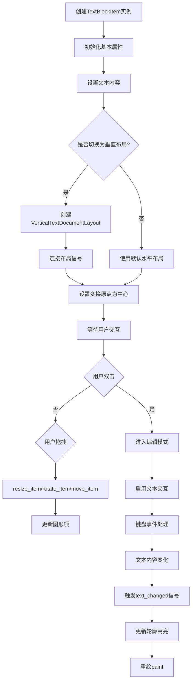

## 类结构

```
QGraphicsTextItem (Qt基类)
└── TextBlockItem (主类)
    ├── TextBlockState (数据类)
    ├── OutlineType (枚举)
    └── OutlineInfo (数据类)
    └── VerticalTextDocumentLayout (外部依赖)
```

## 全局变量及字段


### `TextBlockState.rect`
    
文本块的位置和尺寸坐标

类型：`tuple`
    


### `TextBlockState.rotation`
    
旋转角度

类型：`float`
    


### `TextBlockState.transform_origin`
    
变换原点

类型：`QPointF`
    


### `OutlineInfo.start`
    
轮廓起始位置

类型：`int`
    


### `OutlineInfo.end`
    
轮廓结束位置

类型：`int`
    


### `OutlineInfo.color`
    
轮廓颜色

类型：`QColor`
    


### `OutlineInfo.width`
    
轮廓宽度

类型：`float`
    


### `OutlineInfo.type`
    
轮廓类型

类型：`OutlineType`
    


### `TextBlockItem.text_color`
    
文本颜色

类型：`QColor`
    


### `TextBlockItem.outline`
    
是否启用轮廓

类型：`bool`
    


### `TextBlockItem.outline_color`
    
轮廓颜色

类型：`QColor`
    


### `TextBlockItem.outline_width`
    
轮廓宽度

类型：`float`
    


### `TextBlockItem.bold`
    
是否加粗

类型：`bool`
    


### `TextBlockItem.italic`
    
是否斜体

类型：`bool`
    


### `TextBlockItem.underline`
    
是否下划线

类型：`bool`
    


### `TextBlockItem.font_family`
    
字体家族

类型：`str`
    


### `TextBlockItem.font_size`
    
字体大小

类型：`float`
    


### `TextBlockItem.alignment`
    
对齐方式

类型：`Qt.AlignmentFlag`
    


### `TextBlockItem.line_spacing`
    
行间距

类型：`float`
    


### `TextBlockItem.direction`
    
文本方向

类型：`Qt.LayoutDirection`
    


### `TextBlockItem.layout`
    
垂直布局对象

类型：`VerticalTextDocumentLayout`
    


### `TextBlockItem.vertical`
    
是否垂直布局

类型：`bool`
    


### `TextBlockItem.selected`
    
是否被选中

类型：`bool`
    


### `TextBlockItem.resizing`
    
是否正在调整大小

类型：`bool`
    


### `TextBlockItem.resize_handle`
    
调整大小句柄位置

类型：`str`
    


### `TextBlockItem.resize_start`
    
调整大小起始位置

类型：`QPointF`
    


### `TextBlockItem.editing_mode`
    
是否在编辑模式

类型：`bool`
    


### `TextBlockItem.last_selection`
    
上次选中的文本

类型：`object`
    


### `TextBlockItem._drag_selecting`
    
是否正在拖拽选择

类型：`bool`
    


### `TextBlockItem._drag_select_anchor`
    
拖拽选择锚点

类型：`int`
    


### `TextBlockItem.rot_handle`
    
旋转句柄

类型：`object`
    


### `TextBlockItem.rotating`
    
是否正在旋转

类型：`bool`
    


### `TextBlockItem.last_rotation_angle`
    
上次旋转角度

类型：`float`
    


### `TextBlockItem.rotation_smoothing`
    
旋转平滑系数

类型：`float`
    


### `TextBlockItem.center_scene_pos`
    
中心场景位置

类型：`QPointF`
    


### `TextBlockItem.old_state`
    
旧状态

类型：`TextBlockState`
    


### `TextBlockItem.selection_outlines`
    
选中文本的轮廓列表

类型：`list`
    
    

## 全局函数及方法


### `TextBlockState.from_item`

这是一个类方法，用于从 `QGraphicsTextItem`（图形文本项）中提取当前的几何状态（位置、尺寸、旋转角度和变换原点），并将这些数据封装到一个不可变的 `TextBlockState` 数据类实例中。该方法主要用于实现撤销/重做（Undo/Redo）功能，以保存文本块在修改前的状态快照。

参数：

-  `item`：`QGraphicsTextItem`，从中提取状态的图形文本项对象（通常为 `TextBlockItem`）。

返回值：`TextBlockState`，包含提取出的矩形坐标、旋转角度和变换原点的状态对象。

#### 流程图

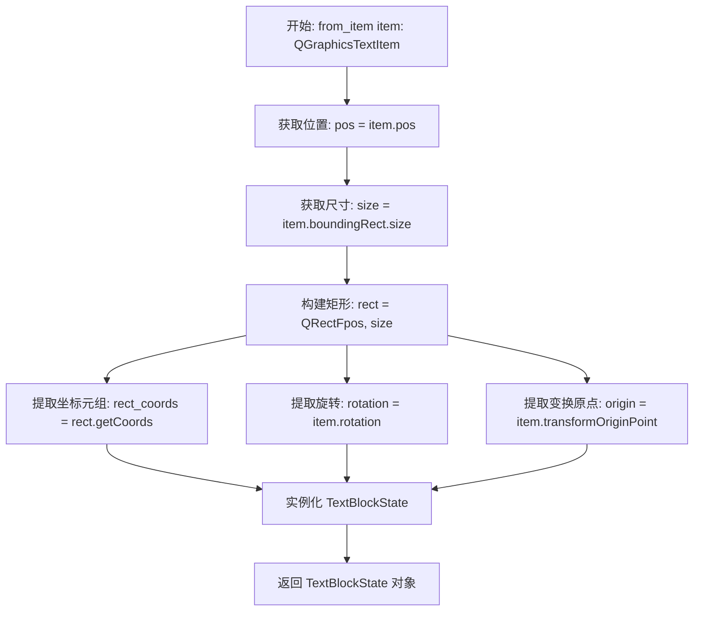

#### 带注释源码

```python
@classmethod
def from_item(cls, item: QGraphicsTextItem):
    """Create TextBlockState from a TextBlockItem"""
    
    # 1. 获取图形项的位置（场景坐标中的位置）
    # 2. 获取图形项的边界大小（宽和高）
    # 3. 将位置和大小组合成一个矩形对象 QRectF
    # 4. 调用 getCoords() 将矩形坐标转换为元组格式 (x1, y1, x2, y2)
    rect = QRectF(item.pos(), item.boundingRect().size()).getCoords()
    
    # 5. 获取图形项的当前旋转角度
    # 6. 获取图形项的变换原点（即旋转或缩放所围绕的中心点）
    # 7. 使用提取的属性构造并返回新的 TextBlockState 实例
    return cls(
        rect=rect,
        rotation=item.rotation(),
        transform_origin=item.transformOriginPoint()
    )
```


### `TextBlockItem.__init__`

该构造函数是 `TextBlockItem` 类的初始化方法，负责初始化图形文本项的所有属性、信号连接以及图形项的交互标志，是整个文本块组件的入口点。

参数：

- `text`：`str`，初始显示的文本内容，默认为空字符串
- `font_family`：`str`，字体家族名称，默认为空字符串（将使用应用默认字体）
- `font_size`：`int`，字体大小，默认为 20
- `render_color`：`QColor`，文本渲染颜色，默认为黑色 `QColor(0, 0, 0)`
- `alignment`：`Qt.AlignmentFlag`，文本对齐方式，默认为居中对齐 `Qt.AlignmentFlag.AlignCenter`
- `line_spacing`：`float`，行间距倍数，默认为 1.2
- `outline_color`：`QColor`，轮廓颜色，默认为白色 `QColor(255, 255, 255)`
- `outline_width`：`float`，轮廓宽度，默认为 1
- `bold`：`bool`，是否加粗，默认为 False
- `italic`：`bool`，是否斜体，默认为 False
- `underline`：`bool`，是否下划线，默认为 False
- `direction`：`Qt.LayoutDirection`，文本方向，默认为从左到右 `Qt.LayoutDirection.LeftToRight`

返回值：`None`，该方法为构造函数，不返回任何值

#### 流程图

```mermaid
flowchart TD
    A[开始 __init__] --> B[调用父类构造函数 super().__init__text]
    B --> C[设置文本样式属性]
    C --> D[text_color, outline相关属性]
    D --> E[font_family, font_size等字体属性]
    E --> F[alignment, line_spacing, direction]
    F --> G[初始化布局和编辑状态]
    G --> H[layout=None, vertical=False]
    H --> I[selected, editing_mode等状态标志]
    I --> J[旋转相关属性初始化]
    J --> K[设置QGraphicsItem标志和属性]
    K --> L[setAcceptHoverEvents True]
    L --> M[setTextInteractionFlags NoTextInteraction]
    M --> N[设置ItemIsMovable和ItemIsSelectable]
    N --> O[设置Cursor为PointingHandCursor]
    O --> P[连接contentsChanged信号]
    P --> Q[设置变换原点为中心点]
    Q --> R[设置缓存模式和Z值]
    R --> S[调用_apply_text_direction设置文本方向]
    S --> T[结束 __init__]
```

#### 带注释源码

```python
def __init__(self, 
             text = "", 
             font_family = "", 
             font_size = 20, 
             render_color = QColor(0, 0, 0), 
             alignment = Qt.AlignmentFlag.AlignCenter, 
             line_spacing = 1.2, 
             outline_color = QColor(255, 255, 255), 
             outline_width = 1,
             bold=False, 
             italic=False, 
             underline=False,
             direction=Qt.LayoutDirection.LeftToRight):
    """
    构造函数，初始化TextBlockItem的所有属性和信号连接
    
    参数:
        text: 初始文本内容
        font_family: 字体家族
        font_size: 字体大小
        render_color: 文本颜色
        alignment: 对齐方式
        line_spacing: 行间距
        outline_color: 轮廓颜色
        outline_width: 轮廓宽度
        bold: 是否加粗
        italic: 是否斜体
        underline: 是否下划线
        direction: 文本方向
    """
    
    # 调用父类QGraphicsTextItem的构造函数，传入初始文本
    super().__init__(text)
    
    # ==================== 样式属性初始化 ====================
    self.text_color = render_color  # 文本颜色
    # 根据是否有轮廓颜色来决定是否启用轮廓
    self.outline = True if outline_color else False
    self.outline_color = outline_color  # 轮廓颜色
    self.outline_width = outline_width  # 轮廓宽度
    self.bold = bold  # 加粗状态
    self.italic = italic  # 斜体状态
    self.underline = underline  # 下划线状态
    self.font_family = font_family  # 字体家族
    self.font_size = font_size  # 字体大小
    self.alignment = alignment  # 对齐方式
    self.line_spacing = line_spacing  # 行间距
    self.direction = direction  # 文本方向

    # ==================== 布局和编辑状态 ====================
    self.layout = None  # 自定义布局对象（用于垂直文本）
    self.vertical = False  # 是否为垂直文本模式

    # ==================== 交互状态标志 ====================
    self.selected = False  # 是否被选中
    self.resizing = False  # 是否正在调整大小
    self.resize_handle = None  # 调整大小的手柄位置
    self.resize_start = None  # 调整大小的起始位置
    self.editing_mode = False  # 是否处于编辑模式
    self.last_selection = None  # 上一次的选区
    self._drag_selecting = False  # 是否正在拖拽选择文本
    self._drag_select_anchor = None  # 拖拽选择的锚点

    # ==================== 旋转属性 ====================
    self.rot_handle = None  # 旋转手柄
    self.rotating = False  # 是否正在旋转
    self.last_rotation_angle = 0  # 上一次的旋转角度
    self.rotation_smoothing = 1.0  # 旋转灵敏度/平滑系数
    self.center_scene_pos = None  # 中心点的场景坐标

    # ==================== 状态追踪 ====================
    self.old_state = None  # 用于撤销功能的状态记录

    # ==================== 选区轮廓 ====================
    self.selection_outlines = []  # 存储选区轮廓信息

    # ==================== 设置QGraphicsItem属性 ====================
    self.setAcceptHoverEvents(True)  # 启用悬停事件
    # 初始禁用文本交互，需要通过双击或代码进入编辑模式
    self.setTextInteractionFlags(Qt.TextInteractionFlag.NoTextInteraction)
    # 设置ItemIsMovable标志，允许用户拖动文本块
    self.setFlag(QGraphicsTextItem.GraphicsItemFlag.ItemIsMovable, True)
    # 设置ItemIsSelectable标志，允许用户选中文本块
    self.setFlag(QGraphicsTextItem.GraphicsItemFlag.ItemIsSelectable, True)
    # 设置鼠标指针为手型
    self.setCursor(QCursor(Qt.CursorShape.PointingHandCursor))
    
    # 连接文本内容改变信号到处理槽函数
    self.document().contentsChanged.connect(self._on_text_changed)
    # 设置变换原点为包围盒中心，用于旋转
    self.setTransformOriginPoint(self.boundingRect().center())
    # 使用设备坐标缓存提高渲染性能
    self.setCacheMode(QGraphicsItem.CacheMode.DeviceCoordinateCache)
    # 设置Z值为1，确保在场景中的层级
    self.setZValue(1)

    # ==================== 应用初始文本方向 ====================
    # 设置初始的文本方向（从左到右或从右到左）
    self._apply_text_direction()
```


### `TextBlockItem.set_vertical`

该方法用于切换文本块的布局模式，在垂直排版（用于漫画文本等场景）和标准水平排版之间进行切换，并处理相关的信号连接、布局对象替换以及图形项的几何状态更新。

参数：
-  `vertical`：`bool`，指定目标布局模式，`True` 表示启用垂直布局，`False` 表示切换回水平布局

返回值：`None`，该方法不返回任何值，仅执行状态变更和 UI 更新。

#### 流程图

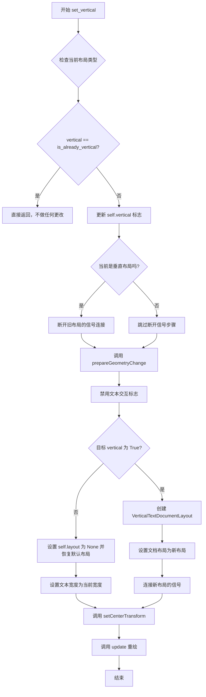

#### 带注释源码

```python
def set_vertical(self, vertical: bool):
    """
    切换文本块的垂直/水平布局模式。
    
    Args:
        vertical (bool): True 表示启用垂直布局，False 表示使用水平布局。
    """
    # 获取关联的文档对象
    doc = self.document()
    
    # 检查当前是否已经应用了垂直布局
    is_already_vertical = isinstance(doc.documentLayout(), VerticalTextDocumentLayout)

    # 如果目标状态与当前状态一致，则无需执行任何操作
    if vertical == is_already_vertical:
        return

    # 更新内部的垂直状态标志
    self.vertical = vertical

    # 如果当前是垂直模式，则断开与旧布局的信号连接
    # 防止切换后旧布局的信号触发已移除的回调
    if is_already_vertical:
        old_layout = doc.documentLayout()
        if old_layout:
            try:
                old_layout.size_enlarged.disconnect(self.on_document_enlarged)
                old_layout.documentSizeChanged.disconnect(self.setCenterTransform)
            except (TypeError, RuntimeError): # 信号未连接或已断开
                pass
    
    # 通知图形系统该项的几何形状即将改变，必须在改变尺寸前调用
    self.prepareGeometryChange()
    # 记录切换前的边界矩形，用于恢复水平模式时的宽度设置
    current_rect = self.boundingRect()

    # 在切换布局期间禁用文本交互，防止用户输入导致状态不一致
    self.setTextInteractionFlags(Qt.TextInteractionFlag.NoTextInteraction)
    
    # 暂时阻塞当前布局的信号，防止在切换过程中触发更新
    if doc.documentLayout():
        doc.documentLayout().blockSignals(True)

    # 分支处理：切换到垂直模式 或 切换回水平模式
    if vertical:
        # 创建自定义的垂直文档布局对象
        layout = VerticalTextDocumentLayout(
            document=doc,
            line_spacing=self.line_spacing,
        )
        self.layout = layout
        # 将文档的布局方式设置为垂直布局
        doc.setDocumentLayout(layout)
        
        # 连接新布局的信号，以便在文档大小变化时调整图形项
        layout.size_enlarged.connect(self.on_document_enlarged)
        layout.documentSizeChanged.connect(self.setCenterTransform)
        
        # 注意：此处通常需要根据 current_rect 设置布局的最大尺寸，
        # 但对于空文本项，直接设置可能导致布局坍塌，因此视情况取消注释。
        # layout.set_max_size(current_rect.width(), current_rect.height())
        # layout.update_layout()

    else:  
        # 切换回水平布局：清除自定义布局引用
        self.layout = None
        # Qt 会自动恢复默认的标准布局（水平）
        doc.setDocumentLayout(None)  
        # 恢复水平模式下的文本宽度限制
        self.setTextWidth(current_rect.width())
    
    # 布局切换完成后，更新图元的变换中心点（通常为中心）
    # 并触发重绘以应用新的布局效果
    self.setCenterTransform()
    self.update()
```


### `TextBlockItem.setCenterTransform`

设置变换原点为边界矩形的中心点，确保旋转和缩放等几何变换操作以文本块的视觉中心为基准进行，避免因变换原点默认在左上角而导致不符合预期的旋转或缩放行为。

**参数：** 无

**返回值：** `None`，该方法为 void 类型，不返回任何值

#### 流程图

```mermaid
flowchart TD
    A[开始 setCenterTransform] --> B[获取当前边界矩形: self.boundingRect]
    B --> C[计算边界矩形中心点: center = self.boundingRect().center]
    C --> D[设置变换原点: self.setTransformOriginPoint(center)]
    D --> E[结束]
```

#### 带注释源码

```python
def setCenterTransform(self):
    """
    设置变换原点为边界矩形的中心点。
    
    该方法确保文本块的旋转、缩放等几何变换操作以视觉中心为基准，
    而非默认的左上角，从而提供更符合直觉的用户交互体验。
    
    典型调用场景：
    - 切换垂直/水平布局后
    - 文档尺寸发生变化时（on_document_enlarged）
    """
    # 获取当前文本块的边界矩形，并计算其中心点坐标
    center = self.boundingRect().center()
    
    # 调用 Qt 的 setTransformOriginPoint 方法，将变换原点设置为计算得到的中心点
    # 这会影响后续所有旋转、缩放操作的参考点
    self.setTransformOriginPoint(center)
```


### `TextBlockItem.on_document_enlarged`

该方法是一个槽函数（Slot），用于响应垂直文本布局（`VerticalTextDocumentLayout`）发出的 `size_enlarged` 信号。当文本内容增加导致垂直布局的高度扩展时，此回调会被触发。其核心职责是通知 Qt 图形系统几何属性即将发生变化，并重新计算项目的变换原点（Transform Origin Point），确保旋转和缩放操作始终基于项目当前的视觉中心进行，防止中心点漂移。

参数：

- （无，此方法不接受任何外部参数，仅处理实例自身状态）

返回值：`None`（无返回值/Python Void）

#### 流程图

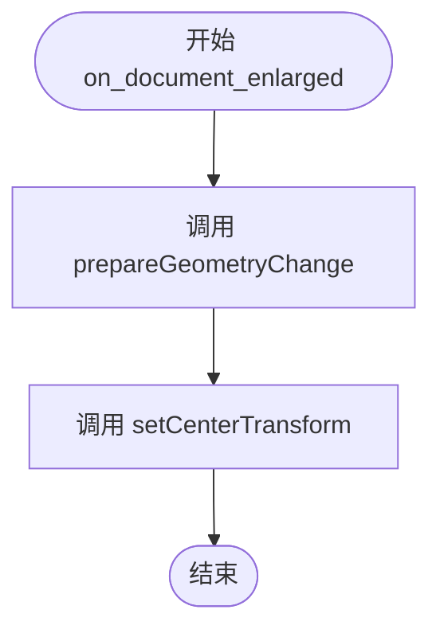

#### 带注释源码

```python
def on_document_enlarged(self):
    """
    当垂直文档布局尺寸增大时被调用。
    用于处理由于文本增长导致的图形项目尺寸变化。
    """
    # 1. 通知图形系统该项目的几何形状即将改变。
    # 这是一个关键操作，用于避免在项目大小改变时产生渲染错误或
    # 视图/场景更新时的视觉闪烁。它确保Qt能够正确重新计算项目的边界。
    self.prepareGeometryChange()

    # 2. 重新设置变换原点为中心。
    # 当布局高度增加时，项目的边界框（Bounding Rect）会改变。
    # 为了保证旋转（rotate）或缩放（scale）操作始终围绕项目的
    # 视觉中心进行，必须根据新的边界框中心更新变换原点。
    self.setCenterTransform()
```


### `TextBlockItem._apply_text_direction`

该方法用于将实例属性 `direction`（文本方向）应用到文档的默认文本选项中，以确保文本渲染按照指定的方向（如从左到右或从右到左）排列。

参数：

- 该方法无显式参数（仅包含隐式参数 `self`，指向 `TextBlockItem` 实例本身）。

返回值：`None`，无返回值（该方法直接修改文档的内部状态）。

#### 流程图

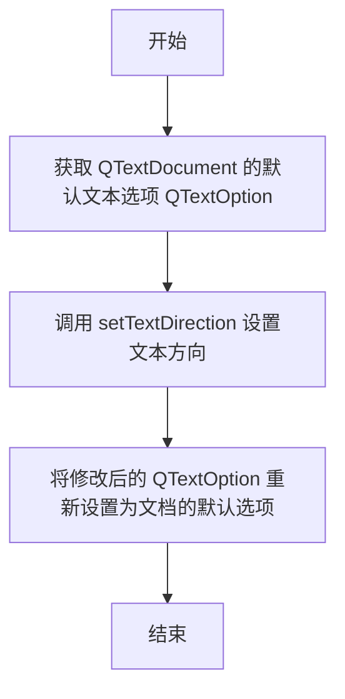

#### 带注释源码

```python
def _apply_text_direction(self):
    """
    应用当前实例的文本方向设置到文档的默认文本选项。
    此方法为内部方法，供 set_direction 和 __init__ 调用，
    用于同步 Qt 文档的文本方向与类属性 self.direction。
    """
    # 步骤1: 获取文档当前的默认文本选项对象
    # QTextOption 控制文档的排版行为，包括文本方向、对齐等
    text_option = self.document().defaultTextOption()
    
    # 步骤2: 修改文本选项的方向属性
    # self.direction 来自 Qt.LayoutDirection 枚举
    # 例如 Qt.LayoutDirection.LeftToRight 或 Qt.LayoutDirection.RightToLeft
    text_option.setTextDirection(self.direction)
    
    # 步骤3: 将修改后的选项重新应用到文档
    # 这一步是必要的，因为 QTextOption 是值类型，需要显式写回
    self.document().setDefaultTextOption(text_option)
```


### `TextBlockItem.set_direction`

该方法用于设置 `TextBlockItem`（文本块图形项）的文本布局方向（如从左到右或从右到左）。它会检查新方向是否与当前方向不同，如果不同，则更新内部状态、调用内部方法应用到底层文档，并请求界面重绘。

**参数：**

- `direction`：`Qt.LayoutDirection`，指定文本的排列方向（例如 `Qt.LayoutDirection.LeftToRight` 或 `Qt.LayoutDirection.RightToLeft`）。

**返回值：** `None`，无返回值。

#### 流程图

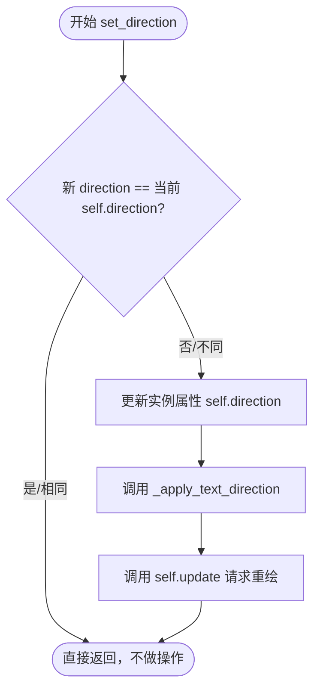

#### 带注释源码

```python
def set_direction(self, direction):
    """
    设置文本方向。
    
    参数:
        direction (Qt.LayoutDirection): 文本的布局方向。
    """
    # 检查传入的方向是否与当前存储的方向不同，避免不必要的文档操作和重绘
    if self.direction != direction:
        self.direction = direction  # 1. 更新实例变量
        self._apply_text_direction() # 2. 将设置应用到底层的 QTextDocument
        self.update()                # 3. 触发 Qt 图形系统的重绘事件

def _apply_text_direction(self):
    """
    内部方法。
    将当前的方向设置应用到文档的默认文本选项（QTextOption）中，
    从而改变光标移动和文本对齐的基准方向。
    """
    # 获取文档的默认文本选项
    text_option = self.document().defaultTextOption()
    # 设置文本方向
    text_option.setTextDirection(self.direction)
    # 重新应用选项到文档
    self.document().setDefaultTextOption(text_option)
```


### `TextBlockItem.set_text`

该方法是文本块组件的核心文本设置接口。它负责判断输入的文本内容是HTML格式还是纯文本，并根据不同的类型执行相应的渲染逻辑。对于HTML内容，它会强制应用指定的宽度和边框样式；对于纯文本，则应用预设的所有文本属性。

参数：

- `text`：`str`，要设置的文本内容，可以是包含HTML标签的富文本字符串，也可以是普通的纯文本字符串。
- `width`：`float`，文本块的显示宽度。对于HTML文本，会直接应用此宽度；对于纯文本，宽度通常由内容自动计算（但受布局影响）。

返回值：`None`，该方法直接修改对象状态，不返回任何值。

#### 流程图

```mermaid
flowchart TD
    A[Start: set_text] --> B{is_html(text)?}
    B -->|Yes| C[setHtml(text)]
    C --> D[setTextWidth(width)]
    D --> E[set_outline<br>(self.outline_color, self.outline_width)]
    E --> F[End]
    B -->|No| G[set_plain_text(text)]
    G --> H[apply_all_attributes<br>-> update_text_width]
    H --> F
```

#### 带注释源码

```python
def set_text(self, text, width):
    # 判断传入的文本是否为HTML格式（通过正则检测是否包含尖括号标签）
    if self.is_html(text):
        # 如果是HTML，则使用Qt的setHtml方法渲染富文本
        self.setHtml(text)
        # 强制设置文本宽度为指定的width参数
        self.setTextWidth(width)
        # 应用当前对象存储的边框颜色和宽度配置
        self.set_outline(self.outline_color, self.outline_width)
    else:
        # 如果是纯文本，则调用专门的纯文本处理方法
        # 该方法内部会调用 apply_all_attributes 来应用字体、颜色等属性
        self.set_plain_text(text)
```


### `TextBlockItem.set_plain_text`

设置纯文本内容，并在设置后立即重新应用实例当前保存的所有格式属性（如字体、颜色、边框样式等），确保文本内容与视觉属性保持同步。

参数：

-  `text`：`str`，要设置的纯文本内容。

返回值：`None`，无返回值。

#### 流程图

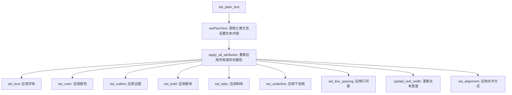

#### 带注释源码

```python
def set_plain_text(self, text):
    """
    设置纯文本内容。

    此方法是修改文本内容的主要入口点之一。
    它首先调用 Qt 基类的 setPlainText 方法更新实际文本，
    然后调用 apply_all_attributes 确保之前设置的字体、颜色、
    边框等属性不会被重置，并应用到新的文本上。
    """
    # 1. 调用父类 (QGraphicsTextItem) 的方法设置纯文本
    self.setPlainText(text)
    
    # 2. 重新应用实例的所有属性（字体、颜色、加粗、斜体、下划线、行高、对齐、边框等）
    # 这是为了保证在修改文本后，之前的样式设置不会丢失
    self.apply_all_attributes()
```


### `TextBlockItem.is_html`

用于判断传入的文本字符串是否包含HTML标签。该方法通过正则表达式 `r'<[^>]+>'` 检测字符串中是否存在HTML标记，主要在 `set_text` 方法中被调用，以决定使用Qt的 `setHtml` 还是 `setPlainText` 方法来渲染文本。

参数：

-  `text`：`str`，需要进行HTML格式检查的文本内容。

返回值：`bool`，如果文本中包含HTML标签则返回 `True`，否则返回 `False`。

#### 流程图

```mermaid
flowchart TD
    Start([输入 text]) --> RegexMatch{正则匹配 r'<[^>]+>'}
    RegexMatch -- 找到匹配 --> ReturnTrue[返回 True]
    RegexMatch -- 未找到匹配 --> ReturnFalse[返回 False]
```

#### 带注释源码

```python
def is_html(self, text):
    import re
    # 简单检查HTML标签：查找是否存在 < 开头且 > 结尾的标签结构
    return bool(re.search(r'<[^>]+>', text))
```


### `TextBlockItem.set_font`

设置文本块的字体家族和大小，当没有文本选中时更新实例属性，并应用字体格式到整个文档。

参数：

- `font_family`：`str`，字体家族名称（如 "Arial", "SimSun" 等）
- `font_size`：`float`，字体大小（磅值）

返回值：`None`，无返回值（该方法直接修改对象状态并通过 `update_text_format` 触发界面更新）

#### 流程图

```mermaid
flowchart TD
    A[开始 set_font] --> B{检查 textCursor 是否有选区}
    B -->|有选区| C[不更新实例属性]
    B -->|无选区| D[更新 self.font_family = font_family]
    D --> E[更新 self.font_size = font_size]
    E --> F[font_size = max&#40;1, font_size&#41; 保证最小字号为1]
    F --> G{font_family 是否有效}
    G -->|是有效字符串| H[effective_family = font_family.strip&#40;&#41;]
    G -->|否| I[effective_family = QApplication.font&#40;&#41;.family&#40;&#41;]
    H --> J[创建 QFont 对象]
    I --> J
    J --> K[调用 update_text_format&#40;'font', font&#41; 应用字体]
    K --> L[结束]
```

#### 带注释源码

```python
def set_font(self, font_family, font_size):
    """
    设置文本块的字体家族和大小。
    
    当文本控件中存在选区时，仅应用格式而不更新实例属性；
    无选区时则同时更新实例属性和文档格式。
    
    参数:
        font_family: 字体家族名称字符串
        font_size: 字体大小（浮点数）
    """
    # 检查当前文本是否有选区
    if not self.textCursor().hasSelection():
        # 无选区时更新实例属性，保存用户设置的字体偏好
        self.font_family = font_family
        self.font_size = font_size

    # Ensure minimum font size.
    # 确保字号至少为1，防止无效的字体大小导致渲染错误
    font_size = max(1, font_size)

    # Fallback to application default font family if none provided
    # 处理空字体名称：如果未提供有效字体家族，回退到应用程序默认字体
    effective_family = font_family.strip() if isinstance(font_family, str) and font_family.strip() else QApplication.font().family()
    
    # 创建 QFont 对象，使用处理后的字体家族和字号
    font = QFont(effective_family, font_size)
    
    # 调用通用格式更新方法，将字体应用到文档
    # 该方法会同时更新当前选区（若有）和文档默认格式
    self.update_text_format('font', font)
```


### `TextBlockItem.set_font_size`

该方法用于设置 TextBlockItem 的字体大小。如果当前文本没有选中内容，则更新实例的 font_size 属性；无论是否有选中，都会通过 update_text_format 方法更新文档中文本的字体格式。

参数：
-  `font_size`：`float`，要设置的字体大小值

返回值：`None`，该方法没有返回值

#### 流程图

```mermaid
flowchart TD
    A[开始 set_font_size] --> B{font_size < 1?}
    B -- 是 --> C[font_size = max(1, font_size)]
    B -- 否 --> D{hasSelection?}
    C --> D
    D -- 否 --> E[更新 self.font_size = font_size]
    D -- 是 --> F[不更新 self.font_size]
    E --> G[调用 update_text_format 'size', font_size]
    F --> G
    G --> H[结束]
```

#### 带注释源码

```python
def set_font_size(self, font_size):
    """
    设置字体大小。

    参数:
        font_size (float): 新的字体大小值。

    注意:
        - 确保字体大小至少为 1。
        - 如果文本有选中内容，只更新选中部分的格式，不更新实例属性 self.font_size。
        - 如果没有选中内容，则同时更新实例属性和文档格式。
    """
    # 确保字体大小不小于 1，防止无效的字体大小
    font_size = max(1, font_size)
    
    # 检查文本光标是否有选中的内容
    if not self.textCursor().hasSelection():
        # 没有选中时，更新实例的 font_size 属性
        self.font_size = font_size
    
    # 无论是否有选中，都调用 update_text_format 更新文档中的文本格式
    # update_text_format 会处理具体的字符格式应用逻辑
    self.update_text_format('size', font_size)
```


### `TextBlockItem.update_text_width`

该方法用于自动更新文本块的宽度，使其与文档内容的实际宽度保持同步。通常在文本内容或格式发生变化后调用，以确保文本项的边界框与文档内容匹配。

参数：
- （无参数，仅 `self` 隐式参数）

返回值：`None`，该方法无返回值，仅修改对象内部状态。

#### 流程图

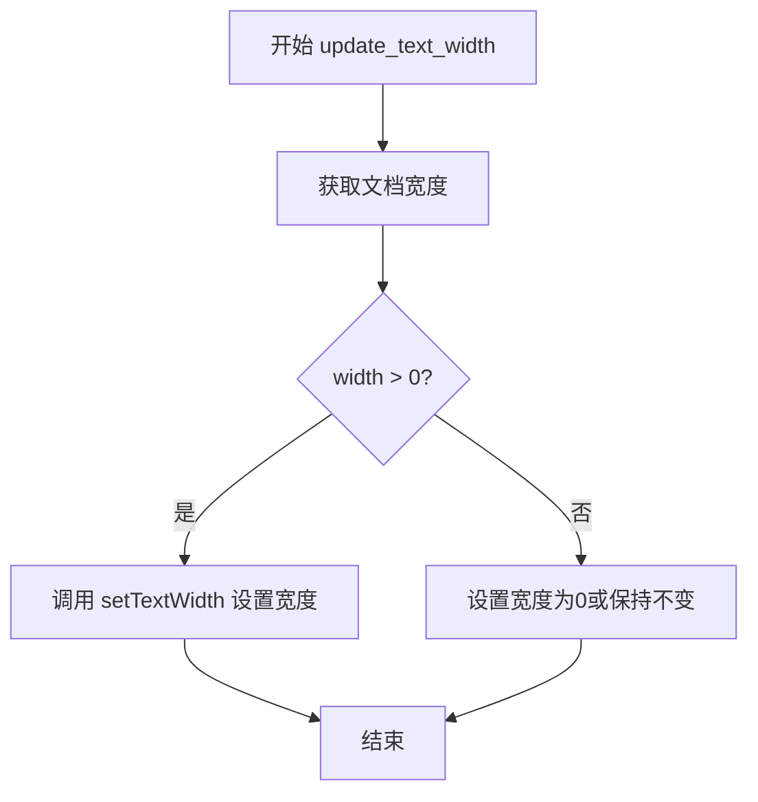

#### 带注释源码

```python
def update_text_width(self):
    """
    更新文本块的宽度以匹配文档内容的实际宽度。
    
    该方法通过获取文档的当前宽度（考虑了字体、行间距等因素），
    并将其设置为文本项的文本宽度，从而确保文本项的几何形状
    与其内容相匹配。
    """
    # 获取文档的尺寸对象，包含 width 和 height
    # width 值会根据文本内容、自动换行、字体大小等自动计算
    width = self.document().size().width()
    
    # 设置文本项的文本宽度
    # 这会影响 boundingRect() 的返回值，进而影响图形项的视觉呈现
    # Qt 会根据此宽度重新计算文本的布局和换行
    self.setTextWidth(width)
```


### `TextBlockItem.set_alignment`

该方法用于设置文本块（TextBlockItem）的文本对齐方式。它首先检查当前文本光标是否有选中文本，如果没有，则更新实例的 `alignment` 属性。随后，它调用内部方法 `update_alignment` 将对齐格式应用到选中的文本区域或整个文档，并触发视图重绘。

参数：

-  `alignment`：`Qt.AlignmentFlag`，指定文本的对齐方式（例如 `Qt.AlignmentFlag.AlignLeft`、`Qt.AlignmentFlag.AlignCenter` 等）。

返回值：`None`，该方法不返回任何值。

#### 流程图

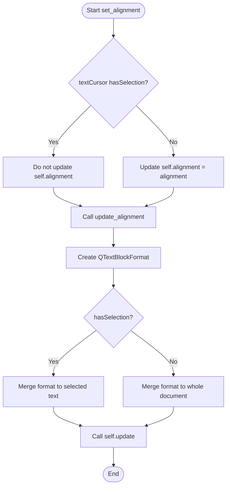

#### 带注释源码

```python
def set_alignment(self, alignment):
    """
    设置文本块的对齐方式。
    
    如果当前没有选中文本，则更新实例的 alignment 属性。
    无论是否有选中，都会调用 update_alignment 来应用格式。
    """
    # 只有在没有选中文本的情况下才更新内部存储的状态。
    # 如果有选中文本，为了避免在清除选区时覆盖特定的格式偏好，这里不更新 self.alignment。
    if not self.textCursor().hasSelection():
        self.alignment = alignment
    
    # 调用内部方法执行具体的格式应用逻辑
    self.update_alignment(alignment)


def update_alignment(self, alignment):
    """
    内部方法：实际应用对齐格式到 QTextDocument。
    """
    cursor = self.textCursor()
    has_selection = cursor.hasSelection()
    
    # 创建块格式并设置对齐
    block_format = cursor.blockFormat()
    block_format.setAlignment(alignment)

    if has_selection:
        # 如果有选中文本，只对选中的部分应用对齐
        cursor.beginEditBlock()
        start, end = cursor.selectionStart(), cursor.selectionEnd()
        cursor.setPosition(start)
        cursor.setPosition(end, QTextCursor.KeepAnchor)
        cursor.mergeBlockFormat(block_format)
        cursor.endEditBlock()
    else:
        # 如果没有选中文本，对整个文档应用对齐
        doc = self.document()
        cursor = QTextCursor(doc)
        cursor.select(QTextCursor.SelectionType.Document)
        cursor.mergeBlockFormat(block_format)

    # 触发重绘以显示更改
    self.update()
```


### `TextBlockItem.update_alignment`

该方法负责实际执行文本对齐的逻辑。它根据当前文本光标是否存在选中文本，分别处理两种情况：若存在选中区，则仅对选中的文本块（段落）应用对齐格式；若不存在选中区（光标在文档中无选中），则创建一个新的光标并将对齐格式应用于整个文档。操作完成后，调用 `update()` 触发视图重绘以显示新的对齐效果。

参数：
-  `alignment`：`Qt.AlignmentFlag`，指定文本的对齐方式（例如 `Qt.AlignmentFlag.AlignLeft`, `Qt.AlignmentFlag.AlignCenter`, `Qt.AlignmentFlag.AlignRight`）。

返回值：`None`，该方法不返回值。

#### 流程图

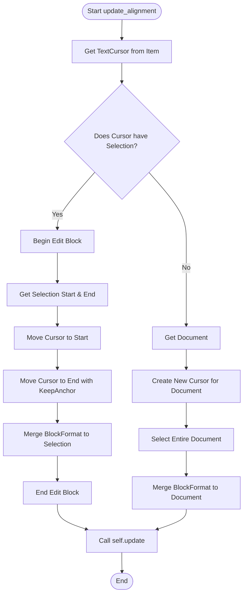

#### 带注释源码

```python
def update_alignment(self, alignment):
    """
    执行文本对齐的底层更新逻辑。
    :param alignment: Qt.AlignmentFlag, 目标对齐方式
    """
    # 1. 获取当前的文本光标
    cursor = self.textCursor()
    
    # 2. 检查光标当前是否选中了文本
    has_selection = cursor.hasSelection()
    
    # 3. 创建一个 QTextBlockFormat 对象并设置对齐属性
    block_format = cursor.blockFormat()
    block_format.setAlignment(alignment)

    # 4. 根据是否有选中文本进行不同的处理
    if has_selection:
        # --- 情况A：存在选中文本 ---
        # 开启编辑块（通常用于将多个操作合并为一个undo/redo步骤）
        cursor.beginEditBlock()
        
        # 获取选区的起始和结束位置
        start, end = cursor.selectionStart(), cursor.selectionEnd()
        
        # 将光标移动到选区起始位置
        cursor.setPosition(start)
        # 将光标扩展到选区结束位置（形成选中状态）
        cursor.setPosition(end, QTextCursor.KeepAnchor)
        
        # 将包含对齐信息的 block_format 合并到选中的文本块
        cursor.mergeBlockFormat(block_format)
        
        # 结束编辑块
        cursor.endEditBlock()
    else:
        # --- 情况B：无选中文本，应用于整个文档 ---
        doc = self.document()
        
        # 创建一个新的光标指向整个文档
        cursor = QTextCursor(doc)
        cursor.select(QTextCursor.SelectionType.Document)
        
        # 将对齐格式应用于整个文档的所有段落
        cursor.mergeBlockFormat(block_format)

    # 5. 强制重绘该图形项以显示更改
    self.update()
```


### `TextBlockItem.update_text_format`

该方法负责更新文本块内部文本的格式属性。它支持对选中文本应用特定格式，如果没有选中文本，则将格式应用于整个文档。此外，它还会尝试更新文档的默认格式（字体、颜色、大小），以确保新输入的文本也遵循最新的格式设置。

参数：

- `attribute`：`str`，需要更新的格式属性名称。必须是 `format_operations` 字典中定义的键（如 `'color'`, `'font'`, `'size'`, `'bold'`, `'italic'`, `'underline'`）。
- `value`：任意类型（`Any`），要设置的属性值。类型取决于 `attribute`（例如：`QColor` 用于颜色，`QFont` 用于字体，`int` 用于大小，`bool` 用于粗体/斜体/下划线状态）。

返回值：`None`，该方法无返回值，主要通过修改 `QTextDocument` 的内部状态和触发视图重绘来生效。

#### 流程图

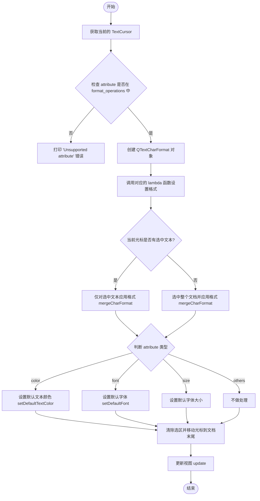

#### 带注释源码

```python
def update_text_format(self, attribute, value):
    """
    更新文本格式属性。

    参数:
        attribute (str): 属性名 ('color', 'font', 'size', 'bold', 'italic', 'underline').
        value: 属性值.
    """
    cursor = self.textCursor()
    has_selection = cursor.hasSelection()

    # 定义属性名到格式设置函数的映射
    format_operations = {
        'color': lambda cf, v: cf.setForeground(v),
        'font': lambda cf, v: cf.setFont(v),
        'size': lambda cf, v: cf.setFontPointSize(v),
        'bold': lambda cf, v: cf.setFontWeight(QFont.Bold if v else QFont.Normal),
        'italic': lambda cf, v: cf.setFontItalic(v),
        'underline': lambda cf, v: cf.setFontUnderline(v),
    }

    # 检查是否支持该属性
    if attribute not in format_operations:
        print(f"Unsupported attribute: {attribute}")
        return

    # 1. 构造字符格式对象
    char_format = QTextCharFormat()
    format_operations[attribute](char_format, value)

    # 2. 应用格式
    # 如果没有选中文本，则视为设置整个文档的默认格式
    if not has_selection:
        cursor.select(QTextCursor.SelectionType.Document)    

    # 将格式合并到光标所在的文本区域
    cursor.mergeCharFormat(char_format)

    # 3. 更新文档的默认格式 (影响后续输入的文本)
    doc_format = self.document().defaultTextOption()
    if attribute == 'color':
        self.setDefaultTextColor(value)
    elif attribute == 'font':
        self.document().setDefaultFont(value)
    elif attribute == 'size':
        font = self.document().defaultFont()
        font.setPointSize(value)
        self.document().setDefaultFont(font)
    
    # 4. 清理选区并将光标移至末尾
    # 清除选择状态，防止光标停留在选区位置
    cursor.clearSelection()
    cursor.movePosition(QTextCursor.End)

    self.setTextCursor(cursor)
    self.document().setDefaultTextOption(doc_format)
    # 5. 触发重绘
    self.update()
```


### `TextBlockItem.set_line_spacing`

该方法用于设置文本块内的行间距。它通过操作 Qt 文档的 `QTextBlockFormat` 来实现，将输入的倍数（如 1.2）转换为 Qt 所需的百分比形式（120%），并将其应用到整个文档的段落格式中。

参数：

-  `spacing`：`float`，行间距倍数（例如 1.0 表示单倍行距，1.5 表示 1.5 倍行距）。

返回值：`None` (无返回值)，该方法直接修改内部文本文档的状态。

#### 流程图

```mermaid
graph TD
    A[Start: set_line_spacing] --> B[Update internal state: self.line_spacing = spacing]
    B --> C[Get QTextDocument: doc = self.document()]
    C --> D[Create QTextCursor: cursor = QTextCursor(doc)]
    D --> E[Select entire document]
    E --> F[Create QTextBlockFormat: block_format = QTextBlockFormat()]
    F --> G[Convert spacing: spacing = spacing * 100]
    G --> H[Set Line Height on Format: block_format.setLineHeight(spacing, ProportionalHeight)]
    H --> I[Merge format to document: cursor.mergeBlockFormat(block_format)]
    I --> J[End]
```

#### 带注释源码

```python
def set_line_spacing(self, spacing: float):
    """
    设置文本的行间距。

    参数:
        spacing (float): 行间距倍数。例如 1.0 为单倍行距，1.5 为 1.5 倍行距。
    """
    # 1. 更新实例属性，保存当前设置的行间距值
    self.line_spacing = spacing
    
    # 2. 获取关联的 Qt 文档对象
    doc = self.document()
    
    # 3. 创建一个光标对象，用于操作文档内容
    cursor = QTextCursor(doc)
    
    # 4. 选中整个文档，以便后续格式化操作作用于所有文本
    cursor.select(QTextCursor.SelectionType.Document)
    
    # 5. 创建块级格式对象 (QTextBlockFormat)，用于控制段落属性（行距是段落属性）
    block_format = QTextBlockFormat()
    
    # 6. 将输入的倍数转换为百分比。
    # Qt 的 LineHeightTypes.ProportionalHeight 需要百分比值 (例如 120 代表 120%)
    spacing = spacing * 100
    
    # 7. 确保数值类型为浮点数 (PySide6/Qt API 要求)
    spacing = float(spacing)
    
    # 8. 设置行高。
    # 第一个参数是行高值，第二个参数指定类型为 proportional (比例)
    block_format.setLineHeight(spacing, QTextBlockFormat.LineHeightTypes.ProportionalHeight.value)
    
    # 9. 将格式合并到光标所选的内容（即整个文档）中去
    cursor.mergeBlockFormat(block_format)
```


### `TextBlockItem.set_color`

设置文本块的文本颜色。如果当前有选中的文本，则仅对选中部分应用颜色；如果没有选中，则同时更新实例属性 `text_color` 以便后续使用（如粘贴新文本时）。

参数：

- `color`：`QColor`，要设置的文本颜色值

返回值：`None`，无返回值（Python 方法默认返回 None）

#### 流程图

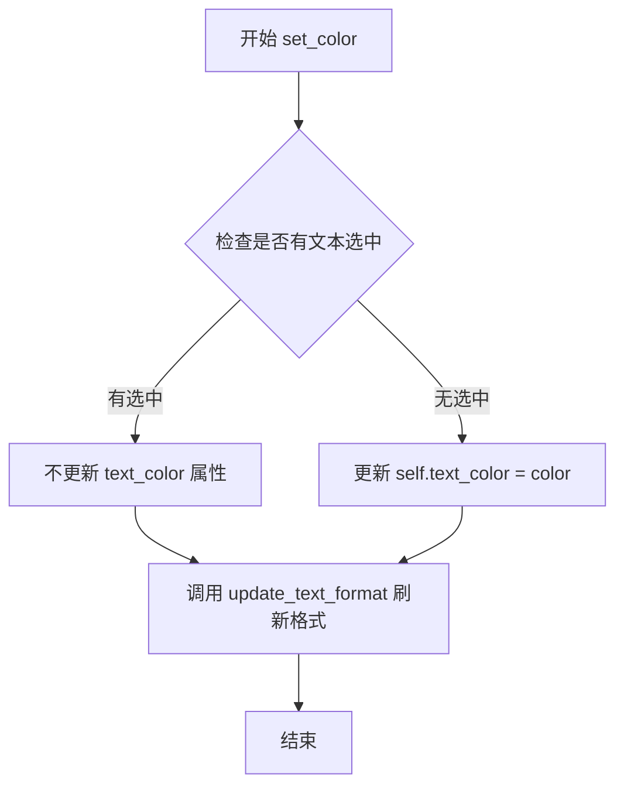

#### 带注释源码

```python
def set_color(self, color):
    """
    设置文本块的文本颜色。
    
    如果当前有选中的文本，仅对选中部分应用颜色；
    如果没有选中任何文本，则同时更新实例属性 text_color，
    以便后续操作（如粘贴文本）时使用该颜色。
    
    参数:
        color: QColor 对象，要设置的文本颜色
    """
    # 检查文本光标是否有选中文本
    if not self.textCursor().hasSelection():
        # 无选中时，更新实例属性保存颜色值
        self.text_color = color
    
    # 统一调用格式更新方法，应用颜色到文本
    self.update_text_format('color', color)
```


### `TextBlockItem.update_outlines`

该方法用于在文本内容发生变化或大纲启用状态改变时，更新整个文本块的轮廓（描边/高亮）。它通过在内部的 `selection_outlines` 列表中添加或移除一个覆盖全文档的 `OutlineInfo` 对象来生效。

参数： 无

返回值： `None`，该方法不返回值，仅通过修改实例状态和调用 `update()` 进行重绘。

#### 流程图

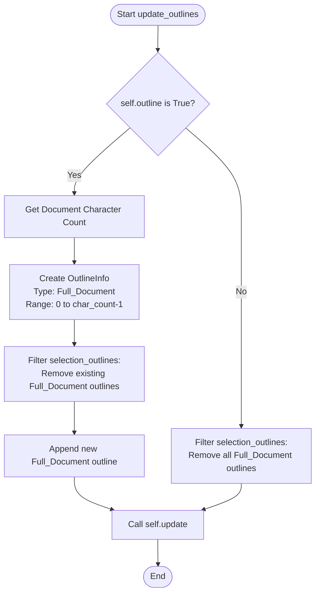

#### 带注释源码

```python
def update_outlines(self):
    """Update the selection outlines when text changes"""
    if self.outline:
        # 1. 如果启用了轮廓（outline），则需要为整个文档创建一个轮廓
        doc = self.document()
        char_count = doc.characterCount()
        
        # 2. 创建一个覆盖全文档的 OutlineInfo 对象
        # 注意：Qt 的 characterCount 通常包含结尾的空字符，所以 end 索引通常需要 -1
        new_outline = OutlineInfo(  
            start = 0,
            end = max(0, char_count - 1),
            color = self.outline_color,  
            width = self.outline_width,
            type = OutlineType.Full_Document
        )
        
        # 3. 移除任何现有的全文档轮廓，防止重复叠加
        self.selection_outlines = [outline for outline in self.selection_outlines 
                                 if outline.type != OutlineType.Full_Document]
        # 4. 添加新的全文档轮廓
        self.selection_outlines.append(new_outline)
    else:
        # 如果未启用轮廓，仅移除全文档轮廓（保留选中的局部轮廓）
        self.selection_outlines = [outline for outline in self.selection_outlines 
                                 if outline.type != OutlineType.Full_Document]

    # 5. 触发 paint 事件以重绘项目
    self.update() 
```


### `TextBlockItem.set_outline`

设置文本块的轮廓（outline），可以针对整个文档或选中的文本片段设置不同颜色和宽度的轮廓。

参数：

- `outline_color`：`QColor`，轮廓颜色，如果为 falsy 值则禁用轮廓
- `outline_width`：`float`，轮廓宽度

返回值：`None`，无返回值

#### 流程图

```mermaid
flowchart TD
    A[开始 set_outline] --> B[初始化 start=0, end=0]
    B --> C{文本光标是否有选区?}
    C -->|是| D[获取选区起始位置 start]
    D --> E[获取选区结束位置 end]
    C -->|否| F{outline_color 是否为 falsy?}
    F -->|是| G[设置 self.outline = False]
    F -->|否| H[设置 self.outline = True]
    H --> I[保存 outline_color 到 self.outline_color]
    I --> J[保存 outline_width 到 self.outline_width]
    J --> K[计算文档字符数, start=0, end=char_count-1]
    K --> L{outline_color 是否为 falsy?}
    L -->|是| M{是否有选区?}
    M -->|是| N[移除包含该选区的所有轮廓]
    M -->|否| O[移除全文档类型的轮廓]
    L -->|否| P[确定轮廓类型: 全文档或选区]
    P --> Q[移除该选区范围的已有轮廓]
    Q --> R[添加新的 OutlineInfo 到 selection_outlines]
    N --> S[调用 self.update 重绘]
    O --> S
    R --> S
    G --> S
```

#### 带注释源码

```
def set_outline(self, outline_color, outline_width):
    # 初始化 start 和 end 变量，用于记录轮廓覆盖的文本范围
    start = 0
    end = 0

    # 检查文本光标是否有选中的文本
    if self.textCursor().hasSelection():
        # 有选区时，记录选区的起始和结束位置
        # 轮廓将仅应用于这个选中的文本范围
        start = self.textCursor().selectionStart()
        end = self.textCursor().selectionEnd()
    else:
        # 没有选区时，操作将应用于整个文档
        # 根据 outline_color 是否存在来启用/禁用轮廓
        self.outline = True if outline_color else False

        if self.outline:
            # 启用全局轮廓：保存颜色和宽度，并设置目标为整个文档
            self.outline_color = outline_color
            self.outline_width = outline_width

            # 获取文档字符数，确定全文档范围
            char_count = self.document().characterCount()
            start = 0
            end = max(0, char_count - 1)

    # 当禁用轮廓时（outline_color 为 falsy），移除相关轮廓
    if not outline_color:
        if self.textCursor().hasSelection():
            # 有选区时：移除任何包含当前选区范围的轮廓
            # 遍历现有轮廓，保留不包含当前选区的轮廓
            self.selection_outlines = [
                outline for outline in self.selection_outlines
                if not (outline.start <= start and outline.end >= end)
            ]
        else:
            # 无选区时：仅移除全文档类型的轮廓
            self.selection_outlines = [
                outline for outline in self.selection_outlines
                if outline.type != OutlineType.Full_Document
            ]
    else:
        # 添加或更新轮廓（针对选区或整个文档）
        # 根据 self.outline 标志确定轮廓类型
        type = OutlineType.Full_Document if self.outline else OutlineType.Selection

        # 移除该选区范围的已有轮廓（避免重复）
        self.selection_outlines = [
            outline for outline in self.selection_outlines 
            if not (outline.start == start and outline.end == end)
        ]

        # 创建新的 OutlineInfo 并添加到列表中
        self.selection_outlines.append(
            OutlineInfo(start, end, outline_color, outline_width, type)
        )
    
    # 触发项目重绘以显示新的轮廓效果
    self.update()
```


### `TextBlockItem.paint`

该方法重写了 `QGraphicsTextItem` 的 `paint` 功能。它负责绘制图形项的文本内容，并实现了自定义的“轮廓（Outline）”渲染逻辑。当存在选中文本或全文档轮廓时，该方法会克隆一份文档，通过将文本设为透明并仅在特定区域着色，配合偏移绘制（Offset Drawing）技术在文本周围形成描边或高亮效果，最后绘制正常的文本层。

参数：

- `painter`：`QPainter`，绘图设备，用于在界面上执行具体的绘制指令。
- `option`：`QStyleOptionGraphicsItem`，样式选项，包含了项的状态（如选中、焦点等）以及绘制时的风格参数。
- `widget`：`QWidget`，可选，指向触发绘制事件的小部件，通常用于样式计算。

返回值：`None`，该方法为 Void 类型，不返回任何值，直接操作绘图上下文。

#### 流程图

```mermaid
flowchart TD
    A([开始]) --> B{self.selection_outlines<br>是否有轮廓信息?}
    B -- 否 --> C[调用父类绘制方法<br>super().paint]
    C --> Z([结束])
    
    B -- 是 --> D[克隆当前文档<br>doc = self.document().clone]
    D --> E{self.vertical<br>是否为垂直布局?}
    E -- 是 --> F[为克隆文档设置垂直布局]
    F --> G
    E -- 否 --> G
    
    G[保存绘图状态<br>painter.save] --> H[将克隆文档内容设为全透明]
    
    H --> I[遍历 selection_outlines]
    I --> J{当前轮廓信息}
    J --> K[设置光标范围并应用轮廓颜色]
    K --> L[根据轮廓宽度生成偏移坐标集]
    L --> M[循环偏移坐标]
    M --> N[保存状态 -> 偏移绘制 -> 恢复状态]
    M --> O{还有更多偏移?}
    O -- 是 --> M
    O -- 否 --> P{还有更多轮廓?}
    P -- 是 --> I
    P -- 否 --> Q[恢复绘图状态<br>painter.restore]
    
    Q --> C
```

#### 带注释源码

```python
def paint(   
    self, 
    painter: QPainter, 
    option: QStyleOptionGraphicsItem, 
    widget: QWidget = None
):
    # 首先处理任何选中的轮廓（Selection Outlines）
    if self.selection_outlines:
        # 克隆当前文档，以便在不修改原始文档的情况下进行离屏绘制
        doc = self.document().clone()
        
        # 如果当前处于垂直模式，保持垂直布局
        if self.vertical and self.layout:
            vertical_layout = VerticalTextDocumentLayout(
                document=doc,
                line_spacing=self.layout.line_spacing,
            )
            doc.setDocumentLayout(vertical_layout)
            vertical_layout.set_max_size(self.layout.max_width, self.layout.max_height)

        painter.save() # 保存当前的绘图状态（如画笔、字体变换等）
        
        # 清空文档内容，只显示需要绘制轮廓的部分
        # 技巧：先将整个文档的文字设为透明，作为背景层
        cursor = QTextCursor(doc)
        cursor.select(QTextCursor.SelectionType.Document)
        fmt = cursor.charFormat()
        fmt.setForeground(QColor(0, 0, 0, 0))  # 透明色
        cursor.mergeCharFormat(fmt)

        # 仅在选中的区域应用轮廓颜色并绘制
        for outline_info in self.selection_outlines:
            # 将光标移动到轮廓对应的文本起始位置
            cursor.setPosition(outline_info.start)
            # 将光标 anchor 移动到结束位置（选中该段文本）
            cursor.setPosition(outline_info.end, QTextCursor.KeepAnchor)
            
            # 获取该段的字符格式并设置前景色为轮廓颜色
            fmt = cursor.charFormat()
            fmt.setForeground(outline_info.color)
            cursor.mergeCharFormat(fmt)

            # 绘制轮廓：通过在文本周围进行多次带偏移的绘制来实现描边效果
            # 生成环绕中心的 8 个偏移点（上下左右及对角线）
            offsets = [(dx, dy) 
                for dx in (-outline_info.width, 0, outline_info.width)
                for dy in (-outline_info.width, 0, outline_info.width)
                if dx != 0 or dy != 0
            ]
            
            for dx, dy in offsets:
                painter.save()
                # 移动画布进行绘制
                painter.translate(dx, dy)
                # 绘制文档内容（带有颜色和偏移）
                doc.drawContents(painter)
                painter.restore()

        painter.restore() # 恢复绘图状态，避免影响后续绘制

    # 最后，在轮廓层之上绘制正常的文本
    super().paint(painter, option, widget)
```


### `TextBlockItem.set_bold`

设置 TextBlockItem 的粗体格式状态。该方法根据是否有文本选区来决定是仅更新实例属性还是同时应用到文本格式。

参数：

- `state`：`bool`，布尔值，True 表示启用粗体，False 表示禁用粗体

返回值：`None`，无返回值（该方法直接修改对象状态）

#### 流程图

```mermaid
flowchart TD
    A[开始 set_bold] --> B{textCursor是否有选区?}
    B -->|有选区| C[不更新 self.bold 属性]
    B -->|无选区| D[设置 self.bold = state]
    C --> E[调用 update_text_format<br/>'bold', state]
    D --> E
    E --> F[结束]
```

#### 带注释源码

```python
def set_bold(self, state):
    """
    设置文本块的粗体格式。
    
    Args:
        state (bool): True 表示启用粗体，False 表示禁用粗体
    """
    # 检查文本光标是否有选中的文本
    if not self.textCursor().hasSelection():
        # 无选区时，更新实例的 bold 属性以保存状态
        self.bold = state
    
    # 调用通用的文本格式更新方法，应用粗体格式
    # 该方法会处理光标选区或整个文档的格式设置
    self.update_text_format('bold', state)
```


### `TextBlockItem.set_italic`

设置文本块的斜体状态，根据是否有文本选区决定是更新实例属性还是仅更新选中文本的格式。

参数：

-  `state`：`bool`，斜体状态，`True` 表示启用斜体，`False` 表示禁用斜体

返回值：`None`，该方法无返回值

#### 流程图

```mermaid
flowchart TD
    A[开始 set_italic] --> B{检查文本光标是否有选区}
    B -->|有选区| C[不更新 self.italic 属性]
    B -->|无选区| D[更新 self.italic = state]
    C --> E[调用 update_text_format 传入 'italic' 和 state]
    D --> E
    E --> F[在光标选区或全文应用斜体格式]
    F --> G[结束]
```

#### 带注释源码

```python
def set_italic(self, state):
    """
    设置文本块的斜体属性。
    
    Args:
        state (bool): True 表示启用斜体，False 表示禁用斜体。
    
    Returns:
        None
    
    Note:
        - 如果当前有文本选区，仅对选区应用格式，不更新 self.italic 属性
        - 如果没有选区，则同时更新属性和全文格式
    """
    # 检查文本光标是否有选中内容
    if not self.textCursor().hasSelection():
        # 无选区时，更新实例的 italic 属性（用于记录整体状态）
        self.italic = state
    
    # 调用通用格式更新方法，应用斜体格式到文本
    # 该方法会处理有选区和无选区两种情况
    self.update_text_format('italic', state)
```


### `TextBlockItem.set_underline`

设置文本下划线状态，根据是否有选中文本决定是应用格式到选区还是整个文本块。

参数：

-  `state`：`bool`，设置下划线状态（True 为启用，False 为禁用）

返回值：`None`，无返回值

#### 流程图

```mermaid
flowchart TD
    A[开始 set_underline] --> B{检查是否有选中文本}
    B -->|有选中文本| C[不更新 self.underline 属性]
    B -->|无选中文本| D[更新 self.underline = state]
    C --> E[调用 update_text_format]
    D --> E
    E --> F[在文本上应用下划线格式]
    F --> G[结束]
```

#### 带注释源码

```
def set_underline(self, state: bool):
    """
    设置文本下划线
    
    参数:
        state: bool - True 启用下划线, False 禁用下划线
    
    说明:
        - 如果当前有选中文本,只对选中文本应用格式,不更新实例属性
        - 如果没有选中文本,更新实例属性 self.underline 并应用格式到整个文本
    """
    # 检查文本光标是否有选中文本
    if not self.textCursor().hasSelection():
        # 无选区时更新实例的下划线状态属性
        self.underline = state
    
    # 调用通用格式更新方法应用下划线样式
    # 该方法会处理文本格式的合并与应用
    self.update_text_format('underline', state)
```


### `TextBlockItem.apply_all_attributes`

该方法作为文本块项目的属性统一应用入口，按顺序调用多个setter方法，将实例当前存储的字体、颜色、描边、粗体、斜体、下划线、行间距、对齐等所有视觉属性一次性应用到文档的文本格式上，确保文本渲染效果与实例状态保持一致。

参数：

- `self`：`TextBlockItem`，调用该方法的对象实例本身，包含所有待应用的属性状态

返回值：`None`，该方法直接修改 QGraphicsTextItem 的内部状态，不返回任何值

#### 流程图

```mermaid
flowchart TD
    A[开始 apply_all_attributes] --> B[set_font<br/>设置字体家族和大小]
    B --> C[set_color<br/>设置文本颜色]
    C --> D[set_outline<br/>设置描边颜色和宽度]
    D --> E[set_bold<br/>设置粗体]
    E --> F[set_italic<br/>设置斜体]
    F --> G[set_underline<br/>设置下划线]
    G --> H[set_line_spacing<br/>设置行间距]
    H --> I[update_text_width<br/>更新文本宽度]
    I --> J[set_alignment<br/>设置对齐方式]
    J --> K[结束]
```

#### 带注释源码

```python
def apply_all_attributes(self):
    """
    应用所有属性到当前文本块项目。
    该方法依次调用各个属性设置方法，将实例变量中存储的
    字体、颜色、描边、样式、行间距、对齐等属性应用到文档格式上。
    """
    # 设置字体家族和字体大小
    # 使用实例存储的 font_family 和 font_size
    self.set_font(self.font_family, self.font_size)
    
    # 设置文本前景色
    # 使用实例存储的 text_color
    self.set_color(self.text_color)
    
    # 设置文本描边效果
    # 包括描边颜色和描边宽度，描边可以应用于整个文档或选中文本
    self.set_outline(self.outline_color, self.outline_width)
    
    # 设置粗体属性
    # 通过 QTextCharFormat 设置字符格式的字体粗细
    self.set_bold(self.bold)
    
    # 设置斜体属性
    # 通过 QTextCharFormat 设置字符格式的字体斜体样式
    self.set_italic(self.italic)
    
    # 设置下划线属性
    # 通过 QTextCharFormat 设置字符格式的下划线样式
    self.set_underline(self.underline)
    
    # 设置行间距
    # 使用 QTextBlockFormat 的比例行高类型，行高 = 行数 * line_spacing
    self.set_line_spacing(self.line_spacing)
    
    # 根据文档内容实际宽度更新文本项的固定宽度
    # 确保水平布局下文本宽度与内容匹配
    self.update_text_width()
    
    # 设置文本对齐方式
    # 支持左对齐、居中、右对齐、两端对齐等
    self.set_alignment(self.alignment)
```


### `TextBlockItem.mouseDoubleClickEvent`

该方法负责处理文本块的鼠标双击事件。当用户双击文本块时，如果当前未处于编辑模式，则进入编辑模式；如果存在自定义布局（如竖排文本），则通过命中测试将光标定位到双击位置，最后调用父类默认的双击处理逻辑（如选中文本）。

参数：

-  `self`：`TextBlockItem`，当前文本块项目实例。
-  `event`：`QGraphicsSceneMouseEvent`，鼠标双击事件对象，包含鼠标位置和按键状态等信息。

返回值：`None`，无返回值（重写父类方法）。

#### 流程图

```mermaid
graph TD
    A([Start mouseDoubleClickEvent]) --> B{Is editing_mode?}
    B -- No --> C[enter_editing_mode]
    C --> D{layout exists?}
    D -- Yes --> E[hitTest: Get cursor position from event.pos]
    E --> F[Set text cursor to hit position]
    F --> G[Call super().mouseDoubleClickEvent]
    D -- No --> G
    B -- Yes (Already editing) --> G
    G --> H([End])
```

#### 带注释源码

```python
def mouseDoubleClickEvent(self, event):
    """
    处理鼠标双击事件。

    1. 如果当前不是编辑模式，则进入编辑模式。
    2. 如果存在垂直布局，则通过 hitTest 计算点击的字符位置，并将光标移动到该位置。
    3. 调用父类的默认处理逻辑（例如选中文本）。
    """
    # 检查是否处于编辑模式
    if not self.editing_mode:
        # 启用编辑模式：设置交互标志、焦点、鼠标样式等
        self.enter_editing_mode()
        
        # 如果使用了自定义布局（可能是竖排文本布局）
        if self.layout:
            # 使用布局的命中测试获取点击位置对应的字符索引
            hit = self.layout.hitTest(event.pos(), None)
            
            # 获取当前的文本光标对象
            cursor = self.textCursor()
            # 将光标移动到计算出的位置
            cursor.setPosition(hit)
            # 更新项目的光标显示
            self.setTextCursor(cursor)
            
    # 调用父类 QGraphicsTextItem 的默认双击处理，
    # 通常用于选中单词或触发文本编辑器的默认行为
    super().mouseDoubleClickEvent(event)
```


### `TextBlockItem.mousePressEvent`

该函数是 `TextBlockItem` 的鼠标按下事件处理核心逻辑。当用户点击文本块时，它首先判断当前是否处于“编辑模式”且启用了“垂直排版”。如果是，它会接管默认的鼠标行为，利用自定义的垂直布局（`VerticalTextDocumentLayout`）的 `hitTest` 算法来精确定位点击的字符，并处理光标的移动与 Shift 键选择逻辑；若不满足条件，则交由父类 `QGraphicsTextItem` 处理标准的文本选中与图形项移动。

参数：

-  `event`：`QGraphicsSceneMouseEvent`，包含鼠标事件的相关信息，如点击位置（`pos()`）、点击按钮（`button()`）及键盘修饰符（`modifiers()`）。

返回值：`None`，该方法通过修改对象内部状态（如光标位置、选区标志）来处理事件，不返回任何值。

#### 流程图

```mermaid
flowchart TD
    A([Start]) --> B{Is Editing Mode & Vertical & Left Click?}
    B -- No --> C[Call super().mousePressEvent]
    C --> D([End])
    B -- Yes --> E[Hit Test: layout.hitTest(event.pos)]
    E --> F{Is Shift Key Pressed?}
    F -- Yes --> G[Anchor = Current Cursor Anchor]
    F -- No --> H[Anchor = Hit Position]
    G --> I[Set Cursor to Hit (KeepAnchor)]
    H --> I
    I --> J[_drag_selecting = True]
    J --> K[Update UI Cursor & Set Focus]
    K --> L[event.accept]
    L --> D
```

#### 带注释源码

```python
def mousePressEvent(self, event):
    # Handle single clicks in editing mode for vertical text
    # 只有在编辑模式(editing_mode)下，且存在垂直布局(layout)，且按下左键时才拦截事件
    if self.editing_mode and self.layout and event.button() == Qt.MouseButton.LeftButton:
        
        # 使用垂直布局的 hitTest 方法将鼠标点击的屏幕坐标转换为文本中的字符索引位置
        hit = self.layout.hitTest(event.pos(), None)
        
        # 获取当前的文本光标对象
        cursor = self.textCursor()
        
        # 检查是否按下了 Shift 键，用于处理范围选择
        if event.modifiers() & Qt.KeyboardModifier.ShiftModifier:
            # 如果按下了 Shift，记录当前光标的锚点(Anchor)作为选区起点
            self._drag_select_anchor = cursor.anchor()
            # 移动光标到点击位置，并保持选区(KeepAnchor)，实现从锚点到当前位置的选中效果
            cursor.setPosition(hit, QTextCursor.MoveMode.KeepAnchor)
        else:
            # 没有按 Shift，则仅仅将光标移动到点击位置
            cursor.setPosition(hit)
            # 重置拖动选择的锚点为当前位置
            self._drag_select_anchor = hit
        
        # 标记正在进行拖动选择（用于后续的 mouseMoveEvent 处理）
        self._drag_selecting = True
        
        # 更新界面显示的光标位置
        self.setTextCursor(cursor)
        # 强制获取焦点，确保能够接收后续的键盘事件（如按键移动光标）
        self.setFocus()
        
        # 接受事件，阻止事件向父类传递，避免触发 QGraphicsTextItem 默认的选中和移动逻辑
        event.accept()
    else:
        # 对于非编辑模式或非垂直布局的情况，调用父类默认处理逻辑
        super().mousePressEvent(event)
```


### TextBlockItem.mouseMoveEvent

处理鼠标移动事件，当处于编辑模式且用户正在通过拖动选择文本时，根据鼠标位置更新文本光标的选区；否则如果是编辑模式，则调用父类的默认处理方法。

参数：
- event：`QGraphicsSceneMouseEvent`，鼠标移动事件对象，包含鼠标位置、按钮状态等信息

返回值：`None`，无返回值

#### 流程图

```mermaid
flowchart TD
    A([开始]) --> B{是否在编辑模式且有布局且按下左键且正在拖动选择}
    B -- 是 --> C[使用布局的hitTest方法获取鼠标位置对应的文本索引]
    C --> D[获取拖动选择的起始锚点]
    D --> E[创建文本光标并设置选区从锚点到命中点]
    E --> F[更新文本光标显示选区]
    F --> G[接受事件并返回]
    B -- 否 --> H{是否在编辑模式}
    H -- 是 --> I[调用父类的mouseMoveEvent方法]
    I --> G
    H -- 否 --> G
    G([结束])
```

#### 带注释源码

```
def mouseMoveEvent(self, event):
    # Resize/rotate/move logic is now handled by EventHandler and QGraphicsView
    # 检查是否满足文本拖动选择的所有条件：
    # 1. 当前处于编辑模式 (editing_mode)
    # 2. 存在垂直文本布局 (layout)
    # 3. 鼠标左键被按下 (buttons & LeftButton)
    # 4. 正在执行拖动选择操作 (_drag_selecting)
    if self.editing_mode and self.layout and (event.buttons() & Qt.MouseButton.LeftButton) and self._drag_selecting:
        # 使用垂直布局的hitTest方法将鼠标位置转换为文本中的字符索引
        hit = self.layout.hitTest(event.pos(), None)
        
        # 获取拖动选择的起始位置（锚点）
        # 如果尚未设置锚点，则使用当前文本光标的锚点位置
        anchor = self._drag_select_anchor
        if anchor is None:
            anchor = self.textCursor().anchor()

        # 获取当前文本光标对象
        cursor = self.textCursor()
        # 将光标移动到锚点位置（选择起点）
        cursor.setPosition(anchor)
        # 将光标扩展到命中点位置（选择终点），形成选区
        cursor.setPosition(hit, QTextCursor.MoveMode.KeepAnchor)
        # 更新图形项的文本光标以显示选区
        self.setTextCursor(cursor)
        
        # 标记事件已被处理，阻止事件继续传递
        event.accept()
        return

    # 如果不满足拖动选择条件，但仍然处于编辑模式
    # 则调用父类 QGraphicsTextItem 的默认鼠标移动处理
    if self.editing_mode:
        super().mouseMoveEvent(event)
```


### `TextBlockItem.mouseReleaseEvent`

该方法负责处理鼠标释放事件。当用户在垂直布局的文本编辑模式下释放鼠标以结束文本拖拽选择时，此方法会清除选择状态（`_drag_selecting` 和 `_drag_select_anchor`）。如果事件不符合特定条件（例如不是在编辑模式下），则将控制权交还给父类 `QGraphicsTextItem` 的默认处理逻辑。

参数：

-  `event`：`QGraphicsSceneMouseEvent`，Qt 鼠标事件对象，包含按钮状态、位置等鼠标交互信息。

返回值：`None`，无返回值（Void）。

#### 流程图

```mermaid
flowchart TD
    A([鼠标释放事件触发]) --> B{是否处于编辑模式<br>且拥有垂直布局<br>且释放的是左键?}
    B -- 是 --> C[设置 _drag_selecting = False]
    C --> D[设置 _drag_select_anchor = None]
    D --> E[调用 event.accept() 阻止冒泡]
    E --> F([结束函数返回])
    B -- 否 --> G[调用父类 mouseReleaseEvent]
    G --> F
```

#### 带注释源码

```python
def mouseReleaseEvent(self, event):
    """
    处理鼠标释放事件。
    主要用于结束在垂直文本布局下的拖拽选择操作。
    
    参数:
        event: QGraphicsSceneMouseEvent，包含了鼠标释放时的相关状态。
    """
    # 判断当前是否处于编辑模式、是否使用了垂直布局，以及释放的按钮是否为左键
    if self.editing_mode and self.layout and event.button() == Qt.MouseButton.LeftButton:
        # 结束拖拽选择状态，重置内部标志位
        self._drag_selecting = False
        self._drag_select_anchor = None
        
        # 接受该事件，防止其向上传递或被默认处理
        event.accept()
        return
    
    # 如果不满足上述特定条件，则执行 Qt Graphics Item 的默认鼠标释放行为
    # (例如：结束移动、结束调整大小等交互)
    super().mouseReleaseEvent(event)
```


### `TextBlockItem.keyPressEvent(event)`

该方法是 `TextBlockItem` 类中的键盘按键事件处理函数，专门用于在垂直文本编辑模式下重新映射方向键的行为，以适应垂直文本的阅读顺序（Down 键前进到下一个字符，Up 键后退到上一个字符，Left/Right 键在视觉列/段落间移动），同时确保 Enter 键插入新段落时能继承当前的字符格式和字体度量。

参数：

-  `event`：`QKeyEvent`，Qt 键盘事件对象，包含按键的键值、修饰符等信息

返回值：`None`，该方法通过调用 `event.accept()` 或 `super().keyPressEvent(event)` 处理事件，不返回任何值

#### 流程图

```mermaid
flowchart TD
    A[keyPressEvent 被调用] --> B{处于编辑模式且为垂直文本?}
    B -->|否| C[调用父类默认处理]
    B -->|是| D[获取按键值和修饰符]
    
    D --> E{按键是 Down?}
    E -->|是| F[获取文本光标]
    F --> G[根据 Shift 键选择移动模式]
    G --> H[移动到下一个字符]
    H --> I[更新光标并接受事件]
    I --> J[返回]
    
    E -->|否| K{按键是 Up?}
    K -->|是| L[获取文本光标]
    L --> M[根据 Shift 键选择移动模式]
    M --> N[移动到上一个字符]
    N --> O[更新光标并接受事件]
    O --> P[返回]
    
    K -->|否| Q{按键是 Left 或 Right?}
    Q -->|否| R{按键是 Enter 或 Return?}
    Q -->|是| S{有自定义布局且支持列间移动?}
    S -->|是| T[计算列移动增量]
    T --> U[调用布局的列移动方法]
    U --> V{移动成功?}
    V -->|是| W[更新光标并接受事件]
    V -->|否| X[使用块级移动回退方案]
    W --> Y[返回]
    S -->|否| X
    
    X --> Z[获取当前块]
    Z --> AA[获取目标块 next/previous]
    AA --> AB{目标块有效?}
    AB -->|是| AC[计算目标位置偏移]
    AC --> AD[设置新光标位置]
    AD --> AE[更新光标并接受事件]
    AE --> AF[返回]
    AB -->|否| AG[调用父类默认处理]
    
    R -->|是| AH[获取当前光标和格式]
    AH --> AI[继承字符格式和块格式]
    AI --> AJ{字体大小有效?}
    AJ -->|否| AK[设置最小字体大小]
    AJ -->|是| AL[开始编辑块]
    AL --> AM{有选中文本?]
    AM -->|是| AN[删除选中内容]
    AM -->|否| AO[插入新块]
    AN --> AO
    
    AO --> AP[设置继承的格式]
    AP --> AQ[结束编辑块]
    AQ --> AR[更新光标并接受事件]
    AR --> AS[返回]
    
    R -->|否| AT[调用父类默认处理]
    C --> AT
    AG --> AT
```

#### 带注释源码

```python
def keyPressEvent(self, event):
    """
    处理键盘按键事件，重映射垂直文本编辑模式下的方向键行为。
    
    垂直文本中：
    - Down 键 = 前进到下一个字符（与常规相反）
    - Up 键 = 后退到上一个字符（与常规相反）
    - Left/Right 键 = 在视觉列/段落间移动
    - Enter 键 = 插入新段落并继承当前格式
    """
    # 检查是否处于编辑模式且启用了垂直文本布局
    if self.editing_mode and self.vertical:
        key = event.key()
        modifiers = event.modifiers()
        
        # 处理 Down 键：在垂直文本中向下移动等于移到下一个字符
        if key == Qt.Key.Key_Down:
            cursor = self.textCursor()
            # 如果按住 Shift 键，则保持选区（扩展选区）
            move_mode = QTextCursor.MoveMode.KeepAnchor if (modifiers & Qt.KeyboardModifier.ShiftModifier) else QTextCursor.MoveMode.MoveAnchor
            cursor.movePosition(QTextCursor.MoveOperation.NextCharacter, move_mode)
            self.setTextCursor(cursor)
            event.accept()
            return
        
        # 处理 Up 键：在垂直文本中向上移动等于移到上一个字符
        elif key == Qt.Key.Key_Up:
            cursor = self.textCursor()
            move_mode = QTextCursor.MoveMode.KeepAnchor if (modifiers & Qt.KeyboardModifier.ShiftModifier) else QTextCursor.MoveMode.MoveAnchor
            cursor.movePosition(QTextCursor.MoveOperation.PreviousCharacter, move_mode)
            self.setTextCursor(cursor)
            event.accept()
            return
        
        # 处理 Left/Right 键：在垂直文本中水平移动等于在段落/视觉列间移动
        # 排除 Ctrl/Alt/Meta 修饰键组合（避免与快捷键冲突）
        elif key in (Qt.Key.Key_Left, Qt.Key.Key_Right) and not (
            modifiers & (
                Qt.KeyboardModifier.ControlModifier
                | Qt.KeyboardModifier.AltModifier
                | Qt.KeyboardModifier.MetaModifier
            )
        ):
            cursor = self.textCursor()
            move_mode = QTextCursor.MoveMode.KeepAnchor if (modifiers & Qt.KeyboardModifier.ShiftModifier) else QTextCursor.MoveMode.MoveAnchor

            # 优先使用布局感知的列间移动方法（处理自动换行列）
            if self.layout and hasattr(self.layout, "move_cursor_between_columns"):
                # Left 键向左列移动（column_delta=1），Right 键向右列移动（column_delta=-1）
                column_delta = 1 if key == Qt.Key.Key_Left else -1
                new_pos = self.layout.move_cursor_between_columns(cursor.position(), column_delta)
                if new_pos is not None and new_pos != cursor.position():
                    cursor.setPosition(new_pos, move_mode)
                    self.setTextCursor(cursor)
                    event.accept()
                    return

            # 回退方案：将每个 QTextBlock 视为垂直"行"，在块之间移动
            block = cursor.block()
            target_block = block.next() if key == Qt.Key.Key_Left else block.previous()
            if target_block.isValid():
                # 保持当前块内的偏移量，计算目标块的对应位置
                offset_in_block = cursor.position() - block.position()
                target_offset = min(offset_in_block, max(0, target_block.length() - 1))
                new_pos = target_block.position() + target_offset
                if new_pos != cursor.position():
                    cursor.setPosition(new_pos, move_mode)
                    self.setTextCursor(cursor)
                    event.accept()
                    return
        
        # 处理 Enter/Return 键：插入新段落并继承当前格式
        # 继承字符格式确保空段落保持相同的字体度量（避免 Qt 回退到 tiny 默认字体）
        elif key in (Qt.Key.Key_Return, Qt.Key.Key_Enter):
            cursor = self.textCursor()
            inherited_char_format = QTextCharFormat(cursor.charFormat())
            inherited_block_format = cursor.blockFormat()
            inherited_block_char_format = QTextCharFormat(inherited_char_format)

            # 确保字体大小有效（Qt 可能使用无效的 0 点大小）
            if inherited_block_char_format.fontPointSize() <= 0:
                inherited_block_char_format.setFontPointSize(max(1, float(self.font_size)))
            font = inherited_block_char_format.font()
            if font.pointSizeF() <= 0:
                font = self.document().defaultFont()
                if font.pointSizeF() <= 0:
                    font.setPointSizeF(max(1.0, float(self.font_size)))
                inherited_block_char_format.setFont(font)

            cursor.beginEditBlock()
            # 如果有选中文本，先删除
            if cursor.hasSelection():
                cursor.removeSelectedText()

            # 插入新块，继承当前块的格式和字符格式
            cursor.insertBlock(inherited_block_format, inherited_block_char_format)
            cursor.setCharFormat(inherited_char_format)

            cursor.endEditBlock()
            self.setTextCursor(cursor)
            event.accept()
            return
    
    # 默认处理：对于非垂直编辑模式或其他按键，调用父类实现
    super().keyPressEvent(event)
```


### `TextBlockItem.contextMenuEvent`

该方法重写了 `QGraphicsTextItem` 的上下文菜单事件，用于处理文本块的右键点击操作。首先调用父类方法以显示符合当前交互状态的默认右键菜单（如编辑状态下的全选、复制等）。随后检查 `self.editing_mode` 状态，如果文本块正处于编辑模式，则强制重新进入编辑模式（`enter_editing_mode`），以此确保在关闭上下文菜单后，文本块能够重新获得焦点并恢复文本编辑状态（如光标变为 IBeam 形状）。

参数：

-  `event`：`QGraphicsSceneContextMenuEvent`，Qt 的上下文菜单事件对象，包含了触发事件的鼠标位置（屏幕坐标与本地坐标）以及相关的键盘修饰符信息。

返回值：`None`，该方法执行特定的 Qt 事件处理逻辑和内部状态维护，不返回任何数据。

#### 流程图

```mermaid
flowchart TD
    A([开始]) --> B[调用 super().contextMenuEvent]
    B --> C[显示默认右键菜单]
    C --> D{检查 self.editing_mode}
    D -- False --> E([结束])
    D -- True --> F[调用 self.enter_editing_mode]
    F --> E
```

#### 带注释源码

```python
def contextMenuEvent(self, event):
    """
    处理右键菜单事件。
    
    参数:
        event: QGraphicsSceneContextMenuEvent，包含右键点击的位置和上下文信息。
    """
    # 调用父类的 contextMenuEvent 方法。
    # Qt 会根据当前的 TextInteractionFlags (由 editing_mode 决定) 来决定弹出什么菜单。
    # 如果是编辑模式，会弹出标准的文本编辑菜单（复制、粘贴等）；
    # 如果不是编辑模式，通常只弹出 'Select All'。
    super().contextMenuEvent(event)
    
    # 如果当前处于编辑模式，则确保重新进入编辑状态。
    # 这样做通常是为了在模态的上下文菜单关闭后，强制刷新焦点和光标状态，
    # 防止菜单的弹出导致焦点丢失或光标重置。
    if self.editing_mode:
        self.enter_editing_mode()
```


### `TextBlockItem.enter_editing_mode`

进入编辑模式，将文本块从只读显示状态切换为可编辑状态，并调整相关属性以支持文本交互。

参数：

- 无显式参数（隐含参数 `self`：当前 `TextBlockItem` 实例）

返回值：`None`，无返回值（Python 方法默认返回 None）

#### 流程图

```mermaid
flowchart TD
    A[开始 enter_editing_mode] --> B[设置 editing_mode = True]
    B --> C[设置缓存模式为 NoCache]
    C --> D[设置文本交互标志为 TextEditorInteraction]
    D --> E[设置 ItemIsMovable 标志为 False]
    E --> F[设置光标为 IBeamCursor]
    F --> G[设置焦点到当前项]
    G --> H[结束]
```

#### 带注释源码

```
def enter_editing_mode(self):
    # 1. 设置编辑模式标志为 True，表示当前处于文本编辑状态
    self.editing_mode = True
    
    # 2. 禁用缓存模式
    # 在编辑模式下，文本内容会频繁变化，禁用缓存可以确保每次渲染都是最新的
    self.setCacheMode(QGraphicsItem.CacheMode.NoCache)
    
    # 3. 启用文本交互功能
    # TextEditorInteraction 允许用户点击和选择文本、输入新文本
    self.setTextInteractionFlags(Qt.TextInteractionFlag.TextEditorInteraction)
    
    # 4. 禁用移动功能
    # 编辑模式下不应允许拖动文本块，以免与文本选择操作冲突
    self.setFlag(QGraphicsTextItem.GraphicsItemFlag.ItemIsMovable, False)
    
    # 5. 更改光标形状为文本输入光标
    # IBeamCursor（工字形光标）提示用户此处可以输入和选择文本
    self.setCursor(QCursor(Qt.CursorShape.IBeamCursor))
    
    # 6. 获取焦点
    # 确保键盘事件能够被当前文本项接收
    self.setFocus()
```


### `TextBlockItem.exit_editing_mode`

退出编辑模式，恢复只读状态，并重置相关的图形项标志和光标。

参数：
- 无

返回值：`None`，无返回值

#### 流程图

```mermaid
flowchart TD
    A[开始 exit_editing_mode] --> B[设置 editing_mode = False]
    B --> C[设置缓存模式为 DeviceCoordinateCache]
    C --> D[设置文本交互标志为 NoTextInteraction]
    D --> E[设置 ItemIsMovable 标志为 True]
    E --> F[设置光标为 PointingHandCursor]
    F --> G[清除焦点]
    G --> H[结束]
```

#### 带注释源码

```python
def exit_editing_mode(self):
    """
    退出编辑模式并恢复到只读状态。
    
    此方法执行以下操作：
    1. 将编辑模式标志设置为 False
    2. 重新启用设备坐标缓存以提高渲染性能
    3. 禁用文本交互（移除文本编辑器功能）
    4. 重新启用项的可移动性
    5. 恢复指针手型光标
    6. 清除焦点
    """
    # 1. 设置编辑模式标志为 False
    self.editing_mode = False
    
    # 2. 重新启用设备坐标缓存以提高性能
    # (在进入编辑模式时被禁用以实时更新)
    self.setCacheMode(QGraphicsItem.CacheMode.DeviceCoordinateCache)
    
    # 3. 禁用文本交互标志，恢复为只读状态
    # NoTextInteraction 禁止用户直接编辑文本
    self.setTextInteractionFlags(Qt.TextInteractionFlag.NoTextInteraction)
    
    # 4. 重新启用 ItemIsMovable 标志
    # 允许用户在编辑模式下移动项（编辑模式下被禁用）
    self.setFlag(QGraphicsTextItem.GraphicsItemFlag.ItemIsMovable, True)
    
    # 5. 恢复光标为指针手型
    # 表示当前项可点击/可选择
    self.setCursor(QCursor(Qt.CursorShape.PointingHandCursor))
    
    # 6. 清除焦点
    # 移除该图形项的键盘焦点
    self.clearFocus()
```


### `TextBlockItem._on_text_changed`

该方法是 `TextBlockItem` 类的内部槽函数（Slot），连接在 `QTextDocument` 的 `contentsChanged` 信号上。当图形文本项的内容发生任何形式的改变（用户输入、粘贴或程序修改）时，此方法会被自动触发。它负责获取最新的纯文本内容，通过自定义信号 `text_changed` 广播给外部监听者，并调用 `update_outlines` 以确保可视化的轮廓高亮范围与新的文本状态保持同步。

参数：

-  `self`：`TextBlockItem`，调用此方法的类实例本身。

返回值：`None`，无返回值。

#### 流程图

```mermaid
flowchart TD
    A([文本内容变化]) --> B{获取纯文本}
    B --> C[调用 self.toPlainText]
    C --> D{发射自定义信号}
    D --> E[self.text_changed.emit]
    E --> F{更新轮廓状态}
    F --> G[self.update_outlines]
    G --> H([结束])
```

#### 带注释源码

```python
def _on_text_changed(self):
    """
    内部槽函数，用于响应 QTextDocument 的内容变化信号。
    当文本被修改时，该方法会同步更新内部状态并通知外部。
    """
    # 1. 获取当前文档的纯文本内容（不含 HTML 标签）
    new_text = self.toPlainText()
    
    # 2. 发射自定义信号 'text_changed'，通知监听者（如 UI 控制器）文本已更新
    self.text_changed.emit(new_text)
    
    # 3. 调用 'update_outlines' 更新选区或全局轮廓
    # 确保视觉上的高亮范围与新的文本长度保持一致
    self.update_outlines()
```


### `TextBlockItem.handleDeselection`

该方法负责处理 `TextBlockItem` 实例的取消选中逻辑。当项被取消选中时，它会同步 Qt 图形系统的选中状态，重置内部标志位，发出相应的信号以通知监听者，并确保从编辑模式正确恢复到普通选择模式，同时更新光标和视图显示。

参数：

- (无)

返回值：

- `None`，无返回值

#### 流程图

```mermaid
graph TD
    A([开始]) --> B{self.selected 是否为 True?}
    B -- 否 --> Z([结束])
    B -- 是 --> C[调用 self.setSelected(False)]
    C --> D[设置 self.selected = False]
    D --> E[发送信号 self.item_deselected.emit()]
    E --> F[设置光标为 PointingHandCursor]
    F --> G{self.editing_mode 是否为 True?}
    G -- 是 --> H[调用 self.exit_editing_mode()]
    G -- 否 --> I[调用 self.update]
    H --> I
    I --> Z
```

#### 带注释源码

```python
def handleDeselection(self):
    """
    处理文本块的取消选中操作。
    
    当外部事件（如点击空白处或选中其他项）触发取消选中时，
    此方法负责清理选中状态、恢复光标样式并退出编辑模式。
    """
    # 仅当项当前处于选中状态时才执行清理逻辑
    if self.selected:
        # 1. 通知 Qt 图形系统该项已取消选中（这会触发 Qt 内部状态变化）
        self.setSelected(False)
        
        # 2. 同步更新自定义的内部选中状态标志
        self.selected = False
        
        # 3. 发出取消选中信号，通知上层控制器或视图
        self.item_deselected.emit()
        
        # 4. 恢复默认光标样式（从文本编辑时的 IBeam 变回普通的手型指针）
        self.setCursor(QCursor(Qt.CursorShape.PointingHandCursor))
        
        # 5. 如果当前处于文本编辑模式，则退出编辑模式
        if self.editing_mode:
            self.exit_editing_mode()
        
        # 6. 触发项的重绘，以清除选中时的视觉反馈（如虚线框或背景色）
        self.update()
```


### `TextBlockItem.init_resize`

该方法是调整大小交互的入口点。当用户在 UI 上触发调整大小操作（如按下鼠标并移动）时，首先调用此方法。它负责记录调整大小的起始点（`scene_pos`）并将对象内部的 `resizing` 状态标志设置为 `True`，以便在后续的 `mouseMoveEvent` 中执行具体的尺寸计算逻辑。

参数：

-  `scene_pos`：`QPointF`，鼠标按下或交互开始时，鼠标指针在场景坐标系中的坐标位置，用于作为计算尺寸变化的基准点。

返回值：`None`，该方法不返回任何值，仅通过修改实例属性来改变对象状态。

#### 流程图

```mermaid
graph LR
    A([开始 init_resize]) --> B{接收参数 scene_pos}
    B --> C[设置 self.resizing = True]
    C --> D[设置 self.resize_start = scene_pos]
    D --> E([结束])
```

#### 带注释源码

```python
def init_resize(self, scene_pos: QPointF):
    """
    初始化文本块的调整大小操作。

    此方法在用户开始拖动调整大小手柄时被调用。
    它设置内部状态以进入'正在调整大小'模式，并记录调整大小的起始点。

    参数:
        scene_pos (QPointF): 鼠标事件触发时在场景坐标系中的位置。
    """
    
    # 1. 将 resizing 标志设置为 True，指示对象当前处于调整大小模式
    # 这会影响后续的 mouseMoveEvent 处理逻辑
    self.resizing = True
    
    # 2. 记录调整大小操作的起始位置 (scene_pos)
    # 后续的 resize_item 方法将使用此点来计算 delta (增量)
    self.resize_start = scene_pos
```


### `TextBlockItem.init_rotation`

该方法用于初始化文本块的旋转交互。当用户开始拖动旋转手柄时，此方法会被调用，它会记录文本块的中心点在场景中的位置，并计算鼠标相对于该中心的初始角度，以便在后续的拖动过程中计算精确的旋转增量。

参数：

-  `scene_pos`：`QPointF`，鼠标在场景坐标系中的当前位置，用于计算相对于文本块中心的旋转角度。

返回值：`None`，无返回值。

#### 流程图

```mermaid
graph TD
    A([开始]) --> B[设置状态: self.rotating = True]
    B --> C[计算物品中心: center = boundingRect.center]
    C --> D[映射中心到场景坐标: self.center_scene_pos = mapToScene(center)]
    D --> E[计算初始角度: last_rotation_angle = atan2(scene_pos - center_scene_pos)]
    E --> F([结束])
```

#### 带注释源码

```python
def init_rotation(self, scene_pos):
    """
    初始化旋转交互。

    参数:
        scene_pos (QPointF): 鼠标在场景坐标系中的当前位置。
    """
    # 1. 设置旋转状态标志为 True，表示当前正在进行旋转操作
    self.rotating = True

    # 2. 获取文本块在本地（Item）坐标系中的几何中心
    # QRectF.center() 返回 QPointF
    center = self.boundingRect().center()

    # 3. 将本地中心点转换为场景（Scene）坐标系的坐标。
    # 这是必须的，因为传入的 scene_pos 是场景坐标，只有在同一坐标系下才能正确计算角度和距离。
    self.center_scene_pos = self.mapToScene(center)

    # 4. 计算鼠标位置相对于物品中心的初始角度（单位：度）。
    # math.atan2(y, x) 返回弧度，math.degrees 转换为角度。
    # 这个角度将作为基准，在 rotate_item 中通过计算差值来确定旋转了多少度。
    self.last_rotation_angle = math.degrees(math.atan2(
        scene_pos.y() - self.center_scene_pos.y(),
        scene_pos.x() - self.center_scene_pos.x()
    ))
```


### `TextBlockItem.move_item`

该方法负责处理图形项（TextBlockItem）在场景中的移动逻辑。它接收当前和上一帧的局部坐标，计算位移向量，并结合该项当前的旋转角度带来的边界变化，在场景的可视区域（Scene Rect）范围内约束其移动范围，确保该项不会移出画布。

参数：

- `local_pos`：`QPointF`，当前鼠标或拖拽事件的局部坐标。
- `last_local_pos`：`QPointF`，上一次鼠标或拖拽事件的局部坐标。

返回值：`None`，该方法直接修改对象状态，不返回任何值。

#### 流程图

```mermaid
graph TD
    A[开始: move_item] --> B[计算位移 Delta]
    B --> C{获取场景边界 parent_rect}
    C -->|是| D[计算新的原始位置 new_pos]
    C -->|否| H[直接应用位移]
    
    D --> E[计算旋转后的场景包围盒 bounding_rect]
    E --> F{检查水平边界冲突}
    
    F -->|左边越界| G1[修正 X 坐标到左边界]
    F -->|右边越界| G2[修正 X 坐标到右边界]
    F -->|无冲突| I{检查垂直边界冲突}
    
    I -->|上边越界| G3[修正 Y 坐标到上边界]
    I -->|下边越界| G4[修正 Y 坐标到下边界]
    I -->|无冲突| H[应用最终位置 setPos]
    
    G1 --> H
    G2 --> H
    G3 --> H
    G4 --> H
    
    H --> Z[结束]
```

#### 带注释源码

```python
def move_item(self, local_pos: QPointF, last_local_pos: QPointF):
    # 1. 计算局部坐标下的位移向量，并映射到父坐标系（场景坐标）
    delta = self.mapToParent(local_pos) - self.mapToParent(last_local_pos)
    # 2. 计算不考虑边界约束时的理论新位置
    new_pos = self.pos() + delta
    
    # 3. 计算该项在旋转后的边界框在场景坐标系中的位置
    # mapToScene 对于矩形返回一个多边形点集，调用 boundingRect 获取其包围盒
    scene_rect = self.mapToScene(self.boundingRect())
    bounding_rect = scene_rect.boundingRect()
    
    # 4. 获取场景的边界限制（通常为画布大小）
    parent_rect = None
    
    # 检查场景及其视图是否存在以获取场景矩形
    scene = self.scene()
    if scene and scene.views():
        parent_rect = scene.sceneRect()
    
    # 5. 水平方向边界约束检查与处理
    if bounding_rect.left() + delta.x() < parent_rect.left():
        # 如果左边框将移出左侧限制，则修正X坐标
        new_pos.setX(self.pos().x() - (bounding_rect.left() - parent_rect.left()))
    elif bounding_rect.right() + delta.x() > parent_rect.right():
        # 如果右边框将移出右侧限制，则修正X坐标
        new_pos.setX(self.pos().x() + parent_rect.right() - bounding_rect.right())
    
    # 6. 垂直方向边界约束检查与处理
    if bounding_rect.top() + delta.y() < parent_rect.top():
        # 如果上边框将移出顶部限制，则修正Y坐标
        new_pos.setY(self.pos().y() - (bounding_rect.top() - parent_rect.top()))
    elif bounding_rect.bottom() + delta.y() > parent_rect.bottom():
        # 如果下边框将移出底部限制，则修正Y坐标
        new_pos.setY(self.pos().y() + parent_rect.bottom() - bounding_rect.bottom())
    
    # 7. 应用最终计算出的位置
    self.setPos(new_pos)
```


### `TextBlockItem.rotate_item`

该方法用于处理图形项的实时旋转逻辑。当用户拖动旋转手柄时，此方法被调用。它接收鼠标在场景中的当前位置作为参数，计算相对于项中心的角度变化，并结合平滑系数更新图形项的旋转角度。

参数：

- `scene_pos`：`PySide6.QtCore.QPointF`，鼠标当前在场景坐标系中的位置，用于计算旋转角度。

返回值：`None`，该方法直接修改图形项的内部状态，不返回任何值。

#### 流程图

```mermaid
flowchart TD
    A([Start rotate_item]) --> B[设置变换原点为边界矩形中心]
    B --> C[计算当前角度: atan2(scene_pos - center)]
    C --> D[计算角度差: diff = current_angle - last_rotation_angle]
    D --> E{角度差是否大于180?}
    E -- 是 --> F[角度差减360]
    F --> G{角度差是否小于-180?}
    E -- 否 --> G
    G -- 是 --> H[角度差加360]
    G -- 否 --> I[应用平滑系数: smoothed = diff / rotation_smoothing]
    H --> I
    I --> J[计算新旋转角度: new_rot = current_rot + smoothed]
    J --> K[设置新的旋转角度]
    K --> L[更新 last_rotation_angle 为 current_angle]
    L --> Z([End])
```

#### 带注释源码

```python
def rotate_item(self, scene_pos):
    """
    根据场景坐标旋转图形项。

    参数:
        scene_pos (PySide6.QtCore.QPointF): 鼠标在场景中的当前位置。
    """
    # 1. 确保旋转围绕项的中心进行
    self.setTransformOriginPoint(self.boundingRect().center())
    
    # 2. 计算鼠标位置相对于项中心的当前角度（弧度转度数）
    # 使用 atan2 计算从中心点指向鼠标点的向量角度
    current_angle = math.degrees(math.atan2(
        scene_pos.y() - self.center_scene_pos.y(),
        scene_pos.x() - self.center_scene_pos.x()
    ))
    
    # 3. 计算当前角度与上一次记录角度的差值
    angle_diff = current_angle - self.last_rotation_angle
    
    # 4. 处理角度跳变（例如从359度到1度应该是2度，而不是-358度）
    # 确保角度差在 -180 到 180 之间，以获得最短旋转路径
    if angle_diff > 180:
        angle_diff -= 360
    elif angle_diff < -180:
        angle_diff += 360
    
    # 5. 应用平滑系数
    # rotation_smoothing 默认为 1.0。值越大，旋转感觉越"沉重"或滞后
    smoothed_angle = angle_diff / self.rotation_smoothing
    
    # 6. 计算新的旋转角度并应用
    new_rotation = self.rotation() + smoothed_angle
    self.setRotation(new_rotation)
    
    # 7. 更新上一次的角度记录，供下一次调用使用
    self.last_rotation_angle = current_angle
```


### `TextBlockItem.resize_item`

该方法负责根据用户拖拽的调整大小手柄（resize handle）在场景坐标系中动态调整文本块的尺寸，支持旋转后的坐标系转换、最小尺寸约束、边界约束检查，以及垂直/水平布局下的字体大小自适应调整。

参数：

-  `scene_pos`：`QPointF`，当前鼠标在场景坐标中的位置，用于计算从调整大小起始点到当前位置的偏移量

返回值：`None`，该方法直接修改对象状态，不返回任何值

#### 流程图

```mermaid
flowchart TD
    A[开始 resize_item] --> B{self.resize_start 是否存在?}
    B -->|否| C[直接返回]
    B -->|是| D[计算场景坐标增量 scene_delta]
    E[反向旋转增量以匹配项目未旋转的坐标系] --> F[获取当前边界矩形 rect]
    F --> G[创建新矩形 new_rect]
    G --> H{根据 resize_handle 调整矩形边}
    H --> I[应用最小尺寸约束 10px]
    J{是否有场景边界约束?} -->|是| K[检查调整后是否超出边界]
    J -->|否| L[计算新的位置偏移]
    K -->|超出| M[中止调整大小操作]
    K -->|未超出| L
    L --> N{self.vertical 是否为垂直模式?}
    N -->|是| O[调用 layout.set_max_size 设置新尺寸]
    N -->|否| P[设置文本宽度并按高度比例调整字体大小]
    O --> Q[更新 resize_start 为当前 scene_pos]
    P --> Q
    Q --> R[结束]
```

#### 带注释源码

```python
def resize_item(self, scene_pos: QPointF):
    """
    根据场景坐标调整文本块的大小
    
    参数:
        scene_pos: QPointF - 当前鼠标在场景坐标中的位置
    """
    # 检查是否存在调整大小的起始点，如果没有则直接返回
    if not self.resize_start:
        return

    # 计算从起始位置到当前位置的场景坐标增量
    scene_start = self.resize_start
    scene_delta = scene_pos - scene_start

    # === 坐标系转换：处理项目旋转 ===
    # 将增量反向旋转，以转换到项目未旋转时的局部坐标系
    angle_rad = math.radians(-self.rotation())
    # 使用旋转矩阵公式计算旋转后的增量
    rotated_delta_x = scene_delta.x() * math.cos(angle_rad) - scene_delta.y() * math.sin(angle_rad)
    rotated_delta_y = scene_delta.x() * math.sin(angle_rad) + scene_delta.y() * math.cos(angle_rad)
    rotated_delta = QPointF(rotated_delta_x, rotated_delta_y)

    # 获取当前的边界矩形并创建副本用于修改
    rect = self.boundingRect()
    new_rect = QRectF(rect)
    original_height = rect.height()

    # === 根据手柄类型调整对应边 ===
    # 左侧手柄：调整左边界
    if self.resize_handle in ['left', 'top_left', 'bottom_left']:
        new_rect.setLeft(rect.left() + rotated_delta.x())
    # 右侧手柄：调整右边界
    if self.resize_handle in ['right', 'top_right', 'bottom_right']:
        new_rect.setRight(rect.right() + rotated_delta.x())
    # 顶部手柄：调整上边界
    if self.resize_handle in ['top', 'top_left', 'top_right']:
        new_rect.setTop(rect.top() + rotated_delta.y())
    # 底部手柄：调整下边界
    if self.resize_handle in ['bottom', 'bottom_left', 'bottom_right']:
        new_rect.setBottom(rect.bottom() + rotated_delta.y())

    # === 最小尺寸约束 ===
    min_size = 10
    # 宽度约束
    if new_rect.width() < min_size:
        if 'left' in self.resize_handle:
            new_rect.setLeft(new_rect.right() - min_size)
        else:
            new_rect.setRight(new_rect.left() + min_size)
    # 高度约束
    if new_rect.height() < min_size:
        if 'top' in self.resize_handle:
            new_rect.setTop(new_rect.bottom() - min_size)
        else:
            new_rect.setBottom(new_rect.top() + min_size)

    # === 场景边界约束检查 ===
    constraint_rect = None
    scene = self.scene()
    
    # 获取场景的边界矩形作为约束
    if scene and scene.views():
        constraint_rect = scene.sceneRect()
    
    if constraint_rect:
        # 将调整后的局部矩形映射到场景坐标系
        prospective_scene_rect = self.mapRectToScene(new_rect)

        # 检查是否会超出场景边界，如果超出则中止操作
        if (prospective_scene_rect.left() < constraint_rect.left() or
            prospective_scene_rect.right() > constraint_rect.right() or
            prospective_scene_rect.top() < constraint_rect.top() or
            prospective_scene_rect.bottom() > constraint_rect.bottom()):
            return  # Abort the resize operation

    # === 计算新位置 ===
    # 计算在父坐标系中的位置偏移量
    pos_delta = self.mapToParent(new_rect.topLeft()) - self.mapToParent(rect.topLeft())
    new_pos = self.pos() + pos_delta
    self.setPos(new_pos)

    # === 根据布局模式应用尺寸变化 ===
    if self.vertical:
        # 垂直模式：直接设置布局的最大尺寸
        if self.layout:
            self.layout.set_max_size(new_rect.width(), new_rect.height())
    else:
        # 水平模式：调整文本宽度
        self.setTextWidth(new_rect.width())
        
        # 按高度比例调整字体大小以保持视觉效果
        if original_height > 0:
            height_ratio = new_rect.height() / original_height
            if height_ratio > 0:
                new_font_size = self.font_size * height_ratio
                # 确保字体大小至少为1pt
                if new_font_size >= 1:
                    self.font_size = new_font_size
                    self.set_font_size(new_font_size)
                else:
                    # 如果字体将变得无效，停止调整大小
                    return

    # 更新起始点为当前位置，为下次调整做准备
    self.resize_start = scene_pos
```


### `TextBlockItem.on_selection_changed`

该方法在选中文本发生变化时被调用，用于获取当前光标选中区域的文本属性（如字体、大小、颜色等），并在编辑模式下将这些属性通过信号发射出去，以供外部 UI 组件同步显示当前文本格式状态。

参数：此方法无显式参数（隐式接收 Qt 的 selectionChanged 信号触发）

返回值：`None`，该方法无返回值，主要通过副作用（信号发射）完成功能

#### 流程图

```mermaid
flowchart TD
    A[on_selection_changed 被触发] --> B[获取当前文本光标 cursor]
    B --> C[调用 get_selected_text_properties 获取选中区域属性]
    C --> D{当前是否处于编辑模式?}
    D -->|是| E[发射 text_highlighted 信号并携带属性字典]
    D -->|否| F[结束, 不执行任何操作]
    E --> F
```

#### 带注释源码

```python
def on_selection_changed(self):
    """
    选中文本变化时的回调函数。
    当 QGraphicsTextItem 的文本选择状态改变时，Qt 会自动触发此方法。
    该方法负责收集当前选中区域的格式属性，并在编辑模式下通知外部组件。
    """
    # 获取当前文本光标对象，用于访问选中文本的信息
    # QTextCursor 包含了选区的起始位置、结束位置以及字符格式信息
    cursor = self.textCursor()
    
    # 调用内部方法，获取选中文本的完整属性字典
    # 返回值包含 font_family, font_size, bold, italic, underline, 
    # text_color, alignment, outline, outline_color, outline_width 等信息
    properties = self.get_selected_text_properties(cursor)
    
    # 仅在编辑模式下发射信号
    # 编辑模式通过 enter_editing_mode() 设置，此时用户可以修改文本
    # 非编辑模式下通常不需要同步属性到外部工具栏
    if self.editing_mode:
        # 发射 text_highlighted 信号，携带当前选中区域的属性字典
        # 接收者（通常是主窗口或工具栏）可以根据这些属性更新 UI 控件的状态
        self.text_highlighted.emit(properties)
```


### `TextBlockItem.get_selected_text_properties`

获取当前选中文本或光标位置处的文本格式属性（如字体、大小、颜色、对齐方式、描边等），用于在文本编辑时将当前格式状态传递给外部UI组件。

参数：

- `cursor`：`QTextCursor`，Qt文本光标对象，用于获取选中文本的起始和结束位置，以及遍历文本格式

返回值：`dict`，包含以下键值对：
- `font_family`：字体家族名称（字符串或None，表示混合格式）
- `font_size`：字体大小（浮点数或None，表示混合格式）
- `bold`：是否粗体（布尔值）
- `italic`：是否斜体（布尔值）
- `underline`：是否下划线（布尔值）
- `text_color`：文本颜色（十六进制字符串或None）
- `alignment`：对齐方式（Qt.AlignmentFlag枚举值）
- `outline`：是否有描边（布尔值）
- `outline_color`：描边颜色（十六进制字符串或None）
- `outline_width`：描边宽度（浮点数或None）

#### 流程图

```mermaid
flowchart TD
    A[开始: get_selected_text_properties] --> B{检查 cursor.hasSelection()}
    B -->|无选中文本| C[返回默认属性]
    B -->|有选中文本| D[获取选中起始位置 start 和结束位置 end]
    D --> E[查找包含选中区域的轮廓 Outline]
    E --> F{找到包含的Outline?}
    F -->|是| G[提取Outline的描边属性]
    F -->|否| H[设置描边为False]
    G --> I[初始化属性集合]
    H --> I
    I --> J[设置光标到start位置]
    J --> K[获取block格式的对齐方式]
    K --> L{遍历 pos 从 start 到 end}
    L -->|每次循环| M[设置光标位置并保持锚点]
    M --> N[获取当前字符格式 QTextCharFormat]
    N --> O[提取字体家族、字体大小、粗体、斜体、下划线、颜色]
    O --> P[将属性添加到集合中]
    P --> L
    L -->|遍历完成| Q[将集合属性转换为单一值或None]
    Q --> R[合并描边属性]
    R --> S[返回完整属性字典]
```

#### 带注释源码

```python
def get_selected_text_properties(self, cursor: QTextCursor):
    """
    获取当前选中文本或光标位置处的文本格式属性。
    
    参数:
        cursor: QTextCursor - Qt文本光标对象，用于获取选中文本位置和格式信息
        
    返回:
        dict - 包含文本格式属性的字典
    """
    # 如果没有选中文本，返回文本块的默认属性（从实例变量中获取）
    if not cursor.hasSelection():
        return {
            'font_family': self.font_family,           # 字体家族
            'font_size': self.font_size,               # 字体大小
            'bold': False,                              # 默认无选中文本时不算作粗体
            'italic': False,                            # 默认无选中文本时不算作斜体
            'underline': False,                         # 默认无选中文本时不算作下划线
            'text_color': self.text_color.name(),      # 文本颜色转换为十六进制字符串
            'alignment': self.alignment,               # 对齐方式
            'outline': self.outline,                    # 是否有描边
            'outline_color': self.outline_color.name() if self.outline_color else None,
            'outline_width': self.outline_width,        # 描边宽度
        }

    # 获取选中的起始和结束位置
    start = cursor.selectionStart()
    end = cursor.selectionEnd()

    # 查找完全包含当前选中的轮廓（Outline）
    # 这用于确定选中文本是否有特殊的描边样式
    containing_outlines = [
        outline for outline in self.selection_outlines
        if outline.start <= start and outline.end >= end
    ]

    # 从最后一个（最新的）包含选中区域的Outline获取描边属性
    outline_properties = None
    if containing_outlines:
        latest_outline = containing_outlines[-1]  # 获取列表中最后一个Outline
        outline_properties = {
            'outline': True,                        # 标记有描边
            'outline_color': latest_outline.color.name(),  # 描边颜色
            'outline_width': latest_outline.width   # 描边宽度
        }
    else:
        # 没有找到包含的Outline，设置无描边
        outline_properties = {
            'outline': False,
            'outline_color': None,
            'outline_width': None
        }

    # 创建新的光标用于遍历选中文本（不影响原光标）
    format_cursor = QTextCursor(cursor)

    # 初始化属性集合，用于收集选中区域内所有字符的格式
    # 使用集合可以方便地检测混合格式（如果集合大小>1则表示混合格式）
    properties = {
        'font_family': set(),      # 字体家族集合
        'font_size': set(),        # 字体大小集合
        'bold': True,              # 初始为True，遍历时与每个字符的粗体状态进行AND运算
        'italic': True,            # 初始为True，遍历时与每个字符的斜体状态进行AND运算
        'underline': True,         # 初始为True，遍历时与每个字符的下划线状态进行AND运算
        'text_color': set(),       # 文本颜色集合
        'alignment': None,         # 对齐方式（从block格式获取）
    }

    # 将光标移动到选中区域开始位置，获取该位置的block格式（包含对齐方式）
    format_cursor.setPosition(start)
    properties['alignment'] = format_cursor.blockFormat().alignment()

    # 逐字符遍历选中区域的每个字符，获取其格式属性
    for pos in range(start, end):
        # 设置光标位置到当前字符，并保持锚点以选中该字符
        format_cursor.setPosition(pos)
        format_cursor.setPosition(pos + 1, QTextCursor.KeepAnchor)
        
        # 获取当前字符的字符格式
        char_format = format_cursor.charFormat()

        # 收集字体家族（使用set去重）
        properties['font_family'].add(char_format.font().family())
        # 收集字体大小
        properties['font_size'].add(char_format.fontPointSize())
        # 与当前字符的粗体状态进行AND运算（只有全部字符都粗体才为True）
        properties['bold'] &= char_format.font().bold()
        # 与当前字符的斜体状态进行AND运算
        properties['italic'] &= char_format.font().italic()
        # 与当前字符的下划线状态进行AND运算
        properties['underline'] &= char_format.font().underline()
        # 收集文本颜色（转换为十六进制字符串）
        properties['text_color'].add(char_format.foreground().color().name())

    # 将集合类型的属性转换为单一值
    # 如果集合中只有一个元素，则取该元素；否则设为None（表示混合格式）
    for key, value in properties.items():
        if isinstance(value, set):
            properties[key] = list(value)[0] if len(value) == 1 else None

    # 将之前提取的描边属性合并到最终属性字典中
    properties.update(outline_properties)

    # 返回完整的文本属性字典
    return properties
```


### `TextBlockItem.__copy__`

该方法实现了 Python 的浅拷贝协议（`copy.copy`），用于创建当前文本块图元的精确副本，通常用于场景中的元素克隆或撤销/重做系统。

参数：
- 该方法无额外参数（仅包含隐式参数 `self`）。

返回值：`TextBlockItem`，返回一个新创建的 `TextBlockItem` 实例，作为原对象的浅拷贝。

#### 流程图

```mermaid
graph TD
    A([开始 __copy__]) --> B[获取当前类类型 cls]
    B --> C[调用 cls 构造函数创建新实例 new_instance]
    C --> D[调用 set_text 设置文本内容与宽度]
    D --> E[复制变换属性: 原点/位置/旋转/缩放]
    E --> F[使用 copy.copy 更新实例字典 __dict__]
    F --> G([返回 new_instance])
```

#### 带注释源码

```python
def __copy__(self):
    cls = self.__class__  # 获取当前对象的类类型，确保复制出的对象类型一致
    
    # 第一次设置文本：利用 toHtml() 获取当前富文本内容
    new_instance = cls(
        text=self.toHtml(),
        font_family=self.font_family,
        font_size=self.font_size,
        render_color=self.text_color,
        alignment=self.alignment,
        line_spacing=self.line_spacing,
        outline_color=self.outline_color,
        outline_width=self.outline_width,
        bold=self.bold,
        italic=self.italic,
        underline=self.underline
    )
    
    # 第二次设置文本：重新设置文本及轮廓属性，确保状态完全同步
    # 注意：此处存在冗余调用，构造函数已传入 text，后续又调用 set_text
    new_instance.set_text(self.toHtml(), self.boundingRect().width())
    
    # 复制几何变换属性
    new_instance.setTransformOriginPoint(self.transformOriginPoint()) # 变换原点
    new_instance.setPos(self.pos())                                   # 场景位置
    new_instance.setRotation(self.rotation())                         # 旋转角度
    new_instance.setScale(self.scale())                               # 缩放比例
    
    # 复制实例字典：使用浅拷贝复制 __dict__，包含选中状态、自定义属性等
    # 注意：这是浅拷贝，如果 __dict__ 中包含可变对象（如列表），新实例会共享其引用
    new_instance.__dict__.update(copy.copy(self.__dict__))
    
    return new_instance
```

#### 潜在的技术债务或优化空间

1.  **冗余的文本设置**：代码在构造函数中传入了 `text=self.toHtml()`，随后又立即调用 `new_instance.set_text(...)` 再次设置文本。这会导致文本解析（HTML 解析）执行两次，增加性能开销。
2.  **浅拷贝的风险**：`new_instance.__dict__.update(copy.copy(self.__dict__))` 实现了浅拷贝。虽然复制了字典本身，但如果 `__dict__` 中存在共享的可变对象（如列表或字典），新实例与原实例可能会意外共享状态（例如 `selection_outlines` 列表的内容），导致修改一个对象影响另一个对象的逻辑错误。建议评估是否需要对特定属性进行深拷贝。
3.  **构造函数签名依赖**：该方法强依赖 `__init__` 的参数顺序和类型。如果 `TextBlockItem` 的构造函数签名发生变化，此方法必须同步更新，维护成本较高。

## 关键组件


### TextBlockItem

核心图形文本项类，继承自QGraphicsTextItem，负责在Qt图形场景中显示、编辑和处理富文本块。集成垂直/水平布局切换、文本格式化、轮廓高亮、拖拽选择、缩放旋转等交互功能。

### VerticalTextDocumentLayout

自定义文档布局管理器，实现垂直文本的排版逻辑。提供`hitTest`用于点击检测、`set_max_size`设置布局尺寸、`size_enlarged`和`documentSizeChanged`信号用于布局变化通知，以及`move_cursor_between_columns`处理列间光标移动。

### OutlineInfo & OutlineType

轮廓信息数据结构，定义文本区域的轮廓样式。OutlineType枚举区分整文档轮廓(Full_Document)和选区轮廓(Selection)；OutlineInfo存储起始位置、结束位置、颜色、宽度和类型，用于在paint阶段绘制多层轮廓效果。

### 文本方向与布局切换机制

`set_vertical`方法实现水平/垂直模式的动态切换，包含布局信号断开/连接、几何准备(`prepareGeometryChange`)、文档布局替换等逻辑。`set_direction`方法处理文本方向(LTR/RTL)的运行时更改。

### 文本格式化系统

`update_text_format`方法通过`QTextCharFormat`实现字符级格式化，支持颜色、字体、字号、粗体、斜体、下划线等属性。`set_alignment`处理段落级对齐。`apply_all_attributes`用于批量应用所有文本属性。

### 轮廓绘制流程 (paint方法)

自定义paint实现，通过克隆文档并设置透明前景色清除内容，然后遍历`selection_outlines`对每个轮廓区域设置颜色并通过多次偏移绘制实现描边效果，最后调用父类paint绘制正常文本。

### 交互状态管理

通过`editing_mode`标志区分查看模式和编辑模式。`enter_editing_mode`和`exit_editing_mode`负责模式切换时的状态调整（光标类型、交互标志、缓存模式）。支持双击进入编辑、双击选中等交互。

### 垂直文本键盘导航

`keyPressEvent`中重写方向键行为：在垂直模式下，上/下键映射为前/后字符移动，左/右键映射为段落（视觉列）间移动，通过`layout.move_cursor_between_columns`实现布局感知的列间导航。

### 拖拽选择机制

`_drag_selecting`和`_drag_select_anchor`跟踪拖拽状态，`mousePressEvent`设置锚点，`mouseMoveEvent`根据`hitTest`结果更新选区，实现垂直模式下的逐字符选择。

### 状态保存与恢复

`TextBlockState`数据类封装位置、旋转和变换原点，支持通过`from_item`类方法从图形项创建状态对象，用于撤销/重做功能（通过`change_undo`信号）。

### 项目级优化空间

代码存在多处可优化之处：paint方法中频繁克隆文档性能较低；`get_selected_text_properties`逐字符遍历选区效率差；resize逻辑与编辑模式耦合度高；未使用的`old_state`和`last_selection`属性造成冗余；信号连接缺乏统一的生命周期管理。


## 问题及建议


### 已知问题

-   **paint() 方法中频繁克隆文档**：每次绘制轮廓时都执行 `doc = self.document().clone()`，对于大文档或频繁重绘场景性能影响显著
-   **get_selected_text_properties() 逐字符遍历**：使用单字符循环遍历选择区域，时间复杂度为 O(n)，在选择大量文本时会导致卡顿
-   **is_html() 方法正则表达式重复编译**：每次调用都重新编译正则表达式 `<[^>]+>`，应预编译或缓存
-   **信号连接管理不严格**：在 `set_vertical()` 中使用 `try-except` 忽略断开连接错误，且未在析构时断开信号，可能导致内存泄漏
-   **update_text_format() 方法有副作用**：方法内部修改光标位置后未完全恢复，且对 `document().defaultTextOption()` 的修改可能导致格式状态不一致
-   **old_state 变量未实际使用**：虽然初始化了 `self.old_state`，但代码中未见用于撤销/重做状态保存的实际逻辑
-   **move_item() 边界约束缺陷**：当 `parent_rect` 为 None 时直接跳过边界检查，且计算逻辑在某些旋转角度下可能不准确
-   **__copy__ 方法浅拷贝风险**：使用 `copy.copy(self.__dict__)` 可能导致对可变对象的引用共享问题
-   **硬编码的魔法值**：最小尺寸 10、字号 1、z 值 1 等数值散布在代码中，缺乏统一配置

### 优化建议

-   **优化轮廓绘制性能**：考虑使用 QPainterPath 或缓存机制替代每次克隆文档，或使用增量更新方式仅重绘变化区域
-   **预编译正则表达式**：将 `is_html` 的正则表达式改为模块级预编译
-   **批量属性查询**：重写 `get_selected_text_properties()` 使用 Qt 的格式迭代器或块级遍历替代逐字符扫描
-   **完善状态管理**：实现 `TextBlockState` 的实际应用场景，或移除未使用的 `old_state` 变量以减少代码复杂度
-   **统一配置管理**：将魔法值提取为类常量或配置类，提高可维护性
-   **加强信号生命周期管理**：在类中实现 `cleanup()` 方法显式断开所有信号连接，或使用 Qt 的自动连接机制
-   **修复 __copy__ 实现**：使用深拷贝或显式复制可变对象，避免引用共享问题


## 其它


### 设计目标与约束

本组件（TextBlockItem）的设计目标是提供一个可在QGraphicsScene中使用的富文本图形项，支持水平和垂直文本布局、文本编辑、轮廓高亮、旋转、缩放和移动等交互功能。核心约束包括：1）必须继承自QGraphicsTextItem以利用Qt的富文本渲染能力；2）垂直布局依赖自定义的VerticalTextDocumentLayout；3）文本编辑时需切换缓存模式和交互标志；4）所有变换（旋转、缩放）需围绕几何中心进行。

### 错误处理与异常设计

代码中主要的异常处理场景包括：1）信号断开时使用try-except捕获TypeError和RuntimeError（如`old_layout.size_enlarged.disconnect`）；2）字体大小设置时限制最小值为1；3）调整大小时确保最小尺寸不低于10像素；4）布局切换时进行类型检查`isinstance(doc.documentLayout(), VerticalTextDocumentLayout)`。目前缺乏对无效输入参数（如负数颜色值、非法对齐方式）的验证，建议在`__init__`和方法入口添加参数校验。

### 数据流与状态机

TextBlockItem包含以下关键状态：**编辑模式状态**（editing_mode: bool）控制文本交互标志和缓存策略；**选择状态**（selected: bool）通过item_selected/item_deselected信号与外部通信；**布局状态**（vertical: bool）决定使用垂直或水平布局；**变换状态**（rotation, scale, pos）通过transformOriginPoint和几何变换实现。状态转换条件：双击进入编辑模式→设置TextEditorInteraction标志；退出编辑模式（点击外部或失去焦点）→恢复NoTextInteraction标志；拖拽/旋转/缩放时临时禁用缓存（NoCache）以确保实时渲染。

### 外部依赖与接口契约

主要外部依赖：1）**VerticalTextDocumentLayout**：自定义文档布局类，提供垂直文本排列、hitTest和跨列移动功能；2）**QGraphicsScene/QGraphicsView**：提供场景管理和视图渲染；3）**QTextDocument**：底层富文本模型。接口契约包括：信号text_changed(str)通知文本内容变化；信号text_highlighted(dict)报告选中文本属性；信号change_undo(TextBlockState, TextBlockState)支持撤销操作；与EventHandler配合处理resize_handle和rotating等外部控制标志。

### 性能考虑与优化空间

当前性能优化措施：1）使用DeviceCoordinateCache缓存模式；2）克隆文档进行轮廓绘制避免修改原文档；3）限制字符级属性遍历范围。潜在优化点：1）`paint`方法中每次都克隆整个文档，可考虑使用QPainterPath或预渲染轮廓；2）`get_selected_text_properties`逐字符遍历选择区域，大段文本时应优化为块级遍历；3）`update_outlines`在每次文本变化时重建所有轮廓，可考虑增量更新；4）旋转和缩放计算中使用三角函数，可考虑查表法或近似算法。

### 用户交互流程

标准交互流程：1）单击选中项目（显示选择状态）；2）双击进入编辑模式（切换光标为IBeam，允许文本输入）；3）在编辑模式下，点击/拖拽进行文本选择；4）垂直模式下使用方向键在字符和段落间导航；5）按Escape或点击外部退出编辑模式；6）拖拽四个角/边调整大小；7）拖拽旋转手柄旋转；8）拖拽整体移动位置。

### 安全性考量

当前代码主要关注功能实现，缺乏安全性设计：1）HTML文本设置（setHtml）未进行XSS过滤，建议在`set_text`方法中添加HTML清理；2）未对用户输入的字体名称进行验证，可能导致字体回退失败；3）未限制文本长度，大文档可能导致内存问题；4）缺乏对恶意构造的QEvent的防御（如在mousePressEvent中）。

### 配置与可扩展性

可配置属性（通过`__init__`和setter方法）：文本内容、字体族/大小、颜色、对齐、行间距、轮廓、方向（LayoutDirection）、粗体/斜体/下划线。扩展点：1）可通过继承TextBlockItem实现自定义布局；2）可扩展OutlineType枚举添加新的轮廓类型；3）可添加新的文本变换属性（如阴影、渐变）；4）可通过信号与外部撤销/重做系统集成。

    