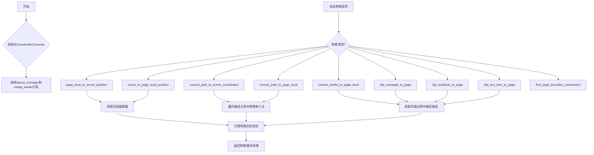
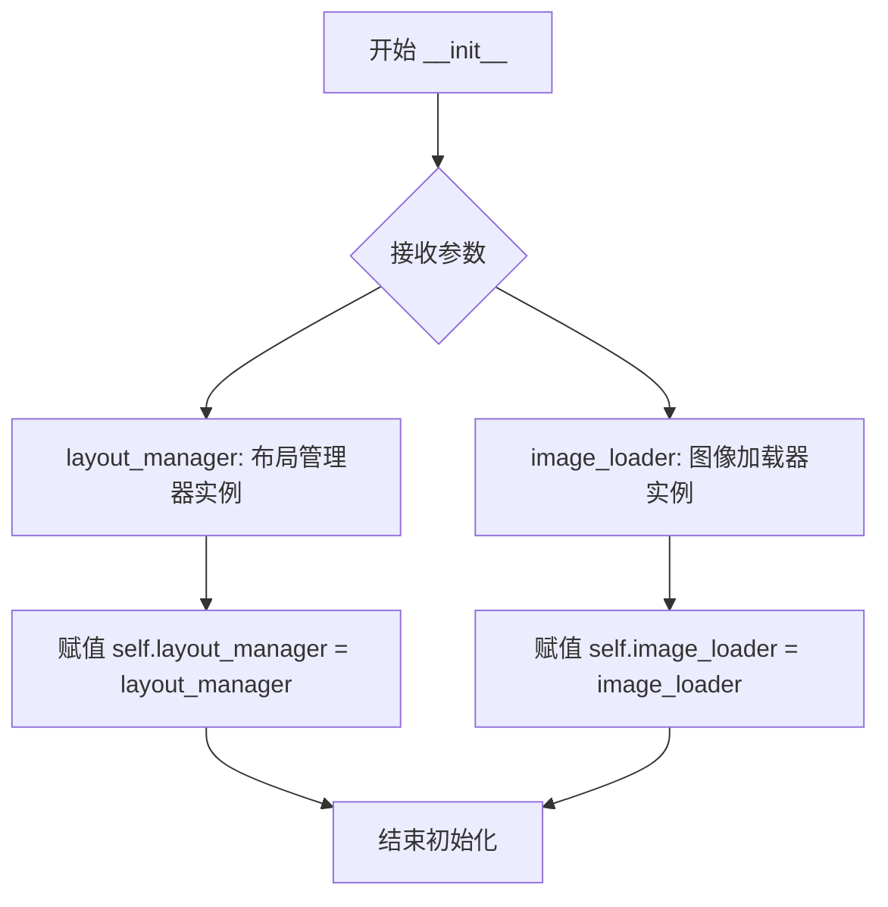
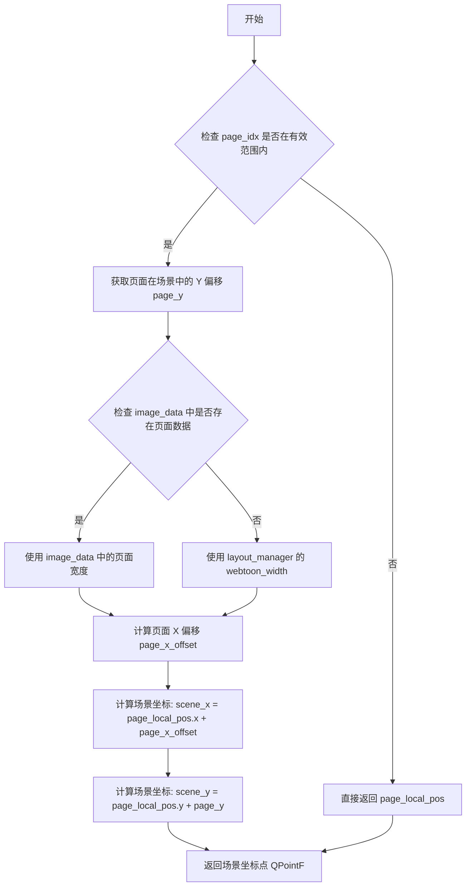
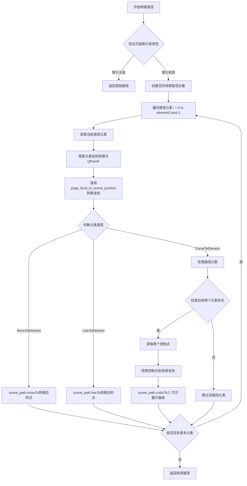
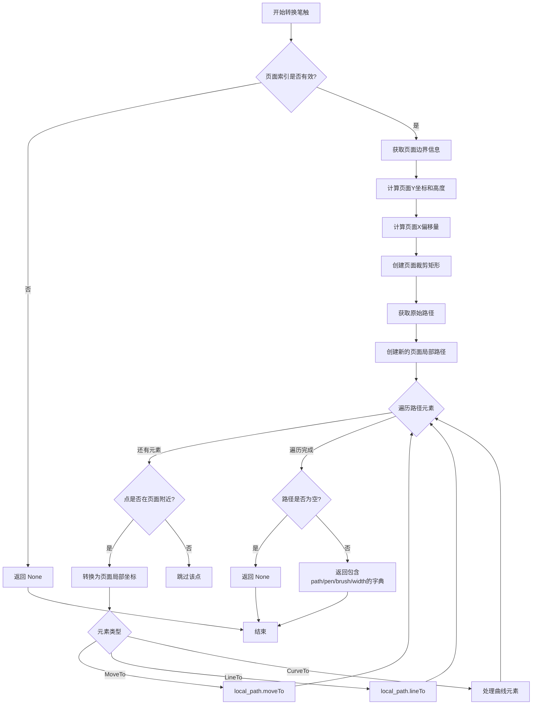
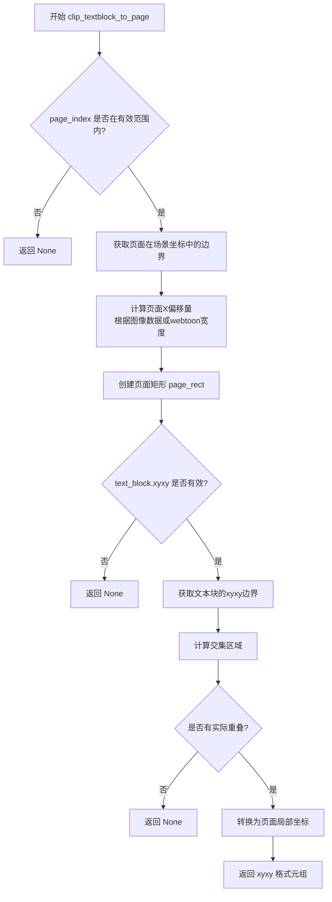
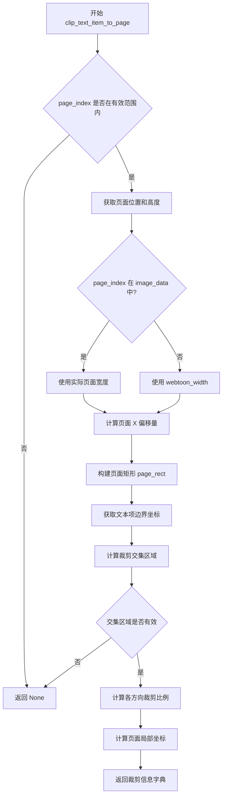
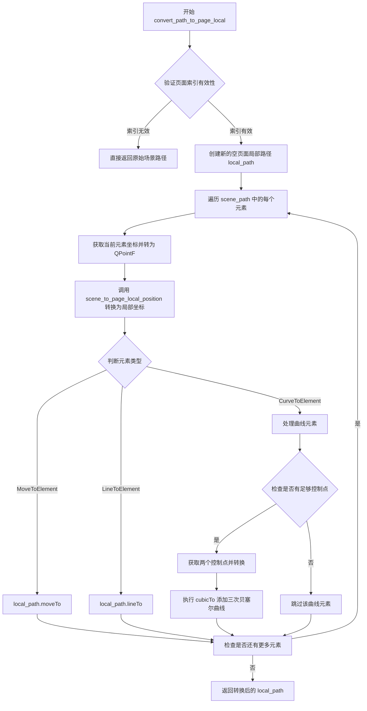

# `comic-translate\app\ui\canvas\webtoons\coordinate_converter.py` 详细设计文档

CoordinateConverter是一个用于Webtoon漫画管理器的坐标转换类，负责在页面局部坐标和场景坐标之间进行转换，支持笔触路径、矩形、文本块和文本项的裁剪与坐标转换。该类是无状态的，依赖于LayoutManager和ImageLoader提供的数据。

## 整体流程



## 类结构

```
CoordinateConverter (坐标转换器)
└── 依赖: LayoutManager, ImageLoader
```

## 全局变量及字段


### `CoordinateConverter.layout_manager`
    
布局管理器引用，提供页面位置和图像高度信息

类型：`object`
    


### `CoordinateConverter.image_loader`
    
图像加载器引用，提供图像数据

类型：`object`
    
    

## 全局函数及方法


### `CoordinateConverter.__init__`

初始化坐标转换器，接收布局管理器和图像加载器实例，建立对外部数据源的引用关系。

参数：

- `layout_manager`：`object`，布局管理器实例，用于获取页面位置和布局信息
- `image_loader`：`object`，图像加载器实例，用于获取图像数据

返回值：`None`，无返回值，仅完成对象属性的初始化

#### 流程图



#### 带注释源码

```python
def __init__(self, layout_manager, image_loader):
    """
    Initializes the converter with references to the data owners.
    This class does not own any state itself.
    
    参数:
        layout_manager: 布局管理器实例，提供页面位置(image_positions)、页面高度(image_heights)、
                       Webtoon宽度(webtoon_width)等布局信息
        image_loader: 图像加载器实例，提供图像数据(image_data)，包含各页面的图像矩阵信息
    
    返回值:
        None
    
    说明:
        CoordinateConverter 是一个无状态类，它本身不存储任何数据。
        所有的坐标转换操作都依赖于 layout_manager 和 image_loader 提供的实时数据。
        这种设计使得该类成为一个纯粹的转换工具，易于测试和复用。
    """
    # 存储对布局管理器的引用，用于获取页面偏移量和布局信息
    self.layout_manager = layout_manager
    
    # 存储对图像加载器的引用，用于获取图像宽度等数据
    self.image_loader = image_loader
```


### `CoordinateConverter.page_local_to_scene_position`

将页面局部坐标转换为场景坐标。

参数：

-  `page_local_pos`：`QPointF`，页面局部坐标点
-  `page_idx`：`int`，页面索引

返回值：`QPointF`，场景坐标

#### 流程图



#### 带注释源码

```python
def page_local_to_scene_position(self, page_local_pos: QPointF, page_idx: int) -> QPointF:
    """Convert page-local coordinates to scene coordinates."""
    # 1. 边界检查：验证页面索引是否在有效范围内
    if not (0 <= page_idx < len(self.layout_manager.image_positions)):
        # 无效索引直接返回原始坐标，不进行转换
        return page_local_pos
        
    # 2. 获取页面在场景中的 Y 轴偏移位置
    # layout_manager.image_positions 存储了每个页面在场景中的 Y 起始位置
    page_y = self.layout_manager.image_positions[page_idx]
    
    # 3. 计算页面 X 轴偏移（用于在 webtoon 模式下居中显示）
    # 从 image_loader 获取图像数据
    image_data = self.image_loader.image_data
    
    # 判断该页面是否有加载的图像数据
    if page_idx in image_data:
        # 使用实际图像宽度
        page_width = image_data[page_idx].shape[1]
    else:
        # 使用默认的 webtoon 宽度
        page_width = self.layout_manager.webtoon_width
    
    # 计算居中偏移：(总宽度 - 页面宽度) / 2
    page_x_offset = (self.layout_manager.webtoon_width - page_width) / 2
    
    # 4. 将页面局部坐标转换为场景坐标
    # X 坐标需要加上页面在场景中的 X 偏移
    scene_x = page_local_pos.x() + page_x_offset
    # Y 坐标需要加上页面在场景中的 Y 偏移
    scene_y = page_local_pos.y() + page_y
    
    # 5. 返回转换后的场景坐标点
    return QPointF(scene_x, scene_y)
```


### `CoordinateConverter.scene_to_page_local_position`

将场景坐标（Scene Coordinates）转换为页面局部坐标（Page-Local Coordinates）。该方法首先验证页面索引的有效性，然后获取页面在场景中的垂直偏移量，计算页面水平居中的偏移量，最后通过减去相应的偏移量得到页面局部坐标。

参数：

- `scene_pos`：`QPointF`，场景坐标点，表示在完整场景中的位置
- `page_idx`：`int`，页面索引，用于指定目标页面的编号

返回值：`QPointF`，页面局部坐标，转换后在特定页面坐标系中的位置

#### 流程图

```mermaid
flowchart TD
    A[开始: scene_to_page_local_position] --> B{检查 page_idx 是否在有效范围内}
    B -->|无效| C[直接返回原始 scene_pos]
    B -->|有效| D[获取页面垂直偏移 page_y]
    D --> E{检查 image_data 中是否存在该页面}
    E -->|是| F[从 image_data 获取页面宽度 page_width]
    E -->|否| G[使用 webtoon_width 作为页面宽度]
    F --> H[计算水平居中偏移 page_x_offset]
    G --> H
    H --> I[计算局部坐标: local_x = scene_pos.x - page_x_offset]
    I --> J[计算局部坐标: local_y = scene_pos.y - page_y]
    J --> K[返回 QPointF(local_x, local_y)]
    C --> K
```

#### 带注释源码

```python
def scene_to_page_local_position(self, scene_pos: QPointF, page_idx: int) -> QPointF:
    """Convert scene coordinates to page-local coordinates."""
    # 检查页面索引是否在有效范围内
    # 如果索引无效（如负数或超出已有页面数量），直接返回原始场景坐标
    if not (0 <= page_idx < len(self.layout_manager.image_positions)):
        return scene_pos
        
    # 从 LayoutManager 获取页面在场景中的垂直偏移量
    # image_positions 存储了每个页面起始位置的 Y 坐标
    page_y = self.layout_manager.image_positions[page_idx]
    
    # 计算页面水平偏移量（网页漫画模式下页面居中显示）
    # 获取图像数据
    image_data = self.image_loader.image_data
    # 检查该页面的图像数据是否存在
    if page_idx in image_data:
        # 从加载的图像数据中获取页面宽度（图像的实际宽度）
        page_width = image_data[page_idx].shape[1]
    else:
        # 如果图像未加载，使用默认的网页漫画宽度
        page_width = self.layout_manager.webtoon_width
    
    # 计算居中偏移：总宽度减去页面宽度，再除以2得到居中的偏移量
    page_x_offset = (self.layout_manager.webtoon_width - page_width) / 2
    
    # 将场景坐标转换为页面局部坐标
    # 局部X坐标 = 场景X坐标 - 页面水平偏移量
    local_x = scene_pos.x() - page_x_offset
    # 局部Y坐标 = 场景Y坐标 - 页面垂直偏移量
    local_y = scene_pos.y() - page_y
    
    # 返回转换后的页面局部坐标点
    return QPointF(local_x, local_y)
```


### `CoordinateConverter.convert_path_to_scene_coordinates`

将页面局部笔触路径（QPainterPath）转换为场景坐标路径，处理路径中的移动、线条和曲线元素，确保笔触在不同页面坐标系间正确映射。

参数：

- `page_local_path`：`QPainterPath`，页面局部坐标的笔触路径
- `page_idx`：`int`，页面索引

返回值：`QPainterPath`，转换后的场景坐标路径

#### 流程图



#### 带注释源码

```python
def convert_path_to_scene_coordinates(self, page_local_path: QPainterPath, page_idx: int) -> QPainterPath:
    """Convert a page-local brush path to scene coordinates."""
    # 步骤1：验证页面索引有效性
    # 检查page_idx是否在有效范围内（0 到 image_positions列表长度-1）
    # 如果索引无效，直接返回原始的页面局部路径，不进行转换
    if not (0 <= page_idx < len(self.layout_manager.image_positions)):
        return page_local_path
        
    # 步骤2：创建用于存储转换后路径的新QPainterPath对象
    # 场景路径将包含所有转换后的坐标点
    scene_path = QPainterPath()
    
    # 步骤3：遍历输入路径的每个元素
    # QPainterPath由多个元素组成，每个元素可以是MoveTo、LineTo或CurveTo类型
    for i in range(page_local_path.elementCount()):
        # 获取当前索引处的路径元素
        element = page_local_path.elementAt(i)
        
        # 将元素坐标(x, y)转换为Qt的QPointF对象
        # 元素使用element.x和element.y访问坐标
        page_local_point = QPointF(element.x, element.y)
        
        # 调用内部方法将页面局部坐标转换为场景坐标
        # 该方法会考虑页面的X偏移（居中）和Y偏移（页面垂直位置）
        scene_point = self.page_local_to_scene_position(page_local_point, page_idx)
        
        # 步骤4：根据元素类型执行相应的路径操作
        if element.type == QPainterPath.ElementType.MoveToElement:
            # 移动到元素：设置路径起点，不绘制线条
            scene_path.moveTo(scene_point)
        elif element.type == QPainterPath.ElementType.LineToElement:
            # 直线元素：从上一个点绘制直线到当前点
            scene_path.lineTo(scene_point)
        elif element.type == QPainterPath.ElementType.CurveToElement:
            # 曲线元素：使用三次贝塞尔曲线
            # 曲线需要3个点：控制点1、控制点2、终点
            # 当前元素是曲线起点，后续两个元素是控制点
            
            # 检查是否有足够的元素构成完整曲线（需要i+1和i+2）
            if i + 2 < page_local_path.elementCount():
                # 获取两个控制点
                c1 = page_local_path.elementAt(i + 1)
                c2 = page_local_path.elementAt(i + 2)
                
                # 将两个控制点也转换为场景坐标
                c1_scene = self.page_local_to_scene_position(QPointF(c1.x, c1.y), page_idx)
                c2_scene = self.page_local_to_scene_position(QPointF(c2.x, c2.y), page_idx)
                
                # 使用三次贝塞尔曲线连接点
                # cubicTo(控制点1, 控制点2, 终点)
                scene_path.cubicTo(scene_point, c1_scene, c2_scene)
    
    # 步骤5：返回转换完成的场景坐标路径
    return scene_path
```


### `CoordinateConverter.convert_stroke_to_page_local`

将笔触（stroke_item）从场景坐标转换为页面局部坐标，并裁剪到页面边界范围内。

参数：

- `stroke_item`：`object`，笔触项，包含路径、画笔和画刷信息的图形项
- `page_idx`：`int`，目标页面的索引

返回值：`Optional[dict]`：转换后的笔触数据字典，包含路径、颜色和宽度信息；如果页面索引无效则返回 `None`

#### 流程图



#### 带注释源码

```python
def convert_stroke_to_page_local(self, stroke_item, page_idx: int) -> Optional[dict]:
    """
    将笔触转换为页面局部坐标并裁剪到页面边界。
    
    参数:
        stroke_item: 笔触项，包含路径(path)、画笔(pen)和画刷(brush)的图形项
        page_idx: 目标页面的索引
    
    返回:
        包含转换后笔触信息的字典，如果页面索引无效则返回None
    """
    
    # 步骤1: 验证页面索引有效性
    # 检查页面索引是否在有效范围内（0 到 image_positions 长度-1）
    if not (0 <= page_idx < len(self.layout_manager.image_positions)):
        return None  # 页面索引无效，直接返回None
        
    # 步骤2: 获取页面边界信息
    # 从 LayoutManager 获取页面在场景中的Y坐标位置
    page_y = self.layout_manager.image_positions[page_idx]
    # 获取页面高度
    page_height = self.layout_manager.image_heights[page_idx]
    # 计算页面底部Y坐标（场景坐标）
    page_bottom = page_y + page_height
    
    # 步骤3: 计算页面X偏移量
    # 在网页条模式下，页面居中显示，需要计算X偏移量
    image_data = self.image_loader.image_data
    if page_idx in image_data:
        # 如果图像数据存在，获取实际图像宽度
        page_width = image_data[page_idx].shape[1]
    else:
        # 否则使用默认的网页条宽度
        page_width = self.layout_manager.webtoon_width
    # 计算居中偏移量：(总宽度 - 页面宽度) / 2
    page_x_offset = (self.layout_manager.webtoon_width - page_width) / 2
    
    # 步骤4: 创建页面裁剪矩形（场景坐标）
    # 用于后续判断点是否在页面范围内
    page_rect = QRectF(page_x_offset, page_y, page_width, page_height)
    
    # 步骤5: 获取原始笔触路径（场景坐标）
    # 从笔触项中获取QPainterPath对象
    original_path = stroke_item.path()
    
    # 步骤6: 创建新的路径用于存储页面局部坐标
    local_path = QPainterPath()
    
    # 步骤7: 遍历原始路径的每个元素
    for i in range(original_path.elementCount()):
        # 获取当前元素
        element = original_path.elementAt(i)
        # 构造场景坐标点
        scene_point = QPointF(element.x, element.y)
        
        # 步骤7a: 过滤只在当前页面附近的内容
        # 保留页面上下边界外50像素范围内的点（处理跨页面笔触）
        if (scene_point.y() >= page_y - 50 and scene_point.y() <= page_bottom + 50):
            # 步骤7b: 将场景坐标转换为页面局部坐标
            local_point = self.scene_to_page_local_position(scene_point, page_idx)
            
            # 步骤7c: 根据元素类型添加点到局部路径
            if element.type == QPainterPath.ElementType.MoveToElement:
                local_path.moveTo(local_point)
            elif element.type == QPainterPath.ElementType.LineToElement:
                local_path.lineTo(local_point)
            elif element.type == QPainterPath.ElementType.CurveToElement:
                # 处理贝塞尔曲线元素（需要三个点：控制点1、控制点2、终点）
                if i + 2 < original_path.elementCount():
                    c1 = original_path.elementAt(i + 1)
                    c2 = original_path.elementAt(i + 2)
                    # 转换控制点到局部坐标
                    c1_local = self.scene_to_page_local_position(QPointF(c1.x, c1.y), page_idx)
                    c2_local = self.scene_to_page_local_position(QPointF(c2.x, c2.y), page_idx)
                    # 添加三次贝塞尔曲线
                    local_path.cubicTo(local_point, c1_local, c2_local)
    
    # 步骤8: 检查转换后的路径是否有实际内容
    if not local_path.isEmpty():
        # 步骤9: 构建返回字典，包含笔触的视觉属性
        return {
            'path': local_path,  # 转换后的局部坐标路径
            'pen': stroke_item.pen().color().name() if hasattr(stroke_item, 'pen') else '#80ff0000',
            'brush': stroke_item.brush().color().name() if hasattr(stroke_item, 'brush') else '#00000000',
            'width': stroke_item.pen().width() if hasattr(stroke_item, 'pen') else 25
        }
    
    # 如果路径为空（没有内容落在当前页面），返回None
    return None
```


### `CoordinateConverter.clip_rectangle_to_page`

将矩形裁剪到页面边界并返回页面局部坐标

参数：

-  `self`：`CoordinateConverter`，类的实例引用
-  `rect_item`：`object`，矩形项（通常为 QGraphicsRectItem 或类似对象）
-  `page_index`：`int`，页面索引

返回值：`Optional[tuple]`，如果裁剪成功返回页面局部坐标元组 (x, y, width, height)，否则返回 None

#### 流程图

```mermaid
flowchart TD
    A[开始 clip_rectangle_to_page] --> B{page_index 是否在有效范围内}
    B -->|否| C[返回 None]
    B -->|是| D[获取页面边界信息]
    D --> E[获取 page_y 和 page_height]
    E --> F{page_index 是否在 image_data 中}
    F -->|是| G[获取实际 page_width]
    F -->|否| H[使用 webtoon_width]
    G --> I[计算 page_x_offset]
    H --> I
    I --> J[创建页面边界矩形 page_rect]
    J --> K[获取矩形项的位置和尺寸]
    K --> L[计算裁剪后的左、上、右、下边界]
    L --> M{存在实际交集?}
    M -->|否| C
    M -->|是| N[转换为页面局部坐标]
    N --> O[返回 (local_x, local_y, local_width, local_height)]
```

#### 带注释源码

```python
def clip_rectangle_to_page(self, rect_item, page_index: int) -> Optional[tuple]:
    """Clip a rectangle to page bounds and return page-local coordinates"""
    
    # 检查页面索引是否在有效范围内
    if not (0 <= page_index < len(self.layout_manager.image_positions)):
        return None
        
    # 获取页面在场景坐标中的垂直位置和高度
    page_y = self.layout_manager.image_positions[page_index]
    page_height = self.layout_manager.image_heights[page_index]
    
    # 获取图像数据以确定实际页面宽度
    image_data = self.image_loader.image_data
    if page_index in image_data:
        # 使用图像的实际宽度
        page_width = image_data[page_index].shape[1]
    else:
        # 退回到 webtoon 模式默认宽度
        page_width = self.layout_manager.webtoon_width
    
    # 计算页面水平偏移量（用于居中显示）
    page_x_offset = (self.layout_manager.webtoon_width - page_width) / 2
    
    # 构建页面边界矩形（场景坐标）
    page_rect = QRectF(page_x_offset, page_y, page_width, page_height)
    
    # 从矩形项获取其在场景坐标中的位置和尺寸
    rect_x = rect_item.pos().x()
    rect_y = rect_item.pos().y()
    rect_width = rect_item.boundingRect().width()
    rect_height = rect_item.boundingRect().height()
    rect_right = rect_x + rect_width
    rect_bottom = rect_y + rect_height
    
    # 计算裁剪后的矩形与页面矩形的交集
    clipped_left = max(rect_x, page_rect.left())
    clipped_top = max(rect_y, page_rect.top())
    clipped_right = min(rect_right, page_rect.right())
    clipped_bottom = min(rect_bottom, page_rect.bottom())
    
    # 检查是否存在实际的重叠区域
    if clipped_left >= clipped_right or clipped_top >= clipped_bottom:
        return None
        
    # 将裁剪后的坐标转换为页面局部坐标（相对于页面左上角）
    local_x = clipped_left - page_x_offset
    local_y = clipped_top - page_y
    local_width = clipped_right - clipped_left
    local_height = clipped_bottom - clipped_top
    
    # 返回页面局部坐标元组 (x, y, width, height)
    return (local_x, local_y, local_width, local_height)
```


### `CoordinateConverter.clip_textblock_to_page`

将文本块的边界矩形裁剪到页面边界内，并返回裁剪后文本块在页面局部坐标系中的坐标（xyxy格式）。该方法首先获取页面在场景坐标系中的边界，然后计算文本块与页面的交集区域，最后将交集区域转换为页面局部坐标。

参数：

- `text_block`：`object`，文本块对象，需包含 xyxy 属性表示场景坐标系中的边界（xyxy格式：[左, 上, 右, 下]）
- `page_index`：`int`，页面索引，用于定位目标页面

返回值：`Optional[tuple]`，如果裁剪成功返回页面局部坐标的 xyxy 格式元组 (local_x1, local_y1, local_x2, local_y2)，否则返回 None

#### 流程图



#### 带注释源码

```python
def clip_textblock_to_page(self, text_block, page_index: int) -> Optional[tuple]:
    """Clip a text block to page bounds and return page-local coordinates"""
    # 参数校验：检查页面索引是否在有效范围内
    # layout_manager.image_positions 存储了每页在场景中的Y偏移量
    if not (0 <= page_index < len(self.layout_manager.image_positions)):
        return None
        
    # 从 LayoutManager 获取页面在场景坐标系中的边界信息
    # page_y: 页面顶部在场景坐标系中的Y坐标
    page_y = self.layout_manager.image_positions[page_index]
    # page_height: 页面高度
    page_height = self.layout_manager.image_heights[page_index]
    
    # 计算页面的X偏移量（用于处理Webtoon模式下页面居中显示）
    # 优先使用实际图像数据宽度，否则使用Webtoon默认宽度
    image_data = self.image_loader.image_data
    if page_index in image_data:
        # 从NumPy数组获取图像宽度（shape[1]为宽度）
        page_width = image_data[page_index].shape[1]
    else:
        # 备用：使用配置的Webtoon宽度
        page_width = self.layout_manager.webtoon_width
    # 计算居中偏移量：(总宽度 - 页面宽度) / 2
    page_x_offset = (self.layout_manager.webtoon_width - page_width) / 2
    
    # 构建页面在场景坐标系中的矩形区域
    # page_rect: 完整页面在场景中的可见区域
    page_rect = QRectF(page_x_offset, page_y, page_width, page_height)
    
    # 从文本块获取边界框（xyxy格式：[左, 上, 右, 下]）
    # xyxy格式：x1=左边缘, y1=上边缘, x2=右边缘, y2=下边缘
    if text_block.xyxy is None or len(text_block.xyxy) < 4:
        return None
        
    # 提取文本块在场景坐标系中的边界
    rect_x = text_block.xyxy[0]      # 左边缘X坐标
    rect_y = text_block.xyxy[1]      # 上边缘Y坐标
    rect_right = text_block.xyxy[2]  # 右边缘X坐标
    rect_bottom = text_block.xyxy[3] # 下边缘Y坐标
    rect_width = rect_right - rect_x # 计算宽度
    rect_height = rect_bottom - rect_y # 计算高度
    
    # 计算文本块与页面矩形的交集区域
    # 使用max取较大值确保不超出页面左边界，使用min取较小值确保不超出右边界
    clipped_left = max(rect_x, page_rect.left())
    clipped_top = max(rect_y, page_rect.top())
    clipped_right = min(rect_right, page_rect.right())
    clipped_bottom = min(rect_bottom, page_rect.bottom())
    
    # 检查是否有实际的重叠区域
    # 条件：裁剪后的左边缘 < 右边缘 且 上边缘 < 下边缘
    if clipped_left >= clipped_right or clipped_top >= clipped_bottom:
        return None
        
    # 将裁剪后的坐标转换为页面局部坐标系
    # 局部坐标 = 场景坐标 - 页面偏移量
    local_x = clipped_left - page_x_offset
    local_y = clipped_top - page_y
    local_width = clipped_right - clipped_left
    local_height = clipped_bottom - clipped_top
    
    # 返回xyxy格式的页面局部坐标
    # 从(左上角X, 左上角Y, 宽度, 高度)转换为(x1, y1, x2, y2)格式
    return (local_x, local_y, local_x + local_width, local_y + local_height)  # Return as xyxy format
```


### CoordinateConverter.clip_text_item_to_page

将文本项裁剪到页面边界，处理跨页文本分割。该方法通过计算文本项与页面矩形的交集，确定裁剪比例和页面局部坐标，支持文本内容在多页面间的精确分割与定位。

参数：

- `self`：`CoordinateConverter`，CoordinateConverter 实例本身，用于访问类成员变量和方法
- `text_item`：`object`，文本项对象，需要包含 pos() 方法获取位置和 boundingRect() 方法获取边界矩形
- `page_index`：`int`，页面索引，指定目标页面的编号，用于从 LayoutManager 获取页面位置信息

返回值：`Optional[dict]` ，返回包含裁剪信息的字典，如果文本项与页面无交集则返回 None。字典包含以下键：
- `clipped_bounds`：裁剪后的边界 (local_x, local_y, width, height)
- `clip_ratios`：裁剪比例字典 {top, bottom, left, right}
- `original_size`：原始文本尺寸 (width, height)
- `page_bounds`：页面尺寸 (page_width, page_height)

#### 流程图



#### 带注释源码

```python
def clip_text_item_to_page(self, text_item, page_index: int) -> Optional[dict]:
    """
    Clip a text item to page bounds and return clipped text data.
    For text items that span multiple pages, this handles text splitting.
    
    该方法实现了文本项的页面裁剪功能，主要步骤包括：
    1. 验证页面索引有效性
    2. 获取页面边界信息（从 LayoutManager）
    3. 计算页面 X 轴偏移量（处理页面居中显示）
    4. 计算文本项与页面的交集区域
    5. 计算裁剪比例用于文本内容分割
    6. 转换为页面局部坐标系并返回结果
    """
    # Step 1: 验证页面索引是否在有效范围内
    # 如果页面索引超出范围，返回 None 表示无法处理
    if not (0 <= page_index < len(self.layout_manager.image_positions)):
        return None
        
    # Step 2: 从 LayoutManager 获取页面在场景坐标系中的位置信息
    # page_y 表示页面顶部在场景坐标系中的 Y 坐标
    page_y = self.layout_manager.image_positions[page_index]
    # page_height 表示页面在场景坐标系中的高度
    page_height = self.layout_manager.image_heights[page_index]
    
    # Step 3: 计算页面 X 轴偏移量
    # 在 Webtoon 模式下，页面可能不是左对齐的，需要计算偏移量使页面居中
    image_data = self.image_loader.image_data
    if page_index in image_data:
        # 如果图像加载器中已有该页面的图像数据，使用实际图像宽度
        page_width = image_data[page_index].shape[1]
    else:
        # 否则使用默认的 Webtoon 宽度
        page_width = self.layout_manager.webtoon_width
    # 计算居中偏移量：偏移 = (总宽度 - 页面宽度) / 2
    page_x_offset = (self.layout_manager.webtoon_width - page_width) / 2
    
    # Step 4: 构建页面边界矩形（场景坐标系）
    # QRectF(x, y, width, height) - 左上角坐标 + 宽高
    page_rect = QRectF(page_x_offset, page_y, page_width, page_height)
    
    # Step 5: 获取文本项在场景坐标系中的边界信息
    # 通过 pos() 方法获取文本项的左上角坐标
    text_x = text_item.pos().x()
    text_y = text_item.pos().y()
    # 通过 boundingRect() 获取文本项的宽高
    text_width = text_item.boundingRect().width()
    text_height = text_item.boundingRect().height()
    # 计算右下角坐标
    text_right = text_x + text_width
    text_bottom = text_y + text_height
    
    # Step 6: 计算文本项边界与页面边界的交集区域
    # 使用 max/min 函数计算裁剪后的边界
    clipped_left = max(text_x, page_rect.left())     # 取两者中较大的值
    clipped_top = max(text_y, page_rect.top())       # 取两者中较大的值
    clipped_right = min(text_right, page_rect.right())  # 取两者中较小的值
    clipped_bottom = min(text_bottom, page_rect.bottom())  # 取两者中较小的值
    
    # Step 7: 检查是否存在有效交集
    # 如果左 >= 右 或 上 >= 下，表示没有交集
    if clipped_left >= clipped_right or clipped_top >= clipped_bottom:
        return None
    
    # Step 8: 计算裁剪比例
    # 裁剪比例用于后续文本内容的分割（例如：保留上半部分或下半部分）
    # top_clip_ratio: 顶部裁剪比例（0 表示从顶部开始，0.5 表示从中间开始）
    top_clip_ratio = max(0, (clipped_top - text_y) / text_height) if text_height > 0 else 0
    bottom_clip_ratio = min(1, (clipped_bottom - text_y) / text_height) if text_height > 0 else 1
    left_clip_ratio = max(0, (clipped_left - text_x) / text_width) if text_width > 0 else 0
    right_clip_ratio = min(1, (clipped_right - text_x) / text_width) if text_width > 0 else 1
    
    # Step 9: 将裁剪后的坐标转换为页面局部坐标系
    # 页面局部坐标系：相对于页面左上角的坐标 (0, 0)
    local_x = clipped_left - page_x_offset
    local_y = clipped_top - page_y
    
    # Step 10: 返回包含裁剪信息的字典
    return {
        # 裁剪后的边界框（页面局部坐标）
        'clipped_bounds': (local_x, local_y, clipped_right - clipped_left, clipped_bottom - clipped_top),
        # 四个方向的裁剪比例，用于文本内容分割
        'clip_ratios': {
            'top': top_clip_ratio,
            'bottom': bottom_clip_ratio,
            'left': left_clip_ratio,
            'right': right_clip_ratio
        },
        # 原始文本尺寸（用于恢复或缩放）
        'original_size': (text_width, text_height),
        # 页面尺寸信息
        'page_bounds': (page_width, page_height)
    }
```


### `CoordinateConverter.find_page_boundary_intersection`

查找线段与页面边界矩形的交点，并将交点坐标从场景坐标系转换为页面局部坐标系。

参数：

- `point1`：`QPointF`，线段起点
- `point2`：`QPointF`，线段终点
- `page_bounds`：`QRectF`，页面边界矩形（场景坐标系）
- `target_page_index`：`int`，目标页面索引

返回值：`Optional[QPointF]` ，返回线段与页面边界在页面局部坐标系下的交点，若无交点则返回 `None`

#### 流程图

```mermaid
flowchart TD
    A[开始] --> B[提取point1和point2的x, y坐标]
    B --> C[获取页面边界的left, right, top, bottom]
    C --> D[初始化空列表intersections]
    
    D --> E{检查x1 != x2<br/>避免除零}
    E -->|是| F[计算与左边缘的交点]
    E -->|否| G
    
    F --> H{0 <= t <= 1 且<br/>top <= y <= bottom}
    H -->|是| I[计算场景坐标交点]
    I --> J[转换为页面局部坐标]
    J --> K[添加到intersections]
    H -->|否| G
    
    K --> G{检查x1 != x2<br/>避免除零}
    G -->|是| L[计算与右边缘的交点]
    G --> M
    
    L --> N{0 <= t <= 1 且<br/>top <= y <= bottom}
    N -->|是| O[计算场景坐标交点]
    O --> P[转换为页面局部坐标]
    P --> Q[添加到intersections]
    N -->|否| M
    
    Q --> M{检查y1 != y2<br/>避免除零}
    M -->|是| R[计算与上边缘的交点]
    M --> S
    
    R --> T{0 <= t <= 1 且<br/>left <= x <= right}
    T -->|是| U[计算场景坐标交点]
    U --> V[转换为页面局部坐标]
    V --> W[添加到intersections]
    T -->|否| S
    
    W --> S{检查y1 != y2<br/>避免除零}
    S -->|是| X[计算与下边缘的交点]
    S --> Y
    
    X --> Z{0 <= t <= 1 且<br/>left <= x <= right}
    Z -->|是| AA[计算场景坐标交点]
    AA --> AB[转换为页面局部坐标]
    AB --> AC[添加到intersections]
    Z -->|否| Y
    
    AC --> Y{intersections<br/>非空?}
    Y -->|是| AD[返回intersections[0]]
    Y -->|否| AE[返回None]
    
    AD --> AF[结束]
    AE --> AF
```

#### 带注释源码

```python
def find_page_boundary_intersection(self, point1: QPointF, point2: QPointF, 
                                  page_bounds: QRectF, target_page_index: int) -> Optional[QPointF]:
    """Find where a line segment intersects with page boundaries."""
    # 提取线段起终点坐标
    x1, y1 = point1.x(), point1.y()
    x2, y2 = point2.x(), point2.y()
    
    # 从页面边界矩形中提取四条边的坐标（场景坐标系）
    left = page_bounds.left()    # 左边界x坐标
    right = page_bounds.right()  # 右边界x坐标
    top = page_bounds.top()      # 上边界y坐标
    bottom = page_bounds.bottom() # 下边界y坐标
    
    # 用于存储所有找到的交点
    intersections = []
    
    # ---------- 左边缘检测 ----------
    # 使用参数方程: P = P1 + t * (P2 - P1)
    # 当 x = left 时, t = (left - x1) / (x2 - x1)
    if x1 != x2:  # 避免除零错误（垂直线段）
        t = (left - x1) / (x2 - x1)
        # t必须在[0,1]范围内表示线段上的点
        if 0 <= t <= 1:
            # 计算对应的y坐标
            y = y1 + t * (y2 - y1)
            # 检查交点是否在页面的垂直范围内
            if top <= y <= bottom:
                # 构建场景坐标交点
                scene_point = QPointF(left, y)
                # 转换为页面局部坐标系
                local_point = self.scene_to_page_local_position(scene_point, target_page_index)
                intersections.append(local_point)
    
    # ---------- 右边缘检测 ----------
    if x1 != x2:  # 避免除零错误
        t = (right - x1) / (x2 - x1)
        if 0 <= t <= 1:
            y = y1 + t * (y2 - y1)
            if top <= y <= bottom:
                scene_point = QPointF(right, y)
                local_point = self.scene_to_page_local_position(scene_point, target_page_index)
                intersections.append(local_point)
    
    # ---------- 上边缘检测 ----------
    if y1 != y2:  # 避免除零错误（水平线段）
        t = (top - y1) / (y2 - y1)
        if 0 <= t <= 1:
            x = x1 + t * (x2 - x1)
            # 检查交点是否在页面的水平范围内
            if left <= x <= right:
                scene_point = QPointF(x, top)
                local_point = self.scene_to_page_local_position(scene_point, target_page_index)
                intersections.append(local_point)
    
    # ---------- 下边缘检测 ----------
    if y1 != y2:  # 避免除零错误
        t = (bottom - y1) / (y2 - y1)
        if 0 <= t <= 1:
            x = x1 + t * (x2 - x1)
            if left <= x <= right:
                scene_point = QPointF(x, bottom)
                local_point = self.scene_to_page_local_position(scene_point, target_page_index)
                intersections.append(local_point)
    
    # 返回第一个交点（可优化：选择最近的交点）
    # 如果没有交点，返回None
    return intersections[0] if intersections else None
```


### `CoordinateConverter.convert_path_to_page_local`

将场景坐标系的笔触路径（QPainterPath）转换为指定页面索引对应的页面局部坐标系路径。该方法通过遍历路径中的每个元素（MoveTo、LineTo、CurveTo），调用内部转换方法 `scene_to_page_local_position` 将场景坐标转换为页面局部坐标，最终返回转换后的页面局部路径。

参数：

- `scene_path`：`QPainterPath`，场景坐标的笔触路径
- `page_idx`：`int`，页面索引

返回值：`QPainterPath`，页面局部坐标的笔触路径

#### 流程图



#### 带注释源码

```python
def convert_path_to_page_local(self, scene_path: QPainterPath, page_idx: int) -> QPainterPath:
    """Convert a scene-coordinate brush path to page-local coordinates."""
    
    # 边界检查：验证页面索引是否在有效范围内
    # 如果页面索引无效（小于0或超出已加载页面数），直接返回原始场景路径
    if not (0 <= page_idx < len(self.layout_manager.image_positions)):
        return scene_path
        
    # 创建一个新的空路径用于存储页面局部坐标系的路径
    local_path = QPainterPath()
    
    # 遍历场景路径中的每个元素（点、线段、曲线）
    for i in range(scene_path.elementCount()):
        # 获取当前元素（包含坐标和类型信息）
        element = scene_path.elementAt(i)
        
        # 将元素坐标转换为 QPointF 对象
        scene_point = QPointF(element.x, element.y)
        
        # 调用内部方法将场景坐标转换为页面局部坐标
        local_point = self.scene_to_page_local_position(scene_point, page_idx)
        
        # 根据元素类型执行相应的路径操作
        if element.type == QPainterPath.ElementType.MoveToElement:
            # 移动到目标点（路径起点）
            local_path.moveTo(local_point)
        elif element.type == QPainterPath.ElementType.LineToElement:
            # 绘制直线到目标点
            local_path.lineTo(local_point)
        elif element.type == QPainterPath.ElementType.CurveToElement:
            # 处理曲线元素（三次贝塞尔曲线需要3个点：起点+2个控制点）
            # 检查是否有足够的控制点（当前点+2个控制点）
            if i + 2 < scene_path.elementCount():
                # 获取两个控制点
                c1 = scene_path.elementAt(i + 1)
                c2 = scene_path.elementAt(i + 2)
                
                # 将控制点从场景坐标转换为页面局部坐标
                c1_local = self.scene_to_page_local_position(QPointF(c1.x, c1.y), page_idx)
                c2_local = self.scene_to_page_local_position(QPointF(c2.x, c2.y), page_idx)
                
                # 添加三次贝塞尔曲线到路径
                # 参数顺序：终点、控制点1、控制点2
                local_path.cubicTo(local_point, c1_local, c2_local)
    
    # 返回转换完成的页面局部坐标路径
    return local_path
```

## 关键组件


### CoordinateConverter

处理Webtoon模式下页面局部坐标与场景坐标之间的转换，包括路径、笔触、矩形、文本块等图形元素的坐标转换与裁剪，支持跨页元素的边界处理。

### 坐标转换核心

负责页面局部坐标与场景坐标之间的双向转换，计算页面在场景中的偏移量（Webtoon模式下页面居中），处理QPointF、QPainterPath等Qt图形对象的坐标变换。

### 路径转换

将页面局部坐标的画笔路径（QPainterPath）转换为场景坐标，或反向转换，支持MoveTo、LineTo、CurveTo等多种路径元素的处理。

### 笔触裁剪

将场景坐标的笔触（stroke_item）裁剪到页面边界内，转换为页面局部坐标，过滤掉不属于当前页面的内容，保留页边距50像素的缓冲区域。

### 矩形裁剪

将矩形元素（rect_item）裁剪到页面边界内，返回页面局部坐标的(x, y, width, height)元组，处理矩形与页面的交集计算。

### 文本块裁剪

将文本块（text_block）裁剪到页面边界，返回xyxy格式的页面局部坐标，处理文本块的边界框交集计算。

### 文本项裁剪

将文本项（text_item）裁剪到页面边界，计算裁剪比例用于文本分割，返回包含裁剪边界、裁剪比例、原始尺寸和页面边界的字典。

### 页面边界交点查找

计算线段与页面边界（left、right、top、bottom）的交点，返回页面局部坐标的交点，支持跨越页面边界的图形元素处理。

### LayoutManager依赖

提供页面在场景中的垂直位置（image_positions）和页面高度（image_heights），管理Webtoon模式的画布宽度（webtoon_width）。

### ImageLoader依赖

提供图像数据（image_data），包含每页图像的NumPy数组（shape[1]为宽度），用于获取实际页面宽度以计算居中偏移。

## 问题及建议


### 已知问题

-   **重复代码严重**：多个方法中存在相同的页面边界计算逻辑（获取 `page_y`、`page_height`、`page_width`、`page_x_offset`），如 `page_local_to_scene_position`、`scene_to_page_local_position`、`convert_stroke_to_page_local`、`clip_rectangle_to_page` 等方法都有完全相同的边界计算代码块，违反 DRY 原则。
-   **循环逻辑错误风险**：`convert_stroke_to_page_local` 和 `convert_path_to_scene_coordinates` 方法中处理 `CurveToElement` 时，循环内手动访问 `i+1` 和 `i+2`，但外层循环仍使用 `i += 1`，导致元素被重复处理或索引越界风险。
-   **硬编码 Magic Number**：`convert_stroke_to_page_local` 中使用硬编码的 `50` 作为页面垂直方向的容差值（`scene_point.y() >= page_y - 50`），缺乏注释说明其含义和来源。
-   **属性访问缺乏防御性检查**：多处直接调用 `stroke_item.pen().color().name()` 和 `stroke_item.brush().color().name()`，未检查 `pen` 或 `brush` 是否存在，可能在特定条件下抛出 `AttributeError`。
-   **缺少空值检查**：访问 `self.image_loader.image_data` 和 `image_data[page_idx].shape[1]` 时未检查 `image_data` 是否为 `None`，以及 `image_data[page_idx]` 是否存在。
-   **文档与实现不一致**：类文档声称 "stateless"，但构造函数接收 `layout_manager` 和 `image_loader` 参数，且依赖这些外部对象的状态，实质是有状态（依赖外部状态）。
-   **边界交叉点选择不优**：`find_page_boundary_intersection` 方法在有多条边界线段相交时，简单返回第一个找到的交点，可能不是预期的结果。
-   **方法职责不单一**：类混合了坐标转换（`page_local_to_scene_position`）和边界裁剪（`clip_rectangle_to_page`）两种不同职责，应考虑拆分。

### 优化建议

-   **提取公共方法**：将页面边界计算逻辑（获取 `page_x_offset`、`page_width`、`page_height`、`page_rect` 等）提取为私有方法如 `_get_page_bounds(page_idx)`，减少重复代码。
-   **修复循环逻辑**：处理 `CurveToElement` 时改用 `i += 3` 或重构为索引递增控制，避免元素重复处理和潜在越界。
-   **消除 Magic Number**：将 `50` 定义为类常量或配置参数，并添加注释说明用途（如允许笔触延伸到页面边界外的容忍度）。
-   **添加防御性检查**：在使用 `pen()` 和 `brush()` 前使用 `hasattr` 检查或 try-except 包裹；对 `image_data` 和 `page_idx` 索引越界进行提前验证。
-   **修正文档描述**：将类文档修改为准确描述其依赖外部管理器的设计，或考虑将依赖注入改为接口抽象。
-   **改进边界交叉算法**：`find_page_boundary_intersection` 可考虑计算所有交点后选择最近或最相关的点。
-   **考虑单一职责拆分**：将坐标转换功能与边界裁剪功能分离到不同的类或模块，提高可维护性。

## 其它


### 设计目标与约束

**设计目标：**
1. 提供准确的页面本地坐标与场景坐标之间的双向转换
2. 支持多种图形元素（路径、矩形、文本块）的裁剪和坐标转换
3. 作为无状态工具类，最大化复用性，最小化依赖
4. 确保在Webtoon模式下页面居中显示时的坐标计算正确性

**设计约束：**
1. 依赖外部的 `layout_manager` 和 `image_loader` 提供数据，不自行存储状态
2. 假设输入的页面索引始终有效，调用方需保证索引合法性
3. 坐标转换过程中保持浮点数精度，避免整数截断导致误差累积
4. 所有方法需在主线程中调用，非线程安全

### 错误处理与异常设计

**索引越界处理：**
- 当页面索引超出有效范围时，方法返回原始输入坐标或 `None`
- `page_local_to_scene_position`、`scene_to_page_local_position`：返回原始 `QPointF` 对象
- `convert_stroke_to_page_local`、`clip_rectangle_to_page`、`clip_textblock_to_page`、`clip_text_item_to_page`：返回 `None`

**空数据处理：**
- 当 `image_loader.image_data` 中不存在指定页面时，使用 `layout_manager.webtoon_width` 作为默认页面宽度
- 当路径为空时，直接返回空路径而不进行转换

**边界条件：**
- 裁剪结果无重叠时返回 `None`
- 文本块 `xyxy` 为 `None` 或长度不足时返回 `None`

**异常传播：**
- 本类不抛出异常，所有错误通过返回值表示
- 调用方需对返回值进行空值检查

### 数据流与状态机

**数据输入流：**
```
外部调用者 → CoordinateConverter → LayoutManager (image_positions, image_heights, webtoon_width)
                      ↓
                 ImageLoader (image_data)
```

**核心数据流：**
1. **坐标转换流程：** 接收页面本地坐标/场景坐标 + 页面索引 → 查询布局管理器获取页面偏移 → 计算转换后坐标 → 返回结果
2. **路径转换流程：** 遍历路径元素逐个转换 → 处理 MoveTo/LineTo/CurveTo 三种元素类型 → 返回转换后路径
3. **裁剪流程：** 获取页面边界 → 计算与目标元素的交集 → 转换为页面本地坐标 → 返回裁剪结果

**状态说明：**
- 本类为无状态类，不维护内部状态
- 所有状态来源于注入的 `layout_manager` 和 `image_loader`
- 调用方需确保依赖对象已正确初始化

### 外部依赖与接口契约

**依赖组件：**

| 依赖组件 | 类型 | 用途 | 必需属性 |
|---------|------|------|---------|
| `layout_manager` | 外部管理器对象 | 提供页面布局信息 | `image_positions` (list), `image_heights` (list), `webtoon_width` (int) |
| `image_loader` | 外部加载器对象 | 提供图像数据 | `image_data` (dict, key: page_idx, value: numpy array) |

**Qt类型依赖：**
- `QPointF`：二维坐标点
- `QRectF`：二维矩形区域
- `QPainterPath`：Painter路径，用于笔触和图形

**接口契约：**
1. `layout_manager.image_positions` 应为 list 类型，索引 `i` 对应第 `i` 页的 Y 轴偏移
2. `layout_manager.image_heights` 应为 list 类型，索引 `i` 对应第 `i` 页的高度
3. `layout_manager.webtoon_width` 应为 int 类型，表示 Webtoon 模式的画布宽度
4. `image_loader.image_data` 应为 dict 类型，键为页面索引，值为 NumPy 数组（shape: [height, width, channels]）

### 性能考虑

**性能敏感点：**
1. **路径转换：** 路径元素需逐个遍历转换，对于复杂路径（如数千个元素的笔触）可能产生性能开销
2. **裁剪判断：** 每个图形元素都需进行边界计算和比较

**优化建议：**
1. 对于批量转换场景，可考虑缓存页面偏移计算结果
2. 裁剪方法中的 `50` 像素缓冲值可配置化，根据实际需求调整
3. 曲线元素处理假设三个连续元素为一组，未做越界保护（虽已有 `i+2` 检查）

**复杂度分析：**
- 坐标转换方法：O(1)
- 路径转换方法：O(n)，n 为路径元素数量
- 裁剪方法：O(1) 基础检查 + O(n) 路径元素遍历

### 线程安全性

**线程安全声明：**
- 本类**非线程安全**
- 所有方法应在主线程中调用
- 如需多线程支持，应在调用方进行同步控制

**原因分析：**
- 本类虽无内部状态，但依赖的 `layout_manager` 和 `image_loader` 可能非线程安全
- Qt 的 GUI 对象（如 `QPointF`、`QPainterPath`）非线程安全

### 单元测试策略

**测试用例建议：**

1. **坐标转换准确性测试：**
   - 测试已知页面偏移下的坐标转换结果
   - 测试居中显示时的 X 轴偏移计算
   - 测试边界情况（页面索引为 0、最后一个索引）

2. **路径转换测试：**
   - 测试空路径转换
   - 测试只含 MoveTo 元素的路径
   - 测试含直线和曲线的混合路径

3. **裁剪功能测试：**
   - 测试完全在页面内的元素（应完整保留）
   - 测试完全在页面外的元素（应返回 None）
   - 测试跨页面边界的元素（应正确裁剪）

4. **边界条件测试：**
   - 测试不存在的页面索引
   - 测试 `image_data` 中不存在的页面（使用默认值）

### 使用示例

```python
# 初始化
converter = CoordinateConverter(layout_manager, image_loader)

# 坐标转换
scene_pos = converter.page_local_to_scene_position(QPointF(100, 200), page_idx=0)
local_pos = converter.scene_to_page_local_position(scene_pos, page_idx=0)

# 路径转换
scene_path = converter.convert_path_to_page_local(original_scene_path, page_idx=1)

# 笔触转换
stroke_data = converter.convert_stroke_to_page_local(stroke_item, page_idx=2)

# 矩形裁剪
clip_result = converter.clip_rectangle_to_page(rect_item, page_idx=3)
```

### 参考文献

- Qt 文档：QPainterPath、QPointF、QRectF
- PySide6 官方 API 文档
- Webtoon 长图拼接显示模式相关设计规范

    