# `comic-translate\app\ui\canvas\webtoons\image_loader.py` 详细设计文档

一个高效的图像懒加载管理器，用于Webtoon（网络漫画）查看器，通过延迟加载、内存管理和可见区域检测等策略，在保证UI响应性的同时优化内存使用，支持页面的动态插入和删除。

## 整体流程

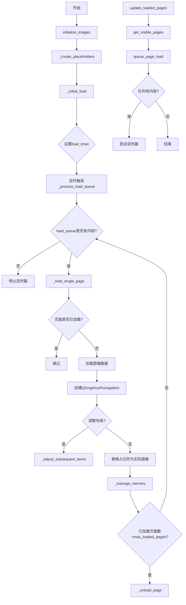

## 类结构

```
LazyImageLoader (主类)
└── QTimer (Qt定时器，用于异步加载)
```

## 全局变量及字段


### `LazyImageLoader.viewer`
    
图像查看器主控件，提供场景和视图相关功能

类型：`QGraphicsView`
    


### `LazyImageLoader.layout_manager`
    
布局管理器引用，负责页面位置和尺寸计算

类型：`LayoutManager`
    


### `LazyImageLoader._scene`
    
Qt图形场景对象，用于管理所有图形项

类型：`QGraphicsScene`
    


### `LazyImageLoader.max_loaded_pages`
    
最大同时加载页数，控制内存中保留的页面数量

类型：`int`
    


### `LazyImageLoader.image_file_paths`
    
图像文件路径列表，存储所有页面文件的路径

类型：`list[str]`
    


### `LazyImageLoader.loaded_pages`
    
已加载页面索引集合，记录已成功加载的页面

类型：`Set[int]`
    


### `LazyImageLoader.image_items`
    
页面索引到图形项的映射，存储已加载页面的图形项

类型：`dict[int, QGraphicsPixmapItem]`
    


### `LazyImageLoader.image_data`
    
页面索引到图像数据的映射，存储已加载页面的RGB数据

类型：`dict[int, np.ndarray]`
    


### `LazyImageLoader.placeholder_items`
    
页面索引到占位符的映射，存储未加载页面的占位符

类型：`dict[int, QGraphicsRectItem]`
    


### `LazyImageLoader.load_timer`
    
定时器用于异步加载，控制加载队列的处理节奏

类型：`QTimer`
    


### `LazyImageLoader.load_queue`
    
待加载页面队列，按顺序存储等待加载的页面索引

类型：`list[int]`
    


### `LazyImageLoader.loading_pages`
    
正在加载的页面集合，记录当前正在加载的页面

类型：`Set[int]`
    


### `LazyImageLoader.main_controller`
    
主控制器引用，用于协调各模块工作

类型：`MainController`
    


### `LazyImageLoader.webtoon_manager`
    
Webtoon管理器引用，管理Webtoon模式的业务逻辑

类型：`WebtoonManager`
    


### `LazyImageLoader.scene_item_manager`
    
场景项管理器引用，管理场景中的编辑项

类型：`SceneItemManager`
    


### `LazyImageLoader.coordinate_converter`
    
坐标转换器引用，用于坐标系统转换

类型：`CoordinateConverter`
    
    

## 全局函数及方法


### `LazyImageLoader.__init__`

该方法是 `LazyImageLoader` 类的构造函数，负责初始化懒加载图像管理器的核心状态和数据结构。它建立了与查看器（viewer）和布局管理器的关联，初始化了用于跟踪已加载页面、占位符、图像数据的数据结构，并配置了用于分时加载的定时器，为实现内存高效的长图/Webtoon浏览功能奠定基础。

#### 参数

- `self`：实例方法的隐含参数，代表当前 `LazyImageLoader` 对象本身
- `viewer`：对象，负责图像显示的图形视图组件，需包含 `_scene` 属性（类型：`QGraphicsScene`），作为图像项的容器
- `layout_manager`：对象，负责页面布局计算和视口管理，协调图像位置和可见区域

#### 返回值

无返回值（`None`）。构造函数仅初始化对象状态，不返回任何数据。

#### 流程图

```mermaid
flowchart TD
    A[__init__ 开始] --> B[接收 viewer 和 layout_manager 参数]
    B --> C[建立 viewer 和 layout_manager 引用]
    C --> D[从 viewer 获取 _scene 引用]
    D --> E[设置配置项: max_loaded_pages = 10]
    E --> F[初始化 Owned 数据结构]
    F --> G1[image_file_paths: list[str]]
    F --> G2[loaded_pages: Set[int]]
    F --> G3[image_items: dict[int, QGraphicsPixmapItem]]
    F --> G4[image_data: dict[int, np.ndarray]]
    F --> G5[placeholder_items: dict[int, QGraphicsRectItem]]
    G1 --> H[初始化定时器 load_timer]
    H --> I[连接 timeout 信号到 _process_load_queue]
    I --> J[初始化加载队列和状态]
    J --> K1[load_queue: list[int]]
    J --> K2[loading_pages: Set[int]]
    K1 --> L[初始化外部管理器引用为 None]
    L --> M[初始化完成]
    
    style A fill:#f9f,color:#000
    style M fill:#9f9,color:#000
```

#### 带注释源码

```python
def __init__(self, viewer, layout_manager):
    """Initialize the LazyImageLoader with viewer and layout manager references.
    
    Args:
        viewer: The main graphics view widget that displays images
        layout_manager: The layout manager responsible for page positioning
    """
    # 建立与主查看器的引用，用于访问场景和发送信号
    self.viewer = viewer
    
    # 建立与布局管理器的引用，用于获取页面位置和可见区域信息
    self.layout_manager = layout_manager
    
    # 从 viewer 获取图形场景引用，后续用于添加/移除图像项
    self._scene = viewer._scene
    
    # ========== 配置项 ==========
    # 内存管理阈值：同时保持在内存中的最大页面数
    self.max_loaded_pages = 10  # Maximum pages in memory
    
    # ========== Owned 数据结构：此类全权负责管理这些数据 ==========
    # 存储所有图像文件的完整路径列表（索引对应页码）
    self.image_file_paths: list[str] = []
    
    # 跟踪已完全加载到内存的页面索引集合
    self.loaded_pages: Set[int] = set()
    
    # 页码到图形项的映射：存储已加载页面的 QGraphicsPixmapItem
    # 用于在场景中显示图像并管理其位置
    self.image_items: dict[int, QGraphicsPixmapItem] = {}  # page_index -> item
    
    # 页码到原始图像数据的映射：存储已加载页面的 NumPy 数组格式图像数据
    # 格式为 RGB (H, W, C)，供后续处理和补丁渲染使用
    self.image_data: dict[int, np.ndarray] = {}  # page_index -> RGB image
    
    # 页码到占位符项的映射：在图像加载前显示的灰色矩形占位符
    # 避免页面空白并提供视觉反馈
    self.placeholder_items: dict[int, QGraphicsRectItem] = {}  # page_index -> placeholder
    
    # ========== 定时器机制：实现分时加载以保持 UI 响应性 ==========
    # 使用 QTimer 实现基于时间片的加载队列处理
    self.load_timer = QTimer()
    # 当定时器超时时，自动触发加载队列处理方法
    self.load_timer.timeout.connect(self._process_load_queue)
    
    # ========== 加载队列和状态跟踪 ==========
    # 待加载页面的索引队列（按加入顺序处理）
    self.load_queue: list[int] = []
    
    # 正在异步加载过程中的页面集合（用于防止重复加载请求）
    self.loading_pages: Set[int] = set()
    
    # ========== 外部管理器引用（依赖注入，将在后续设置）==========
    # 主控制器引用，用于兼容性和状态同步
    self.main_controller = None
    # Webtoon 管理器引用，用于通知图像加载/卸载事件
    self.webtoon_manager = None  
    # 场景项管理器引用，用于保存和恢复场景状态
    self.scene_item_manager = None
    # 坐标转换器引用，用于坐标系统转换
    self.coordinate_converter = None
```


### `LazyImageLoader.initialize_images`

初始化图像加载器，设置图像文件路径列表，创建所有页面的占位符，并基于当前页面加载初始图像。

参数：

- `file_paths`：`list[str]`，图像文件的路径列表
- `current_page`：`int`，当前显示的页面索引，默认为 0

返回值：`None`，该方法无返回值，仅执行初始化操作

#### 流程图

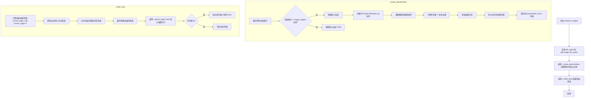

#### 带注释源码

```python
def initialize_images(self, file_paths: list[str], current_page: int = 0):
    """Initialize image loading with file paths."""
    # 将传入的文件路径列表复制到实例变量中，保留原始列表的副本
    self.image_file_paths = file_paths.copy()
    
    # 为所有页面创建占位符矩形，显示"Loading page..."文本
    self._create_placeholders()
    
    # 加载当前页面周围的初始页面（当前页-1到当前页+2）
    self._initial_load(current_page)
```


### `LazyImageLoader._create_placeholders`

为所有页面创建占位符矩形，提供页面加载前的视觉占位显示，避免页面空白并向用户展示加载进度。

参数：

- 该方法无显式参数（`self` 为隐式参数）

返回值：`None`，无返回值（方法执行副作用：将占位符添加到场景并存储在 `placeholder_items` 字典中）

#### 流程图

```mermaid
flowchart TD
    A[开始 _create_placeholders] --> B{遍历页面索引 i}
    B -->|i < len(image_file_paths)| C[获取页面高度]
    B -->|i >= len(image_file_paths)| D[使用默认高度 1000]
    C --> E[创建 QGraphicsRectItem]
    D --> E
    E --> F[设置画刷颜色深灰色]
    F --> G[设置画笔颜色浅灰色]
    G --> H[获取页面Y坐标位置]
    H --> I[设置占位符位置]
    I --> J[创建加载文本项]
    J --> K[设置文本颜色]
    K --> L[设置文本位置居中]
    L --> M[将占位符添加到场景]
    M --> N[存储到 placeholder_items 字典]
    N --> B
    B -->|遍历完成| O[结束]
```

#### 带注释源码

```
def _create_placeholders(self):
    """Create placeholder rectangles for all pages."""
    # 遍历所有图像文件路径，为每个页面创建占位符
    for i in range(len(self.image_file_paths)):
        # 获取该页面的高度，如果 layout_manager 中没有记录则使用默认高度 1000
        height = self.layout_manager.image_heights[i] if i < len(self.layout_manager.image_heights) else 1000
        
        # 创建占位符矩形项，宽度使用 webtoon_width，高度使用计算得到的 height
        placeholder = QGraphicsRectItem(0, 0, self.layout_manager.webtoon_width, height)
        
        # 设置占位符背景画刷为深灰色 (RGB: 50, 50, 50)
        placeholder.setBrush(QBrush(QColor(50, 50, 50)))  # Dark placeholder
        
        # 设置占位符边框画笔为浅灰色 (RGB: 80, 80, 80)
        placeholder.setPen(QPen(QColor(80, 80, 80)))
        
        # 获取该页面在场景中的 Y 坐标位置，如果未记录则默认为 0
        y_pos = self.layout_manager.image_positions[i] if i < len(self.layout_manager.image_positions) else 0
        
        # 设置占位符在场景中的位置
        placeholder.setPos(0, y_pos)
        
        # 创建加载提示文本，显示 "Loading page {页码}..."
        text_item = self._scene.addText(f"Loading page {i+1}...", self.viewer.font() if hasattr(self.viewer, 'font') else None)
        
        # 设置文本颜色为灰色 (RGB: 150, 150, 150)
        text_item.setDefaultTextColor(QColor(150, 150, 150))
        
        # 将文本放置在页面中心位置
        text_item.setPos(self.layout_manager.webtoon_width / 2 - 50, y_pos + height / 2)
        
        # 将占位符添加到图形场景中显示
        self._scene.addItem(placeholder)
        
        # 将占位符存储到字典中，键为页面索引，便于后续管理
        self.placeholder_items[i] = placeholder
```


### `LazyImageLoader._initial_load`

该方法负责在应用启动或图像列表初始化时，加载当前页面及其邻近页面的图像内容，实现基于视口可见性的延迟加载策略，确保用户立即能看到相关内容。

参数：

- `current_page`：`int`，当前查看的页面索引，用于确定初始加载的页面范围

返回值：`None`，无返回值（该方法通过副作用完成图像加载）

#### 流程图

```mermaid
flowchart TD
    A[开始 _initial_load] --> B[计算初始加载页面范围]
    B --> C[start_page = max(0, current_page - 1)]
    C --> D[end_page = min(len(image_file_paths), current_page + 2)]
    D --> E[initial_pages = set of pages from start to end]
    E --> F[获取视口可见页面]
    F --> G{visible_pages = layout_manager.get_visible_pages}
    G --> H[合并初始页面和可见页面]
    H --> I[pages_to_load = initial_pages | visible_pages]
    I --> J[遍历 pages_to_load]
    J --> K{对每个 page_idx 调用 _queue_page_load}
    K --> L{检查页面是否需要加载}
    L -->|是| M[将页面加入加载队列]
    L -->|否| N[跳过该页面]
    M --> O{队列处理完成?}
    N --> O
    O -->|是| P[启动加载定时器 50ms]
    P --> Q[结束]
    
    style M fill:#e1f5fe
    style P fill:#e8f5e8
```

#### 带注释源码

```python
def _initial_load(self, current_page: int):
    """Load initial pages centered around current page."""
    # 计算初始加载的页面范围：以当前页为中心，向前后各扩展1页
    # 这样用户无需等待所有页面加载完成，即可看到主要内容
    start_page = max(0, current_page - 1)  # 起始页不能小于0
    end_page = min(len(self.image_file_paths), current_page + 2)  # 结束页不能超出总页数
    
    # 构建初始加载的页面集合（如当前页为3，则加载2,3,4页）
    initial_pages = set(range(start_page, end_page))
    
    # 获取当前视口可见的页面（可能与初始页面有重叠）
    visible_pages = self.layout_manager.get_visible_pages()
    
    # 合并两个集合：既加载当前页附近的页面，也加载视口内可见的页面
    # 使用集合并集运算，避免重复加载
    pages_to_load = initial_pages | visible_pages
    
    # 遍历所有需要加载的页面，将其加入加载队列
    for page_idx in pages_to_load:
        self._queue_page_load(page_idx)
        
    # 启动定时器，每50毫秒处理一个页面
    # 采用分时加载策略，避免一次性加载大量图片导致UI卡顿
    self.load_timer.start(50)  # Process queue every 50ms
```


### `LazyImageLoader._queue_page_load`

将指定页面索引加入加载队列，以便后续异步加载图像。

参数：

- `page_idx`：`int`，要加载的页面索引

返回值：`None`，该方法无返回值，仅修改内部队列状态

#### 流程图

```mermaid
flowchart TD
    A[开始] --> B{检查页面是否满足加载条件}
    B --> C{page_idx 不在 loaded_pages?}
    C -->|是| D{page_idx 不在 loading_pages?}
    D -->|是| E{page_idx 不在 load_queue?}
    E -->|是| F{0 <= page_idx < len(image_file_paths)?}
    F -->|是| G[将 page_idx 添加到 load_queue]
    F -->|否| H[不添加, 结束]
    G --> I[结束]
    C -->|否| H
    D -->|否| H
    E -->|否| H
```

#### 带注释源码

```
def _queue_page_load(self, page_idx: int):
    """Queue a page for loading.
    
    将页面加入加载队列前，会进行多重检查以避免重复加载：
    1. 页面必须尚未加载（不在 loaded_pages）
    2. 页面不能正在加载中（不在 loading_pages）
    3. 页面不能在等待队列中（不在 load_queue）
    4. 页面索引必须在有效范围内
    
    Args:
        page_idx: 要加载的页面索引
    """
    # 多重条件检查，确保页面满足加载条件
    if (page_idx not in self.loaded_pages and          # 页面未加载
        page_idx not in self.loading_pages and         # 页面未在加载中
        page_idx not in self.load_queue and            # 页面未在队列中
        0 <= page_idx < len(self.image_file_paths)):   # 页面索引有效
        
        # 将页面索引追加到加载队列末尾
        self.load_queue.append(page_idx)
```


### `LazyImageLoader._process_load_queue`

处理加载队列，每次仅加载一个页面以保持 UI 响应性。该方法由 QTimer 定时调用，从队列中取出待加载页面索引并调用单页加载方法。

参数：

- 该方法无显式参数（`self` 为隐式参数）

返回值：`None`，无返回值

#### 流程图

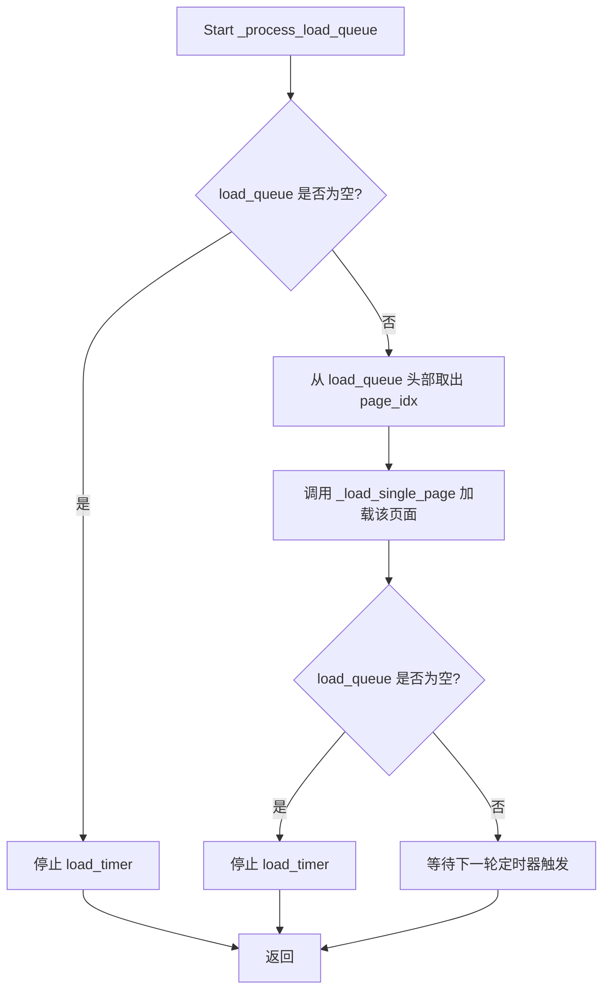

#### 带注释源码

```python
def _process_load_queue(self):
    """Process the loading queue (one page at a time to keep UI responsive)."""
    # 检查加载队列是否为空
    if not self.load_queue:
        # 空队列时停止定时器以节省资源
        self.load_timer.stop()
        return
        
    # 从队列头部取出待加载的页面索引（FIFO 顺序）
    # 每次仅处理一个页面，保证 UI 响应性
    page_idx = self.load_queue.pop(0)
    
    # 调用单页加载方法实际加载图像
    self._load_single_page(page_idx)
    
    # 队列处理完毕后停止定时器
    if not self.load_queue:
        self.load_timer.stop()
```


### `LazyImageLoader._load_single_page`

加载单个页面的图像和内容，包括读取图像文件、转换为QPixmap、创建图形项、定位、替换占位符，并管理内存。

参数：

- `page_idx`：`int`，要加载的页面索引

返回值：`None`，该方法执行完成后无返回值，主要通过修改对象状态（如 `loaded_pages`、`image_items` 等）来反映加载结果。

#### 流程图

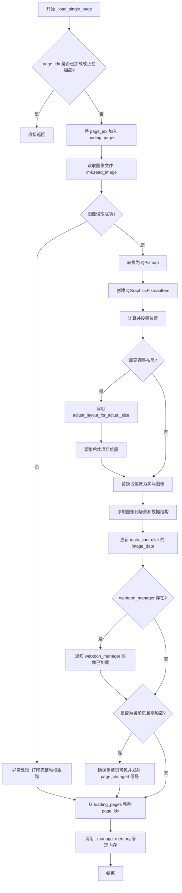

#### 带注释源码

```python
def _load_single_page(self, page_idx: int):
    """Load a single page's image and content."""
    # 检查页面是否已加载或正在加载，避免重复加载
    if page_idx in self.loaded_pages or page_idx in self.loading_pages:
        return
        
    # 将页面标记为正在加载状态
    self.loading_pages.add(page_idx)
    
    try:
        # 根据页面索引获取对应的文件路径
        file_path = self.image_file_paths[page_idx]
        # 使用 imkit 库读取图像数据
        img = imk.read_image(file_path)
        
        if img is not None:
            # 获取图像尺寸信息 (高度, 宽度, 通道数)
            h, w, c = img.shape
            # 将 numpy 数组转换为 QImage 再转为 QPixmap
            qimage = self.viewer.qimage_from_array(img)
            pixmap = QPixmap.fromImage(qimage)
            
            # 创建图形项用于在场景中显示图像
            item = QGraphicsPixmapItem(pixmap)
            # 设置形状模式为边界矩形形状
            item.setShapeMode(QGraphicsPixmapItem.BoundingRectShape)
            
            # 计算水平偏移量使图像居中
            x_offset = (self.layout_manager.webtoon_width - w) / 2
            # 获取该页面在场景中的垂直位置
            y_pos = self.layout_manager.image_positions[page_idx] if page_idx < len(self.layout_manager.image_positions) else 0
            # 设置图形项的位置
            item.setPos(x_offset, y_pos)
            
            # 检查实际图像高度与预估高度是否不同
            if page_idx < len(self.layout_manager.image_heights) and h != self.layout_manager.image_heights[page_idx]:
                # 调整布局以适应实际尺寸
                height_diff = self.layout_manager.adjust_layout_for_actual_size(page_idx, h)
                # 如果高度有变化，调整后续所有项目的位置
                if height_diff != 0:
                    self._adjust_subsequent_items(page_idx, height_diff)
            
            # 替换占位符为实际图像
            if page_idx in self.placeholder_items:
                self._scene.removeItem(self.placeholder_items[page_idx])
                del self.placeholder_items[page_idx]
            
            # 将图像项添加到场景中
            self._scene.addItem(item)
            # 存储图像项引用
            self.image_items[page_idx] = item
            # 存储图像数据用于后续访问
            self.image_data[page_idx] = img
            # 标记该页面已加载
            self.loaded_pages.add(page_idx)
            
            # 同时存储到主控制器的 image_data 中以保持兼容性
            if self.main_controller and hasattr(self.main_controller, 'image_data'):
                self.main_controller.image_data[file_path] = img
            
            # 通知 webtoon_manager 图像已加载（用于场景项加载）
            if self.webtoon_manager and hasattr(self.webtoon_manager, 'on_image_loaded'):
                self.webtoon_manager.on_image_loaded(page_idx, img)
            
            # 如果这是当前页面且是首次加载，确保视图正确设置
            if page_idx == self.layout_manager.current_page_index and len(self.loaded_pages) == 1:
                # 延迟 100ms 后确保当前页可见
                QTimer.singleShot(100, lambda: self.layout_manager.ensure_current_page_visible(self.image_items))
                # 延迟 150ms 后发射页面变更信号以同步 UI
                QTimer.singleShot(150, lambda: self.viewer.page_changed.emit(page_idx))
            
    except Exception as e:
        import traceback
        # 打印完整的异常堆栈跟踪用于调试
        print(f"DEBUG: Full traceback for page {page_idx}:")
        print(traceback.format_exc())
    finally:
        # 确保从加载集合中移除，即使发生异常
        self.loading_pages.discard(page_idx)
        
    # 检查是否需要卸载旧页面以管理内存
    self._manage_memory()
```


### `LazyImageLoader._adjust_subsequent_items`

调整布局变化后所有后续已加载项目（包括图片项和占位符项）的垂直位置，以确保页面排列正确。

参数：

- `page_idx`：`int`，发生高度变化的页面索引，从该页面之后的所有项目位置需要调整
- `height_diff`：`int`，高度差值，正值表示页面变长（向下移动），负值表示页面变短（向上移动）

返回值：`None`，该方法直接修改对象状态，无返回值

#### 流程图

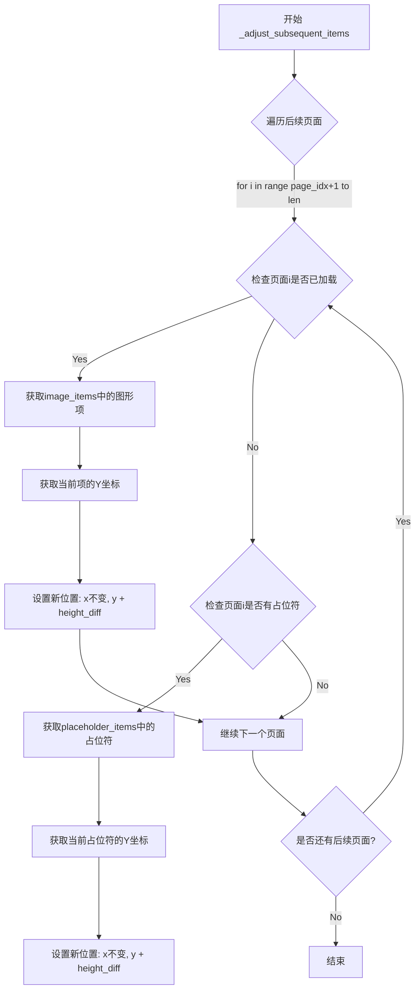

#### 带注释源码

```python
def _adjust_subsequent_items(self, page_idx: int, height_diff: int):
    """Adjust positions of subsequent loaded items after layout change.
    
    当某个页面的实际高度与预估高度不同时，需要调整该页面之后所有项目的位置。
    这确保了所有页面在垂直方向上正确排列。
    
    Args:
        page_idx: 发生高度变化的页面索引
        height_diff: 高度差值（实际高度 - 预估高度），正数表示页面变长
    """
    # 遍历从变化页面之后到最后一页的所有页面
    for i in range(page_idx + 1, len(self.image_file_paths)):
        
        # 移动任何已加载的图片项目
        if i in self.image_items:
            item = self.image_items[i]
            pos = item.pos()
            # 根据高度差调整Y坐标，保持X坐标不变
            item.setPos(pos.x(), pos.y() + height_diff)
            
        # 移动占位符项目
        if i in self.placeholder_items:
            item = self.placeholder_items[i]
            pos = item.pos()
            # 根据高度差调整占位符的Y坐标
            item.setPos(pos.x(), pos.y() + height_diff)
```


### `LazyImageLoader.update_loaded_pages`

根据当前视口更新应该加载的页面，确保可见页面被加载到内存中。

参数：
- 无（仅使用 `self` 隐式参数）

返回值：`None`，无返回值（该方法直接修改内部状态）

#### 流程图

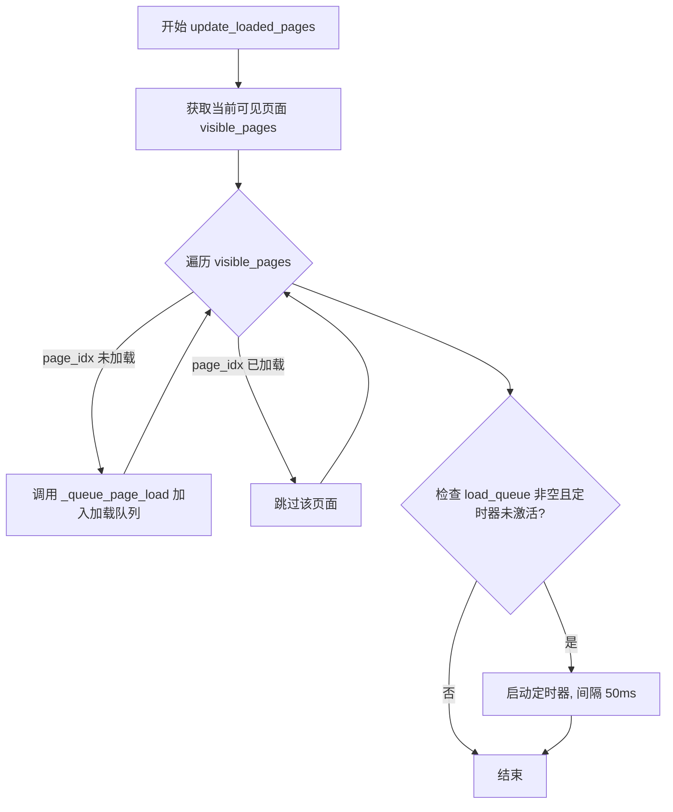

#### 带注释源码

```python
def update_loaded_pages(self):
    """Update which pages should be loaded based on current viewport."""
    # 获取当前视口内可见的页面索引集合
    visible_pages = self.layout_manager.get_visible_pages()
    
    # 遍历所有可见页面，将未加载的页面加入加载队列
    for page_idx in visible_pages:
        # 仅对尚未加载的页面发起加载请求
        if page_idx not in self.loaded_pages:
            # 将页面索引加入待加载队列
            self._queue_page_load(page_idx)
            
    # 如果加载队列有内容且定时器当前未运行，则启动定时器开始处理队列
    if self.load_queue and not self.load_timer.isActive():
        self.load_timer.start(50)  # 每 50ms 处理一个页面，保持 UI 响应性
```


### `LazyImageLoader._manage_memory`

该方法负责内存管理，当已加载页面数量超过 `max_loaded_pages` 限制时，自动卸载不再可见的页面以释放内存。它通过计算页面与当前视口中心的距离，优先卸载距离最远的页面。

参数：  
无（仅包含 `self` 隐式参数）

返回值：`None`，无返回值（该方法直接修改对象状态）

#### 流程图

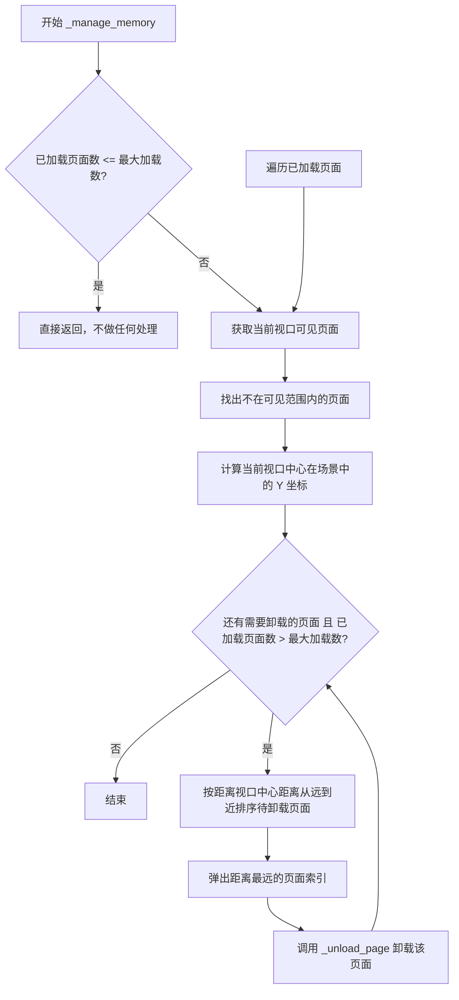

#### 带注释源码

```python
def _manage_memory(self):
    """Unload pages that are no longer needed to manage memory."""
    # 如果已加载页面数未超过限制，直接返回，不进行任何卸载操作
    if len(self.loaded_pages) <= self.max_loaded_pages:
        return
        
    # 获取当前视口内可见的页面索引集合
    visible_pages = self.layout_manager.get_visible_pages()
    
    # 遍历所有已加载的页面，找出不在可见范围内的页面（这些页面可以卸载）
    pages_to_unload = []
    for page_idx in self.loaded_pages:
        if page_idx not in visible_pages:
            pages_to_unload.append(page_idx)
            
    # 计算当前视口中心在场景坐标系中的 Y 坐标
    # 用于衡量各页面距离视口的远近程度
    current_center = self.viewer.mapToScene(self.viewer.viewport().rect().center()).y()
    
    # 按距离视口中心的远近排序，优先卸载距离最远的页面
    # reverse=True 表示降序，即从最远的页面开始卸载
    pages_to_unload.sort(key=lambda p: abs(self.layout_manager.image_positions[p] - current_center), reverse=True)
    
    # 循环卸载页面，直到已加载页面数回到限制范围内
    while len(self.loaded_pages) > self.max_loaded_pages and pages_to_unload:
        # 弹出（取出并移除）列表中第一个元素（距离最远的页面）
        page_to_unload = pages_to_unload.pop(0)
        # 调用 _unload_page 方法执行实际的页面卸载操作
        self._unload_page(page_to_unload)
```


### `LazyImageLoader._unload_page`

该方法负责将指定页面从内存中卸载，通过移除场景中的图像项、释放图像数据，并重新创建占位符来释放内存资源。

参数：

- `page_idx`：`int`，要卸载的页面索引

返回值：`None`，无返回值

#### 流程图

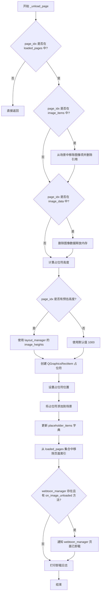

#### 带注释源码

```python
def _unload_page(self, page_idx: int):
    """Unload a specific page from memory.
    
    This method performs cleanup for a specific page:
    1. Removes the image item from the scene
    2. Deletes the image data from memory
    3. Recreates a placeholder in its position
    4. Notifies the webtoon manager if applicable
    """
    # Check if the page is actually loaded before attempting to unload
    if page_idx not in self.loaded_pages:
        return
    
    # Step 1: Remove image item from scene if it exists
    # This removes the visual representation from the graphics scene
    if page_idx in self.image_items:
        self._scene.removeItem(self.image_items[page_idx])  # Remove from Qt scene
        del self.image_items[page_idx]  # Remove reference from dictionary
    
    # Step 2: Remove image data from memory
    # This frees up the numpy array holding the RGB image data
    if page_idx in self.image_data:
        del self.image_data[page_idx]
    
    # Step 3: Recreate placeholder rectangle
    # Create a visual placeholder to indicate the page exists but isn't loaded
    # Get the estimated height from layout manager, fallback to default 1000
    height = self.layout_manager.image_heights[page_idx] if page_idx < len(self.layout_manager.image_heights) else 1000
    
    # Create a gray placeholder rectangle
    placeholder = QGraphicsRectItem(0, 0, self.layout_manager.webtoon_width, height)
    placeholder.setBrush(QBrush(QColor(50, 50, 50)))  # Dark gray background
    placeholder.setPen(QPen(QColor(80, 80, 80)))  # Lighter gray border
    
    # Position the placeholder at the correct y-coordinate
    y_pos = self.layout_manager.image_positions[page_idx] if page_idx < len(self.layout_manager.image_positions) else 0
    placeholder.setPos(0, y_pos)
    
    # Add placeholder back to scene to maintain visual continuity
    self._scene.addItem(placeholder)
    self.placeholder_items[page_idx] = placeholder  # Store reference for future removal
    
    # Step 4: Update loaded pages tracking
    self.loaded_pages.remove(page_idx)
    
    # Step 5: Notify webtoon manager about the unload event
    # This allows dependent components to update their state
    if self.webtoon_manager and hasattr(self.webtoon_manager, 'on_image_unloaded'):
        self.webtoon_manager.on_image_unloaded(page_idx)
    
    # Log for debugging purposes
    print(f"Unloaded page {page_idx + 1}")
```


### `LazyImageLoader.set_timer_interval`

设置加载计时器的触发间隔时间，用于控制图像加载队列的处理频率。

参数：

-  `interval`：`int`，设置加载计时器的触发间隔时间（毫秒）

返回值：`None`，无返回值

#### 流程图

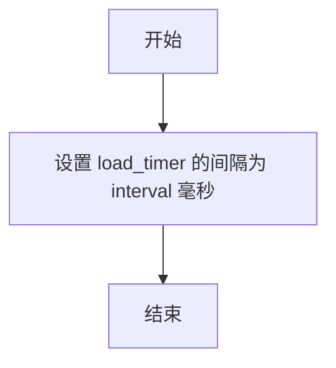

#### 带注释源码

```
def set_timer_interval(self, interval: int):
    """Set the load timer interval.
    
    设置加载计时器的触发间隔时间。该计时器用于定期处理图像加载队列，
    通过调整间隔可以控制图像加载的频率和响应性。
    
    Args:
        interval: 计时器间隔时间，单位为毫秒。值越小加载越频繁，
                 但会增加CPU占用；值越大加载越慢，但更节省资源。
    """
    self.load_timer.setInterval(interval)
```


### `LazyImageLoader.get_timer_interval`

获取当前加载定时器的间隔时间。该方法是一个简单的Getter函数，用于返回内部QTimer对象的当前间隔设置，主要用于调试或外部查询定时器配置状态。

参数：

- 无（仅包含隐式参数 `self`）

返回值：`int`，返回当前加载定时器的间隔时间（单位：毫秒）

#### 流程图

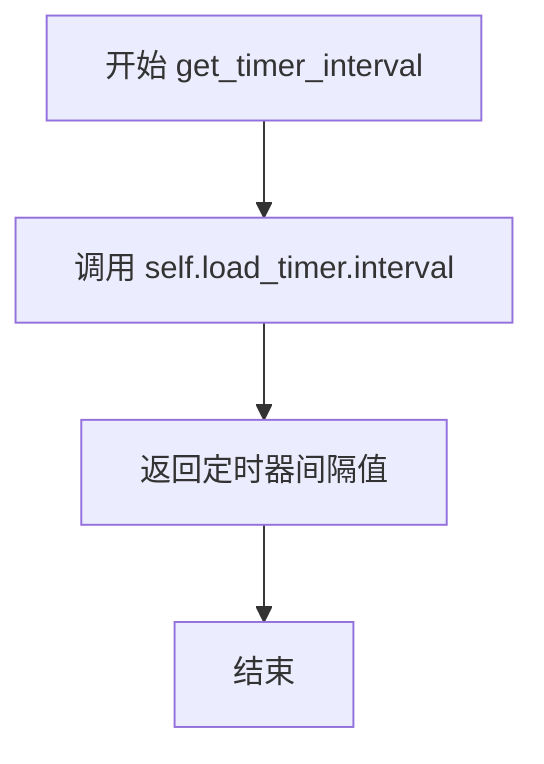

#### 带注释源码

```python
def get_timer_interval(self) -> int:
    """Get the current load timer interval."""
    # 调用 Qt QTimer 的 interval() 方法获取当前定时器间隔
    # 返回值单位为毫秒，默认值为 50ms（在 __init__ 中通过 load_timer.start(50) 设置）
    return self.load_timer.interval()
```


### `LazyImageLoader.is_timer_active`

检查加载计时器是否处于活动状态。

参数：

- 无

返回值：`bool`，返回 `True` 表示加载计时器正在运行，返回 `False` 表示计时器已停止。

#### 流程图

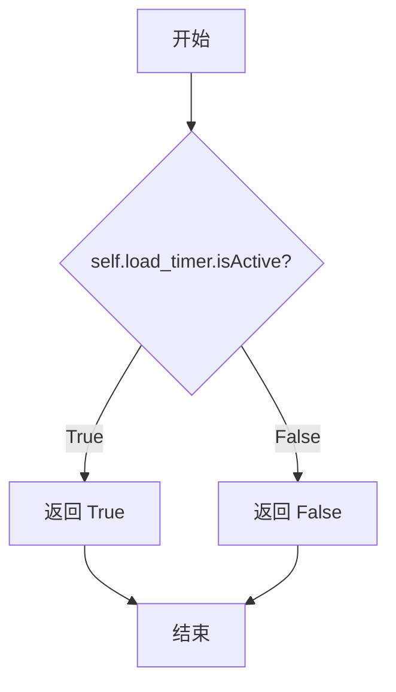

#### 带注释源码

```python
def is_timer_active(self) -> bool:
    """Check if the load timer is active.
    
    该方法用于检查内部加载计时器（load_timer）当前是否处于活动状态。
    当计时器活跃时，意味着页面加载队列正在被处理。
    
    Returns:
        bool: 如果加载计时器正在运行返回 True，否则返回 False
    """
    # 调用 QTimer 的 isActive() 方法检查计时器状态
    return self.load_timer.isActive()
```


### `LazyImageLoader.queue_page_for_loading`

该方法是 `LazyImageLoader` 类的公共接口，用于将指定页面加入加载队列并启动定时器进行异步加载。通过内部调用 `_queue_page_load` 方法将页面添加到加载队列，同时检查定时器状态，确保在需要时启动定时器以保持 UI 响应性。

参数：

- `page_idx`：`int`，要加载的页面索引

返回值：`None`，无返回值

#### 流程图

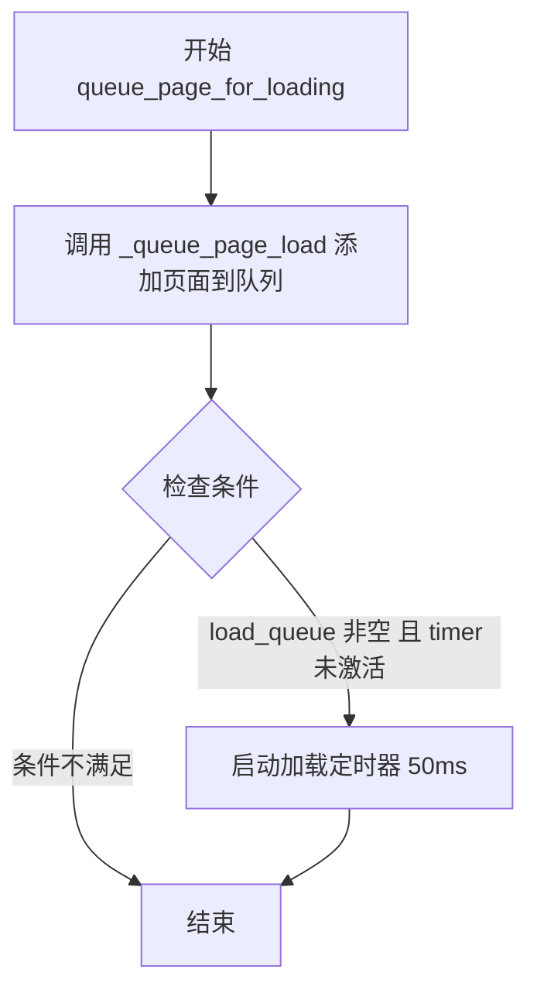

#### 带注释源码

```
def queue_page_for_loading(self, page_idx: int):
    """Public interface to queue a page for loading.
    
    这是供外部调用的公共接口方法，用于将指定页面加入加载队列。
    该方法会：
    1. 调用内部方法 _queue_page_load 将页面添加到加载队列
    2. 检查加载队列是否有待加载页面且定时器是否未激活
    3. 如果条件满足，启动定时器以触发异步加载流程
    
    Args:
        page_idx: 要加载的页面索引
    """
    # 调用内部方法将页面添加到加载队列
    # _queue_page_load 内部会检查页面是否已加载、正在加载或已在队列中
    # 只有满足条件的页面才会被添加到 load_queue 列表中
    self._queue_page_load(page_idx)
    
    # 检查是否有待加载的页面且定时器当前未运行
    # load_queue: 存储待加载页面索引的列表
    # load_timer.isActive(): 检查 QTimer 是否处于活动状态
    if self.load_queue and not self.load_timer.isActive():
        # 启动定时器，每 50ms 触发一次加载处理
        # 这确保了 UI 保持响应，因为每次只加载一个页面
        self.load_timer.start(50)
```


### `LazyImageLoader.get_loaded_pages_count`

获取当前已加载页面的数量。该方法直接返回内部维护的已加载页面集合的长度，提供了一种快速查询内存中当前有多少页面被加载的途径。

参数：

- 无（仅包含 `self` 参数，用于访问类实例属性）

返回值：`int`，返回当前已加载页面的数量，即 `loaded_pages` 集合中的元素个数。

#### 流程图

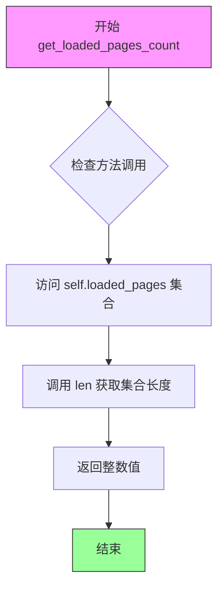

#### 带注释源码

```python
def get_loaded_pages_count(self) -> int:
    """
    获取当前已加载页面的数量。
    
    Returns:
        int: 当前已加载页面的数量，基于内部维护的 loaded_pages 集合大小。
    """
    # 直接返回 loaded_pages 集合的长度
    # loaded_pages 是一个 Set[int] 类型，存储当前已加载的所有页面索引
    return len(self.loaded_pages)
```


### `LazyImageLoader.is_page_loaded`

检查指定页面索引的图像是否已加载到内存中，通过判断页面索引是否存在于已加载页面集合中来确定。

参数：

- `page_idx`：`int`，要检查的页面索引

返回值：`bool`，返回 `True` 表示页面已加载到内存中，返回 `False` 表示页面未加载

#### 流程图

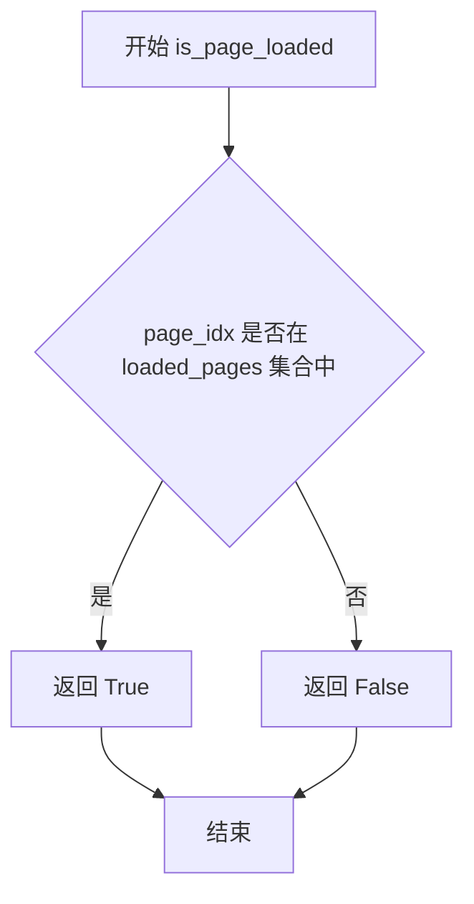

#### 带注释源码

```python
def is_page_loaded(self, page_idx: int) -> bool:
    """Check if a page is currently loaded.
    
    Args:
        page_idx: The index of the page to check
        
    Returns:
        bool: True if the page is loaded in memory, False otherwise
    """
    return page_idx in self.loaded_pages
```


### `LazyImageLoader.get_image_data`

该方法是 `LazyImageLoader` 类的公共接口方法，用于根据页码索引获取已加载的图像数据。如果指定页面已加载到内存中，则返回对应的 NumPy 数组；如果页面未加载，则返回 `None`。

参数：

- `page_idx`：`int`，页码索引，用于指定要获取图像数据的页码编号

返回值：`Optional[np.ndarray]`，如果页面已加载则返回该页的 RGB 图像数据（NumPy 数组），否则返回 `None`

#### 流程图

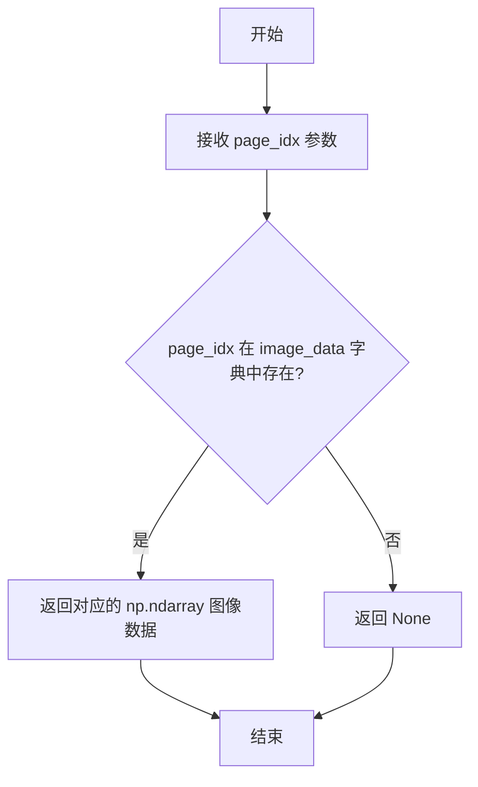

#### 带注释源码

```python
def get_image_data(self, page_idx: int) -> Optional[np.ndarray]:
    """Get the image data for a specific page if loaded.
    
    这是 LazyImageLoader 类提供的公共查询接口，允许其他组件（如 WebtoonManager）
    查询特定页面的图像数据是否已加载到内存中。
    
    Args:
        page_idx: 要查询的页面索引，范围为 0 到总页面数减一
        
    Returns:
        如果页面已加载返回对应的 numpy.ndarray（RGB 格式），
        如果页面未加载则返回 None
    """
    # 使用字典的 get 方法安全获取数据，如果键不存在返回 None
    # self.image_data 是类成员变量，存储已加载页面的图像数据
    # 格式：{page_index: np.ndarray}
    return self.image_data.get(page_idx)
```


### `LazyImageLoader.clear`

清除所有图像加载状态，重置加载器到初始状态，释放内存并清理场景中的占位符。

参数：
- 无

返回值：`None`，无返回值描述

#### 流程图

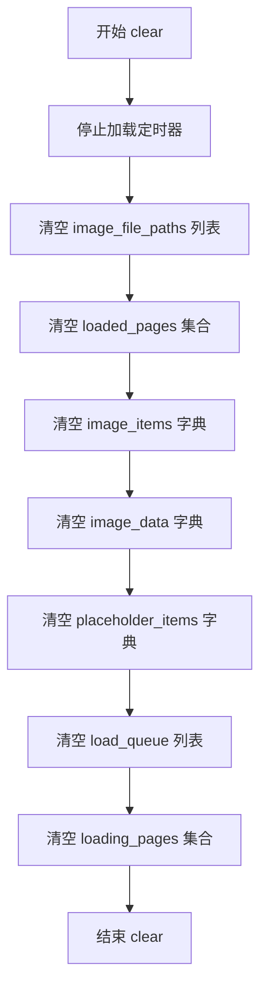

#### 带注释源码

```
def clear(self):
    """Clear all image loading state."""
    # 停止定时器，防止在清理过程中触发新的加载操作
    self.load_timer.stop()
    
    # 清空所有数据结构和状态
    self.image_file_paths.clear()      # 清空图像文件路径列表
    self.loaded_pages.clear()           # 清空已加载页面索引集合
    self.image_items.clear()            # 清空页面图形项字典
    self.image_data.clear()             # 清空页面图像数据字典
    self.placeholder_items.clear()      # 清空占位符项字典
    self.load_queue.clear()             # 清空加载队列
    self.loading_pages.clear()          # 清空正在加载的页面集合
```


### `LazyImageLoader.get_visible_area_image`

获取当前视口内所有可见页面的组合图像，并返回每个页面在组合图像中的位置映射信息。支持多种渲染模式：纯图像裁剪、带补丁渲染和全场景渲染。

参数：

- `paint_all`：`bool`，如果为 True，渲染所有场景项（文本、矩形等）到图像上
- `include_patches`：`bool`，如果为 True，在输出中包含补丁像素图项（Patch）

返回值：`tuple[np.ndarray, list]`，第一个元素是组合的 RGB numpy 图像数组，第二个元素是页面映射信息列表（包含页面索引、组合图像中的 Y 坐标范围、场景 Y 坐标范围等信息）

#### 流程图

```mermaid
flowchart TD
    A([开始 get_visible_area_image]) --> B{image_positions 是否为空?}
    B -->|是| C[返回 None, []]
    B -->|否| D[获取视口矩形 vp_rect]
    D --> E[遍历所有页面 i]
    E --> F{页面 i 是否可见?}
    F -->|否| G[继续下一页面]
    F -->|是| H[计算裁剪边界 crop_top, crop_bottom]
    H --> I{crop_bottom > crop_top?}
    I -->|否| G
    I -->|是| J[获取页面图像数据 base_image_data]
    J --> K{base_image_data 是否存在?}
    K -->|否| G
    K -->|是| L{paint_all 为 True?}
    L -->|是| M[调用 _render_page_with_scene_items<br/>paint_all=True, include_patches 依参数]
    L -->|否| N{include_patches 为 True?}
    N -->|是| M
    N -->|否| O[直接裁剪 base_image_data]
    M --> P[添加页面数据到 visible_pages_data]
    O --> P
    P --> G
    G --> Q{还有更多页面?}
    Q -->|是| E
    Q -->|否| R{visible_pages_data 为空?}
    R -->|是| C
    R -->|否| S[计算组合图像总高度 total_h]
    S --> T[创建零填充的组合图像数组]
    T --> U[遍历 visible_pages_data]
    U --> V[复制页面图像到组合图像]
    V --> W[构建映射信息 mappings]
    W --> X[更新当前 Y 坐标]
    X --> Y{还有更多页面数据?}
    Y -->|是| U
    Y -->|否| Z([返回 combined_img, mappings])
```

#### 带注释源码

```python
def get_visible_area_image(self, paint_all=False, include_patches=True) -> tuple[np.ndarray, list]:
    """Get combined image of all visible pages and their mappings.
    
    Args:
        paint_all: If True, render all scene items (text, rectangles, etc.) onto the image
        include_patches: If True, include patch pixmap items in the output
    """
    # 检查布局管理器是否有图像位置数据，如果没有则返回空
    if not self.layout_manager.image_positions:
        return None, []
    
    # 获取视口矩形并转换为场景坐标，用于确定哪些页面可见
    vp_rect = self.viewer.mapToScene(self.viewer.viewport().rect()).boundingRect()
    visible_pages_data = []
    
    # 遍历所有页面，找出视口内可见的页面
    for i, (y, h) in enumerate(zip(self.layout_manager.image_positions, self.layout_manager.image_heights)):
        # 检查页面是否与视口有重叠（页面顶部在视口底部以下且页面底部在视口顶部以上）
        if y < vp_rect.bottom() and y + h > vp_rect.top():
            # 计算该页面的裁剪边界（仅裁剪视口可见部分）
            crop_top = max(0, vp_rect.top() - y)
            crop_bottom = min(h, vp_rect.bottom() - y)
            
            if crop_bottom > crop_top:
                # 获取该页面的基础图像数据（如果尚未加载则为 None）
                base_image_data = self.get_image_data(i)
                
                if base_image_data is not None:
                    # 根据请求的选项处理图像
                    if paint_all:
                        # 仅在明确请求时使用复杂渲染路径
                        processed_image = self._render_page_with_scene_items(
                            i, base_image_data, paint_all, include_patches, crop_top, crop_bottom
                        )
                    elif include_patches:
                        # 尝试渲染路径以正确包含补丁
                        processed_image = self._render_page_with_scene_items(
                            i, base_image_data, False, True, crop_top, crop_bottom
                        )
                    else:
                        # 对于 include_patches=False，仅使用基础图像
                        processed_image = base_image_data[int(crop_top):int(crop_bottom), :]
                    
                    # 将处理后的页面数据添加到列表
                    visible_pages_data.append({
                        'page_index': i,
                        'image': processed_image,
                        'scene_y_start': max(vp_rect.top(), y),
                        'scene_y_end': min(vp_rect.bottom(), y + h),
                        'page_crop_top': crop_top,
                        'page_crop_bottom': crop_bottom
                    })
    
    # 如果没有可见页面数据，返回空
    if not visible_pages_data:
        return None, []
    
    # 计算组合图像的总高度
    total_h = sum(d['image'].shape[0] for d in visible_pages_data)
    width = visible_pages_data[0]['image'].shape[1]
    channels = visible_pages_data[0]['image'].shape[2] if len(visible_pages_data[0]['image'].shape) > 2 else 1
    dtype = visible_pages_data[0]['image'].dtype
    
    # 创建形状元组并初始化零填充的组合图像数组
    shape = (total_h, width, channels) if channels > 1 else (total_h, width)
    combined_img = np.zeros(shape, dtype=dtype)

    # 合并所有可见页面图像并创建映射关系
    current_y, mappings = 0, []
    for data in visible_pages_data:
        img = data['image']
        h_img = img.shape[0]
        
        # 将图像数据复制到组合图像中
        combined_img[current_y:current_y + h_img] = img
        
        # 创建映射信息，记录页面在组合图像中的位置
        mappings.append({
            'page_index': data['page_index'],
            'combined_y_start': current_y,
            'combined_y_end': current_y + h_img,
            'scene_y_start': data['scene_y_start'],
            'scene_y_end': data['scene_y_end'],
            'page_crop_top': data['page_crop_top'],
            'page_crop_bottom': data['page_crop_bottom']
        })
        current_y += h_img
    
    return combined_img, mappings
```


### `LazyImageLoader._render_page_with_scene_items`

该方法负责将页面图像与场景中的项目（如文本、矩形、补丁等）进行合成渲染。它支持三种渲染模式：完整渲染（paint_all=True）会使用场景渲染器绘制所有项目；仅包含补丁模式（include_patches=True）仅在基础图像上叠加补丁项目；默认模式则直接裁剪基础图像。

参数：

- `page_index`：`int`，要渲染的页面索引
- `base_image`：`np.ndarray`，页面的基础图像数据
- `paint_all`：`bool`，如果为 True，则将所有场景项目（文本、矩形等）渲染到图像上
- `include_patches`：`bool`，如果为 True，则在输出中包含补丁 pixmap 项目
- `crop_top`：`float`，裁剪区域的顶部边界
- `crop_bottom`：`float`，裁剪区域的底部边界

返回值：`np.ndarray`，渲染/裁剪后的图像

#### 流程图

```mermaid
flowchart TD
    A[开始 _render_page_with_scene_items] --> B{page_index 是否在 image_items 中}
    B -->|否| C[返回裁剪后的 base_image: base_image[int(crop_top):int(crop_bottom), :]]
    B -->|是| D[获取 page_item, page_y_position, page_height]
    D --> E{paint_all == True?}
    E -->|是| F[创建缩放后的 QImage 并填充透明]
    F --> G[创建带抗锯齿的 QPainter]
    G --> H[保存原始变换和场景矩形]
    H --> I[重置变换器]
    I --> J[设置场景矩形覆盖当前页面]
    J --> K[渲染场景到画家]
    K --> L[结束画家]
    L --> M[将图像缩放到原始大小]
    M --> N[恢复原始变换和场景矩形]
    E -->|否| O{include_patches == True?}
    O -->|是| P[创建 QImage 和 QPainter]
    P --> Q[绘制基础 pixmap]
    Q --> R[计算页面在场景坐标中的边界]
    R --> S[遍历场景中的所有项目]
    S --> T{项目是 QGraphicsPixmapItem 且非 page_item?}
    T -->|否| U[继续下一个项目]
    T -->|是| V{项目有 data(0)?}
    V -->|否| U
    V -->|是| W{补丁与页面相交?}
    W -->|否| U
    W -->|是| X[转换场景坐标到页面局部坐标]
    X --> Y[在页面局部坐标绘制补丁]
    Y --> U
    U --> Z{还有更多项目?}
    Z -->|是| S
    Z -->|否| AA[结束画家]
    O -->|否| AB[返回裁剪后的 base_image]
    N --> AC[将 QImage 转换为 RGB 格式]
    AA --> AC
    AC --> AD[将 QImage 转换为 numpy 数组]
    AD --> AE[裁剪到可见部分]
    AE --> AF[返回裁剪后的图像]
```

#### 带注释源码

```python
def _render_page_with_scene_items(self, page_index: int, base_image: np.ndarray, 
                                   paint_all: bool, include_patches: bool, 
                                   crop_top: float, crop_bottom: float) -> np.ndarray:
    """Render a page with scene items (text, rectangles, patches) overlaid."""
    
    # 检查页面是否已有图像项目，若无则直接返回裁剪后的基础图像
    if page_index not in self.image_items:
        # Fallback to just cropping the base image
        return base_image[int(crop_top):int(crop_bottom), :]
    
    # 获取页面的图像项目和布局信息
    page_item = self.image_items[page_index]
    page_y_position = self.layout_manager.image_positions[page_index]
    page_height = self.layout_manager.image_heights[page_index]
    
    # 模式1: paint_all=True - 完整渲染模式，渲染所有场景项目
    if paint_all:
        # Create a high-resolution QImage for rendering
        scale_factor = 2  # Increase for higher resolution
        original_size = page_item.pixmap().size()
        scaled_size = original_size * scale_factor

        # 创建透明背景的高分辨率 QImage
        qimage = QImage(scaled_size, QImage.Format_ARGB32)
        qimage.fill(Qt.transparent)

        # Create a QPainter with antialiasing - 启用抗锯齿渲染
        painter = QPainter(qimage)
        painter.setRenderHint(QPainter.RenderHint.Antialiasing, True)
        painter.setRenderHint(QPainter.RenderHint.TextAntialiasing, True)
        painter.setRenderHint(QPainter.RenderHint.SmoothPixmapTransform, True)

        # Store original transform and scene settings - 保存原始状态
        original_transform = self.viewer.transform()
        original_scene_rect = self._scene.sceneRect()
        
        # Reset transform temporarily - 临时重置变换
        self.viewer.resetTransform()
        
        # Set scene rect to cover this page - 设置场景矩形覆盖当前页面
        page_scene_rect = QRectF(0, page_y_position, original_size.width(), page_height)
        self._scene.setSceneRect(page_scene_rect)
        
        # Render the scene area for this page - 渲染场景到画家
        self._scene.render(painter)
        painter.end()

        # Scale down the image to the original size - 缩放回原始大小
        qimage = qimage.scaled(
            original_size, 
            Qt.AspectRatioMode.KeepAspectRatio, 
            Qt.TransformationMode.SmoothTransformation
        )

        # Restore the original transformation and scene rect - 恢复原始状态
        self.viewer.setTransform(original_transform)
        self._scene.setSceneRect(original_scene_rect)
        
    # 模式2: include_patches=True - 仅渲染补丁模式
    elif include_patches:
        # Create QImage for just the base image and patches
        pixmap = page_item.pixmap()
        qimage = QImage(pixmap.size(), QImage.Format_ARGB32)
        qimage.fill(Qt.transparent)
        painter = QPainter(qimage)
        painter.setRenderHint(QPainter.RenderHint.SmoothPixmapTransform, True)
        
        # Draw the base pixmap - 绘制基础 pixmap
        painter.drawPixmap(0, 0, pixmap)
        
        # In webtoon mode, patches are added directly to scene with scene coordinates
        # Calculate this page's bounds in scene coordinates - 计算页面在场景坐标中的边界
        page_scene_top = page_y_position
        page_scene_bottom = page_y_position + page_height
        page_scene_left = (self.layout_manager.webtoon_width - pixmap.width()) / 2  # Assuming centered
        page_scene_right = page_scene_left + pixmap.width()
        
        page_scene_bounds = QRectF(page_scene_left, page_scene_top, pixmap.width(), page_height)
        
        # 遍历场景中的所有项目，查找补丁
        for item in self._scene.items():
            if isinstance(item, QGraphicsPixmapItem) and item != page_item:
                # Check if this is a patch item (has the hash key data)
                if item.data(0) is not None:  # HASH_KEY = 0 from PatchCommandBase
                    # Get patch bounds in scene coordinates
                    item_scene_pos = item.pos()
                    patch_width = item.pixmap().width()
                    patch_height = item.pixmap().height()
                    patch_scene_bounds = QRectF(item_scene_pos.x(), item_scene_pos.y(), 
                                               patch_width, patch_height)
                    
                    # Check if this patch overlaps with the current page - 检查补丁是否与当前页面相交
                    if page_scene_bounds.intersects(patch_scene_bounds):
                        # Convert scene coordinates to page-local coordinates - 坐标转换
                        page_local_x = item_scene_pos.x() - page_scene_left
                        page_local_y = item_scene_pos.y() - page_scene_top
                        
                        # Draw the patch at the converted coordinates - 在页面局部坐标绘制补丁
                        painter.drawPixmap(int(page_local_x), int(page_local_y), item.pixmap())
                        
        painter.end()
        
    # 模式3: 默认 - 直接返回裁剪后的基础图像
    else:
        # Just use the base image
        return base_image[int(crop_top):int(crop_bottom), :]

    # 将 QImage 转换为 RGB numpy 数组
    # Convert QImage to RGB numpy array
    qimage = qimage.convertToFormat(QImage.Format.Format_RGB888)
    width = qimage.width()
    height = qimage.height()
    bytes_per_line = qimage.bytesPerLine()

    # Convert to numpy array - 转换为 numpy 数组
    ptr = qimage.bits()
    arr = np.array(ptr).reshape((height, bytes_per_line))
    # Exclude padding bytes - 排除填充字节
    arr = arr[:, :width * 3]
    # Reshape to correct dimensions - 重塑为正确维度
    arr = arr.reshape((height, width, 3))
    
    # QImage uses RGB format, which matches our RGB workflow
    img = arr
    
    # Crop to the visible portion - 裁剪到可见部分
    cropped_image = img[int(crop_top):int(crop_bottom), :]
    
    return cropped_image
```


### `LazyImageLoader.scroll_to_page`

该方法实现了一个延迟加载的图像查看器的页面滚动功能，通过将目标页面加入加载队列、委托布局管理器执行实际滚动操作，并在成功后更新已加载页面的状态，确保用户可以平滑地导航到任意页面。

参数：

- `page_index`：`int`，目标页面的索引值，指定要滚动到的页面编号
- `position`：`str`，滚动位置参数，默认为 `'top'`，用于指定目标页面在视图中的对齐方式（如 'top'、'center' 等）

返回值：`bool`，表示滚动操作是否成功完成

#### 流程图

```mermaid
flowchart TD
    A[开始 scroll_to_page] --> B[调用 queue_page_for_loading 队列页面加载]
    B --> C{页面已加入队列}
    C -->|成功| D[调用 layout_manager.scroll_to_page 执行滚动]
    C -->|失败| F[返回 False]
    D --> E{滚动是否成功}
    E -->|是| G[调用 _update_loaded_pages 更新加载状态]
    E -->|否| F
    G --> H[返回 True]
    F --> H
```

#### 带注释源码

```
def scroll_to_page(self, page_index: int, position: str = 'top'):
    """Scroll to a specific page, loading it if necessary."""
    
    # 1. 将目标页面加入加载队列，确保页面图像被加载
    # 调用公共接口 queue_page_for_loading，会在页面未加载时将其添加到加载队列
    # 并在需要时启动加载定时器
    self.queue_page_for_loading(page_index)
    
    # 2. 委托给布局管理器执行实际的滚动逻辑
    # layout_manager 负责计算目标页面的位置并控制视图滚动到指定位置
    # position 参数指定页面在视口中的对齐方式（如顶部、居中）
    success = self.layout_manager.scroll_to_page(page_index, position)
    
    # 3. 只有当滚动成功时才触发加载状态更新
    # 这确保了只有在真正跳转到目标页面后才更新可见区域的加载内容
    if success:
        # 触发内部方法更新当前视口内应加载的页面
        # 该方法会检查可见页面并加载尚未加载的页面
        self._update_loaded_pages()
    
    # 4. 返回滚动操作的成功状态
    # 调用方可以根据此返回值决定后续操作
    return success
```


### `LazyImageLoader._update_loaded_pages`

更新当前视口下应加载的页面，并根据页面变化发出相应的信号。

参数： 无

返回值： 无

#### 流程图

```mermaid
flowchart TD
    A[开始 _update_loaded_pages] --> B[调用 self.update_loaded_pages]
    B --> C{self.get_loaded_pages_count > 2?}
    C -->|否| D[结束]
    C -->|是| E[调用 self.layout_manager.update_current_page]
    E --> F{page_changed == True?}
    F -->|否| D
    F -->|是| G[调用 self.viewer.page_changed.emit]
    G --> D
```

#### 带注释源码

```python
def _update_loaded_pages(self):
    """Update which pages should be loaded based on current viewport."""
    # Delegate to image loader - update which pages should be loaded based on current viewport
    # 委托给 image loader，根据当前视口更新应加载的页面
    self.update_loaded_pages()
    
    # Update current page if we have loaded some pages
    # 如果已加载了部分页面，则更新当前页面
    if self.get_loaded_pages_count() > 2:
        # Check if page changed and emit signal if it did
        # 检查页面是否已更改，如已更改则发出信号
        page_changed = self.layout_manager.update_current_page(self.get_loaded_pages_count())
        if page_changed:
            # Emit page changed signal to notify listeners (e.g., UI components)
            # 发出页面更改信号以通知监听器（例如UI组件）
            self.viewer.page_changed.emit(self.layout_manager.current_page_index)
```


### `LazyImageLoader.remove_pages`

该方法用于从Webtoon管理器中移除指定的页面，无需完全重新加载整个Webtoon。它通过查找要移除的文件路径对应的索引，从场景中删除页面相关的数据结构，并调整剩余页面的索引以保持数据一致性。

参数：

- `file_paths_to_remove`：`list[str]`，需要移除的文件路径列表

返回值：`bool`，移除成功返回`True`，若所有页面均被移除或发生异常返回`False`

#### 流程图

```mermaid
flowchart TD
    A[开始 remove_pages] --> B{file_paths_to_remove 是否为空?}
    B -->|是| C[返回 True]
    B -->|否| D[查找每个文件路径对应的索引]
    D --> E{是否有有效的索引?}
    E -->|否| C
    E -->|是| F[将索引按降序排序]
    F --> G[保存当前页码]
    G --> H[保存所有场景项状态]
    H --> I{遍历每个要移除的页面索引}
    I --> J[从内存中强制卸载页面]
    J --> K[移除占位符]
    K --> L[从 OWNED 数据结构中移除]
    I --> M[调整所有跟踪项的索引]
    M --> N[调整当前页码索引]
    N --> O[重新计算布局位置]
    O --> P{image_file_paths 是否为空?}
    P -->|否| Q[更新当前页码并滚动到该页]
    P -->|是| R[清空所有数据]
    Q --> S[重新加载场景项]
    R --> T[返回 False]
    S --> U[返回 True]
    U --> V[异常处理: 打印错误并返回 False]
```

#### 带注释源码

```python
def remove_pages(self, file_paths_to_remove: list[str]) -> bool:
    """Remove specific pages from the webtoon manager without full reload."""
    try:
        # 步骤1: 查找需要移除的页面索引
        # 遍历传入的文件路径列表，查找每个路径在 image_file_paths 中的索引
        indices_to_remove = []
        for file_path in file_paths_to_remove:
            try:
                # 使用 index() 方法查找索引，若不存在则抛出 ValueError
                index = self.image_file_paths.index(file_path)
                indices_to_remove.append(index)
            except ValueError:
                # 如果文件路径不在列表中，跳过该路径
                continue
        
        # 步骤2: 检查是否有需要移除的页面
        # 如果没有需要移除的索引，直接返回 True（无需操作）
        if not indices_to_remove:
            return True  # Nothing to remove
        
        # 步骤3: 按降序排序索引
        # 从高索引向低索引移除，防止移除低索引后高索引失效
        indices_to_remove.sort(reverse=True)
        
        # 步骤4: 保存当前页面状态
        # 记录当前页码，用于后续调整
        current_page = self.layout_manager.current_page_index
        
        # 步骤5: 保存场景项状态
        # 在修改数据前保存所有场景项的当前状态，以便后续恢复
        self.scene_item_manager.save_all_scene_items_to_states()
        
        # 步骤6: 遍历移除每个页面（从高索引到低索引）
        for page_idx in indices_to_remove:
            
            # 强制从内存中卸载页面
            if page_idx in self.loaded_pages:
                self.loaded_pages.discard(page_idx)  # 从已加载集合中移除
                if page_idx in self.image_items:
                    # 从场景中移除图像项并从字典中删除
                    self._scene.removeItem(self.image_items[page_idx])
                    del self.image_items[page_idx]
                if page_idx in self.image_data:
                    # 从内存中删除图像数据
                    del self.image_data[page_idx]
            
            # 移除占位符（如果存在）
            if page_idx in self.placeholder_items:
                self._scene.removeItem(self.placeholder_items[page_idx])
                del self.placeholder_items[page_idx]
            
            # 从 OWNED 数据结构中移除
            # image_file_paths 是该类的自有数据，直接移除
            if page_idx < len(self.image_file_paths):
                self.image_file_paths.pop(page_idx)
            
            # 从 layout_manager 的 OWNED 数据中移除
            # layout_manager 的 image_positions 和 image_heights 也是自有数据
            if page_idx < len(self.layout_manager.image_positions):
                self.layout_manager.image_positions.pop(page_idx)
            if page_idx < len(self.layout_manager.image_heights):
                self.layout_manager.image_heights.pop(page_idx)
        
        # 步骤7: 调整所有跟踪项的索引
        # 使用 _recalculate_index 方法重新计算每个索引
        new_loaded_pages = {self._recalculate_index(old_idx, indices_to_remove) for old_idx in self.loaded_pages}
        self.loaded_pages = {idx for idx in new_loaded_pages if idx is not None}
        
        # 调整 image_items、image_data、placeholder_items 的键
        self.image_items = {self._recalculate_index(k, indices_to_remove): v for k, v in self.image_items.items() if self._recalculate_index(k, indices_to_remove) is not None}
        self.image_data = {self._recalculate_index(k, indices_to_remove): v for k, v in self.image_data.items() if self._recalculate_index(k, indices_to_remove) is not None}
        self.placeholder_items = {self._recalculate_index(k, indices_to_remove): v for k, v in self.placeholder_items.items() if self._recalculate_index(k, indices_to_remove) is not None}
        
        # 步骤8: 调整当前页码索引
        # 计算被移除页面中有多少在当前页之前
        removed_before_current = sum(1 for idx in indices_to_remove if idx < current_page)
        # 计算新的当前页码
        new_current_page = max(0, current_page - removed_before_current)
        # 确保新当前页码不超过新列表长度
        if new_current_page >= len(self.image_file_paths):
            new_current_page = max(0, len(self.image_file_paths) - 1)
        
        # 步骤9: 重新计算布局
        # 调用 layout_manager 重新计算所有页面的位置
        self.layout_manager._recalculate_layout()
        
        # 步骤10: 更新当前页码
        if self.image_file_paths:
            self.layout_manager.current_page_index = new_current_page
            
            # 处理 Qt 事件以确保 UI 更新
            from PySide6.QtWidgets import QApplication
            QApplication.processEvents()
            
            # 滚动到新的当前页
            if new_current_page < len(self.image_file_paths):
                self.scroll_to_page(new_current_page)
            
            print(f"Removed {len(indices_to_remove)} pages. New total: {len(self.image_file_paths)}")
            
            # 重新加载场景项
            # 清空现有场景项并为已加载页面重新加载
            self.scene_item_manager._clear_all_scene_items()
            for page_idx in list(self.loaded_pages):
                if page_idx < len(self.image_file_paths):
                    self.scene_item_manager.load_page_scene_items(page_idx)
        else:
            # 如果所有页面都被移除，清空所有数据
            self.clear()
            self.layout_manager.clear()
            return False
        
        return True
        
    except Exception as e:
        # 异常处理：打印错误信息和堆栈跟踪
        print(f"Error removing pages from webtoon manager: {e}")
        import traceback
        traceback.print_exc()
        return False
```


### `LazyImageLoader.insert_pages`

在Webtoon管理器中指定位置插入新页面，更新所有相关的内部数据结构（文件路径、图像数据、占位符等）并重新计算布局。

参数：

- `new_file_paths`：`list[str]`，要插入的新页面文件路径列表
- `insert_position`：`int | None`，插入位置索引，如果为 None 则追加到末尾

返回值：`bool`，插入成功返回 True，否则返回 False

#### 流程图

```mermaid
flowchart TD
    A[开始 insert_pages] --> B{new_file_paths 是否为空?}
    B -->|是| C[返回 True]
    B -->|否| D{insert_position 是否为 None?}
    D -->|是| E[insert_position = 列表长度]
    D -->|否| F[insert_position = 限制在有效范围内]
    E --> G[保存当前场景项状态]
    F --> G
    G --> H[循环插入新文件路径到 image_file_paths]
    H --> I[循环读取新页面图像估算高度]
    I --> J[循环插入新高度到 layout_manager.image_heights]
    J --> K[调整所有已加载页面的索引]
    K --> L{当前页索引 >= 插入位置?}
    L -->|是| M[current_page_index += 插入数量]
    L -->|否| N[保持不变]
    M --> O[重新计算布局位置]
    N --> O
    O --> P[清空并重新加载场景项]
    P --> Q[处理Qt事件]
    Q --> R[打印日志并返回 True]
    R --> S[异常处理: 打印错误并返回 False]
```

#### 带注释源码

```python
def insert_pages(self, new_file_paths: list[str], insert_position: int = None) -> bool:
    """Insert new pages into the webtoon manager at the specified position."""
    try:
        # 如果没有新文件路径，直接返回成功
        if not new_file_paths:
            return True
            
        # 处理插入位置：默认为列表末尾
        if insert_position is None:
            insert_position = len(self.image_file_paths)
        else:
            # 将插入位置限制在有效范围内 [0, len]
            insert_position = max(0, min(insert_position, len(self.image_file_paths)))
        
        # 在修改数据前保存当前场景项状态，以便后续恢复
        self.scene_item_manager.save_all_scene_items_to_states()
        
        # 将新文件路径插入到 Ownered 列表中
        for i, file_path in enumerate(new_file_paths):
            self.image_file_paths.insert(insert_position + i, file_path)
        
        # 为新页面估算布局高度（读取图像获取实际高度）
        new_heights = []
        for file_path in new_file_paths:
            try:
                img = imk.read_image(file_path)
                # 如果读取成功使用实际高度，否则使用默认高度
                estimated_height = img.shape[0] if img is not None else 1000
            except:
                estimated_height = 1000
            new_heights.append(estimated_height)
        
        # 将新高度插入到 layout manager 的 Owned 列表中
        for i, height in enumerate(new_heights):
            self.layout_manager.image_heights.insert(insert_position + i, height)
        
        # 调整所有已跟踪项目的索引（插入位置之后的索引需要偏移）
        num_inserted = len(new_file_paths)
        
        # 更新已加载页面索引
        self.loaded_pages = {
            idx + num_inserted if idx >= insert_position else idx 
            for idx in self.loaded_pages
        }
        
        # 更新图像项目索引
        self.image_items = {
            k + num_inserted if k >= insert_position else k: v 
            for k, v in self.image_items.items()
        }
        
        # 更新图像数据索引
        self.image_data = {
            k + num_inserted if k >= insert_position else k: v 
            for k, v in self.image_data.items()
        }
        
        # 更新占位符索引
        self.placeholder_items = {
            k + num_inserted if k >= insert_position else k: v 
            for k, v in self.placeholder_items.items()
        }
        
        # 调整当前页面索引（如果当前页在插入位置之后，需要偏移）
        if self.layout_manager.current_page_index >= insert_position:
            self.layout_manager.current_page_index += num_inserted

        # 重新计算所有布局位置并更新场景
        self.layout_manager._recalculate_layout()
        
        # 清空所有现有场景项并使用正确索引重新加载
        self.scene_item_manager._clear_all_scene_items()
        for page_idx in list(self.loaded_pages):
            if page_idx < len(self.image_file_paths):
                self.scene_item_manager.load_page_scene_items(page_idx)
        
        # 处理 Qt 事件以确保 UI 更新
        from PySide6.QtWidgets import QApplication
        QApplication.processEvents()
        
        # 打印日志并返回成功
        print(f"Inserted {len(new_file_paths)} pages. New total: {len(self.image_file_paths)}")
        
        return True
        
    except Exception as e:
        # 异常处理：打印错误信息和堆栈跟踪
        print(f"Error inserting pages into webtoon manager: {e}")
        import traceback
        traceback.print_exc()
        return False
```


### `LazyImageLoader._recalculate_index`

在页面被移除后，计算某个项目的新索引值。该方法用于在执行页面删除操作时，同步更新所有已加载页面、图像数据、占位符等数据结构中的索引。

参数：

- `old_idx`：`int`，原始的索引值，即删除操作前的页面索引
- `removed_indices`：`list[int]`，被移除的页面索引列表

返回值：`Optional[int]`，计算后的新索引值。如果原始索引在被移除的列表中则返回 `None`，否则返回调整后的索引值。

#### 流程图

```mermaid
flowchart TD
    A[开始 _recalculate_index] --> B{old_idx 是否在 removed_indices 中?}
    B -->|是| C[返回 None]
    B -->|否| D[计算 removed_before]
    D --> E[removed_before = sum(1 for rem_idx in removed_indices if rem_idx < old_idx)]
    F[返回新索引] --> G[返回 old_idx - removed_before]
    E --> F
    C --> H[结束]
    G --> H
```

#### 带注释源码

```python
def _recalculate_index(self, old_idx: int, removed_indices: list[int]) -> Optional[int]:
    """Calculates the new index of an item after removals.
    
    在页面移除操作后，重新计算某个项目的新索引。
    通过计算在原始索引之前被移除的元素数量来确定新的索引值。
    
    Args:
        old_idx: 原始的索引值
        removed_indices: 被移除的索引列表
        
    Returns:
        新计算出的索引值，如果原始索引已被移除则返回 None
    """
    # 检查原始索引是否在被移除的列表中
    if old_idx in removed_indices:
        return None
    
    # 计算在 old_idx 之前被移除的元素数量
    # 遍历 removed_indices，统计小于 old_idx 的移除索引个数
    removed_before = sum(1 for rem_idx in removed_indices if rem_idx < old_idx)
    
    # 新索引 = 原始索引 - 在其之前被移除的元素数量
    return old_idx - removed_before
```

## 关键组件


### 惰性加载机制

基于QTimer定时器的单页按需加载策略，实现图像的延迟加载以优化启动性能和内存占用。

### 内存管理模块

通过max_loaded_pages限制内存中保留的最大页数，自动卸载距离当前视口最远的页面以释放资源。

### 占位符系统

为未加载页面创建深灰色QGraphicsRectItem占位符，并显示"Loading page..."文本，提供加载反馈。

### 加载队列管理

维护load_queue和loading_pages集合，通过定时器每50ms处理一个页面，确保UI响应性。

### 场景项渲染

_render_page_with_scene_items方法支持将补丁、文字等QGraphicsItem叠加到基础图像上，支持裁剪和坐标转换。

### 页面动态管理

remove_pages和insert_pages方法支持运行时插入和删除页面，并自动重新计算索引和布局。

### 视口可见区域计算

get_visible_area_image通过场景坐标与视口矩形交集计算可见页面，返回拼接后的图像和映射信息。

### 图像数据缓存

维护image_data字典存储RGB numpy数组，提供get_image_data接口供其他模块访问原始图像数据。

### 初始加载策略

_initial_load优先加载当前页前后各2页以及视口内可见页面，而非从头开始加载，提升首次浏览体验。

### 布局自适应调整

当实际加载的图像高度与估计高度不同时，调用adjust_layout_for_actual_size并调整后续页面位置。

## 问题及建议


### 已知问题

-   **Timer缺少父对象**：`QTimer`创建时未指定parent，可能导致内存管理和对象生命周期问题
-   **硬编码配置值**：`max_loaded_pages = 10`和定时器间隔(50ms/100ms/150ms)等值硬编码在类中，缺乏灵活配置
-   **异常处理不完善**：`_load_single_page`中的try-except仅打印错误信息，缺少恢复策略和错误状态传播
-   **重复代码逻辑**：`_update_loaded_pages`和`update_loaded_pages`方法功能高度重复
-   **频繁调用processEvents**：在`remove_pages`和`insert_pages`中直接调用`QApplication.processEvents()`会阻塞事件循环，影响响应性能
-   **缺少资源清理机制**：没有实现`__del__`方法、context manager或明确的cleanup接口来确保资源释放
-   **内存状态同步问题**：`loaded_pages`集合与`image_items/image_data`字典的状态可能不一致（_unload_page中移除了image_items但loaded_pages的移除在最后）
-   **缺失text_item清理**：`_unload_page`重建placeholder时，未移除之前创建的text_item，可能导致场景中的文本项目泄漏
-   **scene items遍历无缓存**：`_render_page_with_scene_items`中每次都遍历所有scene items寻找patch item，缺少缓存机制影响性能
-   **线程安全问题**：load_queue列表的append和pop操作在多线程环境下缺乏同步保护
-   **API命名不一致**：部分方法使用`page_idx`，部分使用`page_index`，命名规范不统一
-   **外部依赖隐式耦合**：依赖`viewer`、`layout_manager`等对象但未通过构造函数显式注入，依赖的接口契约不明确

### 优化建议

-   **参数化配置**：将max_loaded_pages和定时器间隔等配置通过构造函数参数或setter方法注入，支持运行时调整
-   **统一异常处理**：为关键操作定义自定义异常类，建立统一的错误处理和状态恢复机制
-   **合并重复方法**：重构`_update_loaded_pages`和`update_loaded_pages`为单一职责方法，通过参数区分行为
-   **异步操作替代processEvents**：使用信号槽机制或异步回调替代同步的processEvents调用
-   **实现资源管理协议**：实现`__enter__`/`__exit__`方法或注册为Qt对象以利用Qt的父子对象机制管理内存
-   **添加text_item追踪**：在placeholder_items中同时存储对应的text_item引用，确保unload时一并清理
-   **优化场景遍历**：为patch item添加专用标识或缓存已加载页面的scene items列表，避免每次全量遍历
-   **线程安全改造**：使用`QQueue`替代list或添加线程锁保护load_queue的并发访问
-   **统一命名规范**：统一使用`page_index`或`page_idx`其中一种命名方式
-   **依赖注入改进**：通过构造函数显式声明所有依赖对象及其接口契约，提高可测试性


## 其它


### 设计目标与约束

**设计目标**：实现一个内存高效的图片懒加载管理器，用于Webtoon/漫画查看器，支持按需加载页面、自动内存管理和页面动态增删改操作，确保UI保持流畅响应。

**核心约束**：
- 内存约束：最多同时加载max_loaded_pages（默认10）页，超出时自动卸载最远页面
- UI响应性约束：使用QTimer分批加载，每50ms加载一页，避免阻塞主线程
- 依赖约束：依赖PySide6进行图形渲染，依赖imkit库读取图片，依赖numpy进行图像数据处理

### 错误处理与异常设计

**异常捕获机制**：
- `_load_single_page`方法中使用try-except捕获图片加载异常，并使用traceback打印完整堆栈信息
- `remove_pages`和`insert_pages`方法中使用try-except捕获页面变更异常，操作失败时返回False

**错误恢复策略**：
- 图片加载失败时跳过该页，继续处理队列中的其他页面
- 页面移除/插入操作失败时打印错误信息并返回False，保留原有状态

**边界条件处理**：
- 索引访问前检查边界：`0 <= page_idx < len(self.image_file_paths)`
- 当前页超出范围时自动调整：`new_current_page = max(0, len(self.image_file_paths) - 1)`

### 数据流与状态机

**核心状态机**：
- **文件路径状态**：image_file_paths存储所有页面文件路径（Owner）
- **加载队列状态**：load_queue存储待加载页面索引，loading_pages存储正在加载的页面
- **已加载状态**：loaded_pages存储已完全加载的页面索引，image_items存储QGraphicsPixmapItem，image_data存储numpy数组
- **占位符状态**：placeholder_items存储未加载页面的占位符矩形

**状态转换流程**：
1. 初始化时创建所有页面的占位符（创建占位符状态）
2. 页面首次可见时进入加载队列（入队状态）
3. QTimer触发时从队列取出页面进行加载（加载中状态）
4. 加载完成后替换占位符为实际图片（已加载状态）
5. 内存不足时卸载最远页面（卸载状态）

### 外部依赖与接口契约

**核心依赖**：
- **PySide6.QtWidgets**：QGraphicsPixmapItem, QGraphicsRectItem用于场景渲染
- **PySide6.QtCore**：QTimer用于定时加载，QRectF用于区域计算
- **PySide6.QtGui**：QPixmap, QImage, QPainter, QColor, QPen, QBrush用于图形处理
- **numpy**：np.ndarray用于图像数据存储和计算
- **imkit (imk)**：imk.read_image用于读取图片文件

**接口契约**：
- **initialize_images(file_paths, current_page)**：初始化图片加载，接收文件路径列表和当前页码
- **update_loaded_pages()**：根据当前视口可见区域更新需要加载的页面
- **scroll_to_page(page_index, position)**：滚动到指定页面，返回是否成功
- **remove_pages(file_paths_to_remove)**：移除指定文件路径的页面，返回是否成功
- **insert_pages(new_file_paths, insert_position)**：在指定位置插入新页面，返回是否成功
- **get_visible_area_image(paint_all, include_patches)**：获取当前可见区域的合并图像

**协作组件接口**：
- viewer：提供场景、视口、信号发射（page_changed）、qimage_from_array方法
- layout_manager：提供image_positions, image_heights, webtoon_width, current_page_index, get_visible_pages, adjust_layout_for_actual_size, ensure_current_page_visible, scroll_to_page, update_current_page, _recalculate_layout, clear
- webtoon_manager：提供on_image_loaded, on_image_unloaded回调
- scene_item_manager：提供save_all_scene_items_to_states, _clear_all_scene_items, load_page_scene_items

### 性能考虑

**加载性能优化**：
- 使用QTimer分批加载，每50ms处理一页，避免长时间阻塞UI线程
- 初始加载时同时考虑当前页周围和视口可见区域，减少加载次数

**内存管理优化**：
- 限制最大加载页数（max_loaded_pages=10），超出时按视口距离卸载最远页面
- 页面卸载时同时清理image_items、image_data和占位符，释放图形和内存资源

**渲染性能优化**：
- get_visible_area_image方法支持裁剪，只渲染可见区域
- _render_page_with_scene_items支持多种渲染模式，可选择是否包含场景元素和补丁

### 线程安全与并发

**线程模型**：
- 依赖Qt事件循环，主线程处理所有GUI操作
- QTimer在主线程中触发，回调在主线程执行

**并发控制**：
- 使用loading_pages集合防止同一页面重复加载
- 使用load_queue列表管理待加载页面，按FIFO顺序处理
- 未使用锁机制，因为所有操作在主线程串行执行

**潜在线程安全问题**：
- 多线程环境下访问loaded_pages、image_items、image_data等共享数据结构可能存在竞态条件
- 建议：如需多线程支持，应使用QMutex或threading.Lock保护共享数据结构

### 资源管理

**资源生命周期**：
- **创建阶段**：initialize_images创建占位符，_initial_load启动定时加载
- **使用阶段**：图片加载后存储在image_items和image_data中供访问
- **释放阶段**：_manage_memory自动卸载，remove_pages主动移除，clear完全清理

**资源释放策略**：
- 页面卸载_unload_page：移除场景项、删除图像数据、重建占位符
- 完全清理clear：停止定时器、清空所有数据结构和队列
- remove_pages操作：调整索引、重新计算布局、重新加载场景项

### 配置与扩展性

**可配置参数**：
- max_loaded_pages：最大加载页数，默认10
- load_timer间隔：默认50ms，通过set_timer_interval可调整

**扩展点**：
- 内存管理策略可扩展：当前使用LRU-距离策略，可实现自定义淘汰算法
- 图片加载可扩展：当前使用imkit.read_image，可替换为其他图片加载库
- 渲染模式可扩展：get_visible_area_image支持paint_all和include_patches参数

### 安全性考虑

**输入验证**：
- 页面索引范围检查：0 <= page_idx < len(self.image_file_paths)
- 文件路径存在性检查：在remove_pages中使用try-except捕获index不存在异常
- 插入位置边界检查：insert_position = max(0, min(insert_position, len(self.image_file_paths)))

**异常安全**：
- 所有公开方法都有异常处理，保证不会因异常导致程序崩溃
- 操作失败时返回False或None，调用方可根据返回值处理错误情况

### 监控与日志

**运行时监控**：
- 页面加载成功：无日志输出
- 页面卸载：print(f"Unloaded page {page_idx + 1}")
- 页面插入/移除：print显示操作结果和当前总数
- 图片加载异常：print DEBUG信息和完整traceback

**日志系统**：
- 当前使用print进行简单日志输出
- 建议改进：使用Python标准logging模块，区分DEBUG、INFO、WARNING、ERROR级别

### 测试策略

**单元测试建议**：
- 测试initialize_images：验证文件路径存储和占位符创建
- 测试_queue_page_load：验证队列加入逻辑和去重
- 测试_process_load_queue：验证单页加载流程
- 测试_manage_memory：验证内存超限时卸载最远页面
- 测试remove_pages：验证索引调整和状态重建
- 测试insert_pages：验证插入和索引偏移

**集成测试建议**：
- 测试与layout_manager协作：验证布局计算和滚动
- 测试与scene_item_manager协作：验证场景项保存和恢复
- 测试视口变化时加载/卸载行为

### 部署与运维

**部署方式**：
- 作为Webtoon查看器应用的内部模块使用
- 依赖PySide6、numpy、imkit库，需要环境配置

**运维注意事项**：
- 监控内存使用：可通过max_loaded_pages参数控制
- 监控加载性能：可通过调整timer_interval优化
- 异常日志：当前使用print，建议接入正式日志系统


    