# `comic-translate\app\ui\canvas\webtoons\scene_items\brush_stroke_manager.py` 详细设计文档

Webtoon场景项目的笔触管理器，负责笔触的懒加载、状态存储、跨页面边界的坐标转换、笔触裁剪以及合并被页面边界切割的笔触。

## 整体流程

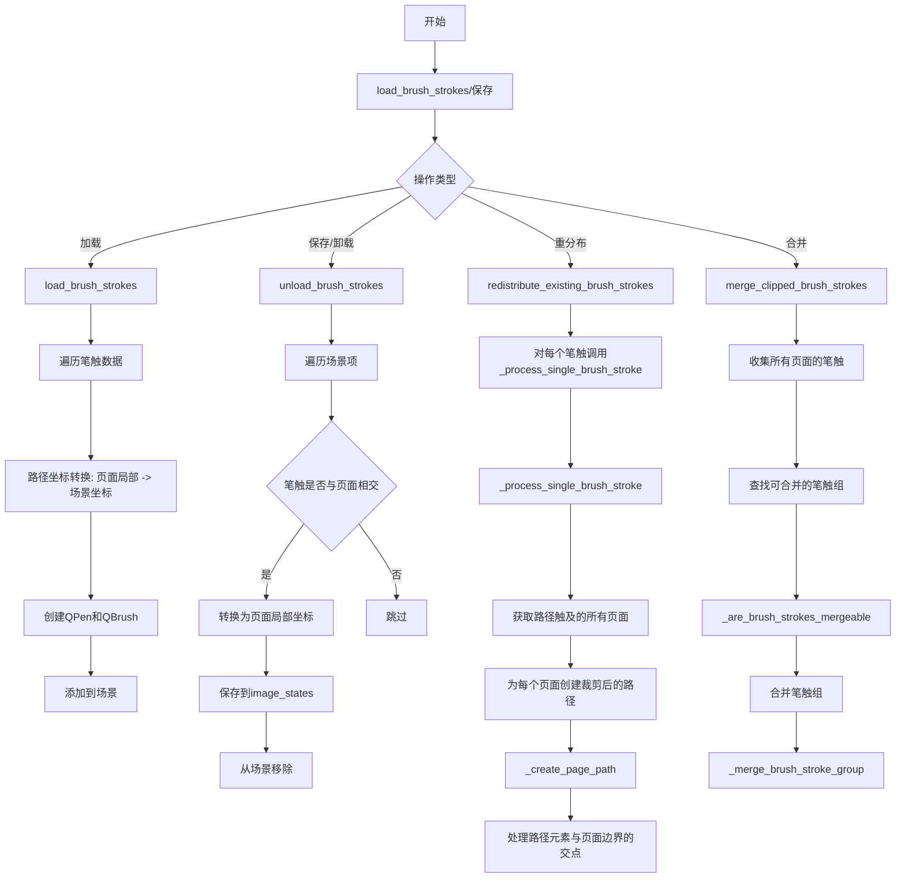

## 类结构

```
BrushStrokeManager (笔触管理器)
└── 依赖注入: viewer, layout_manager, coordinate_converter, image_loader
```

## 全局变量及字段


### `BrushStrokeManager.viewer`
    
视图对象，提供场景访问和绘图管理器引用

类型：`Viewer`
    


### `BrushStrokeManager.layout_manager`
    
布局管理器，管理页面位置、尺寸和Webtoon宽度

类型：`LayoutManager`
    


### `BrushStrokeManager.coordinate_converter`
    
坐标转换器，处理页面局部坐标与场景坐标之间的转换

类型：`CoordinateConverter`
    


### `BrushStrokeManager.image_loader`
    
图像加载器，提供图像文件路径列表

类型：`ImageLoader`
    


### `BrushStrokeManager._scene`
    
Qt图形场景对象，用于添加和移除笔触图形项

类型：`QGraphicsScene`
    


### `BrushStrokeManager.main_controller`
    
主控制器引用，管理图像状态存储

类型：`MainController`
    
    

## 全局函数及方法


### `BrushStrokeManager.__init__`

该方法是 `BrushStrokeManager` 类的构造函数，负责初始化画笔笔触管理器的核心依赖组件，建立与查看器、布局管理器、坐标转换器和图像加载器的关联关系，并设置主控制器引用为 `None`（由场景项管理器后续设置）。

参数：

- `viewer`：`Any`，查看器对象，提供对场景的访问（通过 `viewer._scene` 获取场景对象）
- `layout_manager`：`Any`，布局管理器，负责页面位置和尺寸的计算与管理
- `coordinate_converter`：`Any`，坐标转换器，负责页面本地坐标与场景坐标之间的转换
- `image_loader`：`Any`，图像加载器，提供图像文件路径列表等图像相关数据

返回值：`None`，构造函数不返回任何值

#### 流程图

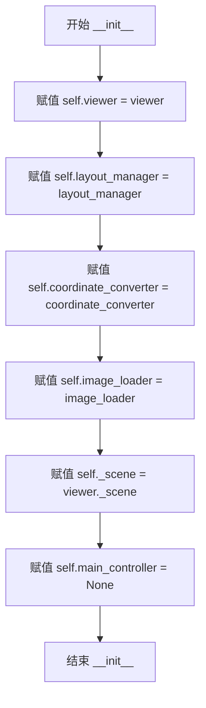

#### 带注释源码

```python
def __init__(self, viewer, layout_manager, coordinate_converter, image_loader):
    """
    初始化 BrushStrokeManager 实例。
    
    参数:
        viewer: 查看器对象，提供对场景的访问
        layout_manager: 布局管理器，处理页面布局逻辑
        coordinate_converter: 坐标转换器，处理坐标系统转换
        image_loader: 图像加载器，提供图像数据
    """
    # 保存查看器引用，用于访问场景和其他属性
    self.viewer = viewer
    
    # 保存布局管理器引用，用于获取页面位置和尺寸信息
    self.layout_manager = layout_manager
    
    # 保存坐标转换器引用，用于坐标系统之间的转换
    self.coordinate_converter = coordinate_converter
    
    # 保存图像加载器引用，用于获取图像文件路径等信息
    self.image_loader = image_loader
    
    # 从查看器获取场景对象，用于添加/移除图形项
    self._scene = viewer._scene
    
    # 主控制器引用，初始化为 None，由场景项管理器在后续设置
    # 用于访问全局状态如 image_states 等
    self.main_controller = None
```


### `BrushStrokeManager.initialize`

初始化或重置笔触管理器状态，用于在场景加载或重置时清理和准备笔触管理器的内部状态。

参数：无

返回值：`None`，无返回值

#### 流程图

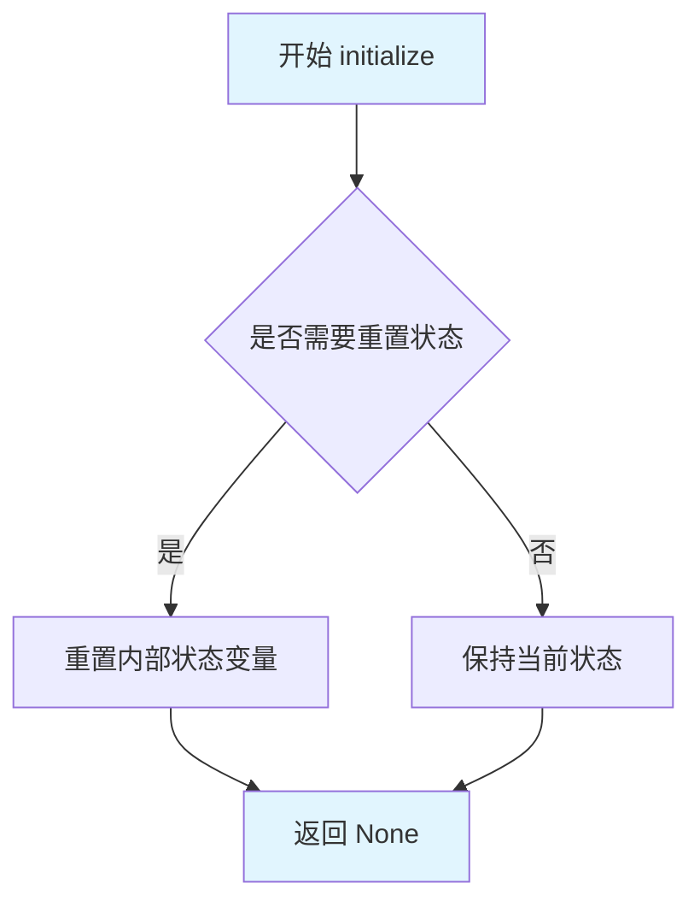

#### 带注释源码

```python
def initialize(self):
    """Initialize or reset the brush stroke manager state."""
    # 当前实现为空操作（pass），作为占位符保留
    # 未来可用于：
    # - 清空内部缓存的笔触数据
    # - 重置状态标志位
    # - 初始化依赖组件
    pass
```

---

**补充说明**

该方法目前为占位符实现（空方法），设计目的是为笔触管理器提供统一的初始化入口。根据类的整体架构推测，未来可能会在该方法中实现以下功能：

1. **状态重置**：清理 `_scene` 中已存在的笔触图形项
2. **缓存清理**：清空 `coordinate_converter`、`layout_manager` 等组件的中间状态
3. **资源初始化**：预加载必要的配置参数或创建默认笔触样式

该方法在 `BrushStrokeManager` 类中被设计为与 `clear()` 方法互补使用——`initialize()` 用于初始化/重置，`clear()` 用于显式清理。


### `BrushStrokeManager.load_brush_strokes`

加载指定页面的笔触数据，将页面局部坐标转换为场景坐标，并在场景中渲染笔触。

参数：

- `state`：`Dict`，包含笔触数据的字典，其中 `brush_strokes` 键存储该页面的笔触列表，每个笔触包含 `path`、`pen`、`brush`、`width` 等属性
- `page_idx`：`int`，目标页面的索引，用于坐标转换

返回值：`None`，该方法无返回值，直接在场景中渲染笔触图形项

#### 流程图

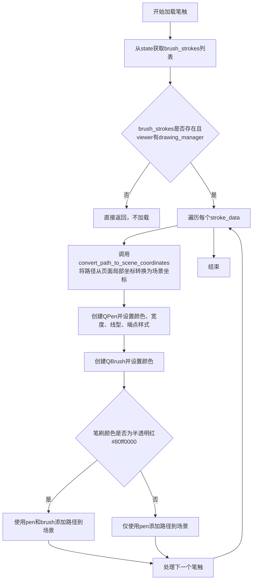

#### 带注释源码

```
def load_brush_strokes(self, state: Dict, page_idx: int):
    """Load brush strokes for a specific page."""
    # 从state字典中获取brush_strokes列表，若不存在则返回空列表
    brush_strokes = state.get('brush_strokes', [])
    
    # 检查笔触列表是否存在且viewer对象具有drawing_manager属性
    if brush_strokes and hasattr(self.viewer, 'drawing_manager'):
        # 遍历每个笔触数据，进行坐标转换和渲染
        for stroke_data in brush_strokes:
            # 将笔触路径从页面局部坐标系转换为场景坐标系
            # page_idx用于确定目标页面的位置信息
            scene_path = self.coordinate_converter.convert_path_to_scene_coordinates(stroke_data['path'], page_idx)
            
            # 创建画笔对象QPen，用于定义线条样式
            pen = QPen()
            # 从stroke_data中提取颜色并设置为画笔颜色
            pen.setColor(QColor(stroke_data['pen']))
            # 设置画笔宽度
            pen.setWidth(stroke_data['width'])
            # 设置线型为实线
            pen.setStyle(Qt.SolidLine)
            # 设置端点样式为圆形
            pen.setCapStyle(Qt.RoundCap)
            # 设置连接点样式为圆角
            pen.setJoinStyle(Qt.RoundJoin)
            
            # 创建画刷对象QBrush，用于填充
            brush = QBrush(QColor(stroke_data['brush']))
            
            # 判断画刷颜色是否为半透明红色（#80ff0000）
            # 若为半透明红则需要同时使用pen和brush渲染
            if brush.color() == QColor("#80ff0000"):
                # 将路径添加到场景，同时应用画笔和画刷
                self._scene.addPath(scene_path, pen, brush)
            else:
                # 仅将路径和画笔添加到场景（无填充）
                self._scene.addPath(scene_path, pen)
```


### `BrushStrokeManager.unload_brush_strokes`

该方法用于卸载指定页面的笔触，将场景中的笔触项转换为页面本地坐标并保存到状态管理器中，随后从场景中移除。

参数：

- `page_idx`：`int`，要卸载笔触的页面索引
- `page_y`：`float`，页面顶部的 Y 坐标（场景坐标）
- `page_bottom`：`float`，页面底部的 Y 坐标（场景坐标）
- `file_path`：`str`，页面图像的文件路径，用于存取图像状态

返回值：`None`，该方法直接修改对象状态和场景，不返回任何值

#### 流程图

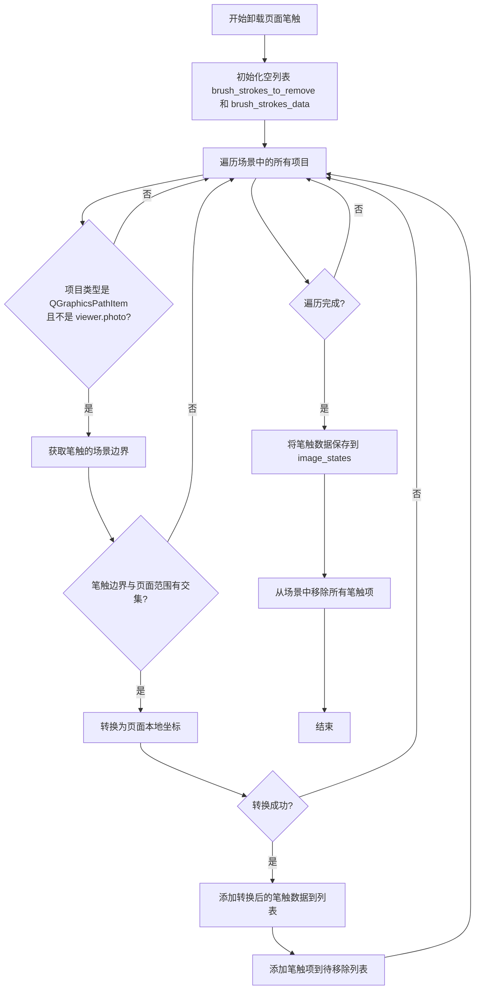

#### 带注释源码

```python
def unload_brush_strokes(self, page_idx: int, page_y: float, page_bottom: float, file_path: str):
    """
    Unload brush strokes for a specific page.
    
    将指定页面的笔触从场景中卸载，转换为页面本地坐标后保存到状态管理器。
    
    Args:
        page_idx: 页面索引，标识需要卸载笔触的目标页面
        page_y: 页面顶部的 Y 坐标（场景坐标系）
        page_bottom: 页面底部的 Y 坐标（场景坐标系）
        file_path: 页面图像的文件路径，用于存取对应的图像状态
    
    Returns:
        None: 该方法直接修改内部状态，不返回任何值
    """
    # 用于存储需要从场景中移除的笔触项
    brush_strokes_to_remove = []
    # 用于存储转换后的笔触数据（页面本地坐标）
    brush_strokes_data = []
    
    # 遍历场景中的所有图形项
    for item in self._scene.items():
        # 筛选出笔触类型的图形项（QGraphicsPathItem）且排除照片项
        if (isinstance(item, QGraphicsPathItem) and 
            item != self.viewer.photo):
            
            # 获取笔触在本地坐标系下的边界矩形
            item_bounds = item.boundingRect()
            # 将边界矩形转换为场景坐标系
            item_scene_bounds = item.mapRectToScene(item_bounds)
            # 获取笔触在场景中的顶部和底部 Y 坐标
            item_top = item_scene_bounds.top()
            item_bottom = item_scene_bounds.bottom()
            
            # 判断笔触是否与当前页面区域有交集
            # 如果笔触完全在页面之上或完全在页面之下，则无交集
            if not (item_bottom < page_y or item_top > page_bottom):
                # 笔触与页面有交集，将其转换为页面本地坐标
                page_local_stroke = self.coordinate_converter.convert_stroke_to_page_local(item, page_idx)
                if page_local_stroke:
                    # 保存转换后的笔触数据
                    brush_strokes_data.append(page_local_stroke)
                    # 记录需要移除的笔触项
                    brush_strokes_to_remove.append(item)
    
    # 将笔触数据保存到图像状态管理器中
    # 以文件路径为键存储笔触数据
    self.main_controller.image_states[file_path]['brush_strokes'] = brush_strokes_data
    
    # 从场景中移除所有已保存的笔触项
    # 释放场景资源，实现懒加载机制
    for stroke_item in brush_strokes_to_remove:
        self._scene.removeItem(stroke_item)
```


### `BrushStrokeManager.save_brush_strokes_to_states`

将场景中所有的笔触图形项保存到对应的页面状态中，遍历场景项并提取笔触数据，然后通过坐标转换将笔触分配到其覆盖的页面。

参数：

- `scene_items_by_page`：`Dict`，键为页面索引，值为包含 `brush_strokes` 列表的字典结构，用于存储各页面的笔触数据

返回值：`None`，无返回值（该方法直接修改 `scene_items_by_page` 字典）

#### 流程图

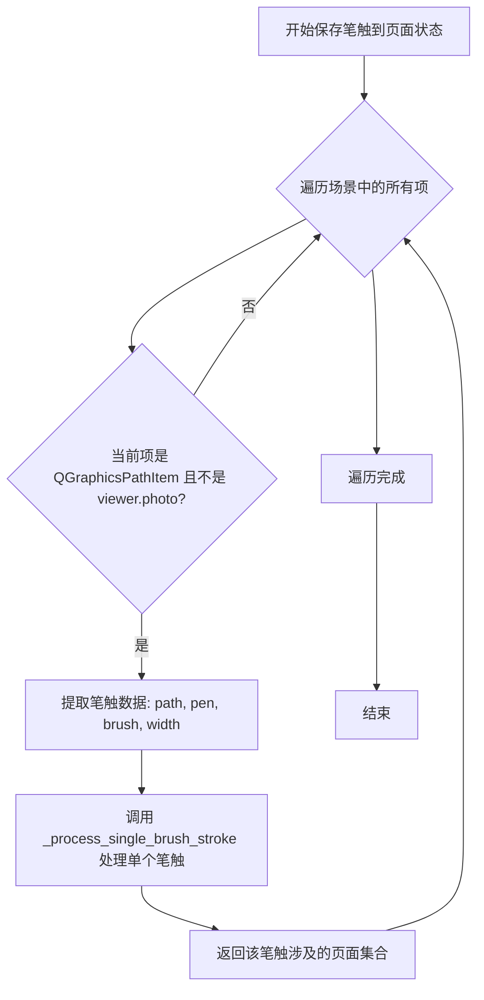

#### 带注释源码

```
def save_brush_strokes_to_states(self, scene_items_by_page: Dict):
    """Save brush strokes to appropriate page states."""
    # 遍历场景中的所有图形项
    for item in self._scene.items():
        # 只处理 QGraphicsPathItem 类型的笔触项，排除主图片项
        if (isinstance(item, QGraphicsPathItem) and 
            item != self.viewer.photo):
            
            # 从图形项中提取笔触数据：路径、画笔颜色、画刷颜色、线宽
            stroke_data = {
                'path': item.path(),  # 笔触的 QPainterPath 路径对象
                'pen': item.pen().color().name(QColor.HexArgb) if hasattr(item, 'pen') else '#80ff0000',  # 画笔颜色，默认为半透明红色
                'brush': item.brush().color().name(QColor.HexArgb) if hasattr(item, 'brush') else '#00000000',  # 画刷颜色，默认为完全透明
                'width': item.pen().width() if hasattr(item, 'pen') else 25  # 线宽，默认25像素
            }
            
            # 处理单个笔触：查找笔触跨越的所有页面并创建裁剪版本
            # 该方法会将笔触数据添加到 scene_items_by_page 中对应页面的 brush_strokes 列表
            self._process_single_brush_stroke(stroke_data, scene_items_by_page)
```


### `BrushStrokeManager._process_single_brush_stroke`

处理单个笔触数据，将其分发到所有与之相交的页面，并返回涉及到的页面索引集合。

参数：

- `stroke`：`Dict`，笔触数据字典，包含路径(path)、画笔颜色(pen)、画刷颜色(brush)和宽度(width)
- `scene_items_by_page`：`Dict`，按页面索引组织的场景项字典，用于存储每个页面的笔触数据

返回值：`Set[int]``，返回该笔触涉及到的所有页面索引集合

#### 流程图

```mermaid
flowchart TD
    A[开始处理单个笔触] --> B[提取笔触数据]
    B --> C[path = stroke['path']]
    B --> D[pen_color = stroke['pen']]
    B --> E[brush_color = stroke['brush']]
    B --> F[width = stroke['width']]
    
    C --> G[初始化空集合 pages_touched]
    G --> H[遍历路径中的所有元素]
    
    H --> I{还有元素未处理?}
    I -->|是| J[获取当前元素点]
    J --> K[调用 layout_manager.get_page_at_position 获取页面索引]
    K --> L{页面索引有效?}
    L -->|是| M[将页面索引加入 pages_touched]
    L -->|否| I
    M --> I
    
    I -->|否| N{pages_touched 不为空?}
    N -->|是| O[遍历 pages_touched 中的每个页面]
    N -->|否| Z[返回空的 pages_touched]
    
    O --> P[调用 _create_page_path 创建页面特定路径]
    P --> Q{路径有效且非空?}
    Q -->|是| R[构建页面笔触数据 page_stroke]
    R --> S[将 page_stroke 添加到 scene_items_by_page[page_index]['brush_strokes']]
    Q -->|否| O
    
    O --> T{所有页面处理完成?}
    T -->|否| O
    T -->|是| U[返回 pages_touched]
    
    Z --> U
```

#### 带注释源码

```python
def _process_single_brush_stroke(self, stroke: Dict, scene_items_by_page: Dict) -> Set[int]:
    """Process a single brush stroke and distribute it to pages.
    
    处理单个笔触数据，分析其在场景坐标系中的路径，
    确定该笔触覆盖了哪些页面，并将裁剪后的路径分发到对应页面。
    
    Args:
        stroke: 笔触数据字典，包含以下键值：
            - path: QPainterPath，场景坐标系的笔触路径
            - pen: str，画笔颜色（QColor HexArgb格式）
            - brush: str，画刷颜色（QColor HexArgb格式）
            - width: int，画笔宽度
        scene_items_by_page: 按页面索引组织的场景项字典，
            结构为 {page_index: {'brush_strokes': [...]}}
    
    Returns:
        Set[int]: 该笔触涉及到的所有页面索引集合
    """
    # 从笔触数据中提取基本属性
    path = stroke['path']  # QPainterPath - 场景坐标系中的路径
    pen_color = stroke['pen']  # str - 画笔颜色
    brush_color = stroke['brush']  # str - 画刷颜色
    width = stroke['width']  # int - 画笔宽度
    
    # 用于记录笔触涉及到的所有页面索引
    pages_touched = set()
    # 用于存储路径元素（类型和点坐标）
    path_elements = []
    
    # 遍历路径中的所有元素，收集点和元素类型
    for i in range(path.elementCount()):
        element = path.elementAt(i)  # 获取路径中的当前元素
        point = QPointF(element.x, element.y)  # 转换为QPointF
        path_elements.append((element.type, point))  # 保存元素类型和点
        
        # 根据点的Y坐标确定该点属于哪个页面
        # 调用 layout_manager 的方法获取页面索引
        page_index = self.layout_manager.get_page_at_position(point.y())
        
        # 检查页面索引是否有效（在有效页面范围内）
        if 0 <= page_index < len(self.image_loader.image_file_paths):
            pages_touched.add(page_index)  # 将页面索引加入集合
    
    # 为每个涉及的页面创建页面特定的路径
    for page_index in pages_touched:
        # 创建针对特定页面的路径（包含坐标转换和边界裁剪）
        page_path = self._create_page_path(path_elements, page_index)
        
        # 只有当路径有效且非空时才添加到页面
        if page_path and not page_path.isEmpty():
            # 构建页面笔触数据
            page_stroke = {
                'path': page_path,  # 转换后的页面本地坐标路径
                'pen': pen_color,
                'brush': brush_color,
                'width': width
            }
            # 将笔触添加到对应页面的笔触列表中
            scene_items_by_page[page_index]['brush_strokes'].append(page_stroke)
    
    # 返回所有涉及的页面索引集合
    return pages_touched
```


### `BrushStrokeManager._create_page_path`

该方法接收场景坐标系的路径元素列表，根据目标页面的边界进行裁剪处理，将场景坐标转换为页面本地坐标，处理跨页面边界的线条裁剪，确保笔触能够正确分布在多个页面上。

参数：

- `path_elements`：`List`，场景路径元素列表，每个元素为元组 `(element_type, scene_point)`，包含路径元素的类型（MoveTo/LineTo）和场景坐标点 QPointF
- `target_page_index`：`int`，目标页面的索引，用于确定裁剪的页面边界和进行坐标转换

返回值：`Optional[QPainterPath]`，返回裁剪后的页面本地坐标系路径，如果没有有效元素落在该页面上则返回 None

#### 流程图

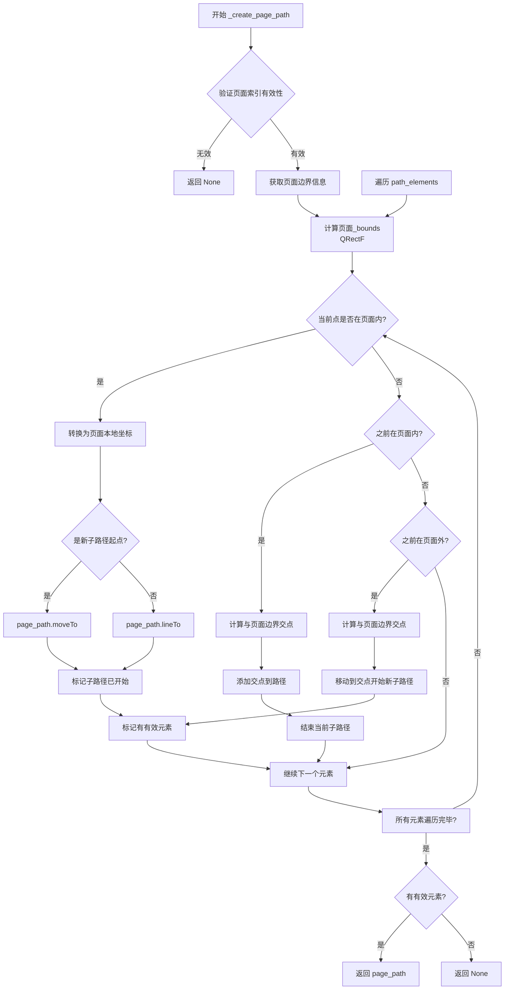

#### 带注释源码

```python
def _create_page_path(self, path_elements: List, target_page_index: int) -> Optional[QPainterPath]:
    """Create a page-specific path from scene path elements."""
    # 初始化页面路径和状态标志
    page_path = QPainterPath()
    has_valid_elements = False
    current_subpath_started = False
    
    # 获取页面边界信息（y坐标和高度）
    if not (0 <= target_page_index < len(self.layout_manager.image_positions)):
        return None  # 页面索引无效
        
    page_y = self.layout_manager.image_positions[target_page_index]
    page_height = self.layout_manager.image_heights[target_page_index]
    
    # 计算页面x边界（考虑图像实际宽度与webtoon宽度的差异）
    page_width = self.layout_manager.webtoon_width
    if hasattr(self.coordinate_converter, 'image_data') and target_page_index in self.coordinate_converter.image_data:
        page_width = self.coordinate_converter.image_data[target_page_index].shape[1]
    page_x_offset = (self.layout_manager.webtoon_width - page_width) / 2
    
    # 构建页面的场景坐标边界矩形
    page_bounds = QRectF(page_x_offset, page_y, page_width, page_height)
    
    # 遍历路径中的每个元素，进行裁剪处理
    for i, (element_type, scene_point) in enumerate(path_elements):
        # 检查当前点是否在目标页面边界内
        point_on_page = (page_bounds.left() <= scene_point.x() <= page_bounds.right() and
                       page_bounds.top() <= scene_point.y() <= page_bounds.bottom())
        
        if point_on_page:
            # 将场景坐标转换为页面本地坐标
            local_point = self.coordinate_converter.scene_to_page_local_position(scene_point, target_page_index)
            has_valid_elements = True
            
            # 根据元素类型决定是moveTo还是lineTo
            if element_type == QPainterPath.ElementType.MoveToElement or not current_subpath_started:
                page_path.moveTo(local_point)
                current_subpath_started = True
            else:
                page_path.lineTo(local_point)
                
        elif current_subpath_started:
            # 当前点在页面外，但之前在页面内（离开页面）
            # 需要裁剪跨越边界的线条
            if i > 0:
                prev_element_type, prev_scene_point = path_elements[i-1]
                prev_on_page = (page_bounds.left() <= prev_scene_point.x() <= page_bounds.right() and
                              page_bounds.top() <= prev_scene_point.y() <= page_bounds.bottom())
                
                if prev_on_page:
                    # 找到线条与页面边界的交点并添加
                    intersection_point = self.coordinate_converter.find_page_boundary_intersection(
                        prev_scene_point, scene_point, page_bounds, target_page_index)
                    if intersection_point:
                        page_path.lineTo(intersection_point)
            
            # 离开页面，结束当前子路径
            current_subpath_started = False
            
        elif i > 0:
            # 当前点在页面外，检查是否从外部进入页面
            prev_element_type, prev_scene_point = path_elements[i-1]
            prev_on_page = (page_bounds.left() <= prev_scene_point.x() <= page_bounds.right() and
                          page_bounds.top() <= prev_scene_point.y() <= page_bounds.bottom())
            
            if not prev_on_page:
                # 线条穿过页面边界，计算交点作为进入点
                intersection_point = self.coordinate_converter.find_page_boundary_intersection(
                    prev_scene_point, scene_point, page_bounds, target_page_index)
                if intersection_point:
                    page_path.moveTo(intersection_point)
                    current_subpath_started = True
                    has_valid_elements = True
    
    # 只有存在有效元素时才返回路径，否则返回None
    return page_path if has_valid_elements else None
```


### `BrushStrokeManager.clear`

清除所有笔触管理状态。该方法用于重置或清理 BrushStrokeManager 中存储的所有笔触数据，但在当前实现中为空方法（stub），尚未实现具体的清理逻辑。

参数：

- （无参数）

返回值：`None`，无返回值描述（方法体为空，仅包含 `pass` 语句）

#### 流程图

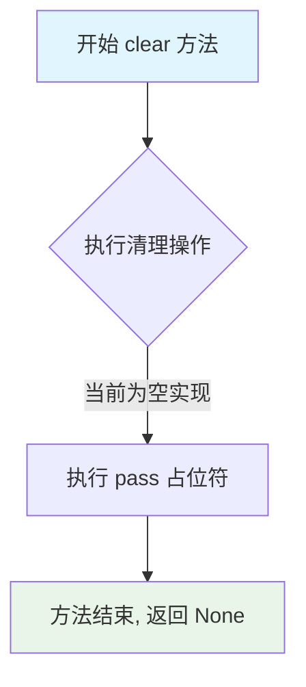

#### 带注释源码

```
def clear(self):
    """
    Clear all brush stroke management state.
    
    该方法用于清除所有笔触管理状态。在当前的实现中，
    这是一个空实现（stub），仅为未来功能预留的接口。
    
    预期行为（待实现）:
    - 清除所有已加载的笔触数据
    - 重置内部状态标志
    - 释放相关资源
    """
    pass  # TODO: 实现具体的清理逻辑
```


### `BrushStrokeManager.redistribute_existing_brush_strokes`

重新分配现有笔触到其覆盖的所有页面，处理因页面裁剪而被分割的笔触，将它们重新分配到其场景坐标所覆盖的所有页面。

参数：

- `all_existing_brush_strokes`：`List[tuple]`，包含笔触数据和原始页面索引的元组列表，每个元组为 (stroke_data, original_page_idx)
- `scene_items_by_page`：`Dict`，按页面索引组织的场景项目字典，用于存储每个页面的笔触数据

返回值：`None`，该方法直接修改 `scene_items_by_page` 字典，不返回任何值

#### 流程图

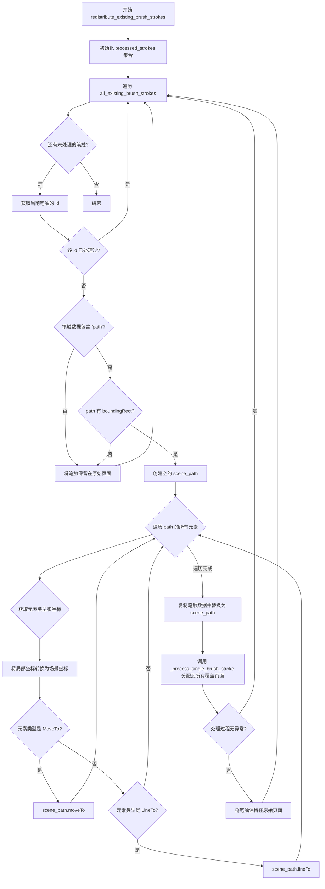

#### 带注释源码

```python
def redistribute_existing_brush_strokes(self, all_existing_brush_strokes: List[tuple], scene_items_by_page: Dict):
    """Redistribute existing brush strokes to all pages they intersect with after clipping."""
    # 用于跟踪已处理的笔触，避免重复处理
    processed_strokes = set()
    
    # 遍历所有现有笔触
    for stroke_data, original_page_idx in all_existing_brush_strokes:
        # 创建唯一标识符以避免重复处理
        stroke_id = id(stroke_data)
        # 如果已处理过则跳过
        if stroke_id in processed_strokes:
            continue
        processed_strokes.add(stroke_id)
        
        # 检查笔触数据是否包含有效的 path 字段
        if 'path' not in stroke_data:
            # 将无效笔触保留在其原始页面
            scene_items_by_page[original_page_idx]['brush_strokes'].append(stroke_data)
            continue
            
        try:
            path = stroke_data['path']
            # 检查 path 是否有有效的 boundingRect 方法
            if not hasattr(path, 'boundingRect'):
                # 将没有有效路径的笔触保留在原始页面
                scene_items_by_page[original_page_idx]['brush_strokes'].append(stroke_data)
                continue
            
            # 将路径从页面局部坐标转换为场景坐标
            scene_path = QPainterPath()
            # 遍历路径的所有元素
            for i in range(path.elementCount()):
                element = path.elementAt(i)
                # 获取页面局部坐标点
                local_point = QPointF(element.x, element.y)
                # 转换为场景坐标
                scene_point = self.coordinate_converter.page_local_to_scene_position(local_point, original_page_idx)

                # 根据元素类型添加到场景路径
                if element.type == QPainterPath.ElementType.MoveToElement:
                    scene_path.moveTo(scene_point)
                elif element.type == QPainterPath.ElementType.LineToElement:
                    scene_path.lineTo(scene_point)
                # 根据需要处理其他元素类型
            
            # 创建包含场景坐标的笔触数据副本
            scene_stroke_data = stroke_data.copy()
            scene_stroke_data['path'] = scene_path
            
            # 使用笔触管理器逻辑处理并分配到所有页面
            # _process_single_brush_stroke 会根据笔触覆盖的区域将其分配到对应页面
            self._process_single_brush_stroke(scene_stroke_data, scene_items_by_page)
            
        except Exception:
            # 如果处理失败，将笔触保留在原始页面
            scene_items_by_page[original_page_idx]['brush_strokes'].append(stroke_data)
```


### `BrushStrokeManager.is_duplicate_brush_stroke`

检查新添加的笔触是否与已存在的笔触重复，通过比较两者的边界矩形在指定误差范围内是否完全重合来判定，可用于避免Webtoon模式下同一位置重复绘制笔触。

参数：

- `new_stroke`：`Dict`，需要检查是否重复的新笔触数据，必须包含'path'键且值为具有boundingRect属性的QPainterPath对象
- `existing_strokes`：`List`，已存在的笔触列表，每个元素为包含'path'键的字典
- `margin`：`int`，允许的边界误差范围（像素），默认为5，用于判断边界矩形是否足够相似

返回值：`bool`，如果新笔触与列表中的任意已存在笔触在指定margin范围内边界矩形完全重合返回True，否则返回False

#### 流程图

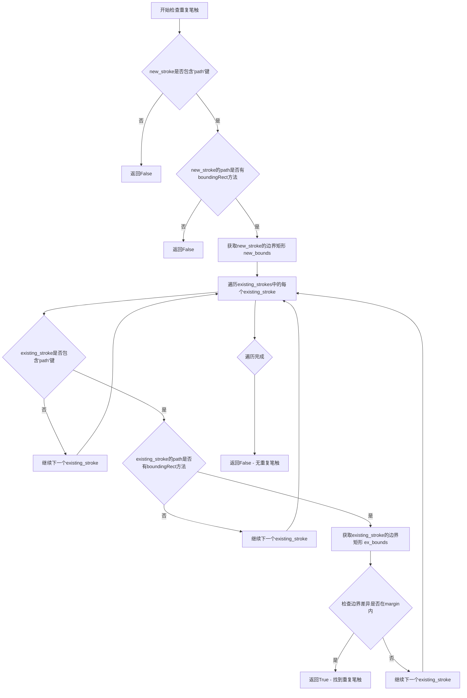

#### 带注释源码

```python
def is_duplicate_brush_stroke(self, new_stroke, existing_strokes, margin=5):
    """Check if a brush stroke is a duplicate of any existing stroke within margin.
    
    通过比较新笔触与已存在笔触的边界矩形来判断是否存在重复。
    只有当两个边界矩形在x、y、宽度、高度四个维度上的差异都小于等于margin时，
    才认为笔触重复。
    
    Args:
        new_stroke: 需要检查的笔触数据字典，必须包含'path'键
        existing_strokes: 已存在笔触的列表
        margin: 允许的边界误差范围（像素），默认值为5
    
    Returns:
        bool: 如果存在重复笔触返回True，否则返回False
    """
    # 检查新笔触是否包含有效的path字段
    if 'path' not in new_stroke:
        return False
        
    # 获取新笔触的路径对象
    new_path = new_stroke['path']
    # 验证路径对象是否有边界矩形方法
    if not hasattr(new_path, 'boundingRect'):
        return False
        
    # 获取新笔触的边界矩形用于比较
    new_bounds = new_path.boundingRect()
    
    # 遍历所有已存在的笔触进行比对
    for existing_stroke in existing_strokes:
        # 跳过无效的已存在笔触
        if 'path' not in existing_stroke:
            continue
            
        # 获取已存在笔触的路径对象
        ex_path = existing_stroke['path']
        if not hasattr(ex_path, 'boundingRect'):
            continue
            
        # 获取已存在笔触的边界矩形
        ex_bounds = ex_path.boundingRect()
        
        # 检查边界矩形的四个维度差异是否都在margin范围内
        # 包括：x坐标、y坐标、宽度、高度
        if (abs(new_bounds.x() - ex_bounds.x()) <= margin and 
            abs(new_bounds.y() - ex_bounds.y()) <= margin and 
            abs(new_bounds.width() - ex_bounds.width()) <= margin and 
            abs(new_bounds.height() - ex_bounds.height()) <= margin):
            # 所有维度都在允许误差范围内，认为是重复笔触
            return True
    
    # 遍历完成未发现重复笔触
    return False
```


### `BrushStrokeManager.merge_clipped_brush_strokes`

合并被页面边界切割的笔触。该方法在普通模式下，查找因页面边界而被分割到相邻页面的笔触，并将它们重新合并为一个完整的笔触。

参数：  
无

返回值：`None`，无返回值（该方法直接修改 `main_controller.image_states` 中的笔触数据）

#### 流程图

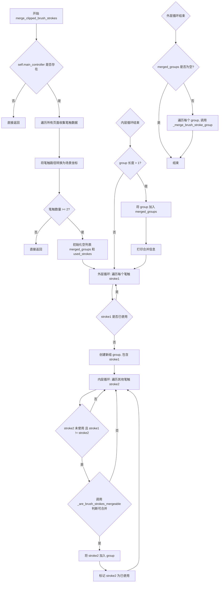

#### 带注释源码

```python
def merge_clipped_brush_strokes(self):
    """Merge brush stroke items that were clipped across page boundaries in regular mode."""
    # 检查主控制器是否存在，不存在则直接返回
    if not self.main_controller:
        return
        
    all_strokes = []
    
    # 步骤1: 遍历所有页面，收集笔触数据
    for page_idx in range(len(self.image_loader.image_file_paths)):
        file_path = self.image_loader.image_file_paths[page_idx]
        state = self.main_controller.image_states.get(file_path, {})
        strokes = state.get('brush_strokes', [])
        
        # 步骤2: 遍历每个笔触，转换为场景坐标
        for stroke_data in strokes:
            # 跳过无效路径
            if 'path' not in stroke_data:
                continue
                
            # 获取路径并检查有效性
            path = stroke_data['path']
            if hasattr(path, 'boundingRect'):
                bounds = path.boundingRect()
                # 计算笔触中心点
                center_point = QPointF(bounds.center().x(), bounds.center().y())
                # 将页面局部坐标转换为场景坐标
                scene_center = self.coordinate_converter.page_local_to_scene_position(center_point, page_idx)
                
                # 保存笔触信息，包含场景边界和场景中心点
                all_strokes.append({
                    'data': stroke_data,
                    'page_idx': page_idx,
                    'scene_bounds': bounds,
                    'scene_center': scene_center
                })
    
    # 笔触数量少于2时无法合并，直接返回
    if len(all_strokes) < 2:
        return  # Need at least 2 strokes to merge
    
    # 步骤3: 分组可合并的笔触
    merged_groups = []
    used_strokes = set()
    
    # 外层循环：遍历所有笔触
    for i, stroke1 in enumerate(all_strokes):
        # 跳过已使用的笔触
        if i in used_strokes:
            continue
            
        # 创建新组，首先放入 stroke1
        group = [stroke1]
        used_strokes.add(i)
        
        # 内层循环：查找可与 stroke1 合并的其他笔触
        for j, stroke2 in enumerate(all_strokes):
            # 跳过已使用的笔触和自身
            if j in used_strokes or i == j:
                continue
                
            # 检查两个笔触是否可合并
            if self._are_brush_strokes_mergeable(stroke1, stroke2):
                group.append(stroke2)
                used_strokes.add(j)
        
        # 如果组中有多于1个笔触，则添加到待合并组
        if len(group) > 1:
            merged_groups.append(group)
            print(f"Found mergeable brush stroke group with {len(group)} items")
    
    # 步骤4: 对每个可合并的组执行合并操作
    for group in merged_groups:
        self._merge_brush_stroke_group(group)
```


### `BrushStrokeManager._are_brush_strokes_mergeable`

检查两个笔触数据是否可以被合并（用于合并因常规模式下被裁剪而分散到不同页面的笔触）。该方法通过比较两个笔触的页面相邻性、垂直距离、水平距离和样式属性来判断它们是否原本属于同一个笔触。

参数：

- `stroke1`：`Dict`，第一个笔触的字典，包含以下键：
  - `data`：笔触数据字典（包含 `pen`、`width`、`brush` 等样式属性）
  - `page_idx`：笔触所在页面索引
  - `scene_bounds`：笔触在场景坐标系中的边界矩形
  - `scene_center`：笔触在场景坐标系中的中心点
- `stroke2`：`Dict`，第二个笔触的字典，结构同上

返回值：`bool`，如果两个笔触可以合并则返回 `True`，否则返回 `False`

#### 流程图

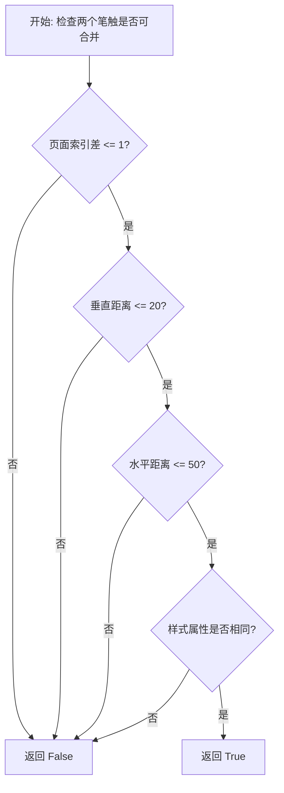

#### 带注释源码

```python
def _are_brush_strokes_mergeable(self, stroke1, stroke2):
    """
    Check if two brush strokes can be merged (were likely clipped from same original in regular mode).
    
    用于检查两个笔触是否可以合并。
    主要用于合并因常规模式下被裁剪而分散到相邻页面的笔触。
    """
    
    # 检查两个笔触是否在相邻的页面上（这是判断裁剪笔触的关键条件）
    # 页面索引差大于1说明不是相邻页面，不可能来自同一个被裁剪的笔触
    if abs(stroke1['page_idx'] - stroke2['page_idx']) > 1:
        return False
    
    # 检查两个笔触是否在垂直方向上相邻
    tolerance = 20  # More lenient tolerance for brush strokes
    center1 = stroke1['scene_center']  # 获取第一个笔触的场景中心点
    center2 = stroke2['scene_center']  # 获取第二个笔触的场景中心点
    vertical_distance = abs(center1.y() - center2.y())  # 计算垂直距离
    
    # 如果垂直距离超过容差值（20像素），说明两个笔触不垂直相邻
    if vertical_distance > tolerance:
        return False
        
    # 检查水平距离（裁剪的笔触应该在水平方向上比较接近）
    horizontal_distance = abs(center1.x() - center2.x())
    # 如果水平距离超过50像素，允许一定的水平变化范围
    if horizontal_distance > 50:  # Allow some horizontal variation
        return False
        
    # 检查样式是否相似（来自同一个笔触的裁剪部分应该有相同的样式）
    data1 = stroke1['data']  # 获取第一个笔触的数据字典
    data2 = stroke2['data']  # 获取第二个笔触的数据字典
    style_attrs = ['pen', 'width', 'brush']  # 需要比较的样式属性列表
    for attr in style_attrs:
        # 如果任意一个样式属性不相同，则不能合并
        if data1.get(attr) != data2.get(attr):
            return False
            
    # 所有检查都通过，返回True表示可以合并
    return True
```


### `BrushStrokeManager._merge_brush_stroke_group`

合并一组被裁剪的笔触，将其合并为一个完整的笔触并重新分配到目标页面。

参数：

-  `group`：List[Dict]，包含笔触数据的字典列表，每个字典包含笔触数据、页面索引、场景边界和场景中心点

返回值：`None`，无返回值（直接修改内部状态）

#### 流程图

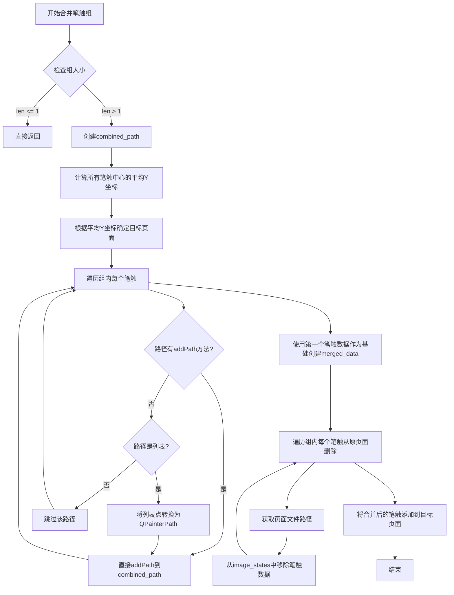

#### 带注释源码

```python
def _merge_brush_stroke_group(self, group):
    """Merge a group of clipped brush strokes back into one."""
    # 如果组只有一个或更少的笔触，无需合并，直接返回
    if len(group) <= 1:
        return
        
    # 创建组合路径对象，用于合并所有笔触路径
    # Determine unified path by combining all paths
    combined_path = QPainterPath()
    
    # 计算所有笔触的场景中心点
    # Determine target page (center of all strokes)
    all_centers = [item['scene_center'] for item in group]
    # 计算Y坐标平均值
    avg_y = sum(center.y() for center in all_centers) / len(all_centers)
    # 根据平均Y坐标确定目标页面索引
    target_page = self.layout_manager.get_page_at_position(avg_y)
    
    # 遍历组内所有笔触，将路径合并到combined_path
    # Combine all paths into one
    for item in group:
        path = item['data']['path']
        # 如果路径对象有addPath方法，直接合并
        if hasattr(path, 'addPath'):
            combined_path.addPath(path)
        else:
            # Convert path data to QPainterPath if needed
            # 如果路径是列表格式，转换为QPainterPath
            if isinstance(path, list):
                temp_path = QPainterPath()
                for i, point in enumerate(path):
                    if i == 0:
                        # 第一个点使用moveTo
                        temp_path.moveTo(QPointF(point[0], point[1]))
                    else:
                        # 后续点使用lineTo
                        temp_path.lineTo(QPointF(point[0], point[1]))
                combined_path.addPath(temp_path)
    
    # 使用第一个笔触的数据作为基础，创建合并后的笔触数据
    # Create merged stroke data using first stroke as base
    base_data = group[0]['data'].copy()
    base_data['path'] = combined_path
    
    # 从所有原始页面中删除这些笔触
    # Remove all strokes from their current pages
    for item in group:
        page_idx = item['page_idx']
        # 获取页面文件路径
        file_path = self.image_loader.image_file_paths[page_idx]
        # 获取该页面的状态
        state = self.main_controller.image_states[file_path]
        # 获取笔触列表
        strokes = state.get('brush_strokes', [])
        # Remove the stroke data
        # 从列表中移除该笔触数据
        if item['data'] in strokes:
            strokes.remove(item['data'])
    
    # 将合并后的笔触添加到目标页面
    # Add merged stroke to target page
    target_file_path = self.image_loader.image_file_paths[target_page]
    target_state = self.main_controller.image_states[target_file_path]
    # 确保brush_strokes字段存在
    if 'brush_strokes' not in target_state:
        target_state['brush_strokes'] = []
    # 添加合并后的笔触到目标页面
    target_state['brush_strokes'].append(base_data)
```

## 关键组件


### 笔触状态管理 (Brush Stroke State Management)

管理Webtoon场景中笔触的加载、保存和卸载，维护笔触的持久化状态，支持页面级和场景级坐标系统的转换与同步。

### 坐标转换系统 (Coordinate Conversion System)

提供页面局部坐标与场景坐标之间的双向转换功能，包括路径坐标转换、点坐标转换以及页面边界交点计算，支持多页面的笔触裁剪和分布。

### 惰性加载机制 (Lazy Loading)

通过load_brush_strokes和unload_brush_strokes方法实现按需加载和卸载笔触，仅在页面可见时加载对应笔触，优化内存使用。

### 笔触裁剪与跨页分布 (Stroke Clipping & Cross-page Distribution)

_process_single_brush_stroke方法分析笔触路径与各页面的交集，将跨页笔触裁剪并分发到其覆盖的所有页面，维护数据一致性。

### 笔触去重检测 (Duplicate Detection)

is_duplicate_brush_strokes方法通过边界矩形比对检测重复笔触，支持自定义边缘距，提供高效的笔触重复性判断。

### 跨页笔触合并 (Cross-page Stroke Merging)

merge_clipped_brush_strokes和相关方法将因页面边界被裁剪的笔触片段重新合并，恢复原始笔触的完整性，应用于普通模式下的笔触管理。

### 路径处理与裁剪 (Path Processing & Clipping)

_create_page_path方法实现场景路径到页面局部路径的转换，支持MoveTo和LineTo元素类型，处理路径与页面边界的交点计算，实现精确的笔触裁剪。


## 问题及建议


### 已知问题

-   **空方法设计缺陷**：`initialize()` 和 `clear()` 方法为空实现，仅包含 `pass`，但被声明为公共接口，导致调用时无实际作用。
-   **裸异常捕获**：`redistribute_existing_brush_strokes` 方法中使用 `except Exception:` 捕获所有异常但不做任何处理，静默吞掉错误信息，导致问题难以追踪调试。
-   **硬编码颜色值**：在 `load_brush_strokes` 中硬编码 `QColor("#80ff0000")` 进行比较，缺乏常量定义，可读性差且难以维护。
-   **属性访问缺乏防御性检查**：多处直接调用 `item.pen()`、`item.brush()` 或访问 `stroke_data['path']`，未进行 `hasattr` 或 `None` 检查，可能在数据异常时触发 AttributeError。
-   **性能瓶颈**：遍历整个场景所有 items 进行笔刷描边操作（`save_brush_strokes_to_states`、`unload_brush_strokes`），在大型 Webtoon 场景中性能较差；`_process_single_brush_stroke` 对路径每个元素都调用 `get_page_at_position`，可考虑批量处理。
-   **O(n²) 复杂度**：`merge_clipped_brush_strokes` 方法中使用双层循环比较笔刷描边，在笔刷描边数量较多时存在性能问题。
-   **资源未释放**：从场景移除 `QGraphicsPathItem` 后未显式调用 `deleteLater()` 或进行清理，可能导致内存泄漏。
-   **重复代码逻辑**：坐标转换逻辑在多处重复出现（如 page-local 到 scene 转换），未提取为统一工具方法。
-   **魔法数字**：`margin=5`、`tolerance=20`、`horizontal_distance > 50` 等数值直接硬编码，应提取为类常量或配置参数。
-   **依赖注入不完整**：`main_controller` 通过后期赋值设置，构造函数中未初始化，违反了依赖注入的完整性。

### 优化建议

-   移除或实现空方法 `initialize()` 和 `clear()`，或在文档中明确标记为占位方法。
-   将裸 `except Exception:` 改为具体异常类型捕获，并记录日志或重抛有意义的异常。
-   定义颜色常量类或使用枚举替代硬编码颜色字符串。
-   添加防御性检查函数（如 `safe_get_pen()`、`safe_get_brush()`），或在数据入口进行 schema 验证。
-   使用空间索引（如 R-Tree）或按页面分区缓存笔刷描边，避免全场景遍历。
-   优化 `merge_clipped_brush_strokes` 为基于哈希的 O(n) 算法，或使用四叉树加速空间查询。
-   移除 item 后调用 `item.deleteLater()` 确保 Qt 内部资源释放。
-   抽取坐标转换逻辑到 `CoordinateConverter` 工具类或 `BrushStrokeUtils` 模块。
-   将魔法数字提取为类常量 `MERGE_TOLERANCE`、`DUPLICATE_MARGIN` 等，提升可读性和可配置性。
-   在构造函数中添加可选的 `main_controller` 参数，或使用 `Optional[]` 类型提示并提供 `set_main_controller()` 方法。

## 其它


### 设计目标与约束

该模块的主要设计目标是管理Webtoon模式下的画笔笔画，实现笔画的懒加载、分页存储和跨页笔画的裁剪与合并功能。核心约束包括：1) 依赖PySide6的QGraphicsPathItem进行笔画渲染；2) 需要与layout_manager、coordinate_converter、image_loader和viewer组件协同工作；3) 笔画数据需要在页面本地坐标和场景坐标之间频繁转换；4) 支持跨页面笔画的自动裁剪和合并。

### 错误处理与异常设计

主要异常场景包括：1) 坐标转换失败时捕获异常并将笔画保留在原页面；2) path对象无效时跳过处理；3) image_states字典访问使用.get()方法避免KeyError；4) convert_path_to_scene_coordinates和convert_stroke_to_page_local返回None时进行空值检查；5) 页面索引越界时返回None或跳过处理；6) 异常被捕获后打印诊断信息但不中断主流程。

### 数据流与状态机

模块涉及两种主要状态：加载态（load_brush_strokes将页面本地坐标笔画转换为场景坐标并添加到场景）和卸载态（unload_brush_strokes将场景坐标笔画转换回页面本地坐标并保存到image_states）。数据流向：外部state字典 → coordinate_converter转换 → QGraphicsPathItem添加到场景 → 卸载时反向转换 → 保存到main_controller.image_states。关键状态转换点包括页面切换时的自动卸载/加载、文件保存时的批量导出、以及重分布时的跨页合并。

### 外部依赖与接口契约

核心依赖包括：1) viewer对象需提供_scene属性；2) layout_manager需提供image_positions、image_heights、webtoon_width属性和get_page_at_position方法；3) coordinate_converter需提供convert_path_to_scene_coordinates、convert_stroke_to_page_local、scene_to_page_local_position、page_local_to_scene_position、find_page_boundary_intersection方法和image_data属性；4) image_loader需提供image_file_paths属性；5) main_controller需提供image_states字典。接口契约要求stroke_data字典必须包含path、pen、brush、width字段，其中path为QPainterPath对象。

### 性能考虑与优化空间

当前实现存在以下性能瓶颈：1) load_brush_strokes中对每个stroke_data都调用convert_path_to_scene_coordinates，建议批量转换；2) unload_brush_strokes遍历所有scene.items()进行类型检查和边界计算，页面内容多时性能下降明显，建议建立索引或缓存；3) _process_single_brush_stroke中遍历path.elementCount()获取所有点，建议使用更高效的边界检测而非逐点检查；4) merge_clipped_brush_strokes中双重循环比较所有笔画对，时间复杂度O(n²)，建议使用空间索引优化。

### 线程安全性分析

当前实现为单线程设计，主要在主UI线程中执行。如需支持后台加载，需注意：1) QGraphicsScene操作必须在主线程执行；2) image_states字典的读写需要加锁保护；3) coordinate_converter的转换方法如涉及共享状态需要同步。建议使用QThreadPool或asyncio进行异步加载，但需确保场景操作在主线程完成。

### 内存管理与资源释放

内存管理要点：1) 卸载页面时及时调用_scene.removeItem()释放场景中的QGraphicsPathItem；2) brush_strokes_data列表在保存后应清空以释放引用；3) QPainterPath对象在多次复制时可能占用较多内存，建议使用浅拷贝或引用；4) processed_strokes集合用于去重但会持续增长，需在redistribute_existing_brush_strokes完成后清理。

### 配置与常量定义

硬编码常量包括：1) 重复检测margin=5像素；2) 合并检测tolerance=20像素；3) 水平距离阈值50像素；4) 默认画笔宽度25；5) 透明画笔颜色"#80ff0000"和"#00000000"。建议将这些值提取为配置常量或初始化参数，提供默认值的同时允许外部配置。

### 测试策略建议

单元测试应覆盖：1) 坐标转换方法的准确性验证；2) 页面边界计算逻辑；3) 重复笔画检测的边界情况；4) 跨页裁剪的完整路径保留；5) 空路径和无效路径的处理。集成测试应覆盖：1) 完整页面切换流程；2) 多页面笔画的重分布；3) 合并功能的准确性。Mock对象应包括：viewer、layout_manager、coordinate_converter、image_loader、main_controller。

    