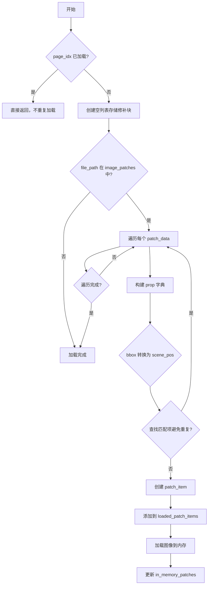
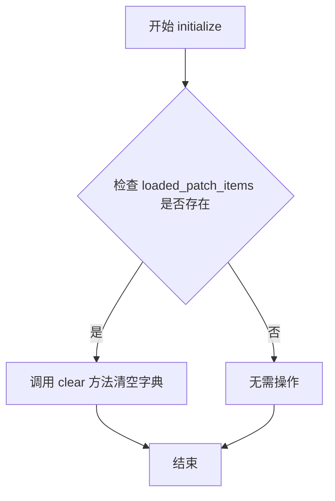
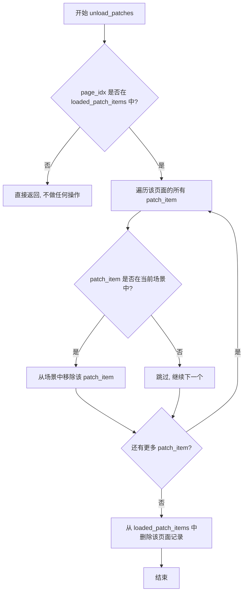
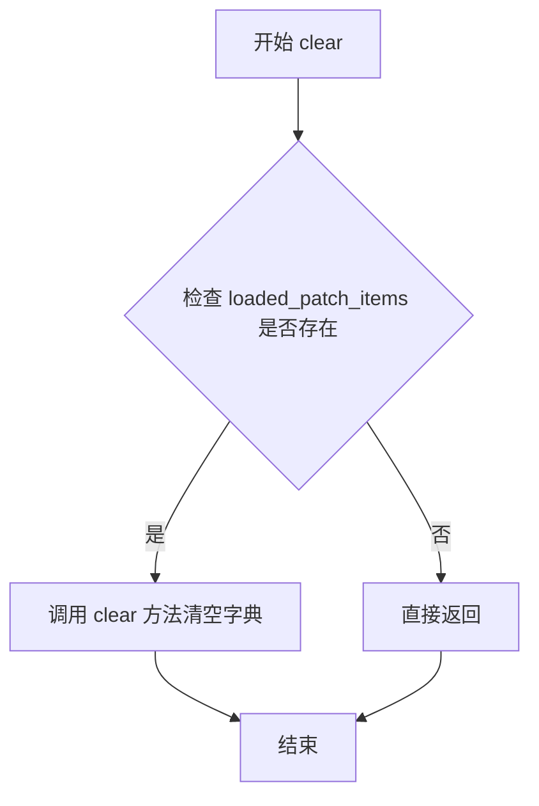

# `comic-translate\app\ui\canvas\webtoons\scene_items\patch_manager.py` 详细设计文档

Webtoon模式的图像修补块（Patch）管理器，通过懒加载机制处理修补块的加载、卸载和状态维护，实现与主控制器和场景的协调。

## 整体流程



## 类结构

```
PatchManager
```

## 全局变量及字段


### `PatchManager.viewer`
    
图像查看器实例

类型：`object`
    


### `PatchManager.layout_manager`
    
布局管理器

类型：`object`
    


### `PatchManager.coordinate_converter`
    
坐标转换器

类型：`object`
    


### `PatchManager.image_loader`
    
图像加载器

类型：`object`
    


### `PatchManager._scene`
    
Qt图形场景对象

类型：`QGraphicsScene`
    


### `PatchManager.main_controller`
    
主控制器引用

类型：`object`
    


### `PatchManager.loaded_patch_items`
    
每页已加载的修补块项

类型：`Dict[int, List[QGraphicsPixmapItem]]`
    
    

## 全局函数及方法


### `PatchManager.__init__`

构造函数，初始化 PatchManager 实例，设置各种管理器和场景引用，为 Webtoon 模式的图像修补块管理奠定基础。

参数：

- `viewer`：查看器对象（类型：`Any`，通常为 QGraphicsView 的子类），用于访问场景和视图信息
- `layout_manager`：布局管理器（类型：`Any`），负责页面布局相关操作
- `coordinate_converter`：坐标转换器（类型：`Any`），提供页面坐标到场景坐标的转换功能
- `image_loader`：图像加载器（类型：`Any`），负责加载图像文件和管理图像路径

返回值：`None`，构造函数无返回值，仅初始化实例状态

#### 流程图

```mermaid
flowchart TD
    A[开始 __init__] --> B[接收 viewer, layout_manager, coordinate_converter, image_loader 参数]
    B --> C[设置 self.viewer = viewer]
    C --> D[设置 self.layout_manager = layout_manager]
    D --> E[设置 self.coordinate_converter = coordinate_converter]
    E --> F[设置 self.image_loader = image_loader]
    F --> G[设置 self._scene = viewer._scene]
    G --> H[设置 self.main_controller = None]
    H --> I[初始化 self.loaded_patch_items = {}]
    I --> J[结束 __init__]
```

#### 带注释源码

```python
def __init__(self, viewer, layout_manager, coordinate_converter, image_loader):
    """
    初始化 PatchManager 实例。
    
    参数:
        viewer: 查看器对象，用于访问场景和视图信息
        layout_manager: 布局管理器，处理页面布局逻辑
        coordinate_converter: 坐标转换器，提供坐标转换功能
        image_loader: 图像加载器，管理图像文件路径和加载
    """
    # 保存查看器引用，用于后续访问场景和视图
    self.viewer = viewer
    
    # 保存布局管理器引用，用于布局相关操作
    self.layout_manager = layout_manager
    
    # 保存坐标转换器引用，用于坐标系统转换
    self.coordinate_converter = coordinate_converter
    
    # 保存图像加载器引用，用于获取图像路径和加载图像
    self.image_loader = image_loader
    
    # 从查看器获取场景对象，用于添加/移除图形项
    self._scene = viewer._scene
    
    # 主控制器引用（由场景项管理器后续设置）
    # 初始为 None，在场景项管理器中会被赋值
    self.main_controller = None
    
    # 跟踪每个页面已加载的修补块项
    # 键为页索引，值为该页的 QGraphicsPixmapItem 列表
    # 使用字典结构实现按页索引的快速查找和惰性加载
    self.loaded_patch_items: Dict[int, List[QGraphicsPixmapItem]] = {}
```


### `PatchManager.initialize`

初始化或重置 PatchManager 的状态，清除所有已加载的补丁项。

参数：

- `self`：`PatchManager`，PatchManager 的当前实例

返回值：`None`，无返回值，该方法仅执行状态重置操作

#### 流程图



#### 带注释源码

```
def initialize(self):
    """Initialize or reset the patch manager state."""
    # 清空已加载补丁项的字典，重置状态
    # 这是一个轻量级重置操作，不涉及资源释放
    # 因为 QGraphicsPixmapItem 对象由场景管理
    self.loaded_patch_items.clear()
```


### `PatchManager.load_patches`

该方法负责在 Webtoon 模式下为指定页面加载图像修复块（inpaint patches），通过懒加载机制避免重复加载，并处理坐标转换、场景项去重以及内存缓存的维护。

参数：

- `page_idx`：`int`，要加载修复块的页面索引

返回值：`None`，该方法无返回值，主要通过修改内部状态（`loaded_patch_items`、`in_memory_patches`）和场景来完成任务

#### 流程图

```mermaid
flowchart TD
    A[load_patches 开始] --> B{检查 main_controller 是否存在}
    B -->|否| C[直接返回]
    B -->|是 --> D{page_idx 是否越界}
    D -->|是| C
    D -->|否 --> E[获取 file_path]
    E --> F{检查页面是否已加载}
    F -->|是| C
    F -->|否 --> G[初始化空列表 loaded_patch_items[page_idx]]
    H{检查 file_path 是否在 image_patches 中}
    H -->|否| C
    H -->|是 --> I[遍历 patches 列表]
    I --> J[构建 prop 字典]
    J --> K[从 bbox 计算 scene_pos]
    K --> L[检查场景中是否存在匹配项]
    L -->|存在| I
    L -->|不存在 --> M[调用 create_patch_item 创建补丁项]
    M --> N{创建是否成功}
    N -->|否| I
    N -->|是 --> O[添加到 loaded_patch_items]
    O --> P{检查 in_memory_patches 中是否存在相同 hash}
    P -->|存在| I
    P -->|不存在 --> Q[读取补丁图像]
    Q --> R{图像读取是否成功}
    R -->|否| I
    R -->|是 --> S[构建 mem_prop 并添加到 in_memory_patches]
    S --> I
```

#### 带注释源码

```python
def load_patches(self, page_idx: int):
    """Load inpaint patches for a specific page."""
    
    # 前置检查：确保主控制器存在且页面索引合法
    if not self.main_controller or page_idx >= len(self.image_loader.image_file_paths):
        return
    
    # 获取目标页面的文件路径
    file_path = self.image_loader.image_file_paths[page_idx]

    # 懒加载优化：避免重复加载已加载页面的补丁
    if page_idx in self.loaded_patch_items:
        return
    
    # 初始化该页面的补丁项列表
    self.loaded_patch_items[page_idx] = []
    
    # 从持久化存储中加载该文件对应的补丁数据
    if file_path in self.main_controller.image_patches:
        patches = self.main_controller.image_patches[file_path]
        
        # 遍历每个补丁数据块
        for patch_data in patches:
            # 构建属性字典，包含边界框、PNG路径和哈希值
            prop = {
                'bbox': patch_data['bbox'],
                'png_path': patch_data['png_path'],
                'hash': patch_data['hash']
            }
            
            # 始终从 bbox 计算场景位置，而非使用可能过时的 scene_pos 数据
            # 这样可以避免图像删除后坐标数据陈旧的问题
            bbox = prop['bbox']
            page_local_pos = QPointF(bbox[0], bbox[1])
            scene_pos = self.coordinate_converter.page_local_to_scene_position(page_local_pos, page_idx)
            prop['scene_pos'] = [scene_pos.x(), scene_pos.y()]
            prop['page_index'] = page_idx
            
            # 检查场景中是否已存在相同补丁项，防止重复添加
            if not PatchCommandBase.find_matching_item(self._scene, prop):
                # 使用场景坐标创建并定位补丁项
                patch_item = PatchCommandBase.create_patch_item(prop, self.viewer)
                if patch_item:
                    # 添加到已加载列表
                    self.loaded_patch_items[page_idx].append(patch_item)
                    
                    # 维护内存中的补丁缓存
                    mem_list = self.main_controller.in_memory_patches.setdefault(file_path, [])
                    # 检查是否已存在相同哈希值的补丁
                    if not any(p['hash'] == prop['hash'] for p in mem_list):
                        # 加载图像数据到内存
                        cv_img = imk.read_image(patch_data['png_path'])
                        if cv_img is not None:
                            mem_prop = {
                                'bbox': patch_data['bbox'],
                                'image': cv_img,
                                'hash': patch_data['hash']
                            }
                            mem_list.append(mem_prop)
```


### `PatchManager.unload_patches`

该方法负责卸载指定页面的修复补丁（Patch），包括从场景中移除补丁图形项并清理内部状态。

参数：

- `page_idx`：`int`，要卸载补丁的目标页面索引

返回值：`None`，无返回值描述（该方法通过直接操作场景中的图形项来实现卸载）

#### 流程图



#### 带注释源码

```python
def unload_patches(self, page_idx: int):
    """Unload inpaint patches for a specific page."""
    
    # 检查该页面的补丁是否已被加载
    # 若该页面索引不存在于 loaded_patch_items 中，说明没有需要卸载的补丁，直接返回
    if page_idx not in self.loaded_patch_items:
        return
        
    # 遍历该页面下所有已加载的补丁图形项
    for patch_item in self.loaded_patch_items[page_idx]:
        # 检查该补丁项当前是否存在于场景中
        # 避免对不在场景中的项执行移除操作，可能导致异常
        if patch_item.scene() == self._scene:
            # 从 Qt 场景中移除该补丁图形项
            self._scene.removeItem(patch_item)
    
    # 清理该页面在管理器中的补丁记录
    # 释放内存中的补丁项引用
    del self.loaded_patch_items[page_idx]
```


### `PatchManager.get_patches_in_page_bounds`

获取指定页面的所有已加载的修补补丁项，返回一个副本以防止外部修改内部状态。

参数：

- `page_idx`：`int`，页面索引，用于定位需要查询的页面

返回值：`List[QGraphicsPixmapItem]`，返回指定页面索引对应的已加载补丁项列表，如果该页面尚未加载任何补丁则返回空列表

#### 流程图

```mermaid
flowchart TD
    A[开始] --> B{page_idx 是否在 loaded_patch_items 中?}
    B -->|否| C[返回空列表 []]
    B -->|是| D[返回 loaded_patch_items[page_idx].copy()]
    C --> E[结束]
    D --> E
```

#### 带注释源码

```python
def get_patches_in_page_bounds(self, page_idx: int) -> List[QGraphicsPixmapItem]:
    """Get all patch items that belong to a specific page."""
    # 检查页面索引是否存在于已加载补丁项字典中
    if page_idx not in self.loaded_patch_items:
        # 如果该页面尚未加载任何补丁，返回空列表
        return []
    # 返回该页面补丁项列表的浅拷贝
    # 使用copy()防止外部代码直接修改内部状态，保证数据封装性
    return self.loaded_patch_items[page_idx].copy()
```


### `PatchManager.clear`

清除所有补丁管理状态，重置已加载的补丁项目字典。

参数：
- 无

返回值：`None`，无返回值描述

#### 流程图



#### 带注释源码

```python
def clear(self):
    """Clear all patch management state."""
    # 清空已加载补丁项目的字典，释放所有页面关联的补丁引用
    # 这将导致所有 QGraphicsPixmapItem 对象不再被 PatchManager 引用
    # 但不会从场景中移除这些对象（需调用 unload_patches 逐页移除）
    self.loaded_patch_items.clear()
```

## 关键组件


### 惰性加载机制 (Lazy Loading)

在Webtoon模式下实现贴图的按需加载，通过loaded_patch_items字典追踪每页已加载的patch，仅在load_patches被调用且页面未被加载时才执行加载逻辑，避免重复加载。

### 坐标转换系统 (Coordinate Conversion)

使用coordinate_converter将页面局部坐标(bbox)转换为场景坐标(scene_pos)，确保patch item在正确的位置显示，同时处理图像删除后坐标数据可能过时的情况。

### Patch项目管理 (Patch Management)

通过load_patches、unload_patches和get_patches_in_page_bounds方法管理patch的生命周期，维护loaded_patch_items字典存储每页关联的QGraphicsPixmapItem对象，支持高效的增删查操作。

### 内存管理 (Memory Management)

维护in_memory_patches字典存储实际图像数据(cv_img)，实现图像的内存缓存，同时通过hash去重避免重复存储，并使用imkit.read_image加载原始图像数据。

### 场景项目操作 (Scene Item Operations)

封装在PatchCommandBase类中，提供find_matching_item查找匹配项目和create_patch_item创建新项目的功能，处理QGraphicsScene中的item添加、删除和去重逻辑。


## 问题及建议


### 已知问题

- **内存泄漏风险**：在 `unload_patches` 方法中，只从场景中移除了 patch items，但没有清理 `main_controller.in_memory_patches` 中对应的图像数据，导致内存占用持续增长
- **未使用的依赖**：构造函数的 `layout_manager` 参数被传入但在整个类中从未使用，增加了不必要的耦合
- **缺乏错误处理**：`load_patches` 中调用 `imk.read_image` 读取图像时没有 try-except 包装，若文件不存在或损坏会导致未捕获异常
- **冗余方法**：`initialize()` 和 `clear()` 方法功能完全相同，造成代码冗余且语义不清晰
- **外部状态依赖过多**：类内部直接访问 `viewer._scene` 私有属性，且假设 `main_controller` 必须存在 `image_patches` 和 `in_memory_patches` 属性，缺乏防御性编程
- **线程安全问题**：类方法可能被多线程调用（如 UI 线程和后台加载线程），但没有任何锁保护机制，存在竞态条件风险

### 优化建议

- **完善资源清理**：在 `unload_patches` 中同时清理 `in_memory_patches`，或在 `PatchManager` 中维护对 `in_memory_patches` 的引用并同步清理
- **移除无效参数**：删除未使用的 `layout_manager` 参数，简化构造函数签名
- **增加异常处理**：为文件读取和图像加载操作添加 try-except 块，并记录错误日志
- **合并或区分方法**：根据实际需求重新设计 `initialize()` 和 `clear()` 的职责，或合并为一个方法
- **增加防御性检查**：在访问 `main_controller` 属性前进行验证，使用 `getattr` 或 `hasattr` 检查必要属性是否存在
- **考虑异步加载**：对于大量 patch 的加载，考虑使用 Qt 的异步机制避免阻塞 UI 线程
- **添加线程安全**：如需支持多线程访问，使用 `QMutex` 或 Python 的 `threading.Lock` 保护共享状态

## 其它


### 设计目标与约束

- **设计目标**：实现Webtoon模式下图像修补块（inpaint patches）的懒加载管理，按需加载/卸载特定页面的修补块，优化内存使用
- **约束条件**：
  - 依赖main_controller的image_patches和in_memory_patches数据结构
  - 需要与PatchCommandBase配合进行场景项的创建和查找
  - 坐标转换依赖coordinate_converter进行页面坐标到场景坐标的转换

### 错误处理与异常设计

- **load_patches错误处理**：当image_patches中不存在对应file_path的补丁数据时，直接返回而不报错；当png_path对应的图像读取失败（cv_img为None）时，跳过该补丁的内存存储但不中断加载流程
- **unload_patches错误处理**：移除场景项前检查item是否确实存在于场景中，避免操作已移除的对象
- **边界条件处理**：page_idx超出有效范围时直接返回，避免数组越界

### 数据流与状态机

- **状态管理**：维护loaded_patch_items字典，键为页面索引，值为该页面已加载的QGraphicsPixmapItem列表
- **加载流程**：检查page_idx是否已加载 → 从main_controller获取补丁数据 → 创建场景项 → 更新in_memory_patches缓存
- **卸载流程**：从场景中移除项 → 删除loaded_patch_items中对应条目
- **生命周期**：initialize()清空状态 → load_patches填充状态 → unload_patches/clear释放状态

### 外部依赖与接口契约

- **imkit模块**：提供imk.read_image()用于读取补丁图像
- **PySide6模块**：依赖QGraphicsPixmapItem进行场景项管理
- **PatchCommandBase**：调用find_matching_item()进行去重检查，调用create_patch_item()创建场景项
- **viewer对象**：需包含_scene属性用于场景操作
- **image_loader**：需包含image_file_paths列表属性
- **coordinate_converter**：需提供page_local_to_scene_position()方法进行坐标转换
- **main_controller**：需包含image_patches（Dict）和in_memory_patches（Dict）属性

### 关键组件信息

- **PatchManager**：核心管理类，负责Webtoon模式下修补块的加载/卸载和状态维护
- **loaded_patch_items**：内存字典，追踪每个页面已加载的修补块场景项
- **coordinate_converter**：坐标转换工具，连接页面局部坐标与场景全局坐标

### 潜在技术债务与优化空间

- **重复代码**：load_patches中创建mem_prop的逻辑与PatchCommandBase.create_patch_item存在相似功能，可考虑抽象
- **性能考虑**：find_matching_item采用线性遍历，当补丁数量增多时可能存在性能瓶颈
- **内存管理**：unload_patches仅从场景移除项但未清理in_memory_patches中的数据，可能导致内存泄漏
- **异常日志**：缺少详细的日志记录，调试时难以追踪加载失败的具体原因
- **类型提示**：部分变量（如patches、patch_data）缺少精确类型注解


    