# `comic-translate\app\ui\canvas\webtoons\scene_items\rectangle_manager.py` 详细设计文档

RectangleManager类负责Webtoon模式下矩形（MoveableRectItem）的全生命周期管理，包括从状态字典加载/卸载矩形、保存矩形状态、跨页面剪切（clipping）时的重分配、以及页面切换时分割矩形的合并等核心功能，采用依赖注入设计以解耦viewer、layout_manager、coordinate_converter和image_loader等模块。

## 整体流程

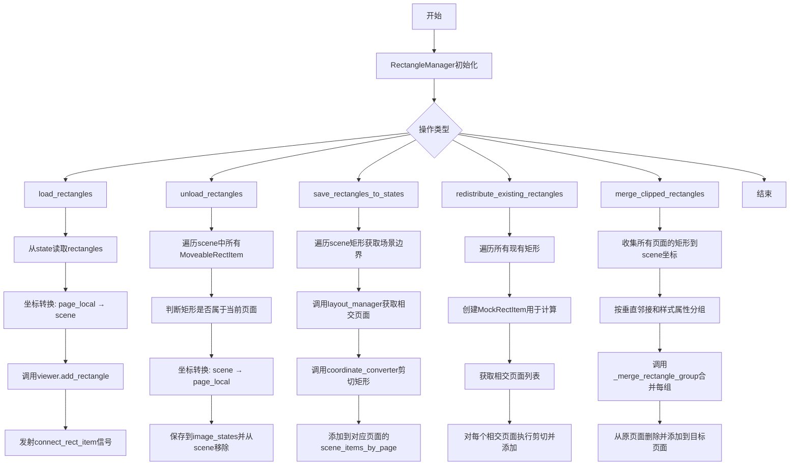

## 类结构

```
RectangleManager (主类)
└── MockRectItem (内部类，用于redistribute_existing_rectangles中模拟矩形)
```

## 全局变量及字段


### `processed_rects`
    
用于去重的集合，跟踪已处理的矩形以避免redistribute_existing_rectangles中的重复处理

类型：`set[int]`
    


### `margin`
    
is_duplicate_rectangle中用于检测重复矩形的默认容差值，单位为像素

类型：`int`
    


### `tolerance`
    
_are_rectangles_mergeable中判断两个矩形是否垂直邻接的容差值，单位为像素

类型：`int`
    


### `x_tolerance`
    
_are_rectangles_mergeable中判断两个矩形水平位置是否对齐的容差值，单位为像素

类型：`int`
    


### `width_tolerance`
    
_are_rectangles_mergeable中判断两个矩形宽度是否相似的容差值，单位为像素

类型：`int`
    


### `RectangleManager.viewer`
    
图像查看器实例，负责矩形的添加和场景管理

类型：`object`
    


### `RectangleManager.layout_manager`
    
布局管理器实例，用于获取页面信息和场景边界

类型：`object`
    


### `RectangleManager.coordinate_converter`
    
坐标转换器实例，处理页面坐标与场景坐标之间的转换

类型：`object`
    


### `RectangleManager.image_loader`
    
图像加载器实例，提供图像文件路径列表和加载功能

类型：`object`
    


### `RectangleManager._scene`
    
Qt场景对象，用于管理场景中的图形项

类型：`QGraphicsScene`
    


### `RectangleManager.main_controller`
    
主控制器引用，用于访问图像状态和进行矩形合并操作

类型：`object`
    


### `MockRectItem._pos`
    
模拟矩形的位置信息，用于在redistribute_existing_rectangles中创建虚拟矩形对象

类型：`QPointF`
    


### `MockRectItem._rect`
    
模拟矩形的边界矩形，用于在redistribute_existing_rectangles中获取尺寸信息

类型：`QRectF`
    
    

## 全局函数及方法


### `RectangleManager.__init__`

这是 `RectangleManager` 类的构造函数，负责初始化矩形管理器的核心依赖对象和引用。

参数：

- `viewer`：`object`，查看器对象，提供场景访问和矩形操作接口
- `layout_manager`：`object`，布局管理器，用于页面布局和场景边界计算
- `coordinate_converter`：`object`，坐标转换器，处理页面本地坐标与场景坐标之间的转换
- `image_loader`：`object`，图像加载器，提供图像文件路径列表访问

返回值：`None`，构造函数无返回值，仅初始化实例属性

#### 流程图

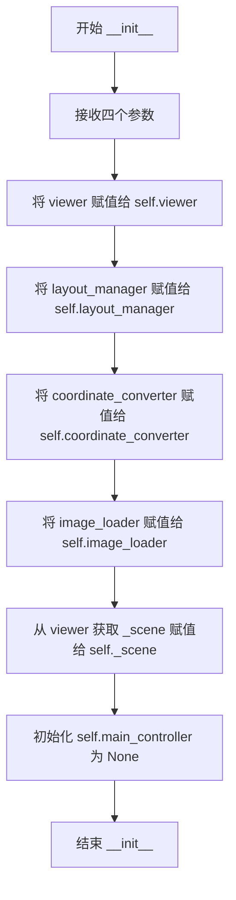

#### 带注释源码

```python
def __init__(self, viewer, layout_manager, coordinate_converter, image_loader):
    """
    初始化 RectangleManager 实例。
    
    参数:
        viewer: 查看器对象，提供场景访问和矩形项操作的方法
        layout_manager: 布局管理器，处理页面布局和场景边界计算
        coordinate_converter: 坐标转换器，处理页面本地坐标与场景坐标的相互转换
        image_loader: 图像加载器，提供图像文件路径列表的访问
    """
    # 存储查看器引用，用于后续访问场景和矩形列表
    self.viewer = viewer
    
    # 存储布局管理器引用，用于获取页面信息和场景边界计算
    self.layout_manager = layout_manager
    
    # 存储坐标转换器引用，用于坐标系转换
    self.coordinate_converter = coordinate_converter
    
    # 存储图像加载器引用，用于访问图像文件路径
    self.image_loader = image_loader
    
    # 从查看器获取场景对象，用于操作场景中的图形项
    self._scene = viewer._scene
    
    # Main controller reference (set by scene item manager)
    # 主控制器引用，初始化为 None，由 SceneItemManager 在后续设置
    self.main_controller = None
```


### `RectangleManager.initialize`

初始化或重置矩形管理器的状态，为后续的矩形操作做好准备。

参数：

- 该方法无显式参数

返回值：`None`，无返回值描述

#### 流程图

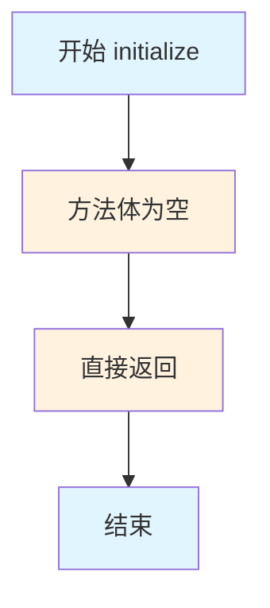

#### 带注释源码

```python
def initialize(self):
    """Initialize or reset the rectangle manager state."""
    pass
```

---

### 详细分析说明

#### 方法功能概述
`RectangleManager.initialize()` 是一个空实现的方法，目前仅包含 `pass` 语句。该方法的设计目的是提供初始化或重置矩形管理器状态的接口，为后续的矩形管理操作做好准备。

#### 设计意图分析
根据类名 `RectangleManager` 和方法名 `initialize` 推断，该方法应该负责：
1. 重置内部状态变量
2. 清空或初始化数据结构
3. 建立必要的依赖连接
4. 加载默认配置

然而，当前实现为空的 `pass` 语句，表明可能处于以下状态：
- 预留接口，尚未实现
- 依赖注入在构造函数中已完成，无需额外初始化
- 状态管理委托给其他方法

#### 潜在优化建议
1. **实现状态重置逻辑**：如果需要在运行时重置管理器状态，应添加清理代码
2. **添加初始化回调**：考虑在初始化完成后触发信号，通知相关组件准备就绪
3. **错误处理**：添加必要的异常处理机制，确保初始化失败时能够反馈

#### 技术债务说明
- 该方法目前无实际功能，属于预留接口的设计债务
- 如后续需要初始化逻辑，应补充具体实现


### `RectangleManager.load_rectangles`

加载指定页面的矩形数据，将页面本地坐标转换为场景坐标，并通过 viewer 添加到场景中。

参数：

-  `state`：`Dict`，包含页面视图状态的字典，其中 `viewer_state.rectangles` 存储矩形数据列表
-  `page_idx`：`int`，目标页面的索引，用于坐标系统转换

返回值：`None`，无返回值

#### 流程图

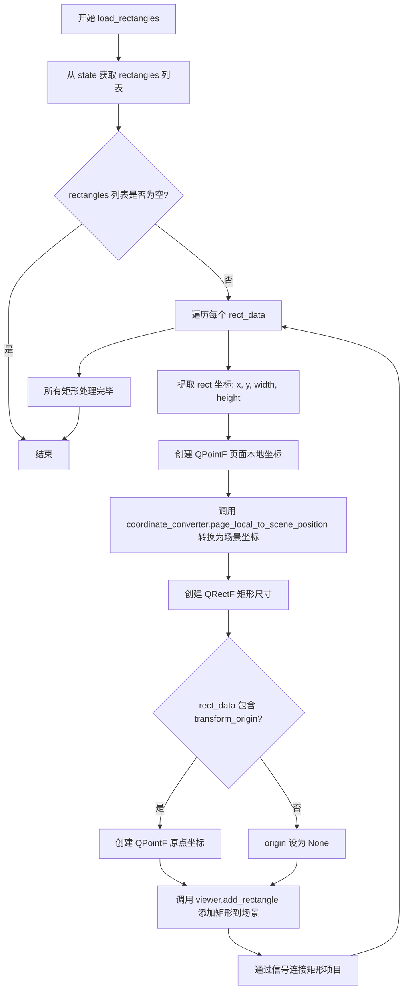

#### 带注释源码

```python
def load_rectangles(self, state: Dict, page_idx: int):
    """Load rectangles for a specific page."""
    # 从状态字典中提取 viewer_state 下的 rectangles 列表
    rectangles = state.get('viewer_state', {}).get('rectangles', [])
    
    # 遍历每个矩形数据进行加载
    for rect_data in rectangles:
        # 从 rect_data 中提取矩形的位置信息 (x, y) 作为页面本地坐标
        page_local_pos = QPointF(rect_data['rect'][0], rect_data['rect'][1])
        
        # 调用坐标转换器，将页面本地坐标转换为场景坐标系统
        # page_idx 用于确定页面边界和坐标映射关系
        scene_pos = self.coordinate_converter.page_local_to_scene_position(page_local_pos, page_idx)
        
        # 构建 QRectF 对象，仅包含矩形的尺寸信息 (宽度, 高度)
        # 位置信息通过 position 参数单独传递
        rect = QRectF(0, 0, rect_data['rect'][2], rect_data['rect'][3])
        
        # 初始化变换原点为 None
        origin = None
        
        # 如果 rect_data 中包含变换原点数据，则创建对应的 QPointF 对象
        if 'transform_origin' in rect_data:
            origin = QPointF(*rect_data['transform_origin'])
        
        # 调用 viewer 的 add_rectangle 方法，将矩形添加到场景中
        # 参数包括：矩形尺寸、场景位置、旋转角度、变换原点
        rect_item = self.viewer.add_rectangle(
            rect=rect,
            position=scene_pos, 
            rotation=rect_data['rotation'],
            origin=origin
        )
        
        # 发送信号连接矩形项目，确保信号槽机制正常工作
        # 让 viewer 处理信号的连接逻辑以保持一致性
        self.viewer.connect_rect_item.emit(rect_item)
```


### `RectangleManager.unload_rectangles`

该方法用于卸载指定页面的矩形元素，将场景中属于该页面的矩形项的位置和变换数据转换为页面局部坐标并存储到图像状态中，随后从场景和查看器中移除这些矩形项。

参数：

- `page_idx`：`int`，目标页面的索引，用于确定页面局部坐标的参考系
- `page_y`：`float`，目标页面的顶部 Y 坐标，用于判断矩形是否属于该页面
- `page_bottom`：`float`，目标页面的底部 Y 坐标，用于判断矩形是否属于该页面
- `file_path`：`str`，图像文件路径，用于定位存储矩形数据的图像状态结构

返回值：`None`，该方法直接修改对象状态和场景，不返回任何值

#### 流程图

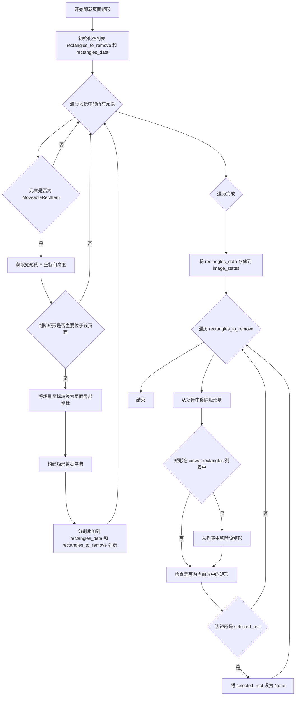

#### 带注释源码

```python
def unload_rectangles(self, page_idx: int, page_y: float, page_bottom: float, file_path: str):
    """
    卸载指定页面的矩形元素。
    
    该方法执行以下操作：
    1. 遍历场景中的所有元素，找出属于指定页面的矩形
    2. 将矩形的场景坐标转换为页面局部坐标并收集数据
    3. 将数据存储到 main_controller 的 image_states 中
    4. 从场景和 viewer 列表中移除这些矩形项
    """
    
    # 用于存储需要从场景中移除的矩形项
    rectangles_to_remove = []
    # 用于存储矩形的坐标和变换数据（用于持久化）
    rectangles_data = []

    # 遍历场景中的所有图形项
    for item in self.viewer._scene.items():
        # 检查当前项是否为可移动矩形类型
        if isinstance(item, MoveableRectItem):
            rect_item = item
    
            # 获取矩形的位置和尺寸信息
            rect_y = rect_item.pos().y()  # 矩形顶部的场景 Y 坐标
            rect_height = rect_item.boundingRect().height()  # 矩形高度
            rect_bottom = rect_y + rect_height  # 矩形底部的场景 Y 坐标
            
            # 判断矩形是否主要位于当前页面
            # 三种情况：矩形顶部在页面内、矩形底部在页面内、矩形跨页面
            if (rect_y >= page_y and rect_y < page_bottom) or \
            (rect_bottom > page_y and rect_bottom <= page_bottom) or \
            (rect_y < page_y and rect_bottom > page_bottom):
                
                # 将矩形的场景坐标转换为页面局部坐标
                scene_pos = rect_item.pos()
                page_local_pos = self.coordinate_converter.scene_to_page_local_position(scene_pos, page_idx)
                
                # 构建矩形数据字典，包含位置、尺寸、旋转和变换原点
                rect_data = {
                    'rect': (page_local_pos.x(), page_local_pos.y(), 
                            rect_item.boundingRect().width(), rect_item.boundingRect().height()),
                    'rotation': rect_item.rotation(),
                    'transform_origin': (rect_item.transformOriginPoint().x(), 
                                    rect_item.transformOriginPoint().y())
                }
                # 分别添加到数据列表和待移除列表
                rectangles_data.append(rect_data)
                rectangles_to_remove.append(rect_item)
    
    # 将收集到的矩形数据存储到图像状态中，实现状态持久化
    self.main_controller.image_states[file_path]['viewer_state']['rectangles'] = rectangles_data
    
    # 遍历需要移除的矩形项，执行实际的移除操作
    for rect_item in rectangles_to_remove:
        # 从 Qt 场景中移除该图形项
        self._scene.removeItem(rect_item)
        # 从 viewer 的矩形列表中移除
        if rect_item in self.viewer.rectangles:
            self.viewer.rectangles.remove(rect_item)
        # 如果该矩形当前被选中，则取消选中状态
        if self.viewer.selected_rect == rect_item:
            self.viewer.selected_rect = None
```


### `RectangleManager.save_rectangles_to_states`

将场景中的所有矩形项保存到对应页面的状态中。该方法遍历场景中的矩形，计算每个矩形与哪些页面相交，并对跨页面的矩形进行裁剪，最后将裁剪后的矩形数据存储到相应的页面状态中。

参数：

- `scene_items_by_page`：`Dict`，一个以页索引为键、页面数据字典为值的字典，用于存储每个页面的矩形数据

返回值：`None`，无返回值

#### 流程图

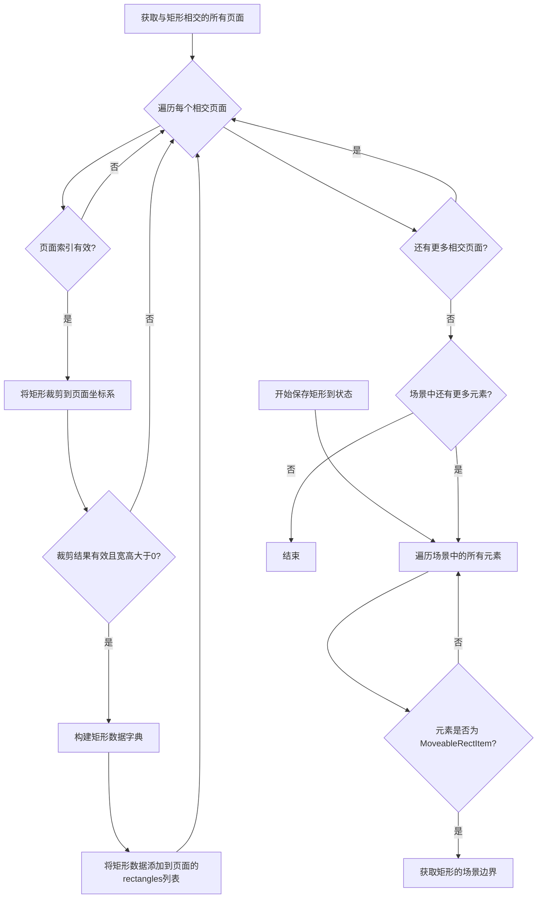

#### 带注释源码

```python
def save_rectangles_to_states(self, scene_items_by_page: Dict):
    """Save rectangles to appropriate page states."""
    # 遍历场景中的所有图形项
    for item in self.viewer._scene.items():
        # 只处理 MoveableRectItem 类型的矩形项
        if isinstance(item, MoveableRectItem):
            rect_item = item
            
            # 获取矩形的边界矩形（本地坐标系）
            rect_bounds = rect_item.boundingRect()
            
            # 构建矩形的场景边界矩形（包含位置和尺寸）
            rect_scene_bounds = QRectF(
                rect_item.pos().x(),          # 矩形在场景中的X坐标
                rect_item.pos().y(),          # 矩形在场景中的Y坐标
                rect_bounds.width(),          # 矩形的宽度
                rect_bounds.height()          # 矩形的高度
            )
            
            # 获取与该矩形场景边界相交的所有页面索引
            intersecting_pages = self.layout_manager.get_pages_for_scene_bounds(rect_scene_bounds)
            
            # 为每个相交的页面添加裁剪后的矩形
            for page_idx in intersecting_pages:
                # 检查页面索引是否在有效范围内
                if 0 <= page_idx < len(self.image_loader.image_file_paths):
                    # 将矩形裁剪到指定页面的本地坐标系
                    clipped_rect = self.coordinate_converter.clip_rectangle_to_page(rect_item, page_idx)
                    
                    # 确保裁剪结果有效且具有正值的宽高
                    if clipped_rect and clipped_rect[2] > 0 and clipped_rect[3] > 0:
                        # 构建矩形数据字典
                        rect_data = {
                            'rect': clipped_rect,                                          # 裁剪后的矩形坐标和尺寸 (x, y, width, height)
                            'rotation': rect_item.rotation(),                              # 矩形的旋转角度
                            'transform_origin': (                                         # 变换原点坐标
                                rect_item.transformOriginPoint().x(), 
                                rect_item.transformOriginPoint().y()
                            )
                        }
                        
                        # 将矩形数据追加到对应页面的rectangles列表中
                        scene_items_by_page[page_idx]['rectangles'].append(rect_data)
```


### `RectangleManager.clear`

清除矩形管理器的所有状态信息。

参数：

- 无参数

返回值：`None`，无返回值（方法体为 `pass`）

#### 流程图

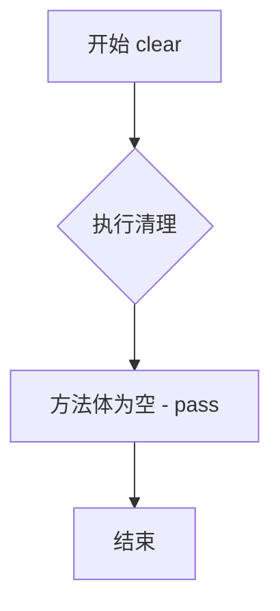

#### 带注释源码

```python
def clear(self):
    """Clear all rectangle management state."""
    # Note: 当前实现为空（pass），未执行任何清理操作
    # 预期行为：应清除与矩形管理相关的所有内部状态
    pass
```


### `RectangleManager.redistribute_existing_rectangles`

该方法用于在页面布局变更后，将现有的矩形重新分配到它们所相交的所有页面。它首先将矩形从页面局部坐标转换为场景坐标，然后找出与矩形相交的所有页面，并对每个相交页面进行矩形剪辑，最后将剪辑后的矩形数据添加到相应页面的状态中。

参数：

- `all_existing_rects`：`List[tuple]`，包含所有现有矩形的列表，每个元素为 `(rect_data, original_page_idx)` 元组，其中 `rect_data` 是矩形数据字典，`original_page_idx` 是原始页面索引
- `scene_items_by_page`：`Dict`，按页面索引存储场景项目数据的字典，用于保存每个页面的矩形状态

返回值：`None`，该方法直接修改 `scene_items_by_page` 字典，不返回任何值

#### 流程图

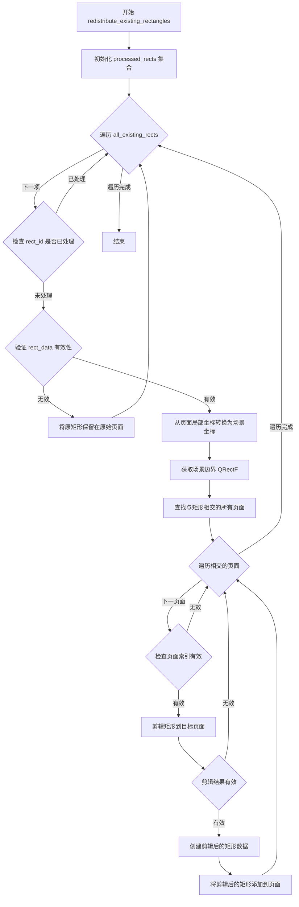

#### 带注释源码

```python
def redistribute_existing_rectangles(self, all_existing_rects: List[tuple], scene_items_by_page: Dict):
    """Redistribute existing rectangles to all pages they intersect with after clipping."""
    # 使用集合追踪已处理的矩形，避免重复处理相同矩形
    processed_rects = set()  # Track processed rectangles to avoid duplicates
    
    # 遍历所有现有矩形
    for rect_data, original_page_idx in all_existing_rects:
        # 创建矩形的唯一标识符以避免重复处理
        rect_id = id(rect_data)
        # 如果已处理则跳过
        if rect_id in processed_rects:
            continue
        processed_rects.add(rect_id)
        
        # 验证矩形数据有效性：检查是否包含 rect 键且长度足够
        if 'rect' not in rect_data or len(rect_data['rect']) < 4:
            # 将无效矩形保留在原始页面
            scene_items_by_page[original_page_idx]['rectangles'].append(rect_data)
            continue
            
        # 从页面局部坐标转换为场景坐标
        # 提取矩形的局部位置和尺寸
        local_x, local_y, local_width, local_height = rect_data['rect']
        # 使用坐标转换器将页面局部位置转换为场景位置
        scene_top_left = self.coordinate_converter.page_local_to_scene_position(QPointF(local_x, local_y), original_page_idx)
        # 创建场景边界矩形
        scene_bounds = QRectF(scene_top_left.x(), scene_top_left.y(), local_width, local_height)
        
        # 查找与此矩形相交的所有页面
        intersecting_pages = self.layout_manager.get_pages_for_scene_bounds(scene_bounds)
        
        # 创建模拟矩形项用于剪辑
        class MockRectItem:
            """内部模拟类，用于在剪辑过程中表示矩形"""
            def __init__(self, x, y, width, height):
                self._pos = QPointF(x, y)
                self._rect = QRectF(0, 0, width, height)
            
            def pos(self):
                return self._pos
                
            def boundingRect(self):
                return self._rect
                
            def rotation(self):
                # 获取旋转角度，默认为 0.0
                return rect_data.get('rotation', 0.0)
                
            def transformOriginPoint(self):
                # 获取变换原点，默认为 (0, 0)
                origin = rect_data.get('transform_origin', (0, 0))
                return QPointF(origin[0], origin[1])
        
        # 实例化模拟矩形
        mock_rect = MockRectItem(scene_top_left.x(), scene_top_left.y(), local_width, local_height)
        
        # 为每个相交页面添加剪辑版本（遵循 save_rectangles_to_states 模式）
        for page_idx in intersecting_pages:
            # 检查页面索引是否在有效范围内
            if 0 <= page_idx < len(self.image_loader.image_file_paths):
                # 执行矩形到目标页面的剪辑
                clipped_rect = self.coordinate_converter.clip_rectangle_to_page(mock_rect, page_idx)
                # 检查剪辑结果是否有效（宽度和高度都大于 0）
                if clipped_rect and clipped_rect[2] > 0 and clipped_rect[3] > 0:
                    # 构建剪辑后的矩形数据
                    clipped_rect_data = {
                        'rect': clipped_rect,
                        'rotation': rect_data.get('rotation', 0.0),
                        'transform_origin': rect_data.get('transform_origin', (0, 0))
                    }
                    # 将剪辑后的矩形添加到目标页面
                    scene_items_by_page[page_idx]['rectangles'].append(clipped_rect_data)
```


### `RectangleManager.is_duplicate_rectangle`

检查新矩形是否与现有矩形列表中的某个矩形重复（基于坐标、尺寸和旋转角度在指定容差范围内匹配）。

参数：

- `new_rect`：`Dict`，待检查的新矩形数据字典，需包含 `rect` 键（值为包含 x, y, width, height 的元组/列表）和可选的 `rotation` 键
- `existing_rects`：`List[Dict]`，已存在的矩形数据字典列表，每个字典结构与 `new_rect` 相同
- `margin`：`int`，容差值（默认为 5），用于比较坐标和尺寸时的允许偏差范围

返回值：`bool`，如果新矩形与列表中的某个现有矩形在容差范围内匹配（坐标、尺寸和旋转角度均接近），返回 `True`；否则返回 `False`

#### 流程图

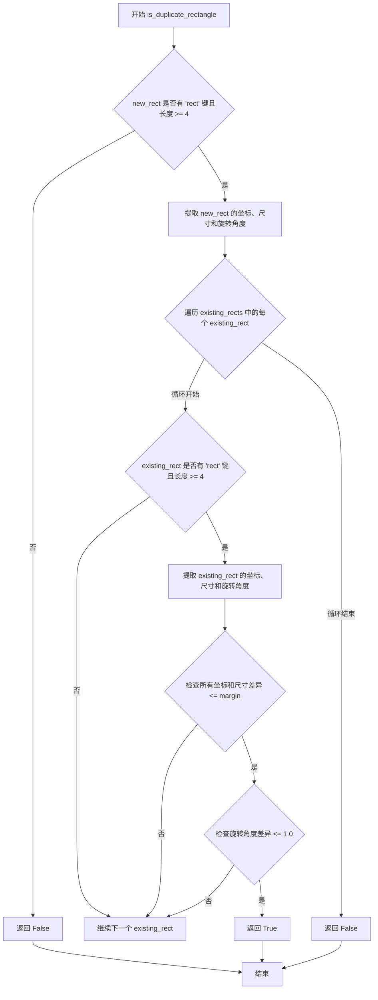

#### 带注释源码

```python
def is_duplicate_rectangle(self, new_rect, existing_rects, margin=5):
    """Check if a rectangle is a duplicate of any existing rectangle within margin.
    
    通过对比新矩形与已有矩形列表中的每个矩形，
    判断它们在坐标、尺寸和旋转角度上是否在容差范围内相同。
    
    Args:
        new_rect: 待检查的矩形数据字典，需包含 'rect' 键，格式为 (x, y, width, height)
        existing_rects: 已有矩形列表，每个元素为包含 'rect' 键的字典
        margin: 容差值，默认为5，表示坐标和尺寸的可接受偏差范围
    
    Returns:
        bool: 如果存在匹配的矩形返回True，否则返回False
    """
    # 验证新矩形数据有效性：必须包含 'rect' 键且长度不少于4个元素(x, y, width, height)
    if 'rect' not in new_rect or len(new_rect['rect']) < 4:
        return False
        
    # 解构新矩形的坐标(x, y)、尺寸(width, height)
    new_x, new_y, new_width, new_height = new_rect['rect']
    # 获取新矩形的旋转角度，默认值为0.0
    new_rotation = new_rect.get('rotation', 0.0)
    
    # 遍历所有已有矩形进行比较
    for existing_rect in existing_rects:
        # 验证已有矩形数据有效性：跳过无效的矩形数据
        if 'rect' not in existing_rect or len(existing_rect['rect']) < 4:
            continue
            
        # 解构已有矩形的坐标和尺寸
        ex_x, ex_y, ex_width, ex_height = existing_rect['rect']
        # 获取已有矩形的旋转角度，默认值为0.0
        ex_rotation = existing_rect.get('rotation', 0.0)
        
        # 综合判断条件：坐标、尺寸和旋转角度均在容差范围内
        # 坐标容差：x, y 坐标差异 <= margin
        # 尺寸容差：width, height 差异 <= margin
        # 旋转容差：旋转角度差异 <= 1.0度（硬编码）
        if (abs(new_x - ex_x) <= margin and 
            abs(new_y - ex_y) <= margin and 
            abs(new_width - ex_width) <= margin and 
            abs(new_height - ex_height) <= margin and
            abs(new_rotation - ex_rotation) <= 1.0): 
            # 所有条件均满足，判定为重复矩形
            return True
    
    # 遍历完毕未发现匹配矩形，返回False
    return False
```


### `RectangleManager.merge_clipped_rectangles`

该方法用于在普通模式下合并因跨页边界而被裁剪的矩形元素。它从所有页面收集矩形数据，识别具有相似属性的垂直相邻矩形（这些矩形原本可能是同一个矩形被裁分到不同页面），然后将它们合并回一个完整的矩形。

参数：
- 无（该方法不接收外部参数，通过类实例的属性访问所需数据）

返回值：`None`，无返回值（该方法直接修改 `main_controller.image_states` 中的矩形数据）

#### 流程图

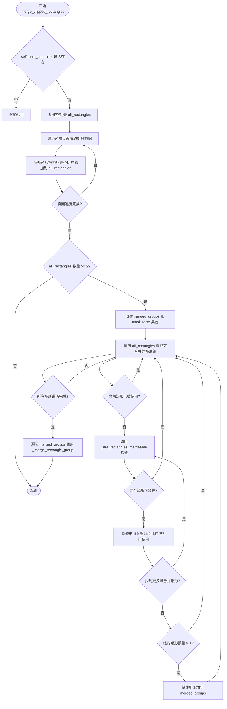

#### 带注释源码

```python
def merge_clipped_rectangles(self):
    """Merge rectangle items that were clipped across page boundaries in regular mode."""
    # 检查主控制器是否存在，若不存在则无法进行合并操作
    if not self.main_controller:
        return
        
    # 用于存储所有页面的矩形数据及其场景边界信息
    all_rectangles = []
    
    # 步骤1: 遍历所有页面收集矩形数据
    for page_idx in range(len(self.image_loader.image_file_paths)):
        # 获取当前页面对应的文件路径和状态
        file_path = self.image_loader.image_file_paths[page_idx]
        state = self.main_controller.image_states.get(file_path, {})
        rectangles = state.get('viewer_state', {}).get('rectangles', [])
        
        # 处理当前页面的每个矩形
        for rect_data in rectangles:
            # 跳过无效的矩形数据
            if 'rect' not in rect_data or len(rect_data['rect']) < 4:
                continue
                
            # 步骤2: 将页面局部坐标转换为场景坐标
            local_x, local_y, width, height = rect_data['rect']
            local_pos = QPointF(local_x, local_y)
            scene_pos = self.coordinate_converter.page_local_to_scene_position(local_pos, page_idx)
            
            # 将转换后的矩形信息添加到列表中，包含原始数据、页面索引和场景边界
            all_rectangles.append({
                'data': rect_data,
                'page_idx': page_idx,
                'scene_bounds': QRectF(scene_pos.x(), scene_pos.y(), width, height)
            })
    
    # 如果矩形数量少于2，则无法进行合并操作
    if len(all_rectangles) < 2:
        return  # Need at least 2 rectangles to merge
    
    # 步骤3: 分组垂直相邻且属性相似的矩形
    merged_groups = []
    used_rects = set()  # 用于跟踪已处理的矩形，避免重复
    
    # 遍历所有矩形寻找可合并的组
    for i, rect1 in enumerate(all_rectangles):
        if i in used_rects:
            continue
            
        # 创建新的合并组，将当前矩形作为组的第一个元素
        group = [rect1]
        used_rects.add(i)
        
        # 继续查找与当前矩形可合并的其他矩形
        for j, rect2 in enumerate(all_rectangles):
            if j in used_rects or i == j:
                continue
                
            # 调用辅助方法检查两个矩形是否可合并
            if self._are_rectangles_mergeable(rect1, rect2):
                group.append(rect2)
                used_rects.add(j)
        
        # 只有包含多个矩形的组才需要合并
        if len(group) > 1:
            merged_groups.append(group)
    
    # 步骤4: 对每个组执行合并操作
    for group in merged_groups:
        self._merge_rectangle_group(group)
```


### `RectangleManager._are_rectangles_mergeable`

该方法用于检查两个矩形是否可以合并（判断它们是否可能是常规模式下被裁剪自同一个原始矩形），通过验证页面邻近性、垂直相邻性、水平对齐、宽度相似性以及样式属性一致性来确定合并可行性。

参数：

- `rect1`：`Dict`，包含场景边界、页面索引和矩形数据的字典（键：`scene_bounds`（QRectF类型，表示场景中的边界）、`page_idx`（int类型，表示页面索引）、`data`（dict类型，包含矩形数据如stroke、fill、opacity等样式属性））
- `rect2`：`Dict`，与rect1结构相同的第二个矩形字典

返回值：`bool`，如果两个矩形可以合并则返回True，否则返回False

#### 流程图

```mermaid
flowchart TD
    A[开始 _are_rectangles_mergeable] --> B{检查页面邻近性<br/>abs(rect1.page_idx - rect2.page_idx) <= 1}
    B -->|否| C[返回 False]
    B -->|是| D{检查垂直相邻性<br/>abs(bounds1.bottom - bounds2.top) < 10<br/>或 abs(bounds2.bottom - bounds1.top) < 10}
    D -->|否| C
    D -->|是| E{检查水平对齐<br/>abs(bounds1.left - bounds2.left) <= 5}
    E -->|否| C
    E -->|是| F{检查宽度相似性<br/>abs(bounds1.width - bounds2.width) <= 10}
    F -->|否| C
    F -->|是| G{遍历样式属性<br/>stroke, fill, opacity}
    G --> H{当前属性是否相同}
    H -->|否| C
    H -->|是| I{还有更多属性?}
    I -->|是| G
    I -->|否| J[返回 True]
```

#### 带注释源码

```python
def _are_rectangles_mergeable(self, rect1, rect2):
    """Check if two rectangles can be merged (were likely clipped from same original in regular mode).
    
    This method determines whether two rectangles that were potentially clipped across
    page boundaries in regular mode can be merged back into a single rectangle.
    
    Args:
        rect1: Dictionary containing 'scene_bounds' (QRectF), 'page_idx' (int), and 'data' (dict)
        rect2: Dictionary containing 'scene_bounds' (QRectF), 'page_idx' (int), and 'data' (dict)
    
    Returns:
        bool: True if the rectangles can be merged, False otherwise
    """
    # Extract scene bounds from both rectangles
    bounds1 = rect1['scene_bounds']
    bounds2 = rect2['scene_bounds']
    
    # Check if they're on adjacent pages (key for clipped items)
    # Only rectangles on the same page or adjacent pages (page_idx diff <= 1) can be merged
    if abs(rect1['page_idx'] - rect2['page_idx']) > 1:
        return False
    
    # Check if they're vertically adjacent
    # Tolerance of 10 pixels to account for minor positioning differences
    tolerance = 10  # Stricter tolerance for rectangles
    adjacent = (abs(bounds1.bottom() - bounds2.top()) < tolerance or 
               abs(bounds2.bottom() - bounds1.top()) < tolerance)
    
    if not adjacent:
        return False
            
    # Check horizontal alignment (clipped rectangles should have very similar X positions)
    # Clipped rectangles from the same original should maintain their left edge position
    x_tolerance = 5
    if abs(bounds1.left() - bounds2.left()) > x_tolerance:
        return False
            
    # Check width similarity (clipped rectangles should have similar widths)
    # Since they're from the same original rectangle, widths should be consistent
    width_tolerance = 10
    if abs(bounds1.width() - bounds2.width()) > width_tolerance:
        return False
            
    # Check similar styling
    # Only rectangles with identical stroke, fill, and opacity can be merged
    style_attrs = ['stroke', 'fill', 'opacity']
    for attr in style_attrs:
        if rect1['data'].get(attr) != rect2['data'].get(attr):
            return False
                
    return True
```


### `RectangleManager._merge_rectangle_group`

该方法用于将一组被裁剪到不同页面的矩形重新合并为一个完整的矩形。它首先计算所有矩形在场景坐标下的统一边界，然后确定目标页面（基于合并后矩形的中心位置），将矩形数据转换到页面局部坐标系，最后从原始页面移除被裁剪的矩形并将合并后的矩形添加到目标页面。

参数：

- `group`：List[Dict]，包含待合并的矩形对象列表，每个元素包含 `scene_bounds`（QRectF 场景边界）、`page_idx`（页面索引）、`data`（矩形数据字典）等字段

返回值：`None`，该方法直接修改内部状态，不返回任何值

#### 流程图

```mermaid
flowchart TD
    A[开始合并矩形组] --> B{检查组大小}
    B -->|len <= 1| C[直接返回, 无需合并]
    B -->|len > 1| D[计算统一边界]
    
    D --> E[获取所有scene_bounds]
    E --> F[计算unified_left/top/right/bottom]
    
    F --> G[计算目标页面]
    G --> H[center_y = (unified_top + unified_bottom) / 2]
    H --> I[target_page = layout_manager.get_page_at_position]
    
    I --> J[转换坐标到页面局部坐标系]
    J --> K[scene_pos = QPointF(unified_left, unified_top)]
    K --> L[local_pos = converter.scene_to_page_local_position]
    
    L --> M[创建合并后的矩形数据]
    M --> N[复制base_data = group[0].data.copy]
    N --> O[设置新rect: x, y, width, height]
    
    O --> P[从原始页面移除各矩形]
    P --> Q[遍历group中每个item]
    Q --> R[获取page_idx和file_path]
    R --> S[从viewer_state.rectangles中移除]
    
    S --> T[添加到目标页面]
    T --> U[target_state.viewer_state.rectangles.append]
    U --> V[结束]
```

#### 带注释源码

```python
def _merge_rectangle_group(self, group):
    """Merge a group of clipped rectangles back into one.
    
    This method is used in regular (non-webtoon) mode to merge rectangles
    that were split across page boundaries during page clipping back into
    a single unified rectangle.
    
    Args:
        group: List of rectangle dictionaries, each containing:
            - 'scene_bounds': QRectF in scene coordinates
            - 'page_idx': int index of the page containing this fragment
            - 'data': dict rectangle data with 'rect', 'rotation', etc.
    """
    # If group has 0 or 1 elements, no merging needed
    if len(group) <= 1:
        return
        
    # Calculate unified bounds - find the min/max coordinates across all rectangles in the group
    all_bounds = [item['scene_bounds'] for item in group]
    unified_left = min(bounds.left() for bounds in all_bounds)
    unified_top = min(bounds.top() for bounds in all_bounds)
    unified_right = max(bounds.right() for bounds in all_bounds)
    unified_bottom = max(bounds.bottom() for bounds in all_bounds)
    
    # Determine target page based on the center of the merged rectangle
    # This ensures the merged rectangle is placed on the most appropriate page
    center_y = (unified_top + unified_bottom) / 2
    target_page = self.layout_manager.get_page_at_position(center_y)
    
    # Convert the unified scene coordinates back to page-local coordinates
    # for storage in the page's viewer state
    scene_pos = QPointF(unified_left, unified_top)
    local_pos = self.coordinate_converter.scene_to_page_local_position(scene_pos, target_page)
    
    # Create merged rectangle data using the first rectangle's properties as base
    # (assumes all rectangles in group have matching style attributes)
    base_data = group[0]['data'].copy()
    base_data['rect'] = [
        local_pos.x(),
        local_pos.y(),
        unified_right - unified_left,
        unified_bottom - unified_top
    ]
    
    # Remove all individual rectangles from their original pages
    # This cleans up the clipped rectangle fragments
    for item in group:
        page_idx = item['page_idx']
        file_path = self.image_loader.image_file_paths[page_idx]
        state = self.main_controller.image_states[file_path]
        rectangles = state['viewer_state']['rectangles']
        
        # Remove this specific rectangle data from the page's rectangle list
        # Using list comprehension to filter out the matching rectangle
        rectangles[:] = [r for r in rectangles if r != item['data']]
    
    # Add the newly merged rectangle to the target page's state
    target_file_path = self.image_loader.image_file_paths[target_page]
    target_state = self.main_controller.image_states[target_file_path]
    target_state['viewer_state']['rectangles'].append(base_data)
```


### `MockRectItem.__init__`

这是一个在 `RectangleManager.redistribute_existing_rectangles` 方法内部定义的本地类（Local Class），用于在重分配矩形时创建模拟的矩形对象，以便进行剪裁计算。

参数：

- `x`：`float` 或 `int`，矩形左上角的 X 坐标（场景坐标）
- `y`：`float` 或 `int`，矩形左上角的 Y 坐标（场景坐标）
- `width`：`float` 或 `int`，矩形的宽度
- `height`：`float` 或 `int`，矩形的高度

返回值：`None`，构造函数，仅初始化对象状态，不返回任何值。

#### 流程图

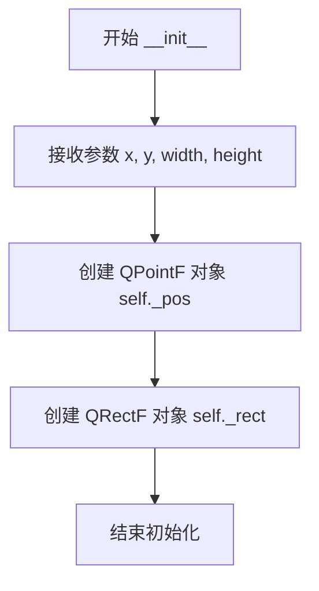

#### 带注释源码

```python
class MockRectItem:
    """用于重分配矩形时的模拟矩形类，提供与 MoveableRectItem 兼容的接口"""
    
    def __init__(self, x, y, width, height):
        """
        初始化模拟矩形项
        
        参数:
            x: 矩形左上角的 X 坐标（场景坐标）
            y: 矩形左上角的 Y 坐标（场景坐标）
            width: 矩形的宽度
            height: 矩形的高度
        """
        # 将传入的 x, y 坐标转换为 QPointF 对象存储位置
        self._pos = QPointF(x, y)
        # 创建 QRectF 对象存储矩形尺寸（原点在 0,0）
        self._rect = QRectF(0, 0, width, height)
    
    def pos(self):
        """返回矩形的位置（场景坐标）"""
        return self._pos
        
    def boundingRect(self):
        """返回矩形的边界矩形（本地坐标）"""
        return self._rect
        
    def rotation(self):
        """返回矩形的旋转角度（从外部 rect_data 获取）"""
        return rect_data.get('rotation', 0.0)
        
    def transformOriginPoint(self):
        """返回矩形的变换原点"""
        origin = rect_data.get('transform_origin', (0, 0))
        return QPointF(origin[0], origin[1])
```


### `MockRectItem.pos`

获取模拟矩形项的当前位置坐标。

参数：

- 无

返回值：`QPointF`，返回矩形的场景坐标位置（x, y）

#### 流程图

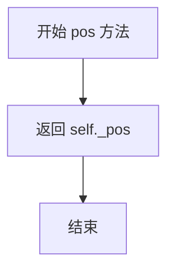

#### 带注释源码

```python
def pos(self):
    """
    获取矩形项的位置。
    
    返回:
        QPointF: 包含 x, y 坐标的 QPointF 对象，表示矩形在场景中的位置
    """
    return self._pos
```


### `MockRectItem.boundingRect`

该方法是 `MockRectItem` 内部类的成员方法，用于返回模拟矩形项的边界矩形。在 `redistribute_existing_rectangles` 方法中创建此内部类以模拟 `MoveableRectItem`，用于将矩形裁剪到页面时获取矩形尺寸信息。

参数： 无

返回值：`QRectF`，返回模拟矩形的边界矩形，描述矩形的宽度和高度（位置固定为 0,0）。

#### 流程图

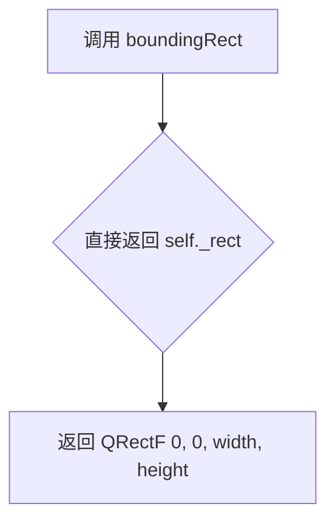

#### 带注释源码

```python
class MockRectItem:
    """内部类：用于在 redistribute_existing_rectangles 中模拟 MoveableRectItem"""
    
    def __init__(self, x, y, width, height):
        """
        初始化模拟矩形项
        
        参数:
            x: 矩形场景X坐标
            y: 矩形场景Y坐标  
            width: 矩形宽度
            height: 矩形高度
        """
        self._pos = QPointF(x, y)  # 存储场景位置
        self._rect = QRectF(0, 0, width, height)  # 存储边界矩形（宽高信息）
    
    def pos(self):
        """返回矩形在场景中的位置"""
        return self._pos
    
    def boundingRect(self):
        """
        返回矩形的边界矩形
        
        返回值: QRectF - 包含矩形宽高信息的边界矩形
               注意：位置为(0,0)，仅包含尺寸信息用于裁剪计算
        """
        return self._rect
    
    def rotation(self):
        """返回矩形的旋转角度"""
        return rect_data.get('rotation', 0.0)
    
    def transformOriginPoint(self):
        """返回矩形的变换原点"""
        origin = rect_data.get('transform_origin', (0, 0))
        return QPointF(origin[0], origin[1])
```


### `MockRectItem.rotation`

获取矩形的旋转角度。

参数：

- （无参数，仅 `self` 隐含）

返回值：`float`，矩形的旋转角度（度），默认为 0.0。

#### 流程图

```mermaid
flowchart TD
    A[开始 rotation] --> B{self.rect_data 中是否有 'rotation' 键?}
    B -->|是| C[返回 self.rect_data['rotation']]
    B -->|否| D[返回默认值 0.0]
    C --> E[结束]
    D --> E
```

#### 带注释源码

```python
def rotation(self):
    """获取矩形的旋转角度。
    
    Returns:
        float: 矩形的旋转角度（度）。如果未设置旋转，则返回默认的 0.0。
    """
    return rect_data.get('rotation', 0.0)
```


### `MockRectItem.transformOriginPoint`

该方法是 `MockRectItem` 类的成员函数，用于获取矩形项的变换原点坐标。在重新分配矩形到多页场景时，此方法模拟 `MoveableRectItem` 的 `transformOriginPoint` 行为，返回矩形进行旋转和变换时的参考点坐标，确保被裁剪的矩形数据能够正确保留其原始变换原点信息。

参数： 无

返回值：`QPointF`，返回矩形的变换原点坐标，默认为 `(0, 0)`，表示相对于矩形左上角的原点。

#### 流程图

```mermaid
flowchart TD
    A[调用 transformOriginPoint] --> B{rect_data 中是否有 transform_origin}
    B -->|有| C[获取 transform_origin 元组值]
    B -->|无| D[使用默认值 (0, 0)]
    C --> E[创建 QPointF 对象]
    D --> E
    E --> F[返回 QPointF 坐标]
```

#### 带注释源码

```python
def transformOriginPoint(self):
    """
    获取矩形的变换原点坐标。
    
    此方法模拟 MoveableRectItem 的 transformOriginPoint 方法，
    用于在重新分配矩形时保留原始的旋转/变换参考点。
    
    Returns:
        QPointF: 变换原点的坐标位置
    """
    # 从 enclosing scope 的 rect_data 中获取 transform_origin 字段
    # 如果不存在则默认为 (0, 0)，即矩形的左上角
    origin = rect_data.get('transform_origin', (0, 0))
    
    # 将元组 (x, y) 转换为 PySide6 的 QPointF 对象
    # 这确保了与真实 MoveableRectItem 接口的兼容性
    return QPointF(origin[0], origin[1])
```

## 关键组件


### 矩形加载与卸载模块

负责根据页面索引加载和卸载矩形数据，支持从页面局部坐标到场景坐标的转换，并与Qt场景交互管理矩形图形项的生命周期。

### 坐标转换模块

通过`coordinate_converter`实现页面局部坐标与场景坐标之间的双向转换，包括位置坐标转换和矩形剪裁功能，确保矩形在页面坐标系和场景坐标系中的一致性。

### 矩形剪裁模块

当矩形跨越页面边界时，将完整矩形剪裁为多个只存在于单个页面内的局部矩形，支持`save_rectangles_to_states`和`redistribute_existing_rectangles`方法中的剪裁逻辑。

### 矩形去重检测模块

`is_duplicate_rectangle`方法通过比较位置、尺寸和旋转角度的差异，判断新矩形是否与现有矩形重复，支持可配置的容差边距。

### 跨页矩形合并模块

包含`merge_clipped_rectangles`、`_are_rectangles_mergeable`和`_merge_rectangle_group`方法，用于检测并合并在常规模式下因跨页而被剪切的矩形，恢复其原始完整性。

### 矩形重分布模块

`redistribute_existing_rectangles`方法将现有矩形重新分配到其覆盖的所有页面，为每个相交页面创建剪裁后的矩形副本，确保布局变更后矩形数据的正确分布。

### 状态管理模块

通过`main_controller.image_states`字典存储每个图像文件对应的矩形状态数据，支持矩形数据的持久化和跨会话恢复。


## 问题及建议


### 已知问题

- **空实现方法**: `initialize()` 和 `clear()` 方法体为 `pass`，属于未完成实现或死代码，增加了代码库的理解成本
- **使用 `id()` 进行去重不可靠**: 在 `redistribute_existing_rectangles()` 中使用 `id(rect_data)` 作为矩形唯一标识符，Python 可能复用对象 ID，导致误判或漏判重复矩形
- **内部类定义**: `MockRectItem` 类在方法内部定义，这种做法不便于测试和复用，应提升至模块级别
- **缺少异常处理**: 整个类没有任何 try-except 块，对 `rect_data` 结构的访问无验证（如 `'rect'` 键是否存在、长度是否足够），可能导致 KeyError 或 IndexError
- **魔法数字散落**: 多处使用硬编码数值（如 `margin=5`, `tolerance=10`, `x_tolerance=5`, `width_tolerance=10`, `1.0`），应提取为类常量或配置
- **直接操作内部状态**: `unload_rectangles()` 和 `merge_clipped_rectangles()` 直接修改 `self.main_controller.image_states` 字典，违反封装原则，增加耦合度
- **遍历效率低下**: `unload_rectangles()` 每次都遍历整个场景的所有 items，当场景复杂时性能堪忧；`save_rectangles_to_states()` 同样存在此问题
- **类型提示不完整**: 部分方法缺少返回类型注解（如 `load_rectangles`, `unload_rectangles`），且参数类型注解使用了旧式 `Dict` 而非 `dict`
- **注释暗示不确定性**: `load_rectangles()` 中的注释 "the viewer's add_rectangle should handle this" 表明实现依赖不确定的外部行为

### 优化建议

- 补全 `initialize()` 和 `clear()` 的实现，或使用 `NotImplementedError` 明确标记为待实现
- 改用基于内容（如矩形坐标、尺寸、旋转）的哈希或比较逻辑替代 `id()` 去重
- 将 `MockRectItem` 提升为模块级类或使用现有的 `MoveableRectItem`
- 为所有公开方法添加输入验证和异常处理，特别是涉及字典键访问和列表索引操作时
- 将魔法数字提取为类常量或配置文件（如 `MARGIN = 5`, `TOLERANCE = 10`）
- 引入缓存机制或建立矩形与页码的索引关系，避免每次操作都遍历整个场景
- 封装对 `main_controller.image_states` 的直接访问，提供显式的状态读写接口
- 完善类型注解，确保方法签名的完整性和一致性
- 补充类的 docstring 和各方法的详细文档，说明前置条件、后置条件及可能的异常

## 其它


### 设计目标与约束

**设计目标**：为Webtoon模式提供高效的矩形管理机制，支持延迟加载、页面级矩形裁剪、跨页矩形合并等功能，确保在多页面场景下矩形状态的正确保存与恢复。

**约束条件**：
- 矩形坐标必须通过coordinate_converter在页面局部坐标与场景坐标之间转换
- 矩形数据存储于image_states的viewer_state.rectangles中
- 加载/卸载操作需与viewer._scene保持同步
- 合并操作仅适用于相邻页面的相似矩形

### 错误处理与异常设计

**边界检查**：
- load_rectangles中检查rect_data['rect']存在性和transform_origin可选性
- redistribute_existing_rectangles中对数据格式进行验证（检查'rect'键和长度）
- is_duplicate_rectangle中对缺失键进行防御性检查
- merge_clipped_rectangles中检查至少需要2个矩形才能合并

**异常情况**：
- page_idx越界时通过if 0 <= page_idx < len(...)保护
- 文件路径不存在时通过get方法提供空字典默认值
- 转换结果为None时的空值检查（clipped_rect and clipped_rect[2] > 0）

### 数据流与状态机

**状态存储结构**：
```
image_states[file_path]['viewer_state']['rectangles'] = [
    {
        'rect': (x, y, width, height),  # 页面局部坐标
        'rotation': float,
        'transform_origin': (x, y),
        # 可选：stroke, fill, opacity
    },
    ...
]
```

**核心流程**：
1. 加载流程：load_rectangles从state读取矩形数据 → 坐标转换(page_local→scene) → 调用viewer.add_rectangle → 连接信号
2. 卸载流程：遍历scene中的MoveableRectItem → 判断是否属于目标页面 → 坐标转换(scene→page_local) → 从scene移除 → 更新state
3. 合并流程：收集所有页面矩形 → 按垂直相邻性分组 → 计算统一边界 → 移除原矩形 → 添加合并后矩形

### 外部依赖与接口契约

**依赖组件**：
- viewer：提供_scene、add_rectangle、connect_rect_item信号、rectangles列表、selected_rect
- layout_manager：提供get_pages_for_scene_bounds()、get_page_at_position()
- coordinate_converter：提供page_local_to_scene_position()、scene_to_page_local_position()、clip_rectangle_to_page()
- image_loader：提供image_file_paths列表
- main_controller：提供image_states字典

**关键接口约定**：
- viewer.add_rectangle(rect, position, rotation, origin) → 返回MoveableRectItem
- coordinate_converter.page_local_to_scene_position(QPointF, page_idx) → QPointF
- coordinate_converter.clip_rectangle_to_page(RectItem, page_idx) → tuple|None

### 并发与线程安全考量

**当前实现**：代码运行在主线程中，通过Qt信号槽机制与UI交互

**潜在风险**：
- load_rectangles和unload_rectangles在遍历scene.items()时未加锁，可能与用户交互操作冲突
- save_rectangles_to_states和merge_clipped_rectangles修改main_controller.image_states，需考虑多线程访问

**建议**：如有多线程需求，应在访问_scene和image_states时使用QMutex保护

### 性能优化空间

**当前性能瓶颈**：
- unload_rectangles中遍历所有scene.items()，时间复杂度O(n)
- merge_clipped_rectangles中双重循环分组，时间复杂度O(n²)
- 每次操作都进行坐标转换，无缓存机制

**优化建议**：
- 使用空间索引（如R-tree）加速矩形查询
- 为coordinate_converter结果添加缓存
- 使用字典替代列表存储rectangle引用，避免线性查找

### 可测试性设计

**测试难点**：
- 依赖Qt图形项系统（_scene、MoveableRectItem）
- 依赖多个外部组件（viewer、layout_manager等）
- 坐标转换逻辑与具体页面布局耦合

**测试建议**：
- 将coordinate_converter逻辑提取为独立纯函数，便于单元测试
- 使用Mock对象替代真实viewer、layout_manager等
- 针对is_duplicate_rectangle、_are_rectangles_mergeable等纯逻辑方法优先编写单元测试

    