# `comic-translate\app\ui\canvas\webtoons\scene_items\scene_item_manager.py` 详细设计文档

SceneItemManager 是一个门面类（Facade），作为 Webtoon 管理器中场景项（矩形、文本、笔触、文本块、补丁）的协调中心。它通过委托给五个专门的子管理器来处理特定的图形元素，并负责页面间场景状态的加载、卸载、保存（重分发与裁剪）以及合并裁剪项等核心逻辑。

## 整体流程

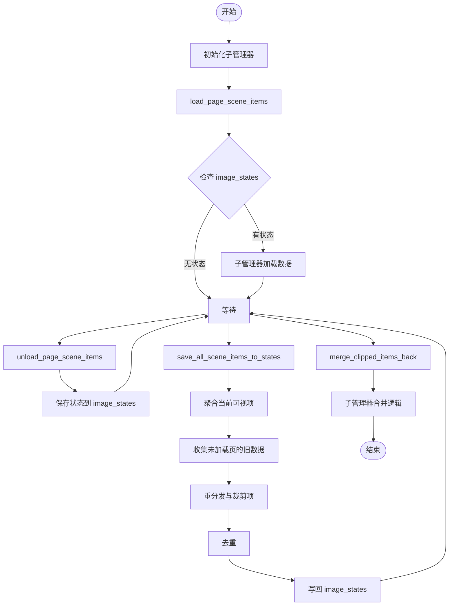

## 类结构

```
SceneItemManager (主控制器门面)
├── RectangleManager (矩形管理)
├── TextItemManager (文本项管理)
├── BrushStrokeManager (笔触管理)
├── TextBlockManager (文本块管理)
└── PatchManager (补丁管理)
```

## 全局变量及字段


### `SceneItemManager.viewer`
    
Reference to the main graphics view used for displaying the scene.

类型：`QGraphicsView`
    


### `SceneItemManager.layout_manager`
    
Manages the layout and positioning of pages within the viewer.

类型：`LayoutManager`
    


### `SceneItemManager.coordinate_converter`
    
Converts coordinates between view, scene, and image coordinate systems.

类型：`CoordinateConverter`
    


### `SceneItemManager.image_loader`
    
Central manager for loading images and providing file paths and data.

类型：`ImageLoader`
    


### `SceneItemManager._scene`
    
The Qt graphics scene where scene items are rendered.

类型：`QGraphicsScene`
    


### `SceneItemManager.main_controller`
    
Reference to the main application controller for accessing global state.

类型：`MainController`
    


### `SceneItemManager.rectangle_manager`
    
Manages rectangle scene items (annotations).

类型：`RectangleManager`
    


### `SceneItemManager.text_item_manager`
    
Manages text scene items.

类型：`TextItemManager`
    


### `SceneItemManager.brush_stroke_manager`
    
Manages brush stroke scene items.

类型：`BrushStrokeManager`
    


### `SceneItemManager.text_block_manager`
    
Manages text block scene items.

类型：`TextBlockManager`
    


### `SceneItemManager.patch_manager`
    
Manages patch scene items.

类型：`PatchManager`
    
    

## 全局函数及方法


### `SceneItemManager.initialize`

该方法负责初始化所有专门的场景项目管理器（矩形、文本项目、画笔笔触、文本块和补丁管理器），确保各个子管理器在正式使用前完成必要的启动和准备工作。

参数：

- 无

返回值：`None`，该方法不返回任何值，仅执行初始化操作。

#### 流程图

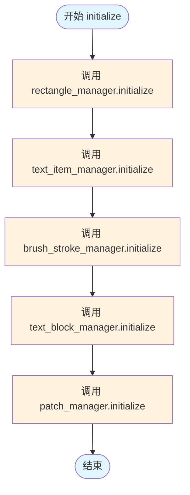

#### 带注释源码

```python
def initialize(self):
    """Initialize all specialized scene item managers."""
    # 初始化矩形管理器，负责处理场景中的矩形项目
    self.rectangle_manager.initialize()
    
    # 初始化文本项目管理器，负责处理场景中的文本项目
    self.text_item_manager.initialize()
    
    # 初始化画笔笔触管理器，负责处理场景中的画笔笔触
    self.brush_stroke_manager.initialize()
    
    # 初始化文本块管理器，负责处理场景中的文本块
    self.text_block_manager.initialize()
    
    # 初始化补丁管理器，负责处理场景中的补丁项目
    self.patch_manager.initialize()
```


### `SceneItemManager.set_main_controller`

设置主控制器引用，并将该引用传递给所有子管理器，以便各子管理器能够访问主控制器的状态和方法。

参数：

- `controller`：`object`，主控制器的引用，用于场景项管理器和所有子管理器的核心功能协调

返回值：`None`，该方法不返回任何值，仅执行引用赋值操作

#### 流程图

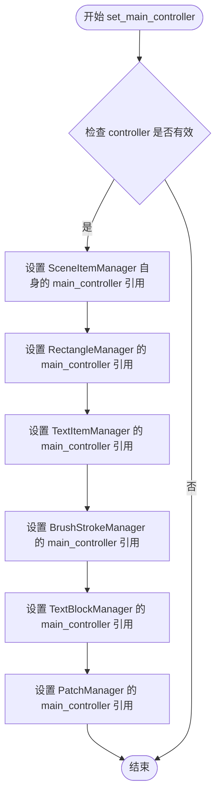

#### 带注释源码

```python
def set_main_controller(self, controller):
    """
    设置主控制器引用，用于 self 和所有子管理器。
    
    该方法确保主控制器引用能够被 SceneItemManager 本身及其管理的
    五个子管理器（矩形、文本项目、笔触、文本块、补丁）共同访问，
    以实现统一的状态管理和数据共享。
    
    参数:
        controller: 主控制器对象，提供对图像状态、视图状态等的访问
    """
    # 设置 SceneItemManager 自身的 main_controller 引用
    self.main_controller = controller
    
    # 将主控制器引用传递给各个子管理器
    # 这样子管理器可以直接访问主控制器中的 image_states 等数据
    self.rectangle_manager.main_controller = controller      # 矩形管理器
    self.text_item_manager.main_controller = controller       # 文本项目管理器
    self.brush_stroke_manager.main_controller = controller    # 笔触管理器
    self.text_block_manager.main_controller = controller      # 文本块管理器
    self.patch_manager.main_controller = controller          # 补丁管理器
```


### `SceneItemManager.load_page_scene_items`

加载特定页面的场景项（矩形、文本、画笔笔触、补丁）。

参数：

-  `page_idx`：`int`，要加载场景项的页面索引

返回值：`None`，无返回值（方法执行完成后直接返回）

#### 流程图

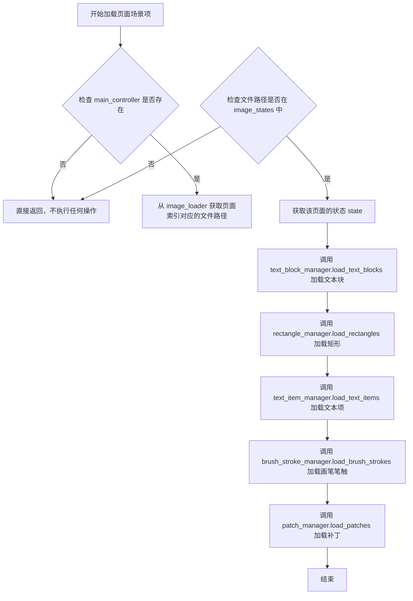

#### 带注释源码

```python
def load_page_scene_items(self, page_idx: int):
    """Load scene items (rectangles, text, brush strokes, patches) for a specific page."""
    # 检查主控制器是否存在，如果不存在则无法加载场景项，直接返回
    if not self.main_controller:
        return
        
    # 从 image_loader 获取指定页面的文件路径（image_loader 是图像数据的所有者）
    file_path = self.image_loader.image_file_paths[page_idx]
    
    # 检查该页面是否在 image_states 中有存储的状态
    if file_path not in self.main_controller.image_states:
        return
        
    # 获取该页面的状态数据
    state = self.main_controller.image_states[file_path]
    
    # 首先加载 TextBlock 对象（文本项依赖于文本块）
    self.text_block_manager.load_text_blocks(page_idx)
    
    # 加载该页面的矩形、文本项、画笔笔触和补丁
    self.rectangle_manager.load_rectangles(state, page_idx)
    self.text_item_manager.load_text_items(state, page_idx)
    self.brush_stroke_manager.load_brush_strokes(state, page_idx)
    self.patch_manager.load_patches(page_idx)
```


### `SceneItemManager.unload_page_scene_items`

卸载指定页面的场景项，包括文本块、矩形、文本项、笔触和补丁，并将相关状态保存回 `image_states` 中。

参数：

- `page_idx`：`int`，页面索引，指定需要卸载场景项的页码

返回值：`None`，该方法无返回值，主要执行状态保存和场景项清理操作

#### 流程图

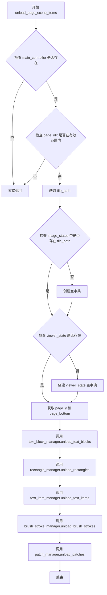

#### 带注释源码

```python
def unload_page_scene_items(self, page_idx: int):
    """Unload scene items for a specific page (saving state if needed)."""
    # 打印卸载日志，便于调试和追踪
    print(f"Unloading scene items for page {page_idx}")
    
    # 前置条件检查：确保 main_controller 已设置且页面索引有效
    if not self.main_controller or page_idx >= len(self.image_loader.image_file_paths):
        return
    
    # 从 image_loader 获取当前页面对应的文件路径
    file_path = self.image_loader.image_file_paths[page_idx]
    
    # 确保 image_states 字典中存在该文件路径的条目，若不存在则初始化
    if file_path not in self.main_controller.image_states:
        self.main_controller.image_states[file_path] = {}
    # 确保 viewer_state 子字典存在，用于存储场景项状态
    if 'viewer_state' not in self.main_controller.image_states[file_path]:
        self.main_controller.image_states[file_path]['viewer_state'] = {}
    
    # 从 layout_manager 获取当前页面的垂直位置范围
    # page_y: 页面顶部在场景中的 Y 坐标
    # page_bottom: 页面底部在场景中的 Y 坐标
    page_y = self.layout_manager.image_positions[page_idx]
    page_bottom = page_y + self.layout_manager.image_heights[page_idx]
    
    # 依次卸载各类场景项，将状态保存回 image_states
    # 文本块需在其它项之前卸载，因为文本项可能依赖文本块数据
    self.text_block_manager.unload_text_blocks(page_idx, page_y, page_bottom, file_path)
    # 矩形对象卸载
    self.rectangle_manager.unload_rectangles(page_idx, page_y, page_bottom, file_path)
    # 文本项卸载
    self.text_item_manager.unload_text_items(page_idx, page_y, page_bottom, file_path)
    # 笔触对象卸载
    self.brush_stroke_manager.unload_brush_strokes(page_idx, page_y, page_bottom, file_path)
    # 补丁项卸载（无边界参数）
    self.patch_manager.unload_patches(page_idx)
```


### `SceneItemManager.save_all_scene_items_to_states`

该方法负责在重大状态变更（如模式切换或页面删除）前，将当前所有可见的场景项（矩形、文字、笔触、文本块）保存到对应的页面状态中。它首先收集各子管理器管理的可见项，然后合并来自 `image_states` 中未加载页面的已有数据，最后通过去重和重分配机制确保数据一致性。

参数： 无

返回值：`None`，该方法直接修改 `main_controller.image_states` 中的数据，不返回任何值。

#### 流程图

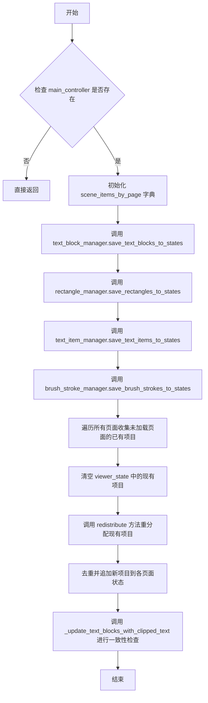

#### 带注释源码

```python
def save_all_scene_items_to_states(self):
    """
    Save all currently visible scene items to their appropriate page states.
    This method is called before major state changes (like mode switching or page deletion).
    """
    # 检查主控制器是否存在，若不存在则直接返回，不进行保存操作
    if not self.main_controller:
        return

    # 初始化一个字典，按页面索引分类存储各类场景项
    # 每个页面包含：矩形、文字项、笔触、文本块四个列表
    scene_items_by_page = {
        i: {'rectangles': [], 'text_items': [], 'brush_strokes': [], 'text_blocks': []}
        for i in range(len(self.image_loader.image_file_paths))
    }

    # 委托各子管理器保存当前可见的项目到 scene_items_by_page
    self.text_block_manager.save_text_blocks_to_states(scene_items_by_page)
    self.rectangle_manager.save_rectangles_to_states(scene_items_by_page)
    self.text_item_manager.save_text_items_to_states(scene_items_by_page)
    self.brush_stroke_manager.save_brush_strokes_to_states(scene_items_by_page)

    # 准备收集所有现有项目的容器
    all_existing_rects = []
    all_existing_brush_strokes = []
    all_existing_blk_list = []
    existing_text_items_by_page = {}
    
    # 遍历所有页面，收集未加载页面的已有项目数据
    for page_idx in range(len(self.image_loader.image_file_paths)):
        file_path = self.image_loader.image_file_paths[page_idx]
        # 确保 image_states 中每个文件路径都有对应的状态结构
        if file_path not in self.main_controller.image_states:
            self.main_controller.image_states[file_path] = {'viewer_state': {}}

        state = self.main_controller.image_states[file_path]
        viewer_state = state.setdefault('viewer_state', {})
        
        # 仅收集未加载页面的已有项目，已加载页面以实时场景项为权威数据源
        if not self.image_loader.is_page_loaded(page_idx):   
            for rect in viewer_state.get('rectangles', []): all_existing_rects.append((rect, page_idx))
            for stroke in state.get('brush_strokes', []): all_existing_brush_strokes.append((stroke, page_idx))
            for blk in state.get('blk_list', []): all_existing_blk_list.append((blk, page_idx))
            existing_text_items_by_page[page_idx] = viewer_state.get('text_items_state', [])
        
        # 清空现有项目，后续将通过重分配机制重新填充
        viewer_state['rectangles'] = []
        state['brush_strokes'] = []
        state['blk_list'] = []
        viewer_state['text_items_state'] = []
    
    # 根据项目与页面的交集关系，将现有项目重新分配到对应页面
    self.rectangle_manager.redistribute_existing_rectangles(all_existing_rects, scene_items_by_page)
    self.brush_stroke_manager.redistribute_existing_brush_strokes(all_existing_brush_strokes, scene_items_by_page)
    self.text_block_manager.redistribute_existing_text_blocks(all_existing_blk_list, scene_items_by_page)
    self.text_item_manager.redistribute_existing_text_items(existing_text_items_by_page, scene_items_by_page)
    
    # 将分类后的项目追加回主 image_states，并进行去重检查
    for page_idx, items in scene_items_by_page.items():
        file_path = self.image_loader.image_file_paths[page_idx]
        state = self.main_controller.image_states[file_path]
        viewer_state = state['viewer_state']
        
        # 矩形去重检查并追加
        existing_rectangles = viewer_state['rectangles']
        for rect in items['rectangles']:
            if not self.rectangle_manager.is_duplicate_rectangle(rect, existing_rectangles):
                existing_rectangles.append(rect)
        
        # 文字项去重检查并追加
        existing_text_items = viewer_state['text_items_state']
        for text_item in items['text_items']:
            if not self.text_item_manager.is_duplicate_text_item(text_item, existing_text_items):
                existing_text_items.append(text_item)

        # 笔触去重检查并追加
        existing_brush_strokes = state['brush_strokes']
        for stroke in items['brush_strokes']:
            if not self.brush_stroke_manager.is_duplicate_brush_stroke(stroke, existing_brush_strokes):
                existing_brush_strokes.append(stroke)

        # 文本块去重检查并追加
        existing_text_blocks = state['blk_list']
        for blk in items['text_blocks']:
            if not self.text_block_manager.is_duplicate_text_block(blk, existing_text_blocks):
                existing_text_blocks.append(blk)
    
    # 执行最终一致性检查：更新文本块的文本内容以匹配被裁剪的文字项
    self._update_text_blocks_with_clipped_text()
```


### `SceneItemManager.merge_clipped_items_back`

该方法是将剪切的项目合并回其原始形式的核心逻辑，当从常规模式切换到网络漫画模式时调用。它通过委托给各个专门的管理器（文本项管理器、矩形管理器、笔触管理器、文本块管理器）来识别和处理跨页面边界分割的项目，将其合并为网络漫画模式下的完整项目进行显示。

参数：无需参数（仅包含隐式 `self` 参数）

返回值：`None`，无返回值描述

#### 流程图

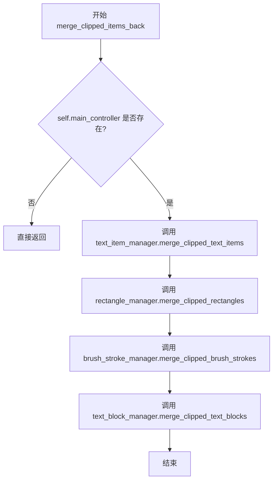

#### 带注释源码

```python
def merge_clipped_items_back(self):
    """
    Merge clipped items back to their original form when switching to webtoon mode.
    This identifies items that were split across page boundaries in regular mode
    and merges them back so they display as whole items in webtoon mode.
    """
    # 检查主控制器是否存在，若不存在则无法执行合并操作，直接返回
    if not self.main_controller:
        return
    
    # 使用管理器特定的合并方法委托给各个子管理器进行具体的合并逻辑
    # 1. 合并被剪切的文本项
    self.text_item_manager.merge_clipped_text_items()
    # 2. 合并被剪切的矩形
    self.rectangle_manager.merge_clipped_rectangles()
    # 3. 合并被剪切的笔触
    self.brush_stroke_manager.merge_clipped_brush_strokes()
    # 4. 合并被剪切的文本块
    self.text_block_manager.merge_clipped_text_blocks()
```


### `SceneItemManager._update_text_blocks_with_clipped_text`

该方法负责将页面状态中保存的 `text_items`（文本项）的文本内容同步到对应的 `blk_list`（文本块）中。它通过匹配位置和旋转角度来建立对应关系，并处理 HTML 格式的文本转换，以确保 Webtoon 模式下文本块显示的内容与原始文本项一致。

参数：

-  无（仅包含实例方法隐含的 `self`）

返回值：`None`，无返回值。

#### 流程图

```mermaid
flowchart TD
    A([开始]) --> B{self.main_controller 是否存在?}
    B -- 否 --> Z([结束])
    B -- 是 --> C[遍历所有页面索引]
    C --> D[获取当前页面的 file_path, state, text_items, text_blocks]
    D --> E[遍历 text_items 中的每个 text_item_data]
    E --> F[提取 text_item 的位置和旋转角]
    F --> G[遍历 text_blocks 中的每个 blk]
    G --> H{位置与旋转角匹配判断: <br/> 位置差 < 5.0 且 角度差 < 1.0?}
    H -- 否 --> G
    H -- 是 --> I[获取 text_item 的文本内容]
    I --> J{文本是否包含 HTML 标签? <br/> (检查 '<' 和 '>')}
    J -- 是 --> K[使用 QTextDocument 转换为纯文本]
    K --> L[plain_text = 转换后的文本]
    J -- 否 --> M[plain_text = 原始文本]
    M --> N[更新 blk.translation 为 plain_text]
    L --> N
    N --> O[跳出当前 blk 循环]
    O --> E
    E -.-> C
```

#### 带注释源码

```python
def _update_text_blocks_with_clipped_text(self):
    """
    Update text blocks' text to match the plain text of their corresponding clipped text items.
    """
    # 检查主控制器是否已初始化，如果没有则直接返回
    if not self.main_controller: 
        return
    
    # 遍历所有页面以同步状态
    for page_idx in range(len(self.image_loader.image_file_paths)):
        file_path = self.image_loader.image_file_paths[page_idx]
        # 从主控制器的图像状态中获取当前页面的状态
        state = self.main_controller.image_states.get(file_path, {})
        # 获取 viewer_state 中的文本项列表
        text_items = state.get('viewer_state', {}).get('text_items_state', [])
        # 获取 blk_list (文本块列表)
        text_blocks = state.get('blk_list', [])
        
        # 遍历当前页面的所有文本项
        for text_item_data in text_items:
            text_item_pos = text_item_data['position']
            text_item_rotation = text_item_data.get('rotation', 0)
            
            # 遍历当前页面的所有文本块，尝试找到对应的文本块
            for blk in text_blocks:
                # 获取文本块在页面本地坐标系的位置
                blk_pos_page_local = [blk.xyxy[0], blk.xyxy[1]]
                
                # 检查位置和旋转是否匹配（带容差）
                # 容差：位置 5.0 像素，角度 1.0 度
                if (abs(blk_pos_page_local[0] - text_item_pos[0]) < 5.0 and
                    abs(blk_pos_page_local[1] - text_item_pos[1]) < 5.0 and
                    abs(blk.angle - text_item_rotation) < 1.0):
                    
                    # 获取文本内容
                    text_content = text_item_data.get('text', '')
                    plain_text = text_content
                    
                    # 如果文本内容包含 HTML 标签，则转换为纯文本
                    if '<' in text_content and '>' in text_content: # Simple HTML check
                        temp_doc = QTextDocument()
                        temp_doc.setHtml(text_content)
                        plain_text = temp_doc.toPlainText()
                    
                    # 更新文本块的翻译（文本内容）
                    blk.translation = plain_text
                    # 找到对应关系后跳出内层循环，避免重复匹配
                    break
```


### `SceneItemManager._is_html`

该方法是一个私有辅助函数，用于检查给定的文本字符串中是否包含 HTML 标签。它使用正则表达式来匹配常见的 HTML 标签结构（如 `<tag>...</tag>`），常用于判断文本是否需要进行富文本转换或纯文本提取。

参数：

- `text`：`str`，需要进行 HTML 标签检测的文本内容。

返回值：`bool`，如果文本中存在 HTML 标签（例如 `<b>`, `<span>` 等）则返回 `True`，否则返回 `False`。

#### 流程图

```mermaid
flowchart TD
    A([开始]) --> B[输入文本 text]
    B --> C{使用正则表达式<br>搜索 <code>&lt;[^&gt;]+&gt;</code> 模式}
    C -->|找到匹配| D[返回 True]
    C -->|未找到匹配| E[返回 False]
    D --> F([结束])
    E --> F
```

#### 带注释源码

```python
def _is_html(self, text):
    """Check if text contains HTML tags.
    
    Args:
        text (str): The text string to be checked for HTML tags.
        
    Returns:
        bool: True if HTML tags are found in the text, False otherwise.
    """
    import re
    # 使用正则表达式查找形如 <...> 的字符串，这是HTML标签的典型特征
    return bool(re.search(r'<[^>]+>', text))
```


### `SceneItemManager.clear`

该方法通过委托给各个子管理器（矩形管理器、文本项管理器、笔触管理器、文本块管理器和补丁管理器）的 `clear` 方法，重置所有场景项管理状态。

参数：

- `self`：`SceneItemManager`，调用此方法的实例上下文。

返回值：`NoneType`，无返回值。此方法执行清空操作，不返回任何数据。

#### 流程图

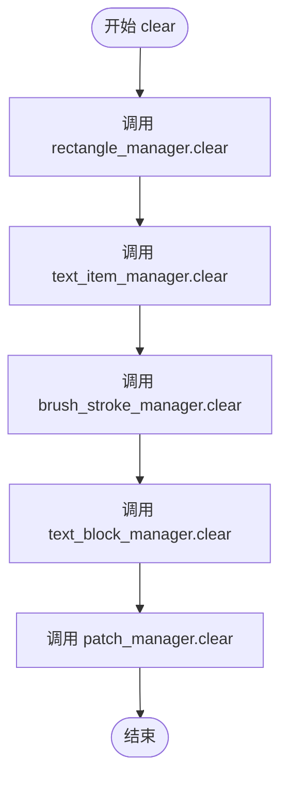

#### 带注释源码

```python
def clear(self):
    """Clear all scene item management state."""
    # 清空矩形管理器中的状态（例如当前加载的矩形列表或缓存）
    self.rectangle_manager.clear()
    
    # 清空文本项管理器中的状态（例如当前文本项的元数据）
    self.text_item_manager.clear()
    
    # 清空笔触管理器中的状态（例如当前的笔触路径数据）
    self.brush_stroke_manager.clear()
    
    # 清空文本块管理器中的状态（例如当前的文本块列表）
    self.text_block_manager.clear()
    
    # 清空补丁管理器中的状态（例如当前的补丁数据）
    self.patch_manager.clear()
```


### `SceneItemManager._clear_all_scene_items`

该方法负责从 QGraphicsScene 中清除所有由管理器控制的场景项（如矩形、文本、笔触等），同时保留场景中的主图像和占位符图像，最后调用 PatchManager 进行额外的清理。

参数：
- 无

返回值：`None`，该方法不返回任何值，主要执行副作用操作。

#### 流程图

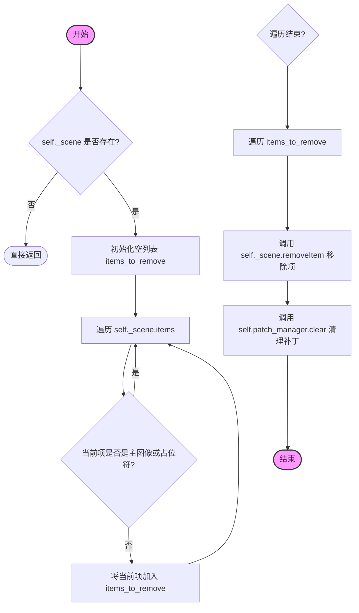

#### 带注释源码

```python
def _clear_all_scene_items(self):
    """Clear all managed scene items from the QGraphicsScene."""
    # 1. 安全检查：如果场景对象不存在，则直接返回，避免后续操作报错
    if not self._scene:
        return
        
    # 2. 收集待移除项：遍历场景中的所有图形项
    items_to_remove = []
    for item in self._scene.items():
        # 3. 过滤保留项：检查当前项是否属于主图像或占位符
        # 如果是主图像 (image_items) 或占位符 (placeholder_items)，则跳过，不移除
        if item in self.image_loader.image_items.values() or item in self.image_loader.placeholder_items.values():
            continue
        # 4. 将非保留项添加到移除列表
        items_to_remove.append(item)
    
    # 5. 执行移除：遍历之前收集的待移除项列表
    for item in items_to_remove:
        self._scene.removeItem(item)

    # 6. 委托清理：调用 patch_manager 的 clear 方法清理相关的补丁数据
    self.patch_manager.clear()
```


### `SceneItemManager.__init__`

初始化场景项管理器，创建并配置所有子管理器（矩形、文本项、笔触、文本块、补丁管理器），建立与查看器、布局管理器、坐标转换器和图像加载器的关联。

参数：

- `self`：`SceneItemManager`，隐式参数，代表类的实例本身
- `viewer`：`Viewer`，Qt图形查看器实例，提供场景访问
- `layout_manager`：`LayoutManager`，布局管理器，负责页面位置和尺寸计算
- `coordinate_converter`：`CoordinateConverter`，坐标转换器，处理页面坐标与视图坐标的转换
- `image_loader`：`ImageLoader`，图像加载器，中心数据源，提供图像文件路径和加载状态

返回值：`None`，构造函数无返回值

#### 流程图

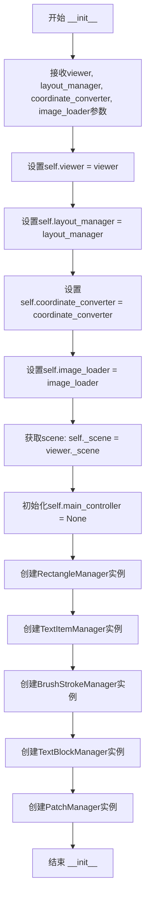

#### 带注释源码

```python
def __init__(self, viewer, layout_manager, coordinate_converter, image_loader):
    """
    初始化场景项管理器。
    
    参数:
        viewer: Qt图形查看器实例
        layout_manager: 布局管理器
        coordinate_converter: 坐标转换器
        image_loader: 图像加载器，图像文件路径和数据的中心数据源
    """
    # 保存查看器引用，用于访问场景和其他视图功能
    self.viewer = viewer
    
    # 保存布局管理器引用，用于获取页面位置和尺寸信息
    self.layout_manager = layout_manager
    
    # 保存坐标转换器引用，用于坐标系统转换
    self.coordinate_converter = coordinate_converter
    
    # 保存图像加载器引用，作为图像文件路径和数据的中心数据源
    self.image_loader = image_loader
    
    # 从查看器获取底层QGraphicsScene实例，用于添加/移除图形项
    self._scene = viewer._scene
    
    # 主控制器引用，延迟初始化（在其他模块设置）
    self.main_controller = None
    
    # 初始化各个专门化的场景项管理器，传递所有必要的依赖引用
    # 矩形管理器：处理场景中的矩形绘制项
    self.rectangle_manager = RectangleManager(viewer, layout_manager, coordinate_converter, image_loader)
    
    # 文本项管理器：处理场景中的文本项
    self.text_item_manager = TextItemManager(viewer, layout_manager, coordinate_converter, image_loader)
    
    # 笔触管理器：处理场景中的画笔笔触
    self.brush_stroke_manager = BrushStrokeManager(viewer, layout_manager, coordinate_converter, image_loader)
    
    # 文本块管理器：处理文本块数据
    self.text_block_manager = TextBlockManager(viewer, layout_manager, coordinate_converter, image_loader)
    
    # 补丁管理器：处理场景中的补丁项
    self.patch_manager = PatchManager(viewer, layout_manager, coordinate_converter, image_loader)
```


### `SceneItemManager.initialize`

该方法是一个**门面模式（Facade Pattern）**的实现，作为协调者统一触发所有子管理器的初始化流程。它确保了在Webtoon场景渲染前，所有专门负责不同类型场景项（如矩形、文字、笔触、文本块和补丁）的管理器都完成了自身的状态准备和数据加载。

#### 参数

无（仅包含隐式参数 `self`）

#### 返回值

`None`，该方法不返回任何值，仅执行副作用（调用子管理器的方法）。

#### 流程图

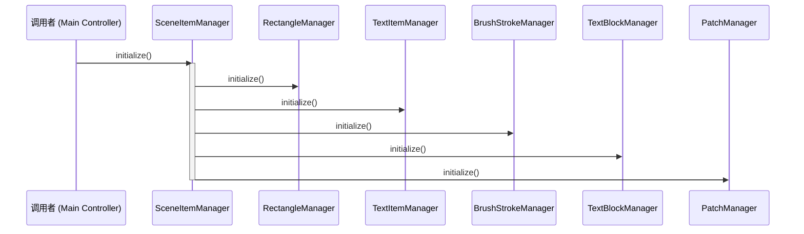

#### 带注释源码

```python
def initialize(self):
    """Initialize all specialized scene item managers."""
    # 委托给 RectangleManager 初始化矩形相关的场景项
    self.rectangle_manager.initialize()
    
    # 委托给 TextItemManager 初始化文本项
    self.text_item_manager.initialize()
    
    # 委托给 BrushStrokeManager 初始化笔触
    self.brush_stroke_manager.initialize()
    
    # 委托给 TextBlockManager 初始化文本块
    self.text_block_manager.initialize()
    
    # 委托给 PatchManager 初始化补丁
    self.patch_manager.initialize()
```

---

### 1. 核心功能描述

`SceneItemManager` 是 Webtoon 管理器的核心协调类，通过组合五个专门的管理器（矩形、文字、笔触、文本块、补丁）来管理场景中的所有元素。它采用“懒加载”（Lazy Loading）策略，并通过引用其他主要管理器的实时数据来维护场景状态。

### 2. 文件（类）整体运行流程

在应用程序启动或页面切换时，`MainController` 创建 `SceneItemManager` 实例。在初始化阶段，调用 `initialize()` 方法触发所有子管理器的内部初始化（如加载默认配置、绑定信号等）。随后，通过 `load_page_scene_items` 按需加载特定页面的数据，或者在页面切换时调用 `unload_page_scene_items` 保存状态。

### 3. 类的详细信息

#### 类字段

- `viewer`：`Viewer` 类型，图形查看器实例，提供对 `_scene` 的访问。
- `layout_manager`：`LayoutManager` 类型，管理页面布局和位置。
- `coordinate_converter`：`CoordinateConverter` 类型，负责坐标转换。
- `image_loader`：`ImageLoader` 类型，图像数据的中央来源，提供文件路径和加载状态。
- `main_controller`：`MainController` 类型，主控制器引用，用于访问全局状态 (`image_states`)。
- `rectangle_manager`：`RectangleManager` 实例，管理矩形场景项。
- `text_item_manager`：`TextItemManager` 实例，管理文本场景项。
- `brush_stroke_manager`：`BrushStrokeManager` 实例，管理笔触场景项。
- `text_block_manager`：`TextBlockManager` 实例，管理文本块场景项。
- `patch_manager`：`PatchManager` 实例，管理补丁场景项。

#### 类方法

- `__init__`：构造函数，初始化所有专门的管理器。
- `initialize`：门面方法，初始化所有子管理器。
- `set_main_controller`：设置主控制器引用并传递给所有子管理器。
- `load_page_scene_items`：加载特定页面的场景项。
- `unload_page_scene_items`：卸载特定页面的场景项并保存状态。
- `save_all_scene_items_to_states`：保存所有当前可见项到状态存储，支持页面重排和模式切换。
- `merge_clipped_items_back`：合并被裁剪的项（从常规模式切换到 Webtoon 模式时）。
- `clear`：清除所有状态。

### 4. 关键组件信息

- **门面管理器 (SceneItemManager)**：统一入口，简化调用。
- **专门管理器 (Sub-Managers)**：每个管理器负责一种场景项的生命周期（加载、卸载、保存、渲染），实现了关注点分离。

### 5. 潜在的技术债务或优化空间

1.  **硬编码的初始化顺序**：如果新增场景项类型，需要手动在 `initialize` 中添加调用。可以通过插件系统或反射机制自动发现并初始化管理器。
2.  **缺乏错误处理**：当前 `initialize` 方法没有 `try-except` 块。如果任何一个子管理器初始化失败（例如依赖缺失），整个流程会中断。添加错误处理和日志记录可以提高健壮性。
3.  **紧耦合**：子类（RectangleManager 等）直接暴露在主类中，如果要替换某个管理器实现（比如从内存加载切换到数据库加载），改动较大。

### 6. 其它项目

- **设计目标**：
    - **解耦**：将不同类型的场景项管理逻辑分离到独立类。
    - **状态一致性**：通过统一的 `main_controller.image_states` 确保数据持久化。
    - **性能**：使用懒加载机制，避免一次性加载所有页面数据。
- **外部依赖与接口契约**：
    - 依赖 `PySide6.QtGui` 和 `QtWidgets` 进行渲染。
    - 依赖于 `ImageLoader` 提供准确的图像文件路径和加载状态。
    - 子管理器需暴露 `initialize()`, `load_*`, `unload_*`, `save_*` 等标准接口。


### `SceneItemManager.set_main_controller`

该方法用于接收并设置主控制器的引用，随后将这一引用“注入”到所有子管理器中。这是实现状态共享的关键步骤，确保了场景项目（如矩形、文本、笔触等）能够访问到全局的应用程序状态（如图像状态字典）。

参数：

- `controller`：`Any`，主应用程序的控制器对象。该对象通常包含全局状态数据（如 `image_states`），供各个管理器在加载或保存场景项目时使用。

返回值：`None`，该方法不返回任何值，仅执行属性赋值操作。

#### 流程图

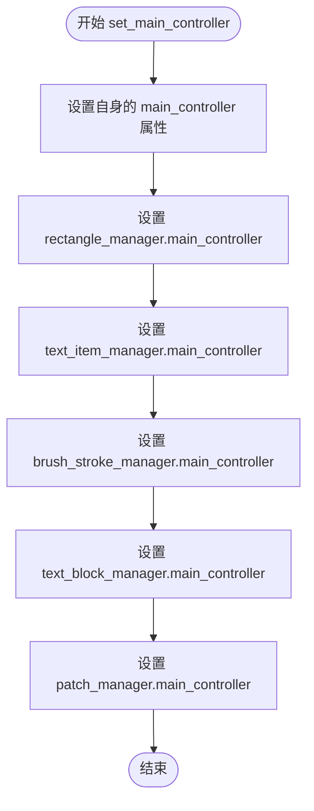

#### 带注释源码

```python
def set_main_controller(self, controller):
    """Set the main controller reference for self and all sub-managers."""
    # 1. 设置 SceneItemManager 自身的主控制器引用
    self.main_controller = controller
    
    # 2. 将主控制器引用传递给各个专门化的子管理器
    # 这样每个子管理器都能独立访问全局状态
    self.rectangle_manager.main_controller = controller
    self.text_item_manager.main_controller = controller
    self.brush_stroke_manager.main_controller = controller
    self.text_block_manager.main_controller = controller
    self.patch_manager.main_controller = controller
```


### `SceneItemManager.load_page_scene_items`

该方法负责将指定页面的场景项目（矩形、文本、笔触和补丁）从持久化状态加载到内存中，并委托给各个专业化管理器执行具体的加载逻辑。

参数：

- `page_idx`：`int`，要加载场景项目的页面索引

返回值：`None`，该方法无返回值，通过副作用更新场景状态

#### 流程图

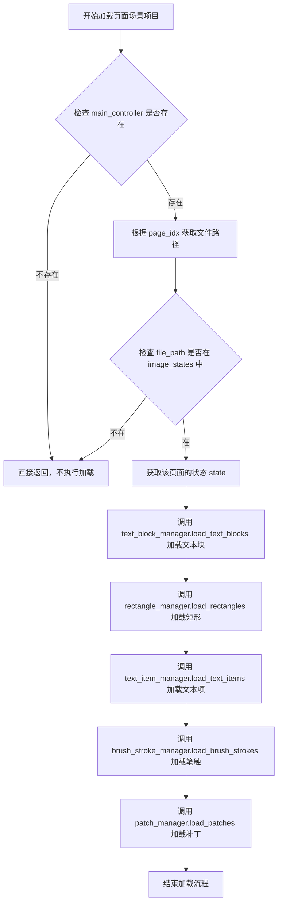

#### 带注释源码

```python
def load_page_scene_items(self, page_idx: int):
    """Load scene items (rectangles, text, brush strokes, patches) for a specific page."""
    # 第一步：安全检查，确保主控制器已初始化
    # 如果主控制器不存在（尚未设置），则无法加载场景项目，直接返回
    if not self.main_controller:
        return
        
    # 第二步：获取当前页面的文件路径
    # image_loader 是数据的中央来源，管理所有图像文件路径
    file_path = self.image_loader.image_file_paths[page_idx]
    
    # 第三步：检查该页面是否有存储的状态
    # image_states 是字典结构，以 file_path 为键存储各页面的场景状态
    # 如果该页面从未保存过状态（首次打开），则无需加载
    if file_path not in self.main_controller.image_states:
        return
        
    # 第四步：获取该页面的完整状态数据
    state = self.main_controller.image_states[file_path]
    
    # 第五步：按依赖顺序加载各类场景项目
    
    # 5.1 优先加载 TextBlock 对象
    # TextBlock 是文本项的容器，需要先于文本项加载
    # 文本块管理器负责从状态中恢复文本块的原始数据
    self.text_block_manager.load_text_blocks(page_idx)
    
    # 5.2 加载矩形（标注区域）
    # 矩形管理器从状态中读取矩形数据并重建场景中的矩形项
    self.rectangle_manager.load_rectangles(state, page_idx)
    
    # 5.3 加载文本项
    # 文本项管理器从状态中读取文本数据并重建场景中的文本项
    # 注意：文本项依赖于对应的 TextBlock 对象
    self.text_item_manager.load_text_items(state, page_idx)
    
    # 5.4 加载笔触（手绘笔触）
    # 笔触管理器从状态中读取笔触路径数据并重建场景中的笔触项
    self.brush_stroke_manager.load_brush_strokes(state, page_idx)
    
    # 5.5 加载补丁（修复区域）
    # 补丁管理器从状态中读取补丁数据并重建场景中的补丁项
    self.patch_manager.load_patches(page_idx)
```


### `SceneItemManager.unload_page_scene_items`

该方法负责卸载指定页面的所有场景项（文本块、矩形框、文本项、笔触和补丁），在卸载前将当前场景中可视项的状态保存回 `main_controller` 的 `image_states` 中，并从场景中移除这些项。

参数：

- `page_idx`：`int`，要卸载场景项的目标页面索引

返回值：`None`，该方法执行副作用（状态保存和场景项移除），不返回任何值

#### 流程图

```mermaid
flowchart TD
    A[开始 unload_page_scene_items] --> B{检查 main_controller<br>是否已设置}
    B -->|否| C[直接返回]
    B --> D{检查 page_idx 是否<br>超出 image_file_paths 范围}
    D -->|是| C
    D --> E[获取 file_path]
    E --> F{检查 image_states 中<br>是否存在 file_path}
    F -->|否| G[创建空字典]
    G --> H{检查 viewer_state<br>是否存在}
    F -->|是| H
    H -->|否| I[创建 viewer_state]
    I --> J[获取页面边界]
    H -->|是| J
    J --> K[page_y = layout_manager.image_positions[page_idx]]
    K --> L[page_bottom = page_y + layout_manager.image_heights[page_idx]]
    L --> M[调用子管理器卸载各类场景项]
    M --> N[text_block_manager.unload_text_blocks]
    N --> O[rectangle_manager.unload_rectangles]
    O --> P[text_item_manager.unload_text_items]
    P --> Q[brush_stroke_manager.unload_brush_strokes]
    Q --> R[patch_manager.unload_patches]
    R --> S[结束]
```

#### 带注释源码

```python
def unload_page_scene_items(self, page_idx: int):
    """
    Unload scene items for a specific page (saving state if needed).
    
    负责将指定页面的所有场景项从当前场景中移除，
    并将它们的状态保存回 image_states 字典中，以便后续页面重新加载时恢复。
    
    参数:
        page_idx: int，要卸载场景项的目标页面索引
    """
    print(f"Unloading scene items for page {page_idx}")
    
    # 前置检查：确保 main_controller 已设置且页面索引有效
    if not self.main_controller or page_idx >= len(self.image_loader.image_file_paths):
        return
        
    # 从 image_loader 获取目标页面的文件路径
    file_path = self.image_loader.image_file_paths[page_idx]
    
    # 确保 image_states 中存在该页面的状态字典，若不存在则创建
    if file_path not in self.main_controller.image_states:
        self.main_controller.image_states[file_path] = {}
    
    # 确保 viewer_state 子字典存在，用于存储场景视图相关状态
    if 'viewer_state' not in self.main_controller.image_states[file_path]:
        self.main_controller.image_states[file_path]['viewer_state'] = {}
    
    # 从 layout_manager 获取当前页面的垂直边界范围
    # page_y 表示页面顶部的 Y 坐标
    page_y = self.layout_manager.image_positions[page_idx]
    # page_bottom 表示页面底部的 Y 坐标（用于确定场景项是否属于该页面）
    page_bottom = page_y + self.layout_manager.image_heights[page_idx]
    
    # 依次调用各子管理器的卸载方法，传入页面索引和边界信息
    # 这些子管理器负责：
    # 1. 将当前场景中的可视项序列化保存到 image_states
    # 2. 从 QGraphicsScene 中实际移除这些图形项
    
    # 卸载文本块（TextBlock）对象
    self.text_block_manager.unload_text_blocks(page_idx, page_y, page_bottom, file_path)
    
    # 卸载矩形框（Rectangle）对象
    self.rectangle_manager.unload_rectangles(page_idx, page_y, page_bottom, file_path)
    
    # 卸载文本项（TextItem）对象
    self.text_item_manager.unload_text_items(page_idx, page_y, page_bottom, file_path)
    
    # 卸载笔触（BrushStroke）对象
    self.brush_stroke_manager.unload_brush_strokes(page_idx, page_y, page_bottom, file_path)
    
    # 卸载补丁（Patch）对象
    self.patch_manager.unload_patches(page_idx)
```


### `SceneItemManager.save_all_scene_items_to_states`

该方法负责将所有当前可见的场景项目（矩形、文本、笔触、文本块）保存到持久化状态存储中。在进行重大状态变更（如模式切换或页面删除）前调用此方法。它首先委托子管理器保存当前可见的项目，然后收集未加载页面的历史项目，清空旧状态，并根据几何位置重新分配和合并这些项目，最后进行去重处理。

参数：

- `self`：`SceneItemManager`，调用该方法的类实例本身，包含对视图、布局管理器和图像加载器的引用。

返回值：`None`，无返回值。该方法直接修改 `self.main_controller.image_states` 字典中的数据。

#### 流程图

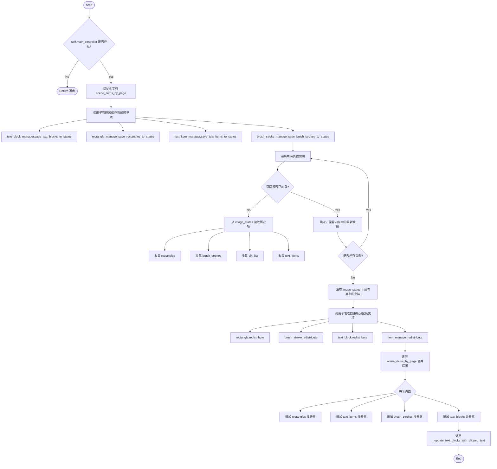

#### 带注释源码

```python
def save_all_scene_items_to_states(self):
    """
    保存所有当前可见的场景项到它们对应的页面状态中。
    此方法在重大状态变更（如模式切换或页面删除）之前调用。
    """
    # 1. 检查主控制器是否存在，如果不存在则直接返回，不进行保存
    if not self.main_controller:
        return

    # 2. 初始化一个字典，用于按页面存储分类后的场景项
    # 结构: {page_idx: {'rectangles': [], 'text_items': [], 'brush_strokes': [], 'text_blocks': []}}
    scene_items_by_page = {
        i: {'rectangles': [], 'text_items': [], 'brush_strokes': [], 'text_blocks': []}
        for i in range(len(self.image_loader.image_file_paths))
    }

    # 3. 委托子管理器保存当前可见（已加载）项
    # 这些是用户当前在屏幕上看到的内容
    self.text_block_manager.save_text_blocks_to_states(scene_items_by_page)
    self.rectangle_manager.save_rectangles_to_states(scene_items_by_page)
    self.text_item_manager.save_text_items_to_states(scene_items_by_page)
    self.brush_stroke_manager.save_brush_strokes_to_states(scene_items_by_page)

    # 4. 收集所有现有（未加载）页面的历史项
    # 如果页面未加载，image_states 中的数据是权威的；如果已加载，内存中的场景项是权威的
    all_existing_rects = []
    all_existing_brush_strokes = []
    all_existing_blk_list = []
    existing_text_items_by_page = {}
    
    for page_idx in range(len(self.image_loader.image_file_paths)):
        file_path = self.image_loader.image_file_paths[page_idx]
        # 确保状态结构存在
        if file_path not in self.main_controller.image_states:
            self.main_controller.image_states[file_path] = {'viewer_state': {}}

        state = self.main_controller.image_states[file_path]
        viewer_state = state.setdefault('viewer_state', {})
        
        # 仅当页面未加载时，才从持久状态中收集现有项
        if not self.image_loader.is_page_loaded(page_idx):   
            for rect in viewer_state.get('rectangles', []): all_existing_rects.append((rect, page_idx))
            for stroke in state.get('brush_strokes', []): all_existing_brush_strokes.append((stroke, page_idx))
            for blk in state.get('blk_list', []): all_existing_blk_list.append((blk, page_idx))
            existing_text_items_by_page[page_idx] = viewer_state.get('text_items_state', [])
        
        # 5. 准备重分配：先清空现有项，它们将根据几何位置重新分发到各页面
        viewer_state['rectangles'] = []
        state['brush_strokes'] = []
        state['blk_list'] = []
        viewer_state['text_items_state'] = []
    
    # 6. 重新分配现有项
    # 处理跨页面边界的项（如在普通模式下拆分到不同页的矩形或笔触）
    self.rectangle_manager.redistribute_existing_rectangles(all_existing_rects, scene_items_by_page)
    self.brush_stroke_manager.redistribute_existing_brush_strokes(all_existing_brush_strokes, scene_items_by_page)
    self.text_block_manager.redistribute_existing_text_blocks(all_existing_blk_list, scene_items_by_page)
    self.text_item_manager.redistribute_existing_text_items(existing_text_items_by_page, scene_items_by_page)
    
    # 7. 将所有分类的项追加回主状态，并进行去重
    for page_idx, items in scene_items_by_page.items():
        file_path = self.image_loader.image_file_paths[page_idx]
        state = self.main_controller.image_states[file_path]
        viewer_state = state['viewer_state']
        
        # 处理矩形
        existing_rectangles = viewer_state['rectangles']
        for rect in items['rectangles']:
            if not self.rectangle_manager.is_duplicate_rectangle(rect, existing_rectangles):
                existing_rectangles.append(rect)
        
        # 处理文本项
        existing_text_items = viewer_state['text_items_state']
        for text_item in items['text_items']:
            if not self.text_item_manager.is_duplicate_text_item(text_item, existing_text_items):
                existing_text_items.append(text_item)

        # 处理笔触
        existing_brush_strokes = state['brush_strokes']
        for stroke in items['brush_strokes']:
            if not self.brush_stroke_manager.is_duplicate_brush_stroke(stroke, existing_brush_strokes):
                existing_brush_strokes.append(stroke)

        # 处理文本块
        existing_text_blocks = state['blk_list']
        for blk in items['text_blocks']:
            if not self.text_block_manager.is_duplicate_text_block(blk, existing_text_blocks):
                existing_text_blocks.append(blk)
    
    # 8. 最终一致性检查：更新文本块的内容以匹配其对应的剪切文本项
    self._update_text_blocks_with_clipped_text()
```


### `SceneItemManager.merge_clipped_items_back`

该方法用于在切换到 Webtoon 模式时，将被裁剪（分割）的项目合并回其原始形式。当在普通模式下项目跨越页面边界被分割时，此方法会将它们识别并合并，以便在 Webtoon 模式下显示为完整的项目。

参数： 无

返回值：`None`，无返回值

#### 流程图

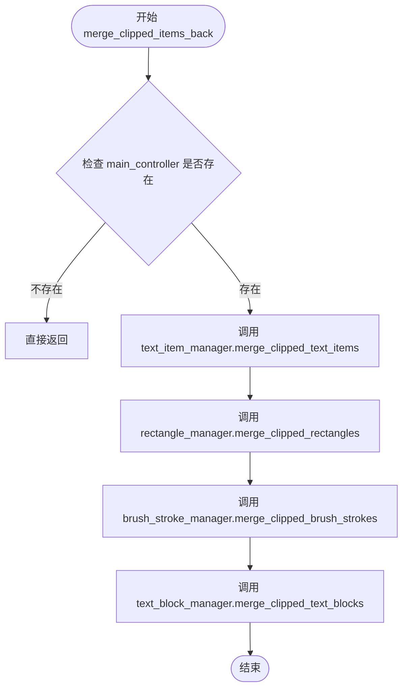

#### 带注释源码

```python
def merge_clipped_items_back(self):
    """
    Merge clipped items back to their original form when switching to webtoon mode.
    This identifies items that were split across page boundaries in regular mode
    and merges them back so they display as whole items in webtoon mode.
    """
    # 检查主控制器是否存在，如果不存在则无法执行合并操作
    if not self.main_controller:
        return
    
    # 使用各专门管理器的合并方法，将被裁剪的项目合并回原始形式
    # 委托给 TextItemManager 处理文本项目的合并
    self.text_item_manager.merge_clipped_text_items()
    
    # 委托给 RectangleManager 处理矩形的合并
    self.rectangle_manager.merge_clipped_rectangles()
    
    # 委托给 BrushStrokeManager 处理画笔笔触的合并
    self.brush_stroke_manager.merge_clipped_brush_strokes()
    
    # 委托给 TextBlockManager 处理文本块的合并
    self.text_block_manager.merge_clipped_text_blocks()
```


### `SceneItemManager._update_text_blocks_with_clipped_text`

更新文本块的文本内容，使其与对应的被裁剪文本项的纯文本保持一致。

参数：
- `self`：隐式参数，SceneItemManager实例本身

返回值：`None`，该方法直接修改文本块对象的 `translation` 属性，不返回任何值

#### 流程图

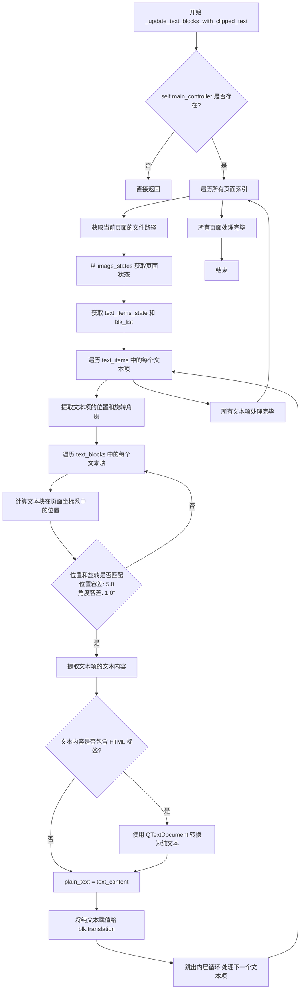

#### 带注释源码

```python
def _update_text_blocks_with_clipped_text(self):
    """
    Update text blocks' text to match the plain text of their corresponding clipped text items.
    该方法用于在保存或合并裁剪项时，将文本块的翻译内容与对应的裁剪文本项的纯文本内容同步。
    这样可以确保文本块显示的是用户实际看到的纯文本内容，而不是带有HTML格式的原始内容。
    """
    # 检查主控制器是否存在，若不存在则无法访问状态数据，直接返回
    if not self.main_controller: 
        return
    
    # 遍历所有页面，确保所有页面的文本块都能与对应的裁剪文本项同步
    for page_idx in range(len(self.image_loader.image_file_paths)):
        # 获取当前页面的文件路径，作为状态字典的键
        file_path = self.image_loader.image_file_paths[page_idx]
        
        # 从主控制器的 image_states 中获取当前页面的状态字典
        state = self.main_controller.image_states.get(file_path, {})
        
        # 获取当前页面的文本项列表（viewer_state中的裁剪文本项）
        # 和文本块列表（blk_list，存储在页面状态的顶层）
        text_items = state.get('viewer_state', {}).get('text_items_state', [])
        text_blocks = state.get('blk_list', [])
        
        # 遍历当前页面的每个文本项，尝试找到与之对应的文本块
        for text_item_data in text_items:
            # 提取文本项的位置信息
            text_item_pos = text_item_data['position']
            
            # 获取文本项的旋转角度，默认为0
            text_item_rotation = text_item_data.get('rotation', 0)
            
            # 遍历当前页面的每个文本块，查找位置和旋转角度匹配的项
            for blk in text_blocks:
                # 计算文本块在页面坐标系中的位置（使用xyxy的第一个点xy）
                blk_pos_page_local = [blk.xyxy[0], blk.xyxy[1]]
                
                # 检查文本块和文本项的位置和旋转是否匹配（带容差）
                # 位置容差: 5.0 像素（处理轻微的坐标偏移）
                # 角度容差: 1.0 度（处理旋转角度的精度问题）
                if (abs(blk_pos_page_local[0] - text_item_pos[0]) < 5.0 and
                    abs(blk_pos_page_local[1] - text_item_pos[1]) < 5.0 and
                    abs(blk.angle - text_item_rotation) < 1.0):
                    
                    # 获取文本项的文本内容
                    text_content = text_item_data.get('text', '')
                    plain_text = text_content
                    
                    # 简单的HTML标签检测：如果文本包含<和>，则可能是HTML格式
                    if '<' in text_content and '>' in text_content:
                        # 使用 QTextDocument 将 HTML 转换为纯文本
                        temp_doc = QTextDocument()
                        temp_doc.setHtml(text_content)
                        plain_text = temp_doc.toPlainText()
                    
                    # 将纯文本赋值给文本块的 translation 属性
                    # 这样文本块就能显示用户实际看到的纯文本内容
                    blk.translation = plain_text
                    
                    # 找到一个匹配的文本块后跳出内层循环
                    # （假设一个文本项最多对应一个文本块）
                    break
```


### `SceneItemManager._is_html`

检查文本是否包含HTML标签，用于判断文本是否为富文本格式。

参数：

- `text`：`str`，需要检查的文本内容

返回值：`bool`，如果文本包含HTML标签返回 `True`，否则返回 `False`

#### 流程图

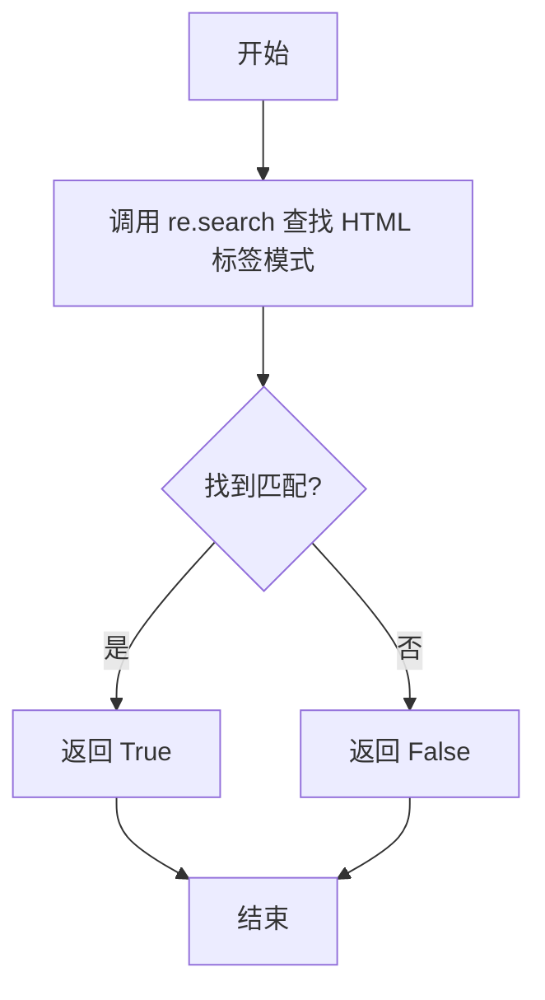

#### 带注释源码

```python
def _is_html(self, text):
    """Check if text contains HTML tags."""
    import re  # 导入正则表达式模块
    # 使用正则表达式搜索 HTML 标签模式: <任意非>字符>
    # 如果找到匹配则返回匹配对象，否则返回 None
    # bool() 将结果转换为布尔值: 匹配对象->True, None->False
    return bool(re.search(r'<[^>]+>', text))
```


### `SceneItemManager.clear`

该方法用于清除所有场景项（矩形、文本、笔触、文本块和补丁）的管理状态，通过委托给各个专门的子管理器来执行实际的清理操作。

参数：无

返回值：`None`，无返回值

#### 流程图

```mermaid
flowchart TD
    A[SceneItemManager.clear] --> B[调用 rectangle_manager.clear]
    A --> C[调用 text_item_manager.clear]
    A --> D[调用 brush_stroke_manager.clear]
    A --> E[调用 text_block_manager.clear]
    A --> F[调用 patch_manager.clear]
    
    B --> G[结束]
    C --> G
    D --> G
    E --> G
    F --> G
```

#### 带注释源码

```python
def clear(self):
    """Clear all scene item management state."""
    # 清除矩形管理器中的所有矩形数据
    self.rectangle_manager.clear()
    
    # 清除文本项管理器中的所有文本项数据
    self.text_item_manager.clear()
    
    # 清除笔触管理器中的所有笔触数据
    self.brush_stroke_manager.clear()
    
    # 清除文本块管理器中的所有文本块数据
    self.text_block_manager.clear()
    
    # 清除补丁管理器中的所有补丁数据
    self.patch_manager.clear()
```


### `SceneItemManager._clear_all_scene_items`

该方法负责清理当前场景中的所有临时绘制或添加的图形元素（如矩形框、文字、笔触、图块补丁），同时确保底层的漫画页面图片及其占位符不被移除。此操作通常在需要重置视图或切换模式时调用。

参数：
- （无，仅包含 `self`）

返回值：`None`，无返回值。

#### 流程图

```mermaid
flowchart TD
    A([开始]) --> B{检查 _scene 是否存在}
    B -- 否 --> C([直接返回])
    B -- 是 --> D[遍历场景中的所有 items]
    
    D --> E{判断 item 类型}
    E -- 是图片或占位符 --> D
    E -- 否 --> F[加入待删除列表]
    
    F --> D
    D -- 遍历完成 --> G{待删除列表是否为空?}
    G -- 是 --> I
    G -- 否 --> H[从 scene 中移除 item]
    H --> G
    
    I[调用 patch_manager.clear 清理补丁数据]
    I --> J([结束])
```

#### 带注释源码

```python
def _clear_all_scene_items(self):
    """Clear all managed scene items from the QGraphicsScene."""
    # 1. 安全检查：如果当前没有关联的场景对象，则直接退出
    if not self._scene:
        return
        
    # 2. 收集待删除项目
    # 初始化一个列表用于存放需要被移除的图形项
    items_to_remove = []
    
    # 3. 遍历场景中的所有项
    for item in self._scene.items():
        # 4. 过滤逻辑：排除主图片和占位符
        # 我们需要保留 image_loader 中的底层图片项，只删除用户交互产生的覆盖层
        if item in self.image_loader.image_items.values() or item in self.image_loader.placeholder_items.values():
            continue
        
        # 5. 将非底层图片项加入待删除列表
        items_to_remove.append(item)
    
    # 6. 执行删除操作
    # 遍历收集好的项目列表，将其从场景中彻底移除
    for item in items_to_remove:
        self._scene.removeItem(item)

    # 7. 清理补丁管理器状态
    # 场景项删除后，同步清理对应的补丁数据状态
    self.patch_manager.clear()
```


## 关键组件


### SceneItemManager
Central facade for managing various scene items (rectangles, text, brush strokes, patches) with lazy loading and delegation to specialized managers.

### RectangleManager
Specialized manager for handling rectangle annotations, including loading, unloading, saving, and redistributing rectangles across pages.

### TextItemManager
Specialized manager for text items, supporting features like merging clipped text items and handling text item state.

### BrushStrokeManager
Manager for brush strokes, handling their lifecycle, state persistence, and redistribution logic.

### TextBlockManager
Manager for text blocks (blk_list), responsible for synchronizing text blocks with text items and managing their state.

### PatchManager
Manager for patches (image overlays), handling loading and clearing of patch items.

### Page-wise Lazy Loading
The mechanism implemented in `load_page_scene_items` and `unload_page_scene_items` to load/unload scene items only for the active page.

### State Redistribution Logic
The logic in `save_all_scene_items_to_states` that redistributes existing scene items across pages based on their geometric intersection with page boundaries.

### Cross-Page Merging
The functionality in `merge_clipped_items_back` that merges items previously split by page boundaries (e.g., when switching to webtoon mode).


## 问题及建议


### 已知问题

- **状态管理职责混乱**：代码混合使用 `image_loader` 作为"数据所有者"和 `main_controller.image_states` 进行状态存储，导致数据流不清晰，难以追踪状态变化来源。
- **性能低下**：`save_all_scene_items_to_states` 方法中存在大量嵌套循环，时间复杂度较高；`_update_text_blocks_with_clipped_text` 方法对每个text_item遍历所有text_blocks，时间复杂度为O(n*m)。
- **重复代码模式**：5个子管理器都接收相同的构造参数（viewer, layout_manager, coordinate_converter, image_loader），且都需要手动设置 `main_controller`，违反了DRY原则。
- **类型提示不足**：除少数参数外，大部分方法和变量缺少类型注解，影响代码可维护性和IDE支持。
- **错误处理缺失**：多处直接返回而不提供错误信息或日志，如 `load_page_scene_items` 和 `unload_page_scene_items` 在 `main_controller` 为空时静默返回。
- **潜在越界风险**：`unload_page_scene_items` 中直接使用 `page_idx` 索引 `image_file_paths`，未做边界验证（虽然前面有 `page_idx >= len(...)` 检查，但逻辑分散）。
- **魔法数字**：代码中多处使用硬编码的阈值（如 `< 5.0`、`< 1.0` 用于位置和角度比较），缺乏常量定义。
- **方法职责不清晰**：`clear()` 和 `_clear_all_scene_items()` 方法功能存在重叠和混淆。

### 优化建议

- **重构子管理器架构**：引入抽象基类或协议（Protocol）定义通用接口，使用依赖注入容器统一管理子管理器实例，减少构造函数参数重复。
- **性能优化**：在 `_update_text_blocks_with_clipped_text` 中使用空间索引（如R-tree）或哈希表按位置键索引text_blocks，将O(n*m)降低到O(n)。
- **完善类型提示**：为所有方法参数、返回值和类字段添加类型注解。
- **提取常量**：将魔法数字提取为类常量或配置文件，如 `POSITION_TOLERANCE = 5.0`、`ANGLE_TOLERANCE = 1.0`。
- **增强错误处理**：在关键操作失败时抛出自定义异常或记录详细日志，而非静默返回。
- **统一状态管理**：明确 `image_loader` 和 `main_controller.image_states` 的职责边界，考虑使用单一数据源模式。
- **方法重命名与分离**：明确 `clear()`（清除管理器状态）和 `_clear_all_scene_items()`（清除场景中的图形项）的职责，可考虑合并或重命名。
- **添加日志**：在 `unload_page_scene_items` 等关键方法中增加详细日志，便于调试和监控状态变化。


## 其它


### 设计目标与约束

本模块的设计目标是为Webtoon模式提供统一的场景项目（矩形、文本、画笔笔触、文本块、补丁）管理接口，采用委托模式将职责分配给五个专业管理器（RectangleManager、TextItemManager、BrushStrokeManager、TextBlockManager、PatchManager），实现关注点分离。核心约束包括：1）依赖image_loader作为图像文件路径和数据的主数据源；2）依赖main_controller的image_states进行状态持久化；3）所有场景项必须支持跨页边界的分割与合并逻辑，以适应Webtoon模式的长幅图像显示；4）采用延迟加载策略，仅在需要时加载/卸载页面场景项。

### 错误处理与异常设计

本类主要通过返回空值或提前返回来避免异常扩散。关键风险点包括：1）load_page_scene_items中访问image_loader.image_file_paths和main_controller.image_states时未进行键存在性检查，可能触发KeyError；2）unload_page_scene_items中未验证page_idx索引有效性；3）save_all_scene_items_to_states中遍历image_file_paths时假设长度一致。改进建议：为所有字典访问添加.get()或contains检查，为索引访问添加边界验证，并考虑抛出自定义异常（如SceneItemLoadError）而非静默失败。

### 数据流与状态机

数据流遵循以下路径：1）加载流程：load_page_scene_items从image_loader获取文件路径，从main_controller.image_states获取页面状态，依次调用各子管理器加载场景项到QGraphicsScene；2）卸载流程：unload_page_scene_items将当前页面可见场景项序列化回image_states；3）保存流程：save_all_scene_items_to_states收集所有页面状态，重新分配跨页项到正确页面，处理去重后写回image_states；4）合并流程：merge_clipped_items_back在模式切换时将分割的项还原为整体。状态转换：页面项经历「未加载→已加载→已修改→已保存」的生命周期，状态存储在main_controller.image_states字典中。

### 外部依赖与接口契约

核心依赖包括：1）PySide6.QtGui.QTextDocument用于HTML文本转纯文本；2）image_loader对象（需具备image_file_paths列表、image_items字典、placeholder_items字典、is_page_loaded方法）；3）layout_manager对象（需具备image_positions列表、image_heights列表）；4）viewer对象（需具备_scene属性）；5）coordinate_converter对象。接口契约：initialize方法无参数无返回值；set_main_controller接收MainController实例；load_page_scene_items和unload_page_scene_items接收page_idx整数参数；save_all_scene_items_to_states和merge_clipped_items_back无参数无返回值。

### 性能考虑与优化空间

当前实现存在以下性能瓶颈：1）save_all_scene_items_to_states中多次遍历所有页面，对于大型漫画（数百页）时间复杂度为O(n²)；2）去重检查使用线性扫描is_duplicate_*方法，应改用哈希集合；3）文本块更新_update_text_blocks_with_clipped_text对每页所有文本项和文本块进行嵌套循环，可建立位置索引加速；4）_clear_all_scene_items中每次调用scene.items()可能返回大量项，建议缓存或分批处理。优化建议：使用集合存储已验证ID进行O(1)去重，建立空间索引结构（如R树）处理跨页项定位。

### 并发与线程安全

本模块所有操作均在主Qt线程中执行（Qt的QGraphicsScene非线程安全），未实现显式锁机制。潜在风险：1）如果image_loader在后台线程预加载图像并修改image_file_paths，主线程同时访问可能导致数据不一致；2）main_controller.image_states的读写未加锁，多线程场景下可能产生竞态条件。设计约束：要求调用方确保所有SceneItemManager方法在主线程调用，或在调用前对image_states进行深拷贝。

### 安全性考虑

代码未直接处理用户输入验证或敏感数据，主要安全关注点：1）从image_states反序列化场景项数据时，未验证数据结构完整性，恶意或损坏的pickle/JSON数据可能导致属性访问错误；2）_update_text_blocks_with_clipped_text中setHtml方法可能执行嵌入式JavaScript（尽管QTextDocument默认禁用脚本）；3）正则表达式_is_html方法未设置reTimeout，长文本可能导致正则引擎卡顿。建议：添加schema验证，使用QTextDocument.setPlainText替代setHtml，或在setHtml前进行HTML净化。

### 测试策略建议

单元测试应覆盖：1）各子管理器初始化与clear方法；2）load_page_scene_items在正常数据、缺失状态、非法索引下的行为；3）save_all_scene_items_to_states的去重逻辑与跨页重分配；4）merge_clipped_items_back的合并正确性。集成测试应验证：1）与main_controller.image_states的完整数据流；2）模式切换（regular→webtoon）场景下项的分割与合并；3）多页场景下性能。Mock对象需提供image_loader、layout_manager、viewer的简化实现。

### 版本兼容性说明

本代码依赖PySide6（Qt for Python），需确保Qt版本≥6.0以支持QTextDocument.toPlainText等方法。代码中使用的QTextDocument.setHtml在Qt 5和Qt 6行为基本一致，但HTML解析器存在细微差异。子管理器类（RectangleManager等）的接口需保持向后兼容，添加新方法时应避免与现有名称冲突。序列化格式（image_states结构）变更时需提供迁移策略。


    