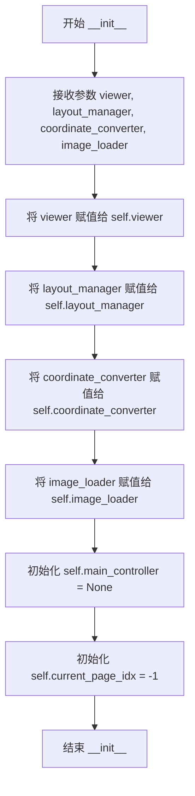
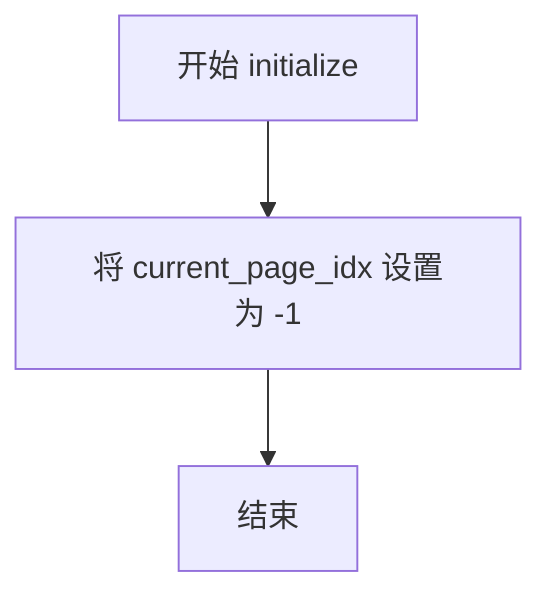
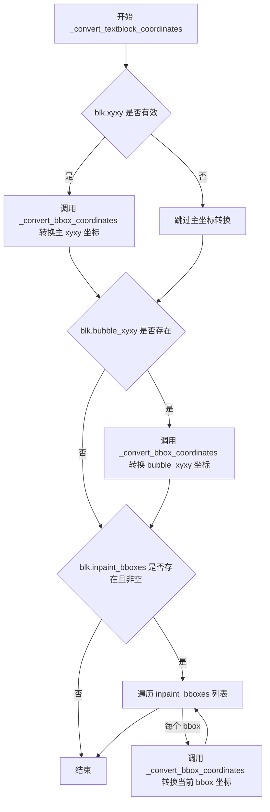
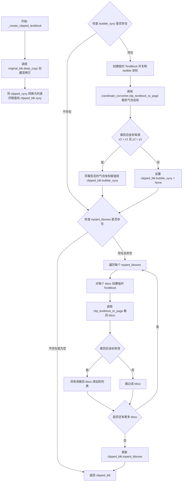
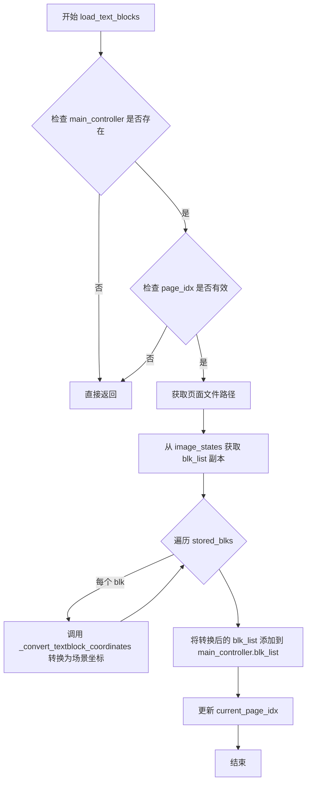
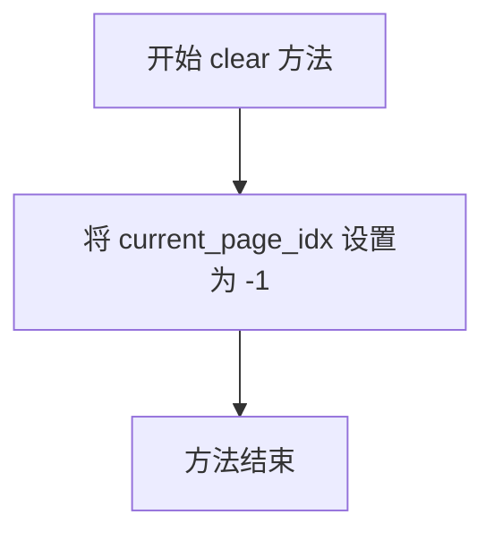
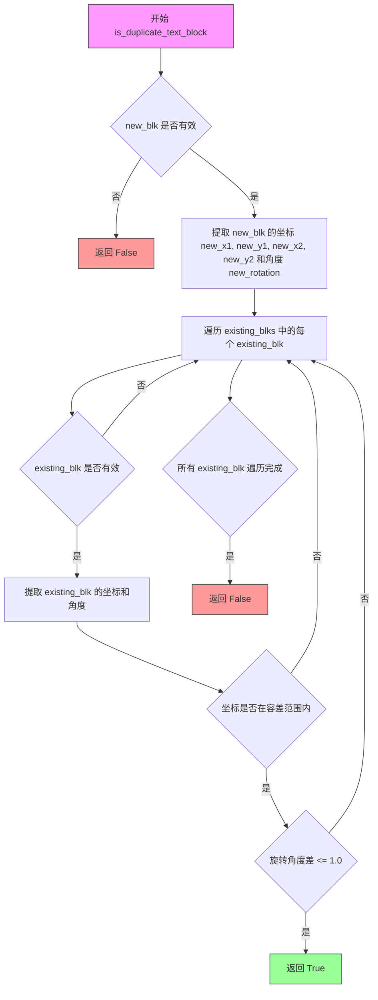
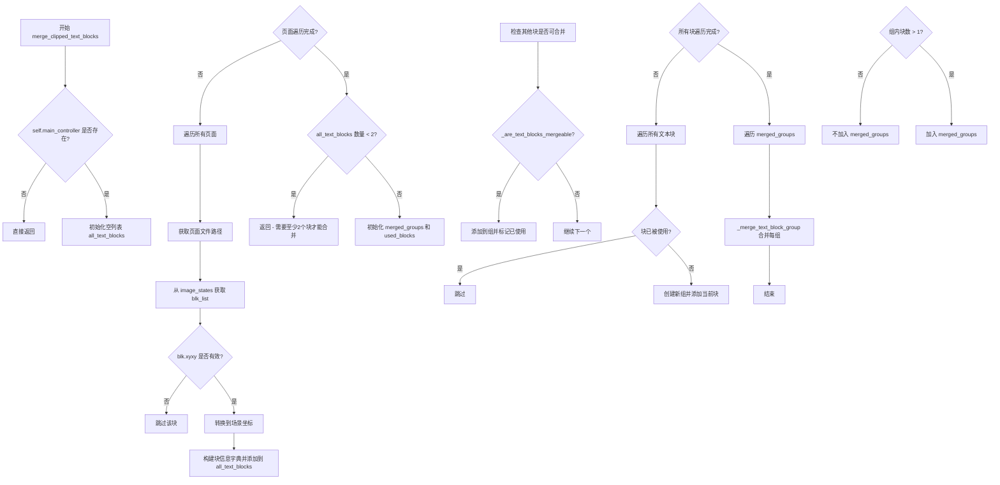
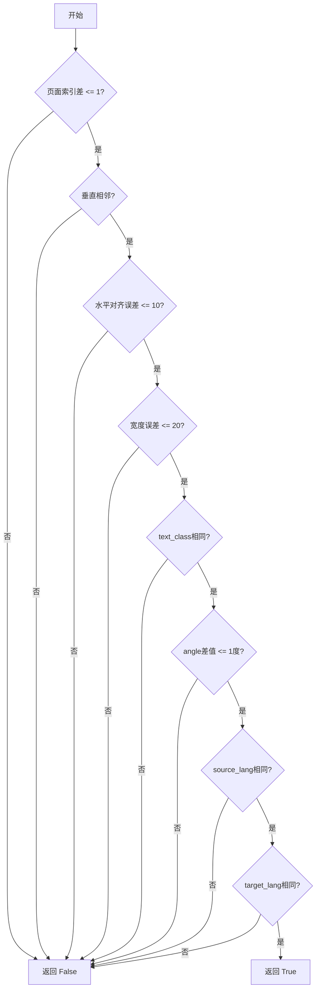

# `comic-translate\app\ui\canvas\webtoons\scene_items\text_block_manager.py` 详细设计文档

Webtoon场景项目的文本块管理器，负责TextBlock对象的生命周期管理、坐标转换（页面本地坐标与场景坐标互转）、跨页文本块的裁剪、去重与合并，支持懒加载模式下的页面切换和状态持久化。

## 整体流程

```mermaid
graph TD
    A[TextBlock Manager] --> B[初始化 initialize]
    B --> C{页面切换}
    C -->|加载页面| D[load_text_blocks]
    C -->|卸载页面| E[unload_text_blocks]
    D --> D1[获取页面文件路径]
    D1 --> D2[从image_states获取blk_list]
    D2 --> D3[_convert_textblock_coordinates 页面本地→场景]
    D3 --> D4[添加到main_controller.blk_list]
    E --> E1[遍历blk_list查找跨页文本块]
    E2[_convert_textblock_coordinates 场景→页面本地]
    E2 --> E3[存储到image_states[file_path]['blk_list']]
    E3 --> E4[从main_controller.blk_list移除]
    C -->|批量保存| F[save_text_blocks_to_states]
    F --> F1[遍历blk_list获取场景边界]
    F1 --> F2[get_pages_for_scene_bounds获取交叉页面]
    F2 --> F3[_create_clipped_textblock创建裁剪副本]
    F3 --> F4[添加到scene_items_by_page]
    C -->|重分配| G[redistribute_existing_text_blocks]
    G --> G1[转换页面本地→场景坐标]
    G1 --> G2[查找所有交叉页面]
    G2 --> G3[创建裁剪副本并分发]
    C -->|去重| H[_remove_duplicate_textblocks]
    C -->|合并| I[merge_clipped_text_blocks]
    I --> I1[收集所有页面文本块]
    I1 --> I2[_are_text_blocks_mergeable检查可合并性]
    I2 --> I3[_merge_text_block_group执行合并]
```

## 类结构

```
TextBlockManager (主类)
├── 字段: viewer, layout_manager, coordinate_converter, image_loader, main_controller, current_page_idx
└── 方法: __init__, initialize, _convert_bbox_coordinates, _convert_textblock_coordinates, _create_clipped_textblock, _remove_duplicate_textblocks, load_text_blocks, unload_text_blocks, save_text_blocks_to_states, clear, redistribute_existing_text_blocks, is_duplicate_text_block, merge_clipped_text_blocks, _are_text_blocks_mergeable, _merge_text_block_group
```

## 全局变量及字段


### `TextBlockManager.viewer`
    
视图对象引用，用于访问图形视图界面

类型：`QGraphicsView or object`
    


### `TextBlockManager.layout_manager`
    
布局管理器引用，用于管理页面布局和获取页面信息

类型：`LayoutManager`
    


### `TextBlockManager.coordinate_converter`
    
坐标转换器引用，用于页面坐标与场景坐标之间的转换

类型：`CoordinateConverter`
    


### `TextBlockManager.image_loader`
    
图像加载器引用，用于获取图像文件路径列表

类型：`ImageLoader`
    


### `TextBlockManager.main_controller`
    
主控制器引用（由场景项管理器设置），用于访问blk_list和image_states

类型：`MainController or None`
    


### `TextBlockManager.current_page_idx`
    
当前页面索引，初始值为-1表示未加载任何页面

类型：`int`
    
    

## 全局函数及方法


### `TextBlockManager.__init__`

该方法是 `TextBlockManager` 类的构造函数，负责初始化文本块管理器实例，接收并保存查看器、布局管理器、坐标转换器和图像加载器等核心依赖组件，同时初始化主控制器引用和当前页面索引状态。

参数：

- `viewer`：`对象`，查看器实例，提供Webtoon场景的显示和交互功能
- `layout_manager`：`对象`，布局管理器，负责页面布局和场景边界计算
- `coordinate_converter`：`对象`，坐标转换器，处理页面坐标与场景坐标之间的相互转换
- `image_loader`：`对象`，图像加载器，提供图像文件路径管理和加载功能

返回值：`None`，构造函数无返回值

#### 流程图



#### 带注释源码

```python
def __init__(self, viewer, layout_manager, coordinate_converter, image_loader):
    """
    初始化 TextBlockManager 实例。
    
    接收四个核心依赖组件，用于管理Webtoon模式下的TextBlock对象，
    包括状态存储、坐标转换和页面跟踪等功能。
    
    Args:
        viewer: 查看器实例，提供场景显示和交互功能
        layout_manager: 布局管理器，处理页面布局和场景边界计算
        coordinate_converter: 坐标转换器，处理页面坐标与场景坐标转换
        image_loader: 图像加载器，提供图像文件路径管理
    """
    # 保存查看器引用，用于访问场景和显示组件
    self.viewer = viewer
    
    # 保存布局管理器引用，用于获取页面信息和场景边界
    self.layout_manager = layout_manager
    
    # 保存坐标转换器引用，用于坐标系统转换
    self.coordinate_converter = coordinate_converter
    
    # 保存图像加载器引用，用于获取图像文件路径列表
    self.image_loader = image_loader
    
    # 主控制器引用，在场景项管理器中设置
    # 用于访问 blk_list 和 image_states 等核心数据
    self.main_controller = None
    
    # 当前页面索引跟踪，用于记录已加载的页面
    # 初始值为 -1，表示尚未加载任何页面
    self.current_page_idx = -1
```


### `TextBlockManager.initialize`

该方法用于初始化或重置文本块管理器的状态，将当前页面索引设置为初始值。

参数： 无

返回值：`None`，无返回值，仅修改对象内部状态

#### 流程图



#### 带注释源码

```python
def initialize(self):
    """
    Initialize or reset the text block manager state.
    
    此方法将当前页面索引重置为初始值（-1），
    表示尚未加载任何页面的文本块。
    通常在管理器首次创建或需要完全重置状态时调用。
    """
    self.current_page_idx = -1  # 重置当前页面索引为-1，表示无页面加载
```


### `TextBlockManager._convert_bbox_coordinates`

该方法是一个辅助函数，用于在页面本地坐标系和场景坐标系之间转换文本块的边界框坐标。它接收一个边界框数组和页面索引，根据 `to_scene` 参数决定转换方向，并直接修改传入的边界框数组。

参数：

- `self`：`TextBlockManager`，类实例自身
- `bbox`：`List`，包含 `[x1, y1, x2, y2]` 格式的边界框坐标列表
- `page_idx`：`int`，用于坐标转换的页面索引
- `to_scene`：`bool`，如果为 `True`，则将页面本地坐标转换为场景坐标；如果为 `False`，则将场景坐标转换为页面本地坐标（默认为 `True`）

返回值：`None`，该方法直接修改传入的 `bbox` 列表，不返回任何值

#### 流程图

```mermaid
flowchart TD
    A[开始 _convert_bbox_coordinates] --> B{检查 bbox 是否为 None 或长度 < 4}
    B -->|是| C[直接返回]
    B -->|否| D[从 bbox 中提取 x1, y1, x2, y2]
    D --> E[创建 QPointF 对象 top_left 和 bottom_right]
    E --> F{to_scene == True?}
    F -->|是| G[调用 page_local_to_scene_position 转换 top_left]
    G --> H[调用 page_local_to_scene_position 转换 bottom_right]
    H --> I[更新 bbox[0-3] 为场景坐标]
    F -->|否| J[调用 scene_to_page_local_position 转换 top_left]
    J --> K[调用 scene_to_page_local_position 转换 bottom_right]
    K --> L[更新 bbox[0-3] 为页面本地坐标]
    C --> M[结束]
    I --> M
    L --> M
```

#### 带注释源码

```python
def _convert_bbox_coordinates(self, bbox, page_idx: int, to_scene: bool = True):
    """
    Helper function to convert bounding box coordinates.
    
    Args:
        bbox: List/array with [x1, y1, x2, y2] coordinates
        page_idx: Page index for coordinate conversion
        to_scene: If True, convert page-local to scene. If False, convert scene to page-local.
    """
    # 检查边界框是否有效，如果为 None 或长度不足 4 则直接返回
    if bbox is None or len(bbox) < 4:
        return
        
    # 从边界框中提取四个坐标点
    x1, y1, x2, y2 = bbox[:4]
    
    # 创建 Qt 坐标点对象，用于坐标转换
    top_left = QPointF(x1, y1)
    bottom_right = QPointF(x2, y2)
    
    # 根据 to_scene 参数决定转换方向
    if to_scene:
        # 将页面本地坐标转换为场景坐标
        # 调用 coordinate_converter 的转换方法
        scene_top_left = self.coordinate_converter.page_local_to_scene_position(top_left, page_idx)
        scene_bottom_right = self.coordinate_converter.page_local_to_scene_position(bottom_right, page_idx)
        
        # 直接修改传入的 bbox 列表，更新为场景坐标
        bbox[0] = scene_top_left.x()
        bbox[1] = scene_top_left.y()
        bbox[2] = scene_bottom_right.x()
        bbox[3] = scene_bottom_right.y()
    else:
        # 将场景坐标转换回页面本地坐标
        page_local_top_left = self.coordinate_converter.scene_to_page_local_position(top_left, page_idx)
        page_local_bottom_right = self.coordinate_converter.scene_to_page_local_position(bottom_right, page_idx)
        
        # 直接修改传入的 bbox 列表，更新为页面本地坐标
        bbox[0] = page_local_top_left.x()
        bbox[1] = page_local_top_left.y()
        bbox[2] = page_local_bottom_right.x()
        bbox[3] = page_local_bottom_right.y()
```


### `TextBlockManager._convert_textblock_coordinates`

该方法是一个辅助函数，用于将 TextBlock 对象中的所有坐标在不同坐标系之间进行转换。它支持将坐标从页面本地坐标系转换到场景坐标系，或从场景坐标系转换回页面本地坐标系。该方法会同时转换主包围框坐标、气泡坐标以及图像修复包围框坐标。

参数：

-  `blk`：`TextBlock`，要修改的 TextBlock 对象
-  `page_idx`：`int`，用于坐标转换的页面索引
-  `to_scene`：`bool`，如果为 True，则将页面本地坐标转换为场景坐标；如果为 False，则将场景坐标转换为页面本地坐标

返回值：`None`，无返回值（直接修改传入的 TextBlock 对象）

#### 流程图



#### 带注释源码

```python
def _convert_textblock_coordinates(self, blk: TextBlock, page_idx: int, to_scene: bool = True):
    """
    Helper function to convert all coordinates in a TextBlock.
    
    Args:
        blk: TextBlock object to modify
        page_idx: Page index for coordinate conversion
        to_scene: If True, convert page-local to scene. If False, convert scene to page-local.
    """
    # 将 TextBlock 的主 xyxy 坐标进行转换
    # xyxy 格式为 [x1, y1, x2, y2]，表示文本块的左上角和右下角坐标
    self._convert_bbox_coordinates(blk.xyxy, page_idx, to_scene)
    
    # 检查是否存在气泡坐标 (bubble_xyxy)
    # 气泡坐标表示文本气泡的包围盒，用于定位对话气泡的位置
    if blk.bubble_xyxy is not None:
        self._convert_bbox_coordinates(blk.bubble_xyxy, page_idx, to_scene)
    
    # 检查是否存在图像修复边界框 (inpaint_bboxes)
    # inpaint_bboxes 是多个边界框的列表，用于图像修复区域
    if blk.inpaint_bboxes is not None and len(blk.inpaint_bboxes) > 0:
        for bbox in blk.inpaint_bboxes:
            # 逐个转换每个图像修复边界框的坐标
            self._convert_bbox_coordinates(bbox, page_idx, to_scene)
```


### `TextBlockManager._create_clipped_textblock`

创建指定页面的文本块裁剪副本，通过深拷贝原始 TextBlock 并根据页面边界裁剪其坐标系统（包括主坐标、气泡框坐标和重绘边界框）。

参数：

- `original_blk`：`TextBlock`，原始 TextBlock 对象，作为裁剪的源
- `clipped_xyxy`：`tuple`，裁剪后的坐标，页面本地格式 (x1, y1, x2, x2)
- `page_idx`：`int`，页面索引，用于确定坐标转换和裁剪的目标页面

返回值：`TextBlock`，具有裁剪坐标的新 TextBlock 对象

#### 流程图



#### 带注释源码

```python
def _create_clipped_textblock(self, original_blk: TextBlock, clipped_xyxy: tuple, page_idx: int) -> TextBlock:
    """
    Create a clipped copy of a text block for a specific page.
    
    Args:
        original_blk: Original TextBlock object
        clipped_xyxy: Clipped coordinates in page-local format (x1, y1, x2, y2)
        page_idx: Page index for additional coordinate clipping if needed
        
    Returns:
        New TextBlock with clipped coordinates
    """
    # 步骤1: 对原始文本块进行深拷贝，创建独立的副本避免修改原始对象
    clipped_blk = original_blk.deep_copy()
    
    # 步骤2: 用裁剪后的坐标更新主 xyxy 坐标（从页面局部坐标）
    clipped_blk.xyxy = list(clipped_xyxy)
    
    # 步骤3: 处理 bubble_xyxy（气泡框坐标），如果存在则进行裁剪
    if original_blk.bubble_xyxy is not None:
        # 创建临时 TextBlock 仅包含气泡坐标用于裁剪计算
        temp_blk = TextBlock()
        temp_blk.xyxy = original_blk.bubble_xyxy
        # 调用坐标转换器的裁剪方法，将气泡框裁剪到当前页面范围
        clipped_bubble = self.coordinate_converter.clip_textblock_to_page(temp_blk, page_idx)
        # 检查裁剪后的坐标是否有效（宽度和高度都大于0）
        if clipped_bubble and clipped_bubble[2] > clipped_bubble[0] and clipped_bubble[3] > clipped_bubble[1]:
            clipped_blk.bubble_xyxy = list(clipped_bubble)
        else:
            # 裁剪后无效（完全超出页面范围），设置为 None
            clipped_blk.bubble_xyxy = None
    
    # 步骤4: 处理 inpaint_bboxes（重绘区域边界框），遍历每个框进行裁剪
    if original_blk.inpaint_bboxes is not None and len(original_blk.inpaint_bboxes) > 0:
        clipped_inpaint_bboxes = []
        for bbox in original_blk.inpaint_bboxes:
            # 为每个边界框创建临时 TextBlock 用于裁剪
            temp_blk = TextBlock()
            temp_blk.xyxy = bbox
            clipped_bbox = self.coordinate_converter.clip_textblock_to_page(temp_blk, page_idx)
            # 只保留有效裁剪结果（宽高都大于0）
            if clipped_bbox and clipped_bbox[2] > clipped_bbox[0] and clipped_bbox[3] > clipped_bbox[1]:
                clipped_inpaint_bboxes.append(list(clipped_bbox))
        
        # 更新 inpaint_bboxes，保留有效裁剪结果或设为 None
        clipped_blk.inpaint_bboxes = clipped_inpaint_bboxes if clipped_inpaint_bboxes else None
    
    # 步骤5: 返回裁剪后的文本块副本
    return clipped_blk
```


### `TextBlockManager._remove_duplicate_textblocks`

该方法用于移除由于跨页文本块.span导致的重复文本块，通过比较坐标、角度和文本内容来判断是否为重复项，并保留面积较大的文本块。

参数：

- `textblocks`：`List[TextBlock]]`，可能包含重复项的文本块列表

返回值：`List[TextBlock]]`，去重后的唯一文本块列表

#### 流程图

```mermaid
flowchart TD
    A[开始 _remove_duplicate_textblocks] --> B{textblocks 是否为空?}
    B -->|是| C[返回空列表 []]
    B -->|否| D[初始化 unique_blocks 列表和 tolerance = 5.0]
    
    D --> E[遍历 textblocks 中的每个 blk]
    E --> F[设置 is_duplicate = False]
    F --> G[遍历 unique_blocks 中的每个 existing_blk]
    
    G --> H{判断是否为重复块}
    H -->|是| I{比较面积大小}
    I -->|blk 面积更大| J[用 blk 替换 existing_blk]
    I -->|existing_blk 面积更大| K[不替换]
    J --> L[设置 is_duplicate = True 并 break]
    K --> L
    
    H -->|否| M[继续检查下一个 existing_blk]
    
    L --> N{is_duplicate 是否为 True?}
    N -->|是| O[跳过当前 blk]
    N -->|否| P[将 blk 添加到 unique_blocks]
    
    M --> G
    
    O --> Q[检查是否还有未处理的 blk]
    P --> Q
    
    E --> Q
    
    Q --> R{是否处理完所有 blk?}
    R -->|是| S[返回 unique_blocks]
    R -->|否| E
```

#### 带注释源码

```python
def _remove_duplicate_textblocks(self, textblocks: List[TextBlock]) -> List[TextBlock]:
    """
    Remove duplicate text blocks that may appear due to cross-page spanning.
    
    该方法用于检测并合并由于跨页.span导致的重复文本块。
    通过比较坐标、角度和文本内容来判断两个块是否为重复块。
    
    Args:
        textblocks: List of text blocks that may contain duplicates
                   输入的文本块列表，可能包含由于跨页.span导致的重复项
        
    Returns:
        List of unique text blocks
        返回去重后的唯一文本块列表，保留面积较大的块
    """
    # 如果输入为空，直接返回空列表，避免后续无效处理
    if not textblocks:
        return []
        
    # 存储去重后的唯一文本块
    unique_blocks = []
    # 像素容差值，用于坐标比较（允许微小偏差视为相同位置）
    tolerance = 5.0  # Pixel tolerance for coordinate comparison
    
    # 遍历所有输入的文本块
    for blk in textblocks:
        # 假设当前块不是重复块
        is_duplicate = False
        
        # 与已存储的唯一块进行比较
        for existing_blk in unique_blocks:
            # 检查当前块是否与已存在的块相似（可能是重复块）
            # 判断条件：
            # 1. x1 坐标在容差范围内
            # 2. y1 坐标在容差范围内
            # 3. x2 坐标在容差范围内
            # 4. y2 坐标在容差范围内
            # 5. angle 角度差小于 0.1 度
            # 6. text 内容完全相同
            if (abs(blk.xyxy[0] - existing_blk.xyxy[0]) < tolerance and
                abs(blk.xyxy[1] - existing_blk.xyxy[1]) < tolerance and
                abs(blk.xyxy[2] - existing_blk.xyxy[2]) < tolerance and
                abs(blk.xyxy[3] - existing_blk.xyxy[3]) < tolerance and
                abs(blk.angle - existing_blk.angle) < 0.1 and
                blk.text == existing_blk.text):
                
                # 初步判断为重复块，但需要进一步处理：
                # 如果两个块的位置略有差异，保留面积较大的那个
                # 计算当前块的面积：(x2-x1) * (y2-y1)
                if ((blk.xyxy[2] - blk.xyxy[0]) * (blk.xyxy[3] - blk.xyxy[1]) > 
                    (existing_blk.xyxy[2] - existing_blk.xyxy[0]) * (existing_blk.xyxy[3] - existing_blk.xyxy[1])):
                    # 当前块面积更大，用它替换已存在的块
                    unique_blocks[unique_blocks.index(existing_blk)] = blk
                
                # 标记为重复块并退出内层循环
                is_duplicate = True
                break
        
        # 如果当前块不是重复块，将其添加到唯一块列表中
        if not is_duplicate:
            unique_blocks.append(blk)
    
    # 返回去重后的文本块列表
    return unique_blocks
```


### `TextBlockManager.load_text_blocks`

将指定页面的 TextBlock 对象从页面本地坐标转换为场景坐标，并加载到主控制器的 blk_list 中。

参数：

- `page_idx`：`int`，要加载的页面索引

返回值：`None`，无返回值（该方法直接修改对象状态）

#### 流程图



#### 带注释源码

```python
def load_text_blocks(self, page_idx: int):
    """Load TextBlock objects for a specific page into main controller's blk_list."""
    # 检查主控制器是否存在且页面索引在有效范围内
    if not self.main_controller or page_idx >= len(self.image_loader.image_file_paths):
        return
    
    # 获取当前页面对应的文件路径
    file_path = self.image_loader.image_file_paths[page_idx]
    
    # 从图像状态存储中获取该页面的文本块列表（深拷贝副本）
    stored_blks = self.main_controller.image_states[file_path].get('blk_list', []).copy()
    
    # 将坐标从页面本地坐标转换为场景坐标（Webtoon模式）
    # 直接修改坐标而不复制（与原始方法相同）
    for blk in stored_blks:
        # 调用辅助方法将 TextBlock 的所有坐标转换为场景坐标
        self._convert_textblock_coordinates(blk, page_idx, to_scene=True)

    # 将加载的文本块扩展到主控制器的 blk_list 中
    self.main_controller.blk_list.extend(stored_blks)
    
    # 更新当前页面索引跟踪
    self.current_page_idx = page_idx
```


### `TextBlockManager.unload_text_blocks`

该方法负责将场景坐标系中的 TextBlock 对象卸载并保存到指定页面的状态中。它通过坐标转换将文本块从场景坐标转回页面本地坐标，然后从主控制器的 blk_list 中移除已保存的文本块，同时将完整（未裁剪）的文本块存储到对应页面的 image_states 中。

参数：

- `self`：`TextBlockManager`，隐式参数，表示类的实例本身
- `page_idx`：`int`，目标页面的索引，用于坐标转换和状态存储
- `page_y`：`float`，目标页面的顶部 Y 坐标（页面本地坐标系），用于判断文本块是否与该页面相交
- `page_bottom`：`float`，目标页面的底部 Y 坐标（页面本地坐标系），用于判断文本块是否与该页面相交
- `file_path`：`str`，对应页面的图片文件路径，用于在 image_states 中查找或创建该页面的状态字典

返回值：`None`，该方法直接修改 main_controller 的 blk_list 和 image_states，不返回任何值

#### 流程图

```mermaid
flowchart TD
    A[开始 unload_text_blocks] --> B{self.main_controller 是否存在?}
    B -->|否| C[直接返回]
    B -->|是| D[初始化空列表 text_blocks_to_store 和 text_blocks_to_remove]
    
    D --> E[遍历 self.main_controller.blk_list 副本]
    E --> F{当前文本块 blk 的 xyxy 是否有效?}
    F -->|否| E
    F -->|是| G[计算 blk_y, blk_height, blk_bottom]
    
    G --> H{文本块是否与页面相交?}
    H -->|否| E
    H -->|是| I[调用 _convert_textblock_coordinates 将坐标转回页面本地坐标]
    I --> J[将 blk 加入 text_blocks_to_store 和 text_blocks_to_remove]
    J --> E
    
    K{遍历结束?} -->|是| L{file_path 是否在 image_states 中?}
    L -->|否| M[创建新的空字典]
    M --> N[设置 image_states[file_path]['blk_list'] = text_blocks_to_store]
    L -->|是| N
    
    N --> O[遍历 text_blocks_to_remove]
    O --> P{blk 是否在 blk_list 中?}
    P -->|是| Q[从 blk_list 中移除 blk]
    P -->|否| O
    Q --> O
    
    R[结束] --> C
```

#### 带注释源码

```python
def unload_text_blocks(self, page_idx: int, page_y: float, page_bottom: float, file_path: str):
    """
    Unload TextBlock objects for a specific page, converting coordinates back to page-local and storing them.
    
    Similar to rectangles, this stores the FULL text block (not clipped) if it intersects with the page.
    In webtoon mode, there's no visual concept of page separation, so we preserve the complete blocks.
    
    Args:
        page_idx: Index of the page to unload text blocks from
        page_y: Top Y coordinate of the page in page-local coordinates
        page_bottom: Bottom Y coordinate of the page in page-local coordinates
        file_path: File path of the page image for state storage
    """
    # 如果主控制器未初始化，则无法执行卸载操作，直接返回
    if not self.main_controller:
        return
        
    # 用于存储需要保存到页面状态的文本块
    text_blocks_to_store = []
    # 用于存储需要从主列表中移除的文本块
    text_blocks_to_remove = []
    
    # 遍历主控制器中的文本块列表（使用切片创建副本以避免迭代时修改列表问题）
    for blk in self.main_controller.blk_list[:]:
        # 跳过无效的文本块（无坐标或坐标不完整）
        if blk.xyxy is None or len(blk.xyxy) < 4:
            continue
            
        # 提取文本块的Y坐标信息用于相交判断
        blk_y = blk.xyxy[1]  # 文本块顶部Y坐标
        blk_height = blk.xyxy[3] - blk.xyxy[1]  # 文本块高度（虽计算但未使用）
        blk_bottom = blk.xyxy[3]  # 文本块底部Y坐标
        
        # 判断文本块是否与当前页面区域相交
        # 三种相交情况：
        # 1. 文本块顶部在页面范围内
        # 2. 文本块底部在页面范围内
        # 3. 文本块完全跨越页面
        if (blk_y >= page_y and blk_y < page_bottom) or \
           (blk_bottom > page_y and blk_bottom <= page_bottom) or \
           (blk_y < page_y and blk_bottom > page_bottom):
            
            # 将文本块坐标从场景坐标转换回页面本地坐标（原地修改，不创建副本）
            self._convert_textblock_coordinates(blk, page_idx, to_scene=False)
            
            # 将该文本块添加到待存储和待移除列表
            text_blocks_to_store.append(blk)
            text_blocks_to_remove.append(blk)
    
    # 在image_states中为该页面创建或更新文本块列表
    # 如果该文件路径尚无状态记录，则创建新的空字典
    if file_path not in self.main_controller.image_states:
        self.main_controller.image_states[file_path] = {}
    
    # 将卸载的文本块保存到对应页面的状态中（存储完整文本块，非裁剪版本）
    self.main_controller.image_states[file_path]['blk_list'] = text_blocks_to_store
    
    # 从主控制器的blk_list中移除已卸载的文本块
    for blk in text_blocks_to_remove:
        if blk in self.main_controller.blk_list:
            self.main_controller.blk_list.remove(blk)
```


### `TextBlockManager.save_text_blocks_to_states`

将当前内存中的所有文本块分配到它们各自对应的页面状态中，用于批量保存操作。该方法遍历主控制器中的所有文本块，计算每个文本块与场景的边界矩形，然后查找与之相交的所有页面，为每个页面创建裁剪后的文本块副本并添加到对应的场景项中。

参数：

- `scene_items_by_page`：`Dict`，字典类型，键为页面索引，值为包含 `text_blocks` 列表的字典结构，用于存储分配到各页面的文本块

返回值：`None`，无返回值，该方法直接修改传入的 `scene_items_by_page` 字典

#### 流程图

```mermaid
flowchart TD
    A([Start save_text_blocks_to_states]) --> B{For each blk in main_controller.blk_list}
    B --> C{blk.xyxy valid?}
    C -->|No| D[Continue to next blk]
    C -->|Yes| E[Create QRectF blk_scene_bounds from xyxy]
    E --> F[Call layout_manager.get_pages_for_scene_bounds]
    F --> G[Get intersecting_pages list]
    G --> H{For each page_idx in intersecting_pages}
    H --> I{Is page_idx in valid range?}
    I -->|No| J[Continue to next page]
    I -->|Yes| K[Call coordinate_converter.clip_textblock_to_page]
    K --> L{Clipped xyxy valid?}
    L -->|No| J
    L -->|Yes| M[Call _create_clipped_textblock]
    M --> N[Append clipped_blk to scene_items_by_page[page_idx]['text_blocks']]
    N --> H
    H --> O[End of pages loop]
    O --> B
    B --> P([End])
```

#### 带注释源码

```python
def save_text_blocks_to_states(self, scene_items_by_page: Dict):
    """
    Save text blocks to appropriate page states for bulk save operations.
    
    Note: This method works in conjunction with unload_text_blocks() which handles
    individual page transitions. This method ensures all text blocks are distributed
    to their appropriate pages during bulk save operations.
    """
    # 遍历主控制器中的所有文本块
    for blk in self.main_controller.blk_list:
        # 检查文本块的坐标是否有效
        # 如果 xyxy 为 None 或长度不足 4，则跳过该块
        if blk.xyxy is None or len(blk.xyxy) < 4:
            continue
            
        # 为文本块创建场景边界矩形
        # 使用 QRectF 表示文本块在场景坐标系中的位置和尺寸
        # xyxy 格式为 [x1, y1, x2, y2]，需要转换为 width 和 height
        blk_scene_bounds = QRectF(
            blk.xyxy[0], 
            blk.xyxy[1],
            blk.xyxy[2] - blk.xyxy[0],  # width = x2 - x1
            blk.xyxy[3] - blk.xyxy[1]   # height = y2 - y1
        )
        
        # 调用布局管理器的 get_pages_for_scene_bounds 方法
        # 获取与该文本块场景边界相交的所有页面索引列表
        # 这对于跨页面的文本块特别重要
        intersecting_pages = self.layout_manager.get_pages_for_scene_bounds(blk_scene_bounds)
        
        # 遍历所有相交的页面
        for page_idx in intersecting_pages:
            # 检查页面索引是否在有效范围内
            if 0 <= page_idx < len(self.image_loader.image_file_paths):
                # 使用坐标转换器将文本块裁剪到特定页面的坐标范围
                # 返回裁剪后的坐标 [x1, y1, x2, y2] 或 None
                clipped_xyxy = self.coordinate_converter.clip_textblock_to_page(blk, page_idx)
                
                # 验证裁剪结果是否有效：必须有正的长度和宽度
                if clipped_xyxy and clipped_xyxy[2] > clipped_xyxy[0] and clipped_xyxy[3] > clipped_xyxy[1]:
                    # 为该页面创建裁剪后的文本块副本
                    # 使用 deep_copy 确保不修改原始文本块
                    clipped_blk = self._create_clipped_textblock(blk, clipped_xyxy, page_idx)
                    
                    # 将裁剪后的文本块添加到对应页面的文本块列表中
                    scene_items_by_page[page_idx]['text_blocks'].append(clipped_blk)
```


### `TextBlockManager.clear`

清空文本块管理器的状态，将当前页面索引重置为初始值。

参数： 无

返回值：`None`，无返回值，仅更新内部状态

#### 流程图



#### 带注释源码

```python
def clear(self):
    """Clear all text block management state."""
    # 将当前页面索引重置为初始值，表示没有加载任何页面的文本块
    self.current_page_idx = -1
```


### `TextBlockManager.redistribute_existing_text_blocks`

将已有的文本块重新分配到它们所跨越的所有页面，在坐标转换后对每个文本块进行裁剪处理。

参数：

- `all_existing_blk_list`：`List[tuple]`，包含所有现有文本块及其原始页面索引的列表，每个元素为 (TextBlock, original_page_idx) 元组
- `scene_items_by_page`：`Dict`，按页面索引组织的场景项字典，用于存储裁剪后的文本块

返回值：`None`，该方法无返回值，直接修改 `scene_items_by_page` 字典中的文本块列表

#### 流程图

```mermaid
flowchart TD
    A[开始 redistribute_existing_text_blocks] --> B[初始化 processed_blocks 集合]
    B --> C{遍历 all_existing_blk_list}
    C --> D{当前 blk 已处理?}
    D -->|是| C
    D -->|否| E[将 blk_id 加入 processed_blocks]
    E --> F{blk 有效 xyxy 属性?}
    F -->|否| G[保留在原页面 scene_items_by_page[original_page_idx]]
    G --> C
    F -->|是| H[获取原始页面索引 original_page_idx]
    H --> I[从页面局部坐标转换为场景坐标]
    I --> J[创建文本块场景边界 QRectF]
    J --> K[调用 layout_manager.get_pages_for_scene_bounds 获取相交页面列表]
    K --> L{遍历 intersecting_pages}
    L --> M{裁剪结果有效?}
    M -->|否| L
    M -->|是| N[调用 _create_clipped_textblock 创建裁剪副本]
    N --> O[添加裁剪后的文本块到对应页面]
    O --> L
    L --> C
    C --> P{所有块遍历完毕?}
    P -->|否| C
    P -->|是| Q[结束]
```

#### 带注释源码

```python
def redistribute_existing_text_blocks(self, all_existing_blk_list: List[tuple], scene_items_by_page: Dict):
    """
    Redistribute existing text blocks to all pages they intersect with after clipping.
    
    核心逻辑：
    1. 遍历所有现有文本块
    2. 将每个文本块从页面局部坐标转换为场景坐标
    3. 计算文本块在场景中的边界矩形
    4. 查找与该边界相交的所有页面
    5. 对每个相交页面，创建裁剪后的文本块副本并添加到该页面
    
    Args:
        all_existing_blk_list: List of (TextBlock, original_page_idx) tuples
        scene_items_by_page: Dict mapping page_idx to scene items dict with 'text_blocks' key
    
    Returns:
        None (modifies scene_items_by_page in place)
    """
    # 用于跟踪已处理的块，避免重复处理
    # 使用 id(blk) 作为唯一标识符，因为同一个对象引用只应处理一次
    processed_blocks = set()
    
    # 遍历所有现有的文本块及其原始页面索引
    for blk, original_page_idx in all_existing_blk_list:
        # 创建块的唯一标识符以避免重复
        blk_id = id(blk)
        
        # 如果已处理则跳过（同一块可能出现在多个列表中）
        if blk_id in processed_blocks:
            continue
        processed_blocks.add(blk_id)
        
        # 验证文本块是否具有有效的 xyxy 坐标属性
        # 无效的块保留在原始页面上，不进行重分配
        if not (hasattr(blk, 'xyxy') and blk.xyxy is not None and len(blk.xyxy) >= 4):
            # 将无效块添加到其原始页面的文本块列表中
            scene_items_by_page[original_page_idx]['text_blocks'].append(blk)
            continue
            
        # 将文本块坐标从页面局部坐标系转换为场景坐标系
        # 页面局部坐标：相对于单个页面左上角的坐标
        # 场景坐标：整个画布的全局坐标
        local_top_left = QPointF(blk.xyxy[0], blk.xyxy[1])
        scene_top_left = self.coordinate_converter.page_local_to_scene_position(local_top_left, original_page_idx)

        # 创建文本块的场景边界矩形（用于查找相交页面）
        # 宽度和高度保持不变，只转换左上角位置
        blk_scene_bounds = QRectF(
            scene_top_left.x(), 
            scene_top_left.y(),
            blk.xyxy[2] - blk.xyxy[0],  # width: x2 - x1
            blk.xyxy[3] - blk.xyxy[1]   # height: y3 - y1
        )
        
        # 获取与该文本块场景边界相交的所有页面索引
        # 一个文本块可能跨越多个页面（例如大幅文本）
        intersecting_pages = self.layout_manager.get_pages_for_scene_bounds(blk_scene_bounds)
        
        # 创建一个临时的文本块对象，使用场景坐标
        # 注意：这里使用深拷贝或原对象来避免修改原始块
        temp_blk = blk.deep_copy() if hasattr(blk, 'deep_copy') else blk
        # 更新临时块的坐标为场景坐标
        temp_blk.xyxy = [scene_top_left.x(), scene_top_left.y(), 
                       scene_top_left.x() + (blk.xyxy[2] - blk.xyxy[0]),
                       scene_top_left.y() + (blk.xyxy[3] - blk.xyxy[1])]
        
        # 遍历所有相交页面，为每个页面创建裁剪后的文本块副本
        for page_idx in intersecting_pages:
            # 验证页面索引在有效范围内
            if 0 <= page_idx < len(self.image_loader.image_file_paths):
                # 将文本块裁剪到特定页面的边界
                clipped_xyxy = self.coordinate_converter.clip_textblock_to_page(temp_blk, page_idx)
                
                # 检查裁剪结果是否有效（宽度和高度都大于0）
                if clipped_xyxy and clipped_xyxy[2] > clipped_xyxy[0] and clipped_xyxy[3] > clipped_xyxy[1]:
                    # 为该页面创建裁剪后的文本块副本
                    clipped_blk = self._create_clipped_textblock(blk, clipped_xyxy, page_idx)
                    # 将裁剪后的块添加到对应页面的场景项中
                    scene_items_by_page[page_idx]['text_blocks'].append(clipped_blk)
```


### `TextBlockManager.is_duplicate_text_block`

检测新的文本块是否为现有文本块的重复（基于坐标和旋转角度的容差比较）。

参数：

- `new_blk`：`TextBlock`，要检测是否为重复的新的文本块对象
- `existing_blks`：`List[TextBlock]`，现有的文本块列表，用于与新文本块进行比较
- `margin`：`int`（默认值 5），坐标比较的像素容差范围

返回值：`bool`，如果新文本块与现有文本块在容差范围内匹配（坐标和旋转角度），则返回 `True`；否则返回 `False`

#### 流程图



#### 带注释源码

```python
def is_duplicate_text_block(self, new_blk, existing_blks, margin=5):
    """
    Check if a text block is a duplicate of any existing text block within margin.
    
    Args:
        new_blk: The new text block to check for duplicates
        existing_blks: List of existing text blocks to compare against
        margin: Pixel tolerance for coordinate comparison (default 5)
    
    Returns:
        bool: True if the new text block is a duplicate within margin tolerance,
              False otherwise
    """
    # Validate new_blk has valid xyxy coordinates
    # Must have xyxy attribute, xyxy must not be None, and must have at least 4 values [x1, y1, x2, y2]
    if not (hasattr(new_blk, 'xyxy') and new_blk.xyxy is not None and len(new_blk.xyxy) >= 4):
        return False
        
    # Extract new text block's bounding box coordinates and rotation angle
    new_x1, new_y1, new_x2, new_y2 = new_blk.xyxy[:4]
    new_rotation = new_blk.angle

    # Iterate through all existing text blocks to find duplicates
    for existing_blk in existing_blks:
        # Skip invalid existing blocks (same validation as above)
        if not (hasattr(existing_blk, 'xyxy') and existing_blk.xyxy is not None and len(existing_blk.xyxy) >= 4):
            continue
            
        # Extract existing text block's bounding box coordinates and rotation angle
        ex_x1, ex_y1, ex_x2, ex_y2 = existing_blk.xyxy[:4]
        ex_rotation = existing_blk.angle

        # Check if coordinates are within margin tolerance
        # Compare all four corners (x1, y1, x2, y2) with absolute difference <= margin
        if (abs(new_x1 - ex_x1) <= margin and 
            abs(new_y1 - ex_y1) <= margin and 
            abs(new_x2 - ex_x2) <= margin and 
            abs(new_y2 - ex_y2) <= margin and
            abs(new_rotation - ex_rotation) <= 1.0):  # 1 degree tolerance for rotation
            # Found a duplicate - all coordinates and rotation are within tolerance
            return True
    
    # No duplicate found after checking all existing text blocks
    return False
```


### `TextBlockManager.merge_clipped_text_blocks`

合并在普通模式下跨页面边界被裁剪的文本块，将具有相似属性的垂直相邻文本块重新合并为原始的完整文本块。

参数：
- 无（仅使用 `self` 引用实例属性）

返回值：`None`，无返回值（直接修改 `main_controller.image_states` 中的 `blk_list`）

#### 流程图



#### 带注释源码

```python
def merge_clipped_text_blocks(self):
    """
    合并在普通模式下跨页面边界被裁剪的文本块。
    
    该方法处理以下场景：
    1. 当文本块跨越页面边界时，会被裁剪成多个部分
    2. 这些裁剪块在保存时被分散到不同页面的 blk_list 中
    3. 合并操作将这些块重新识别并合并回原始的完整块
    
    注意：此方法仅在普通模式（非网页模式）下使用。
    """
    # 检查主控制器是否存在，若不存在则无法执行合并操作
    if not self.main_controller:
        return
        
    # 用于存储所有页面中文本块的列表，每个元素包含：
    # - blk: 原始 TextBlock 对象
    # - page_idx: 原始页面索引
    # - scene_bounds: 在场景坐标系中的边界矩形
    all_text_blocks = []
    
    # ==================== 步骤1: 收集所有页面中的文本块 ====================
    # 遍历所有页面，收集存储在各页面 image_states 中的 blk_list
    for page_idx in range(len(self.image_loader.image_file_paths)):
        # 获取该页面关联的文件路径
        file_path = self.image_loader.image_file_paths[page_idx]
        # 从主控制器的图像状态中获取该页面的 blk_list
        state = self.main_controller.image_states.get(file_path, {})
        text_blocks = state.get('blk_list', [])
        
        # 处理每个文本块
        for blk in text_blocks:
            # 验证块的有效性：必须有 xyxy 属性且长度>=4
            if not (hasattr(blk, 'xyxy') and blk.xyxy is not None and len(blk.xyxy) >= 4):
                continue
                
            # ==================== 坐标转换 ====================
            # 将页面局部坐标转换为场景坐标，用于跨页面的位置比较
            # 原因：不同页面有不同的局部坐标系，需要统一到场景坐标才能正确判断相对位置
            
            # 获取页面局部坐标
            local_x1, local_y1, local_x2, local_y2 = blk.xyxy[:4]
            local_top_left = QPointF(local_x1, local_y1)
            local_bottom_right = QPointF(local_x2, local_y2)
            
            # 转换为场景坐标（页面局部 -> 场景坐标）
            scene_top_left = self.coordinate_converter.page_local_to_scene_position(local_top_left, page_idx)
            scene_bottom_right = self.coordinate_converter.page_local_to_scene_position(local_bottom_right, page_idx)
            
            # 将转换后的块信息添加到列表中
            all_text_blocks.append({
                'blk': blk,                          # 原始 TextBlock 对象
                'page_idx': page_idx,               # 所属页面索引
                'scene_bounds': QRectF(             # 场景坐标系中的边界
                    scene_top_left.x(), 
                    scene_top_left.y(),
                    scene_bottom_right.x() - scene_top_left.x(),  # 宽度
                    scene_bottom_right.y() - scene_top_left.y()   # 高度
                )
            })
    
    # ==================== 步骤2: 检查是否需要合并 ====================
    # 至少需要2个块才能进行合并操作
    if len(all_text_blocks) < 2:
        return  # Need at least 2 blocks to merge
    
    # ==================== 步骤3: 分组可合并的文本块 ====================
    # 用于存储已合并的组和已使用的块索引
    merged_groups = []
    used_blocks = set()
    
    # 双重循环遍历所有文本块组合
    for i, block1 in enumerate(all_text_blocks):
        # 如果当前块已被使用，跳过
        if i in used_blocks:
            continue
            
        # 创建新组，首先放入当前块
        group = [block1]
        used_blocks.add(i)
        
        # 检查当前块是否与其他块可合并
        for j, block2 in enumerate(all_text_blocks):
            if j in used_blocks or i == j:
                continue
                
            # 使用 _are_text_blocks_mergeable 判断两个块是否来自同一原始块
            if self._are_text_blocks_mergeable(block1, block2):
                group.append(block2)
                used_blocks.add(j)
        
        # 只有包含多个块的组才需要合并
        if len(group) > 1:
            merged_groups.append(group)
    
    # ==================== 步骤4: 执行合并操作 ====================
    # 遍历每个可合并的组，执行实际的合并逻辑
    for group in merged_groups:
        self._merge_text_block_group(group)
```

#### 关键逻辑说明

1. **坐标转换策略**：由于文本块被分散保存在不同页面的 `image_states` 中，每个页面有独立的局部坐标系。合并前必须先将所有块转换到统一的场景坐标系中进行位置比较。

2. **可合并性判断** (`_are_text_blocks_mergeable`)：基于以下条件判断两个裁剪块是否来自同一原始块：
   - 相邻页面（页面索引差 ≤1）
   - 垂直相邻（边界差距 < 15像素）
   - 水平对齐相似（X轴差距 < 10像素）
   - 宽度相似（差距 < 20像素）
   - 文本属性相同（text_class、angle、source_lang、target_lang）

3. **合并策略**：保留第一个块作为基础，扩展其边界以覆盖所有被裁剪的部分，并合并文本内容。


### `TextBlockManager._are_text_blocks_mergeable`

检查两个文本块是否可以合并（用于常规模式下被裁剪的同一原始文本块）。

参数：

- `block1`：`Dict`，包含文本块的场景边界('scene_bounds': QRectF) 和原始文本块对象('blk': TextBlock) 的字典
- `block2`：`Dict`，包含文本块的场景边界('scene_bounds': QRectF) 和原始文本块对象('blk': TextBlock) 的字典

返回值：`bool`，如果两个文本块可以合并则为 True，否则为 False

#### 流程图



#### 带注释源码

```python
def _are_text_blocks_mergeable(self, block1, block2):
    """
    检查两个文本块是否可以合并（在常规模式下可能被裁剪自同一原始块）。
    
    Args:
        block1: 包含 'scene_bounds' (QRectF) 和 'blk' (TextBlock) 的字典
        block2: 包含 'scene_bounds' (QRectF) 和 'blk' (TextBlock) 的字典
        
    Returns:
        bool: 如果两个文本块可以合并则返回 True，否则返回 False
    """
    # 获取两个文本块的场景边界
    bounds1 = block1['scene_bounds']
    bounds2 = block2['scene_bounds']
    # 获取原始 TextBlock 对象
    blk1 = block1['blk']
    blk2 = block2['blk']
    
    # 检查它们是否在相邻页面上（裁剪项目的关键条件）
    if abs(block1['page_idx'] - block2['page_idx']) > 1:
        return False
    
    # 检查它们是否垂直相邻
    tolerance = 15  # 文本块的容差值
    adjacent = (abs(bounds1.bottom() - bounds2.top()) < tolerance or 
               abs(bounds2.bottom() - bounds1.top()) < tolerance)
    
    if not adjacent:
        return False
        
    # 检查水平对齐（裁剪的文本块应该有非常相似的 X 位置）
    x_tolerance = 10
    if abs(bounds1.left() - bounds2.left()) > x_tolerance:
        return False
        
    # 检查宽度相似性（裁剪的文本块应该有相似的宽度）
    width_tolerance = 20
    if abs(bounds1.width() - bounds2.width()) > width_tolerance:
        return False
        
    # 检查相似属性
    if (blk1.text_class != blk2.text_class or
        abs(blk1.angle - blk2.angle) > 1.0 or  # 1度容差
        blk1.source_lang != blk2.source_lang or
        blk2.target_lang != blk2.target_lang):
        return False
        
    return True
```


### `TextBlockManager._merge_text_block_group`

该方法用于将一组被裁剪跨越页面边界的文本块重新合并为单个文本块。它首先检查所有文本块是否具有相同的内容，如果是则跳过合并；否则按Y坐标排序，以第一个块为基础创建深拷贝，计算所有块在场景坐标系中的统一边界，确定目标页面（合并块的中心所在页面），将统一边界转换回页面本地坐标系，更新合并块的坐标和文本内容，处理翻译和气泡框的合并，最后从原页面删除所有原始块并添加到目标页面。

参数：

- `group`：List[Dict]，需要合并的文本块组，每个元素包含 'blk' (TextBlock对象)、'page_idx' (页索引)、'scene_bounds' (QRectF场景边界)

返回值：`None`，无返回值

#### 流程图

```mermaid
flowchart TD
    A[开始 _merge_text_block_group] --> B{group长度 <= 1?}
    B -->|是| C[直接返回]
    B -->|否| D[收集所有文本内容]
    
    D --> E[检查是否所有文本相同或为空]
    E --> F{所有文本相同或为空?}
    F -->|是| C
    F -->|否| G[按Y位置排序组]
    
    G --> H[使用第一个块作为基础创建深拷贝]
    H --> I[计算场景坐标中的统一边界<br/>unified_left/right/top/bottom]
    
    I --> J[确定目标页面<br/>center_y = (unified_top + unified_bottom) / 2<br/>target_page = get_page_at_position(center_y)]
    J --> K[将统一边界转换回页面本地坐标<br/>scene → page_local]
    
    K --> L[更新合并块的xyxy坐标]
    L --> M[合并所有块的text内容]
    M --> N{检查是否有translation内容?}
    
    N -->|是| O[合并translation内容]
    N -->|否| P{检查是否有bubble_xyxy?}
    
    O --> P
    P -->|是| Q[合并bubble_xyxy边界<br/>计算统一的bubble边界并转换]
    P -->|否| R[从各页面删除原始块]
    
    R --> S[将合并块添加到目标页面]
    S --> T[结束]
```

#### 带注释源码

```python
def _merge_text_block_group(self, group):
    """Merge a group of clipped text blocks back into one."""
    # 如果组只有一个或零个块，无需合并，直接返回
    if len(group) <= 1:
        return
    
    # 收集所有文本块的内容文本，用于判断是否应该合并
    texts = []
    for item in group:
        blk_text = getattr(item['blk'], 'text', '') or ''
        texts.append(blk_text.strip())
    
    # 过滤掉空字符串，检查剩余文本的唯一性
    non_empty_texts = [text for text in texts if text]
    # 如果所有文本都相同或全为空，则不进行合并（避免误合并不同内容）
    if len(set(non_empty_texts)) <= 1:
        return
    
    # 按Y位置排序以保持阅读顺序
    group_sorted = sorted(group, key=lambda x: x['scene_bounds'].top())
    
    # 使用第一个块作为基础，创建深拷贝作为合并后的块
    base_block_item = group_sorted[0]
    base_blk = base_block_item['blk']
    merged_blk = base_blk.deep_copy()
    
    # 计算所有块在场景坐标中的统一边界
    all_bounds = [item['scene_bounds'] for item in group_sorted]
    unified_left = min(bounds.left() for bounds in all_bounds)
    unified_top = min(bounds.top() for bounds in all_bounds)
    unified_right = max(bounds.right() for bounds in all_bounds)
    unified_bottom = max(bounds.bottom() for bounds in all_bounds)
    
    # 计算合并块的中心Y坐标，确定目标页面（合并后应该在哪一页）
    center_y = (unified_top + unified_bottom) / 2
    target_page = self.layout_manager.get_page_at_position(center_y)
    
    # 将统一边界从场景坐标转换回页面本地坐标
    scene_top_left = QPointF(unified_left, unified_top)
    scene_bottom_right = QPointF(unified_right, unified_bottom)
    local_top_left = self.coordinate_converter.scene_to_page_local_position(scene_top_left, target_page)
    local_bottom_right = self.coordinate_converter.scene_to_page_local_position(scene_bottom_right, target_page)
    
    # 更新合并块的xyxy坐标为页面本地坐标
    merged_blk.xyxy = [
        local_top_left.x(),
        local_top_left.y(),
        local_bottom_right.x(),
        local_bottom_right.y()
    ]
    
    # 合并所有块的文本内容，用空格连接
    merged_texts = []
    for item in group_sorted:
        if hasattr(item['blk'], 'text') and item['blk'].text:
            merged_texts.append(item['blk'].text)
    merged_blk.text = ' '.join(merged_texts) if merged_texts else base_blk.text
    
    # 合并翻译内容
    merged_translations = []
    for item in group_sorted:
        if hasattr(item['blk'], 'translation') and item['blk'].translation:
            merged_translations.append(item['blk'].translation)
    merged_blk.translation = ' '.join(merged_translations) if merged_translations else base_blk.translation
    
    # 处理气泡框(bubble_xyxy)的合并
    if any(hasattr(item['blk'], 'bubble_xyxy') and item['blk'].bubble_xyxy is not None for item in group_sorted):
        # 收集所有气泡框边界
        bubble_bounds = []
        for item in group_sorted:
            blk = item['blk']
            if hasattr(blk, 'bubble_xyxy') and blk.bubble_xyxy is not None and len(blk.bubble_xyxy) >= 4:
                page_idx = item['page_idx']
                bx1, by1, bx2, by2 = blk.bubble_xyxy[:4]
                bubble_top_left = QPointF(bx1, by1)
                bubble_bottom_right = QPointF(bx2, by2)
                
                # 转换为场景坐标
                scene_bubble_top_left = self.coordinate_converter.page_local_to_scene_position(bubble_top_left, page_idx)
                scene_bubble_bottom_right = self.coordinate_converter.page_local_to_scene_position(bubble_bottom_right, page_idx)
                
                bubble_bounds.extend([scene_bubble_top_left, scene_bubble_bottom_right])
        
        if bubble_bounds:
            # 计算统一的气泡框边界
            unified_bubble_left = min(pt.x() for pt in bubble_bounds)
            unified_bubble_top = min(pt.y() for pt in bubble_bounds)
            unified_bubble_right = max(pt.x() for pt in bubble_bounds)
            unified_bubble_bottom = max(pt.y() for pt in bubble_bounds)
            
            # 转换回目标页面坐标
            scene_bubble_top_left = QPointF(unified_bubble_left, unified_bubble_top)
            scene_bubble_bottom_right = QPointF(unified_bubble_right, unified_bubble_bottom)
            local_bubble_top_left = self.coordinate_converter.scene_to_page_local_position(scene_bubble_top_left, target_page)
            local_bubble_bottom_right = self.coordinate_converter.scene_to_page_local_position(scene_bubble_bottom_right, target_page)
            
            merged_blk.bubble_xyxy = [
                local_bubble_top_left.x(),
                local_bubble_top_left.y(),
                local_bubble_bottom_right.x(),
                local_bubble_bottom_right.y()
            ]
    
    # 从所有原始页面删除这些块
    for item in group:
        page_idx = item['page_idx']
        file_path = self.image_loader.image_file_paths[page_idx]
        state = self.main_controller.image_states[file_path]
        blk_list = state.get('blk_list', [])
        if item['blk'] in blk_list:
            blk_list.remove(item['blk'])
    
    # 将合并后的块添加到目标页面
    target_file_path = self.image_loader.image_file_paths[target_page]
    target_state = self.main_controller.image_states[target_file_path]
    if 'blk_list' not in target_state:
        target_state['blk_list'] = []
    target_state['blk_list'].append(merged_blk)
```

## 关键组件


### TextBlockManager

核心管理类，负责Webtoon模式下TextBlock对象的生命周期管理，包括加载、卸载、坐标系转换、跨页裁剪、去重和合并等操作。

### 坐标系转换模块

负责页面局部坐标与场景坐标之间的双向转换，支持主边界框、气泡框和修复框的坐标转换，确保文本块在不同页面坐标系下的正确显示。

### 惰性加载与卸载机制

通过`load_text_blocks`和`unload_text_blocks`实现文本块的按需加载和卸载，仅在页面切换时处理当前页面的文本块，平衡内存占用与显示需求。

### 文本块裁剪模块

`_create_clipped_textblock`方法实现跨页文本块的裁剪功能，为每个交叉页面创建裁剪副本，处理主边界框、气泡框和修复框的裁剪逻辑。

### 去重检测模块

`_remove_duplicate_textblocks`和`is_duplicate_text_block`方法通过坐标和角度的容差比较，识别并合并跨页重复的文本块，避免数据冗余。

### 文本块合并模块

`merge_clipped_text_blocks`、`_are_text_blocks_mergeable`和`_merge_text_block_group`实现在普通模式下将跨页裁剪的文本块重新合并为完整块的功能，基于垂直邻接、水平对齐和属性相似性进行判断。

### 状态持久化模块

`save_text_blocks_to_states`和`redistribute_existing_text_blocks`处理文本块状态的批量保存和重新分配，确保页面切换后文本块能正确分发到对应的交叉页面。

### 页面边界计算模块

通过`_convert_bbox_coordinates`调用`coordinate_converter`的`page_local_to_scene_position`和`scene_to_page_local_position`方法，结合`layout_manager.get_pages_for_scene_bounds`计算文本块所属页面，实现精确的页面边界判断。


## 问题及建议


### 已知问题

-   **坐标转换直接修改原数据风险**：`load_text_blocks`方法中先将`blk_list`复制，但在循环中调用`_convert_textblock_coordinates`直接修改原始坐标，可能导致`image_states`中存储的数据被意外污染，注释与实现不一致("without copying"实际有copy)
-   **缺少空值安全检查**：在`load_text_blocks`、`unload_text_blocks`等方法中，直接访问`blk.xyxy`属性而未先检查其是否为`None`或长度不足，可能导致`IndexError`或`AttributeError`
-   **重复的去重逻辑**：`is_duplicate_text_block`方法和`_remove_duplicate_textblocks`方法实现相似但不完全一致（容差值不同），违反DRY原则
-   **重复的 redistrbute 逻辑**：`save_text_blocks_to_states`和`redistribute_existing_text_blocks`方法包含大量重复的坐标转换和裁剪逻辑，应抽取公共方法
-   **强耦合的主控制器依赖**：`self.main_controller`通过外部设置而非构造函数注入，且多个方法未检查其有效性，违反依赖注入原则
-   **潜在的字典键越界访问**：`redistribute_existing_text_blocks`中访问`scene_items_by_page[original_page_idx]`时未检查索引是否在字典有效范围内
-   **未使用的参数**：`load_text_blocks`接收`page_idx`参数但未在函数体内直接使用该参数
-   **缺少异常处理**：文件路径访问、字典访问、列表操作等关键路径均无异常捕获机制

### 优化建议

-   **抽取坐标转换公共方法**：将`save_text_blocks_to_states`和`redistribute_existing_text_blocks`中重复的"page-local转scene坐标 → 获取交叉页面 → 裁剪 → 创建裁剪副本"逻辑抽取为独立方法
-   **统一去重逻辑**：合并`_remove_duplicate_textblocks`和`is_duplicate_text_block`，或让后者调用前者
-   **增加防御性检查**：在所有访问`blk`属性的地方添加`hasattr`和空值检查，特别是在循环中
-   **使用数据类/配置文件管理魔数**：将`tolerance = 5.0`、`tolerance = 15`、`x_tolerance = 10`等硬编码值提取为类常量或配置
-   **改进依赖注入**：将`main_controller`通过构造函数传入，或在方法中显式传递而非隐式依赖
-   **实现深拷贝策略优化**：评估是否所有场景都需要`deep_copy()`，考虑在某些场景使用浅拷贝或直接引用以提升性能
-   **完善类型注解**：为所有方法添加完整的参数和返回值类型注解，提高代码可维护性

## 其它


### 设计目标与约束

本模块的设计目标是实现Webtoon模式下TextBlock对象的高效管理，支持跨页文本块的懒加载、坐标转换、去重和合并功能。核心约束包括：(1) 采用懒加载机制，仅在需要时加载TextBlock数据到内存；(2) 支持页面局部坐标系与场景全局坐标系之间的双向转换；(3) 能够处理跨页面边界的文本块（去重和合并）；(4) 与PySide6/Qt事件循环兼容，非线程安全设计，所有操作需在主线程执行；(5) 内存占用优化，避免不必要的数据复制。

### 错误处理与异常设计

代码采用防御式编程风格，主要通过以下方式处理错误和异常：
(1) **空值检查**：对`bbox`、`blk.xyxy`、`bubble_xyxy`、`inpaint_bboxes`等属性进行None检查和长度验证，如`if bbox is None or len(bbox) < 4: return`；
(2) **边界检查**：在访问列表元素前验证索引有效性，如`if 0 <= page_idx < len(self.image_loader.image_file_paths)`；
(3) **异常捕获**：外部调用者应捕获可能的`AttributeError`（当TextBlock缺少必要属性时）和`KeyError`（当image_states中不存在对应file_path时）；
(4) **静默失败原则**：多数辅助方法在遇到无效数据时返回None或空列表，而非抛出异常，如`_convert_bbox_coordinates`在坐标无效时直接返回。

### 数据流与状态机

TextBlockManager的核心数据流如下：
(1) **初始化阶段**：通过`initialize()`重置`current_page_idx = -1`；
(2) **加载阶段**：`load_text_blocks(page_idx)`从`image_states[file_path]['blk_list']`读取存储的TextBlock，将坐标从页面局部转换到场景坐标，然后添加到`main_controller.blk_list`；
(3) **使用阶段**：TextBlock在场景中渲染，用户可能进行编辑操作；
(4) **卸载阶段**：`unload_text_blocks(page_idx, ...)`将场景坐标转回页面局部坐标，从`main_controller.blk_list`移除并存储到`image_states[file_path]['blk_list']`；
(5) **合并阶段**：`merge_clipped_text_blocks()`在普通模式下将跨页剪辑的文本块合并回原始块。

状态转换：`current_page_idx`跟踪当前活动页面，从-1（未初始化）到具体页码。

### 外部依赖与接口契约

本模块依赖以下外部组件，调用前需确保这些组件已正确初始化：
(1) **viewer**：Qt视图对象，用于获取场景上下文（当前代码中未直接使用，但作为构造函数参数保留）；
(2) **layout_manager**：布局管理器，需提供`get_pages_for_scene_bounds(bounds)`和`get_page_at_position(y)`方法；
(3) **coordinate_converter**：坐标转换器，需提供`page_local_to_scene_position(point, page_idx)`、`scene_to_page_local_position(point, page_idx)`和`clip_textblock_to_page(blk, page_idx)`方法；
(4) **image_loader**：图像加载器，需提供`image_file_paths`属性（list类型）；
(5) **main_controller**：主控制器，需提供`blk_list`（list）、`image_states`（dict）和`image_states[file_path]`（dict，可包含'blk_list'键）等属性。

### 性能考量与优化空间

当前实现存在以下性能瓶颈和优化空间：
(1) **O(n²)去重算法**：`_remove_duplicate_textblocks`使用双重循环遍历所有文本块，当blk_list规模增大时性能下降明显，建议使用空间换时间策略（如哈希表）或引入R-tree索引；
(2) **重复坐标转换**：`merge_clipped_text_blocks`中对每个文本块进行多次坐标转换（page_local→scene→page_local），可缓存转换结果；
(3) **列表操作效率**：`unload_text_blocks`中使用`self.main_controller.blk_list[:]`创建切片副本进行遍历，随后又调用`list.remove()`（O(n)操作），建议使用集合(set)追踪待删除项后批量处理；
(4) **内存占用**：`redistribute_existing_text_blocks`和`merge_clipped_text_blocks`中创建大量临时TextBlock副本（通过`deep_copy()`），大文档场景下内存压力大；
(5) **懒加载可增强**：当前`load_text_blocks`一次性加载整页所有TextBlock，可考虑按需加载（如仅加载可视区域内的块）。

### 并发与线程安全

本模块设计为非线程安全，假定所有方法调用均在Qt主线程（GUI线程）中执行。若在多线程环境下使用，需满足以下条件之一：
(1) 在调用前获取适当的锁（如QMutex），保护`main_controller.blk_list`和`main_controller.image_states`的读写操作；
(2) 将所有操作封装为Qt信号槽，通过`QMetaObject.invokeMethod`在主线程执行；
(3) 使用Qt的`QObject.moveToThread`将管理器移至专用线程，但需确保所有外部依赖（viewer、layout_manager等）也在同一线程。


    