# `comic-translate\app\ui\canvas\webtoons\scene_items\text_item_manager.py` 详细设计文档

TextItemManager类是Webtoon场景模式下文本项目的核心管理器，负责文本项目的加载、卸载、保存、裁剪（支持垂直和水平方向裁剪）、去重检测以及跨页文本项目的合并等操作，通过懒加载机制优化性能，并使用QTextCursor和QTextDocument处理富文本格式的分割与合并。

## 整体流程

```mermaid
graph TD
    A[开始] --> B[load_text_items / unload_text_items]
    B --> C{操作类型}
    C -- 加载 --> D[坐标转换: page_local → scene]
    C -- 卸载 --> E[坐标转换: scene → page_local]
    D --> F[创建/恢复 TextBlockItem]
    E --> G[调用 TextItemProperties 序列化]
    G --> H[保存到 image_states]
    H --> I[从场景中移除]
    J[save_text_items_to_states] --> K{文本跨越多页?}
    K -- 否 --> L[直接保存到单页]
    K -- 是 --> M[调用 clip_text_item_to_page]
    M --> N{裁剪类型}
    N -- 垂直裁剪 --> O[_split_text_by_lines]
    N -- 水平裁剪 --> P[_split_text_by_characters]
    O --> Q[创建裁剪后的文本数据]
    P --> Q
    Q --> R[分发到各页的 scene_items_by_page]
    S[merge_clipped_text_items] --> T[收集所有页的文本项目]
    T --> U[查找可合并的组 (垂直相邻 + 相同样式)]
    U --> V[_merge_text_item_group]
    V --> W[合并文本内容 + 计算新边界]
    W --> X[删除原项目并添加到目标页]
```

## 类结构

```
TextItemManager (核心管理类)
├── 依赖组件
│   ├── viewer (WebtoonViewer)
│   ├── layout_manager (LayoutManager)
│   ├── coordinate_converter (CoordinateConverter)
│   ├── image_loader (ImageLoader)
│   └── main_controller (MainController)
└── 内部类
    └── MockTextItem (用于裁剪计算的模拟对象)
```

## 全局变量及字段


### `TextItemManager.viewer`
    
Webtoon查看器实例引用

类型：`WebtoonViewer`
    


### `TextItemManager.layout_manager`
    
布局管理器，处理页面坐标计算

类型：`LayoutManager`
    


### `TextItemManager.coordinate_converter`
    
坐标系转换器

类型：`CoordinateConverter`
    


### `TextItemManager.image_loader`
    
图像加载器，提供页面文件路径

类型：`ImageLoader`
    


### `TextItemManager._scene`
    
Qt图形场景对象

类型：`QGraphicsScene`
    


### `TextItemManager.main_controller`
    
主控制器，访问image_states

类型：`MainController`
    
    

## 全局函数及方法


### TextItemManager.__init__

该方法是 TextItemManager 类的构造函数，负责初始化文本项管理器的核心依赖组件，建立与查看器、布局管理器、坐标转换器和图像加载器的关联，为 Webtoon 模式的文本项管理提供基础架构支持。

参数：

- `viewer`：`Any`，查看器对象，提供场景访问和文本项添加功能
- `layout_manager`：`Any`，布局管理器，用于获取页面信息和场景边界计算
- `coordinate_converter`：`Any`，坐标转换器，处理页面本地坐标与场景坐标之间的转换
- `image_loader`：`Any`，图像加载器，提供图像文件路径列表和加载功能

返回值：`None`，构造函数不返回任何值

#### 流程图

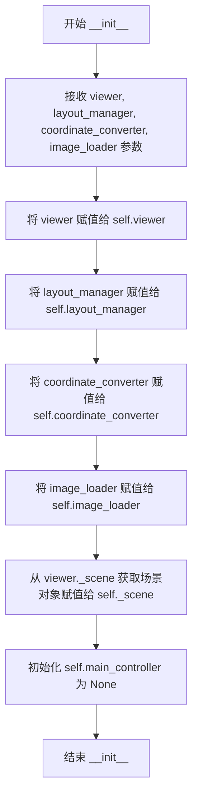

#### 带注释源码

```python
def __init__(self, viewer, layout_manager, coordinate_converter, image_loader):
    """
    初始化 TextItemManager 的构造函数
    
    参数:
        viewer: 查看器对象，提供场景访问和文本项添加功能
        layout_manager: 布局管理器，用于获取页面信息和场景边界计算
        coordinate_converter: 坐标转换器，处理页面本地坐标与场景坐标之间的转换
        image_loader: 图像加载器，提供图像文件路径列表和加载功能
    """
    # 存储查看器引用，用于访问场景和添加文本项
    self.viewer = viewer
    
    # 存储布局管理器引用，用于页面管理和场景边界计算
    self.layout_manager = layout_manager
    
    # 存储坐标转换器引用，用于坐标系统转换
    self.coordinate_converter = coordinate_converter
    
    # 存储图像加载器引用，用于获取图像文件路径
    self.image_loader = image_loader
    
    # 从查看器中获取场景对象，用于后续的项管理操作
    self._scene = viewer._scene
    
    # Main controller reference (set by scene item manager)
    # 主控制器引用，初始化为 None，由场景项管理器后续设置
    self.main_controller = None
```


### `TextItemManager.initialize`

该方法用于初始化或重置文本项目管理器（TextItemManager）的状态。在当前实现中，该方法为一个空的占位方法（pass），目前不执行任何实际初始化操作，但为未来可能的资源初始化或状态重置预留了接口。

参数：无

返回值：`None`（无返回值）

#### 流程图

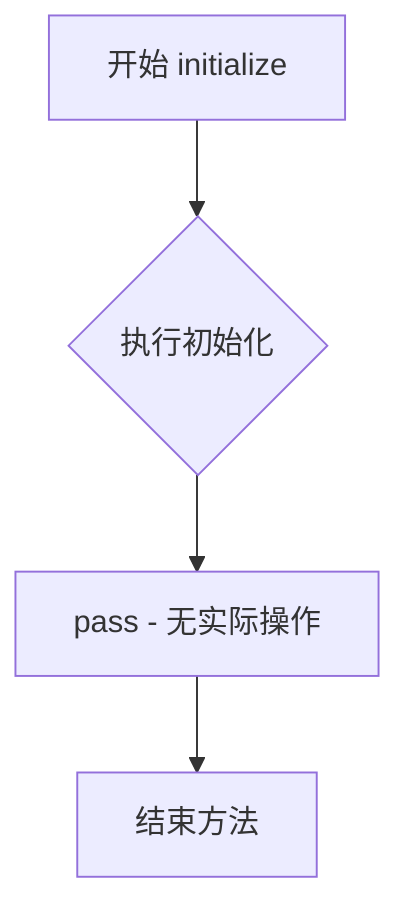

#### 带注释源码

```python
def initialize(self):
    """
    Initialize or reset the text item manager state.
    
    该方法用于初始化或重置文本项目管理器状态。
    当前实现为占位方法，不执行任何实际操作。
    
    预留接口目的：
    - 为未来可能需要的资源初始化预留扩展点
    - 允许在切换场景或重置应用状态时进行清理工作
    - 可在此处初始化缓存、临时变量或重置内部状态标志
    
    Args:
        None: 该方法不接受任何参数
        
    Returns:
        None: 该方法不返回任何值
    """
    pass  # 空实现，预留接口
```


### `TextItemManager.load_text_items`

加载指定页面的文本项目，将页面本地坐标转换为场景坐标后添加到查看器中。

参数：

- `state`：`dict`，包含查看器状态（viewer_state）和文本项目状态（text_items_state）的字典
- `page_idx`：`int`，要加载文本项目的页面索引

返回值：`None`，该方法不返回值，仅将文本项目添加到查看器中

#### 流程图

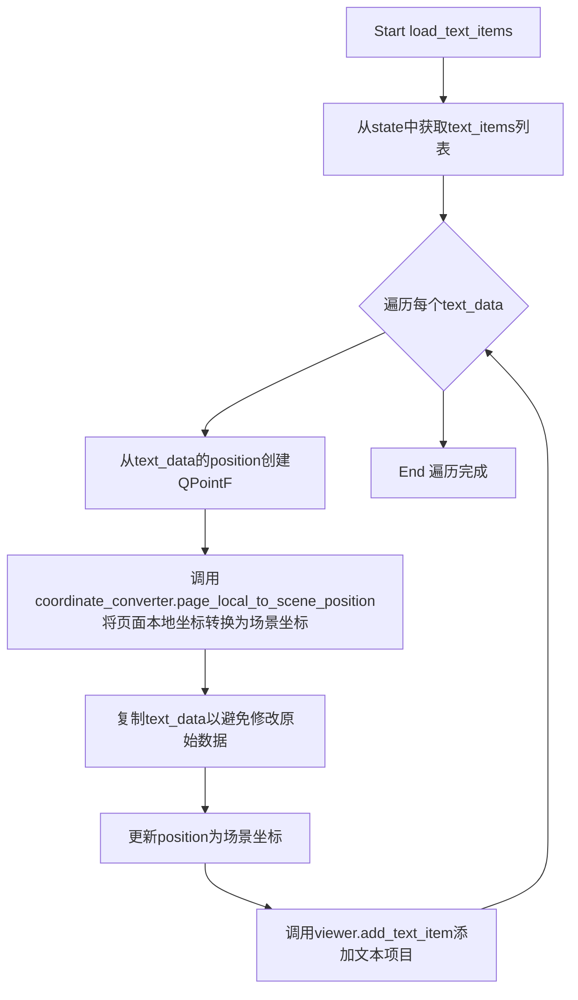

#### 带注释源码

```python
def load_text_items(self, state: dict, page_idx: int):
    """
    Load text items for a specific page.
    
    从状态字典中提取文本项目数据，将每个文本项目的位置从页面本地坐标
    转换为场景坐标，然后将其添加到查看器中显示。
    
    Args:
        state: 包含viewer_state和text_items_state的字典
        page_idx: 目标页面的索引
    
    Returns:
        None
    """
    # 从state中获取viewer_state，再从中获取text_items_state列表
    # 如果不存在则返回空列表
    text_items = state.get('viewer_state', {}).get('text_items_state', [])
    
    # 遍历该页面的所有文本项目数据
    for text_data in text_items:
        # 从text_data中提取position字段，创建QPointF对象
        # position存储为[x, y]格式
        page_local_pos = QPointF(*text_data['position'])
        
        # 使用坐标转换器将页面本地坐标转换为场景坐标
        # 这是必要的，因为场景中可能包含多个页面，需要统一的坐标系
        scene_pos = self.coordinate_converter.page_local_to_scene_position(page_local_pos, page_idx)
        
        # 复制text_data字典，避免修改原始状态数据
        text_data = text_data.copy()
        
        # 用转换后的场景坐标更新位置信息
        text_data['position'] = (scene_pos.x(), scene_pos.y())
        
        # 调用viewer的add_text_item方法创建并添加文本项目到场景中
        text_item = self.viewer.add_text_item(text_data)
```


### `TextItemManager.unload_text_items`

该方法负责将指定页面的文本项目从场景中卸载（保存并移除）。它遍历场景中的所有文本项目，筛选出位于当前页面范围内的项目，将场景坐标转换为页面本地坐标，使用 TextItemProperties 进行序列化后存储到状态中，最后从场景和查看器中移除这些文本项目。

参数：

- `page_idx`：`int`，页码索引，用于标识目标页面
- `page_y`：`float`，页面在场景中的Y坐标起始位置，用于判断文本项目是否在该页面范围内
- `page_bottom`：`float`，页面在场景中的Y坐标结束位置，用于判断文本项目是否在该页面范围内
- `file_path`：`str`，文件路径，用于将文本项目状态存储到对应的 image_states 中

返回值：`None`，该方法无返回值，通过修改内部状态完成数据持久化和场景清理

#### 流程图

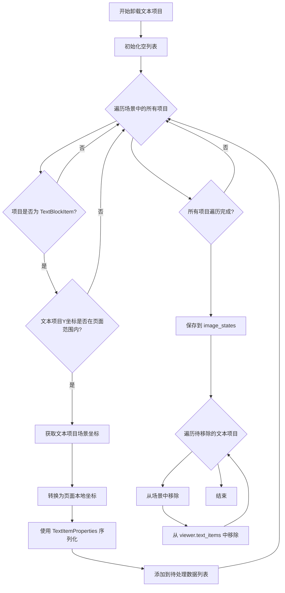

#### 带注释源码

```python
def unload_text_items(self, page_idx: int, page_y: float, page_bottom: float, file_path: str):
    """Unload text items for a specific page."""
    # 初始化用于存储待移除的文本项目对象和序列化数据的列表
    text_items_to_remove = []
    text_items_data = []
    
    # 遍历场景中的所有项目，筛选出属于当前页面的文本项目
    for item in self.viewer._scene.items():
        # 检查项目是否为 TextBlockItem 类型
        if isinstance(item, TextBlockItem):
            text_item = item
            # 获取文本项目的场景Y坐标
            text_y = text_item.pos().y()
            
            # 检查文本项目是否在当前页面范围内
            if text_y >= page_y and text_y < page_bottom:
                # 获取文本项目的场景坐标
                scene_pos = text_item.pos()
                # 将场景坐标转换为页面本地坐标
                page_local_pos = self.coordinate_converter.scene_to_page_local_position(scene_pos, page_idx)
                
                # 使用 TextItemProperties 进行一致的序列化
                text_props = TextItemProperties.from_text_item(text_item)
                # 覆盖位置信息，使用页面本地坐标
                text_props.position = (page_local_pos.x(), page_local_pos.y())
                
                # 转换为字典格式并添加到数据列表
                text_items_data.append(text_props.to_dict())
                # 添加到待移除列表
                text_items_to_remove.append(text_item)
    
    # 将文本项目数据存储到 image_states 的 viewer_state 中
    self.main_controller.image_states[file_path]['viewer_state']['text_items_state'] = text_items_data
    
    # 从场景和查看器列表中移除文本项目
    for text_item in text_items_to_remove:
        # 从图形场景中移除项目
        self._scene.removeItem(text_item)
        # 从 viewer 的文本项目列表中移除
        if text_item in self.viewer.text_items:
            self.viewer.text_items.remove(text_item)
```


### `TextItemManager.clear`

清除文本项目管理器的所有状态，用于重置或清理文本项管理。

参数：
- 无

返回值：`None`，无返回值描述（该方法目前为空实现）

#### 流程图

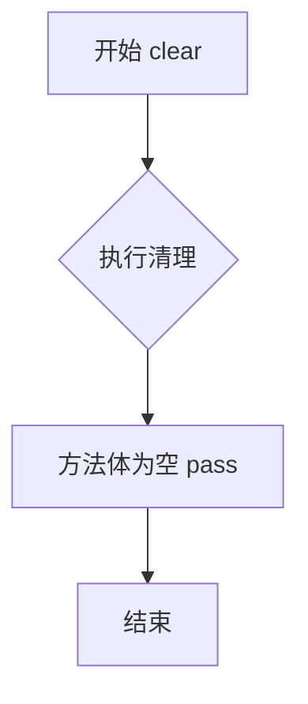

#### 带注释源码

```python
def clear(self):
    """Clear all text item management state."""
    pass
```


### `TextItemManager._split_text_by_lines`

该方法负责根据垂直裁剪比例将文本项的内容分割为特定行范围，同时保留富文本（HTML）格式。它通过计算行索引和字符位置，利用 Qt 的 `QTextCursor` API 精确提取格式化文本，适用于 Webtoon 模式下跨页面文本的垂直裁剪场景。

参数：

- `text_item`：`TextBlockItem`，Qt 文本项对象，包含完整的富文本文档
- `clip_ratios`：`dict`，包含 `top` 和 `bottom` 键的裁剪比例字典，值为 0.0-1.0 之间的浮点数，表示文本顶部和底部的保留比例

返回值：`str`，返回 HTML 格式的裁剪后文本内容，如果裁剪结果无意义则返回空字符串

#### 流程图

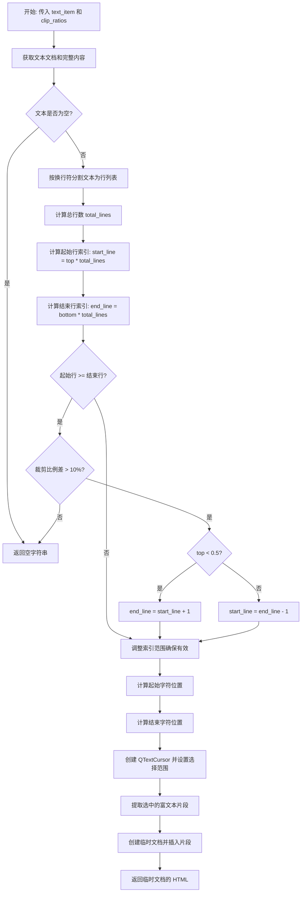

#### 带注释源码

```python
def _split_text_by_lines(self, text_item, clip_ratios: dict) -> str:
    """
    Split text content based on clipping ratios for vertical clipping.
    This handles line-based splitting while preserving rich text formatting.
    
    Args:
        text_item: TextBlockItem 对象，包含完整富文本
        clip_ratios: 字典，包含 'top' 和 'bottom' 裁剪比例 (0.0-1.0)
    
    Returns:
        str: HTML 格式的裁剪后文本内容
    """
    # 获取文本文档以使用 cursor 进行精确文本选择
    document = text_item.document()
    full_html = text_item.toHtml()  # 保留完整 HTML (当前未使用，可能用于未来扩展)
    full_text = document.toPlainText()  # 获取纯文本用于行分割计算
    
    # 按行分割纯文本，用于计算行范围
    lines = full_text.split('\n')
    if not lines:
        return ""  # 空文本直接返回空字符串
    
    # 根据 top/bottom 裁剪比例计算需要包含的行范围
    total_lines = len(lines)
    start_line = int(clip_ratios['top'] * total_lines)
    end_line = int(clip_ratios['bottom'] * total_lines)
    
    # 确保行索引有效，限制在合理范围内
    start_line = max(0, min(start_line, total_lines - 1))
    end_line = max(start_line, min(end_line, total_lines))
    
    # 处理边界情况：裁剪结果无有效行
    if start_line >= end_line:
        # 如果裁剪高度比例大于 10%，尝试至少包含一行
        if clip_ratios['bottom'] - clip_ratios['top'] > 0.1:
            if clip_ratios['top'] < 0.5:
                end_line = max(1, start_line + 1)  # 从顶部裁剪时向下扩展
            else:
                start_line = max(0, end_line - 1)  # 从底部裁剪时向上扩展
        else:
            return ""  # 文本部分太小，无意义
    
    # 计算所选行范围的字符位置
    # 累加前面所有行的长度（加1因为换行符）
    start_char_pos = sum(len(line) + 1 for line in lines[:start_line]) - (1 if start_line > 0 else 0)
    end_char_pos = sum(len(line) + 1 for line in lines[:end_line]) - 1
    
    # 使用 QTextCursor 选择并提取格式化文本
    cursor = QTextCursor(document)
    cursor.setPosition(start_char_pos)  # 设置选择起始位置
    cursor.setPosition(end_char_pos, QTextCursor.KeepAnchor)  # 设置结束位置并保持锚点
    
    # 创建新文档并插入选中的富文本片段
    temp_doc = QTextDocument()
    temp_cursor = QTextCursor(temp_doc)
    temp_cursor.insertFragment(cursor.selection())  # 保留原始格式插入
    
    return temp_doc.toHtml()  # 返回 HTML 格式的裁剪文本
```

#### 关键组件信息

| 组件名称 | 描述 |
|---------|------|
| `QTextDocument` | Qt 文档类，用于管理和操作富文本内容 |
| `QTextCursor` | Qt 文本光标类，提供精确的文本选择和片段提取能力 |
| `TextItemProperties` | 文本项属性类，用于序列化/反序列化文本数据（该方法间接使用） |

#### 潜在的技术债务或优化空间

1. **字符位置计算不精确**：当前使用纯文本计算字符位置，但富文本中 HTML 标签会占用实际字符位置，导致选区可能不准确。建议直接操作 `QTextBlock` 和 `QTextCursor` 的行级 API。

2. **未使用 `full_html` 变量**：方法中获取了 `full_html` 但未使用，表明可能存在遗留代码或未完成的逻辑。

3. **行索引边界处理复杂**：当前的边界调整逻辑（10% 阈值）较脆弱，建议封装为独立的边界处理函数。

4. **缺少单元测试**：该方法涉及复杂的文本处理逻辑，缺乏对应的单元测试覆盖。

5. **性能考虑**：频繁创建 `QTextDocument` 对象可能导致性能问题，尤其在处理大量文本项时。

#### 其它项目

**设计目标与约束**：
- **目标**：在 Webtoon 垂直滚动模式下，支持文本项跨页面时的垂直裁剪，保持富文本格式
- **约束**：依赖 Qt 的 `QTextDocument` 和 `QTextCursor` API，假设输入的 `text_item` 是 `TextBlockItem` 类型

**错误处理与异常设计**：
- 空文本返回空字符串
- 裁剪比例无效（过小）时返回空字符串
- 索引越界时通过 `min/max` 钳制到有效范围

**数据流与状态机**：
- 该方法是文本分割流程的一部分，被 `save_text_items_to_states` 调用
- 输入：原始 TextBlockItem + 裁剪比例
- 输出：HTML 格式的裁剪文本片段

**外部依赖与接口契约**：
- 依赖 `PySide6.QtGui` 中的 `QTextDocument` 和 `QTextCursor`
- 依赖 `text_item` 必须实现 `document()` 方法返回 `QTextDocument`
- `clip_ratios` 字典必须包含 `top` 和 `bottom` 键


### `TextItemManager._split_text_by_characters`

根据裁剪比例分割文本内容，用于水平裁剪场景。该方法在保持富文本格式的同时，尝试在单词边界处进行分割，以避免单词被不当截断。

参数：

- `text_item`：`TextBlockItem`，需要分割的文本项对象，提供文档和文本内容
- `clip_ratios`：`dict`，裁剪比例字典，包含 `left`（左）、`right`（右）、`top`（上）、`bottom`（下）四个比例值（0.0-1.0）

返回值：`str`，返回HTML格式的裁剪后文本内容

#### 流程图

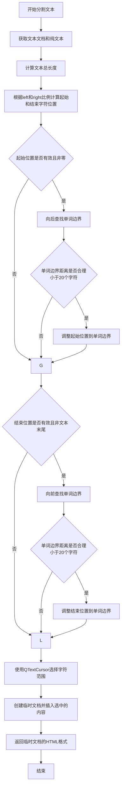

#### 带注释源码

```python
def _split_text_by_characters(self, text_item, clip_ratios: dict) -> str:
    """
    Split text content based on clipping ratios for horizontal clipping.
    This preserves word boundaries when possible while maintaining rich text formatting.
    """
    # 获取文本项的QTextDocument对象，用于处理富文本
    document = text_item.document()
    # 获取纯文本内容用于字符位置计算
    full_text = document.toPlainText()
    
    # 计算文本总长度
    text_length = len(full_text)
    # 根据裁剪比例计算起始和结束字符位置
    start_pos = int(clip_ratios['left'] * text_length)
    end_pos = int(clip_ratios['right'] * text_length)
    
    # 确保位置在有效范围内
    # 起始位置：0到文本长度之间
    start_pos = max(0, min(start_pos, text_length))
    # 结束位置：至少等于起始位置，最大为文本长度
    end_pos = max(start_pos, min(end_pos, text_length))
    
    # 如果起始位置大于等于结束位置，返回空字符串
    if start_pos >= end_pos:
        return ""
    
    # 如果不是从文本开头开始，尝试找到单词边界向后调整
    if start_pos > 0 and start_pos < text_length:
        # 从起始位置向后查找空格（单词边界）
        word_start = start_pos
        while word_start > 0 and not full_text[word_start - 1].isspace():
            word_start -= 1
        # 如果向后回溯的距离在合理范围内（小于20个字符），则使用单词边界
        if start_pos - word_start < 20:  # Reasonable limit
            start_pos = word_start
    
    # 如果不是到文本末尾，尝试找到单词边界向前调整
    if end_pos < text_length:
        # 从结束位置向前查找空格（单词边界）
        word_end = end_pos
        while word_end < text_length and not full_text[word_end].isspace():
            word_end += 1
        # 如果向前探索的距离在合理范围内，则使用单词边界
        if word_end - end_pos < 20:  # Reasonable limit
            end_pos = word_end
    
    # 使用QTextCursor精确选择字符范围内的富文本内容
    cursor = QTextCursor(document)
    # 设置选择起点
    cursor.setPosition(start_pos)
    # 设置选择终点，KeepAnchor参数保持选择范围
    cursor.setPosition(end_pos, QTextCursor.KeepAnchor)
    
    # 创建临时文档存储选中的内容
    temp_doc = QTextDocument()
    temp_cursor = QTextCursor(temp_doc)
    # 将选中的富文本片段插入临时文档
    temp_cursor.insertFragment(cursor.selection())
    
    # 返回临时文档的HTML格式内容
    return temp_doc.toHtml()
```


### `TextItemManager._create_clipped_text_data`

该方法用于根据原始文本数据创建一个适用于裁剪后文本的新数据字典，更新文本内容、位置和宽度信息。

参数：

- `self`：隐式参数，TextItemManager 实例本身
- `original_text_data`：`dict`，原始文本数据字典，包含文本的完整属性（如位置、样式、字体等）
- `clipped_text`：`str`，裁剪后的文本内容（HTML 格式）
- `clipped_position`：`tuple[float, float]`，裁剪后文本在场景中的位置坐标 (x, y)
- `clipped_size`：`tuple[float, float]`，裁剪后文本的尺寸 (width, height)

返回值：`dict`，更新后的文本数据字典，包含裁剪后的文本内容、位置和宽度

#### 流程图

```mermaid
flowchart TD
    A[开始] --> B[复制原始文本数据 original_text_data.copy]
    B --> C{更新 clipped_data 字典}
    C --> D[设置 text = clipped_text]
    C --> E[设置 position = clipped_position]
    C --> F[设置 width = clipped_size[0]]
    C --> G[返回 clipped_data]
    D --> G
    E --> G
    F --> G
    G --> H[结束]
    
    style A fill:#e1f5fe
    style H fill:#e1f5fe
    style G fill:#c8e6c9
```

#### 带注释源码

```python
def _create_clipped_text_data(self, original_text_data: dict, clipped_text: str, 
                             clipped_position: tuple[float, float], 
                             clipped_size: tuple[float, float]) -> dict:
    """
    Create a new text data dictionary for a clipped portion of text.
    
    此方法用于从原始文本数据创建一个适用于裁剪后文本的新数据字典。
    它保留原始数据的大部分属性，仅更新与裁剪相关的属性。
    
    Args:
        original_text_data: 原始文本数据字典，包含完整文本项的所有属性
        clipped_text: 裁剪后的文本内容（HTML 格式）
        clipped_position: 裁剪后文本在场景中的位置坐标 (x, y)
        clipped_size: 裁剪后文本的尺寸 (width, height)
    
    Returns:
        更新后的文本数据字典，包含裁剪后的文本、位置和宽度
    """
    # 复制原始数据以避免修改原始数据
    clipped_data = original_text_data.copy()
    
    # 更新数据字典中的文本内容、位置和宽度
    clipped_data.update({
        'text': clipped_text,                    # 更新为裁剪后的文本（HTML 格式）
        'position': clipped_position,             # 更新为裁剪后在场景中的位置
        'width': clipped_size[0],                # 更新为裁剪后的宽度
        # 注意：高度将在重新创建文本项时重新计算，因此不在此处设置
    })
    
    return clipped_data  # 返回更新后的数据字典
```


### `TextItemManager.save_text_items_to_states`

该函数负责将场景中的文本项保存到对应的页面状态中，支持跨页面文本的裁剪处理。当文本项跨越多个页面时，函数会计算裁剪比例并分割文本内容，确保每个页面只保存该页面可视区域内的文本。

参数：

- `scene_items_by_page`：`dict`，字典类型，键为页面索引，值为包含 `text_items` 列表的结构，用于存储各页面的文本项状态

返回值：`None`，该函数直接修改 `scene_items_by_page` 字典，不返回任何值

#### 流程图

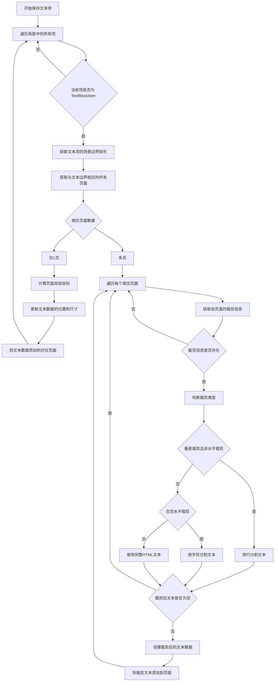

#### 带注释源码

```
def save_text_items_to_states(self, scene_items_by_page: dict):
    """
    保存文本项到适当的页面状态，支持裁剪。
    """
    # 遍历场景中的所有图形项
    for item in self.viewer._scene.items():
        # 只处理 TextBlockItem 类型的文本项
        if isinstance(item, TextBlockItem):
            text_item = item
            
            # 计算文本项在场景中的边界矩形
            # 包含位置和边界框的宽高
            text_scene_bounds = QRectF(
                text_item.pos().x(),          # 文本项的X坐标
                text_item.pos().y(),          # 文本项的Y坐标
                text_item.boundingRect().width(),   # 边界框宽度
                text_item.boundingRect().height()   # 边界框高度
            )
            
            # 获取与该文本边界相交的所有页面索引列表
            # 文本可能跨越多个页面
            intersecting_pages = self.layout_manager.get_pages_for_scene_bounds(text_scene_bounds)
            
            # 使用 TextItemProperties 创建基础文本属性
            # 确保序列化的一致性
            base_text_props = TextItemProperties.from_text_item(text_item)
            base_text_data = base_text_props.to_dict()
            
            # 确保 intersecting_pages 是列表格式
            # 可能是 set 或其他可迭代类型
            intersecting_pages_list = list(intersecting_pages) if isinstance(intersecting_pages, set) else intersecting_pages
            
            # 情况1：文本只在一个页面内，不需要裁剪
            if len(intersecting_pages_list) == 1:
                page_idx = intersecting_pages_list[0]
                
                # 验证页面索引有效性
                if 0 <= page_idx < len(self.image_loader.image_file_paths):
                    # 将场景坐标转换为页面局部坐标
                    scene_pos = text_item.pos()
                    page_local_pos = self.coordinate_converter.scene_to_page_local_position(scene_pos, page_idx)
                    
                    # 更新文本数据：使用页面局部坐标和实际尺寸
                    base_text_data.update({
                        'position': (page_local_pos.x(), page_local_pos.y()),
                        'width': text_item.boundingRect().width(),
                        'height': text_item.boundingRect().height()
                    })
                    
                    # 将文本数据添加到对应页面的文本项列表
                    scene_items_by_page[page_idx]['text_items'].append(base_text_data)
            
            # 情况2：文本跨越多个页面，需要裁剪和分割
            else:
                # 遍历文本覆盖的所有页面
                for page_idx in intersecting_pages_list:
                    # 验证页面索引有效性
                    if 0 <= page_idx < len(self.image_loader.image_file_paths):
                        # 获取该页面对文本的裁剪信息
                        clip_info = self.coordinate_converter.clip_text_item_to_page(text_item, page_idx)
                        
                        if clip_info:
                            # 从裁剪信息中提取裁剪比例
                            clip_ratios = clip_info['clip_ratios']
                            
                            # 判断裁剪类型：
                            # 垂直裁剪：top > 0.01 或 bottom < 0.99
                            vertical_clip = (clip_ratios['top'] > 0.01 or clip_ratios['bottom'] < 0.99)
                            # 水平裁剪：left > 0.01 或 right < 0.99
                            horizontal_clip = (clip_ratios['left'] > 0.01 or clip_ratios['right'] < 0.99)
                            
                            # 根据裁剪类型选择适当的分割方法
                            if vertical_clip and not horizontal_clip:
                                # 主要垂直裁剪 - 按行分割
                                # 保留富文本格式
                                clipped_text = self._split_text_by_lines(text_item, clip_ratios)
                            elif horizontal_clip:
                                # 包含水平裁剪 - 按字符分割
                                # 尽量在单词边界处分割
                                clipped_text = self._split_text_by_characters(text_item, clip_ratios)
                            else:
                                # 最小裁剪 - 使用完整文本
                                clipped_text = text_item.toHtml()
                            
                            # 验证裁剪后的文本是否有实际内容
                            # 需要排除仅有HTML标签的情况
                            if clipped_text.strip():
                                # 创建临时文档提取纯文本进行验证
                                temp_doc = QTextDocument()
                                temp_doc.setHtml(clipped_text)
                                
                                # 检查是否有实际文本内容
                                if temp_doc.toPlainText().strip():
                                    # 获取裁剪后的边界信息
                                    clipped_bounds = clip_info['clipped_bounds']
                                    
                                    # 创建裁剪后的文本数据字典
                                    clipped_text_data = self._create_clipped_text_data(
                                        base_text_data,
                                        clipped_text,
                                        (clipped_bounds[0], clipped_bounds[1]),  # 位置 (x, y)
                                        (clipped_bounds[2], clipped_bounds[3])   # 尺寸 (width, height)
                                    )
                                    
                                    # 将裁剪后的文本添加到对应页面
                                    scene_items_by_page[page_idx]['text_items'].append(clipped_text_data)
```


### `TextItemManager.redistribute_existing_text_items`

将已存在的文本项目重新分配到它们所跨越的所有页面，处理跨页面文本的裁剪和分割逻辑。

参数：

- `existing_text_items_by_page`：`dict`，键为页索引，值为该页的文本项目列表，表示待重新分配的现有文本项目
- `scene_items_by_page`：`dict`，键为页索引，值为包含 `text_items` 列表的字典，用于存储重新分配后的文本项目（输出参数）

返回值：`None`，该函数直接修改 `scene_items_by_page` 字典，不返回任何值

#### 流程图

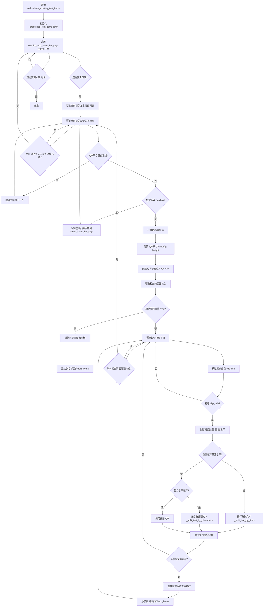

#### 带注释源码

```python
def redistribute_existing_text_items(self, existing_text_items_by_page: dict, scene_items_by_page: dict):
    """Redistribute existing text items to all pages they intersect with after clipping."""
    # 使用集合跟踪已处理的文本项目，避免重复处理
    processed_text_items = set()  # Track processed text items to avoid duplicates
    
    # 遍历每一页的现有文本项目
    for original_page_idx, text_items in existing_text_items_by_page.items():
        for text_item_data in text_items:
            # 为文本项目创建唯一标识符以避免重复
            # 使用 id() 获取对象的内存地址作为唯一标识
            text_id = id(text_item_data)
            if text_id in processed_text_items:
                continue
            processed_text_items.add(text_id)
            
            # 检查文本项目数据是否有效（必须包含 position 字段）
            if 'position' not in text_item_data:
                # 将无效文本项目保留在原页
                scene_items_by_page[original_page_idx]['text_items'].append(text_item_data)
                continue
            
            # ========== 坐标转换 ==========
            # 将页面局部坐标转换为场景坐标
            # page_local_to_scene_position: 将文本在单页内的相对位置转换为整个场景中的绝对位置
            local_x, local_y = text_item_data['position']
            scene_pos = self.coordinate_converter.page_local_to_scene_position(QPointF(local_x, local_y), original_page_idx)
            
            # ========== 尺寸估算 ==========
            # 估算文本尺寸（宽度已存储，高度需要根据字体大小和行数估算）
            text_width = text_item_data.get('width', 100)  # fallback width
            # 基于字体大小和行数的粗略高度估算
            font_size = text_item_data.get('font_size', 12)
            text_content = text_item_data.get('text', '')
            # 计算行数：换行符数量 + 1，最少为1行
            line_count = max(1, text_content.count('\n') + 1) if isinstance(text_content, str) else 1
            # 估算高度：字体大小 × 行数 × 行间距
            estimated_height = font_size * line_count * text_item_data.get('line_spacing', 1.2)
            
            # ========== 场景边界计算 ==========
            # 创建文本项目的场景边界矩形，用于确定与哪些页面相交
            text_scene_bounds = QRectF(scene_pos.x(), scene_pos.y(), text_width, estimated_height)
            # get_pages_for_scene_bounds: 根据场景边界获取所有相交的页面索引
            intersecting_pages = self.layout_manager.get_pages_for_scene_bounds(text_scene_bounds)
            
            # ========== 创建模拟文本项目 ==========
            # 为裁剪计算创建模拟文本项对象（因为实际 TextBlockItem 可能不存在于场景中）
            class MockTextItem:
                """模拟文本项类，用于在重新分配时进行裁剪计算"""
                def __init__(self, x, y, width, height, text_data):
                    self._pos = QPointF(x, y)
                    self._bounding_rect = QRectF(0, 0, width, height)
                    self._text_data = text_data
                    # 创建 QTextDocument 以支持 HTML 内容
                    self._document = QTextDocument()
                    # 设置文本为 HTML 以保留格式
                    text_content = text_data.get('text', '')
                    if text_content:
                        self._document.setHtml(text_content)
                
                def pos(self):
                    return self._pos
                
                def boundingRect(self):
                    return self._bounding_rect
                
                def document(self):
                    return self._document
                
                def toHtml(self):
                    return self._document.toHtml()
                
                def rotation(self):
                    return self._text_data.get('rotation', 0.0)
                
                def scale(self):
                    return self._text_data.get('scale', 1.0)
                
                def transformOriginPoint(self):
                    origin = self._text_data.get('transform_origin', (0, 0))
                    return QPointF(origin[0], origin[1])
            
            # 实例化模拟文本项
            mock_text_item = MockTextItem(scene_pos.x(), scene_pos.y(), text_width, estimated_height, text_item_data)
            
            # 将相交页面转换为列表（可能是 set 或 list）
            intersecting_pages_list = list(intersecting_pages) if isinstance(intersecting_pages, set) else intersecting_pages
            
            # ========== 单页面情况 ==========
            # 如果文本只与一个页面相交，无需裁剪
            if len(intersecting_pages_list) == 1:
                page_idx = intersecting_pages_list[0]
                if 0 <= page_idx < len(self.image_loader.image_file_paths):
                    # 转换回目标页的局部坐标
                    target_page_local_pos = self.coordinate_converter.scene_to_page_local_position(scene_pos, page_idx)
                    clipped_text_data = text_item_data.copy()
                    clipped_text_data['position'] = (target_page_local_pos.x(), target_page_local_pos.y())
                    scene_items_by_page[page_idx]['text_items'].append(clipped_text_data)
            else:
                # ========== 多页面情况 - 需要裁剪和分割 ==========
                # 文本跨越多个页面，需要裁剪并分割
                for page_idx in intersecting_pages_list:
                    if 0 <= page_idx < len(self.image_loader.image_file_paths):
                        # clip_text_item_to_page: 计算文本项在指定页面边界内的裁剪信息
                        clip_info = self.coordinate_converter.clip_text_item_to_page(mock_text_item, page_idx)
                        if clip_info:
                            # 使用文本项管理器的分割逻辑
                            # 获取裁剪比例：top/bottom/left/right 表示裁剪区域的比例
                            clip_ratios = clip_info['clip_ratios']
                            vertical_clip = (clip_ratios['top'] > 0.01 or clip_ratios['bottom'] < 0.99)
                            horizontal_clip = (clip_ratios['left'] > 0.01 or clip_ratios['right'] < 0.99)
                            
                            # 根据裁剪类型选择合适的分割方法
                            if vertical_clip and not horizontal_clip:
                                # 主要是垂直裁剪 - 按行分割（保持文本格式）
                                clipped_text = self._split_text_by_lines(mock_text_item, clip_ratios)
                            elif horizontal_clip:
                                # 涉及水平裁剪 - 按字符分割（更复杂，需要处理单词边界）
                                clipped_text = self._split_text_by_characters(mock_text_item, clip_ratios)
                            else:
                                # 最小裁剪 - 使用完整文本
                                clipped_text = text_item_data.get('text', '')
                            
                            # ========== 内容验证 ==========
                            # 只有在有意义的文本内容时才添加
                            # 对于 HTML 内容，需要检查是否有实际文本，而不仅仅是 HTML 标签
                            if clipped_text.strip():
                                # 创建临时文档以提取纯文本进行验证
                                temp_doc = QTextDocument()
                                temp_doc.setHtml(clipped_text)
                                # 检查是否有实际文本内容
                                if temp_doc.toPlainText().strip():
                                    # 获取裁剪后的边界
                                    clipped_bounds = clip_info['clipped_bounds']
                                    # 创建裁剪后的文本数据字典
                                    clipped_text_data = self._create_clipped_text_data(
                                        text_item_data,
                                        clipped_text,
                                        (clipped_bounds[0], clipped_bounds[1]),  # position
                                        (clipped_bounds[2], clipped_bounds[3])   # size
                                    )
                                    scene_items_by_page[page_idx]['text_items'].append(clipped_text_data)
```


### `TextItemManager._get_plain_text`

从可能的 HTML 内容中提取纯文本，去除所有 HTML 标签并返回干净的文本字符串。

参数：

-  `text`：`str`，需要处理的输入文本，可能是 HTML 格式或纯文本

返回值：`str`，提取后的纯文本字符串，如果输入为空则返回空字符串

#### 流程图

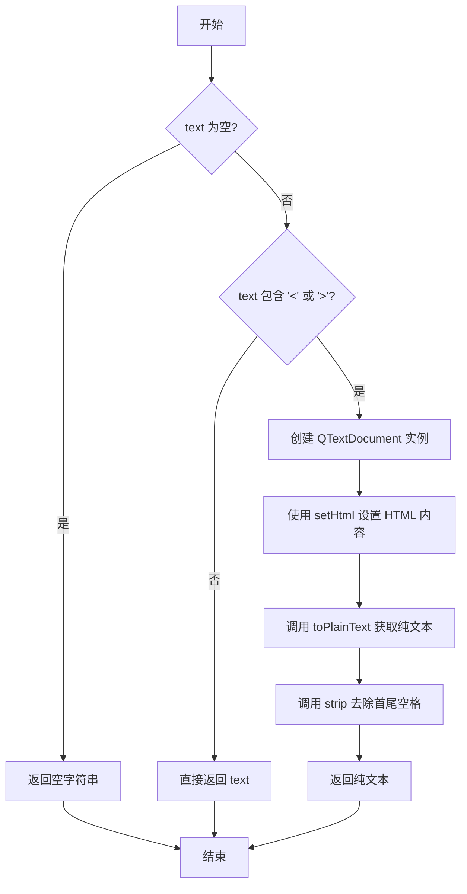

#### 带注释源码

```
def _get_plain_text(self, text):
    """Extract plain text from potential HTML content."""
    # 参数检查：如果输入为空，直接返回空字符串
    if not text:
        return ""
    
    # 快速检查：判断是否包含 HTML 标签
    # 如果不包含 '<' 或 '>' 符号，则认为是纯文本，直接返回
    # 这种快速检查可以避免不必要的 QTextDocument 创建开销
    if '<' not in text or '>' not in text:
        return text
        
    # 包含 HTML 标签，使用 QTextDocument 解析 HTML
    # QTextDocument 是 Qt 的富文本文档类，可以正确解析 HTML
    doc = QTextDocument()
    
    # 将 HTML 内容设置到文档中
    # 这会解析 HTML 标签并构建内部文档结构
    doc.setHtml(text)
    
    # 从文档中提取纯文本（去除所有 HTML 标签和格式）
    # 然后去除首尾空白字符
    return doc.toPlainText().strip()
```


### `TextItemManager.is_duplicate_text_item`

检查新文本项是否与现有文本项重复（基于位置、角度和文本内容的相似性）。

参数：

- `new_text_item`：`dict`，待检测的新文本项数据，包含位置、文本内容、宽度、旋转角度等属性
- `existing_text_items`：`list[dict]`，已存在的文本项列表，用于比对是否重复
- `margin`：`int`，位置匹配的容差范围（默认为5像素）

返回值：`bool`，如果新文本项与现有文本项重复则返回 `True`，否则返回 `False`

#### 流程图

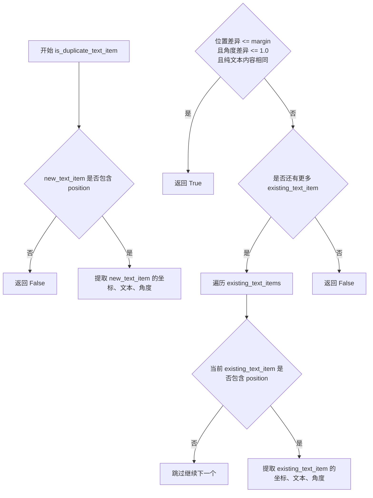

#### 带注释源码

```python
def is_duplicate_text_item(self, new_text_item, existing_text_items, margin=5):
    """
    检查新文本项是否与任何现有文本项重复（基于位置容差）。
    
    比较逻辑：
    1. 位置在 margin 像素范围内
    2. 旋转角度差异 <= 1.0 度
    3. 纯文本内容完全匹配（忽略 HTML 样式差异）
    
    注意：宽度差异不作为判断条件，因为样式变化（如加粗）可能导致宽度变化，
    但实际内容相同仍应视为重复项。
    """
    # 如果新文本项没有位置信息，直接返回非重复
    if 'position' not in new_text_item:
        return False
        
    # 提取新文本项的属性
    new_x, new_y = new_text_item['position']
    new_raw_text = new_text_item.get('text', '')
    # 将 HTML 格式文本转换为纯文本进行比较，忽略样式差异
    new_plain_text = self._get_plain_text(new_raw_text)
    
    new_width = new_text_item.get('width', 0)
    new_angle = new_text_item.get('rotation', 0)
    
    # 遍历所有现有文本项进行比对
    for existing_text_item in existing_text_items:
        # 跳过没有位置信息的文本项
        if 'position' not in existing_text_item:
            continue
            
        # 提取现有文本项的属性
        ex_x, ex_y = existing_text_item['position']
        ex_raw_text = existing_text_item.get('text', '')
        ex_plain_text = self._get_plain_text(ex_raw_text)
        
        ex_width = existing_text_item.get('width', 0)
        ex_angle = existing_text_item.get('rotation', 0)    
        
        # 判断条件：
        # 1. X 坐标差异在容差范围内
        # 2. Y 坐标差异在容差范围内
        # 3. 旋转角度差异 <= 1.0 度
        # 4. 纯文本内容完全匹配（比较原始文本而非 HTML）
        if (abs(new_x - ex_x) <= margin and 
            abs(new_y - ex_y) <= margin and 
            abs(new_angle - ex_angle) <= 1.0 and
            (new_plain_text == ex_plain_text)):
            
            # 所有条件满足，判定为重复文本项
            # 注意：即使宽度不同，只要文本内容相同就认为是同一项
            # 因为样式变化（如加粗、斜体）可能显著改变宽度
            return True
            
        # 如果纯文本不匹配，即使其他属性相同也不能确定是重复项
        # 严格依赖文本内容匹配
    
    # 遍历完毕未找到重复项
    return False
```


### `TextItemManager.merge_clipped_text_items`

该方法负责在常规模式下合并那些因跨页面边界而被裁剪的文本项目。它遍历所有页面的文本项目，识别具有相似属性（如字体、颜色、大小）且在场景中垂直相邻的项目组，然后将它们重新合并为单个文本项目，以恢复被裁剪前的完整性。

参数： 无（仅使用实例的 `self` 属性）

返回值：`None`，该方法直接修改 `main_controller.image_states` 中的文本项目数据，不返回任何值

#### 流程图

```mermaid
flowchart TD
    A[开始 merge_clipped_text_items] --> B{self.main_controller 是否存在?}
    B -->|否| C[直接返回]
    B -->|是| D[初始化空列表 all_text_items]
    
    D --> E[遍历所有页面: for page_idx in range(len(image_file_paths))]
    E --> F[获取当前页面的文件路径和状态]
    F --> G[获取文本项目列表 text_items_state]
    
    G --> H[遍历当前页面的每个文本项目]
    H --> I[将页面局部坐标转换为场景坐标]
    I --> J[构建文本项目数据字典并添加到 all_text_items]
    J --> K{还有更多页面?}
    K -->|是| E
    K -->|否| L{len(all_text_items) < 2?}
    
    L -->|是| C
    L -->|否| M[初始化 merged_groups 和 used_items]
    
    M --> N[外层遍历: for i, item1 in enumerate]
    N --> O{当前项已被使用?}
    O -->|是| P[跳过继续]
    O -->|否| Q[创建新组 group = [item1]]
    Q --> R[内层遍历: for j, item2 in enumerate]
    
    R --> S{item2 未被使用且不是自身?}
    S -->|否| T[继续下一个 item2]
    S -->|是| U{_are_text_items_mergeable?}
    U -->|是| V[将 item2 添加到 group]
    V --> W[标记 j 为已使用]
    W --> T
    U -->|否| T
    
    T --> X{内层遍历结束?}
    X -->|否| R
    X -->|是| Y{len(group) > 1?}
    
    Y -->|否| Z[继续下一个外层项]
    Y -->|是| AA[打印合并组信息]
    AA --> AB[将 group 添加到 merged_groups]
    AB --> Z
    
    Z --> AC{外层遍历结束?}
    AC -->|否| N
    AC -->|是| AD[遍历每个合并组]
    
    AD --> AE[_merge_text_item_group(group)]
    AE --> AF[结束]
```

#### 带注释源码

```python
def merge_clipped_text_items(self):
    """Merge text items that were clipped across page boundaries in regular mode."""
    # 检查主控制器是否存在，如果不存在则无法进行合并操作
    if not self.main_controller:
        return
        
    # 用于存储所有页面中文本项目的列表，每个元素包含数据、页面索引和场景坐标信息
    all_text_items = []
    
    # 遍历所有页面收集文本项目
    for page_idx in range(len(self.image_loader.image_file_paths)):
        # 获取当前页面对应的文件路径
        file_path = self.image_loader.image_file_paths[page_idx]
        # 从主控制器的图像状态中获取该页面的状态字典
        state = self.main_controller.image_states.get(file_path, {})
        # 获取文本项目列表
        text_items = state.get('viewer_state', {}).get('text_items_state', [])
        
        # 遍历当前页面的每个文本项目
        for text_item in text_items:
            # 将页面局部坐标转换为场景坐标用于后续比较
            local_pos = QPointF(text_item['position'][0], text_item['position'][1])
            scene_pos = self.coordinate_converter.page_local_to_scene_position(local_pos, page_idx)
            
            # 构建包含完整信息的文本项目字典
            all_text_items.append({
                'data': text_item,                          # 原始文本项目数据
                'page_idx': page_idx,                       # 所属页面索引
                'scene_pos': scene_pos,                     # 场景坐标位置
                'scene_bounds': QRectF(                      # 场景中的边界矩形
                    scene_pos.x(), 
                    scene_pos.y(),
                    text_item.get('width', 100),           # 宽度，默认100
                    text_item.get('height', 50)             # 高度，默认50
                )
            })
    
    # 如果文本项目少于2个，无法进行合并操作
    if len(all_text_items) < 2:
        return  # Need at least 2 items to merge
        
    # 用于存储可合并的项目组和已处理项目的集合
    merged_groups = []
    used_items = set()
    
    # 外层循环：遍历所有文本项目以查找可合并的组
    for i, item1 in enumerate(all_text_items):
        # 跳过已处理的项目
        if i in used_items:
            continue
            
        # 初始化一个新组，包含当前项目
        group = [item1]
        used_items.add(i)
        
        # 内层循环：查找与当前项目可合并的其他项目
        for j, item2 in enumerate(all_text_items):
            # 跳过已使用项目或自身
            if j in used_items or i == j:
                continue
                
            # 检查两个项目是否可合并
            if self._are_text_items_mergeable(item1, item2, group):
                group.append(item2)
                used_items.add(j)
        
        # 只有包含多个项目的组才需要处理（可能是被裁剪的项目）
        if len(group) > 1:
            merged_groups.append(group)
            print(f"Found mergeable text group with {len(group)} items")
    
    # 对每个可合并的组执行合并操作
    for group in merged_groups:
        self._merge_text_item_group(group)
```


### `TextItemManager._are_text_items_mergeable`

该方法用于检查两个文本项是否可以合并（判断它们是否是同一原始文本项在普通模式下被裁剪后的部分）。通过比较文本项的页码位置、相邻性、样式属性（字体、大小、颜色等）以及水平对齐情况，来决定是否可以将它们视为同一个被裁剪的文本项。

参数：

- `item1`：`dict`，第一个文本项的数据结构，包含 `page_idx`、`scene_pos`、`scene_bounds`、`data` 等键
- `item2`：`dict`，第二个待测试的文本项的数据结构，包含 `page_idx`、`scene_pos`、`scene_bounds`、`data` 等键
- `existing_group`：`list`，已存在的文本项组列表，用于参考比较

返回值：`bool`，如果两个文本项可以合并则返回 `True`，否则返回 `False`

#### 流程图

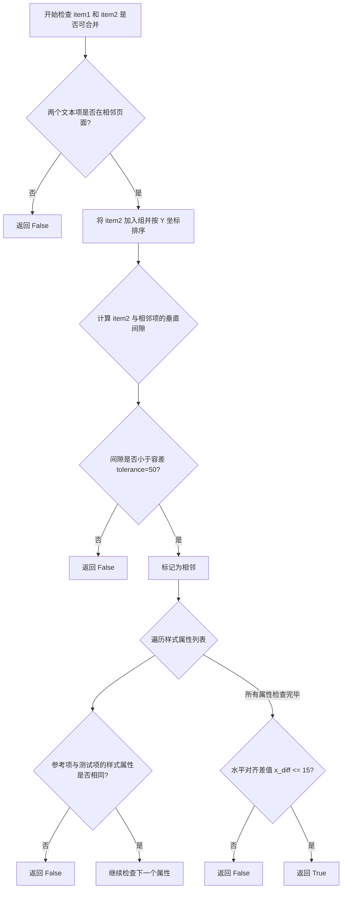

#### 带注释源码

```python
def _are_text_items_mergeable(self, item1, item2, existing_group):
    """
    检查两个文本项是否可以合并（判断它们是否是同一原始文本项在普通模式下被裁剪后的部分）。
    
    该方法用于合并被裁剪到不同页面的文本项，通过比较它们的位置、样式来判断是否来自同一个原始文本项。
    只有来自相邻页面、位置相邻、样式一致的文本项才会被认定为可合并。
    
    Args:
        item1: 第一个文本项的字典数据结构，包含 page_idx、scene_pos、scene_bounds、data 等键
        item2: 第二个待测试的文本项的字典数据结构
        existing_group: 已存在的文本项组列表，用于参考比较
    
    Returns:
        bool: 如果两个文本项可以合并则返回 True，否则返回 False
    """
    
    # 首先检查两个文本项是否在相邻页面上（这对于被裁剪的文本项非常重要）
    # 获取参考组的第一个项的页码作为基准页码
    ref_page = existing_group[0]['page_idx']
    # 获取待测试项的页码
    test_page = item2['page_idx']
    # 必须来自相邻页面（页码差为1）才能进行后续合并检查
    if abs(ref_page - test_page) != 1:  # Must be from adjacent pages
        return False
    
    # 对组合后的组按 Y 坐标排序，以便检查垂直方向上的相邻性
    group_sorted = sorted(existing_group + [item2], key=lambda x: x['scene_pos'].y())
    # 找到 item2 在排序后列表中的索引位置
    item2_index = next(i for i, item in enumerate(group_sorted) if item == item2)

    # 设置容差值以处理网页布局中的页面间隙
    tolerance = 50  
    is_adjacent = False
    
    # 检查 item2 与其前一个项的垂直相邻性
    if item2_index > 0:
        prev_item = group_sorted[item2_index - 1]
        # 计算前一个项的底部 Y 坐标（场景坐标）
        prev_bottom = prev_item['scene_pos'].y() + prev_item['data'].get('height', 50)
        # 获取 item2 的顶部 Y 坐标
        item2_top = item2['scene_pos'].y()
        # 计算垂直间隙
        gap = abs(prev_bottom - item2_top)
        # 如果间隙小于容差值，则认为两项目垂直相邻
        if gap < tolerance:
            is_adjacent = True
            
    # 检查 item2 与其后一个项的垂直相邻性
    if item2_index < len(group_sorted) - 1:
        next_item = group_sorted[item2_index + 1]
        # 计算 item2 的底部 Y 坐标
        item2_bottom = item2['scene_pos'].y() + item2['data'].get('height', 50)
        # 获取后一个项的顶部 Y 坐标
        next_top = next_item['scene_pos'].y()
        # 计算垂直间隙
        gap = abs(item2_bottom - next_top)
        # 如果间隙小于容差值，则认为两项目垂直相邻
        if gap < tolerance:
            is_adjacent = True
    
    # 如果 item2 与组中的任何项都不垂直相邻，则不能合并
    if not is_adjacent:
        return False
    
    # 检查样式相似性（被裁剪的文本项应该具有相同的样式）
    # 获取参考组的第一个项的数据
    ref_item = existing_group[0]['data']
    # 获取待测试项的数据
    test_item = item2['data']
    
    # 定义需要检查的样式属性列表
    style_attrs = ['font_family', 'font_size', 'bold', 'italic', 'text_color', 'outline_color']
    # 遍历每个样式属性进行比对
    for attr in style_attrs:
        # 如果任何样式属性不匹配，则不能合并
        if ref_item.get(attr) != test_item.get(attr):
            return False
            
    # 检查水平对齐（被裁剪的文本项应该有非常相似的 X 坐标位置）
    # 获取参考项的 X 坐标
    ref_x = existing_group[0]['scene_pos'].x()
    # 获取测试项的 X 坐标
    test_x = item2['scene_pos'].x()
    
    # 对裁剪项使用严格的对齐检查
    x_diff = abs(ref_x - test_x)
    # 水平位置差必须小于等于 15 像素才能合并
    if x_diff > 15:  
        return False
        
    # 所有检查都通过，两个文本项可以被视为同一原始项的裁剪部分，可以合并
    return True
```


### `TextItemManager._merge_text_item_group`

该函数用于将一组被分割的文本项（clipped text items）合并回一个完整的文本项。它是 Webtoon 场景中处理跨页面文本分割的核心逻辑，通过分析场景坐标、合并 HTML 格式文本、计算合并后的边界，并更新状态管理器中的文本数据。

参数：

-  `group`：`List[Dict]`，包含文本项数据的列表，每个元素是一个字典，包含 `data`（文本数据）、`page_idx`（页索引）、`scene_pos`（场景坐标 QPointF）和 `scene_bounds`（场景边界 QRectF）

返回值：`None`，该方法直接修改 `main_controller.image_states` 中的文本状态，不返回任何值

#### 流程图

```mermaid
flowchart TD
    A[开始 _merge_text_item_group] --> B{检查 group 长度<br/>len(group) <= 1?}
    B -->|是| C[直接返回]
    B -->|否| D[按 Y 坐标排序 group]
    D --> E[获取顶部文本项作为基础项]
    E --> F[提取所有文本片段并合并]
    F --> G[计算合并后的边界<br/>top_y, bottom_y, left_x, right_x]
    G --> H[计算中心 Y 坐标确定目标页]
    H --> I[将场景坐标转换回页面局部坐标]
    I --> J[更新基础文本项数据<br/>text, position, width, height]
    J --> K[从原始页面移除所有被分割的文本项]
    K --> L[将合并后的文本项添加到目标页面]
    L --> M[结束]
```

#### 带注释源码

```
def _merge_text_item_group(self, group):
    """
    Merge a group of clipped text items back into one.
    
    This method is called after text items have been clipped across page boundaries
    in regular (non-webtoon) mode. It reconstructs the original text item by:
    1. Sorting items by vertical position
    2. Merging text content (preserving HTML formatting)
    3. Computing unified bounding box
    4. Redistributing to the appropriate target page
    """
    # If group has 1 or fewer items, no merge needed
    if len(group) <= 1:
        return
        
    # Sort by Y position to maintain reading order
    # This ensures text flows correctly after merging
    group_sorted = sorted(group, key=lambda x: x['scene_pos'].y())
    
    # Use the topmost item as the base for merged properties
    # This preserves styling attributes from the original item
    base_item = group_sorted[0]
    base_data = base_item['data'].copy()
    
    # Merge text content while preserving HTML formatting
    # Extract text from each fragment and combine them
    merged_text = self._merge_text_content([item['data'].get('text', '') for item in group_sorted])
    
    # Calculate merged bounding box in scene coordinates
    # Find minimum top Y and maximum bottom Y across all items
    top_y = min(item['scene_pos'].y() for item in group_sorted)
    bottom_y = max(item['scene_pos'].y() + item['data'].get('height', 50) for item in group_sorted)
    
    # Find minimum left X and maximum right X
    left_x = min(item['scene_pos'].x() for item in group_sorted)
    right_x = max(item['scene_pos'].x() + item['data'].get('width', 100) for item in group_sorted)
    
    # Determine which page this merged item should belong to
    # Use the center Y position to find the appropriate page
    center_y = (top_y + bottom_y) / 2
    target_page = self.layout_manager.get_page_at_position(center_y)
    
    # Convert back to page-local coordinates for storage
    # The text item is stored relative to its page, not scene coordinates
    scene_pos = QPointF(left_x, top_y)
    local_pos = self.coordinate_converter.scene_to_page_local_position(scene_pos, target_page)
    
    # Update merged item data with combined text and computed dimensions
    base_data.update({
        'text': merged_text,
        'position': (local_pos.x(), local_pos.y()),
        'width': right_x - left_x,
        'height': bottom_y - top_y
    })
    
    # Remove all items from their current pages
    # This cleans up the clipped fragments that are being replaced
    for item in group:
        page_idx = item['page_idx']
        # Get file path for this page to access state
        file_path = self.image_loader.image_file_paths[page_idx]
        state = self.main_controller.image_states[file_path]
        text_items = state['viewer_state']['text_items_state']
        
        # Remove this specific item from the page's text items list
        # Using list comprehension to filter out the item
        text_items[:] = [ti for ti in text_items if ti != item['data']]
    
    # Add merged item to target page
    # The merged item replaces all the clipped fragments
    target_file_path = self.image_loader.image_file_paths[target_page]
    target_state = self.main_controller.image_states[target_file_path]
    target_state['viewer_state']['text_items_state'].append(base_data)
```


### `TextItemManager._merge_text_content`

该方法负责将多个文本片段合并为一个完整的文本字符串。它首先判断所有片段是否为纯文本，若为纯文本则直接拼接；若包含HTML富文本，则利用Qt的文档对象模型（QTextDocument）逐个提取并合并片段内容，以保留各片段原有的格式样式。

参数：

- `text_fragments`：`List[str]`，待合并的文本片段列表，每个元素可以是纯文本字符串或包含HTML标签的富文本字符串。

返回值：`str`，合并后的文本内容。如果输入为空则返回空字符串；如果所有输入均为纯文本则返回拼接后的纯文本；否则返回合并后的HTML字符串。

#### 流程图

```mermaid
flowchart TD
    A([开始 _merge_text_content]) --> B{text_fragments 是否为空?}
    B -- 是 --> C[返回空字符串 ""]
    B -- 否 --> D{所有片段是否为纯文本?}
    D -- 是 --> E[直接用换行符 '\n' 拼接]
    E --> F([返回拼接后的纯文本])
    D -- 否 --> G[创建 QTextDocument 和 QTextCursor]
    G --> H[遍历 text_fragments 中的每个片段]
    H --> I{当前片段是否为 HTML?}
    I -- 是 --> J[创建临时 QTextDocument]
    J --> K[解析 HTML 并提取格式化内容片段]
    K --> L[通过光标插入格式化的片段]
    I -- 否 --> M[通过光标插入纯文本]
    L --> N{是否还有更多片段?}
    M --> N
    N -- 是 --> H
    N -- 否 --> O[返回 merged_doc.toHtml()]
    F --> O
```

#### 带注释源码

```python
def _merge_text_content(self, text_fragments):
    """合并文本片段，同时保留HTML格式。"""
    # 1. 边界检查：如果没有文本片段，则直接返回空字符串
    if not text_fragments:
        return ""
        
    # 2. 纯文本处理：如果所有片段都是纯文本（不包含HTML标签），则直接用换行符拼接
    if all(not self._is_html(text) for text in text_fragments):
        return '\n'.join(text_fragments)
    
    # 3. 富文本处理：使用Qt的QTextDocument合并HTML内容，以尝试保留格式
    merged_doc = QTextDocument()
    cursor = QTextCursor(merged_doc)
    
    # 遍历每个文本片段进行合并
    for i, fragment in enumerate(text_fragments):
        
        # 注意：此处注释掉了在片段之间插入换行符的逻辑。
        # 当前的逻辑是紧凑合并，或者依赖于HTML片段内部已包含的换行结构。
        # if i > 0:
        #     cursor.insertText('\n')  # Add line break between fragments
            
        if self._is_html(fragment):
            # 如果是HTML格式：创建一个临时的QTextDocument来解析该HTML
            temp_doc = QTextDocument()
            temp_doc.setHtml(fragment)
            temp_cursor = QTextCursor(temp_doc)
            # 选中文档的全部内容
            temp_cursor.select(QTextCursor.SelectionType.Document)
            # 将选中的格式化内容片段（保留字体、颜色等样式）插入到主游标位置
            cursor.insertFragment(temp_cursor.selection())
        else:
            # 如果是纯文本：直接插入文本
            cursor.insertText(fragment)
    
    # 返回合并后的HTML字符串
    return merged_doc.toHtml()
```


### `TextItemManager._is_html`

检查给定的文本是否包含 HTML 标签，用于判断文本内容是否为 HTML 格式，以便在文本合并时选择合适的处理方式。

参数：

- `text`：`str`，需要检查的文本内容

返回值：`bool`，如果文本包含 HTML 标签返回 `True`，否则返回 `False`

#### 流程图

```mermaid
flowchart TD
    A[开始: 输入文本] --> B{检查文本是否包含<br/>HTML标签模式<br/>r'<[^>]+>'}
    B -->|找到匹配| C[返回 True]
    B -->|未找到匹配| D[返回 False]
```

#### 带注释源码

```
def _is_html(self, text):
    """
    检查文本是否包含 HTML 标签。
    
    Args:
        text (str): 需要检查的文本内容
        
    Returns:
        bool: 如果文本包含 HTML 标签返回 True，否则返回 False
    """
    import re  # 导入正则表达式模块用于模式匹配
    return bool(re.search(r'<[^>]+>', text))  # 使用正则表达式搜索 HTML 标签模式
```

## 关键组件


### 文本项目状态管理

负责 Webtoon 模式下文本项目的加载与卸载，通过 `load_text_items` 方法将页面本地的文本项目数据转换为场景坐标并添加到视图中，通过 `unload_text_items` 方法将场景中的文本项目坐标转换回页面本地坐标并保存到状态中。

### 坐标转换协调器

协调页面本地坐标与场景坐标之间的转换，依赖注入的 `coordinate_converter` 对象，实现 `page_local_to_scene_position` 和 `scene_to_page_local_position` 方法，用于在文本项目的页面局部坐标系和全局场景坐标系之间进行精确转换。

### 文本裁剪引擎

支持垂直裁剪（按行分割）和水平裁剪（按字符分割）两种模式，通过 `_split_text_by_lines` 方法处理 Webtoon 模式的垂直跨页文本，通过 `_split_text_by_characters` 方法处理水平裁剪场景，同时保留富文本格式信息。

### 文本去重检测器

通过 `is_duplicate_text_item` 方法检测重复的文本项目，基于位置（带容差）、旋转角度和纯文本内容进行比对，使用 `_get_plain_text` 方法从 HTML 内容中提取纯文本以实现内容层面的去重判断。

### 跨页文本合并器

在普通模式下将跨页面裁剪的文本项目重新合并为一个完整项目，通过 `merge_clipped_text_items` 方法识别可合并的文本组（基于相邻页面、垂直邻接、样式属性相似性），使用 `_are_text_items_mergeable` 和 `_merge_text_item_group` 方法实现合并逻辑。

### 场景边界计算器

使用 `layout_manager` 的 `get_pages_for_scene_bounds` 方法确定文本项目覆盖的页面范围，通过 `scene_items_by_page` 字典管理每个页面的文本项目，支持单个页面和跨多页面文本项目的不同处理策略。

### 富文本文档处理器

利用 Qt 的 `QTextDocument` 和 `QTextCursor` API 处理富文本内容的提取、分割和合并，确保 HTML 格式信息在裁剪和合并过程中得以保留，同时提供 `toPlainText()` 方法用于纯文本比对。


## 问题及建议


### 已知问题

-   **空实现方法**：`initialize()` 和 `clear()` 方法只有 `pass` 语句，是未完成的功能预留。
-   **内部类定义**：`MockTextItem` 类在 `redistribute_existing_text_items` 方法内部定义，违反了良好的面向对象设计原则，应提升为独立的内部类或模块级类。
-   **不可靠的去重逻辑**：使用 `id(text_item_data)` 生成唯一标识，当对象被垃圾回收后 ID 可能被复用，导致潜在的重复处理或遗漏。
-   **硬编码阈值**：多处使用魔法数字（如 clip 比率阈值 0.01/0.99、tolerance=50、margin=5、word boundary 限制 20 等），缺乏配置化和注释说明。
-   **缺失异常处理**：直接访问字典键（如 `text_data['position']`）和调用 `self.main_controller` 时未做空值检查，可能导致运行时异常。
-   **代码重复**：`save_text_items_to_states` 和 `redistribute_existing_text_items` 中存在高度相似的文本分割逻辑（line 166-188 与 line 247-268），违反了 DRY 原则。
-   **重复的临时文档创建**：在多处循环中反复创建 `QTextDocument` 进行 HTML 解析和验证（如 line 191-193, 276-278），影响性能。
-   **未使用的导入**：`QTextCursor` 在文件顶部导入但在部分方法中通过 `QTextCursor(document)` 方式使用，风格不一致。

### 优化建议

-   完成 `initialize()` 和 `clear()` 方法的实现，或将其移除以避免误导。
-   将 `MockTextItem` 提升为模块级或类级定义，并实现为一个完整的数据类而非临时内部类。
-   使用基于内容哈希（如文本内容+位置+样式的组合哈希）替代 `id()` 进行去重识别。
-   将硬编码阈值提取为类常量或配置对象，并添加文档注释说明其用途和依据。
-   在访问字典键时使用 `.get()` 方法并提供默认值，或添加显式的键存在性检查；对 `main_controller` 的使用添加空值断言或防御性检查。
-   提取公共的文本分割逻辑为独立私有方法（如 `_apply_clip_ratios`），供两处调用以消除重复。
-   考虑缓存 `QTextDocument` 实例或使用更轻量的方法进行 HTML 纯文本提取，例如使用正则表达式进行初步判断后再决定是否创建完整文档。
-   清理注释掉的代码（如 `_merge_text_content` 中的 `cursor.insertText('\n')` 部分），保持代码库整洁。

## 其它


### 设计目标与约束

**设计目标**：
- 实现Webtoon模式下文本项目的懒加载管理，支持跨页文本的智能裁剪与合并
- 提供统一的文本项目序列化/反序列化接口，确保页面状态的一致性
- 支持文本项目在多页面间的重分配与去重检测

**约束条件**：
- 依赖PySide6的QTextDocument和QTextCursor进行富文本处理
- 需要layout_manager提供页面布局信息，coordinate_converter进行坐标转换
- 文本裁剪仅支持基于行和基于字符两种模式，不支持任意形状裁剪

### 错误处理与异常设计

**异常处理策略**：
- `KeyError`：访问字典键时使用`.get()`方法提供默认值，如`text_item_data.get('width', 100)`
- `IndexError`：访问列表前进行边界检查，如`if 0 <= page_idx < len(self.image_loader.image_file_paths)`
- `ValueError`：坐标转换时捕获无效数值，确保QPointF/QRectF构造参数合法
- 空文本处理：`_split_text_by_lines`和`_split_text_by_characters`在文本为空时返回空字符串

**边界条件处理**：
- 裁剪比例过小时（<10%文本高度）返回空字符串，避免无意义的小片段
- 文本完全超出页面边界时不进行裁剪处理
- 相邻页面间距容差设为50像素，用于合并判断

### 数据流与状态机

**数据输入流**：
```
load_text_items(state, page_idx)
  └── 从state['viewer_state']['text_items_state']读取文本数据
  └── coordinate_converter.page_local_to_scene_position()转换坐标
  └── viewer.add_text_item()添加到场景

save_text_items_to_states(scene_items_by_page)
  └── 遍历场景中所有TextBlockItem
  └── layout_manager.get_pages_for_scene_bounds()获取交叉页面
  └── 根据裁剪类型调用_split_text_by_lines或_split_text_by_characters
  └── 更新scene_items_by_page对应页面的text_items列表
```

**状态转换**：
- **加载态**：从持久化状态加载文本项目到场景
- **编辑态**：用户编辑文本，位置/内容变化
- **保存态**：将场景文本序列化回页面状态
- **裁剪态**：文本跨越多页面时进行智能拆分
- **合并态**：常规模式下合并被拆分的文本项目

### 外部依赖与接口契约

**核心依赖组件**：
| 组件 | 接口要求 | 用途 |
|------|----------|------|
| viewer | `_scene`, `add_text_item()`, `text_items` | 场景访问与文本项目添加 |
| layout_manager | `get_pages_for_scene_bounds()`, `get_page_at_position()` | 页面布局查询 |
| coordinate_converter | `page_local_to_scene_position()`, `scene_to_page_local_position()`, `clip_text_item_to_page()` | 坐标系转换与裁剪计算 |
| image_loader | `image_file_paths` | 页面文件路径访问 |

**TextItemProperties依赖**：
- `from_text_item(text_item)`：从TextBlockItem构建属性对象
- `to_dict()`：序列化为字典格式
- 需与TextBlockItem保持字段一致性

### 性能考虑与优化空间

**当前性能瓶颈**：
- `_split_text_by_lines`和`_split_text_by_characters`每次调用都创建临时QTextDocument
- `merge_clipped_text_items`中双重循环遍历所有文本项，时间复杂度O(n²)
- `redistribute_existing_text_items`为每个文本项创建MockTextItem对象

**优化建议**：
- 缓存QTextDocument对象，避免重复创建
- 使用空间索引（如R-Tree）加速跨页面文本查询
- 批量处理MockTextItem，减少对象分配
- 考虑增量更新而非全量重算

### 线程安全说明

**线程安全考量**：
- 当前实现为单线程设计，主要在主UI线程运行
- `image_states`字典的读写未加锁，存在并发访问风险
- 建议在多线程场景下使用QMutex保护共享状态

### 配置与参数

**关键配置参数**：
| 参数 | 默认值 | 说明 |
|------|--------|------|
| 合并容差 | 50 | 相邻文本项垂直间距容差（像素） |
| X轴对齐容差 | 15 | 水平裁剪对齐容差（像素） |
| 最小裁剪比例 | 0.1 | 裁剪文本占比低于10%时忽略 |
| 单词回退限制 | 20 | 裁剪时前后查找单词边界最大字符数 |
| 去重边距 | 5 | 文本项位置重复检测边距（像素） |
| 去重角度容差 | 1.0 | 旋转角度重复检测容差（度） |

### 版本兼容性

**依赖版本要求**：
- PySide6 >= 6.0（QTextDocument API稳定性）
- Python >= 3.8（类型注解支持）
- QTextCursor.KeepAnchor在Qt5/Qt6兼容性需验证

    