# `comic-translate\app\ui\canvas\webtoons\webtoon_layout_manager.py` 详细设计文档

Webtoon布局管理器，负责Webtoon模式的布局计算、图像定位和视口管理。它是布局信息的单一真实来源，处理页面位置估算、视口内可见页面检测、页面滚动、坐标转换等核心功能。

## 整体流程

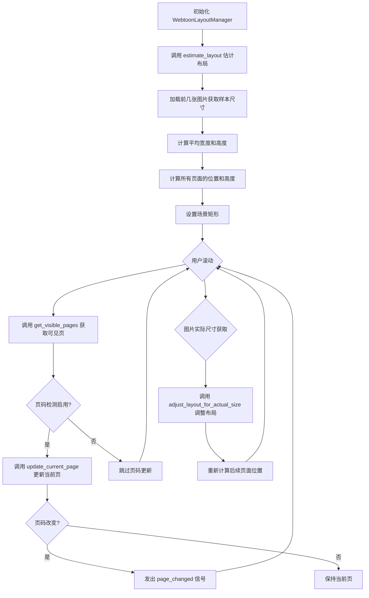

## 类结构

```
WebtoonLayoutManager (布局管理类)
```

## 全局变量及字段


### `WebtoonLayoutManager.self.viewer`
    
查看器引用

类型：`Viewer`
    


### `WebtoonLayoutManager.self._scene`
    
Qt场景对象引用

类型：`QGraphicsScene`
    


### `WebtoonLayoutManager.self.image_positions`
    
图像垂直位置列表

类型：`list[float]`
    


### `WebtoonLayoutManager.self.image_heights`
    
图像高度列表

类型：`list[float]`
    


### `WebtoonLayoutManager.self.total_height`
    
总内容高度

类型：`float`
    


### `WebtoonLayoutManager.self.webtoon_width`
    
Webtoon画布宽度

类型：`float`
    


### `WebtoonLayoutManager.self.image_spacing`
    
图像间距

类型：`int`
    


### `WebtoonLayoutManager.self.placeholder_height`
    
占位符默认高度(1000)

类型：`int`
    


### `WebtoonLayoutManager.self.viewport_buffer`
    
视口缓冲区大小(2页)

类型：`int`
    


### `WebtoonLayoutManager.self.current_page_index`
    
当前页面索引

类型：`int`
    


### `WebtoonLayoutManager.self.page_detection_enabled`
    
页码检测是否启用标志

类型：`bool`
    


### `WebtoonLayoutManager.self.page_detection_timer`
    
页码检测单次定时器

类型：`QTimer`
    


### `WebtoonLayoutManager.self.on_page_detection_enabled`
    
页码检测启用回调函数

类型：`Optional[Callable]`
    


### `WebtoonLayoutManager.self.image_loader`
    
图像加载器引用(懒加载设置)

类型：`Optional[ImageLoader]`
    


### `WebtoonLayoutManager.self.coordinate_converter`
    
坐标转换器引用(懒加载设置)

类型：`Optional[CoordinateConverter]`
    
    

## 全局函数及方法


### `imkit.read_image`

读取图像文件并返回图像元数据（高度和宽度），用于在不完全加载图像的情况下获取图像尺寸信息。

参数：

-  `file_path`：`str`，要读取的图像文件的路径

返回值：`Optional[ndarray]`，返回图像的 NumPy 数组表示（如果读取成功），否则返回 `None`。图像数组的 shape 属性可用于获取高度和宽度（`h, w = img.shape[:2]`）。

#### 流程图

```mermaid
flowchart TD
    A[开始] --> B{尝试读取图像}
    B -->|成功| C[获取图像尺寸 h, w = img.shape[:2]]
    B -->|失败| D[捕获异常]
    C --> E[返回图像数组]
    D --> F[使用默认尺寸 1920x2700]
    E --> G[结束]
    F --> G
    
    style A fill:#f9f,color:#333
    style B fill:#bbf,color:#333
    style C fill:#bfb,color:#333
    style D fill:#fbb,color:#333
    style E fill:#bfb,color:#333
    style F fill:#ff9,color:#333
    style G fill:#9ff,color:#333
```

#### 带注释源码

```python
def estimate_layout(self, file_paths: list[str]) -> bool:
    """Estimate layout dimensions without loading all images."""
    try:
        # Load just the first few images to estimate average dimensions
        sample_size = min(3, len(file_paths))
        sample_widths = []
        sample_heights = []
        
        for i in range(sample_size):
            # Quick metadata-only load for size estimation
            try:
                import imkit as imk
                # 调用外部库函数读取图像元数据
                # 参数：file_path - 图像文件路径
                # 返回：图像的 NumPy 数组或 None
                img = imk.read_image(file_paths[i])
                if img is not None:
                    # 从图像数组中提取高度和宽度
                    h, w = img.shape[:2]
                    sample_widths.append(w)
                    sample_heights.append(h)
            except:
                # Fallback to default dimensions
                # 如果读取失败，使用默认尺寸
                sample_widths.append(1920)
                sample_heights.append(2700)
        
        # Calculate averages
        avg_width = sum(sample_widths) // len(sample_widths) if sample_widths else 1920
        avg_height = sum(sample_heights) // len(sample_heights) if sample_heights else 2700
        
        self.webtoon_width = avg_width
        
        # ... (后续代码省略)
```


我注意到代码中并没有直接定义 `print` 函数（`print` 是 Python 的内置函数），但代码中多次调用了 `print` 用于调试输出。根据代码内容，我将这些 `print` 调用按其所属方法进行归类，并提取详细信息。

以下是代码中包含 `print` 调用的主要方法及其详细信息：

### `WebtoonLayoutManager.estimate_layout`

用于在没有加载所有图片的情况下估算布局尺寸。

参数：
-  `file_paths`：`list[str]`，图片文件路径列表

返回值：`bool`，估算成功返回 True，否则返回 False

#### 流程图

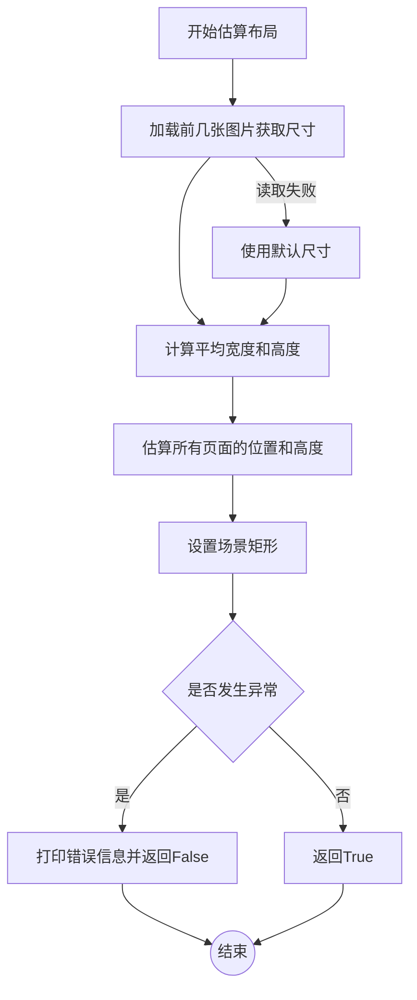

#### 带注释源码

```python
def estimate_layout(self, file_paths: list[str]) -> bool:
    """Estimate layout dimensions without loading all images."""
    try:
        # Load just the first few images to estimate average dimensions
        sample_size = min(3, len(file_paths))
        sample_widths = []
        sample_heights = []
        
        for i in range(sample_size):
            # Quick metadata-only load for size estimation
            try:
                import imkit as imk
                img = imk.read_image(file_paths[i])
                if img is not None:
                    h, w = img.shape[:2]
                    sample_widths.append(w)
                    sample_heights.append(h)
            except:
                # Fallback to default dimensions
                sample_widths.append(1920)
                sample_heights.append(2700)
        
        # Calculate averages
        avg_width = sum(sample_widths) // len(sample_widths) if sample_widths else 1920
        avg_height = sum(sample_heights) // len(sample_heights) if sample_heights else 2700
        
        self.webtoon_width = avg_width
        
        # Estimate positions for all pages
        current_y = 100
        self.image_positions.clear()
        self.image_heights.clear()
        
        for i in range(len(file_paths)):
            self.image_positions.append(current_y)
            # Use actual height if already loaded, otherwise estimate
            height = sample_heights[min(i, len(sample_heights) - 1)] if sample_heights else self.placeholder_height
            self.image_heights.append(height)
            current_y += height + self.image_spacing
            
        self.total_height = current_y - self.image_spacing
        self._scene.setSceneRect(0, 0, self.webtoon_width, self.total_height)
        
        return True
        
    except Exception as e:
        # 打印错误信息：布局估算失败时输出异常详情
        print(f"Error estimating layout: {e}")
        return False
```

---

### `WebtoonLayoutManager.scroll_to_page`

滚动到指定页面。

参数：
-  `page_index`：`int`，目标页面索引
-  `position`：`str`，目标位置（'top', 'center', 'bottom'），默认为 'top'

返回值：`bool`，滚动成功返回 True，否则返回 False

#### 流程图

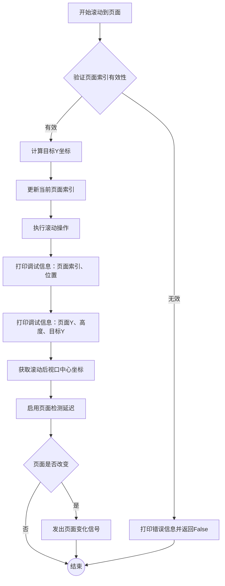

#### 带注释源码

```python
def scroll_to_page(self, page_index: int, position: str = 'top'):
    """Scroll to a specific page."""
    if not (0 <= page_index < len(self.image_positions)):
        # 打印错误信息：页面索引无效
        print(f"WebtoonLayoutManager: Invalid page index {page_index}, total pages: {len(self.image_positions)}")
        return False
        
    # Calculate target position
    page_y = self.image_positions[page_index]
    page_height = self.image_heights[page_index]
    
    target_y = page_y
    if position == 'center':
        target_y += page_height / 2
    elif position == 'bottom':
        target_y += page_height
        
    # 打印调试信息：滚动目标
    print(f"WebtoonLayoutManager: Scrolling to page {page_index}, position {position}")
    # 打印调试信息：页面详细坐标信息
    print(f"  Page Y: {page_y}, Height: {page_height}, Target Y: {target_y}")
    
    # Update current page index before scrolling
    old_page = self.current_page_index
    self.current_page_index = page_index
    
    # Scroll to position
    self.viewer.centerOn(self.webtoon_width / 2, target_y)
    
    # Check viewport after scroll
    viewport_center = self.viewer.mapToScene(self.viewer.viewport().rect().center())
    # 打印调试信息：滚动后视口中心位置
    print(f"  After scroll: viewport center is at {viewport_center.x()}, {viewport_center.y()}")
    
    # Enable page detection after scrolling
    self.viewer.event_handler._enable_page_detection_after_delay()
    
    # Emit page change signal if page actually changed
    if old_page != page_index:
        self.viewer.page_changed.emit(page_index)
        
    return True
```

---

### `WebtoonLayoutManager.ensure_current_page_visible`

确保当前页面可见并正确设置视图。

参数：
-  `image_items`：`dict`，页面图像项字典

返回值：无

#### 流程图

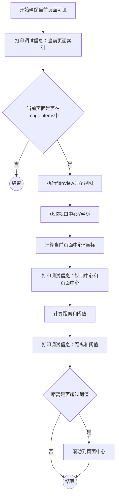

#### 带注释源码

```python
def ensure_current_page_visible(self, image_items: dict):
    """Ensure the current page is visible and view is properly set up."""
    # 打印调试信息：当前页面索引状态
    print(f"WebtoonLayoutManager: ensure_current_page_visible: current_page_index = {self.current_page_index}")
    
    if self.current_page_index in image_items:
        self.viewer.fitInView()
        
        # Check viewport position
        viewport_center = self.viewer.mapToScene(self.viewer.viewport().rect().center()).y()
        current_page_center = self.image_positions[self.current_page_index] + (self.image_heights[self.current_page_index] / 2)
        
        # 打印调试信息：视口与页面中心对比
        print(f"Viewport center: {viewport_center}, Page center: {current_page_center}")
        
        # If viewport is far from current page, scroll to it
        distance = abs(viewport_center - current_page_center)
        threshold = self.image_heights[self.current_page_index] / 4
        # 打印调试信息：距离与阈值对比
        print(f"Distance: {distance}, Threshold: {threshold}")
        
        if distance > threshold:
            self.scroll_to_page(self.current_page_index, 'center')
```

---

## 潜在技术债务或优化空间

1. **调试代码残留**：代码中存在大量 `print` 语句用于调试输出，生产环境中应替换为正式的日志框架（如 `logging` 模块）。

2. **硬编码值**：
   - `viewport_buffer * 1000` 中的 1000 是硬编码的缓冲区估算值
   - 默认图片尺寸 1920x2700 是硬编码的
   - 页面检测延迟 1000ms 是硬编码的

3. **魔法数字**：多处使用魔法数字（如 0.1、0.25）而未定义为常量，降低了代码可读性和可维护性。

4. **坐标转换简化**：`scene_to_page_coordinates` 和 `page_to_scene_coordinates` 方法中 X 坐标的处理是简化的，未完全实现。


### `min`

`min` 是 Python 的内置函数，用于返回可迭代对象中的最小值，或两个或多个参数中的最小值。在该代码中用于限制采样大小。

参数：

-  `iterable`：`iterable`，要比较的可迭代对象
-  `*args`：可选，多个要比较的参数（如果不提供可迭代对象）
-  `key`：可选，用于自定义比较的函数
-  `default`：可选，当可迭代对象为空时返回的值

返回值：返回可迭代对象或参数中的最小项

注意：在该代码中，具体使用了 `min(3, len(file_paths))`，用于限制样本大小最多为3个图像。

#### 流程图

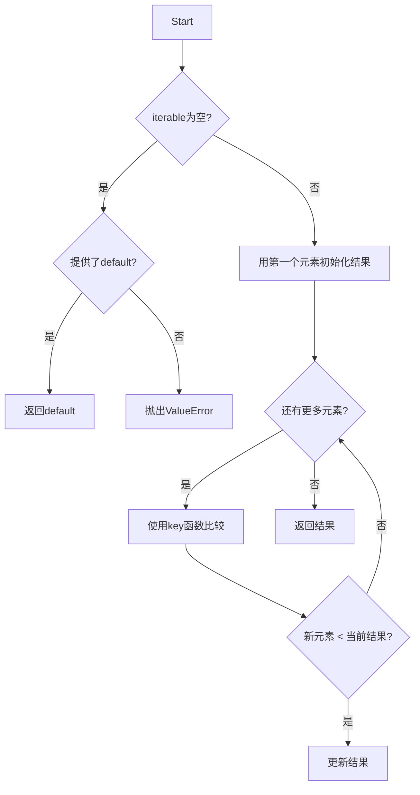

#### 带注释源码

```python
# 代码中第54行的使用示例
sample_size = min(3, len(file_paths))
# 这限制了样本大小最多为3个图像
# 如果file_paths长度小于3，则使用实际长度
```


# 分析结果

经过仔细分析代码，`WebtoonLayoutManager` 类中**不存在名为 `sum` 的方法或函数**。

代码中确实使用了 Python 内置的 `sum()` 函数，例如在 `estimate_layout` 方法中：

```python
avg_width = sum(sample_widths) // len(sample_widths) if sample_widths else 1920
avg_height = sum(sample_heights) // len(sample_heights) if sample_heights else 2700
```

但这只是 Python 标准库的内置函数调用，并非该类定义的方法。

---

## 建议

如果您需要提取该类中的某个方法，请从以下列表中选择一个存在的函数：

1. `estimate_layout` - 估算布局尺寸
2. `adjust_layout_for_actual_size` - 根据实际图片尺寸调整布局
3. `get_visible_pages` - 获取当前可视页面
4. `get_pages_for_scene_bounds` - 获取与场景矩形相交的页面
5. `get_page_at_position` - 获取指定Y位置的页面索引
6. `scroll_to_page` - 滚动到指定页面
7. `update_current_page` - 根据视口中心更新当前页面
8. `update_page_on_click` - 点击时更新当前页面
9. `clear` - 清除所有布局状态
10. `_recalculate_layout` - 重新计算布局位置

请告知您需要提取的具体函数名称。


# WebtoonLayoutManager 类详细设计文档

## 一段话描述

`WebtoonLayoutManager` 是 Webtoon 阅读器的布局管理核心类，负责处理长图模式的布局计算、页面位置追踪、视口管理和滚动导航，是整个 Webtoon 阅读模式的单点真值源（Single Source of Truth）。

---

## 文件的整体运行流程

```
┌─────────────────────────────────────────────────────────────────┐
│                    WebtoonLayoutManager                         │
├─────────────────────────────────────────────────────────────────┤
│  1. 初始化 (__init__)                                           │
│     ├── 设置引用 (viewer, _scene)                                │
│     ├── 初始化布局状态 (positions, heights, total_height)       │
│     └── 配置视口缓冲和页面检测定时器                             │
│                          ↓                                      │
│  2. 布局估算 (estimate_layout)                                  │
│     ├── 加载样本图片获取尺寸                                     │
│     ├── 计算平均宽高                                             │
│     └── 计算所有页面位置                                         │
│                          ↓                                      │
│  3. 页面可见性管理 (get_visible_pages)                           │
│     ├── 获取当前视口区域                                         │
│     └── 返回可见页面集合                                         │
│                          ↓                                      │
│  4. 滚动导航 (scroll_to_page)                                   │
│     ├── 计算目标位置                                             │
│     ├── 执行滚动                                                 │
│     └── 触发页面变化信号                                         │
└─────────────────────────────────────────────────────────────────┘
```

---

## 类的详细信息

### 类字段

| 字段名称 | 类型 | 描述 |
|---------|------|------|
| `viewer` | `Any` | 对主查看器的引用 |
| `_scene` | `QGraphicsScene` | 图形场景对象 |
| `image_positions` | `list[float]` | 所有页面的 Y 起始位置列表 |
| `image_heights` | `list[float]` | 所有页面的高度列表 |
| `total_height` | `float` | 整个 Webtoon 内容的总高度 |
| `webtoon_width` | `float` | Webtoon 内容的宽度 |
| `image_spacing` | `float` | 页面之间的间距 |
| `placeholder_height` | `float` | 占位符的默认高度 |
| `viewport_buffer` | `int` | 视口缓冲大小（预加载页数） |
| `current_page_index` | `int` | 当前显示的页面索引 |
| `page_detection_enabled` | `bool` | 页面检测是否启用 |
| `page_detection_timer` | `QTimer` | 页面检测延迟定时器 |
| `on_page_detection_enabled` | `Callable` | 页面检测启用时的回调函数 |
| `image_loader` | `Any` | 图片加载器管理器引用 |
| `coordinate_converter` | `Any` | 坐标转换器引用 |

### 类方法

| 方法名称 | 功能描述 |
|---------|---------|
| `estimate_layout` | 通过采样估算布局尺寸 |
| `adjust_layout_for_actual_size` | 根据实际图片尺寸调整布局 |
| `get_visible_pages` | 获取当前视口可见的页面 |
| `get_pages_for_scene_bounds` | 获取与场景矩形相交的页面 |
| `get_page_at_position` | 获取指定 Y 位置对应的页面索引 |
| `scroll_to_page` | 滚动到指定页面 |
| `update_current_page` | 根据视口中心更新当前页码 |
| `update_page_on_click` | 点击时更新当前页码 |
| `ensure_current_page_visible` | 确保当前页面可见 |
| `enable_page_detection_after_delay` | 延迟启用页面检测 |
| `_enable_page_detection` | 内部方法：启用页面检测 |
| `set_page_detection_delay` | 设置页面检测延迟 |
| `get_page_detection_delay` | 获取页面检测延迟 |
| `disable_page_detection` | 禁用页面检测 |
| `scene_to_page_coordinates` | 场景坐标转页面坐标 |
| `page_to_scene_coordinates` | 页面坐标转场景坐标 |
| `clear` | 清除所有布局状态 |
| `_recalculate_layout` | 重新计算布局位置 |

---

## 关键组件信息

| 组件名称 | 一句话描述 |
|---------|-----------|
| `image_positions` | 存储每个页面在场景中的 Y 起始位置 |
| `page_detection_timer` | 用于延迟启用页面检测的 Qt 定时器 |
| `viewport_buffer` | 控制视口上下方预加载页数的缓冲值 |
| `current_page_index` | 追踪用户当前正在查看的页面 |

---

## 潜在的技术债务或优化空间

1. **`scene_to_page_coordinates` 和 `page_to_scene_coordinates` 方法中的 local_x 计算不完整** - 注释表明需要图片数据计算页面宽度，但当前实现只是简单回传 x 坐标
2. **`placeholder_height` 使用硬编码值 1000** - 应该根据实际图片尺寸动态调整
3. **`get_visible_pages` 中使用固定缓冲区乘数 1000** - 应该基于平均页面高度动态计算
4. **`_recalculate_layout` 方法直接操作 `image_loader` 的内部属性** - 违反了封装原则，应通过接口调用
5. **缺少线程安全保护** - 多线程环境下访问布局数据可能存在竞态条件

---

## 其他项目

### 设计目标与约束
- **单点真值**: 布局信息必须以此类为唯一来源，避免数据不一致
- **延迟初始化**: 页面检测在滚动后延迟启用，确保视口稳定
- **视口缓冲**: 预加载视口上下方 N 页内容，提升用户体验

### 错误处理与异常设计
- `estimate_layout` 使用 try-except 捕获图片加载失败，回退到默认尺寸
- `adjust_layout_for_actual_size` 和 `scroll_to_page` 对无效索引进行边界检查
- 所有方法在异常时打印诊断信息但不抛出，确保程序继续运行

### 数据流与状态机
```
[初始化] → [布局估算] → [页面加载] → [布局调整] → [滚动/检测] → [状态更新]
     ↓          ↓           ↓           ↓            ↓           ↓
  初始状态    估算状态    加载中状态   更新状态     交互状态    稳定状态
```

### 外部依赖与接口契约
- 依赖 `PySide6.QtCore` 的 `QPointF`, `QRectF`, `QTimer`
- 依赖 `imkit` 模块读取图片元数据
- 与 `image_loader` 紧密耦合（通过 `image_file_paths`, `loaded_pages`, `image_items` 等属性）

---

# 特定方法详细文档

根据任务要求，以下是从代码中提取的特定方法 `scroll_to_page` 的详细信息：

### `WebtoonLayoutManager.scroll_to_page`

滚动到指定页面并更新当前页面索引

参数：

- `page_index`：`int`，目标页面的索引
- `position`：`str`，滚动目标位置，可选值为 `'top'`（顶部）、`'center'`（居中）、`'bottom'`（底部），默认为 `'top'`

返回值：`bool`，表示滚动是否成功执行

#### 流程图

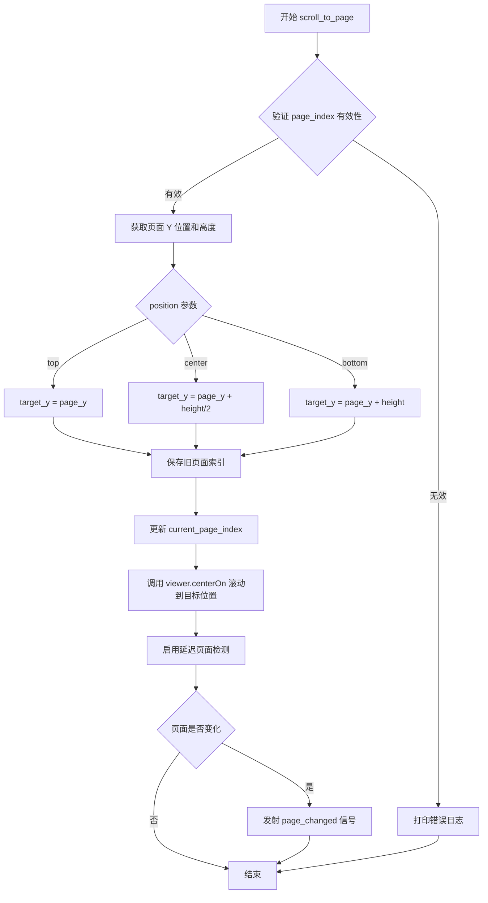

#### 带注释源码

```python
def scroll_to_page(self, page_index: int, position: str = 'top'):
    """Scroll to a specific page."""
    # Step 1: 边界检查 - 确保页面索引有效
    if not (0 <= page_index < len(self.image_positions)):
        print(f"WebtoonLayoutManager: Invalid page index {page_index}, total pages: {len(self.image_positions)}")
        return False
        
    # Step 2: 获取目标页面的位置和高度信息
    page_y = self.image_positions[page_index]
    page_height = self.image_heights[page_index]
    
    # Step 3: 根据 position 参数计算目标 Y 坐标
    target_y = page_y
    if position == 'center':
        # 居中模式：定位到页面中间
        target_y += page_height / 2
    elif position == 'bottom':
        # 底部模式：定位到页面底部
        target_y += page_height
            
    print(f"WebtoonLayoutManager: Scrolling to page {page_index}, position {position}")
    print(f"  Page Y: {page_y}, Height: {page_height}, Target Y: {target_y}")
    
    # Step 4: 保存旧页面索引，用于后续判断是否发送页面变化信号
    old_page = self.current_page_index
    
    # Step 5: 更新当前页面索引为目标页面
    self.current_page_index = page_index
    
    # Step 6: 执行滚动操作，使目标位置居中于视口
    # 使用 webtoon_width/2 作为 X 坐标确保水平居中
    self.viewer.centerOn(self.webtoon_width / 2, target_y)
    
    # Step 7: 滚动后检查视口位置（用于调试）
    viewport_center = self.viewer.mapToScene(self.viewer.viewport().rect().center())
    print(f"  After scroll: viewport center is at {viewport_center.x()}, {viewport_center.y()}")
    
    # Step 8: 延迟启用页面检测，让视口稳定下来
    # 这避免了在滚动过程中频繁触发页面检测
    self.viewer.event_handler._enable_page_detection_after_delay()
    
    # Step 9: 如果页面实际发生变化，发射页面变化信号
    if old_page != page_index:
        self.viewer.page_changed.emit(page_index)
            
    return True
```


### `WebtoonLayoutManager.get_visible_pages`

获取当前视口内（加上缓冲区域）可见的页面索引集合。该方法通过计算视口在场景坐标系中的位置，结合预定义的缓冲区大小，确定哪些页面处于可见范围内。如果视口尚未初始化，则基于当前页面位置进行估算。

参数：
- 无

返回值：`Set[int]`，返回当前视口可见的页面索引集合

#### 流程图

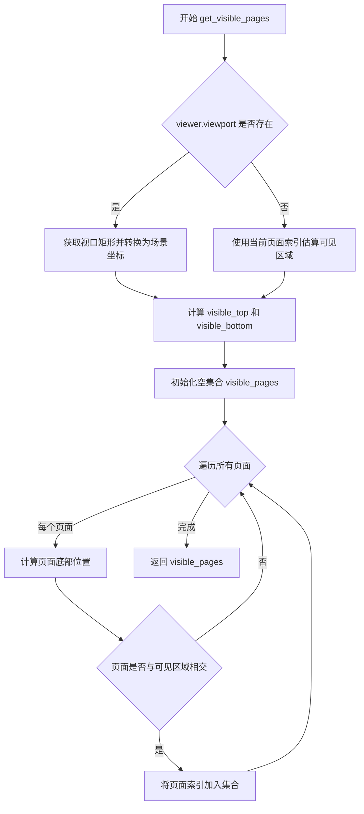

#### 带注释源码

```python
def get_visible_pages(self) -> Set[int]:
    """Get pages currently visible in viewport + buffer."""
    # 检查视图是否已初始化，如果在初始化阶段，则基于当前页面估算可见区域
    if hasattr(self.viewer, 'viewport') and self.viewer.viewport():
        # 将视口矩形从视图坐标转换为场景坐标，获取实际可见区域
        viewport_rect = self.viewer.mapToScene(self.viewer.viewport().rect()).boundingRect()
        # 计算可见区域顶部，向上扩展缓冲区（viewport_buffer * 1000 像素）
        visible_top = viewport_rect.top() - (self.viewport_buffer * 1000)
        # 计算可见区域底部，向下扩展缓冲区
        visible_bottom = viewport_rect.bottom() + (self.viewport_buffer * 1000)
    else:
        # 初始化阶段的降级处理：根据当前页面位置估算可见区域
        current_page_y = self.image_positions[self.current_page_index] if self.current_page_index < len(self.image_positions) else 0
        visible_top = current_page_y - (self.viewport_buffer * 1000)
        visible_bottom = current_page_y + (self.viewport_buffer * 1000)
    
    # 初始化结果集合，用于存储可见页面索引
    visible_pages = set()
    # 遍历所有页面位置和高度，计算每个页面是否与可见区域相交
    for i, (y_pos, height) in enumerate(zip(self.image_positions, self.image_heights)):
        page_bottom = y_pos + height
        # 检查页面是否与可见区域有交集（页面顶部在可见区域下方且页面底部在可见区域上方）
        if y_pos < visible_bottom and page_bottom > visible_top:
            visible_pages.add(i)
            
    return visible_pages
```


### `WebtoonLayoutManager.estimate_layout`

该方法通过加载前几张图片的元数据来估算整体布局的宽度和高度，而无需加载所有图片，从而为后续的视图滚动和页面计算提供基础布局数据。

参数：

- `file_paths`：`list[str]`，待估算布局的图片文件路径列表

返回值：`bool`，估算布局是否成功；成功返回 True，失败返回 False

#### 流程图

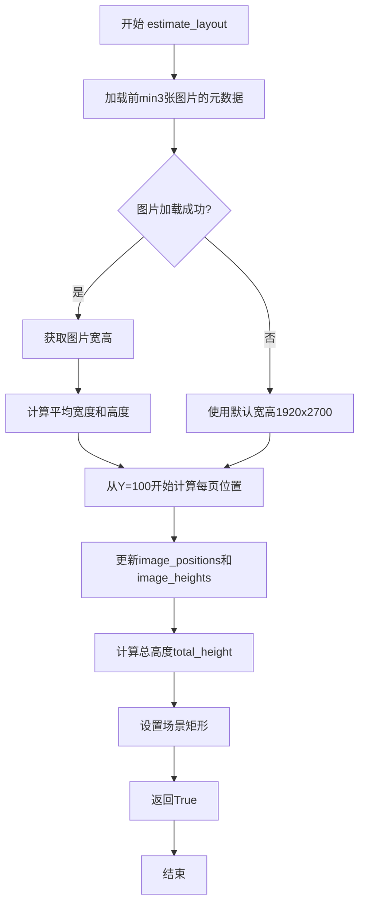

#### 带注释源码

```
def estimate_layout(self, file_paths: list[str]) -> bool:
    """Estimate layout dimensions without loading all images."""
    try:
        # Load just the first few images to estimate average dimensions
        sample_size = min(3, len(file_paths))
        sample_widths = []
        sample_heights = []
        
        for i in range(sample_size):
            # Quick metadata-only load for size estimation
            try:
                import imkit as imk
                img = imk.read_image(file_paths[i])
                if img is not None:
                    h, w = img.shape[:2]
                    sample_widths.append(w)
                    sample_heights.append(h)
            except:
                # Fallback to default dimensions
                sample_widths.append(1920)
                sample_heights.append(2700)
        
        # Calculate averages
        avg_width = sum(sample_widths) // len(sample_widths) if sample_widths else 1920
        avg_height = sum(sample_heights) // len(sample_heights) if sample_heights else 2700
        
        self.webtoon_width = avg_width
        
        # Estimate positions for all pages
        current_y = 100
        self.image_positions.clear()
        self.image_heights.clear()
        
        for i in range(len(file_paths)):
            self.image_positions.append(current_y)
            # Use actual height if already loaded, otherwise estimate
            height = sample_heights[min(i, len(sample_heights) - 1)] if sample_heights else self.placeholder_height
            self.image_heights.append(height)
            current_y += height + self.image_spacing
            
        self.total_height = current_y - self.image_spacing
        self._scene.setSceneRect(0, 0, self.webtoon_width, self.total_height)
        
        return True
        
    except Exception as e:
        print(f"Error estimating layout: {e}")
        return False
```

---

### `WebtoonLayoutManager.get_visible_pages`

该方法计算当前视口内可见的页面集合，考虑了视口缓冲区域，用于确定需要加载或卸载的图片页面。

参数：无

返回值：`Set[int]`，当前视口内可见的所有页面索引集合

#### 流程图

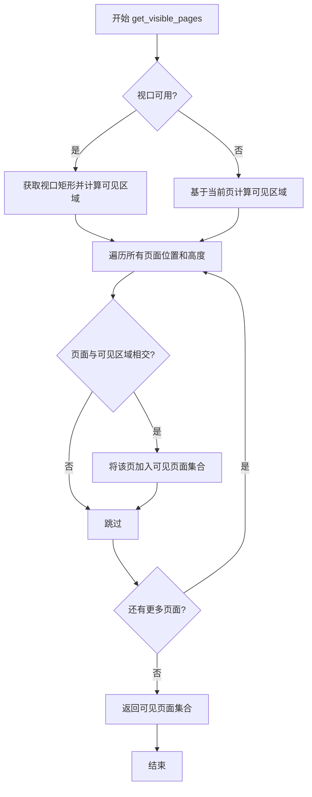

#### 带注释源码

```
def get_visible_pages(self) -> Set[int]:
    """Get pages currently visible in viewport + buffer."""
    # During initialization, estimate viewport around current page
    if hasattr(self.viewer, 'viewport') and self.viewer.viewport():
        viewport_rect = self.viewer.mapToScene(self.viewer.viewport().rect()).boundingRect()
        visible_top = viewport_rect.top() - (self.viewport_buffer * 1000)  # Buffer above
        visible_bottom = viewport_rect.bottom() + (self.viewport_buffer * 1000)  # Buffer below
    else:
        # Fallback during initialization - estimate around current page
        current_page_y = self.image_positions[self.current_page_index] if self.current_page_index < len(self.image_positions) else 0
        visible_top = current_page_y - (self.viewport_buffer * 1000)
        visible_bottom = current_page_y + (self.viewport_buffer * 1000)
    
    visible_pages = set()
    for i, (y_pos, height) in enumerate(zip(self.image_positions, self.image_heights)):
        page_bottom = y_pos + height
        if y_pos < visible_bottom and page_bottom > visible_top:
            visible_pages.add(i)
            
    return visible_pages
```

---

### `WebtoonLayoutManager.scroll_to_page`

该方法将视图滚动到指定页面的指定位置（顶部、中心或底部），并更新当前页面索引，同时触发页面变化事件。

参数：

- `page_index`：`int`，要滚动到的目标页面索引
- `position`：`str`，滚动位置，可选值为 'top'、'center'、'bottom'，默认为 'top'

返回值：`bool`，滚动是否成功；成功返回 True，无效索引返回 False

#### 流程图

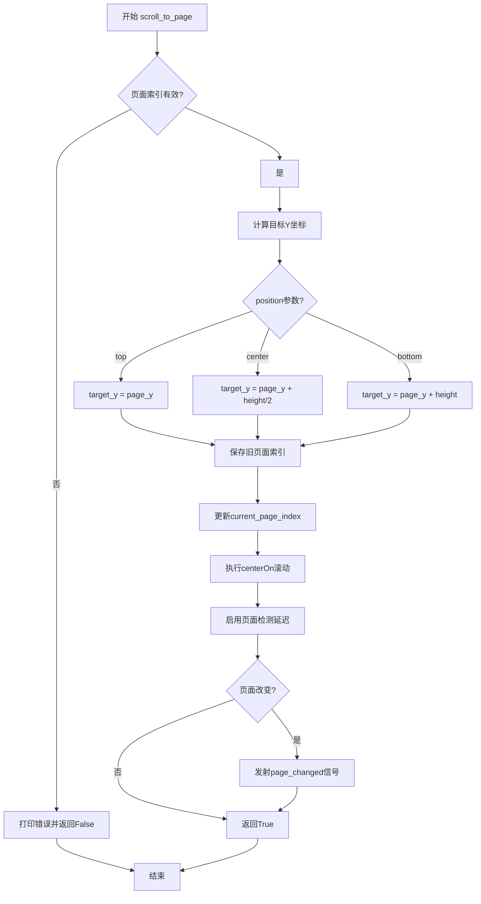

#### 带注释源码

```
def scroll_to_page(self, page_index: int, position: str = 'top'):
    """Scroll to a specific page."""
    if not (0 <= page_index < len(self.image_positions)):
        print(f"WebtoonLayoutManager: Invalid page index {page_index}, total pages: {len(self.image_positions)}")
        return False
        
    # Calculate target position
    page_y = self.image_positions[page_index]
    page_height = self.image_heights[page_index]
    
    target_y = page_y
    if position == 'center':
        target_y += page_height / 2
    elif position == 'bottom':
        target_y += page_height
        
    print(f"WebtoonLayoutManager: Scrolling to page {page_index}, position {position}")
    print(f"  Page Y: {page_y}, Height: {page_height}, Target Y: {target_y}")
    
    # Update current page index before scrolling
    old_page = self.current_page_index
    self.current_page_index = page_index
    
    # Scroll to position
    self.viewer.centerOn(self.webtoon_width / 2, target_y)
    
    # Check viewport after scroll
    viewport_center = self.viewer.mapToScene(self.viewer.viewport().rect().center())
    print(f"  After scroll: viewport center is at {viewport_center.x()}, {viewport_center.y()}")
    
    # Enable page detection after scrolling
    self.viewer.event_handler._enable_page_detection_after_delay()
    
    # Emit page change signal if page actually changed
    if old_page != page_index:
        self.viewer.page_changed.emit(page_index)
        
    return True
```

---

### `WebtoonLayoutManager.update_current_page`

该方法根据视口中心位置更新当前页面索引，采用两阶段检测策略（严格检测+宽松匹配），只在页面发生显著变化时返回 True。

参数：

- `loaded_pages_count`：`int`，已加载的页面数量，用于判断是否启用页面检测

返回值：`bool`，页面是否发生变化；发生变化返回 True，未变化返回 False

#### 流程图

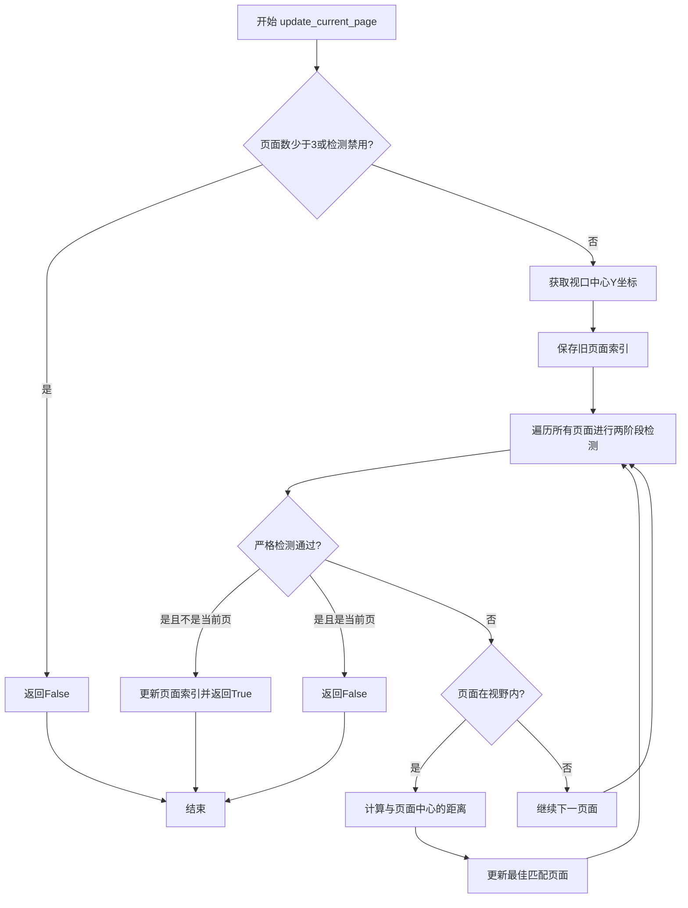

#### 带注释源码

```
def update_current_page(self, loaded_pages_count: int = 0) -> bool:
    """Update current page index based on viewport center. Returns True if page changed."""
    # Don't update during initial loading or if page detection is disabled
    if (loaded_pages_count < 3 or not self.page_detection_enabled):
        return False
        
    center_y = self.viewer.mapToScene(self.viewer.viewport().rect().center()).y()
    old_page = self.current_page_index
    
    # Only change page if viewport is significantly within another page
    # Use a two-pass approach: first try strict detection, then relaxed detection
    best_match_page = None
    best_match_distance = float('inf')
    
    for i, (pos, height) in enumerate(zip(self.image_positions, self.image_heights)):
        page_center = pos + height / 2
        page_top = pos
        page_bottom = pos + height
        
        # First pass: strict detection (10% margin)
        margin = height * 0.1
        page_detection_top = pos + margin
        page_detection_bottom = pos + height - margin
        
        if page_detection_top <= center_y <= page_detection_bottom:
            if i != self.current_page_index:
                self.current_page_index = i
                return True  # Page changed
            return False  # Same page
        
        # Second pass: find the closest page for fallback
        if page_top <= center_y <= page_bottom:
            # Viewport is within this page's bounds (no margin)
            distance_from_center = abs(center_y - page_center)
            if distance_from_center < best_match_distance:
                best_match_distance = distance_from_center
                best_match_page = i
    
    # If no page matched the strict criteria, use the closest page match
    if best_match_page is not None and best_match_page != self.current_page_index:
        self.current_page_index = best_match_page
        return True  # Page changed
        
    return False  # No change
```

---

### `WebtoonLayoutManager.scene_to_page_coordinates`

该方法将场景坐标系的点转换为特定页面内部的局部坐标，支持页面级别的交互处理和坐标映射。

参数：

- `scene_pos`：`QPointF`，场景坐标系中的点位置

返回值：`Tuple[int, QPointF]`，包含页面索引和页面局部坐标的元组

#### 流程图

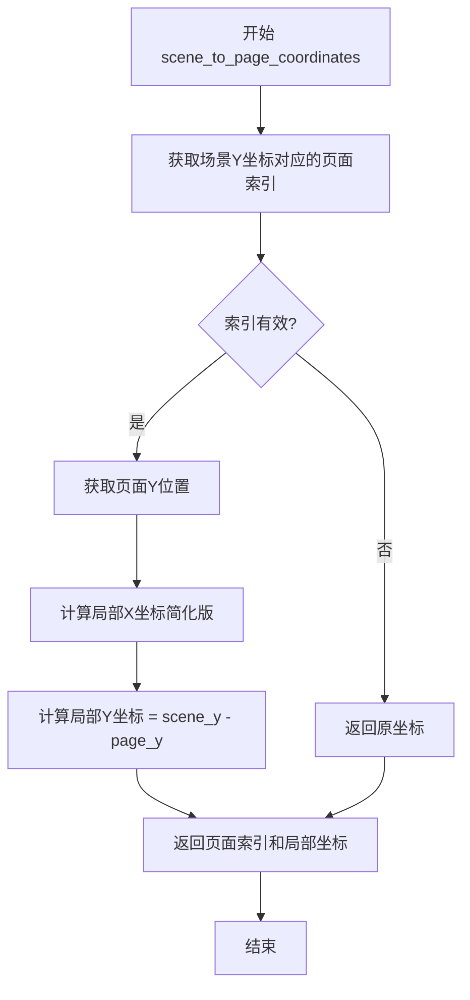

#### 带注释源码

```
def scene_to_page_coordinates(self, scene_pos: QPointF) -> Tuple[int, QPointF]:
    """Convert scene coordinates to page-local coordinates."""
    page_index = self.get_page_at_position(scene_pos.y())
    if 0 <= page_index < len(self.image_positions):
        page_y = self.image_positions[page_index]
        # This would need image data to calculate page width - delegate to coordinate converter
        local_x = scene_pos.x()  # Simplified for now
        local_y = scene_pos.y() - page_y
        return page_index, QPointF(local_x, local_y)
    return page_index, scene_pos
```

---

### `WebtoonLayoutManager.page_to_scene_coordinates`

该方法将页面局部坐标系中的点转换回场景坐标系，用于将页面级别的操作映射回全局视图。

参数：

- `page_index`：`int`，页面索引
- `local_pos`：`QPointF`，页面局部坐标系中的点位置

返回值：`QPointF`，场景坐标系中的点位置

#### 流程图

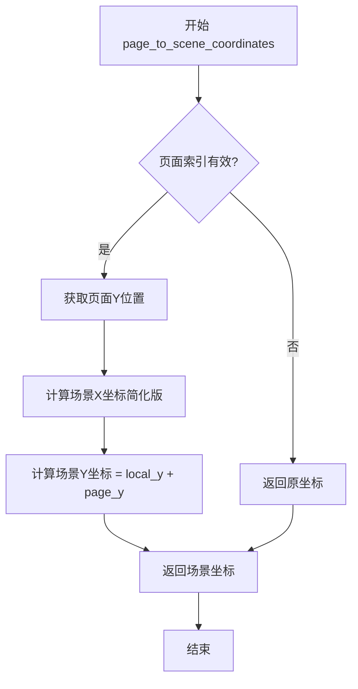

#### 带注释源码

```
def page_to_scene_coordinates(self, page_index: int, local_pos: QPointF) -> QPointF:
    """Convert page-local coordinates to scene coordinates."""
    if not (0 <= page_index < len(self.image_positions)):
        return local_pos
    
    page_y = self.image_positions[page_index]
    # This would need image data to calculate page width - delegate to coordinate converter
    scene_x = local_pos.x()  # Simplified for now
    scene_y = local_pos.y() + page_y
    return QPointF(scene_x, scene_y)
```


# 提取结果

经过分析，该代码文件中**不存在名为 `range` 的函数或方法**。代码中使用的是 Python 内置的 `range()` 函数，用于循环遍历。

---

### 相关的循环遍历逻辑（使用 `range`）

虽然代码中没有自定义 `range` 方法，但代码中多处使用了 Python 内置的 `range()` 函数。以下是使用 `range` 的典型方法分析：

#### 使用 `range` 的方法：`estimate_layout`

```python
for i in range(sample_size):
    # Quick metadata-only load for size estimation
    ...

for i in range(len(file_paths)):
    self.image_positions.append(current_y)
    ...
```

---

### 说明

1. **关于 `range` 函数的来源**：代码中使用的是 Python 3 的内置 `range()` 函数，并非自定义函数。

2. **使用场景**：代码中多处使用 `range()` 进行循环迭代，包括：
   - `estimate_layout` 方法中遍历样本和文件路径
   - `adjust_layout_for_actual_size` 方法中调整后续页面位置
   - `_recalculate_layout` 方法中重新计算布局位置

3. **潜在误解**：任务要求提取 `range` 函数，但该函数是 Python 内置函数，未在本代码中定义。若需要分析使用 `range` 的具体方法，请告知需要分析的具体方法名称。


### `len`

`len` 是 Python 的内置函数，用于返回对象（如列表、元组、字符串、字典等）的长度或元素个数。在这段代码中，`len` 主要用于获取列表中元素的数量，以便进行边界检查和遍历操作。

参数：

-  `obj`：`任意可迭代对象或具有 `__len__` 方法的对象`，需要获取长度的对象

返回值：`int`，返回对象中元素的数量

#### 流程图

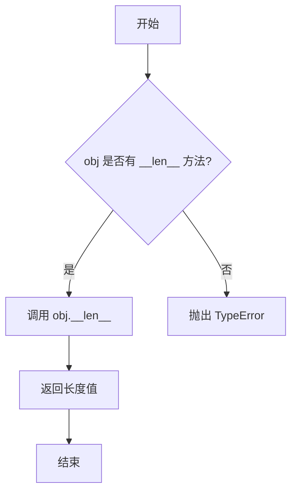

#### 带注释源码

```python
# len 函数使用示例（在 WebtoonLayoutManager 中的实际应用）

# 示例 1: 估计布局时检查文件路径列表长度
sample_size = min(3, len(file_paths))  # 获取文件路径数量，最多取3个样本

# 示例 2: 计算平均宽度
avg_width = sum(sample_widths) // len(sample_widths)  # 计算样本宽度的平均值

# 示例 3: 遍历所有文件路径
for i in range(len(file_paths)):  # 遍历所有页面
    self.image_positions.append(current_y)
    # ...

# 示例 4: 边界检查 - 确保页面索引有效
if not (0 <= page_idx < len(self.image_heights)):
    return  # 如果索引超出范围则返回

# 示例 5: 获取可见页面
for i, (y_pos, height) in enumerate(zip(self.image_positions, self.image_heights)):
    # 使用 enumerate 而不是 len，但逻辑类似

# 示例 6: 检查是否有任何页面
if not (0 <= page_index < len(self.image_positions)):
    print(f"WebtoonLayoutManager: Invalid page index...")
    return False

# 示例 7: 延迟检测
return self.page_detection_timer.interval() if hasattr(self.page_detection_timer, 'interval') else 1000

# 示例 8: 清空布局状态
self.image_positions.clear()
self.image_heights.clear()
# 注意: 这里使用 clear() 而不是 len()，因为 clear() 不返回长度
```

#### 说明

在 `WebtoonLayoutManager` 类中，`len` 函数被广泛用于：

1. **边界验证**：确保页面索引在有效范围内，如 `0 <= page_idx < len(self.image_heights)`
2. **循环遍历**：与 `range()` 配合使用，如 `for i in range(len(file_paths))`
3. **计算统计**：如计算平均值时除以元素数量
4. **条件判断**：检查列表是否为空或是否包含足够元素


### `WebtoonLayoutManager.get_visible_pages`

获取当前视口区域内可见的页面索引集合，考虑了视口缓冲区设置。

参数：无需参数

返回值：`Set[int]`，返回当前视口可见（包括缓冲区上下边界外延区域）的页面索引集合

#### 流程图

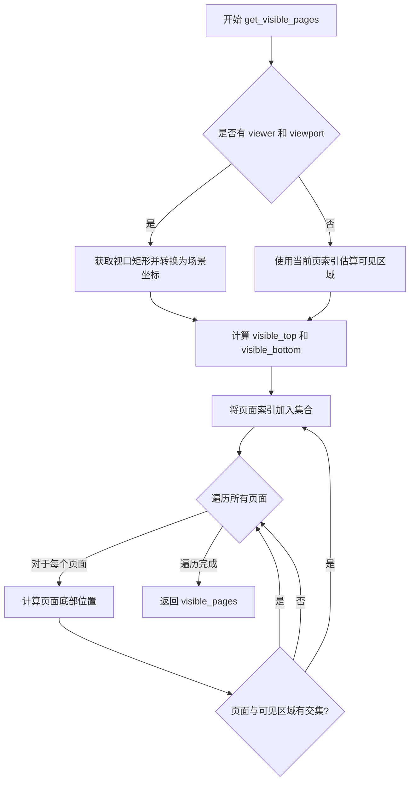

#### 带注释源码

```python
def get_visible_pages(self) -> Set[int]:
    """Get pages currently visible in viewport + buffer."""
    # During initialization, estimate viewport around current page
    if hasattr(self.viewer, 'viewport') and self.viewer.viewport():
        # 获取视口矩形并映射到场景坐标
        viewport_rect = self.viewer.mapToScene(self.viewer.viewport().rect()).boundingRect()
        # 缓冲区向上扩展（加载视口上方 N 页）
        visible_top = viewport_rect.top() - (self.viewport_buffer * 1000)
        # 缓冲区向下扩展（加载视口下方 N 页）
        visible_bottom = viewport_rect.bottom() + (self.viewport_buffer * 1000)
    else:
        # 初始化阶段回退方案：基于当前页估算可见区域
        current_page_y = self.image_positions[self.current_page_index] if self.current_page_index < len(self.image_positions) else 0
        visible_top = current_page_y - (self.viewport_buffer * 1000)
        visible_bottom = current_page_y + (self.viewport_buffer * 1000)
    
    # 遍历所有页面，找出与可见区域相交的页面
    visible_pages = set()
    for i, (y_pos, height) in enumerate(zip(self.image_positions, self.image_heights)):
        page_bottom = y_pos + height
        # 判断页面是否与可见区域重叠
        if y_pos < visible_bottom and page_bottom > visible_top:
            visible_pages.add(i)
            
    return visible_pages
```

---

### `WebtoonLayoutManager.get_pages_for_scene_bounds`

获取与给定场景矩形区域相交的所有页面索引集合，用于确定特定场景区域覆盖了哪些页面。

参数：

- `scene_rect`：`QRectF`，场景中的矩形区域，用于检测与页面的相交情况

返回值：`Set[int]`，返回与给定场景矩形相交的所有页面索引集合

#### 流程图

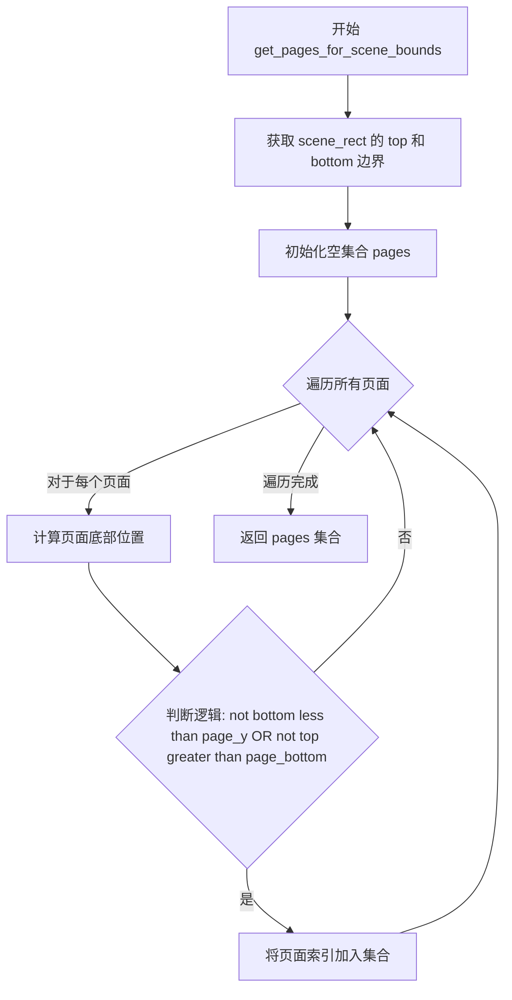

#### 带注释源码

```python
def get_pages_for_scene_bounds(self, scene_rect: QRectF) -> Set[int]:
    """Get all pages that a scene rectangle intersects with."""
    pages = set()
    # 获取场景矩形的上下边界
    top = scene_rect.top()
    bottom = scene_rect.bottom()
    
    # 遍历所有页面，计算每个页面与场景矩形的位置关系
    for i, (page_y, page_height) in enumerate(zip(self.image_positions, self.image_heights)):
        page_bottom = page_y + page_height
        
        # 检测场景矩形是否与页面区域相交
        # 相交条件：矩形的底部不小于页面的顶部 AND 矩形的顶部不大于页面的底部
        if not (bottom < page_y or top > page_bottom):
            pages.add(i)
    
    return pages
```


# WebtoonLayoutManager 设计文档

## 一段话描述

WebtoonLayoutManager 是负责 Webtoon（网页漫画）模式的布局计算、页面定位和视口管理的核心类，作为布局信息的唯一真实来源，管理所有页面的垂直排列位置、视口可见区域计算、页面切换检测等功能。

## 文件的整体运行流程

```
初始化 (__init__)
    ↓
估计布局 (estimate_layout) - 加载样本图片计算平均尺寸
    ↓
获取可见页面 (get_visible_pages) / 页面检测
    ↓
滚动到页面 (scroll_to_page) / 更新当前页 (update_current_page)
    ↓
调整实际尺寸 (adjust_layout_for_actual_size) - 当实际图片尺寸与估计不同时
    ↓
坐标转换 (scene_to_page_coordinates / page_to_scene_coordinates)
    ↓
清除状态 (clear) / 重新计算布局 (_recalculate_layout)
```

---

### `WebtoonLayoutManager.__init__`

构造函数，初始化布局管理器并设置默认状态。

参数：

-  `viewer`：`object`，主查看器对象引用，用于访问场景、视口和事件处理

返回值：`None`，无返回值（构造函数）

#### 流程图

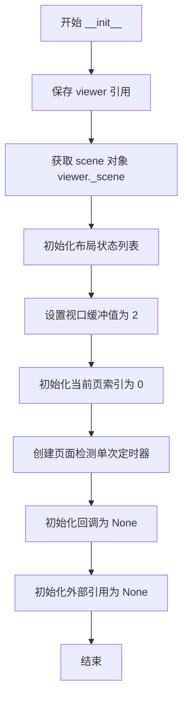

#### 带注释源码

```python
def __init__(self, viewer):
    self.viewer = viewer  # 主查看器对象引用
    self._scene = viewer._scene  # 场景对象引用
    
    # 布局状态 (此数据的 OWNER)
    self.image_positions: list[float] = []  # 每个图像的Y坐标位置列表
    self.image_heights: list[float] = []  # 每个图像的高度列表
    self.total_height: float = 0  # 总布局高度
    self.webtoon_width: float = 0  # Webtoon模式宽度
    self.image_spacing = 0  # 图像间距
    self.placeholder_height = 1000  # 占位符默认高度
    
    # 视口配置
    self.viewport_buffer = 2  # 在视口上方/下方加载 N 页
    
    # 当前页面跟踪
    self.current_page_index: int = 0  # 当前显示的页面索引
    self.page_detection_enabled = False  # 页面检测是否启用
    
    # 页面检测定时器 (单次触发)
    self.page_detection_timer = QTimer()
    self.page_detection_timer.setSingleShot(True)
    self.page_detection_timer.timeout.connect(self._enable_page_detection)
    
    # 页面检测启用时的回调函数
    self.on_page_detection_enabled = None
    # 其他管理器的引用 (由 LazyWebtoonManager 设置)
    self.image_loader = None  # 图像加载器
    self.coordinate_converter = None  # 坐标转换器
```

---

### `WebtoonLayoutManager.estimate_layout`

通过加载少量样本图片估算布局尺寸，无需加载所有图片。

参数：

-  `file_paths`：`list[str]` ，图像文件路径列表

返回值：`bool`，估算成功返回 True，失败返回 False

#### 流程图

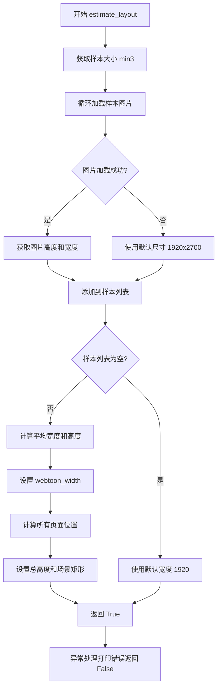

#### 带注释源码

```python
def estimate_layout(self, file_paths: list[str]) -> bool:
    """Estimate layout dimensions without loading all images."""
    try:
        # 加载前几张图片用于估算平均尺寸
        sample_size = min(3, len(file_paths))  # 最多取3张样本
        sample_widths = []  # 样本宽度列表
        sample_heights = []  # 样本高度列表
        
        for i in range(sample_size):
            # 仅快速加载元数据用于尺寸估算
            try:
                import imkit as imk
                img = imk.read_image(file_paths[i])
                if img is not None:
                    h, w = img.shape[:2]  # 获取高度和宽度
                    sample_widths.append(w)
                    sample_heights.append(h)
            except:
                # 回退到默认尺寸
                sample_widths.append(1920)
                sample_heights.append(2700)
        
        # 计算平均值
        avg_width = sum(sample_widths) // len(sample_widths) if sample_widths else 1920
        avg_height = sum(sample_heights) // len(sample_heights) if sample_heights else 2700
        
        self.webtoon_width = avg_width  # 设置 webtoon 宽度
        
        # 为所有页面估算位置
        current_y = 100  # 起始 Y 位置
        self.image_positions.clear()  # 清空位置列表
        self.image_heights.clear()  # 清空高度列表
        
        for i in range(len(file_paths)):
            self.image_positions.append(current_y)  # 添加当前位置
            # 如果已加载则使用实际高度，否则使用估算值
            height = sample_heights[min(i, len(sample_heights) - 1)] if sample_heights else self.placeholder_height
            self.image_heights.append(height)  # 添加高度
            current_y += height + self.image_spacing  # 移动到下一个位置
            
        self.total_height = current_y - self.image_spacing  # 计算总高度
        self._scene.setSceneRect(0, 0, self.webtoon_width, self.total_height)  # 设置场景矩形
        
        return True
        
    except Exception as e:
        print(f"Error estimating layout: {e}")
        return False
```

---

### `WebtoonLayoutManager.adjust_layout_for_actual_size`

当实际图片尺寸与估算不同时调整布局。

参数：

-  `page_idx`：`int`，页面索引
-  `actual_height`：`int`，实际图片高度

返回值：`int`，返回高度差值（如果有变化），否则返回 0

#### 流程图

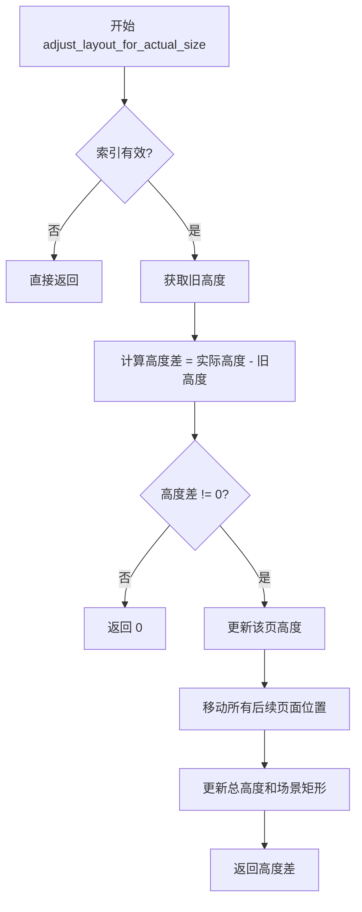

#### 带注释源码

```python
def adjust_layout_for_actual_size(self, page_idx: int, actual_height: int):
    """Adjust layout when actual image dimensions differ from estimates."""
    # 边界检查：确保索引在有效范围内
    if not (0 <= page_idx < len(self.image_heights)):
        return
        
    old_height = self.image_heights[page_idx]  # 记录旧高度
    height_diff = actual_height - old_height  # 计算高度差
    
    if height_diff != 0:
        # 更新此页的高度
        self.image_heights[page_idx] = actual_height
        
        # 移动所有后续页面
        for i in range(page_idx + 1, len(self.image_positions)):
            self.image_positions[i] += height_diff
        
        # 更新总高度和场景矩形
        self.total_height += height_diff
        self._scene.setSceneRect(0, 0, self.webtoon_width, self.total_height)
        
        return height_diff  # 返回高度差供调用者使用
    
    return 0
```

---

### `WebtoonLayoutManager.get_visible_pages`

获取当前视口中可见的页面（加上缓冲区域）。

参数：无

返回值：`Set[int]`，可见页面的索引集合

#### 流程图

```mermaid
flowchart TD
    A[开始 get_visible_pages] --> B{viewer 有视口?}
    B -->|是| C[获取视口矩形并转换到场景坐标]
    C --> D[计算可见区域顶部和底部]
    B -->|否| E[使用当前页位置估算可见区域]
    E --> D
    D --> F[初始化空集合]
    F --> G[遍历所有页面]
    G --> H{页面与可见区域相交?}
    H -->|是| I[添加到可见集合]
    H -->|否| J[继续下一页]
    I --> J
    J --> G
    G --> K[返回可见页面集合]
```

#### 带注释源码

```python
def get_visible_pages(self) -> Set[int]:
    """Get pages currently visible in viewport + buffer."""
    # 初始化期间，估算当前页周围的视口
    if hasattr(self.viewer, 'viewport') and self.viewer.viewport():
        viewport_rect = self.viewer.mapToScene(self.viewer.viewport().rect()).boundingRect()
        visible_top = viewport_rect.top() - (self.viewport_buffer * 1000)  # 上方缓冲
        visible_bottom = viewport_rect.bottom() + (self.viewport_buffer * 1000)  # 下方缓冲
    else:
        # 初始化期间回退 - 估算当前页周围
        current_page_y = self.image_positions[self.current_page_index] if self.current_page_index < len(self.image_positions) else 0
        visible_top = current_page_y - (self.viewport_buffer * 1000)
        visible_bottom = current_page_y + (self.viewport_buffer * 1000)
    
    visible_pages = set()  # 存储可见页面的集合
    # 遍历所有页面位置和高度
    for i, (y_pos, height) in enumerate(zip(self.image_positions, self.image_heights)):
        page_bottom = y_pos + height  # 页面底部位置
        # 检查页面是否与可见区域相交
        if y_pos < visible_bottom and page_bottom > visible_top:
            visible_pages.add(i)  # 添加到可见集合
                
    return visible_pages
```

---

### `WebtoonLayoutManager.get_pages_for_scene_bounds`

获取与给定场景矩形相交的所有页面。

参数：

-  `scene_rect`：`QRectF`，场景矩形区域

返回值：`Set[int]`，与矩形相交的页面索引集合

#### 流程图

```mermaid
flowchart TD
    A[开始 get_pages_for_scene_bounds] --> B[获取场景矩形的顶部和底部]
    B --> C[初始化空集合]
    C --> D[遍历所有页面]
    D --> E[计算页面底部]
    E --> F{矩形与页面不相交?}
    F -->|是| G[继续下一页]
    F -->|否| H[添加到集合]
    H --> G
    G --> D
    D --> I[返回页面集合]
```

#### 带注释源码

```python
def get_pages_for_scene_bounds(self, scene_rect: QRectF) -> Set[int]:
    """Get all pages that a scene rectangle intersects with."""
    pages = set()  # 存储相交的页面
    top = scene_rect.top()  # 矩形顶部
    bottom = scene_rect.bottom()  # 矩形底部
    
    # 遍历所有页面位置和高度
    for i, (page_y, page_height) in enumerate(zip(self.image_positions, self.image_heights)):
        page_bottom = page_y + page_height  # 计算页面底部
        
        # 检查矩形是否与此页面相交
        # 不相交的条件：矩形完全在页面下方 或 矩形完全在页面上方
        if not (bottom < page_y or top > page_bottom):
            pages.add(i)  # 添加页面索引到集合
    
    return pages
```

---

### `WebtoonLayoutManager.get_page_at_position`

获取给定 Y 坐标位置处的页面索引。

参数：

-  `y_pos`：`float`，场景中的 Y 坐标

返回值：`int`，页面索引，如果未找到则返回当前页索引

#### 流程图

```mermaid
flowchart TD
    A[开始 get_page_at_position] --> B[遍历所有页面位置和高度]
    B --> C{位置在页面范围内?}
    C -->|是| D[返回页面索引]
    C -->|否| E[继续下一页]
    E --> B
    B --> F[遍历完成未找到]
    F --> G[返回当前页索引]
```

#### 带注释源码

```python
def get_page_at_position(self, y_pos: float) -> int:
    """Get the page index at a given Y position."""
    # 遍历所有页面位置和高度
    for i, (pos, height) in enumerate(zip(self.image_positions, self.image_heights)):
        # 检查 y_pos 是否在该页面的范围内
        if pos <= y_pos <= pos + height:
            return i  # 返回找到的页面索引
    # 未找到则返回当前页索引作为默认值
    return self.current_page_index
```

---

### `WebtoonLayoutManager.scroll_to_page`

滚动到指定页面。

参数：

-  `page_index`：`int`，目标页面索引
-  `position`：`str`，滚动位置（'top'、'center'、'bottom'），默认为 'top'

返回值：`bool`，滚动成功返回 True，无效索引返回 False

#### 流程图

```mermaid
flowchart TD
    A[开始 scroll_to_page] --> B{索引有效?}
    B -->|否| C[打印错误返回 False]
    B -->|是| D[获取页面 Y 位置和高度]
    D --> E{position 参数?}
    E -->|top| F[目标 Y = 页面 Y]
    E -->|center| G[目标 Y = 页面 Y + 高度/2]
    E -->|bottom| H[目标 Y = 页面 Y + 高度]
    F --> I[保存旧页面索引]
    G --> I
    H --> I
    I --> J[更新当前页索引]
    J --> K[滚动到目标位置 centerOn]
    K --> L[启用延迟页面检测]
    L --> M{页面改变?}
    M -->|是| N[发送页面改变信号]
    M -->|否| O[返回 True]
    N --> O
```

#### 带注释源码

```python
def scroll_to_page(self, page_index: int, position: str = 'top'):
    """Scroll to a specific page."""
    # 检查索引有效性
    if not (0 <= page_index < len(self.image_positions)):
        print(f"WebtoonLayoutManager: Invalid page index {page_index}, total pages: {len(self.image_positions)}")
        return False
        
    # 计算目标位置
    page_y = self.image_positions[page_index]  # 页面 Y 坐标
    page_height = self.image_heights[page_index]  # 页面高度
    
    target_y = page_y  # 默认顶部
    if position == 'center':
        target_y += page_height / 2  # 居中位置
    elif position == 'bottom':
        target_y += page_height  # 底部位置
        
    print(f"WebtoonLayoutManager: Scrolling to page {page_index}, position {position}")
    print(f"  Page Y: {page_y}, Height: {page_height}, Target Y: {target_y}")
    
    # 滚动前更新当前页索引
    old_page = self.current_page_index
    self.current_page_index = page_index
    
    # 滚动到目标位置 (水平居中，垂直为目标 Y)
    self.viewer.centerOn(self.webtoon_width / 2, target_y)
    
    # 滚动后检查视口位置
    viewport_center = self.viewer.mapToScene(self.viewer.viewport().rect().center())
    print(f"  After scroll: viewport center is at {viewport_center.x()}, {viewport_center.y()}")
    
    # 延迟后启用页面检测
    self.viewer.event_handler._enable_page_detection_after_delay()
    
    # 如果页面实际改变，发送页面改变信号
    if old_page != page_index:
        self.viewer.page_changed.emit(page_index)
            
    return True
```

---

### `WebtoonLayoutManager.update_current_page`

根据视口中心更新当前页索引。

参数：

-  `loaded_pages_count`：`int`，已加载的页面数量，默认为 0

返回值：`bool`，页面改变返回 True，未改变返回 False

#### 流程图

```mermaid
flowchart TD
    A[开始 update_current_page] --> B{加载页数<3 或 检测未启用?}
    B -->|是| C[返回 False]
    B -->|是| D[获取视口中心 Y 坐标]
    D --> E[保存旧页面索引]
    E --> F[第一遍：严格检测 10% 边距]
    F --> G{在严格范围内?}
    G -->|是 且 不同页| H[更新索引返回 True]
    G -->|是 且 同一页| I[返回 False]
    G -->|否| J[第二遍：查找最近页面]
    J --> K{在页面范围内?}
    K -->|是| L[计算到页面中心距离]
    K -->|否| M[继续]
    M --> F
    L --> N[更新最近匹配]
    N --> O{有最近匹配且改变?}
    O -->|是| P[返回 True]
    O -->|否| Q[返回 False]
```

#### 带注释源码

```python
def update_current_page(self, loaded_pages_count: int = 0) -> bool:
    """Update current page index based on viewport center. Returns True if page changed."""
    # 初始加载期间或页面检测禁用时不更新
    if (loaded_pages_count < 3 or not self.page_detection_enabled):
        return False
        
    # 获取视口中心在场景中的 Y 坐标
    center_y = self.viewer.mapToScene(self.viewer.viewport().rect().center()).y()
    old_page = self.current_page_index
    
    # 仅当视口显著进入另一页面时才改变页面
    # 使用两遍方法：首先严格检测，然后宽松检测
    best_match_page = None
    best_match_distance = float('inf')
    
    # 遍历所有页面
    for i, (pos, height) in enumerate(zip(self.image_positions, self.image_heights)):
        page_center = pos + height / 2  # 页面中心
        page_top = pos  # 页面顶部
        page_bottom = pos + height  # 页面底部
        
        # 第一遍：严格检测 (10% 边距)
        margin = height * 0.1  # 10% 边距
        page_detection_top = pos + margin
        page_detection_bottom = pos + height - margin
        
        # 检查是否在严格范围内
        if page_detection_top <= center_y <= page_detection_bottom:
            if i != self.current_page_index:
                self.current_page_index = i
                return True  # 页面改变
            return False  # 同一页面
        
        # 第二遍：查找最近页面作为回退
        if page_top <= center_y <= page_bottom:
            # 视口在此页面的边界内（无边距）
            distance_from_center = abs(center_y - page_center)
            if distance_from_center < best_match_distance:
                best_match_distance = distance_from_center
                best_match_page = i
    
    # 如果没有页面匹配严格标准，使用最近匹配
    if best_match_page is not None and best_match_page != self.current_page_index:
        self.current_page_index = best_match_page
        return True  # 页面改变
            
    return False  # 无变化
```

---

### `WebtoonLayoutManager.update_page_on_click`

检查点击是否发生在新页面上并更新当前页。

参数：

-  `scene_pos`：`QPointF`，场景中的点击位置

返回值：`bool`，页面改变返回 True，未改变返回 False

#### 流程图

```mermaid
flowchart TD
    A[开始 update_page_on_click] --> B[获取点击位置的页面索引]
    B --> C{页面不同于当前页?}
    C -->|是| D[更新当前页索引返回 True]
    C -->|否| E[返回 False]
```

#### 带注释源码

```python
def update_page_on_click(self, scene_pos: QPointF) -> bool:
    """Check if a click occurred on a new page and update current page. Returns True if changed."""
    page = self.get_page_at_position(scene_pos.y())  # 获取点击位置对应的页面
    if page != self.current_page_index:  # 如果页面改变
        self.current_page_index = page
        return True  # 返回改变
    return False  # 未改变
```

---

### `WebtoonLayoutManager.ensure_current_page_visible`

确保当前页面可见并正确设置视图。

参数：

-  `image_items`：`dict`，页面图像项字典

返回值：`None`，无返回值

#### 流程图

```mermaid
flowchart TD
    A[开始 ensure_current_page_visible] --> B[打印调试信息]
    B --> C{当前页在 image_items 中?}
    C -->|否| D[直接返回]
    C -->|是| E[调用 fitInView]
    E --> F[获取视口中心 Y]
    F --> G[计算当前页中心 Y]
    G --> H[计算距离和阈值]
    H --> I{距离 > 阈值?}
    I -->|是| J[滚动到页面中心]
    I -->|否| K[直接返回]
```

#### 带注释源码

```python
def ensure_current_page_visible(self, image_items: dict):
    """Ensure the current page is visible and view is properly set up."""
    print(f"WebtoonLayoutManager: ensure_current_page_visible: current_page_index = {self.current_page_index}")
    
    # 检查当前页是否已加载
    if self.current_page_index in image_items:
        self.viewer.fitInView()  # 适应视图
        
        # 检查视口位置
        viewport_center = self.viewer.mapToScene(self.viewer.viewport().rect().center()).y()
        current_page_center = self.image_positions[self.current_page_index] + (self.image_heights[self.current_page_index] / 2)
        
        print(f"Viewport center: {viewport_center}, Page center: {current_page_center}")
        
        # 如果视口离当前页很远，滚动到该页
        distance = abs(viewport_center - current_page_center)
        threshold = self.image_heights[self.current_page_index] / 4  # 1/4 高度作为阈值
        print(f"Distance: {distance}, Threshold: {threshold}")
        
        if distance > threshold:
            self.scroll_to_page(self.current_page_index, 'center')  # 滚动到页面中心
```

---

### `WebtoonLayoutManager.enable_page_detection_after_delay`

延迟后启用页面检测，让视口稳定下来。

参数：无

返回值：`None`，无返回值

#### 流程图

```mermaid
flowchart TD
    A[开始 enable_page_detection_after_delay] --> B[启动 1000ms 定时器]
    B --> C[结束]
```

#### 带注释源码

```python
def enable_page_detection_after_delay(self):
    """Enable page detection after a delay to let viewport settle."""
    self.page_detection_timer.start(1000)  # 1 秒延迟后触发
```

---

### `WebtoonLayoutManager._enable_page_detection`

初始化完成后启用页面检测。

参数：无

返回值：`None`，无返回值

#### 流程图

```mermaid
flowchart TD
    A[开始 _enable_page_detection] --> B[设置启用标志为 True]
    B --> C{回调已设置?}
    C -->|是| D[调用回调函数]
    C -->|否| E[结束]
```

#### 带注释源码

```python
def _enable_page_detection(self):
    """Enable page detection after initialization is complete."""
    self.page_detection_enabled = True  # 启用页面检测
    
    # 如果设置了回调则通知
    if self.on_page_detection_enabled:
        self.on_page_detection_enabled()
```

---

### `WebtoonLayoutManager.set_page_detection_delay`

设置页面检测定时器延迟。

参数：

-  `delay`：`int`，延迟时间（毫秒）

返回值：`None`，无返回值

#### 流程图

```mermaid
flowchart TD
    A[开始 set_page_detection_delay] --> B{delay > 0?}
    B -->|是| C[设置定时器间隔]
    B -->|否| D[不设置]
```

#### 带注释源码

```python
def set_page_detection_delay(self, delay: int):
    """Set the page detection timer delay."""
    if delay > 0:  # 确保延迟有效
        self.page_detection_timer.setInterval(delay)
```

---

### `WebtoonLayoutManager.get_page_detection_delay`

获取当前页面检测定时器延迟。

参数：无

返回值：`int`，当前定时器间隔（毫秒）

#### 流程图

```mermaid
flowchart TD
    A[开始 get_page_detection_delay] --> B{定时器有 interval 方法?}
    B -->|是| C[返回定时器间隔]
    B -->|否| D[返回默认值 1000]
```

#### 带注释源码

```python
def get_page_detection_delay(self) -> int:
    """Get the current page detection timer delay."""
    # 返回定时器间隔，如果没有则返回默认值 1000ms
    return self.page_detection_timer.interval() if hasattr(self.page_detection_timer, 'interval') else 1000
```

---

### `WebtoonLayoutManager.disable_page_detection`

禁用页面检测。

参数：无

返回值：`None`，无返回值

#### 流程图

```mermaid
flowchart TD
    A[开始 disable_page_detection] --> B[设置启用标志为 False]
    B --> C[停止定时器]
    C --> D[结束]
```

#### 带注释源码

```python
def disable_page_detection(self):
    """Disable page detection."""
    self.page_detection_enabled = False  # 禁用页面检测
    self.page_detection_timer.stop()  # 停止定时器
```

---

### `WebtoonLayoutManager.scene_to_page_coordinates`

将场景坐标转换为页面局部坐标。

参数：

-  `scene_pos`：`QPointF`，场景坐标点

返回值：`Tuple[int, QPointF]`，页面索引和页面局部坐标

#### 流程图

```mermaid
flowchart TD
    A[开始 scene_to_page_coordinates] --> B[获取页面索引]
    B --> C{索引有效?}
    C -->|是| D[获取页面 Y 位置]
    D --> E[计算局部 X 和 Y]
    E --> F[返回索引和局部坐标]
    C -->|否| G[返回索引和原始坐标]
```

#### 带注释源码

```python
def scene_to_page_coordinates(self, scene_pos: QPointF) -> Tuple[int, QPointF]:
    """Convert scene coordinates to page-local coordinates."""
    page_index = self.get_page_at_position(scene_pos.y())  # 获取页面索引
    if 0 <= page_index < len(self.image_positions):  # 检查索引有效性
        page_y = self.image_positions[page_index]  # 获取页面 Y 位置
        # 需要图片数据计算页面宽度 - 委托给坐标转换器
        local_x = scene_pos.x()  # 简化版本 X 保持不变
        local_y = scene_pos.y() - page_y  # Y 减去页面起始位置
        return page_index, QPointF(local_x, local_y)
    return page_index, scene_pos  # 无效则返回原始坐标
```

---

### `WebtoonLayoutManager.page_to_scene_coordinates`

将页面局部坐标转换为场景坐标。

参数：

-  `page_index`：`int`，页面索引
-  `local_pos`：`QPointF`，页面局部坐标

返回值：`QPointF`，场景坐标点

#### 流程图

```mermaid
flowchart TD
    A[开始 page_to_scene_coordinates] --> B{索引有效?}
    B -->|否| C[返回原始坐标]
    B -->|是| D[获取页面 Y 位置]
    D --> E[计算场景 X 和 Y]
    E --> F[返回场景坐标]
```

#### 带注释源码

```python
def page_to_scene_coordinates(self, page_index: int, local_pos: QPointF) -> QPointF:
    """Convert page-local coordinates to scene coordinates."""
    if not (0 <= page_index < len(self.image_positions)):  # 边界检查
        return local_pos
    
    page_y = self.image_positions[page_index]  # 获取页面 Y 位置
    # 需要图片数据计算页面宽度 - 委托给坐标转换器
    scene_x = local_pos.x()  # 简化版本 X 保持不变
    scene_y = local_pos.y() + page_y  # Y 加上页面起始位置
    return QPointF(scene_x, scene_y)
```

---

### `WebtoonLayoutManager.clear`

清除所有布局状态。

参数：无

返回值：`None`，无返回值

#### 流程图

```mermaid
flowchart TD
    A[开始 clear] --> B[停止定时器]
    B --> C[禁用页面检测]
    C --> D[重置当前页索引为 0]
    D --> E[重置总高度和宽度为 0]
    E --> F[清空位置和高度列表]
    F --> G[结束]
```

#### 带注释源码

```python
def clear(self):
    """Clear all layout state."""
    self.page_detection_timer.stop()  # 停止定时器
    self.page_detection_enabled = False  # 禁用页面检测
    self.current_page_index = 0  # 重置当前页
    self.total_height = 0  # 重置总高度
    self.webtoon_width = 0  # 重置宽度
    self.image_positions.clear()  # 清空位置列表
    self.image_heights.clear()  # 清空高度列表
```

---

### `WebtoonLayoutManager._recalculate_layout`

在页面添加/删除后重新计算布局位置。

参数：无

返回值：`None`，无返回值

#### 流程图

```mermaid
flowchart TD
    A[开始 _recalculate_layout] --> B{有图像文件路径?}
    B -->|否| C[清空数据设置空场景矩形]
    B -->|是| D[从零开始重新计算位置]
    D --> E[遍历所有文件路径]
    E --> F[添加位置和高度到列表]
    F --> G[计算总高度]
    G --> H[设置场景矩形]
    H --> I[更新查看器场景矩形]
    I --> J[更新已加载页的图像项位置]
    J --> K[更新占位符位置]
    K --> L[结束]
```

#### 带注释源码

```python
def _recalculate_layout(self):
    """Recalculate layout positions after page addition/removal."""
    # 检查是否有图像文件路径
    if not self.image_loader.image_file_paths:
        self.total_height = 0
        self.image_positions.clear()
        self.image_heights.clear()
        self._scene.setSceneRect(0, 0, 0, 0)
        return
    
    # 从头重新计算位置
    current_y = 100  # 起始 Y 位置
    new_positions = []  # 新位置列表
    
    # 遍历所有图像文件路径
    for i in range(len(self.image_loader.image_file_paths)):
        new_positions.append(current_y)  # 添加当前位置
        # 如果有现有高度则使用，否则估算
        height = self.image_heights[i] if i < len(self.image_heights) else 1000
        current_y += height + self.image_spacing  # 移动到下一位置
    
    # 使用新位置更新布局管理器
    self.image_positions = new_positions
    
    # 更新总高度
    self.total_height = current_y - self.image_spacing if new_positions else 0
    
    # 更新场景矩形到新尺寸
    scene_rect = QRectF(0, 0, self.webtoon_width, self.total_height)
    self._scene.setSceneRect(scene_rect)
    
    # 也更新查看器的场景矩形以确保滚动条更新
    self.viewer.setSceneRect(scene_rect)
    
    # 更新已加载页的图像项位置
    for page_idx in list(self.image_loader.loaded_pages):
        if page_idx < len(self.image_positions) and page_idx in self.image_loader.image_items:
            item = self.image_loader.image_items[page_idx]
            y_pos = self.image_positions[page_idx]
            # 计算 X 位置（居中）
            if page_idx in self.image_loader.image_data:
                img_width = self.image_loader.image_data[page_idx].shape[1]
                x_offset = (self.webtoon_width - img_width) / 2
            else:
                x_offset = item.pos().x()  # 保持现有 X 位置
            item.setPos(x_offset, y_pos)
    
    # 更新占位符位置（如果存在）
    for page_idx in list(self.image_loader.placeholder_items.keys()):
        if page_idx < len(self.image_positions):
            placeholder = self.image_loader.placeholder_items[page_idx]
            y_pos = self.image_positions[page_index]
            placeholder.setPos(0, y_pos)
```

---

## 关键组件信息

| 组件名称 | 一句话描述 |
|---------|-----------|
| `image_positions` | 存储每个页面在场景中的 Y 坐标位置列表 |
| `image_heights` | 存储每个页面的高度列表，用于布局计算 |
| `total_height` | 整个 Webtoon 内容的总高度 |
| `webtoon_width` | Webtoon 模式的宽度，基于样本图片平均宽度 |
| `viewport_buffer` | 视口缓冲系数，控制预加载页面的数量 |
| `current_page_index` | 当前显示的页面索引，用于跟踪阅读位置 |
| `page_detection_enabled` | 布尔标志，控制是否启用页面检测功能 |
| `page_detection_timer` | 单次触发定时器，用于延迟启用页面检测 |
| `image_loader` | 外部图像加载器引用，用于访问已加载页面和图像项 |
| `coordinate_converter` | 外部坐标转换器引用，用于页面坐标与场景坐标转换 |

---

## 潜在的技术债务或优化空间

1. **硬编码值**：多处使用硬编码的 `1000` 作为占位符高度和缓冲区计算，应提取为配置常量
2. **坐标转换简化**：`scene_to_page_coordinates` 和 `page_to_scene_coordinates` 方法中的 X 坐标计算被简化为直接传递，需要实现完整的坐标转换逻辑
3. **异常处理不足**：`estimate_layout` 方法中的异常捕获过于宽泛，应区分不同类型的错误
4. **重复计算**：`_recalculate_layout` 中存在重复的位置计算逻辑，可提取为独立方法
5. **调试打印语句**：代码中存在多处 `print` 语句用于调试，应使用日志框架替代
6. **类型注解不完整**：部分方法缺少类型注解或使用了过于宽泛的类型

---

## 其它项目

### 设计目标与约束

- **单一数据源**：作为 Webtoon 布局信息的唯一真实来源，所有页面位置和尺寸数据都由此类管理
- **延迟加载支持**：通过样本估算和实际尺寸调整机制，支持渐进式加载
- **视口感知**：能够计算当前可见区域和预加载区域，优化性能

### 错误处理与异常设计

- `estimate_layout` 使用 try-except 捕获异常，返回 False 表示失败
- 索引访问前进行边界检查，防止越界错误
- 使用 `hasattr` 检查对象属性是否存在，增强兼容性

### 数据流与状态机

- 布局状态通过 `image_positions` 和 `image_heights` 列表维护
- 页面检测状态机：`disabled` → `timer_waiting` → `enabled`
- 滚动操作触发状态转换：滚动 → 延迟检测 → 启用检测 → 页面更新

### 外部依赖与接口契约

- 依赖 `viewer` 对象：访问场景、视口、事件处理器
- 依赖 `image_loader`：获取已加载页面、图像数据、占位符
- 依赖 `coordinate_converter`：完整坐标转换（当前为简化实现）
- 依赖 `QTimer`：页面检测延迟机制


### `WebtoonLayoutManager.ensure_current_page_visible`

确保当前页面可见，并使视图正确设置。

参数：

- `image_items`：`dict`，包含已加载图像项的字典，键为页面索引，值为图像项对象

返回值：`None`，无返回值，仅执行视图操作

#### 流程图

```mermaid
flowchart TD
    A[开始 ensure_current_page_visible] --> B[打印当前页码信息]
    B --> C{current_page_index 是否在 image_items 中?}
    C -->|是| D[调用 viewer.fitInView]
    C -->|否| H[结束]
    D --> E[获取视口中心 Y 坐标和当前页中心 Y 坐标]
    E --> F[计算距离和阈值]
    F --> G{distance > threshold?}
    G -->|是| I[调用 scroll_to_page 滚动到页中心]
    G -->|否| H
    I --> H
```

#### 带注释源码

```
def ensure_current_page_visible(self, image_items: dict):
    """Ensure the current page is visible and view is properly set up."""
    # 打印调试信息：当前页码索引
    print(f"WebtoonLayoutManager: ensure_current_page_visible: current_page_index = {self.current_page_index}")
    
    # 检查当前页是否在已加载的图像项中
    if self.current_page_index in image_items:
        # 让视图适应内容（自动缩放以适应场景）
        self.viewer.fitInView()
        
        # 计算视口中心在场景中的 Y 坐标
        viewport_center = self.viewer.mapToScene(self.viewer.viewport().rect().center()).y()
        # 计算当前页的中心 Y 坐标
        current_page_center = self.image_positions[self.current_page_index] + (self.image_heights[self.current_page_index] / 2)
        
        # 打印调试信息：视口中心和页中心
        print(f"Viewport center: {viewport_center}, Page center: {current_page_center}")
        
        # 计算视口中心与页中心的距离
        distance = abs(viewport_center - current_page_center)
        # 计算触发滚动的阈值（页高的1/4）
        threshold = self.image_heights[self.current_page_index] / 4
        # 打印调试信息：距离和阈值
        print(f"Distance: {distance}, Threshold: {threshold}")
        
        # 如果视口偏离当前页中心超过阈值，则滚动到该页
        if distance > threshold:
            self.scroll_to_page(self.current_page_index, 'center')
```


### `WebtoonLayoutManager.__init__`

初始化 WebtoonLayoutManager 类，管理 webtoon 模式的布局和视口计算。该方法是类的构造函数，负责设置布局管理器的初始状态，包括场景引用、布局状态存储、视口配置、页面检测定时器以及相关管理器的引用。

参数：

- `self`：隐式参数，WebtoonLayoutManager 实例本身
- `viewer`：`object`，主 viewer 对象，用于访问场景、视口和事件处理等

返回值：`None`，无返回值

#### 流程图

```mermaid
flowchart TD
    A[__init__ 开始] --> B[接收 viewer 参数]
    B --> C[设置 self.viewer 和 self._scene 引用]
    
    C --> D[初始化布局状态数据]
    D --> D1[创建空列表 image_positions]
    D1 --> D2[创建空列表 image_heights]
    D2 --> D3[设置 total_height = 0]
    D3 --> D4[设置 webtoon_width = 0]
    D4 --> D5[设置 image_spacing = 0]
    D5 --> D6[设置 placeholder_height = 1000]
    
    D6 --> E[配置视口参数]
    E --> E1[设置 viewport_buffer = 2]
    E1 --> E2[设置 current_page_index = 0]
    E2 --> E3[设置 page_detection_enabled = False]
    
    E3 --> F[创建页面检测定时器]
    F --> F1[创建 QTimer 实例]
    F1 --> F2[设置为单次触发模式]
    F2 --> F3[连接 timeout 信号到 _enable_page_detection]
    
    F3 --> G[初始化回调和外部引用]
    G --> G1[设置 on_page_detection_enabled = None]
    G1 --> G2[设置 image_loader = None]
    G2 --> G3[设置 coordinate_converter = None]
    
    G3 --> H[初始化完成]
```

#### 带注释源码

```python
def __init__(self, viewer):
    """初始化 WebtoonLayoutManager。
    
    Args:
        viewer: 主 viewer 对象，需要包含 _scene 属性和视口相关方法
    """
    # 保存 viewer 引用，用于后续访问场景、视口和事件处理
    self.viewer = viewer
    # 获取场景对象，用于设置场景矩形和访问场景元素
    self._scene = viewer._scene
    
    # =========================================================
    # 布局状态数据 (OWNER of this data - 该类负责管理这些数据)
    # =========================================================
    
    # 存储每个图像的 Y 起始位置，用于定位页面在场景中的位置
    self.image_positions: list[float] = []
    # 存储每个图像的高度，用于计算页面边界和视口可见性
    self.image_heights: list[float] = []
    # 所有页面的总高度，用于设置场景矩形大小
    self.total_height: float = 0
    # Webtoon 模式下的画布宽度，基于样本图像平均宽度计算
    self.webtoon_width: float = 0
    # 图像之间的间距，用于页面定位计算
    self.image_spacing = 0
    # 占位符高度，用于在图像加载前进行布局估算
    self.placeholder_height = 1000
    
    # =========================================================
    # 视口配置
    # =========================================================
    
    # 视口缓冲大小：额外加载视口上方 N 页和下方 N 页的图像
    self.viewport_buffer = 2  # Load N pages above/below viewport
    
    # =========================================================
    # 当前页面跟踪
    # =========================================================
    
    # 当前显示的页面索引，用于页面切换检测
    self.current_page_index: int = 0
    # 页面检测开关，防止在初始化期间误触发页面切换事件
    self.page_detection_enabled = False
    
    # =========================================================
    # 页面检测定时器
    # =========================================================
    
    # 创建单次触发的定时器，用于延迟启用页面检测
    self.page_detection_timer = QTimer()
    # 设置为单次触发模式：定时器到期后只执行一次，不会重复
    self.page_detection_timer.setSingleShot(True)
    # 连接到内部方法，到期时启用页面检测
    self.page_detection_timer.timeout.connect(self._enable_page_detection)
    
    # =========================================================
    # 回调函数和外部管理器引用
    # =========================================================
    
    # 页面检测启用时的回调函数，由外部设置
    self.on_page_detection_enabled = None
    # 图像加载器引用，由 LazyWebtoonManager 延迟设置
    self.image_loader = None
    # 坐标转换器引用，用于坐标系统转换
    self.coordinate_converter = None
```


### `WebtoonLayoutManager.estimate_layout`

该方法通过仅加载前几张图片（默认3张）的元数据来估算所有页面的布局尺寸和位置，避免一次性加载所有图片带来的性能开销，是Webtoon布局管理的核心初始化方法。

参数：

- `file_paths`：`list[str]`，待布局的所有图片文件路径列表

返回值：`bool`，返回`True`表示布局估算成功，返回`False`表示估算失败

#### 流程图

```mermaid
flowchart TD
    A[开始 estimate_layout] --> B[确定采样数量 sample_size = min(3, len(file_paths))]
    B --> C[循环遍历前 sample_size 张图片]
    C --> D{图片加载成功?}
    D -->|是| E[获取图片高度h和宽度w]
    D -->|否| F[使用默认尺寸 1920x2700]
    E --> G[添加到 sample_widths 和 sample_heights]
    F --> G
    G --> H{还有更多图片需要采样?}
    H -->|是| C
    H -->|否| I[计算平均宽度 avg_width]
    I --> J[设置 webtoon_width = avg_width]
    J --> K[初始化 current_y = 100, 清空 image_positions 和 image_heights]
    K --> L[循环遍历所有 file_paths]
    L --> M[计算当前页面高度 height]
    M --> N[追加位置和高度到列表]
    N --> O[current_y += height + image_spacing]
    O --> P{还有更多页面?}
    P -->|是| L
    P -->|否| Q[计算 total_height = current_y - image_spacing]
    Q --> R[设置场景矩形 setSceneRect]
    R --> S[返回 True]
    
    style S fill:#90EE90
    style G fill:#FFB6C1
```

#### 带注释源码

```
def estimate_layout(self, file_paths: list[str]) -> bool:
    """Estimate layout dimensions without loading all images."""
    try:
        # Load just the first few images to estimate average dimensions
        # 仅加载前几张图片用于估算平均尺寸，避免全量加载
        sample_size = min(3, len(file_paths))
        sample_widths = []
        sample_heights = []
        
        # 遍历前 sample_size 张图片获取样本尺寸
        for i in range(sample_size):
            # Quick metadata-only load for size estimation
            # 快速加载图片元数据用于尺寸估算
            try:
                import imkit as imk
                img = imk.read_image(file_paths[i])
                if img is not None:
                    h, w = img.shape[:2]
                    sample_widths.append(w)
                    sample_heights.append(h)
            except:
                # Fallback to default dimensions
                # 加载失败时使用默认尺寸作为后备
                sample_widths.append(1920)
                sample_heights.append(2700)
        
        # Calculate averages
        # 计算平均宽度和高度
        avg_width = sum(sample_widths) // len(sample_widths) if sample_widths else 1920
        avg_height = sum(sample_heights) // len(sample_heights) if sample_heights else 2700
        
        self.webtoon_width = avg_width  # 设置Webtoon宽度为平均宽度
        
        # Estimate positions for all pages
        # 为所有页面估算位置
        current_y = 100  # 初始Y位置（留出顶部边距）
        self.image_positions.clear()  # 清空位置列表
        self.image_heights.clear()   # 清空高度列表
        
        # 遍历所有文件路径，估算每个页面的位置和高度
        for i in range(len(file_paths)):
            self.image_positions.append(current_y)  # 记录当前页面起始Y坐标
            # Use actual height if already loaded, otherwise estimate
            # 如果样本中有对应索引的高度则使用，否则使用占位符高度
            height = sample_heights[min(i, len(sample_heights) - 1)] if sample_heights else self.placeholder_height
            self.image_heights.append(height)  # 记录当前页面高度
            current_y += height + self.image_spacing  # 更新下一个页面的起始位置
            
        # 计算总高度（减去最后一个间距）
        self.total_height = current_y - self.image_spacing
        # 更新场景矩形以匹配布局尺寸
        self._scene.setSceneRect(0, 0, self.webtoon_width, self.total_height)
        
        return True  # 布局估算成功
        
    except Exception as e:
        print(f"Error estimating layout: {e}")
        return False  # 发生异常时返回失败
```


### `WebtoonLayoutManager.adjust_layout_for_actual_size`

当图像的实际尺寸与预估尺寸不同时，调整布局中指定页面及其后续所有页面的位置和高度，并更新场景矩形的总高度。

参数：

- `page_idx`：`int`，需要调整的页面索引
- `actual_height`：`int`，图像的实际高度，用于替换原先的预估高度

返回值：`int`，返回高度差（`actual_height - old_height`），如果高度未变化则返回 0

#### 流程图

```mermaid
flowchart TD
    A[开始 adjust_layout_for_actual_size] --> B{page_idx 是否在有效范围内?}
    B -- 否 --> C[直接返回]
    C --> D[结束]
    B -- 是 --> E[获取 old_height = image_heights[page_idx]]
    E --> F[计算 height_diff = actual_height - old_height]
    F --> G{height_diff != 0?}
    G -- 否 --> H[返回 0]
    H --> D
    G -- 是 --> I[更新 image_heights[page_idx] = actual_height]
    I --> J[遍历 page_idx + 1 到末尾的所有页面]
    J --> K[将每个后续页面的 image_positions[i] 加上 height_diff]
    K --> L[更新 total_height += height_diff]
    L --> M[调用 _scene.setSceneRect 更新场景矩形]
    M --> N[返回 height_diff]
    N --> D
```

#### 带注释源码

```python
def adjust_layout_for_actual_size(self, page_idx: int, actual_height: int):
    """Adjust layout when actual image dimensions differ from estimates."""
    # 参数校验：确保页面索引在有效范围内
    if not (0 <= page_idx < len(self.image_heights)):
        return  # 无效索引直接返回，不做任何处理
        
    # 记录调整前的页面高度
    old_height = self.image_heights[page_idx]
    # 计算新旧高度之间的差值
    height_diff = actual_height - old_height
    
    # 仅当高度确实发生变化时才执行调整逻辑
    if height_diff != 0:
        # 1. 更新指定页面的高度为实际高度
        self.image_heights[page_idx] = actual_height
        
        # 2. 调整所有后续页面的垂直位置
        # 由于当前页面高度变化，后续所有页面需要相应平移
        for i in range(page_idx + 1, len(self.image_positions)):
            self.image_positions[i] += height_diff
        
        # 3. 更新布局总高度
        self.total_height += height_diff
        
        # 4. 更新场景矩形以反映新的布局尺寸
        # 确保视口滚动条等UI组件能正确响应布局变化
        self._scene.setSceneRect(0, 0, self.webtoon_width, self.total_height)
        
        # 返回高度差，供调用者（如图像加载器）使用
        return height_diff
    
    # 如果高度未变化，返回 0
    return 0
```


### `WebtoonLayoutManager.get_visible_pages`

获取当前视口内可见的页面集合（包含预加载缓冲区）。该方法通过计算视口矩形并扩展缓冲区边界，然后遍历所有页面位置信息，筛选出与可见区域相交的页面索引。

参数：

- 无

返回值：`Set[int]`，返回当前可见的页面索引集合

#### 流程图

```mermaid
flowchart TD
    A[开始 get_visible_pages] --> B{检查 viewer 和 viewport 是否存在}
    B -->|是| C[获取 viewport 矩形并转换为场景坐标]
    B -->|否| D[基于当前页索引计算 fallback 可见区域]
    
    C --> E[计算可见区域: top = viewport.top - buffer*1000]
    E --> F[计算可见区域: bottom = viewport.bottom + buffer*1000]
    D --> F
    
    F --> G[初始化空集合 visible_pages]
    G --> H{遍历所有页面 i}
    
    H -->|对于每个页面| I[计算页面底部位置: page_bottom = y_pos + height]
    I --> J{检查页面是否与可见区域相交}
    
    J -->|是| K[将页面索引 i 加入 visible_pages]
    J -->|否| L[继续下一页面]
    K --> L
    
    H -->|遍历完成| M[返回 visible_pages 集合]
```

#### 带注释源码

```
def get_visible_pages(self) -> Set[int]:
    """Get pages currently visible in viewport + buffer."""
    
    # 步骤1: 确定可见区域的上下边界
    # 检查 viewer 对象和 viewport 是否存在（可能在初始化阶段不存在）
    if hasattr(self.viewer, 'viewport') and self.viewer.viewport():
        # 获取视口矩形并映射到场景坐标系
        viewport_rect = self.viewer.mapToScene(self.viewer.viewport().rect()).boundingRect()
        
        # 计算扩展后的可见区域（包含缓冲区）
        # viewport_buffer = 2，预留 2000 像素的缓冲区
        visible_top = viewport_rect.top() - (self.viewport_buffer * 1000)  # Buffer above
        visible_bottom = viewport_rect.bottom() + (self.viewport_buffer * 1000)  # Buffer below
    else:
        # 初始化阶段的降级处理：基于当前页面位置估算可见区域
        current_page_y = self.image_positions[self.current_page_index] if self.current_page_index < len(self.image_positions) else 0
        visible_top = current_page_y - (self.viewport_buffer * 1000)
        visible_bottom = current_page_y + (self.viewport_buffer * 1000)
    
    # 步骤2: 遍历所有页面，找出与可见区域相交的页面
    visible_pages = set()
    for i, (y_pos, height) in enumerate(zip(self.image_positions, self.image_heights)):
        page_bottom = y_pos + height
        
        # 判断页面是否与可见区域相交：
        # 页面顶部在可见区域下方 AND 页面底部在可见区域上方
        if y_pos < visible_bottom and page_bottom > visible_top:
            visible_pages.add(i)
            
    # 步骤3: 返回可见页面的索引集合
    return visible_pages
```


### `WebtoonLayoutManager.get_pages_for_scene_bounds`

获取与给定场景矩形相交的所有页面索引。

参数：

- `scene_rect`：`QRectF`，场景矩形，用于检测与页面的相交情况

返回值：`Set[int]`，与场景矩形相交的页面索引集合

#### 流程图

```mermaid
flowchart TD
    A[开始] --> B[初始化空集合 pages]
    B --> C[获取 scene_rect 的 top 和 bottom 边界]
    C --> D[遍历所有页面 i, page_y, page_height]
    D --> E[计算 page_bottom = page_y + page_height]
    E --> F{判断是否相交<br/>bottom < page_y 或<br/>top > page_bottom?}
    F -->|是| G[不相交，跳过]
    F -->|否| H[相交，将索引 i 加入 pages]
    G --> I{还有更多页面?}
    H --> I
    I -->|是| D
    I -->|否| J[返回 pages 集合]
    J --> K[结束]
```

#### 带注释源码

```python
def get_pages_for_scene_bounds(self, scene_rect: QRectF) -> Set[int]:
    """Get all pages that a scene rectangle intersects with."""
    # 初始化结果集合，用于存储相交的页面索引
    pages = set()
    
    # 获取场景矩形的上下边界
    top = scene_rect.top()
    bottom = scene_rect.bottom()
    
    # 遍历所有页面的位置和高度信息
    for i, (page_y, page_height) in enumerate(zip(self.image_positions, self.image_heights)):
        # 计算每个页面的底部位置
        page_bottom = page_y + page_height
        
        # 检查矩形是否与当前页面相交
        # 如果满足以下任一条件，则不相交：
        # 1. 矩形底部在页面顶部之上 (bottom < page_y)
        # 2. 矩形顶部在页面底部之下 (top > page_bottom)
        # 反之则表示相交
        if not (bottom < page_y or top > page_bottom):
            pages.add(i)
    
    # 返回所有与场景矩形相交的页面索引集合
    return pages
```


### `WebtoonLayoutManager.get_page_at_position`

根据给定的 Y 坐标位置，返回该位置所在的页面索引。如果未找到匹配的页面，则返回当前页面索引作为默认值。

参数：

-  `y_pos`：`float`，场景中的 Y 坐标位置，用于确定对应的页面索引

返回值：`int`，返回给定 Y 坐标所在的页面索引；如果 Y 坐标不在任何页面范围内，则返回 `self.current_page_index`

#### 流程图

```mermaid
flowchart TD
    A[开始: get_page_at_position] --> B[输入: y_pos 坐标]
    B --> C[遍历所有页面: for i, (pos, height) in enumerate]
    C --> D{判断: pos <= y_pos <= pos + height?}
    D -->|是| E[返回: 页面索引 i]
    D -->|否| F{还有更多页面?}
    F -->|是| C
    F -->|否| G[返回: 当前页面索引 self.current_page_index]
    E --> H[结束]
    G --> H
```

#### 带注释源码

```python
def get_page_at_position(self, y_pos: float) -> int:
    """
    Get the page index at a given Y position.
    
    Args:
        y_pos: The Y coordinate in scene space to query.
        
    Returns:
        The page index that contains the given Y position.
        Returns current_page_index if no match is found.
    """
    # 遍历所有已知的页面位置和高度
    for i, (pos, height) in enumerate(zip(self.image_positions, self.image_heights)):
        # 检查 y_pos 是否在当前页面的垂直范围内
        # 页面范围: [pos, pos + height]
        if pos <= y_pos <= pos + height:
            return i  # 找到匹配的页面，返回索引
    
    # 如果没有找到匹配的页面，返回当前页面索引作为默认值
    return self.current_page_index
```


### `WebtoonLayoutManager.scroll_to_page`

将视图滚动到指定页面的指定位置（顶部、中心或底部），同时更新当前页码索引并触发页面变化信号。

参数：

- `page_index`：`int`，要滚动到的页面索引
- `position`：`str`，滚动目标位置，可选值为 `'top'`（默认）、`'center'`、`'bottom'`

返回值：`bool`，表示滚动操作是否成功执行。失败原因通常为无效的页面索引。

#### 流程图

```mermaid
flowchart TD
    A[开始 scroll_to_page] --> B{page_index 是否有效?}
    B -->|无效| C[打印错误信息]
    C --> D[返回 False]
    B -->|有效| E[获取 page_y 和 page_height]
    E --> F{position 参数值?}
    F -->|top| G[target_y = page_y]
    F -->|center| H[target_y = page_y + page_height / 2]
    F -->|bottom| I[target_y = page_y + page_height]
    G --> J[记录 old_page 并更新 current_page_index]
    H --> J
    I --> J
    J --> K[调用 viewer.centerOn 滚动到目标位置]
    K --> L[获取并打印 viewport 中心坐标]
    L --> M[调用事件处理器的延迟页面检测]
    M --> N{old_page != page_index?}
    N -->|是| O[发送 page_changed 信号]
    N -->|否| P[返回 True]
    O --> P
```

#### 带注释源码

```python
def scroll_to_page(self, page_index: int, position: str = 'top'):
    """Scroll to a specific page."""
    # 参数校验：检查页面索引是否在有效范围内
    if not (0 <= page_index < len(self.image_positions)):
        print(f"WebtoonLayoutManager: Invalid page index {page_index}, total pages: {len(self.image_positions)}")
        return False
        
    # 获取目标页面的Y坐标和高度
    page_y = self.image_positions[page_index]
    page_height = self.image_heights[page_index]
    
    # 根据 position 参数计算目标滚动位置
    target_y = page_y
    if position == 'center':
        target_y += page_height / 2  # 滚动到页面中心
    elif position == 'bottom':
        target_y += page_height  # 滚动到页面底部
        
    # 调试输出滚动信息
    print(f"WebtoonLayoutManager: Scrolling to page {page_index}, position {position}")
    print(f"  Page Y: {page_y}, Height: {page_height}, Target Y: {target_y}")
    
    # 滚动前更新当前页面索引
    old_page = self.current_page_index
    self.current_page_index = page_index
    
    # 执行滚动操作：将视图中心对准 (webtoon_width/2, target_y)
    self.viewer.centerOn(self.webtoon_width / 2, target_y)
    
    # 滚动后检查视口中心位置（调试用）
    viewport_center = self.viewer.mapToScene(self.viewer.viewport().rect().center())
    print(f"  After scroll: viewport center is at {viewport_center.x()}, {viewport_center.y()}")
    
    # 滚动完成后启用页面检测（延迟执行，让视口稳定下来）
    self.viewer.event_handler._enable_page_detection_after_delay()
    
    # 如果页面实际发生了变化，发送页面变更信号
    if old_page != page_index:
        self.viewer.page_changed.emit(page_index)
        
    return True
```


### `WebtoonLayoutManager.update_current_page`

该方法根据视口中心位置更新当前页面索引，采用两轮检测策略（严格检测+宽松兜底），在页面发生变化时返回 True。

参数：

- `self`：隐式参数，WebtoonLayoutManager 实例自身
- `loaded_pages_count`：`int`，已加载页面数量，用于控制初始加载阶段的页面检测（少于 3 页时跳过检测）

返回值：`bool`，页面索引是否发生变化（变化返回 True，未变化返回 False）

#### 流程图

```mermaid
flowchart TD
    A[开始 update_current_page] --> B{loaded_pages_count < 3<br/>或 page_detection_enabled == False?}
    B -->|是| C[返回 False]
    B -->|否| D[获取视口中心 Y 坐标 center_y]
    D --> E[初始化 best_match_page = None<br/>best_match_distance = 无穷大]
    E --> F[遍历所有页面 i, pos, height]
    F --> G[计算 page_center = pos + height/2<br/>page_top = pos<br/>page_bottom = pos + height]
    G --> H[严格检测：margin = height * 0.1<br/>page_detection_top = pos + margin<br/>page_detection_bottom = pos + height - margin]
    H --> I{page_detection_top ≤ center_y ≤<br/>page_detection_bottom?}
    I -->|是| J{i != current_page_index?}
    J -->|是| K[current_page_index = i<br/>返回 True]
    J -->|否| L[返回 False]
    I -->|否| M{page_top ≤ center_y ≤ page_bottom?}
    M -->|是| N[distance = |center_y - page_center|<br/>更新 best_match_page 和 best_match_distance]
    M -->|否| F
    N --> F
    O{best_match_page 不为空<br/>且 != current_page_index?}
    O -->|是| P[current_page_index = best_match_page<br/>返回 True]
    O -->|否| Q[返回 False]
    F --> O
```

#### 带注释源码

```python
def update_current_page(self, loaded_pages_count: int = 0) -> bool:
    """
    Update current page index based on viewport center. Returns True if page changed.
    
    采用两轮检测策略：
    1. 严格检测：视口中心必须在页面中间 80% 区域内（10% 边距）
    2. 宽松兜底：如果严格检测未命中，寻找视口中心所在的页面，取距离页面中心最近的一个
    """
    # Don't update during initial loading or if page detection is disabled
    # 初始加载阶段（loaded_pages_count < 3）或页面检测未启用时跳过更新
    if (loaded_pages_count < 3 or not self.page_detection_enabled):
        return False
        
    # 获取视口中心在场景坐标系中的 Y 坐标
    center_y = self.viewer.mapToScene(self.viewer.viewport().rect().center()).y()
    old_page = self.current_page_index
    
    # Only change page if viewport is significantly within another page
    # Use a two-pass approach: first try strict detection, then relaxed detection
    # 初始化最佳匹配页面（用于宽松兜底）
    best_match_page = None
    best_match_distance = float('inf')
    
    # 遍历所有页面寻找匹配
    for i, (pos, height) in enumerate(zip(self.image_positions, self.image_heights)):
        # 计算页面中心点和边界
        page_center = pos + height / 2
        page_top = pos
        page_bottom = pos + height
        
        # First pass: strict detection (10% margin)
        # 严格检测：视口中心必须在页面中间 80% 区域内（排除上下各 10% 的边距）
        margin = height * 0.1
        page_detection_top = pos + margin
        page_detection_bottom = pos + height - margin
        
        # 如果视口中心在严格检测区域内
        if page_detection_top <= center_y <= page_detection_bottom:
            # 如果找到不同的页面，更新并返回 True
            if i != self.current_page_index:
                self.current_page_index = i
                return True  # Page changed
            # 如果是同一页面，返回 False（未变化）
            return False  # Same page
        
        # Second pass: find the closest page for fallback
        # 宽松兜底：记录视口中心所在的页面及其与页面中心的距离
        if page_top <= center_y <= page_bottom:
            # Viewport is within this page's bounds (no margin)
            distance_from_center = abs(center_y - page_center)
            if distance_from_center < best_match_distance:
                best_match_distance = distance_from_center
                best_match_page = i
    
    # If no page matched the strict criteria, use the closest page match
    # 如果严格检测未命中，使用兜底匹配结果
    if best_match_page is not None and best_match_page != self.current_page_index:
        self.current_page_index = best_match_page
        return True  # Page changed
        
    return False  # No change
```


### `WebtoonLayoutManager.update_page_on_click`

当用户在 Webtoon 模式下点击场景时，此方法用于检测点击位置是否位于不同的页面上，并在页面发生变化时更新当前页面索引。

参数：

- `scene_pos`：`QPointF`，场景坐标，表示用户在场景中点击的具体位置

返回值：`bool`，如果点击导致当前页面索引发生变化则返回 `True`，否则返回 `False`

#### 流程图

```mermaid
flowchart TD
    A[开始: update_page_on_click] --> B[调用 get_page_at_position 获取 scene_pos.y 对应的页码]
    B --> C{页码 != 当前页码?}
    C -->|是| D[更新 current_page_index 为新页码]
    C -->|否| E[返回 False]
    D --> F[返回 True]
    E --> G[结束]
    F --> G
```

#### 带注释源码

```python
def update_page_on_click(self, scene_pos: QPointF) -> bool:
    """Check if a click occurred on a new page and update current page. Returns True if changed."""
    # 通过场景坐标的 Y 值获取点击位置所在的页码索引
    page = self.get_page_at_position(scene_pos.y())
    
    # 判断获取到的页码是否与当前记录的页码不同
    if page != self.current_page_index:
        # 如果不同，更新内部维护的当前页码索引
        self.current_page_index = page
        # 返回 True 表示页码发生了变化
        return True
    
    # 如果页码未变化，返回 False
    return False
```


### `WebtoonLayoutManager.ensure_current_page_visible`

确保当前页面在视口中可见，如果视口偏离当前页面中心过远则自动滚动到页面中心位置。

参数：

- `image_items`：`dict`，包含页面索引及其对应的图像项（QGraphicsItem）的字典，用于判断当前页面是否有图像已加载

返回值：`None`，无返回值（该方法仅执行视图操作，不返回数据）

#### 流程图

```mermaid
flowchart TD
    A[开始 ensure_current_page_visible] --> B{current_page_index 是否在 image_items 中?}
    B -->|否| Z[直接返回, 不执行任何操作]
    B -->|是| C[调用 viewer.fitInView]
    C --> D[获取视口中心 Y 坐标]
    D --> E[计算当前页面中心 Y 坐标]
    E --> F[计算视口中心与页面中心的距离]
    F --> G[计算距离阈值: 页面高度的 1/4]
    G --> H{距离 > 阈值?}
    H -->|否| Z
    H -->|是| I[调用 scroll_to_page 滚动到当前页面中心]
    I --> Z
```

#### 带注释源码

```
def ensure_current_page_visible(self, image_items: dict):
    """Ensure the current page is visible and view is properly set up."""
    # 打印调试信息，记录当前页面索引
    print(f"WebtoonLayoutManager: ensure_current_page_visible: current_page_index = {self.current_page_index}")
    
    # 检查当前页面是否有对应的图像项已加载
    if self.current_page_index in image_items:
        # 先调用 fitInView 适配视图，确保视图配置正确
        self.viewer.fitInView()
        
        # 获取视口中心在场景坐标系中的 Y 坐标
        viewport_center = self.viewer.mapToScene(self.viewer.viewport().rect().center()).y()
        # 计算当前页面的中心 Y 坐标 = 页面顶部位置 + 页面高度的一半
        current_page_center = self.image_positions[self.current_page_index] + (self.image_heights[self.current_page_index] / 2)
        
        print(f"Viewport center: {viewport_center}, Page center: {current_page_center}")
        
        # 计算视口中心与页面中心的绝对距离
        distance = abs(viewport_center - current_page_center)
        # 阈值设为页面高度的 1/4，允许一定的偏离范围
        threshold = self.image_heights[self.current_page_index] / 4
        print(f"Distance: {distance}, Threshold: {threshold}")
        
        # 如果距离超过阈值，说明视口偏离当前页面太远，需要滚动
        if distance > threshold:
            # 滚动到当前页面的中心位置
            self.scroll_to_page(self.current_page_index, 'center')
```


### `WebtoonLayoutManager.enable_page_detection_after_delay`

启用页面检测功能，在延迟一段时间后触发。该方法通过启动一个单次触发的定时器，在指定延迟后自动启用页面检测机制，以便在视口稳定后进行页面检测。

参数：

- （无）

返回值：`None`，无返回值描述

#### 流程图

```mermaid
flowchart TD
    A[开始 enable_page_detection_after_delay] --> B[启动 page_detection_timer]
    B --> C[设置延迟为 1000ms 1秒]
    C --> D[定时器开始计时]
    D --> E{1秒后定时器触发}
    E -->|timeout 信号| F[调用 _enable_page_detection]
    F --> G[设置 page_detection_enabled = True]
    G --> H[如果有回调则调用 on_page_detection_enabled]
    H --> I[结束]
    
    style A fill:#f9f,color:#333
    style E fill:#ff9,color:#333
    style I fill:#9f9,color:#333
```

#### 带注释源码

```python
def enable_page_detection_after_delay(self):
    """Enable page detection after a delay to let viewport settle."""
    # 启动页面检测定时器，设置单次触发模式，延迟1000毫秒（1秒）
    # 定时器超时后将触发 _enable_page_detection 方法
    # 这样设计的目的是让视口滚动停止后再进行页面检测，避免滚动过程中频繁触发检测
    self.page_detection_timer.start(1000)  # 1 second delay
```


### `WebtoonLayoutManager._enable_page_detection`

启用页面检测功能，在初始化完成后激活页面检测机制，并通过回调通知相关组件。

参数： 无（该方法不接受显式参数，`self` 为隐式参数）

返回值：`None`，无返回值描述

#### 流程图

```mermaid
flowchart TD
    A[开始 _enable_page_detection] --> B[设置 page_detection_enabled = True]
    B --> C{检查 on_page_detection_enabled 回调是否存在}
    C -->|是| D[调用回调函数 on_page_detection_enabled]
    C -->|否| E[结束方法]
    D --> E
```

#### 带注释源码

```python
def _enable_page_detection(self):
    """Enable page detection after initialization is complete."""
    # 将页面检测标志设置为 True，激活页面检测功能
    # 此标志用于控制 update_current_page 方法是否执行页面检测逻辑
    self.page_detection_enabled = True
    
    # 检查是否设置了页面检测启用时的回调函数
    # 回调通常用于通知其他组件（如事件处理器）页面检测已激活
    if self.on_page_detection_enabled:
        # 调用回调函数，通知相关组件页面检测已启用
        self.on_page_detection_enabled()
```


### `WebtoonLayoutManager.set_page_detection_delay`

设置页面检测定时器的延迟时间，用于控制页面检测功能启用的时机。

参数：

-  `delay`：`int`，页面检测定时器的延迟时间，以毫秒为单位

返回值：`None`，无返回值，仅修改定时器间隔

#### 流程图

```mermaid
flowchart TD
    A[开始 set_page_detection_delay] --> B{delay > 0?}
    B -->|是| C[调用 page_detection_timer.setInterval delay]
    B -->|否| D[不做任何操作]
    C --> E[结束]
    D --> E
```

#### 带注释源码

```
def set_page_detection_delay(self, delay: int):
    """Set the page detection timer delay."""
    # 仅当延迟值大于0时才设置定时器间隔
    # 这是一个防御性检查，确保不会设置无效的定时器间隔
    if delay > 0:
        # 使用 Qt 的 QTimer.setInterval 方法设置延迟
        # 该定时器在页面滚动后用于延迟启用页面检测功能
        # 默认延迟为 1000 毫秒（1秒）
        self.page_detection_timer.setInterval(delay)
```


### `WebtoonLayoutManager.get_page_detection_delay`

获取当前页面检测计时器的延迟时间。

参数： 无

返回值：`int`，页面检测计时器的当前延迟时间（毫秒），如果计时器没有 interval 方法则返回默认值 1000。

#### 流程图

```mermaid
flowchart TD
    A[开始] --> B{检查 page_detection_timer 是否有 interval 属性}
    B -->|有| C[调用 page_detection_timer.interval 获取当前延迟]
    B -->|无| D[返回默认值 1000]
    C --> E[返回获取到的延迟值]
    E --> F[结束]
```

#### 带注释源码

```python
def get_page_detection_delay(self) -> int:
    """
    获取当前页面检测计时器的延迟时间。
    
    页面检测计时器用于在滚动完成后延迟启用页面检测功能，
    以便让视口稳定下来。此方法返回该计时器的当前间隔设置。
    
    Returns:
        int: 计时器延迟时间（毫秒）。如果 QTimer 对象没有 interval 方法，
             则返回默认值 1000 毫秒。
    """
    # 检查 page_detection_timer 是否有 interval 方法/属性
    # QTimer.interval() 返回当前的定时器间隔（毫秒）
    # 使用 hasattr 进行安全检查，以防 QTimer API 变化
    return self.page_detection_timer.interval() if hasattr(self.page_detection_timer, 'interval') else 1000
```


### `WebtoonLayoutManager.disable_page_detection`

该方法用于禁用页面检测功能，停止页面检测计时器并将页面检测标志设置为 False。

参数：无

返回值：`None`，无返回值

#### 流程图

```mermaid
flowchart TD
    A[开始 disable_page_detection] --> B[设置 page_detection_enabled = False]
    B --> C[停止 page_detection_timer]
    C --> D[结束]
```

#### 带注释源码

```python
def disable_page_detection(self):
    """Disable page detection."""
    # 将页面检测启用标志设置为 False，停止自动检测当前页面的功能
    self.page_detection_enabled = False
    
    # 停止页面检测计时器，不再触发延迟后的页面检测
    self.page_detection_timer.stop()
```


### `WebtoonLayoutManager.scene_to_page_coordinates`

将场景坐标系的点转换为特定页面内部的局部坐标。需要先根据场景坐标的 Y 值确定所属的页面索引，再计算相对于该页面左上角的局部坐标。

参数：

-  `scene_pos`：`QPointF`，场景坐标系中的位置点，包含 x 和 y 坐标

返回值：`Tuple[int, QPointF]`，返回页面索引和页面局部坐标组成的元组。页面索引用于标识场景点所属的页码，局部坐标表示该点在页面内的相对位置

#### 流程图

```mermaid
flowchart TD
    A[开始: scene_to_page_coordinates] --> B[获取页面索引]
    B --> C{页面索引是否在有效范围内}
    C -->|是| D[获取页面 Y 坐标]
    C -->|否| E[返回页面索引和原始场景坐标]
    D --> F[计算局部 X 坐标]
    F --> G[计算局部 Y 坐标: scene_pos.y - page_y]
    G --> H[构建局部坐标点 QPointF local_x, local_y]
    H --> I[返回页面索引和局部坐标]
    E --> I
    I --> J[结束]
```

#### 带注释源码

```python
def scene_to_page_coordinates(self, scene_pos: QPointF) -> Tuple[int, QPointF]:
    """
    将场景坐标转换为页面局部坐标。
    
    该方法首先根据场景坐标的 Y 值确定所属的页面索引，
    然后计算相对于该页面左上角的局部坐标。
    
    参数:
        scene_pos: QPointF - 场景坐标系中的位置点
        
    返回:
        Tuple[int, QPointF] - (页面索引, 页面局部坐标)
    """
    # 步骤1: 根据 Y 坐标获取页面索引
    # 调用 get_page_at_position 方法，通过遍历所有页面的位置信息
    # 找到场景点所在的页面
    page_index = self.get_page_at_position(scene_pos.y())
    
    # 步骤2: 检查页面索引是否在有效范围内
    # 确保页面索引不为负且不超过已加载的页面数量
    if 0 <= page_index < len(self.image_positions):
        # 获取目标页面的 Y 起始位置
        page_y = self.image_positions[page_index]
        
        # 步骤3: 计算页面局部坐标
        # 注意: X 坐标目前简化处理，直接使用原始 X 值
        # 完整实现需要考虑图像宽度来实现居中显示
        local_x = scene_pos.x()  # Simplified for now
        
        # Y 坐标通过减去页面起始 Y 位置得到相对坐标
        local_y = scene_pos.y() - page_y
        
        # 步骤4: 构建并返回局部坐标点
        # 使用 QPointF 封装局部坐标
        return page_index, QPointF(local_x, local_y)
    
    # 步骤5: 页面索引无效时的处理
    # 如果页面索引超出范围，返回原始场景坐标
    # 这种情况下页面索引可能为 -1 或其他无效值
    return page_index, scene_pos
```


### `WebtoonLayoutManager.page_to_scene_coordinates`

将页面本地的坐标转换为场景坐标，用于在Webtoon布局中将单个页面内的点位置映射到整个场景的全局坐标系中。

参数：

- `page_index`：`int`，目标页面的索引，用于定位页面在场景垂直方向上的起始位置
- `local_pos`：`QPointF`，页面本地的坐标点，包含相对于页面左上角的x和y偏移量

返回值：`QPointF`，转换后的场景坐标点，表示在整个Webtoon场景中的绝对位置

#### 流程图

```mermaid
flowchart TD
    A[开始] --> B{page_index 是否有效<br/>0 <= page_index < len}
    B -->|无效| C[返回 local_pos]
    B -->|有效| D[获取 page_y = image_positions[page_index]]
    D --> E[scene_x = local_pos.x]
    E --> F[scene_y = local_pos.y + page_y]
    F --> G[返回 QPointF(scene_x, scene_y)]
```

#### 带注释源码

```python
def page_to_scene_coordinates(self, page_index: int, local_pos: QPointF) -> QPointF:
    """Convert page-local coordinates to scene coordinates.
    
    将页面本地的相对坐标转换为整个场景中的绝对坐标。
    这在处理页面内部事件（如点击、拖拽）时非常有用，
    可以将相对于页面左上角的位置映射到场景的全局坐标系中。
    
    Args:
        page_index: 目标页面的索引，用于定位页面在场景中的垂直起始位置
        local_pos: 页面本地的坐标点，相对于页面顶部左侧的偏移量
        
    Returns:
        转换后的场景坐标点，包含在整个场景中的绝对位置
    """
    # 检查页面索引是否在有效范围内
    # 如果索引无效（负数或超出已加载页面数量），直接返回原始坐标
    if not (0 <= page_index < len(self.image_positions)):
        return local_pos
    
    # 获取目标页面在场景中的垂直起始位置
    page_y = self.image_positions[page_index]
    
    # 计算场景中的X坐标（当前简化处理，假设与页面本地X坐标相同）
    # TODO: 需要根据实际图像宽度来计算居中后的X坐标
    # 这部分功能已委托给 coordinate_converter 处理
    scene_x = local_pos.x()  # Simplified for now
    
    # 计算场景中的Y坐标：将页面本地Y坐标加上页面在场景中的起始位置
    scene_y = local_pos.y() + page_y
    
    # 返回转换后的场景坐标点
    return QPointF(scene_x, scene_y)
```


### `WebtoonLayoutManager.clear`

清除布局管理器的所有状态数据，将当前页面索引、重置高度和宽度设为默认值，并清空图片位置和高度列表。

参数：
- 无

返回值：`None`，无返回值描述

#### 流程图

```mermaid
flowchart TD
    A[开始执行 clear 方法] --> B[停止页面检测计时器<br/>page_detection_timer.stop]
    B --> C[禁用页面检测<br/>page_detection_enabled = False]
    C --> D[重置当前页索引<br/>current_page_index = 0]
    D --> E[重置总高度<br/>total_height = 0]
    E --> F[重置Webtoon宽度<br/>webtoon_width = 0]
    F --> G[清空图片位置列表<br/>image_positions.clear]
    G --> H[清空图片高度列表<br/>image_heights.clear]
    H --> I[方法结束]
```

#### 带注释源码

```python
def clear(self):
    """Clear all layout state."""
    # 停止页面检测计时器，防止定时器在布局清除后继续触发
    self.page_detection_timer.stop()
    
    # 禁用页面检测功能，避免在状态重置期间进行页面检测
    self.page_detection_enabled = False
    
    # 重置当前页索引到第一页（索引0）
    self.current_page_index = 0
    
    # 重置总高度为0，表示没有内容
    self.total_height = 0
    
    # 重置Webtoon宽度为0
    self.webtoon_width = 0
    
    # 清空所有图片的垂直位置列表
    self.image_positions.clear()
    
    # 清空所有图片的高度列表
    self.image_heights.clear()
```


### `WebtoonLayoutManager._recalculate_layout`

重新计算布局位置，在页面添加或移除后调用此方法。该方法会重新计算所有图片的位置、更新总高度、设置场景矩形，并同步更新已加载图片和占位符的位置。

参数： 无

返回值：无（`None`）

#### 流程图

```mermaid
flowchart TD
    A[开始 _recalculate_layout] --> B{image_file_paths 是否为空?}
    B -->|是| C[设置 total_height = 0]
    C --> D[清空 image_positions 和 image_heights]
    D --> E[设置场景矩形为 0,0,0,0]
    E --> F[返回]
    
    B -->|否| G[设置 current_y = 100]
    G --> H[创建空列表 new_positions]
    H --> I{遍历所有 image_file_paths}
    I -->|每次迭代| J[添加 current_y 到 new_positions]
    J --> K[获取图片高度: 若已有数据用 image_heights[i], 否则用 1000]
    K --> L[current_y += height + image_spacing]
    L --> I
    
    I -->|遍历完成| M[更新 image_positions = new_positions]
    M --> N[计算 total_height]
    N --> O[创建 QRectF 场景矩形]
    O --> P[设置 _scene 场景矩形]
    P --> Q[设置 viewer 场景矩形]
    Q --> R{遍历 loaded_pages}
    
    R -->|每个已加载页面| S[获取图片项]
    S --> T[计算 x_offset: 居中显示]
    T --> U[设置图片项位置 setPos]
    U --> R
    
    R -->|完成| V{遍历 placeholder_items}
    V -->|每个占位符| W[设置占位符 y 坐标]
    W --> V
    
    V -->|完成| X[结束]
```

#### 带注释源码

```python
def _recalculate_layout(self):
    """Recalculate layout positions after page addition/removal."""
    
    # 检查是否有图片文件路径，如果没有则清空所有布局数据
    if not self.image_loader.image_file_paths:
        self.total_height = 0  # 重置总高度为0
        self.image_positions.clear()  # 清空位置列表
        self.image_heights.clear()  # 清空高度列表
        self._scene.setSceneRect(0, 0, 0, 0)  # 将场景矩形设置为空
        return  # 结束方法执行
    
    # 从头开始重新计算位置，初始y坐标设为100（留出顶部边距）
    current_y = 100
    new_positions = []  # 创建新位置列表用于存储计算结果
    
    # 遍历所有图片文件路径，计算每个图片的y坐标
    for i in range(len(self.image_loader.image_file_paths)):
        new_positions.append(current_y)  # 记录当前图片的起始y坐标
        
        # 获取图片高度：如果已有高度数据则使用，否则使用默认估计值1000
        height = self.image_heights[i] if i < len(self.image_heights) else 1000
        
        # 更新下一个图片的起始位置（当前y + 图片高度 + 间距）
        current_y += height + self.image_spacing
    
    # 用新计算的位置更新布局管理器的位置列表
    self.image_positions = new_positions
    
    # 计算总高度（最后一个位置减去最后一个间距），如果无位置则设为0
    self.total_height = current_y - self.image_spacing if new_positions else 0
    
    # 创建新的场景矩形（x=0, y=0, width=webtoon_width, height=total_height）
    scene_rect = QRectF(0, 0, self.webtoon_width, self.total_height)
    
    # 更新场景的场景矩形以反映新的布局尺寸
    self._scene.setSceneRect(scene_rect)
    
    # 同时更新viewer的场景矩形，确保滚动条正确更新
    self.viewer.setSceneRect(scene_rect)
    
    # 遍历所有已加载的页面，更新其图片项的位置
    for page_idx in list(self.image_loader.loaded_pages):
        # 检查页面索引是否有效且图片项存在
        if page_idx < len(self.image_positions) and page_idx in self.image_loader.image_items:
            item = self.image_loader.image_items[page_idx]  # 获取图片项
            y_pos = self.image_positions[page_idx]  # 获取该页面的y坐标
            
            # 计算x偏移量使图片居中显示
            if page_idx in self.image_loader.image_data:
                img_width = self.image_loader.image_data[page_idx].shape[1]  # 从图像数据获取宽度
                x_offset = (self.webtoon_width - img_width) / 2  # 计算居中偏移
            else:
                x_offset = item.pos().x()  # 保持现有的x位置
            
            # 更新图片项在场景中的位置
            item.setPos(x_offset, y_pos)
    
    # 更新占位符的位置（如果有）
    for page_idx in list(self.image_loader.placeholder_items.keys()):
        if page_idx < len(self.image_positions):
            placeholder = self.image_loader.placeholder_items[page_idx]  # 获取占位符项
            y_pos = self.image_positions[page_idx]  # 获取该页面的y坐标
            placeholder.setPos(0, y_pos)  # 设置占位符位置（x=0, y=计算出的y）
```

## 关键组件


### WebtoonLayoutManager

WebtoonLayoutManager 是 Webtoon 模式下的布局与视口计算核心类，负责管理长图的垂直排列、视口内可见页面的计算、页面切换检测以及场景坐标与页面局部坐标的转换，是布局信息的唯一可信来源。

### 1. 核心运行流程

1.  **初始化**: 创建实例，设置视口缓冲大小（viewport_buffer），初始化页面检测定时器。
2.  **布局预估 (`estimate_layout`)**:
    *   接收文件路径列表。
    *   仅加载前 N 个样本图片获取元数据（宽高），计算平均尺寸。
    *   预估所有页面的位置（`image_positions`）和高度（`image_heights`），设置场景大小。
3.  **运行时交互**:
    *   用户滚动时，调用 `get_visible_pages` 计算当前视口及缓冲区内可见的页面索引（惰性加载依据）。
    *   图片实际加载完成后，若尺寸与预估不符，调用 `adjust_layout_for_actual_size` 调整该页面及后续所有页面的位置。
    *   定时器触发 `update_current_page` 根据视口中心点更新当前页码。
4.  **坐标转换**: 提供 `scene_to_page_coordinates` 和 `page_to_scene_coordinates` 用于交互命中检测。

### 2. 类详细信息

#### 字段

| 名称 | 类型 | 描述 |
| :--- | :--- | :--- |
| `image_positions` | `list[float]` | **布局核心**。存储每个页面在场景中的 Y 轴起始坐标。 |
| `image_heights` | `list[float]` | **布局核心**。存储每个页面的高度。 |
| `total_height` | `float` | 场景总高度。 |
| `webtoon_width` | `float` | Webtoon 模式的画布宽度。 |
| `viewport_buffer` | `int` | 视口缓冲系数，决定在可见区域上下额外加载多少页。 |
| `current_page_index` | `int` | 当前视口所对应的页面索引。 |
| `page_detection_enabled` | `bool` | 页面检测功能开关，防止初始化时误触发。 |
| `page_detection_timer` | `QTimer` | 延迟触发页面检测的定时器，用于等待视图滚动稳定。 |

#### 方法

##### `estimate_layout`

*   **参数**: `file_paths: list[str]` - 待处理的文件路径列表。
*   **返回值**: `bool` - 预估是否成功。
*   **描述**: 在未加载全部图片的情况下，通过采样前几张图片的尺寸来估算整体布局。
*   **Mermaid 流程图**:
    ```mermaid
    flowchart TD
        A[接收文件列表] --> B[采样前 N 个图片]
        B --> C{采样成功?}
        C -->|是| D[计算平均宽高]
        C -->|否| E[使用默认宽高 1920x2700]
        D --> F[遍历所有文件路径]
        E --> F
        F --> G[估算每个页面位置和高度]
        G --> H[更新 total_height 和 sceneRect]
        H --> I[返回 True]
    ```
*   **源码**:
    ```python
    def estimate_layout(self, file_paths: list[str]) -> bool:
        """Estimate layout dimensions without loading all images."""
        try:
            # Load just the first few images to estimate average dimensions
            sample_size = min(3, len(file_paths))
            sample_widths = []
            sample_heights = []
            
            for i in range(sample_size):
                # Quick metadata-only load for size estimation
                try:
                    import imkit as imk
                    img = imk.read_image(file_paths[i])
                    if img is not None:
                        h, w = img.shape[:2]
                        sample_widths.append(w)
                        sample_heights.append(h)
                except:
                    # Fallback to default dimensions
                    sample_widths.append(1920)
                    sample_heights.append(2700)
            
            # Calculate averages
            avg_width = sum(sample_widths) // len(sample_widths) if sample_widths else 1920
            avg_height = sum(sample_heights) // len(sample_heights) if sample_heights else 2700
            
            self.webtoon_width = avg_width
            
            # Estimate positions for all pages
            current_y = 100
            self.image_positions.clear()
            self.image_heights.clear()
            
            for i in range(len(file_paths)):
                self.image_positions.append(current_y)
                # Use actual height if already loaded, otherwise estimate
                height = sample_heights[min(i, len(sample_heights) - 1)] if sample_heights else self.placeholder_height
                self.image_heights.append(height)
                current_y += height + self.image_spacing
                
            self.total_height = current_y - self.image_spacing
            self._scene.setSceneRect(0, 0, self.webtoon_width, self.total_height)
            
            return True
            
        except Exception as e:
            print(f"Error estimating layout: {e}")
            return False
    ```

##### `get_visible_pages`

*   **参数**: 无。
*   **返回值**: `Set[int]` - 当前视口及缓冲区内可见的页面索引集合。
*   **描述**: 根据当前视口矩形和缓冲设置，计算哪些页面需要被加载或显示。
*   **Mermaid 流程图**:
    ```mermaid
    flowchart TD
        A[获取视口矩形] --> B[计算可视区域上下边界]
        B --> C[应用缓冲 (buffer * 1000)]
        C --> D[遍历所有页面位置]
        D --> E{页面底部 > 可视顶部 AND 页面顶部 < 可视底部?}
        E -->|是| F[加入可见页面集合]
        E -->|否| D
        F --> G[返回集合]
    ```
*   **源码**:
    ```python
    def get_visible_pages(self) -> Set[int]:
        """Get pages currently visible in viewport + buffer."""
        # During initialization, estimate viewport around current page
        if hasattr(self.viewer, 'viewport') and self.viewer.viewport():
            viewport_rect = self.viewer.mapToScene(self.viewer.viewport().rect()).boundingRect()
            visible_top = viewport_rect.top() - (self.viewport_buffer * 1000)  # Buffer above
            visible_bottom = viewport_rect.bottom() + (self.viewport_buffer * 1000)  # Buffer below
        else:
            # Fallback during initialization - estimate around current page
            current_page_y = self.image_positions[self.current_page_index] if self.current_page_index < len(self.image_positions) else 0
            visible_top = current_page_y - (self.viewport_buffer * 1000)
            visible_bottom = current_page_y + (self.viewport_buffer * 1000)
        
        visible_pages = set()
        for i, (y_pos, height) in enumerate(zip(self.image_positions, self.image_heights)):
            page_bottom = y_pos + height
            if y_pos < visible_bottom and page_bottom > visible_top:
                visible_pages.add(i)
                
        return visible_pages
    ```

##### `adjust_layout_for_actual_size`

*   **参数**: `page_idx: int` - 页面索引; `actual_height: int` - 实际高度。
*   **返回值**: `int` - 高度差值。
*   **描述**: 当图片实际尺寸与预估不符时，调整该页面及后续所有页面的位置，并更新场景总高度。
*   **Mermaid 流程图**:
    ```mermaid
    flowchart TD
        A[输入: 页面索引, 实际高度] --> B{索引合法?}
        B -->|否| C[返回 0]
        B -->|是| D[计算高度差]
        D --> E{高度差 != 0?}
        E -->|否| C
        E -->|是| F[更新该页面高度]
        F --> G[遍历后续页面: 位置 += 高度差]
        G --> H[更新 total_height]
        H --> I[更新场景 SceneRect]
        I --> J[返回高度差]
    ```
*   **源码**:
    ```python
    def adjust_layout_for_actual_size(self, page_idx: int, actual_height: int):
        """Adjust layout when actual image dimensions differ from estimates."""
        if not (0 <= page_idx < len(self.image_heights)):
            return
            
        old_height = self.image_heights[page_idx]
        height_diff = actual_height - old_height
        
        if height_diff != 0:
            # Update this page's height
            self.image_heights[page_idx] = actual_height
            
            # Shift all subsequent pages
            for i in range(page_idx + 1, len(self.image_positions)):
                self.image_positions[i] += height_diff
            
            # Update total height and scene rect
            self.total_height += height_diff
            self._scene.setSceneRect(0, 0, self.webtoon_width, self.total_height)
            
            return height_diff
        
        return 0
    ```

##### `update_current_page`

*   **参数**: `loaded_pages_count: int` - 已加载页面数（用于判断初始化是否完成）。
*   **返回值**: `bool` - 页面是否发生变化。
*   **描述**: 基于视口中心点位置，通过两轮检测（严格匹配 + 最近页面匹配）来更新当前页码。
*   **源码**:
    ```python
    def update_current_page(self, loaded_pages_count: int = 0) -> bool:
        """Update current page index based on viewport center. Returns True if page changed."""
        # Don't update during initial loading or if page detection is disabled
        if (loaded_pages_count < 3 or not self.page_detection_enabled):
            return False
            
        center_y = self.viewer.mapToScene(self.viewer.viewport().rect().center()).y()
        old_page = self.current_page_index
        
        # Only change page if viewport is significantly within another page
        # Use a two-pass approach: first try strict detection, then relaxed detection
        best_match_page = None
        best_match_distance = float('inf')
        
        for i, (pos, height) in enumerate(zip(self.image_positions, self.image_heights)):
            page_center = pos + height / 2
            page_top = pos
            page_bottom = pos + height
            
            # First pass: strict detection (10% margin)
            margin = height * 0.1
            page_detection_top = pos + margin
            page_detection_bottom = pos + height - margin
            
            if page_detection_top <= center_y <= page_detection_bottom:
                if i != self.current_page_index:
                    self.current_page_index = i
                    return True  # Page changed
                return False  # Same page
            
            # Second pass: find the closest page for fallback
            if page_top <= center_y <= page_bottom:
                # Viewport is within this page's bounds (no margin)
                distance_from_center = abs(center_y - page_center)
                if distance_from_center < best_match_distance:
                    best_match_distance = distance_from_center
                    best_match_page = i
        
        # If no page matched the strict criteria, use the closest page match
        if best_match_page is not None and best_match_page != self.current_page_index:
            self.current_page_index = best_match_page
            return True  # Page changed
            
        return False  # No change
    ```

### 3. 关键组件信息

#### 布局预估引擎 (Layout Estimation Engine)

通过采样策略估算全局布局，避免全量加载，适用于大规模漫画合集的初始渲染。

#### 视口缓冲管理器 (Viewport Buffer Manager)

利用 `viewport_buffer` 和可视区域计算，实现高效的按需加载策略，只渲染用户即将看到的页面。

#### 动态高度调整器 (Dynamic Height Adjuster)

当实际图片尺寸与预估不符时，实时重算后续页面坐标，确保长图拼接的连续性和准确性。

### 4. 潜在的技术债务或优化空间

1.  **硬编码魔法数字**: `viewport_buffer * 1000` 中的 `1000` 是硬编码的缓冲区估算值，当图片较大时可能不够，较小时可能浪费，应基于平均页面高度动态计算。
2.  **坐标转换简化**: `scene_to_page_coordinates` 和 `page_to_scene_coordinates` 方法中依赖的 `coordinate_converter` 未在此类中初始化，且当前实现对 X 轴坐标的处理仅为占位符（`Simplified for now`），无法处理非等宽画布或页面内缩放。
3.  **性能隐患**: `adjust_layout_for_actual_size` 方法在调整单页高度时会循环更新后续所有页面的位置（O(N)），在页面极多时可能导致卡顿。
4.  **错误处理**: `estimate_layout` 中对图片读取失败采用静默回退，可能导致布局预估严重偏离实际而不报错。

### 5. 其它项目

#### 设计目标与约束

*   **目标**: 支持数千页漫画的流畅滚动，提供类似原生阅读器的体验。
*   **约束**: 依赖 `imkit` 库进行图片读取，假设图片为垂直连续的长图结构。

#### 错误处理与异常设计

*   **图片加载失败**: 使用默认尺寸（1920x2700）进行占位，保证布局不崩溃。
*   **索引越界**: 在 `scroll_to_page` 和 `adjust_layout` 中均有显式的边界检查，防止崩溃。

#### 外部依赖与接口契约

*   **依赖**: `PySide6.QtCore` (QTimer, QPointF, QRectF), `imkit` (图片读取), `viewer` (主视图实例).
*   **接口**: 暴露 `get_visible_pages` 供 `LazyWebtoonManager` 调用以获取待加载列表；暴露 `update_current_page` 供滚动事件触发以更新 UI 状态。


## 问题及建议


### 已知问题

- **硬编码的 Magic Numbers**: 代码中存在多处硬编码的数值，如 `placeholder_height = 1000`、`viewport_buffer * 1000`、默认图片尺寸 `1920` 和 `2700`、延迟 `1000ms`、边距 `0.1`、阈值 `1/4` 等，这些值应该作为配置参数或常量提取出来。
- **依赖外部注入的弱引用**: `image_loader` 和 `coordinate_converter` 依赖外部（LazyWebtoonManager）设置，没有在构造函数中初始化，也没有防御性检查，可能导致 `AttributeError`。
- **缺少日志系统**: 使用 `print` 语句进行调试输出，生产环境应使用正式的日志框架（logging 模块）。
- **异常处理过于宽泛**: `estimate_layout` 方法中使用 `except:` 捕获所有异常，隐藏了真实错误信息，应捕获具体异常类型。
- **不存在的属性调用**: `scroll_to_page` 方法中调用 `self.viewer.event_handler._enable_page_detection_after_delay()`，但没有验证 `event_handler` 是否存在；`scroll_to_page` 中调用 `self.viewer.page_changed.emit()` 但未验证信号是否存在。
- **不完整的坐标转换实现**: `scene_to_page_coordinates` 和 `page_to_scene_coordinates` 方法注释表明需要图片数据计算页面宽度，但当前实现使用简化逻辑（直接使用 `scene_pos.x()`），可能产生不正确的坐标转换。
- **类型注解不一致**: `image_positions` 声明为 `list[float]`，但实际存储的是整数位置（从代码逻辑看），应修正为 `list[int]` 或 `list[float]`。
- **边界条件检查不足**: `adjust_layout_for_actual_size` 和 `scroll_to_page` 中虽然有边界检查，但 `update_current_page` 中的 `best_match_page` 逻辑在列表为空时可能出问题。

### 优化建议

- **提取配置常量**: 将所有硬编码的数值提取为类常量或配置属性，如 `DEFAULT_PLACEHOLDER_HEIGHT`、`DEFAULT_IMAGE_WIDTH`、`PAGE_DETECTION_DELAY` 等，提高可维护性。
- **添加防御性检查**: 在访问 `image_loader`、`coordinate_converter`、`viewer.event_handler` 等外部依赖前，添加 `hasattr` 检查或使用 `Optional` 类型注解并添加 `None` 检查。
- **统一日志管理**: 使用 `logging` 模块替代 `print`，配置不同级别的日志输出，便于生产环境调试。
- **细化异常处理**: 将宽泛的 `except:` 改为具体的异常类型（如 `IOError`、`ValueError`），并保留异常堆栈信息。
- **重构页面检测逻辑**: `update_current_page` 方法包含复杂的双遍检测逻辑，可拆分为独立方法或使用状态机模式简化。
- **完善坐标转换**: 实现完整的 `scene_to_page_coordinates` 和 `page_to_scene_coordinates`，需要与 `coordinate_converter` 协作计算准确的页面宽度。
- **性能优化**: `get_visible_pages` 和 `update_current_page` 每次都遍历所有页面，当页面数量增多时性能下降明显，建议使用二叉搜索（二分查找）或区间树优化页面定位。
- **统一方法返回值语义**: `update_current_page` 和 `scroll_to_page` 的返回值含义应保持一致，避免调用者困惑。
- **添加类型注解完善**: 补充所有方法的完整类型注解，包括 `Optional`、`Union` 等，确保与实际返回值匹配。

## 其它


### 设计目标与约束

- **核心目标**：作为Webtoon阅读器的单一布局信息真实来源，管理页面布局计算、位置定位和视口管理，支持连续垂直滚动的长图模式
- **设计约束**：
  - 必须与PySide6的QGraphicsScene/QGraphicsView框架集成
  - 必须在图像实际加载前提供布局估算能力
  - 必须支持页面检测的延迟启用机制以优化初始化性能
  - 必须处理图像实际尺寸与估算尺寸不匹配的情况
  - 必须支持viewport buffer机制以实现预加载

### 错误处理与异常设计

- **异常处理策略**：
  - `estimate_layout`方法捕获异常后打印错误并返回False，调用方需检查返回值
  - `adjust_layout_for_actual_size`方法对非法索引直接返回，不抛异常
  - `scroll_to_page`方法对非法页索引打印警告信息并返回False
- **边界条件处理**：
  - 空文件列表场景：`_recalculate_layout`会清空所有布局状态
  - 索引越界：多数方法在操作前检查`0 <= index < len(list)`条件
  - 初始化期间viewport不可用时使用估算值作为fallback
- **日志输出**：使用print语句输出调试信息，未使用正式日志框架

### 数据流与状态机

- **主要数据流**：
  1. 文件路径列表 → `estimate_layout()` → 布局估算(positions/heights)
  2. 实际图像加载 → `adjust_layout_for_actual_size()` → 布局调整(位置偏移)
  3. 视口变化 → `get_visible_pages()` → 可见页面集合
  4. 滚动操作 → `scroll_to_page()` → 页面跳转 + 页码更新
- **状态机**：
  - **初始态**：page_detection_enabled=False，page_detection_timer未启动
  - **等待态**：timer启动后等待1秒
  - **活跃态**：page_detection_enabled=True，可进行页码检测
  - **禁用态**：调用disable_page_detection()进入，page_detection_enabled=False
- **关键状态转换**：
  - 初始→等待：调用`_enable_page_detection_after_delay`或`enable_page_detection_after_delay`
  - 等待→活跃：timer超时触发`_enable_page_detection`
  - 任意→禁用：调用`disable_page_detection()`

### 外部依赖与接口契约

- **直接依赖**：
  - `PySide6.QtCore`：QPointF, QRectF, QTimer
  - `imkit`库：用于图像元数据读取(仅在estimate_layout中使用)
- **与Viewer的耦合**：
  - 依赖`viewer._scene`进行场景矩形设置
  - 依赖`viewer.viewport()`获取视口信息
  - 依赖`viewer.centerOn()`执行滚动
  - 依赖`viewer.page_changed`信号发射页码变化
  - 依赖`viewer.event_handler._enable_page_detection_after_delay()`
- **与其他Manager的耦合**（通过LazyWebtoonManager设置）：
  - `image_loader`：访问image_file_paths, loaded_pages, image_items, placeholder_items
  - `coordinate_converter`：目前为None，预备用于坐标转换
- **接口契约**：
  - `image_loader`必须具有：image_file_paths属性、loaded_pages集合、image_items字典、placeholder_items字典、image_data字典
  - `viewer`必须具有：_scene属性、viewport()方法、mapToScene()方法、centerOn()方法、fitInView()方法、page_changed信号、event_handler属性

### 并发与线程模型

- **线程假设**：主要在主线程运行，QTimer在主线程触发回调
- **潜在线程安全问题**：
  - `image_positions`和`image_heights`列表的读写操作未加锁
  - 多线程场景下`get_visible_pages()`和`adjust_layout_for_actual_size()`可能产生竞态条件
- **建议**：如需多线程支持，需在关键数据操作处添加线程锁(QMutex)

### 性能考虑与优化策略

- **预加载策略**：viewport_buffer=2表示在可见区域上下各预加载2页
- **页面检测优化**：
  - 使用QTimer单次触发延迟1秒，避免频繁页码检测
  - 两阶段页面匹配：严格匹配(10%边距) + 宽松匹配(最近页面)
- **布局缓存**：image_positions和image_heights缓存计算结果，避免重复计算
- **估算策略**：仅加载前3张图像进行尺寸估算，避免全量加载
- **性能瓶颈**：`_recalculate_layout`在页面增减时遍历所有loaded_pages并更新位置，页面多时可能较慢

### 资源管理与内存管理

- **自有资源**：
  - image_positions列表：存储所有页面的Y坐标
  - image_heights列表：存储所有页面的高度
  - page_detection_timer：QTimer资源，需在clear()中显式stop
- **外部资源引用**：
  - viewer和_scene的引用，由外部管理生命周期
  - image_loader和coordinate_converter的引用，由LazyWebtoonManager管理
- **清理机制**：clear()方法停止timer并重置所有状态

### 配置与可扩展性

- **可配置参数**：
  - `viewport_buffer`：viewport周围预加载页数，默认2
  - `placeholder_height`：占位符高度，默认1000
  - `image_spacing`：页面间距，需通过外部设置
  - 页码检测延迟：通过`set_page_detection_delay()`动态配置
- **扩展点**：
  - `on_page_detection_enabled`回调：页面检测启用时的钩子
  - coordinate_converter预备接口：支持更复杂的坐标转换
  - 支持子类化以自定义布局算法

### 安全考虑

- **输入验证**：
  - file_paths参数未做空值检查
  - page_idx参数在多数方法中有边界检查
- **潜在风险**：
  - 依赖imkit库的read_image方法，如该库存在安全漏洞可能影响本模块
  - print语句可能泄露敏感调试信息到stdout

### 测试策略

- **单元测试覆盖点**：
  - estimate_layout：空列表、单页、多页场景
  - adjust_layout_for_actual_size：正常调整、边界索引、超出范围
  - get_visible_pages：完全可见、部分可见、不可见场景
  - get_page_at_position：页内位置、页边界、页外位置
  - scroll_to_page：有效索引、无效索引、不同position参数
  - update_current_page：页面变化、页面不变、页检测禁用
  - 坐标转换方法：有效索引、边界索引
- **集成测试**：
  - 与viewer模拟对象集成测试
  - 与image_loader模拟对象集成测试
  - 完整布局估算→调整→可见页获取流程

### 版本兼容性

- **PySide6版本**：需确认PySide6版本支持QTimer的setSingleShot和interval方法
- **Python版本**：依赖类型注解(Typing)，需Python 3.5+
- **imkit依赖**：假设imkit.read_image返回numpy数组(shape为HWC或HW)


    