# `comic-translate\app\ui\canvas\webtoons\webtoon_manager.py` 详细设计文档

LazyWebtoonManager是一个内存高效的网络漫画管理器，采用延迟加载机制，通过委托给专用组件（LazyImageLoader、WebtoonLayoutManager、SceneItemManager、CoordinateConverter）实现图像加载卸载、布局计算、场景项管理和坐标转换等功能。

## 整体流程

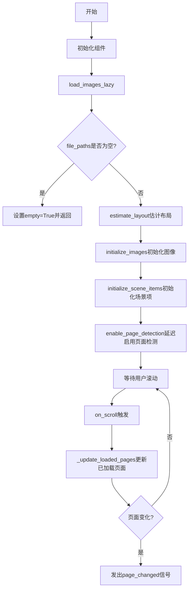

## 类结构

```
LazyWebtoonManager (主协调器)
├── LazyImageLoader (图像懒加载组件)
├── WebtoonLayoutManager (布局管理组件)
├── SceneItemManager (场景项管理组件)
├── CoordinateConverter (坐标转换组件)
└── ImageViewer (依赖项)
```

## 全局变量及字段


### `scroll_timer_delay`
    
滚动事件防抖延迟时间，默认为200毫秒，通过getattr隐式获取

类型：`int`
    


### `LazyWebtoonManager.viewer`
    
图像查看器主组件，提供场景和视图接口

类型：`ImageViewer`
    


### `LazyWebtoonManager._scene`
    
Qt图形场景对象，管理所有场景中的图形项

类型：`QGraphicsScene`
    


### `LazyWebtoonManager.layout_manager`
    
网页布局管理器，负责页面位置计算和视口管理

类型：`WebtoonLayoutManager`
    


### `LazyWebtoonManager.image_loader`
    
懒加载图像加载器，管理图像的按需加载和卸载

类型：`LazyImageLoader`
    


### `LazyWebtoonManager.coordinate_converter`
    
坐标转换器，处理页面坐标与场景坐标之间的转换

类型：`CoordinateConverter`
    


### `LazyWebtoonManager.scene_item_manager`
    
场景项管理器，管理场景中的矩形、文本、笔触等元素

类型：`SceneItemManager`
    


### `LazyWebtoonManager.main_controller`
    
主控制器引用，用于协调各组件间的通信

类型：`Any | None`
    


### `LazyWebtoonManager.scroll_timer`
    
滚动事件防抖定时器，延迟触发页面加载更新

类型：`QTimer`
    
    

## 全局函数及方法


### `LazyWebtoonManager.load_images_lazy`

该方法是 LazyWebtoonManager 类的核心初始化方法，负责以懒加载模式启动 Webtoon 管理器。它首先清理场景，然后估算布局，初始化图像加载器和场景项管理器，最后设置视图位置并启用页面检测。

参数：

- `file_paths`：`list[str]`，要加载的图像文件路径列表
- `current_page`：`int`，初始显示的页面索引，默认为 0

返回值：`bool`，如果初始化成功返回 True，否则返回 False

#### 流程图

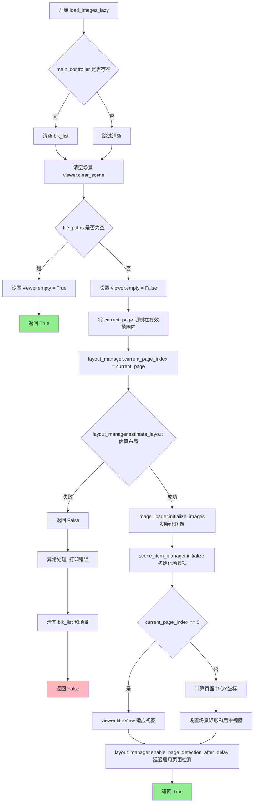

#### 带注释源码

```python
def load_images_lazy(self, file_paths: list[str], current_page: int = 0) -> bool:
    """Initialize webtoon mode with lazy loading."""
    try:
        # 如果存在主控制器，清空阻塞列表（用于显示控制）
        if self.main_controller:
            self.main_controller.blk_list.clear()
        
        # 清空当前场景中的所有项
        self.viewer.clear_scene()
        
        # 如果没有文件路径，设置空标记并直接返回成功
        if not file_paths:
            self.viewer.empty = True
            return True
            
        # 标记场景非空
        self.viewer.empty = False
        
        # 将当前页面索引限制在有效范围内 [0, len(file_paths) - 1]
        current_page = max(0, min(current_page, len(file_paths) - 1))
        
        # 设置布局管理器的当前页面索引
        self.layout_manager.current_page_index = current_page
        
        # 估算布局：计算所有图像的位置、高度和总高度
        if not self.layout_manager.estimate_layout(file_paths):
            return False
            
        # 初始化图像加载器：准备图像数据结构和懒加载机制
        self.image_loader.initialize_images(file_paths, current_page)
        
        # 初始化场景项管理器：准备场景项（矩形、文本、笔触等）的管理
        self.scene_item_manager.initialize()  # No longer needs file_paths
        
        # 如果是首页，则让视图适应内容显示
        if self.layout_manager.current_page_index == 0:
            self.viewer.fitInView()
        
        # 如果不是首页，则定位到指定页面
        if self.layout_manager.current_page_index > 0:
            # 计算当前页面中心Y坐标 = 页面顶部位置 + 页面高度的一半
            page_center_y = self.layout_manager.image_positions[current_page] + (self.layout_manager.image_heights[current_page] / 2)
            
            # 设置场景矩形：宽度为webtoon宽度，高度为总高度
            self.viewer.setSceneRect(0, 0, self.layout_manager.webtoon_width, self.layout_manager.total_height)
            
            # 视图中心对准页面中心
            self.viewer.centerOn(self.layout_manager.webtoon_width / 2, page_center_y)
        
        # 延迟启用页面检测：等待视图稳定后自动检测当前页面
        self.layout_manager.enable_page_detection_after_delay()
        
        return True
        
    except Exception as e:
        # 捕获异常并打印错误信息
        print(f"Error in lazy webtoon loading: {e}")
        
        # 异常情况下清理资源
        if self.main_controller:
            self.main_controller.blk_list.clear()
        self.viewer.clear_scene()
        
        return False
```


### `LazyWebtoonManager.on_scroll`

处理滚动事件以触发延迟加载，通过防抖机制避免频繁触发页面加载更新。

参数：此方法无参数。

返回值：`None`，无返回值描述。

#### 流程图

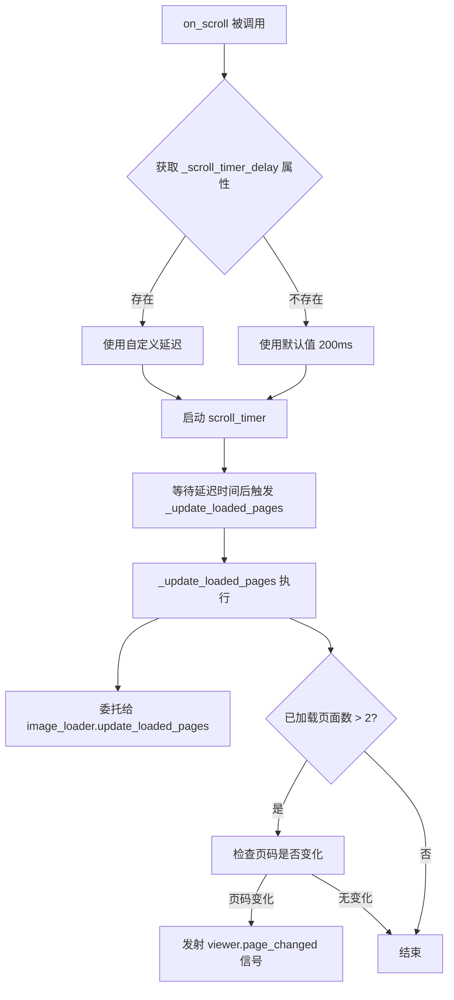

#### 带注释源码

```python
def on_scroll(self):
    """Handle scroll events to trigger lazy loading."""
    # 从对象属性获取滚动定时器延迟时间，若未设置则默认为 200ms
    delay = getattr(self, '_scroll_timer_delay', 200)
    # 启动单次触发定时器，延迟后调用 _update_loaded_pages 方法
    self.scroll_timer.start(delay)
```

---

**注意**：代码中存在两个 `on_scroll` 方法定义，第一个定义（第89-92行）使用硬编码的 200ms 延迟，第二个定义（第220-223行）支持通过 `_scroll_timer_delay` 属性配置延迟时间。由于 Python 类中后定义的方法会覆盖前面的方法，实际运行时使用的是第二个版本。这可能是重构遗留的技术债务，建议删除重复定义并统一使用可配置的版本。


### `LazyWebtoonManager._update_loaded_pages`

该方法负责根据当前视口位置更新应加载的页面，并将页面更新逻辑委托给 `ImageLoader` 组件，同时在页面发生变化时发出信号通知视图层。

参数： 无

返回值：`None`，无返回值，仅执行副作用操作（更新加载状态并发出信号）

#### 流程图

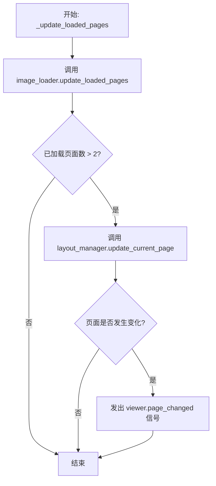

#### 带注释源码

```python
def _update_loaded_pages(self):
    """Update which pages should be loaded based on current viewport."""
    # Delegate to image loader
    # 调用图像加载器的更新方法，根据当前视口范围确定哪些页面应该被加载或卸载
    self.image_loader.update_loaded_pages()
    
    # Update current page if we have loaded some pages
    # 只有当已加载页面数大于2时才检查页面变化（避免初始化阶段频繁触发）
    if self.image_loader.get_loaded_pages_count() > 2:
        # Check if page changed and emit signal if it did
        # 通知布局管理器当前视口对应的页面索引可能已改变
        page_changed = self.layout_manager.update_current_page(self.image_loader.get_loaded_pages_count())
        # 如果页面确实发生变化，向视图层发射信号以更新UI显示
        if page_changed:
            self.viewer.page_changed.emit(self.layout_manager.current_page_index)
```


### `LazyWebtoonManager.is_active`

检查网页漫画（Webtoon）模式是否处于活动状态。当布局管理器中存在已加载的图像位置时返回 True，否则返回 False。

参数： 无

返回值：`bool`，如果 Webtoon 模式已激活（有图像位置记录）返回 True，否则返回 False。

#### 流程图

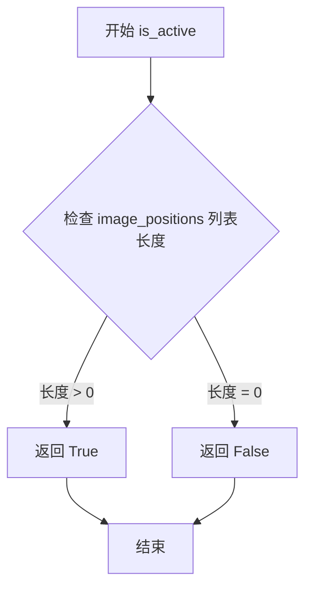

#### 带注释源码

```python
def is_active(self) -> bool:
    """Check if webtoon mode is active."""
    # 通过检查布局管理器中是否存在已加载的图像位置来判断 Webtoon 模式是否激活
    # 如果 image_positions 列表中有元素，说明已有图像被加载，模式处于活动状态
    return len(self.layout_manager.image_positions) > 0
```


### `LazyWebtoonManager.scroll_to_page`

滚动到指定页面，必要时加载该页面。

参数：

- `page_index`：`int`，要滚动到的目标页面索引（从 0 开始）
- `position`：`str`，滚动到页面的目标位置，可选值为 `'top'`（页面顶部）、`'center'`（页面居中）、`'bottom'`（页面底部），默认值为 `'top'`

返回值：取决于 `ImageLoader.scroll_to_page` 的返回值，通常为 `bool` 或 `None`，表示滚动操作是否成功执行

#### 流程图

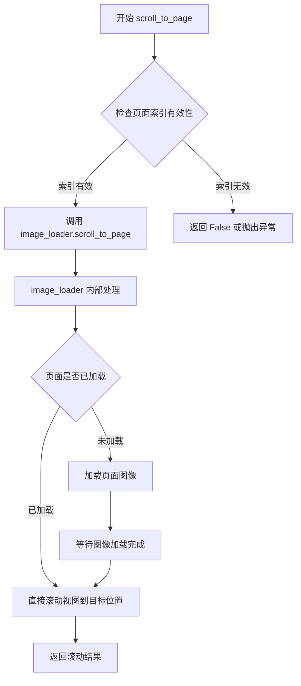

#### 带注释源码

```python
def scroll_to_page(self, page_index: int, position: str = 'top'):
    """
    Scroll to a specific page, loading it if necessary.
    
    此方法是 LazyWebtoonManager 的代理方法，将滚动请求委托给内部的 image_loader 组件处理。
    该方法负责将视图滚动到指定的页面，并根据 position 参数定位页面在视口中的位置。
    如果目标页面尚未加载，image_loader 会自动触发页面图像的加载流程。
    
    参数:
        page_index: int, 目标页面的索引值，从 0 开始计数
        position: str, 滚动后页面在视口中的位置，'top' 表示页面顶部对齐视口顶部，
                  其他可能的值包括 'center'（居中）和 'bottom'（底部对齐）
    
    返回值:
        取决于 ImageLoader.scroll_to_page 的具体实现，通常返回操作是否成功的布尔值
    """
    # 委托给 image_loader 组件处理实际的滚动逻辑
    # image_loader 负责：1) 检查页面是否需要加载 2) 执行滚动操作 3) 返回结果
    return self.image_loader.scroll_to_page(page_index, position)
```


### `LazyWebtoonManager.update_page_on_click`

该方法处理页面点击事件，检查点击位置是否位于新页面上，并在页面发生变化时发出信号通知视图更新。

参数：

- `scene_pos`：`QPointF`，场景坐标，表示点击在图形场景中的具体位置

返回值：`None`，无返回值，但会通过 `viewer.page_changed` 信号通知页面已更改

#### 流程图

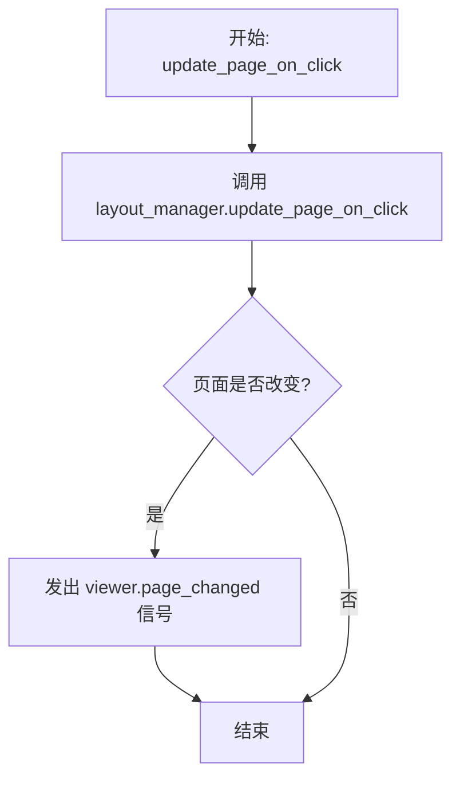

#### 带注释源码

```
def update_page_on_click(self, scene_pos: QPointF):
    """Check if a click occurred on a new page and update current page."""
    # 委托给 layout_manager 进行实际页面检测逻辑
    # 返回 True 表示页面发生了变化
    if self.layout_manager.update_page_on_click(scene_pos):
        # Page changed, emit signal
        # 页面确实改变了，通知观察者（UI层）当前页码已更新
        self.viewer.page_changed.emit(self.layout_manager.current_page_index)
```


### `LazyWebtoonManager.clear`

清除 Webtoon 管理器的所有状态，停止滚动计时器并按正确顺序清理所有组件（图像加载器、布局管理器和场景项管理器）。

参数：

- 无

返回值：`None`，无返回值描述（该方法通过副作用清理状态）

#### 流程图

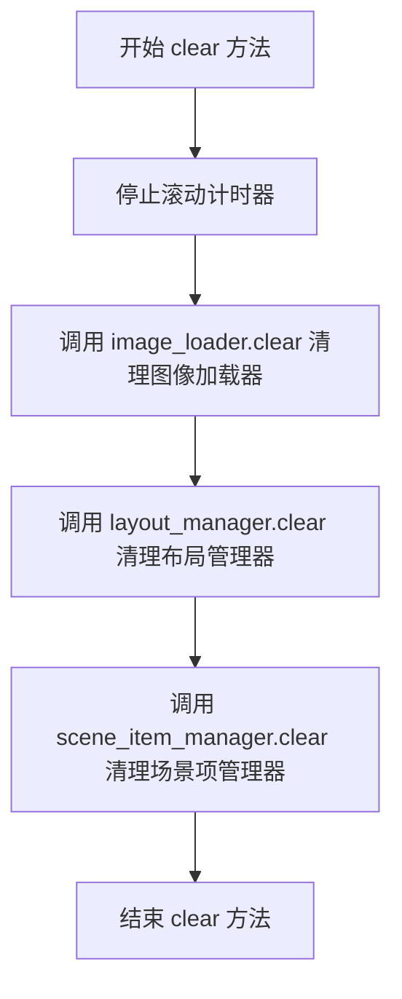

#### 带注释源码

```python
def clear(self):
    """Clear all webtoon state."""
    # 停止滚动计时器，防止在清理过程中触发延迟加载
    self.scroll_timer.stop()
    
    # Clear all components in the correct order
    # 按正确顺序清理所有组件，确保依赖关系正确解除
    
    # 1. 清理图像加载器 - 释放已加载的图像数据和像素图项
    self.image_loader.clear()
    
    # 2. 清理布局管理器 - 清除图像位置、高度等布局信息
    self.layout_manager.clear()
    
    # 3. 清理场景项管理器 - 清除场景中的矩形、文本、笔触等项
    self.scene_item_manager.clear()
```


### `LazyWebtoonManager.set_main_controller`

设置主控制器引用，将控制器传递给所有子组件以便协调工作。

参数：

- `controller`：`Any`，主控制器对象，用于协调各组件之间的通信

返回值：`None`，无返回值

#### 流程图

```mermaid
flowchart TD
    A[set_main_controller 调用] --> B[设置 self.main_controller = controller]
    B --> C[设置 self.image_loader.main_controller = controller]
    C --> D[调用 self.scene_item_manager.set_main_controller(controller)]
    D --> E[流程结束]
```

#### 带注释源码

```python
def set_main_controller(self, controller):
    """Set the main controller reference for all components."""
    # 将控制器引用保存到自身属性，供类内部其他方法使用
    self.main_controller = controller
    
    # 将控制器引用传递给图像加载器组件，使其能够访问主控制器的 blk_list 等属性
    self.image_loader.main_controller = controller
    
    # 将控制器引用传递给场景项管理器，设置其主控制器
    # 这里调用了 scene_item_manager 的 set_main_controller 方法进行传递
    self.scene_item_manager.set_main_controller(controller)
```


### `LazyWebtoonManager.save_view_state`

保存当前查看器的视图状态（包含变换矩阵、中心点和场景矩形），以便进行状态持久化和恢复。

参数：

- 无（仅包含隐式参数 `self`）

返回值：`dict`，包含视图变换矩阵、视图中心点坐标和场景矩形的字典，用于后续状态恢复。

#### 流程图

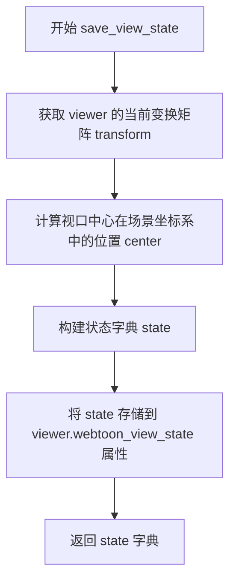

#### 带注释源码

```python
def save_view_state(self) -> dict:
    """Save the current viewer state for persistence."""
    # 获取查看器当前的仿射变换矩阵（包含缩放、旋转、剪切等信息）
    transform = self.viewer.transform()
    
    # 计算视口中心点相对于场景坐标的位置
    # 通过 mapToScene 将视口中心点从视图坐标转换到场景坐标
    center = self.viewer.mapToScene(self.viewer.viewport().rect().center())

    # 构建状态字典，包含三个关键信息：
    # 1. transform: 3x3 变换矩阵的 9 个元素（m11-m33）
    # 2. center: 视图中心在场景中的 (x, y) 坐标
    # 3. scene_rect: 场景矩形的 (x, y, width, height)
    state = {
        'transform': (transform.m11(), transform.m12(), transform.m13(),
                      transform.m21(), transform.m22(), transform.m23(),
                      transform.m31(), transform.m32(), transform.m33()),
        'center': (center.x(), center.y()),
        'scene_rect': (self.viewer.sceneRect().x(), self.viewer.sceneRect().y(), 
                       self.viewer.sceneRect().width(), self.viewer.sceneRect().height()),
    }
    
    # 将状态保存到 viewer 的 webtoon_view_state 属性中，供后续恢复使用
    self.viewer.webtoon_view_state = state
    
    # 返回状态字典，供调用者使用
    return state
```


### `LazyWebtoonManager.restore_view_state`

该方法用于从之前保存的状态中恢复查看器的视图状态，包括变换矩阵等视觉配置，使页面在重新加载后能够恢复到用户之前的浏览位置和缩放级别。

参数：
- `self`：隐式参数，类型为 `LazyWebtoonManager`，表示类的实例本身

返回值：`None`，无返回值，仅执行视图状态恢复操作

#### 流程图

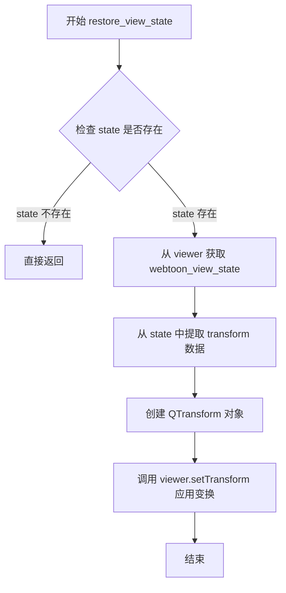

#### 带注释源码

```python
def restore_view_state(self):
    """Restore the viewer state from a saved state."""
    # 从 viewer 属性中获取之前通过 save_view_state 保存的状态字典
    state = self.viewer.webtoon_view_state
    
    # 如果状态不存在（例如首次运行），则直接返回，不执行任何操作
    if not state:
        return
    
    # 使用保存的变换矩阵参数解包创建 QTransform 对象
    # state['transform'] 是一个包含9个元素的元组 (m11, m12, m13, m21, m22, m23, m31, m32, m33)
    self.viewer.setTransform(QTransform(*state['transform']))
```


### `LazyWebtoonManager.on_image_loaded`

当图像数据加载完成后触发，委托场景项管理器加载该页面关联的场景元素（如矩形框、文本标注、笔触等）。

参数：

- `page_idx`：`int`，已加载图像对应的页面索引
- `img_array`：`np.ndarray`，加载的图像数据数组（本方法中未直接使用，仅作为事件触发参数）

返回值：`None`，无返回值

#### 流程图

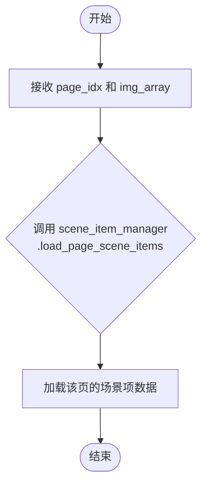

#### 带注释源码

```python
def on_image_loaded(self, page_idx: int, img_array: np.ndarray):
    """Handle when an image is loaded - load scene items for this page."""
    # 参数 page_idx: 已加载页面的索引
    # 参数 img_array: 对应的图像数组数据（当前方法体中未直接使用）
    # 委托给 scene_item_manager 执行具体的场景项加载逻辑
    self.scene_item_manager.load_page_scene_items(page_idx)
```


### `LazyWebtoonManager.on_image_unloaded`

当图像被卸载时触发，用于卸载指定页面的场景项。

参数：

- `page_idx`：`int`，需要卸载场景项的页面索引

返回值：`None`，无返回值描述

#### 流程图

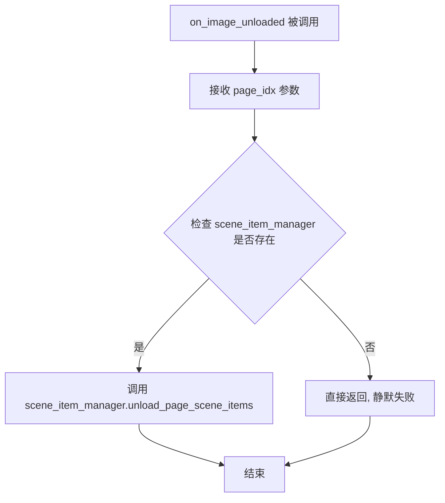

#### 带注释源码

```python
def on_image_unloaded(self, page_idx: int):
    """Handle when an image is unloaded - unload scene items for this page."""
    # 委托给 scene_item_manager 执行具体的场景项卸载操作
    # page_idx: 需要卸载场景项的页面索引
    self.scene_item_manager.unload_page_scene_items(page_idx)
```


### `LazyWebtoonManager.set_enhanced_controller`

设置增强控制器引用，以便后续回调使用

参数：

- `controller`：`Any`，需要设置的增强控制器对象

返回值：`None`，无返回值

#### 流程图

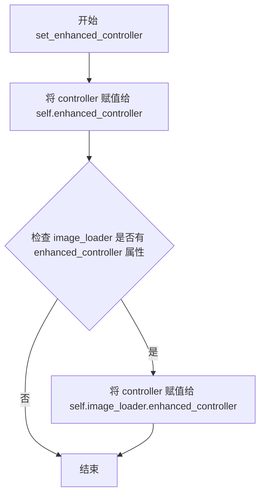

#### 带注释源码

```python
def set_enhanced_controller(self, controller):
    """Set enhanced controller reference for callbacks."""
    # 将传入的 controller 存储到当前对象的 enhanced_controller 属性中
    self.enhanced_controller = controller
    
    # 检查 image_loader 是否具有 enhanced_controller 属性
    # 如果有，则同步设置 image_loader 的 enhanced_controller
    if hasattr(self.image_loader, 'enhanced_controller'):
        self.image_loader.enhanced_controller = controller
```


### `LazyWebtoonManager._on_page_detection_enabled`

当页面检测功能被启用时，此方法会被调用，用于通知增强控制器（enhanced_controller）Webtoon 管理器已准备就绪，以便增强控制器可以执行相应的初始化或刷新操作。

参数：
- 无

返回值：`None`，无返回值

#### 流程图

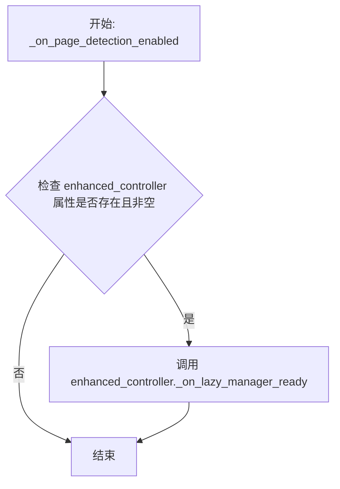

#### 带注释源码

```python
def _on_page_detection_enabled(self):
    """Called when page detection is enabled - notify enhanced controller."""
    # 检查对象是否具有 enhanced_controller 属性，并且该属性不为 None
    if hasattr(self, 'enhanced_controller') and self.enhanced_controller:
        # 如果增强控制器存在，则调用其 _on_lazy_manager_ready 方法
        # 通知增强控制器：LazyWebtoonManager 已准备好
        self.enhanced_controller._on_lazy_manager_ready()
```

#### 说明

此方法作为回调函数被传递给 `WebtoonLayoutManager`（在 `__init__` 方法中通过 `self.layout_manager.on_page_detection_enabled = self._on_page_detection_enabled` 设置）。当 `WebtoonLayoutManager` 启用页面检测功能时，会调用此回调，从而通知 `enhanced_controller` 进行相应的处理。这是一种观察者/回调模式的应用，用于解耦组件之间的依赖关系。


### `LazyWebtoonManager.get_image_array`

获取特定页面的图像数组数据，如果未指定页面索引，则使用当前活动页面。

参数：

- `page_index`：`int | None`，页面索引，如果为 `None` 则使用当前页面索引（`self.layout_manager.current_page_index`）

返回值：`np.ndarray`，图像的 numpy 数组数据

#### 流程图

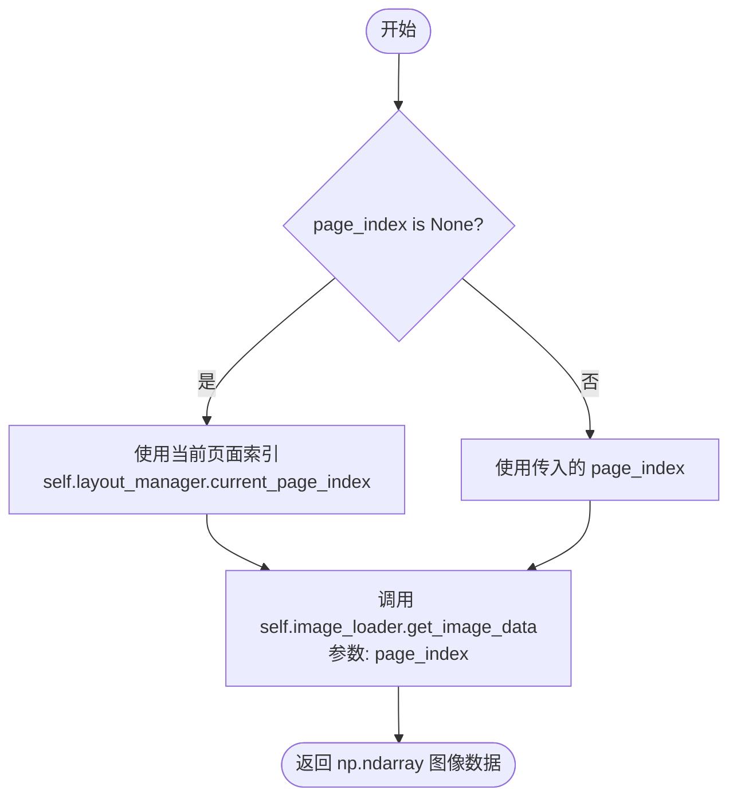

#### 带注释源码

```python
def get_image_array(self, page_index: int = None) -> np.ndarray:
    """Get image array data for a specific page.
    
    参数:
        page_index: 页面索引。如果为 None，则使用当前活动页面。
    
    返回:
        np.ndarray: 指定页面的图像数据数组。
    """
    # 如果未指定页面索引，则使用布局管理器中的当前页面索引
    page_index = page_index if page_index is not None else self.layout_manager.current_page_index
    
    # 委托给 image_loader 组件获取图像数据
    return self.image_loader.get_image_data(page_index)
```


### `LazyWebtoonManager.get_visible_area_image`

获取当前视口内所有可见页面的组合图像数据，并将补丁列表一并返回。

参数：

- `paint_all`：`bool`，是否强制绘制所有页面（忽略视口检测）
- `include_patches`：`bool`，是否在返回结果中包含补丁（patches）数据

返回值：`tuple[np.ndarray, list]`，返回元组包含两个元素：
- 第一个元素是 `np.ndarray` 类型，表示所有可见页面拼接后的完整图像
- 第二个元素是 `list` 类型，表示与图像关联的补丁数据列表

#### 流程图

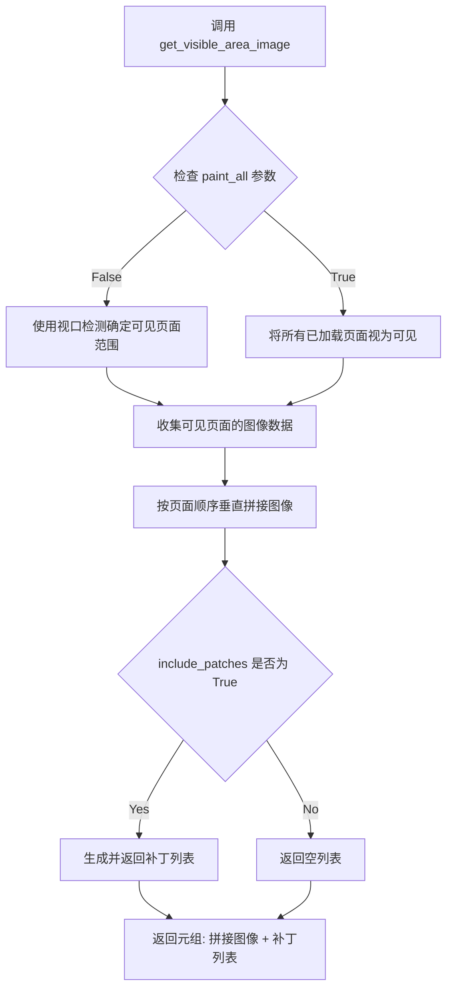

#### 带注释源码

```python
def get_visible_area_image(self, paint_all=False, include_patches=True) -> tuple[np.ndarray, list]:
    """
    Proxy method to get combined image of all visible pages.
    
    这是一个代理方法，将请求委托给 image_loader 组件处理。
    根据 paint_all 参数决定是仅处理视口内可见页面还是处理所有已加载页面。
    include_patches 参数控制是否同时返回补丁数据用于后续处理。
    
    Args:
        paint_all: 布尔值，为 True 时忽略视口检测，绘制所有页面
        include_patches: 布尔值，为 True 时在返回结果中包含补丁数据
    
    Returns:
        tuple: (拼接后的图像数组, 补丁列表)
    """
    # 委托给 image_loader 组件的具体实现
    return self.image_loader.get_visible_area_image(paint_all, include_patches)
```


### `LazyWebtoonManager.remove_pages`

代理方法，将页面移除操作委托给内部的 `LazyImageLoader` 组件，用于从 Webtoon 管理器中删除指定的页面。

参数：

- `file_paths_to_remove`：`list[str]`，需要移除的页面文件路径列表

返回值：`bool`，表示页面移除操作是否成功完成

#### 流程图

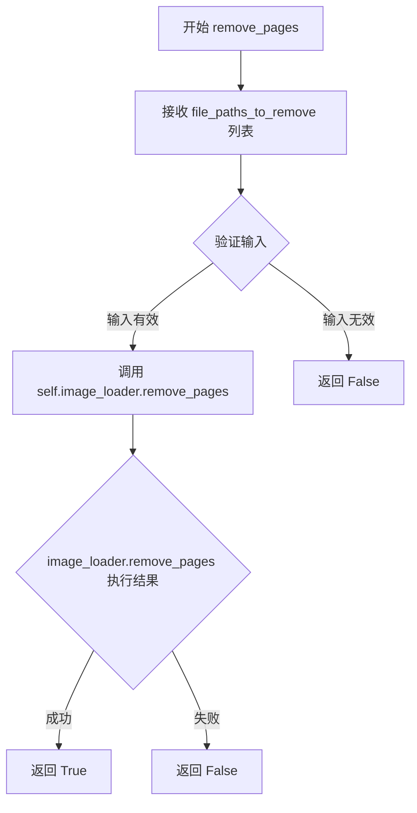

#### 带注释源码

```python
def remove_pages(self, file_paths_to_remove: list[str]) -> bool:
    """
    Proxy method to remove specific pages from the webtoon manager.
    
    代理方法，用于从 Webtoon 管理器中移除指定的页面。
    该方法将移除操作委托给内部的 LazyImageLoader 组件处理。
    
    参数:
        file_paths_to_remove: list[str] - 要移除的页面文件路径列表
    
    返回:
        bool - 移除操作是否成功
    """
    # 委托给 image_loader 组件执行实际的页面移除逻辑
    return self.image_loader.remove_pages(file_paths_to_remove)
```


### `LazyWebtoonManager.insert_pages`

该方法是 `LazyWebtoonManager` 类的代理方法，负责将新页面插入到 Webtoon 管理器中。它将实际插入操作委托给内部的 `image_loader` 组件执行。

参数：

- `new_file_paths`：`list[str]`，需要插入的新图片文件路径列表
- `insert_position`：`int | None`，插入位置索引，None 表示追加到列表末尾

返回值：`bool`，插入操作是否成功

#### 流程图

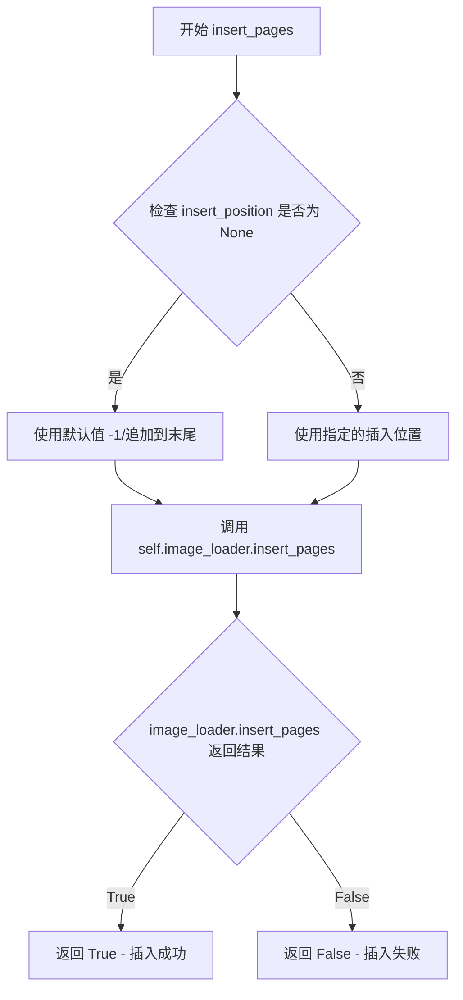

#### 带注释源码

```python
def insert_pages(self, new_file_paths: list[str], insert_position: int = None) -> bool:
    """Proxy method to insert new pages into the webtoon manager.
    
    该方法是一个代理方法，将实际的页面插入操作委托给 image_loader 组件。
    实际的插入逻辑实现应该在 LazyImageLoader.insert_pages 方法中。
    
    参数:
        new_file_paths: 新增的图片文件路径列表
        insert_position: 插入位置索引。如果为 None，则追加到列表末尾
    
    返回:
        bool: 插入操作是否成功
    """
    # 调用内部 image_loader 组件的 insert_pages 方法执行实际插入操作
    return self.image_loader.insert_pages(new_file_paths, insert_position)
```


### `LazyWebtoonManager.__init__`

该方法是 `LazyWebtoonManager` 类的构造函数，负责初始化内存高效的 Webtoon 管理器及其依赖的各个专业化组件（布局管理器、图像加载器、坐标转换器、场景项管理器），并建立组件间的交叉引用关系以实现协调工作。

参数：

- `viewer`：`ImageViewer`，PySide6 图像查看器实例，作为 Webtoon 管理器的主控制器

返回值：`None`，构造函数无返回值

#### 流程图

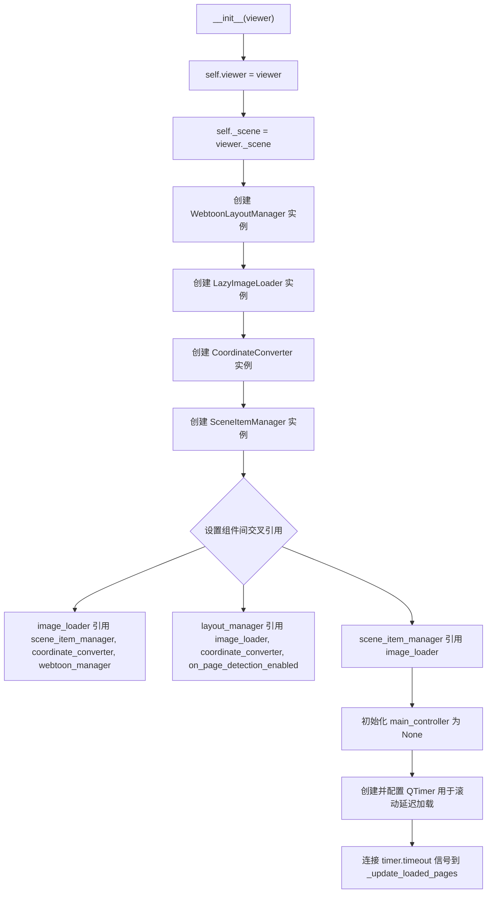

#### 带注释源码

```python
def __init__(self, viewer: ImageViewer):
    """初始化 LazyWebtoonManager 及其依赖组件."""
    # 保存视图器引用
    self.viewer = viewer
    # 获取场景对象
    self._scene = viewer._scene
    
    # 初始化专业化组件并建立所有权关系
    # 布局管理器：负责布局计算、定位和视口管理
    self.layout_manager = WebtoonLayoutManager(viewer)
    # 图像加载器：负责图像的惰性加载和卸载
    self.image_loader = LazyImageLoader(viewer, self.layout_manager)
    # 坐标转换器：负责页面坐标和场景坐标之间的转换
    self.coordinate_converter = CoordinateConverter(self.layout_manager, self.image_loader)
    # 场景项管理器：负责场景项（矩形、文本、笔触等）的管理
    self.scene_item_manager = SceneItemManager(viewer, self.layout_manager, self.coordinate_converter, self.image_loader)
    
    # 在所有组件之间建立交叉引用以实现协调工作
    # 图像加载器需要知道场景项管理器、坐标转换器和 Webtoon 管理器
    self.image_loader.scene_item_manager = self.scene_item_manager
    self.image_loader.coordinate_converter = self.coordinate_converter
    self.image_loader.webtoon_manager = self

    # 布局管理器需要知道图像加载器和坐标转换器
    self.layout_manager.image_loader = self.image_loader
    self.layout_manager.coordinate_converter = self.coordinate_converter
    # 设置页面检测启用时的回调函数
    self.layout_manager.on_page_detection_enabled = self._on_page_detection_enabled

    # 场景项管理器需要知道图像加载器
    self.scene_item_manager.image_loader = self.image_loader
    
    # 将组件连接到主控制器（稍后设置）
    self.main_controller = None
    self.image_loader.main_controller = None
    self.scene_item_manager.main_controller = None
    
    # 用于惰性加载的滚动处理定时器
    self.scroll_timer = QTimer()
    # 设置为单次触发模式
    self.scroll_timer.setSingleShot(True)
    # 连接超时信号到页面更新方法
    self.scroll_timer.timeout.connect(self._update_loaded_pages)
```


### `LazyWebtoonManager.load_images_lazy`

该方法是 LazyWebtoonManager 的核心初始化方法，负责以懒加载方式启动 Webtoon 漫画阅读模式，包括清空场景、验证文件路径、估算布局、初始化图像加载器和场景项目管理器，并正确设置视图位置。

**参数：**

- `file_paths`：`list[str]`，要加载的 Webtoon 漫画图片文件路径列表
- `current_page`：`int`，初始显示的页面索引，默认为 0

**返回值：**`bool`，表示是否成功初始化 Webtoon 懒加载模式，返回 True 表示成功，False 表示失败

#### 流程图

```mermaid
flowchart TD
    A[开始 load_images_lazy] --> B{main_controller是否存在?}
    B -->|是| C[清空 blk_list]
    B -->|否| D[继续]
    C --> D
    D --> E[清空 viewer 场景]
    E --> F{file_paths 是否为空?}
    F -->|是| G[设置 viewer.empty = True]
    F -->|否| H[设置 viewer.empty = False]
    G --> I[返回 True]
    H --> J[计算并限制 current_page 索引范围]
    J --> K[设置 layout_manager.current_page_index]
    K --> L{layout_manager.estimate_layout 成功?}
    L -->|否| M[返回 False]
    L -->|是| N[调用 image_loader.initialize_images]
    N --> O[调用 scene_item_manager.initialize]
    O --> P{当前页面是首页?}
    P -->|是| Q[调用 viewer.fitInView 适应视图]
    P -->|否| R[计算页面中心Y坐标<br/>设置场景矩形<br/>居中视图到页面中心]
    Q --> S[延迟启用页面检测]
    R --> S
    S --> T[返回 True]
    M --> U[异常处理: 打印错误<br/>清空 blk_list<br/>清空场景<br/>返回 False]
    I --> V[结束]
    T --> V
    U --> V
```

#### 带注释源码

```python
def load_images_lazy(self, file_paths: list[str], current_page: int = 0) -> bool:
    """Initialize webtoon mode with lazy loading."""
    try:
        # 如果存在主控制器，先清空其阻塞列表
        if self.main_controller:
            self.main_controller.blk_list.clear()
        
        # 清空当前场景，为加载新内容做准备
        self.viewer.clear_scene()
        
        # 检查文件路径列表是否为空
        if not file_paths:
            # 空列表设置标记并直接返回成功
            self.viewer.empty = True
            return True
            
        # 标记场景非空
        self.viewer.empty = False
        
        # 安全地限制当前页面索引在有效范围内
        # 确保索引不小于0且不大于列表最大索引
        current_page = max(0, min(current_page, len(file_paths) - 1))
        # 更新布局管理器的当前页面索引
        self.layout_manager.current_page_index = current_page
        
        # 估算Webtoon布局（计算图片位置、高度等）
        if not self.layout_manager.estimate_layout(file_paths):
            # 布局估算失败则返回失败
            return False
            
        # 初始化图像加载器，传入文件路径和当前页面
        self.image_loader.initialize_images(file_paths, current_page)
        # 初始化场景项目管理器（不再需要传入file_paths）
        self.scene_item_manager.initialize()  # No longer needs file_paths
        
        # 如果是首页(第0页)，自动适应视图到内容
        if self.layout_manager.current_page_index == 0:
            self.viewer.fitInView()
        
        # 非首页情况下，计算并定位到该页面的中心位置
        if self.layout_manager.current_page_index > 0:
            # 计算当前页面中心Y坐标 = 页面顶部位置 + 页面高度的一半
            page_center_y = self.layout_manager.image_positions[current_page] + (self.layout_manager.image_heights[current_page] / 2)
            # 设置场景矩形（宽为Webtoon宽度，高为总高度）
            self.viewer.setSceneRect(0, 0, self.layout_manager.webtoon_width, self.layout_manager.total_height)
            # 视图中心移动到页面中心位置
            self.viewer.centerOn(self.layout_manager.webtoon_width / 2, page_center_y)
        
        # 延迟启用页面检测（等待视口稳定后）
        self.layout_manager.enable_page_detection_after_delay()
        
        return True
        
    except Exception as e:
        # 捕获任何异常，打印错误信息
        print(f"Error in lazy webtoon loading: {e}")
        if self.main_controller:
            # 异常时也清空阻塞列表和场景
            self.main_controller.blk_list.clear()
        self.viewer.clear_scene()
        return False
```


### `LazyWebtoonManager.on_scroll`

处理滚动事件以触发延迟加载。通过防抖机制，避免频繁触发页面加载，提升性能和用户体验。

参数： 无

返回值：`None`，无返回值

#### 流程图

```mermaid
flowchart TD
    A[on_scroll 被调用] --> B{检查 _scroll_timer_delay 属性}
    B -->|存在| C[使用配置的延迟时间]
    B -->|不存在| D[使用默认延迟 200ms]
    C --> E[启动 scroll_timer]
    D --> E
    E --> F[等待定时器超时]
    F --> G[_update_loaded_pages]
    G --> H[更新已加载页面]
    H --> I{已加载页面数 > 2?}
    I -->|是| J[检查当前页是否变化]
    I -->|否| K[流程结束]
    J --> L{页码发生变化?}
    L -->|是| M[发射 page_changed 信号]
    L -->|否| K
    M --> K
```

#### 带注释源码

```python
def on_scroll(self):
    """Handle scroll events to trigger lazy loading."""
    # 获取滚动延迟配置，若未设置则使用默认值 200ms
    # 该设计允许外部通过 _scroll_timer_delay 属性动态调整防抖延迟
    delay = getattr(self, '_scroll_timer_delay', 200)
    
    # 启动单次触发定时器，实现滚动事件的防抖处理
    # 防抖机制可避免用户在快速滚动时频繁触发页面加载操作
    # 200ms 的延迟为笔触等精细操作提供了充足的缓冲时间
    self.scroll_timer.start(delay)
```


### `LazyWebtoonManager._update_loaded_pages`

更新当前视口内应加载的页面，基于懒加载机制委托给图像加载器，并在页面发生变化时发出信号通知查看器。

参数：

- 此方法无显式参数（`self` 为隐式参数）

返回值：`None`，无返回值（该方法直接修改内部状态并发出信号）

#### 流程图

```mermaid
flowchart TD
    A[Start _update_loaded_pages] --> B[调用 image_loader.update_loaded_pages]
    B --> C{loaded_pages_count > 2?}
    C -->|否| D[结束]
    C -->|是| E[调用 layout_manager.update_current_page]
    E --> F{page_changed?}
    F -->|否| D
    F -->|是| G[发出 viewer.page_changed 信号]
    G --> D
```

#### 带注释源码

```python
def _update_loaded_pages(self):
    """Update which pages should be loaded based on current viewport."""
    # 委托给图像加载器，根据当前视口更新需要加载的页面
    self.image_loader.update_loaded_pages()
    
    # 如果已加载页面数量大于2，则更新当前页面索引
    if self.image_loader.get_loaded_pages_count() > 2:
        # 检查页面是否发生变化，并在变化时发出信号
        page_changed = self.layout_manager.update_current_page(self.image_loader.get_loaded_pages_count())
        if page_changed:
            # 发出页面更改信号，通知查看器当前页码已更新
            self.viewer.page_changed.emit(self.layout_manager.current_page_index)
```


### `LazyWebtoonManager.is_active`

检查 Webtoon 模式是否处于活动状态。该方法通过判断 `layout_manager` 中是否已加载了任何图像位置来确定 Webtoon 管理器是否处于活动工作状态。

参数：无需参数

返回值：`bool`，如果 Webtoon 模式已激活（存在已加载的图像位置）返回 `True`，否则返回 `False`

#### 流程图

```mermaid
flowchart TD
    A[开始 is_active] --> B{检查 image_positions 长度}
    B -->|长度 > 0| C[返回 True]
    B -->|长度 == 0| D[返回 False]
    C --> E[结束]
    D --> E
```

#### 带注释源码

```python
def is_active(self) -> bool:
    """Check if webtoon mode is active.
    
    通过检查布局管理器中是否已加载任何图像位置来判断
    Webtoon 模式是否处于活动状态。当图像位置列表为空时，
    表示尚未加载任何页面或已清除状态。
    
    Returns:
        bool: 如果 Webtoon 模式处于活动状态返回 True，否则返回 False
    """
    # 检查布局管理器中的图像位置列表是否有元素
    # 如果列表长度大于 0，说明已经加载了至少一个页面
    return len(self.layout_manager.image_positions) > 0
```


### `LazyWebtoonManager.scroll_to_page`

滚动到指定页面，必要时加载该页面。

参数：

- `page_index`：`int`，要滚动到的页面索引
- `position`：`str`，滚动位置，默认为 `'top'`（可选值如 `'top'`、`'center'` 等）

返回值：`任意类型`，返回 `image_loader.scroll_to_page()` 的结果，通常为布尔值或 `None`，表示滚动操作是否成功

#### 流程图

```mermaid
flowchart TD
    A[调用 scroll_to_page] --> B[接收 page_index 和 position 参数]
    B --> C{检查 page_index 有效性}
    C -->|无效| D[返回 False 或抛出异常]
    C -->|有效| E[调用 self.image_loader.scroll_to_page]
    E --> F[LazyImageLoader 内部处理页面加载与滚动]
    F --> G[返回滚动结果]
```

#### 带注释源码

```python
def scroll_to_page(self, page_index: int, position: str = 'top'):
    """Scroll to a specific page, loading it if necessary.
    
    Args:
        page_index: 要滚动到的目标页面索引（从 0 开始）
        position: 滚动到页面的具体位置，如 'top'（页面顶部）、'center'（页面中部）等
        
    Returns:
        任意类型: 返回底层 image_loader.scroll_to_page() 的执行结果，
                 通常为 bool（True 表示成功，False 表示失败）或 None
    """
    # 委托给 image_loader 组件执行实际的滚动和加载逻辑
    return self.image_loader.scroll_to_page(page_index, position)
```


### `LazyWebtoonManager.update_page_on_click`

检查点击是否发生在新页面上，并在页面变化时发出信号。

参数：

-  `scene_pos`：`QPointF`，点击在场景中的坐标位置

返回值：`None`，无返回值（通过信号机制通知页面变化）

#### 流程图

```mermaid
flowchart TD
    A[开始 update_page_on_click] --> B[接收 scene_pos 参数]
    B --> C[调用 layout_manager.update_page_on_click]
    C --> D{返回值为 True?}
    D -->|是| E[发出 page_changed 信号]
    E --> F[结束]
    D -->|否| F
```

#### 带注释源码

```python
def update_page_on_click(self, scene_pos: QPointF):
    """Check if a click occurred on a new page and update current page."""
    # 调用布局管理器的 update_page_on_click 方法，传入场景坐标
    # 该方法会判断点击位置是否位于新的页面上
    if self.layout_manager.update_page_on_click(scene_pos):
        # 如果页面确实发生了变化（返回 True），则通过 viewer 发出信号
        # 通知上层组件当前页面索引已更新
        self.viewer.page_changed.emit(self.layout_manager.current_page_index)
```


### `LazyWebtoonManager.clear`

清除所有Webtoon相关的状态，包括停止滚动计时器并按正确顺序清理各个组件（图像加载器、布局管理器、场景项管理器）。

参数：
- 该方法无参数

返回值：`None`，无返回值描述（Python中默认返回 `None`）

#### 流程图

```mermaid
flowchart TD
    A[开始 clear] --> B[停止滚动计时器: scroll_timer.stop]
    B --> C[调用 image_loader.clear 清理图像加载器]
    C --> D[调用 layout_manager.clear 清理布局管理器]
    D --> E[调用 scene_item_manager.clear 清理场景项管理器]
    E --> F[结束]
```

#### 带注释源码

```python
def clear(self):
    """Clear all webtoon state."""
    # 停止滚动计时器，防止在清理过程中触发延迟加载
    self.scroll_timer.stop()
    
    # 按依赖顺序清理所有组件
    # 1. 先清理图像加载器（清理图像数据、图像项、已加载页面记录）
    self.image_loader.clear()
    # 2. 再清理布局管理器（清理页面位置、高度、当前页索引等）
    self.layout_manager.clear()
    # 3. 最后清理场景项管理器（清理场景项、场景项数据等）
    self.scene_item_manager.clear()
```


### `LazyWebtoonManager.set_main_controller`

该方法用于设置主控制器引用，并将该引用传递给 LazyWebtoonManager 的各个子组件（image_loader 和 scene_item_manager），使主控制器能够与各个组件进行交互和数据传递。

参数：

- `controller`：`Any`，主控制器的引用，用于与各个子组件进行交互

返回值：`None`，该方法不返回任何值

#### 流程图

```mermaid
flowchart TD
    A[开始 set_main_controller] --> B[接收 controller 参数]
    B --> C[设置 self.main_controller = controller]
    C --> D[设置 self.image_loader.main_controller = controller]
    D --> E[调用 self.scene_item_manager.set_main_controller(controller)]
    E --> F[结束]
```

#### 带注释源码

```python
def set_main_controller(self, controller):
    """Set the main controller reference for all components."""
    # 将 controller 存储在当前对象的 main_controller 属性中
    self.main_controller = controller
    # 将 controller 传递给 image_loader 子组件
    self.image_loader.main_controller = controller
    # 将 controller 传递给 scene_item_manager 子组件
    self.scene_item_manager.set_main_controller(controller)
```


### `LazyWebtoonManager.save_view_state`

保存当前查看器的视图状态（变换矩阵、中心点、场景矩形），用于状态持久化和恢复。

参数：
- （无参数，仅包含 self）

返回值：`dict`，包含视图变换矩阵参数、场景中心点坐标和场景矩形信息的字典，用于恢复查看器状态。

#### 流程图

```mermaid
flowchart TD
    A[开始 save_view_state] --> B[获取 viewer 的当前变换矩阵 transform]
    B --> C[计算视口中心在场景中的坐标 center]
    C --> D[构建 state 字典]
    D --> E[将变换矩阵参数存入 state]
    E --> F[将中心点坐标存入 state]
    F --> G[将场景矩形信息存入 state]
    G --> H[将 state 赋值给 viewer.webtoon_view_state]
    H --> I[返回 state 字典]
    I --> J[结束]
```

#### 带注释源码

```python
def save_view_state(self) -> dict:
    """Save the current viewer state for persistence."""
    # 获取当前查看器的变换矩阵（包含缩放、旋转、平移等信息）
    transform = self.viewer.transform()
    
    # 计算视口中心点映射到场景坐标系中的位置（用于恢复滚动位置）
    center = self.viewer.mapToScene(self.viewer.viewport().rect().center())

    # 构建状态字典，保存以下信息：
    # 1. transform: 3x3 变换矩阵的 9 个参数 (m11-m33)
    # 2. center: 场景中心点坐标 (x, y)
    # 3. scene_rect: 场景矩形的 x, y, width, height
    state = {
        'transform': (transform.m11(), transform.m12(), transform.m13(),
                      transform.m21(), transform.m22(), transform.m23(),
                      transform.m31(), transform.m32(), transform.m33()),
        'center': (center.x(), center.y()),
        'scene_rect': (self.viewer.sceneRect().x(), self.viewer.sceneRect().y(), 
                       self.viewer.sceneRect().width(), self.viewer.sceneRect().height()),
    }
    
    # 将状态保存到 viewer 对象上，供后续 restore_view_state 使用
    self.viewer.webtoon_view_state = state
    
    # 返回状态字典，供调用者使用
    return state
```


### `LazyWebtoonManager.restore_view_state`

恢复查看器的视图状态（包括变换矩阵），通常用于从持久化存储中恢复用户之前保存的查看位置和缩放级别。

参数： 无

返回值：`None`，该方法无返回值，直接修改 viewer 的视图状态

#### 流程图

```mermaid
flowchart TD
    A[开始 restore_view_state] --> B{检查 state 是否存在}
    B -->|是| C[从 viewer.webtoon_view_state 获取 state]
    B -->|否| D[直接返回，结束]
    C --> E[从 state 中提取 transform 元组]
    E --> F[调用 viewer.setTransform QTransform 变换矩阵]
    F --> G[结束]
```

#### 带注释源码

```python
def restore_view_state(self):
    """Restore the viewer state from a saved state."""
    # 从 viewer 对象中获取之前保存的视图状态
    # 该状态在 save_view_state 方法中被设置为一个包含 transform, center, scene_rect 的字典
    state = self.viewer.webtoon_view_state
    
    # 如果状态不存在或为空，则直接返回，不做任何操作
    if not state:
        return
    
    # 从保存的状态中解包变换矩阵参数
    # transform 是一个包含 9 个元素的元组，对应 QTransform 的 3x3 矩阵元素
    # 顺序为: m11, m12, m13, m21, m22, m23, m31, m32, m33
    # 这些元素定义了视图的缩放、旋转、倾斜和平移等变换
    self.viewer.setTransform(QTransform(*state['transform']))
    # QTransform 构造函数接受 9 个参数来构造 3x3 变换矩阵
    # setTransform 会应用这个变换矩阵到整个场景，从而恢复用户的视图状态
```


### `LazyWebtoonManager.on_image_loaded`

当图像被异步加载完成后，此方法被调用，触发该页面场景项目（如矩形框、文字、笔触等）的延迟加载，从而实现图像与场景项的同步加载管理。

参数：

- `page_idx`：`int`，要加载场景项目的页面索引
- `img_array`：`np.ndarray`，已加载的图像数据数组（本方法中未直接使用，仅作为回调参数保留）

返回值：`None`，无返回值，仅执行副作用操作

#### 流程图

```mermaid
flowchart TD
    A[开始 on_image_loaded] --> B{接收 page_idx 和 img_array}
    B --> C[调用 scene_item_manager.load_page_scene_items]
    C --> D[结束]
    
    style A fill:#f9f,color:#333
    style C fill:#bbf,color:#333
    style D fill:#bfb,color:#333
```

#### 带注释源码

```python
def on_image_loaded(self, page_idx: int, img_array: np.ndarray):
    """Handle when an image is loaded - load scene items for this page."""
    # 委托给 SceneItemManager 加载该页面的场景项目
    # 这样可以保持关注点分离：ImageLoader 只负责图像，
    # 场景项目由 SceneItemManager 独立管理
    self.scene_item_manager.load_page_scene_items(page_idx)
```


### `LazyWebtoonManager.on_image_unloaded`

当图像被卸载时触发的事件处理方法，负责协调场景项管理器的页面场景项卸载操作。

参数：

- `page_idx`：`int`，要卸载的页面索引

返回值：`None`，无返回值

#### 流程图

```mermaid
flowchart TD
    A[on_image_unloaded 开始] --> B[接收 page_idx 参数]
    B --> C[调用 scene_item_manager.unload_page_scene_items]
    C --> D[传递 page_idx 给场景项管理器]
    D --> E[场景项管理器卸载该页面的所有场景项]
    E --> F[返回]
```

#### 带注释源码

```python
def on_image_unloaded(self, page_idx: int):
    """Handle when an image is unloaded - unload scene items for this page."""
    # 委托给场景项管理器执行具体的场景项卸载操作
    # 参数 page_idx 指定了需要卸载场景项的页面索引
    self.scene_item_manager.unload_page_scene_items(page_idx)
```


### `LazyWebtoonManager.set_enhanced_controller`

设置增强控制器（Enhanced Controller）的引用，以便在页面检测等事件发生时能够通知该控制器。

参数：

-  `controller`：`Any`，增强控制器（Enhanced Controller）的实例，用于接收懒加载管理器的回调通知。

返回值：`None`，无返回值。

#### 流程图

```mermaid
flowchart TD
    A([Start set_enhanced_controller]) --> B[设置 self.enhanced_controller = controller]
    B --> C{检查 image_loader 是否有 enhanced_controller 属性}
    C -->|是| D[设置 self.image_loader.enhanced_controller = controller]
    C -->|否| E([End])
    D --> E
```

#### 带注释源码

```python
def set_enhanced_controller(self, controller):
    """Set enhanced controller reference for callbacks."""
    # 1. 将传入的 controller 实例保存到当前管理器的 enhanced_controller 属性中
    self.enhanced_controller = controller
    
    # 2. 检查 self.image_loader (LazyImageLoader) 是否具有 enhanced_controller 属性
    #    如果存在，则也将 controller 传递给 image_loader，以便其也能响应相关事件
    if hasattr(self.image_loader, 'enhanced_controller'):
        self.image_loader.enhanced_controller = controller
```


### `LazyWebtoonManager._on_page_detection_enabled`

当页面检测功能被启用时，该方法作为回调通知增强控制器准备就绪。

参数： 无

返回值：`None`，无返回值，仅执行副作用（调用增强控制器的方法）

#### 流程图

```mermaid
flowchart TD
    A[开始: _on_page_detection_enabled 调用] --> B{self.enhanced_controller 是否存在?}
    B -->|是| C{self.enhanced_controller 是否为真值?}
    C -->|是| D[调用 self.enhanced_controller._on_lazy_manager_ready]
    C -->|否| E[无操作]
    B -->|否| E
    D --> F[结束]
    E --> F
```

#### 带注释源码

```python
def _on_page_detection_enabled(self):
    """Called when page detection is enabled - notify enhanced controller."""
    # 检查对象是否具有 enhanced_controller 属性且该属性非空
    if hasattr(self, 'enhanced_controller') and self.enhanced_controller:
        # 如果增强控制器存在，则通知其 LazyWebtoonManager 已准备就绪
        self.enhanced_controller._on_lazy_manager_ready()
```


### `LazyWebtoonManager.get_image_array`

获取指定页面的图像数组数据，如果未指定页面索引，则默认获取当前页面。该方法委托给 LazyImageLoader 组件来获取实际的图像数据。

参数：

- `page_index`：`int | None`，可选，页面索引。如果为 `None`，则使用 `layout_manager` 的当前页面索引 `current_page_index`

返回值：`np.ndarray`，返回指定页面的图像数据数组

#### 流程图

```mermaid
flowchart TD
    A[开始 get_image_array] --> B{page_index 是否为 None?}
    B -->|是| C[使用 layout_manager.current_page_index]
    B -->|否| D[使用传入的 page_index]
    C --> E[调用 image_loader.get_image_data]
    D --> E
    E --> F[返回 np.ndarray 图像数据]
```

#### 带注释源码

```python
def get_image_array(self, page_index: int = None) -> np.ndarray:
    """Get image array data for a specific page."""
    # 如果未提供 page_index，则使用当前页面索引（从 layout_manager 获取）
    page_index = page_index if page_index is not None else self.layout_manager.current_page_index
    # 委托给 image_loader 组件获取图像数据
    return self.image_loader.get_image_data(page_index)
```


### `LazyWebtoonManager.get_visible_area_image`

这是一个代理方法，用于获取所有可见页面的合并图像数据。它将调用委托给内部的 `LazyImageLoader` 组件来执行实际的操作。

参数：

- `paint_all`：`bool`，可选参数，默认为 `False`。当设置为 `True` 时，强制绘制所有可见页面；否则仅绘制当前需要的页面。
- `include_patches`：`bool`，可选参数，默认为 `True`。当设置为 `True` 时，包含图像的修补区域；否则跳过修补区域。

返回值：`tuple[np.ndarray, list]`，返回一个元组，包含合并后的图像数据（NumPy 数组）和可见页面索引列表。

#### 流程图

```mermaid
flowchart TD
    A[开始 get_visible_area_image] --> B[接收参数 paint_all 和 include_patches]
    B --> C{检查 image_loader 是否存在}
    C -->|是| D[调用 self.image_loader.get_visible_area_image]
    C -->|否| E[返回空元组或抛出异常]
    D --> F[返回 tuple[图像数据, 可见页面列表]]
    E --> F
```

#### 带注释源码

```python
def get_visible_area_image(self, paint_all=False, include_patches=True) -> tuple[np.ndarray, list]:
    """
    Proxy method to get combined image of all visible pages.
    
    This method delegates to the LazyImageLoader component to retrieve
    a combined image of all pages currently visible in the viewport.
    
    Args:
        paint_all (bool): If True, force painting all visible pages. 
                         If False, only paint pages needed for current view.
        include_patches (bool): If True, include patch regions in the image.
                               If False, skip patch regions.
    
    Returns:
        tuple[np.ndarray, list]: A tuple containing:
            - np.ndarray: Combined image data of all visible pages
            - list: List of visible page indices
    """
    # Delegate the actual implementation to the image_loader component
    return self.image_loader.get_visible_area_image(paint_all, include_patches)
```


### `LazyWebtoonManager.remove_pages`

该方法是一个代理方法，用于将特定的页面从 Webtoon 管理器中移除。它将调用委托给内部组件 `image_loader` 的 `remove_pages` 方法，实际的页面移除逻辑由 `LazyImageLoader` 类实现。

参数：

- `file_paths_to_remove`：`list[str]`，需要移除的图像文件路径列表

返回值：`bool`，表示页面移除操作是否成功

#### 流程图

```mermaid
flowchart TD
    A[调用 remove_pages] --> B{检查 file_paths_to_remove 是否有效}
    B -->|有效| C[调用 self.image_loader.remove_pages]
    B -->|无效| D[返回 False]
    C --> E[LazyImageLoader.remove_pages 执行实际移除逻辑]
    E --> F[返回操作结果]
    F --> G[将结果返回给调用者]
```

#### 带注释源码

```python
def remove_pages(self, file_paths_to_remove: list[str]) -> bool:
    """Proxy method to remove specific pages from the webtoon manager.
    
    This method delegates the actual page removal logic to the internal
    LazyImageLoader component. The LazyWebtoonManager acts as a facade
    that provides a simplified interface to its specialized components.
    
    Args:
        file_paths_to_remove: List of file paths representing pages to be removed
                              from the webtoon manager.
    
    Returns:
        bool: True if the removal operation was successful, False otherwise.
              The actual success/failure is determined by LazyImageLoader.remove_pages.
    """
    # Delegate to the image_loader component which owns the actual image data
    # and manages the loaded pages state
    return self.image_loader.remove_pages(file_paths_to_remove)
```


### `LazyWebtoonManager.insert_pages`

代理方法，用于将新页面插入到 Webtoon 管理器中。该方法将插入操作委托给底层的 `LazyImageLoader` 组件处理。

参数：

- `new_file_paths`：`list[str]`，要插入的新页面文件路径列表
- `insert_position`：`int`，插入位置索引（可选，默认为 None，表示追加到末尾）

返回值：`bool`，表示插入操作是否成功

#### 流程图

```mermaid
flowchart TD
    A[调用 LazyWebtoonManager.insert_pages] --> B{检查 insert_position 是否为 None}
    B -->|是| C[追加到列表末尾]
    B -->|否| D[在指定位置插入]
    C --> E[调用 image_loader.insert_pages]
    D --> E
    E --> F[返回插入结果 bool]
```

#### 带注释源码

```python
def insert_pages(self, new_file_paths: list[str], insert_position: int = None) -> bool:
    """
    代理方法，用于将新页面插入到 webtoon 管理器中。
    
    该方法将插入操作委托给底层的 LazyImageLoader 组件执行，
    并返回操作结果。
    
    参数:
        new_file_paths: 要插入的新页面文件路径列表
        insert_position: 插入位置索引，None 表示追加到末尾
        
    返回:
        bool: 插入操作是否成功
    """
    # 委托给 image_loader 组件执行实际的插入逻辑
    return self.image_loader.insert_pages(new_file_paths, insert_position)
```

## 关键组件


### LazyImageLoader

内存高效的图片加载和卸载组件，负责管理Webtoon页面的图像数据懒加载、缓存和释放，支持可视区域内的页面动态加载。

### WebtoonLayoutManager

布局计算与视口管理组件，负责计算页面位置、高度和总高度等布局信息，管理视口缓冲区，支持页面检测和当前页索引更新。

### SceneItemManager

场景项管理组件，负责管理Webtoon中的场景元素（如矩形、文本、笔触等），提供场景项的加载和卸载功能，与图像加载器协调工作。

### CoordinateConverter

坐标转换组件，负责在页面本地坐标和场景坐标之间进行转换，建立页面本地坐标系与Qt场景坐标系之间的映射关系。

### LazyWebtoonManager (主协调器)

内存高效的Webtoon管理器，采用组件委托模式，协调上述四个专业组件完成Webtoon模式的懒加载功能，通过定时器实现滚动防抖和动态页面加载。


## 问题及建议


### 已知问题

-   **循环依赖问题**：组件之间存在复杂的双向引用（如 `image_loader` 引用 `scene_item_manager`，而 `scene_item_manager` 又引用 `image_loader`），形成强耦合的循环依赖图，可能导致初始化顺序问题、内存泄漏风险以及测试困难。
-   **重复方法定义**：`on_scroll` 方法在类中定义两次（第107行左右和第182行左右），后者会覆盖前者，可能导致预期行为不一致。
-   **属性访问破坏封装**：直接访问 `viewer._scene`（下划线表示私有属性），违反了封装原则，降低了代码可维护性。
-   **延迟初始化不一致**：`main_controller`、`enhanced_controller` 等关键引用多处设为 `None` 或延迟设置，缺乏统一的初始化模式，可能导致空引用异常。
-   **过度代理属性**：大量简单的代理属性（如 `image_positions`、`image_heights` 等）暴露内部组件细节，表明组件职责边界不清晰，违反了迪米特法则。
-   **硬编码魔法值**：滚动延迟时间存在多个不同值（如直接写 `200` 和通过 `getattr` 获取），缺乏统一配置管理。
-   **异常处理过于简单**：仅使用 `print(f"Error in lazy webtoon loading: {e}")` 输出错误，缺少日志记录、错误传播和恢复机制。
-   **信号槽连接未管理**：`scroll_timer.timeout.connect(self._update_loaded_pages)` 等连接未在 `clear` 方法中断开，可能导致信号泄漏。

### 优化建议

-   **解耦组件依赖**：引入事件总线或观察者模式，通过发布-订阅机制替代直接引用，使用依赖注入容器管理依赖生命周期。
-   **消除重复代码**：合并重复的 `on_scroll` 方法，或将重复逻辑提取为私有方法。
-   **规范属性访问**：通过公共接口访问 `viewer` 属性，或提供 getter 方法，避免直接访问私有成员。
-   **统一初始化模式**：使用工厂模式或建造者模式集中管理组件创建和依赖注入，明确初始化顺序。
-   **重构代理属性**：将代理属性改为单一入口方法，或重新设计组件 API 使其更内聚。
-   **配置外部化**：将魔法值提取为类常量或配置文件，提供运行时调整能力。
-   **完善异常处理**：建立分层异常处理机制，区分可恢复和不可恢复错误，实现重试、降级等策略。
-   **资源生命周期管理**：在 `clear` 方法中断开所有信号槽连接，考虑实现上下文管理器或显式的 `dispose` 方法。

## 其它


### 设计目标与约束

该模块的设计目标是实现一个内存高效的网络漫画（Webtoon）查看器，通过懒加载机制仅在视口区域及其缓冲区内加载图像，减少内存占用。核心约束包括：1) 使用Qt的QGraphicsScene作为渲染基础；2) 通过PySide6的信号槽机制处理页面变化事件；3) 支持滚动时的动态加载/卸载页面；4) 需要与主控制器（MainController）和图像查看器（ImageViewer）紧密集成。

### 错误处理与异常设计

主要异常处理场景包括：1) 文件路径为空或无效时设置viewer.empty=True并返回True；2) estimate_layout失败时返回False；3) 图像加载异常时捕获Exception并打印错误，同时清空blk_list和场景；4) restore_view_state时检查state是否存在；5) 使用try-except包裹load_images_lazy的整个初始化流程。

### 数据流与状态机

主要数据流：1) file_paths → layout_manager.estimate_layout() → 布局估算；2) 布局信息 → image_loader.initialize_images() → 图像预加载；3) 滚动事件 → on_scroll() → scroll_timer触发 → _update_loaded_pages() → 更新loaded_pages；4) 页面变化 → layout_manager.update_current_page() → viewer.page_changed.emit()。状态包括：空闲状态（image_positions为空）、活动状态（有图像加载）、滚动中状态（scroll_timer运行中）。

### 外部依赖与接口契约

核心依赖包括：1) PySide6.QtCore (QTimer, QPointF, QTransform)；2) PySide6.QtWidgets (QGraphicsPixmapItem)；3) PySide6.QtGui (QTransform)；4) numpy (np.ndarray)；5) typing (Set, TYPE_CHECKING)。接口契约：viewer参数必须是ImageViewer类型；main_controller需要具有blk_list属性和clear()方法；所有组件间通过属性赋值建立引用关系。

### 性能考虑与优化空间

性能关键点：1) 滚动防抖延迟200ms，通过_scroll_timer_delay属性可配置；2) 页面加载阈值2页（get_loaded_pages_count() > 2）；3) 使用Set存储loaded_pages以提高查找效率；4) image_loader使用字典存储image_items和image_data支持O(1)访问。优化空间：1) _update_loaded_pages每次都调用update_current_page可考虑增加变化检测；2) 缺少图像预加载策略的显式控制；3) scroll_timer使用SingleShot但可能存在竞态条件。

### 线程安全与并发

当前设计为单线程架构，主要依赖Qt的事件循环。所有组件间调用都在主线程中执行。潜在问题：1) 图像加载如果涉及耗时操作应考虑移至后台线程；2) scroll_timer的回调在主线程执行，大量滚动可能造成UI卡顿；3) 组件间的交叉引用在多线程环境下可能导致竞态条件。

### 配置参数说明

关键配置参数：1) scroll_timer延迟默认200ms，可通过_scroll_timer_delay属性覆盖；2) max_loaded_pages由image_loader管理，控制最大同时加载页数；3) viewport_buffer由layout_manager管理，控制视口缓冲区域大小；4) image_spacing控制图像间距。

### 资源管理与生命周期

资源管理策略：1) clear()方法按顺序清理：scroll_timer → image_loader → layout_manager → scene_item_manager；2) 图像数据存储在image_loader的image_data字典中，需要显式清理；3) QTimer在clear时stop；4) viewer的webtoon_view_state字典用于状态持久化。生命周期：创建 → load_images_lazy() → 交互（滚动/点击） → clear() → 销毁。

### 事件与信号设计

Qt信号使用：1) viewer.page_changed.emit(current_page_index) - 页面变化时发出；2) scroll_timer.timeout.connect(_update_loaded_pages) - 滚动防抖触发；3) 内部_on_page_detection_enabled回调通知enhanced_controller。事件处理方法：on_scroll()、update_page_on_click()、on_image_loaded()、on_image_unloaded()。

### 测试考虑

测试要点：1) load_images_lazy的异常路径（空列表、无效文件）；2) 滚动触发时的加载逻辑；3) 页面切换时的状态更新；4) clear()方法的资源清理完整性；5) 组件间交叉引用的正确性；6) save_view_state/restore_view_state的配对使用。

    