# `comic-translate\app\ui\commands\base.py` 详细设计文档

这是一个Qt图形编辑器的命令基类模块，提供了用于操作画布上不同类型图形元素（路径、矩形、文本块、图像补丁）的通用功能，包括属性保存、项目创建和匹配查找等操作，支持撤销/重做和Webtoon模式。

## 整体流程

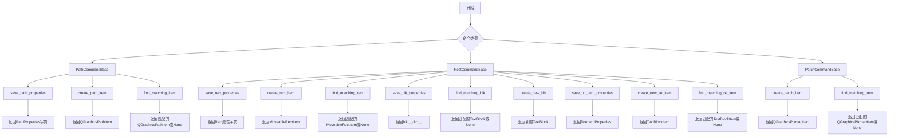

## 类结构

```
TypedDict (数据模型)
├── PenSettings
├── PathProperties
└── PatchProperties
CommandBase (命令基类)
├── PathCommandBase (路径命令基类)
├── RectCommandBase (矩形命令基类)
│   ├── 矩形属性管理
│   ├── 文本块属性管理
│   └── 文本项属性管理
└── PatchCommandBase (补丁命令基类)
```

## 全局变量及字段


### `HASH_KEY`
    
用于存储和查找补丁项的哈希键常量

类型：`int`
    


### `PenSettings.color`
    
画笔颜色

类型：`QColor`
    


### `PenSettings.width`
    
画笔宽度

类型：`int`
    


### `PenSettings.style`
    
画笔样式

类型：`Qt.PenStyle`
    


### `PenSettings.cap`
    
画笔端点样式

类型：`Qt.PenCapStyle`
    


### `PenSettings.join`
    
画笔连接样式

类型：`Qt.PenJoinStyle`
    


### `PathProperties.path`
    
路径对象

类型：`QPainterPath`
    


### `PathProperties.pen`
    
画笔颜色(HexArgb字符串)

类型：`str`
    


### `PathProperties.brush`
    
填充颜色(HexArgb字符串)

类型：`str`
    


### `PathProperties.width`
    
线条宽度

类型：`int`
    


### `PathProperties.pen_settings`
    
详细画笔设置

类型：`PenSettings`
    


### `PatchProperties.bbox`
    
边界框(x, y, w, h)

类型：`tuple`
    


### `PatchProperties.png_path`
    
PNG文件绝对路径

类型：`str`
    


### `PatchProperties.hash`
    
补丁图像+bbox的哈希值

类型：`str`
    
    

## 全局函数及方法


### `PathCommandBase.save_path_properties`

保存路径图形项（QGraphicsPathItem）的属性为一个 PathProperties 字典，包含路径、画笔颜色、画刷颜色、宽度以及完整的画笔设置信息。

参数：

- `path_item`：`QGraphicsPathItem`，路径图形项

返回值：`PathProperties`，包含路径项的各种属性（路径、画笔颜色、画刷颜色、宽度、画笔设置）

#### 流程图

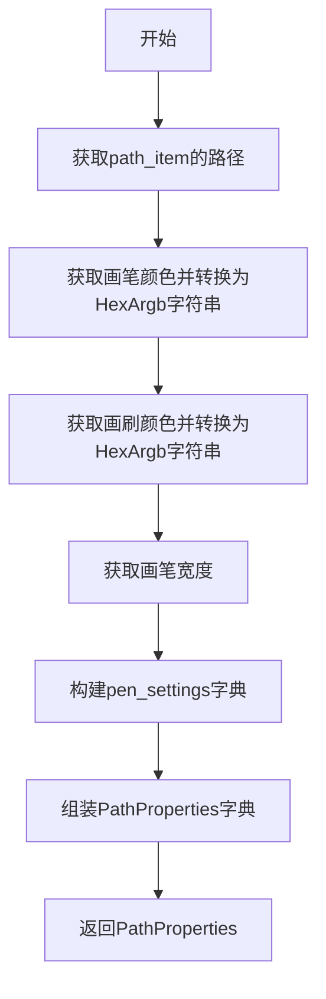

#### 带注释源码

```python
@staticmethod
def save_path_properties(path_item) -> PathProperties:
    """Save properties of a path item"""
    # 获取路径项的QPainterPath对象
    path = path_item.path()
    
    # 获取画笔颜色并转换为HexArgb格式的字符串（如 #80ff0000）
    pen = path_item.pen().color().name(QColor.HexArgb)
    
    # 获取画刷颜色并转换为HexArgb格式的字符串
    brush = path_item.brush().color().name(QColor.HexArgb)
    
    # 获取画笔宽度
    width = path_item.pen().width()
    
    # 构建完整的画笔设置字典
    pen_settings = {
        'color': path_item.pen().color(),          # QColor对象
        'width': path_item.pen().width(),          # 整型宽度值
        'style': path_item.pen().style(),          # Qt.PenStyle枚举
        'cap': path_item.pen().capStyle(),         # Qt.PenCapStyle枚举
        'join': path_item.pen().joinStyle()        # Qt.PenJoinStyle枚举
    }
    
    # 组装并返回完整的PathProperties字典
    return {
        'path': path,
        'pen': pen,
        'brush': brush,
        'width': width,
        'pen_settings': pen_settings
    }
```


### `PathCommandBase.create_path_item`

根据属性字典创建新的 Qt 图形路径项（QGraphicsPathItem），设置笔刷、画笔样式并返回该路径项。

参数：

- `properties`：`PathProperties`，路径属性字典，包含路径数据、画笔设置和画刷颜色等

返回值：`QGraphicsPathItem`，创建完成的图形路径项对象

#### 流程图

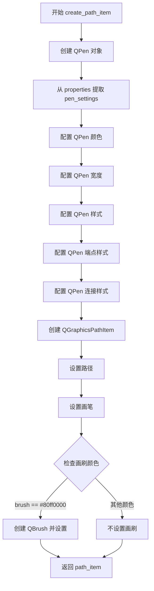

#### 带注释源码

```python
@staticmethod
def create_path_item(properties):
    """Create a new path item with given properties"""
    # 创建 QPen 对象用于绘制路径轮廓
    pen = QPen()
    # 从属性字典中提取画笔设置
    pen_settings = properties['pen_settings']
    # 设置画笔颜色（支持 ARGB 格式）
    pen.setColor(pen_settings['color'])
    # 设置画笔宽度
    pen.setWidth(pen_settings['width'])
    # 设置画笔线条样式（实线、虚线等）
    pen.setStyle(pen_settings['style'])
    # 设置画笔端点样式
    pen.setCapStyle(pen_settings['cap'])
    # 设置画笔连接点样式
    pen.setJoinStyle(pen_settings['join'])

    # 创建 QGraphicsPathItem 图形路径项对象
    path_item = QGraphicsPathItem()
    # 设置路径的几何形状
    path_item.setPath(properties['path'])
    # 为路径项设置已配置好的画笔
    path_item.setPen(pen)
    
    # 仅当画刷颜色为半透明红色 (#80ff0000) 时设置画刷
    # 该条件可能用于特殊标记或高亮场景
    if properties['brush'] == "#80ff0000":
        # 将十六进制颜色字符串转换为 QColor 对象
        brush_color = QColor(properties['brush'])
        # 创建画刷并设置到路径项
        path_item.setBrush(QBrush(brush_color))
        
    # 返回配置完成的图形路径项
    return path_item
```


### `PathCommandBase.find_matching_item`

在场景中查找与给定路径属性（路径、画笔颜色、画刷颜色、宽度）完全匹配的 `QGraphicsPathItem` 图形路径项。

参数：

- `scene`：`QGraphicsScene`，图形场景
- `properties`：`PathProperties`，要匹配的路径属性

返回值：`QGraphicsPathItem | None`，返回找到的匹配项；若未找到则返回 `None`

#### 流程图

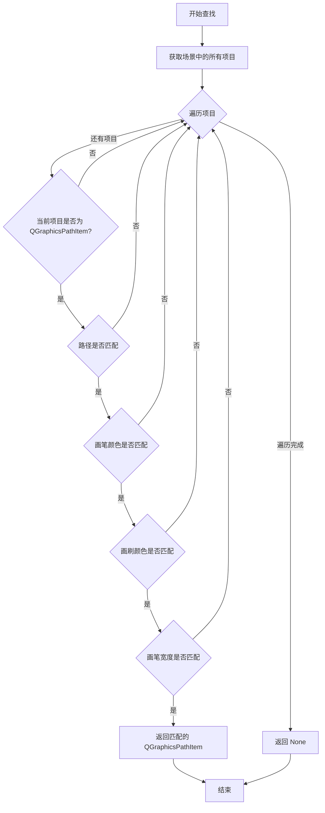

#### 带注释源码

```python
@staticmethod
def find_matching_item(scene, properties):
    """Find an item in the scene matching the given properties"""
    # 遍历场景中的所有图形项
    for item in scene.items():
        # 仅处理 QGraphicsPathItem 类型的图形项
        if isinstance(item, QGraphicsPathItem):
            # 检查四项属性是否同时匹配：路径、画笔颜色、画刷颜色、宽度
            if (item.path() == properties['path'] and
                item.pen().color().name(QColor.HexArgb) == properties['pen'] and
                item.brush().color().name(QColor.HexArgb) == properties['brush'] and
                item.pen().width() == properties['width']):
                # 所有属性匹配，返回该图形项
                return item
    # 遍历完成未找到匹配项，返回 None
    return None
```


### `RectCommandBase.save_rect_properties`

保存矩形图形项的属性，返回包含位置、旋转、尺寸和变换原点等信息的字典。

参数：

-  `item`：`MoveableRectItem`，矩形图形项

返回值：`dict`，包含矩形项的位置、旋转、宽度、高度和变换原点的字典

#### 流程图

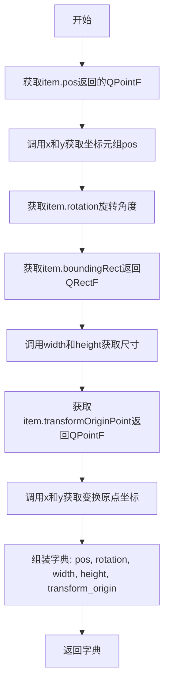

#### 带注释源码

```python
@staticmethod
def save_rect_properties(item):
    """Save properties of a path item"""
    # 返回包含矩形项核心属性的字典，用于后续恢复或比较
    return {
        # 位置：提取QPointF的x、y坐标为元组
        'pos':(item.pos().x(), item.pos().y()),
        # 旋转：获取当前旋转角度（度为单位）
        'rotation': item.rotation(),
        # 宽度：从边界矩形获取
        'width': item.boundingRect().width(),
        # 高度：从边界矩形获取
        'height': item.boundingRect().height(),
        # 变换原点：提取QPointF的x、y坐标为元组，用于旋转/缩放中心
        'transform_origin': (item.transformOriginPoint().x(), 
                                 item.transformOriginPoint().y()),
    }
```


### `RectCommandBase.create_rect_item`

该方法是一个静态方法，用于根据提供的矩形属性（位置、尺寸、旋转角度和变换原点）创建可移动的矩形图形项。方法内部首先从 properties 字典中提取宽度、高度、位置坐标、旋转角度和变换原点等信息，构建 QRectF 和 QPointF 对象，然后调用 ImageViewer 的 add_rectangle 方法完成矩形项的创建并返回。

参数：

-  `properties`：`dict`，矩形属性字典，包含位置 (pos)、宽度 (width)、高度 (height)、旋转角度 (rotation) 和变换原点 (transform_origin)
-  `viewer`：`ImageViewer`，图像查看器实例，用于调用其 add_rectangle 方法创建矩形项

返回值：`MoveableRectItem`，使用viewer方法创建的可移动矩形项

#### 流程图

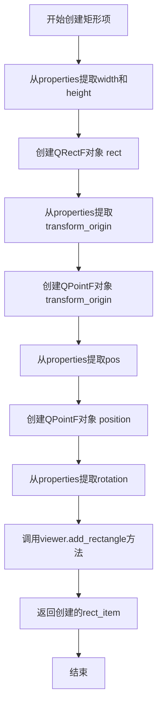

#### 带注释源码

```python
@staticmethod
def create_rect_item(properties, viewer: ImageViewer):
    """Create a new rect item with given properties using the viewer's method"""
    # 从属性字典中提取宽度和高度，创建QRectF对象表示矩形尺寸
    # QRectF构造参数: (x, y, width, height)，此处x=0, y=0
    rect = QRectF(0, 0, properties['width'], properties['height'])
    
    # 从属性字典中提取变换原点坐标，使用可变参数解包元组
    # transform_origin是一个(x, y)元组，表示旋转/缩放的中心点
    transform_origin = QPointF(*properties['transform_origin'])
    
    # 从属性字典中提取位置坐标，创建QPointF对象
    # position表示矩形在场景中的位置
    position = QPointF(*properties['pos'])
    
    # 从属性字典中提取旋转角度
    # rotation表示矩形的旋转角度（以度为单位）
    rotation = properties['rotation']
    
    # 使用viewer's add_rectangle方法进行一致的创建处理
    # 这样可以确保矩形项的创建遵循相同的逻辑和配置
    rect_item = viewer.add_rectangle(rect, position, rotation, transform_origin)
    
    # 返回创建的可移动矩形项
    return rect_item
```


### `RectCommandBase.find_matching_rect`

在场景中查找与给定属性匹配的 `MoveableRectItem`，使用 `is_close` 函数进行数值比较（用于处理浮点数精度问题）。

参数：

- `scene`：`QGraphicsScene`，图形场景
- `properties`：`dict`，要匹配的矩形属性，包含位置(pos)、宽度(width)、高度(height)、旋转(rotation)和变换原点(transform_origin)

返回值：`MoveableRectItem | None`，返回找到的匹配矩形项，如果未找到则返回 `None`

#### 流程图

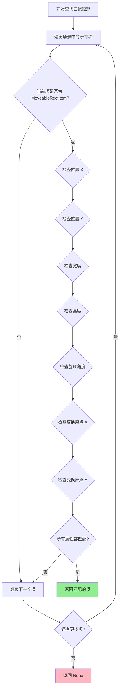

#### 带注释源码

```python
@staticmethod
def find_matching_rect(scene, properties):
    """Find an item in the scene matching the given properties"""
    # 遍历场景中的所有图形项
    for item in scene.items():
        # 只检查 MoveableRectItem 类型的项
        if isinstance(item, MoveableRectItem):
            # 使用 is_close 进行浮点数近似比较（避免精度问题）
            if (is_close(item.pos().x(), properties['pos'][0]) and    # 比较X坐标
                is_close(item.pos().y(), properties['pos'][1]) and    # 比较Y坐标
                is_close(item.boundingRect().width(), properties['width']) and   # 比较宽度
                is_close(item.boundingRect().height(), properties['height']) and # 比较高度
                is_close(item.rotation(), properties['rotation']) and              # 比较旋转角度
                is_close(item.transformOriginPoint().x(), properties['transform_origin'][0]) and # 比较变换原点X
                is_close(item.transformOriginPoint().y(), properties['transform_origin'][1])): # 比较变换原点Y
                # 所有属性都匹配，返回该矩形项
                return item
    # 遍历完所有项都未找到匹配，返回 None
    return None
```


### `RectCommandBase.save_blk_properties`

保存文本块对象的 `__dict__` 属性到一个字典中并返回。

参数：

- `blk`：`TextBlock`，文本块对象

返回值：`dict`，返回文本块的 `__dict__` 属性字典

#### 流程图

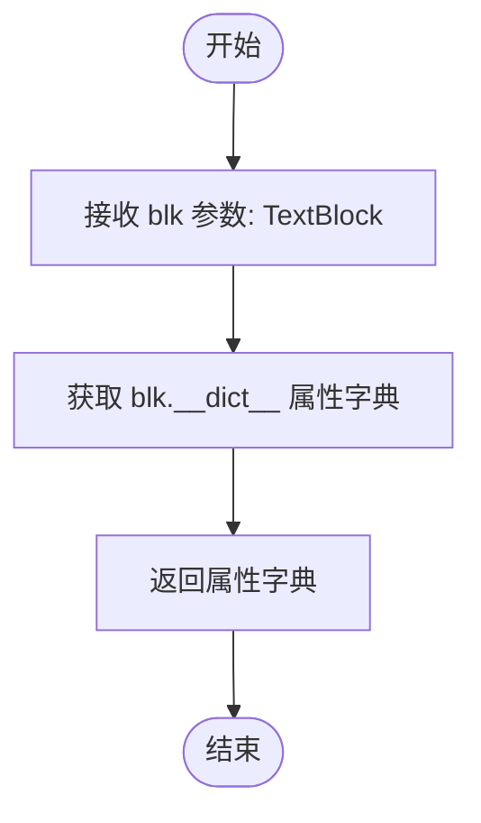

#### 带注释源码

```python
@staticmethod
def save_blk_properties(blk):
    """保存文本块的__dict__属性"""
    # 获取文本块对象的__dict__属性字典
    # __dict__包含对象的所有实例属性
    prp = blk.__dict__
    
    # 返回属性字典，可用于后续的属性恢复或比较
    return prp
```


### `RectCommandBase.find_matching_blk`

在文本块列表中查找与给定属性匹配的 TextBlock 对象，支持 numpy 数组的特殊比较逻辑。

参数：

- `blk_list`：`list`，文本块列表
- `properties`：`dict`，要匹配的文本块属性

返回值：`TextBlock | None`，返回第一个匹配的文本块对象，若未找到则返回 `None`

#### 流程图

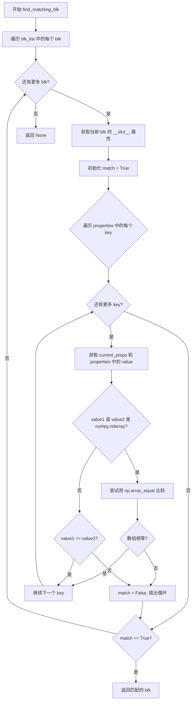

#### 带注释源码

```python
@staticmethod
def find_matching_blk(blk_list, properties):
    """在列表中查找匹配的文本块(含numpy数组比较)"""
    for blk in blk_list:
        # 获取当前文本块的属性字典副本
        current_props = blk.__dict__.copy()
        
        # 假设初始值为匹配
        match = True
        # 遍历目标属性字典中的每个键
        for key in properties:
            # 获取当前文本块和目标属性中的值
            value1 = current_props.get(key)
            value2 = properties.get(key)
            
            # 处理 numpy 数组的特殊比较逻辑
            if isinstance(value1, np.ndarray) or isinstance(value2, np.ndarray):
                # 将两者都转换为 numpy 数组以便比较
                try:
                    arr1 = np.array(value1) if not isinstance(value1, np.ndarray) else value1
                    arr2 = np.array(value2) if not isinstance(value2, np.ndarray) else value2
                    # 使用 np.array_equal 进行精确数组比较
                    if not np.array_equal(arr1, arr2):
                        match = False
                        break
                except (ValueError, TypeError):
                    # 如果转换失败，回退到常规比较
                    if value1 != value2:
                        match = False
                        break
            else:
                # 非 numpy 值使用标准相等性比较
                if value1 != value2:
                    match = False
                    break
        
        # 如果所有属性都匹配，返回该文本块
        if match:
            return blk

    # 遍历完毕未找到匹配项，返回 None
    return None
```


### `RectCommandBase.create_new_blk`

创建新的文本块并根据传入的属性字典更新其内部状态。

参数：

-  `properties`：`dict`，文本块属性字典，用于初始化或更新 TextBlock 的各项属性

返回值：`TextBlock`，返回创建并更新属性后的文本块对象

#### 流程图

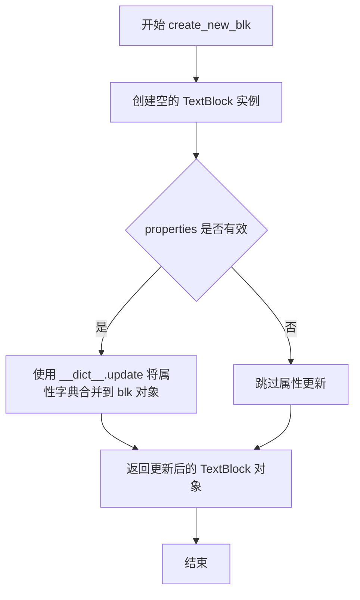

#### 带注释源码

```python
@staticmethod
def create_new_blk(properties):
    """创建新的文本块并根据属性字典更新其内容
    
    Args:
        properties: dict，文本块属性字典，包含要设置的各项属性
        
    Returns:
        TextBlock: 创建并更新属性后的文本块对象
    """
    # 创建一个新的 TextBlock 空实例
    blk = TextBlock()  
    
    # 使用 Python 的 __dict__ 直接更新对象的内部属性字典
    # 这种方式可以动态地向对象添加任意属性，绕过了常规的 setter 验证
    blk.__dict__.update(properties)  
    
    # 返回配置完成后的文本块对象
    return blk  
```


### `RectCommandBase.save_txt_item_properties`

使用TextItemProperties集中保存文本块图形项的所有属性，包括字体、颜色、位置、旋转、缩放等。

参数：

-  `item`：`TextBlockItem`，文本块图形项

返回值：`TextItemProperties`，集中保存的文本项属性对象

#### 流程图

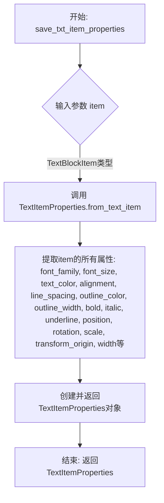

#### 带注释源码

```python
@staticmethod
def save_txt_item_properties(item):
    """Save TextBlockItem properties using the centralized TextItemProperties"""
    # 参数 item: TextBlockItem - 文本块图形项实例
    # 返回值: TextItemProperties - 集中保存的文本项属性对象
    
    # 调用TextItemProperties类的静态方法from_text_item
    # 该方法接收一个TextBlockItem对象，提取其所有相关属性
    # 并返回一个结构化的TextItemProperties对象，便于后续序列化和反序列化
    return TextItemProperties.from_text_item(item)
```


### `RectCommandBase.create_new_txt_item`

使用 viewer 方法创建新的文本项，支持从字典或 TextItemProperties 对象创建 TextBlockItem。

参数：

- `properties`：`dict | TextItemProperties`，文本项属性，可以是字典格式或已构建的 TextItemProperties 对象
- `viewer`：`ImageViewer`，图像查看器实例，用于调用其 add_text_item 方法创建文本项

返回值：`TextBlockItem`，返回新创建的文本块项实例

#### 流程图

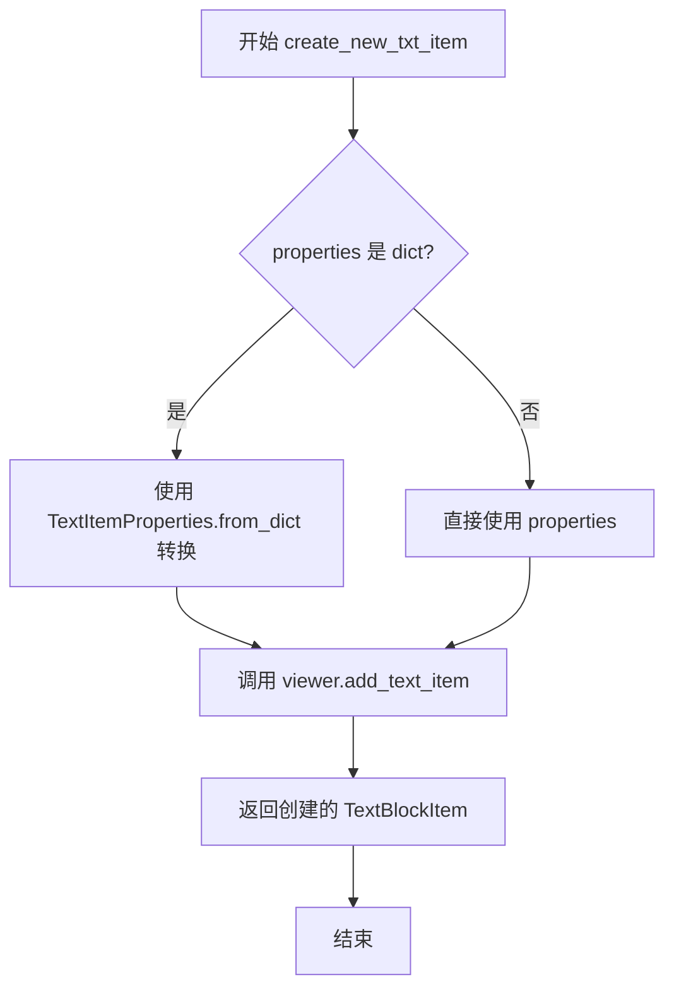

#### 带注释源码

```python
@staticmethod
def create_new_txt_item(properties, viewer: ImageViewer):  
    """Create a new TextBlockItem using the centralized add_text_item method"""
    
    # 将属性字典转换为 TextItemProperties 对象，确保统一格式处理
    # 如果 properties 已经是 TextItemProperties 对象，则直接使用
    if isinstance(properties, dict):
        text_props = TextItemProperties.from_dict(properties)
    else:
        text_props = properties
        
    # 通过 viewer 的统一入口方法创建文本项，保证处理逻辑一致性
    text_item = viewer.add_text_item(text_props)
    
    # 返回新创建的 TextBlockItem 实例
    return text_item
```


### `RectCommandBase.find_matching_txt_item`

在场景中查找与给定属性匹配的文本项，通过遍历场景中的所有项，筛选出TextBlockItem类型的项，并使用数值近似比较函数is_close对多个属性进行匹配，包括字体、颜色、位置、旋转、缩放等属性。

参数：

- `scene`：`QGraphicsScene`，图形场景
- `properties`：`TextItemProperties`，要匹配的文本项属性

返回值：`TextBlockItem | None`，返回匹配的TextBlockItem实例，若未找到则返回None

#### 流程图

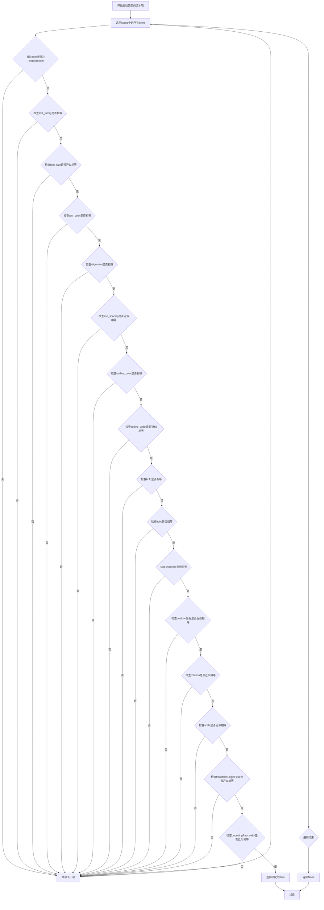

#### 带注释源码

```python
@staticmethod
def find_matching_txt_item(scene, properties):
    """Find a TextBlockItem in the scene matching the given properties"""
    # 遍历场景中的所有图形项
    for item in scene.items():
        # 只处理TextBlockItem类型的项
        if isinstance(item, TextBlockItem):
            # 使用is_close进行数值近似比较,直接比较属性值
            # 字体家族精确匹配
            if (item.font_family == properties.font_family and
                # 字体大小使用近似比较(处理浮点误差)
                is_close(item.font_size, properties.font_size) and
                # 文本颜色精确匹配
                item.text_color == properties.text_color and
                # 对齐方式精确匹配
                item.alignment == properties.alignment and
                # 行间距使用近似比较
                is_close(item.line_spacing, properties.line_spacing) and
                # 轮廓颜色精确匹配
                item.outline_color == properties.outline_color and
                # 轮廓宽度使用近似比较
                is_close(item.outline_width, properties.outline_width) and
                # 粗体标志精确匹配
                item.bold == properties.bold and
                # 斜体标志精确匹配
                item.italic == properties.italic and
                # 下划线标志精确匹配
                item.underline == properties.underline and
                # X坐标位置近似比较
                is_close(item.pos().x(), properties.position[0]) and
                # Y坐标位置近似比较
                is_close(item.pos().y(), properties.position[1]) and
                # 旋转角度近似比较
                is_close(item.rotation(), properties.rotation) and
                # 缩放比例近似比较
                is_close(item.scale(), properties.scale) and
                # 变换原点X坐标近似比较
                is_close(item.transformOriginPoint().x(), properties.transform_origin[0]) and
                # 变换原点Y坐标近似比较
                is_close(item.transformOriginPoint().y(), properties.transform_origin[1]) and
                # 边界框宽度近似比较
                is_close(item.boundingRect().width(), properties.width)):
                # 所有属性都匹配,返回该item
                return item
    # 遍历完成未找到匹配项,返回None
    return None
```


### `PatchCommandBase.create_patch_item`

创建补丁图像项,支持Webtoon模式

参数：

-  `properties`：`PatchProperties`，补丁属性字典
-  `viewer`：`ImageViewer`，图像查看器实例

返回值：`QGraphicsPixmapItem`，创建的补丁图形项对象

#### 流程图

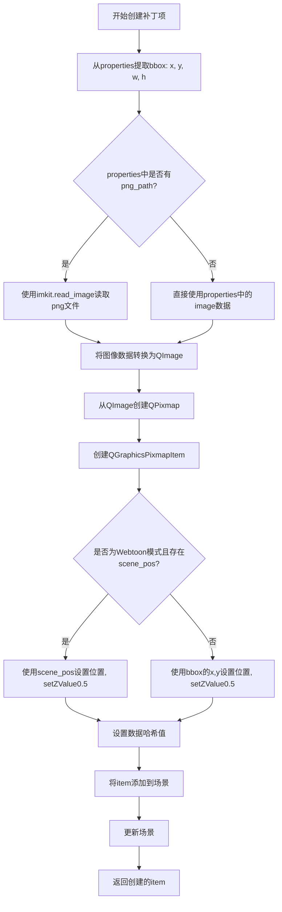

#### 带注释源码

```python
@staticmethod
def create_patch_item(properties, viewer: ImageViewer):
    """
    创建补丁图像项,支持Webtoon模式
    
    参数:
        properties: 补丁属性字典,包含bbox、png_path或image、hash等
        viewer: 图像查看器实例,用于访问场景和判断webtoon模式
    
    返回:
        QGraphicsPixmapItem: 创建的补丁图形项对象
    """
    # 从properties中提取边界框信息 (x, y, w, h)
    x, y, w, h = properties['bbox']
    
    # 根据properties中的内容决定图像来源:
    # 1. 如果存在png_path键,从磁盘读取PNG文件
    # 2. 否则直接从properties中获取image数据(可能是内存中的图像)
    img = imk.read_image(properties['png_path']) if 'png_path' in properties else properties['image']
    
    # 将numpy数组格式的图像数据转换为PySide6的QImage
    # 参数: 数据指针, 宽度, 高度, 行步长, 图像格式
    qimg = QtGui.QImage(img.data, w, h, img.strides[0],
                        QtGui.QImage.Format.Format_RGB888)
    
    # 从QImage创建QPixmap(适合显示的图像格式)
    pix  = QtGui.QPixmap.fromImage(qimg)
    
    # 创建可添加到场景的图形项
    item = QtWidgets.QGraphicsPixmapItem(pix)
    
    # 处理Webtoon模式下的位置设置
    if 'scene_pos' in properties and viewer.webtoon_mode:
        # Webtoon模式: 使用场景坐标(可能是漫画页面的实际位置)
        scene_x, scene_y = properties['scene_pos']
        item.setPos(scene_x, scene_y)
        item.setZValue(0.5)  # 设置Z值使其位于图像之上,但在文字之下
    else:
        # 普通模式: 使用边界框坐标
        item.setPos(x, y)
        item.setZValue(0.5)
    
    # 使用静态HASH_KEY存储补丁的哈希值,用于后续匹配查找
    item.setData(PatchCommandBase.HASH_KEY, properties['hash'])
    
    # 将创建的图形项添加到查看器的场景中
    viewer._scene.addItem(item)
    
    # 触发场景更新,确保图形正确渲染
    viewer._scene.update()
    
    # 返回创建的补丁项,供调用者使用(如添加到命令历史)
    return item
```


### `PatchCommandBase.find_matching_item`

通过哈希值和位置查找匹配的补丁项。

参数：

- `scene`：`QGraphicsScene`，图形场景
- `properties`：`PatchProperties`，要匹配的补丁属性

返回值：`QGraphicsPixmapItem | None`，返回匹配的图形项，如果未找到则返回 None

#### 流程图

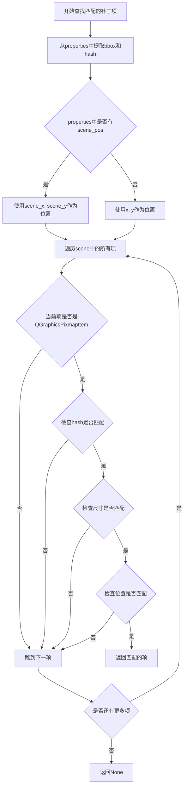

#### 带注释源码

```python
@staticmethod
def find_matching_item(scene, properties):
    """Find an item in the scene matching the given properties"""
    # 从properties中提取边界框信息
    x, y, w, h = properties['bbox']
    # 获取要匹配的hash值
    want_hash = properties['hash']
    
    # 检查是否在webtoon模式下使用了scene坐标
    if 'scene_pos' in properties:
        # 使用场景坐标（webtoon模式）
        scene_x, scene_y = properties['scene_pos']
    else:
        # 使用原始的bbox坐标
        scene_x, scene_y = x, y

    # 遍历场景中的所有图形项
    for itm in scene.items():
        # 跳过非QGraphicsPixmapItem类型的项（如路径、矩形、文本等）
        if not isinstance(itm, QtWidgets.QGraphicsPixmapItem):
            continue

        # 获取存储在项中的hash值（用于快速筛选）
        stored_hash = itm.data(PatchCommandBase.HASH_KEY)
        # 如果hash不匹配，直接跳过后续检查（性能优化）
        if stored_hash != want_hash:
            continue

        # 检查项的尺寸是否与目标尺寸匹配
        if (itm.pixmap().width() != w or itm.pixmap().height() != h):
            continue
            
        # 获取项的当前位置坐标
        item_x, item_y = int(itm.pos().x()), int(itm.pos().y())
        
        # 检查位置是否匹配（尝试两种坐标系统：scene坐标或bbox坐标）
        if ((item_x == int(scene_x) and item_y == int(scene_y)) or 
            (item_x == x and item_y == y)):
            # 找到匹配的项，返回该图形项
            return itm
            
    # 遍历完所有项都未找到匹配，返回None
    return None
```

## 关键组件


### PathCommandBase（路径命令基类）

提供图形路径项目（QGraphicsPathItem）的属性保存、项目创建和场景匹配查找功能，支持笔刷和画笔属性的序列化与反序列化。

### RectCommandBase（矩形命令基类）

提供可移动矩形项目（MoveableRectItem）的属性保存、项目创建和场景匹配查找功能，支持文本块（TextBlock）和文本项目（TextBlockItem）的属性管理和创建。

### PatchCommandBase（补丁命令基类）

提供图像补丁（QGraphicsPixmapItem）的创建和匹配查找功能，支持webtoon模式下的场景坐标定位，使用哈希值进行高效匹配。

### PenSettings（笔刷设置数据类型）

定义笔刷的颜色、宽度、样式、端点样式和连接样式的类型字典，用于序列化Qt画笔属性。

### PathProperties（路径属性数据类型）

定义路径项目的完整属性结构，包含路径对象、十六进制ARGB颜色字符串、画笔设置等，用于路径项目的序列化和反序列化。

### PatchProperties（补丁属性数据类型）

定义图像补丁的边界框、PNG路径和哈希值的类型字典，支持补丁图像的持久化和匹配。

### 属性序列化模块

包含save_path_properties、save_rect_properties、save_blk_properties、save_txt_item_properties等方法，将Qt图形项目序列化为可存储的字典格式。

### 项目创建工厂

包含create_path_item、create_rect_item、create_new_blk、create_new_txt_item、create_patch_item等方法，根据属性字典创建对应的Qt图形项目。

### 场景匹配查找器

包含find_matching_item、find_matching_rect、find_matching_blk、find_matching_txt_item等方法，在场景中查找与给定属性匹配的项目，支持数值容差比较。

### Webtoon模式支持

PatchCommandBase中处理scene_pos的逻辑，支持在webtoon模式下根据场景坐标而非边界框坐标定位图像补丁。


## 问题及建议


### 已知问题

- **类型注解不一致**：`create_path_item(properties)` 方法缺少参数类型注解；`find_matching_item` 在不同类中参数签名不一致（PathCommandBase 接收 `scene, properties`，PatchCommandBase 只接收 `scene, properties` 但实现逻辑不同）
- **硬编码值缺乏可维护性**：`create_path_item` 中硬编码了 `if properties['brush'] == "#80ff0000"`（半透明红色），`PatchCommandBase.create_patch_item` 中硬编码了 `setZValue(0.5)` 和 `HASH_KEY = 0`，这些magic number应提取为常量或配置
- **直接操作 `__dict__` 破坏封装性**：`save_blk_properties` 直接返回 `blk.__dict__`，`create_new_blk` 直接更新 `blk.__dict__`，这种黑魔法访问方式使得类内部实现变化时极易破坏调用方，且无法利用属性验证或类型检查
- **numpy 数组比较逻辑冗余**：`find_matching_blk` 中手动处理 numpy 数组的类型检查和转换逻辑繁琐，可使用 `np.array_equal()` 或 `np.allclose()` 简化
- **图像加载缺乏错误处理**：`create_patch_item` 中 `imk.read_image()` 调用没有 try-except 包装，如果文件不存在或格式错误会直接抛出未处理异常
- **Scene 遍历效率低下**：所有 `find_matching_*` 方法都使用 `for item in scene.items()` 进行线性遍历，随着场景元素增多性能会显著下降
- **方法命名冗余不一致**：保存方法有 `save_path_properties`、`save_rect_properties`、`save_blk_properties`、`save_txt_item_properties` 四种不同命名风格；创建方法有 `create_path_item`、`create_rect_item`、`create_new_blk`、`create_new_txt_item` 命名不统一

### 优化建议

- 统一所有方法的类型注解，特别是 `properties` 参数应明确使用 TypedDict 类型或创建统一的 Pydantic 模型
- 将硬编码的 magic number 提取为类级常量或枚举：例如 `Z_ORDER_PATCH = 0.5`、`DEFAULT_BRUSH_COLOR = "#80ff0000"`
- 考虑使用 dataclass 或 Pydantic 替代直接 `__dict__` 操作，为 `TextBlock` 添加标准的属性访问接口
- 引入缓存机制（如按类型建立 dict 索引）加速 `find_matching_*` 方法的查找，或使用 `scene.items(Qt.AspectRatioMode)` 配合过滤条件
- 为图像加载添加异常处理和降级策略，提供默认占位图或回退逻辑
- 考虑重构为单一的命令基类或策略模式，减少三个 Base 类之间的代码重复（如 `save_properties`、`create_item`、`find_matching` 可以统一接口）
- 添加单元测试覆盖，特别是针对 numpy 比较、属性序列化和反序列化的边界情况
</think>

## 其它


### 设计目标与约束

本模块作为图形编辑器命令系统的基础设施层，为路径(Pen)、矩形(Rect)、文本块(TextBlock)和图像块(Patch)四种图形元素提供统一的序列化和反序列化能力。核心设计目标包括：1) 通过抽象基类实现代码复用；2) 支持撤销/重做(Undo/Redo)功能的属性持久化；3) 兼容Webtoon模式的场景坐标处理；4) 确保查找匹配算法的准确性和性能。技术约束方面，受限于PySide6的QGraphicsItem生命周期管理，且需处理numpy数组与Qt类型转换的边界情况。

### 错误处理与异常设计

代码中的错误处理主要依赖返回值而非异常抛出。`find_matching_item`和`find_matching_rect`方法在未找到匹配项时返回`None`，这是一种隐式错误处理策略。建议补充的异常场景包括：1) `properties`字典缺少必要键时的`KeyError`；2) `imk.read_image`读取失败时的文件未找到异常；3) `QImage`构造时的格式不支持异常；4) numpy数组比较失败时的类型错误。当前`RectCommandBase.find_matching_blk`已包含`try-except`处理数组比较失败的情况，可作为其他方法的参考模板。

### 数据流与状态机

该模块处于命令模式(Command Pattern)的数据准备层，主要数据流为：输入(用户操作) → 属性采集(PathProperties/RectProperties等) → 序列化存储 → 重做时反序列化创建图形Item。状态转换方面，PathItem和RectItem经历「创建态→场景挂载态→销毁态」的生命周期，PatchItem额外处理「普通模式↔Webtoon模式」的坐标状态变化。TextBlockItem通过`TextItemProperties`进行属性集中管理，形成独立的属性状态流。

### 外部依赖与接口契约

本模块依赖以下外部组件：1) `PySide6.QtGui/QtWidgets/QtCore` - Qt图形框架；2) `imkit(imk)` - 图像读取库；3) `modules.utils.textblock.TextBlock` - 文本块数据结构；4) `modules.utils.common_utils.is_close` - 浮点数近似比较；5) `app.ui.canvas.image_viewer.ImageViewer` - 图像查看器主控制器。接口契约方面，`PathCommandBase.find_matching_item`要求传入的`path_item`必须包含`path()`、`pen()`、`brush()`方法；`RectCommandBase.create_rect_item`依赖`ImageViewer.add_rectangle`方法的存在；`PatchCommandBase.create_patch_item`假设`viewer._scene`为可访问的QGraphicsScene实例。

### 性能考量与优化空间

当前实现中存在若干性能瓶颈：1) `find_matching_item`方法遍历`scene.items()`全量扫描，时间复杂度O(N)，建议建立哈希索引或空间索引加速；2) `save_blk_properties`使用`__dict__`浅拷贝保存全部属性，对于大型文档可能产生内存压力，建议按需保存差异属性；3) `find_matching_txt_item`进行14项属性逐个比较，其中`is_close`调用涉及浮点运算，可考虑批量预计算特征向量后做向量距离判定；4) Patch图像数据每次都从磁盘读取，建议增加内存缓存层。

### 版本兼容性说明

代码中使用`from __future__ import annotations`确保Python 3.9+的类型的延迟求值兼容。Qt相关类型标注使用字符串形式(如`"ImageViewer"`)避免循环导入。numpy数组处理使用`np.array_equal`和`isinstance`双重检查，兼容numpy 1.x和2.x版本差异。PySide6版本需6.0以上以支持`TypedDict`和完整的Qt PenStyle/CapStyle枚举。

### 安全性考量

`PatchCommandBase.create_patch_item`直接使用传入的`png_path`构造文件路径，需注意路径遍历攻击风险，建议在调用层验证路径合法性。`RectCommandBase.save_blk_properties`直接操作`__dict__`可能暴露内部实现细节，若TextBlock包含敏感数据需考虑序列化前的脱敏处理。

### 测试策略建议

建议补充的测试用例包括：1) 边界条件测试(空场景查找、属性字典缺失键)；2) 并发场景测试(多线程操作scene_items)；3) Webtoon模式下的坐标转换一致性测试；4) numpy数组属性的序列化/反序列化完整性测试；5) 内存泄漏检测(大量PatchItem创建/销毁场景)。


    