# `comic-translate\app\ui\commands\box.py` 详细设计文档

This module implements the Command design pattern using PySide6's QUndoCommand to manage undoable operations for a canvas-based image editor, specifically handling the addition, deletion, modification, and resizing of rectangles, text blocks, and associated metadata.

## 整体流程

```mermaid
graph TD
    A[User Action Trigger] --> B{Create Command Object}
    B --> C[AddRectangleCommand]
    B --> D[BoxesChangeCommand]
    B --> E[ResizeBlocksCommand]
    B --> F[ClearRectsCommand]
    B --> G[DeleteBoxesCommand]
    B --> H[AddTextItemCommand]
    C --> I[redo: Add Item/Blk to Scene]
    D --> J[redo: Update Item/Blk Coordinates]
    E --> K[redo: Apply Resize Diff to Blocks]
    F --> L[redo: Remove Items & Save State]
    G --> M[redo: Remove Item/Blk & Save State]
    H --> N[redo: Add Text Item to Scene]
    I --> O[Scene Update]
    J --> O
    K --> O
    L --> O
    M --> O
    N --> O
    O --> P{User Undo}
    P --> Q[Call undo() method]
    Q --> R[Restore previous state or remove added items]
```

## 类结构

```
QUndoCommand (PySide6 Abstract Base)
RectCommandBase (Custom Utility Base)
├── AddRectangleCommand
├── BoxesChangeCommand
├── ResizeBlocksCommand
├── ClearRectsCommand
├── DeleteBoxesCommand
└── AddTextItemCommand
```

## 全局变量及字段


### `AddRectangleCommand.viewer`
    
图像查看器对象，用于管理图形场景和矩形项

类型：`ImageViewer`
    


### `AddRectangleCommand.scene`
    
Qt图形场景，用于存储和管理图形项

类型：`QGraphicsScene`
    


### `AddRectangleCommand.blk_list`
    
存储所有文本块(blk)的列表

类型：`list`
    


### `AddRectangleCommand.rect_properties`
    
保存矩形项的属性信息，用于撤销/重做操作

类型：`dict`
    


### `AddRectangleCommand.blk_properties`
    
保存文本块(blk)的属性信息，用于撤销/重做操作

类型：`dict`
    


### `BoxesChangeCommand.viewer`
    
图像查看器对象，用于管理图形场景和矩形项

类型：`ImageViewer`
    


### `BoxesChangeCommand.scene`
    
Qt图形场景，用于存储和管理图形项

类型：`QGraphicsScene`
    


### `BoxesChangeCommand.blk_list`
    
存储所有文本块(blk)的列表

类型：`list`
    


### `BoxesChangeCommand.old_xyxy`
    
变更前的边界框坐标 [x1, y1, x2, y2]

类型：`list`
    


### `BoxesChangeCommand.old_angle`
    
变更前的旋转角度

类型：`float`
    


### `BoxesChangeCommand.old_tr_origin`
    
变更前的变换原点坐标

类型：`tuple`
    


### `BoxesChangeCommand.new_xyxy`
    
变更后的边界框坐标 [x1, y1, x2, y2]

类型：`list`
    


### `BoxesChangeCommand.new_angle`
    
变更后的旋转角度

类型：`float`
    


### `BoxesChangeCommand.new_tr_origin`
    
变更后的变换原点坐标

类型：`tuple`
    


### `ResizeBlocksCommand.main`
    
主页面控制器对象，包含图像查看器和块列表

类型：`MainPage`
    


### `ResizeBlocksCommand.blk_list`
    
存储所有文本块(blk)的列表

类型：`list`
    


### `ResizeBlocksCommand.blocks`
    
当前操作的文本块副本列表

类型：`list`
    


### `ResizeBlocksCommand.old_xyxy`
    
调整大小前的所有块的边界框坐标列表

类型：`list`
    


### `ResizeBlocksCommand.new_xyxy`
    
调整大小后的所有块的边界框坐标列表

类型：`list`
    


### `ResizeBlocksCommand.diff`
    
调整大小的差值，用于扩展或收缩边界框

类型：`int`
    


### `ClearRectsCommand.viewer`
    
图像查看器对象，用于管理图形场景和矩形项

类型：`ImageViewer`
    


### `ClearRectsCommand.scene`
    
Qt图形场景，用于存储和管理图形项

类型：`QGraphicsScene`
    


### `ClearRectsCommand.properties_list`
    
存储被清除的矩形项属性列表，用于撤销操作恢复

类型：`list`
    


### `DeleteBoxesCommand.ct`
    
主页面控制器对象的简写引用

类型：`MainPage`
    


### `DeleteBoxesCommand.viewer`
    
图像查看器对象，用于管理图形场景和矩形项

类型：`ImageViewer`
    


### `DeleteBoxesCommand.scene`
    
Qt图形场景，用于存储和管理图形项

类型：`QGraphicsScene`
    


### `DeleteBoxesCommand.rect_properties`
    
保存被删除矩形项的属性信息，用于撤销操作

类型：`dict`
    


### `DeleteBoxesCommand.txt_item_prp`
    
保存被删除文本项的属性信息，用于撤销操作

类型：`dict`
    


### `DeleteBoxesCommand.blk_properties`
    
保存被删除文本块(blk)的属性信息，用于撤销操作

类型：`dict`
    


### `DeleteBoxesCommand.blk_list`
    
存储所有文本块(blk)的列表

类型：`list`
    


### `AddTextItemCommand.viewer`
    
图像查看器对象，用于管理图形场景和文本项

类型：`ImageViewer`
    


### `AddTextItemCommand.scene`
    
Qt图形场景，用于存储和管理图形项

类型：`QGraphicsScene`
    


### `AddTextItemCommand.txt_item_prp`
    
保存文本项的属性信息，用于撤销/重做操作

类型：`dict`
    
    

## 全局函数及方法


### `AddRectangleCommand.redo`

该方法实现了撤销命令的"重做"（Redo）功能，用于在场景中重新添加之前被撤销的矩形图形项和对应的数据块。如果场景中不存在匹配的矩形项或块列表中不存在匹配的块，则分别创建新的矩形项和块，并将其添加到场景和块列表中。

参数：
- （无显式参数，隐式接收 `self` 实例）

返回值：`None`，无返回值（Python 方法默认返回 None）

#### 流程图

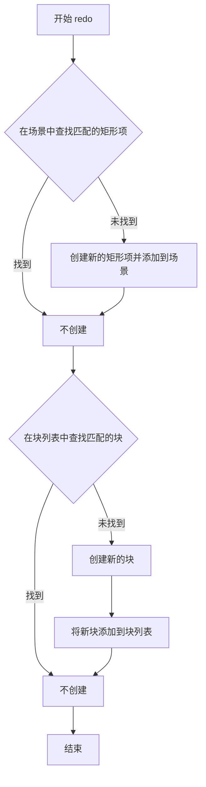

#### 带注释源码

```
def redo(self):
    """
    重做操作：重新添加矩形项和块到场景和列表中。
    这是 QUndoCommand 的标准 redo 方法，由 Qt 撤销框架调用。
    """
    
    # 检查场景中是否已存在匹配的矩形项
    # find_matching_rect 方法在 RectCommandBase 中定义
    # 参数: scene - Qt 图形场景, rect_properties - 保存的矩形属性字典
    # 返回: 匹配的 MoveableRectItem 或 None
    if not self.find_matching_rect(self.scene, self.rect_properties):
        # 如果没有找到匹配的矩形项，则创建新的矩形图形项
        # create_rect_item 方法在 RectCommandBase 中定义
        # 参数: rect_properties - 矩形属性, viewer - 图像查看器
        self.create_rect_item(self.rect_properties, self.viewer)

    # 检查块列表中是否已存在匹配的块数据
    # find_matching_blk 方法在 RectCommandBase 中定义
    # 参数: blk_list - 块列表, blk_properties - 保存的块属性字典
    # 返回: 匹配的块对象或 None
    if not self.find_matching_blk(self.blk_list, self.blk_properties):
        # 如果没有找到匹配的块，则创建新的块对象
        # create_new_blk 方法在 RectCommandBase 中定义
        # 参数: blk_properties - 块属性字典
        # 返回: 新创建的块对象
        blk = self.create_new_blk(self.blk_properties)
        
        # 将新创建的块添加到块列表中
        # blk_list 通常是主页面中的数据块列表，用于存储所有矩形区域的数据
        self.blk_list.append(blk)
```


### `AddRectangleCommand.undo()`

该方法用于撤销添加矩形的操作，通过查找并移除之前添加的矩形图形项和对应的数据块来恢复状态。

参数：
- 无（该方法没有显式参数，隐含self）

返回值：`None`，该方法没有返回值，执行撤销操作后返回None。

#### 流程图

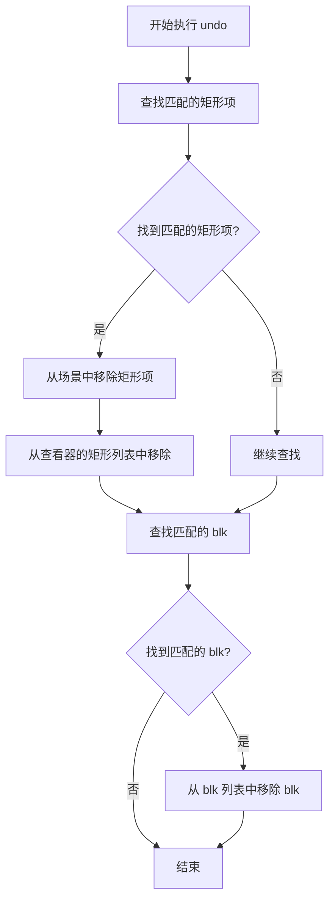

#### 带注释源码

```python
def undo(self):
    """
    撤销添加矩形的操作，移除之前添加的矩形图形项和数据块
    """
    # 查找场景中与保存属性匹配的矩形图形项
    matching_item = self.find_matching_rect(self.scene, self.rect_properties)
    # 查找 blk 列表中与保存属性匹配的 blk
    matching_blk = self.find_matching_blk(self.blk_list, self.blk_properties)

    # 如果找到匹配的矩形项，则从场景和查看器的矩形列表中移除
    if matching_item:
        self.scene.removeItem(matching_item)
        self.viewer.rectangles.remove(matching_item)

    # 如果找到匹配的 blk，则从 blk 列表中移除
    if matching_blk:
        self.blk_list.remove(matching_blk)
```


### BoxesChangeCommand.redo()

该方法是 `BoxesChangeCommand` 类的核心方法，实现了撤销/重做（Undo/Redo）机制中的"重做"功能。它遍历块列表，找到与旧状态匹配的块，用新状态更新它们，并同步更新场景中对应的图形项。

参数：无需显式参数

返回值：`None`，无返回值

#### 流程图

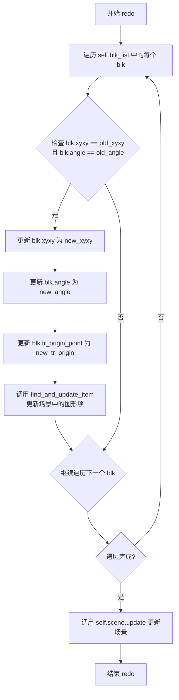

#### 带注释源码

```python
def redo(self):
    """
    重做操作：将块的状态从旧值更新到新值
    
    该方法实现了 QUndoCommand 的 redo 接口，
    用于在用户触发重做操作时应用更改
    """
    # 遍历所有相关的块（blk）
    for blk in self.blk_list:
        # 检查当前块是否与保存的旧状态匹配
        # 使用 np.array_equal 比较 xyxy 坐标数组
        # 同时比较旋转角度
        if (np.array_equal(blk.xyxy, self.old_xyxy) and
            blk.angle == self.old_angle):
        
            # 更新块的坐标边界框（xyxy格式：[x1, y1, x2, y2]）
            # 使用切片赋值 [:] 直接修改原数组内容
            blk.xyxy[:] = self.new_xyxy
            
            # 更新块的旋转角度
            blk.angle = self.new_angle
            
            # 更新块的变换原点（旋转中心点）
            blk.tr_origin_point = self.new_tr_origin

            # 调用静态方法查找并更新场景中对应的图形项
            # 参数包括：场景对象、旧xyxy、旧角度、新xyxy、新角度、新变换原点
            self.find_and_update_item(self.scene, self.old_xyxy, self.old_angle, 
                                            self.new_xyxy, self.new_angle, self.new_tr_origin)
            
            # 调用场景的 update 方法触发重绘
            # 确保图形项的更改立即反映在界面上
            self.scene.update()
```


### `BoxesChangeCommand.undo`

该方法是 Qt 撤销命令（QUndoCommand）的一部分，用于在图形编辑器中撤销对盒子（boxes）的位置、尺寸和旋转角度的修改操作，将图形块的状态恢复至修改前的旧值。

**参数：**
无（该方法为成员方法，通过 `self` 访问实例属性）

**返回值：**
无（`None`，该方法直接修改对象状态而非返回结果）

#### 流程图

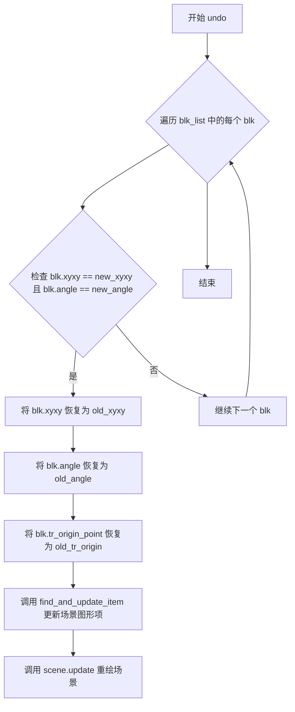

#### 带注释源码

```python
def undo(self):
    """
    撤销对盒子（boxes）的修改操作，将图形块的状态恢复为修改前的旧状态。
    该方法与 redo() 方法互为逆操作，用于支持 Qt 的撤销/重做机制。
    """
    # 遍历所有图形块（blk），查找与新状态匹配的块进行撤销操作
    for blk in self.blk_list:
        # 判断当前块是否匹配新状态（刚执行 redo 后的状态）
        if (np.array_equal(blk.xyxy, self.new_xyxy) and
            blk.angle == self.new_angle ):
            
            # 将块的坐标恢复为旧值（undo 操作核心）
            blk.xyxy[:] = self.old_xyxy  # 使用切片赋值保持数组引用不变
            blk.angle = self.old_angle
            blk.tr_origin_point = self.old_tr_origin

            # 调用静态方法 find_and_update_item 更新场景中对应的图形项
            # 参数顺序：场景对象、旧坐标/角度、新坐标/角度、变换原点
            self.find_and_update_item(self.scene, self.new_xyxy, self.new_angle, 
                                    self.old_xyxy, self.old_angle, self.old_tr_origin)
            
            # 更新场景，触发 Qt 图形界面的重绘
            self.scene.update()
```


### `BoxesChangeCommand.find_and_update_item`

该方法是一个静态函数，用于在场景中查找与给定旧坐标和旋转角度匹配的图形项（矩形或文本块），然后将其更新为新的坐标、尺寸、旋转角度和变换原点，实现图形界面与底层数据块的同步更新。

参数：

- `scene`：`QGraphicsScene`，场景对象，用于遍历其中的所有图形项
- `old_xyxy`：`List[int]`，旧的位置坐标，格式为 `[x1, y1, x2, y2]`，其中 (x1, y1) 为左上角坐标，(x2, y2) 为右下角坐标
- `old_angle`：`int`，旧的旋转角度（度）
- `new_xyxy`：`List[int]`，新的位置坐标，格式同 `old_xyxy`
- `new_angle`：`int`，新的旋转角度（度）
- `new_tr_origin`：`Tuple[float, float]`，新的变换原点坐标，格式为 `(x, y)`

返回值：`None`，该方法直接修改场景中的图形项属性，不返回任何值

#### 流程图

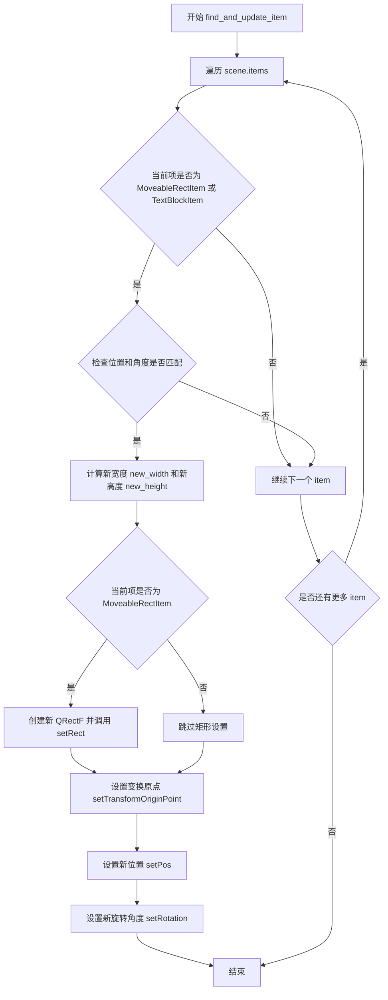

#### 带注释源码

```python
@staticmethod
def find_and_update_item(scene, old_xyxy, old_angle, new_xyxy, new_angle, new_tr_origin):
    """
    在场景中查找与旧坐标和角度匹配的图形项，并更新为新属性
    
    参数:
        scene: QGraphicsScene 场景对象
        old_xyxy: List[int] 旧的边界框坐标 [x1, y1, x2, y2]
        old_angle: int 旧的旋转角度
        new_xyxy: List[int] 新的边界框坐标 [x1, y1, x2, y2]
        new_angle: int 新的旋转角度
        new_tr_origin: Tuple[float, float] 新的变换原点 (x, y)
    """
    # 遍历场景中的所有图形项
    for item in scene.items():
        # 检查项类型是否符合且位置角度是否与旧状态匹配
        if (isinstance(item, (MoveableRectItem, TextBlockItem)) and
            int(item.pos().x()) == int(old_xyxy[0]) and 
            int(item.pos().y()) == int(old_xyxy[1]) and
            int(item.rotation()) == int(old_angle)):

            # 根据新坐标计算新的宽度和高度
            new_width = new_xyxy[2] - new_xyxy[0]
            new_height = new_xyxy[3] - new_xyxy[1]

            # 如果是矩形项，更新其矩形尺寸
            if isinstance(item, MoveableRectItem):
                rect = QRectF(0, 0, new_width, new_height)
                item.setRect(rect)

            # 更新变换原点、位置和旋转角度
            item.setTransformOriginPoint(QPointF(*new_tr_origin))
            item.setPos(new_xyxy[0], new_xyxy[1])
            item.setRotation(new_angle)
```


### `ResizeBlocksCommand._refresh_rectangles`

该方法负责刷新界面上所有矩形的显示。它首先根据是否处于 webtoon 模式清除现有的矩形，然后遍历当前块列表重新绘制每个矩形框，获取第一个块并选中对应的矩形，最后将工具设置为"box"模式。

参数：该方法没有显式参数（隐式参数 `self` 不计入）

返回值：`None`，该方法直接修改界面状态，不返回任何值

#### 流程图

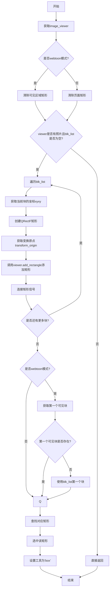

#### 带注释源码

```python
def _refresh_rectangles(self):
    # 获取图像查看器对象
    viewer = self.main.image_viewer
    
    # 根据是否处于webtoon模式，选择不同的清除矩形方式
    if self.main.webtoon_mode:
        # webtoon模式：只清除可见区域内的矩形
        viewer.clear_rectangles_in_visible_area()
    else:
        # 普通模式：清除整个页面的矩形
        viewer.clear_rectangles(page_switch=True)

    # 检查viewer是否有加载照片且blk_list是否非空
    if not viewer.hasPhoto() or not self.main.blk_list:
        # 如果不满足条件，直接返回，不进行后续绘制
        return

    # 遍历当前页面所有的块
    for blk in self.main.blk_list:
        # 提取块的坐标 [x1, y1, x2, y2]
        x1, y1, x2, y2 = blk.xyxy
        
        # 创建QRectF矩形对象，宽度为x2-x1，高度为y2-y1
        rect = QRectF(0, 0, x2 - x1, y2 - y1)
        
        # 获取块的变换原点，如果存在则解包为QPointF，否则为None
        transform_origin = QPointF(*blk.tr_origin_point) if blk.tr_origin_point else None
        
        # 调用viewer添加矩形项，传入矩形、位置、角度和变换原点
        rect_item = viewer.add_rectangle(rect, QPointF(x1, y1), blk.angle, transform_origin)
        
        # 连接矩形项的信号，用于响应用户交互
        self.main.connect_rect_item_signals(rect_item)

    # webtoon模式下，获取第一个可见的块
    if self.main.webtoon_mode:
        first_block = get_first_visible_block(self.main.blk_list, viewer)
        # 如果没有找到可见块，则使用blk_list中的第一个块
        if first_block is None:
            first_block = self.main.blk_list[0]
    else:
        # 非webtoon模式，直接使用blk_list中的第一个块
        first_block = self.main.blk_list[0]

    # 查找与第一个块对应的矩形项
    rect = self.main.rect_item_ctrl.find_corresponding_rect(first_block, 0.5)
    
    # 在viewer中选中该矩形
    viewer.select_rectangle(rect)
    
    # 设置当前工具为'box'（矩形工具）
    self.main.set_tool('box')
```


### `ResizeBlocksCommand._apply`

该方法用于将给定的坐标应用到当前选中的块（blocks）上，同时刷新画布上的矩形显示。它是撤销/重做命令的核心执行逻辑，通过遍历坐标列表并更新对应块的 xyxy 属性，最后调用 `_refresh_rectangles` 重新渲染视图中的矩形元素。

参数：

- `coords`：`List[List[int]]`，二维整数列表，每个内部列表包含四个整数 [x1, y1, x2, y2]，表示块的边界框坐标

返回值：`None`，该方法直接修改对象状态并刷新视图，无返回值

#### 流程图

```mermaid
flowchart TD
    A[开始 _apply] --> B{遍历 blocks 和 coords}
    B --> C[获取当前块 blk 和坐标 xyxy]
    C --> D{检查 blk 是否在 blk_list 中}
    D -->|是| E[更新 blk.xyxy[:] = xyxy]
    D -->|否| F[跳过当前块]
    E --> G{还有下一个块?}
    F --> G
    G -->|是| C
    G -->|否| H[调用 _refresh_rectangles 刷新矩形]
    H --> I[结束]
```

#### 带注释源码

```
def _apply(self, coords):
    """
    将给定的坐标列表应用到对应的块上，并刷新画布中的矩形显示
    
    参数:
        coords: 二维列表，每个元素为 [x1, y1, x2, y2] 格式的坐标
    """
    # 遍历块列表和坐标列表，逐个配对处理
    for blk, xyxy in zip(self.blocks, coords):
        # 仅当块仍在块列表中时才进行更新（防止已删除的块被误操作）
        if blk in self.blk_list:
            # 使用切片赋值直接修改 numpy 数组内容
            blk.xyxy[:] = xyxy
    
    # 刷新画布上的矩形显示，确保视图与数据同步
    self._refresh_rectangles()
```


### `ResizeBlocksCommand.redo`

该方法用于重做块缩放操作，通过应用新的坐标来放大或缩小所有块，并刷新画布上的矩形显示。

参数：
- （无显式参数，使用实例变量 `self.new_xyxy`）

返回值：`None`，无返回值

#### 流程图

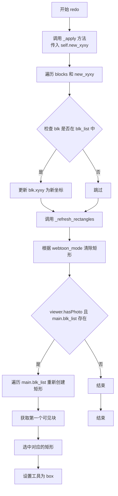

#### 带注释源码

```python
def redo(self):
    """
    重做操作：应用新的块坐标（放大或缩小块）
    调用 _apply 方法，传入预计算的新坐标 new_xyxy
    """
    self._apply(self.new_xyxy)  # 应用新的坐标到所有块并刷新矩形显示
```

---

### `_apply` 方法（辅助方法）

参数：
- `coords`：`List[List[int]]`，新的坐标列表，每个元素为 [x1, y1, x2, y2] 格式

返回值：`None`，无返回值

#### 带注释源码

```python
def _apply(self, coords):
    """
    将新坐标应用到块并刷新画布显示
    
    参数:
        coords: 新的坐标列表，格式为 [[x1, y1, x2, y2], ...]
    """
    # 遍历每个块和对应的新坐标
    for blk, xyxy in zip(self.blocks, coords):
        # 仅更新存在于 blk_list 中的块
        if blk in self.blk_list:
            blk.xyxy[:] = xyxy  # 原地更新坐标
    
    # 刷新画布上的矩形显示
    self._refresh_rectangles()
```

---

### `_refresh_rectangles` 方法（关键组件）

#### 带注释源码

```python
def _refresh_rectangles(self):
    """
    刷新画布上的矩形显示
    清除现有矩形并根据当前块列表重新创建
    """
    # 获取图像查看器
    viewer = self.main.image_viewer
    
    # 根据模式清除现有矩形
    if self.main.webtoon_mode:
        viewer.clear_rectangles_in_visible_area()  # 清除可见区域矩形
    else:
        viewer.clear_rectangles(page_switch=True)  # 清除页面所有矩形
    
    # 检查是否有图像和块数据
    if not viewer.hasPhoto or not self.main.blk_list:
        return
    
    # 重新创建所有块的矩形表示
    for blk in self.main.blk_list:
        x1, y1, x2, y2 = blk.xyxy
        # 计算宽度和高度
        rect = QRectF(0, 0, x2 - x1, y2 - y1)
        # 获取变换原点
        transform_origin = QPointF(*blk.tr_origin_point) if blk.tr_origin_point else None
        # 添加矩形到查看器
        rect_item = viewer.add_rectangle(rect, QPointF(x1, y1), blk.angle, transform_origin)
        # 连接信号
        self.main.connect_rect_item_signals(rect_item)
    
    # 选中第一个块对应的矩形
    if self.main.webtoon_mode:
        first_block = get_first_visible_block(self.main.blk_list, viewer)
        if first_block is None:
            first_block = self.main.blk_list[0]
    else:
        first_block = self.main.blk_list[0]
    
    # 找到并选中对应的矩形
    rect = self.main.rect_item_ctrl.find_corresponding_rect(first_block, 0.5)
    viewer.select_rectangle(rect)
    # 切换到框工具
    self.main.set_tool('box')
```


### `ResizeBlocksCommand.undo`

该方法是撤销操作，用于将所有块的坐标恢复到修改前的状态，通过调用内部方法 `_apply` 并传入保存的旧坐标 `self.old_xyxy` 来实现。

参数：该方法无显式参数（除 self 外）

返回值：`None`，无返回值

#### 流程图

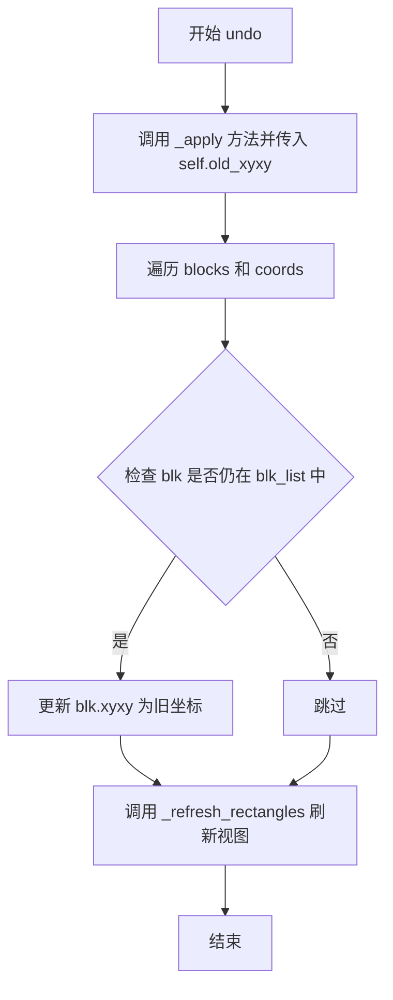

#### 带注释源码

```
def undo(self):
    """撤销上一次的 redo 操作，将块尺寸恢复到修改前的状态"""
    # 调用 _apply 方法，传入保存的旧坐标 (self.old_xyxy)
    # _apply 方法会遍历所有块，用旧坐标更新它们的 xyxy 属性
    # 然后刷新画布上的矩形显示
    self._apply(self.old_xyxy)
```


### `ClearRectsCommand.undo`

该方法用于撤销清除矩形操作，将之前从场景中移除的矩形重新恢复到画布中，通过遍历 `properties_list` 中保存的矩形属性，使用 `create_rect_item` 方法逐个重建矩形项，并更新场景以反映恢复后的状态。

参数：该方法无显式参数（仅使用 `self`）

返回值：`None`，该方法无返回值，负责执行撤销操作

#### 流程图

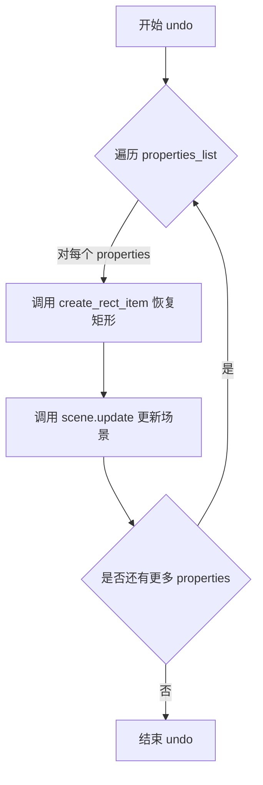

#### 带注释源码

```python
def undo(self):
    """
    撤销清除矩形操作，将之前移除的矩形重新添加到场景中
    """
    # 遍历之前在 redo() 中保存的矩形属性列表
    for properties in self.properties_list:
        # 调用基类方法 create_rect_item，根据保存的属性重新创建矩形项
        # 参数 properties: 包含矩形位置、尺寸、旋转等属性的字典
        # 参数 self.viewer: 图像查看器对象，用于将矩形添加到视图
        self.create_rect_item(properties, self.viewer)
    
    # 调用 scene.update() 通知 Qt 场景已更改，需要重新绘制
    # 这确保 UI 能够正确显示恢复的矩形项
    self.scene.update()
```


### ClearRectsCommand.redo

该方法实现撤销命令的"重做"逻辑，核心功能是清空场景中的所有矩形图元（MoveableRectItem），在删除前保存所有矩形图元的属性到 `properties_list` 列表中，以便后续执行 undo 操作时可以恢复这些矩形图元。

参数：方法无显式参数（仅含隐式参数 `self`）

返回值：`None`，无返回值描述

#### 流程图

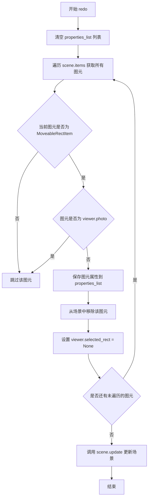

#### 带注释源码

```python
def redo(self):
    # 1. 初始化清空属性列表，准备存储本次删除的矩形属性
    self.properties_list = []
    
    # 2. 遍历场景中的所有图元项
    for item in self.scene.items():
        # 3. 判断条件：图元类型为 MoveableRectItem 且不是照片本身
        if isinstance(item, MoveableRectItem) and item != self.viewer.photo:
            # 4. 调用基类方法保存当前矩形图元的完整属性（位置、尺寸、旋转等）
            self.properties_list.append(self.save_rect_properties(item))
            
            # 5. 将该图元从场景中移除（视觉上消失）
            self.scene.removeItem(item)
            
            # 6. 重置当前选中的矩形为 None（因为被删除的矩形原先可能是选中状态）
            self.viewer.selected_rect = None
    
    # 7. 触发场景更新，确保界面反映最新状态
    self.scene.update()
```


### `DeleteBoxesCommand.redo()`

该方法实现了删除矩形框、对应文本块和底层数据块的撤销命令核心逻辑。通过查找匹配的场景元素和数据块，在场景中移除图形项目，并从相关列表中删除对应的数据对象，同时更新当前选中状态。

参数：无（方法使用实例变量 `self.rect_properties`、`self.txt_item_prp`、`self.blk_properties`、`self.blk_list` 等）

返回值：`None`，无返回值

#### 流程图

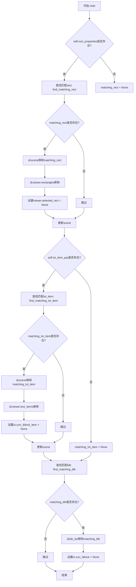

#### 带注释源码

```python
def redo(self):
    """
    执行删除操作：移除场景中的矩形框、文本项以及对应的数据块
    """
    # 查找与保存属性匹配的矩形项
    matching_rect = self.find_matching_rect(self.scene, self.rect_properties) if self.rect_properties else None
    
    # 查找与保存属性匹配的文本项
    matching_txt_item = self.find_matching_txt_item(self.scene, self.txt_item_prp) if self.txt_item_prp else None
    
    # 查找与保存属性匹配的数据块
    matching_blk = self.find_matching_blk(self.blk_list, self.blk_properties)

    # 处理矩形项的删除
    if matching_rect:
        # 从Qt场景中移除图形项
        self.scene.removeItem(matching_rect)
        # 从查看器的矩形列表中移除
        self.viewer.rectangles.remove(matching_rect)
        # 重置当前选中的矩形
        self.viewer.selected_rect = None
        # 刷新场景显示
        self.scene.update()

    # 处理数据块的删除
    if matching_blk:
        # 从块列表中移除匹配的块
        self.blk_list.remove(matching_blk)
        # 重置当前文本块引用
        self.ct.curr_tblock = None

    # 处理文本项的删除
    if matching_txt_item:
        # 从Qt场景中移除文本图形项
        self.scene.removeItem(matching_txt_item)
        # 从查看器的文本项列表中移除
        self.viewer.text_items.remove(matching_txt_item)
        # 重置当前文本块图形项引用
        self.ct.curr_tblock_item = None
        # 刷新场景显示
        self.scene.update()
```


### `DeleteBoxesCommand.undo`

该方法负责撤销“删除盒子”操作。它会检查之前保存的属性（矩形、文本块、业务数据块），如果发现它们在当前场景或数据列表中已被移除（这是 `redo` 的结果），则根据保存的属性重新创建并挂载到对应的视图和数据模型中，从而恢复删除前的状态。

参数：
- 无显式参数（依赖于实例化时保存的 `rect_properties`, `txt_item_prp`, `blk_properties` 以及 `viewer`, `scene`, `blk_list` 等实例状态）。

返回值：
- `None`，该方法通过直接修改场景（Scene）和数据列表（blk_list）产生副作用，不返回任何值。

#### 流程图

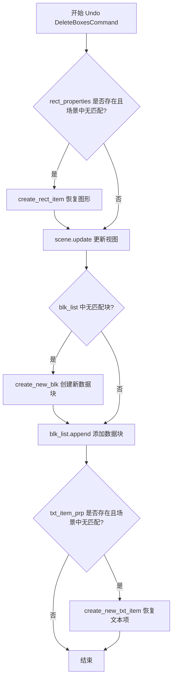

#### 带注释源码

```python
def undo(self):
    """
    撤销删除操作。
    逻辑：检查当前状态，如果发现对应的图形或数据已被删除（redo后的状态），
    则根据保存的属性进行重建和恢复。
    """

    # 步骤 1: 恢复矩形框 (Rectangle)
    # 条件：保存了矩形属性 且 当前场景中找不到匹配的矩形（说明被删除了）
    if self.rect_properties and not self.find_matching_rect(self.scene, self.rect_properties):
        # 重新创建矩形图形项并添加到场景
        self.create_rect_item(self.rect_properties, self.viewer)
        # 刷新场景以显示新添加的项
        self.scene.update()

    # 步骤 2: 恢复数据块 (Block)
    # 条件：当前 blk_list 中找不到匹配的数据块（说明被删除了）
    if not self.find_matching_blk(self.blk_list, self.blk_properties):
        # 从属性字典创建新的数据块对象
        blk = self.create_new_blk(self.blk_properties)
        # 将数据块重新加入列表
        self.blk_list.append(blk)

    # 步骤 3: 恢复文本项 (Text Item)
    # 条件：保存了文本属性 且 当前场景中找不到匹配的文本项（说明被删除了）
    if self.txt_item_prp and not self.find_matching_txt_item(self.scene, self.txt_item_prp):
        # 重新创建文本图形项
        text_item = self.create_new_txt_item(self.txt_item_prp, self.viewer)
```


### `AddTextItemCommand.redo`

该方法实现文本块的添加功能，通过检查场景中是否已存在相同属性的文本块，如不存在则创建新的文本块项目。

参数：此方法无显式参数（继承自QUndoCommand的标准redo方法）

返回值：`None`，该方法为void类型，执行完成后不返回任何值

#### 流程图

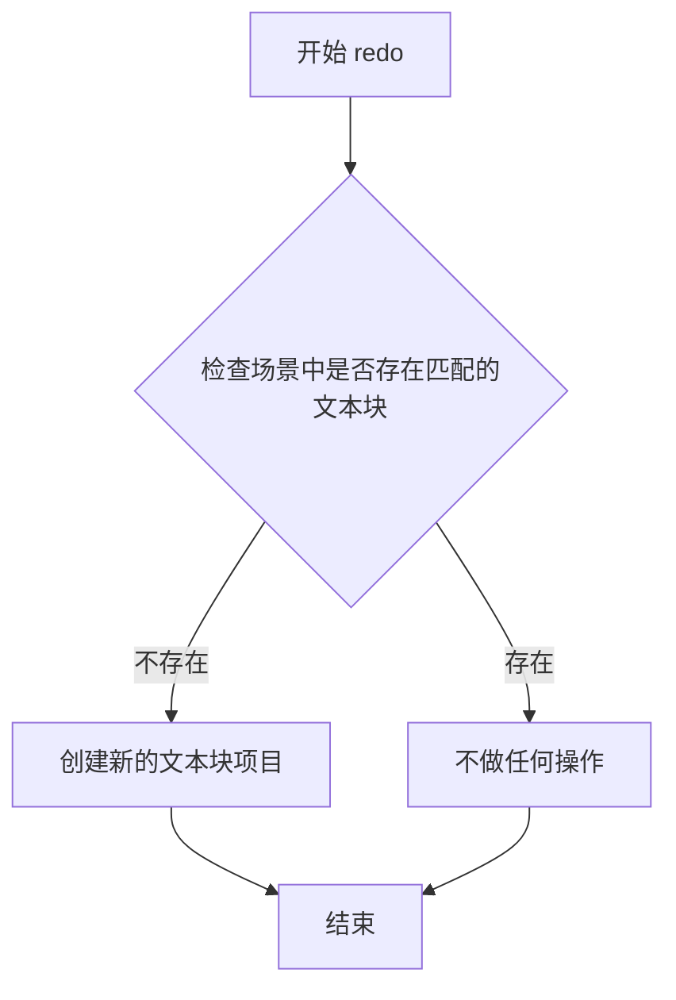

#### 带注释源码

```python
def redo(self):
    """
    重做命令：向场景中添加文本块项目
    该方法在撤销操作后执行，用于恢复被删除的文本块
    """
    # 检查场景中是否已存在相同属性的文本块
    if not self.find_matching_txt_item(self.scene, self.txt_item_prp):
        # 如果不存在，则创建新的文本块并添加到场景中
        # self.txt_item_prp 包含文本块的属性信息（位置、文本内容、样式等）
        # self.viewer 提供场景访问和项目管理的接口
        text_item = self.create_new_txt_item(self.txt_item_prp, self.viewer)
```


### `AddTextItemCommand.undo()`

该方法是撤销添加文本项的操作，通过在场景中查找匹配的文本项并将其从场景和文本项列表中移除来恢复到添加前的状态。

参数：此方法无显式参数（仅使用隐式的 `self` 参数）

返回值：`None`，无返回值

#### 流程图

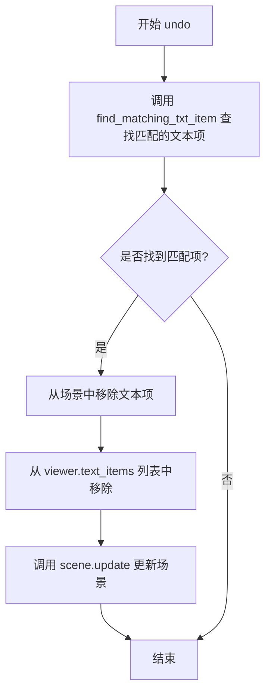

#### 带注释源码

```python
def undo(self):
    """
    撤销添加文本项的操作。
    通过查找并移除之前添加的文本项来恢复到添加前的状态。
    """
    # 在场景中查找与保存属性匹配的文本项
    matching_txt_item = self.find_matching_txt_item(self.scene, self.txt_item_prp)
    
    # 如果找到匹配的文本项，则执行移除操作
    if matching_txt_item:
        # 从 Qt 场景中移除该项
        self.scene.removeItem(matching_txt_item)
        
        # 从查看器的文本项列表中移除
        self.viewer.text_items.remove(matching_txt_item)
        
        # 更新场景以反映更改
        self.scene.update()
```

## 关键组件


### AddRectangleCommand

用于在画布上添加新的矩形框（RectItem）和对应的数据块（blk）的撤销命令类，支持redo添加和undo删除操作。

### BoxesChangeCommand

处理矩形框位置、大小和旋转角度变化的撤销命令，通过比较新旧坐标和角度来更新场景中的图形项和数据块。

### ResizeBlocksCommand

批量调整所有块大小的撤销命令，根据diff值对称扩展或收缩所有块的xyxy坐标，并刷新对应的矩形显示。

### ClearRectsCommand

清除画布上所有矩形项的撤销命令，保存所有矩形的属性以便undo时恢复，支持webtoon模式和普通模式的矩形清理。

### DeleteBoxesCommand

删除指定的矩形框、文本块和对应数据块的撤销命令，同时清理相关的选中状态和场景更新。

### AddTextItemCommand

在画布上添加新的文本项（TextBlockItem）的撤销命令，支持redo添加和undo删除文本图形项。

### RectCommandBase（隐式依赖）

提供矩形、文本块和数据块的保存、查找、创建等基础方法的基类，被多个命令类复用以实现具体的图形项操作。

### MoveableRectItem & TextBlockItem

场景中的可移动矩形项和文本块项类，用于在Qt场景中表示图形元素，并通过位置、旋转等属性与数据块同步。

### get_first_visible_block

获取在webtoon模式下第一个可见块的工具函数，用于切换矩形显示时的焦点设置。


## 问题及建议


### 已知问题

- **类型注解缺失**：所有方法参数和返回值都缺少类型注解，降低了代码可读性和IDE辅助能力
- **重复的查找逻辑**：`BoxesChangeCommand.find_and_update_item`方法中遍历scene.items()逐个匹配，效率低下且与其他命令类的查找逻辑重复
- **继承不一致**：`ResizeBlocksCommand`只继承`QUndoCommand`，而其他命令类同时继承`QUndoCommand`和`RectCommandBase`，可能导致功能不一致
- **硬编码魔法值**：多处使用硬编码数值如`0.5`(在find_corresponding_rect调用中)，缺乏配置说明
- **属性保存不完整**：`ClearRectsCommand`只保存了`MoveableRectItem`，未保存`TextBlockItem`，导致文本项在清空后无法恢复
- **变量命名不一致**：参数`diff`在`ResizeBlocksCommand`中为`int`类型，但命名未体现其含义（可能是偏移量）
- **冗余的scene.update()调用**：多个命令在操作后都调用`scene.update()`，可能影响性能
- **空值处理不足**：多处直接访问属性而未进行None检查，如`blk.tr_origin_point`可能为None

### 优化建议

- **添加类型注解**：为所有方法参数和返回值添加明确的类型声明
- **提取通用查找逻辑**：将scene items遍历匹配逻辑抽象到基类或工具类中，避免重复代码
- **统一类继承结构**：让`ResizeBlocksCommand`也继承`RectCommandBase`，保持命令类行为一致性
- **配置化魔法值**：将硬编码数值提取为类常量或配置参数
- **完善属性保存**：在`ClearRectsCommand`中同时保存TextBlockItem属性，确保撤销功能完整
- **优化更新机制**：考虑使用批量更新或延迟更新策略，减少scene.update()调用频率
- **增加空值保护**：在访问属性前进行None检查，提升代码健壮性
- **简化_refresh_rectangles方法**：该方法职责过多，可拆分为更小的单一职责方法

## 其它


### 设计目标与约束

本模块的核心设计目标是实现一个可撤销/重做的图形编辑系统，支持矩形框和文本项的添加、删除、修改、调整大小等操作。设计约束包括：必须继承自QUndoCommand以集成Qt的撤销/重做框架；所有命令需保存操作前后的状态以便undo/redo；需与RectCommandBase基类配合使用以复用公共方法；需维护图形项(scene items)与业务数据(blk_list)的一致性。

### 错误处理与异常设计

主要错误处理场景包括：1) 查找匹配项失败时静默返回而不抛出异常；2) 图像查看器无照片时直接返回；3) blk_list为空或项不存在时跳过处理；4) 使用np.array_equal进行数组比较避免类型错误；5) 使用isinstance进行类型检查确保安全；6) 所有scene.update()调用保证UI正确刷新。

### 数据流与状态机

数据流涉及三个主要实体：scene中的图形项(MoveableRectItem、TextBlockItem)、blk_list中的业务数据块、以及viewer中的矩形列表。状态转换通过undo/redo命令封装：AddRectangleCommand负责添加矩形和对应的blk；DeleteBoxesCommand负责删除矩形、文本项和对应的blk；BoxesChangeCommand修改blk的xyxy、angle、tr_origin_point并同步更新图形项；ResizeBlocksCommand批量调整多个blk的坐标范围。

### 外部依赖与接口契约

核心依赖包括：numpy用于数组比较；PySide6.QtGui提供QUndoCommand基类；PySide6.QtCore提供QRectF、QPointF；RectCommandBase提供save_rect_properties、save_blk_properties、create_rect_item等复用方法；MoveableRectItem和TextBlockItem为自定义图形项类；get_first_visible_block为外部工具函数。接口契约要求：所有命令类必须实现redo()和undo()方法；RectCommandBase子类需提供find_matching_rect、find_matching_blk等查询方法。

### 并发与线程安全

本模块主要在主线程运行，所有操作通过Qt的事件循环调度。潜在线程安全问题：1) scene.items()的遍历在redo/undo中可能受其他线程修改影响；2) blk_list的append和remove操作需确保原子性；3) viewer.rectangles列表的并发访问。建议使用Qt的信号槽机制进行线程间通信，或在访问共享数据时加锁保护。

### 性能考虑

性能优化点：1) BoxesChangeCommand使用np.array_equal进行快速数组比较；2) ResizeBlocksCommand中批量处理前先clear所有矩形减少重复渲染；3) ClearRectsCommand一次性保存所有属性避免多次遍历；4) 使用list comprehension批量计算new_xyxy；5) find_and_update_item中尽早进行类型和位置检查减少无效操作。

### 安全性考虑

安全措施包括：1) 使用if isinstance(item, ...)进行类型检查防止类型错误；2) 参数类型注解(diff: int)确保类型安全；3) 可选参数使用None默认值(rect_properties if rect_item else None)；4) 数组索引访问前验证blk存在于blk_list中；5) scene.removeItem前验证item存在。

### 兼容性考虑

PySide6版本兼容性：代码使用PySide6而非PyQt保持LGPL许可；QUndoCommand接口在Qt5/6版本保持兼容；QRectF、QPointF等类在Qt5/6中API基本一致。Python版本：建议Python 3.8+以支持类型注解和字典解包等特性。numpy版本：需numpy>=1.18支持array_equal函数。

### 测试策略

单元测试建议：1) 测试AddRectangleCommand的redo/undo功能；2) 测试BoxesChangeCommand对多个blk的批量更新；3) 测试ResizeBlocksCommand的坐标计算逻辑；4) 测试ClearRectsCommand的属性保存和恢复；5) 测试DeleteBoxesCommand对rect、blk、txt_item的级联删除；6) 测试边界条件如空的blk_list、已删除的item等。集成测试建议：模拟完整的undo/redo操作序列验证数据一致性。

### 部署和配置

部署要求：1) Python 3.8+运行环境；2) PySide6、numpy依赖；3) 项目内部模块依赖(base.py、rect_item.py等)。配置项：webtoon_mode开关影响ResizeBlocksCommand的刷新逻辑；image_viewer对象需预先初始化；scene需包含MoveableRectItem和TextBlockItem类型的图形项。

### 监控和日志

建议添加日志点：1) redo/undo方法入口日志；2) 匹配项查找失败时记录debug日志；3) scene.update()调用后记录性能日志；4) 异常捕获时记录error日志并记录堆栈信息。可通过Qt的qDebug/qWarning/qCritical或Python的logging模块实现。

### 版本迁移

迁移注意事项：1) 若从PyQt5迁移需修改import语句和许可相关代码；2) 若从Qt5迁移到Qt6需注意QUndoCommand的某些API变化；3) 若blk数据结构变化需相应调整save_blk_properties和create_new_blk方法；4) 若MoveableRectItem/TextBlockItem接口变化需同步更新find_and_update_item逻辑。


    