# `comic-translate\app\ui\commands\brush.py` 详细设计文档

这是一个基于PySide6 QUndoCommand实现的撤销/重做命令系统，用于图形编辑器中的画笔笔触管理，支持单个笔触添加、批量笔触操作、清空笔触和擦除操作的反向恢复，通过PathCommandBase基类提供路径属性的序列化和场景状态比较功能。

## 整体流程

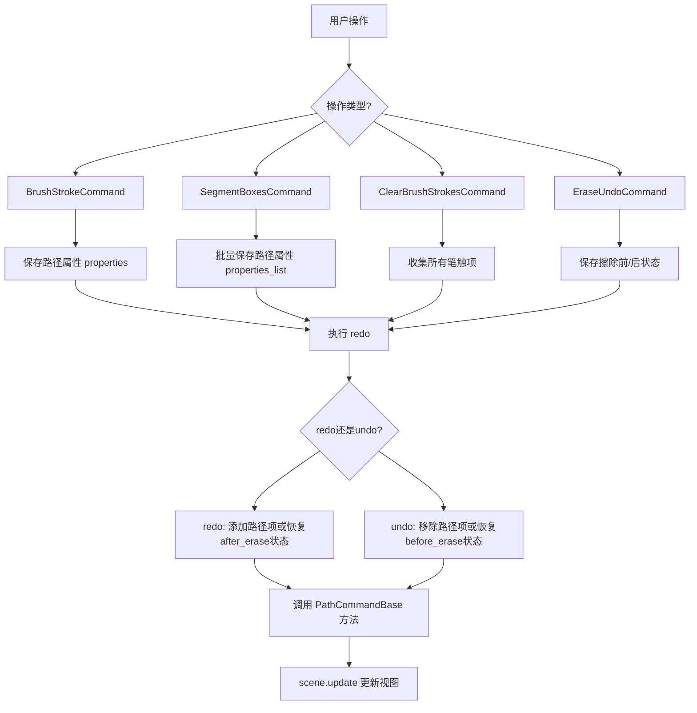

## 类结构

```
PathCommandBase (基类 - 来自 base 模块)
├── BrushStrokeCommand (单个笔触命令)
├── SegmentBoxesCommand (批量笔触命令)
├── ClearBrushStrokesCommand (清空笔触命令)
└── EraseUndoCommand (擦除撤销命令)
```

## 全局变量及字段


### `BrushStrokeCommand.viewer`
    
viewer对象引用

类型：`Viewer`
    


### `BrushStrokeCommand.scene`
    
Qt图形场景对象

类型：`QGraphicsScene`
    


### `BrushStrokeCommand.properties`
    
PathProperties类型，保存的路径属性

类型：`PathProperties`
    


### `SegmentBoxesCommand.viewer`
    
viewer对象引用

类型：`Viewer`
    


### `SegmentBoxesCommand.scene`
    
Qt图形场景对象

类型：`QGraphicsScene`
    


### `SegmentBoxesCommand.properties_list`
    
List[PathProperties]，批量路径属性列表

类型：`List[PathProperties]`
    


### `ClearBrushStrokesCommand.viewer`
    
viewer对象引用

类型：`Viewer`
    


### `ClearBrushStrokesCommand.scene`
    
Qt图形场景对象

类型：`QGraphicsScene`
    


### `ClearBrushStrokesCommand.properties_list`
    
List[PathProperties]，清空前保存的属性列表

类型：`List[PathProperties]`
    


### `EraseUndoCommand.viewer`
    
viewer对象引用

类型：`Viewer`
    


### `EraseUndoCommand.scene`
    
Qt图形场景对象

类型：`QGraphicsScene`
    


### `EraseUndoCommand.before_erase`
    
擦除前的路径属性列表

类型：`List[PathProperties]`
    


### `EraseUndoCommand.after_erase`
    
擦除后的路径属性列表

类型：`List[PathProperties]`
    


### `EraseUndoCommand.first`
    
bool 标志位，用于控制首次执行行为

类型：`bool`
    
    

## 全局函数及方法


# 详细设计文档

## 1. 代码概述

该代码实现了一套基于 Qt 的图形编辑撤销/重做命令系统，用于管理画笔笔触、路径项和场景状态的增删改操作，支持单个笔触、批量路径项、清空画笔和擦除等多种编辑场景的undo/redo功能。

---

## 2. 类详细信息

### BrushStrokeCommand

**描述**：处理单个画笔笔触的撤销/重做命令，继承自 QUndoCommand，用于在场景中添加或移除单个路径项。

#### 字段

- `viewer`：对象，视图控制器引用
- `scene`：QGraphicsScene，场景引用
- `properties`：PathProperties，保存的路径属性

#### 方法

##### `__init__(self, viewer, path_item: QGraphicsPathItem)`

- **参数**：
  - `viewer`：对象，视图控制器
  - `path_item`：QGraphicsPathItem，要操作的路径项
- **返回值**：无
- **功能**：初始化命令，保存路径属性

---

##### `redo(self)`

- **参数**：无
- **返回值**：无
- **功能**：重做操作，重新添加路径项到场景

---

##### `undo(self)`

- **参数**：无
- **返回值**：无
- **功能**：撤销操作，从场景中移除匹配的路径项

---

### SegmentBoxesCommand

**描述**：处理多个路径项的批量撤销/重做命令，用于同时添加或移除多个路径项。

#### 字段

- `viewer`：对象，视图控制器引用
- `scene`：QGraphicsScene，场景引用
- `properties_list`：List[PathProperties]，保存的多个路径属性列表

#### 方法

##### `__init__(self, viewer, path_items: List[QGraphicsPathItem])`

- **参数**：
  - `viewer`：对象，视图控制器
  - `path_items`：List[QGraphicsPathItem]，路径项列表
- **返回值**：无
- **功能**：初始化命令，批量保存路径属性

---

##### `redo(self)`

- **参数**：无
- **返回值**：无
- **功能**：重做操作，批量添加路径项到场景

---

##### `undo(self)`

- **参数**：无
- **返回值**：无
- **功能**：撤销操作，批量移除匹配的路径项

---

### ClearBrushStrokesCommand

**描述**：清除场景中所有画笔笔触的撤销/重做命令，支持全量清除和恢复。

#### 字段

- `viewer`：对象，视图控制器引用
- `scene`：QGraphicsScene，场景引用
- `properties_list`：List[PathProperties]，存储被清除的路径属性

#### 方法

##### `__init__(self, viewer)`

- **参数**：
  - `viewer`：对象，视图控制器
- **返回值**：无
- **功能**：初始化命令

---

##### `redo(self)`

- **参数**：无
- **返回值**：无
- **功能**：执行清除操作，收集并移除所有画笔笔触（排除照片项）

---

##### `undo(self)`

- **参数**：无
- **返回值**：无
- **功能**：撤销清除操作，根据保存的属性恢复所有路径项

---

### EraseUndoCommand

**描述**：处理擦除操作的复杂撤销/重做命令，通过比较当前状态和目标状态来精确恢复场景。

#### 字段

- `viewer`：对象，视图控制器引用
- `scene`：QGraphicsScene，场景引用
- `before_erase`：PathProperties，擦除前的状态属性
- `after_erase`：PathProperties，擦除后的状态属性
- `first`：bool，标记是否为首次执行

#### 方法

##### `__init__(self, viewer, before_erase: PathProperties, after_erase: PathProperties)`

- **参数**：
  - `viewer`：对象，视图控制器
  - `before_erase`：PathProperties，擦除前的路径属性
  - `after_erase`：PathProperties，擦除后的路径属性
- **返回值**：无
- **功能**：初始化擦除命令，保存前后状态

---

##### `redo(self)`

- **参数**：无
- **返回值**：无
- **功能**：重做操作，恢复到擦除后的状态（跳过首次调用）

---

##### `undo(self)`

- **参数**：无
- **返回值**：无
- **功能**：撤销操作，恢复到擦除前的状态

---

##### `restore_scene_state(self, target_properties_list)`

- **参数**：
  - `target_properties_list`：List[PathProperties]，目标状态属性列表
- **返回值**：无
- **功能**：通过比较当前状态和目标状态，精确添加/删除路径项以恢复场景

---

## 3. 全局函数详细信息

### `props_to_key(props)`

**描述**：将路径属性转换为可比较的键，用于高效的状态比较。

- **参数**：
  - `props`：dict，路径属性字典
- **返回值**：tuple，可比较的键元组
- **功能**：将路径、画笔、画刷、宽度等信息转换为字符串表示以进行比对

---

## 4. 流程图

### EraseUndoCommand.restore_scene_state 流程图

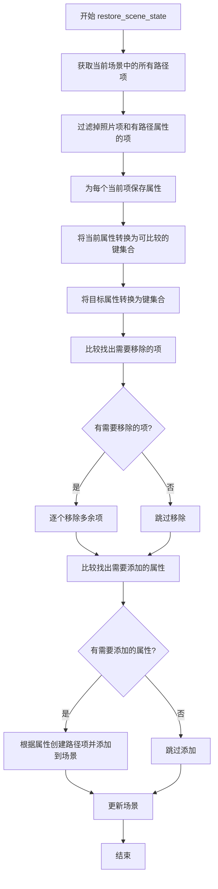

### BrushStrokeCommand 流程图

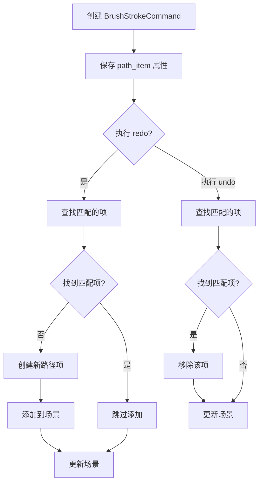

---

## 5. 带注释源码

```
# BrushStrokeCommand - 单个笔触撤销命令
class BrushStrokeCommand(QUndoCommand, PathCommandBase):
    def __init__(self, viewer, path_item: QGraphicsPathItem):
        """
        初始化单个笔触命令
        :param viewer: 视图控制器对象
        :param path_item: 要操作的图形路径项
        """
        super().__init__()
        self.viewer = viewer
        self.scene = viewer._scene
        # 保存路径项的属性以便后续恢复
        self.properties = self.save_path_properties(path_item)

    def redo(self):
        """
        重做：重新添加路径项到场景
        如果场景中不存在匹配项，则创建并添加
        """
        if not self.find_matching_item(self.scene, self.properties):
            path_item = self.create_path_item(self.properties)
            self.scene.addItem(path_item)
            self.scene.update()

    def undo(self):
        """
        撤销：从场景中移除匹配的路径项
        """
        matching_item = self.find_matching_item(self.scene, self.properties)
        if matching_item:
            self.scene.removeItem(matching_item)
            self.scene.update()


# SegmentBoxesCommand - 批量路径项撤销命令
class SegmentBoxesCommand(QUndoCommand, PathCommandBase):
    def __init__(self, viewer, path_items: List[QGraphicsPathItem]):
        """
        初始化批量路径项命令
        :param viewer: 视图控制器对象
        :param path_items: 路径项列表
        """
        super().__init__()
        self.viewer = viewer
        self.scene = viewer._scene
        # 批量保存所有路径项的属性
        self.properties_list = [self.save_path_properties(item) for item in path_items]

    def redo(self):
        """重做：批量添加路径项"""
        for properties in self.properties_list:
            if not self.find_matching_item(self.scene, properties):
                path_item = self.create_path_item(properties)
                self.scene.addItem(path_item)
        self.scene.update()

    def undo(self):
        """撤销：批量移除路径项"""
        for properties in self.properties_list:
            item = self.find_matching_item(self.scene, properties)
            if item:
                self.scene.removeItem(item)
        self.scene.update()


# ClearBrushStrokesCommand - 清空画笔笔触命令
class ClearBrushStrokesCommand(QUndoCommand, PathCommandBase):
    def __init__(self, viewer):
        """初始化清空命令"""
        super().__init__()
        self.viewer = viewer
        self.scene = viewer._scene
        self.properties_list = []  # 存储被清除的属性

    def redo(self):
        """
        重做：清除所有画笔笔触
        遍历场景中的所有项，移除符合条件的路径项
        """
        self.properties_list = []
        for item in self.scene.items():
            # 排除照片项，只处理路径项
            if isinstance(item, QGraphicsPathItem) and item != self.viewer.photo:
                self.properties_list.append(self.save_path_properties(item))
                self.scene.removeItem(item)
        self.scene.update()
        
    def undo(self):
        """
        撤销：根据保存的属性恢复所有被清除的路径项
        """
        for properties in self.properties_list:
            path_item = self.create_path_item(properties)
            self.scene.addItem(path_item)
        self.scene.update()


# EraseUndoCommand - 擦除撤销命令
class EraseUndoCommand(QUndoCommand, PathCommandBase):
    def __init__(self, viewer, before_erase: PathProperties, after_erase: PathProperties):
        """
        初始化擦除命令
        :param before_erase: 擦除前的状态属性
        :param after_erase: 擦除后的状态属性
        """
        super().__init__()
        self.viewer = viewer
        self.scene = viewer._scene
        self.before_erase = before_erase or [] 
        self.after_erase = after_erase or []    
        self.first = True  # 标记首次执行

    def redo(self):
        """重做：恢复到擦除后状态"""
        if self.first:
            self.first = False
            return  # 首次调用时跳过
        self.restore_scene_state(self.after_erase)

    def undo(self):
        """撤销：恢复到擦除前状态"""
        self.restore_scene_state(self.before_erase)

    def restore_scene_state(self, target_properties_list):
        """
        恢复场景到目标状态
        :param target_properties_list: 目标状态属性列表
        """
        # 获取当前场景中的路径项（排除照片项）
        photo_item = getattr(self.viewer, 'photo', None)
        current_items = [
            item for item in self.scene.items() 
            if (isinstance(item, QGraphicsPathItem) and 
                item != photo_item and
                hasattr(item, 'path'))
        ]
        
        # 保存当前属性用于比较
        current_properties = []
        for item in current_items:
            try:
                props = self.save_path_properties(item)
                if props:
                    current_properties.append(props)
            except Exception as e:
                print(f"Warning: Failed to save properties for item: {e}")
                continue
        
        # 属性转键函数 - 用于高效比较
        def props_to_key(props):
            """将属性转换为可比较的键"""
            try:
                path_str = ""
                if props.get('path'):
                    path = props['path']
                    for i in range(path.elementCount()):
                        element = path.elementAt(i)
                        # 记录路径元素的类型和坐标
                        path_str += f"{element.type},{element.x:.2f},{element.y:.2f};"
                
                return (
                    path_str,
                    props.get('pen', ''),
                    props.get('brush', ''),
                    props.get('width', 0),
                )
            except Exception:
                return str(id(props))  # 失败时的回退键
        
        # 构建键集合用于比较
        current_keys = {props_to_key(props): (props, item) 
                        for props, item in zip(current_properties, current_items)}
        target_keys = {props_to_key(props): props for props in target_properties_list}
        
        # 找出需要移除的项（存在但不在目标中）
        items_to_remove = []
        for key in current_keys:
            if key not in target_keys:
                _, item = current_keys[key]
                items_to_remove.append(item)
        
        # 执行移除
        for item in items_to_remove:
            try:
                self.scene.removeItem(item)
            except Exception as e:
                print(f"Warning: Failed to remove item: {e}")
        
        # 找出需要添加的属性（目标中存在但当前没有）
        props_to_add = []
        for key in target_keys:
            if key not in current_keys:
                props_to_add.append(target_keys[key])
        
        # 执行添加
        for properties in props_to_add:
            try:
                path_item = self.create_path_item(properties)
                if path_item:
                    self.scene.addItem(path_item)
            except Exception as e:
                print(f"Warning: Failed to create path item during undo/redo: {e}")
                continue

        self.scene.update()
```

---

## 6. 关键组件信息

| 组件名称 | 描述 |
|---------|------|
| QUndoCommand | Qt 撤销/重做命令基类 |
| PathCommandBase | 路径命令基类，提供属性保存/查找/创建等基础功能 |
| PathProperties | 路径属性数据结构，存储路径、画笔、画刷等信息 |
| QGraphicsPathItem | Qt 图形路径项，用于在场景中绘制路径 |
| viewer._scene | 图形场景控制器，管理所有图形项 |

---

## 7. 潜在技术债务与优化空间

1. **异常处理过于简单**：使用 `print` 输出警告，建议使用日志框架
2. **字符串比较效率低**：`props_to_key` 使用字符串拼接比较路径，大数据量时性能堪忧
3. **硬编码过滤条件**：照片项过滤逻辑硬编码在多处，建议提取为配置
4. **首次执行跳过逻辑**：`EraseUndoCommand` 使用 `first` 标志跳过首次，这种设计不够直观
5. **缺少类型注解**：部分内部变量缺少类型注解，影响可维护性
6. **属性比较不完整**：仅比较路径、画笔、画刷和宽度，可能遗漏其他重要属性
7. **无幂等性检查**：某些操作未检查是否已处于目标状态

---

## 8. 其他项目

### 设计目标与约束
- 支持 Qt 的 undo/redo 框架
- 兼容 PySide6
- 支持单个和批量路径操作

### 错误处理与异常设计
- 使用 try-except 捕获单个项的处理异常，避免整体失败
- 异常时打印警告但继续执行
- 失败时跳过该元素继续处理其他元素

### 数据流与状态机
- `BrushStrokeCommand`: 单项添加/移除
- `SegmentBoxesCommand`: 批量添加/移除
- `ClearBrushStrokesCommand`: 全量清除与恢复
- `EraseUndoCommand`: 状态比较与精确恢复

### 外部依赖
- PySide6.QtGui (QUndoCommand)
- PySide6.QtWidgets (QGraphicsPathItem)
- typing (List)
- 本地模块 base (PathCommandBase, PathProperties)


### `BrushStrokeCommand.__init__`

初始化 `BrushStrokeCommand` 命令对象，保存查看器引用、场景引用以及路径属性，以便后续执行撤销/重做操作时能够恢复或清除画笔笔触。

参数：

- `viewer`：无显式类型标注（推断为包含 `_scene` 属性的查看器对象），提供对场景的访问
- `path_item`：`QGraphicsPathItem`，需要保存其属性的路径图形项，用于撤销/重做时重建路径

返回值：`None`，`__init__` 方法不返回任何值

#### 流程图

```mermaid
flowchart TD
    A[开始 __init__] --> B[调用 super().__init__ 初始化 QUndoCommand]
    B --> C[保存 viewer 引用到 self.viewer]
    C --> D[从 viewer._scene 获取场景引用到 self.scene]
    D --> E[调用 save_path_properties 保存 path_item 属性]
    E --> F[结束 __init__]
```

#### 带注释源码

```python
def __init__(self, viewer, path_item: QGraphicsPathItem):
    # 调用父类 QUndoCommand 的初始化方法
    super().__init__()
    
    # 保存 viewer 引用，用于后续访问场景和照片项
    self.viewer = viewer
    
    # 从 viewer 中获取场景对象，赋值给实例变量
    self.scene = viewer._scene
    
    # 调用基类方法 save_path_properties，将 path_item 的属性
    # （如路径、画笔、画刷、宽度等）保存为 PathProperties 字典
    self.properties = self.save_path_properties(path_item)
```


### `BrushStrokeCommand.redo()`

重做（Redo）操作：如果场景中不存在与当前笔触属性匹配的图形项，则创建一个新的路径项并添加到场景中。该方法是 Qt 撤销/重做框架的核心组成部分，用于在重做操作时恢复被撤销的笔触绘制效果。

参数：该方法无显式参数（继承自 QUndoCommand 的 redo() 方法不接受额外参数）

返回值：`None`，该方法执行副作用操作（修改场景状态），不返回任何值

#### 流程图

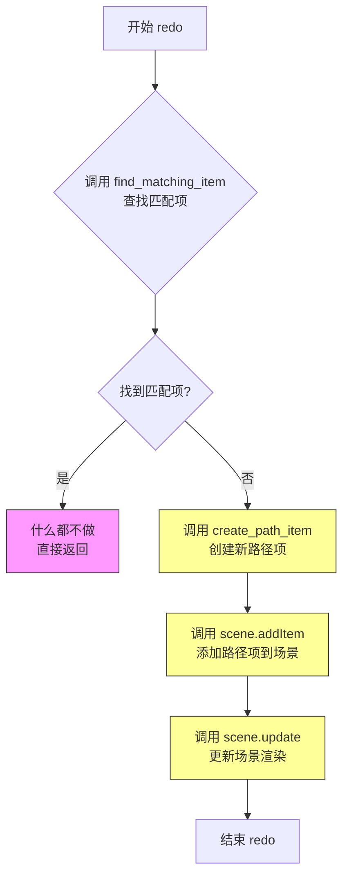

#### 带注释源码

```python
def redo(self):
    """
    重做操作：重新应用笔触绘制效果
    
    该方法在用户触发重做操作时被调用，其核心逻辑如下：
    1. 首先在场景中查找是否已存在与当前笔触属性匹配的项目
    2. 如果不存在匹配项（说明该笔触在撤销时被移除了），则重新创建并添加该项目
    3. 如果已存在匹配项（说明该笔触已经在场景中），则无需任何操作
    
    注意：此方法遵循 Qt 撤销/重做框架的约定，
    redo() 应该能够多次安全执行而不产生副作用（幂等性）
    """
    
    # 调用基类方法 find_matching_item 在场景中查找与当前属性匹配的路径项
    # 参数：
    #   - self.scene: Qt 图形场景对象
    #   - self.properties: 保存的路径属性（包含路径数据、画笔、画刷等）
    # 返回值：匹配的项目对象，如果不存在则返回 None
    matching_item = self.find_matching_item(self.scene, self.properties)
    
    # 判断是否找到匹配项
    if not matching_item:
        # 未找到匹配项时，需要重新创建该笔触路径项
        
        # 根据保存的属性创建新的 QGraphicsPathItem 对象
        # 该方法会解析 self.properties 中的路径数据、样式等并构建图形项
        path_item = self.create_path_item(self.properties)
        
        # 将新创建的路径项添加到场景中，使其可见并参与场景管理
        # 添加后，该路径项会成为场景的一部分，可以被选择、渲染等
        self.scene.addItem(path_item)
        
        # 立即更新场景，触发重新绘制以显示新添加的路径项
        # 这确保了用户界面能够即时反映变更
        self.scene.update()
    
    # 如果找到匹配项，说明该笔触已经存在于场景中
    # 根据 Qt 撤销/重做框架的幂等性要求，此处无需任何操作
    # 下次 undo() 调用时会正确移除该项
```


### `BrushStrokeCommand.undo`

撤销操作，查找并移除场景中对应的路径项，从而恢复绘图前的状态。

参数：
- 该方法无显式参数（`self` 为隐式参数）

返回值：`None`，无返回值

#### 流程图

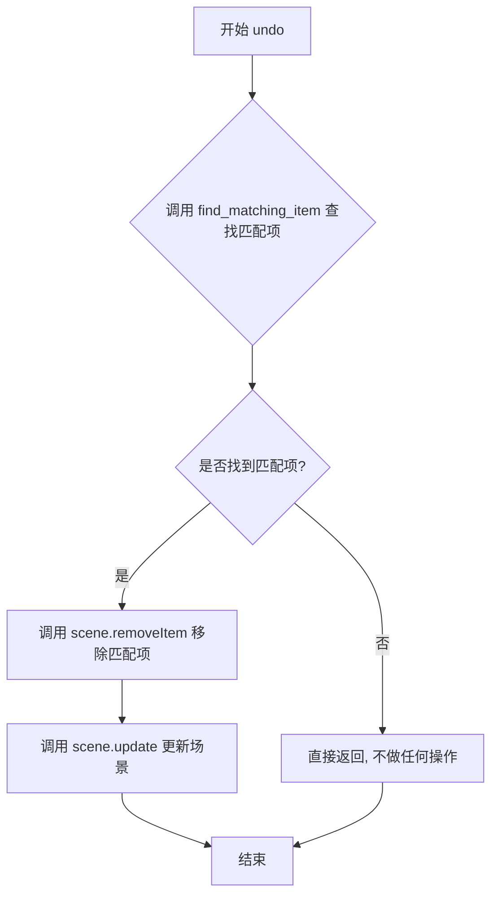

#### 带注释源码

```python
def undo(self):
    """
    撤销操作：查找并移除场景中对应的路径项
    
    该方法在用户执行撤销操作时由 QUndoStack 调用。
    它尝试在场景中找到之前保存的路径属性所对应的图形项，
    并将其从场景中移除，从而恢复到添加路径前的状态。
    """
    # 查找与保存的属性匹配的路径项
    # find_matching_item 方法继承自 PathCommandBase
    # 它会根据 self.properties 中保存的路径信息（路径、画笔、画刷等）
    # 在场景中寻找对应的 QGraphicsPathItem
    matching_item = self.find_matching_item(self.scene, self.properties)
    
    # 如果找到匹配的项，则从场景中移除
    if matching_item:
        # 从场景中移除该图形项
        self.scene.removeItem(matching_item)
        # 更新场景以反映变更
        self.scene.update()
```

#### 相关上下文信息

该方法是 `BrushStrokeCommand` 类的一部分，该类继承自 `QUndoCommand`（Qt 的撤销/重做命令基类）和 `PathCommandBase`。`undo()` 方法与 `redo()` 方法互为逆操作：

- **`redo()`**：将保存的路径属性重新添加到场景中
- **`undo()`**：将添加的路径项从场景中移除

关键依赖方法（继承自 `PathCommandBase`）：
- `find_matching_item(scene, properties)`：根据保存的属性在场景中查找匹配的图形项
- `save_path_properties(item)`：保存路径项的属性信息
- `create_path_item(properties)`：根据属性信息创建新的路径项


### `SegmentBoxesCommand.__init__`

该方法是 `SegmentBoxesCommand` 类的构造函数，负责初始化命令对象并批量保存多个路径项的属性，以便后续进行撤销/重做操作。它继承自 `QUndoCommand` 和 `PathCommandBase`，通过遍历传入的路径项列表，调用 `save_path_properties` 方法将每个路径项的几何路径、画笔、画刷等属性序列化存储到 `properties_list` 中。

参数：

- `viewer`：`object`，指向图形查看器（Graphics Viewer）的实例，提供对场景（`_scene`）的引用
- `path_items`：`List[QGraphicsPathItem]`，待处理的图形路径项列表，每个元素均为 `QGraphicsPathItem` 类型

返回值：`None`，无返回值（构造函数）

#### 流程图

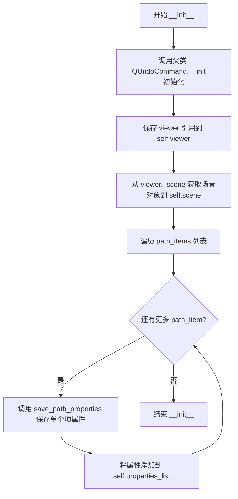

#### 带注释源码

```python
def __init__(self, viewer, path_items: List[QGraphicsPathItem]):
    """
    初始化 SegmentBoxesCommand，批量保存路径项属性
    
    Args:
        viewer: 图形查看器对象，提供对场景的访问
        path_items: QGraphicsPathItem 对象列表，代表需要批量操作的路径项
    
    Returns:
        None
    """
    # 调用父类 QUndoCommand 的构造函数
    super().__init__()
    
    # 保存视图器引用，用于后续访问场景和执行命令
    self.viewer = viewer
    
    # 从 viewer 中获取关联的场景对象，self.scene 将用于后续的 addItem/removeItem 操作
    self.scene = viewer._scene
    
    # 批量保存所有路径项的属性到一个列表中
    # save_path_properties 继承自 PathCommandBase，用于将 QGraphicsPathItem 序列化为 PathProperties
    # properties_list 将用于 redo/undo 时重建或删除对应的图形项
    self.properties_list = [self.save_path_properties(item) for item in path_items]
```


### `SegmentBoxesCommand.redo()`

该方法用于重做操作，将之前撤销的批量路径项重新添加到场景中。它遍历所有保存的路径属性，对每个属性检查场景中是否已存在对应的项，若不存在则创建新的路径项并添加到场景，最后更新场景显示。

参数：
- 无（继承自 `QUndoCommand` 的标准 redo 方法，不接受额外参数）

返回值：`None`，无返回值（void），直接修改场景状态

#### 流程图

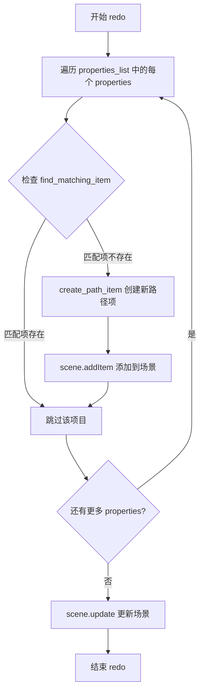

#### 带注释源码

```python
def redo(self):
    """
    重做操作：批量重新添加所有路径项到场景
    
    该方法继承自 QUndoCommand，是撤销/重做机制的核心部分。
    当用户触发重做操作时，会重新执行将路径项添加到场景的逻辑。
    """
    # 遍历所有之前保存的路径属性列表
    for properties in self.properties_list:
        # 检查场景中是否已存在匹配的项目
        # find_matching_item 内部实现应该会根据 properties 的唯一标识
        # （如路径数据、画笔样式等）来查找对应的 QGraphicsPathItem
        if not self.find_matching_item(self.scene, properties):
            # 如果场景中不存在该路径项，则根据属性创建新的路径项
            # create_path_item 会根据 properties 字典中的路径数据、画笔、画刷等
            # 创建一个 QGraphicsPathItem 对象
            path_item = self.create_path_item(properties)
            # 将新创建的路径项添加到场景中，使其可见
            self.scene.addItem(path_item)
    
    # 完成所有项的添加后，更新场景以刷新显示
    # 这确保了所有新添加的路径项能够正确渲染
    self.scene.update()
```


### `SegmentBoxesCommand.undo()`

撤销：批量移除所有由 redo 操作添加的路径项，遍历之前保存的路径属性列表，从场景中逐个查找并移除对应的图形路径项，最后更新场景显示。

参数： （该方法无显式参数，使用实例变量 `self.properties_list`）

- `self`：隐式参数，表示当前类实例

返回值：`None`，无返回值，仅执行场景项的移除和更新操作

#### 流程图

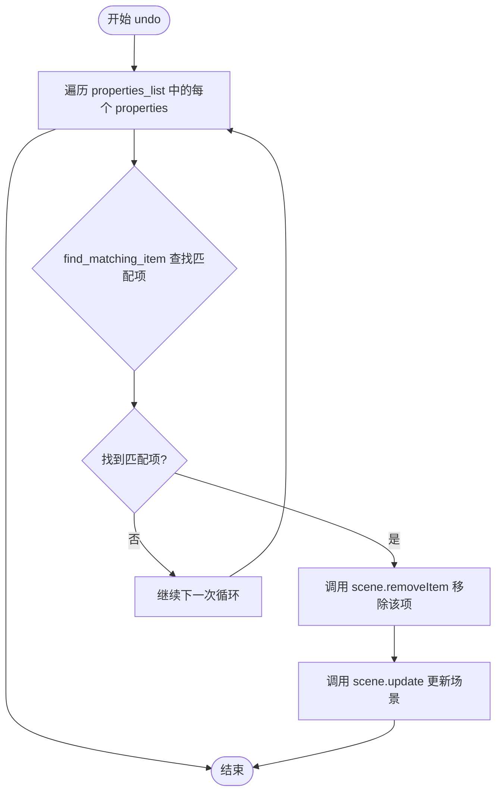

#### 带注释源码

```python
def undo(self):
    """撤销操作：批量移除所有之前添加的路径项"""
    # 遍历之前保存的所有路径属性列表
    for properties in self.properties_list:
        # 在场景中查找与当前属性匹配的图形路径项
        item = self.find_matching_item(self.scene, properties)
        # 如果找到匹配项，则从场景中移除该图形项
        if item:
            self.scene.removeItem(item)
    # 更新场景以反映变更（重新绘制）
    self.scene.update()
```


### `ClearBrushStrokesCommand.__init__`

初始化清除画笔笔触命令对象，保存对 viewer 及其场景的引用，并初始化一个空的属性列表用于存储被清除的笔触属性，以便在撤销操作时恢复这些笔触。

参数：

- `viewer`：对象，主应用程序的查看器窗口，包含场景（_scene）和照片项（photo），用于访问图形场景和执行笔触管理操作

返回值：`None`，构造函数无返回值

#### 流程图

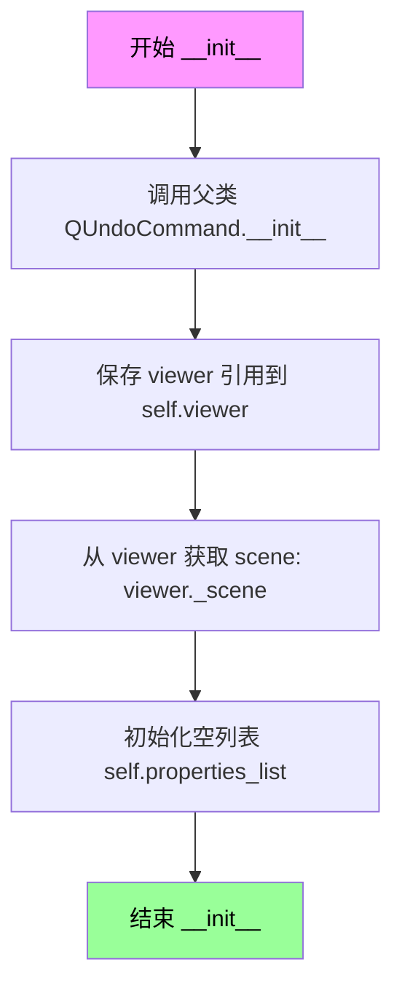

#### 带注释源码

```python
def __init__(self, viewer):
    """
    初始化清除画笔笔触命令
    
    Args:
        viewer: 主应用程序查看器对象，包含场景和照片项
    """
    # 调用父类 QUndoCommand 的初始化方法
    # 使该命令能够被撤销/重做栈管理
    super().__init__()
    
    # 保存对主查看器对象的引用
    # 用于后续访问场景和执行图形操作
    self.viewer = viewer
    
    # 从查看器获取图形场景引用
    # viewer._scene 是 QGraphicsScene 对象
    # 所有画笔笔触都被添加到这个场景中
    self.scene = viewer._scene
    
    # 初始化空列表用于存储被清除的画笔笔触属性
    # 在 redo() 执行时，这里会保存所有被删除笔触的属性
    # 以便在 undo() 时能够恢复这些笔触
    self.properties_list = []
```


### `ClearBrushStrokesCommand.redo()`

重做操作：收集所有画笔笔触项的属性用于撤销，然后从场景中移除这些笔触项。

参数：此方法无显式参数（`self` 为隐式参数）

返回值：`None`，无返回值描述

#### 流程图

```mermaid
flowchart TD
    A([开始 redo]) --> B[清空 self.properties_list]
    B --> C[遍历 self.scene.items 获取所有项]
    C --> D{检查项类型}
    D -->|否| E[跳过该项]
    D -->|是: isinstance(item, QGraphicsPathItem)<br/>且 item != self.viewer.photo| F[调用 save_path_properties<br/>保存项的属性]
    F --> G[将属性添加到 self.properties_list]
    G --> H[从场景中移除该项]
    H --> C
    E --> C
    C --> I[调用 self.scene.update<br/>更新场景视图]
    I --> J([结束])
```

#### 带注释源码

```python
def redo(self):
    """重做：收集并移除所有笔触项，保存属性用于撤销"""
    # 1. 清空属性列表，为收集新的笔触属性做准备
    self.properties_list = []
    
    # 2. 遍历场景中的所有图形项
    for item in self.scene.items():
        # 3. 检查项是否为 QGraphicsPathItem 且不是照片项
        if isinstance(item, QGraphicsPathItem) and item != self.viewer.photo:
            # 4. 保存当前笔触项的属性（路径、画笔、画刷等）
            self.properties_list.append(self.save_path_properties(item))
            
            # 5. 从场景中移除该笔触项
            self.scene.removeItem(item)
    
    # 6. 更新场景以反映变更
    self.scene.update()
```


### `ClearBrushStrokesCommand.undo()`

撤销清除画笔笔触操作：通过遍历之前保存的属性列表，使用 `create_path_item` 重新创建每个路径项并添加到场景中，从而恢复被清除的画笔笔触。

参数：
- 无参数（该方法不接受任何显式参数，使用实例属性 `self.properties_list`）

返回值：`None`，无返回值（该方法直接修改场景状态）

#### 流程图

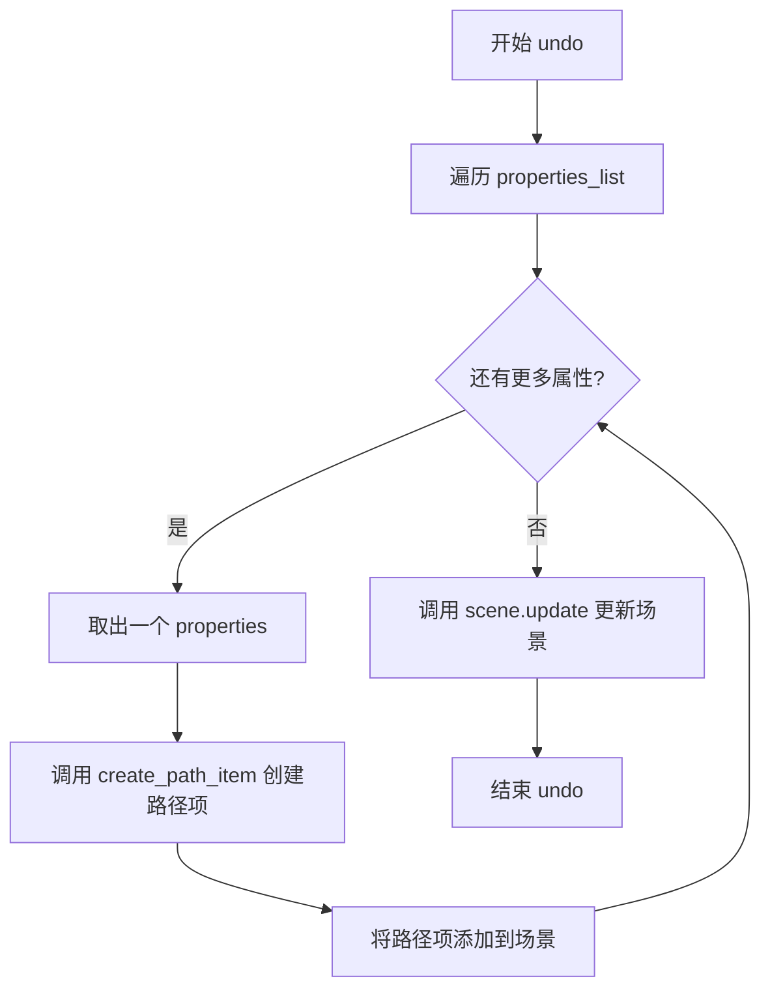

#### 带注释源码

```python
def undo(self):
    """撤销清除操作：依据保存的属性重新创建所有路径项"""
    # 遍历之前在 redo() 中保存的所有路径属性
    for properties in self.properties_list:
        # 使用 PathCommandBase 提供的 create_path_item 方法
        # 根据保存的 properties 字典创建新的 QGraphicsPathItem 对象
        path_item = self.create_path_item(properties)
        
        # 将新创建的路径项添加回场景，恢复被清除的画笔笔触
        self.scene.addItem(path_item)
    
    # 调用场景的 update 方法，触发重绘以显示恢复的路径项
    self.scene.update()
```


### `EraseUndoCommand.__init__`

该方法是 `EraseUndoCommand` 类的构造函数，用于初始化擦除操作的撤销/重做命令。它接收擦除前后的路径属性状态，并设置相关的场景引用和标志位，为后续的 `redo()` 和 `undo()` 操作做准备。

参数：

- `viewer`：`object`，绘图查看器对象，用于访问场景和视图信息
- `before_erase`：`PathProperties`，擦除操作前保存的路径属性列表，描述场景的初始状态
- `after_erase`：`PathProperties`，擦除操作后保存的路径属性列表，描述场景的目标状态

返回值：`None`，构造函数不返回任何值

#### 流程图

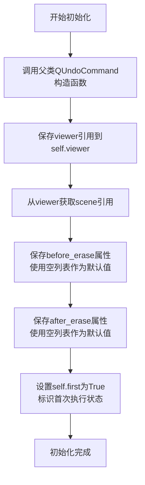

#### 带注释源码

```python
def __init__(self, viewer, before_erase: PathProperties, after_erase: PathProperties):
    """
    初始化EraseUndoCommand实例。
    
    参数:
        viewer: 绘图查看器对象，提供对场景的访问
        before_erase: 擦除前的路径属性列表，保存操作前的场景状态
        after_erase: 擦除后的路径属性列表，保存操作后的场景状态
    """
    # 调用QUndoCommand基类的构造函数
    super().__init__()
    
    # 保存viewer引用，用于后续访问场景和执行操作
    self.viewer = viewer
    
    # 从viewer获取场景引用，缓存到实例属性中以提高访问效率
    self.scene = viewer._scene
    
    # 保存擦除前的路径属性列表
    # 使用空列表作为默认值，防止传入None导致的空指针异常
    self.before_erase = before_erase or [] 
    
    # 保存擦除后的路径属性列表
    # 使用空列表作为默认值，防止传入None导致的空指针异常
    self.after_erase = after_erase or []    
    
    # 设置首次执行标志为True
    # 用于区分命令首次执行（redo时跳过实际恢复操作）
    # 这是QUndoCommand的常见模式，避免命令创建时立即执行
    self.first = True
```


### `EraseUndoCommand.redo`

重做擦除操作：恢复"擦除后"的场景状态。当首次调用时（刚执行完擦除操作），直接返回不执行重做；后续调用时通过`restore_scene_state`方法将场景恢复到擦除后的状态。

参数：
- 该方法无额外参数（仅隐式参数 `self`）

返回值：`None`，无返回值

#### 流程图

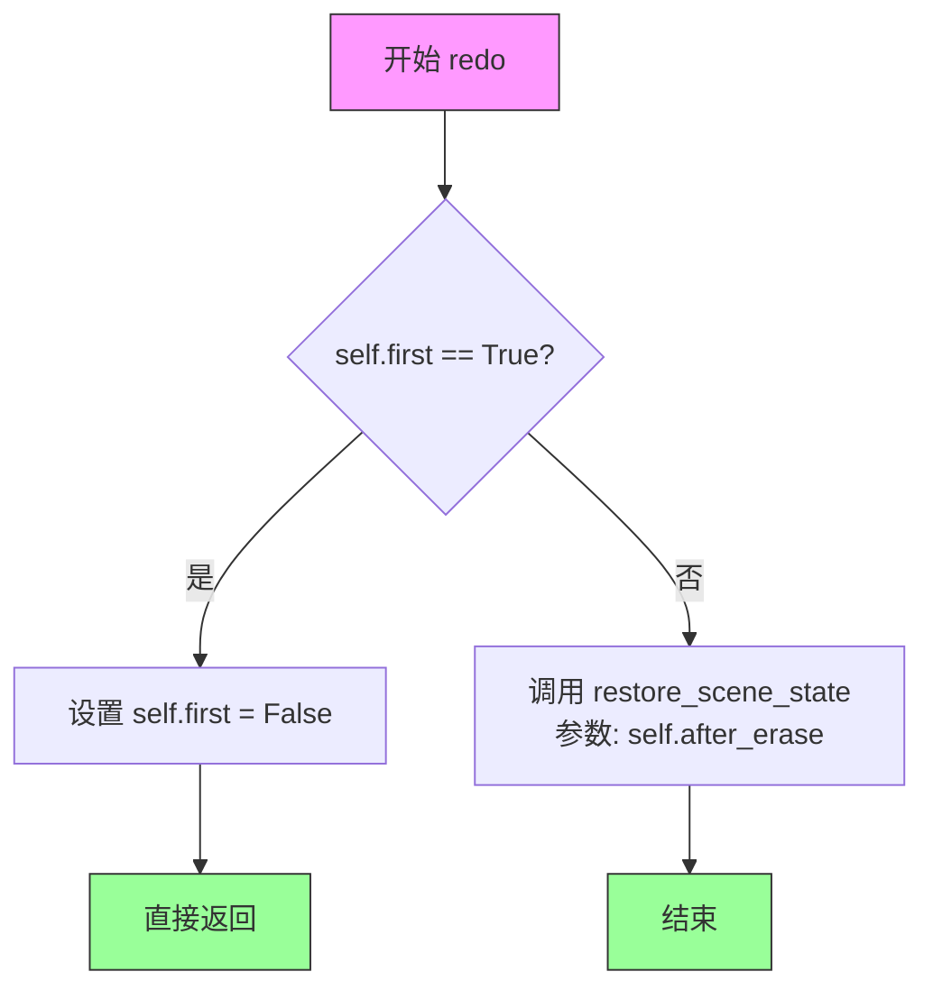

#### 带注释源码

```python
def redo(self):
    """
    重做擦除操作，恢复 after_erase 状态。
    
    注意：首次调用时直接返回，这是为了配合 QUndoStack 的机制。
    当用户执行擦除操作时，会自动调用 redo()，此时不应重复执行恢复逻辑。
    只有当用户触发"重做"（Ctrl+Y）时，才真正执行恢复操作。
    """
    # 检查是否为首次调用
    if self.first:
        # 首次调用：标记为非首次，并直接返回
        # 这样可以跳过刚执行完擦除操作后的自动 redo 调用
        self.first = False
        return
    
    # 非首次调用：恢复场景到擦除后的状态
    # after_erase 存储了擦除操作完成后应该保留的路径项属性列表
    self.restore_scene_state(self.after_erase)
```


### `EraseUndoCommand.undo`

该方法用于撤销擦除操作，通过调用 `restore_scene_state` 方法将场景状态恢复到擦除前的状态（`before_erase`），从而实现撤销功能。

参数：无需显式参数（隐式接收 `self` 实例）

返回值：`None`，该方法无返回值，仅执行场景状态恢复操作

#### 流程图

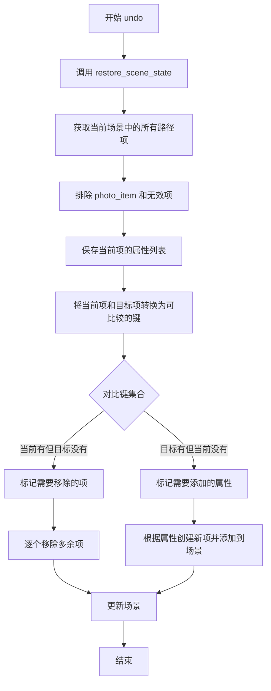

#### 带注释源码

```python
def undo(self):
    """
    撤销操作：将场景状态恢复到擦除之前的状态
    
    该方法通过调用 restore_scene_state 并传入 before_erase 属性列表
    来实现撤销功能。before_erase 存储了擦除操作执行前场景中所有路径项的属性。
    """
    # 调用内部方法恢复场景状态，传入擦除前的属性列表
    self.restore_scene_state(self.before_erase)
```


### `EraseUndoCommand.restore_scene_state`

该方法通过比较当前场景中的路径项属性与目标属性列表，执行差异更新：移除在当前场景中存在但不在目标状态中的项，并添加在目标状态中存在但不在当前场景中的项，从而实现场景状态的恢复或重做。

参数：

- `target_properties_list`：`List[PathProperties]`，目标状态的道路径属性列表，用于与当前场景状态进行比较以确定需要添加或移除的项

返回值：`None`，无返回值，执行场景状态恢复操作

#### 流程图

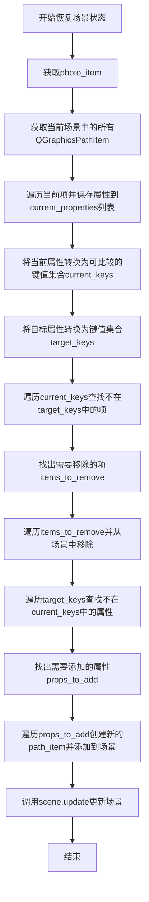

#### 带注释源码

```
def restore_scene_state(self, target_properties_list):
    """Restore the scene to match the target state by comparing with current state."""
    # Step 1: Get photo_item to exclude from processing
    photo_item = getattr(self.viewer, 'photo', None)
    
    # Step 2: Get current path items in the scene (excluding photo_item)
    # Filter for QGraphicsPathItem instances that have a path attribute
    current_items = [
        item for item in self.scene.items() 
        if (isinstance(item, QGraphicsPathItem) and 
            item != photo_item and
            hasattr(item, 'path'))  # Ensure item has path method
    ]
    
    # Step 3: Get current properties for comparison
    # Convert each current item to its PathProperties representation
    current_properties = []
    for item in current_items:
        try:
            props = self.save_path_properties(item)
            if props:
                current_properties.append(props)
        except Exception as e:
            print(f"Warning: Failed to save properties for item: {e}")
            continue
    
    # Step 4: Define key generation function for efficient comparison
    # Convert properties to a comparable key using path string, pen, brush, width
    def props_to_key(props):
        """Convert properties to a comparable key."""
        try:
            # Convert path to a string representation for comparison
            path_str = ""
            if props.get('path'):
                path = props['path']
                # Iterate through path elements to build string representation
                for i in range(path.elementCount()):
                    element = path.elementAt(i)
                    # Format: type,x,y
                    path_str += f"{element.type},{element.x:.2f},{element.y:.2f};"
            
            # Return tuple key for set/dict operations
            return (
                path_str,
                props.get('pen', ''),
                props.get('brush', ''),
                props.get('width', 0),
            )
        except Exception:
            # Fallback for corrupted properties - use object id
            return str(id(props))
    
    # Step 5: Create sets for efficient comparison
    # Map keys to (properties, item) tuples for later removal
    current_keys = {props_to_key(props): (props, item) for props, item in zip(current_properties, current_items)}
    # Map keys to properties for target state lookup
    target_keys = {props_to_key(props): props for props in target_properties_list}
    
    # Step 6: Find items to remove (in current but not in target)
    items_to_remove = []
    for key in current_keys:
        if key not in target_keys:
            _, item = current_keys[key]
            items_to_remove.append(item)
    
    # Step 7: Remove items that shouldn't exist in target state
    for item in items_to_remove:
        try:
            self.scene.removeItem(item)
        except Exception as e:
            print(f"Warning: Failed to remove item: {e}")
    
    # Step 8: Find properties to add (in target but not in current)
    props_to_add = []
    for key in target_keys:
        if key not in current_keys:
            props_to_add.append(target_keys[key])
    
    # Step 9: Add items that should exist in target state
    for properties in props_to_add:
        try:
            path_item = self.create_path_item(properties)
            if path_item:  # Only add if creation was successful
                self.scene.addItem(path_item)
        except Exception as e:
            print(f"Warning: Failed to create path item during undo/redo: {e}")
            continue

    # Step 10: Update the scene to reflect changes
    self.scene.update()
```

## 关键组件


### BrushStrokeCommand

单个画笔笔触的撤销/重做命令类，继承自QUndoCommand和PathCommandBase，用于在场景中添加或删除单条路径项。

### SegmentBoxesCommand

批量路径项的撤销/重做命令类，支持一次性添加或删除多个QGraphicsPathItem，适合处理分段框选操作。

### ClearBrushStrokesCommand

清除所有画笔笔触的撤销命令类，保存当前场景中所有路径项的属性，以便在撤销时恢复。

### EraseUndoCommand

擦除操作的撤销/重做命令类，通过比较当前场景状态与目标状态（before_erase/after_erase）来智能恢复场景，包含状态差异算法和异常处理机制。

### PathCommandBase（基类）

提供路径项操作的基础方法，包括save_path_properties、create_path_item、find_matching_item等，供各命令类复用。

### restore_scene_state 方法

EraseUndoCommand的核心方法，实现场景状态恢复的智能比对算法，通过属性键值比较识别需要添加或删除的项。


## 问题及建议


### 已知问题

- **类型注解缺失**：类字段如 `self.viewer`、`self.scene`、`self.first` 缺少类型注解，影响代码可维护性和 IDE 智能提示支持
- **重复代码模式**：`BrushStrokeCommand` 和 `SegmentBoxesCommand` 中存在大量重复的 `find_matching_item` 和 `create_path_item` 调用逻辑
- **EraseUndoCommand.restore_scene_state 方法过于复杂**：包含大量嵌套循环和字符串拼接操作（`props_to_key` 函数），每次比较都需将路径转换为字符串表示，效率低下
- **裸异常捕获**：使用 `except Exception as e` 配合 `print` 语句进行错误处理，既不优雅也无法向上层传递错误信息
- **内存泄漏风险**：删除 `QGraphicsPathItem` 时未显式调用 `deleteLater()`，可能导致 Qt 对象未及时释放
- **重复的场景更新**：`ClearBrushStrokesCommand` 和 `EraseUndoCommand` 中在循环内部多次调用 `scene.update()`，应统一在循环结束后调用一次
- **不一致的状态保存**：`BrushStrokeCommand` 保存了 `properties`，但擦除操作需要手动维护 `before_erase` 和 `after_erase` 列表，增加了状态同步的复杂性

### 优化建议

- **提取公共逻辑**：将 `BrushStrokeCommand` 和 `SegmentBoxesCommand` 的共同逻辑抽象到基类或工具函数中
- **优化路径比较**：使用 Qt 的 `QPainterPath` 自带的比较方法（如 `operator==`）或计算路径的哈希值，而非字符串拼接
- **改进错误处理**：定义自定义异常类或使用日志框架（`logging` 模块）替代 `print` 语句
- **批量更新优化**：在循环外部统一调用 `scene.update()`，减少渲染开销
- **添加类型注解**：为所有类字段添加 Python 类型注解，提升代码可读性
- **考虑增量更新**：`restore_scene_state` 方法可考虑基于差异（diff）进行增量更新，而非全量重建
- **资源清理**：删除图形项后考虑显式清理或使用 Qt 的父子对象机制管理内存


## 其它


### 设计目标与约束

设计目标是为图形编辑器提供完整的撤销/重做功能，支持画笔笔画绘制、分段框创建、清空画笔和擦除操作。约束条件包括：必须继承QUndoCommand以集成Qt撤销框架，必须继承PathCommandBase以复用路径属性保存和恢复功能，所有命令操作仅影响QGraphicsPathItem类型对象，不影响photo对象。

### 错误处理与异常设计

代码采用分层异常处理策略。在restore_scene_state方法中，使用try-except捕获属性保存失败、项目移除失败和项目创建失败三类异常，每类异常均打印警告信息后继续执行，确保单个项目的处理失败不会影响整体恢复流程。属性比较使用props_to_key方法时包含异常捕获，作为降级方案返回对象id作为唯一键，避免因属性解析错误导致比较失败。

### 数据流与状态机

撤销/重做命令的状态转换遵循Qt命令模式。BrushStrokeCommand和SegmentBoxesCommand使用保存-应用-恢复模式，在构造时保存路径属性列表，redo时根据属性创建路径项添加到场景，undo时查找并移除对应项。ClearBrushStrokesCommand采用反向操作模式，redo时收集并移除所有路径项，undo时根据保存的属性重新创建。EraseUndoCommand使用完整状态快照模式，分别保存擦除前后的完整场景属性列表，通过计算当前状态与目标状态的差集来确定需要添加或移除的项目。

### 外部依赖与接口契约

主要依赖包括PySide6.QtGui.QUndoCommand提供撤销/重做框架，PySide6.QtWidgets.QGraphicsPathItem提供图形路径项，PathCommandBase基类提供save_path_properties、create_path_item、find_matching_item和restore_scene_state方法。viewer对象需要提供_scene属性访问场景，提供photo属性标识底图对象。PathProperties为字典类型，包含path、pen、brush、width等键值对。

### 性能考量与优化空间

EraseUndoCommand的restore_scene_state方法存在性能瓶颈：每次调用都遍历场景所有项目并转换为属性列表，时间复杂度为O(n)，其中n为场景中项目数量。可优化方向包括：使用哈希集合替代列表进行属性比较，将复杂度降至O(1)；增加缓存机制避免重复计算当前场景属性；批量操作时使用QGraphicsScene的addItems和removeItems进行批量处理。此外，props_to_key方法中每次比较都重新解析路径元素，可考虑预计算并缓存路径字符串表示。

    