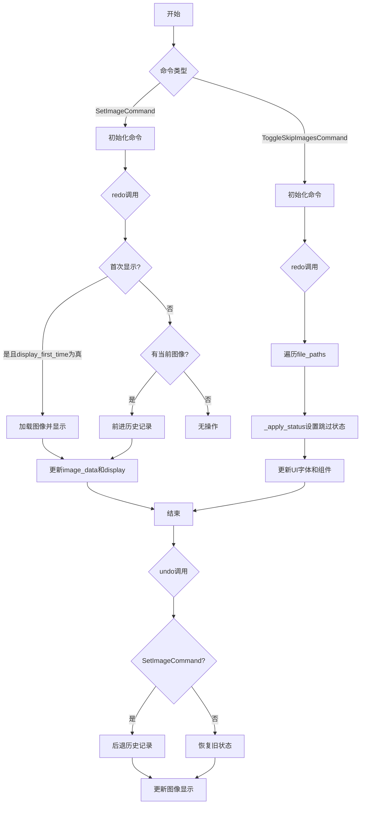
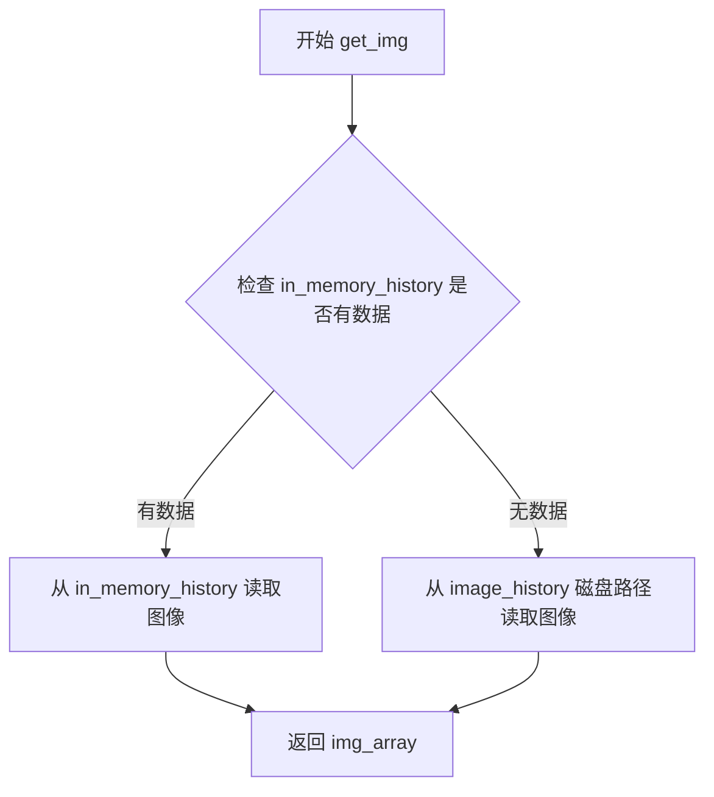
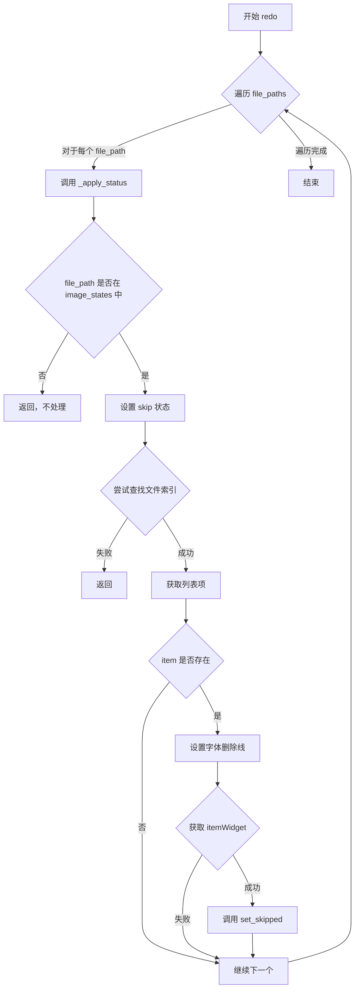
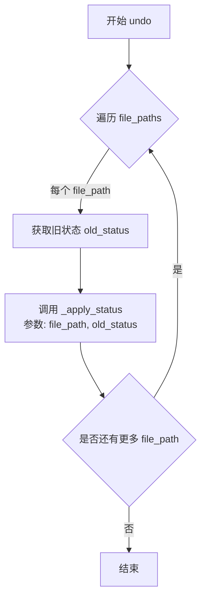

# `comic-translate\app\ui\commands\image.py` 详细设计文档

该代码实现了基于Qt QUndoCommand的两个命令类，用于图像查看器应用。SetImageCommand负责图像的加载、显示和历史记录管理（支持撤销/重做），ToggleSkipImagesCommand负责标记/取消标记图像为跳过状态，同样支持撤销/重做操作。

## 整体流程



## 类结构

```
QUndoCommand (Qt基类)
└── SetImageCommand
    └── 依赖: Controller (ct), imkit, numpy, tempfile
QUndoCommand (Qt基类)
└── ToggleSkipImagesCommand
    └── 依赖: Main (main), UI组件
```

## 全局变量及字段


### `np`
    
NumPy库别名，用于数值计算和数组操作

类型：`module`
    


### `tempfile`
    
Python临时文件模块，用于创建临时文件

类型：`module`
    


### `imk`
    
imkit图像处理库别名，用于图像读写操作

类型：`module`
    


### `SetImageCommand.ct`
    
parent controller对象，图像控制器引用

类型：`object`
    


### `SetImageCommand.first`
    
首次执行标志，用于判断是否首次执行redo操作

类型：`bool`
    


### `SetImageCommand.display_first_time`
    
是否首次显示图像，控制首次加载时是否显示图像

类型：`bool`
    


### `ToggleSkipImagesCommand.main`
    
main主控制器对象

类型：`object`
    


### `ToggleSkipImagesCommand.file_paths`
    
文件路径列表

类型：`list[str]`
    


### `ToggleSkipImagesCommand.new_status`
    
新的跳过状态

类型：`bool`
    


### `ToggleSkipImagesCommand.old_status`
    
旧的跳过状态映射，存储每个文件路径之前的跳过状态

类型：`dict`
    
    

## 全局函数及方法


### `SetImageCommand.__init__`

这是 `SetImageCommand` 类的构造函数，用于初始化一个图像设置命令对象。该命令继承自 `QUndoCommand`，用于在图像查看器中设置图像并支持撤销/重做功能。在初始化过程中，它会调用父类的构造函数，保存对控制器（parent）的引用，更新图像历史记录，并设置首次显示标志。

参数：

- `parent`：`object`，控制器对象，包含图像查看器、历史记录和图像数据的管理功能
- `file_path`：`str`，要设置的图像文件路径
- `img_array`：`np.ndarray`，图像数据的多维数组表示
- `display`：`bool`，可选参数，默认为 `True`，控制在首次重做时是否显示图像

返回值：`None`，构造函数不返回任何值

#### 流程图

```mermaid
flowchart TD
    A[开始 __init__] --> B[调用 super().__init__()]
    B --> C[保存 parent 到 self.ct]
    C --> D[调用 update_image_history 更新图像历史]
    D --> E[设置 self.first = True]
    E --> F[保存 display 参数到 self.display_first_time]
    F --> G[结束 __init__]
```

#### 带注释源码

```python
def __init__(self, parent, file_path: str, img_array: np.ndarray, 
             display: bool = True):
    """
    初始化 SetImageCommand 命令对象
    
    Args:
        parent: 控制器对象，包含图像查看器和历史记录管理
        file_path: 图像文件路径
        img_array: 图像的 numpy 数组数据
        display: 是否在首次 redo 时显示图像
    """
    # 调用 QUndoCommand 基类的构造函数
    super().__init__()
    
    # 保存对控制器（parent）的引用，后续用于访问图像查看器、历史记录等
    self.ct = parent
    
    # 更新图像历史记录，如果图像数据与历史中的不同，则创建新的历史条目
    self.update_image_history(file_path, img_array)
    
    # 标记这是首次执行，用于 redo 方法中的逻辑判断
    self.first = True
    
    # 保存首次显示标志，控制 redo 时是否立即显示图像
    self.display_first_time = display
```


### `SetImageCommand.redo`

该方法是 Qt 撤销/重做（Undo/Redo）命令的一部分，用于重新执行图像设置操作。它首先检查是否为首次执行，若是且需要显示则加载并显示图像；然后检查当前图像索引是否有效，若有效则将历史记录索引前移，加载对应图像数据并更新图像视图和内存数据。

参数：此方法无显式参数（隐含参数 `self` 为 SetImageCommand 实例）

返回值：`None`，无返回值

#### 流程图

```mermaid
flowchart TD
    A[开始 redo] --> B{self.first 为真?}
    B -->|是| C{display_first_time 为假?}
    C -->|是| D[直接返回]
    C -->|否| E[获取当前图像文件路径]
    E --> F{file_path 在 current_history_index 中?}
    F -->|否| G[初始化 current_history_index[file_path] = 0]
    F -->|是| H{file_path 在 image_history 中?}
    H -->|否| I[初始化 image_history[file_path] = [file_path]]
    H -->|是| J[获取 current_index]
    G --> J
    I --> J
    J --> K[调用 get_img 获取图像数组]
    K --> L[在 image_viewer 中显示图像]
    L --> M[self.first = False]
    M --> N{self.curr_img_idx >= 0?}
    B -->|否| N
    N -->|否| O[结束]
    N -->|是| P[获取当前图像文件路径]
    P --> Q{file_path 在 current_history_index 中?}
    Q -->|否| R[初始化 current_history_index[file_path] = 0]
    Q -->|是| S{file_path 在 image_history 中?}
    R --> S
    S -->|否| T[初始化 image_history[file_path] = [file_path]]
    S -->|是| U[获取 current_index]
    T --> U
    U --> V{current_index < len(image_history[file_path]) - 1?}
    V -->|否| O
    V -->|是| W[current_index += 1]
    W --> X[更新 current_history_index]
    X --> Y[调用 get_img 获取图像数组]
    Y --> Z[更新 image_data[file_path]]
    Z --> AA[在 image_viewer 中显示图像]
    AA --> O
```

#### 带注释源码

```python
def redo(self):
    """
    重做（Redo）操作：重新应用图像设置命令
    该方法在撤销/重做框架中被调用，用于重做之前撤销的操作
    """
    # 首次执行时的处理逻辑
    if self.first:
        # 如果首次执行时不需显示图像，则直接返回
        if not self.display_first_time:
            return
        
        # 获取当前图像文件的路径
        file_path = self.ct.image_files[self.ct.curr_img_idx]
        
        # 确保文件有正确的历史记录初始化
        if file_path not in self.ct.current_history_index:
            # 初始化当前历史索引为 0
            self.ct.current_history_index[file_path] = 0
        if file_path not in self.ct.image_history:
            # 初始化图像历史记录，包含原始文件路径
            self.ct.image_history[file_path] = [file_path]
            
        # 获取当前历史索引
        current_index = self.ct.current_history_index[file_path]
        # 根据索引获取图像数组
        img_array = self.get_img(file_path, current_index)
        # 在图像查看器中显示图像
        self.ct.image_viewer.display_image_array(img_array)
        # 标记首次执行已完成
        self.first = False

    # 检查当前是否有有效的图像被选中
    if self.ct.curr_img_idx >= 0:
        # 获取当前图像文件的路径
        file_path = self.ct.image_files[self.ct.curr_img_idx]
        
        # 确保 proper 初始化
        if file_path not in self.ct.current_history_index:
            self.ct.current_history_index[file_path] = 0
        if file_path not in self.ct.image_history:
            self.ct.image_history[file_path] = [file_path]
            
        # 获取当前历史索引
        current_index = self.ct.current_history_index[file_path]
        
        # 如果不是历史记录的最后一个，则前移索引（重做操作）
        if current_index < len(self.ct.image_history[file_path]) - 1:
            # 索引前移
            current_index += 1
            # 更新当前历史索引
            self.ct.current_history_index[file_path] = current_index

            # 获取重做后的图像数组
            img_array = self.get_img(file_path, current_index)

            # 更新内存中的图像数据
            self.ct.image_data[file_path] = img_array
            # 在图像查看器中显示重做后的图像
            self.ct.image_viewer.display_image_array(img_array)
```


### `SetImageCommand.undo`

该方法是`QUndoCommand`子类`SetImageCommand`的撤销操作实现，用于将当前图像状态回滚到历史记录中的前一个状态。当用户执行撤销操作时，该方法会减少当前历史索引，加载前一版本的图像数据，并更新图像查看器的显示。

参数：此方法不接受任何额外参数（除隐式的`self`）

返回值：`None`，该方法直接修改对象状态而不返回任何值

#### 流程图

```mermaid
flowchart TD
    A[开始 undo] --> B{self.ct.curr_img_idx >= 0?}
    B -->|否| C[直接返回]
    B -->|是| D[获取当前文件路径]
    D --> E{file_path在current_history_index中?}
    E -->|否| F[初始化current_history_index[file_path] = 0]
    E -->|是| G{file_path在image_history中?}
    F --> G
    G -->|否| H[初始化image_history[file_path] = [file_path]]
    H --> I[获取current_index]
    G -->|是| I
    I --> J{current_index > 0?}
    J -->|否| K[直接返回]
    J -->|是| L[current_index减1]
    L --> M[更新current_history_index]
    M --> N[调用get_img获取图像数组]
    N --> O[更新image_data字典]
    O --> P[调用display_image_array显示图像]
    P --> Q[结束]
    C --> Q
    K --> Q
```

#### 带注释源码

```python
def undo(self):
    """
    撤销操作：将当前图像状态回滚到历史记录中的前一个状态
    
    该方法实现QUndoCommand的undo接口，用于撤销对图像的修改。
    它通过减少当前历史索引来加载前一版本的图像。
    """
    # 检查是否有图像被选中（curr_img_idx >= 0表示有图像被选中）
    if self.ct.curr_img_idx >= 0:
        # 获取当前图像的文件路径
        file_path = self.ct.image_files[self.ct.curr_img_idx]
        
        # 确保历史记录索引已初始化
        # 如果file_path不在current_history_index字典中，初始化为0
        if file_path not in self.ct.current_history_index:
            self.ct.current_history_index[file_path] = 0
        
        # 确保图像历史记录已初始化
        # 如果file_path不在image_history字典中，初始化为包含原始文件路径的列表
        if file_path not in self.ct.image_history:
            self.ct.image_history[file_path] = [file_path]
            
        # 获取当前历史索引
        current_index = self.ct.current_history_index[file_path]
        
        # 只有当不是第一个历史状态时才执行撤销
        # （即current_index > 0表示有更早的历史可以回滚）
        if current_index > 0:
            # 将索引减1，指向更早的历史状态
            current_index -= 1
            # 更新当前历史索引
            self.ct.current_history_index[file_path] = current_index
            
            # 获取回滚到的图像数组
            # 通过file_path和current_index从内存历史或文件历史中加载图像
            img_array = self.get_img(file_path, current_index)

            # 更新内存中的图像数据字典
            self.ct.image_data[file_path] = img_array
            # 在图像查看器中显示回滚后的图像
            self.ct.image_viewer.display_image_array(img_array)
```


### `SetImageCommand.update_image_history`

该方法用于更新图像历史记录，管理图像的版本历史。它首先加载当前图像，如果新图像与当前图像不同，则保存新图像到临时文件，并更新文件历史记录和内存历史记录，同时处理撤销/重做历史链。

参数：

- `file_path`：`str`，要更新历史记录的图像文件路径
- `img_array`：`np.ndarray`，新的图像数据数组

返回值：`None`，该方法无返回值，仅更新对象内部状态

#### 流程图

```mermaid
flowchart TD
    A[开始 update_image_history] --> B[加载当前图像: im = self.ct.load_image]
    B --> C{新图像与当前图像是否不同?}
    C -->|否| D[直接返回，不更新历史]
    C -->|是| E[更新内存中的图像数据: self.ct.image_data[file_path] = img_array]
    E --> F[获取当前历史记录和索引]
    F --> G[删除当前索引之后的所有未来历史记录]
    G --> H[创建临时PNG文件保存新图像]
    H --> I[将临时文件路径添加到历史记录]
    I --> J{该文件是否有内存历史?}
    J -->|是| K[更新内存历史: 删除未来历史并追加新图像]
    J -->|否| L[跳过内存历史更新]
    K --> M
    L --> M[更新当前历史索引为最新位置]
    M --> N[结束]
```

#### 带注释源码

```python
def update_image_history(self, file_path: str, img_array: np.ndarray):
    """
    更新图像的历史记录，用于撤销/重做功能
    
    参数:
        file_path: 图像文件的路径
        img_array: 新的图像数组数据
    """
    # 加载当前图像用于比较
    im = self.ct.load_image(file_path)

    # 仅当新图像与当前图像不同时才更新历史
    if not np.array_equal(im, img_array):
        # 将新图像数据存入内存缓存
        self.ct.image_data[file_path] = img_array
        
        # 获取该文件的历史记录列表和当前索引位置
        history = self.ct.image_history[file_path]
        current_index = self.ct.current_history_index[file_path]
        
        # 如果不是在历史末尾，则删除所有"未来"的历史记录
        # 这相当于在当前节点分叉出一条新的时间线
        del history[current_index + 1:]
        
        # 创建临时文件保存新图像（用于持久化历史）
        temp_file = tempfile.NamedTemporaryFile(delete=False, suffix='.png', dir=self.ct.temp_dir)
        # 使用imkit将图像写入临时文件
        imk.write_image(temp_file.name, img_array)
        temp_file.close()

        # 将新的临时文件路径追加到历史记录末尾
        history.append(temp_file.name)

        # 如果该图像有内存历史记录，也需要同步更新
        if self.ct.in_memory_history.get(file_path, []):
            in_mem_history = self.ct.in_memory_history[file_path]
            # 同样删除未来的历史并追加新图像
            del in_mem_history[current_index + 1:]
            in_mem_history.append(img_array.copy())

        # 更新当前历史索引指向最新的图像
        self.ct.current_history_index[file_path] = len(history) - 1
```


### `SetImageCommand.get_img`

该方法负责根据文件路径和历史索引从内存或磁盘获取图像数据，是图像历史管理的重要组成部分，支持撤销/重做功能中的图像恢复操作。

参数：

- `file_path`：`str`，目标图像文件的路径
- `current_index`：`int`，图像历史记录中的索引位置

返回值：`np.ndarray`，返回指定索引处的图像数组数据

#### 流程图



#### 带注释源码

```python
def get_img(self, file_path, current_index):
    """
    根据文件路径和历史索引获取图像数据
    
    Args:
        file_path: 图像文件路径
        current_index: 历史记录索引
        
    Returns:
        图像数组数据
    """
    # 检查该文件是否在内存历史记录中（有修改过的图像在内存中）
    if self.ct.in_memory_history.get(file_path, []):
        # 直接从内存历史记录中获取图像数组（更快）
        img_array = self.ct.in_memory_history[file_path][current_index]
    else:
        # 从磁盘历史文件中读取图像（原始/保存的图像）
        img_array = imk.read_image(self.ct.image_history[file_path][current_index])

    # 返回获取到的图像数组
    return img_array
```

---

#### 关键组件信息

| 组件名称 | 一句话描述 |
|---------|-----------|
| `SetImageCommand` | Qt 撤销/重做命令类，管理图像设置操作及历史记录 |
| `in_memory_history` | 内存中的图像历史记录字典，存储修改过的图像数组 |
| `image_history` | 磁盘上的图像历史记录，存储临时文件路径 |
| `imkit.read_image` | 外部图像读取库函数，从文件路径加载图像 |

#### 潜在的技术债务或优化空间

1. **重复初始化代码**：在 `redo` 和 `undo` 方法中存在大量重复的历史索引初始化代码，可抽取为私有方法 `_ensure_history_initialized(file_path)`。
2. **临时文件管理**：`update_image_history` 中创建的临时文件缺少显式的清理机制，可能导致磁盘空间浪费。
3. **异常处理缺失**：`get_img` 方法未处理 `imk.read_image` 读取失败或索引越界的情况。
4. **硬编码后缀**：临时文件后缀 `.png` 硬编码，建议从图像格式配置中读取。

#### 其它项目

**设计目标与约束**：
- 遵循 Qt 的 `QUndoCommand` 模式实现撤销/重做功能
- 支持图像的多版本历史记录管理

**错误处理与异常设计**：
- 缺少对 `file_path` 不存在于 `image_history` 的异常处理
- 缺少对 `current_index` 越界的边界检查

**数据流与状态机**：
- 图像数据流：磁盘文件 → 内存数组 → 显示
- 状态转换：`first` 标志控制首次显示，`current_history_index` 控制历史位置


### `ToggleSkipImagesCommand.__init__`

这是 `ToggleSkipImagesCommand` 类的构造函数，用于初始化一个切换图像跳过状态的撤销命令。该方法接收主对象、文件路径列表和目标跳过状态，同时预先记录每个文件路径的当前跳过状态，以便后续执行撤销操作。

参数：

- `main`：`object`，主对象引用，通常是包含图像状态管理的主要控制器
- `file_paths`：`list[str]`，需要切换跳过状态的文件路径列表
- `skip_status`：`bool`，目标跳过状态（True 表示跳过，False 表示不跳过）

返回值：`None`，无返回值（构造函数）

#### 流程图

```mermaid
flowchart TD
    A[开始 __init__] --> B[调用 super().__init__ 初始化父类]
    B --> C[self.main = main 保存主对象引用]
    C --> D[self.file_paths = file_paths 保存文件路径列表]
    D --> E[self.new_status = skip_status 保存新状态]
    E --> F[遍历 file_paths 列表]
    F --> G{每个 path}
    G --> H[从 main.image_states 获取当前状态]
    H --> I[构建 old_status 字典]
    I --> J[结束 __init__]
```

#### 带注释源码

```python
def __init__(self, main, file_paths: list[str], skip_status: bool):
    # 调用父类 QUndoCommand 的初始化方法
    super().__init__()
    
    # 保存主对象引用，用于后续访问图像状态管理器和UI组件
    self.main = main
    
    # 保存需要修改跳过状态的文件路径列表
    self.file_paths = file_paths
    
    # 保存新的跳过状态（目标状态），redo 时应用此状态
    self.new_status = skip_status
    
    # 预先计算并保存每个文件路径的当前跳过状态（旧状态）
    # 用于 undo 操作时恢复原始状态
    # 如果 image_states 中不存在该文件或 skip 键，则默认为 False
    self.old_status = {
        path: main.image_states.get(path, {}).get('skip', False)
        for path in file_paths
    }
```


### `ToggleSkipImagesCommand._apply_status`

该方法负责将指定的跳过状态（skip）应用到单个图像文件，更新内部状态、列表项的视觉样式以及卡片组件的显示状态。

参数：

- `file_path`：`str`，要应用状态的图像文件路径
- `skip_status`：`bool`，是否跳过该图像（True 为跳过/显示删除线，False 为正常显示）

返回值：`None`，该方法直接修改对象状态，无返回值

#### 流程图

```mermaid
flowchart TD
    A[开始 _apply_status] --> B{file_path 是否在 image_states 中?}
    B -->|否| C[直接返回]
    B -->|是| D[更新 image_states[file_path]['skip'] = skip_status]
    D --> E{尝试查找 file_path 在 image_files 中的索引}
    E -->|未找到| F[直接返回]
    E -->|找到| G[获取列表项 item]
    G --> H{item 是否存在?}
    H -->|否| I[直接返回]
    H -->|是| J[设置字体删除线样式]
    J --> K[获取列表项的卡片组件]
    K --> L{card 是否存在?}
    L -->|否| M[结束]
    L -->|是| N[调用 card.set_skipped(skip_status)]
    N --> O[结束]
```

#### 带注释源码

```
def _apply_status(self, file_path: str, skip_status: bool):
    """
    将跳过状态应用到指定的图像文件。
    
    参数:
        file_path: 图像文件的完整路径
        skip_status: True 表示跳过该图像（显示删除线）, False 表示正常显示
    
    返回:
        None
    """
    # 检查文件路径是否在图像状态字典中，若不存在则无需处理
    if file_path not in self.main.image_states:
        return
    
    # 更新内存中的图像状态
    self.main.image_states[file_path]['skip'] = skip_status

    # 尝试在图像文件列表中查找该文件的索引位置
    try:
        idx = self.main.image_files.index(file_path)
    except ValueError:
        # 文件不在列表中，直接返回
        return

    # 获取列表控件中对应的项
    item = self.main.page_list.item(idx)
    if item:
        # 设置字体的删除线效果来视觉上标记跳过的图像
        fnt = item.font()
        fnt.setStrikeOut(skip_status)
        item.setFont(fnt)

    # 获取列表项关联的自定义卡片组件（用于更丰富的UI展示）
    card = self.main.page_list.itemWidget(item) if item else None
    if card:
        # 调用卡片的 set_skipped 方法更新其内部状态和显示
        card.set_skipped(skip_status)
```


### ToggleSkipImagesCommand.redo

该方法是撤销命令模式的一部分，用于批量切换图像的"跳过"状态。它遍历所有指定的文件路径，对每个文件应用新的跳过状态，同时更新UI显示（字体删除线和组件状态）。

参数：此方法无显式参数（继承自 QUndoCommand 的 redo 方法）

返回值：`None`，无返回值

#### 流程图



#### 带注释源码

```python
def redo(self):
    """
    重做命令：将新的跳过状态应用到所有文件路径
    继承自 QUndoCommand，是撤销/重做机制的核心部分
    """
    # 遍历所有需要切换状态的文件路径
    for file_path in self.file_paths:
        # 对每个文件路径应用新的跳过状态
        # _apply_status 方法会：
        # 1. 更新 self.main.image_states 中的 skip 字段
        # 2. 更新列表项的字体（添加删除线表示跳过）
        # 3. 更新自定义组件的跳过状态
        self._apply_status(file_path, self.new_status)
```

#### 相关方法 _apply_status 详情

```python
def _apply_status(self, file_path: str, skip_status: bool):
    """
    应用跳过状态到单个文件路径
    
    参数：
    - file_path: str - 文件路径
    - skip_status: bool - 新的跳过状态（True=跳过，False=显示）
    """
    # 检查文件路径是否在图像状态字典中
    if file_path not in self.main.image_states:
        return
    
    # 更新内存中的跳过状态
    self.main.image_states[file_path]['skip'] = skip_status

    # 尝试在文件列表中查找该文件的索引
    try:
        idx = self.main.image_files.index(file_path)
    except ValueError:
        return

    # 获取列表项并更新字体样式（删除线表示跳过）
    item = self.main.page_list.item(idx)
    if item:
        fnt = item.font()
        fnt.setStrikeOut(skip_status)  # 设置删除线效果
        item.setFont(fnt)

    # 获取并更新自定义组件的跳过状态
    card = self.main.page_list.itemWidget(item) if item else None
    if card:
        card.set_skipped(skip_status)
```


### `ToggleSkipImagesCommand.undo`

该方法是撤销操作的核心实现，用于将图像的跳过状态恢复为修改前的状态。通过遍历所有受影响的文件路径，调用内部方法 `_apply_status` 将跳过状态恢复为 `old_status` 中保存的原始值。

参数：

- （无显式参数，隐含参数 `self` 代表命令实例）

返回值：`None`，无返回值描述

#### 流程图



#### 带注释源码

```
def undo(self):
    """
    撤销操作，将图像的跳过状态恢复为更改前的状态
    """
    # 遍历所有需要撤销的文件路径
    for file_path in self.file_paths:
        # 获取该文件路径的旧状态，如果不存在则默认为 False
        old_status = self.old_status.get(file_path, False)
        
        # 调用内部方法应用旧状态
        # 该方法会：
        # 1. 更新 main.image_states 中该文件的 skip 字段
        # 2. 在 page_list 中查找对应项并更新字体样式（取消删除线）
        # 3. 更新页面卡片组件的跳过状态
        self._apply_status(file_path, old_status)
```

## 关键组件


### 图像历史管理系统

管理图像的撤销/重做历史记录，支持版本追踪和状态回滚。通过维护image_history、current_history_index和in_memory_history三个数据结构，实现图像操作的历史记录功能。

### 张量索引与惰性加载

get_img方法实现惰性加载机制，根据in_memory_history是否存在决定从内存还是磁盘加载图像数据，减少不必要的磁盘IO操作。

### 临时文件管理

update_image_history使用tempfile.NamedTemporaryFile创建临时PNG文件保存图像历史，支持非托管的临时文件生命周期管理。

### 反量化支持

通过imkit的read_image和write_image接口处理图像的读写，支持将numpy数组反序列化为图像数据进行显示和保存。

### 量化策略

将图像数据以numpy数组形式存储在内存历史中，同时将磁盘历史以临时文件形式保存，实现内存和磁盘的混合存储策略。

### 撤销/重做命令模式

继承QUndoCommand实现标准的撤销/重做模式，redo方法处理前进操作，undo方法处理回退操作，通过first标志控制首次执行逻辑。

### 图像跳过状态管理

ToggleSkipImagesCommand管理图像的跳过状态，通过image_states字典记录状态，并同步更新UI组件（字体删除线和卡片状态）。


## 问题及建议


### 已知问题

-   **代码重复（DRY原则违反）**：在`redo()`和`undo()`方法中存在大量重复的历史初始化逻辑（检查并初始化`current_history_index`和`image_history`），应提取为私有方法以提高代码可维护性。
-   **初始化逻辑副作用**：`SetImageCommand.__init__`中调用`update_image_history()`会直接修改父对象状态，这与命令模式的初衷不符，命令对象应在执行时才修改状态。
-   **临时文件资源泄漏**：`tempfile.NamedTemporaryFile`创建后仅调用`close()`但未显式删除文件，且没有临时文件清理机制（应在命令对象销毁或应用退出时清理）。
-   **参数命名不清晰**：参数`ct`含义不明确（应为`controller`或`parent`），变量名`first`过于简洁，应使用`is_first_execution`等更具描述性的名称。
-   **边界检查缺失**：`current_index`的递增/递减操作未进行边界验证，虽然有条件判断但在并发场景下仍可能存在问题。
-   **类型注解不完整**：`SetImageCommand`构造函数中`parent`参数缺少类型注解，`ToggleSkipImagesCommand`中`main`参数也缺少类型注解。
-   **错误处理缺失**：文件读写操作（`imk.read_image`、`imk.write_image`）、`load_image`调用、临时文件创建等均未进行异常捕获和处理。
-   **双重历史记录同步风险**：代码维护了`image_history`（文件路径）和`in_memory_history`（内存数组）两套历史记录，在`update_image_history`中需要手动保持同步，容易出现不一致的情况。
-   **索引访问越界风险**：`get_img()`方法中直接使用`current_index`访问列表，未对`current_index`的有效性进行验证。
-   **Qt对象生命周期管理不当**：继承`QUndoCommand`但未显式管理父对象引用，可能导致Qt对象树管理问题。

### 优化建议

-   将重复的历史初始化逻辑提取为私有方法`_ensure_history_initialized(file_path)`，在`redo()`、`undo()`和`update_image_history()`中复用。
-   将`update_image_history()`的调用从`__init__`移至`redo()`中首次执行时调用，避免命令对象创建时的副作用。
-   实现`__del__`方法或使用上下文管理器清理临时文件，或在父控制器中维护临时文件列表并定期清理。
-   使用有意义的命名：`ct`改为`controller`，`first`改为`has_first_execution_done`。
-   添加完整的类型注解，并为所有IO操作添加try-except异常处理。
-   考虑使用`weakref`或Qt的父子对象机制管理命令对象的生命周期。
-   将`in_memory_history`与`image_history`合并为单一数据结构，或提供专门的同步方法来保证一致性。
-   在访问列表索引前添加边界检查：`if 0 <= current_index < len(self.ct.image_history[file_path])`。
-   考虑使用`tempfile.TemporaryDirectory`上下文管理器自动管理临时目录的生命周期。
-   将硬编码的`.png`后缀提取为常量或配置项。


## 其它


### 设计目标与约束

本代码的设计目标是实现一个支持撤销/重做功能的图像查看器命令系统。具体约束包括：1) 必须继承自Qt的QUndoCommand基类以集成到Qt的撤销框架；2) 图像历史记录需要支持版本管理，支持任意步数的撤销和重做；3) 需要同时维护文件系统和内存中的图像历史；4) 命令需要支持条件执行（如首次显示时可选择不显示）。

### 错误处理与异常设计

代码中主要通过以下方式处理错误：1) 使用try-except捕获文件路径不存在时的`ValueError`异常；2) 对字典访问使用`.get()`方法避免KeyError；3) 使用`np.array_equal()`比较图像数组避免精确比较问题；4) 临时文件操作后调用`temp_file.close()`确保文件句柄释放。潜在改进：可添加更具体的自定义异常类，区分文件读写错误、历史索引越界等不同错误类型。

### 数据流与状态机

`SetImageCommand`的状态机包含以下状态：初始状态（first=True）-> 首次显示状态 -> 常规历史导航状态。状态转换由`redo()`和`undo()`方法驱动，`current_history_index`字典维护每个文件路径的当前历史索引。`ToggleSkipImagesCommand`维护`skip_status`的旧值和新值，通过`redo()`应用新状态，`undo()`恢复旧状态。

### 外部依赖与接口契约

本代码依赖以下外部组件：1) `numpy`库用于图像数组操作；2) `PySide6.QtGui.QUndoCommand`作为命令基类；3) `tempfile`模块用于创建临时文件；4) `imkit`库（别名imk）提供`read_image`和`write_image`函数。与父对象`ct`（图像容器）的接口契约：`ct`必须包含`image_files`、`curr_img_idx`、`image_viewer`、`image_data`、`image_history`、`current_history_index`、`in_memory_history`、`temp_dir`等属性，以及`load_image()`方法。

### 性能考虑与优化空间

当前实现存在以下性能问题：1) 每次撤销/重做都调用`display_image_array`可能导致UI频繁更新；2) 临时文件创建和图像写入操作可能较慢；3) `update_image_history`中每次都写入临时文件而非增量保存。优化建议：1) 可添加节流机制减少UI更新频率；2) 可实现图像差异存储减少临时文件大小；3) 可添加图像缓存层。

### 线程安全性

代码本身在主线程中运行，但未包含线程安全机制。由于Qt的UI操作必须在主线程执行，且图像历史操作涉及共享数据结构（字典），在多线程环境下可能出现竞态条件。建议：如需支持后台线程操作，应添加锁（如`QMutex`）保护共享数据结构。

### 内存管理

临时文件通过`tempfile.NamedTemporaryFile`创建，设置`delete=False`以便持久化保存历史。内存中通过`in_memory_history`维护图像数组副本，可能导致内存占用较高。改进建议：1) 实现LRU缓存限制内存历史数量；2) 定期清理不再使用的临时文件；3) 对于大图像考虑使用内存映射文件。

### 安全性考虑

代码中文件操作使用`tempfile`创建临时文件，但未对`file_path`进行充分验证，存在路径遍历攻击风险。`imkit.read_image`和`imk.write_image`函数调用亦未验证文件路径合法性。改进建议：1) 对所有文件路径进行安全验证；2) 限制临时文件目录的访问权限；3) 验证图像数据格式防止恶意文件。

### 测试策略

建议测试覆盖以下场景：1) 正常撤销/重做流程；2) 连续快速撤销重做；3) 边界条件（历史头部/尾部）；4) 多文件切换后的历史一致性；5) 临时文件创建失败场景；6) 内存不足时的行为；7) 并发访问冲突。可使用`unittest`或`pytest`框架结合`pytest-qt`进行测试。

### 配置与扩展性

当前代码硬编码了部分逻辑（如临时文件后缀为`.png`），扩展性受限。改进建议：1) 将临时文件目录、后缀等配置外部化；2) 支持可插拔的历史存储策略；3) 添加命令宏（Macro Command）支持组合命令；4) 考虑Observer模式解耦图像显示逻辑。

### 日志与监控

代码中缺少日志记录功能，难以追踪运行时问题。建议添加：1) 命令执行日志（记录redo/undo调用）；2) 性能监控（记录图像加载/保存耗时）；3) 错误日志（记录异常及堆栈信息）；4) 调试标志控制日志详细程度。可使用Python的`logging`模块或Qt的`QLoggingCategory`。

### 版本兼容性

代码使用Python类型注解（`list[str]`语法需要Python 3.9+），依赖PySide6和numpy。需确保运行时环境满足版本要求。兼容性改进：1) 使用`typing.List`替代`list[str]`；2) 添加版本检测逻辑；3) 为不同版本提供替代实现。


    