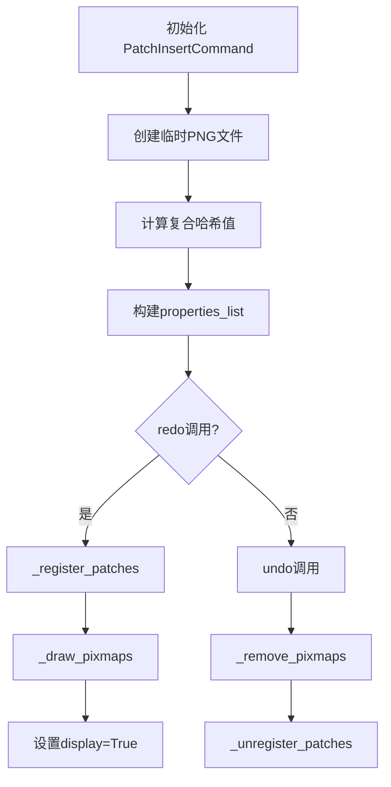
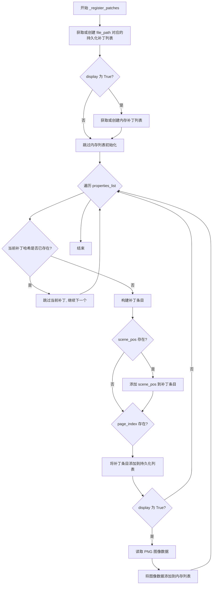
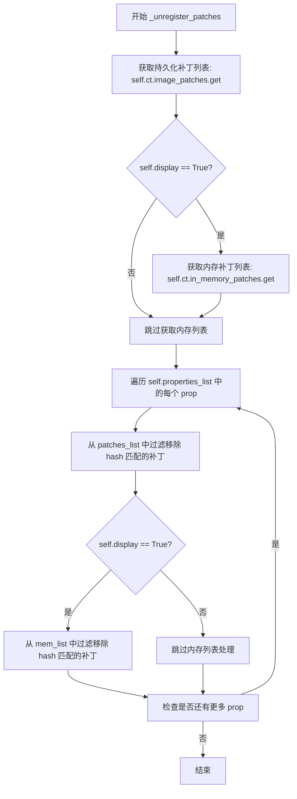
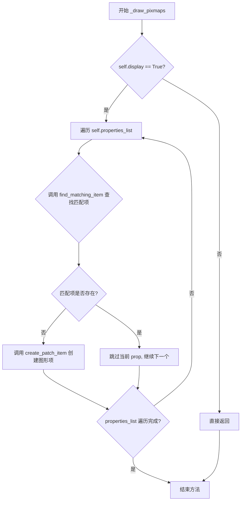
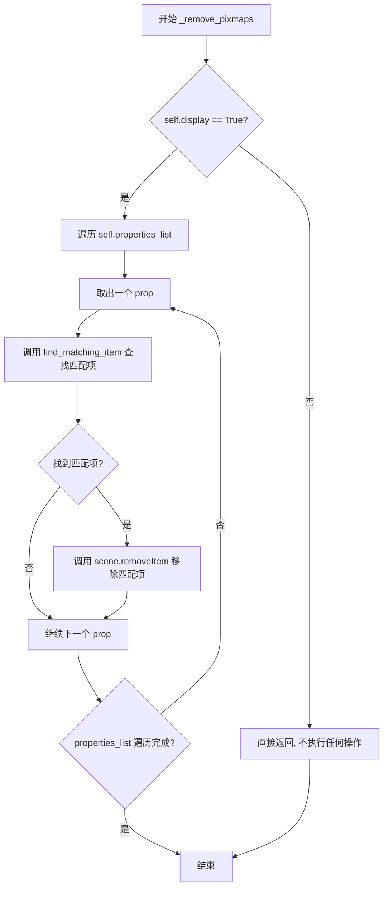
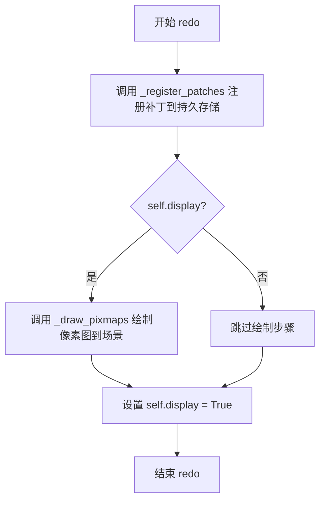
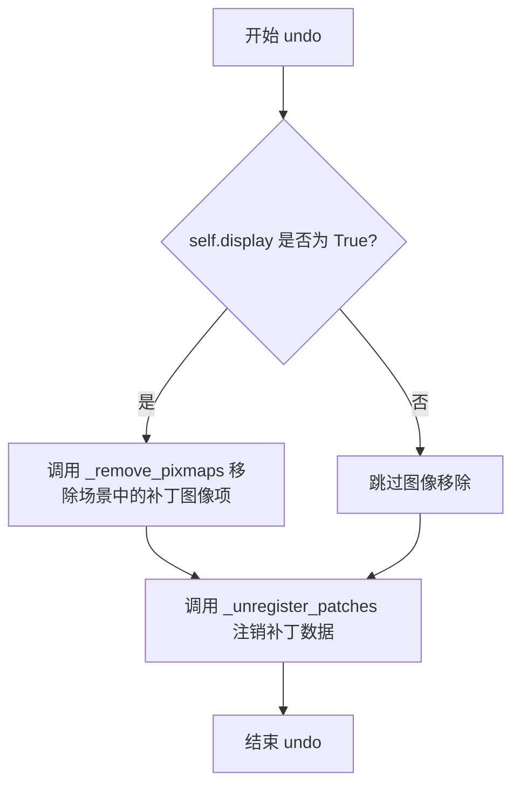

# `comic-translate\app\ui\commands\inpaint.py` 详细设计文档

一个基于PySide6 QUndoCommand的图像补丁插入命令类，支持单次inpaint调用生成的补丁组的插入、撤销和重做操作，具备去重机制和WebToon模式支持

## 整体流程



## 类结构

```
QUndoCommand (PySide6基类)
PatchCommandBase (自定义基类)
└── PatchInsertCommand (实现类)
```

## 全局变量及字段


### `os`
    
Python标准库模块，提供操作系统交互功能，如文件路径操作和目录创建

类型：`module`
    


### `hashlib`
    
Python标准库模块，提供SHA等哈希算法用于计算图像和边界框的复合哈希值

类型：`module`
    


### `uuid`
    
Python标准库模块，用于生成唯一的UUID标识符来命名临时补丁图像文件

类型：`module`
    


### `QUndoCommand`
    
PySide6库中的撤销/重做命令基类，提供命令模式支持

类型：`class`
    


### `PatchCommandBase`
    
自定义基类，定义补丁命令的公共方法和属性

类型：`class`
    


### `imk`
    
imkit自定义图像处理模块，用于读写图像文件

类型：`module`
    


### `PatchInsertCommand.ct`
    
主应用程序控制器对象，包含图像补丁存储和临时目录等应用状态

类型：`object`
    


### `PatchInsertCommand.viewer`
    
图像查看器对象，用于显示和管理场景中的补丁图像项

类型：`object`
    


### `PatchInsertCommand.scene`
    
Qt图形场景对象，用于管理和渲染补丁图像图元

类型：`QGraphicsScene`
    


### `PatchInsertCommand.file_path`
    
补丁所属的页面文件路径，作为存储和检索补丁的键值

类型：`str`
    


### `PatchInsertCommand.display`
    
布尔标志，控制是否在UI中显示补丁图像并加载到内存

类型：`bool`
    


### `PatchInsertCommand.properties_list`
    
补丁属性列表，每个元素包含边界框、图像路径、哈希值等补丁元数据

类型：`list[dict]`
    
    

## 全局函数及方法


### `PatchInsertCommand.__init__`

该方法是 `PatchInsertCommand` 类的构造函数，用于初始化一个插入补丁组的撤销命令。它接受上下文控制器、补丁列表、文件路径和显示标志作为参数，准备补丁属性列表（包括将图像写入临时PNG文件、计算复合哈希值用于去重），并继承 QUndoCommand 的撤销/重做功能。

参数：

- `ct`：上下文对象（类型未明确），包含图像查看器、场景、临时目录等资源的控制器
- `patches`：字典列表，每个字典包含 'bbox'（边界框）、'image'（图像数据）等补丁信息
- `file_path`：字符串，补丁所属的页面文件路径
- `display`：布尔值，默认为 True，控制是否将补丁加载到内存并显示在界面上

返回值：无（`None`），构造函数不返回值

#### 流程图

```mermaid
flowchart TD
    A[开始 __init__] --> B[调用父类构造函数<br/>设置命令描述为 'Insert patches']
    B --> C[保存参数到实例变量<br/>ct, viewer, scene, file_path, display]
    C --> D{遍历 patches 列表}
    D -->|对每个 patch| E[提取 bbox 和 image]
    E --> F[创建临时PNG目录<br/>os.makedirs]
    F --> G[生成唯一PNG文件路径<br/>使用 uuid]
    G --> H[将图像写入临时PNG文件<br/>imk.write_image]
    H --> I[读取PNG文件计算哈希]
    I --> J[计算复合哈希<br/>SHA256(image_bytes + bbox_bytes)]
    J --> K[构建属性字典 prop<br/>包含 bbox, png_path, hash]
    K --> L{检查可选字段<br/>scene_pos, page_index}
    L -->|有 scene_pos| M[添加到 prop]
    L -->|有 page_index| N[添加到 prop]
    M --> O[添加到 properties_list]
    N --> O
    O --> P{遍历结束?}
    P -->|否| D
    P -->|是| Q[结束 __init__]
```

#### 带注释源码

```python
def __init__(self, ct, patches, file_path, display=True):
    """
    构造函数：初始化插入补丁命令
    
    参数:
        ct: 上下文对象，包含图像查看器、场景、临时目录等
        patches: 补丁字典列表，每个包含 'bbox' 和 'image'
        file_path: 补丁所属的页面文件路径
        display: 是否在界面上显示补丁，默认为 True
    """
    # 调用父类 QUndoCommand 的构造函数，设置撤销命令的描述文本
    super().__init__("Insert patches")
    
    # 保存上下文控制器引用
    self.ct = ct
    # 从控制器获取图像查看器
    self.viewer = ct.image_viewer
    # 从查看器获取场景对象
    self.scene = self.viewer._scene
    # 保存文件路径（补丁所属的页面）
    self.file_path = file_path
    # 保存显示标志
    self.display = display

    # 准备补丁属性列表，用于去重
    self.properties_list = []
    
    # 遍历每个补丁
    for idx, patch in enumerate(patches):
        # 从补丁字典中提取边界框和图像数据
        bbox = patch['bbox']
        patch_img = patch['image']

        # 构建临时PNG存储目录路径
        # 格式: {temp_dir}/inpaint_patches/{basename of file_path}
        sub_dir = os.path.join(ct.temp_dir,
                               "inpaint_patches",
                               os.path.basename(file_path))
        # 确保目录存在，不存在则创建
        os.makedirs(sub_dir, exist_ok=True)
        
        # 生成唯一的PNG文件名，使用 uuid 的前8位和索引
        # 格式: patch_{uuid[:8]}_{idx}.png
        png_path = os.path.join(sub_dir, f"patch_{uuid.uuid4().hex[:8]}_{idx}.png")
        
        # 将图像补丁写入临时PNG文件（如果尚未在磁盘上）
        imk.write_image(png_path, patch_img)

        # 计算复合哈希值用于去重
        # 组合图像字节和边界框字符串的字节
        with open(png_path, 'rb') as f:
            img_bytes = f.read()
        bbox_bytes = str(bbox).encode('utf-8')
        # 使用 SHA256 计算复合哈希
        img_hash = hashlib.sha256(img_bytes + bbox_bytes).hexdigest()

        # 构建补丁属性字典
        prop = {
            'bbox': bbox,           # 边界框坐标
            'png_path': png_path,   # 临时PNG文件路径
            'hash': img_hash        # 复合哈希值用于去重
        }
        
        # 如果补丁包含场景位置信息，则添加到属性中（Webtoon模式）
        if 'scene_pos' in patch:
            prop['scene_pos'] = patch['scene_pos']
        # 如果补丁包含页面索引信息，则添加到属性中（Webtoon模式）
        if 'page_index' in patch:
            prop['page_index'] = patch['page_index']
            
        # 将属性字典添加到列表
        self.properties_list.append(prop)
```


### `PatchInsertCommand._register_patches`

该方法负责将当前命令持有的补丁属性列表注册到全局存储中，包括持久化的图像补丁存储和可选的内存补丁存储，同时通过复合哈希进行去重处理。

#### 参数

该方法无显式参数（仅使用 `self`）

#### 流程图



#### 带注释源码

```python
def _register_patches(self):
    """
    将当前命令的补丁属性注册到全局存储中。
    实现持久化存储和内存存储的双重管理，并进行哈希去重。
    """
    # 确保顶层存储结构存在，如果不存在则创建空列表
    # self.ct.image_patches 是一个字典，以 file_path 为键存储持久化补丁列表
    patches_list = self.ct.image_patches.setdefault(self.file_path, [])
    
    # 仅当需要显示时才初始化内存中的补丁列表
    # self.ct.in_memory_patches 用于存储当前可视区域加载的补丁数据
    if self.display:
        mem_list = self.ct.in_memory_patches.setdefault(self.file_path, [])

    # 遍历当前命令持有的所有补丁属性
    for prop in self.properties_list:
        # 通过复合哈希检查重复：相同哈希意味着相同的图像和边界框
        # 避免重复添加已存在的补丁到持久化存储
        if any(p['hash'] == prop['hash'] for p in patches_list):
            continue  # 跳过重复补丁

        # 构建持久化补丁条目，仅包含轻量级数据
        patch_entry = {
            'bbox': prop['bbox'],          # 补丁的边界框坐标
            'png_path': prop['png_path'],  # PNG 文件路径
            'hash': prop['hash']           # 复合哈希值用于去重和检索
        }
        
        # 保存 webtoon 模式的场景位置信息（如果存在）
        if 'scene_pos' in prop:
            patch_entry['scene_pos'] = prop['scene_pos']
        
        # 保存页索引信息（如果存在）
        if 'page_index' in prop:
            patch_entry['page_index'] = prop['page_index']
        
        # 将补丁条目添加到持久化列表
        patches_list.append(patch_entry)

        # 仅当需要显示时才将补丁加载到内存
        # 内存列表包含完整的图像数据，用于快速渲染
        if self.display:
            # 从磁盘读取 PNG 图像数据
            img_data = imk.read_image(prop['png_path'])
            # 构建内存补丁条目，包含实际图像数据
            mem_list.append({
                'bbox': prop['bbox'],
                'image': img_data,    # 完整的图像数据
                'hash': prop['hash']
            })
```


### `PatchInsertCommand._unregister_patches`

该方法用于撤销（Undo）操作时从持久化存储和内存中移除已注册的补丁，通过哈希值匹配来过滤删除对应的补丁条目。

参数：无（仅使用实例属性 `self.ct`、`self.file_path`、`self.display` 和 `self.properties_list`）

返回值：`None`，无返回值

#### 流程图



#### 带注释源码

```python
def _unregister_patches(self):
    """
    撤销注册操作：从持久化存储和内存中移除本命令添加的补丁
    通过复合哈希值匹配来识别和删除对应的补丁条目
    """
    
    # 从持久化存储中获取当前文件路径对应的补丁列表
    # 若不存在则返回空列表，避免 KeyError
    patches_list = self.ct.image_patches.get(self.file_path, [])
    
    # 仅当 display=True 时才处理内存中的补丁列表
    # 这样可以在不显示时减少内存开销
    if self.display:
        mem_list = self.ct.in_memory_patches.get(self.file_path, [])
    
    # 遍历本命令所包含的所有补丁属性
    for prop in self.properties_list:
        
        # 从持久化列表中移除哈希值匹配的补丁
        # 使用切片赋值 [:] 实现原地修改列表
        # 过滤掉 hash 等于当前 prop.hash 的所有条目
        patches_list[:] = [p for p in patches_list if p['hash'] != prop['hash']]
        
        # 仅在 display 模式下处理内存列表
        if self.display:
            # 同样方式从内存列表中移除匹配的补丁
            mem_list[:] = [p for p in mem_list if p['hash'] != prop['hash']]
```


### `PatchInsertCommand._draw_pixmaps`

该方法负责将新插入的 patch 可视化到 Qt 场景中，只有当 `display` 属性为 `True` 时才执行绘制操作。它遍历待处理的 patch 属性列表，对每个在场景中不存在对应图形项的 patch 调用创建方法将其添加到图像查看器中。

参数：无（仅包含隐式参数 `self`）

返回值：`None`，无返回值

#### 流程图



#### 带注释源码

```python
def _draw_pixmaps(self):
    # 检查 display 标志，只有在需要显示时才执行绘制
    if not self.display:
        return
    
    # 遍历所有待处理的 patch 属性
    for prop in self.properties_list:
        # 检查场景中是否已存在该 patch 对应的图形项
        # find_matching_item 是从 PatchCommandBase 继承的方法
        if not self.find_matching_item(self.scene, prop):
            # 如果不存在匹配项，则创建新的 patch 图形项并添加到 viewer
            self.create_patch_item(prop, self.viewer)
```


### `PatchInsertCommand._remove_pixmaps`

该方法是一个私有实例方法，用于在撤销操作时从场景中移除与当前命令已注册的补丁（patches）相关联的所有像素图（pixmap）项目。只有当 `display` 属性为 `True` 时才会执行移除操作。

参数：

- `self`：实例方法隐式参数，类型为 `PatchInsertCommand` 类的实例，指向当前命令对象本身

返回值：`None`，该方法无显式返回值，隐式返回 `None`

#### 流程图



#### 带注释源码

```python
def _remove_pixmaps(self):
    """
    从场景中移除与当前命令注册的补丁相关联的像素图项目。
    此方法仅在 display=True 时执行移除操作，用于支持撤销功能。
    """
    
    # 检查 display 标志：如果为 False，说明当前不需要在界面上显示补丁，
    # 因此也不需要执行任何移除操作，直接返回即可
    if not self.display:
        return
    
    # 遍历当前命令所管理的所有补丁属性列表
    # properties_list 在 __init__ 中构建，包含每个补丁的 bbox、png_path、hash 等信息
    for prop in self.properties_list:
        
        # 调用基类方法 find_matching_item 在场景中查找与当前补丁属性匹配的项目
        # 该方法会根据 hash、bbox 等信息在 scene 中寻找对应的 QGraphicsItem
        existing = self.find_matching_item(self.scene, prop)
        
        # 如果找到了匹配的项目，则从场景中移除该图形项
        # removeItem 是 QGraphicsScene 的方法，会将项目从场景中删除
        if existing:
            self.scene.removeItem(existing)
```


### `PatchInsertCommand.redo`

该方法是撤销/重做命令的核心实现，用于在用户触发重做操作时，将之前撤销的补丁组重新注册到系统中，并在界面上重新绘制对应的像素图，同时将显示状态标记为启用。

参数：此方法无显式参数（隐式参数`self`为类实例引用）

返回值：`None`，该方法无返回值，仅执行副作用操作

#### 流程图



#### 带注释源码

```python
def redo(self):
    """
    重做操作：重新应用之前撤销的补丁插入命令。
    
    该方法在用户触发Ctrl+Y或点击重做按钮时调用，
    会重新执行以下操作：
    1. 将补丁注册到持久化存储（image_patches）
    2. 如果display为True，则在场景中绘制像素图
    3. 更新display状态标志
    
    注意：此方法不考虑in_memory_patches的恢复，
    因为内存补丁的加载在_register_patches中根据display标志处理。
    """
    # 步骤1：将补丁注册到持久化存储
    # 包括更新image_patches字典，并可选地加载到内存缓存
    self._register_patches()
    
    # 步骤2：如果处于显示模式，则在Qt场景中绘制补丁的像素图
    # _draw_pixmaps内部会检查self.display标志
    self._draw_pixmaps()
    
    # 步骤3：确保display标志被设置为True
    # 这是为了保持状态一致性，确保后续undo操作能够正确执行
    self.display = True
```


### `PatchInsertCommand.undo`

该方法实现撤销插入补丁的命令，主要功能是移除当前视图中的补丁图像显示，并从持久化存储和内存中注销之前注册的补丁数据。

参数： 无

返回值：`None`，无返回值（该方法通过副作用完成撤销操作）

#### 流程图



#### 带注释源码

```python
def undo(self):
    """
    撤销补丁插入操作。
    1. 先移除场景中显示的补丁图像（如果display=True）
    2. 再从持久化和内存存储中注销补丁数据
    """
    # 步骤1：移除显示的补丁图像项
    # 仅当display=True时才执行图形移除操作
    self._remove_pixmaps()
    
    # 步骤2：从注册表中注销补丁数据
    # 从image_patches持久化存储和in_memory_patches内存存储中移除
    self._unregister_patches()
```


## 关键组件


### PatchInsertCommand

主命令类，继承自QUndoCommand和PatchCommandBase，用于插入单个patch组（由一次inpaint调用创建的补丁），支持完整的撤销/重做和序列化功能。

### 复合哈希去重机制

通过计算图像内容和边界框的组合哈希（SHA256）实现补丁去重，避免重复存储相同的补丁数据。

### 惰性加载支持

仅在display=True时将图像数据加载到内存（in_memory_patches），否则仅保存文件路径引用，实现按需加载节省内存。

### Webtoon模式支持

通过scene_pos和page_index字段保存补丁在场景中的位置信息和页码，支持Webtoon模式的分页和定位需求。

### 临时文件管理

自动将补丁图像 spill 到临时PNG文件，使用UUID确保文件名唯一，按文件路径组织目录结构便于管理。

### 持久化存储架构

通过image_patches字典持久化存储补丁元数据（bbox、png_path、hash），支持跨会话的数据保持。


## 问题及建议


### 已知问题

-   **临时文件泄漏**：每次插入补丁都会在temp_dir下创建新的PNG文件，但从不清理这些临时文件，即使undo后也不会删除，导致temp_dir无限膨胀
-   **低效的哈希计算**：在`__init__`中先写入PNG文件，再读取整个文件内容计算哈希，应该在写入前对图像数据计算哈希以避免额外的IO操作
-   **重复代码**：`scene_pos`和`page_index`字段的添加逻辑在`__init__`方法和`_register_patches`方法中重复出现
-   **异常处理缺失**：文件读写操作（`open`、`imk.write_image`、`imk.read_image`）没有任何try-except保护，可能导致程序崩溃
-   **`display`参数不一致**：`redo()`方法中硬编码`self.display = True`，这可能覆盖构造函数中传入的原始display值，导致undo后重新redo时的行为不符合预期
-   **去重检查效率低**：使用`any(p['hash'] == prop['hash'] for p in patches_list)`进行去重，时间复杂度为O(n)，当补丁数量增多时性能下降明显
-   **内存泄漏风险**：`undo`时只从列表中移除数据，但没有释放已经加载到内存的图像数据（`mem_list`中的`image`字段）
-   **缺少资源清理**：没有实现`__del__`方法或上下文管理器来确保临时文件或资源的清理

### 优化建议

-   **实现临时文件清理机制**：在`_unregister_patches`或专门的清理方法中删除对应的PNG文件，或添加定时清理任务
-   **优化哈希计算流程**：在调用`imk.write_image`前对`patch_img`数据直接计算哈希，避免先写再读的开销
-   **提取公共逻辑**：将`scene_pos`和`page_index`的添加逻辑提取为单独的方法或使用字典合并的方式
-   **添加异常处理**：为所有文件IO操作添加try-except，捕获并合理处理可能的异常情况
-   **修复display参数行为**：在redo中不要覆盖display值，或明确记录display状态的意图
-   **使用集合或字典优化去重**：将patches_list转换为以hash为key的字典结构，将去重检查优化至O(1)
-   **显式释放内存**：在从mem_list移除时，显式删除图像数据或使用weakref
-   **添加资源管理协议**：考虑实现`__del__`或context manager协议，确保资源被正确释放


## 其它


### 设计目标与约束

**设计目标**：
- 实现单个命令插入一组补丁（由单次inpaint调用创建的补丁），支持完整的撤销/重做功能
- 通过复合哈希（图像哈希+边界框哈希）实现补丁去重
- 支持将补丁持久化到磁盘（PNG格式）并可选地加载到内存中显示
- 支持WebToon模式的场景位置和页面索引信息

**约束条件**：
- 依赖PySide6的QUndoCommand框架实现命令模式
- 补丁必须以PNG格式保存到临时目录
- 去重逻辑基于SHA256哈希值，需要保证哈希计算的确定性
- 仅在display=True时才会加载图像到内存和绘制到场景

### 错误处理与异常设计

**异常处理场景**：
- **文件系统异常**：创建临时目录失败、写入PNG文件失败、读取PNG文件失败
  - 处理方式：使用os.makedirs的exist_ok=True避免重复创建，文件操作使用try-except捕获IOError
- **哈希计算异常**：读取图像文件失败导致哈希计算中断
  - 处理方式：在哈希计算前确保文件已成功写入，使用with open确保文件句柄正确关闭
- **数据结构异常**：ct.image_patches或ct.in_memory_patches字典访问失败
  - 处理方式：使用setdefault确保顶层存储存在，使用get提供默认值
- **场景操作异常**：查找匹配项失败、添加/移除项目失败
  - 处理方式：使用条件判断检查find_matching_item返回值，removeItem前检查item是否存在

### 数据流与状态机

**数据流**：
1. **输入数据流**：
   - ct（上下文对象）：包含temp_dir、image_patches、in_memory_patches、image_viewer
   - patches（补丁列表）：每个补丁包含bbox、image、scene_pos（可选）、page_index（可选）
   - file_path：页面路径标识
   - display：是否显示标志

2. **处理数据流**：
   - 补丁图像 → 临时PNG文件 → 读取字节 → SHA256哈希 + bbox字节 → 复合哈希
   - 哈希 + bbox + png_path → properties_list → patches_list（持久存储）/ mem_list（内存存储）
   - 内存中的图像数据 → 场景项 → 场景绘制

3. **输出数据流**：
   - 持久存储：ct.image_patches[file_path]列表
   - 内存存储：ct.in_memory_patches[file_path]列表（仅display=True）
   - 视觉输出：场景中的补丁项（仅display=True）

**状态机**：
- **初始状态**：properties_list为空，未注册未绘制
- **执行状态（redo）**：调用_register_patches注册到存储，调用_draw_pixmaps绘制到场景
- **回退状态（undo）**：调用_remove_pixmaps从场景移除，调用_unregister_patches从存储移除

### 外部依赖与接口契约

**直接依赖**：
- `os`：目录创建、路径操作
- `hashlib`：SHA256哈希计算
- `uuid`：生成唯一文件名
- `PySide6.QtGui.QUndoCommand`：命令基类
- `imkit (imk)`：图像读写操作（write_image, read_image）

**内部依赖**：
- `PatchCommandBase`：基类，提供find_matching_item、create_patch_item方法
- `ct.image_viewer`：图像查看器对象
- `ct.image_viewer._scene`：Qt图形场景
- `ct.temp_dir`：临时目录路径
- `ct.image_patches`：持久补丁存储字典
- `ct.in_memory_patches`：内存补丁存储字典

**接口契约**：
- `ct`对象必须包含：temp_dir（str）、image_patches（dict）、in_memory_patches（dict）、image_viewer（对象，含_scene属性）
- `patches`列表元素必须包含：bbox（tuple/list）、image（图像数据）
- 可选字段：scene_pos、page_index（用于WebToon模式）
- `file_path`应为字符串，表示补丁所属页面
- `display`为布尔值，控制是否加载到内存和绘制

### 性能考虑

**性能优化点**：
- 复合哈希计算：在写入PNG后立即读取字节计算哈希，避免重复IO
- 去重检查：使用生成器表达式和any()进行惰性求值，找到第一个匹配即停止
- 列表过滤：使用列表推导式[:]进行原地过滤，避免创建新列表

**潜在性能问题**：
- 大图像补丁：每个补丁都保存完整PNG到磁盘，可能占用大量临时存储空间
- 内存占用：display=True时所有补丁图像都会加载到内存，大图像列表可能导致内存压力
- 重复哈希：每次redo都会重新计算哈希（虽然文件已存在），可以考虑缓存

### 安全性考虑

**安全风险**：
- **路径遍历**：file_path直接用于os.path.join，可能存在路径遍历风险
- **临时文件竞争**：使用uuid生成唯一文件名避免并发写入冲突
- **哈希碰撞**：SHA256碰撞概率极低，安全性可接受

**缓解措施**：
- 使用uuid.uuid4().hex[:8]确保临时文件名唯一
- 临时文件存放在ct.temp_dir指定的隔离目录
- 不执行file_path的用户输入直接作为路径组件

### 并发与线程安全

**并发考量**：
- Qt UI操作通常在主线程执行，Undo/Redo命令通过QUndoStack串行执行
- 文件系统操作（写入PNG）可能造成IO阻塞，建议在后台线程执行
- ct.image_patches和ct.in_memory_patches的读写操作未加锁，存在潜在竞态条件

**建议**：
- 如果在多线程环境使用，应对patches字典的操作加锁
- 文件IO操作可考虑异步化以保持UI响应性

### 配置与扩展性

**可配置项**：
- 临时目录路径：通过ct.temp_dir传入
- 补丁文件命名：uuid.hex[:8]长度可调整
- PNG质量：imk.write_image的压缩参数（当前使用默认参数）

**扩展点**：
- **新的去重策略**：可重写哈希计算逻辑支持不同去重策略
- **新的存储后端**：可扩展_register_patches支持数据库存储
- **新的渲染方式**：可重写_draw_pixmaps支持不同渲染方式

### 测试策略

**单元测试**：
- 测试哈希计算的唯一性和确定性
- 测试去重逻辑正确跳过重复补丁
- 测试redo/undo的状态一致性

**集成测试**：
- 测试与QUndoStack的完整交互
- 测试临时文件正确创建和清理
- 测试多页面补丁隔离

**边界测试**：
- 空patches列表
- 重复patches列表
- display=False的行为
- file_path为新路径和已存在路径

### 部署与运维

**运维考量**：
- 临时文件清理：代码未包含临时文件清理机制，建议在应用退出时或定期清理ct.temp_dir/inpaint_patches目录
- 日志记录：缺少操作日志，可添加日志记录redo/undo操作
- 监控：可监控临时目录大小和补丁数量

**部署要求**：
- Python 3.x环境
- PySide6依赖
- imkit模块正确安装
- 临时目录具有写入权限


    