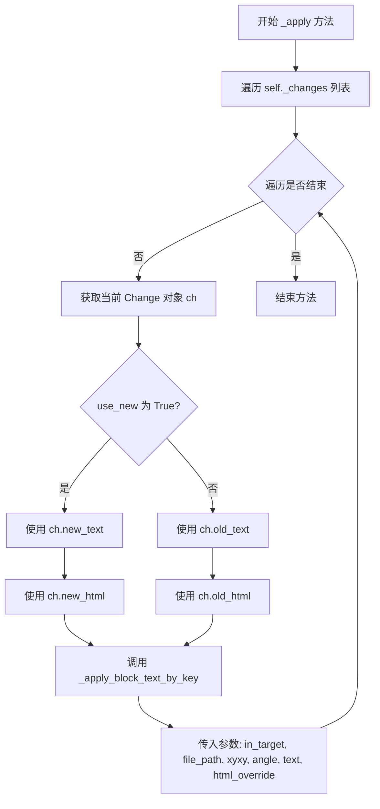
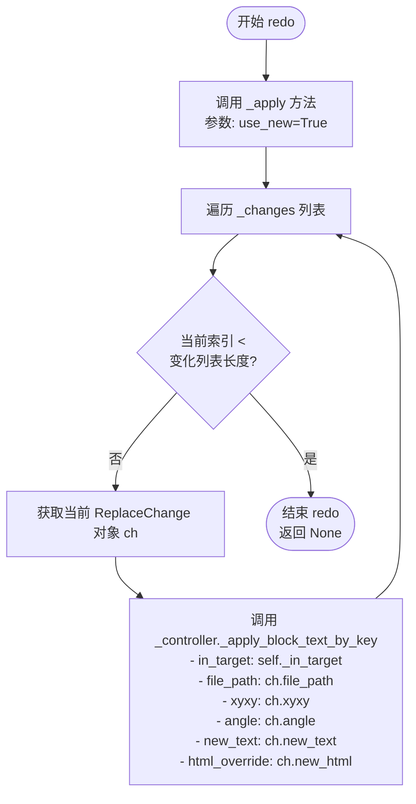
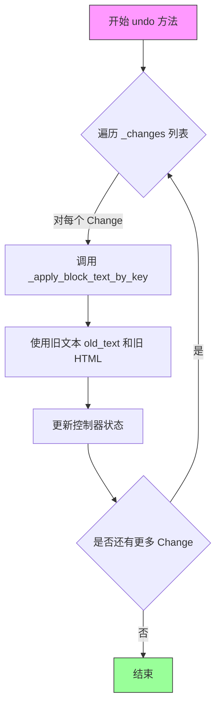

# `comic-translate\app\ui\commands\search_replace.py` 详细设计文档

这是一个PySide6 QtUndoCommand实现，用于管理文本块替换的撤销和重做操作。通过ReplaceChange数据类存储单个替换的详细信息（包括文件路径、坐标、角度、文本内容等），ReplaceBlocksCommand类封装了_apply、redo和undo方法来执行和回滚文本替换操作，支持对目标或源内容进行精确的文本块替换。

## 整体流程

```mermaid
graph TD
    A[开始] --> B[用户触发替换操作]
B --> C[创建ReplaceBlocksCommand实例]
C --> D[初始化_replace_blocks_command对象]
D --> E{用户执行redo?}
E -- 是 --> F[调用redo方法]
E -- 否 --> G{用户执行undo?}
G -- 是 --> H[调用undo方法]
F --> I[调用_apply(True)应用新文本]
H --> J[调用_apply(False)应用旧文本]
I --> K[遍历所有changes]
J --> K
K --> L[_controller._apply_block_text_by_key]
L --> M[完成替换]
```

## 类结构

```
ReplaceChange (数据类)
ReplaceBlocksCommand (QUndoCommand子类)
└── 方法: __init__, _apply, redo, undo
```

## 全局变量及字段


### `ReplaceChange.file_path`
    
文件路径

类型：`str`
    


### `ReplaceChange.xyxy`
    
坐标元组(x1,y1,x2,y2)

类型：`tuple[int, int, int, int]`
    


### `ReplaceChange.angle`
    
旋转角度

类型：`float`
    


### `ReplaceChange.old_text`
    
原始文本内容

类型：`str`
    


### `ReplaceChange.new_text`
    
新文本内容

类型：`str`
    


### `ReplaceChange.old_html`
    
原始HTML内容(可选)

类型：`str | None`
    


### `ReplaceChange.new_html`
    
新HTML内容(可选)

类型：`str | None`
    


### `ReplaceBlocksCommand._controller`
    
控制器实例

类型：`未标注`
    


### `ReplaceBlocksCommand._in_target`
    
是否在目标上操作

类型：`bool`
    


### `ReplaceBlocksCommand._changes`
    
替换变更列表

类型：`list[ReplaceChange]`
    
    

## 全局函数及方法


### `ReplaceBlocksCommand.__init__`

初始化撤销命令，用于管理文本块替换的撤销/重做操作。该类是 Qt 撤销框架的一部分，允许用户撤销或重做对文本块的替换操作。

参数：

- `controller`：无类型标注（根据代码推断为控制器对象），负责执行实际的文本块应用操作
- `in_target`：`bool`，指示替换操作应用于目标还是源
- `changes`：`list[ReplaceChange]`，包含所有需要替换的更改记录列表
- `text`：`str | None`，可选的命令显示文本

返回值：`None`（`__init__` 方法无返回值）

#### 流程图

```mermaid
flowchart TD
    A[开始 __init__] --> B[调用 super().__init__ 初始化基类]
    B --> C[存储 controller 到 self._controller]
    C --> D[将 in_target 转换为布尔值并存储到 self._in_target]
    D --> E[存储 changes 到 self._changes]
    E --> F{text 参数是否存在?}
    F -->|是| G[调用 setText 设置自定义文本]
    F -->|否| H[调用 setText 设置默认文本 'replace_text']
    G --> I[结束]
    H --> I
```

#### 带注释源码

```python
def __init__(
    self,
    controller,
    *,
    in_target: bool,
    changes: list[ReplaceChange],
    text: str | None = None,
):
    """
    初始化撤销命令
    
    参数:
        controller: 控制器对象，用于执行实际的文本应用操作
        in_target: 指示操作目标（True=目标，False=源）
        changes: ReplaceChange 对象列表，包含所有待替换的更改
        text: 可选的命令描述文本，用于 UI 显示
    """
    # 调用 QUndoCommand 基类的初始化方法
    super().__init__()
    
    # 保存控制器引用，用于后续 redo/undo 时调用具体操作方法
    self._controller = controller
    
    # 强制转换为布尔值，确保类型安全
    self._in_target = bool(in_target)
    
    # 保存更改列表，包含每个文本块的新旧值和位置信息
    self._changes = changes
    
    # 设置命令的显示文本，用于撤销栈 UI 显示
    if text:
        self.setText(text)
    else:
        # 提供默认文本，提升用户体验
        self.setText("replace_text")
```


### `ReplaceBlocksCommand._apply`

这是一个私有方法，用于在撤销/重做操作中应用文本块替换。该方法遍历所有待处理的替换更改，根据 `use_new` 参数选择使用新文本还是旧文本，然后通过控制器对象应用这些更改到指定的文件和区域。

参数：

- `use_new`：`bool`，布尔值参数，指示应用新文本还是旧文本。当值为 `True` 时表示重做操作（使用新文本），当值为 `False` 时表示撤销操作（使用旧文本）

返回值：`None`，该方法没有返回值，仅执行副作用操作（修改控制器状态）

#### 流程图



#### 带注释源码

```python
def _apply(self, use_new: bool):
    """
    应用文本替换的内部方法。

    该方法根据 use_new 参数决定使用新文本还是旧文本，
    用于支持 QUndoCommand 的 redo/undo 功能。

    参数:
        use_new: bool - True 表示应用新文本（redo 操作），
                   False 表示应用旧文本（undo 操作）
    """
    # 遍历所有待处理的替换更改
    for ch in self._changes:
        # 根据 use_new 参数选择使用新文本还是旧文本
        # 同时选择对应的 HTML 覆盖值
        self._controller._apply_block_text_by_key(
            in_target=self._in_target,      # 是否在目标中应用
            file_path=ch.file_path,         # 文件路径
            xyxy=ch.xyxy,                   # 区域坐标 (x1, y1, x2, y2)
            angle=ch.angle,                 # 旋转角度
            # 三元表达式：根据 use_new 选择新文本或旧文本
            new_text=ch.new_text if use_new else ch.old_text,
            # 三元表达式：根据 use_new 选择新 HTML 或旧 HTML
            html_override=ch.new_html if use_new else ch.old_html,
        )
```


### `ReplaceBlocksCommand.redo`

重做命令，用于将文本块替换操作应用到最新状态（使用新文本）。

参数：

- （无）

返回值：`None`，无返回值描述

#### 流程图



#### 带注释源码

```python
def redo(self):
    """
    重做操作，将所有文本块替换为新文本。
    
    该方法继承自 QUndoCommand，是撤销/重做机制的核心部分。
    当用户触发重做操作时，Qt 调用此方法来将文档状态向前移动。
    """
    # 调用内部_apply方法，传入True表示使用新文本（new_text/new_html）
    # 这会将所有保存的ReplaceChange应用到文档中
    self._apply(True)
```


### `ReplaceBlocksCommand.undo`

该方法用于撤销上一次的文本块替换操作，通过调用内部方法 `_apply` 并传入 `False` 参数，使控制器恢复为替换前的旧文本状态。

参数：
- 该方法无显式参数（隐式参数 `self` 为类实例自身）

返回值：`None`，该方法直接修改对象状态，不返回任何值

#### 流程图



#### 带注释源码

```python
def undo(self):
    """
    撤销上一次的文本块替换操作。
    
    该方法通过调用 _apply 方法并传入 False 参数，
    使得控制器使用旧的文本内容（old_text）而不是新的文本内容（new_text），
    从而恢复到替换前的状态。
    
    此方法对应 QUndoCommand 的 undo 接口，
    当用户触发撤销操作时由 Qt 框架调用。
    """
    self._apply(False)
```

---

### 补充文档信息

#### 类整体描述

`ReplaceBlocksCommand` 是基于 Qt 撤销框架（QUndoCommand）的命令类，用于封装文本块替换操作。该类支持重做（redo）和撤销（undo）功能，通过存储替换前后的文本状态，实现对批量文本块替换操作的历史管理。

#### 关键组件信息

| 组件名称 | 描述 |
|---------|------|
| ReplaceChange | 数据类，存储单个文件路径、坐标区域、旋转角度、替换前后文本及HTML的完整信息 |
| _controller | 核心控制器对象，负责实际的文本块应用操作 |
| _changes | ReplaceChange 对象列表，记录本次操作涉及的所有文本块变更 |
| _in_target | 布尔标志，指示操作目标是主对象还是目标对象 |
| _apply | 内部方法，根据参数决定应用新文本还是旧文本 |

#### 潜在技术债务与优化空间

1. **错误处理缺失**：`_apply_block_text_by_key` 方法调用缺乏异常捕获机制，若文件不存在或坐标无效可能导致程序崩溃
2. **状态验证不足**：未验证 `changes` 列表是否为空的边界情况
3. **性能考虑**：每次 undo 都遍历整个 `_changes` 列表，对于大量变更场景可考虑增量更新
4. **类型注解不完整**：部分参数（如 `controller`）缺少类型注解

#### 其它项目

**设计目标与约束：**
- 遵循 Qt 撤销/重做命令模式
- 支持批量文本块替换操作
- 支持文本和 HTML 两种格式的替换

**错误处理与异常设计：**
- 当前版本未实现异常处理，依赖上层调用者保证数据有效性

**数据流与状态机：**
```
初始化 --> redo() [应用新文本] --> 用户触发撤销 --> undo() [恢复旧文本]
```


## 关键组件


### ReplaceChange

用于存储文本替换变更信息的数据类，包含文件路径、坐标、角度、旧文本、新文本及对应的HTML内容。

### ReplaceBlocksCommand

实现Qt撤销/重做框架的命令类，负责批量替换文本块，支持undo/redo操作。

### _apply 方法

核心变更应用逻辑，根据use_new参数决定应用新文本或旧文本，遍历所有变更并调用控制器的_apply_block_text_by_key方法。

### redo 方法

重做操作，调用_apply(True)应用新文本。

### undo 方法

撤销操作，调用_apply(False)恢复旧文本。

### QUndoCommand 集成

继承Qt的QUndoCommand类，实现标准的撤销/重做接口，支持在UI中显示命令描述文本。


## 问题及建议


### 已知问题

-   **封装性违规**：直接访问 `controller._apply_block_text_by_key` 私有方法，违反了封装原则，若 controller 内部实现变化，此代码会失效
-   **错误处理缺失**：`_apply` 方法中没有异常捕获和错误处理机制，一旦 `_apply_block_text_by_key` 失败，整个撤销/重做操作会中断
-   **不可变性问题**：`ReplaceChange` 使用 `frozen=True`，但 `xyxy` 是可变的 `tuple` 类型，可能导致哈希和比较问题
-   **类型注解不完整**：`_controller` 参数缺少类型注解，`controller` 应该是某种特定类型而非任意对象
-   **硬编码文本**：默认文本 "replace_text" 硬编码在代码中，缺乏国际化支持
-   **性能隐患**：当 `changes` 列表很大时，`_apply` 方法会同步遍历所有变更，没有分批处理或进度反馈机制

### 优化建议

-   **重构私有访问**：通过 controller 提供的公共接口访问替换逻辑，或使用受保护的方法而非双下划线私有方法
-   **添加错误处理**：在 `_apply` 方法中捕获异常，收集失败项，提供部分成功的能力，并在重做/撤销时报告错误
-   **类型完善**：为 `controller` 参数添加明确的类型注解（如 `ReplaceBlocksController`），或使用 Protocol/ABC 定义接口
-   **国际化支持**：将硬编码文本提取为常量或使用翻译函数
-   **批量处理优化**：对于大量变更，考虑分批应用或添加异步处理机制
-   **验证输入**：在 `__init__` 中添加对 `changes` 列表的验证，确保非空且元素类型正确
-   **文档完善**：为 `angle` 字段和 `xyxy` 含义添加文档说明，提高代码可读性


## 其它


### 设计目标与约束

本代码的设计目标是为文本块替换操作提供撤销/重做功能，支持在目标和非目标模式下应用变更。约束条件包括：ReplaceChange必须是不可变对象以确保撤销栈的安全性；_controller对象必须实现_apply_block_text_by_key方法；所有文本替换操作都是同步的，不支持异步执行。

### 错误处理与异常设计

代码中未实现显式的异常处理机制。潜在的错误场景包括：1) _controller为None或未实现所需方法时会导致属性错误；2) file_path指向不存在的文件时底层文件操作可能抛出异常；3) xyxy坐标无效时可能产生边界错误。建议在_apply方法中添加try-except块处理可能的异常，并提供错误日志记录机制。

### 数据流与状态机

数据流主要分为三个阶段：初始化阶段创建ReplaceChange对象列表存储变更数据；执行阶段通过redo()方法将新文本应用到目标；回滚阶段通过undo()方法恢复旧文本。状态转换遵循QUndoCommand的标准模式：初始状态 -> redo状态(新文本) <-> undo状态(旧文本)。ReplaceChange作为不可变数据载体确保了状态的可追溯性。

### 外部依赖与接口契约

主要外部依赖为PySide6.QtGui.QUndoCommand基类，提供了撤销/重做框架。_controller对象必须满足以下接口契约：1) 包含_apply_block_text_by_key方法；2) 该方法接受in_target(bool)、file_path(str)、xyxy(tuple[int,int,int,int])、angle(float)、new_text(str)、html_override(str|None)参数。建议添加类型注解或接口协议定义以明确契约。

### 线程安全性

代码本身不包含线程同步机制，在多线程环境下直接操作同一个ReplaceBlocksCommand实例可能导致竞态条件。_controller的_apply_block_text_by_key方法如果非线程安全，则整个命令执行过程都存在线程安全隐患。建议在并发场景下使用锁保护或设计线程安全的命令队列。

### 性能考虑

性能瓶颈可能出现在：1) changes列表过大时的批量处理；2) 每次redo/undo都遍历完整变更列表；3) 底层文件IO操作阻塞主线程。优化方向包括：批量操作的进度反馈机制、大变更列表的惰性加载策略、将耗时操作移至后台线程。

### 使用示例

```python
# 创建变更记录
change = ReplaceChange(
    file_path="/path/to/file.txt",
    xyxy=(10, 20, 100, 200),
    angle=0.0,
    old_text="old content",
    new_text="new content"
)

# 创建撤销命令
command = ReplaceBlocksCommand(
    controller=some_controller,
    in_target=True,
    changes=[change],
    text="替换文本块"
)

# 执行撤销/重做
undo_stack.push(command)
command.redo()  # 应用新文本
command.undo()  # 回滚到旧文本
```


    