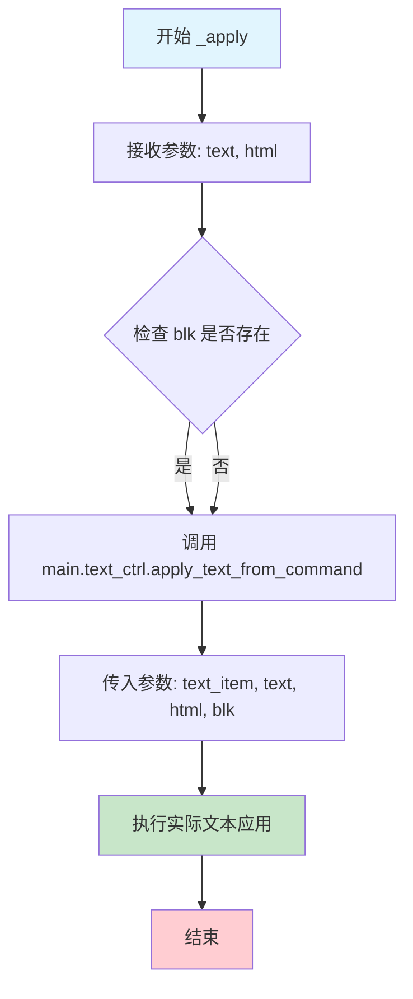
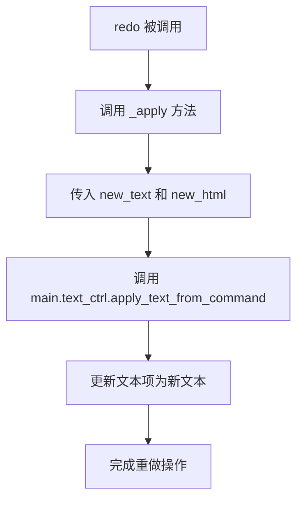
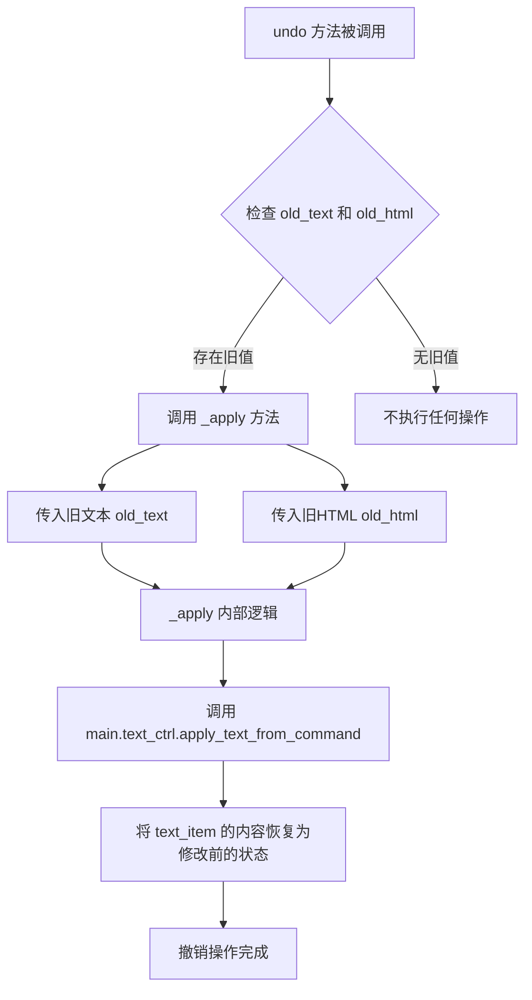

# `comic-translate\app\ui\commands\text_edit.py` 详细设计文档

这是一个基于 PySide6 QUndoCommand 的撤销/重做命令类，用于记录文本编辑操作的历史状态，支持撤销和重做功能，能够保存文本的旧值和新值，并通过主控制器的文本应用方法实现操作的回滚和重演。

## 整体流程

```mermaid
graph TD
    A[创建 TextEditCommand] --> B[初始化：保存 old_text, new_text, old_html, new_html]
    B --> C{用户触发 redo}
    B --> D{用户触发 undo}
    C --> E[调用 redo()]
    D --> F[调用 undo()]
    E --> G[_apply(new_text, new_html)]
    F --> H[_apply(old_text, old_html)]
    G --> I[main.text_ctrl.apply_text_from_command]
    H --> I
    I --> J[更新 UI 文本显示]
```

## 类结构

```
QUndoCommand (Qt 抽象基类)
└── TextEditCommand (自定义撤销命令实现)
```

## 全局变量及字段


### `TextEditCommand.main`
    
主窗口/控制器对象，用于访问text_ctrl

类型：`MainWindow/MainController`
    


### `TextEditCommand.text_item`
    
文本项对象，表示需要修改的文本项

类型：`TextItem/Block`
    


### `TextEditCommand.old_text`
    
旧文本内容，用于撤销操作

类型：`str`
    


### `TextEditCommand.new_text`
    
新文本内容，用于重做操作

类型：`str`
    


### `TextEditCommand.old_html`
    
旧HTML内容，用于撤销时恢复富文本格式

类型：`str|None`
    


### `TextEditCommand.new_html`
    
新HTML内容，用于重做时应用富文本格式

类型：`str|None`
    


### `TextEditCommand.blk`
    
块对象(可选)，用于标识文本所属的块

类型：`Block|None`
    
    

## 全局函数及方法


### `TextEditCommand.__init__`

该方法是 `TextEditCommand` 类的构造函数，用于初始化撤销/重做命令对象，保存编辑前后的文本和HTML内容，以便后续执行撤销（undo）和重做（redo）操作。

参数：

- `self`：隐式参数，当前实例对象
- `main`：`MainController`（或类似类型），主控制器对象，用于调用文本应用方法
- `text_item`：`TextItem`（或类似类型），文本项对象，表示需要编辑的文本项
- `old_text`：`str`，编辑前的旧文本内容
- `new_text`：`str`，编辑后的新文本内容
- `old_html`：`str | None`，编辑前的旧HTML内容（可选，默认为 None）
- `new_html`：`str | None`，编辑后的新HTML内容（可选，默认为 None）
- `blk`：`Any | None`，块标识符，用于标识文本块（可选，默认为 None）

返回值：`None`，构造函数无返回值

#### 流程图

```mermaid
flowchart TD
    A[开始 __init__] --> B[调用 super().__init__ 初始化基类 QUndoCommand]
    --> C[保存 main 引用到实例]
    --> D[保存 text_item 引用到实例]
    --> E[保存 old_text 到实例]
    --> F[保存 new_text 到实例]
    --> G[保存 old_html 到实例]
    --> H[保存 new_html 到实例]
    --> I[保存 blk 到实例]
    --> J[结束 __init__]
```

#### 带注释源码

```python
def __init__(self, main, text_item, old_text: str, new_text: str,
             old_html: str | None = None, new_html: str | None = None, blk=None):
    """
    初始化 TextEditCommand 命令对象
    
    参数:
        main: 主控制器对象，用于后续调用 apply_text_from_command
        text_item: 需要编辑的文本项对象
        old_text: 编辑前的旧文本内容
        new_text: 编辑后的新文本内容
        old_html: 编辑前的旧HTML内容（可选）
        new_html: 编辑后的新HTML内容（可选）
        blk: 文本块标识符（可选）
    """
    # 调用父类 QUndoCommand 的初始化方法
    super().__init__()
    
    # 保存主控制器引用，用于后续执行撤销/重做时调用文本应用方法
    self.main = main
    
    # 保存文本项引用，标识需要修改哪个文本项
    self.text_item = text_item
    
    # 保存旧文本内容，用于撤销操作
    self.old_text = old_text
    
    # 保存新文本内容，用于重做操作
    self.new_text = new_text
    
    # 保存旧HTML内容（可选），用于保留文本的富文本格式信息
    self.old_html = old_html
    
    # 保存新HTML内容（可选），用于保留文本的富文本格式信息
    self.new_html = new_html
    
    # 保存块标识符，用于标识文本所属的块
    self.blk = blk
```


### `TextEditCommand._apply`

将指定的文本和HTML内容应用到文本项的私有方法。该方法充当命令模式的核心执行逻辑，通过调用主控制器的`apply_text_from_command`方法来完成实际的数据变更操作，支持撤销/重做机制中的文本替换功能。

参数：

- `text`：`str`，需要应用的文本内容
- `html`：`str | None`，可选的HTML格式文本，用于富文本场景

返回值：`None`，该方法直接修改文本项状态，无返回值

#### 流程图



#### 带注释源码

```python
def _apply(self, text: str, html: str | None):
    """
    将指定的文本应用到文本项
    
    参数:
        text: str - 要应用的文本内容
        html: str | None - 可选的HTML格式文本
    
    返回:
        None - 直接修改内部状态，无返回值
    """
    # 通过主控制器调用文本应用方法
    # 传递文本项、文本内容、HTML内容以及块引用
    self.main.text_ctrl.apply_text_from_command(
        self.text_item,  # 目标文本项
        text,            # 要应用的文本
        html=html,       # HTML格式（可选）
        blk=self.blk     # 块引用用于状态追踪
    )
```


### `TextEditCommand.redo`

重做方法，在撤销栈中执行重做操作时调用，将文本编辑操作恢复到新文本状态。

参数：此方法无显式参数（继承自 `QUndoCommand` 的标准接口）。

返回值：`None`，无返回值。

#### 流程图



#### 带注释源码

```python
def redo(self):
    """
    重做操作。
    
    当用户触发重做（Ctrl+Y）或从撤销栈中执行时调用此方法。
    它应用存储的新文本（new_text）和新HTML格式（new_html），
    将文档状态恢复到执行此命令之后的状态。
    
    该方法是 QUndoCommand 接口的必须实现方法，
    与 undo() 方法配对使用以支持撤销/重做功能。
    """
    self._apply(self.new_text, self.new_html)
```


### `TextEditCommand.undo`

该方法是 QUndoCommand 的撤销操作实现，通过调用内部方法 `_apply` 将文本内容恢复为修改前的旧文本（old_text）和旧HTML（old_html），实现编辑操作的撤销功能。

参数：

- 无显式参数（隐含 `self` 引用）

返回值：`None`，无返回值描述

#### 流程图



#### 带注释源码

```python
def undo(self):
    """
    撤销操作：将文本内容恢复到修改前的状态
    
    该方法重写了 QUndoCommand 的 undo 抽象方法，
    当用户触发撤销操作时会被自动调用。
    """
    # 调用内部方法 _apply，传入旧文本和旧HTML
    # _apply 方法会通过 main.text_ctrl.apply_text_from_command
    # 将 text_item 的内容恢复为 old_text 和 old_html
    self._apply(self.old_text, self.old_html)
```


## 关键组件


### TextEditCommand

文本编辑撤销/重做命令类，封装文本编辑的前后状态（文本和HTML），通过QUndoCommand机制实现编辑操作的撤销与重做。

### 构造函数参数 (old_text, new_text, old_html, new_html)

存储编辑前后的文本状态，用于在撤销和重做时恢复相应的文本内容，支持纯文本和富文本HTML两种格式。

### _apply方法

核心文本应用方法，接收文本和HTML参数，调用main.text_ctrl.apply_text_from_command将文本实际应用到目标文本项。

### redo方法

重做操作的入口，调用_apply方法应用新的文本状态（new_text和new_html）。

### undo方法

撤销操作的入口，调用_apply方法恢复旧的文本状态（old_text和old_html）。

### blk参数

块标识参数，用于指定文本应用的目标块或文本项，可能用于定位和更新特定的文本元素。

### QUndoCommand继承

继承自PySide6.QtGui.QUndoCommand，获得Qt撤销框架的支持，实现标准的撤销/重做接口。


## 问题及建议


### 已知问题

-   **类型提示缺失或不完整**：`main`、`text_item`、`blk` 参数缺少类型注解，影响代码可维护性和IDE支持
-   **`blk` 参数语义不明确**：`blk` 参数在 `__init__` 中没有默认值且无类型提示，其用途和生命周期管理不清晰
-   **缺少输入验证**：未对 `text_item`、`main` 等关键参数进行 None 检查或类型验证，可能导致运行时错误
-   **错误处理缺失**：`redo()` 和 `undo()` 方法中没有异常捕获机制，如果 `apply_text_from_command` 失败，撤销命令栈可能处于不一致状态
-   **无命令描述文本**：未调用 `setText()` 设置命令的描述文本，导致撤销/重做UI无法显示有意义的操作名称
-   **HTML 参数处理逻辑不清晰**：当 `old_html` 和 `new_html` 均为 `None` 时的行为不明确，可能导致文本样式丢失
-   **文档字符串缺失**：类和方法均无文档字符串，后续维护困难
-   **魔法字符串/硬编码风险**：命令描述文本未通过参数化配置

### 优化建议

-   为所有参数添加完整的类型注解，包括 `main: 'MainWindow'`, `text_item: 'TextItem'`, `blk: Optional[Any]`
-   在 `__init__` 中添加参数验证逻辑，检查必要参数是否有效
-   在 `redo/undo` 方法中添加 try-except 块处理异常，必要时调用 `setObsolete()` 标记命令无效
-   考虑添加命令描述参数：`def __init__(self, ..., description: str = None)` 并在初始化时调用 `self.setText(description)`
-   添加文档字符串说明类的作用、参数含义和示例用法
-   考虑使用 `@dataclass` 装饰器简化属性定义
-   明确 `blk` 参数的业务语义，考虑是否应作为可选参数或从命令中移除
-   添加日志记录，便于调试撤销重做操作


## 其它


### 设计目标与约束

该类实现Qt撤销/重做框架的命令模式，支持文本内容的undo/redo操作。设计目标：解耦文本编辑操作与撤销栈管理，使文本编辑具备可撤销性。约束：依赖PySide6的QUndoCommand框架，需要main对象提供text_ctrl接口。

### 错误处理与异常设计

类本身未显式处理异常，异常由调用方（main.text_ctrl.apply_text_from_command）传播。潜在异常场景：apply_text_from_command执行失败时，redo/undo会抛出异常导致撤销栈损坏。建议添加异常捕获机制，失败时记录日志并可选地中断撤销栈。

### 数据流与状态机

数据流：用户编辑 → 创建TextEditCommand → redo()执行新文本应用 → undo()回滚到旧文本。状态转换：redo将new_text/new_html应用到text_item，undo将old_text/old_html恢复到text_item。状态存储在命令对象自身，main对象维护撤销栈。

### 外部依赖与接口契约

依赖PySide6.QtGui.QUndoCommand基类。依赖main对象的text_ctrl属性及其apply_text_from_command(text_item, text, html, blk)方法。调用契约：text_item需支持文本替换，html参数可选，blk参数用于块级操作标识。

### 关键组件信息

TextEditCommand：继承QUndoCommand的撤销/重做命令类，负责封装文本编辑前后的状态。main：主控制器对象，提供text_ctrl接口。text_item：文本项对象，表示被编辑的文本单元。apply_text_from_command：应用文本的核心方法，由命令类调用。

### 潜在的技术债务或优化空间

1. 未实现QUndoCommand的setText()方法，撤销栈显示名称默认为空。2. old_html和new_html为可选参数但未做默认值处理的一致性检查。3. blk参数类型未标注，语义不明确。4. 缺少对text_item有效性检查，text_item被删除时可能出错。5. 未实现合并命令（mergeWith）接口，无法支持连续快速编辑的合并。

    