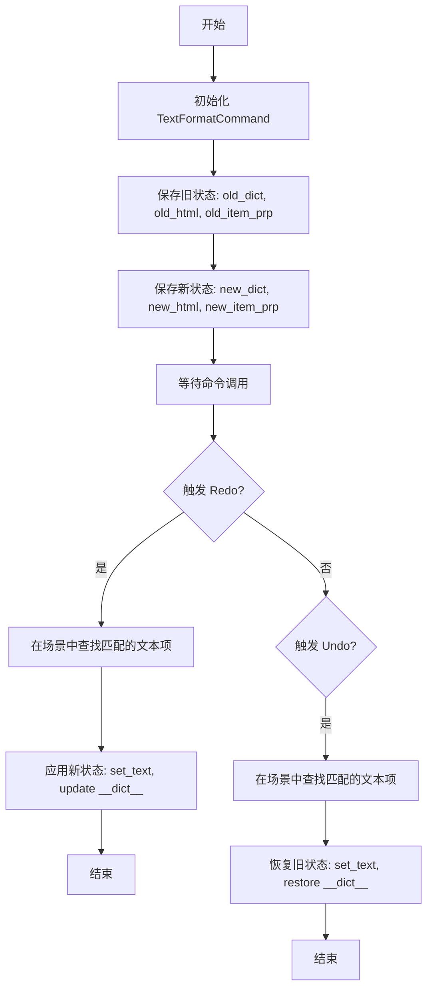
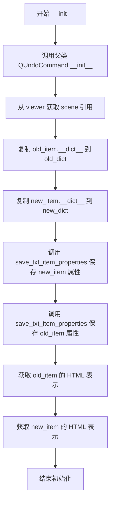
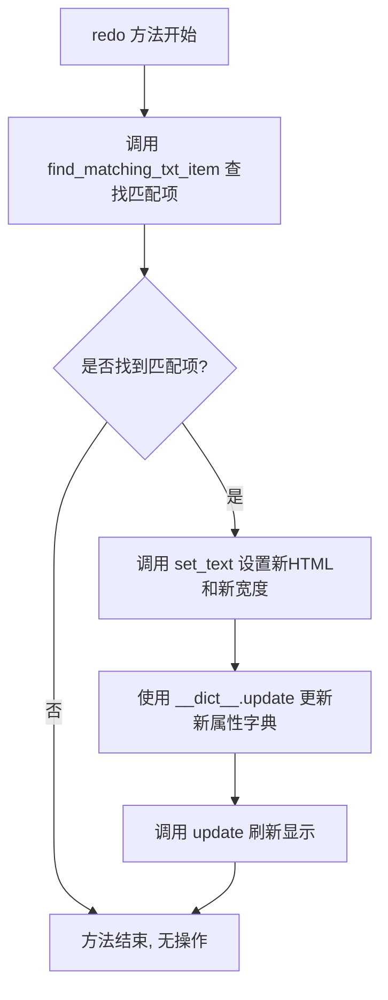
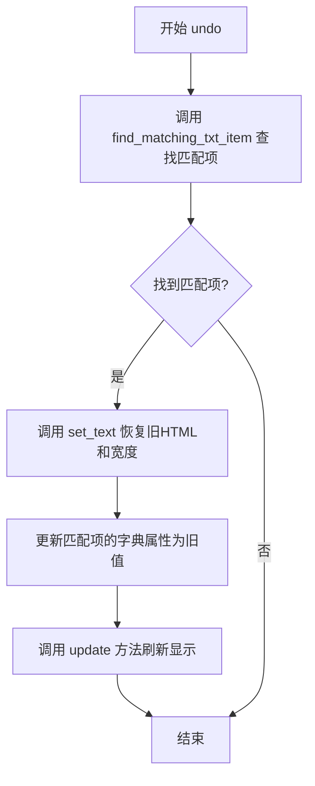
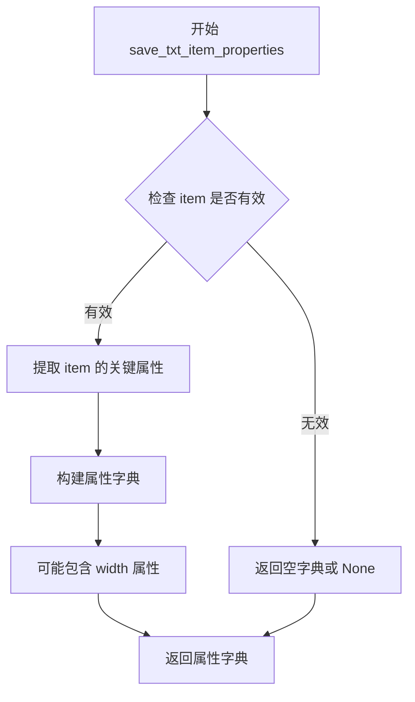
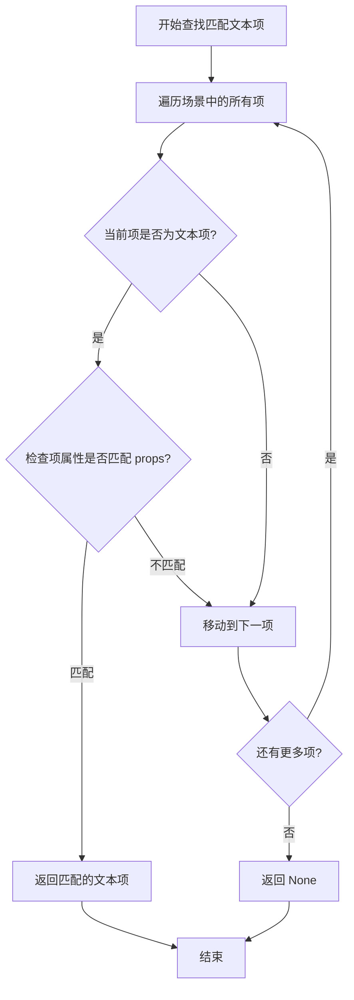

# `comic-translate\app\ui\commands\textformat.py` 详细设计文档

这是一个基于 PySide6 的撤销/重做（Undo/Redo）命令类，专门用于处理图形场景中文本项目（Text Item）的格式修改。它通过深拷贝修改前后的对象状态（属性字典和HTML内容），实现在用户执行撤销或重做操作时，精准地恢复或应用文本的样式与内容。

## 整体流程



## 类结构

```
QUndoCommand (PySide6 Qt 核心类)
└── RectCommandBase (自定义基类: base.py)
    └── TextFormatCommand (当前文件实现)
```

## 全局变量及字段


### `TextFormatCommand.scene`
    
图形场景对象，用于定位和更新图元

类型：`QGraphicsScene`
    


### `TextFormatCommand.old_dict`
    
旧文本项的 __dict__ 拷贝，用于恢复对象状态

类型：`dict`
    


### `TextFormatCommand.new_dict`
    
新文本项的 __dict__ 拷贝，用于应用对象状态

类型：`dict`
    


### `TextFormatCommand.old_item_prp`
    
旧文本项的自定义属性（宽高等）

类型：`dict`
    


### `TextFormatCommand.new_item_prp`
    
新文本项的自定义属性

类型：`dict`
    


### `TextFormatCommand.old_html`
    
旧文本项的 HTML 格式内容

类型：`str`
    


### `TextFormatCommand.new_html`
    
新文本项的 HTML 格式内容

类型：`str`
    
    

## 全局函数及方法


### `TextFormatCommand.__init__`

这是一个Qt撤销/重做命令类的初始化方法，用于记录文本格式更改操作的历史。它保存了旧文本项和新文本项的属性快照（字典、HTML内容和文本项属性），以便后续执行redo（应用新格式）和undo（恢复旧格式）操作。

参数：

- `self`：隐含的实例本身
- `viewer`：对象，包含 `_scene` 属性的查看器对象，用于访问图形场景
- `old_item`：对象，修改前的文本项对象
- `new_item`：对象，修改后的文本项对象

返回值：`None`，`__init__` 方法不返回值，用于初始化对象状态

#### 流程图



#### 带注释源码

```python
def __init__(self, viewer, old_item, new_item):
    # 调用 QUndoCommand 基类的初始化方法
    super().__init__()
    
    # 从 viewer 对象中获取场景引用，用于后续查找和更新文本项
    self.scene = viewer._scene
    
    # 复制旧文本项的 __dict__ 字典，保存其所有属性的快照
    self.old_dict = old_item.__dict__.copy()
    
    # 复制新文本项的 __dict__ 字典，保存其所有属性的快照
    self.new_dict = new_item.__dict__.copy()
    
    # 调用基类方法保存新文本项的特定属性（宽度等）
    self.new_item_prp = self.save_txt_item_properties(new_item)
    
    # 调用基类方法保存旧文本项的特定属性（宽度等）
    self.old_item_prp = self.save_txt_item_properties(old_item)
    
    # 获取旧文本项的 HTML 表示，用于 undo 操作时恢复
    self.old_html = old_item.toHtml()
    
    # 获取新文本项的 HTML 表示，用于 redo 操作时应用
    self.new_html = new_item.toHtml()
```


### `TextFormatCommand.redo`

该方法实现 QUndoCommand 的 redo 接口，用于重做文本格式修改操作。当用户触发重做时，会根据之前保存的新文本属性（HTML内容和宽度）在场景中查找对应的文本项，并将该文本项的内容和属性更新为修改后的状态。

参数：

- `self`：实例本身，隐含参数，无需额外描述

返回值：`None`，该方法无返回值，执行直接修改场景中的图形项状态

#### 流程图



#### 带注释源码

```python
def redo(self):
    """
    重做文本格式修改操作。
    当undo栈重做时，将场景中的文本项恢复为修改后的状态。
    """
    # 在场景中查找与旧属性匹配的文本项
    # 使用保存的 old_item_prp 作为查找依据
    matching_item = self.find_matching_txt_item(self.scene, self.old_item_prp)
    
    # 如果找到匹配的文本项
    if matching_item:
        # 使用新的HTML内容和宽度设置文本
        # new_html 包含修改后的文本格式
        # new_item_prp.width 包含修改后的宽度设置
        matching_item.set_text(self.new_html, self.new_item_prp.width)
        
        # 将保存的新属性字典合并到匹配项
        # 这会更新文本项的所有属性状态
        matching_item.__dict__.update(self.new_dict)
        
        # 触发图形项的重绘
        # 确保UI反映最新的文本状态
        matching_item.update()
```


### `TextFormatCommand.undo`

该方法用于撤销文本格式更改操作。它通过在场景中查找匹配的项目，并使用保存的旧HTML内容和属性来恢复文本项的先前状态。

参数：

- `self`：`TextFormatCommand`，Python实例方法的隐式参数，代表当前命令对象本身

返回值：`None`，该方法直接修改匹配项的状态，不返回任何值

#### 流程图



#### 带注释源码

```python
def undo(self):
    """
    撤销文本格式更改操作
    
    该方法执行以下步骤：
    1. 使用新项属性（在redo后保存的）在场景中查找匹配的文本项
    2. 如果找到匹配项：
       - 使用保存的旧HTML内容恢复文本
       - 恢复旧的宽度属性
       - 更新匹配项的内部字典为保存的旧值
       - 刷新显示
    """
    # 使用new_item_prp（新项属性）在场景中查找匹配的文本项
    # 注意：这里使用new_item_prp是因为redo后new_item_prp是当前状态
    matching_item = self.find_matching_txt_item(self.scene, self.new_item_prp)
    
    # 检查是否找到匹配的文本项
    if matching_item:
        # 恢复旧的HTML内容和宽度设置
        # old_html 保存的是操作前的HTML内容
        # old_item_prp['width'] 保存的是操作前的宽度
        matching_item.set_text(self.old_html, self.old_item_prp['width'])
        
        # 使用字典更新操作恢复所有旧的属性
        # __dict__ 包含对象的所有实例属性
        matching_item.__dict__.update(self.old_dict)
        
        # 触发界面更新以反映撤销后的状态
        matching_item.update()
```


# 分析结果

根据提供的代码，我发现 `save_txt_item_properties` 方法并未在当前代码文件中直接定义，而是通过继承从 `RectCommandBase` 基类中调用。以下是从代码中提取的关于该方法调用的相关信息：

---

### `RectCommandBase.save_txt_item_properties(self, item)`

保存文本项属性，该方法提取文本项的关键属性信息（如宽度、位置等），用于后续在场景中查找匹配的文本项以执行撤销/重做操作。

参数：

- `self`：`RectCommandBase`，当前命令对象的实例
- `item`：任意对象，需要保存属性的文本项对象，从代码调用来看应为具有 `__dict__` 属性的 Qt 文本项对象

返回值：`dict`，返回包含文本项关键属性的字典，从代码中 `self.new_item_prp.width` 的使用方式可知，返回字典应包含 `width` 键及其他属性信息

#### 流程图



#### 带注释源码

```
# 注：该方法定义在 RectCommandBase 基类中，未在当前文件中实现
# 以下为基于调用的推断

def save_txt_item_properties(self, item):
    """
    保存文本项的关键属性
    
    参数:
        item: Qt文本项对象
        
    返回:
        dict: 包含文本项属性的字典，应包含 width 等关键属性
    """
    # 从调用 self.save_txt_item_properties(new_item) 推断
    # 该方法提取 item 的属性信息
    # 返回值被用于 find_matching_txt_item() 来查找匹配项
    
    # 推断的实现逻辑：
    properties = {}
    if hasattr(item, 'boundingRect'):
        properties['width'] = item.boundingRect().width()
    # 可能还包含其他属性如位置、ID等
    
    return properties
```

---

## 补充说明

由于 `RectCommandBase` 基类的实现代码未在当前代码片段中提供，以上信息基于以下代码线索推断得出：

1. **调用证据**：
   ```python
   self.new_item_prp = self.save_txt_item_properties(new_item)
   self.old_item_prp = self.save_txt_item_properties(old_item)
   ```

2. **使用证据**：
   ```python
   matching_item.set_text(self.new_html, self.new_item_prp.width)
   ```

3. **方法调用链**：
   - `save_txt_item_properties` → 返回属性字典 → `find_matching_txt_item` 使用属性查找匹配项

如需获取 `RectCommandBase` 基类的完整实现，请提供 `base.py` 文件的内容。


### `RectCommandBase.find_matching_txt_item`

查找场景中与指定属性匹配的文本项，用于在撤销/重做操作中定位需要修改的文本对象。

参数：

-  `self`：`RectCommandBase` 或其子类实例，当前命令对象
-  `scene`：`QGraphicsScene`，Qt 场景对象，从中查找匹配的文本项
-  `props`：`dict`，包含文本项属性的字典，用于匹配目标项

返回值：`QGraphicsTextItem` 或 `None`，返回找到的匹配文本项，如果未找到则返回 `None`

#### 流程图



#### 带注释源码

```
def find_matching_txt_item(self, scene, props):
    """
    在场景中查找与给定属性匹配的文本项。
    
    该方法用于撤销/重做操作中，根据保存的属性快照
    找到场景中对应的文本项进行更新。
    
    参数:
        scene: Qt 场景对象，包含所有图形项
        props: 字典，保存了目标文本项的属性信息
        
    返回:
        匹配的 QGraphicsTextItem 对象，未找到则返回 None
    """
    # 遍历场景中的所有图形项
    for item in scene.items():
        # 检查该项是否为文本类型
        if isinstance(item, TextItem):  # 假设存在 TextItem 类
            # 比较属性是否匹配
            if self.is_txt_item_matching(item, props):
                # 找到匹配项，返回该对象
                return item
    
    # 遍历完毕未找到匹配项，返回 None
    return None
```

#### 补充说明

此方法未在当前代码文件中直接实现，而是继承自 `RectCommandBase` 基类。从 `TextFormatCommand` 中的调用方式可以看出：

- **调用场景**：`redo()` 和 `undo()` 方法中分别使用 `old_item_prp` 和 `new_item_prp` 作为匹配属性
- **匹配逻辑**：通过 `save_txt_item_properties()` 保存的属性与场景中的文本项进行匹配
- **返回处理**：找到匹配项后调用 `set_text()` 更新内容，并更新 `__dict__` 和调用 `update()` 刷新显示

## 关键组件


### TextFormatCommand 类

核心命令类，继承 QUndoCommand 实现撤销/重做功能，用于保存和应用文本格式的更改状态。

### 状态快照机制

通过保存 old_dict/new_dict、old_item_prp/new_item_prp、old_html/new_html 两份状态副本，支持精确的撤销和重做操作。

### redo 方法

重做操作，将场景中的文本项更新为新状态，包括文本内容、宽度和字典属性的更新。

### undo 方法

撤销操作，将场景中的文本项恢复为旧状态，执行与 redo 相反的操作以实现回滚。

### 场景项匹配机制

利用 find_matched_txt_item 在场景中查找对应的文本项，支持基于属性匹配的操作目标定位。

### QUndoCommand 接口实现

遵循 Qt 命令模式规范，通过 redo/undo 方法对实现可撤销的操作序列。

### RectCommandBase 基类依赖

继承自基类以获取 save_txt_item_properties 和 find_matching_txt_item 等辅助方法。

### 属性深拷贝机制

使用 __dict__.copy() 和专门的属性保存方法，确保状态数据的完整复制而非引用共享。


## 问题及建议


### 已知问题

-   **直接操作 `__dict__` 破坏封装性**：代码中直接使用 `__dict__.copy()` 和 `__dict__.update()` 复制/更新对象内部字典，这种方式破坏了类的封装性，可能导致无法正确处理带有 `@property` 装饰器或 `descriptor` 的属性，同时可能复制不应被复制的内部状态。
-   **冗余数据存储**：同时保存了 `old_dict/new_dict`、`old_item_prp/new_item_prp` 和 `old_html/new_html` 三份状态数据，造成内存浪费和数据不一致风险。
-   **缺少错误处理**：`find_matching_txt_item` 返回 `None` 时仅做空判断，无日志或异常抛出，调试困难；整个方法缺少异常捕获机制。
-   **直接访问私有属性**：`self.scene = viewer._scene` 直接访问 `_scene` 私有属性，违反封装原则，可能导致在不同版本中失效。
-   **重复代码**：redo 和 undo 方法中存在大量重复逻辑，可提取为私有方法。
-   **类型提示缺失**：所有方法参数和返回值均无类型注解，影响代码可维护性和 IDE 智能提示。
-   **参数命名误导**：构造函数接收 `old_item` 和 `new_item` 参数但未保存，仅保存了其属性字典，命名不够清晰。

### 优化建议

-   **使用深拷贝或序列化机制**：替换 `__dict__` 操作，考虑使用 `copy.deepcopy()` 或实现专门的序列化方法（如 `to_dict()` / `from_dict()`）来保存和恢复状态。
-   **精简数据结构**：分析实际需要恢复的属性，仅保留必要字段，避免存储冗余状态；可考虑只存储新旧值之间的差异（diff）。
-   **添加异常处理和日志**：在关键位置添加 try-except 捕获异常，并记录日志；为 `find_matching_txt_item` 添加更完善的错误处理和调试信息。
-   **通过公共接口访问属性**：避免直接访问 `viewer._scene`，考虑通过公共方法获取场景对象。
-   **提取公共逻辑**：将 redo 和 undo 中的公共逻辑提取为私有方法 `_apply_item_properties(item, html, width, props_dict)`，减少重复代码。
-   **添加类型注解**：为所有方法添加参数和返回值的类型提示，提升代码可读性和可维护性。
-   **重构参数命名**：考虑将 `old_item` 和 `new_item` 参数改为更准确的命名，如 `old_properties` 或直接移除这些参数（因为实际未使用）。


## 其它


### 设计目标与约束

该代码旨在实现文本格式的撤销/重做功能，通过QUndoCommand模式保存文本项的状态快照，支持对场景中匹配文本项的格式恢复。约束条件包括：依赖PySide6框架、需配合RectCommandBase基类使用、仅支持文本项格式变更。

### 错误处理与异常设计

代码中未显式处理异常，主要通过条件判断（if matching_item）处理匹配失败场景。潜在异常包括：场景中未找到匹配项时返回None、属性字典复制时的深拷贝问题、toHtml()方法调用失败。建议增加异常捕获机制处理set_text和update方法调用失败的情况。

### 数据流与状态机

数据流：old_item → old_dict + old_item_prp + old_html → 存储 → undo时应用 → 恢复旧状态；new_item → new_dict + new_item_prp + new_html → 存储 → redo时应用 → 应用新状态。状态机涉及两个状态：redo（新状态）和undo（旧状态），通过QUndoCommand框架管理状态转换。

### 外部依赖与接口契约

外部依赖：PySide6.QtGui.QUndoCommand、RectCommandBase基类。接口契约包括：find_matching_txt_item(scene, props)方法需返回匹配文本项、save_txt_item_properties(item)需返回属性字典、set_text(html, width)方法需支持文本设置、toHtml()需返回HTML表示。

### 性能考虑

每次操作都会复制完整的__dict__和调用toHtml()，大文本时可能有性能影响。建议：考虑增量存储只变更的属性、使用延迟复制或引用机制、优化find_matching_txt_item的查找算法。

### 线程安全性

未实现线程安全机制。QUndoCommand通常在主线程中调用，但若涉及多线程场景（如异步场景操作），需添加锁保护self.scene和matching_item的访问。

### 内存管理

通过copy()进行字典深拷贝，可能存在内存开销。old_dict和new_dict存储完整对象字典，old_item_prp和new_item_prp存储文本属性，old_html和new_html存储HTML字符串。建议评估是否可使用弱引用或清理机制释放不再需要的旧状态。

### 测试策略

建议测试场景包括：正常redo/undo流程、场景中无匹配项时的行为、大文本内容处理、多步撤销重做序列、与基类方法的集成测试、属性字典完整性验证。

### 配置与扩展性

当前设计针对文本格式命令，扩展性体现在：可通过继承TextFormatCommand实现不同类型的格式命令、可在子类中重写save_txt_item_properties定制属性保存逻辑、find_matching_txt_item可被重写以实现不同的匹配策略。

### 安全考虑

代码直接操作__dict__属性，可能暴露内部实现。toHtml()输出需验证安全性，防止HTML注入。建议增加属性访问控制、使用安全的HTML sanitizer。

### 日志与监控

代码中无日志记录。建议添加：操作日志（redo/undo调用）、性能监控（属性复制和方法调用耗时）、调试日志（匹配项查找结果）。

### 版本兼容性

依赖PySide6（Qt6），需确保Qt版本兼容性。RectCommandBase基类需与当前Qt版本兼容。考虑PySide6与PyQt6的潜在兼容性问题。

### 国际化

无直接国际化需求，但toHtml()返回的文本内容可能包含需国际化的字符串。建议确保HTML内容中的文本可被正确处理。

### 文档与注释规范

代码缺少文档字符串。建议补充：类级文档说明功能、每个方法的参数和返回值说明、关键逻辑的注释（如匹配逻辑、状态恢复）。

### 部署与运维

作为Undo/Redo系统的一部分，部署时需确保：PySide6正确安装、RectCommandBase基类可用、场景管理正确初始化。建议提供版本信息和依赖检查脚本。


    