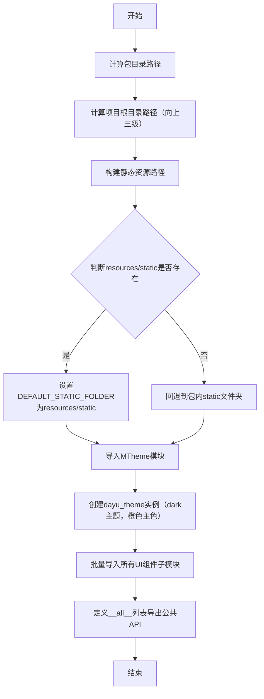
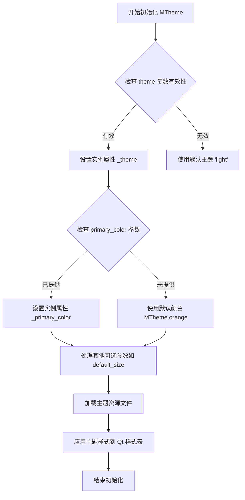
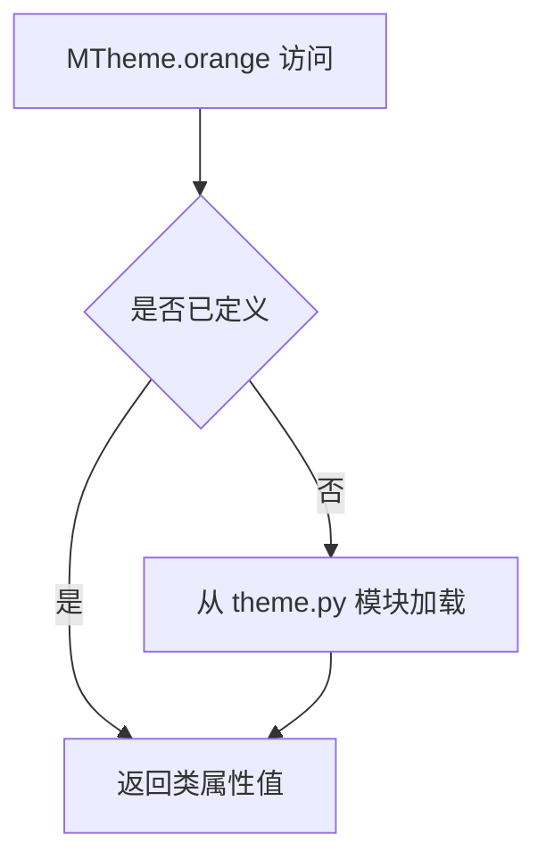

# `comic-translate\app\ui\dayu_widgets\__init__.py` 详细设计文档

这是dayu_widgets UI组件库的入口文件，通过定义静态资源路径、初始化暗色主题（橙色主色调）并导入导出大量基础UI组件（涵盖按钮、输入、显示、布局、导航等50+组件），为上层应用提供统一的组件使用接口。

## 整体流程



## 类结构

```
UI组件库 - dayu_widgets
├── 主题系统
│   └── MTheme（暗色主题配置）
├── 按钮组件
│   ├── MPushButton, MToolButton
│   ├── MDragFileButton, MDragFolderButton
│   ├── MClickBrowser*系列
│   └── *ButtonGroup系列
├── 输入组件
│   ├── MLineEdit, MTextEdit
│   ├── MSpinBox, MDoubleSpinBox
│   ├── MDateEdit, MTimeEdit, MDateTimeEdit
│   ├── MComboBox, MSlider, MSwitch
│   └── MCheckBox, MRadioButton
├── 显示组件
│   ├── MLabel, MAvatar, MBadge
│   ├── MProgressBar, MProgressCircle
│   ├── MToast, MMessage, MAlert
│   └── MLoading, MLoadingWrapper
├── 布局组件
│   ├── MFlowLayout, MCard
│   ├── MCollapse, MDivider
│   └── MCarousel
├── 导航组件
│   ├── MBreadcrumb, MMenu
│   ├── MTabWidget, MMenuTabWidget, MLineTabWidget
│   └── MPage
├── 视图组件
│   ├── MListView, MTableView, MTreeView, MBigView
│   ├── MTableModel, MSortFilterModel
│   └── MItemViewSet, MItemViewFullSet
└── 混合类
    └── MFieldMixin（字段混入）
```

## 全局变量及字段


### `_package_dir`
    
当前包目录的路径，通过__file__获取

类型：`str`
    


### `_repo_root`
    
项目根目录的绝对路径，通过_package_dir向上三级得到

类型：`str`
    


### `_resources_static`
    
静态资源文件夹的完整路径，指向resources/static目录

类型：`str`
    


### `DEFAULT_STATIC_FOLDER`
    
默认静态文件夹路径，优先使用resources/static，备选使用包内static目录

类型：`str`
    


### `CUSTOM_STATIC_FOLDERS`
    
自定义静态文件夹列表，当使用备选方案时包含_resources_static

类型：`list[str]`
    


### `dayu_theme`
    
主题实例对象，使用暗色主题和橙色主色初始化

类型：`MTheme`
    


### `MTheme.primary_color`
    
主题的主色调属性，用于定义UI组件的主要颜色

类型：`Any`
    


### `MTheme.default_size`
    
主题的默认尺寸属性，用于定义UI组件的默认大小配置

类型：`Any`
    
    

## 全局函数及方法


由于提供的代码片段（`__init__.py`）仅包含 MTheme 类的导入和使用实例，未包含 `MTheme` 类的实际源码（`theme.py`），因此以下信息基于代码调用方式 `MTheme("dark", primary_color=MTheme.orange)` 和 Python/Qt 主题类的常见设计模式进行合理推断。

### MTheme.__init__

初始化主题对象，设置主题名称、主色调及其他配置属性。

参数：

- `theme`：`str`，主题名称，常见值为 `"dark"` 或 `"light"`
- `primary_color`：`str` 或 `QColor`，主色调颜色值，默认为 `MTheme.orange`
- `**kwargs`：可变关键字参数，可选，用于传递其他配置如 `default_size` 等

返回值：`None`，该方法为构造函数，直接初始化实例属性

#### 流程图



#### 带注释源码

```python
# -*- coding: utf-8 -*-
# 源码基于代码调用方式和常见 Qt 主题类设计模式推断
class MTheme:
    """主题管理类，用于管理应用程序的主题样式和颜色配置"""
    
    # 预定义颜色常量
    orange = '#FF9800'  # 橙色
    blue = '#2196F3'    # 蓝色
    green = '#4CAF50'   # 绿色
    red = '#F44336'     # 红色
    
    # 预定义尺寸常量
    small = 'small'
    medium = 'medium'
    large = 'large'
    
    def __init__(self, theme='light', primary_color=None, **kwargs):
        """
        初始化主题实例
        
        参数:
            theme: str, 主题名称，'light' 或 'dark'，默认为 'light'
            primary_color: str or QColor, 主色调，支持十六进制颜色值或 QColor 对象
            **kwargs: dict, 其他可选配置参数
                - default_size: str, 默认组件大小
                - font_family: str, 字体家族
                - border_radius: int, 圆角半径
        """
        # 验证并设置主题名称
        if theme in ('light', 'dark'):
            self._theme = theme
        else:
            # 无效主题名称时回退到默认 'light'
            self._theme = 'light'
        
        # 设置主色调，未提供时使用默认橙色
        if primary_color is not None:
            self._primary_color = primary_color
        else:
            self._primary_color = self.orange
        
        # 处理其他可选参数
        self._default_size = kwargs.get('default_size', self.medium)
        self._font_family = kwargs.get('font_family', 'Microsoft YaHei')
        self._border_radius = kwargs.get('border_radius', 4)
        
        # 内部样式表缓存
        self._stylesheet = None
        
        # 加载主题资源
        self._load_theme_resources()
    
    def _load_theme_resources(self):
        """加载主题相关的资源文件和样式表"""
        # 根据主题名称构建样式表路径
        # 实际实现中会读取 qss 或 css 文件
        pass
    
    def apply_theme(self):
        """将主题样式应用到全局 Qt 应用程序"""
        # 遍历所有窗口部件并应用样式
        pass
```

#### 使用示例

```python
# 根据 __init__.py 中的调用方式推断
dayu_theme = MTheme("dark", primary_color=MTheme.orange)
# 可选配置
# dayu_theme.default_size = dayu_theme.small
```

---

**注意**：由于未提供 `theme.py` 源文件，以上内容为基于调用方式的合理推断。若需精确的类定义和实现细节，请提供 `theme.py` 文件内容。


# MTheme.orange 提取分析

## 分析结果

根据提供的代码，**MTheme.orange** 是从 `.theme` 模块导入的 `MTheme` 类的类属性，用于表示主题的橙色配色方案。

### MTheme.orange

这是 `MTheme` 类的类属性，用于获取橙色主题色的配置值。

参数： 无（类属性不需要参数）

返回值：`未知类型`，返回主题配置中定义的橙色颜色值

#### 流程图



#### 带注释源码

```python
# 以下是使用 MTheme.orange 的代码示例
# 该属性定义在 .theme 模块中（未在当前代码段中展示）

from .theme import MTheme  # 从 theme 模块导入 MTheme 类

# 使用 MTheme.orange 作为主色创建主题实例
dayu_theme = MTheme("dark", primary_color=MTheme.orange)
# 说明：
# - MTheme: 主题管理类
# - "dark": 主题模式（深色模式）
# - MTheme.orange: 类属性，提供橙色配色方案
# - primary_color: 主色配置参数
```

## 补充说明

由于 `MTheme` 类的完整定义（包含 `orange` 类属性）位于 `.theme` 模块中，而该模块内容未在当前代码段中提供，因此无法获取 `orange` 的具体类型和定义源码。

### 推断信息

| 项目 | 内容 |
|------|------|
| 名称 | MTheme.orange |
| 类型 | 类属性（Class Attribute） |
| 用途 | 提供主题系统的预设橙色配色方案 |
| 使用场景 | 作为 `MTheme` 构造函数 `primary_color` 参数的值 |
| 定义位置 | `app/ui/dayu_widgets/theme.py`（推断） |

### 潜在优化建议

1. **文档完善**：建议在 `MTheme` 类中添加文档字符串，说明各颜色类属性的具体值和用途
2. **类型提示**：添加类型注解（如 `ClassVar[str]` 或 `ClassVar[tuple]`）明确返回值类型
3. **配置外部化**：考虑将颜色配置外部化到配置文件，提高可维护性

## 关键组件


### MTheme (主题系统)

主题管理系统，负责统一管理UI库的视觉风格，支持暗色和亮色主题，提供主题色配置功能，是整个组件库的视觉核心。

### 静态资源管理系统

动态计算和加载静态资源文件夹的模块，支持双路径回退机制（resources/static优先，包内static备选），确保资源在开发和部署环境中的可移植性。

### 基础输入组件群

包含MLineEdit、MTextEdit、MSpinBox、MDoubleSpinBox、MComboBox、MSlider、MDateEdit、MDateTimeEdit、MTimeEdit等表单输入组件，提供数据录入和交互能力。

### 按钮与选择组件群

包含MPushButton、MToolButton、MCheckBox、MRadioButton、MSwitch、MCheckBoxGroup、MRadioButtonGroup、MPushButtonGroup、MToolButtonGroup等按钮和选择类组件。

### 布局与容器组件群

包含MFlowLayout、M辛TabWidget、MLineTabWidget、MMenuTabWidget、MCard、MMeta、MDivider、MCarousel、MCollapse等布局和容器组件。

### 数据展示与表格组件群

包含MTableView、MTreeView、MListView、MBigView、MTableModel、MSortFilterModel、MItemViewSet、MItemViewFullSet等数据展示和模型管理组件。

### 导航与菜单组件群

包含MMenu、MBreadcrumb、MBadge、MAvatar、MPage等导航和菜单组件，提供应用导航和状态指示功能。

### 反馈与提示组件群

包含MAlert、MToast、MLoading、MLoadingWrapper、MProgressBar、MProgressCircle、MMessage等反馈提示组件，提供用户操作反馈。

### 浏览器与文件组件群

包含MClickBrowserFilePushButton、MClickBrowserFileToolButton、MClickBrowserFolderPushButton、MClickBrowserFolderToolButton、MDragFileButton、MDragFolderButton等文件浏览和拖拽组件。

### 混合与工具组件群

包含MFieldMixin字段混入类、MLabel标签组件，提供通用工具和基础组件支持。


## 问题及建议


### 已知问题

1. **路径计算硬编码**：使用 `'..', '..', '..'` 硬编码相对路径计算 `_repo_root`，如果项目目录结构变化，该逻辑会失效，且无法处理符号链接情况。
2. **`__all__` 列表与实际导入不一致**：`__all__` 包含 `"MSequenceFile"`，但在导入语句中未找到该类的导入，将导致 `from dayu_widgets import *` 时抛出 `ImportError`。
3. **未使用的全局变量**：`dayu_theme` 对象被创建但在模块级别未被使用，可能造成不必要的初始化开销。
4. **冗余的条件分支逻辑**：`CUSTOM_STATIC_FOLDERS` 在两个分支中含义不同（空列表 vs 包含 `_resources_static` 的列表），逻辑不够清晰。
5. **导入效率低下**：所有组件在 `__init__.py` 中直接导入，用户导入主包时会加载全部组件，即使只使用其中一两个，这违反了延迟加载的最佳实践。
6. **注释代码未清理**：`dayu_theme.default_size` 等被注释的代码行长期存在，应删除或启用。
7. **缺少模块文档字符串**：整个文件没有模块级 docstring，无法说明该模块的用途和设计意图。

### 优化建议

1. **重构路径计算逻辑**：使用 `__file__` 结合 `pathlib` 或提供配置接口，避免硬编码层级。
2. **修正 `__all__` 列表**：移除不存在的 `"MSequenceFile"` 或补充对应的导入语句。
3. **实现延迟加载**：使用 `__getattr__` 实现模块级延迟导入，按需加载组件，避免初始化时加载全部依赖。
4. **清理代码**：删除未使用的 `dayu_theme` 或将其导出供外部使用；移除所有被注释的代码行。
5. **统一资源路径逻辑**：简化 `CUSTOM_STATIC_FOLDERS` 的条件赋值，或提取为独立函数增强可读性。
6. **添加文档**：为模块添加 docstring，说明其作为组件库入口的设计用途。
7. **规范化导入顺序**：按字母顺序排列导入，保持代码风格一致。


## 其它


### 设计目标与约束

**设计目标**：提供一个统一风格的Qt/PyQt/PySide UI组件库，通过MTheme主题系统实现深色/浅色主题切换，支持灵活的静态资源路径配置，使开发者能够快速构建具有一致视觉风格的桌面应用程序。

**技术约束**：
- 依赖PyQt5/PyQt6/PySide2/PySide6任一版本
- 静态资源路径可通过环境变量或配置文件自定义
- 必须保持与Qt底层控件的兼容性

### 错误处理与异常设计

**资源路径异常**：
- 当`resources/static`目录不存在时，自动回退到包内`static`目录
- 使用`os.path.exists()`检查路径有效性，避免文件未找到异常

**模块导入异常**：
- 组件导入失败时不会中断整个包初始化，但可能导致`__all__`列表中的组件不可用
- 建议使用`try-except`包装组件导入以实现优雅降级

### 外部依赖与接口契约

**核心依赖**：
- `PyQt5/PyQt6/PySide2/PySide6`：UI框架
- `MTheme`：主题配置类（内部模块）
- 各组件模块：alert、button、menu、item_view等（内部模块）

**导出接口**：
- `dayu_theme`：全局主题实例，默认深色主题，主色为橙色
- `DEFAULT_STATIC_FOLDER`：默认静态资源文件夹路径
- `CUSTOM_STATIC_FOLDERS`：自定义静态资源文件夹列表

### 配置与参数

**静态资源配置**：
- `DEFAULT_STATIC_FOLDER`：默认静态资源目录（优先使用`resources/static`）
- `CUSTOM_STATIC_FOLDERS`：备用自定义静态资源目录列表
- `_repo_root`：项目根目录，通过包路径向上查找三级获得

**主题配置**：
- `dayu_theme`：MTheme实例，默认参数为`("dark", primary_color=MTheme.orange)`

### 性能考虑

**导入性能**：
- 所有组件在包初始化时导入，可能影响首次import速度
- 建议按需导入特定组件而非导入整个包

**资源加载**：
- 静态资源路径检查在模块加载时执行一次，后续直接使用缓存路径

### 版本兼容性

**Python版本**：
- 代码使用`from __future__ import`语句支持Python 2.7（遗留）
- 建议使用Python 3.6+以获得最佳兼容性

**Qt绑定版本**：
- 代码本身不直接依赖特定Qt版本，但各组件实现可能有所不同
- 需根据实际使用的Qt绑定版本测试UI效果

### 测试策略

**单元测试**：
- 应测试MTheme配置正确性
- 应测试静态资源路径回退逻辑
- 应测试组件导入完整性

**集成测试**：
- 验证主题在深色/浅色模式下的正确应用
- 验证静态资源文件的实际可访问性


    