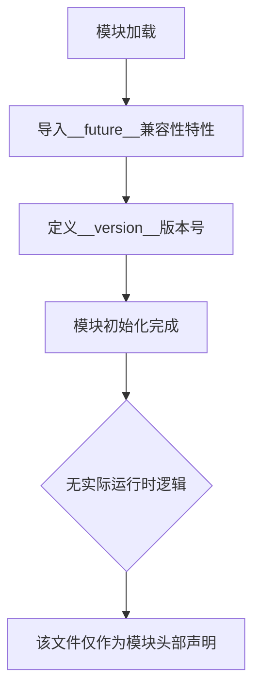

# `comic-translate\app\ui\dayu_widgets\__version__.py` 详细设计文档

这是一个Python模块的初始化文件头部，仅包含Python 2/3兼容性导入语句（__future__模块的absolute_import、division和print_function）以及模块版本号定义，表明该模块版本为0.13.13。该代码片段不包含任何业务逻辑、类定义或函数实现。

## 整体流程



## 类结构

```

```

## 全局变量及字段


### `__version__`
    
模块版本号，标识当前代码库的版本为0.13.13

类型：`str`
    


    

## 全局函数及方法


## 关键组件


该代码片段仅包含Python 2/3兼容性的导入语句和版本号标识，不包含任何功能性组件、类定义或方法实现。


## 问题及建议


### 已知问题

- **无实际功能代码**：该代码片段仅为模块头文件，仅包含版本声明和Python 2/3兼容性导入，无任何实际业务逻辑或功能实现
- **版本号孤立**：`__version__`变量独立存在，缺乏关联的版本信息管理机制（如`__version_info__`、版本解析函数等）
- **Python 2兼容性代码冗余**：版本号为`0.13.13`表明项目已较为成熟，继续保留`future`模块导入以支持Python 2可能已无必要
- **缺乏模块文档**：缺少模块级docstring，无法明确该模块的用途和职责
- **未来模块导入未使用**：`absolute_import`、`division`、`print_function`导入后未在代码片段中体现实际使用

### 优化建议

- **移除不必要的Python 2兼容性代码**：如项目已全面支持Python 3，可移除`from __future__ import`相关导入语句
- **添加模块级docstring**：为模块添加文档字符串，说明模块职责、版本信息及变更历史
- **版本信息结构化**：考虑添加`__version_info__`元组或使用`packaging.version`模块进行版本管理，便于程序化版本比较
- **考虑添加版本声明方式**：可采用`__version__ = "0.13.13"`配合`VERSION`元组或`__all__`列表，提升版本信息的可用性


## 其它


### 设计目标与约束

本模块作为基础版本标识文件，主要目标是为整个项目提供统一的版本号管理。约束条件包括：必须保持与项目发布流程同步更新，版本号遵循语义化版本规范（Semantic Versioning），仅包含必要的future导入以保证Python 2/3兼容性。

### 错误处理与异常设计

本模块不涉及运行时错误处理，因其为纯静态版本标识文件。若版本号格式不符合规范（如非字符串类型或不符合x.y.z格式），在项目构建或发布阶段应由CI/CD流水线或发布工具进行校验并抛出相应异常。

### 数据流与状态机

本模块为无状态模块，不涉及数据流处理或状态机设计。版本号作为静态常量被项目其他模块导入使用，通常在模块初始化时读取。

### 外部依赖与接口契约

本模块无外部依赖，仅依赖Python标准库中的__future__模块以实现Python 2/3兼容。接口契约包括：__version__变量必须为字符串类型，格式必须符合语义化版本规范（主版本号.次版本号.修订号），该变量可通过import语句被其他模块访问。

### 安全性考虑

本模块不涉及敏感数据处理，安全性风险较低。唯一需注意的是确保__version__变量不会被恶意篡改，建议在版本发布流程中对版本文件进行完整性校验。

### 性能考虑

本模块为纯静态定义，无运行时性能开销。模块导入时间可忽略不计，因其仅包含简单的变量赋值和future导入语句。

### 测试策略

本模块测试重点包括：验证__version__变量存在且类型正确，验证版本号格式符合语义化版本规范，验证模块可正常导入无语法错误。建议使用单元测试框架（如pytest）进行自动化验证。

### 部署与配置

本模块作为项目基础组件，随项目代码仓库统一管理。部署时需确保该文件包含在项目安装包中（如setup.py、pyproject.toml配置的packages中）。无需额外配置项。

### 版本管理与发布策略

版本号遵循语义化版本规范（Semantic Versioning），格式为"主版本号.次版本号.修订号"（如"0.13.13"）。版本更新需记录在CHANGELOG中，发布流程应包含版本号一致性校验步骤。

### 兼容性考虑

本模块通过from __future__ import语句实现Python 2.5+及Python 3.x的兼容性支持。future导入确保absolute_import、division、print_function特性在不同Python版本间行为一致。最低支持Python版本应为Python 2.5或Python 3.0。


    