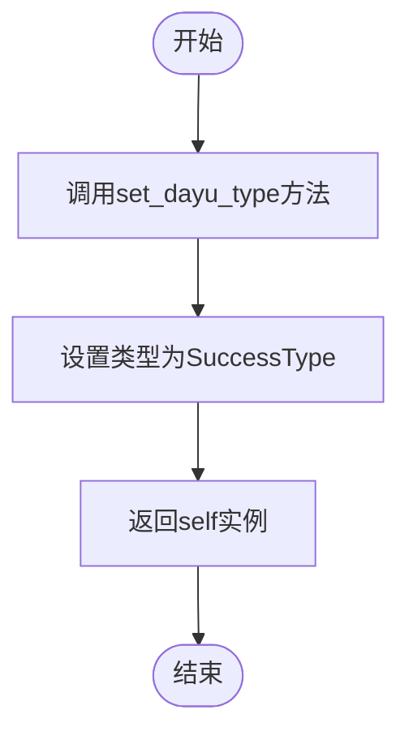

# `comic-translate\app\ui\dayu_widgets\alert.py` 详细设计文档

MAlert是一个基于PySide6的警告提示组件，用于在GUI中展示不同类型（info/success/warning/error）的反馈信息，支持自定义文本、图标显示和关闭按钮控制。

## 整体流程


## 类结构

```
QtWidgets.QWidget (Qt基类)
└── MAlert (自定义组件)
    ├── _icon_label: MAvatar
    ├── _content_label: MLabel
    ├── _close_button: MToolButton
    └── _main_lay: QHBoxLayout
```

## 全局变量及字段


### `InfoType`
    
常量字符串，表示信息类型提示

类型：`str`
    


### `SuccessType`
    
常量字符串，表示成功类型提示

类型：`str`
    


### `WarningType`
    
常量字符串，表示警告类型提示

类型：`str`
    


### `ErrorType`
    
常量字符串，表示错误类型提示

类型：`str`
    


### `margin`
    
布局边距大小，根据缩放因子计算

类型：`float`
    


### `scale_x`
    
水平方向缩放因子，用于UI适配

类型：`float`
    


### `MAlert._icon_label`
    
用于显示提示类型图标的头像组件

类型：`MAvatar`
    


### `MAlert._content_label`
    
用于显示提示文本内容的标签组件

类型：`MLabel`
    


### `MAlert._close_button`
    
用于关闭提示框的工具按钮

类型：`MToolButton`
    


### `MAlert._main_lay`
    
主水平布局管理器，用于组织提示框内各组件

类型：`QtWidgets.QHBoxLayout`
    


### `MAlert._dayu_type`
    
存储当前提示框类型（info/success/warning/error）

类型：`str`
    


### `MAlert._dayu_text`
    
存储提示框显示的文本内容

类型：`str`
    
    

## 全局函数及方法


### `get_scale_factor`

获取当前显示设备的缩放因子，用于根据系统DPI设置计算合适的边距值。

参数：无

返回值：`tuple`，返回两个元素的元组，第一个元素为X轴缩放因子（用于水平方向），第二个元素被忽略（可能为Y轴缩放因子）

#### 流程图


#### 带注释源码

```python
# 该函数从 .qt 模块导入,未在此文件中定义
# 以下为在 MAlert 类中的使用方式:

# 导入声明(在文件顶部)
from .qt import get_scale_factor

# 在 MAlert.__init__ 方法中的使用:
def __init__(self, text="", parent=None, flags=QtCore.Qt.Widget):
    super(MAlert, self).__init__(parent, flags)
    # ... 其他初始化代码 ...
    
    # 调用 get_scale_factor 获取缩放因子
    # 返回值为元组 (scale_x, scale_y)
    # scale_x: X轴/水平方向的缩放因子,通常与系统DPI相关
    # scale_y: Y轴/垂直方向的缩放因子(在此处未使用)
    scale_x, _ = get_scale_factor()
    
    # 使用X轴缩放因子计算边距
    # 确保在不同DPI显示设备上保持一致的视觉效果
    margin = 8 * scale_x
    
    # 设置布局的边距(左,上,右,下)
    self._main_lay.setContentsMargins(margin, margin, margin, margin)
    # ...
```

#### 备注

- 该函数定义在 `.qt` 模块中，未在本文件中实现
- 返回类型为 `tuple`，包含两个缩放因子（X和Y方向）
- 在 `MAlert` 中仅使用X轴缩放因子来计算水平边距
- 用于实现高DPI屏幕的适配，确保UI元素在不同分辨率下保持合适的尺寸比例


### `property_mixin`

`property_mixin` 是一个装饰器函数，用于为类添加属性相关的功能支持。在 `MAlert` 类中，它被用来配合 Qt 的属性系统（QtCore.Property），使得 `dayu_text` 和 `dayu_type` 属性能够同时作为 Python 属性和 Qt 属性被访问和修改。

参数：

- `cls`：`<class type>`，被装饰的目标类（在此例中为 `MAlert` 类）

返回值：`<class type>`，装饰后的类（添加了属性功能支持的类）

#### 流程图

```mermaid
flowchart TD
    A[开始] --> B{检查类是否有效}
    B -->|是| C[为类添加属性相关功能]
    B -->|否| D[抛出异常或返回原类]
    C --> E[返回装饰后的类]
    
    subgraph "MAlert 类使用 property_mixin"
        F[MAlert 类定义] --> G[@property_mixin 装饰器]
        G --> H[添加 Qt 属性支持]
        H --> I[dayu_text 属性可读写]
        H --> J[dayu_type 属性可读写]
    end
```

#### 带注释源码

```python
# property_mixin 的使用方式（从代码中提取）
from .mixin import property_mixin

# 使用 @property_mixin 装饰器装饰 MAlert 类
@property_mixin
class MAlert(QtWidgets.QWidget):
    """
    Alert component for feedback.
    
    Property:
        dayu_type: The feedback type with different color container.
        dayu_text: The feedback string showed in container.
    """
    
    # ... 类定义 ...
    
    def get_dayu_type(self):
        """获取 MAlert 反馈类型"""
        return self._dayu_type
    
    def set_dayu_type(self, value):
        """设置反馈类型"""
        # 验证类型值是否合法
        if value in [MAlert.InfoType, MAlert.SuccessType, 
                     MAlert.WarningType, MAlert.ErrorType]:
            self._dayu_type = value
        else:
            raise ValueError("...")
        self._set_dayu_type()
    
    def get_dayu_text(self):
        """获取 MAlert 反馈消息"""
        return self._dayu_text
    
    def set_dayu_text(self, value):
        """设置反馈内容"""
        if isinstance(value, six.string_types):
            self._dayu_text = value
        else:
            raise TypeError("...")
        self._set_dayu_text()
    
    # Qt 属性定义，结合 getter 和 setter
    # property_mixin 装饰器可能为这些属性添加了额外的功能
    dayu_text = QtCore.Property(six.text_type, get_dayu_text, set_dayu_text)
    dayu_type = QtCore.Property(str, get_dayu_type, set_dayu_type)
```

**注意**：实际的 `property_mixin` 函数实现位于 `mixin` 模块中（`from .mixin import property_mixin`），该模块在此代码片段中未完整展示。从使用方式推断，该装饰器的主要作用是：

1. **为类添加 Qt 属性系统的支持** - 使 `dayu_text` 和 `dayu_type` 可以通过 Qt 的属性机制访问
2. **可能添加了属性变更通知机制** - 当属性值改变时触发相应的 UI 更新
3. **可能添加了属性验证功能** - 在设置值之前进行类型或范围验证


### `MAlert.__init__`

这是 MAlert 组件的初始化方法，负责设置告警组件的基本属性、布局和默认状态。

参数：

- `text`：`str`，默认 `""`，显示在容器中的反馈字符串
- `parent`：`QtWidgets.QWidget`，默认 `None`，父窗口部件
- `flags`：`QtCore.Qt.WindowFlags`，默认 `QtCore.Qt.Widget`，窗口标志

返回值：`None`，构造函数无返回值

#### 流程图


#### 带注释源码

```python
def __init__(self, text="", parent=None, flags=QtCore.Qt.Widget):
    """
    初始化 MAlert 组件。
    
    Args:
        text: 显示的反馈文本内容，默认为空字符串
        parent: 父窗口部件，默认为 None
        flags: Qt 窗口标志，默认为 Widget
    """
    # 调用父类 QWidget 的初始化方法
    super(MAlert, self).__init__(parent, flags)
    
    # 设置样式背景属性，使组件支持背景色
    self.setAttribute(QtCore.Qt.WA_StyledBackground)
    
    # 创建图标标签（MAvatar 组件）用于显示信息类型图标
    self._icon_label = MAvatar()
    self._icon_label.set_dayu_size(dayu_theme.tiny)
    
    # 创建内容标签（MLabel 组件）用于显示文本内容，secondary 样式
    self._content_label = MLabel().secondary()
    
    # 创建关闭按钮（MToolButton 组件），设置 SVG 图标为关闭图标，tiny 大小，仅显示图标
    self._close_button = MToolButton().svg("close_line.svg").tiny().icon_only()
    
    # 连接关闭按钮的点击信号，点击时隐藏当前组件
    self._close_button.clicked.connect(functools.partial(self.setVisible, False))
    
    # 获取屏幕缩放因子，计算布局边距
    scale_x, _ = get_scale_factor()
    margin = 8 * scale_x
    
    # 创建水平布局管理器
    self._main_lay = QtWidgets.QHBoxLayout()
    # 设置布局的上下左右边距
    self._main_lay.setContentsMargins(margin, margin, margin, margin)
    
    # 按顺序添加：图标标签、内容标签、弹簧（占位）、关闭按钮
    self._main_lay.addWidget(self._icon_label)
    self._main_lay.addWidget(self._content_label)
    self._main_lay.addStretch()
    self._main_lay.addWidget(self._close_button)
    
    # 将布局设置给当前组件
    self.setLayout(self._main_lay)
    
    # 默认显示图标
    self.set_show_icon(True)
    # 默认不可关闭（隐藏关闭按钮）
    self.set_closable(False)
    
    # 初始化类型和文本为 None
    self._dayu_type = None
    self._dayu_text = None
    
    # 设置默认类型为信息类型
    self.set_dayu_type(MAlert.InfoType)
    # 设置文本内容
    self.set_dayu_text(text)
```


### `MAlert.set_closable`

该方法用于设置警告提示组件的关闭按钮是否可见，通过控制内部关闭按钮控件的显示状态来实现用户交互功能。

参数：

- `closable`：`bool`，控制关闭按钮是否显示，传入 True 时显示关闭按钮，传入 False 时隐藏关闭按钮

返回值：`None`，无返回值，仅执行控件可见性设置操作

#### 流程图


#### 带注释源码

```python
def set_closable(self, closable):
    """Display the close icon button or not."""
    # 根据 closable 参数设置关闭按钮的可见性
    # closable 为 True 时显示关闭按钮，为 False 时隐藏关闭按钮
    self._close_button.setVisible(closable)
```


### `MAlert.set_show_icon`

控制警告框组件中信息类型图标的显示与隐藏。

参数：

- `show_icon`：`bool`，布尔值，用于控制是否显示图标（True 显示，False 隐藏）

返回值：`None`，无返回值

#### 流程图


#### 带注释源码

```python
def set_show_icon(self, show_icon):
    """Display the information type icon or not."""
    # 根据传入的 show_icon 参数设置图标标签的可见性
    # show_icon 为 True 时显示图标，为 False 时隐藏图标
    self._icon_label.setVisible(show_icon)
```

---

### 补充信息

#### 关键组件信息

| 组件名称 | 一句话描述 |
|---------|-----------|
| `MAvatar` (self._icon_label) | 用于显示警告类型图标的头像组件 |
| `MLabel` (self._content_label) | 用于显示警告消息内容的标签组件 |
| `MToolButton` (self._close_button) | 用于关闭警告框的按钮组件 |
| `QtWidgets.QHBoxLayout` (self._main_lay) | 管理警告框内部水平布局的布局器 |

#### 潜在的技术债务或优化空间

1. **返回值设计**：当前方法返回 `None`，考虑是否需要返回 `self` 以支持链式调用（如 `set_dayu_text`、`set_dayu_type` 等方法的设计模式）
2. **参数验证**：缺少对 `show_icon` 参数类型的运行时验证
3. **硬编码耦合**：图标显示逻辑与 `_icon_label` 组件紧密耦合，若需要更复杂的显示逻辑（如动画、渐变）则需要重构

#### 其它项目

- **设计目标**：提供简洁的 API 用于控制警告框图标的显示状态
- **约束**：依赖于 `MAvatar` 组件的 `setVisible` 方法
- **错误处理**：未对非布尔类型的 `show_icon` 参数进行类型检查


### `MAlert._set_dayu_text`

该方法为私有方法，负责将存储的文本内容更新到内部的标签组件，并根据文本是否为空来控制警告框的显示与隐藏。

参数：

- 无显式参数（仅包含隐式参数 `self`）

返回值：`None`，无返回值描述

#### 流程图


#### 带注释源码

```python
def _set_dayu_text(self):
    """
    内部方法：更新提示框的文本显示和可见性状态。
    
    该方法被 set_dayu_text 调用，用于：
    1. 将存储的 _dayu_text 文本设置到内容标签显示
    2. 根据文本是否为空控制整个组件的可见性
    """
    # 将存储的文本设置到内容标签组件进行显示
    self._content_label.setText(self._dayu_text)
    
    # 根据文本是否存在来控制组件可见性：
    # - 有文本时显示组件（bool 非空字符串 = True）
    # - 无文本时隐藏组件（bool 空字符串 = False）
    self.setVisible(bool(self._dayu_text))
```


### `MAlert.set_dayu_text`

设置告警组件的反馈内容文本。

参数：

- `value`：任意类型，待设置的反馈内容文本，需为字符串类型

返回值：`None`，无返回值描述

#### 流程图


#### 带注释源码

```python
def set_dayu_text(self, value):
    """Set the feedback content."""
    # 检查传入的 value 是否为字符串类型
    if isinstance(value, six.string_types):
        # 字符串类型：直接赋值给内部属性
        self._dayu_text = value
    else:
        # 非字符串类型：抛出 TypeError 异常
        raise TypeError("Input argument 'value' should be string type, " "but get {}".format(type(value)))
    # 调用内部方法更新 UI 显示
    self._set_dayu_text()
```


### MAlert._set_dayu_type

该私有方法用于根据当前警示框类型（`_dayu_type`）设置对应的图标图像，并刷新组件样式，以确保界面能够正确显示不同类型（info/success/warning/error）的视觉反馈。

参数：

- 该方法无参数（仅包含 self 参数）

返回值：`None`，无返回值

#### 流程图

```mermaid
flowchart TD
    A[开始 _set_dayu_type] --> B[获取图标图像路径]
    B --> C[获取对应类型的颜色值]
    C --> D[创建 MPixmap 对象]
    D --> E[调用 _icon_label.set_dayu_image 设置图标]
    E --> F[调用 self.style().polish 刷新样式]
    F --> G[结束]
```

#### 带注释源码

```python
def _set_dayu_type(self):
    """
    根据 _dayu_type 属性设置警示框的图标和样式。
    该方法为内部方法，由 set_dayu_type 公有方法调用。
    
    工作流程：
    1. 根据 _dayu_type 构建图标文件名（如 info_fill.svg）
    2. 从 dayu_theme 获取对应类型的颜色值
    3. 创建 MPixmap 对象并设置到图标标签
    4. 刷新组件样式以应用新的视觉效果
    """
    # 使用字符串格式化构建图标文件名，格式为：{类型名}_fill.svg
    # 例如：info_fill.svg, success_fill.svg, warning_fill.svg, error_fill.svg
    self._icon_label.set_dayu_image(
        MPixmap(
            "{}_fill.svg".format(self._dayu_type),
            # 从 dayu_theme 模块动态获取对应类型的颜色属性
            # 属性名称为：{类型名}_color（如 info_color, success_color 等）
            vars(dayu_theme).get(self._dayu_type + "_color"),
        )
    )
    # 调用 Qt 样式系统刷新当前组件的视觉样式
    # polish 方法确保新设置的图标能够正确显示
    self.style().polish(self)
```


### `MAlert.set_dayu_type`

设置告警组件的类型，用于展示不同颜色的容器和图标。

参数：

- `value`：`str`，反馈类型，值必须为 `MAlert.InfoType`、`MAlert.SuccessType`、`MAlert.WarningType` 或 `MAlert.ErrorType` 之一，分别对应信息、成功、警告、错误四种类型

返回值：`None`，无返回值（setter 方法）

#### 流程图


#### 带注释源码

```python
def set_dayu_type(self, value):
    """Set feedback type.
    
    设置告警组件的类型，用于切换不同的视觉样式（颜色、图标等）。
    
    参数:
        value: str, 必须为 'info', 'success', 'warning', 'error' 之一
        
    返回:
        None
        
    异常:
        ValueError: 当 value 不在有效类型列表中时抛出
    """
    # 检查传入的值是否为有效的告警类型
    if value in [
        MAlert.InfoType,      # "info"
        MAlert.SuccessType,  # "success"
        MAlert.WarningType,  # "warning"
        MAlert.ErrorType,    # "error"
    ]:
        # 有效：保存类型值到内部属性
        self._dayu_type = value
    else:
        # 无效：抛出 ValueError 异常，提供明确的错误信息
        raise ValueError(
            "Input argument 'value' should be one of "
            "info/success/warning/error string."
        )
    
    # 调用私有方法完成实际的样式设置
    # 该方法负责更新图标和刷新样式
    self._set_dayu_type()
```


### `MAlert.get_dayu_type`

获取MAlert组件的反馈类型（info/success/warning/error）

参数：

-  无（仅包含隐式参数 `self`）

返回值：`str`，返回当前MAlert组件的反馈类型（info、success、warning 或 error）

#### 流程图


#### 带注释源码

```python
def get_dayu_type(self):
    """
    获取 MAlert 反馈类型。
    :return: str - 返回当前警报组件的类型，值为 info/success/warning/error 之一
    """
    return self._dayu_type
```


### `MAlert.get_dayu_text`

获取MAlert组件的反馈消息文本。

参数：此方法无参数。

返回值：`six.string_types`，返回MAlert的反馈消息文本内容。

#### 流程图


#### 带注释源码

```python
def get_dayu_text(self):
    """
    Get MAlert feedback message.
    :return: six.string_types
    """
    return self._dayu_text
```


### `MAlert.info`

将 MAlert 组件的反馈类型设置为“信息(Info)”模式。此方法内部调用 `set_dayu_type` 更新显示的图标和样式颜色，并返回实例自身（`self`），以支持 Qt/Python 常见的链式调用（fluent interface）写法。

参数：

- `self`：`MAlert`，当前 MAlert 组件的实例。

返回值：`MAlert`，返回当前实例 `self`，以便于后续方法的链式调用。

#### 流程图

```mermaid
graph TD
    Start([执行 info 方法]) --> SetType[调用 set_dayu_type<br/>参数: MAlert.InfoType ('info')]
    SetType --> UpdateState[更新内部变量 _dayu_type]
    UpdateState --> UpdateUI[根据类型更新图标与样式]
    UpdateUI --> ReturnSelf[返回 self 实例]
    ReturnSelf --> End([链式调用结束/返回实例])
```

#### 带注释源码

```python
def info(self):
    """
    Set MAlert to InfoType
    
    此方法将组件的视觉风格和信息类型切换为 'info'。
    遵循 fluent interface 模式，返回 self 以支持链式调用，
    例如: alert.info().closable()
    """
    self.set_dayu_type(MAlert.InfoType)
    return self
```


### `MAlert.success`

设置 MAlert 组件为成功类型（SuccessType），并返回实例本身以支持链式调用。

参数：

- 无

返回值：`MAlert`，返回 MAlert 实例本身，支持链式调用。

#### 流程图



#### 带注释源码

```python
def success(self):
    """
    设置 MAlert 为成功类型（SuccessType）
    
    该方法将 MAlert 的类型设置为 SuccessType，并返回实例本身，
    以支持链式调用（例如：alert.success().closable()）
    
    参数：
        无（仅包含self参数）
    
    返回值：
        MAlert：返回 MAlert 实例本身，支持链式调用
    """
    # 调用 set_dayu_type 方法，将类型设置为成功类型
    self.set_dayu_type(MAlert.SuccessType)
    # 返回实例本身，支持链式调用
    return self
```


### `MAlert.warning`

设置警示框类型为警告类型，用于向用户展示警告信息反馈。

参数：

- 无参数（除隐式参数 `self`）

返回值：`MAlert`，返回实例本身，支持链式调用（如 `MAlert().warning().closable()`）

#### 流程图


#### 带注释源码

```python
def warning(self):
    """
    Set MAlert to WarningType
    
    此方法用于将警示框的类型设置为警告类型，
    会触发set_dayu_type方法更新图标和颜色样式。
    由于返回self对象，支持链式调用。
    
    Args:
        无额外参数
    
    Returns:
        MAlert: 返回实例本身，支持链式调用
    """
    # 调用set_dayu_type方法，传入警告类型常量
    self.set_dayu_type(MAlert.WarningType)
    # 返回self以支持链式调用，例如: alert.warning().closable()
    return self
```


### `MAlert.error`

设置 MAlert 组件为错误类型，并返回自身以支持链式调用。

参数：

- 无参数（仅包含 `self` 参数）

返回值：`MAlert`，返回实例本身，支持链式调用

#### 流程图


#### 带注释源码

```python
def error(self):
    """Set MAlert to ErrorType"""
    # 调用 set_dayu_type 方法，将警告类型设置为 ErrorType（错误类型）
    self.set_dayu_type(MAlert.ErrorType)
    # 返回 self 本身，以支持链式调用（例如：MAlert().error().closable()）
    return self
```


### `MAlert.closable`

设置 MAlert 组件为可关闭状态，显示关闭按钮，并返回自身以支持链式调用。

参数：

- 该方法无参数（除隐式 self 参数）

返回值：`MAlert`，返回自身实例，支持链式调用

#### 流程图


#### 带注释源码

```python
def closable(self):
    """
    设置 MAlert 为可关闭状态。
    
    该方法将 closable 属性设置为 True，显示关闭按钮，
    并返回 self 以支持链式调用（例如：MAlert().info().closable()）。
    
    返回:
        MAlert: 返回自身实例，支持链式调用
    """
    # 调用内部方法设置 closable 状态为 True
    self.set_closable(True)
    # 返回 self 以支持链式调用模式
    return self
```

## 关键组件


### 属性混入系统 (property_mixin)

通过 `@property_mixin` 装饰器为类动态添加属性支持，实现 `dayu_text` 和 `dayu_type` Qt属性与Python属性的双向绑定。

### 反馈类型常量

定义了四种反馈类型：InfoType（信息）、SuccessType（成功）、WarningType（警告）、ErrorType（错误），用于区分不同样式的警示框。

### 图标标签组件 (_icon_label)

类型为 MAvatar，用于根据反馈类型显示对应的图标（如 info_fill.svg、success_fill.svg 等），图标颜色从 dayu_theme 主题中获取。

### 内容标签组件 (_content_label)

类型为 MLabel.secondary()，用于显示警示框的文本内容，支持次要样式展示。

### 关闭按钮组件 (_close_button)

类型为 MToolButton，配置为 svg("close_line.svg").tiny().icon_only() 样式，通过 functools.partial 实现点击后隐藏整个组件的功能。

### 主布局管理器 (_main_lay)

类型为 QHBoxLayout，采用水平布局，包含图标、文本、可伸缩空间和关闭按钮，边缘距根据屏幕缩放因子动态计算。

### 属性系统 (QtCore.Property)

使用 Qt 的属性系统将 Python 方法绑定到 Qt 属性，实现 QML/Qt Designer 中对 dayu_text 和 dayu_type 属性的直接访问和修改。

### 链式调用方法 (info/success/warning/error/closable)

提供 fluent interface 风格的快捷方法，允许通过链式调用快速设置警示框类型和可关闭属性，并返回 self 支持方法链。

### 类型验证与异常处理

在 set_dayu_text 中验证输入类型必须为字符串，在 set_dayu_type 中验证类型值必须在允许的四种类型范围内，否则抛出 TypeError 或 ValueError。

### 主题颜色映射

通过 vars(dayu_theme).get(self._dayu_type + "_color") 动态获取对应类型的颜色值，实现主题颜色与反馈类型的关联。


## 问题及建议


### 已知问题

-   **过时的Python 2兼容性代码**：代码中使用了`from __future__ import`语句和`six`库来实现Python 2/3兼容，但`PySide6`仅支持Python 3，这些兼容性代码已无必要且增加维护负担
-   **类型检查不当**：`set_dayu_text`方法使用`six.string_types`进行类型检查，在Python 3中应直接使用`str`类型；`get_dayu_text`的返回类型注解为`six.string_types`也不准确
-   **硬编码值**：`margin = 8 * scale_x`中的数字`8`是magic number，`"{}_fill.svg"`中的`"_fill.svg"`后缀也是硬编码，缺乏配置灵活性
-   **错误处理不一致**：`set_closable`和`set_show_icon`方法没有对输入参数进行类型或值验证，而`set_dayu_text`和`set_dayu_type`有异常抛出
-   **文档字符串不完整**：部分方法（如`set_closable`、`set_show_icon`）的docstring过于简单，缺少参数和返回值说明
-   **Qt Property与Python方法混用**：同时使用`QtCore.Property`装饰器和Python的getter/setter方法，可能导致行为混淆和维护困难
-   **链式调用返回值类型不一致**：`info()`、`success()`等方法返回`self`，但没有显式的类型注解支持IDE自动完成

### 优化建议

-   移除Python 2兼容代码（`__future__`导入和`six`库），使用Python 3原生类型
-   将硬编码值提取为类常量或配置参数，提高可维护性
-   统一错误处理模式，对所有Setter方法添加参数验证
-   完善文档字符串，包含参数类型、返回值说明
-   使用`typing`模块添加类型提示，增强代码可读性和IDE支持
-   考虑使用Python的`@property`装饰器替代Qt Property，或者明确区分两者的使用场景

## 其它


### 设计目标与约束

**设计目标**：提供一种统一的反馈提示组件，支持不同类型（信息、成功、警告、错误）的视觉展示，支持文本内容设置、图标显示、关闭按钮控制等功能，作为dayu_theme UI组件库的提示组件。

**约束条件**：
- 依赖PySide6 Qt框架，必须在Qt环境中运行
- 文本输入仅支持字符串类型，不支持富文本或HTML
- 图标资源依赖dayu_theme主题包中的SVG文件
- 组件继承自QWidget，支持Qt的属性系统（QtCore.Property）
- 必须通过property_mixin装饰器启用属性功能

### 错误处理与异常设计

**TypeError**：当set_dayu_text方法接收非字符串类型参数时抛出，错误信息明确指出期望类型和实际类型。

**ValueError**：当set_dayu_type方法接收无效的type值时抛出，提示必须是info/success/warning/error字符串之一。

**异常传播机制**：属性设置方法（setter）内部验证失败时抛出异常，异常由调用方处理；Qt属性系统会自动捕获并忽略无效的属性设置。

**错误恢复**：组件初始化时设置默认值（InfoType和空文本），确保即使未正确设置也能显示基本界面。

### 数据流与状态机

**状态变量**：
- _dayu_text：存储当前显示的文本内容（字符串类型）
- _dayu_type：存储当前提示类型（info/success/warning/error）
- closable状态：控制关闭按钮可见性
- show_icon状态：控制图标可见性

**状态转换**：
- 初始状态 → 设置文本 → 更新显示
- 初始状态 → 设置类型 → 更新图标和样式
- 任意状态 → 设置closable(True) → 显示关闭按钮
- 任意状态 → 设置closable(False) → 隐藏关闭按钮

**数据流动**：外部调用setter方法 → 验证输入 → 更新内部变量 → 调用私有_setter方法 → 更新UI组件 → 调用style().polish()刷新样式

### 外部依赖与接口契约

**第三方依赖**：
- PySide6.QtCore：Qt核心功能（信号槽、属性系统）
- PySide6.QtWidgets：Qt UI组件库
- six：Python2/3兼容性工具
- dayu_theme：主题配置（颜色、尺寸）
- avatar.MAvatar：头像/图标组件
- label.MLabel：文本标签组件
- mixin.property_mixin：属性混入装饰器
- qt.MPixmap：Qt像素图封装
- qt.get_scale_factor：获取缩放因子
- tool_button.MToolButton：工具按钮组件

**公共接口**：
- set_dayu_text(value: str)：设置提示文本
- get_dayu_text() -> str：获取提示文本
- set_dayu_type(value: str)：设置提示类型
- get_dayu_type() -> str：获取提示类型
- set_closable(closable: bool)：设置是否可关闭
- set_show_icon(show_icon: bool)：设置是否显示图标
- info/success/warning/error方法：快捷设置类型并返回self（链式调用）
- closable()方法：快捷设置可关闭并返回self

### 性能考虑

**布局优化**：使用QHBoxLayout一次性设置边距（setContentsMargins），避免多次调用

**图标加载**：使用MPixmap延迟加载SVG资源，仅在类型变化时重新加载

**样式刷新**：使用polish而非完整样式重载，减少性能开销

**建议优化**：_set_dayu_text方法每次都调用setVisible，可考虑增加脏标记减少不必要的显示/隐藏切换

### 线程安全性

**Qt线程模型**：MAlert作为QWidget子类，必须在主线程（GUI线程）中创建和操作

**跨线程限制**：所有公共接口（setter方法）不应从非GUI线程调用

**建议**：如需后台更新提示内容，应使用Qt的信号槽机制或QMetaObject.invokeMethod

### 兼容性考虑

**Python版本**：通过six库支持Python 2和Python 3（six.string_types、six.text_type）

**Qt版本**：依赖PySide6（Qt6），不兼容PySide2（Qt5）或PyQt

**平台兼容**：基于Qt框架，理论上支持所有Qt支持的平台（Windows、Linux、macOS）

### 使用示例/用例

```python
# 基本用法
alert = MAlert("这是一条信息提示")
alert.show()

# 不同类型
MAlert("操作成功").success()
MAlert("请注意").warning()
MAlert("发生错误").error()

# 链式调用
alert = MAlert("欢迎使用").info().closable()

# 作为属性使用
alert = MAlert()
alert.dayu_text = "新的消息"
alert.dayu_type = "warning"
```

### 配置项说明

**dayu_theme依赖**：
- dayu_theme.tiny：图标尺寸配置
- dayu_theme.info_color/success_color/warning_color/error_color：各类型对应的颜色值

**SVG资源**：
- info_fill.svg、success_fill.svg、warning_fill.svg、error_fill.svg：四种类型的图标文件

**Qt属性**：
- dayu_text：QtProperty，支持Qt Designer和Qt元对象系统
- dayu_type：QtProperty，支持Qt属性绑定

### 事件和信号

**clicked信号**：
- 来源：_close_button (MToolButton)
- 触发条件：用户点击关闭按钮
- 处理：调用setVisible(False)隐藏组件

**QWidget继承信号**：
- 所有QWidget标准信号（destroyed、customEvent等）均可使用

### 资源管理

**内存管理**：组件使用Qt父子所有权机制，布局中的子组件会自动随父组件销毁

**图标资源**：MPixmap内部管理SVG图片缓存

**布局管理**：_main_lay持有所有子组件的引用

### 国际化/本地化

**当前实现**：无内置国际化支持，文本内容由调用方传入

**建议改进**：可扩展支持Qt的翻译机制（QCoreApplication.translate）

### 测试策略

**单元测试**：
- 测试各setter方法对输入类型的验证
- 测试无效type值的ValueError抛出
- 测试属性读写一致性
- 测试快捷方法（info/success/warning/error）返回self

**UI测试**：
- 测试各类型显示的图标和颜色
- 测试closable按钮显示/隐藏
- 测试show_icon图标显示/隐藏
- 测试空文本时的隐藏行为

    