# `comic-translate\app\ui\dayu_widgets\avatar.py` 详细设计文档

MAvatar是一个基于PySide6 Qt库的头像组件类，继承自QLabel，用于展示用户或对象的头像图片，支持设置头像尺寸（预设tiny/small/medium/large/huge五种规格）和头像图片，并提供Qt Property属性以支持Qt元对象系统的数据绑定。

## 整体流程

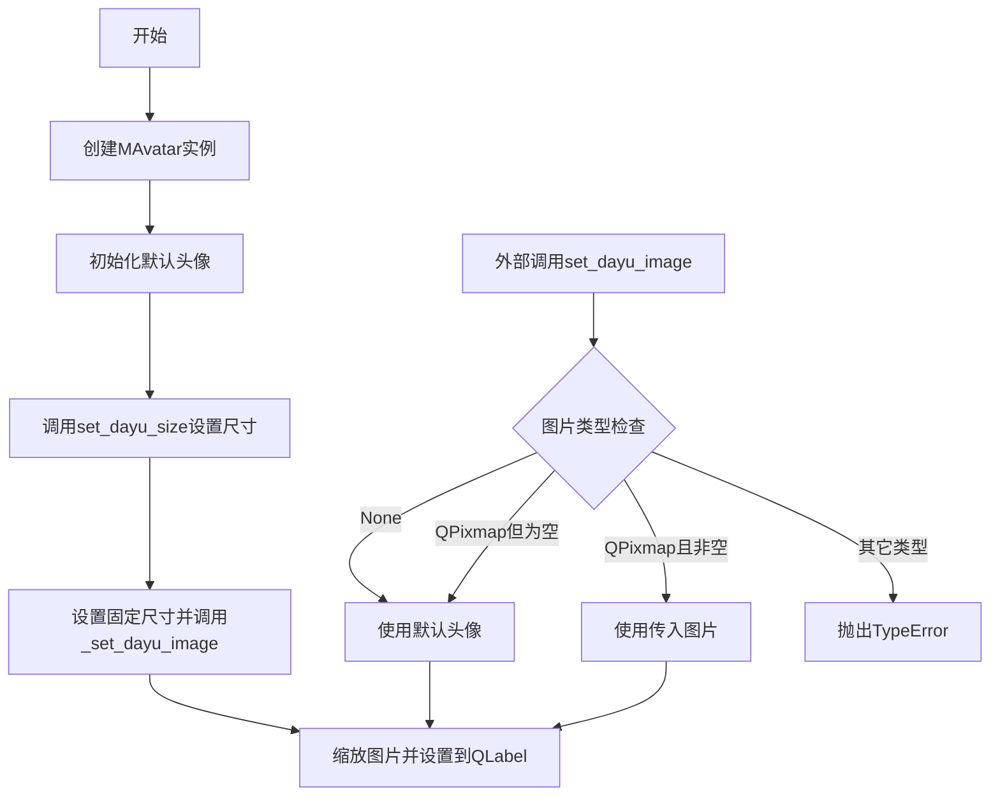

## 类结构

```
QtWidgets.QLabel (Qt内置基类)
└── MAvatar (自定义头像组件)
```

## 全局变量及字段


### `dayu_image`
    
头像图片Qt属性

类型：`QtCore.Property`
    


### `dayu_size`
    
头像尺寸Qt属性

类型：`QtCore.Property`
    


### `MAvatar._default_pix`
    
默认头像图片

类型：`MPixmap`
    


### `MAvatar._pixmap`
    
当前显示的头像图片

类型：`MPixmap`
    


### `MAvatar._dayu_size`
    
头像尺寸数值

类型：`int`
    
    

## 全局函数及方法


### `MAvatar.__init__`

初始化 MAvatar 头像组件，设置默认头像图片、当前头像、尺寸，并应用默认主题尺寸。

参数：

- `parent`：`QtWidgets.QWidget`，父控件，用于指定头像组件的父对象，默认为 `None`
- `flags`：`QtCore.Qt.WindowFlags`，窗口标志，控制组件的窗口属性，默认为 `QtCore.Qt.Widget`

返回值：`None`，构造函数不返回任何值

#### 流程图

```mermaid
flowchart TD
    A[开始 __init__] --> B[调用父类 QLabel 构造函数<br/>super(MAvatar, self).__init__(parent, flags)]
    B --> C[创建默认头像<br/>self._default_pix = MPixmap('user_fill.svg')]
    C --> D[设置当前头像为默认头像<br/>self._pixmap = self._default_pix]
    D --> E[初始化尺寸为0<br/>self._dayu_size = 0]
    E --> F[调用 set_dayu_size 设置默认主题尺寸<br/>set_dayu_size(dayu_theme.default_size)]
    F --> G[结束 __init__]
    
    F -->|内部调用| F1[_set_dayu_size]
    F1 --> F2[设置固定尺寸<br/>setFixedSize]
    F2 --> F3[_set_dayu_image]
    F3 --> F4[缩放并设置头像图片<br/>setPixmap]
```

#### 带注释源码

```python
def __init__(self, parent=None, flags=QtCore.Qt.Widget):
    """
    初始化 MAvatar 头像组件的构造函数。
    
    参数:
        parent: QtWidgets.QWidget, 父控件，默认为 None
        flags: QtCore.Qt.WindowFlags, 窗口标志，默认为 QtCore.Qt.Widget
    
    返回:
        None
    """
    # 调用父类 QLabel 的构造函数，初始化 Qt 控件基类
    super(MAvatar, self).__init__(parent, flags)
    
    # 创建默认头像图片，使用项目内置的 user_fill.svg 图标
    self._default_pix = MPixmap("user_fill.svg")
    
    # 初始化当前显示的头像为默认头像
    self._pixmap = self._default_pix
    
    # 初始化头像尺寸为 0，后续通过 set_dayu_size 应用默认主题尺寸
    self._dayu_size = 0
    
    # 调用 set_dayu_size 方法设置头像尺寸为主题默认大小
    # 该方法内部会调用 _set_dayu_size 和 _set_dayu_image
    self.set_dayu_size(dayu_theme.default_size)
```


### `MAvatar.set_dayu_size`

设置头像组件的尺寸大小，同时会触发图像的缩放以适应新的尺寸。

参数：

-  `value`：`int`，表示头像的尺寸值（像素值），通常为预设的尺寸常量（如 dayu_theme 中的 default_size、huge、large、medium、small、tiny 等）

返回值：`None`，该方法无返回值，仅执行副作用操作

#### 流程图

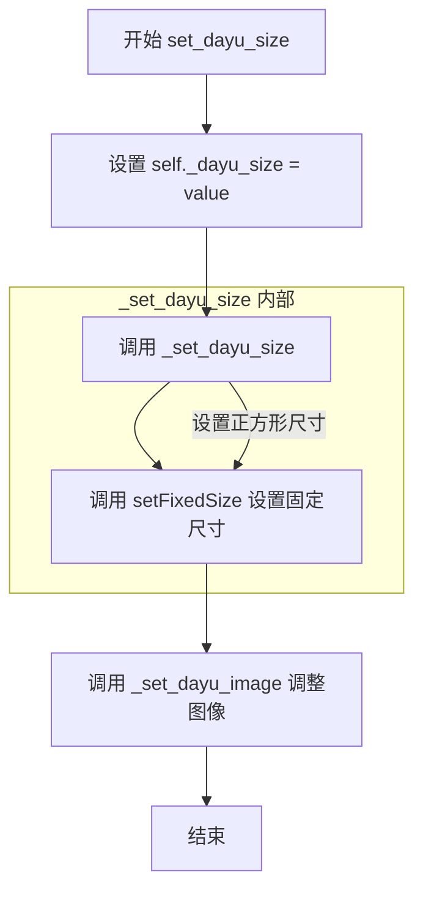

#### 带注释源码

```python
def set_dayu_size(self, value):
    """
    设置头像尺寸。
    :param value: integer 头像尺寸值（像素）
    :return: None
    """
    # 1. 将传入的尺寸值保存到实例属性中
    self._dayu_size = value
    
    # 2. 调用内部方法完成尺寸设置和图像调整
    self._set_dayu_size()
```


### `MAvatar._set_dayu_size`

内部方法，用于设置头像组件的尺寸。该方法调用 Qt 的 `setFixedSize` 设置组件的固定宽高，并根据当前尺寸重新缩放头像图片。

参数： 无

返回值：`None`，无返回值

#### 流程图

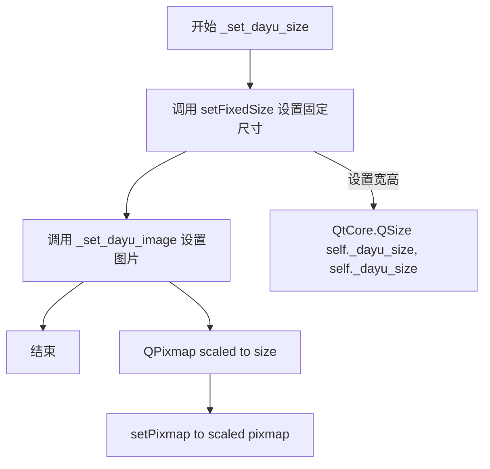

#### 带注释源码

```python
def _set_dayu_size(self):
    """
    内部方法，执行尺寸设置。
    1. 调用 Qt 的 setFixedSize 设置组件的固定宽高
    2. 调用 _set_dayu_image() 重新缩放并设置头像图片
    """
    # 设置组件的固定尺寸为 _dayu_size × _dayu_size
    self.setFixedSize(QtCore.QSize(self._dayu_size, self._dayu_size)) # w, h
    
    # 根据新尺寸重新缩放头像图片并显示
    self._set_dayu_image()
```


### `MAvatar._set_dayu_image`

内部方法，执行图片缩放和设置。该方法将当前 pixmap 缩放以匹配组件尺寸，保持宽高比并使用平滑变换，然后将其设置为 QLabel 的显示图片。

参数：

- `self`：实例本身，MAvatar 类型，调用该方法的实例对象

返回值：`None`，无返回值（方法内部直接操作实例属性）

#### 流程图

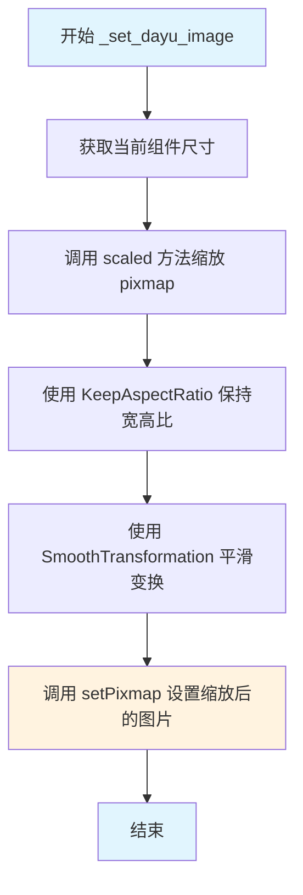

#### 带注释源码

```python
def _set_dayu_image(self):
    """
    内部方法：设置并缩放头像图片
    
    该方法执行以下操作：
    1. 将当前 pixmap 缩放为当前组件尺寸
    2. 保持原始宽高比（不会变形）
    3. 使用平滑变换算法（抗锯齿）
    4. 将缩放后的图片设置为 QLabel 的显示内容
    """
    # 使用 scaled() 方法缩放 pixmap
    # 参数1: self.size() - 目标尺寸为当前组件的实际尺寸
    # 参数2: QtCore.Qt.KeepAspectRatio - 保持原始宽高比，防止图片变形
    # 参数3: QtCore.Qt.SmoothTransformation - 使用平滑变换（质量更高，有抗锯齿效果）
    self._pixmap = self._pixmap.scaled(
        self.size(), 
        QtCore.Qt.KeepAspectRatio, 
        QtCore.Qt.SmoothTransformation
    )
    
    # 将缩放后的 pixmap 设置为 QLabel 的显示图片
    # 此时 QLabel 将显示缩放后的头像图片
    self.setPixmap(self._pixmap)
    
    # 注意：被注释的代码是另一种缩放方式（只按宽度缩放）
    # self.setPixmap(self._pixmap.scaledToWidth(self.width(), QtCore.Qt.SmoothTransformation))
```


### `MAvatar.set_dayu_image`

设置头像图片的公开方法，用于更新 MAvatar 组件显示的头像图像。

参数：

- `value`：`QPixmap` 或 `None`，要设置为头像的图片，传入 None 时使用默认头像

返回值：`None`，该方法无返回值

#### 流程图

```mermaid
flowchart TD
    A[开始 set_dayu_image] --> B{value is None?}
    B -->|是| C[_pixmap = _default_pix]
    B -->|否| D{isinstance value, QPixmap?}
    D -->|是| E{value.isNull()}
    E -->|是| C
    E -->|否| F[_pixmap = value]
    D -->|否| G[raise TypeError]
    C --> H[_set_dayu_image]
    F --> H
    G --> I[结束]
    H --> J[结束]
```

#### 带注释源码

```python
def set_dayu_image(self, value):
    """
    Set avatar image.
    :param value: QPixmap or None.
    :return: None
    """
    # 如果传入值为 None，则使用默认头像图片
    if value is None:
        self._pixmap = self._default_pix
    # 如果传入值是 QPixmap 类型
    elif isinstance(value, QtGui.QPixmap):
        # 如果图片为空，则使用默认头像；否则使用传入的图片
        self._pixmap = self._default_pix if value.isNull() else value
    # 类型不匹配时抛出 TypeError 异常
    else:
        raise TypeError("Input argument 'value' should be QPixmap or None, " "but get {}".format(type(value)))
    # 调用内部方法更新头像显示
    self._set_dayu_image()
```


### `MAvatar.get_dayu_image`

获取当前头像图片的方法，返回存储在组件中的 QPixmap 对象。

参数： 无

返回值：`QtGui.QPixmap`，当前设置的头像图片（如果没有设置则返回默认图片）

#### 流程图

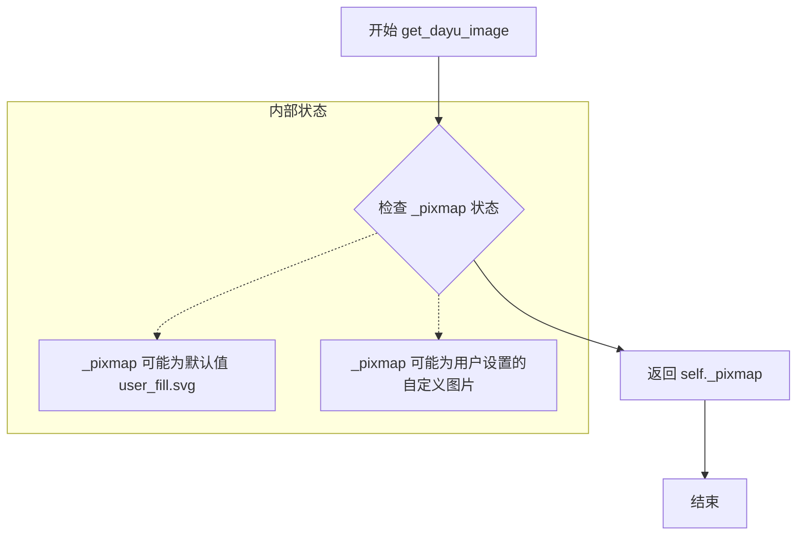

#### 带注释源码

```python
def get_dayu_image(self):
    """
    Get the avatar image.
    :return: QPixmap
    """
    return self._pixmap
```

**代码说明：**
- 这是一个简单的 getter 方法，用于获取当前头像图片
- `self._pixmap` 是类内部存储的 QPixmap 对象
- 初始化时会被设置为默认的 "user_fill.svg" 图片
- 用户可以通过 `set_dayu_image()` 方法设置自定义图片
- 如果设置的值是 None 或空 QPixmap，会回退到默认图片


### `MAvatar.get_dayu_size`

获取当前头像组件的尺寸数值（整数类型，通常代表正方形的边长）。

参数：

- `无`：此方法为实例方法，不需要额外的输入参数（隐含 `self`）。

返回值：`int`，返回当前头像的尺寸大小（像素值）。

#### 流程图

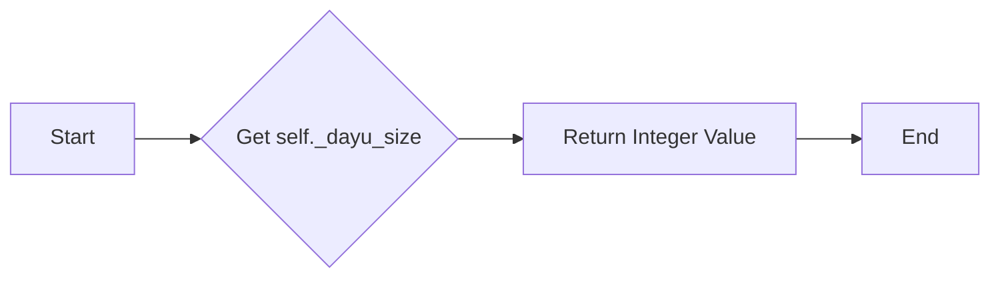

#### 带注释源码

```python
def get_dayu_size(self):
    """
    获取头像尺寸
    Get the avatar size
    
    :return: integer
    :description: 返回当前头像的尺寸大小，通常为正方形边长。
    """
    # 直接返回私有属性 _dayu_size
    # Directly return the private attribute _dayu_size
    return self._dayu_size
```


### `MAvatar.huge`

创建一个具有巨大（huge）尺寸的头像实例的类方法。

参数：

- `image`：`QtGui.QPixmap | None`，头像图像，默认为 None

返回值：`MAvatar`，返回创建的巨大尺寸头像实例

#### 流程图

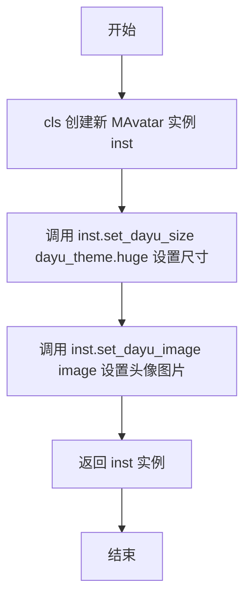

#### 带注释源码

```python
@classmethod
def huge(cls, image=None):
    """
    创建一个 MAvatar 实例并设置巨大尺寸
    :param image: QPixmap 或 None, 头像图像
    :return: MAvatar, 返回巨大尺寸的头像实例
    """
    inst = cls()  # 创建 MAvatar 类的新实例
    inst.set_dayu_size(dayu_theme.huge)  # 设置尺寸为 huge 级别
    inst.set_dayu_image(image)  # 设置头像图像，若为 None 则使用默认图像
    return inst  # 返回配置好的实例
```


### `MAvatar.large`

类方法，用于创建一个 large 尺寸的 MAvatar 实例。该方法通过实例化类、设置预定义的大尺寸主题以及头像图像来生成头像组件。

参数：
- `image`：`QtGui.QPixmap` or `None`，头像图像。

返回值：`MAvatar`，返回设置好的大尺寸头像实例。

#### 流程图

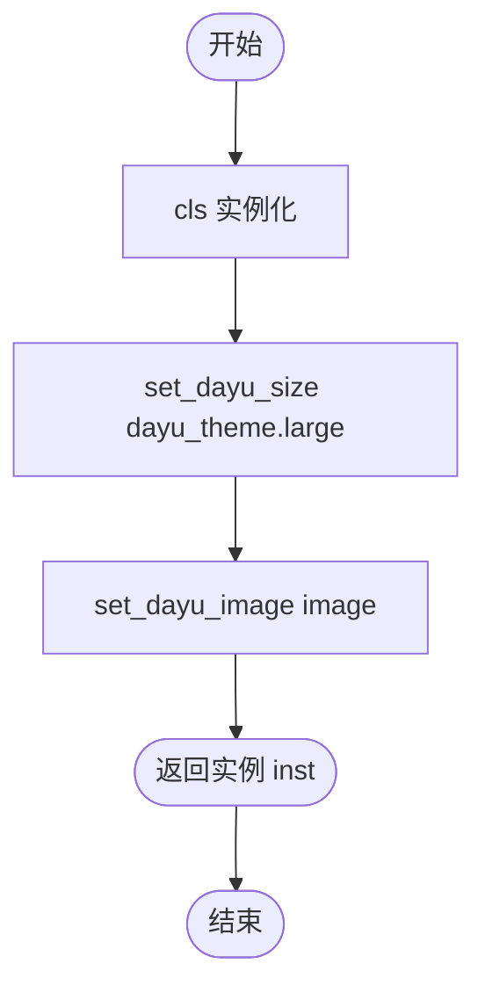

#### 带注释源码

```python
@classmethod
def large(cls, image=None):
    """
    创建一个 large 尺寸的 MAvatar 实例。
    :param image: QPixmap 或 None，头像图像。
    :return: MAvatar 实例。
    """
    inst = cls()  # 1. 实例化 MAvatar 对象
    inst.set_dayu_size(dayu_theme.large)  # 2. 设置头像尺寸为 large
    inst.set_dayu_image(image)  # 3. 设置头像图像
    return inst  # 4. 返回实例
```


### `MAvatar.medium`

创建一个具有中等尺寸（medium）的 MAvatar 头像组件实例。

参数：

- `image`：`QtGui.QPixmap` 或 `None`，可选参数，要设置为头像的图像

返回值：`MAvatar`，返回创建的 MAvatar 实例

#### 流程图

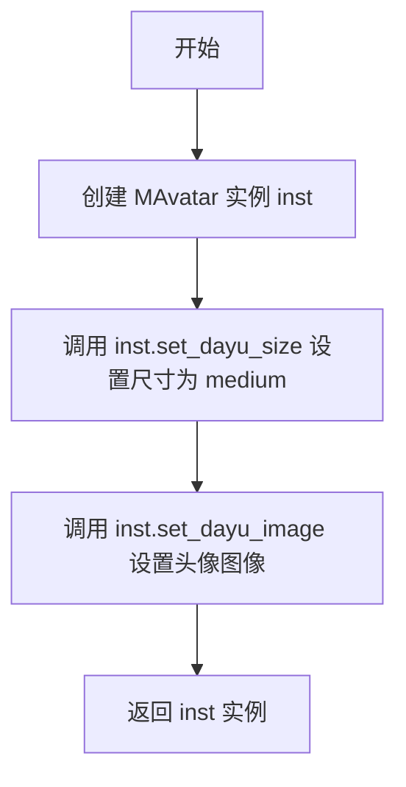

#### 带注释源码

```python
@classmethod
def medium(cls, image=None):
    """Create a MAvatar with medium size"""
    # 创建 MAvatar 类的实例
    inst = cls()
    # 设置头像尺寸为主题中的 medium 尺寸
    inst.set_dayu_size(dayu_theme.medium)
    # 设置头像图像（如果为 None，则使用默认图像）
    inst.set_dayu_image(image)
    # 返回创建的 MAvatar 实例
    return inst
```


### `MAvatar.small`

创建一个具有small尺寸的头像组件实例。

参数：

- `image`：`QtGui.QPixmap` 或 `None`，要设置的头像图像，默认为None

返回值：`MAvatar`，返回创建的small尺寸头像实例

#### 流程图

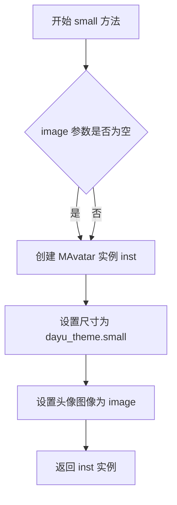

#### 带注释源码

```python
@classmethod
def small(cls, image=None):
    """
    Create a MAvatar with small size
    :param image: QPixmap or None, avatar image to display
    :return: MAvatar instance with small size
    """
    # 创建类的实例
    inst = cls()
    # 设置头像尺寸为 small 规格（通过 dayu_theme 主题配置获取）
    inst.set_dayu_size(dayu_theme.small)
    # 设置头像图像，如果 image 为 None 则使用默认图像
    inst.set_dayu_image(image)
    # 返回创建的头像组件实例
    return inst
```


### MAvatar.tiny

创建并返回一个配置了预设“微小”尺寸的 MAvatar 控件实例。该方法是一种便捷的类方法（Factory Method），用于快速生成特定尺寸的头像组件。

参数：

-  `image`：`Any`，头像图像数据。类型应为 `QtGui.QPixmap` 或 `None`。如果为 `None`，组件将显示默认的占位图。

返回值：`MAvatar`，返回一个新创建的、尺寸为“tiny”的 `MAvatar` 实例。

#### 流程图

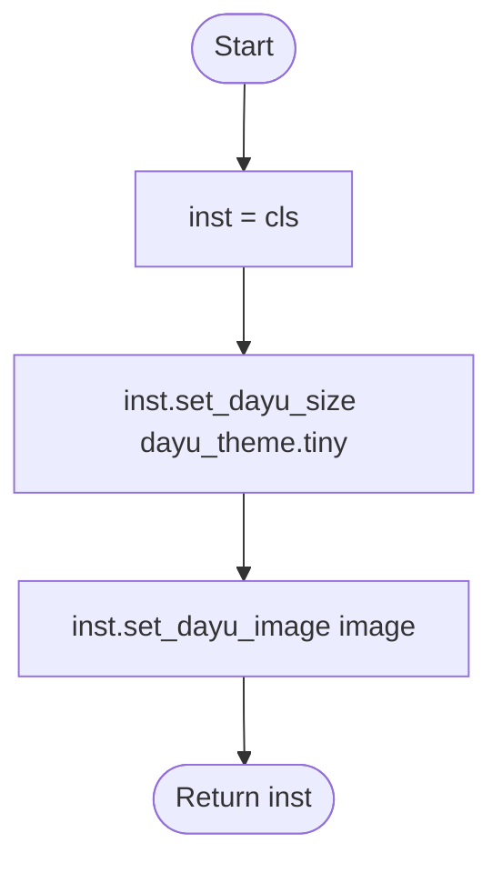

#### 带注释源码

```python
@classmethod
def tiny(cls, image=None):
    """Create a MAvatar with tiny size"""
    # 1. 创建 MAvatar 类的实例
    inst = cls()
    # 2. 设置实例的尺寸为 'tiny' (从 dayu_theme 常量获取)
    inst.set_dayu_size(dayu_theme.tiny)
    # 3. 设置实例的头像图像，如果传入 image 为 None，则显示默认图
    inst.set_dayu_image(image)
    # 4. 返回配置好的实例
    return inst
```

## 关键组件


### MAvatar 类

头像组件，继承自QtWidgets.QLabel，用于显示用户或对象的头像图像，支持设置尺寸和图像。

### 默认图像加载（惰性加载）

使用 MPixmap 加载默认的用户头像 SVG 文件 "user_fill.svg"，在组件初始化时作为默认头像，当用户未设置自定义图像时显示。

### 尺寸管理系统

包含 set_dayu_size()、_set_dayu_size() 和 get_dayu_size() 方法，用于设置和获取头像的尺寸，支持 dayu_theme 中定义的标准尺寸。

### 图像管理系统

包含 set_dayu_image() 和 get_dayu_image() 方法，用于设置和获取头像图像，支持 QPixmap 类型输入和 None 值（重置为默认图像）。

### Qt 属性系统

使用 QtCore.Property 暴露 dayu_image 和 dayu_size 属性，使头像组件可以与 Qt 的属性系统集成，支持 Qt Designer 和 QML 使用。

### 工厂方法集

提供 huge()、large()、medium()、small()、tiny() 五个类方法，分别创建不同标准尺寸的头像实例，方便快速创建预设尺寸的头像。

### 类型检查与错误处理

在 set_dayu_image() 方法中对输入参数进行类型检查，确保输入为 QPixmap 或 None 类型，否则抛出 TypeError 异常。


## 问题及建议


### 已知问题

- **图片重复缩放性能问题**：`_set_dayu_size()` 方法会调用 `_set_dayu_image()`，每次设置大小时都会重新缩放图片，即使图片尺寸没有变化，造成不必要的性能开销
- **属性 setter 职责不清晰**：`set_dayu_size` 方法同时承担了设置大小和更新图片的双重职责，不符合单一职责原则，导致通过 Qt Property 设置大小时会触发图片缩放
- **参数验证缺失**：`set_dayu_size` 方法未对输入的 value 进行有效性验证（如非负数、整数检查），可能导致异常尺寸
- **无效图片处理不一致**：当传入的 QPixmap 是 null 时会被替换为默认图片，但这种行为在文档中没有明确说明，可能导致用户困惑
- **命名风格不统一**：类方法（huge/large/medium/small/tiny）使用静态方法实现，但更符合工厂方法模式，应考虑改为类方法或普通函数
- **缓存机制缺失**：图片每次都会重新调用 `scaled()` 进行缩放，没有缓存机制，对于频繁访问的场景性能不佳

### 优化建议

- 将 `_set_dayu_image()` 拆分为独立的图片更新逻辑，添加尺寸变化检查，仅在尺寸真正变化时才重新缩放图片
- 为 `set_dayu_size` 添加参数验证逻辑，检查 value 是否为正整数，并在非法输入时抛出明确的异常或使用默认值
- 考虑使用 `@functools.lru_cache` 或手动缓存机制存储已缩放的图片，避免重复计算
- 将类方法改为工厂方法模式，使用更清晰的命名如 `create_with_size()`，或在文档中明确说明这些是工厂方法
- 添加单元测试覆盖边界情况，如传入负数、0、None、无效类型等场景
- 考虑将 `_set_dayu_image` 改为受保护的方法，允许子类重写以实现自定义的图片处理逻辑


## 其它


### 设计目标与约束

MAvatar组件的设计目标是为Qt应用程序提供一个可复用的头像显示组件，支持不同尺寸的头像显示（tiny/small/medium/large/huge），并通过Qt属性系统与dayu_theme主题系统集成。约束条件包括：只接受QPixmap类型或None作为图片输入，头像尺寸必须为整数且来源于dayu_theme定义的标准尺寸，组件继承自QLabel因此具备标签的基本特性。

### 错误处理与异常设计

代码中的错误处理采用显式异常抛出机制。在set_dayu_image方法中，当传入的value参数既不是QPixmap也不是None时，会抛出TypeError异常，明确说明期望类型与实际类型。空图片（isNull()）会被自动替换为默认头像。属性设置通过Qt的Property机制封装，保证类型安全。

### 数据流与状态机

MAvatar的状态流转如下：初始状态→设置尺寸→设置图片→显示状态。当调用set_dayu_size时，会触发_set_dayu_size内部方法，进而调用_set_dayu_image重新缩放图片并显示。当调用set_dayu_image时，会验证类型，然后更新_pixmap并调用_set_dayu_image刷新显示。两个核心状态变量为_dayu_size（整数尺寸）和_pixmap（QPixmap对象）。

### 外部依赖与接口契约

外部依赖包括：PySide6.QtCore、PySide6.QtGui、PySide6.QtWidgets（Qt框架核心模块）、dayu_theme模块（提供default_size及尺寸常量）、qt.MPixmap模块（提供默认头像图片资源）。接口契约方面：set_dayu_size接受整数类型参数，set_dayu_image接受QPixmap或None类型参数，get_dayu_image返回QPixmap类型，get_dayu_size返回整数类型，类方法huge/large/medium/small/tiny接受可选的QPixmap参数并返回MAvatar实例。

### 继承关系与扩展性

MAvatar继承自QtWidgets.QLabel，因此天然具备QLabel的所有特性（如对齐方式、边框、背景等）。扩展性体现在：可通过重写_set_dayu_image方法自定义图片渲染逻辑，可通过Qt样式表（QSS）定制外观，可通过继承并添加新的类方法扩展预设尺寸。dayu_image和dayu_size通过Qt Property机制暴露给Qt元对象系统，支持Qt Designer集成和数据绑定。

### 线程安全性分析

该组件本身（非线程安全）：set_dayu_size和set_dayu_image方法直接操作UI元素，根据Qt文档，这些方法必须在主线程中调用。_pixmap和_dayu_size的读写操作没有加锁保护，因此不建议在非主线程中直接修改这些属性。如需跨线程更新头像，应使用QMetaObject.invokeMethod或QTimer.singleShot将更新操作调度到主线程。

### 性能考虑与优化空间

当前实现中，每次调用set_dayu_image都会调用scaled方法进行图片缩放，如果图片已经正确尺寸则存在重复缩放。可以添加缓存机制：当新图片尺寸与组件尺寸一致时，直接使用原图而无需缩放。另外，_set_dayu_image方法中先将pixmap缩放后再设置，可以考虑使用setScaledContents(True)配合样式表来利用Qt内置的缩放机制，可能提升渲染性能。

### 可访问性（Accessibility）

当前实现未显式设置可访问性相关属性。建议补充：setAccessibleName方法设置组件的可访问名称（如"用户头像"），setToolTip提供图片的描述信息（如头像的alt文本），确保屏幕阅读器能够正确读取头像状态。

    