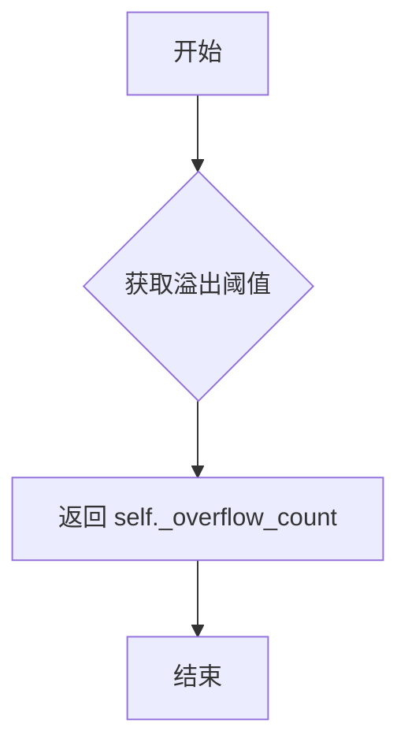
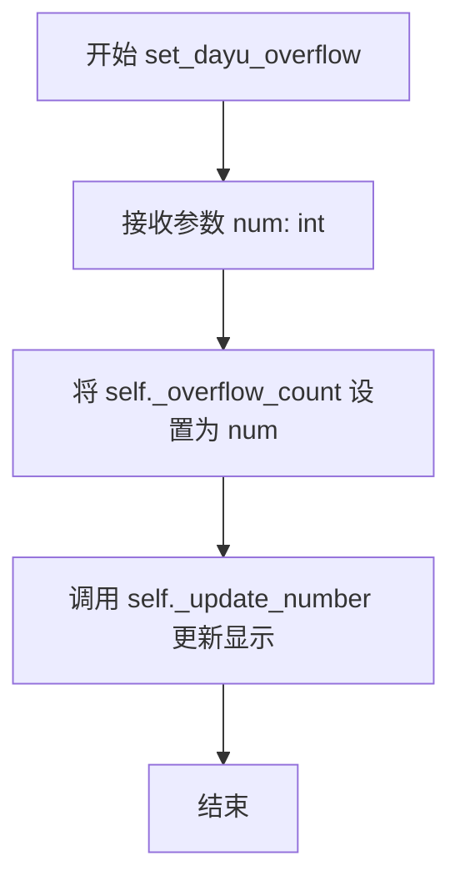
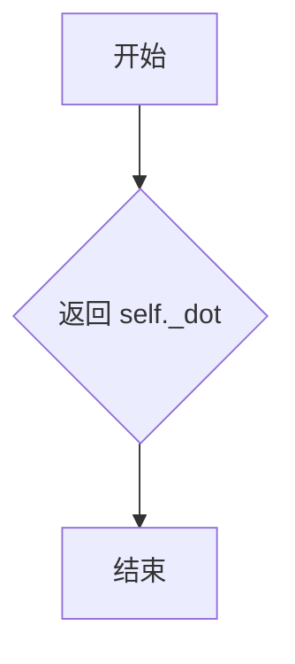
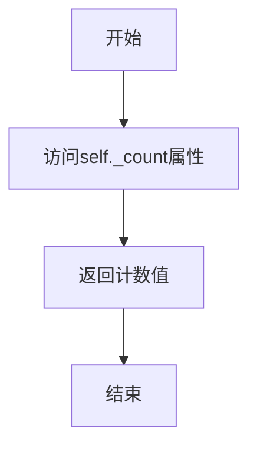
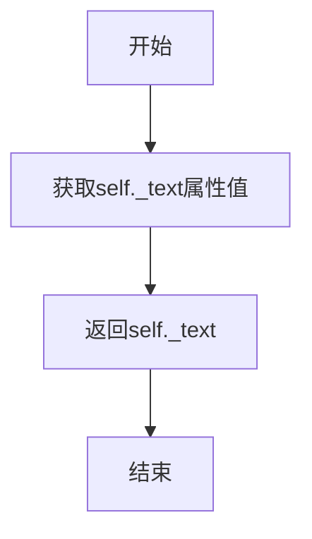
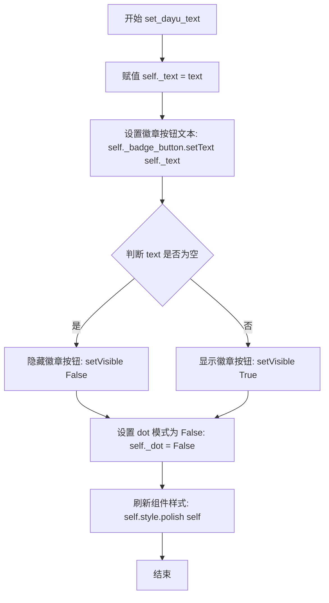
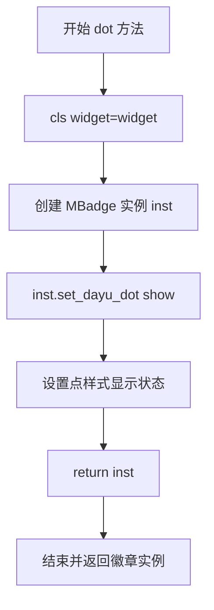
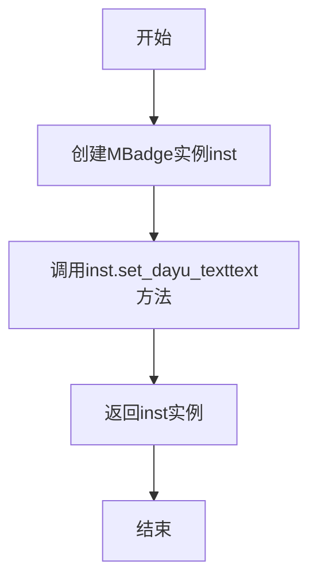

# `comic-translate\app\ui\dayu_widgets\badge.py` 详细设计文档

MBadge是一个Qt徽章组件，用于在包装的小部件右上角显示通知标记，支持点(dot)、数字(count)和文本(text)三种样式展示未读消息计数或自定义内容。

## 整体流程

```mermaid
graph TD
    A[开始] --> B[创建MBadge实例]
    B --> C{是否传入widget?}
    C -- 是 --> D[将widget添加到主布局]
    C -- 否 --> E[创建空白布局]
    D --> F[初始化徽章按钮和属性]
    E --> F
    F --> G[设置显示样式]
    G --> H{样式类型}
    H -- dot --> I[set_dayu_dot]
    H -- count --> J[set_dayu_count]
    H -- text --> K[set_dayu_text]
    I --> L[调用_update_number更新显示]
    J --> L
    K --> L
    L --> M[调用style().polish刷新样式]
```

## 类结构

```
QWidget (Qt基类)
└── MBadge (徽章组件)
```

## 全局变量及字段


### `MBadge._widget`
    
The wrapped widget that the badge is attached to

类型：`QtWidgets.QWidget | None`
    


### `MBadge._overflow_count`
    
Maximum count before overflow, default is 99

类型：`int`
    


### `MBadge._dot`
    
Flag indicating whether dot style is enabled

类型：`bool`
    


### `MBadge._text`
    
Text content to display in the badge

类型：`str | None`
    


### `MBadge._count`
    
Numeric count to display in the badge

类型：`int | None`
    


### `MBadge._badge_button`
    
Button widget used to render the badge display

类型：`QtWidgets.QPushButton`
    


### `MBadge._main_lay`
    
Grid layout managing the widget and badge positioning

类型：`QtWidgets.QGridLayout`
    
    

## 全局函数及方法


### `MBadge.__init__`

初始化MBadge组件，创建徽章的基础结构和默认属性

参数：

- `widget`：`QtWidgets.QWidget`，可选，被装饰的组件，徽章将显示在该组件的右上角
- `parent`：`QtWidgets.QWidget`，可选，父组件，用于组件层级管理

返回值：`None`，构造函数不返回值

#### 流程图

```mermaid
flowchart TD
    A[开始初始化] --> B[调用父类构造函数super().__init__parent]
    B --> C[保存widget引用到self._widget]
    C --> D[初始化属性: _overflow_count=99]
    D --> E[初始化属性: _dot=False, _text=None, _count=None]
    E --> F[创建QPushButton赋值给self._badge_button]
    F --> G[设置按钮大小策略为Minimum]
    G --> H[创建QGridLayout赋值给self._main_lay]
    H --> I[设置布局边距为0,0,0,0]
    I --> J{判断widget是否不为None}
    J -->|是| K[将widget添加到布局0,0位置]
    J -->|否| L[跳过添加widget]
    K --> M[将badge_button添加到布局0,0位置,对齐方式为右上角]
    L --> M
    M --> N[设置当前组件的布局为_main_lay]
    N --> O[结束初始化]
```

#### 带注释源码

```python
def __init__(self, widget=None, parent=None):
    """
    初始化Badge组件
    :param widget: 被装饰的组件，徽章将显示在该组件右上角
    :param parent: 父组件，用于Qt组件层级管理
    """
    # 调用父类QWidget的初始化方法，建立Qt对象层级
    super(MBadge, self).__init__(parent)
    
    # 保存被装饰的组件引用，用于后续布局
    self._widget = widget
    
    # 初始化溢出计数阈值，默认为99，超过此数字显示"99+"
    self._overflow_count = 99

    # 初始化徽章显示状态标志
    self._dot = False      # 是否显示圆点样式
    self._text = None     # 文本内容
    self._count = None    # 数字计数

    # 创建徽章显示按钮，用于展示圆点/数字/文本
    self._badge_button = QtWidgets.QPushButton()
    # 设置按钮大小策略为最小尺寸，适应内容
    self._badge_button.setSizePolicy(QtWidgets.QSizePolicy.Minimum, QtWidgets.QSizePolicy.Minimum)

    # 创建网格布局，用于叠加显示徽章
    self._main_lay = QtWidgets.QGridLayout()
    # 设置布局边距为0，使徽章紧贴被装饰组件边缘
    self._main_lay.setContentsMargins(0, 0, 0, 0)
    
    # 如果提供了widget，则将其添加到布局中心位置
    if widget is not None:
        self._main_lay.addWidget(widget, 0, 0)
    
    # 将徽章按钮添加到布局右上角，实现叠加效果
    self._main_lay.addWidget(self._badge_button, 0, 0, QtCore.Qt.AlignTop | QtCore.Qt.AlignRight)
    
    # 设置当前组件使用该网格布局
    self.setLayout(self._main_lay)
```


### `MBadge.get_dayu_overflow`

获取当前设置的溢出数值。该方法返回 Badge 组件的溢出阈值，当显示的计数超过此阈值时，会以特定格式（如 "99+"）显示。

参数： 无

返回值：`int`，返回当前设置的溢出阈值数值（默认为 99）

#### 流程图



#### 带注释源码

```python
def get_dayu_overflow(self):
    """
    获取当前溢出数值
    :return: int 当前设置的溢出阈值
    """
    # 直接返回内部属性 _overflow_count
    # 该属性用于控制计数显示的最大值
    # 当计数超过此值时，会显示为 "99+" 格式
    return self._overflow_count
```


### `MBadge.set_dayu_overflow`

设置徽章的溢出数值，用于控制数字显示的上限。当实际计数超过该值时，徽章将显示为溢出格式（如"99+"）。

参数：

- `num`：`int`，新的最大显示数值

返回值：`None`，无返回值描述

#### 流程图



#### 带注释源码

```python
def set_dayu_overflow(self, num):
    """
    设置溢出数字
    :param num: 新的最大显示数值
    :return: None
    """
    # 将内部属性 _overflow_count 更新为传入的 num 值
    self._overflow_count = num
    # 调用内部方法更新徽章的数字显示样式
    self._update_number()
```


### `MBadge.get_dayu_dot`

获取当前徽章样式是否为点状（dot）样式，以及点是否正在显示。

参数：

- （无参数，仅有隐式参数 `self`）

返回值：`bool`，返回当前徽章是否处于点状样式且该点是否可见（`True` 表示显示点样式，`False` 表示不显示）

#### 流程图



#### 带注释源码

```python
def get_dayu_dot(self):
    """
    Get current style is dot or not and dot is show or not
    :return: bool
    """
    return self._dot
```


### `MBadge.set_dayu_dot`

设置徽章组件的点状样式，并控制是否显示该点。

参数：

- `show`：`bool`，控制是否显示点状徽章

返回值：`None`，无返回值

#### 流程图

```mermaid
flowchart TD
    A[开始 set_dayu_dot] --> B[设置 self._dot = show]
    B --> C[清空徽章按钮文本]
    C --> D[根据 show 参数设置徽章按钮可见性]
    D --> E[调用 style().polish 刷新样式]
    E --> F[结束]
```

#### 带注释源码

```python
def set_dayu_dot(self, show):
    """
    Set dot style and weather show the dot or not
    :param show: bool
    :return: None
    """
    # 将传入的 show 参数保存到实例变量 _dot 中，用于记录当前是否启用点状样式
    self._dot = show
    # 清空徽章按钮的文本内容，因为点状样式不显示文本
    self._badge_button.setText("")
    # 根据 show 参数设置徽章按钮的可见性，为 True 时显示点状徽章
    self._badge_button.setVisible(show)
    # 调用 Qt 样式系统的 polish 方法，刷新组件外观以应用最新样式
    self.style().polish(self)
```


### `MBadge.get_dayu_count`

该方法是一个简单的getter访问器，用于获取MBadge徽章组件当前设置的计数数值（dayu_count属性），返回徽章上显示的数字。

参数：

- `self`：`MBadge`，隐含的实例参数，表示当前MBadge对象

返回值：`int`，返回当前设置的计数数值，如果没有设置则返回None

#### 流程图



#### 带注释源码

```python
def get_dayu_count(self):
    """
    Get actual count number
    :return: int
    """
    # 返回当前存储的计数数值
    return self._count
```


### `MBadge.set_dayu_count`

设置徽章组件的数字显示样式，将指定的数值设置为徽章的计数，并更新界面显示。

参数：

- `num`：`int`，要设置的计数数值，表示徽章上显示的数字

返回值：`None`，该方法不返回任何值，仅更新内部状态并刷新界面

#### 流程图

```mermaid
flowchart TD
    A[开始 set_dayu_count] --> B[接收 num 参数]
    B --> C[将 num 赋值给 self._count]
    C --> D[调用 _update_number 方法]
    D --> E[调用 utils.overflow_format 格式化计数]
    E --> F[设置 badge_button 显示文本]
    F --> G{self._count > 0?}
    G -->|是| H[设置 badge_button 可见]
    G -->|否| I[设置 badge_button 不可见]
    H --> J[重置 self._dot 为 False]
    I --> J
    J --> K[调用 style().polish 刷新样式]
    K --> L[结束]
```

#### 带注释源码

```python
def set_dayu_count(self, num):
    """
    Set current style to show a number

    :param num: int
    :return: None
    """
    # 将传入的数值赋给实例变量 _count，保存当前计数状态
    self._count = num
    
    # 调用内部方法 _update_number，更新 UI 显示
    # 该方法会根据计数设置按钮文本、可见性及样式
    self._update_number()
```


### `MBadge.get_dayu_text`

获取当前显示的文本内容。该方法是MBadge类的属性getter方法，用于返回当前badge组件所显示的文本字符串。

参数：无

返回值：`six.string_types`，当前badge组件显示的文本内容，如果没有设置文本则返回None。

#### 流程图



#### 带注释源码

```python
def get_dayu_text(self):
    """
    获取当前显示的文本
    :return: six.string_types
    """
    return self._text  # 返回当前存储的文本内容，可能为None
```


### `MBadge.set_dayu_text`

设置徽章组件显示文本内容，并将样式切换为文本模式。

参数：

- `text`：`six.string_types`，要显示的文本内容

返回值：`None`，无返回值

#### 流程图



#### 带注释源码

```python
def set_dayu_text(self, text):
    """
    Set current style to show a text.
    :param text: six.string_types
    :return: None
    """
    # 1. 保存传入的文本内容到实例变量
    self._text = text
    
    # 2. 更新徽章按钮的显示文本
    self._badge_button.setText(self._text)
    
    # 3. 根据文本是否为空设置徽章按钮的可见性
    #    如果有文本则显示徽章，否则隐藏徽章
    self._badge_button.setVisible(bool(self._text))
    
    # 4. 关闭 dot 模式（徽章不再显示为圆点样式）
    self._dot = False
    
    # 5. 刷新组件样式，确保 UI 正确更新
    self.style().polish(self)
```


### `MBadge._update_number`

该方法用于更新徽章显示的数字，根据当前计数和溢出阈值格式化显示文本，并控制徽章按钮的可见性和样式刷新。

参数：

- `self`：实例本身，包含所有实例属性，无需显式传递

返回值：`None`，无返回值（Python 方法默认返回 None）

#### 流程图

```mermaid
flowchart TD
    A[开始 _update_number] --> B[调用 utils.overflow_format 格式化数字]
    B --> C[设置徽章按钮文本]
    C --> D{self._count > 0?}
    D -->|是| E[设置徽章按钮可见]
    D -->|否| F[设置徽章按钮不可见]
    E --> G[设置 self._dot = False]
    F --> G
    G --> H[调用 style().polish 刷新样式]
    H --> I[结束]
```

#### 带注释源码

```python
def _update_number(self):
    """
    更新徽章显示的数字。
    根据当前计数和溢出阈值格式化显示文本，
    并控制徽章按钮的可见性和样式刷新。
    """
    # 使用工具函数格式化数字（处理溢出情况，如 99+）
    self._badge_button.setText(utils.overflow_format(self._count, self._overflow_count))
    
    # 仅当计数大于 0 时才显示徽章按钮
    self._badge_button.setVisible(self._count > 0)
    
    # 重置 dot 样式为 False，确保显示数字而非圆点
    self._dot = False
    
    # 刷新部件样式，确保 UI 更新
    self.style().polish(self)
```


### `MBadge.dot`

创建并返回一个带点样式的徽章（Badge）实例的类方法。该方法接受显示状态和可选的包装部件参数，创建一个新的MBadge实例并将其配置为点样式后返回。

参数：

- `show`：`bool`，控制点是否显示，True为显示，False为隐藏
- `widget`：`QtWidgets.QWidget`，可选参数，要包装的部件，徽章将显示在该部件的右上角

返回值：`MBadge`，返回新创建的带点样式的徽章实例

#### 流程图



#### 带注释源码

```python
@classmethod
def dot(cls, show=False, widget=None):
    """
    Create a Badge with dot style.
    
    这是一个类方法（classmethod），用于快速创建带点样式的徽章。
    它是MBadge类的三种工厂方法之一（另外两个是count和text）。
    
    :param show: bool - 控制点是否显示。True显示点，False隐藏点
    :param widget: the wrapped widget - 可选参数，要被徽章包装的Qt部件
    :return: instance badge - 返回新创建的MBadge实例
    """
    # 使用cls（MBadge类本身）调用构造函数，创建新实例
    # 将widget参数传递给__init__方法
    inst = cls(widget=widget)
    
    # 调用实例方法set_dayu_dot，设置点样式的显示状态
    # 这会更新_dot属性并控制badge_button的可见性
    inst.set_dayu_dot(show)
    
    # 返回配置好的徽章实例
    return inst
```


### `MBadge.count`

创建一个带数字样式（count）的徽章实例。用于在目标小部件右上角显示未读消息数量等计数值，支持溢出显示（如显示"99+"）。

参数：

- `count`：`int`，徽章显示的数字，默认为0
- `widget`：`QtWidgets.QWidget`，被徽章包装的小部件，默认为None

返回值：`MBadge`，返回创建的徽章实例对象

#### 流程图

```mermaid
flowchart TD
    A[开始 count 类方法] --> B{检查 widget 参数}
    B -->|widget 不为 None| C[创建 MBadge 实例 inst]
    B -->|widget 为 None| C
    C --> D[调用 inst.set_dayu_count(count)]
    D --> E[返回 inst 实例]
    E --> F[结束]
    
    subgraph set_dayu_count 内部流程
    G[设置 self._count = num] --> H[调用 _update_number]
    H --> I[根据溢出值格式化显示文本]
    I --> J[设置按钮可见性为 num > 0]
    J --> K[重置 dot 样式为 False]
    K --> L[应用样式 polish]
    end
```

#### 带注释源码

```python
@classmethod
def count(cls, count=0, widget=None):
    """
    Create a Badge with number style.
    :param count: int
    :param widget: the wrapped widget
    :return: instance badge
    """
    # 使用 cls (即 MBadge 类) 创建实例，等价于 MBadge(widget=widget)
    inst = cls(widget=widget)
    # 调用实例方法设置徽章显示的数字
    inst.set_dayu_count(count)
    # 返回配置好的徽章实例
    return inst
```


### `MBadge.text`

创建一个带有文本样式的徽章（Badge）实例。

参数：

- `cls`：类本身，类方法的第一个参数
- `text`：`six.string_types`，要显示的文本内容，默认为空字符串
- `widget`：`QtWidgets.QWidget`，被包装的部件，默认为None

返回值：`MBadge`，返回带有文本样式的徽章实例

#### 流程图



#### 带注释源码

```python
@classmethod
def text(cls, text="", widget=None):
    """
    Create a Badge with text style.
    :param text: six.string_types
    :param widget: the wrapped widget
    :return: instance badge
    """
    # 创建MBadge实例，传入widget参数
    inst = cls(widget=widget)
    # 调用set_dayu_text方法设置显示的文本内容
    inst.set_dayu_text(text)
    # 返回配置好的Badge实例
    return inst
```

## 关键组件


### MBadge主类

MBadge是Qt徽章组件，用于在包装的小部件右上角显示通知计数、点状标记或文本。有三种样式：dot（圆点）、count（数字）、text（文本），支持溢出处理（如99+）。

### 三种样式系统

支持dot（仅显示圆点）、count（显示数字，溢出时显示为"99+"等形式）、text（显示自定义文本）三种显示模式，通过set_dayu_dot、set_dayu_count、set_dayu_text方法切换。

### Qt Property属性系统

使用QtCore.Property定义dayu_dot、dayu_count、dayu_text、dayu_overflow四个可绑定属性，实现Qt元对象系统与Python属性的集成，支持Qt Designer和样式表绑定。

### 溢出处理机制

通过overflow_count属性控制数字溢出阈值（默认99），当计数超过阈值时调用utils.overflow_format格式化显示（如"99+"），_update_number方法处理溢出逻辑。

### 工厂方法模式

提供dot()、count()、text()三个类方法作为工厂方法，简化实例创建过程，支持链式调用和快速创建特定样式的徽章实例。

### 包装小部件管理

通过GridLayout将传入的widget与徽章按钮组合，利用Qt.AlignTop|QtCore.Qt.AlignRight定位实现右上角对齐显示。

### 样式刷新机制

在属性变更后调用self.style().polish(self)触发Qt样式系统刷新，确保UI及时更新。


## 问题及建议


### 已知问题

- **属性类型声明与实际返回值不匹配**：`dayu_text` 属性声明为 `str` 类型，但 `get_dayu_text()` 返回的 `self._text` 可能是 `None`，与声明的类型不一致
- **缺少负数和零值处理**：`set_dayu_count` 方法未对负数进行处理，且当 `num` 为 0 时 `_update_number` 会隐藏徽章，但逻辑不够明确
- **状态重置逻辑分散**：`set_dayu_count` 和 `set_dayu_text` 都手动设置 `self._dot = False`，但没有统一的清空状态机制，可能导致状态不一致
- **依赖外部函数无校验**：直接使用 `utils.overflow_format` 但未检查该函数是否存在或导入失败
- **类文档字符串有笔误**：`dayu_text: six.string_types` 后的描述 "number at" 不完整，缺少实际说明内容
- **方法注释不完整**：部分方法参数描述过于简略，如 `set_dayu_count` 的 `:param num: int` 缺少实际业务含义说明
- **事件处理缺失**：未重写任何事件处理方法（如 `resizeEvent`、`showEvent`），可能导致徽章在特定场景下显示异常

### 优化建议

- **统一状态管理**：考虑添加 `_style_type` 枚举或状态变量，明确区分 dot/count/text 三种模式，避免手动重置多个标志位
- **添加输入校验**：在 `set_dayu_count` 中添加负数处理逻辑，在 `set_dayu_text` 中添加 None 值处理
- **修复属性类型**：将 `dayu_text` 的 Qt Property 类型改为 `str` 或 `object`，并确保 getter 返回值类型一致
- **优化样式更新**：考虑使用 `update()` 或 `repaint()` 替代 `style().polish(self)`，或在批量设置时延迟样式更新
- **添加清空方法**：提供 `clear()` 或 `reset()` 方法，用于一键重置所有状态
- **完善文档**：补充类文档字符串中的缺失描述，完善各方法的参数业务含义说明
- **添加类型注解**：使用 Python 3 类型注解（typing）增强代码可维护性

## 其它


### 设计目标与约束

**设计目标：**
- 提供一个轻量级的Badge组件，用于在任意Qt Widget右上角显示通知数量、状态点或文本
- 支持三种展示模式：dot（圆点）、count（数字）、text（文本）
- 通过Qt Property机制支持Qt样式系统（QSS）的属性绑定
- 提供简洁的类方法工厂（dot/count/text）方便快速创建实例

**设计约束：**
- 依赖PySide6（Qt for Python）库
- 目标Widget必须为QtWidgets.QWidget或子类
- 溢出计数默认值为99，超过时显示"99+"
- 组件采用GridLayout布局，Badge按钮固定在右上角

### 错误处理与异常设计

**异常处理机制：**
- 参数类型检查：set_dayu_count方法接收int类型，传入非int值时Python会抛出TypeError
- 参数值检查：set_dayu_overflow方法未做负数检查，可能导致异常行为
- 空值处理：set_dayu_text方法使用bool(self._text)判断，非空字符串返回True，空字符串和None返回False

**边界情况处理：**
- count <= 0时隐藏Badge按钮
- text为None或空字符串时隐藏Badge按钮
- widget为None时仅创建Badge组件，不添加被包装的Widget

### 数据流与状态机

**状态机模型：**

```
┌─────────────────────────────────────────────────────────────┐
│                      MBadge State                           │
├─────────────────────────────────────────────────────────────┤
│                                                             │
│  ┌─────────┐    set_dayu_dot(True)    ┌──────────────┐     │
│  │  IDLE   │ ────────────────────────► │    DOT       │     │
│  │(无显示) │                           │   (圆点)     │     │
│  └─────────┘                           └──────────────┘     │
│       ▲                                       │             │
│       │              set_dayu_dot(False)      │             │
│       └───────────────────────────────────────┘             │
│                                                             │
│  ┌─────────┐   set_dayu_count(n) n>0     ┌──────────────┐   │
│  │  IDLE   │ ──────────────────────────►  │    COUNT     │   │
│  │(无显示) │                              │   (数字)     │   │
│  └─────────┘                              └──────────────┘   │
│       ▲                                        │             │
│       │         set_dayu_count(0) 或         │             │
│       │         set_dayu_dot/text            │             │
│       └───────────────────────────────────────┘             │
│                                                             │
│  ┌─────────┐   set_dayu_text(t) t!=''    ┌──────────────┐   │
│  │  IDLE   │ ──────────────────────────►  │    TEXT      │   │
│  │(无显示) │                              │   (文本)     │   │
│  └─────────┘                              └──────────────┘   │
│                                                             │
└─────────────────────────────────────────────────────────────┘
```

**数据流向：**
- 用户调用setter方法 → 更新内部私有变量（_dot/_count/_text） → 调用_update_number或直接操作按钮 → 调用style().polish()刷新样式

### 外部依赖与接口契约

**外部依赖：**
- PySide6.QtCore：QtCore.Property用于定义Qt属性
- PySide6.QtWidgets：QWidget、QPushButton、QGridLayout、QSizePolicy
- 本地模块from . import utils：调用overflow_format函数进行溢出格式化

**接口契约：**
- MBadge类必须作为QWidget子类使用，遵循Qt对象父子关系
- widget参数可以是None或任意QWidget子类实例
- dayu_overflow属性值应为正整数，默认99
- dayu_dot、dayu_count、dayu_text为Qt可绑定属性，支持QSS样式设置

### 使用示例与API参考

**基本用法：**
```python
# 包装已有Widget
button = QPushButton("Click")
badge = MBadge.dot(show=True, widget=button)

# 设置数字
badge.set_dayu_count(10)

# 设置溢出值
badge.set_dayu_overflow(50)

# 设置文本
badge.set_dayu_text("New")
```

**类方法工厂：**
- MBadge.dot(show=False, widget=None) → 创建圆点样式Badge实例
- MBadge.count(count=0, widget=None) → 创建数字样式Badge实例
- MBadge.text(text="", widget=None) → 创建文本样式Badge实例

### 样式定制建议

**Qt样式表（QSS）示例：**
```css
QPushButton[class="badge"] {
    background-color: red;
    color: white;
    border-radius: 10px;
    min-width: 20px;
    max-width: 20px;
    min-height: 20px;
    max-height: 20px;
    font-size: 12px;
}
```

**注意事项：**
- 当前实现中_badge_button未设置objectName，需手动添加样式选择器
- style().polish()调用确保样式更新生效，但可能在某些场景下性能开销较大

### 兼容性信息

**Python版本：**
- 代码使用__future__导入支持Python 2/3兼容性
- 建议使用Python 3.6+

**Qt版本：**
- 基于PySide6（Qt6）
- 与PyQt6 API兼容，迁移时需调整命名空间

**平台支持：**
- 跨平台（Windows/Linux/macOS），依赖Qt原生支持

    