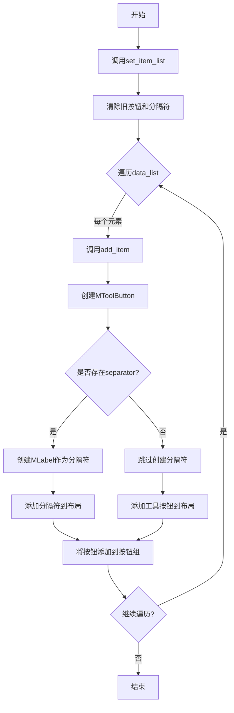
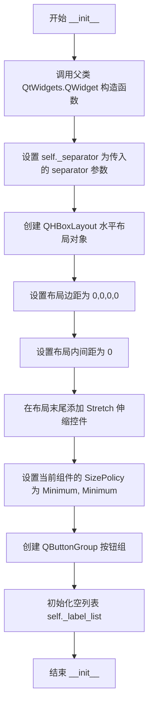
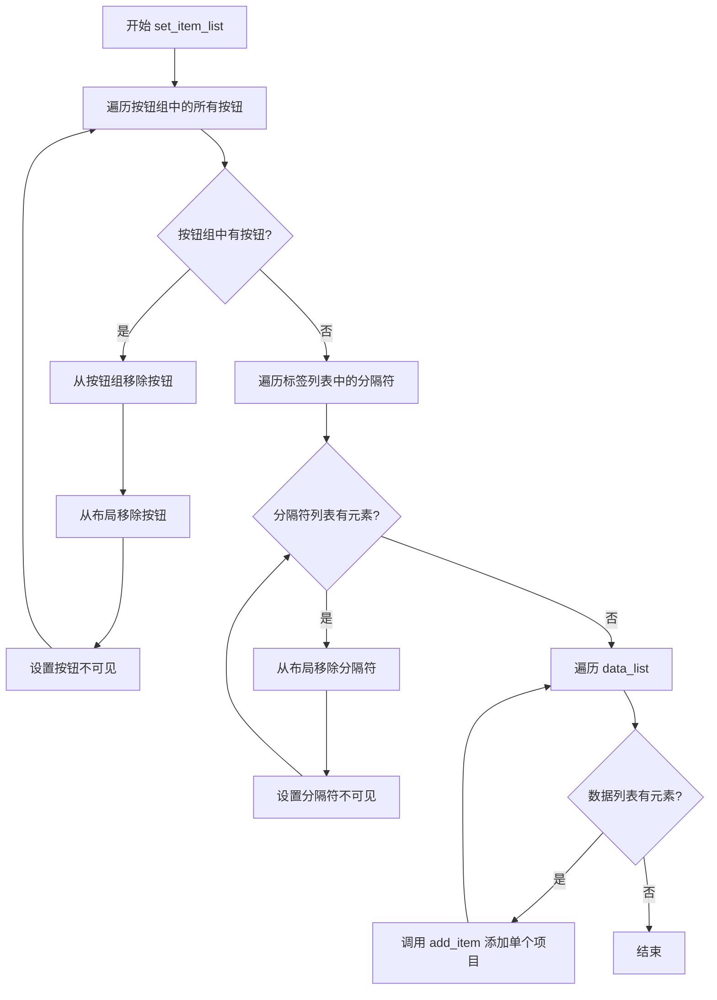
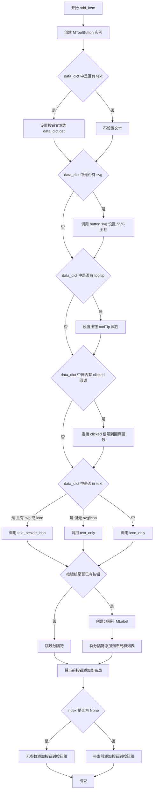

# `comic-translate\app\ui\dayu_widgets\breadcrumb.py` 详细设计文档

MBreadcrumb是一个基于PySide6的Qt面包屑导航组件，用于显示当前在层级结构中的位置，并允许用户返回到更高级别的状态。该组件支持文本、SVG图标、工具提示和点击回调功能，通过水平布局管理多个工具按钮和分隔符。

## 整体流程



## 类结构

```
QtWidgets.QWidget (Qt基类)
└── MBreadcrumb (本模块自定义组件)
```

## 全局变量及字段


### `MBreadcrumb._separator`
    
分隔符字符串，用于面包屑项之间的分隔

类型：`str`
    


### `MBreadcrumb._main_layout`
    
水平布局管理器，用于管理面包屑组件的布局

类型：`QtWidgets.QHBoxLayout`
    


### `MBreadcrumb._button_group`
    
按钮组管理，用于管理面包屑中的所有按钮并处理互斥逻辑

类型：`QtWidgets.QButtonGroup`
    


### `MBreadcrumb._label_list`
    
分隔符标签列表，用于存储面包屑项之间的分隔符标签

类型：`list`
    
    

## 全局函数及方法


### `MBreadcrumb.__init__`

构造函数，初始化面包屑组件，设置布局、大小策略、按钮组等基础属性。

参数：

- `self`：隐式参数，MBreadcrumb 实例本身
- `separator`：`str`，分隔符字符，默认为 `"/"`，用于分隔面包屑中的各个层级项
- `parent`：`QtWidgets.QWidget` 或 `None`，父组件对象，默认为 `None`，用于建立 Qt 对象层级关系

返回值：无（`None`），构造函数不返回任何值

#### 流程图



#### 带注释源码

```python
def __init__(self, separator="/", parent=None):
    """
    MBreadcrumb 构造函数
    
    初始化面包屑组件的基础属性，包括布局、样式策略和内部数据结构
    
    参数:
        separator: str, 分隔符字符, 默认为 "/"
        parent: QWidget or None, 父组件, 默认为 None
    """
    # 调用父类 QtWidgets.QWidget 的构造函数，传入 parent 参数
    super(MBreadcrumb, self).__init__(parent)
    
    # 设置实例属性：分隔符，用于在面包屑项之间显示
    self._separator = separator
    
    # 创建水平布局，用于排列面包屑项（按钮和分隔符）
    self._main_layout = QtWidgets.QHBoxLayout()
    
    # 设置布局的外边距为 0，移除默认边距
    self._main_layout.setContentsMargins(0, 0, 0, 0)
    
    # 设置布局内元素间距为 0，使项紧邻排列
    self._main_layout.setSpacing(0)
    
    # 在布局末尾添加伸缩控件，使面包屑项靠左对齐
    self._main_layout.addStretch()
    
    # 将水平布局设置为当前组件的布局
    self.setLayout(self._main_layout)
    
    # 设置大小策略为 Minimum，允许组件自适应内容最小尺寸
    self.setSizePolicy(QtWidgets.QSizePolicy.Minimum, QtWidgets.QSizePolicy.Minimum)
    
    # 创建按钮组，用于管理面包屑中的可点击按钮
    self._button_group = QtWidgets.QButtonGroup()
    
    # 初始化标签列表，用于存储分隔符标签组件
    self._label_list = []
```


### `MBreadcrumb.set_item_list`

设置整个面包屑项目列表。该方法会先清除旧的所有按钮和分隔符组件，然后根据传入的数据列表重新构建面包屑。

参数：

- `self`：隐式参数，`MBreadcrumb`，面包屑组件实例本身
- `data_list`：`list[dict]`，面包屑项目列表，每个字典包含文本、图标、提示文本、点击回调等键值对

返回值：`None`，无返回值（该方法直接修改组件状态）

#### 流程图



#### 带注释源码

```python
def set_item_list(self, data_list):
    """Set the whole breadcrumb items. It will clear the old widgets."""
    # 第一步：清理旧的按钮组件
    # 遍历按钮组中的所有现有按钮
    for button in self._button_group.buttons():
        # 从按钮组中移除该按钮（解除关联）
        self._button_group.removeButton(button)
        # 从水平布局中移除该按钮组件
        self._main_layout.removeWidget(button)
        # 设置按钮为不可见状态（而非销毁，保留对象引用）
        button.setVisible(False)
    
    # 第二步：清理旧的分隔符组件
    # 遍历标签列表中存储的所有分隔符
    for sep in self._label_list:
        # 从布局中移除分隔符
        self._main_layout.removeWidget(sep)
        # 设置分隔符为不可见状态
        sep.setVisible(False)
    
    # 第三步：根据新数据重新构建面包屑
    # 遍历传入的数据列表，逐个添加面包屑项
    for index, data_dict in enumerate(data_list):
        # 调用 add_item 方法添加单个面包屑项目
        # index 参数用于设置按钮在按钮组中的标识符
        self.add_item(data_dict, index)
```


### `MBreadcrumb.add_item`

添加单个面包屑项，该方法根据传入的数据字典创建一个面包屑按钮，并将其添加到面包屑控件中，支持设置文本、图标、SVG、提示信息和点击回调。

参数：

- `data_dict`：`dict`，包含面包屑项数据的字典，应包含键值对如 "text"（按钮文本）、"svg"（SVG 图标路径）、"tooltip"（提示文本）、"clicked"（点击回调函数）等
- `index`：`int | None`，可选参数，表示按钮在按钮组中的索引，默认为 `None`

返回值：`None`，该方法无返回值，直接操作界面控件

#### 流程图



#### 带注释源码

```python
def add_item(self, data_dict, index=None):
    """Add a item"""
    # 1. 创建面包屑按钮工具实例
    button = MToolButton()
    
    # 2. 设置按钮文本（从 data_dict 获取 "text" 键的值）
    button.setText(data_dict.get("text"))
    
    # 3. 如果提供了 svg 路径，则设置 SVG 图标
    if data_dict.get("svg"):
        button.svg(data_dict.get("svg"))
    
    # 4. 如果提供了 tooltip，则设置按钮提示信息
    if data_dict.get("tooltip"):
        button.setProperty("toolTip", data_dict.get("tooltip"))
    
    # 5. 如果提供了 clicked 回调函数，则连接点击信号
    if data_dict.get("clicked"):
        button.clicked.connect(data_dict.get("clicked"))
    
    # 6. 根据是否有文本和图标决定按钮显示模式
    if data_dict.get("text"):
        # 有文本时，根据是否有图标决定排列方式
        if data_dict.get("svg") or data_dict.get("icon"):
            button.text_beside_icon()  # 文本在图标旁边
        else:
            button.text_only()  # 仅显示文本
    else:
        # 无文本时，仅显示图标
        button.icon_only()

    # 7. 如果已有按钮存在，则在前面添加分隔符
    if self._button_group.buttons():
        # 创建分隔符标签
        separator = MLabel(self._separator).secondary()
        # 将分隔符添加到列表和布局（倒数第二个位置）
        self._label_list.append(separator)
        self._main_layout.insertWidget(self._main_layout.count() - 1, separator)
    
    # 8. 将按钮添加到布局（倒数第二个位置，保持 Stretch 在最后）
    self._main_layout.insertWidget(self._main_layout.count() - 1, button)

    # 9. 将按钮添加到按钮组，设置索引以便识别
    if index is None:
        # 未指定索引时自动分配
        self._button_group.addButton(button)
    else:
        # 使用指定的索引添加按钮
        self._button_group.addButton(button, index)
```

## 关键组件


### MBreadcrumb 类

MBreadcrumb 是面包屑导航组件的核心类，继承自 QtWidgets.QWidget，用于在层级结构中显示当前位置并允许用户返回上级目录。

### 分隔符管理

使用 _separator 存储分隔符字符（如 "/"），在每个面包屑项目之间插入可视化的路径分隔符。

### 主布局容器

_main_layout 是 QHBoxLayout 类型的水平布局管理器，负责以水平排列方式组织所有面包屑按钮和分隔符。

### 按钮组管理

_button_group 是 QButtonGroup 实例，用于统一管理面包屑中的所有 MToolButton 按钮，支持索引和信号管理。

### 标签列表

_label_list 用于存储所有 MLabel 分隔符对象的引用，便于后续清理和内存管理。

### set_item_list 方法

该方法接收 data_list 参数（面包屑数据字典列表），清空现有组件后重新构建整个面包屑导航，支持全量刷新。

### add_item 方法

该方法接收 data_dict（单个项目配置字典）和 index（可选索引），根据配置创建 MToolButton 按钮，支持文本、SVG图标、普通图标、提示文本和点击回调，并自动插入分隔符。


## 问题及建议


### 已知问题

-   **内存泄漏风险**：在`set_item_list`方法中，删除旧widget时只调用了`setVisible(False)`而没有真正销毁对象（应使用`deleteLater()`），导致内存泄漏风险
-   **重复获取字典值**：`add_item`方法中多次调用`data_dict.get()`获取相同键值，效率低下且代码冗余
-   **separator添加逻辑冗余**：每次添加item时都检查`self._button_group.buttons()`来判断是否需要添加分隔符，增加了不必要的性能开销
-   **类型提示缺失**：所有方法参数和返回值都缺少类型注解，不利于代码可读性和IDE支持
-   **magic number/strings**：分隔符"/"在文档字符串和实际默认值中重复出现，且硬编码在代码中
-   **缺少参数验证**：`set_item_list`和`add_item`方法没有对`data_dict`参数进行类型和必要字段验证，可能导致运行时错误
-   **设计模式问题**：使用`QButtonGroup`但从未利用其`id`到button的映射功能，添加button时传入的`index`参数使用方式不明确

### 优化建议

-   在删除旧widget时调用`button.deleteLater()`或`deleteLater()`确保真正释放资源，或使用`QLayout.removeWidget()`后显式delete
-   将`data_dict.get("xxx")`的结果缓存到局部变量中，避免重复字典查找
-   重构`add_item`方法的separator逻辑，在主循环外预判是否需要separator，而非每次迭代都检查button_group
-   为所有方法添加类型注解（Python 3.5+ typing），例如`def set_item_list(self, data_list: List[Dict[str, Any]]) -> None:`
-   将分隔符配置提取为类属性或初始化参数，添加`self._separator_widget`属性支持自定义widget
-   在方法入口添加参数类型检查和必要字段验证，例如检查`data_dict`是否为dict类型、`text`字段是否存在等
-   考虑移除`QButtonGroup`的index参数使用，或在文档中明确说明其用途；如果不需要互斥行为，可考虑移除button group
-   将硬编码的layout参数（margins=0, spacing=0）提取为可配置选项，增加组件灵活性


## 其它


### 设计目标与约束

该组件旨在提供一种清晰、简洁的方式展示当前在层级结构中的位置，同时支持用户通过点击导航到任意层级。设计约束包括：最小化内存占用、支持动态添加/删除项、保持UI一致性。

### 错误处理与异常设计

代码中主要通过字典的get方法提供默认值处理缺失字段，避免KeyError。对于无效的data_dict（如无text且无svg/icon），组件会默认显示icon_only模式。未对data_dict类型进行检查，若传入非字典类型可能导致属性获取失败。

### 数据流与状态机

MBreadcrumb组件的数据流为：外部传入data_list（包含text、svg、icon、tooltip、clicked等字段的字典列表）→ set_item_list方法清空旧UI → 遍历data_list调用add_item创建MToolButton和MLabel分隔符 → 通过QHBoxLayout布局显示。状态转换：初始状态（空）→ 添加项 → 多项显示（含分隔符）。

### 外部依赖与接口契约

依赖项包括：PySide6.QtWidgets（Qt框架）、MLabel（本地模块）、MToolButton（本地模块）。接口契约：set_item_list接受list类型参数，元素为dict；add_item接受data_dict（dict类型）和index（int或None）参数。

### 性能考虑

每次调用set_item_list会重新创建所有按钮和分隔符控件，未实现复用机制。大量数据时可能存在性能瓶颈，建议评估是否需要实现虚拟化或增量更新机制。

### 可访问性考虑

当前代码未显式设置键盘导航支持、屏幕阅读器描述或焦点管理。MToolButton本身应支持无障碍访问，但MBreadcrumb容器层面缺少ARIA相关属性设置。

### 使用示例与API参考

示例：breadcrumb = MBreadcrumb("/"); breadcrumb.set_item_list([{"text": "首页", "clicked": go_home}, {"text": "产品", "clicked": go_products}, {"text": "详情"}])

    