# `comic-translate\app\ui\dayu_widgets\browser.py` 详细设计文档

该模块提供了一套基于PySide6的文件/文件夹浏览和拖拽上传组件，包括点击式按钮（MClickBrowser*系列）和拖拽式按钮（MDrag*系列），支持单/多文件选择、文件类型过滤、路径记忆等功能，主要用于Qt桌面应用中的文件选择交互。

## 整体流程

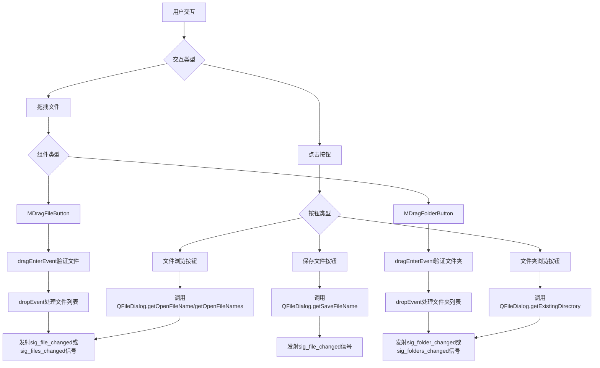

## 类结构

```
QtWidgets.QWidget
├── MPushButton (基类)
│   ├── MClickBrowserFilePushButton
│   └── MClickBrowserFolderPushButton
├── MToolButton (基类)
│   ├── MClickBrowserFileToolButton
│   ├── MClickSaveFileToolButton
│   ├── MDragFileButton
│   ├── MClickBrowserFolderToolButton
│   └── MDragFolderButton
全局函数 (非类)
├── _slot_browser_file
└── _slot_browser_folder
```

## 全局变量及字段


### `dayu_theme.drag_size`
    
外部导入的拖拽区域默认大小配置

类型：`int`
    


### `_slot_browser_file`
    
浏览文件的全局槽函数，处理文件选择对话框

类型：`function`
    


### `_slot_browser_folder`
    
浏览文件夹的全局槽函数，处理文件夹选择对话框

类型：`function`
    


### `MClickBrowserFilePushButton._path`
    
文件浏览的起始路径，默认为用户主目录

类型：`str`
    


### `MClickBrowserFilePushButton._multiple`
    
是否支持多选文件

类型：`bool`
    


### `MClickBrowserFilePushButton._filters`
    
文件过滤器列表，用于限制可选文件类型

类型：`list`
    


### `MClickBrowserFilePushButton.sig_file_changed`
    
单文件选中时发射的信号

类型：`QtCore.Signal(str)`
    


### `MClickBrowserFilePushButton.sig_files_changed`
    
多文件选中时发射的信号

类型：`QtCore.Signal(list)`
    


### `MClickBrowserFileToolButton._path`
    
文件浏览的起始路径，默认为用户主目录

类型：`str`
    


### `MClickBrowserFileToolButton._multiple`
    
是否支持多选文件

类型：`bool`
    


### `MClickBrowserFileToolButton._filters`
    
文件过滤器列表，用于限制可选文件类型

类型：`list`
    


### `MClickBrowserFileToolButton.sig_file_changed`
    
单文件选中时发射的信号

类型：`QtCore.Signal(str)`
    


### `MClickBrowserFileToolButton.sig_files_changed`
    
多文件选中时发射的信号

类型：`QtCore.Signal(list)`
    


### `MClickSaveFileToolButton._path`
    
保存文件的路径

类型：`str`
    


### `MClickSaveFileToolButton._file_types`
    
允许保存的文件类型列表

类型：`list`
    


### `MClickSaveFileToolButton._last_used_filter`
    
上次使用的文件过滤器

类型：`str`
    


### `MClickSaveFileToolButton._last_directory`
    
上次使用的目录路径

类型：`str`
    


### `MClickSaveFileToolButton.sig_file_changed`
    
文件保存成功时发射的信号

类型：`QtCore.Signal(str)`
    


### `MDragFileButton._path`
    
文件路径，支持单文件或文件列表

类型：`str or list`
    


### `MDragFileButton._multiple`
    
是否支持多选文件

类型：`bool`
    


### `MDragFileButton._filters`
    
文件过滤器列表，用于限制可选文件类型

类型：`list`
    


### `MDragFileButton.sig_file_changed`
    
单文件选中或拖入时发射的信号

类型：`QtCore.Signal(str)`
    


### `MDragFileButton.sig_files_changed`
    
多文件选中或拖入时发射的信号

类型：`QtCore.Signal(list)`
    


### `MClickBrowserFolderPushButton._path`
    
文件夹浏览的起始路径，默认为用户主目录

类型：`str`
    


### `MClickBrowserFolderPushButton._multiple`
    
是否支持多选文件夹

类型：`bool`
    


### `MClickBrowserFolderPushButton.sig_folder_changed`
    
单文件夹选中时发射的信号

类型：`QtCore.Signal(str)`
    


### `MClickBrowserFolderPushButton.sig_folders_changed`
    
多文件夹选中时发射的信号

类型：`QtCore.Signal(list)`
    


### `MClickBrowserFolderToolButton._path`
    
文件夹浏览的起始路径，默认为用户主目录

类型：`str`
    


### `MClickBrowserFolderToolButton._multiple`
    
是否支持多选文件夹

类型：`bool`
    


### `MClickBrowserFolderToolButton.sig_folder_changed`
    
单文件夹选中时发射的信号

类型：`QtCore.Signal(str)`
    


### `MClickBrowserFolderToolButton.sig_folders_changed`
    
多文件夹选中时发射的信号

类型：`QtCore.Signal(list)`
    


### `MDragFolderButton._path`
    
文件夹路径，默认为用户主目录

类型：`str`
    


### `MDragFolderButton._multiple`
    
是否支持多选文件夹

类型：`bool`
    


### `MDragFolderButton.sig_folder_changed`
    
单文件夹选中或拖入时发射的信号

类型：`QtCore.Signal(str)`
    


### `MDragFolderButton.sig_folders_changed`
    
多文件夹选中或拖入时发射的信号

类型：`QtCore.Signal(list)`
    
    

## 全局函数及方法


### `_slot_browser_file`

该函数是一个文件浏览处理函数，通过 Qt 文件对话框选择文件，支持单文件和多文件选择模式，并根据选择结果发出相应的信号和更新路径。

参数：

- `self`：对象实例，继承自 Qt 按钮控件（如 `MClickBrowserFilePushButton`、`MClickBrowserFileToolButton`、`MDragFileButton`），隐式参数

返回值：`None`，无返回值；通过信号机制传递结果

#### 流程图

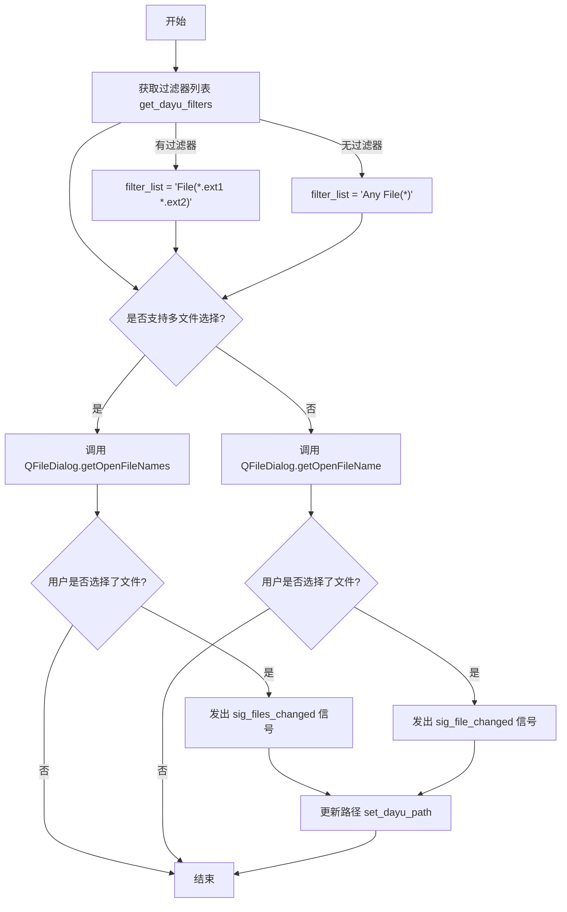

#### 带注释源码

```python
# NOTE PySide2 Crash without QObject wrapper
# @Slot()
def _slot_browser_file(self):
    """
    处理文件浏览点击事件
    1. 根据配置的过滤器生成文件对话框的过滤字符串
    2. 根据是否支持多文件选择调用不同的对话框方法
    3. 选择完成后发出相应信号并更新路径
    """
    # 构建文件过滤器字符串
    # 如果配置了过滤器，格式如 "File(*.py *.txt)"，否则为 "Any File(*)"
    filter_list = (
        "File(%s)" % (" ".join(["*" + e for e in self.get_dayu_filters()]))
        if self.get_dayu_filters()
        else "Any File(*)"
    )
    
    # 判断是否支持多文件选择
    if self.get_dayu_multiple():
        # 多文件选择模式：弹出允许选择多个文件的对话框
        # 参数：父窗口、对话框标题、初始路径、过滤器
        r_files, _ = QtWidgets.QFileDialog.getOpenFileNames(
            self, 
            "Browser File", 
            self.get_dayu_path(), 
            filter_list
        )
        # 如果用户选择了文件
        if r_files:
            # 发出多文件信号，传递文件列表
            self.sig_files_changed.emit(r_files)
            # 更新路径为用户选择的第一个文件的目录
            self.set_dayu_path(r_files[0])
    else:
        # 单文件选择模式：弹出只能选择一个文件的对话框
        r_file, _ = QtWidgets.QFileDialog.getOpenFileName(
            self, 
            "Browser File", 
            self.get_dayu_path(), 
            filter_list
        )
        # 如果用户选择了文件
        if r_file:
            # 发出单文件信号，传递文件路径
            self.sig_file_changed.emit(r_file)
            # 更新路径为用户选择的文件路径
            self.set_dayu_path(r_file)
```


### `_slot_browser_folder`

该函数是一个浏览器文件夹的槽函数，通过调用系统文件夹选择对话框让用户选择文件夹，并根据是否为多选模式触发相应的信号（`sig_folder_changed` 或 `sig_folders_changed`），最后更新当前路径。

参数：

- `self`：隐式参数，调用该方法的类实例（通常是 `MClickBrowserFolderPushButton`、`MClickBrowserFolderToolButton` 或 `MDragFolderButton` 的实例），无类型标注

返回值：`None`，该函数没有明确的返回值，主要通过信号机制传递选择的文件夹路径

#### 流程图

```mermaid
flowchart TD
    A[开始] --> B[调用 QFileDialog.getExistingDirectory 获取文件夹路径]
    B --> C{是否选择了文件夹}
    C -->|否| D[结束]
    C -->|是| E{multiple 是否为 True}
    E -->|是| F[触发 sig_folders_changed 信号<br/>传入 [r_folder] 列表]
    E -->|否| G[触发 sig_folder_changed 信号<br/>传入 r_folder 字符串]
    F --> H[调用 set_dayu_path 更新路径]
    G --> H
    H --> I[结束]
```

#### 带注释源码

```python
def _slot_browser_folder(self):
    """
    浏览器文件夹的槽函数，处理文件夹选择逻辑
    
    1. 打开系统文件夹选择对话框
    2. 根据 multiple 属性决定触发单选还是多选信号
    3. 更新当前的路径状态
    """
    # 调用 Qt 文件对话框获取用户选择的现有目录
    # 参数：父窗口、对话框标题、初始路径
    r_folder = QtWidgets.QFileDialog.getExistingDirectory(self, "Browser Folder", self.get_dayu_path())
    
    # 判断用户是否选择了文件夹（未选择时返回空字符串）
    if r_folder:
        # 根据 multiple 属性判断是否为多选模式
        if self.get_dayu_multiple():
            # 多选模式：触发 sig_folders_changed 信号，传入列表
            self.sig_folders_changed.emit([r_folder])
        else:
            # 单选模式：触发 sig_folder_changed 信号，传入字符串
            self.sig_folder_changed.emit(r_folder)
        
        # 更新当前路径为用户选择的文件夹路径
        self.set_dayu_path(r_folder)
```


### `MClickBrowserFilePushButton.__init__`

该方法是 `MClickBrowserFilePushButton` 类的构造函数，用于初始化一个可点击的文件浏览按钮。该按钮继承自 `MPushButton`，通过调用系统文件对话框选择文件，并支持单文件或多文件选择模式。

参数：

- `text`：`str`，默认值 `"Browser"`，按钮上显示的文本
- `multiple`：`bool`，默认值 `False`，是否允许选择多个文件
- `parent`：`QtWidgets.QWidget`，默认值 `None`，父 widget 对象

返回值：`None`，构造函数无返回值

#### 流程图

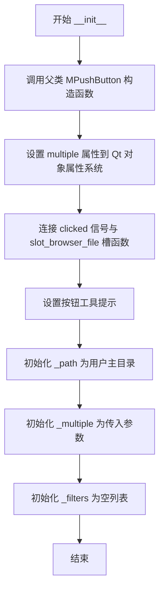

#### 带注释源码

```python
def __init__(self, text="Browser", multiple=False, parent=None):
    """
    初始化文件浏览按钮
    
    参数:
        text: 按钮显示文本，默认 "Browser"
        multiple: 是否支持多文件选择，默认 False
        parent: 父 widget 对象，默认 None
    """
    # 调用父类 MPushButton 的构造函数
    super(MClickBrowserFilePushButton, self).__init__(text=text, parent=parent)
    
    # 将 multiple 参数存入 Qt 的属性系统，供 Qt 样式系统使用
    self.setProperty("multiple", multiple)
    
    # 当按钮被点击时，触发文件浏览槽函数
    self.clicked.connect(self.slot_browser_file)
    
    # 设置工具提示，提示用户点击可浏览文件
    self.setToolTip(self.tr("Click to browser file"))

    # 初始化文件路径为用户主目录，作为文件对话框的初始路径
    self._path = os.path.expanduser('~')
    
    # 保存是否允许多文件选择的标志
    self._multiple = multiple
    
    # 初始化文件过滤器列表，用于过滤可选择的文件类型
    self._filters = []
```


### MClickBrowserFilePushButton.get_dayu_filters

获取文件浏览器对话框当前配置的文件扩展名过滤规则列表。该方法对应 Qt 属性 `dayu_filters`，用于在用户点击按钮打开文件选择对话框时，限定可选文件的类型。

参数：
- `self`：`MClickBrowserFilePushButton`，类实例本身。

返回值：`list`，返回当前设置的文件扩展名过滤列表（例如 `['.txt', '.pdf']`）。如果未设置，则返回空列表。

#### 流程图

```mermaid
flowchart TD
    A([Start / 开始]) --> B[获取 self._filters 属性]
    B --> C([Return / 返回] list)
    C --> D([End / 结束])
```

#### 带注释源码

```python
def get_dayu_filters(self):
    """
    获取浏览器的格式过滤器
    Get browser's format filters
    
    :return: list (文件扩展名列表)
    """
    # 直接返回内部私有属性 _filters
    return self._filters
```


### `MClickBrowserFilePushButton.set_dayu_filters`

#### 描述

`set_dayu_filters` 是 `MClickBrowserFilePushButton` 类中的一个属性设置器（Setter）方法。它的核心功能是**配置文件浏览对话框（QFileDialog）中显示的文件类型过滤器**。通过传入一个文件扩展名列表（如 `['.jpg', '.png']`），该方法更新按钮的内部状态，随后当用户点击按钮触发文件选择对话框时，系统会根据这些过滤器限制用户可见的文件类型。

#### 类的详细信息

**类名：** `MClickBrowserFilePushButton`
**继承自：** `MPushButton`
**描述：** 一个用于触发文件浏览对话框的点击式按钮组件，支持单文件或多文件选择，并允许通过过滤器限制文件类型。

**类字段（Attributes）：**

- `_path`：`str`，存储上一次访问的文件路径或目录，作为对话框打开时的初始路径。
- `_multiple`：`bool`，标记是否允许同时选择多个文件。
- `_filters`：`list`，存储允许的文件扩展名列表（例如 `['.txt', '.pdf']`），决定了文件对话框中“文件类型”下拉菜单的内容。

**类方法（Methods）：**

- `__init__`：构造函数，初始化路径、复选状态和过滤器列表。
- `get_dayu_filters`：获取器，返回当前配置的文件扩展名列表。
- `set_dayu_filters`：**（目标方法）** 设置器，用于配置过滤器。
- `slot_browser_file`：槽函数，处理点击事件，实际调用 `QtWidgets.QFileDialog` 打开文件选择器，并在其中应用 `get_dayu_filters()` 获取的过滤条件。

---

#### 参数

- `value`：`list`，要设置的文件扩展名列表（例如 `['.jpg', '.jpeg', '.png']`）。

#### 返回值

- `None`：该方法不返回任何值，仅修改对象内部状态。

#### 流程图

该流程图展示了 `set_dayu_filters` 在整个交互流程中的位置及其数据流动。

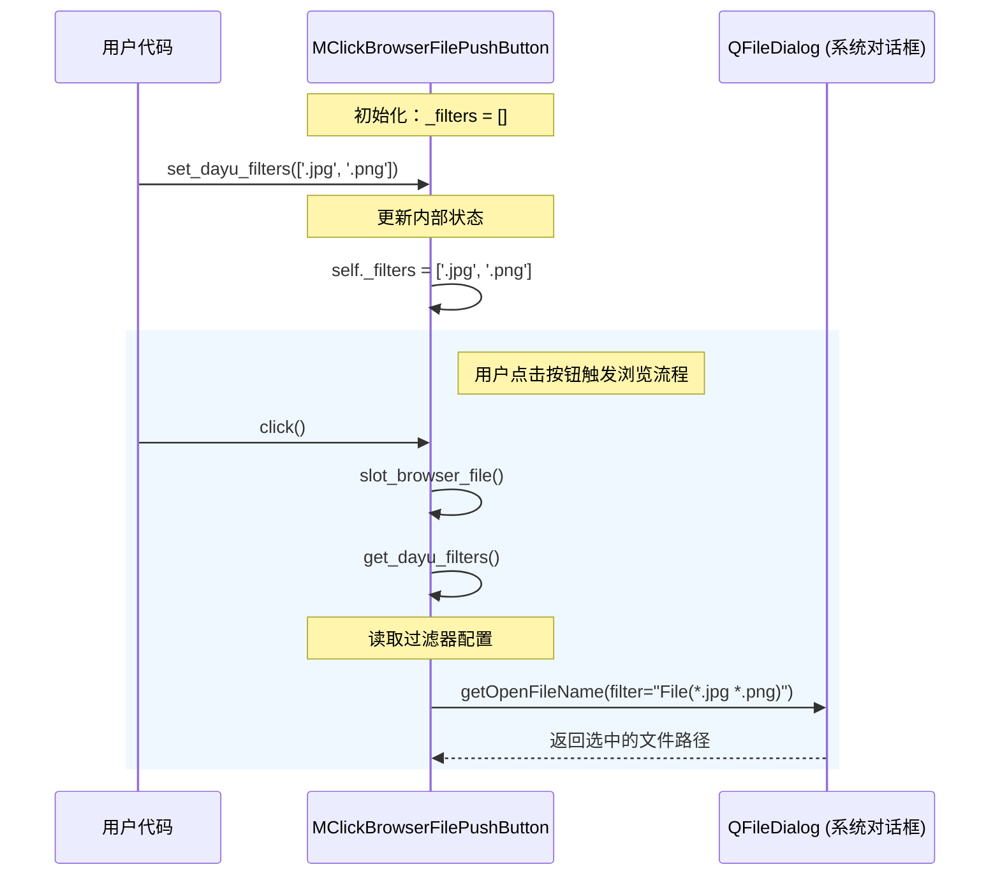

#### 带注释源码

```python
def set_dayu_filters(self, value):
    """
    设置浏览器文件格式过滤器
    :param value: 文件扩展名列表，如 ['.jpg', '.png']
    :return: None
    """
    # 直接将传入的值赋值给内部属性 _filters
    # 注意：此处缺少对 value 类型的校验（如检查是否为 list 或 tuple）
    self._filters = value
```

---

#### 关键组件信息

- **UI 组件 (`MClickBrowserFilePushButton`)**: 核心交互组件，封装了 Qt 的 `QPushButton`。
- **过滤器逻辑 (`_filters`)**: 存储允许的文件后缀，是连接 UI 与 `QFileDialog` 的数据桥梁。
- **对话框组件 (`QtWidgets.QFileDialog`)**: 实际执行文件选择的原生系统对话框，接收并应用过滤器。

---

#### 潜在的技术债务或优化空间

1.  **代码重复 (Duplication)**: `set_dayu_filters` 方法在 `MClickBrowserFileToolButton` (第167行) 和 `MDragFileButton` (第258行) 中几乎完全相同。这是典型的 DRY (Don't Repeat Yourself) 原则违反。**建议**：提取一个通用的 Mixin 类或基类来管理这些通用属性。
2.  **缺乏输入校验**: `set_dayu_filters` 方法直接接受任意值赋给 `_filters`，没有校验 `value` 是否为列表，也没有校验列表元素是否为合法的扩展名格式（例如是否以点号 `.` 开头）。这可能导致后续在构造过滤器字符串时出现逻辑错误或异常。
3.  **属性声明冗余**: 虽然实现了 Python 的 getter/setter 方法，但在类最后使用了 `QtCore.Property` (第116行) 进行了二次声明。这种做法在 PySide 早期版本中常见，但增加了维护成本。

---

#### 其它项目

**设计目标与约束：**
- **目标**：提供一种简单的方式让用户通过 UI 按钮选择特定类型的文件。
- **约束**：依赖 `PySide6` (Qt for Python)；过滤器字符串的构造逻辑在外部的 `_slot_browser_file` 函数中完成。

**错误处理与异常设计：**
- 当前方法本身无错误处理。如果外部传入无效参数（例如 `None` 或 `dict`），可能在后续调用 `get_dayu_filters` 时导致问题。应在 setter 中增加类型检查和异常捕获。

**数据流与状态机：**
- **状态**：`Idle` (空闲) -> `Configuring` (配置中，通过 set_dayu_filters) -> `WaitingForUserInput` (等待用户选择文件)。
- **数据流**：用户配置 (`List[str]`) -> 存储于 `_filters` -> 被 `slot_browser_file` 读取 -> 转换为 Qt 格式字符串 (`"File(*.ext)"`) -> 传递给 `QFileDialog`。

**外部依赖与接口契约：**
- **接口**：接收 `list` 类型的文件扩展名列表。
- **依赖**：
    - `PySide6.QtCore` (用于 Signal/Property)
    - `PySide6.QtWidgets` (用于 QFileDialog)


### `MClickBrowserFilePushButton.get_dayu_path`

获取上次浏览文件的路径。

参数：此方法没有参数。

返回值：`str`，返回上次浏览文件或文件夹的路径。

#### 流程图


#### 带注释源码

```python
def get_dayu_path(self):
    """
    获取上次浏览器文件的路径
    :return: str
    """
    # 直接返回实例变量 _path，该变量在 __init__ 方法中初始化为用户主目录
    return self._path
```


### `MClickBrowserFilePushButton.set_dayu_path`

设置浏览器文件的起始路径，用于指定文件选择对话框打开时的默认目录。

参数：

- `value`：`str`，要设置的文件路径

返回值：`None`，无返回值

#### 流程图


#### 带注释源码

```python
def set_dayu_path(self, value):
    """
    设置浏览器文件的起始路径
    
    参数:
        value: str - 要设置的文件路径
    
    返回:
        None - 无返回值
    """
    self._path = value  # 将传入的路径值赋给实例变量 _path
```


### `MClickBrowserFilePushButton.get_dayu_multiple`

获取浏览器是否支持多选文件。

参数：
- `self`：`MClickBrowserFilePushButton`，调用此方法的实例对象。

返回值：`bool`，返回当前配置是否允许选择多个文件。

#### 流程图


#### 带注释源码

```python
def get_dayu_multiple(self):
    """
    获取浏览器是否支持多选文件
    :return: bool
    """
    # 返回内部存储的多选状态标志
    return self._multiple
```


### `MClickBrowserFilePushButton.set_dayu_multiple`

设置浏览器是否可以选择多个文件

参数：

-  `value`：`bool`，设置浏览器是否可以多选文件

返回值：`None`，无返回值描述

#### 流程图

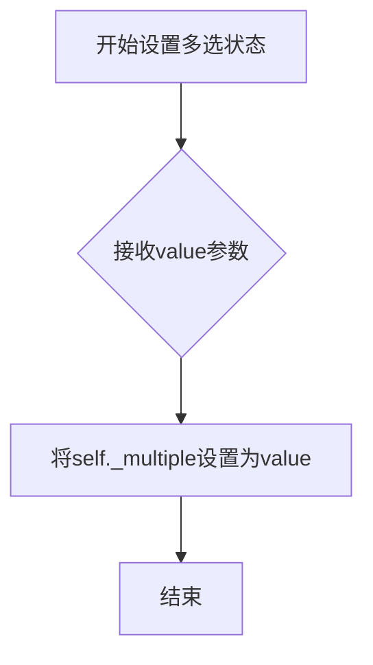

#### 带注释源码

```python
def set_dayu_multiple(self, value):
    """
    Set browser can select multiple file or not
    :param value: bool
    :return: None
    """
    # 将传入的value参数赋值给实例变量self._multiple
    # 用于控制文件浏览器是否允许选择多个文件
    self._multiple = value
```


### `MClickBrowserFileToolButton.__init__`

该方法是 `MClickBrowserFileToolButton` 类的构造函数，用于初始化一个可点击的工具按钮，该按钮用于打开文件浏览对话框并选择文件。

参数：

- `multiple`：`bool`，默认为 False，指定是否允许同时选择多个文件
- `parent`：`QWidget`（可选），指定父控件，默认为 None

返回值：`None`，构造函数无返回值

#### 流程图

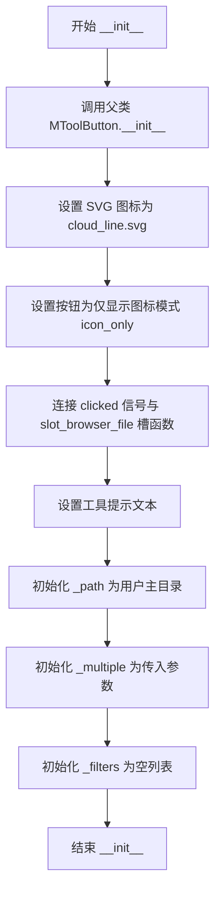

#### 带注释源码

```python
def __init__(self, multiple=False, parent=None):
    """
    初始化 MClickBrowserFileToolButton 实例
    
    参数:
        multiple: bool, 是否支持多文件选择
        parent: QWidget, 父控件
    """
    # 调用父类 MToolButton 的构造函数进行初始化
    super(MClickBrowserFileToolButton, self).__init__(parent=parent)
    
    # 设置按钮使用的 SVG 图标为云朵线条图标
    self.set_dayu_svg("cloud_line.svg")
    
    # 设置按钮为仅显示图标模式，不显示文本
    self.icon_only()
    
    # 将 clicked 信号连接到文件浏览槽函数
    self.clicked.connect(self.slot_browser_file)
    
    # 设置工具提示，提示用户可以点击浏览文件
    self.setToolTip(self.tr("Click to browser file"))
    
    # 初始化文件浏览路径为用户主目录
    self._path = os.path.expanduser('~')
    
    # 初始化多文件选择标志
    self._multiple = multiple
    
    # 初始化文件过滤器列表为空
    self._filters = []
```


### `MClickBrowserFileToolButton.get_dayu_filters`

获取浏览器文件对话框的格式过滤器列表。

参数： 无

返回值：`list`，返回当前设置的浏览器文件过滤器列表。

#### 流程图

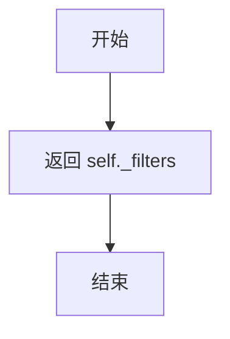

#### 带注释源码

```python
def get_dayu_filters(self):
    """
    获取浏览器的格式过滤器
    :return: list
    """
    return self._filters
```


### `MClickBrowserFileToolButton.set_dayu_filters`

设置浏览器文件的格式过滤器，用于过滤可选择文件类型。

参数：

- `value`：`list`，要设置的文件过滤器列表

返回值：`None`，无返回值

#### 流程图

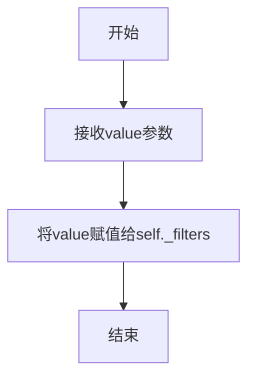

#### 带注释源码

```python
def set_dayu_filters(self, value):
    """
    Set browser file format filters
    :param value: 要设置的文件过滤器列表
    :return: None
    """
    self._filters = value
```


### `MClickBrowserFileToolButton.get_dayu_path`

获取当前文件浏览器工具按钮实例所保存的上一次操作的文件路径。

参数：

-  `self`：`MClickBrowserFileToolButton`，调用此方法的类实例本身。

返回值：`str`，返回当前存储的文件路径（通常为上次打开的目录或文件）。

#### 流程图

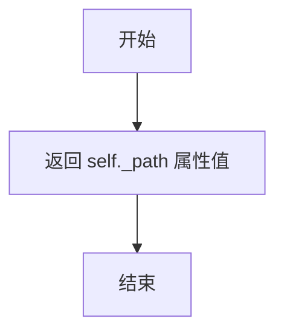

#### 带注释源码

```python
def get_dayu_path(self):
    """
    获取最近一次浏览器操作的文件路径
    :return: str
    """
    return self._path
```


### `MClickBrowserFileToolButton.set_dayu_path`

该方法用于设置文件浏览器工具按钮的起始浏览路径，将传入的路径值赋值给内部属性 `_path`，从而控制在打开文件对话框时默认显示的目录。

参数：

- `value`：`str`，要设置为浏览器起始路径的字符串值

返回值：`None`，无返回值描述

#### 流程图


#### 带注释源码

```python
def set_dayu_path(self, value):
    """
    Set browser file start path
    :param value: str
    :return: None
    """
    self._path = value
```


### `MClickBrowserFileToolButton.get_dayu_multiple`

获取浏览器是否支持多文件选择模式。

参数：

- 该方法没有参数。

返回值：`bool`，返回当前是否启用多文件选择模式。

#### 流程图


#### 带注释源码

```python
def get_dayu_multiple(self):
    """
    Get browser can select multiple file or not
    :return: bool
    """
    return self._multiple
```


### `MClickBrowserFileToolButton.set_dayu_multiple`

该方法用于设置文件浏览器按钮是否支持多选模式，通过修改内部 `_multiple` 属性的值来控制文件选择行为。

参数：

- `value`：`bool`，指定是否允许选择多个文件

返回值：`None`，无返回值

#### 流程图

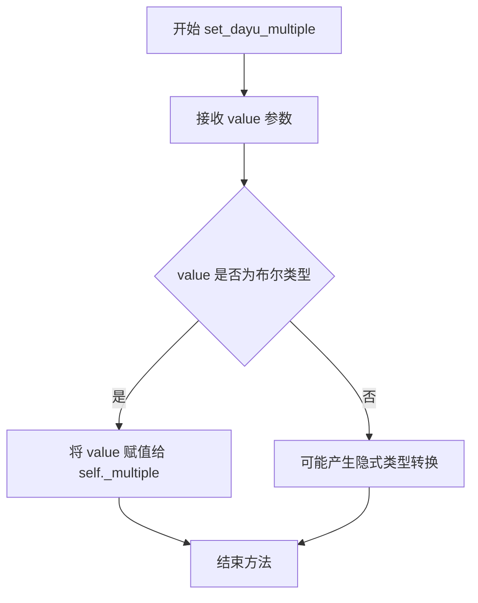

#### 带注释源码

```python
def set_dayu_multiple(self, value):
    """
    Set browser can select multiple file or not
    :param value: bool
    :return: None
    """
    self._multiple = value
```


### `MClickSaveFileToolButton.__init__`

这是 `MClickSaveFileToolButton` 类的初始化方法，用于创建一个可点击的工具按钮来浏览和保存文件。该方法继承自 `MToolButton`，设置了按钮的图标、提示文本，并初始化了文件类型过滤器、文件路径、最后使用的过滤器和最后打开的目录等属性。

参数：

- `file_types`：`list` 或 `None`，文件类型过滤器列表，用于定义可保存的文件类型（例如：`[("JSON", ["json"]), ("Text", "txt")]`)
- `parent`：`QtWidgets.QWidget` 或 `None`，父窗口部件，指定按钮所属的父对象

返回值：`None`，初始化方法不返回任何值

#### 流程图

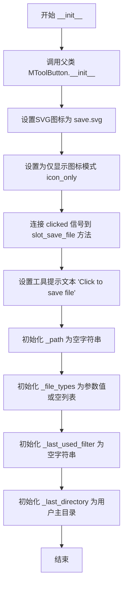

#### 带注释源码

```python
def __init__(self, file_types=None, parent=None):
    """
    初始化 MClickSaveFileToolButton 实例
    
    参数:
        file_types: 文件类型过滤器列表，默认为 None
        parent: 父窗口部件，默认为 None
    """
    # 调用父类 MToolButton 的初始化方法
    super(MClickSaveFileToolButton, self).__init__(parent=parent)
    
    # 设置按钮使用的 SVG 图标为 save.svg
    self.set_dayu_svg("save.svg")
    
    # 设置按钮为仅显示图标模式，不显示文本
    self.icon_only()
    
    # 将 clicked 信号连接到 slot_save_file 方法
    # 当用户点击按钮时，会触发保存文件对话框
    self.clicked.connect(self.slot_save_file)
    
    # 设置按钮的工具提示，提示用户点击可以保存文件
    self.setToolTip(self.tr("Click to save file"))
    
    # 初始化文件路径属性，用于存储用户选择的文件路径
    self._path = ""
    
    # 初始化文件类型过滤器
    # 如果未提供，则使用空列表
    self._file_types = file_types or []
    
    # 初始化最后使用的过滤器，用于记住用户上次选择的文件类型
    self._last_used_filter = ""
    
    # 初始化最后打开的目录为用户主目录
    # 这样下次打开保存对话框时，会从上次关闭的目录开始
    self._last_directory = os.path.expanduser('~')  # Initialize with home directory
```


### `MClickSaveFileToolButton.get_file_types`

获取浏览器支持的文件类型过滤器列表。

参数：

- 无（仅包含 `self` 参数）

返回值：`list`，返回当前配置的文件类型过滤器列表。

#### 流程图

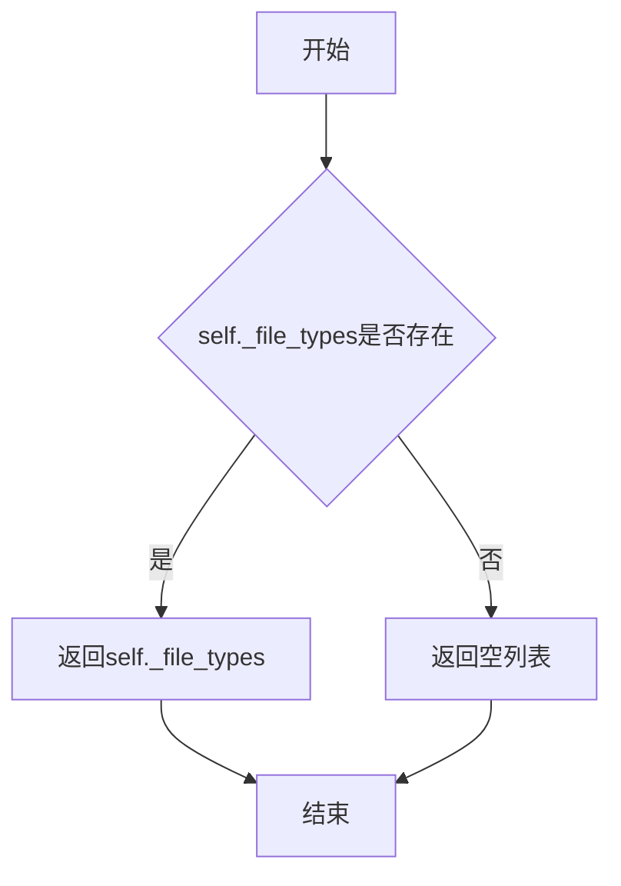

#### 带注释源码

```python
def get_file_types(self):
    """
    获取浏览器支持的文件类型过滤器
    :return: list，文件类型列表
    """
    return self._file_types
```


### `MClickSaveFileToolButton.set_file_types`

该方法用于设置文件类型过滤器列表，决定在保存文件对话框中显示哪些文件扩展名选项。

参数：

- `value`：`list`，要设置的文件类型列表，每个元素通常为元组（如 `("文本文件", "txt")` 或 `("图片", ["png", "jpg", "jpeg"])`）

返回值：`None`，无返回值（该方法直接修改对象内部状态）

#### 流程图

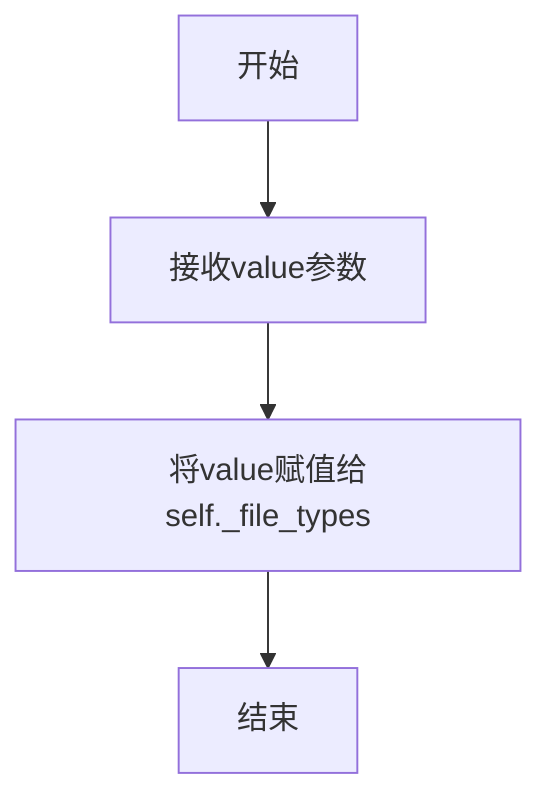

#### 带注释源码

```python
def set_file_types(self, value):
    """
    Set file types filter for the save file dialog
    :param value: list - List of file types, each element is a tuple like ("Description", "ext") or ("Description", ["ext1", "ext2"])
    :return: None
    """
    self._file_types = value  # 将传入的文件类型列表直接赋值给内部属性
```


### MClickSaveFileToolButton.get_path

获取当前保存文件的路径（`self._path`）的Getter方法。

参数：

- `self`：`MClickSaveFileToolButton`，调用此方法的实例对象本身。

返回值：`str`，当前设置的保存文件的完整路径。

#### 流程图

```mermaid
graph TD
    A([开始]) --> B[读取 self._path 属性值]
    B --> C([返回路径字符串])
    C --> D([结束])
```

#### 带注释源码

```python
def get_path(self):
    """
    获取当前保存文件的路径
    :return: str, 文件保存路径
    """
    return self._path
```


### `MClickSaveFileToolButton.set_path`

设置浏览器文件的起始路径，并在提供有效路径时更新最后使用的目录。

参数：

-  `value`：`str`，要设置为起始路径的文件路径

返回值：`None`，无返回值描述

#### 流程图

```mermaid
flowchart TD
    A[开始 set_path] --> B{value 是否为空}
    B -->|是| C[设置 self._path = value]
    C --> D[结束]
    B -->|否| E[设置 self._path = value]
    E --> F[提取 value 所在目录 os.path.dirname]
    F --> G[更新 self._last_directory]
    G --> D
```

#### 带注释源码

```python
def set_path(self, value):
    """
    Set browser file start path
    :param value: str
    :return: None
    """
    # 将传入的路径值赋给内部变量 _path
    self._path = value
    
    # 如果传入了有效路径（非空），则更新最后使用的目录
    if value:
        # 从完整路径中提取目录部分并保存
        # 例如："/home/user/documents/file.txt" -> "/home/user/documents"
        self._last_directory = os.path.dirname(value)
```


### `MClickSaveFileToolButton._create_filter_string`

该方法用于将`file_types`属性转换为Qt文件对话框所需的过滤器字符串格式。

参数：
- （无显式参数，只有隐式参数 `self`）

返回值：`str`，返回用于Qt文件对话框的过滤器字符串，多个过滤器之间用`;;`分隔，例如：`"Text Files (*.txt *.md);;Image Files (*.png *.jpg)"`

#### 流程图

```mermaid
flowchart TD
    A[开始] --> B[创建空列表 filter_parts]
    B --> C[遍历 self._file_types]
    C --> D{file_type[1] 是列表?}
    D -->|是| E[生成扩展名字符串]
    E --> F[格式化为: name (*.ext1 *.ext2)]
    F --> G[添加到 filter_parts]
    D -->|否| H[格式化为: name (*.ext)]
    H --> G
    G --> I{遍历完成?}
    I -->|否| C
    I -->|是| J[用 ;; 连接所有元素]
    J --> K[返回结果字符串]
    K --> L[结束]
```

#### 带注释源码

```python
def _create_filter_string(self):
    """
    将 file_types 属性转换为 Qt 文件对话框的过滤器字符串
    :return: str - 格式如 "Text Files (*.txt);;Image Files (*.png *.jpg)"
    """
    # 用于存储各类型过滤器的列表
    filter_parts = []
    
    # 遍历所有文件类型配置
    for file_type in self._file_types:
        # file_type 格式: (显示名称, 扩展名或扩展名列表)
        # 例如: ("Text Files", "txt") 或 ("Images", ["png", "jpg", "jpeg"])
        
        # 判断扩展名是否为列表（多个扩展名）
        if isinstance(file_type[1], list):
            # 为列表中的每个扩展名添加 *. 前缀
            # 例如: ["png", "jpg"] -> "*.png *.jpg"
            extensions = " ".join(f"*.{ext}" for ext in file_type[1])
            # 格式: "显示名称 (*.ext1 *.ext2)"
            filter_parts.append(f"{file_type[0]} ({extensions})")
        else:
            # 单个扩展名情况
            # 格式: "显示名称 (*.ext)"
            filter_parts.append(f"{file_type[0]} (*.{file_type[1]})")
    
    # 使用 ;; 分隔多个过滤器（Qt 文件对话框格式要求）
    return ";;".join(filter_parts)
```


### `MClickSaveFileToolButton._get_default_extension`

该方法用于获取默认文件扩展名，根据已配置的文件类型列表返回第一个文件类型的扩展名，如果未配置文件类型则返回空字符串。

参数：

- （无显式参数，只有隐式的 `self`）

返回值：`str`，返回默认文件扩展名字符串。如果没有配置文件类型，返回空字符串。

#### 流程图

```mermaid
flowchart TD
    A[开始] --> B{self._file_types 非空?}
    B -->|是| C{self._file_types[0][1] 是列表?}
    B -->|否| D[返回空字符串 '']
    C -->|是| E[返回 self._file_types[0][1][0]]
    C -->|否| F[返回 self._file_types[0][1]]
    E --> G[结束]
    F --> G
    D --> G
```

#### 带注释源码

```python
def _get_default_extension(self):
    """
    获取默认文件扩展名
    
    根据已配置的文件类型列表（self._file_types）返回第一个文件类型的扩展名。
    文件类型配置格式为: [(显示名称, 扩展名或扩展名列表), ...]
    
    Returns:
        str: 默认扩展名字符串，如果没有配置文件类型则返回空字符串
    """
    # 检查是否配置了文件类型
    if self._file_types:
        # 获取第一个文件类型的扩展名配置
        # self._file_types[0] 格式为 (显示名称, 扩展名)
        # 例如: ('Images', ['jpg', 'png']) 或 ('Text', 'txt')
        
        # 判断扩展名是否为列表形式
        if isinstance(self._file_types[0][1], list):
            # 如果是列表（如 ['jpg', 'png']），返回第一个扩展名
            return self._file_types[0][1][0]
        
        # 如果是单个字符串形式（如 'txt'），直接返回
        return self._file_types[0][1]
    
    # 没有配置文件类型时返回空字符串
    return ""
```


### `MClickSaveFileToolButton.slot_save_file`

该方法是 `MClickSaveFileToolButton` 类的核心业务逻辑方法，负责弹出文件保存对话框、验证文件扩展名、更新内部路径状态，并在用户确认保存后发出文件变更信号。

参数：

- `self`：实例本身（隐式参数），`MClickSaveFileToolButton`，调用该方法的类实例

返回值：无返回值（`None`），该方法通过 Qt 信号 `sig_file_changed` 传递结果

#### 流程图

```mermaid
flowchart TD
    A[slot_save_file 被调用] --> B[创建过滤器字符串]
    B --> C[生成默认文件名 untitled.{扩展名}]
    C --> D[获取初始目录 _last_directory]
    D --> E[弹出 QFileDialog.getSaveFileName]
    E --> F{用户是否选择文件?}
    F -->|否| G[创建 QFileDialog 实例]
    G --> H[更新 _last_directory 为当前对话框目录]
    H --> I[方法结束]
    F -->|是| J[保存选中的过滤器和文件路径]
    J --> K[更新 _last_directory 为文件所在目录]
    K --> L{是否匹配文件类型?}
    L -->|是| M[检查扩展名是否合法]
    L -->|否| N[直接发出信号]
    M --> O{扩展名是否合法?}
    O -->|否| P[强制添加正确的扩展名]
    P --> N
    O -->|是| N
    N --> Q[emit sig_file_changed 信号]
    Q --> I
```

#### 带注释源码

```python
def slot_save_file(self):
    """
    处理保存文件按钮点击事件，弹出文件保存对话框并处理用户选择
    """
    # 1. 根据 file_types 属性构建文件过滤器字符串
    # 格式如: "Images (*.png *.jpg);;All Files (*)"
    filter_string = self._create_filter_string()
    
    # 2. 生成默认文件名，结合 untitled 前缀和第一个文件类型的默认扩展名
    default_name = f"untitled.{self._get_default_extension()}"
    
    # 3. 获取上次使用的目录作为初始目录
    initial_dir = self._last_directory
    
    # 4. 弹出 Qt 文件保存对话框
    # 参数: 父窗口、对话框标题、默认路径、过滤器字符串、上次选中的过滤器
    file_name, selected_filter = QtWidgets.QFileDialog.getSaveFileName(
        self, "Save File", os.path.join(initial_dir, default_name), filter_string,
        self._last_used_filter
    )
    
    # 5. 判断用户是否选择了文件（点击保存而不是取消）
    if file_name:
        # 5.1 保存用户本次选择的过滤器，供下次使用
        self._last_used_filter = selected_filter
        
        # 5.2 更新当前文件路径
        self._path = file_name
        
        # 5.3 更新最后使用的目录为文件所在目录
        self._last_directory = os.path.dirname(file_name)
        
        # 5.4 提取用户选择的文件类型及其扩展名列表
        selected_type = next((ft for ft in self._file_types if ft[0] in selected_filter), None)
        if selected_type:
            # 统一处理单扩展名和多扩展名情况，返回列表
            valid_extensions = selected_type[1] if isinstance(selected_type[1], list) else [selected_type[1]]
            
            # 5.5 确保文件扩展名合法，如不合法则强制修正
            file_base, file_extension = os.path.splitext(file_name)
            # 比较时去掉扩展名首位的点，并转为小写
            if file_extension[1:].lower() not in valid_extensions:
                file_name = f"{file_base}.{valid_extensions[0]}"
        
        # 5.6 发出文件变更信号，通知监听者保存路径已更新
        self.sig_file_changed.emit(file_name)
    else:
        # 6. 用户取消对话框时，也更新最后目录为对话框当前所在目录
        # 这样下次打开对话框时会停留在用户取消时的目录
        dialog = QtWidgets.QFileDialog()
        self._last_directory = dialog.directory().absolutePath()
```


### `MDragFileButton.__init__`

这是 `MDragFileButton` 类的构造函数，用于初始化一个支持文件拖拽和点击浏览的工具按钮。该方法继承自 `MToolButton`，配置了拖拽支持、按钮样式、尺寸、图标以及相关的文件浏览信号槽连接，同时初始化了文件路径、多选状态和文件过滤器等内部状态。

参数：

- `text`：`str`，按钮上显示的文本，默认为空字符串
- `multiple`：`bool`，标识是否支持多选文件模式，默认为 False
- `parent`：`PySide6.QtCore.QObject`，父对象指针，用于 Qt 对象层次管理，默认为 None

返回值：`None`，构造函数不返回值，仅完成对象初始化

#### 流程图

```mermaid
flowchart TD
    A[开始 __init__] --> B[调用 super().__init__ 初始化父类]
    B --> C[启用拖拽功能: setAcceptDrops True]
    C --> D[启用鼠标跟踪: setMouseTracking True]
    D --> E[设置文本显示在图标下方: text_under_icon]
    E --> F[设置按钮文本: setText text]
    F --> G[获取主题配置尺寸: dayu_theme.drag_size]
    G --> H[设置按钮大小: set_dayu_size size]
    H --> I[设置图标尺寸: setIconSize QSize size,size]
    I --> J[设置SVG图标: cloud_line.svg]
    J --> K[连接点击信号到浏览器槽函数]
    K --> L[设置尺寸策略为扩展]
    L --> M[设置工具提示文本]
    M --> N[初始化路径为用户目录/init子目录]
    N --> O[保存multiple参数]
    O --> P[初始化过滤器列表为空]
    P --> Q[结束 __init__]
```

#### 带注释源码

```python
def __init__(self, text="", multiple=False, parent=None):
    # 调用父类 MToolButton 的构造函数，传入父对象
    super(MDragFileButton, self).__init__(parent=parent)
    
    # 启用拖拽功能，允许用户拖拽文件到按钮上
    self.setAcceptDrops(True)
    
    # 启用鼠标跟踪，以便实时响应鼠标移动事件
    self.setMouseTracking(True)
    
    # 设置文本显示在图标下方（此方法来自 MToolButton 或其 mixin）
    self.text_under_icon()
    
    # 设置按钮上显示的文本
    self.setText(text)
    
    # 从主题配置中获取拖拽按钮的推荐尺寸
    size = dayu_theme.drag_size
    
    # 设置按钮的尺寸大小
    self.set_dayu_size(size)
    
    # 设置图标的大小为推荐的拖拽尺寸
    self.setIconSize(QtCore.QSize(size, size))
    
    # 设置按钮使用的 SVG 图标为云上传图标
    self.set_dayu_svg("cloud_line.svg")

    # 将点击信号连接到文件浏览槽函数，支持点击打开文件对话框
    self.clicked.connect(self.slot_browser_file)
    
    # 设置尺寸策略为 Expanding，使按钮可以自适应布局扩展
    self.setSizePolicy(QtWidgets.QSizePolicy.Expanding, QtWidgets.QSizePolicy.Expanding)
    
    # 设置工具提示，提示用户可以点击浏览文件
    self.setToolTip(self.tr("Click to browser file"))

    # 初始化文件路径为用户主目录下的 'init' 子目录
    self._path = os.path.join(os.path.expanduser('~'), 'init')
    
    # 保存多选模式标志
    self._multiple = multiple
    
    # 初始化文件过滤器列表（用于过滤可接受的文件类型）
    self._filters = []
```


### MDragFileButton.get_dayu_filters

该方法为MDragFileButton类的成员方法，用于获取文件浏览器当前设置的文件格式过滤器列表，允许用户指定可拖放或选择的文件类型。

参数： 无

返回值：`list`，返回当前设置的文件格式过滤器列表

#### 流程图

```mermaid
flowchart TD
    A[开始 get_dayu_filters] --> B{方法调用}
    B --> C[返回实例变量 self._filters]
    C --> D[结束]
```

#### 带注释源码

```python
def get_dayu_filters(self):
    """
    Get browser's format filters
    :return: list
    """
    return self._filters
```


### `MDragFileButton.set_dayu_filters`

设置浏览器文件格式过滤器，用于指定文件选择器可以显示的文件类型。

参数：

-  `value`：`list`，要设置的文件过滤器列表

返回值：`None`，无返回值

#### 流程图

```mermaid
graph TD
    A[开始] --> B[接收value参数]
    B --> C{value是否有效?}
    C -->|是| D[将value赋值给self._filters]
    C -->|否| E[保持self._filters不变或设为空]
    D --> F[结束]
    E --> F
```

#### 带注释源码

```python
def set_dayu_filters(self, value):
    """
    Set browser file format filters
    :param value: list, 要设置的文件过滤器列表
    :return: None
    """
    self._filters = value  # 将传入的过滤器列表直接赋值给内部属性
```


### `MDragFileButton.get_dayu_path`

获取上次浏览文件或文件夹的路径（如果是文件则返回其目录，如果是文件列表则返回第一个文件的目录）

参数：

- 该方法没有参数

返回值：`str`，返回上次浏览的路径的目录部分

#### 流程图

```mermaid
flowchart TD
    A[开始] --> B{self._path 是列表吗?}
    B -->|是| C{列表非空?}
    C -->|是| D[返回 os.path.dirname(self._path[0])]
    C -->|否| E[返回空字符串 '']
    B -->|否| F{self._path 是字符串吗?}
    F -->|是| G{字符串非空?}
    G -->|是| H[返回 os.path.dirname(self._path)]
    G -->|否| E
    F -->|否| E
    D --> I[结束]
    H --> I
    E --> I
```

#### 带注释源码

```python
def get_dayu_path(self):
    """
    Get last browser file path
    :return: str
    """
    # 检查 self._path 是否为列表类型
    if isinstance(self._path, list):
        # 如果是列表（多文件模式），返回第一个文件的目录
        # If it's a list, return the directory of the first file
        return os.path.dirname(self._path[0]) if self._path else ""
    # 检查 self._path 是否为字符串类型
    elif isinstance(self._path, str):
        # 如果是字符串（单文件模式），返回该文件的目录
        # If it's a file path, return its directory
        return os.path.dirname(self._path) if self._path else ""
    else:
        # 其他情况返回空字符串
        return ""
```


### `MDragFileButton.set_dayu_path`

该方法用于设置文件浏览器按钮的起始路径，支持文件和文件夹路径的设置。

参数：

- `value`：`str`，要设置的文件或文件夹路径

返回值：`None`，无返回值描述

#### 流程图

```mermaid
flowchart TD
    A[开始 set_dayu_path] --> B{检查 value 类型}
    B -->|字符串| C[直接赋值 value 给 _path]
    B -->|列表| D[将列表赋值给 _path]
    B -->|其他| E[将 value 赋值给 _path]
    C --> F[结束]
    D --> F
    E --> F
```

#### 带注释源码

```python
def set_dayu_path(self, value):
    """
    Set browser file start path
    :param value: str
    :return: None
    """
    self._path = value
```

---

### `MDragFileButton.get_dayu_path`

该方法用于获取文件浏览器按钮的当前路径，会根据存储的路径类型返回对应的目录路径。

参数：

- 无

返回值：`str`，返回当前设置的路径的目录部分

#### 流程图

```mermaid
flowchart TD
    A[开始 get_dayu_path] --> B{检查 _path 类型}
    B -->|列表| C{列表是否为空}
    C -->|否| D[返回列表第一个文件的目录]
    C -->|是| E[返回空字符串]
    B -->|字符串| F{字符串是否为空}
    F -->|否| G[返回文件所在目录]
    F -->|是| E
    B -->|其他| E
    D --> H[结束]
    G --> H
    E --> H
```

#### 带注释源码

```python
def get_dayu_path(self):
    """
    Get last browser file path
    :return: str
    """
    if isinstance(self._path, list):
        # If it's a list, return the directory of the first file
        return os.path.dirname(self._path[0]) if self._path else ""
    elif isinstance(self._path, str):
        # If it's a file path, return its directory
        return os.path.dirname(self._path) if self._path else ""
    else:
        return ""
```


### `MDragFileButton.get_dayu_multiple`

获取浏览器是否支持多文件选择模式

参数：

- 无

返回值：`bool`，返回当前组件是否配置为支持多文件选择模式

#### 流程图

```mermaid
flowchart TD
    A[开始] --> B{读取self._multiple}
    B --> C[返回self._multiple]
    C --> D[结束]
```

#### 带注释源码

```python
def get_dayu_multiple(self):
    """
    获取浏览器是否可以多选文件
    :return: bool
    """
    # 返回内部属性 _multiple 的值
    # 该属性在初始化时由 multiple 参数设置
    # 用于控制文件选择对话框是否为多选模式
    return self._multiple
```


### `MDragFileButton.set_dayu_multiple`

设置浏览器是否支持多文件选择模式。

参数：

- `value`：`bool`，设置是否允许选择多个文件

返回值：`None`，无返回值

#### 流程图

```mermaid
flowchart TD
    A[开始] --> B[接收value参数]
    B --> C{value是否为布尔类型}
    C -->|是| D[将self._multiple设置为value]
    C -->|否| E[可能抛出类型错误或静默失败]
    D --> F[结束]
    E --> F
```

#### 带注释源码

```python
def set_dayu_multiple(self, value):
    """
    Set browser can select multiple file or not
    :param value: bool
    :return: None
    """
    # 将传入的value参数赋值给实例变量_multiple
    # 该变量用于控制文件选择器是否允许选择多个文件
    self._multiple = value
```


### `MDragFileButton.dragEnterEvent`

该方法重写了 Qt 的 `dragEnterEvent`，用于在文件拖拽进入按钮时验证拖拽的文件是否合法，只有当拖拽的文件符合过滤器要求（若有）且数量符合多选设置时，才接受该拖拽操作。

参数：

-  `event`：`QtGui.QDragEnterEvent`，拖拽进入事件对象，包含拖拽的 MIME 数据（通常是文件 URL 列表）

返回值：`None`，无返回值，仅通过 `event.acceptProposedAction()` 接受合法的拖拽操作

#### 流程图

```mermaid
flowchart TD
    A[开始 dragEnterEvent] --> B{检查 MIME 格式是否为 text/uri-list}
    B -->|否| C[不处理, 直接返回]
    B -->|是| D[调用 _get_valid_file_list 获取有效文件列表]
    D --> E{获取文件数量 count}
    E --> F{count == 1?}
    F -->|是| G{检查是否支持多选}
    F -->|否| H{count > 1 且支持多选?}
    G -->|是| I[event.acceptProposedAction 接受拖拽]
    G -->|否| C
    H -->|是| I
    H -->|否| C
    I --> J[结束]
    C --> J
```

#### 带注释源码

```python
def dragEnterEvent(self, event):
    """Override dragEnterEvent. Validate dragged files"""
    # 检查拖拽数据的 MIME 格式是否为文本 URI 列表（文件拖拽通常使用此格式）
    if event.mimeData().hasFormat("text/uri-list"):
        # 从拖拽的 URL 列表中获取符合条件（过滤器、多选设置）的有效文件列表
        file_list = self._get_valid_file_list(event.mimeData().urls())
        # 获取有效文件的数量
        count = len(file_list)
        # 判断文件数量是否满足接受条件：单文件或多文件（且开启多选）
        if count == 1 or (count > 1 and self.get_dayu_multiple()):
            # 接受拖拽操作，允许 dropEvent 触发
            event.acceptProposedAction()
            # 方法结束
            return
```


### `MDragFileButton.dropEvent`

该方法是 `MDragFileButton` 类的拖放事件处理函数，用于接收用户拖放到按钮上的文件，并根据 `multiple` 属性决定发送单个文件信号还是多个文件信号。

参数：

- `event`：`QtGui.QDropEvent`，Qt的拖放事件对象，包含被拖放文件的URL列表

返回值：`None`，该方法为事件处理函数，不返回任何值

#### 流程图

```mermaid
flowchart TD
    A[开始 dropEvent] --> B[获取有效文件列表: _get_valid_file_list]
    B --> C{multiple 为 true?}
    C -->|是| D[发送 sig_files_changed 信号]
    C -->|否| E[发送 sig_file_changed 信号]
    D --> F[调用 set_dayu_path 设置文件列表]
    E --> G[调用 set_dayu_path 设置单个文件]
    F --> H[结束]
    G --> H
```

#### 带注释源码

```python
def dropEvent(self, event):
    """
    Override dropEvent to accept the dropped files
    
    处理拖放事件，接收用户拖入的文件，并根据multiple属性发出相应的信号
    
    参数:
        event: QtGui.QDropEvent，拖放事件对象，包含mime数据
    
    返回:
        None
    """
    # 调用内部方法获取有效的文件列表（过滤掉不存在的文件和不符合过滤条件的文件）
    file_list = self._get_valid_file_list(event.mimeData().urls())
    
    # 判断是否支持多文件选择
    if self.get_dayu_multiple():
        # 如果支持多文件，发送sig_files_changed信号，参数为文件列表
        self.sig_files_changed.emit(file_list)
        # 同时更新当前路径为文件列表中的第一个文件所在的目录
        self.set_dayu_path(file_list)
    else:
        # 如果不支持多文件，发送sig_file_changed信号，参数为第一个文件路径
        self.sig_file_changed.emit(file_list[0])
        # 更新当前路径为第一个文件的路径
        self.set_dayu_path(file_list[0])
```


### `MDragFileButton._get_valid_file_list`

该方法负责处理拖放操作中的文件验证和过滤，通过获取拖放文件的本地路径，在 macOS 平台上执行路径转换，根据文件过滤器验证文件扩展号，最终返回符合条件且实际存在的文件路径列表。

参数：

- `self`：实例对象，类方法的隐含参数
- `url_list`：列表（list），待验证的 QUrl 对象列表，通常来自拖放操作的 `mimeData().urls()`

返回值：`list`，返回通过验证的文件路径列表（字符串列表），包含所有符合过滤器条件且实际存在的文件绝对路径

#### 流程图

```mermaid
flowchart TD
    A[开始] --> B[初始化空文件列表 file_list]
    B --> C{遍历 url_list 中的每个 url}
    C -->|是| D[获取 url 的本地文件路径 file_name]
    D --> E{判断是否为 macOS 平台}
    E -->|是| F[调用 osascript 转换 macOS 路径]
    E -->|否| G{检查 file_name 是否为实际文件}
    F --> G
    G -->|是| H{是否存在过滤器}
    H -->|是| I{文件扩展号是否匹配过滤器}
    I -->|是| J[将 file_name 加入 file_list]
    I -->|否| K[不加入]
    H -->|否| J
    J --> L[继续遍历下一个 url]
    K --> L
    G -->|否| L
    C -->|否| M[返回 file_list]
```

#### 带注释源码

```python
def _get_valid_file_list(self, url_list):
    """
    从给定的 URL 列表中获取通过验证的文件列表
    :param url_list: QUrl 对象列表，通常来自拖放事件
    :return: 通过验证的文件路径列表
    """
    # Import built-in modules
    import subprocess
    import sys

    # 初始化结果列表
    file_list = []
    
    # 遍历所有拖放的 URL
    for url in url_list:
        # 将 QUrl 转换为本地文件路径
        file_name = url.toLocalFile()
        
        # macOS 平台特殊处理：需要通过 osascript 转换路径
        # 这是因为 macOS 可能使用不同的路径格式
        if sys.platform == "darwin":
            # 使用 AppleScript 获取 POSIX 路径
            sub_process = subprocess.Popen(
                "osascript -e 'get posix path of posix file \"file://{}\" -- kthxbai'".format(file_name),
                stdout=subprocess.PIPE,
                shell=True,
            )
            # print sub_process.communicate()[0].strip()
            # 获取转换后的路径并去除首尾空白
            file_name = sub_process.communicate()[0].strip()
            # 等待子进程结束
            sub_process.wait()

        # 检查文件是否存在且为实际文件（非目录）
        if os.path.isfile(file_name):
            # 如果设置了过滤器，则检查文件扩展号
            if self.get_dayu_filters():
                # 使用 splitext 获取文件扩展号（包含点号），检查是否在过滤器中
                if os.path.splitext(file_name)[-1] in self.get_dayu_filters():
                    file_list.append(file_name)
            else:
                # 未设置过滤器时，所有文件都通过验证
                file_list.append(file_name)

    # 返回通过验证的文件列表
    return file_list
```


### `MClickBrowserFolderPushButton.__init__`

这是 `MClickBrowserFolderPushButton` 类的构造函数，用于初始化一个可点击的浏览文件夹按钮。

参数：

- `text`：`str`，按钮显示的文本，默认为空字符串
- `multiple`：`bool`，是否允许选择多个文件夹，默认为 False
- `parent`：`QWidget`，父 widget 对象，默认为 None

返回值：`None`，构造函数不返回任何值

#### 流程图

```mermaid
flowchart TD
    A[开始初始化] --> B[调用父类MPushButton的__init__方法]
    B --> C[设置multiple属性到Qt]
    C --> D[连接clicked信号到slot_browser_folder槽函数]
    D --> E[设置工具提示文本]
    E --> F[初始化_path为用户主目录]
    F --> G[保存multiple参数到实例变量]
    G --> H[结束初始化]
```

#### 带注释源码

```python
def __init__(self, text="", multiple=False, parent=None):
    """
    初始化 MClickBrowserFolderPushButton 实例
    
    参数:
        text: str, 按钮显示的文本，默认为空字符串
        multiple: bool, 是否允许选择多个文件夹，默认为 False
        parent: QWidget, 父 widget 对象，默认为 None
    返回:
        None
    """
    # 调用父类 MPushButton 的构造函数进行初始化
    super(MClickBrowserFolderPushButton, self).__init__(text=text, parent=parent)
    
    # 将 multiple 参数设置为 Qt 属性，供 Qt 元对象系统使用
    self.setProperty("multiple", multiple)
    
    # 将 clicked 信号连接到浏览文件夹的槽函数
    self.clicked.connect(self.slot_browser_folder)
    
    # 设置按钮的工具提示
    self.setToolTip(self.tr("Click to browser folder"))
    
    # 初始化浏览路径为用户主目录（~）
    self._path = os.path.expanduser('~')
    
    # 保存 multiple 参数到实例变量
    self._multiple = multiple
```


### `MClickBrowserFolderPushButton.get_dayu_path`

获取最后浏览的文件夹路径。

参数： 无

返回值：`str`，返回最后浏览的文件夹路径。

#### 流程图

```mermaid
graph TD
    A[开始] --> B[返回self._path]
    B --> C[结束]
```

#### 带注释源码

```python
def get_dayu_path(self):
    """
    获取最后浏览的文件夹路径
    
    :return: str - 返回保存的文件夹路径
    """
    return self._path
```


### `MClickBrowserFolderPushButton.set_dayu_path`

设置浏览器文件夹的起始路径，用于文件/文件夹选择对话框的初始目录。

参数：

-  `value`：`str`，要设置的路径字符串

返回值：`None`，无返回值描述

#### 流程图

```mermaid
flowchart TD
    A[调用 set_dayu_path] --> B{检查 value 参数}
    B -->|有效| C[将 value 赋值给 self._path]
    C --> D[设置路径完成]
    B -->|无效| D
```

#### 带注释源码

```python
def set_dayu_path(self, value):
    """
    Set browser file start path
    :param value: str
    :return: None
    """
    self._path = value
```


### `MClickBrowserFolderPushButton.get_dayu_multiple`

获取浏览器是否支持多选（多文件或多文件夹）功能的 getter 方法。

参数：

- (无显式参数，仅有隐式参数 `self`)

返回值：`bool`，返回浏览器组件是否支持多选模式。`True` 表示支持多选，`False` 表示仅支持单选。

#### 流程图

```mermaid
flowchart TD
    A[开始] --> B[返回 self._multiple 的值]
    B --> C[结束]
```

#### 带注释源码

```python
def get_dayu_multiple(self):
    """
    获取浏览器是否支持多选模式
    
    Get browser can select multiple file or not
    
    :return: bool - 返回是否支持多选，True为支持多选，False为仅支持单选
    :return: bool - Returns whether multiple selection is supported
    """
    return self._multiple
```

---

**补充说明：**

该方法是 Qt Property 系统的一部分，与 `set_dayu_multiple` 方法配合使用：

```python
dayu_multiple = QtCore.Property(bool, get_dayu_multiple, set_dayu_multiple)
```

这使得 `dayu_multiple` 属性可以通过 Qt 的属性系统进行访问和修改，类似于 Qt 的 `Q_PROPERTY` 宏的功能。该属性的值在初始化时由构造函数 `__init__` 中的 `multiple` 参数设置，默认值为 `False`。


### `MClickBrowserFolderPushButton.set_dayu_multiple`

设置浏览器是否可以同时选择多个文件夹。

参数：

- `value`：`bool`，指定是否允许选择多个文件夹

返回值：`None`，无返回值

#### 流程图

```mermaid
flowchart TD
    A[开始] --> B[接收value参数]
    B --> C{value是否为bool类型}
    C -->|是| D[将self._multiple设置为value]
    C -->|否| E[可能抛出类型错误或自动转换]
    D --> F[结束]
    E --> F
```

#### 带注释源码

```python
def set_dayu_multiple(self, value):
    """
    Set browser can select multiple file or not
    :param value: bool
    :return: None
    """
    self._multiple = value
```


### `MClickBrowserFolderToolButton.__init__`

该方法是 `MClickBrowserFolderToolButton` 类的构造函数，用于初始化一个可点击的工具按钮，用于浏览文件夹。它继承自 `MToolButton`，设置了文件夹图标、点击行为和必要的状态属性。

参数：

- `multiple`：`bool`，默认值 `False`，指定是否允许同时选择多个文件夹
- `parent`：`QtWidgets.QWidget` 或 `None`，默认值 `None`，指定父控件，用于 Qt 对象层次管理

返回值：`None`，构造函数无返回值

#### 流程图

```mermaid
flowchart TD
    A[开始 __init__] --> B[调用父类 MToolButton.__init__]
    B --> C[设置按钮图标为 folder_line.svg]
    C --> D[设置按钮显示模式为仅显示图标 icon_only]
    D --> E[连接 clicked 信号与 slot_browser_folder 槽函数]
    E --> F[设置工具提示: Click to browser folder]
    F --> G[初始化 _path 为用户主目录 ~]
    G --> H[初始化 _multiple 为传入参数]
    H --> I[结束]
```

#### 带注释源码

```python
def __init__(self, multiple=False, parent=None):
    """
    初始化 MClickBrowserFolderToolButton 对象
    
    Args:
        multiple: bool, 是否支持多选文件夹，默认为 False
        parent: QtWidgets.QWidget, 父控件，默认为 None
    """
    # 调用父类 MToolButton 的构造函数
    super(MClickBrowserFolderToolButton, self).__init__(parent=parent)

    # 设置按钮使用的 SVG 图标（文件夹图标）
    self.set_dayu_svg("folder_line.svg")
    # 设置按钮显示模式为仅显示图标（无文本）
    self.icon_only()
    # 将 clicked 信号连接到浏览文件夹的槽函数
    self.clicked.connect(self.slot_browser_folder)
    # 设置鼠标悬停时的工具提示
    self.setToolTip(self.tr("Click to browser folder"))

    # 初始化默认浏览路径为用户主目录
    self._path = os.path.expanduser('~')
    # 存储多选标志
    self._multiple = multiple
```


### `MClickBrowserFolderToolButton.get_dayu_path`

该方法用于获取当前文件浏览器按钮组件所记录的最近一次用户通过对话框选择的文件夹路径。它是 Qt Property `dayu_path` 的 getter 方法。

参数：

- `self`：`MClickBrowserFolderToolButton`，调用此方法的类实例本身。

返回值：`str`，返回最近一次浏览操作的目录路径字符串。

#### 流程图

```mermaid
graph TD
    A[Start get_dayu_path] --> B[读取实例属性 self._path]
    B --> C[Return self._path]
```

#### 带注释源码

```python
def get_dayu_path(self):
    """
    获取最近浏览的文件夹路径
    :return: str
    """
    return self._path
```


### `MClickBrowserFolderToolButton.set_dayu_path`

设置浏览器文件夹的起始路径。

参数：

-  `value`：`str`，要设置的文件夹路径值

返回值：`None`，无返回值

#### 流程图

```mermaid
flowchart TD
    A[开始] --> B[接收value参数]
    B --> C[将value赋值给self._path]
    C --> D[结束]
```

#### 带注释源码

```python
def set_dayu_path(self, value):
    """
    Set browser file start path
    :param value: str
    :return: None
    """
    self._path = value
```


### `MClickBrowserFolderToolButton.get_dayu_multiple`

获取浏览器是否支持多选文件夹功能。

参数：

- 该方法无参数

返回值：`bool`，返回当前是否允许选择多个文件夹

#### 流程图

```mermaid
flowchart TD
    A[开始] --> B{获取self._multiple}
    B --> C[返回布尔值]
    C --> D[结束]
```

#### 带注释源码

```python
def get_dayu_multiple(self):
    """
    Get browser can select multiple file or not
    :return: bool
    """
    return self._multiple
```

---

### 补充说明

#### 1. 类的完整信息

**类名**：`MClickBrowserFolderToolButton`

**父类**：`MToolButton`（通过 `@property_mixin` 装饰器）

**功能描述**：一个可点击的工具按钮，用于浏览和选择文件夹，支持单选和多选模式。

#### 2. 相关字段

| 字段名称 | 类型 | 描述 |
|---------|------|------|
| `_path` | str | 上次浏览的路径 |
| `_multiple` | bool | 是否支持多选文件夹 |

#### 3. 相关方法

| 方法名 | 功能 |
|--------|------|
| `get_dayu_multiple()` | 获取多选状态 |
| `set_dayu_multiple(value)` | 设置多选状态 |
| `get_dayu_path()` | 获取路径 |
| `set_dayu_path(value)` | 设置路径 |
| `slot_browser_folder` | 浏览器文件夹的槽函数 |

#### 4. Qt 属性声明

```python
dayu_multiple = QtCore.Property(bool, get_dayu_multiple, set_dayu_multiple)
dayu_path = QtCore.Property(six.string_types[0], get_dayu_path, set_dayu_path)
```

这两个属性通过 Qt 的 Property 系统暴露给 Qt 元对象系统，允许在 Qt Designer 或 QML 中直接访问和绑定。

#### 5. 信号

| 信号名 | 参数类型 | 描述 |
|--------|---------|------|
| `sig_folder_changed` | str | 单选时发出，参数为选中的文件夹路径 |
| `sig_folders_changed` | list | 多选时发出，参数为选中的文件夹路径列表 |


### `MClickBrowserFolderToolButton.set_dayu_multiple`

设置浏览器是否允许选择多个文件夹。

参数：

-  `value`：`bool`，设置是否允许多选

返回值：`None`，无返回值

#### 流程图

```mermaid
flowchart TD
    A[开始设置multiple] --> B{检查value类型}
    B -->|bool类型| C[直接赋值]
    B -->|非bool类型| D[尝试转换为bool]
    D --> C
    C --> E[结束]
```

#### 带注释源码

```python
def set_dayu_multiple(self, value):
    """
    Set browser can select multiple file or not
    :param value: bool
    :return: None
    """
    self._multiple = value
```

**说明**：该方法是 `MClickBrowserFolderToolButton` 类的成员方法，用于设置 `_multiple` 属性的值。该属性控制文件夹浏览器是否允许选择多个文件夹。该方法通过 Qt 的 Property 机制被暴露为 `dayu_multiple` 属性，允许外部通过属性方式访问和修改。


### `MDragFolderButton.__init__`

该方法是 `MDragFolderButton` 类的构造函数，用于初始化一个支持点击和拖拽的文件夹浏览工具按钮。它继承自 `MToolButton`，设置了拖拽支持、图标、文本、大小策略等属性，并初始化了路径和多选状态。

**参数：**

- `multiple`：`bool`，指定是否允许同时选择多个文件夹，默认为 `False`
- `parent`：`QWidget`（可选），指定父控件，默认为 `None`

**返回值：** `None`，该方法为构造函数，不返回任何值

#### 流程图

```mermaid
flowchart TD
    A[开始 __init__] --> B[调用父类 MToolButton 构造函数]
    B --> C[启用拖拽功能 setAcceptDrops True]
    C --> D[启用鼠标追踪 setMouseTracking True]
    D --> E[设置文本在图标下方 text_under_icon]
    E --> F[设置图标为 folder_line.svg]
    F --> G[获取拖拽区域大小 drag_size]
    G --> H[设置按钮大小和图标大小]
    H --> I[设置按钮显示文本]
    I --> J[连接点击信号到 slot_browser_folder]
    J --> K[设置大小策略为 Expanding]
    K --> L[设置工具提示文本]
    L --> M[初始化路径为用户主目录]
    M --> N[设置多选状态 multiple]
    N --> O[结束 __init__]
```

#### 带注释源码

```python
def __init__(self, multiple=False, parent=None):
    """
    初始化 MDragFolderButton 实例
    
    参数:
        multiple: bool, 是否允许多选文件夹
        parent: QWidget, 父控件对象
    """
    # 调用父类 MToolButton 的构造函数，传入父控件
    super(MDragFolderButton, self).__init__(parent=parent)
    
    # 启用拖拽接受功能，允许用户拖拽文件夹到按钮上
    self.setAcceptDrops(True)
    
    # 启用鼠标追踪，实时响应鼠标移动事件
    self.setMouseTracking(True)
    
    # 设置文本显示在图标下方（而非旁边）
    self.text_under_icon()
    
    # 设置按钮使用的 SVG 图标为文件夹图标
    self.set_dayu_svg("folder_line.svg")
    
    # 从主题配置中获取拖拽区域的大小
    size = dayu_theme.drag_size
    
    # 设置按钮的尺寸大小
    self.set_dayu_size(size)
    
    # 设置图标的大小，与按钮尺寸保持一致
    self.setIconSize(QtCore.QSize(size, size))
    
    # 设置按钮上显示的文本，提示用户可以点击或拖拽文件夹
    self.setText(self.tr("Click or drag folder here"))
    
    # 将 clicked 信号连接到 slot_browser_folder 方法，处理点击事件
    self.clicked.connect(self.slot_browser_folder)
    
    # 设置大小策略为 Expanding，使按钮在布局中水平/垂直扩展
    self.setSizePolicy(QtWidgets.QSizePolicy.Expanding, QtWidgets.QSizePolicy.Expanding)
    
    # 设置工具提示，提示用户可以点击或拖拽文件夹
    self.setToolTip(self.tr("Click to browser folder or drag folder here"))
    
    # 初始化路径为用户主目录 (~)
    self._path = os.path.expanduser('~')
    
    # 设置多选状态，由传入的 multiple 参数决定
    self._multiple = multiple
```


### `MDragFolderButton.get_dayu_path`

获取最后浏览的文件夹路径。

参数：

- 无参数（隐式参数 `self` 表示类实例本身）

返回值：`str`，返回最后浏览的文件夹路径。

#### 流程图

```mermaid
flowchart TD
    A[开始] --> B[返回 self._path]
    B --> C[结束]
```

#### 带注释源码

```python
def get_dayu_path(self):
    """
    Get last browser file path
    :return: str
    """
    return self._path
```


### `MDragFolderButton.set_dayu_path`

该方法用于设置文件夹浏览器的起始路径，将传入的路径值赋给内部 `_path` 属性，供拖拽或点击选择文件夹时使用。

参数：

-  `value`：`str`，要设置的浏览器起始路径

返回值：`None`，无返回值描述

#### 流程图

```mermaid
flowchart TD
    A[开始] --> B[接收 value 参数]
    B --> C[self._path = value]
    C --> D[结束]
```

#### 带注释源码

```
def set_dayu_path(self, value):
    """
    Set browser file start path
    :param value: str
    :return: None
    """
    self._path = value
```


### `MDragFolderButton.get_dayu_multiple`

该方法用于获取当前文件夹浏览按钮是否开启了“多次选择”模式。它是一个 getter 访问器，对应类中的 `_multiple` 布尔属性，用于决定 UI 是允许选择单个文件夹还是多个文件夹。

参数：

-  `self`：`MDragFolderButton`，调用此方法的实例本身。

返回值：`bool`，返回是否允许同时选择多个文件夹的标志位（True 表示支持多选，False 表示仅支持单选）。

#### 流程图

```mermaid
flowchart TD
    A([开始获取 multiple]) --> B{读取 self._multiple}
    B --> C[返回布尔值]
    C --> D([结束])
```

#### 带注释源码

```python
def get_dayu_multiple(self):
    """
    获取浏览器是否可以select多个文件
    :return: bool
    """
    return self._multiple
```


### `MDragFolderButton.set_dayu_multiple`

设置浏览器是否支持多选模式，用于控制是否允许同时选择多个文件夹。

参数：

- `value`：`bool`，设置是否允许同时选择多个文件夹

返回值：`None`，无返回值（setter 方法）

#### 流程图

```mermaid
graph TD
    A[开始 set_dayu_multiple] --> B[接收 value 参数]
    B --> C{检查 value 类型}
    C -->|有效| D[将 value 赋值给 self._multiple]
    D --> E[结束]
    C -->|无效| F[可能抛出异常或忽略]
    F --> E
```

#### 带注释源码

```python
def set_dayu_multiple(self, value):
    """
    Set browser can select multiple file or not
    :param value: bool
    :return: None
    """
    # 将传入的布尔值赋给内部属性 _multiple
    # 用于控制文件夹浏览器的多选模式
    self._multiple = value
```


### `MDragFolderButton.dragEnterEvent`

重写拖拽进入事件，用于验证拖拽的文件夹是否符合要求。当拖拽进入按钮区域时，检查拖拽的数据是否为文件夹，并根据单选/多选模式决定是否接受该拖拽操作。

参数：

- `event`：`QtGui.QDragEnterEvent`，拖拽进入事件对象，包含拖拽的MIME数据

返回值：`None`，无返回值（继承自QWidget的dragEnterEvent方法）

#### 流程图

```mermaid
flowchart TD
    A[dragEnterEvent被调用] --> B{检查MIME数据格式}
    B -->|text/uri-list| C[获取URL列表]
    B -->|其他格式| D[不处理, 结束]
    C --> E[过滤出文件夹]
    E --> F{文件夹数量}
    F -->|count == 1| G{接受拖拽}
    F -->|count > 1| H{multiple模式?}
    H -->|是| G
    H -->|否| D
    G --> I[event.acceptProposedAction]
    I --> J[结束]
```

#### 带注释源码

```python
def dragEnterEvent(self, event):
    """Override dragEnterEvent. Validate dragged folders"""
    # 检查拖拽数据的MIME格式是否为URI列表（文件/文件夹拖拽的标准格式）
    if event.mimeData().hasFormat("text/uri-list"):
        # 从URL列表中提取本地文件路径，并过滤出存在的文件夹
        # url.toLocalFile() 将QUrl转换为本地文件系统路径
        # os.path.isdir() 验证该路径是否为有效的目录
        folder_list = [url.toLocalFile() for url in event.mimeData().urls() if os.path.isdir(url.toLocalFile())]
        
        # 获取有效文件夹的数量
        count = len(folder_list)
        
        # 验证逻辑：
        # 1. 只有1个文件夹时接受
        # 2. 有多个文件夹时，只有在multiple模式下才接受
        if count == 1 or (count > 1 and self.get_dayu_multiple()):
            # 接受建议的拖拽动作，允许dropEvent触发
            event.acceptProposedAction()
            return
```


### `MDragFolderButton.dropEvent`

该方法处理拖放事件，当用户拖放文件夹到按钮上时，从事件中提取文件夹路径，根据是否允许多选发送相应的信号（单选发送sig_folder_changed，多选发送sig_folders_changed），并更新当前路径。

参数：

- `self`：MDragFolderButton，类实例本身
- `event`：QDropEvent，Qt的拖放事件对象，包含拖放的 MIME 数据（URL列表）

返回值：`None`，该方法无返回值，通过信号机制传递数据

#### 流程图

```mermaid
flowchart TD
    A[开始 dropEvent] --> B[从 event.mimeData().urls() 获取 URL 列表]
    B --> C[过滤出有效的文件夹路径]
    C --> D{self.get_dayu_multiple?}
    D -->|True 多选模式| E[发送 sig_folders_changed 信号<br/>包含所有文件夹列表]
    D -->|False 单选模式| F[发送 sig_folder_changed 信号<br/>仅包含第一个文件夹]
    E --> G[调用 set_dayu_path 设置当前路径<br/>使用第一个文件夹]
    F --> G
    G --> H[结束]
```

#### 带注释源码

```python
def dropEvent(self, event):
    """Override dropEvent to accept the dropped folders"""
    # 从拖放事件中提取所有URL，并过滤出有效的文件夹路径
    # 使用列表推导式：url.toLocalFile() 转换为本地文件路径
    # os.path.isdir() 验证是否为有效的目录
    folder_list = [url.toLocalFile() for url in event.mimeData().urls() if os.path.isdir(url.toLocalFile())]
    
    # 根据 multiple 属性判断处理模式
    # 多选模式：发送 sig_folders_changed 信号，包含所有拖放的文件夹列表
    if self.get_dayu_multiple():
        self.sig_folders_changed.emit(folder_list)
    # 单选模式：发送 sig_folder_changed 信号，仅处理第一个文件夹
    else:
        self.sig_folder_changed.emit(folder_list[0])
    
    # 更新当前路径属性为第一个文件夹的路径
    # 注意：这里假设 folder_list 非空（因为 dragEnterEvent 已做验证）
    self.set_dayu_path(folder_list[0])
```

## 关键组件


### MClickBrowserFilePushButton

用于点击选择文件的按钮组件，继承自MPushButton，支持单文件和多文件选择，通过Qt文件对话框浏览文件，并发出相应的信号。

### MClickBrowserFileToolButton

用于点击选择文件的工具按钮，继承自MToolButton，支持单文件和多文件选择，通过Qt文件对话框浏览文件，并发出相应的信号。

### MClickBrowserFolderPushButton

用于点击选择文件夹的按钮组件，继承自MPushButton，支持单文件夹和多文件夹选择，通过Qt文件夹对话框浏览，并发出相应的信号。

### MClickBrowserFolderToolButton

用于点击选择文件夹的工具按钮，继承自MToolButton，支持单文件夹和多文件夹选择，通过Qt文件夹对话框浏览，并发出相应的信号，支持property_mixin装饰器。

### MDragFileButton

支持拖拽文件的上传按钮，继承自MToolButton，既可以点击打开文件对话框，也可以通过拖拽文件到按钮上进行文件选择，支持文件类型过滤验证。

### MDragFolderButton

支持拖拽文件夹的浏览器按钮，继承自MToolButton，结合了property_mixin和cursor_mixin装饰器，既可以点击选择文件夹，也可以通过拖拽文件夹到按钮上进行选择。

### MClickSaveFileToolButton

用于保存文件的工具按钮，继承自MToolButton，提供文件保存对话框，支持多种文件类型过滤，自动处理文件扩展名验证和修正。

### _slot_browser_file

全局函数，处理文件浏览的核心逻辑，根据multiple属性决定打开文件选择对话框还是多文件选择对话框，生成Qt文件过滤器字符串，并发出相应的信号。

### _slot_browser_folder

全局函数，处理文件夹浏览的核心逻辑，打开Qt文件夹选择对话框，根据multiple属性发出相应的信号。

### 属性系统

使用Qt Property机制将Python属性暴露给Qt元对象系统，包括dayu_multiple（多选开关）、dayu_path（路径）、dayu_filters（文件过滤器）等属性，支持Qt Designer和QML集成。

## 问题及建议


### 已知问题

-   **类型定义错误**：`MDragFolderButton` 类中的 `dayu_path` 属性被错误地定义为 `bool` 类型，而实际用途是存储路径字符串（`QtCore.Property(bool, get_dayu_path, set_dayu_path)` 应改为 `QtCore.Property(str, get_dayu_path, set_dayu_path)`）。
-   **命名不一致**：`MClickSaveFileToolButton` 使用 `get_file_types`/`set_file_types` 和 `path` 属性，而其他类使用 `get_dayu_filters`/`set_dayu_filters` 和 `dayu_path`，造成API不一致。
-   **代码重复**：多个类（`MClickBrowserFilePushButton`、`MClickBrowserFileToolButton`、`MDragFileButton` 等）之间存在大量重复的属性方法定义（getter/setter），违反了DRY原则。
-   **缺少错误处理**：文件对话框操作和文件路径处理没有异常捕获机制，可能导致程序崩溃。
-   **拖拽验证不完整**：`MDragFileButton` 的 `dragEnterEvent` 方法中，对于单文件情况没有进一步验证文件类型是否匹配过滤器。
-   **平台特定代码问题**：`MDragFileButton` 中的 `_get_valid_file_list` 方法使用 `osascript` 处理macOS文件路径，这种方式依赖外部命令且存在安全隐患（shell注入风险）。
-   **注释过时**：代码中有多处被注释掉的代码（如 `_slot_save_file` 函数），如果不需要应删除以保持代码整洁。
-   **国际化不完整**：部分字符串（如按钮文本）未使用 `tr()` 进行国际化处理。

### 优化建议

-   **抽取基类**：将公共的属性和方法抽取到一个基类中（如 `MBrowserButtonBase`），让所有文件/文件夹浏览器按钮继承该基类，减少代码重复。
-   **统一API命名**：统一所有类的属性和方法命名规范，确保API一致性。
-   **修复类型定义**：立即修复 `MDragFolderButton` 中 `dayu_path` 的类型定义错误。
-   **增强错误处理**：在文件操作和路径处理中添加适当的异常捕获和验证逻辑。
-   **重构平台特定代码**：使用Qt原生方法或更安全的跨平台方案替代 `osascript` 调用。
-   **清理注释代码**：删除不再使用的被注释代码，保持代码库整洁。
-   **完善拖拽验证**：在 `dragEnterEvent` 中增加对单文件类型过滤器的验证逻辑。
-   **统一国际化**：对所有用户可见的字符串使用 `tr()` 进行包装，便于后续国际化。

## 其它


### 设计目标与约束

本组件库的设计目标是提供一套统一的文件/文件夹选择UI组件，支持点击浏览和拖拽两种交互方式，兼容PySide6框架，支持多选和文件类型过滤功能。约束条件包括：必须继承自MPushButton或MToolButton基类；需支持Qt属性系统以实现Qt Designer集成；文件过滤器需遵循Qt文件对话框格式规范。

### 错误处理与异常设计

用户取消选择时直接返回，不抛出异常，信号不发射。无有效文件时file_list为空列表，不做处理。拖拽非文件类型时dragEnterEvent拒绝事件。文件路径不存在时set_dayu_path仍会设置值（不校验），由后续对话框或业务逻辑处理。macOS平台下osascript执行失败时file_name保持原始路径。文件扩展名不匹配时自动补正为第一个有效扩展名。

### 数据流与状态机

组件状态分为初始态、路径已设置态、文件已选择态。初始态默认路径为用户主目录(~)。用户点击或拖拽后，通过Qt信号(sig_file_changed/sig_files_changed/sig_folder_changed/sig_folders_changed)向上传递选择结果，同时更新内部_path属性。属性变更通过Qt Property机制实现Qt Designer绑定和数据序列化。

### 外部依赖与接口契约

外部依赖包括：PySide6.QtCore（信号、属性、Qt类型）、PySide6.QtWidgets（QFileDialog、QSizePolicy）、os（路径操作）、subprocess（macOS路径转换）、six（Python2/3兼容，string_types）。接口契约方面：所有浏览器组件需实现get_dayu_path/set_dayu_path、get_dayu_multiple/set_dayu_multiple、get_dayu_filters/set_dayu_filters方法；信号签名固定为sig_file_changed(str)、sig_files_changed(list)、sig_folder_changed(str)、sig_folders_changed(list)。

### Qt属性配置

dayu_multiple属性类型为bool，控制是否支持多选。dayu_path属性类型为string，控制初始浏览路径。dayu_filters属性类型为list，控制文件类型过滤器。file_types属性类型为list，用于MClickSaveFileButton，格式为[(描述, 扩展名列表或单个扩展名)]。

### 平台兼容性

macOS平台使用osascript将POSIX路径转换为本地路径，以解决Qt与macOS文件系统路径兼容问题。其他平台直接使用toLocalFile()获取路径。

### UI交互模式

点击模式：通过clicked信号触发文件/文件夹对话框。拖拽模式：重写dragEnterEvent进行 MIME 类型校验和数量验证，重写dropEvent处理文件落地。支持icon_only和text_under_icon两种显示模式。

### 关键技术实现细节

使用@property_mixin和@cursor_mixin装饰器实现属性和光标混入。文件过滤器格式为"File(*.ext1 *.ext2)"或"Any File(*)"。使用os.path.expanduser('~')获取用户主目录作为默认路径。使用QtCore.Property定义Qt属性以支持Qt Designer和QML集成。

### 性能考量

MDragFileButton的_get_valid_file_list方法在拖拽时同步调用subprocess，存在阻塞UI线程风险，大文件列表时建议异步处理。文件过滤器使用字符串拼接，效率可接受。


    