# `comic-translate\app\ui\dayu_widgets\button_group.py` 详细设计文档

这是一个基于PySide6的按钮组组件库，提供了一组用于管理多个按钮的widget类，支持水平/垂直布局、互斥/非互斥模式、多种按钮类型（普通按钮、复选框、单选框、工具按钮），并提供统一的选中状态管理和上下文菜单功能。

## 整体流程

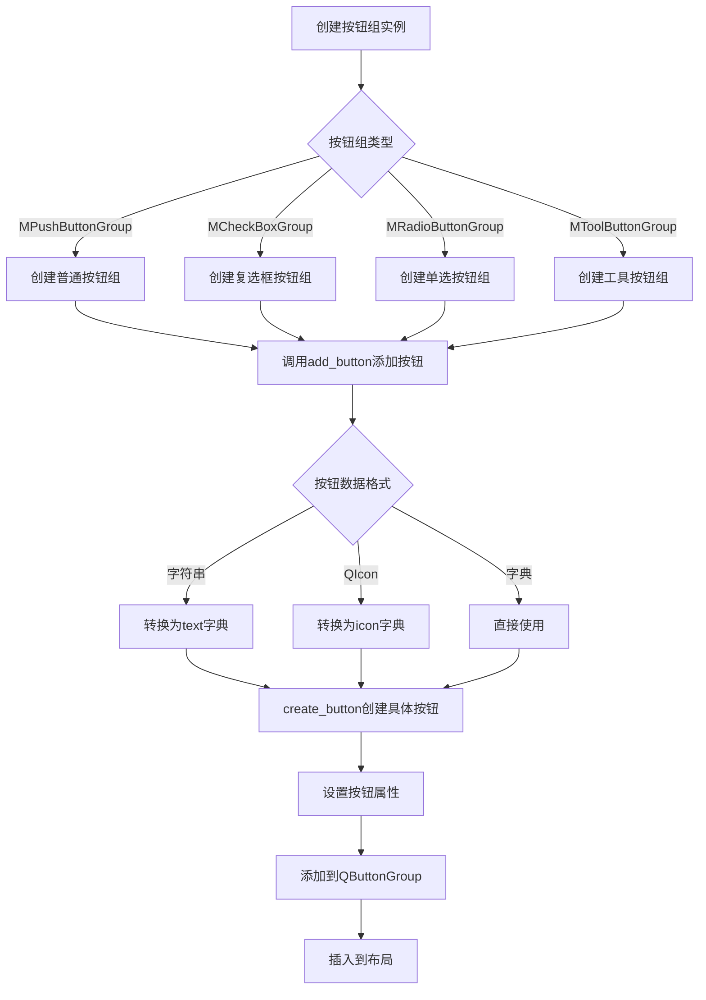

## 类结构

```
MButtonGroupBase (抽象基类)
├── MPushButtonGroup (普通按钮组)
├── MCheckBoxGroup (复选框按钮组)
├── MRadioButtonGroup (单选按钮组)
└── MToolButtonGroup (工具按钮组)
```

## 全局变量及字段


### `dayu_theme.default_size`
    
默认主题大小，用于设置按钮的默认尺寸

类型：`int`
    


### `QtCore.Qt.Horizontal`
    
水平方向常量，表示布局或排列为水平方向

类型：`QtCore.Qt.Orientation`
    


### `QtCore.Qt.Vertical`
    
垂直方向常量，表示布局或排列为垂直方向

类型：`QtCore.Qt.Orientation`
    


### `MButtonGroupBase._main_layout`
    
主布局管理器，用于管理按钮组内按钮的排列布局

类型：`QtWidgets.QBoxLayout`
    


### `MButtonGroupBase._button_group`
    
Qt按钮组管理实例，用于统一管理组内按钮的互斥和选中状态

类型：`QtWidgets.QButtonGroup`
    


### `MButtonGroupBase._orientation`
    
布局方向，值为'horizontal'或'vertical'，决定按钮的排列方式

类型：`str`
    


### `MPushButtonGroup._dayu_type`
    
Dayu主题按钮类型，用于指定按钮的视觉样式类型

类型：`int`
    


### `MPushButtonGroup._dayu_size`
    
Dayu主题按钮大小，用于指定按钮的尺寸规格

类型：`int`
    


### `MCheckBoxGroup.sig_checked_changed`
    
选中状态变化信号，当复选框选中状态改变时发射，携带当前选中的复选框文本列表

类型：`QtCore.Signal(list)`
    


### `MCheckBoxGroup._dayu_checked`
    
当前选中的复选框文本列表，存储当前处于选中状态的复选框文本

类型：`list`
    


### `MRadioButtonGroup.sig_checked_changed`
    
选中状态变化信号，当单选按钮选中状态改变时发射，携带按钮ID和文本

类型：`QtCore.Signal(int, str)`
    


### `MToolButtonGroup.sig_checked_changed`
    
选中状态变化信号，当工具按钮选中状态改变时发射，携带按钮ID

类型：`QtCore.Signal(int)`
    


### `MToolButtonGroup._size`
    
工具按钮大小，用于指定工具按钮的尺寸属性

类型：`object`
    


### `MToolButtonGroup._type`
    
工具按钮类型，用于指定工具按钮的类型或样式

类型：`object`
    
    

## 全局函数及方法


### `get_scale_factor`

获取当前屏幕的缩放因子，用于支持高DPI屏幕的UI元素自适应缩放。

参数： 无

返回值： `tuple`，返回包含横向和纵向缩放因子的元组 `(scale_x, scale_y)`

#### 流程图

```mermaid
flowchart TD
    A[调用 get_scale_factor] --> B{获取系统DPI设置}
    B --> C[计算横向缩放因子 scale_x]
    B --> D[计算纵向缩放因子 scale_y]
    C --> E[返回元组 (scale_x, scale_y)]
    D --> E
```

#### 带注释源码

```python
# 该函数从 .qt 模块导入，未在当前文件中实现
# 根据调用方式推断的函数原型：

def get_scale_factor():
    """
    获取当前屏幕的缩放因子。
    
    通常通过 Qt 的 QApplication 或 QScreen 获取高DPI屏幕的缩放系数，
    返回一个元组 (scale_x, scale_y)，分别代表横向和纵向的缩放比例。
    
    Returns:
        tuple: (float, float) 横向和纵向的缩放因子
    """
    # 函数定义位于 from .qt import get_scale_factor
    # 具体实现需查看 qt.py 模块
    pass
```

#### 使用示例（在当前代码中的调用）

```python
# 在 MCheckBoxGroup.__init__ 中
scale_x, _ = get_scale_factor()  # 获取缩放因子
self.set_spacing(15 * scale_x)   # 根据缩放因子设置按钮间距

# 在 MRadioButtonGroup.__init__ 中
scale_x, _ = get_scale_factor()  # 获取缩放因子
self.set_spacing(15 * scale_x)   # 根据缩放因子设置按钮间距
```

---

### 补充说明

| 项目 | 描述 |
|------|------|
| **来源模块** | `.qt`（qt.py 文件中定义） |
| **调用场景** | 在 `MCheckBoxGroup` 和 `MRadioButtonGroup` 初始化时调用，用于设置按钮组的间距 |
| **技术意图** | 确保在高分屏（HiDPI/Retina）显示器上，按钮间距能够根据系统缩放设置进行自适应 |
| **潜在优化点** | 当前代码忽略了纵向缩放因子 `scale_y`，如需支持非等比缩放屏幕，可考虑使用该值 |


### `MButtonGroupBase.__init__`

初始化按钮组基类，设置按钮组的布局（水平或垂直）、布局参数、尺寸策略，并创建 QButtonGroup 实例来管理按钮。

参数：

- `orientation`：`QtCore.Qt.Orientation`，按钮组的排列方向，默认为 `QtCore.Qt.Horizontal`（水平），可设置为 `QtCore.Qt.Vertical`（垂直）
- `parent`：`QtWidgets.QWidget`，父 widget 对象，默认为 `None`

返回值：`None`，无返回值（`__init__` 方法）

#### 流程图

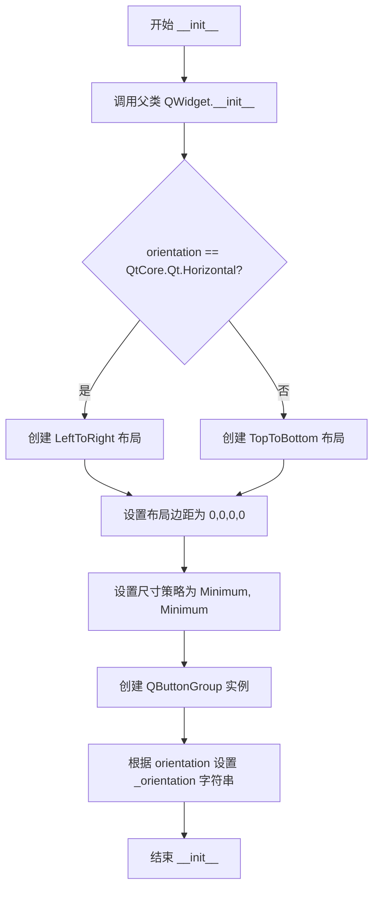

#### 带注释源码

```python
def __init__(self, orientation=QtCore.Qt.Horizontal, parent=None):
    # 调用父类 QtWidgets.QWidget 的初始化方法，传入 parent 参数
    super(MButtonGroupBase, self).__init__(parent=parent)
    
    # 根据 orientation 参数决定布局方向：
    # 水平方向使用 LeftToRight，垂直方向使用 TopToBottom
    self._main_layout = QtWidgets.QBoxLayout(
        QtWidgets.QBoxLayout.LeftToRight
        if orientation == QtCore.Qt.Horizontal
        else QtWidgets.QBoxLayout.TopToBottom
    )
    
    # 设置布局的内边距为 0，即不留白
    self._main_layout.setContentsMargins(0, 0, 0, 0)
    
    # 将布局设置给当前 widget
    self.setLayout(self._main_layout)
    
    # 设置尺寸策略：
    # 水平方向和垂直方向都设置为 Minimum，允许控件根据内容自适应大小
    self.setSizePolicy(QtWidgets.QSizePolicy.Minimum, QtWidgets.QSizePolicy.Minimum)
    
    # 创建 QtWidgets.QButtonGroup 实例，用于管理组内的按钮
    self._button_group = QtWidgets.QButtonGroup()
    
    # 记录当前的方向字符串，供后续 create_button 等方法使用
    self._orientation = "horizontal" if orientation == QtCore.Qt.Horizontal else "vertical"
```


### `MButtonGroupBase.set_spacing`

该方法用于设置按钮组内部各个按钮之间的间距。它通过调用底层布局管理器的 `setSpacing` 方法来实现。

参数：

- `value`：`int`，要设置的间距大小（单位为像素）。

返回值：`None`，该方法没有返回值，仅用于修改组件的布局属性。

#### 流程图

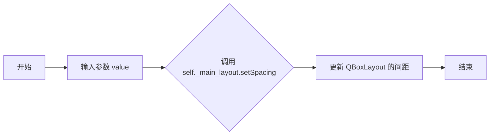

#### 带注释源码

```python
def set_spacing(self, value):
    """
    设置按钮之间的间距。
    
    参数:
        value (int): 新的间距像素值。
    """
    self._main_layout.setSpacing(value)
```


### `MButtonGroupBase.get_button_group`

获取Qt按钮组实例，用于管理组内的按钮（如互斥逻辑、批量操作等）

参数： 无

返回值：`QtWidgets.QButtonGroup`，返回内部的 QButtonGroup 实例，可用于外部进行按钮组操作（如获取选中按钮、设置互斥等）

#### 流程图

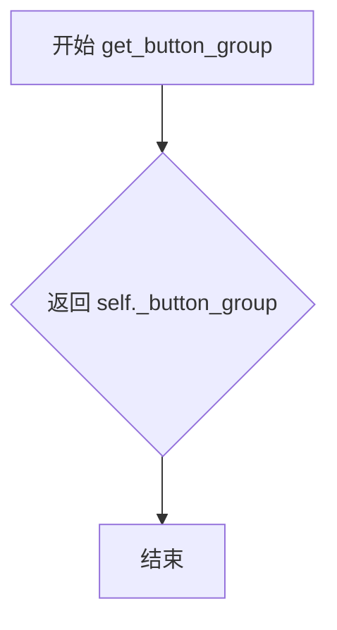

#### 带注释源码

```python
def get_button_group(self):
    """
    获取Qt按钮组实例

    Returns:
        QtWidgets.QButtonGroup: 内部的按钮组对象，用于管理组内按钮的互斥、单选等功能

    Example:
        # 获取按钮组后可以执行如下操作
        group = widget.get_button_group()
        checked_button = group.checkedButton()  # 获取当前选中的按钮
        group.setExclusive(True)  # 设置互斥模式
        button_id = group.id(button)  # 获取按钮ID
    """
    return self._button_group
```


### `MButtonGroupBase.create_button`

创建按钮的抽象方法，用于在按钮组中生成具体的按钮实例。该方法是一个工厂方法，由子类实现具体创建逻辑，基类只定义接口而不实现。

参数：

- `data_dict`：`dict`，包含按钮配置信息的字典，如 `dayu_size`、`dayu_type`、`svg`、`text`、`icon` 等属性

返回值：`QtWidgets.QAbstractButton`，返回创建的按钮实例

#### 流程图

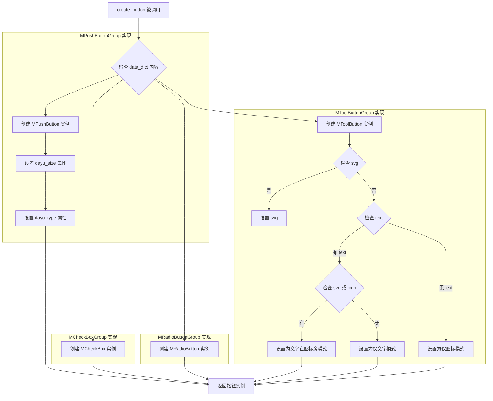

#### 带注释源码

```python
def create_button(self, data_dict):
    """
    创建按钮的抽象方法 - 基类中抛出未实现异常
    
    参数:
        data_dict (dict): 包含按钮配置信息的字典，可能包含以下键：
            - dayu_size: 按钮大小
            - dayu_type: 按钮类型（主要在 MPushButtonGroup 中使用）
            - svg: SVG 图标路径（MToolButtonGroup 使用）
            - text: 按钮文本
            - icon: 图标对象
    
    返回:
        QtWidgets.QAbstractButton: 创建的按钮实例
    
    注意:
        这是一个抽象方法，具体按钮类型由子类实现决定
    """
    raise NotImplementedError()
```

#### 子类实现示例（MPushButtonGroup）

```python
def create_button(self, data_dict):
    """
    创建普通按钮实例
    
    参数:
        data_dict (dict): 包含按钮配置信息的字典
    
    返回:
        MPushButton: 创建的普通按钮实例
    """
    # 创建基础按钮对象
    button = MPushButton()
    # 从 data_dict 获取 dayu_size，若无则使用默认值
    button.set_dayu_size(data_dict.get("dayu_size", self._dayu_size))
    # 从 data_dict 获取 dayu_type，若无则使用默认值
    button.set_dayu_type(data_dict.get("dayu_type", self._dayu_type))
    return button
```

#### 子类实现示例（MToolButtonGroup）

```python
def create_button(self, data_dict):
    """
    创建工具按钮实例，支持 SVG 图标和文字模式
    
    参数:
        data_dict (dict): 包含按钮配置信息的字典
    
    返回:
        MToolButton: 创建的工具按钮实例
    """
    # 创建工具按钮对象
    button = MToolButton()
    # 如果配置了 SVG 图标，设置 SVG
    if data_dict.get("svg"):
        button.svg(data_dict.get("svg"))
    # 如果配置了文本
    if data_dict.get("text"):
        # 同时有图标或 SVG，文字显示在图标旁
        if data_dict.get("svg") or data_dict.get("icon"):
            button.text_beside_icon()
        else:
            # 仅显示文字
            button.text_only()
    else:
        # 无文本，仅显示图标
        button.icon_only()
    return button
```


### `MButtonGroupBase.add_button`

添加按钮到按钮组中，根据传入的 data_dict 参数创建按钮对象，设置其各种属性（文本、图标、数据、选中状态、快捷键、提示信息、可检查性、可用性）以及信号连接，最后将按钮添加到按钮组和布局中，并返回创建的按钮对象。

参数：

- `data_dict`：dict | str | PySide6.QtGui.QIcon，按钮数据字典，或字符串（表示文本）或 QIcon（表示图标）
- `index`：int | None，可选的按钮标识 ID，用于在按钮组中唯一标识该按钮

返回值：`PySide6.QtWidgets.QWidget`，创建并添加的按钮对象

#### 流程图

```mermaid
flowchart TD
    A[开始 add_button] --> B{判断 data_dict 类型}
    B -->|str| C[转换为 {'text': data_dict}]
    B -->|QIcon| D[转换为 {'icon': data_dict}]
    B -->|dict| E[不转换]
    C --> F[调用 create_button 创建按钮]
    D --> F
    E --> F
    F --> G[设置按钮属性 combine]
    G --> H{检查 data_dict 中的键}
    H -->|text| I[设置 text 属性]
    H -->|icon| J[设置 icon 属性]
    H -->|data| K[设置 data 属性]
    H -->|checked| L[设置 checked 属性]
    H -->|shortcut| M[设置 shortcut 属性]
    H -->|tooltip| N[设置 tooltip 属性]
    H -->|checkable| O[设置 checkable 属性]
    H -->|enabled| P[设置 enabled 属性]
    H -->|clicked| Q[连接 clicked 信号]
    H -->|toggled| R[连接 toggled 信号]
    I --> S{index 是否为 None}
    J --> S
    K --> S
    L --> S
    M --> S
    N --> S
    O --> S
    P --> S
    Q --> S
    R --> S
    S -->|是| T[添加按钮到按钮组不指定ID]
    S -->|否| U[添加按钮到按钮组指定ID]
    T --> V[插入按钮到布局]
    U --> V
    V --> W[返回按钮对象]
```

#### 带注释源码

```python
def add_button(self, data_dict, index=None):
    # 判断 data_dict 是否为字符串类型，如果是则转换为包含 'text' 键的字典
    if isinstance(data_dict, six.string_types):
        data_dict = {"text": data_dict}
    # 判断 data_dict 是否为图标类型，如果是则转换为包含 'icon' 键的字典
    elif isinstance(data_dict, QtGui.QIcon):
        data_dict = {"icon": data_dict}
    
    # 调用抽象方法 create_button 创建按钮实例（具体按钮类型由子类实现决定）
    button = self.create_button(data_dict)
    
    # 设置按钮的 'combine' 属性为当前按钮组的方向（horizontal 或 vertical）
    button.setProperty("combine", self._orientation)
    
    # 根据 data_dict 中的键值对设置按钮的相应属性
    if data_dict.get("text"):
        button.setProperty("text", data_dict.get("text"))
    if data_dict.get("icon"):
        button.setProperty("icon", data_dict.get("icon"))
    if data_dict.get("data"):
        button.setProperty("data", data_dict.get("data"))
    if data_dict.get("checked"):
        button.setProperty("checked", data_dict.get("checked"))
    if data_dict.get("shortcut"):
        button.setProperty("shortcut", data_dict.get("shortcut"))
    if data_dict.get("tooltip"):
        button.setProperty("toolTip", data_dict.get("tooltip"))
    if data_dict.get("checkable"):
        button.setProperty("checkable", data_dict.get("checkable"))
    
    # 特殊处理 enabled 属性，因为 None 可能是有意义的值
    if data_dict.get("enabled") is not None:
        button.setEnabled(data_dict.get("enabled"))
    
    # 连接 clicked 信号（如果提供）
    if data_dict.get("clicked"):
        button.clicked.connect(data_dict.get("clicked"))
    # 连接 toggled 信号（如果提供）
    if data_dict.get("toggled"):
        button.toggled.connect(data_dict.get("toggled"))

    # 根据 index 是否为 None 决定如何将按钮添加到按钮组
    if index is None:
        # 不指定 ID 添加按钮
        self._button_group.addButton(button)
    else:
        # 指定 ID 添加按钮
        self._button_group.addButton(button, index)
    
    # 将按钮插入到布局的末尾
    self._main_layout.insertWidget(self._main_layout.count(), button)
    
    # 返回创建并配置好的按钮对象
    return button
```


### `MButtonGroupBase.set_button_list`

批量设置按钮列表，先清除所有现有按钮，再根据传入的按钮数据字典列表依次创建并添加新按钮。

参数：

- `button_list`：`list`，按钮数据字典列表，每个元素为一个包含按钮属性的字典（如 text、icon、data、checked 等）

返回值：`None`，该方法无返回值

#### 流程图

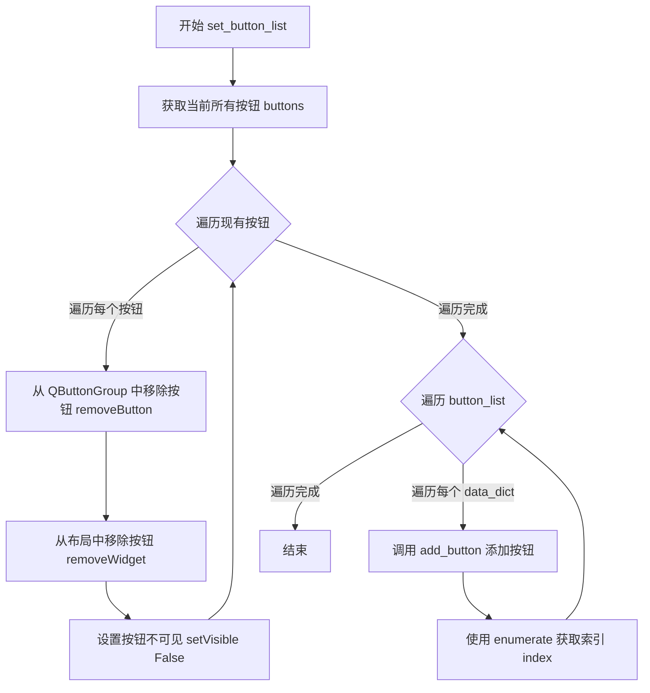

#### 带注释源码

```python
def set_button_list(self, button_list):
    """
    批量设置按钮列表
    
    该方法会先清除所有现有按钮，然后根据传入的按钮数据列表
    逐一创建并添加新按钮到按钮组中。
    
    参数:
        button_list: 按钮数据字典列表，每个字典包含按钮属性如
                     text, icon, data, checked, shortcut, tooltip 等
    """
    # 第一步：清除所有现有按钮
    # 遍历当前按钮组中的所有按钮
    for button in self._button_group.buttons():
        # 从 QButtonGroup 中移除该按钮（解除关联）
        self._button_group.removeButton(button)
        # 从布局管理器中移除该按钮控件
        self._main_layout.removeWidget(button)
        # 设置按钮为不可见状态（隐藏）
        button.setVisible(False)
    
    # 第二步：添加新按钮列表
    # 遍历传入的按钮数据字典列表，同时获取索引
    for index, data_dict in enumerate(button_list):
        # 调用 add_button 方法创建并添加按钮
        # index 参数用于指定按钮的 ID
        button = self.add_button(data_dict, index)
```


### `MPushButtonGroup.__init__`

初始化普通按钮组，创建一个水平或垂直排列的按钮容器，设置默认的间距、按钮类型和大小，并配置按钮组为非独占模式。

参数：

- `orientation`：`QtCore.Qt.Orientation`，按钮排列方向，默认为 `QtCore.Qt.Horizontal`（水平排列）
- `parent`：`QtWidgets.QWidget`，父控件，默认为 `None`

返回值：`None`，构造函数无返回值

#### 流程图

```mermaid
flowchart TD
    A[开始 __init__] --> B[调用父类 MButtonGroupBase.__init__]
    B --> C[设置间距为1: set_spacing(1)]
    C --> D[设置默认按钮类型: _dayu_type = MPushButton.PrimaryType]
    D --> E[设置默认按钮大小: _dayu_size = dayu_theme.default_size]
    E --> F[设置按钮组为非独占模式: setExclusive(False)]
    F --> G[结束]
```

#### 带注释源码

```python
def __init__(self, orientation=QtCore.Qt.Horizontal, parent=None):
    """
    初始化普通按钮组
    
    参数:
        orientation: 按钮排列方向，水平或垂直
        parent: 父控件
    """
    # 调用父类的构造函数，传递方向和父控件参数
    super(MPushButtonGroup, self).__init__(orientation=orientation, parent=parent)
    
    # 设置按钮之间的间距为1像素
    self.set_spacing(1)
    
    # 设置默认的按钮类型为 PrimaryType（主要类型）
    self._dayu_type = MPushButton.PrimaryType
    
    # 设置默认的按钮大小为主题默认大小
    self._dayu_size = dayu_theme.default_size
    
    # 设置按钮组为非独占模式（False），允许同时选中多个按钮
    # 与 MRadioButtonGroup（独占模式）和 MCheckBoxGroup（非独占）对应
    self._button_group.setExclusive(False)
```


### `MPushButtonGroup.create_button`

该方法是MPushButtonGroup类的一个工厂方法，用于根据传入的配置字典创建MPushButton实例，并设置其大小和类型属性。

参数：

-  `data_dict`：`dict`，包含按钮配置信息的字典，可选的键包括`dayu_size`（按钮大小）和`dayu_type`（按钮类型），如果未提供则使用类的默认属性值

返回值：`MPushButton`，返回创建的MPushButton实例

#### 流程图

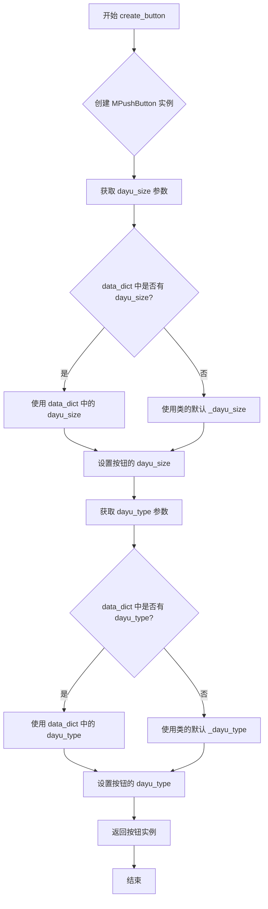

#### 带注释源码

```python
def create_button(self, data_dict):
    """
    创建 MPushButton 实例
    
    该方法是一个工厂方法，用于根据 data_dict 中的配置信息
    创建并返回一个配置好的 MPushButton 实例
    
    参数:
        data_dict: 包含按钮配置信息的字典
            - dayu_size: 可选，按钮大小，若不提供则使用类的默认大小
            - dayu_type: 可选，按钮类型，若不提供则使用类的默认类型
    
    返回:
        MPushButton: 配置好的按钮实例
    """
    # 步骤1: 创建基础的 MPushButton 实例
    button = MPushButton()
    
    # 步骤2: 设置按钮的大小
    # 如果 data_dict 中提供了 dayu_size 则使用该值
    # 否则使用类的默认属性 _dayu_size
    button.set_dayu_size(data_dict.get("dayu_size", self._dayu_size))
    
    # 步骤3: 设置按钮的类型
    # 如果 data_dict 中提供了 dayu_type 则使用该值
    # 否则使用类的默认属性 _dayu_type
    button.set_dayu_type(data_dict.get("dayu_type", self._dayu_type))
    
    # 步骤4: 返回创建并配置好的按钮实例
    return button
```


### `MPushButtonGroup.get_dayu_size`

获取按钮的大小值，用于设置按钮组中按钮的尺寸。

参数：无

返回值：`int`，返回当前按钮的大小值。

#### 流程图

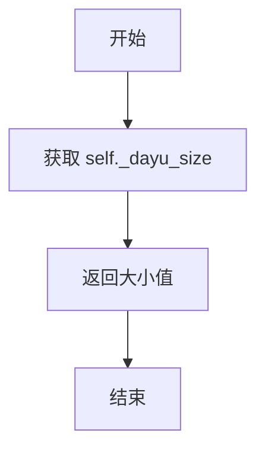

#### 带注释源码

```python
def get_dayu_size(self):
    """
    获取当前按钮的 dayu 大小。
    返回值:
        int: 当前设置的按钮大小值。
    """
    # 返回内部存储的 _dayu_size 属性，该属性在初始化时默认为 dayu_theme.default_size
    return self._dayu_size
```


### `MPushButtonGroup.set_dayu_size`

设置按钮组中按钮的大小属性。

参数：

- `value`：`int`，表示按钮的大小值

返回值：`无`（`None`），该方法仅设置内部属性值，不返回任何内容

#### 流程图

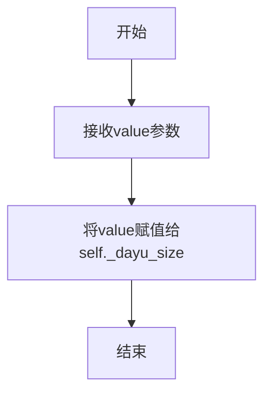

#### 带注释源码

```python
def set_dayu_size(self, value):
    """
    设置按钮组中按钮的大小属性。
    
    参数:
        value: int, 按钮的大小值
        
    注意:
        - 该方法仅更新内部属性 _dayu_size
        - 不会立即影响已存在的按钮，新按钮将使用此值
        - 作为Qt Property的一部分，与get_dayu_size配对使用
    """
    self._dayu_size = value
```


### `MPushButtonGroup.get_dayu_type`

获取按钮组的 Dayu 类型（样式类型），该方法返回当前按钮组使用的按钮样式类型。

参数： 无

返回值：`str`，返回当前按钮组的 Dayu 样式类型（默认为 `MPushButton.PrimaryType`）

#### 流程图

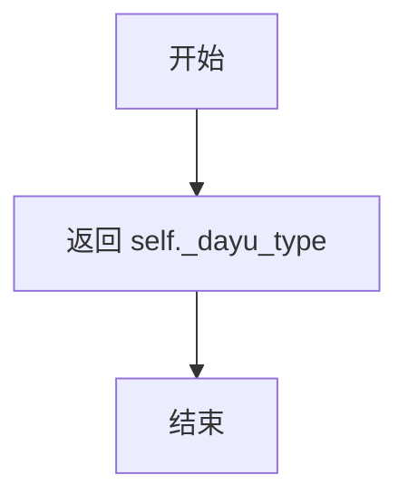

#### 带注释源码

```python
def get_dayu_type(self):
    """
    获取按钮的 Dayu 类型（样式类型）
    
    Returns:
        str: 按钮的 Dayu 样式类型，例如 'primary', 'secondary' 等
             默认值为 MPushButton.PrimaryType
    """
    return self._dayu_type
```


### `MPushButtonGroup.set_dayu_type`

设置按钮组中所有按钮的类型。该方法更新内部 `_dayu_type` 属性，后续通过 `create_button` 创建的新按钮将使用此类型。

参数：

- `value`：`str`，要设置的按钮类型值

返回值：`None`，无返回值描述

#### 流程图

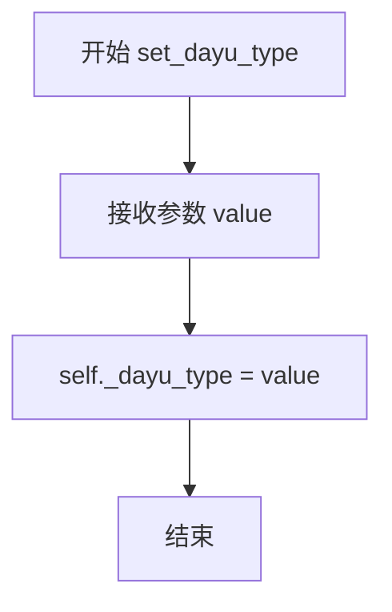

#### 带注释源码

```python
def set_dayu_type(self, value):
    """
    设置按钮类型
    
    参数:
        value: 按钮类型字符串，用于设置按钮的视觉样式类型
    """
    self._dayu_type = value
```


### `MCheckBoxGroup.__init__`

初始化复选框按钮组，设置布局方向、间距、上下文菜单策略，并连接信号槽以处理选中状态变化。

参数：

- `orientation`：`QtCore.Qt.Orientation`，按钮组的布局方向（水平或垂直），默认值为 `QtCore.Qt.Horizontal`
- `parent`：`QtWidgets.QWidget`，父窗口部件，用于管理内存和事件传递，默认值为 `None`

返回值：`None`，构造函数无返回值，仅完成对象初始化

#### 流程图

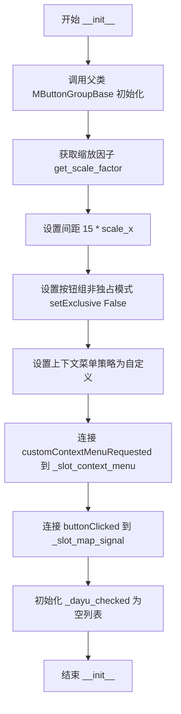

#### 带注释源码

```python
def __init__(self, orientation=QtCore.Qt.Horizontal, parent=None):
    """
    初始化复选框按钮组
    
    参数:
        orientation: 布局方向，水平或垂直
        parent: 父窗口部件
    """
    # 调用父类构造函数，初始化基类属性
    # 包括：主布局、按钮组、方向标识等
    super(MCheckBoxGroup, self).__init__(orientation=orientation, parent=parent)
    
    # 获取UI缩放因子，用于适配不同分辨率屏幕
    scale_x, _ = get_scale_factor()
    
    # 设置按钮之间的间距为15像素并乘以缩放因子
    self.set_spacing(15 * scale_x)
    
    # 设置按钮组为非独占模式，允许同时选中多个复选框
    self._button_group.setExclusive(False)

    # 启用自定义右键菜单功能
    self.setContextMenuPolicy(QtCore.Qt.CustomContextMenu)
    
    # 连接右键菜单请求信号到上下文菜单处理槽
    self.customContextMenuRequested.connect(self._slot_context_menu)

    # 连接按钮点击信号到信号映射槽，触发选中状态变化
    self._button_group.buttonClicked.connect(self._slot_map_signal)
    
    # 初始化选中状态列表，用于管理当前选中的复选框
    self._dayu_checked = []
```


### `MCheckBoxGroup.create_button`

该方法用于在 `MCheckBoxGroup`（复选框组容器）中创建并返回一个 `MCheckBox`（复选框）实例，是按钮组工厂方法设计模式的具体实现。

参数：

- `data_dict`：`dict`，按钮配置字典，虽然当前方法未直接使用，但遵循子类的标准接口规范，供基类 `add_button` 方法调用时传入按钮初始化参数

返回值：`MCheckBox`，返回新创建的复选框实例

#### 流程图

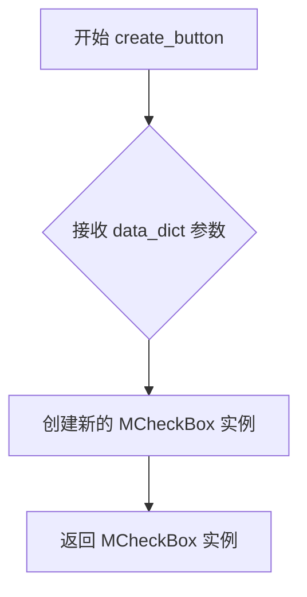

#### 带注释源码

```python
def create_button(self, data_dict):
    """
    创建 MCheckBox 实例
    
    Args:
        data_dict: 按钮配置字典，当前方法未直接使用此参数
                   但保留接口一致性以支持基类调用
    
    Returns:
        MCheckBox: 新创建的复选框实例
    """
    return MCheckBox()
```


### `MCheckBoxGroup._slot_context_menu`

显示右键上下文菜单，提供全选、取消全选、反选三个选项供用户快速操作复选框组。

参数：

- `point`：`QtCore.QPoint`，鼠标右键点击的位置坐标，用于确定菜单弹出位置

返回值：`None`，该方法为槽函数，不返回任何值

#### 流程图

```mermaid
flowchart TD
    A[开始] --> B[创建 MMenu 上下文菜单]
    B --> C[添加"Select All"动作]
    B --> D[添加"Select None"动作]
    B --> E[添加"Select Invert"动作]
    C --> F[连接动作到对应的处理函数]
    D --> F
    E --> F
    F --> G[获取当前鼠标位置并偏移10像素]
    G --> H[显示上下文菜单]
    H --> I[结束]
```

#### 带注释源码

```python
@QtCore.Slot(QtCore.QPoint)
def _slot_context_menu(self, point):
    """
    显示右键上下文菜单的槽函数
    
    参数:
        point: QtCore.QPoint - 鼠标右键点击的位置坐标
    """
    # 创建上下文菜单，父对象为当前复选框组
    context_menu = MMenu(parent=self)
    
    # 添加"全选"动作
    action_select_all = context_menu.addAction("Select All")
    # 添加"取消全选"动作
    action_select_none = context_menu.addAction("Select None")
    # 添加"反选"动作
    action_select_invert = context_menu.addAction("Select Invert")
    
    # 连接"全选"动作到处理函数，传入True表示全选
    action_select_all.triggered.connect(functools.partial(self._slot_set_select, True))
    # 连接"取消全选"动作到处理函数，传入False表示取消全选
    action_select_none.triggered.connect(functools.partial(self._slot_set_select, False))
    # 连接"反选"动作到处理函数，传入None表示反选
    action_select_invert.triggered.connect(functools.partial(self._slot_set_select, None))
    
    # 在鼠标当前位置显示菜单，偏移(10, 10)像素避免遮挡鼠标指针
    context_menu.exec_(QtGui.QCursor.pos() + QtCore.QPoint(10, 10))
```


### `MCheckBoxGroup._slot_set_select`

该方法用于设置复选框组的全选、全不选或反选状态，通过遍历组内所有复选框并根据传入的 state 参数设置其选中状态，最后触发信号通知变更。

参数：

- `state`：`bool` 或 `None`，控制复选框的选择状态。`True` 表示全选，`False` 表示全不选，`None` 表示反选当前状态

返回值：`None`，该方法无返回值，但会触发 `sig_checked_changed` 信号通知状态变更

#### 流程图

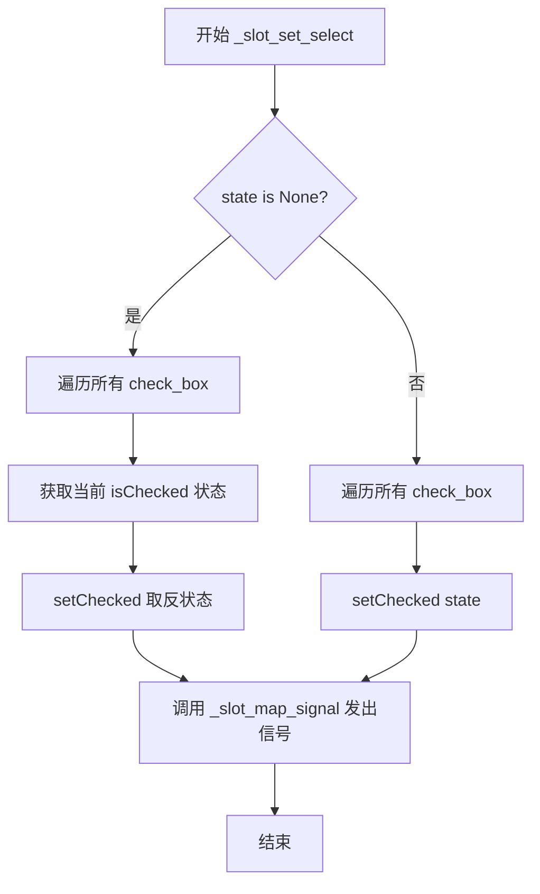

#### 带注释源码

```python
@QtCore.Slot(bool)
def _slot_set_select(self, state):
    """
    设置复选框组的全选/全不选/反选状态
    
    参数:
        state: bool 或 None 类型
              - True: 设置所有复选框为选中状态（全选）
              - False: 设置所有复选框为未选中状态（全不选）
              - None: 反转所有复选框的当前状态（反选）
    """
    # 遍历按钮组中的所有复选框
    for check_box in self._button_group.buttons():
        # 如果 state 为 None，执行反选操作
        if state is None:
            # 获取当前选中状态
            old_state = check_box.isChecked()
            # 设置为相反的状态
            check_box.setChecked(not old_state)
        else:
            # 直接设置选中状态（True 为全选，False 为全不选）
            check_box.setChecked(state)
    
    # 调用信号映射方法，触发 sig_checked_changed 信号
    # 通知外部当前选中的复选框列表已变更
    self._slot_map_signal()
```


### `MCheckBoxGroup._slot_map_signal`

该方法是 MCheckBoxGroup 类中的私有槽函数，用于映射按钮点击信号。当复选框状态发生改变时，收集所有被选中复选框的文本，并以列表形式通过 `sig_checked_changed` 信号发出，以实现选中状态的同步与通知。

参数：

- `button`：`QtWidgets.QAbstractButton`，可选参数，表示被点击的按钮对象，默认为 None。当通过按钮组信号触发时传递实际按钮，当手动调用或通过 `_slot_set_select` 调用时可能为 None

返回值：`None`，该方法通过信号机制传递选中状态，不直接返回值

#### 流程图

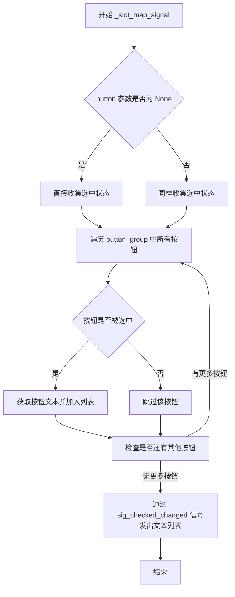

#### 带注释源码

```python
@QtCore.Slot(QtWidgets.QAbstractButton)
def _slot_map_signal(self, button=None):
    """
    映射按钮点击信号的槽函数
    
    当复选框被点击或选中状态改变时，此方法被调用。
    它收集当前所有被选中复选框的文本，并通过 sig_checked_changed 信号发出。
    
    参数:
        button: QtWidgets.QAbstractButton, 被点击的按钮对象。
                在通过 _button_group.buttonClicked 信号触发时会传递实际按钮；
                在手动调用或通过 _slot_set_select 间接调用时可能为 None。
    
    返回值:
        None
    """
    # 使用列表推导式收集所有被选中复选框的文本
    # 遍历按钮组中的所有按钮，过滤出被选中的按钮并获取其文本
    self.sig_checked_changed.emit(
        [check_box.text() for check_box in self._button_group.buttons() if check_box.isChecked()]
    )
```


### MCheckBoxGroup.set_dayu_checked

设置复选框组的选中状态，支持传入单个值或值列表，自动同步UI状态并发出状态变更信号。

参数：
- `value`：`list` 或 `any`，要设置的选中值，可以是单个字符串值或字符串值列表

返回值：`None`，无返回值（该方法直接修改对象状态并通过信号通知）

#### 流程图

```mermaid
flowchart TD
    A[开始 set_dayu_checked] --> B{value是否为list?}
    B -- 否 --> C[将value转换为列表: value = [value]]
    B -- 是 --> D[跳过转换]
    C --> E{value == get_dayu_checked?}
    D --> E
    E -- 是 --> F[直接返回, 不做任何操作]
    E -- 否 --> G[更新内部状态: self._dayu_checked = value]
    G --> H[遍历所有复选框按钮]
    H --> I{当前复选框文本在value中?}
    I -- 是 --> J[设置状态为Checked]
    I -- 否 --> K[设置状态为Unchecked]
    J --> L{新状态与当前状态不同?}
    K --> L
    L -- 是 --> M[调用setCheckState更新UI]
    L -- 否 --> N[跳过此复选框]
    M --> O[继续下一个复选框]
    N --> O
    O --> P{还有更多复选框?}
    P -- 是 --> H
    P -- 否 --> Q[发出信号: sig_checked_changed.emit]
    Q --> R[结束]
    F --> R
```

#### 带注释源码

```python
def set_dayu_checked(self, value):
    """
    设置复选框组的选中状态
    
    参数:
        value: 可以是单个值(字符串)或值列表(字符串列表)
               用于指定哪些文本的复选框应该被选中
    
    处理流程:
        1. 如果value不是列表,则转换为列表
        2. 检查是否与当前选中状态相同，若是则直接返回
        3. 遍历所有复选框，根据value列表设置对应的选中状态
        4. 发出状态变更信号
    """
    # 参数标准化：将单个值转换为列表，统一处理逻辑
    if not isinstance(value, list):
        value = [value]
    
    # 性能优化：若新值与当前值相同，避免不必要的UI更新
    if value == self.get_dayu_checked():
        return

    # 更新内部状态：记录当前选中的值列表
    self._dayu_checked = value
    
    # 遍历按钮组中的所有复选框
    for check_box in self._button_group.buttons():
        # 根据复选框文本是否在value列表中决定目标状态
        flag = QtCore.Qt.Checked if check_box.text() in value else QtCore.Qt.Unchecked
        
        # 仅当状态实际变化时才更新UI，避免触发不必要的事件
        if flag != check_box.checkState():
            check_box.setCheckState(flag)
    
    # 发出信号通知外部选中状态已变更
    self.sig_checked_changed.emit(value)
```


### `MCheckBoxGroup.get_dayu_checked`

获取当前选中的复选框的文本列表。

参数：
- 无

返回值：`list`，返回包含所有被选中复选框文本（QString）的列表。

#### 流程图

```mermaid
flowchart TD
    Start([开始 get_dayu_checked]) --> GetButtons[获取按钮组 _button_group 中的所有按钮]
    Iterate{遍历按钮列表}
    GetButtons --> Iterate
    IsChecked{当前按钮是否被选中 isChecked?}
    Iterate --> IsChecked
    AddText[将按钮文本 text() 加入结果列表]
    IsChecked -- 是 --> AddText
    AddText --> Next[处理下一按钮]
    IsChecked -- 否 --> Next
    Next --> Iterate
    Iterate --> ReturnList[返回结果列表]
    ReturnList --> End([结束])
```

#### 带注释源码

```python
def get_dayu_checked(self):
    """
    获取当前选中的复选框。
    遍历按钮组中的所有按钮，筛选出状态为已选中的按钮，并提取其文本组成列表返回。
    """
    # 使用列表推导式遍历按钮组中的所有按钮
    # 筛选出 isChecked() 为 True 的按钮
    # 并提取这些按钮的文本 text() 组成列表
    return [check_box.text() for check_box in self._button_group.buttons() if check_box.isChecked()]
```


### `MRadioButtonGroup.__init__`

初始化单选按钮组，创建一个支持水平或垂直布局的单选按钮组合部件，继承自 MButtonGroupBase，并配置互斥模式以实现单选功能。

参数：

- `orientation`：`QtCore.Qt.Horizontal`，布局方向，默认为水平布局，可设置为 QtCore.Qt.Vertical 表示垂直布局
- `parent`：`QtWidgets.QWidget`，父 widget 指针，默认为 None

返回值：`None`，构造函数无返回值

#### 流程图

```mermaid
flowchart TD
    A[开始初始化 MRadioButtonGroup] --> B[调用父类 MButtonGroupBase.__init__]
    B --> C[获取屏幕缩放因子 scale_x]
    C --> D[设置按钮间距为 15 * scale_x]
    D --> E[设置按钮组为互斥模式 exclusive=True]
    E --> F[连接 buttonClicked 信号到 _on_button_clicked 槽函数]
    F --> G[结束初始化]
```

#### 带注释源码

```python
def __init__(self, orientation=QtCore.Qt.Horizontal, parent=None):
    """
    初始化单选按钮组
    
    参数:
        orientation: 布局方向，QtCore.Qt.Horizontal 或 QtCore.Qt.Vertical
        parent: 父 widget
    """
    # 调用父类 MButtonGroupBase 的初始化方法
    # 设置基础布局和按钮组
    super(MRadioButtonGroup, self).__init__(orientation=orientation, parent=parent)
    
    # 获取屏幕缩放因子，用于自适应不同分辨率
    scale_x, _ = get_scale_factor()
    
    # 设置按钮之间的间距为 15 * scale_x，实现自适应间距
    self.set_spacing(15 * scale_x)
    
    # 设置按钮组为互斥模式，保证同一时间只有一个按钮被选中
    # 这是单选按钮组的核心特性
    self._button_group.setExclusive(True)
    
    # 连接按钮点击信号到内部处理槽函数
    # 当用户点击任意单选按钮时，会触发 _on_button_clicked 方法
    self._button_group.buttonClicked.connect(self._on_button_clicked)
```


### `MRadioButtonGroup._on_button_clicked`

处理单选按钮组中的按钮点击事件，当用户点击单选按钮时，该方法会被调用，并发射 `sig_checked_changed` 信号以通知外部当前选中的按钮 ID 和文本内容。

参数：

- `button`：`QtWidgets.QAbstractButton`，被点击的按钮对象

返回值：`None`，该方法没有返回值，通过信号机制传递数据

#### 流程图

```mermaid
flowchart TD
    A[用户点击单选按钮] --> B{按钮点击信号触发}
    B --> C[调用 _on_button_clicked 方法]
    C --> D[获取按钮的 ID: button_group.id button]
    C --> E[获取按钮的文本: button.text]
    D --> F[发射 sig_checked_changed 信号]
    E --> F
    F --> G[信号携带 int 和 str 参数]
    G --> H[通知外部选中的按钮信息已变更]
```

#### 带注释源码

```python
def _on_button_clicked(self, button):
    """
    处理单选按钮组中按钮的点击事件
    
    当按钮组中的任意按钮被点击时，此方法会被 Qt 的 buttonClicked 信号触发。
    该方法的主要功能是获取被点击按钮的唯一标识 ID 和文本内容，
    并通过发射 sig_checked_changed 信号将这些信息传递给关心此变化的外部组件。
    
    参数:
        button: QtWidgets.QAbstractButton，被点击的按钮实例。
                在 Qt 框架中，所有按钮类型（如 QRadioButton、QPushButton 等）
                都继承自 QAbstractButton，因此这里使用基类类型声明。
    
    返回值:
        None。本方法不直接返回值，而是通过 Qt 信号机制传递数据。
    """
    # 发射信号，传递两个参数：
    # 1. self._button_group.id(button) - 按钮的唯一整型 ID
    # 2. button.text() - 按钮显示的文本内容
    self.sig_checked_changed.emit(self._button_group.id(button), button.text())
```


### `MRadioButtonGroup.create_button`

该方法是 `MRadioButtonGroup` 类的核心方法之一，用于根据传入的数据字典创建并返回一个 `MRadioButton` 单选按钮实例。该方法是抽象方法 `create_button` 在 `MRadioButtonGroup` 中的具体实现，遵循了基类 `MButtonGroupBase` 定义的工厂方法模式，使得不同类型的按钮组可以自定义其按钮的创建逻辑。

参数：

-  `data_dict`：`dict`，包含按钮配置信息的字典，虽然当前方法未直接使用该参数（仅调用无参构造函数），但该参数是为了保持接口一致性以及为未来扩展预留，调用方可能会传入如 `text`、`icon`、`checked` 等按钮属性。

返回值：`MRadioButton`，新创建的 Mu Dayu 风格单选按钮实例。

#### 流程图

```mermaid
flowchart TD
    A[开始 create_button] --> B{接收 data_dict 参数}
    B --> C[创建 MRadioButton 实例]
    C --> D[返回 MRadioButton 对象]
    D --> E[结束]
```

#### 带注释源码

```python
def create_button(self, data_dict):
    """
    创建 MRadioButton 单选按钮实例
    
    参数:
        data_dict: dict, 按钮配置数据字典（当前版本未使用，预留参数）
    
    返回:
        MRadioButton: 新创建的单选按钮实例
    """
    # 实例化一个 MRadioButton（Mu Dayu 框架的单选按钮组件）
    return MRadioButton()
```


### `MRadioButtonGroup.set_dayu_checked`

该方法用于通过按钮的ID设置单选按钮组中被选中的按钮。它首先检查传入的ID是否与当前选中的ID一致，如果一致则直接返回；否则根据ID查找对应的按钮，设置其为选中状态，并发射信号通知变化。值得注意的是，该方法的第二个参数`str`在当前实现中未被使用，可能存在设计上的冗余或遗留问题。

参数：

-  `value`：`int`，要设置为选中状态的按钮的唯一ID（整型）。
-  `str`：`str`，参数列表中定义的字符串类型参数，但在当前方法逻辑中未被使用。

返回值：`None`，该方法不返回值。

#### 流程图

```mermaid
graph TD
    A([Start set_dayu_checked]) --> B{value == get_dayu_checked?}
    B -- Yes --> C([Return None])
    B -- No --> D[Get button by ID: button = _button_group.button(value)]
    D --> E{Button exists?}
    E -- No --> F[Print 'error']
    E -- Yes --> G[button.setChecked(True)]
    G --> H[Emit sig_checked_changed(value, button.text())]
    F --> I([End])
    C --> I
    H --> I
```

#### 带注释源码

```python
def set_dayu_checked(self, value, str):
    """
    设置选中的单选按钮。

    Args:
        value (int): 按钮的ID。
        str (str): (未使用) 签名中存在的冗余参数。
    """
    # 获取当前被选中的按钮ID，如果与传入的value相同，则不进行任何操作
    if value == self.get_dayu_checked():
        return

    # 根据传入的ID获取对应的按钮对象
    button = self._button_group.button(value)

    # 如果按钮存在
    if button:
        # 将按钮设置为选中状态
        button.setChecked(True)
        # 发射信号，通知外部当前选中的按钮ID和文本发生了变化
        self.sig_checked_changed.emit(value, button.text())
    else:
        # 如果没有找到对应ID的按钮，打印错误信息
        print("error")
```


### `MRadioButtonGroup.get_dayu_checked`

该方法是 `MRadioButtonGroup` 类的属性读取器（Getter），用于获取当前在该组中被唯一选中的单选按钮的 ID。它直接调用内部封装的 Qt `QButtonGroup` 对象的 `checkedId()` 方法。

参数：

-  `self`：`MRadioButtonGroup`，隐式参数，指向类的当前实例。

返回值：`int`，返回当前选中按钮的唯一标识符（ID）。如果当前没有选中任何按钮（所有按钮均未勾选），则返回 Qt 默认的空 ID（通常为 -1）。

#### 流程图

```mermaid
sequenceDiagram
    participant Caller as 外部调用者
    participant MRadioButtonGroup
    participant QButtonGroup as self._button_group (Qt)
    
    Caller->>MRadioButtonGroup: get_dayu_checked()
    MRadioButtonGroup->>QButtonGroup: checkedId()
    QButtonGroup-->>MRadioButtonGroup: checked_id (int)
    MRadioButtonGroup-->>Caller: checked_id
```

#### 带注释源码

```python
def get_dayu_checked(self):
    """
    获取当前选中的按钮ID。
    此方法作为 Qt Property 'dayu_checked' 的 getter。
    它查询内部维护的 QButtonGroup，以获取当前处于选中状态（Checked=True）的按钮的 ID。
    注意：由于 RadioButton 通常是互斥的（Exclusive），因此只返回一个 ID。
    
    Returns:
        int: 当前选中按钮的 ID。如果没有选中任何按钮，返回 -1 (Qt.QButtonGroup.NoButton)。
    """
    return self._button_group.checkedId()
```


### `MRadioButtonGroup.get_current_value`

获取当前选中按钮的文本，如果没有任何按钮被选中则返回 None。

参数： 无

返回值：`str | None`，返回当前选中按钮的文本，如果没有选中按钮则返回 None

#### 流程图

```mermaid
flowchart TD
    A[开始 get_current_value] --> B[获取当前选中的按钮]
    B --> C{是否有选中的按钮?}
    C -->|是| D[返回按钮的文本 text]
    C -->|否| E[返回 None]
    D --> F[结束]
    E --> F
```

#### 带注释源码

```python
def get_current_value(self):
    """
    获取当前选中按钮的文本
    
    Returns:
        str or None: 当前选中按钮的文本，如果没有选中按钮则返回 None
    """
    # 获取当前被选中的按钮（QAbstractButton 或 None）
    checked_button = self._button_group.checkedButton()
    
    # 检查是否存在被选中的按钮
    if checked_button:
        # 返回选中按钮的文本内容
        return checked_button.text()
    
    # 如果没有选中的按钮，返回 None
    return None
```


### `MToolButtonGroup.__init__`

该方法负责初始化工具按钮组（`MToolButtonGroup`）的实例。它首先调用父类的构造函数以建立基础布局（水平或垂直），随后配置按钮组的互斥属性（决定是否像单选按钮一样只能选中一个），并保存传入的尺寸和类型参数以供后续使用。最后，它将内部按钮的点击信号连接到槽函数，以支持选中状态变化的通知。

参数：

- `size`：`Any`，按钮的尺寸配置，存储在实例属性中供后续使用。
- `type`：`Any`，按钮的类型样式配置，存储在实例属性中供后续使用。
- `exclusive`：`bool`，布尔值，控制按钮组是否为互斥模式（若为 `True`，则同时只能有一个按钮被选中）。
- `orientation`：`QtCore.Qt.Orientation`，布局方向（默认水平），决定按钮是横向排列还是纵向排列。
- `parent`：`QtWidgets.QWidget`，父 widget 指针，用于控制组件的生命周期。

返回值：`None`，构造函数不返回任何值。

#### 流程图

```mermaid
flowchart TD
    A([开始初始化]) --> B[调用父类 MButtonGroupBase.__init__]
    B --> C[设置间距为 1]
    C --> D[根据 exclusive 参数设置按钮组互斥属性]
    D --> E[保存 size 到实例变量 _size]
    E --> F[保存 type 到实例变量 _type]
    F --> G[连接按钮组 buttonClicked 信号到 _on_button_clicked]
    G --> H([结束初始化])
```

#### 带注释源码

```python
def __init__(
    self,
    size=None,
    type=None,
    exclusive=False,
    orientation=QtCore.Qt.Horizontal,
    parent=None,
):
    # 调用父类 MButtonGroupBase 的初始化方法
    # 父类负责设置布局（水平或垂直）、大小策略以及内部的 QButtonGroup
    super(MToolButtonGroup, self).__init__(orientation=orientation, parent=parent)
    
    # 设置按钮之间的间距为 1
    self.set_spacing(1)
    
    # 设置按钮组的互斥模式，如果 exclusive 为 True，则同一时间只能选中一个按钮
    self._button_group.setExclusive(exclusive)
    
    # 保存传入的尺寸参数，通常用于后续创建按钮时指定大小
    self._size = size
    
    # 保存传入的类型参数，通常用于后续创建按钮时指定样式
    self._type = type
    
    # 将内部 QButtonGroup 的点击信号连接到 MToolButtonGroup 的处理函数
    # 这样当按钮被点击时，会触发 sig_checked_changed 信号
    self._button_group.buttonClicked.connect(self._on_button_clicked)
```


### `MToolButtonGroup._on_button_clicked`

处理按钮组内的点击事件。当用户点击按钮时，此方法被调用，从内部按钮组获取被点击按钮的唯一标识 ID，并通过 `sig_checked_changed` 信号将新的选中状态广播给监听者。

参数：

-  `button`：`QtWidgets.QAbstractButton`，当前被点击的按钮对象。

返回值：`None`，该方法不直接返回值，仅通过信号机制进行状态更新。

#### 流程图

```mermaid
graph TD
    A[用户点击工具按钮] --> B{调用 _on_button_clicked}
    B --> C[获取按钮对象]
    C --> D[根据 button 对象获取 ID: button_id]
    D --> E[发射信号: sig_checked_changed.emit(button_id)]
    E --> F[通知关联的 UI 或属性槽函数]
```

#### 带注释源码

```python
def _on_button_clicked(self, button):
    """
    处理按钮点击事件的私有槽函数。

    当 buttonClicked 信号被触发时，此方法被自动调用。
    它负责将具体的按钮对象转换为其在组内的 ID，
    并通过信号机制将这一变化对外传播。

    参数:
        button (QtWidgets.QAbstractButton): 
            PySide6 按钮组点击信号传递的按钮实例。
    """
    # 通过按钮组对象的 id() 方法获取该按钮的唯一整型标识 ID
    button_id = self._button_group.id(button)
    
    # 发射自定义信号 sig_checked_changed，通知外部当前选中的按钮 ID 已更改
    self.sig_checked_changed.emit(button_id)
```


### `MToolButtonGroup.create_button`

该方法用于根据传入的配置字典创建一个 `MToolButton` 工具按钮实例，并根据配置数据设置按钮的显示模式（仅图标、仅文本或图标文字并排显示）。

参数：

- `data_dict`：`dict`，包含按钮配置数据的字典，可能包含 `svg`（SVG 图标路径）、`text`（按钮文本）、`icon`（图标对象）等键

返回值：`MToolButton`，返回创建的 MToolButton 按钮实例

#### 流程图

```mermaid
flowchart TD
    A[开始 create_button] --> B[创建 MToolButton 实例]
    B --> C{检查 data_dict 中是否有 svg}
    C -->|有| D[调用 button.svg 设置 SVG 图标]
    C -->|无| E{检查 data_dict 中是否有 text}
    D --> E
    E -->|有 text| F{检查是否有 svg 或 icon}
    E -->|无 text| G[调用 button.icon_only 仅显示图标]
    F -->|有 svg 或 icon| H[调用 button.text_beside_icon 图标文字并排]
    F -->|无 svg 且无 icon| I[调用 button.text_only 仅显示文字]
    H --> J[返回 button 实例]
    G --> J
    I --> J
    J --> K[结束]
```

#### 带注释源码

```python
def create_button(self, data_dict):
    """
    创建 MToolButton 实例，并根据 data_dict 配置按钮显示模式
    
    参数:
        data_dict: 包含按钮配置信息的字典，可能包含以下键:
            - svg: SVG 图标文件路径
            - text: 按钮显示文本
            - icon: QIcon 图标对象
    
    返回:
        MToolButton: 配置完成的工具按钮实例
    """
    # 创建基础的工具按钮实例
    button = MToolButton()
    
    # 如果配置了 SVG 图标，则设置 SVG 图标
    if data_dict.get("svg"):
        button.svg(data_dict.get("svg"))
    
    # 根据配置决定按钮的显示模式
    if data_dict.get("text"):
        # 如果有文本内容，进一步判断图标配置
        if data_dict.get("svg") or data_dict.get("icon"):
            # 既有文本又有图标，设置图标文字并排显示
            button.text_beside_icon()
        else:
            # 只有文本，设置仅显示文字模式
            button.text_only()
    else:
        # 没有文本内容，设置仅显示图标模式
        button.icon_only()
    
    # 返回配置完成的按钮实例
    return button
```


### `MToolButtonGroup.set_dayu_checked(value)`

该方法用于设置 `MToolButtonGroup` 控件中当前选中的工具按钮，通过按钮ID来选中对应的工具按钮，并在选中状态发生变化时发出相应的信号通知。

参数：

- `value`：`int`，要选中的按钮的ID（标识符），对应 `QButtonGroup` 中按钮的唯一索引

返回值：`None`，该方法没有返回值，仅执行状态设置和信号发送操作

#### 流程图

```mermaid
flowchart TD
    A[开始 set_dayu_checked] --> B{value == get_dayu_checked?}
    B -->|是| C[直接返回，不做任何操作]
    B -->|否| D[通过 value 获取对应按钮]
    D --> E{按钮是否存在?}
    E -->|否| F[打印错误信息: No button found with id]
    E -->|是| G[调用 button.setChecked(True) 选中按钮]
    G --> H[发出信号 sig_checked_changed.emit(value)]
    H --> I[结束]
    F --> I
```

#### 带注释源码

```python
def set_dayu_checked(self, value):
    """
    设置选中的工具按钮
    
    参数:
        value: int, 要选中的按钮的ID
        
    注意:
        - 如果传入的 value 与当前选中的按钮ID相同，则直接返回，不做任何操作
        - 如果没有找到对应ID的按钮，会打印错误信息
        - 设置成功后，会发出 sig_checked_changed 信号
    """
    # 检查新值是否与当前选中值相同，避免不必要的操作和信号触发
    if value == self.get_dayu_checked():
        return
    
    # 根据按钮ID获取对应的按钮对象
    button = self._button_group.button(value)
    
    # 判断按钮是否存在
    if button:
        # 设置按钮为选中状态
        button.setChecked(True)
        # 发出选中状态改变的信号，通知外部监听者
        self.sig_checked_changed.emit(value)
    else:
        # 按钮不存在时，打印错误信息
        print(f"Error: No button found with id {value}")
```

#### 补充说明

**设计意图**：
- 该方法实现了对工具按钮组的选中状态管理，类似于 Qt 原生 `QButtonGroup` 的行为封装
- 通过 `dayu_checked` 属性（`QtCore.Property`）暴露给 Qt 的属性系统，支持 Qt Designer 和 QML 中的数据绑定

**与同类方法的差异**：
- `MCheckBoxGroup.set_dayu_checked` 接收的是列表类型（支持多选）
- `MRadioButtonGroup.set_dayu_checked` 接收整型 ID 和字符串参数
- `MToolButtonGroup.set_dayu_checked` 仅接收整型 ID（因为工具按钮组默认是单选模式）

**潜在优化空间**：
1. 错误处理可以更健壮：使用 `logging` 模块代替 `print` 输出错误，或抛出自定义异常
2. 可以添加类型检查：在方法开头验证 `value` 是否为整数类型
3. 缺少返回值：可以考虑返回布尔值表示设置是否成功，提高调用方的可操作性


### `MToolButtonGroup.get_dayu_checked`

获取当前选中的工具按钮ID，返回当前被选中的按钮在按钮组中的唯一标识符（ID）。

参数： 该方法无参数。

返回值： `int`，返回当前选中的按钮ID，如果没有选中任何按钮则返回 -1。

#### 流程图

```mermaid
flowchart TD
    A[调用 get_dayu_checked] --> B{检查按钮组}
    B --> C[调用 QButtonGroup.checkedId]
    C --> D{是否有选中按钮}
    D -->|有| E[返回按钮ID]
    D -->|无| F[返回 -1]
```

#### 带注释源码

```python
def get_dayu_checked(self):
    """
    获取当前选中的工具按钮ID
    
    该方法直接调用 Qt 按钮组的 checkedId() 方法，
    返回当前被选中（checked=True）按钮的唯一标识符。
    如果没有按钮被选中，返回 -1。
    
    Returns:
        int: 当前选中按钮的ID，如果没有选中则返回 -1
    """
    return self._button_group.checkedId()
```

#### 补充说明

- **设计目的**：该方法是 Qt 属性 `dayu_checked` 的 getter 访问器，用于实现 Qt 的属性系统（Property）。通过定义 `dayu_checked = QtCore.Property(int, get_dayu_checked, set_dayu_checked, notify=sig_checked_changed)`，使得该属性可以在 Qt 的元对象系统中使用，支持信号槽机制和属性绑定。
- **与 `MRadioButtonGroup` 的区别**：`MToolButtonGroup` 的 `get_dayu_checked()` 方法与 `MRadioButtonGroup` 的实现完全一致，都返回按钮的 ID（int 类型）。而 `MCheckBoxGroup` 的 `get_dayu_checked()` 则返回选中的复选框文本列表（list 类型）。
- **外部依赖**：依赖 Qt 的 `QButtonGroup.checkedId()` 方法，该方法是 Qt 框架提供的标准方法，用于获取当前被选中的按钮ID。

## 关键组件


### MButtonGroupBase

基础按钮组容器类，提供横向或纵向布局的按钮组管理功能，支持动态添加按钮和设置间距，是所有具体按钮组类的基类。

### MPushButtonGroup

普通按钮组实现类，继承自MButtonGroupBase，创建MPushButton类型的按钮，支持设置按钮的dayu_size和dayu_type属性，适用于普通交互按钮场景。

### MCheckBoxGroup

复选框按钮组实现类，继承自MButtonGroupBase，支持多选模式，提供右键上下文菜单实现全选/取消全选/反选功能，通过sig_checked_changed信号发射当前选中的文本列表。

### MRadioButtonGroup

单选按钮组实现类，继承自MButtonGroupBase，通过setExclusive(True)实现独占模式，sig_checked_changed信号发射选中按钮的id和文本，适用于单选项场景。

### MToolButtonGroup

工具按钮组实现类，继承自MButtonGroupBase，创建MToolButton类型的按钮，支持svg图标和文本显示模式，通过checkedId()管理选中状态，适用于工具栏场景。

### Qt Property 属性系统

代码中使用QtCore.Property装饰器为MPushButtonGroup、MRadioButtonGroup、MToolButtonGroup和MCheckBoxGroup暴露Qt属性，实现与Qt元对象系统的集成，支持Qt Designer和QML绑定。

### 信号与槽机制

代码定义多个Qt信号：sig_checked_changed用于MCheckBoxGroup(发射list)、MRadioButtonGroup(发射int,str)、MToolButtonGroup(发射int)，实现按钮状态变化时的通知机制。

### 上下文菜单组件

MCheckBoxGroup实现了_slot_context_menu方法，创建MMenu并添加"Select All"、"Select None"、"Select Invert"三个操作，通过functools.partial绑定参数实现批量选择功能。

### 布局管理器

使用QtWidgets.QBoxLayout实现横向(QtWidgets.QBoxLayout.LeftToRight)或纵向(QtWidgets.QBoxLayout.TopToBottom)的按钮排列，通过setContentsMargins(0,0,0,0)设置无边缘间距。

### 按钮工厂方法

create_button作为工厂方法在MButtonGroupBase中定义为抽象方法(raise NotImplementedError)，各子类实现具体的按钮创建逻辑，实现策略模式。

### 数据驱动按钮创建

add_button方法支持多种数据格式输入(six.string_types、QtGui.QIcon、dict)，将数据字典转换为按钮属性(text、icon、data、checked、shortcut、tooltip、checkable、enabled、clicked、toggled)。


## 问题及建议


### 已知问题

-   **方法签名不一致**：`MRadioButtonGroup.set_dayu_checked(self, value, str)` 方法多了一个名为 `str` 的参数（且使用Python内置类型名作为参数名是糟糕的实践），与 `MCheckBoxGroup` 和 `MToolButtonGroup` 中的同名方法签名不一致。
-   **信号定义不统一**：三个子类的 `sig_checked_changed` 信号签名完全不同——`MCheckBoxGroup` 发射 `list`，`MRadioButtonGroup` 发射 `int, str`，`MToolButtonGroup` 发射 `int`，导致使用者需要记住每种类型的 API。
-   **错误处理不当**：使用 `print("error")` 和 `print(f"Error: ...")` 进行错误输出，缺乏正式的异常处理或日志记录机制，不利于生产环境调试。
-   **重复代码**：`set_dayu_checked`、`get_dayu_checked` 方法在三个子类中几乎完全重复，违反了 DRY 原则；属性 `dayu_checked` 也重复定义了三次。
-   **抽象方法未使用 ABC**：`MButtonGroupBase.create_button` 方法抛出 `NotImplementedError()` 但未使用 `abc.ABC` 或 `abc.abstractmethod` 装饰器，不够规范。
-   **导入重复与覆盖**：文件末尾重复导入了 `from PySide6 import QtCore, QtWidgets`，会覆盖之前的导入，造成命名空间混乱。
-   **命名污染**：`MRadioButtonGroup.set_dayu_checked` 的参数 `str` 是 Python 内置类型名，会覆盖内置 `str`，这是不良的命名实践。
-   **魔法数值硬编码**：spacing 值（如 1、15）在代码中硬编码，缺乏常量定义，降低了可维护性。
-   **属性定义位置不一致**：`dayu_size` 和 `dayu_type` 属性仅在 `MPushButtonGroup` 中定义，但 `MCheckBoxGroup` 等其他子类也可能有此需求，目前无法从基类统一配置。
-   **类型提示缺失**：整个代码库没有使用类型注解（Type Hints），降低了代码的可读性和 IDE 支持。
-   **按钮重用效率低**：`set_button_list` 方法每次都销毁并重建所有按钮，对于大量按钮的场景性能不佳。
-   **上下文菜单位置计算**：`_slot_context_menu` 中使用 `QtGui.QCursor.pos() + QtCore.QPoint(10, 10)` 偏移菜单位置，这种硬编码的偏移值可能在不同平台表现不一致。

### 优化建议

-   **统一信号设计**：将三个子类的 `sig_checked_changed` 信号统一为一种签名，例如统一使用 `int` (button id)，或在基类中定义统一的信号模板。
-   **抽象基类改造**：使用 `abc.ABC` 和 `@abstractmethod` 装饰器改造 `MButtonGroupBase.create_button` 方法，强制子类实现。
-   **代码复用**：将重复的 `set_dayu_checked`、`get_dayu_checked` 逻辑提升到基类 `MButtonGroupBase` 中，通过模板方法模式或属性配置实现。
-   **正式错误处理**：用 `logging` 模块替代 `print` 语句，或抛出自定义异常类，提升错误可追溯性。
-   **移除重复导入**：删除文件末尾的重复导入语句。
-   **添加类型提示**：为所有方法参数和返回值添加类型注解，提升代码可维护性。
-   **常量定义**：将硬编码的数值（spacing 等）提取为类常量或配置属性。
-   **参数命名修正**：将 `str` 参数重命名为有意义的名称，如 `checked_text` 或 `label`。
-   **优化按钮重建逻辑**：在 `set_button_list` 中实现增量更新，只添加新按钮或移除已删除的按钮，而非完全重建。
-   **添加文档字符串**：为所有类和方法添加 docstring，说明功能、参数和返回值。


## 其它


### 设计目标与约束

本模块旨在提供一组统一的按钮组容器组件，用于在PySide6应用中管理多个按钮的布局和交互。设计目标包括：1）支持水平/垂直两种布局方向；2）提供四种按钮类型（PushButton、CheckBox、RadioButton、ToolButton）的分组管理；3）通过Qt属性系统实现数据绑定；4）支持右键上下文菜单（CheckBox组）；5）支持互斥/非互斥模式。

### 错误处理与异常设计

1. **NotImplementedError**：MButtonGroupBase.create_button()方法为抽象方法，子类必须实现
2. **参数类型检查**：add_button()方法支持字符串、QIcon或字典类型，非预期类型时按字典处理
3. **索引越界**：set_button_list()中通过enumerate自动处理索引；MRadioButtonGroup.set_dayu_checked()中通过button()方法检查按钮是否存在
4. **空值处理**：get_current_value()方法在无选中按钮时返回None；set_dayu_checked()方法支持单值或列表值
5. **信号连接安全**：按钮的clicked/toggled信号连接使用data_dict.get()获取回调，避免None连接

### 数据流与状态机

**按钮组状态**：
- MButtonGroupBase：维护_main_layout（布局）、_button_group（QButtonGroup）、_orientation（方向）
- MPushButtonGroup：维护_dayu_size、_dayu_type
- MCheckBoxGroup：维护_dayu_checked（列表）、sig_checked_changed信号
- MRadioButtonGroup：维护dayu_checked（int类型，存储选中按钮ID）、sig_checked_changed(int, str)信号
- MToolButtonGroup：维护_size、_type、sig_checked_changed(int)信号

**数据流向**：
1. 用户通过add_button()或set_button_list()添加按钮数据
2. create_button()创建具体类型的按钮实例
3. 按钮属性通过setProperty设置（如text、icon、data等）
4. 按钮状态变化通过信号传递：buttonClicked/toggled -> _slot_map_signal/_on_button_clicked -> sig_checked_changed
5. 属性系统（dayu_checked）提供Qt元对象系统的双向绑定

### 外部依赖与接口契约

**外部依赖**：
- PySide6.QtCore、QtGui、QtWidgets：Qt框架核心
- six：Python 2/3兼容库（用于six.string_types）
- dayu_theme、dayu_button等本地模块：主题和基础组件

**接口契约**：
- MButtonGroupBase：基类，定义抽象方法create_button()和通用按钮组操作
- MPushButtonGroup：create_button()返回MPushButton实例
- MCheckBoxGroup：create_button()返回MCheckBox实例，支持多选
- MRadioButtonGroup：create_button()返回MRadioButton实例，支持单选
- MToolButtonGroup：create_button()返回MToolButton实例

**公共方法合约**：
- add_button(data_dict, index=None)：添加按钮，返回按钮实例
- set_button_list(button_list)：批量设置按钮
- get_button_group()：返回QButtonGroup实例
- set_spacing(value)：设置间距
- 各子类的get/set_dayu_size、get/set_dayu_type、get/set_dayu_checked方法

### 线程安全性

本模块主要设计用于主线程UI操作，未实现线程安全机制。所有信号槽操作应在主线程中执行。QButtonGroup的按钮操作非线程安全，不建议跨线程调用。

### 内存管理

1. 按钮对象由Qt父子对象机制管理，随父组件销毁而销毁
2. set_button_list()中旧按钮先remove再隐藏，避免内存泄漏
3. 上下文菜单使用局部变量，exec_后自动销毁

### 事件处理流程

1. **按钮点击**：buttonClicked信号 -> _slot_map_signal(MCheckBoxGroup) / _on_button_clicked(MRadioButtonGroup/MToolButtonGroup) -> 发射sig_checked_changed
2. **右键菜单**：customContextMenuRequested -> _slot_context_menu -> 显示菜单 -> 触发_slot_set_select
3. **属性变更**：dayu_checked属性变更 -> set_dayu_checked -> 检查状态 -> setCheckState -> 发射sig_checked_changed

### 配置与可扩展性

1. **方向配置**：构造函数orientation参数支持Horizontal/Vertical
2. **互斥配置**：setExclusive()控制按钮组是否为互斥模式
3. **按钮类型扩展**：通过继承MButtonGroupBase并实现create_button()添加新类型
4. **样式配置**：通过Qt属性系统（setProperty）传递样式相关数据

### 版本兼容性

1. Python 2/3兼容：通过__future__导入和six库实现
2. PySide6版本：使用PySide6模块，Qt版本需6.0+
3. Qt布局兼容：QBoxLayout.LeftToRight/TopToBottom和Qt.Horizontal/Vertical枚举值

### 安全性考虑

1. **输入验证**：data_dict字典参数使用.get()安全获取，键不存在时返回None
2. **信号连接**：使用functools.partial绑定上下文，避免lambda捕获可变对象
3. **属性设置**：setProperty接受任意QVariant兼容值，但未做白名单限制

    