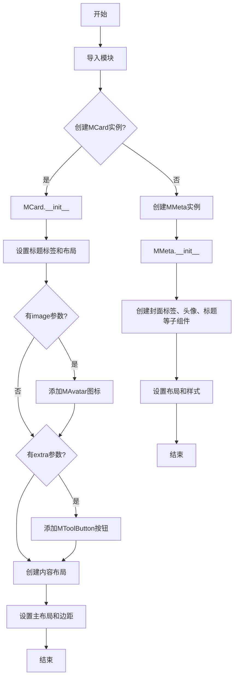
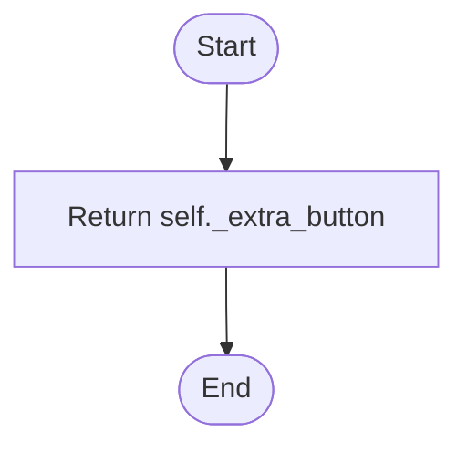
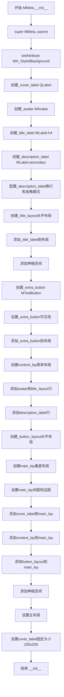
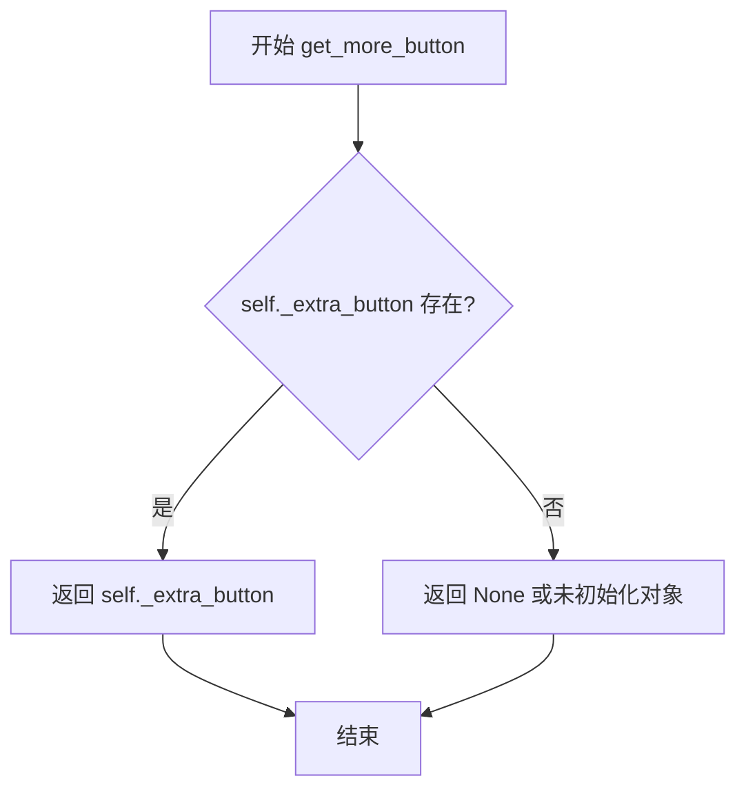
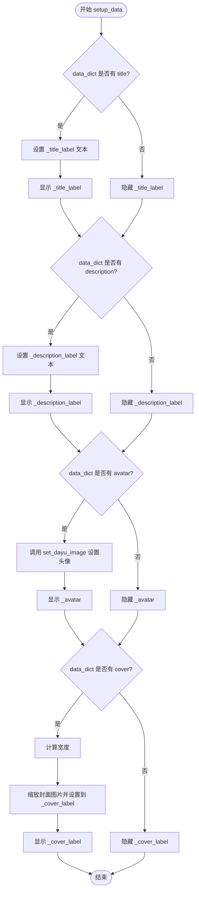

# `comic-translate\app\ui\dayu_widgets\card.py` 详细设计文档

这是一个基于PySide6的Qt界面组件库，提供MCard和MMeta两个卡片式组件，用于在Qt应用中展示带有标题、图像、头像、描述等信息的卡片界面，支持不同的尺寸和样式配置。

## 整体流程



## 类结构

```
QtWidgets.QWidget (基类)
├── MCard (卡片组件)
│   ├── _title_label: MLabel
│   ├── _title_layout: QHBoxLayout
│   ├── _title_icon: MAvatar
│   ├── _extra_button: MToolButton
│   ├── _content_layout: QVBoxLayout
│   └── _main_lay: QVBoxLayout
└── MMeta (元数据卡片组件)
    ├── _cover_label: QLabel
    ├── _avatar: MAvatar
    ├── _title_label: MLabel
    ├── _description_label: MLabel
    ├── _title_layout: QHBoxLayout
    ├── _extra_button: MToolButton
    ├── _button_layout: QHBoxLayout
    └── main_lay: QVBoxLayout
```

## 全局变量及字段


### `MCard._title_label`
    
标题标签

类型：`MLabel`
    


### `MCard._title_layout`
    
标题水平布局

类型：`QHBoxLayout`
    


### `MCard._title_icon`
    
标题图标/头像

类型：`MAvatar`
    


### `MCard._extra_button`
    
额外操作按钮

类型：`MToolButton`
    


### `MCard._content_layout`
    
内容垂直布局

类型：`QVBoxLayout`
    


### `MCard._main_lay`
    
主垂直布局

类型：`QVBoxLayout`
    


### `MMeta._cover_label`
    
封面图片标签

类型：`QLabel`
    


### `MMeta._avatar`
    
头像组件

类型：`MAvatar`
    


### `MMeta._title_label`
    
标题标签

类型：`MLabel`
    


### `MMeta._description_label`
    
描述标签

类型：`MLabel`
    


### `MMeta._title_layout`
    
标题水平布局

类型：`QHBoxLayout`
    


### `MMeta._extra_button`
    
额外操作按钮

类型：`MToolButton`
    


### `MMeta._button_layout`
    
按钮水平布局

类型：`QHBoxLayout`
    


### `MMeta.main_lay`
    
主垂直布局

类型：`QVBoxLayout`
    
    

## 全局函数及方法


### `MCard.__init__`

初始化卡片组件（MCard），设置卡片的基础样式（Qt属性）、根据size配置构建标题栏布局（包括图标、文本、额外按钮）以及内容区域布局。

参数：

- `title`：`str | None`，卡片标题文本，用于显示在卡片顶部。
- `image`：`str | None`，标题栏左侧的图标图片路径。
- `size`：`str | None`，卡片尺寸规格（对应 `dayu_theme` 的 large/medium/small），用于决定标题字体大小和内边距，默认为主题配置。
- `extra`：`bool | None`，是否在标题栏右侧显示额外的操作按钮（更多按钮）。
- `type`：`str | None`，卡片类型标识（当前代码中未使用此参数）。
- `parent`：`QtWidgets.QWidget | None`，父级 Qt 控件对象。

返回值：`None`（无返回值，用于初始化对象状态）。

#### 流程图

```mermaid
flowchart TD
    A([开始初始化]) --> B[调用 super(MCard, self).__init__(parent)]
    B --> C[设置属性: WA_StyledBackground]
    C --> D[设置属性: border = False]
    D --> E{size 参数为空?}
    E -->|Yes| F[size = dayu_theme.default_size]
    E -->|No| G[使用传入的 size]
    F --> H[定义 map_label: (字体等级, 内边距)]
    G --> H
    H --> I[创建标题标签 _title_label]
    I --> J[根据 size 设置标题标签等级]
    J --> K[创建水平布局 _title_layout]
    K --> L[根据 size 设置边距 padding]
    L --> M{传入了 image?}
    M -->|Yes| N[创建头像 _title_icon]
    N --> O[设置头像图片和大小]
    O --> P[添加 _title_icon 到布局]
    M -->|No| Q
    P --> Q
    Q --> R[添加 _title_label 到布局]
    R --> S[添加 Stretch 弹簧]
    S --> T{传入了 extra?}
    T -->|Yes| U[创建工具按钮 _extra_button]
    U --> V[添加 _extra_button 到布局]
    T -->|No| W
    V --> W
    W --> X[创建内容垂直布局 _content_layout]
    X --> Y[创建主垂直布局 _main_lay]
    Y --> Z[设置主布局边距为 1,1,1,1]
    Z --> AA{传入了 title?}
    AA -->|Yes| AB[添加标题布局到主布局]
    AB --> AC[添加分割线 MDivider 到主布局]
    AA -->|No| AD
    AC --> AD
    AD --> AE[添加内容布局到主布局]
    AE --> AF[设置当前控件布局为 _main_lay]
    AF --> End([结束初始化])
```

#### 带注释源码

```python
def __init__(self, title=None, image=None, size=None, extra=None, type=None, parent=None):
    # 调用父类 QWidget 的构造函数，传递 parent
    super(MCard, self).__init__(parent=parent)
    
    # 设置 Qt 属性，使控件支持通过样式表（QSS）设置背景
    self.setAttribute(QtCore.Qt.WA_StyledBackground)
    # 初始化自定义属性 'border' 为 False
    self.setProperty("border", False)
    
    # 如果未指定 size，则使用主题默认大小
    size = size or dayu_theme.default_size
    
    # 建立尺寸与标签样式（级别）和内边距的映射关系
    map_label = {
        dayu_theme.large: (MLabel.H2Level, 20),
        dayu_theme.medium: (MLabel.H3Level, 15),
        dayu_theme.small: (MLabel.H4Level, 10),
    }
    
    # 实例化标题标签
    self._title_label = MLabel(text=title)
    # 根据 size 获取对应的标签级别（H2, H3, H4）并设置
    self._title_label.set_dayu_level(map_label.get(size)[0])

    # 从映射中获取当前 size 对应的内边距数值
    padding = map_label.get(size)[-1]
    
    # 创建标题栏的水平布局
    self._title_layout = QtWidgets.QHBoxLayout()
    # 设置标题栏的内边距
    self._title_layout.setContentsMargins(padding, padding, padding, padding)
    
    # 如果传入了 image 参数，则创建并添加头像
    if image:
        self._title_icon = MAvatar()
        self._title_icon.set_dayu_image(image)
        self._title_icon.set_dayu_size(size)
        self._title_layout.addWidget(self._title_icon)
        
    # 将标题文本标签添加到布局
    self._title_layout.addWidget(self._title_label)
    # 添加弹簧，将标题和后续可能的按钮挤到正确位置
    self._title_layout.addStretch()
    
    # 如果传入了 extra 参数（通常为 True），则创建额外操作按钮
    if extra:
        self._extra_button = MToolButton().icon_only().svg("more.svg")
        self._title_layout.addWidget(self._extra_button)

    # 创建用于放置卡片主体内容的垂直布局
    self._content_layout = QtWidgets.QVBoxLayout()

    # 创建卡片的主垂直布局
    self._main_lay = QtWidgets.QVBoxLayout()
    self._main_lay.setSpacing(0) # 减少间距以模拟边框效果
    # 设置极小的外边距（1px），为绘制边框预留空间
    self._main_lay.setContentsMargins(1, 1, 1, 1)
    
    # 如果有标题，则将标题栏和分割线添加到主布局
    if title:
        self._main_lay.addLayout(self._title_layout)
        self._main_lay.addWidget(MDivider())
        
    # 将内容布局添加到主布局
    self._main_lay.addLayout(self._content_layout)
    
    # 将构建好的主布局设置为卡片的布局
    self.setLayout(self._main_lay)
```


### `MCard.get_more_button`

获取 MCard 标题栏右侧的额外操作按钮（更多按钮）的引用。

参数：

-  `self`：`MCard`，调用此方法的实例本身。

返回值：`MToolButton`，返回右侧的更多按钮对象（即 `self._extra_button`）。如果在初始化时未传入 `extra` 参数，该属性不存在，调用此方法会抛出 `AttributeError`。

#### 流程图



#### 带注释源码

```python
def get_more_button(self):
    """
    获取额外按钮引用。
    
    注意：此方法假设 _extra_button 属性已经存在。
    仅当在 __init__ 中传入了 extra 参数时，该属性才会被创建。
    如果未传入 extra，直接调用此方法将导致 AttributeError。
    """
    return self._extra_button
```


### `MCard.set_widget(widget)`

该方法用于向卡片的内容区域添加一个子组件（Qt widgets），以实现卡片的动态内容填充。

参数：

- `widget`：`QtWidgets.QWidget`，需要添加到卡片内容区域的子组件对象

返回值：`None`，无返回值，用于添加组件到布局中

#### 流程图

```mermaid
graph TD
    A[开始 set_widget] --> B[接收 widget 参数]
    B --> C{检查 widget 是否有效}
    C -->|是| D[调用 self._content_layout.addWidget(widget)]
    C -->|否| E[结束]
    D --> F[组件添加到内容布局]
    F --> E
```

#### 带注释源码

```python
def set_widget(self, widget):
    """
    向卡片的内容区域添加一个子组件
    
    参数:
        widget: QtWidgets.QWidget类型，需要添加的子组件
        该组件将被添加到卡片的垂直布局_content_layout中，
        实现了卡片的动态内容填充功能
    
    返回值:
        None，无返回值，直接操作内部布局
    """
    self._content_layout.addWidget(widget)  # 将传入的widget添加到内容布局中
```


### `MCard.border()`

该方法用于设置卡片的边框样式，通过将Qt的"border"属性设置为True，触发样式刷新，使卡片组件显示边框，并返回自身实例以支持链式调用模式。

参数：
- 该方法无显式参数（仅包含隐式参数`self`）

返回值：`MCard`，返回卡片自身的实例，支持链式调用（例如`card.border().set_widget(...)`）

#### 流程图

```mermaid
flowchart TD
    A[开始 border 方法] --> B{设置border属性为True}
    B --> C[调用setProperty设置样式]
    C --> D[调用style().polish刷新组件样式]
    D --> E[返回self实例]
    E --> F[结束]
```

#### 带注释源码

```python
def border(self):
    """
    设置卡片边框样式
    
    该方法通过Qt样式系统设置卡片的border属性为True，
    然后刷新样式使边框生效，并返回自身以支持链式调用。
    
    Returns:
        MCard: 返回卡片自身实例，支持链式调用
    """
    # 设置Qt样式属性border为True，启用边框显示
    self.setProperty("border", True)
    
    # 获取样式管理器并刷新组件样式，使属性变更生效
    self.style().polish(self)
    
    # 返回自身实例，支持链式调用（如card.border().set_widget(...)）
    return self
```


### `MMeta.__init__`

初始化元数据卡片组件，用于展示带有封面、头像、标题、描述和额外操作的元数据信息卡片。

参数：

- `cover`：`可选的图像数据`，封面的图像内容，用于显示卡片顶部的大图
- `avatar`：`可选的图像数据`，头像的图像内容，显示在标题旁边
- `title`：`可选的字符串`，卡片的标题文本
- `description`：`可选的字符串`，卡片的描述文本，显示在标题下方
- `extra`：`布尔值`，是否显示额外的操作按钮（默认为False）
- `parent`：`可选的QtWidgets.QWidget`，父widget，用于建立组件层级关系

返回值：`无`，这是构造函数，不返回任何值

#### 流程图



#### 带注释源码

```python
def __init__(
    self,
    cover=None,          # 封面图像数据（可选）
    avatar=None,         # 头像图像数据（可选）
    title=None,          # 标题文本（可选）
    description=None,    # 描述文本（可选）
    extra=False,         # 是否显示额外按钮（默认为False）
    parent=None,         # 父widget（可选）
):
    # 调用父类QWidget的构造函数，初始化Qt对象系统
    super(MMeta, self).__init__(parent)
    
    # 设置WA_StyledBackground属性，使widget支持样式表背景
    self.setAttribute(QtCore.Qt.WA_StyledBackground)
    
    # 创建封面标签，用于显示顶部大图
    self._cover_label = QtWidgets.QLabel()
    
    # 创建头像组件
    self._avatar = MAvatar()
    
    # 创建标题标签，使用h4级别样式
    self._title_label = MLabel().h4()
    
    # 创建描述标签，使用次要样式（颜色较浅）
    self._description_label = MLabel().secondary()
    # 启用自动换行功能
    self._description_label.setWordWrap(True)
    # 设置文本省略模式为右侧省略
    self._description_label.set_elide_mode(QtCore.Qt.ElideRight)
    
    # 创建标题行的水平布局
    self._title_layout = QtWidgets.QHBoxLayout()
    # 将标题标签添加到布局左侧
    self._title_layout.addWidget(self._title_label)
    # 添加伸缩空间，将标题推至左侧，按钮推至右侧
    self._title_layout.addStretch()
    
    # 创建额外操作按钮（更多选项按钮），设置图标为more.svg
    self._extra_button = MToolButton(parent=self).icon_only().svg("more.svg")
    # 将按钮添加到标题布局
    self._title_layout.addWidget(self._extra_button)
    # 根据extra参数设置按钮可见性
    self._extra_button.setVisible(extra)

    # 创建表单布局，用于对齐头像和标题、描述
    content_lay = QtWidgets.QFormLayout()
    # 设置内容区域的内边距
    content_lay.setContentsMargins(5, 5, 5, 5)
    # 第一行：头像 + 标题布局
    content_lay.addRow(self._avatar, self._title_layout)
    # 第二行：描述标签（占满一行）
    content_lay.addRow(self._description_label)

    # 创建按钮行的水平布局（用于放置底部操作按钮）
    self._button_layout = QtWidgets.QHBoxLayout()

    # 创建主垂直布局
    main_lay = QtWidgets.QVBoxLayout()
    # 设置组件间距为0（无间隙）
    main_lay.setSpacing(0)
    # 设置主布局的外边距为1（形成边框效果）
    main_lay.setContentsMargins(1, 1, 1, 1)
    
    # 将封面标签添加到主布局顶部
    main_lay.addWidget(self._cover_label)
    # 将内容布局添加到主布局
    main_lay.addLayout(content_lay)
    # 将按钮布局添加到主布局
    main_lay.addLayout(self._button_layout)
    # 添加伸缩空间，将内容向上推
    main_lay.addStretch()
    
    # 将主布局设置为widget的布局管理器
    self.setLayout(main_lay)
    
    # 设置封面标签的固定大小为200x200像素
    self._cover_label.setFixedSize(QtCore.QSize(200, 200))
    # 注释：setFixedWidth(200) 已被注释掉，保持灵活的响应式设计
```


### `MMeta.get_more_button`

该方法用于获取 MMeta 组件中的额外操作按钮（更多按钮）的引用，以便外部可以对该按钮进行进一步的操作或事件绑定。

参数： 无

返回值：`MToolButton`，返回额外按钮的引用对象

#### 流程图



#### 带注释源码

```python
def get_more_button(self):
    """
    获取额外按钮引用
    
    该方法返回 MToolButton 实例，该按钮在 MMeta 组件中
    作为额外的操作入口（更多选项按钮）使用。
    
    Returns:
        MToolButton: 额外按钮的引用，可以用于绑定点击事件等操作
    """
    return self._extra_button
```


### `MMeta.setup_data`

该方法用于根据传入的数据字典配置 `MMeta` 组件的显示内容，包括标题、描述、头像和封面图片，并根据数据是否存在性控制对应 UI 元素的显隐状态。

参数：

-  `data_dict`：`dict`，包含标题（title）、描述（description）、头像（avatar）和封面（cover）的数据字典。

返回值：`None`，该方法直接修改组件状态，不返回任何值。

#### 流程图



#### 带注释源码

```python
def setup_data(self, data_dict):
    """
    设置 MMeta 组件的数据内容。

    参数:
        data_dict (dict): 包含标题、描述、头像和封面信息的字典。
                         键名分别为 "title", "description", "avatar", "cover"。
    """
    # 处理标题 (Title)
    if data_dict.get("title"):
        # 如果字典中存在 title 键，则设置文本并显示标签
        self._title_label.setText(data_dict.get("title"))
        self._title_label.setVisible(True)
    else:
        # 如果不存在，则隐藏标签以保持布局整洁
        self._title_label.setVisible(False)

    # 处理描述 (Description)
    if data_dict.get("description"):
        # 设置描述文本，并处理文本换行与省略模式
        self._description_label.setText(data_dict.get("description"))
        self._description_label.setVisible(True)
    else:
        self._description_label.setVisible(False)

    # 处理头像 (Avatar)
    if data_dict.get("avatar"):
        # 调用 MAvatar 的方法设置头像图片，并显示组件
        self._avatar.set_dayu_image(data_dict.get("avatar"))
        self._avatar.setVisible(True)
    else:
        self._avatar.setVisible(False)

    # 处理封面 (Cover)
    if data_dict.get("cover"):
        # 获取当前容器的宽度，用于保持封面图片比例
        fixed_height = self._cover_label.width()
        # 使用 Qt 的图像缩放功能平滑转换图片
        self._cover_label.setPixmap(
            data_dict.get("cover").scaledToWidth(fixed_height, QtCore.Qt.SmoothTransformation)
        )
        self._cover_label.setVisible(True)
    else:
        self._cover_label.setVisible(False)
```


## 关键组件


### 概述
该代码定义了基于PySide6的两个GUI组件类MCard和MMeta，分别用于创建卡片和元数据展示界面，支持标题、图像、描述等内容的灵活布局，并集成了头像、分割线、标签等子组件，通过混入类实现悬停阴影和光标交互效果。

### 文件运行流程
代码首先导入PySide6核心模块和本地自定义模块（包括主题、头像、分割线、标签、工具按钮及混入类）。随后定义MCard类，该类在初始化时根据传入的参数（标题、图像、大小、额外按钮）构建水平布局的标题栏和垂直布局的内容区域，并使用分割线分隔标题与内容。MMeta类则构建包含封面标签、头像、标题、描述和操作按钮的表单布局，通过setup_data方法动态更新数据。两者均继承QWidget并应用了hover_shadow_mixin和cursor_mixin以增强交互体验。

### 类详细信息
#### MCard类
- **字段**：
  - `_title_label`：MLabel类型，标题标签。
  - `_title_icon`：MAvatar类型，标题图像头像。
  - `_extra_button`：MToolButton类型，额外操作按钮。
  - `_title_layout`：QHBoxLayout类型，标题水平布局。
  - `_content_layout`：QVBoxLayout类型，内容垂直布局。
  - `_main_lay`：QVBoxLayout类型，主布局。
- **方法**：
  - `__init__(self, title=None, image=None, size=None, extra=None, type=None, parent=None)`：初始化卡片组件，设置属性、布局和子组件。
  - `get_more_button(self)`：返回额外按钮对象。
  - `set_widget(self, widget)`：向内容区域添加子组件。
  - `border(self)`：设置边框属性并刷新样式。

#### MMeta类
- **字段**：
  - `_cover_label`：QLabel类型，封面图像标签。
  - `_avatar`：MAvatar类型，头像组件。
  - `_title_label`：MLabel类型，标题标签。
  - `_description_label`：MLabel类型，描述标签。
  - `_extra_button`：MToolButton类型，额外操作按钮。
  - `_title_layout`：QHBoxLayout类型，标题水平布局。
  - `_button_layout`：QHBoxLayout类型，按钮水平布局。
  - `content_lay`：QFormLayout类型，内容表单布局。
  - `main_lay`：QVBoxLayout类型，主布局。
- **方法**：
  - `__init__(self, cover=None, avatar=None, title=None, description=None, extra=False, parent=None)`：初始化元数据组件，构建布局和子组件。
  - `get_more_button(self)`：返回额外按钮对象。
  - `setup_data(self, data_dict)`：根据字典数据更新标题、描述、头像和封面图像的显示。

### 关键组件信息
- **MCard**：卡片容器组件，支持标题、图像和自定义内容区域，用于展示结构化信息。
- **MMeta**：元数据展示组件，整合封面、头像、标题和描述，适用于列表项或详情页。
- **MAvatar**：头像组件，用于显示用户或主题图像。
- **MDivider**：分割线组件，用于视觉分隔。
- **MLabel**：文本标签组件，支持多级别样式（如H2、H3、H4）和辅助文本。
- **MToolButton**：工具按钮组件，提供图标操作。
- **hover_shadow_mixin**：混入类，为组件添加悬停阴影效果。
- **cursor_mixin**：混入类，为组件添加光标交互效果。

### 潜在技术债务或优化空间
1. **硬编码尺寸**：MMeta中封面标签固定为200x200，缺乏灵活性，应支持自适应或通过参数配置。
2. **缺失错误处理**：setup_data方法直接使用get方法获取数据，未做空值检查，可能导致属性调用错误。
3. **布局嵌套复杂**：MCard和MMeta的布局嵌套较深，可考虑拆分为子布局或使用Qt Designer优化。
4. **样式依赖**：代码依赖dayu_theme全局主题，若主题未正确初始化可能导致样式异常。
5. **重复代码**：标题布局和额外按钮的创建逻辑在MCard和MMeta中重复，可抽象为基类或工具函数。

### 其它项目
- **设计目标与约束**：遵循PySide6 GUI框架，使用混入模式增强功能，依赖dayu_theme实现统一样式。
- **错误处理与异常设计**：未实现异常捕获机制，运行时错误可能中断程序。
- **数据流与状态机**：MMeta的setup_data方法作为数据更新入口，状态依赖于传入字典的键值。
- **外部依赖与接口契约**：依赖PySide6、dayu_theme及本地组件（MAvatar、MLabel等），需确保导入路径正确。


## 问题及建议


### 已知问题

- **MCard 中 get_more_button() 可能返回 None**：当 `extra` 参数为 None 或 False 时，`_extra_button` 不会被创建，但 `get_more_button()` 方法直接返回该变量，没有进行 None 检查，调用者可能导致 AttributeError。
- **MCard 中 size 参数缺乏校验**：`map_label.get(size)` 如果 `size` 不在字典中（如传入自定义值），会返回 None，后续访问 `[0]` 会触发 TypeError: 'NoneType' object is not subscriptable。
- **MMeta 中 cover 宽度计算可能不准确**：`setup_data()` 方法中使用 `self._cover_label.width()` 获取宽度，但此时 widget 可能还未完全布局完成，导致获取到的宽度不正确（可能是 0 或默认值）。
- **硬编码的固定尺寸**：MMeta 中 `_cover_label.setFixedSize(QtCore.QSize(200, 200))` 硬编码了封面图片尺寸，缺乏灵活性和可配置性。
- **重复代码**：MCard 和 MMeta 两个类都实现了 `get_more_button()` 方法和类似的标题+extra button 布局结构，存在代码重复。
- **setup_data() 方法效率低**：在 MMeta 的 `setup_data()` 方法中多次调用 `data_dict.get()`，同一个 key 被获取多次，可以提取为局部变量以提高可读性和性能。
- **缺乏类型注解**：整个代码没有使用 Python 类型注解（type hints），不利于静态分析和 IDE 智能提示。
- **缺乏输入参数校验**：如 `set_widget()` 方法没有检查 widget 是否为 None 或是否为 QWidget 类型。

### 优化建议

- **为 get_more_button() 添加 None 检查**：在 MCard 的 `get_more_button()` 中返回之前检查 `_extra_button` 是否为 None，或者在文档中明确说明调用者需要处理 None 的情况。
- **添加 size 参数的默认值处理**：在 MCard 初始化时对 `size` 参数进行校验，如果不在预定义范围内，使用默认值（如 medium）。
- **修复 cover 宽度计算时机**：在 MMeta 中应该先确保 layout 完成后再计算宽度，或者在 `setup_data` 被调用时重新计算 cover 的显示尺寸。
- **将硬编码尺寸提取为类属性或配置**：将 200x200 的固定尺寸改为可配置的类属性或初始化参数。
- **抽象公共基类**：将 MCard 和 MMeta 的公共部分（如标题标签、extra button、get_more_button 方法）提取到一个父类中。
- **优化 setup_data() 方法**：将 `data_dict.get("title")` 等结果缓存到局部变量，避免重复查询字典。
- **添加类型注解**：为所有方法参数和返回值添加类型注解，提高代码可维护性。
- **添加输入参数校验**：在 `set_widget()` 等公开方法中添加必要的参数校验。
- **完善文档字符串**：为类和关键方法添加 docstring，说明参数、返回值和使用注意事项。


## 其它


### 设计目标与约束

设计目标：提供两个可复用的Qt组件（MCard和MMeta），用于构建具有一致视觉风格的现代UI界面，支持标题、图片、描述、额外操作按钮等功能，并集成悬停阴影和光标交互效果。

约束：
- 依赖PySide6 Qt库
- 需配合dayu_theme主题使用
- 组件尺寸受限于预定义的三种尺寸（large、medium、small）
- MMeta组件封面图片固定为200x200像素
- 仅支持Python 2.7+或Python 3.x（因使用__future__导入）

### 错误处理与异常设计

代码中错误处理机制有限，主要依赖Qt的信号槽机制和隐式None检查。

潜在异常点：
- `size`参数为None时使用`dayu_theme.default_size`作为默认值
- `map_label.get(size)`若size不在字典中会返回None，导致后续`[0]`和`[-1]`操作报错
- `data_dict.get()`返回None时进行条件判断，避免了大部分KeyError
- 封面图片缩放时依赖`QPixmap.scaledToWidth`，若cover非图片对象会抛出异常

建议改进：
- 在`__init__`中添加size参数校验，提供默认值或抛出明确异常
- 在`setup_data`中添加cover对象的类型检查
- 添加异常捕获的文档说明

### 数据流与状态机

数据流：
- **MCard**: title/image/size/extra参数 → 初始化UI组件 → 通过`set_widget()`动态添加内容 → 通过`get_more_button()`获取额外操作按钮
- **MMeta**: cover/avatar/title/description参数 → 初始化UI组件 → 通过`setup_data(data_dict)`动态更新显示内容

状态变化：
- 组件可见性通过setVisible()动态控制（标题、描述、头像、封面、额外按钮）
- 边框状态通过border()方法触发Qt属性系统变更
- 标题层级根据size动态调整（H2/H3/H4）

### 外部依赖与接口契约

外部依赖：
- PySide6.QtCore - Qt核心功能（Qt属性、尺寸、文本省略模式等）
- PySide6.QtWidgets - Qt UI组件基类
- dayu_theme模块 - 主题和默认尺寸
- MAvatar类 - 头像组件
- MDivider类 - 分割线组件
- MLabel类 - 标签组件
- cursor_mixin - 光标混入类
- hover_shadow_mixin - 悬停阴影混入类
- MToolButton类 - 工具按钮组件

接口契约：
- MCard构造函数：title(str|None), image(str|None), size(str|None), extra(str|None), type(str|None), parent(QWidget|None)
- MCard.set_widget(widget): 接收任意QWidget子类
- MCard.border(): 返回self支持链式调用
- MMeta构造函数：cover(QPixmap|None), avatar(str|None), title(str|None), description(str|None), extra(bool), parent(QWidget|None)
- MMeta.setup_data(data_dict): 接收包含title/description/avatar/cover键的字典

### 性能考虑

潜在性能问题：
- 每次创建MCard都会创建新的QLayout对象（_title_layout, _content_layout, _main_lay）
- MMeta中cover_label固定200x200，图片缩放操作在setup_data中每次调用都执行
- 使用setProperty触发style().polish()会触发样式重绘

优化建议：
- 考虑使用Qt的复用机制或对象池
- 图片缩放可缓存结果
- border()方法可添加标志位避免重复样式重绘

### 安全性考虑

当前代码无直接安全风险，但需注意：
- 动态添加的widget未做内容过滤
- SVG文件加载（"more.svg"）需确保文件路径安全
- 无输入验证机制

### 兼容性考虑

- Python 2/3兼容（通过__future__导入）
- PySide6版本兼容性需确认
- 依赖的dayu_theme模块需同步版本
- Qt样式系统依赖底层Qt平台实现

### 测试策略建议

单元测试：
- 测试MCard不同参数组合的初始化
- 测试MMeta.setup_data各种数据组合
- 测试size参数边界情况
- 测试set_widget添加各种QWidget子类

集成测试：
- 测试在QApplication中的显示效果
- 测试主题样式应用
- 测试边框切换功能

### 使用示例

```python
# MCard使用示例
card = MCard(title="标题", image="avatar.png", size=dayu_theme.large, extra=True)
card.set_widget(QPushButton("内容"))
more_btn = card.get_more_button()
more_btn.clicked.connect(handler)

# MMeta使用示例
meta = MMeta(extra=True)
meta.setup_data({
    "title": "标题",
    "description": "描述文本",
    "avatar": "avatar.png",
    "cover": QPixmap("cover.jpg")
})
```

### 主题与样式设计

样式实现机制：
- Qt属性系统：使用setProperty设置"border"属性
- 样式表支持：通过setAttribute(WA_StyledBackground)启用
- 尺寸映射：large对应H2标题20px内边距，medium对应H3标题15px，small对应H4标题10px

### 配置选项

MCard可配置项：
- title: 标题文本
- image: 头像图片路径
- size: 尺寸类型（large/medium/small）
- extra: 是否显示额外按钮
- type: 当前未使用（预留参数）
- 动态内容：通过set_widget添加

MMeta可配置项：
- cover: 封面图片
- avatar: 头像图片路径
- title: 标题文本
- description: 描述文本
- extra: 是否显示额外按钮
- 动态数据：通过setup_data更新


    