# `comic-translate\app\ui\dayu_widgets\carousel.py` 详细设计文档

这是一个基于PySide6实现的图片轮播组件，支持自动播放、页面切换、导航指示器以及平滑的动画过渡效果。

## 整体流程

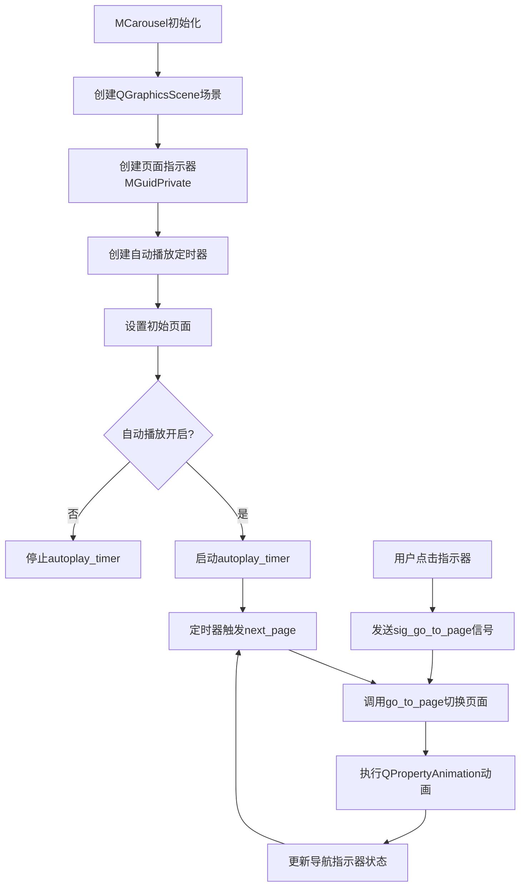

## 类结构

```
QtWidgets.QFrame
└── MGuidPrivate (导航指示器)
QtWidgets.QGraphicsView
└── MCarousel (轮播组件)
    └── property_mixin (混入类)
```

## 全局变量及字段


### `pix_list`
    
图片列表，存储需要轮播显示的图片

类型：`list`
    


### `autoplay`
    
是否自动播放轮播

类型：`bool`
    


### `width`
    
轮播组件的宽度

类型：`int`
    


### `height`
    
轮播组件的高度

类型：`int`
    


### `parent`
    
父窗口部件

类型：`QWidget`
    


### `pos`
    
图片在场景中的位置坐标

类型：`QPoint`
    


### `pen`
    
用于绘制线条的画笔对象

类型：`QPen`
    


### `line_width`
    
导航指示器的宽度

类型：`int`
    


### `total_width`
    
所有导航指示器的总宽度

类型：`int`
    


### `target_size`
    
图片缩放的目标尺寸

类型：`int`
    


### `index`
    
循环遍历时的索引值

类型：`int`
    


### `pix`
    
原始图片对象

类型：`QPixmap`
    


### `new_pix`
    
缩放后的图片对象

类型：`QPixmap`
    


### `pix_item`
    
添加到场景中的图片项

类型：`QGraphicsPixmapItem`
    


### `line_item`
    
导航指示器部件

类型：`MGuidPrivate`
    


### `value`
    
布尔属性值，用于设置状态

类型：`bool`
    


### `ms`
    
时间间隔，单位毫秒

类型：`int`
    


### `event`
    
鼠标事件对象

类型：`QMouseEvent`
    


### `dayu_theme`
    
主题样式模块，提供颜色配置

类型：`module`
    


### `property_mixin`
    
属性混入装饰器函数

类型：`function`
    


### `functools`
    
函数工具模块

类型：`module`
    


### `MGuidPrivate.sig_go_to_page`
    
点击时发射的信号，用于跳转到指定页面

类型：`QtCore.Signal`
    


### `MCarousel.scene`
    
图形场景，用于容纳所有图片项

类型：`QGraphicsScene`
    


### `MCarousel.hor_bar`
    
水平滚动条，用于实现页面切换动画

类型：`QScrollBar`
    


### `MCarousel.carousel_width`
    
轮播组件的宽度

类型：`int`
    


### `MCarousel.carousel_height`
    
轮播组件的高度

类型：`int`
    


### `MCarousel.page_count`
    
轮播页面的总数量

类型：`int`
    


### `MCarousel.navigate_lay`
    
导航指示器的水平布局

类型：`QHBoxLayout`
    


### `MCarousel.loading_ani`
    
页面切换时的属性动画

类型：`QPropertyAnimation`
    


### `MCarousel.autoplay_timer`
    
自动播放的定时器

类型：`QTimer`
    


### `MCarousel.current_index`
    
当前显示的页面索引

类型：`int`
    
    

## 全局函数及方法


### `absolute_import`

这是 Python 2 的 `__future__` 导入指令，用于启用绝对导入行为。在 Python 3 中，所有导入默认都是绝对的，因此这个导入主要是为了保持代码与 Python 2 的兼容性。

参数： 无

返回值： 无（这是 Python 的 `__future__` 指令导入，不是函数）

#### 流程图

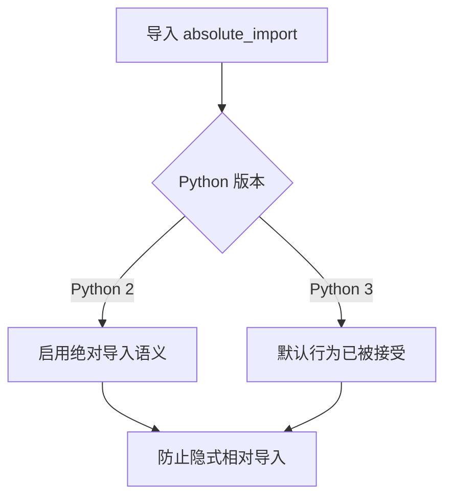

#### 带注释源码

```
# 导入 future 模块
from __future__ import absolute_import
from __future__ import division
from __future__ import print_function

# absolute_import 是 Python 2 的特性
# 在 Python 2 中，默认导入行为是相对导入优先
# 导入 absolute_import 后，Python 2 将采用与 Python 3 相同的绝对导入语义
# 即：import foo 只会尝试导入顶层模块 foo，而不是相对于当前包的 foo

# 示例说明：
# 假设在 pkg/module.py 中有 import foo
# - Python 2 无 absolute_import: 优先导入 pkg/foo（相对导入）
# - Python 2 有 absolute_import: 导入顶层 foo（绝对导入）
# - Python 3: 总是导入顶层 foo（绝对导入）

# 这个导入在 Python 3 解释器中被接受但不做任何操作
# 因为 Python 3 默认就是绝对导入
```

#### 补充说明

在代码中，还有其他两个类似的 `__future__` 导入：

1. **division** (`from __future__ import division`)
   - 启用真除法（True Division），`/` 返回浮点数
   - Python 2 中 `/` 对整数执行整除

2. **print_function** (`from __future__ import print_function`)
   - 允许使用 Python 3 的 `print()` 函数语法
   - 将 `print` 视为函数而非语句

这三个导入共同确保代码可以在 Python 2.5+ 到 Python 3.x 之间兼容运行。


在提供的代码中未找到名为 `division` 的函数或方法。代码中包含的主要功能是图片轮播组件（`MCarousel` 类）和导航指示点（`MGuidPrivate` 类）。其中与“除法兼容”相关的仅是文件顶部的 `from __future__ import division` 导入语句，该语句用于确保 Python 2 中的除法行为与 Python 3 一致，但这不是一个函数或方法。

考虑到您可能需要了解代码中的核心功能，以下是 `MCarousel` 类中核心方法 `go_to_page` 的详细设计文档，该方法负责实现页面跳转功能：

### MCarousel.go_to_page

该方法用于将轮播图切换到指定索引的页面，通过动画效果实现平滑过渡，并更新导航指示点的状态。

参数：
- `index`：`int`，表示目标页面的索引值，从 0 开始计数。

返回值：`None`，无返回值。

#### 流程图

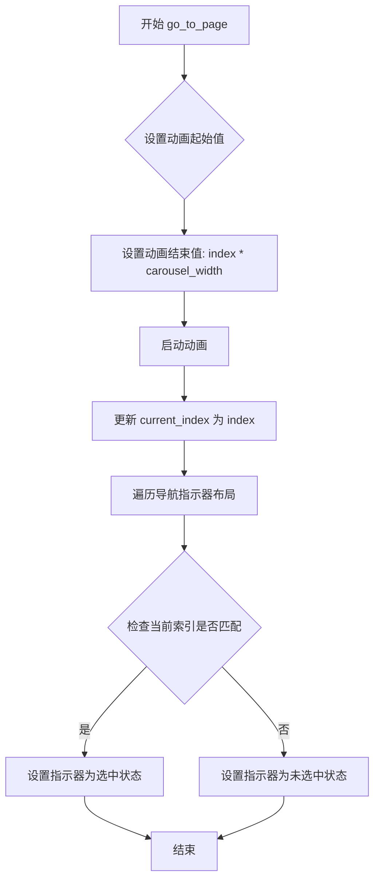

#### 带注释源码

```python
def go_to_page(self, index):
    """
    跳转到指定索引的页面。

    参数:
        index (int): 目标页面的索引，从 0 开始。

    返回值:
        None
    """
    # 设置动画的起始值为当前页面位置的滚动条值
    self.loading_ani.setStartValue(self.current_index * self.carousel_width)
    # 设置动画的结束值为目标页面位置的滚动条值
    self.loading_ani.setEndValue(index * self.carousel_width)
    # 启动属性动画，实现平滑滚动
    self.loading_ani.start()
    # 更新内部维护的当前页面索引
    self.current_index = index
    # 遍历导航指示器的布局管理器
    for i in range(self.navigate_lay.count()):
        # 获取每个导航指示器控件
        frame = self.navigate_lay.itemAt(i).widget()
        # 根据是否为当前页面，设置指示器的选中状态
        frame.set_checked(i == self.current_index)
```

如果您确实需要提取名为 `division` 的函数或方法，请确认代码中是否存在该定义，或者提供更多的上下文信息。当前代码中仅包含上述类和函数，未发现与 "division" 同名的方法。


### MCarousel.go_to_page

跳转到指定页面的方法，用于实现轮播图的页面切换功能。

参数：

- `index`：`int`，目标页面的索引值，指定要跳转到的页面位置

返回值：`None`，该方法无返回值，仅执行页面切换动画和状态更新

#### 流程图

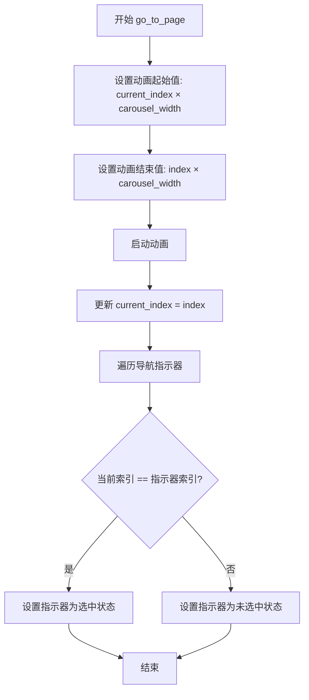

#### 带注释源码

```python
def go_to_page(self, index):
    """
    跳转到指定页面
    
    参数:
        index: int, 目标页面索引
    返回:
        None
    """
    # 设置动画的起始值为当前页面位置的滚动条值
    self.loading_ani.setStartValue(self.current_index * self.carousel_width)
    # 设置动画的结束值为目标页面位置的滚动条值
    self.loading_ani.setEndValue(index * self.carousel_width)
    # 启动滚动动画，实现平滑过渡
    self.loading_ani.start()
    # 更新当前页面索引
    self.current_index = index
    # 遍历所有导航指示器（底部的小圆点）
    for i in range(self.navigate_lay.count()):
        # 获取当前指示器控件
        frame = self.navigate_lay.itemAt(i).widget()
        # 根据是否为当前页面设置选中/未选中状态
        frame.set_checked(i == self.current_index)
```


### `functools.partial(self.go_to_page, index)`

这是Python标准库中的`functools.partial`函数，用于创建一个偏函数（partial function）。在`MCarousel`类中，该偏函数用于绑定`go_to_page`方法和页面索引`index`，以便在导航指示器点击时调用对应的页面跳转功能。

参数：

-  `func`：`callable`，要绑定的原始函数，此处为`self.go_to_page`方法
-  `*args`：位置参数，此处为`index`（int类型），表示目标页面的索引值

返回值：`functools.partial`，返回一个带有预绑定参数的新可调用对象

#### 流程图

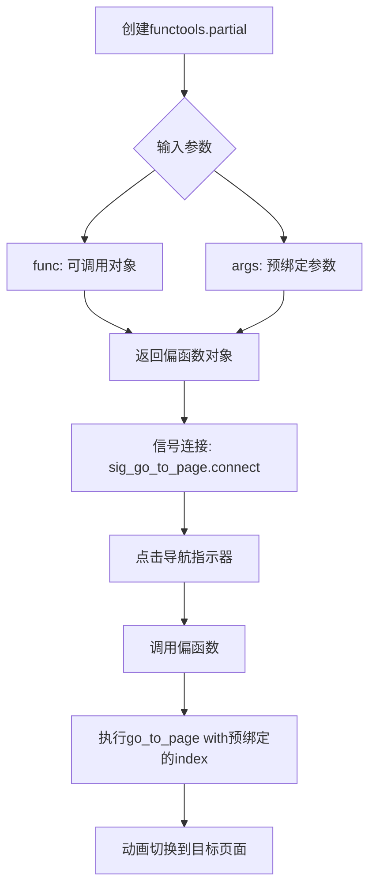

#### 带注释源码

```python
# 在 MCarousel 类的 __init__ 方法中
# 遍历页面列表，为每个页面创建导航指示器
for index, pix in enumerate(pix_list):
    # ... 其他代码 ...
    
    # 创建导航指示器（小圆点/线条）
    line_item = MGuidPrivate()
    
    # 使用 functools.partial 绑定 go_to_page 方法和当前索引
    # 作用：创建一个新的可调用对象，预绑定了 self.go_to_page 方法和 index 参数
    # 当信号触发时，会自动传入预绑定的 index 值
    # 优点：避免使用 lambda 或闭包，便于信号与槽的连接
    line_item.sig_go_to_page.connect(functools.partial(self.go_to_page, index))
    
    # 将导航指示器添加到布局
    self.navigate_lay.addWidget(line_item)
    # ... 其他代码 ...
```

#### 相关方法信息

**`MCarousel.go_to_page`方法：**

参数：

-  `index`：`int`，目标页面的索引值

返回值：`None`，无返回值（执行页面跳转动画）

```python
def go_to_page(self, index):
    """跳转到指定页面"""
    self.loading_ani.setStartValue(self.current_index * self.carousel_width)
    self.loading_ani.setEndValue(index * self.carousel_width)
    self.loading_ani.start()
    self.current_index = index
    for i in range(self.navigate_lay.count()):
        frame = self.navigate_lay.itemAt(i).widget()
        frame.set_checked(i == self.current_index)
```


### `MGuidPrivate.__init__`

该函数是 `MGuidPrivate` 类的构造函数，用于初始化一个 QFrame 控件作为轮播图（Carousel）的导航指示点。它设置父控件，并将控件初始化为未选中状态（尺寸较小、背景色透明），同时设置鼠标手势。

参数：

- `parent`：`QtWidgets.QWidget`，父控件，用于指定该指示器在 Qt 控件层级中的归属，默认为 `None`。

返回值：`None`，无返回值。

#### 流程图

```mermaid
graph TD
    A([Start __init__]) --> B[调用父类 QFrame 构造函数<br>super(MGuidPrivate, self).__init__(parent)]
    B --> C[设置鼠标光标为手型<br>self.setCursor(QtCore.Qt.PointingHandCursor)]
    C --> D[初始化为未选中状态<br>self.set_checked(False)]
    D --> E([End])
```

#### 带注释源码

```python
class MGuidPrivate(QtWidgets.QFrame):
    # 定义点击信号，当用户点击此导航点时发出
    sig_go_to_page = QtCore.Signal()

    def __init__(self, parent=None):
        """
        初始化 MGuidPrivate 实例。

        :param parent: QtWidgets.QWidget, 父控件对象。
        """
        # 调用父类 QtWidgets.QFrame 的初始化方法，传入 parent
        super(MGuidPrivate, self).__init__(parent)
        
        # 设置当鼠标悬停在该控件上时，显示指向手型光标
        self.setCursor(QtCore.Qt.PointingHandCursor)
        
        # 初始化时默认设置为未选中状态
        # 内部会调用 set_checked(False)，设置较小的尺寸和无高亮背景
        self.set_checked(False)
```


### MGuidPrivate.set_checked

设置选中状态样式，根据传入的布尔值改变指示器的背景颜色和尺寸大小，以区分当前选中状态与未选中状态。

参数：

- `value`：`bool`，表示选中状态，True 为选中状态，False 为未选中状态

返回值：`None`，无返回值

#### 流程图

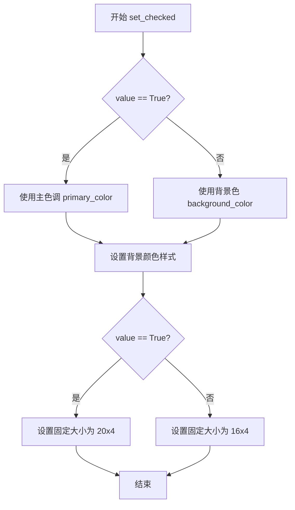

#### 带注释源码

```python
def set_checked(self, value):
    """
    设置选中状态样式
    
    根据 value 值改变指示器的背景颜色和尺寸：
    - 选中时(value=True): 使用主色调背景色，尺寸较大(20x4)
    - 未选中时(value=False): 使用背景色，尺寸较小(16x4)
    
    参数:
        value: bool, True 表示选中状态, False 表示未选中状态
    """
    # 根据 value 值选择背景颜色：选中时使用主色调，未选中时使用背景色
    self.setStyleSheet(
        "background-color:{}".format(dayu_theme.primary_color if value else dayu_theme.background_color)
    )
    # 根据 value 值设置固定尺寸：选中时较大(20x4)，未选中时较小(16x4)
    self.setFixedSize(20 if value else 16, 4)
```


### `MGuidPrivate.mousePressEvent`

处理鼠标点击事件，当用户点击导航指示器时，触发页面跳转信号。

参数：

- `event`：`QtGui.QMouseEvent`，Qt鼠标事件对象，包含鼠标按钮、位置等事件信息

返回值：`None`，无返回值（调用父类方法后返回）

#### 流程图

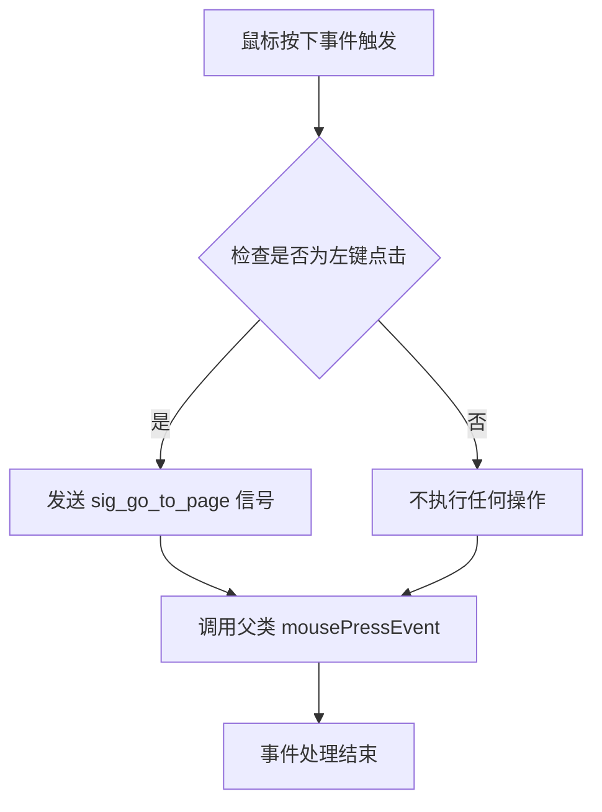

#### 带注释源码

```
def mousePressEvent(self, event):
    """
    重写Qt的鼠标按下事件处理方法
    
    Args:
        event: Qt鼠标事件对象，包含鼠标事件的所有信息
               如按钮类型、坐标位置等
    """
    # 检查鼠标事件是否为左键按钮（单键按下或组合键中的左键）
    if event.buttons() == QtCore.Qt.LeftButton:
        # 触发跳转页面信号，通知外部控制器切换到对应页面
        self.sig_go_to_page.emit()
    # 调用父类的mousePressEvent方法，保持Qt事件处理的默认行为
    # 父类方法负责处理样式更新、焦点等Qt内部逻辑
    return super(MGuidPrivate, self).mousePressEvent(event)
```


### `MCarousel.__init__`

初始化轮播组件，配置场景、导航指示器、自动播放定时器等核心元素，准备就绪后显示第一页。

参数：

- `pix_list`：`list`，图像列表，每个元素为 QPixmap 对象
- `autoplay`：`bool`，是否自动播放，默认为 True
- `width`：`int`，轮播宽度，默认为 500
- `height`：`int`，轮播高度，默认为 500
- `parent`：`QWidget`，父部件，默认为 None

返回值：`None`，无返回值（构造函数）

#### 流程图

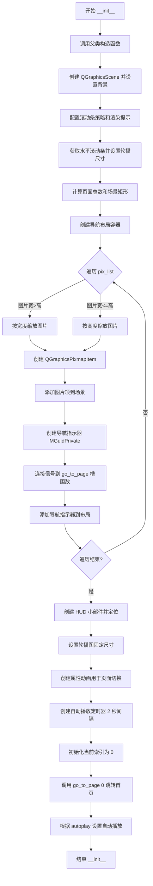

#### 带注释源码

```python
def __init__(self, pix_list, autoplay=True, width=500, height=500, parent=None):
    """
    初始化轮播组件
    
    参数:
        pix_list: 图像列表，每个元素为 QPixmap 对象
        autoplay: 是否自动播放，默认为 True
        width: 轮播宽度，默认为 500
        height: 轮播高度，默认为 500
        parent: 父部件，默认为 None
    """
    # 调用父类 QGraphicsView 的构造函数
    super(MCarousel, self).__init__(parent)
    
    # 创建图形场景并设置背景色
    self.scene = QtWidgets.QGraphicsScene()
    self.scene.setBackgroundBrush(QtGui.QBrush(QtGui.QColor(dayu_theme.background_color)))
    
    # 禁用水平/垂直滚动条（自定义滚动行为）
    self.setHorizontalScrollBarPolicy(QtCore.Qt.ScrollBarAlwaysOff)
    self.setVerticalScrollBarPolicy(QtCore.Qt.ScrollBarAlwaysOff)
    
    # 将场景设置到视图中
    self.setScene(self.scene)
    
    # 设置抗锯齿渲染提示
    self.setRenderHints(QtGui.QPainter.Antialiasing)
    
    # 获取水平滚动条用于动画控制
    self.hor_bar = self.horizontalScrollBar()
    
    # 记录轮播图尺寸
    self.carousel_width = width
    self.carousel_height = height
    
    # 初始化位置点和样式笔（虽然 pen 变量未使用，但已创建）
    pos = QtCore.QPoint(0, 0)
    pen = QtGui.QPen(QtCore.Qt.red)
    pen.setWidth(5)
    
    # 计算页面数量
    self.page_count = len(pix_list)
    
    # 导航指示器相关尺寸计算
    line_width = 20
    total_width = self.page_count * (line_width + 5)
    
    # 设置场景矩形（总宽度 = 页数 × 单页宽度）
    self.scene.setSceneRect(0, 0, self.page_count * width, height)
    
    # 创建水平导航布局容器
    self.navigate_lay = QtWidgets.QHBoxLayout()
    self.navigate_lay.setSpacing(5)
    
    # 计算目标尺寸（取宽高中较小者）
    target_size = min(width, height)
    
    # 遍历所有图片并添加到场景
    for index, pix in enumerate(pix_list):
        # 根据图片宽高比选择缩放方式
        if pix.width() > pix.height():
            # 宽度较大时按宽度缩放
            new_pix = pix.scaledToWidth(target_size, QtCore.Qt.SmoothTransformation)
        else:
            # 高度较大时按高度缩放
            new_pix = pix.scaledToHeight(target_size, QtCore.Qt.SmoothTransformation)
        
        # 创建图形项并设置位置
        pix_item = QtWidgets.QGraphicsPixmapItem(new_pix)
        pix_item.setPos(pos)
        pix_item.setTransformationMode(QtCore.Qt.SmoothTransformation)
        
        # 更新下一个图片的 X 坐标位置
        pos.setX(pos.x() + width)
        
        # 创建导航指示器（小圆点）
        line_item = MGuidPrivate()
        # 连接点击信号到页面跳转槽函数
        line_item.sig_go_to_page.connect(functools.partial(self.go_to_page, index))
        
        # 添加到导航布局
        self.navigate_lay.addWidget(line_item)
        
        # 添加图片项到场景
        self.scene.addItem(pix_item)
    
    # 创建 HUD 小部件（用于显示导航点）
    hud_widget = QtWidgets.QWidget(self)
    hud_widget.setLayout(self.navigate_lay)
    hud_widget.setStyleSheet("background:transparent")
    
    # 移动到轮播图底部中央位置
    hud_widget.move(int(width / 2 - total_width / 2), height - 30)
    
    # 设置轮播图固定尺寸（加 2 像素边框）
    self.setFixedWidth(width + 2)
    self.setFixedHeight(height + 2)
    
    # 创建属性动画（用于页面切换时的平滑滚动）
    self.loading_ani = QtCore.QPropertyAnimation()
    self.loading_ani.setTargetObject(self.hor_bar)
    self.loading_ani.setEasingCurve(QtCore.QEasingCurve.InOutQuad)
    self.loading_ani.setDuration(500)
    self.loading_ani.setPropertyName(b"value")
    
    # 创建自动播放定时器（默认 2 秒间隔）
    self.autoplay_timer = QtCore.QTimer(self)
    self.autoplay_timer.setInterval(2000)
    self.autoplay_timer.timeout.connect(self.next_page)
    
    # 初始化当前索引
    self.current_index = 0
    
    # 跳转到首页
    self.go_to_page(0)
    
    # 设置自动播放状态
    self.set_autoplay(autoplay)
```


### `MCarousel.set_autoplay`

设置自动播放属性，通过Qt属性系统设置autoplay属性值，实际的定时器启动/停止逻辑由 `_set_autoplay` 方法执行。

参数：

- `value`：`bool`，设置是否开启自动播放，True 为开启，False 为关闭

返回值：`None`，无返回值

#### 流程图

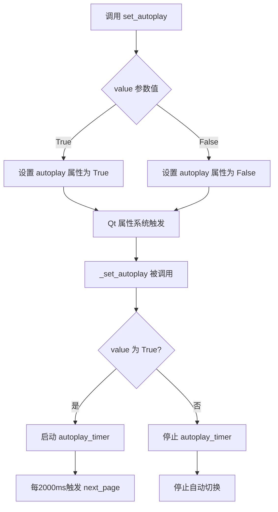

#### 带注释源码

```python
def set_autoplay(self, value):
    """
    设置自动播放属性
    
    该方法通过 Qt 的 setProperty 机制设置 autoplay 属性。
    由于类装饰器 @property_mixin 的存在，设置属性会触发对应的
    _set_autoplay 方法被调用，从而实际控制定时器的启动或停止。
    
    参数:
        value (bool): 是否开启自动播放
                     - True: 开启自动播放
                     - False: 关闭自动播放
    
    返回:
        None: 无返回值，仅通过 Qt 属性系统触发后续逻辑
    """
    # 使用 Qt 的 setProperty 方法设置属性
    # 这会触发 @property_mixin 装饰器关联的 setter 方法
    self.setProperty("autoplay", value)
    
    # 注意：实际的定时器启动/停止逻辑在 _set_autoplay 方法中执行
    # 该方法由 @property_mixin 装饰器在属性值变化时自动调用
```

#### 补充说明

该方法的设计采用了 **Qt 属性系统 + 装饰器模式**：

1. **设计模式**：通过 `@property_mixin` 装饰器将 `set_autoplay` 和 `_set_autoplay` 关联，当属性值变化时自动触发业务逻辑
2. **职责分离**：`_set_autoplay` 负责具体的定时器控制逻辑，`set_autoplay` 负责通过属性系统暴露接口
3. **潜在优化**：当前实现中，`set_autoplay` 和 `_set_autoplay` 的关联依赖装饰器，调用链不够直观，建议显式在 `set_autoplay` 中调用 `_set_autoplay` 以提高可读性和可维护性


### `MCarousel._set_autoplay`

该方法是一个私有方法，用于根据传入的布尔值控制自动播放计时器的启动或停止，实现轮播图的自动切换功能。

参数：

- `value`：`bool`，布尔值，表示是否开启自动播放。为 `True` 时启动计时器，为 `False` 时停止计时器

返回值：`None`，无返回值，仅执行计时器的启动或停止操作

#### 流程图

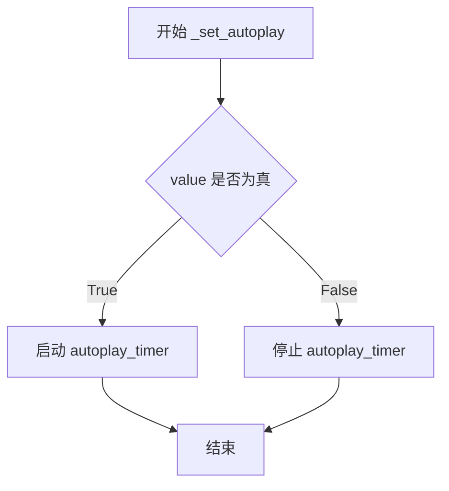

#### 带注释源码

```python
def _set_autoplay(self, value):
    """
    设置自动播放状态
    
    参数:
        value: bool, 是否开启自动播放
    """
    # 判断value是否为真值，如果是则启动自动播放计时器
    if value:
        self.autoplay_timer.start()
    # 否则停止自动播放计时器
    else:
        self.autoplay_timer.stop()
```


### `MCarousel.set_interval`

设置轮播组件的自动播放时间间隔（毫秒），用于控制页面自动切换的速度。

参数：

- `ms`：`int`，自动播放间隔时间，单位为毫秒

返回值：`None`，无返回值

#### 流程图

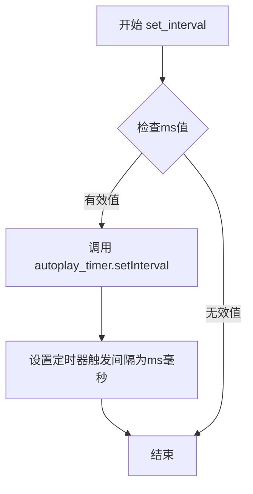

#### 带注释源码

```python
def set_interval(self, ms):
    """
    设置自动播放的时间间隔
    
    Args:
        ms: 整数类型，表示间隔毫秒数
    
    Returns:
        None
    """
    # 直接调用QTimer的setInterval方法设置定时器触发间隔
    # ms: 期望的自动播放间隔（毫秒）
    # 该方法会影响autoplay_timer每次触发next_page的频率
    self.autoplay_timer.setInterval(ms)
```


### MCarousel.next_page

该方法实现轮播图的自动切换到下一页功能，当到达最后一页时自动循环回到第一页，形成无限循环的轮播效果。

参数：无需参数

返回值：`None`，无返回值，仅执行页面切换逻辑

#### 流程图

```mermaid
flowchart TD
    A[开始 next_page] --> B{current_index + 1 < page_count?}
    B -->|是| C[index = current_index + 1]
    B -->|否| D[index = 0]
    C --> E[调用 go_to_page(index)]
    D --> E
    E --> F[结束]
    
    style A fill:#f9f,color:#333
    style E fill:#9f9,color:#333
    style F fill:#9f9,color:#333
```

#### 带注释源码

```python
def next_page(self):
    """
    切换到下一页
    
    该方法用于自动轮播时切换到下一个页面。如果当前页面是最后一页，
    则自动循环回到第一页，实现无限轮播的效果。
    
    实现逻辑：
        - 计算下一页的索引：如果未到达最后一页，则索引+1
        - 如果已是最后一页，则重置索引为0，实现循环
        - 调用 go_to_page 方法执行实际的页面切换动画
    """
    # 计算下一页索引：如果当前页+1小于总页数，则正常+1；否则回到第一页（索引0）
    # 这实现了轮播图的循环特性：page0 -> page1 -> ... -> pageN -> page0
    index = self.current_index + 1 if self.current_index + 1 < self.page_count else 0
    
    # 调用内部方法 go_to_page 执行页面切换动画
    # go_to_page 会：
    # 1. 设置动画起始值和结束值（水平滚动条位置）
    # 2. 启动动画
    # 3. 更新 current_index
    # 4. 更新导航指示器的选中状态
    self.go_to_page(index)
```


### `MCarousel.pre_page`

切换到上一页。如果当前页面是第一页（索引为0），则循环切换到最后一张图片；否则切换到当前页面的前一张。

参数：
- 该方法无参数（仅使用实例属性 `self`）

返回值：`None`，无返回值（该方法通过调用 `go_to_page` 方法间接更新UI）

#### 流程图

```mermaid
flowchart TD
    A([pre_page 调用]) --> B{self.current_index > 0?}
    B -->|是| C[index = self.current_index - 1]
    B -->|否| D[index = self.page_count - 1]
    C --> E[go_to_page(index)]
    D --> E
    E --> F[更新 current_index]
    E --> G[更新导航指示器状态]
    E --> H[启动滚动动画]
    H --> I([结束])
```

#### 带注释源码

```python
def pre_page(self):
    """
    切换到上一页。
    如果当前页面是第一页（索引为0），则循环到最后一张；
    否则切换到当前页面的前一张。
    """
    # 计算上一页的索引：如果当前索引大于0，则减1；否则循环到最后一页
    # 这实现了轮播图的循环切换功能
    index = self.current_index - 1 if self.current_index > 0 else self.page_count - 1
    # 调用 go_to_page 方法执行实际的页面切换动画和状态更新
    self.go_to_page(index)
```


### `MCarousel.go_to_page`

跳转到指定页面，更新当前页面索引并通过动画平滑过渡到目标位置，同时更新导航指示器的选中状态。

参数：

- `index`：`int`，目标页面的索引值，从 0 开始计数

返回值：`None`，该方法无返回值，仅执行页面跳转逻辑

#### 流程图

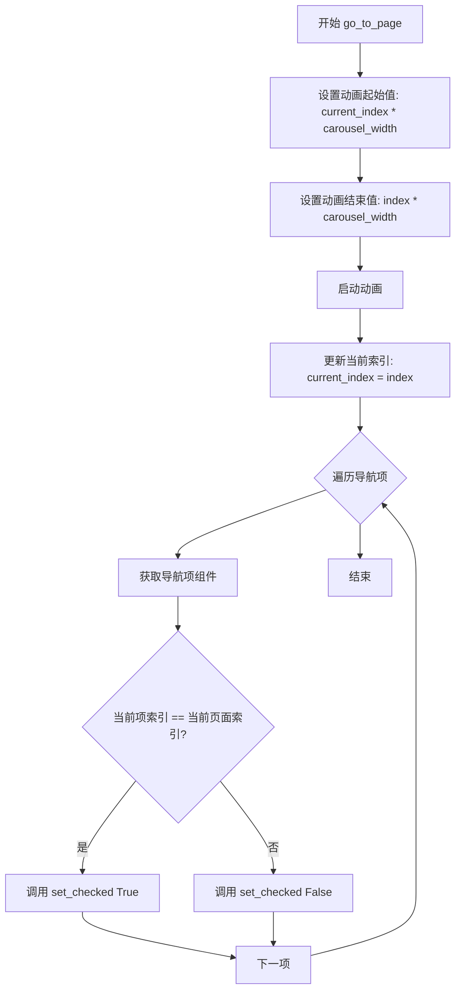

#### 带注释源码

```python
def go_to_page(self, index):
    """
    跳转到指定页面
    
    Args:
        index: 目标页面的索引值，从 0 开始
    """
    # 设置动画的起始值为当前页面在水平方向上的像素位置
    # 计算公式：当前页面索引 * 轮播组件宽度
    self.loading_ani.setStartValue(self.current_index * self.carousel_width)
    
    # 设置动画的结束值为目标页面在水平方向上的像素位置
    # 计算公式：目标页面索引 * 轮播组件宽度
    self.loading_ani.setEndValue(index * self.carousel_width)
    
    # 启动属性动画，使水平滚动条从当前位置平滑移动到目标位置
    # 动画持续时间在初始化时设置为 500ms，使用 InOutQuad 缓动曲线
    self.loading_ani.start()
    
    # 更新内部维护的当前页面索引状态
    self.current_index = index
    
    # 遍历导航栏中的所有指示器（圆点）
    for i in range(self.navigate_lay.count()):
        # 获取当前索引对应的导航指示器组件
        frame = self.navigate_lay.itemAt(i).widget()
        
        # 根据是否为当前页面设置指示器的选中状态
        # 当前页面索引对应的指示器显示为选中状态（较大、Primary颜色）
        # 其他指示器显示为未选中状态（较小、背景色）
        frame.set_checked(i == self.current_index)
```

## 关键组件


### MGuidPrivate (导航指示器组件)

该组件继承自 `QtWidgets.QFrame`，用于在轮播图底部显示当前的页面进度指示器。它包含选中/未选中的视觉状态，并处理鼠标点击事件以触发页面跳转信号。

### MCarousel (轮播图主容器)

该组件继承自 `QtWidgets.QGraphicsView`，是整个轮播功能的核心类。它负责初始化场景、管理图片列表、计算布局、处理自动播放逻辑以及通过 `QPropertyAnimation` 实现页面切换的平滑动画效果。

### QGraphicsScene (图形场景管理)

代码中实例化了 `QtWidgets.QGraphicsScene` 对象，用于管理和承载所有的图片项（QGraphicsPixmapItem）。它负责设置背景色和场景矩形，是图片渲染的载体。

### Navigation Logic (导航逻辑)

该模块包含在 `MCarousel` 类中，负责维护 `current_index` 并计算下一页 (`next_page`) 或上一页 (`pre_page`) 的索引逻辑，同时同步更新导航指示器 (`MGuidPrivate`) 的选中状态。

### Animation Controller (动画控制器)

代码中使用 `QtCore.QPropertyAnimation` 针对水平滚动条 (`horizontalScrollBar`) 的值进行动画控制，实现了图片切换时的平滑滚动效果。

### AutoPlay Timer (自动播放定时器)

利用 `QtCore.QTimer` 定时触发 `next_page` 槽函数，实现轮播图的自动切换功能，并通过 `set_interval` 方法支持时间间隔的配置。

## 问题及建议


### 已知问题

- **属性系统实现缺陷**：`set_autoplay` 方法只是调用了 `setProperty` 设置值，但没有实际调用 `_set_autoplay` 来启动/停止定时器。正确的实现应该通过 Qt 的属性系统触发 `_set_autoplay`，或者直接调用该方法。当前的实现会导致 `set_autoplay(True)` 不会实际启动自动播放。
- **资源未正确释放**：动画对象 `loading_ani` 和定时器 `autoplay_timer` 在组件销毁时可能未正确清理，应该在析构函数中显式停止并删除这些对象。
- **Magic Numbers 过多**：代码中存在大量硬编码的数值，如 `20`, `16`, `4`, `500`, `2000`, `500`, `30`, `5`, `2` 等，缺乏可配置性，降低了代码的维护性和灵活性。
- **空列表未做保护**：构造函数接收 `pix_list` 参数，但如果传入空列表，`page_count` 将为 0，可能导致后续计算出现异常（如除零错误或场景尺寸为0）。
- **索引越界风险**：`go_to_page` 方法未对传入的 `index` 进行边界检查，如果外部传入非法索引可能导致异常。
- **hud_widget 父对象缺失**：`hud_widget` 被创建但未设置父对象，且未被添加到场景中，可能导致在某些情况下无法正确显示或内存管理问题。
- **图片对齐问题**：缩放后的图片默认左上角对齐，当图片宽高比与目标尺寸不一致时，图片不会居中显示，影响视觉效果。
- **缺少箭头导航**：轮播图没有提供左右箭头按钮进行手动切换，用户只能通过底部导航点进行操作。
- **属性 getter 缺失**：使用了 `@property_mixin` 装饰器，但未提供 `autoplay` 属性的 getter 方法。

### 优化建议

- **修复属性系统**：在 `set_autoplay` 方法中直接调用 `_set_autoplay(value)`，或者通过 Qt 的属性机制正确连接 setter。
- **添加资源清理**：重写 `__del__` 或使用 `deleteLater` 方法确保动画和定时器被正确停止和释放。
- **提取配置参数**：将 magic numbers 提取为类属性或构造函数参数，如 `self.guid_size_checked`, `self.guid_size_unchecked`, `self.guid_height`, `self.animation_duration`, `self.default_interval` 等。
- **添加输入验证**：在构造函数中检查 `pix_list` 是否为空，在 `go_to_page` 中添加 `index` 的边界检查。
- **修复 hud_widget**：将 `hud_widget` 添加到场景中或设置正确的父对象，确保其生命周期正确管理。
- **实现图片居中**：在添加 `pix_item` 到场景时，根据图片尺寸和目标尺寸计算偏移量，使图片居中显示。
- **添加箭头导航**：在场景中添加左右箭头按钮，支持键盘左右键和鼠标点击切换页面。
- **添加状态指示**：提供 `is_autoplay` 方法返回当前自动播放状态。
- **添加边界检查**：在 `go_to_page` 方法中添加 `assert 0 <= index < self.page_count` 进行调试检查。


## 其它


### 设计目标与约束

本组件的设计目标是提供一个轻量级的图片轮播组件，支持自动播放、手动切换、页面指示器等功能。约束条件包括：依赖PySide6框架，仅支持Qt环境运行，图片需预先加载完成，轮播窗口大小固定。

### 错误处理与异常设计

代码中未包含显式的错误处理机制。潜在异常场景包括：空图片列表导致导航点创建失败；图片尺寸为0时scaledToWidth/Height可能异常；动画未完成时频繁切换页面。建议添加：空列表校验、图片加载状态检查、动画状态互斥锁。

### 数据流与状态机

组件包含三种状态：idle（静止）、playing（自动播放中）、animating（页面切换动画中）。状态转换：idle→playing通过set_autoplay(True)，playing→idle通过set_autoplay(False)，任意状态→animating通过go_to_page触发，animating→idle通过动画结束信号。数据流：pix_list→QGraphicsPixmapItem→QGraphicsScene，页面索引→current_index→导航点状态更新。

### 外部依赖与接口契约

外部依赖包括：PySide6.QtCore、PySide6.QtGui、PySide6.QtWidgets、dayu_theme模块、property_mixin装饰器。公开接口契约：MCarousel(pix_list, autoplay, width, height, parent)构造函数；set_autoplay(value)设置自动播放；set_interval(ms)设置播放间隔；next_page()下一页；pre_page()上一页；go_to_page(index)跳转指定页。

### 性能考虑

当前实现性能瓶颈：每次页面切换都创建新的QPropertyAnimation对象；导航点使用QWidget而非QGraphicsItem；图片采用同步加载方式。优化建议：复用动画对象；导航点改用GraphicsItem减少开销；支持图片异步加载；考虑使用QPixmap缓存策略。

### 线程模型

代码为单线程设计，所有操作均在主线程执行。定时器autoplay_timer在主线程触发next_page，动画也在主线程运行。不支持后台线程图片加载。

### 内存管理

图片内存：pix_list传入后在scene中转换为QGraphicsPixmapItem，原始pix_list引用仍由调用方管理。导航点内存：navigate_lay管理MGuidPrivate实例，随组件销毁而释放。动画对象：loading_ani和autoplay_timer为组件成员，随组件销毁而释放。

### 安全性考虑

代码不涉及用户输入验证，不执行网络请求，无敏感数据处理。潜在XSS风险：无。SQL注入风险：无。

### 可测试性

当前代码可测试性较低，原因是：依赖PySide6图形环境；dayu_theme模块硬编码颜色值；动画时长硬编码。改进建议：将主题颜色、动画时长等参数化；提供模拟测试模式；分离业务逻辑与UI渲染逻辑。

### 国际化/本地化

代码中无硬编码字符串，所有UI文本通过样式表和主题色控制。支持国际化，只需替换dayu_theme中的颜色值或添加语言配置文件。

### 版本兼容性

代码使用PySide6，为Qt for Python的最新版本。Qt版本兼容性：依赖Qt5.12+特性（如Qt.SmoothTransformation枚举值）。Python版本：理论上支持Python 2.7+和Python 3.x（因from __future__ import声明）。

### 配置管理

组件配置通过构造函数参数传入：pix_list（图片列表）、autoplay（自动播放开关）、width（宽度）、height（高度）、parent（父控件）。运行时配置通过set_autoplay和set_interval方法修改。无持久化配置机制。

### 使用示例

```python
from PySide6 import QtGui
from MCarousel import MCarousel

# 创建图片列表
pix_list = [QtGui.QPixmap(f"image{i}.png") for i in range(5)]

# 创建轮播组件
carousel = MCarousel(pix_list, autoplay=True, width=800, height=600)
carousel.show()

# 交互控制
carousel.set_interval(3000)  # 3秒切换
carousel.set_autoplay(False)  # 停止自动播放
carousel.go_to_page(2)  # 跳转到第3页
```

    