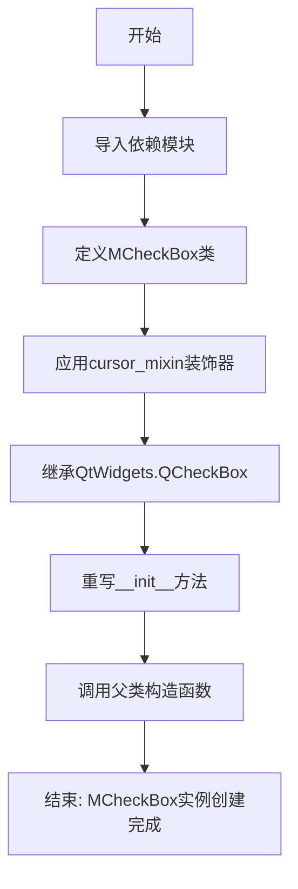
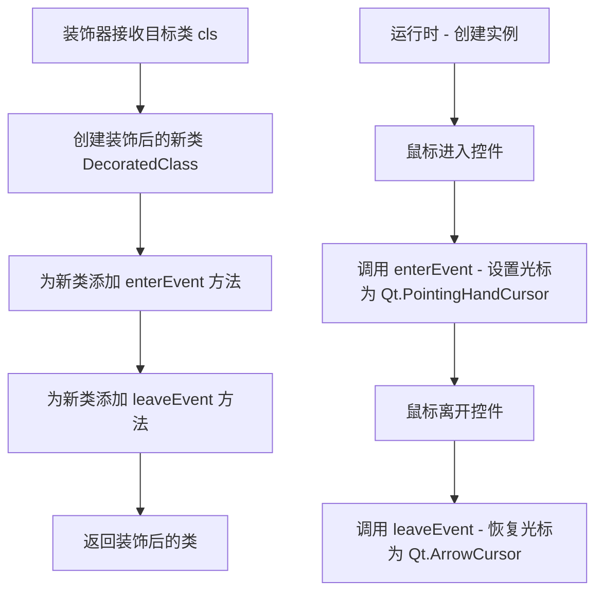

# `comic-translate\app\ui\dayu_widgets\check_box.py` 详细设计文档

MCheckBox是一个基于PySide6.QCheckBox的自定义复选框组件，通过cursor_mixin装饰器添加了鼠标悬停时改变光标形状的功能，并支持样式表定制。

## 整体流程



## 类结构

```
QObject (PySide6)
└── QWidget (PySide6.QtWidgets)
    └── QAbstractButton (PySide6.QtWidgets)
        └── QCheckBox (PySide6.QtWidgets)
            └── MCheckBox (自定义组件)
```

## 全局变量及字段


    

## 全局函数及方法


### `cursor_mixin`

`cursor_mixin` 是一个装饰器函数，用于为 Qt 控件添加鼠标悬停时改变光标形状的功能。它接受一个 QWidget 子类作为参数，装饰该类后，当鼠标进入控件区域时将光标设置为手型，移出时恢复默认光标。

参数：

- `cls`：`<class 'type'>`，需要被装饰的目标类（QWidget 的子类）

返回值：`<class 'type'>`，装饰后的类（添加了鼠标事件处理和光标切换功能）

#### 流程图



#### 带注释源码

```python
# cursor_mixin 的典型实现（从 .mixin 模块导入）
def cursor_mixin(cls):
    """
    装饰器：为 Qt 控件添加鼠标悬停时改变光标的功能
    
    参数:
        cls: QWidget 的子类，需要添加光标交互功能的类
        
    返回:
        装饰后的类，添加了 enterEvent 和 leaveEvent 方法
    """
    
    # 保存原始的 enterEvent 方法（如果存在）
    original_enter = cls.enterEvent if hasattr(cls, 'enterEvent') else None
    # 保存原始的 leaveEvent 方法（如果存在）
    original_leave = cls.leaveEvent if hasattr(cls, 'leaveEvent') else None
    
    def new_enterEvent(self, event):
        """鼠标进入事件 - 设置光标为手型"""
        # 调用原始的 enterEvent（如果存在）
        if original_enter:
            original_enter(self, event)
        # 设置鼠标光标为指向手型
        self.setCursor(Qt.PointingHandCursor)
    
    def new_leaveEvent(self, event):
        """鼠标离开事件 - 恢复光标为默认"""
        # 调用原始的 leaveEvent（如果存在）
        if original_leave:
            original_leave(self, event)
        # 恢复鼠标光标为默认箭头
        self.setCursor(Qt.ArrowCursor)
    
    # 将新的事件处理方法绑定到类
    cls.enterEvent = new_enterEvent
    cls.leaveEvent = new_leaveEvent
    
    return cls


# 使用示例
@cursor_mixin
class MCheckBox(QtWidgets.QCheckBox):
    """
    MCheckBox 只是使用样式表并在鼠标悬停时设置光标形状，没有更多扩展。
    """
    
    def __init__(self, text="", parent=None):
        super(MCheckBox, self).__init__(text=text, parent=parent)
```


### `MCheckBox.__init__`

初始化 MCheckBox 控件，调用父类 QCheckBox 的构造函数，设置复选框的文本和父控件。

参数：

- `text`：`str`，复选框显示的文本，默认为空字符串
- `parent`：`QtWidgets.QWidget`，父控件，用于建立对象层级关系，默认为 `None`

返回值：`None`，构造函数不返回任何值

#### 流程图

```mermaid
graph TD
    A[开始 __init__] --> B{接收参数}
    B --> C[text = '']
    B --> D[parent = None]
    C --> E[调用 super().__init__]
    D --> E
    E --> F[设置复选框文本和父控件]
    F --> G[结束]
```

#### 带注释源码

```python
def __init__(self, text="", parent=None):
    """
    初始化 MCheckBox 控件
    
    Args:
        text: 复选框显示的文本，默认为空字符串
        parent: 父控件，默认为 None
    """
    # 调用父类 QCheckBox 的构造函数
    # 设置复选框的文本和父控件
    super(MCheckBox, self).__init__(text=text, parent=parent)
```

## 关键组件


### MCheckBox 类

Qt自定义复选框组件，继承自QtWidgets.QCheckBox，通过cursor_mixin装饰器实现鼠标悬停时的光标形状切换功能，并支持样式表定制。

### cursor_mixin 装饰器

混入类装饰器，为MCheckBox提供鼠标悬停时光标形状变化的功能实现。

### __init__ 构造函数

初始化MCheckBox实例，接受text（显示文本）和parent（父控件）参数，调用父类构造函数完成基础初始化。


## 问题及建议


### 已知问题

-   依赖外部mixin模块（cursor_mixin），但该模块代码未提供，可能隐藏实现细节，导致维护困难。
-   缺乏类型提示（Type Hints），影响代码可读性和静态分析工具的支持。
-   文档字符串过于简单，仅一行描述，未详细说明参数、返回值及功能细节。
-   使用了Python 2兼容的`__future__`导入，在Python 3环境中已多余，增加代码复杂性。
-   没有错误处理机制，如参数类型验证或异常捕获，可能导致运行时错误。
-   类本身未添加任何新功能（仅继承和调用mixin），可能只是多余的包装，增加了项目复杂度。
-   未提供单元测试或测试用例，无法保证组件行为的正确性和稳定性。
-   文件头部版权信息过时（2019年），缺乏维护日志和更新记录。

### 优化建议

-   补充类型提示，例如在`__init__`方法中为`text`和`parent`参数添加类型注解（`text: str = "", parent: QtWidgets.QWidget = None`）。
-   完善文档字符串，使用Google或Sphinx格式详细描述类、功能、参数、返回值和示例。
-   移除不必要的`__future__`导入（`absolute_import`、`division`、`print_function`），简化代码。
-   添加参数验证或异常处理，例如检查`parent`是否为`QWidget`实例，或捕获父类初始化可能的异常。
-   评估该类的必要性：如果仅为了样式和光标，可考虑直接使用QCheckBox并通过样式表配置，或将mixin功能内联以减少依赖。
-   若需扩展功能，添加自定义方法（如设置自定义样式表、光标行为）或信号，增强可用性。
-   编写单元测试，使用`unittest`或`pytest`验证基本功能（如初始化、显示、交互）。
-   更新版权信息，添加维护日志（如最后修改日期、版本号），并记录技术债务或已知问题。
-   考虑添加配置方法，例如允许动态修改样式表或光标，而不是仅依赖mixin的静态行为。


## 其它


### 设计目标与约束

本组件的设计目标是为PySide6的QCheckBox提供自定义样式和鼠标交互体验，通过cursor_mixin装饰器实现鼠标悬停时的光标形状变化。设计约束包括：仅依赖PySide6框架，需要与mixin模块配合使用，不修改父类的核心功能，仅扩展样式和交互层。

### 错误处理与异常设计

本类较为简单，主要错误场景包括：cursor_mixin装饰器未正确安装或返回错误、parent参数类型不匹配、text参数编码问题。由于继承自QtWidgets.QCheckBox，异常处理遵循Qt的异常传播机制，运行时错误将由Qt事件循环捕获并处理。开发阶段应确保cursor_mixin模块存在且可用。

### 数据流与状态机

MCheckBox的数据流较为简单：初始化时接收text和parent参数，通过super调用传递给父类QCheckBox。组件本身无独立状态机，继承自QCheckBox的标准选中/未选中/半选状态。cursor_mixin装饰器在鼠标进入/离开组件时修改光标形状，属于事件驱动的副作用，无数据持久化需求。

### 外部依赖与接口契约

主要外部依赖包括：PySide6.QtWidgets模块（Qt框架）、cursor_mixin装饰器（本地mixin模块）。接口契约方面：构造函数接受text（str，默认空字符串）和parent（QWidget或None），返回QCheckBox实例。所有继承自QCheckBox的公共方法均可正常使用，如setChecked()、isChecked()、setText()等。

### 性能考虑

本组件性能开销极低，仅在实例化时调用父类构造函数。cursor_mixin的装饰器可能在鼠标事件触发时产生少量开销，但通常可忽略不计。建议避免在高频创建场景中使用大量实例，必要时考虑对象池化。

### 安全性考虑

本组件无用户输入处理、无文件操作、无网络通信，安全性风险较低。text参数需确保为有效字符串，避免传入异常类型导致构造函数抛出TypeError。parent参数应确保为有效的QWidget对象或None。

### 兼容性考虑

本组件基于PySide6开发，需确保Qt版本与PySide6版本匹配。Python兼容性方面，代码使用__future__导入支持Python 2和Python 3，但由于PySide6仅支持Python 3.6+，实际运行环境应为Python 3.6及以上版本。样式表和光标行为在不同操作系统上可能存在细微差异。

### 使用示例

```python
from PySide6.QtWidgets import QApplication, QWidget, QVBoxLayout
import sys

app = QApplication(sys.argv)
window = QWidget()
layout = QVBoxLayout()

checkbox = MCheckBox("同意条款")
checkbox.setStyleSheet("QCheckBox { color: #333333; } QCheckBox::indicator { width: 20px; height: 20px; }")

layout.addWidget(checkbox)
window.setLayout(layout)
window.show()
sys.exit(app.exec())
```

### 测试策略

建议测试内容包括：实例化测试（各种参数组合）、父类方法继承测试（setChecked、toggle等）、样式表应用测试、光标变化行为测试（需模拟鼠标事件）、异常输入测试（错误类型参数）。由于依赖Qt框架，测试需在QApplication环境下运行。

### 部署和配置

本组件为纯Python代码，无特殊部署要求。确保项目依赖PySide6和本地mixin模块即可。使用时只需将本模块导入项目并实例化MCheckBox类。样式可通过setStyleSheet自定义，光标行为由cursor_mixin控制。

    