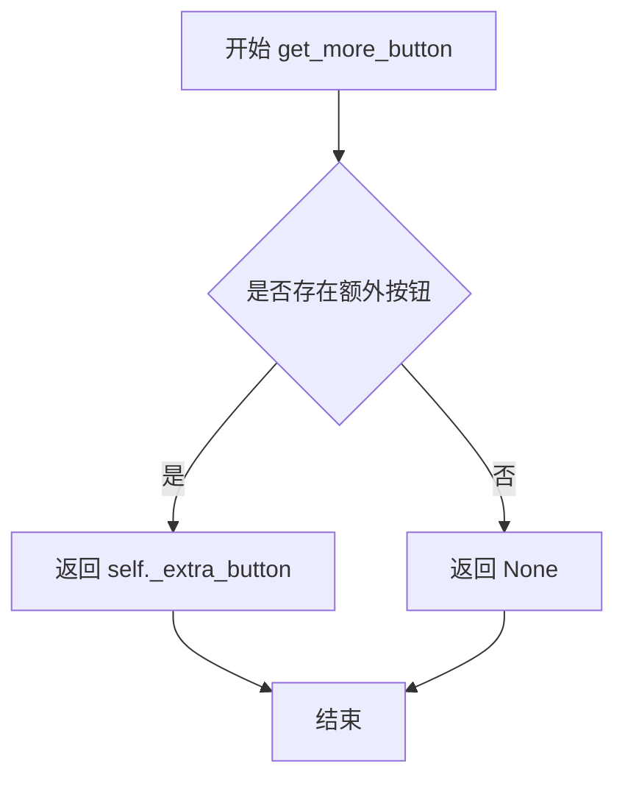
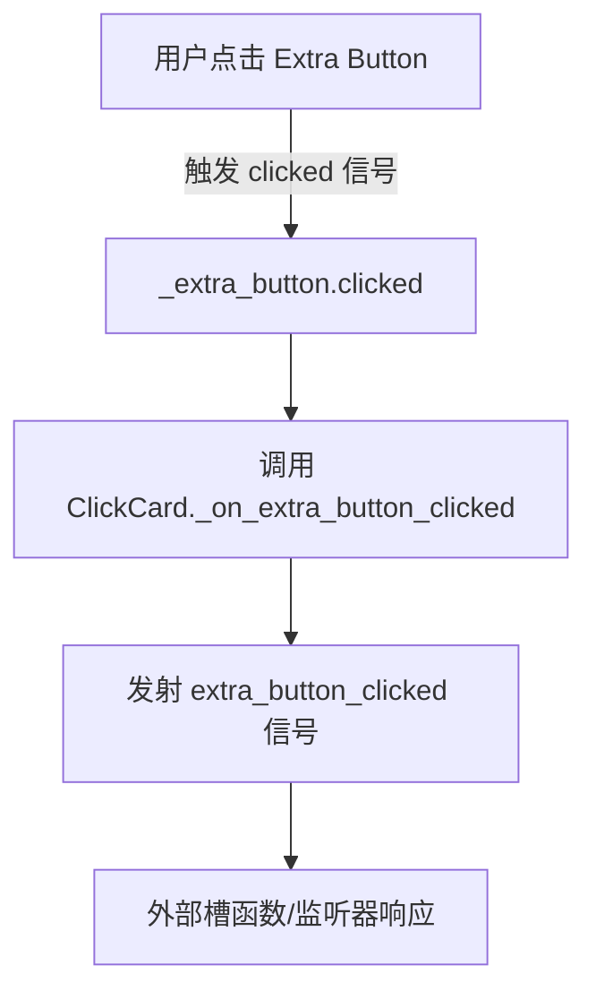
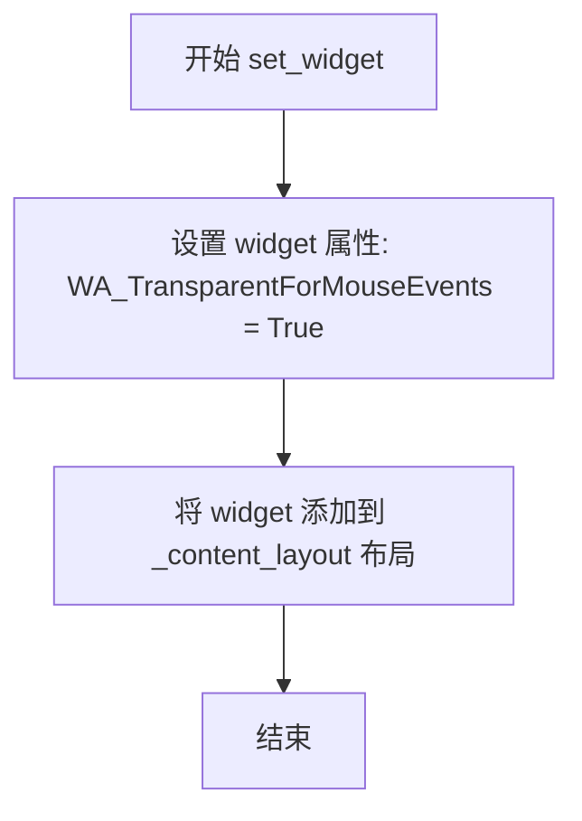
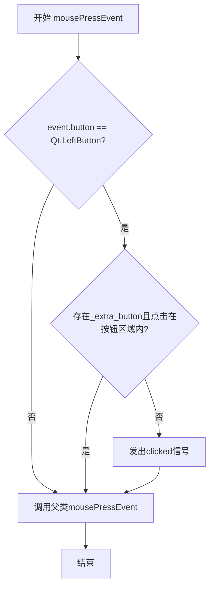
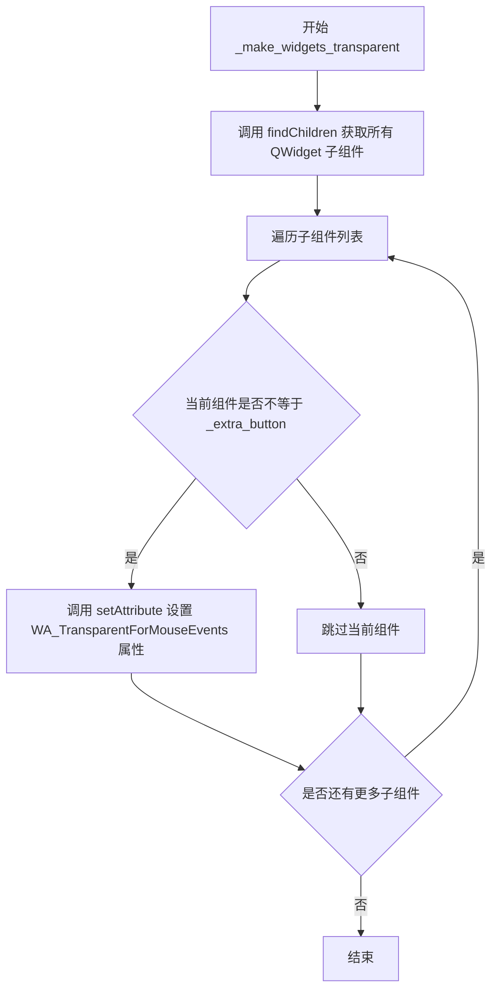
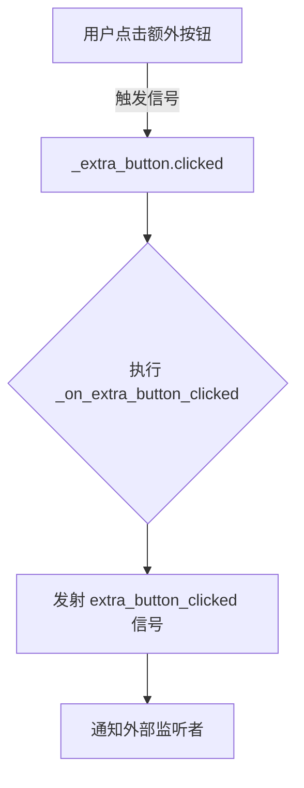
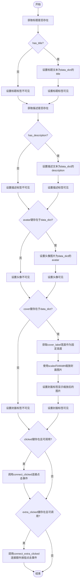
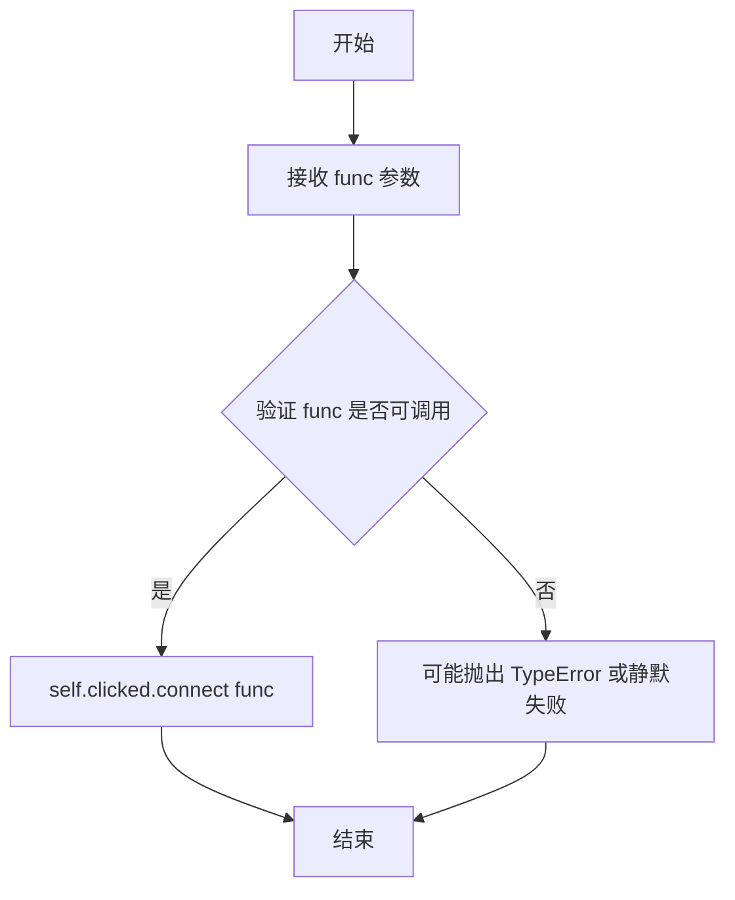
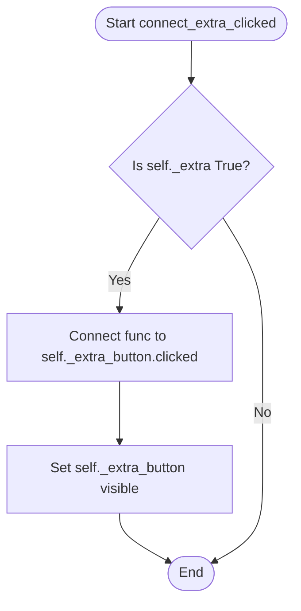

# `comic-translate\app\ui\dayu_widgets\clickable_card.py` 详细设计文档

该模块实现了两个基于PySide6的可交互卡片组件（ClickCard和ClickMeta），用于Dayu主题。ClickCard提供带标题、图片和额外操作按钮的简单点击卡片；ClickMeta则提供更丰富的元数据展示（封面、头像、描述），支持高亮、划掉样式、动态尺寸计算以及自定义点击行为。

## 整体流程

```mermaid
graph TD
    Start[开始] --> CreateInstance[实例化 ClickCard 或 ClickMeta]
    CreateInstance --> InitLayout[初始化布局 (QVBoxLayout, QHBoxLayout)]
    InitLayout --> AddWidgets[添加子组件 (Title, Avatar, Cover, Content)]
    AddWidgets --> WaitEvent[等待用户交互]
    WaitEvent --> MousePress[鼠标点击事件 mousePressEvent]
    MousePress --> CheckTarget{判断点击目标}
    CheckTarget -- 点击额外按钮 --> EmitExtra[发射 extra_button_clicked 信号]
    CheckTarget -- 点击空白区域 --> EmitClick[发射 clicked 信号]
    EmitExtra --> End[结束/回调处理]
    EmitClick --> End
    CheckTarget -- 点击覆盖层/头像 --> Ignore[忽略点击,穿透传递]
```

## 类结构

```
click_card_meta.py
├── ClickCard (继承 QWidget)
│   ├── 字段: _title_label, _title_icon, _extra_button...
│   └── 方法: set_widget, border, mousePressEvent...
└── ClickMeta (继承 QWidget)
    ├── 字段: _cover_label, _avatar, _title_label...
    └── 方法: setup_data, set_highlight, set_skipped, sizeHint...
```

## 全局变量及字段


### `ClickCard._title_label`
    
Label widget displaying the card title.

类型：`MLabel`
    


### `ClickCard._title_icon`
    
Avatar widget displaying the card image (optional).

类型：`MAvatar`
    


### `ClickCard._title_layout`
    
Horizontal layout for arranging title components.

类型：`QHBoxLayout`
    


### `ClickCard._extra_button`
    
Tool button for triggering extra actions (e.g., menu).

类型：`MToolButton`
    


### `ClickCard._content_layout`
    
Vertical layout for adding main content widgets.

类型：`QVBoxLayout`
    


### `ClickCard._main_lay`
    
Main vertical layout container for the card structure.

类型：`QVBoxLayout`
    


### `ClickMeta._cover_label`
    
Label widget for displaying the cover image.

类型：`QLabel`
    


### `ClickMeta._avatar`
    
Avatar widget for displaying user avatar.

类型：`MAvatar`
    


### `ClickMeta._title_label`
    
Label widget for displaying the title.

类型：`MLabel`
    


### `ClickMeta._description_label`
    
Label widget for displaying description text with wrapping.

类型：`MLabel`
    


### `ClickMeta._title_layout`
    
Horizontal layout for title and extra button.

类型：`QHBoxLayout`
    


### `ClickMeta._extra`
    
Boolean flag indicating visibility of extra button.

类型：`bool`
    


### `ClickMeta._extra_button`
    
Tool button for extra actions.

类型：`MToolButton`
    


### `ClickMeta._button_layout`
    
Horizontal layout for action buttons (reserved for future use).

类型：`QHBoxLayout`
    


### `ClickMeta._main_lay`
    
Main vertical layout arranging cover and content.

类型：`QVBoxLayout`
    


### `ClickMeta._avatar_size`
    
Tuple specifying avatar dimensions (width, height).

类型：`tuple`
    


### `ClickMeta._original_background_color`
    
Cached QColor for the original background to support highlighting.

类型：`QColor`
    
    

## 全局函数及方法


### `ClickCard.__init__`

该方法是一个自定义 Qt 组件的构造函数，负责初始化一个名为 `ClickCard` 的可点击卡片组件。它构建了卡片的 UI 骨架，包括标题栏、可选的头像图标、可选的扩展按钮以及用于放置其他控件的内容区域，并配置了鼠标事件穿透等交互属性。

参数：

- `title`：`str | None`，卡片标题文本。
- `image`：`str | None`，头像图片的路径或资源标识，用于在标题旁显示头像。
- `size`：`str | None`，卡片尺寸规格（如 large, medium, small），默认为 `dayu_theme.default_size`，用于确定字体大小和内边距。
- `extra`：`bool | None`，是否显示右上角的“更多”按钮。
- `type`：`str | None`，类型标识（当前代码中未使用，可能用于未来扩展或主题定制）。
- `parent`：`PySide6.QtWidgets.QWidget | None`，父级 Qt 控件。

返回值：`None`，构造函数无返回值。

#### 流程图

```mermaid
flowchart TD
    A([Start __init__]) --> B[Call super().__init__]
    B --> C[Set Widget Attributes<br>WA_StyledBackground, border property]
    C --> D[Resolve Size<br>Use default if None]
    D --> E[Create Title Label<br>MLabel with text]
    E --> F[Create Title Layout<br>QHBoxLayout with padding]
    F --> G{Is Image provided?}
    G -- Yes --> H[Create Avatar<br>MAvatar, set image & size]
    H --> I[Set Avatar Mouse Transparent]
    I --> J[Add Avatar to Title Layout]
    G -- No --> J
    J --> K[Add Title Label to Layout]
    K --> L[Add Stretch to Layout]
    L --> M{Is Extra button needed?}
    M -- Yes --> N[Create Extra Button<br>MToolButton with icon]
    N --> O[Connect clicked signal<br>_on_extra_button_clicked]
    O --> P[Add Button to Title Layout]
    M -- No --> Q
    P --> Q
    Q --> R[Create Content Layout<br>QVBoxLayout]
    R --> S[Create Main Layout<br>QVBoxLayout with spacing]
    S --> T{Is Title provided?}
    T -- Yes --> U[Add Title Layout to Main]
    U --> V[Add Divider to Main]
    T -- No --> W
    V --> W
    W --> X[Add Content Layout to Main]
    X --> Y[Set Widget Layout]
    Y --> Z([End])
```

#### 带注释源码

```python
def __init__(self, title=None, image=None, size=None, extra=None, type=None, parent=None):
    # 调用父类 QWidget 的构造函数，初始化 Qt 对象结构
    super(ClickCard, self).__init__(parent=parent)
    
    # 设置自定义属性，使其支持样式表背景色
    self.setAttribute(QtCore.Qt.WA_StyledBackground)
    # 初始化 border 属性为 False，用于后续样式控制
    self.setProperty("border", False)
    
    # 如果未指定 size，则使用主题默认大小
    size = size or dayu_theme.default_size
    
    # 定义尺寸映射表：不同尺寸对应不同的标签级别（H2, H3, H4）和内边距
    map_label = {
        dayu_theme.large: (MLabel.H2Level, 20),
        dayu_theme.medium: (MLabel.H3Level, 15),
        dayu_theme.small: (MLabel.H4Level, 10),
    }
    
    # 创建标题文本标签
    self._title_label = MLabel(text=title)
    # 根据尺寸设置标题的字体等级
    self._title_label.set_dayu_level(map_label.get(size)[0])
    # 设置标题标签对鼠标事件透明，这样点击标题区域会穿透给卡片本身
    self._title_label.setAttribute(QtCore.Qt.WA_TransparentForMouseEvents)

    # 获取当前尺寸对应的内边距值
    padding = map_label.get(size)[-1]
    # 创建水平布局用于排列标题、图标和按钮
    self._title_layout = QtWidgets.QHBoxLayout()
    self._title_layout.setContentsMargins(padding, padding, padding, padding)
    
    # 如果传入了图片资源，则创建并添加头像组件
    if image:
        self._title_icon = MAvatar()
        self._title_icon.set_dayu_image(image)
        self._title_icon.set_dayu_size(size)
        # 同样设置头像鼠标穿透
        self._title_icon.setAttribute(QtCore.Qt.WA_TransparentForMouseEvents)
        self._title_layout.addWidget(self._title_icon)
        
    # 将标题标签添加到布局
    self._title_layout.addWidget(self._title_label)
    # 添加伸缩项，将标题等元素左对齐/居中，剩余空间在右侧
    self._title_layout.addStretch()
    
    # 初始化额外按钮为 None
    self._extra_button = None
    # 如果需要显示额外操作按钮
    if extra:
        # 创建一个仅显示图标的工具按钮，加载 more.svg
        self._extra_button = MToolButton().icon_only().svg("more.svg")
        # 连接按钮点击信号到内部处理方法
        self._extra_button.clicked.connect(self._on_extra_button_clicked)
        self._title_layout.addWidget(self._extra_button)

    # 创建垂直布局用于存放用户添加的内部控件
    self._content_layout = QtWidgets.QVBoxLayout()

    # 创建主布局，设置间距和边距
    self._main_lay = QtWidgets.QVBoxLayout()
    self._main_lay.setSpacing(0)
    self._main_lay.setContentsMargins(1, 1, 1, 1)
    
    # 如果存在标题，则将标题栏和分割线加入主布局
    if title:
        self._main_lay.addLayout(self._title_layout)
        self._main_lay.addWidget(MDivider())
    # 将内容布局加入主布局
    self._main_lay.addLayout(self._content_layout)
    # 为 Widget 设置最终布局
    self.setLayout(self._main_lay)
```


### `ClickCard.get_more_button`

获取 ClickCard 组件中的额外按钮（"更多"按钮），该按钮用于触发额外的操作（如显示菜单等）。

参数：无

返回值：`MToolButton | None`，返回额外的按钮部件（MToolButton 类型），如果没有设置额外按钮则返回 None。

#### 流程图



#### 带注释源码

```python
def get_more_button(self):
    """
    获取额外按钮（更多按钮）的引用。
    
    该方法返回 ClickCard 组件中可选的额外按钮部件。
    该按钮在 __init__ 方法中根据 extra 参数创建，
    通常用于显示下拉菜单或其他附加操作。
    
    Returns:
        MToolButton or None: 返回 MToolButton 实例，
                             如果未设置额外按钮则返回 None。
    """
    return self._extra_button
```


### `ClickCard._on_extra_button_clicked`

该方法是一个私有槽函数（Slot），专门用于响应 `ClickCard` 组件右上角的“更多”按钮（`_extra_button`）的点击事件。它的核心职责是将底层 `MToolButton` 的点击信号转发为 `ClickCard` 自身定义的 `extra_button_clicked` 信号，以便外部调用者可以通过监听该信号来处理额外的操作，而无需关心内部按钮的实现细节。

参数：
- 无（该方法不接受除 `self` 以外的显式参数）

返回值：
- `None`（无返回值，主要通过 Qt 信号机制进行事件传递）

#### 流程图



#### 带注释源码

```python
def _on_extra_button_clicked(self):
    """
    处理额外按钮（右上角菜单按钮）点击事件的槽函数。

    当用户点击 MToolButton (_extra_button) 时，Qt 自动调用此方法。
    该方法充当了一个中介角色，将按钮的点击行为重新发射为 
    ClickCard 类的自定义信号 extra_button_clicked，从而实现组件内部
    事件与外部业务逻辑的解耦。

    Args:
        None (隐含参数 self 指向 ClickCard 实例)

    Returns:
        None
    """
    self.extra_button_clicked.emit()
```


### `ClickCard.set_widget`

该方法用于向 ClickCard 卡片的内容区域添加子控件，并确保该控件对鼠标事件透明，以便点击事件能够穿透到卡片本身。

参数：

- `widget`：`QtWidgets.QWidget`，要添加到内容区域的子控件

返回值：`None`，该方法没有返回值

#### 流程图



#### 带注释源码

```python
def set_widget(self, widget):
    """
    向 ClickCard 的内容区域添加一个控件。
    
    参数:
        widget: QtWidgets.QWidget 实例，要添加的控件
    """
    # 设置控件属性，使其对鼠标事件透明
    # 这样点击该控件区域时，事件会穿透到 ClickCard 本身
    widget.setAttribute(QtCore.Qt.WA_TransparentForMouseEvents)
    
    # 将控件添加到内容布局中
    self._content_layout.addWidget(widget)
```


### `ClickCard.border`

该方法用于设置卡片的边框样式，通过设置Qt样式属性并强制刷新样式系统，使卡片组件显示边框效果，同时支持链式调用。

参数：无（仅包含 `self` 参数）

返回值：`ClickCard`，返回实例本身，支持链式调用

#### 流程图

```mermaid
flowchart TD
    A[开始 border 方法] --> B{设置 border 属性}
    B --> C[setProperty('border', True)]
    C --> D[调用样式系统刷新]
    D --> E[style().polish self]
    E --> F[返回 self 实例]
    F --> G[结束]
```

#### 带注释源码

```python
def border(self):
    """
    设置卡片的边框样式。
    
    该方法通过Qt的属性系统设置'border'属性为True，
    然后调用样式.polish()强制刷新widget的样式，
    使边框效果立即生效。
    
    Returns:
        ClickCard: 返回实例本身，支持链式调用
                  例如: card.border().set_widget(widget)
    """
    # 设置Qt样式属性，将border属性设置为True
    self.setProperty("border", True)
    
    # 获取当前widget的样式策略并刷新样式
    # 这会强制Qt重新应用样式表，使属性变更立即生效
    self.style().polish(self)
    
    # 返回self实例，支持链式调用设计
    return self
```


### `ClickCard.mousePressEvent`

该方法是 `ClickCard` 类的鼠标按下事件处理函数，用于响应用户的鼠标左键点击操作。当用户点击卡片时，如果点击位置不是扩展按钮区域，则发出 `clicked` 信号；如果点击了扩展按钮，则将事件传递给扩展按钮处理。

参数：

- `event`：`QtGui.QMouseEvent`，鼠标事件对象，包含鼠标按钮类型、点击位置等事件信息

返回值：`None`，该方法是 Qt 事件处理回调，不返回值

#### 流程图



#### 带注释源码

```python
def mousePressEvent(self, event):
    """
    处理鼠标按下事件
    
    Args:
        event: QtGui.QMouseEvent对象，包含鼠标事件信息（按钮类型、位置等）
    
    Returns:
        None
    """
    # 检查是否是鼠标左键点击
    if event.button() == QtCore.Qt.LeftButton:
        # 检查点击位置是否在扩展按钮区域内（如果扩展按钮存在）
        if self._extra_button and self._extra_button.geometry().contains(event.pos()):
            # 让扩展按钮自行处理该事件，直接返回
            return
        # 否则发出clicked信号，通知订阅者卡片被点击
        self.clicked.emit()
    # 调用父类的mousePressEvent，确保Qt默认行为得以执行（如焦点处理等）
    super(ClickCard, self).mousePressEvent(event)
```


### `ClickMeta.__init__`

该方法是 `ClickMeta` 类的构造函数，用于初始化一个包含封面、头像、标题、描述和额外操作按钮的元数据展示组件，设置所有子部件的布局、样式属性以及鼠标事件穿透。

**参数：**

- `cover`：`可选[QtGui.QPixmap]`，封面图像，默认为 `None`
- `avatar`：`可选[str]`，头像图像路径或 URL，默认为 `None`
- `title`：`可选[str]`，标题文本，默认为 `None`
- `description`：`可选[str]`，描述文本，默认为 `None`
- `extra`：`bool`，是否显示额外操作按钮，默认为 `False`
- `parent`：`可选[QtWidgets.QWidget]`，父 widget，默认为 `None`
- `avatar_size`：`tuple`，头像尺寸，默认为空元组 `()`

**返回值：** 无（构造函数）

#### 流程图

```mermaid
flowchart TD
    A[开始 __init__] --> B[调用父类 super().__init__]
    B --> C[设置 WA_StyledBackground 属性]
    C --> D[初始化内部组件<br/>_cover_label, _avatar, _title_label, _description_label]
    D --> E[创建标题水平布局 _title_layout]
    E --> F[创建并配置额外按钮 _extra_button]
    F --> G[设置额外按钮可见性并连接信号]
    G --> H[创建内容垂直布局 content_lay]
    H --> I[创建头像垂直布局 avatar_layout]
    I --> J[创建头像内容组合布局 avatar_content_layout]
    J --> K[创建按钮水平布局 _button_layout]
    K --> L[创建主垂直布局 main_lay]
    L --> M[设置主布局和封面固定尺寸]
    M --> N[根据 avatar_size 设置头像尺寸]
    N --> O[保存头像尺寸到 _avatar_size]
    O --> P[调用 _make_widgets_transparent]
    P --> Q[结束 __init__]
```

#### 带注释源码

```python
def __init__(
    self,
    cover=None,
    avatar=None,
    title=None,
    description=None,
    extra=False,
    parent=None,
    avatar_size=()
):
    """
    初始化 ClickMeta 组件。
    
    参数:
        cover: 封面图像 (QPixmap)
        avatar: 头像图像路径/URL (str)
        title: 标题文本 (str)
        description: 描述文本 (str)
        extra: 是否显示额外按钮 (bool)
        parent: 父 widget (QWidget)
        avatar_size: 头像尺寸元组，如 (w, h) (tuple)
    """
    # 调用父类 QtWidgets.QWidget 的构造函数
    super(ClickMeta, self).__init__(parent)
    
    # 设置 WA_StyledBackground 属性，使 widget 支持样式背景
    self.setAttribute(QtCore.Qt.WA_StyledBackground)

    # ========== 初始化内部组件 ==========
    # 封面标签，用于显示封面图像
    self._cover_label = QtWidgets.QLabel()
    # 头像组件
    self._avatar = MAvatar()
    # 标题标签，使用次要样式
    self._title_label = MLabel().secondary()
    # 描述标签，使用次要样式，支持自动换行
    self._description_label = MLabel().secondary()
    self._description_label.setWordWrap(True)
    # 设置省略模式为右侧省略
    self._description_label.set_elide_mode(QtCore.Qt.ElideRight)

    # ========== 创建标题水平布局 ==========
    self._title_layout = QtWidgets.QHBoxLayout()
    self._title_layout.addWidget(self._title_label)
    # 添加弹性空间，使标题靠左
    self._title_layout.addStretch()

    # ========== 处理额外按钮 ==========
    self._extra = extra  # 保存额外按钮状态
    # 创建图标模式的工具按钮，加载 more.svg 图标
    self._extra_button = MToolButton(parent=self).icon_only().svg("more.svg")
    # 将额外按钮添加到标题布局
    self._title_layout.addWidget(self._extra_button)
    # 默认隐藏额外按钮
    self._extra_button.setVisible(extra)
    # 如果启用了额外按钮，连接点击信号
    if self._extra:
        self._extra_button.clicked.connect(self._on_extra_button_clicked)

    # ========== 创建内容垂直布局 ==========
    content_lay = QtWidgets.QVBoxLayout()
    content_lay.addLayout(self._title_layout)
    content_lay.addWidget(self._description_label)

    # ========== 创建头像布局 ==========
    avatar_layout = QtWidgets.QVBoxLayout()
    avatar_layout.addStretch()  # 顶部弹性空间
    avatar_layout.addWidget(self._avatar)
    avatar_layout.addStretch()  # 底部弹性空间

    # ========== 创建头像内容组合布局 ==========
    avatar_content_layout = QtWidgets.QHBoxLayout()
    avatar_content_layout.addSpacing(2)  # 左侧间距
    avatar_content_layout.addLayout(avatar_layout)
    avatar_content_layout.addSpacing(3)  # 头像与内容间间距

    # ========== 创建按钮水平布局 ==========
    self._button_layout = QtWidgets.QHBoxLayout()

    # ========== 创建主布局 ==========
    main_lay = QtWidgets.QVBoxLayout()
    main_lay.setSpacing(0)       # 零间距
    main_lay.setContentsMargins(1, 1, 1, 1)  # 紧凑边距
    main_lay.addWidget(self._cover_label)
    main_lay.addLayout(avatar_content_layout)
    main_lay.addLayout(self._button_layout)
    # 设置主布局到 widget
    self.setLayout(main_lay)
    
    # 设置封面固定尺寸 200x200
    self._cover_label.setFixedSize(QtCore.QSize(200, 200))

    # ========== 设置头像尺寸 ==========
    # 如果提供了头像尺寸，设置固定尺寸
    if avatar_size:
        w, h = avatar_size
        self._avatar.setFixedSize(QtCore.QSize(w, h))
    
    # 记住头像尺寸，用于 sizeHint 计算
    # 如果未提供则保存 None
    self._avatar_size = avatar_size if avatar_size else None

    # ========== 设置鼠标事件穿透 ==========
    # 使所有子部件对鼠标事件透明（除了额外按钮）
    self._make_widgets_transparent()
```


### `ClickMeta._make_widgets_transparent`

该方法用于使 ClickMeta 组件中除了额外按钮（`_extra_button`）之外的所有子组件对鼠标事件透明，从而实现点击事件穿透效果，确保用户点击这些子组件区域时能够触发 ClickMeta 的 clicked 信号。

参数： 无

返回值：`None`，无返回值

#### 流程图



#### 带注释源码

```python
def _make_widgets_transparent(self):
    """
    使除了额外按钮之外的所有子组件对鼠标事件透明。
    这允许鼠标点击事件穿透这些子组件，从而被父组件（ClickMeta）捕获，
    触发 clicked 信号。
    """
    # 查找当前组件的所有 QWidget 类型子组件
    for widget in self.findChildren(QtWidgets.QWidget):
        # 判断当前遍历的子组件是否不是额外按钮
        if widget != self._extra_button:
            # 设置 WA_TransparentForMouseEvents 属性，使该组件对鼠标事件透明
            # 这样鼠标事件会传递给父组件而不是被这个子组件拦截
            widget.setAttribute(QtCore.Qt.WA_TransparentForMouseEvents)
```


### `ClickMeta._on_extra_button_clicked`

处理 `ClickMeta` 组件上的额外功能按钮（如“更多”选项）的点击事件。该方法作为内部 `_extra_button` 的 `clicked` 信号的槽函数 (slot)，在信号被触发时执行。它本身不进行复杂的业务逻辑处理，而是简单地发射 `ClickMeta` 类定义的 `extra_button_clicked` 信号，从而将事件传递给上层的业务逻辑或 UI 控制器。

参数：
- 无（仅包含隐式参数 `self`）

返回值：`None`，无返回值。

#### 流程图



#### 带注释源码

```python
def _on_extra_button_clicked(self):
    """
    处理额外按钮的点击事件。
    当用户点击 _extra_button 时，Qt 自动调用此槽函数。
    该函数不对点击进行本地处理，而是直接转发为组件自身的 extra_button_clicked 信号。
    """
    self.extra_button_clicked.emit()
```


### `ClickMeta.setup_data`

该方法用于根据传入的数据字典设置ClickMeta组件的显示内容，包括标题、描述、头像、封面图片以及点击事件的回调函数。

参数：
- `data_dict`：`dict`，包含组件数据的字典，支持键为"title"(标题文本)、"description"(描述文本)、"avatar"(头像图片)、"cover"(封面图片)、"clicked"(点击回调函数)、"extra_clicked"(额外按钮点击回调函数)

返回值：`None`，无返回值

#### 流程图



#### 带注释源码

```python
def setup_data(self, data_dict):
    """
    根据传入的数据字典设置ClickMeta组件的显示内容。
    
    参数:
        data_dict: 包含标题、描述、头像、封面等信息的字典
    """
    # 检查标题是否存在
    has_title = data_dict.get("title") is not None
    # 检查描述是否存在
    has_description = data_dict.get("description") is not None

    # 处理标题的显示
    if has_title:
        # 设置标题文本
        self._title_label.setText(data_dict.get("title"))
        # 显示标题标签
        self._title_label.setVisible(True)
    else:
        # 隐藏标题标签
        self._title_label.setVisible(False)

    # 处理描述的显示
    if has_description:
        # 设置描述文本
        self._description_label.setText(data_dict.get("description"))
        # 显示描述标签
        self._description_label.setVisible(True)
    else:
        # 隐藏描述标签
        self._description_label.setVisible(False)
    
    # 处理头像的显示
    if data_dict.get("avatar"):
        # 设置头像图片
        self._avatar.set_dayu_image(data_dict.get("avatar"))
        # 显示头像
        self._avatar.setVisible(True)
    else:
        # 隐藏头像
        self._avatar.setVisible(False)

    # 处理封面的显示
    if data_dict.get("cover"):
        # 获取封面标签宽度作为固定高度
        fixed_height = self._cover_label.width()
        # 缩放封面图片到指定宽度
        self._cover_label.setPixmap(
            data_dict.get("cover").scaledToWidth(fixed_height, QtCore.Qt.SmoothTransformation)
        )
        # 显示封面标签
        self._cover_label.setVisible(True)
    else:
        # 隐藏封面标签
        self._cover_label.setVisible(False)

    # 处理点击事件回调
    if "clicked" in data_dict and callable(data_dict["clicked"]):
        # 连接点击信号到回调函数
        self.connect_clicked(data_dict["clicked"])

    # 处理额外按钮点击事件回调
    if "extra_clicked" in data_dict and callable(data_dict["extra_clicked"]):
        # 连接额外按钮点击信号到回调函数
        self.connect_extra_clicked(data_dict["extra_clicked"])
```


### `ClickMeta.connect_clicked`

该方法用于将外部传入的回调函数连接到 ClickMeta 组件的 clicked 信号，以便在用户点击该组件时触发相应的业务逻辑。

参数：

- `func`：Callable，任何可调用对象（函数、方法或 lambda），需要连接到 clicked 信号的回调函数

返回值：`None`，无返回值，该方法通过信号槽机制实现副作用

#### 流程图



#### 带注释源码

```python
def connect_clicked(self, func):
    """
    将外部回调函数连接到组件的 clicked 信号
    
    Args:
        func: 需要连接的可调用对象（函数、方法或lambda）
        
    Returns:
        None: 无返回值，通过Qt信号槽机制实现连接
    """
    # 使用PySide6的信号槽机制，将传入的func连接到self.clicked信号
    # 当组件被点击时，会触发clicked信号，进而调用已连接的func
    self.clicked.connect(func)
```


### `ClickMeta.connect_extra_clicked`

该方法用于将外部回调函数绑定到 `ClickMeta` 组件的“更多选项”_extra button_ 的点击事件上。它首先检查当前组件是否配置了额外按钮（`_extra` 属性），如果存在，则将传入的函数连接至该按钮的 `clicked` 信号，并强制将按钮设置为可见状态，以确保交互正常。

参数：

-  `func`：`Callable`，需要执行的回调函数，用于处理额外按钮的点击事件。

返回值：`None`，该方法直接操作 Qt 信号连接，不返回任何值。

#### 流程图



#### 带注释源码

```python
def connect_extra_clicked(self, func):
    # Check if the extra button is enabled (initialized with extra=True)
    if self._extra:
        # Connect the provided callback function to the button's clicked signal
        self._extra_button.clicked.connect(func)
        
        # Ensure the extra button is visible when a handler is connected
        self._extra_button.setVisible(True)
```


### `ClickMeta.mousePressEvent`

该方法是 `ClickMeta` 类的鼠标按下事件处理函数，负责捕获鼠标左键点击事件。当用户点击该组件时，如果点击位置不在额外按钮（更多按钮）区域内，则触发 `clicked` 信号；如果点击在额外按钮上，则将该事件传递给额外按钮处理，以避免重复触发信号。

参数：

- `event`：`QtWidgets.QMouseEvent`，包含鼠标事件的相关信息，如按钮类型、点击位置等

返回值：`None`（无返回值，继承自 Qt 父类的事件处理方法）

#### 流程图

```mermaid
flowchart TD
    A[开始 mousePressEvent] --> B{event.button() == QtCore.Qt.LeftButton?}
    B -->|否| C[调用父类 mousePressEvent]
    C --> D[结束]
    B -->|是| E{self._extra_button.isVisible?}
    E -->|否| F[发出 clicked 信号]
    F --> C
    E -->|是| G{self._extra_button.geometry().contains(event.pos())?}
    G -->|是| H[直接返回 - 交给额外按钮处理]
    H --> D
    G -->|否| F
```

#### 带注释源码

```python
def mousePressEvent(self, event):
    """
    处理鼠标按下事件。
    
    参数:
        event: QtWidgets.QMouseEvent，鼠标事件对象，包含按钮信息和位置信息
    """
    # 检查是否为鼠标左键点击
    if event.button() == QtCore.Qt.LeftButton:
        # 检查额外按钮是否可见且点击位置在其范围内
        if self._extra_button.isVisible() and self._extra_button.geometry().contains(event.pos()):
            # 让额外按钮处理此事件，直接返回避免触发clicked信号
            return
        # 点击不在额外按钮区域，发出clicked信号
        self.clicked.emit()
    # 调用父类的mousePressEvent方法，确保Qt事件处理链正常
    super(ClickMeta, self).mousePressEvent(event)
```


### `ClickMeta.set_highlight`

该方法用于控制 `ClickMeta` 组件的视觉高亮状态。它通过动态修改 Qt 样式表（StyleSheet）来改变背景色，并在首次调用时保存组件的原始背景色，以便在取消高亮时能够恢复。

参数：
- `highlighted`：`bool`，布尔值参数，指定是否高亮该组件。传入 `True` 表示设置为高亮状态，传入 `False` 表示恢复为默认背景色。

返回值：`None`，该方法无返回值，仅修改组件的内部状态和样式。

#### 流程图

```mermaid
flowchart TD
    A([Start set_highlight]) --> B{是否拥有 '_original_background_color' 属性?}
    B -- No --> C[获取当前背景色并保存到 _original_background_color]
    B -- Yes --> D{highlighted == True?}
    
    C --> D
    
    D -- Yes --> E[计算高亮颜色: original.darker(130)]
    E --> F[设置样式表: 背景色为高亮色, 边框无, 内边距0]
    
    D -- No --> G[设置样式表: 背景色为原始色, 边框无, 内边距0]
    
    F --> H[调用 self.update 强制重绘]
    G --> H
    H --> I([End])
```

#### 带注释源码

```python
def set_highlight(self, highlighted):
    # 检查实例是否已保存原始背景色。
    # 如果是第一次调用 set_highlight，则需要从调色板获取当前背景色并保存，
    # 以便在取消高亮时能够恢复到初始状态。
    if not hasattr(self, '_original_background_color'):
        self._original_background_color = self.palette().color(self.backgroundRole())
    
    # 根据 highlighted 参数判断目标状态
    if highlighted:
        # 计算高亮颜色：使原始背景色变暗 130% (数值越大颜色越深)
        highlight_color = self._original_background_color.darker(130)
        # 应用样式表：设置背景色，并强制覆盖边框和内边距样式
        self.setStyleSheet(f"background-color: {highlight_color.name()}; border: none; padding: 0px;")
    else:
        # 取消高亮：应用之前保存的原始背景色到样式表
        self.setStyleSheet(f"background-color: {self._original_background_color.name()}; border: none; padding: 0px;")

    # 触发组件的即时重绘，确保样式变化立即生效
    self.update()
```


### `ClickMeta.set_skipped`

该方法用于设置行的跳过状态，通过修改标题标签的字体样式（删除线）和文字颜色（灰色）来视觉上标记或取消标记该行为跳过状态。

参数：

- `skipped`：`bool`，表示是否跳过该行。为 `True` 时添加删除线和灰色文字，为 `False` 时移除这些样式

返回值：`None`，无返回值

#### 流程图

```mermaid
flowchart TD
    A[开始 set_skipped] --> B{skipped == True?}
    B -->|是| C[设置删除线: font.setStrikeOut(True)]
    B -->|否| D[移除删除线: font.setStrikeOut(False)]
    C --> E[应用字体: self._title_label.setFont(font)]
    E --> F[设置灰色样式: setStyleSheet('color: gray;')]
    D --> G[应用字体: self._title_label.setFont(font)]
    G --> H[清空样式: setStyleSheet('')]
    F --> I[结束]
    H --> I
```

#### 带注释源码

```python
def set_skipped(self, skipped: bool):
    """Visually mark / un-mark this row as skipped."""
    # 获取标题标签当前的字体对象
    font = self._title_label.font()
    
    # 设置字体的删除线效果：skipped为True时添加删除线，False时移除
    font.setStrikeOut(skipped)
    
    # 将修改后的字体应用回标题标签
    self._title_label.setFont(font)

    # 如果skipped为True，设置灰色文字颜色；否则清空样式恢复默认颜色
    if skipped:
        self._title_label.setStyleSheet("color: gray;")
    else:
        self._title_label.setStyleSheet("")
```


### `ClickMeta.sizeHint`

该方法用于计算并返回 ClickMeta 组件的建议大小（Size Hint）。它综合考虑了封面图片（Cover）、头像（Avatar）以及文本内容（标题和描述）的尺寸，并根据各部分的可见性动态计算出布局所需的宽度和高度，确保界面在不同内容组合下都能正确显示且不发生布局抖动。

参数：此方法无显式输入参数（隐式接收 `self` 实例）。

返回值：`QtCore.QSize`，返回一个 `QSize` 对象，包含了组件的建议宽度和高度。

#### 流程图

```mermaid
flowchart TD
    A([Start sizeHint]) --> B{Is Cover Label\nVisible?}
    B -- Yes --> C[Get Cover Size]
    B -- No --> D{Avatar Size\nSpecified?}
    D -- Yes --> E[Use Specified Avatar Size]
    D -- No --> F{Is Avatar\nVisible?}
    F -- Yes --> G[Get Avatar sizeHint]
    F -- No --> H[Avatar W/H = 0]
    C --> I[Calculate Content Height]
    E --> I
    G --> I
    H --> I
    I --> J{Cover Visible?}
    J -- Yes --> K[Total Height = Cover + Content + 10]
    J -- No --> L{Has Avatar?}
    L -- Yes --> M[Total Height = max(Avatar, Content) + 10]
    L -- No --> N[Total Height = Content]
    M --> O[Calculate Content Width]
    N --> O
    K --> O
    O --> P{Has Avatar?}
    P -- Yes --> Q[Stacked Width = Avatar + Content + 20]
    P -- No --> R[Stacked Width = Content]
    Q --> S[Total Width = max(Cover Width, Stacked Width)]
    R --> S
    S --> T[Ensure Min Width >= 150]
    T --> U([Return QSize])
```

#### 带注释源码

```python
def sizeHint(self):
    """Return appropriate size hint based on avatar size and content."""
    # 1. 计算封面（Cover）的尺寸
    # 如果封面可见，使用其当前大小；否则视为 0。
    # 注意：这里使用 isHidden() 来判断意图，因为 isVisible() 在组件未显示时可能不准确。
    cover_size = self._cover_label.size() if not self._cover_label.isHidden() else QtCore.QSize(0, 0)

    # 2. 计算头像（Avatar）的尺寸
    # 如果在初始化时指定了 avatar_size，即使头像暂时不可见也为其预留空间，防止图片加载时的布局跳动。
    if self._avatar_size:
        avatar_width, avatar_height = self._avatar_size
    elif not self._avatar.isHidden():
        av_hint = self._avatar.sizeHint()
        avatar_width, avatar_height = av_hint.width(), av_hint.height()
    else:
        avatar_width = 0
        avatar_height = 0

    # 3. 计算内容区域（Content，即标题和描述）的高度
    # 累加标题和描述的高度，并加上 10 像素的间距/边距。
    title_height = self._title_label.sizeHint().height() if not self._title_label.isHidden() else 0
    desc_height = self._description_label.sizeHint().height() if not self._description_label.isHidden() else 0
    content_height = title_height + desc_height + 10  # spacing/margins

    # 4. 计算总高度（Total Height）
    # 如果有封面，总高度为封面高度加上内容高度加上边距。
    if not cover_size.isEmpty():
        total_height = cover_size.height() + content_height + 10
    else:
        # 如果没有封面，取决于是否有头像
        if avatar_height:
            # 取头像高度和内容高度的最大值，加上边距
            total_height = max(avatar_height, content_height) + 10
        else:
            # 只有内容时
            total_height = content_height

    # 5. 计算内容区域的宽度（Content Width）
    # 取标题和描述宽度中的最大值。
    content_width = max(
        self._title_label.sizeHint().width() if not self._title_label.isHidden() else 0,
        self._description_label.sizeHint().width() if not self._description_label.isHidden() else 0,
    )

    # 6. 计算总宽度（Total Width）
    # 如果有头像，总宽度为头像宽度加上内容宽度加上它们之间的间距（20px）。
    if avatar_width:
        stacked_width = avatar_width + content_width + 20
    else:
        stacked_width = content_width

    # 最终宽度取封面宽度和上述堆叠宽度的最大值。
    total_width = max(cover_size.width(), stacked_width)

    # 7. 返回尺寸，并确保最小宽度不低于 150 像素
    return QtCore.QSize(max(total_width, 150), total_height)
```


## 关键组件


### ClickCard

ClickCard 是一个可点击的卡片组件，支持标题、图片和额外操作按钮，通过鼠标事件处理发出 clicked 信号，并使用混合器实现悬停阴影和光标效果。

### ClickMeta

ClickMeta 是一个元数据展示组件，支持封面图片、头像、标题和描述的展示，提供数据设置方法、点击事件处理、高亮和跳过状态管理，以及动态大小提示计算。

### 鼠标事件处理系统

通过重写 mousePressEvent 方法处理左键点击，判断点击位置是否在额外按钮上，避免事件冲突，并发出相应的 clicked 或 extra_button_clicked 信号。

### 混合器模式 (Mixins)

使用 @hover_shadow_mixin 和 @cursor_mixin 装饰器，为 ClickCard 和 ClickMeta 组件添加悬停阴影效果和光标变化功能，实现代码复用和关注点分离。

### 信号与槽机制

使用 QtCore.Signal 定义 clicked 和 extra_button_clicked 信号，通过 clicked.connect() 连接到处理函数，实现组件间的松耦合通信。

### 布局管理系统

使用 QVBoxLayout 和 QHBoxLayout 进行垂直和水平布局，设置_contentsMargins 和 spacing 控制间距，通过 addLayout、addWidget 和 addStretch 组织界面元素。

### 可见性与透明度处理

使用 setAttribute(QtCore.Qt.WA_TransparentForMouseEvents) 使子组件透明以传递鼠标事件，使用 setVisible() 控制组件显示隐藏，使用 isHidden() 进行可见性判断。

### 数据驱动方法

setup_data 方法接受字典参数，动态设置标题、描述、头像、封面等，并通过 connect_clicked 和 connect_extra_clicked 方法绑定回调函数。

### 状态管理方法

set_highlight 方法实现高亮效果，set_skipped 方法实现跳过状态（删除线样式和灰色文本），通过保存原始背景色实现状态切换。

### 大小提示计算 (sizeHint)

根据封面、头像和内容的可见性动态计算推荐尺寸，考虑各种组合情况（仅内容、仅头像、封面+内容等），避免布局抖动。

### 样式与属性系统

使用 setProperty 设置 CSS 属性（如 border），通过 style().polish() 应用样式，使用 setStyleSheet 动态设置背景色和边框。


## 问题及建议


### 已知问题

1. **未使用的构造函数参数**：`ClickCard.__init__` 中的 `type` 参数被传入但从未使用，造成接口污染。
2. **重复的代码结构**：`ClickCard` 和 `ClickMeta` 类存在大量重复代码，包括信号定义、鼠标事件处理逻辑、装饰器使用等，违反了 DRY 原则。
3. **不必要的对象创建**：`ClickMeta` 中 `_extra_button` 无论 `extra` 参数是否为 `True` 都会被创建，即使不可见也占用资源。
4. **magic number 和硬编码值**：多处使用硬编码数值如 `130`（darker倍数）、`10`（间距）、`20`、`3`、`2`（spacing）等，缺乏常量定义。
5. **潜在的布尔判断陷阱**：`ClickMeta` 中使用 `if avatar_size:` 判断，但传入 `(0, 0)` 元组会被误判为 `False`，导致逻辑错误。
6. **样式管理方式不当**：`set_highlight` 和 `set_skipped` 方法直接操作样式表字符串，而非使用 Qt 的样式系统或 QSS，可能导致样式冲突。
7. **内部实现暴露**：`get_more_button()` 方法直接返回内部 `_extra_button` 组件，破坏了封装性。
8. **缺少参数验证**：构造函数未对参数类型和有效性进行校验，可能导致运行时错误。
9. **效率问题**：`ClickMeta._make_widgets_transparent()` 方法使用 `findChildren` 遍历所有子widget，在widget较多时可能影响性能。

### 优化建议

1. **移除未使用参数**：删除 `ClickCard` 构造函数中的 `type` 参数。
2. **提取公共基类**：将两个类的共同逻辑（信号、鼠标事件处理、装饰器）提取到基类中，通过继承减少代码重复。
3. **延迟创建按钮**：在 `ClickMeta` 中仅在 `extra=True` 时才创建 `_extra_button`。
4. **定义常量类**：创建专门的常量类或枚举来管理 magic number，提高可维护性。
5. **修复布尔判断**：将 `if avatar_size:` 改为 `if avatar_size is not None:` 以正确处理 `(0, 0)` 情况。
6. **改进样式管理**：使用 `setProperty` 结合 QSS 选择器，或定义自定义 QSS 类来管理样式状态。
7. **封装内部组件**：移除 `get_more_button()` 方法，或提供更抽象的接口（如信号发射）。
8. **添加参数验证**：在构造函数中添加类型检查和默认值处理逻辑。
9. **优化遍历逻辑**：考虑在初始化时记录需要设置透明属性的widget列表，而非每次运行时遍历。


## 其它


### 设计目标与约束

**设计目标**：提供两个可复用的Qt组件ClickCard和ClickMeta，用于展示带有点击交互的卡片式UI，ClickCard侧重于简单的标题+内容布局，ClickMeta则支持头像、封面、标题、描述等丰富的元数据显示。

**约束条件**：
- 依赖PySide6 Qt框架
- 必须配合dayu_theme、MAvatar、MDivider、MLabel、MToolButton等内部模块使用
- ClickCard的size参数必须为dayu_theme枚举值(large/medium/small)
- ClickMeta的avatar_size为可选元组(width, height)
- 两者都通过Qt信号机制向外传递点击事件

### 错误处理与异常设计

**异常处理机制**：
- ClickCard在set_widget时若widget为None不会抛出异常，仅静默忽略
- ClickMeta的setup_data方法使用dict.get()安全访问字典，避免KeyError
- sizeHint方法在计算尺寸时使用isHidden()而非isVisible()，避免未显示时的尺寸估算错误

**边界情况处理**：
- extra_button存在时，点击该区域不触发父组件clicked信号
- avatar_size未指定时使用sizeHint()动态计算，避免固定尺寸导致布局问题
- cover_label在未设置图片时隐藏，但保留固定尺寸占位

### 数据流与状态机

**ClickCard状态流**：
- 初始态 → 悬停态(hover_shadow_mixin) → 点击态 → 触发clicked信号
- extra_button点击触发extra_button_clicked信号独立处理
- border()方法切换border属性状态，触发样式重绘

**ClickMeta状态流**：
- 初始态 → 数据注入态(setup_data) → 展示态
- 支持highlighted切换(背景高亮)
- 支持skipped切换(标题删除线+灰色)
- 状态变化通过setStyleSheet和update()即时渲染

### 外部依赖与接口契约

**外部依赖模块**：
- dayu_theme：提供default_size枚举和尺寸映射
- MAvatar：头像组件
- MDivider：分割线组件
- MLabel：标签组件
- MToolButton：工具按钮组件
- mixin.cursor_mixin：光标交互mixin
- mixin.hover_shadow_mixin：悬停阴影mixin

**接口契约**：
- ClickCard.clicked信号：无参数，表示卡片主体被点击
- ClickCard.extra_button_clicked信号：无参数，表示额外按钮被点击
- ClickMeta.clicked信号：无参数，表示组件主体被点击
- ClickMeta.extra_button_clicked信号：无参数，表示额外按钮被点击
- get_more_button()：返回MToolButton或None
- set_widget()：接受QWidget参数
- border()：返回self支持链式调用
- setup_data()：接受dict参数，包含title/description/avatar/cover/clicked/extra_clicked键

### 关键组件信息

**ClickCard**：
- 可点击的卡片容器组件，支持标题、图片、额外操作按钮

**ClickMeta**：
- 丰富的元数据展示组件，支持头像、封面、标题、描述、额外操作按钮

**hover_shadow_mixin**：
- 提供悬停时显示阴影效果的装饰器mixin

**cursor_mixin**：
- 提供鼠标光标交互的装饰器mixin

### 潜在的技术债务与优化空间

1. **硬编码样式字符串**：set_highlight和set_skipped方法中使用硬编码的颜色字符串("gray")，应提取为常量或主题配置
2. **重复的点击逻辑**：ClickCard和ClickMeta的mousePressEvent实现高度相似，应抽取到基类或mixin
3. **尺寸计算复杂性**：sizeHint方法逻辑复杂，包含多种边界情况，可考虑拆分为独立方法或使用策略模式
4. **透明事件处理**：大量使用WA_TransparentForMouseEvents属性，文档注释不足
5. **mixin使用顺序依赖**：@hover_shadow_mixin和@cursor_mixin装饰器顺序可能影响方法解析顺序(MRO)，应明确文档说明

### 其它项目

**布局设计模式**：
- 使用QBoxLayout嵌套实现复杂布局
- title_layout使用addStretch()实现右对齐
- avatar_content_layout使用addSpacing()控制间距

**样式管理**：
- 通过setProperty实现QSS样式切换
- 使用style().polish()强制样式重绘
- 依赖Qt属性选择器实现条件样式

**事件冒泡处理**：
- 通过geometry().contains()检测点击位置是否在子控件区域
- 子控件区域点击时不触发父组件信号，实现事件拦截


    