# `comic-translate\app\ui\dayu_widgets\collapse.py` 详细设计文档

该模块实现了一个基于 PySide6 的可折叠面板组件，包含单个条目类 MSectionItem（用于展示标题、描述、图标及内容）以及容器类 MCollapse（用于管理多个条目并处理 RadioButton 组的交互逻辑）。

## 整体流程

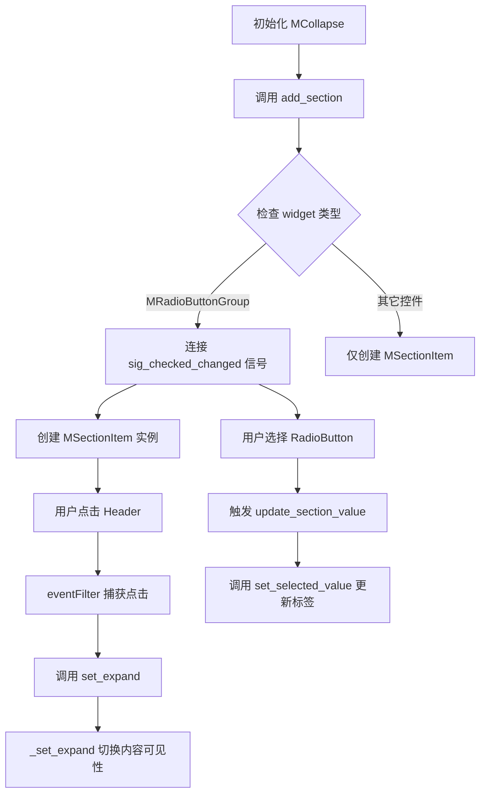

## 类结构

```
QtWidgets.QWidget
├── MSectionItem (继承 QWidget, 混入 property_mixin)
└── MCollapse (继承 QWidget)
```

## 全局变量及字段


### `MSectionItem.sig_context_menu`
    
右键菜单信号

类型：`QtCore.Signal`
    


### `MSectionItem._central_widget`
    
内容控件，用于显示Section的主要内容

类型：`QtWidgets.QWidget`
    


### `MSectionItem.title_label`
    
标题标签，用于显示Section的标题文本

类型：`MLabel`
    


### `MSectionItem.desc_label`
    
描述标签，用于显示Section的描述信息

类型：`MLabel`
    


### `MSectionItem.icon`
    
头像图标，用于显示Section的图标

类型：`MAvatar`
    


### `MSectionItem.expand_icon`
    
展开/收起图标，显示展开或收起状态

类型：`MLabel`
    


### `MSectionItem._close_button`
    
关闭按钮，用于关闭当前Section

类型：`MToolButton`
    


### `MSectionItem.header_widget`
    
头部容器，包含标题、描述、图标等元素

类型：`QtWidgets.QWidget`
    


### `MSectionItem.content_widget`
    
内容容器，用于放置可折叠的内容区域

类型：`QtWidgets.QWidget`
    


### `MSectionItem.selected_value_label`
    
选中值显示标签，显示当前选中的值

类型：`MLabel`
    


### `MCollapse._section_list`
    
section组件列表，存储所有添加的MSectionItem实例

类型：`list`
    


### `MCollapse._main_layout`
    
垂直布局，管理MCollapse中的所有Section

类型：`QtWidgets.QVBoxLayout`
    
    

## 全局函数及方法


### `MSectionItem.__init__`

这是 `MSectionItem` 类的构造函数，负责初始化一个可折叠的段落组件。它创建并布局所有必要的子部件（如标题标签、描述标签、图标、展开/关闭按钮等），设置样式、事件过滤器，并处理传入的初始参数如标题、描述、展开状态和内容 widget。

#### 参数

- `title`：`str`，段落的标题文本，默认为空字符串
- `description`：`str`，段落的描述文本，默认为空字符串
- `expand`：`bool`，段落是否初始展开，默认为 `False`
- `widget`：`QtWidgets.QWidget`，要放入段落内容区域的主部件，默认为 `None`
- `closable`：`bool`，是否显示关闭按钮，默认为 `False`
- `icon`：`str` 或 `None`，头像图标的路径，默认为 `None`
- `parent`：`QtWidgets.QWidget`，父部件，默认为 `None`

#### 返回值

无（构造函数返回 `None`）

#### 流程图

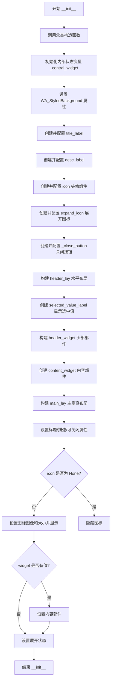

#### 带注释源码

```python
def __init__(self, title="", description="", expand=False, widget=None, closable=False, icon=None, parent=None):
    """
    初始化 MSectionItem 实例。
    
    参数:
        title: 段落标题文本
        description: 段落描述文本
        expand: 是否初始展开
        widget: 内容区域的主部件
        closable: 是否显示关闭按钮
        icon: 头像图标路径
        parent: 父部件
    """
    # 调用父类 QtWidgets.QWidget 的构造函数进行初始化
    super(MSectionItem, self).__init__(parent)

    # 初始化中央部件为 None，表示当前没有设置内容
    self._central_widget = None
    # 设置 WA_StyledBackground 属性，使部件支持样式表背景
    self.setAttribute(QtCore.Qt.WA_StyledBackground)
    
    # 创建标题标签，使用 strong() 样式强调
    self.title_label = MLabel().strong()

    # 创建描述标签，使用 secondary() 样式
    self.desc_label = MLabel().secondary()

    # 创建头像组件，用于显示图标
    self.icon = MAvatar(parent=self)
    # 设置头像的尺寸策略为最小值
    self.icon.setSizePolicy(QtWidgets.QSizePolicy.Minimum, QtWidgets.QSizePolicy.Minimum)

    # 创建展开/收起图标标签
    self.expand_icon = MLabel(parent=self)
    self.expand_icon.setSizePolicy(QtWidgets.QSizePolicy.Minimum, QtWidgets.QSizePolicy.Minimum)

    # 创建关闭按钮，配置为仅显示图标、迷你尺寸、关闭图标
    self._close_button = MToolButton().icon_only().tiny().svg("close_line.svg")
    # 将关闭按钮的 clicked 信号连接到 close 槽函数
    self._close_button.clicked.connect(self.close)

    # 创建头部水平布局
    header_lay = QtWidgets.QHBoxLayout()
    # 将图标添加到头部布局
    header_lay.addWidget(self.icon)

    # 创建文本垂直布局
    self.text_lay = QtWidgets.QVBoxLayout()
    # 将标题标签添加到文本布局
    self.text_lay.addWidget(self.title_label)
    # 设置文本布局的间距为 0
    self.text_lay.setSpacing(0)
    # 设置文本布局的外边距为 0
    self.text_lay.setContentsMargins(0, 0, 0, 0)

    # 将文本布局添加到头部布局
    header_lay.addLayout(self.text_lay)
    # 添加弹性空间，使关闭按钮靠右
    header_lay.addStretch()
    # 添加展开图标到头部布局
    header_lay.addWidget(self.expand_icon)
    # 添加关闭按钮到头部布局
    header_lay.addWidget(self._close_button)

    # 添加一个用于显示选中值的新标签
    self.selected_value_label = MLabel().secondary()
    # 设置选中值标签右对齐和垂直居中
    self.selected_value_label.setAlignment(QtCore.Qt.AlignRight | QtCore.Qt.AlignVCenter)
    # 在关闭按钮之前插入选中值标签
    header_lay.insertWidget(header_lay.count() - 2, self.selected_value_label)

    # 创建头部部件
    self.header_widget = QtWidgets.QWidget(parent=self)
    # 设置样式背景属性
    self.header_widget.setAttribute(QtCore.Qt.WA_StyledBackground)
    # 设置对象名称为 "title"
    self.header_widget.setObjectName("title")
    # 设置头部部件的布局
    self.header_widget.setLayout(header_lay)
    # 设置头部部件的尺寸策略
    self.header_widget.setSizePolicy(QtWidgets.QSizePolicy.Minimum, QtWidgets.QSizePolicy.Minimum)
    # 设置头部部件的光标为手型
    self.header_widget.setCursor(QtCore.Qt.PointingHandCursor)
    # 设置标题标签的光标为手型
    self.title_label.setCursor(QtCore.Qt.PointingHandCursor)
    # 安装事件过滤器，用于处理点击事件
    self.header_widget.installEventFilter(self)
    self.title_label.installEventFilter(self)

    # 创建内容部件
    self.content_widget = QtWidgets.QWidget(parent=self)
    # 创建内容水平布局
    self.content_layout = QtWidgets.QHBoxLayout()
    # 设置内容部件的布局
    self.content_widget.setLayout(self.content_layout)

    # 创建主垂直布局
    self.main_lay = QtWidgets.QVBoxLayout()
    # 设置主布局的外边距为 0
    self.main_lay.setContentsMargins(0, 0, 0, 0)
    # 设置主布局的间距为 0
    self.main_lay.setSpacing(0)
    # 将头部部件添加到主布局
    self.main_lay.addWidget(self.header_widget)
    # 将内容部件添加到主布局
    self.main_lay.addWidget(self.content_widget)
    # 设置当前部件的布局为主布局
    self.setLayout(self.main_lay)
    # 设置尺寸策略：水平扩展，垂直最小
    self.setSizePolicy(QtWidgets.QSizePolicy.Expanding, QtWidgets.QSizePolicy.Minimum)
    # 启用鼠标追踪
    self.setMouseTracking(True)
    
    # 设置标题、描述、可关闭属性（会触发对应的 setter 方法）
    self.set_title(title)
    self.set_description(description)
    self.set_closable(closable)

    # 如果提供了图标，则设置并显示图标
    if icon is not None:
        self.icon.set_dayu_image(icon)
        self.icon.set_dayu_size(dayu_theme.small)
        self.icon.setVisible(True)
    else:
        # 如果没有提供图标，则隐藏图标
        self.icon.setVisible(False)

    # 如果提供了 widget，则设置内容部件
    if widget:
        self.set_content(widget)
    # 设置展开状态
    self.set_expand(expand)
```


### `MSectionItem.set_content`

设置或替换MSectionItem的内容区域部件。该方法负责将新的Widget添加到内容布局中，并管理旧Widget的清理工作。

参数：

- `widget`：`QtWidgets.QWidget`，需要设置到内容区域的Widget对象

返回值：`None`，无返回值

#### 流程图

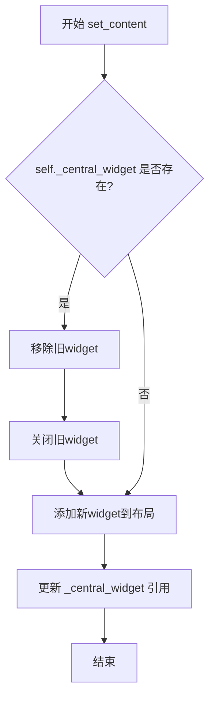

#### 带注释源码

```
def set_content(self, widget):
    """
    设置内容区域的Widget
    
    参数:
        widget: QtWidgets.QWidget类型，要设置为内容的Widget对象
    返回:
        None
    """
    # 检查是否已有内容Widget存在
    if self._central_widget:
        # 从布局中移除旧的Widget
        self.content_layout.removeWidget(self._central_widget)
        # 关闭旧Widget以释放资源
        self._central_widget.close()
    
    # 将新Widget添加到内容布局
    self.content_layout.addWidget(widget)
    # 更新内部保存的Central Widget引用
    self._central_widget = widget
```


### `MSectionItem.get_content`

该方法是一个简单的访问器，用于获取当前设置在折叠面板内容区域的小部件引用。

参数：无需参数（仅包含隐式参数 `self`）

返回值：`QtWidgets.QWidget | None`，返回当前设置在内容区域的小部件，如果未设置任何小部件则返回 `None`

#### 流程图

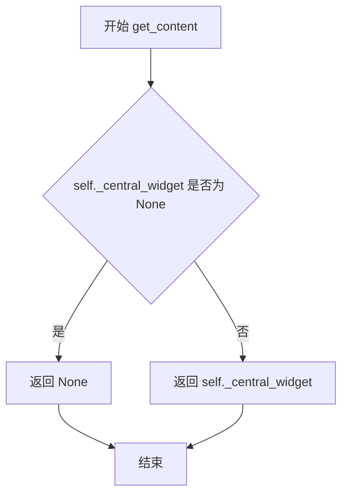

#### 带注释源码

```python
def get_content(self):
    """
    获取当前设置在内容区域的小部件。
    
    该方法是一个简单的访问器（getter），返回在 MSectionItem 中
    通过 set_content() 方法设置的小部件。
    
    Returns:
        QtWidgets.QWidget or None: 当前内容区域的小部件，
                                   如果未通过 set_content() 设置则返回 None
    """
    return self._central_widget
```


### `MSectionItem.set_closable`

设置 MSectionItem 组件的可关闭状态，通过 Qt 的 property 机制设置 "closable" 属性，配合 property_mixin 装饰器会自动触发内部方法调整关闭按钮和内容区域的可见性。

参数：

- `value`：`bool`，指定 section item 是否可关闭，True 为可关闭（显示关闭按钮），False 为不可关闭

返回值：`None`，无返回值

#### 流程图

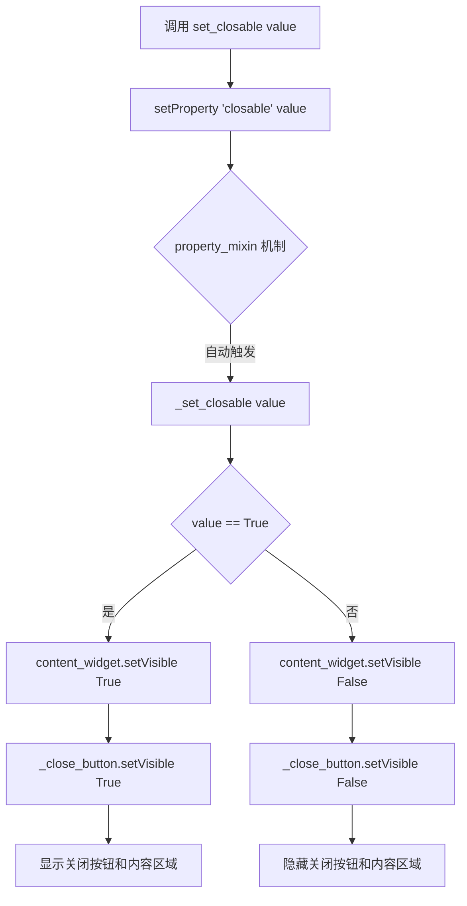

#### 带注释源码

```python
def set_closable(self, value):
    """
    设置 section item 的可关闭状态
    
    该方法通过 Qt 的 setProperty 机制设置 'closable' 属性，
    配合 @property_mixin 装饰器会自动调用 _set_closable 方法
    来实际控制 UI 元素的显示隐藏
    
    参数:
        value: bool, True 表示可关闭（显示关闭按钮和内容区域），
               False 表示不可关闭
    """
    # 使用 Qt 的 property 机制设置属性值
    # property_mixin 会拦截属性变化并调用对应的 _set_closable 方法
    self.setProperty("closable", value)
```


### `MSectionItem._set_closable`

该方法用于设置 MSectionItem 组件的关闭按钮和内容区域的可见性，根据传入的布尔值控制分段项是否可关闭。

参数：

- `value`：`bool`，表示是否可关闭，True 时显示关闭按钮和内容区域，False 时隐藏

返回值：`None`，无返回值

#### 流程图

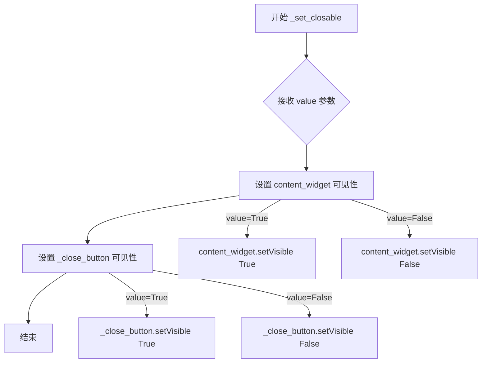

#### 带注释源码

```python
def _set_closable(self, value):
    """
    设置组件的关闭状态
    
    参数:
        value: bool - True 表示可关闭（显示关闭按钮和内容区域），
                   False 表示不可关闭（隐藏关闭按钮和内容区域）
    """
    
    # 根据 value 值设置内容区域的可见性
    # 当 value 为 True 时显示内容区域，为 False 时隐藏
    self.content_widget.setVisible(value)
    
    # 根据 value 值设置关闭按钮的可见性
    # 当 value 为 True 时显示关闭按钮，为 False 时隐藏
    self._close_button.setVisible(value)
```


### `MSectionItem.set_expand`

该方法用于设置MSectionItem组件的展开/折叠状态，通过Qt属性系统触发属性变更，进而控制内容区域的显示隐藏以及展开图标的切换。

参数：

- `value`：`bool`，布尔值，True表示展开状态，False表示折叠状态

返回值：`None`，无返回值（setProperty方法本身无返回值）

#### 流程图

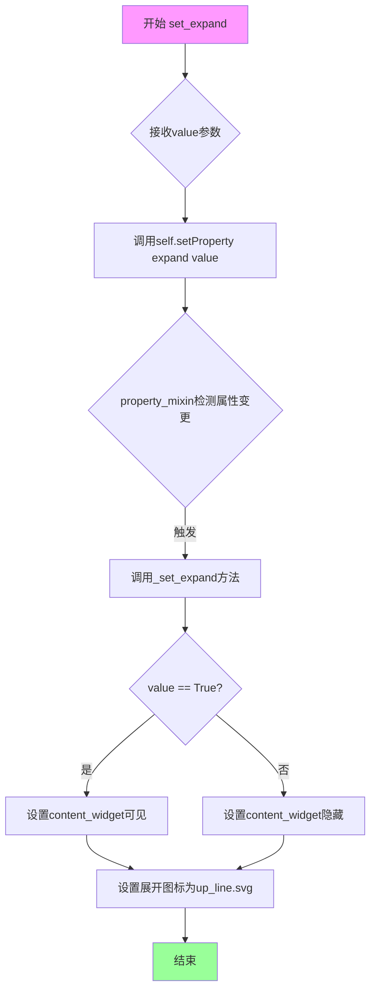

#### 带注释源码

```python
def set_expand(self, value):
    """
    设置组件的展开/折叠状态。
    
    该方法通过Qt的属性系统设置'expand'属性值。
    property_mixin装饰器会拦截属性变更，自动调用对应的_set_expand方法
    来执行实际的UI更新逻辑。
    
    参数:
        value (bool): True表示展开状态, False表示折叠状态
        
    返回值:
        None
    """
    # 调用Qt的setProperty方法设置expand属性
    # property_mixin会监听属性变化并自动调用_set_expand
    self.setProperty("expand", value)
```


### `MSectionItem._set_expand`

该方法是 MSectionItem 类的属性 setter，用于根据传入的布尔值控制内容区域的显示与隐藏，并通过切换展开/收起图标提供视觉反馈，实现折叠面板的展开收起功能。

参数：

- `value`：`bool`，表示展开状态，True 为展开，False 为收起

返回值：`None`，无返回值，仅执行副作用操作

#### 流程图

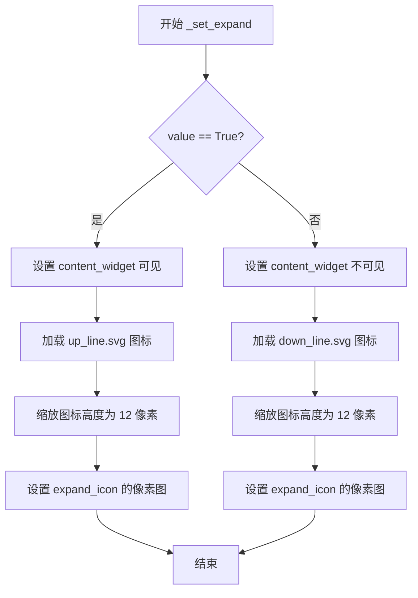

#### 带注释源码

```python
def _set_expand(self, value):
    """
    设置内容区域的展开/收起状态
    
    参数:
        value: bool - True 表示展开内容区域并显示向上箭头图标，
                     False 表示收起内容区域并显示向下箭头图标
    """
    
    # 根据 value 值设置内容widget的可见性
    # True: 显示内容区域; False: 隐藏内容区域
    self.content_widget.setVisible(value)
    
    # 根据展开状态选择对应的图标文件
    # 展开状态(up): 使用 up_line.svg 图标
    # 收起状态(down): 使用 down_line.svg 图标
    icon_name = "up_line.svg" if value else "down_line.svg"
    
    # 创建像素图对象并缩放到高度为 12 像素
    # 保持图标一致性，适应 UI 设计规范
    self.expand_icon.setPixmap(
        MPixmap(icon_name).scaledToHeight(12)
    )
```


### `MSectionItem.set_title`

设置折叠面板条目的标题文字。该方法通过Qt属性机制设置标题值，实际的文本更新由对应的私有方法 `_set_title` 完成。

参数：

-  `value`：`str`，要设置的标题文本内容

返回值：`None`，无返回值（该方法通过Qt属性机制触发后续更新）

#### 流程图

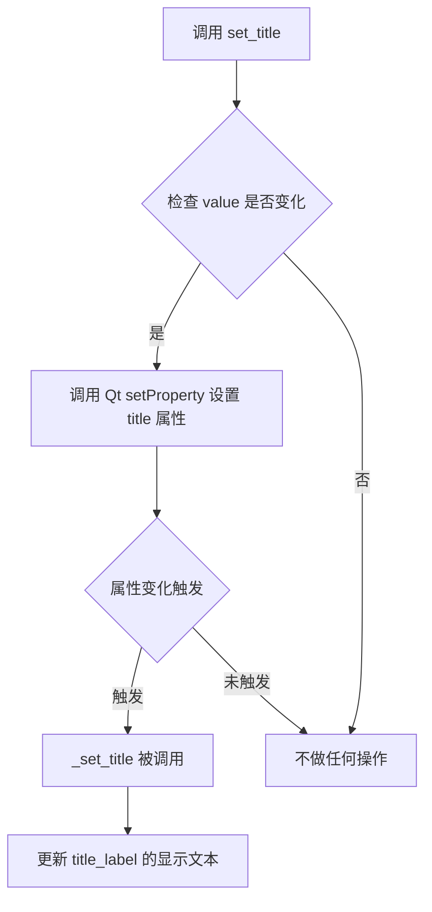

#### 带注释源码

```
def set_title(self, value):
    """
    设置折叠面板条目的标题
    
    该方法通过Qt的属性机制(property)来设置标题值。
    当属性值发生变化时，会自动触发对应的私有方法 _set_title
    来完成实际的用户界面更新。这种设计实现了数据与显示的分离。
    
    参数:
        value: str, 新的标题文本内容
    """
    # 使用Qt的属性系统设置title属性
    # 这会自动触发与该属性关联的更新逻辑
    self.setProperty("title", value)
```

#### 相关联的私有方法

```
def _set_title(self, value):
    """
    set_title 的实际实现方法，由Qt属性系统自动调用
    
    参数:
        value: str, 要设置的标题文本
    """
    # 直接设置标题标签的显示文本
    self.title_label.setText(value)
```


### `MSectionItem._set_title`

该方法是 `MSectionItem` 类的私有方法，作为 `title` 属性的Setter实现，用于更新界面中标题标签的显示文本。当通过 `set_title()` 方法设置 `title` 属性时，此方法会被自动调用，直接操作 `title_label` 控件设置文本内容。

参数：

- `value`：`str`，要设置的标题文本内容

返回值：`None`，无返回值（该方法直接修改对象内部状态）

#### 流程图

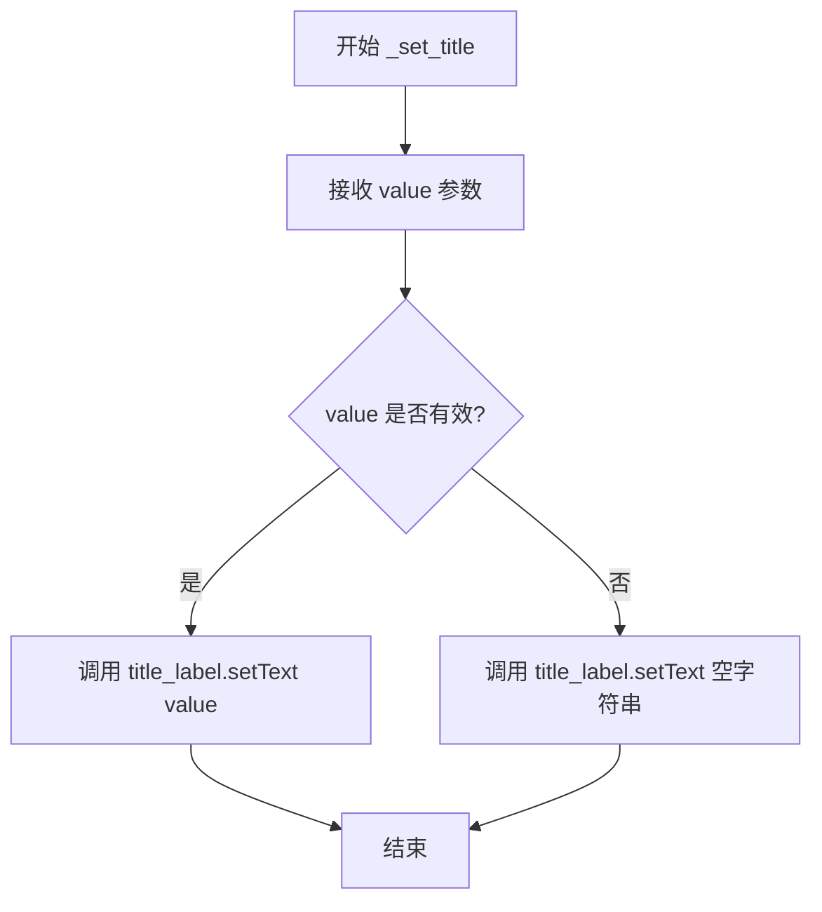

#### 带注释源码

```python
def _set_title(self, value):
    """
    设置标题标签的文本内容
    
    这是 title 属性的内部 setter 方法，由 property_mixin 装饰器自动调用。
    当通过 set_title() 或直接设置 self.title 属性时，此方法会被触发。
    
    参数:
        value: str, 要显示的标题文本
    返回:
        None
    """
    # 将传入的 value 设置到 title_label 标签的文本上
    # title_label 是 MLabel 类型的强样式标签
    self.title_label.setText(value)
```


### `MSectionItem.set_description`

该方法用于设置 MSectionItem 组件的描述文本，通过 Qt 属性机制触发私有方法 `_set_description` 的执行，最终更新描述标签的显示内容并管理其在布局中的显示状态。

参数：

-  `value`：`str`，新的描述文本内容

返回值：`None`，该方法通过 Qt 属性机制设置值，不直接返回值

#### 流程图

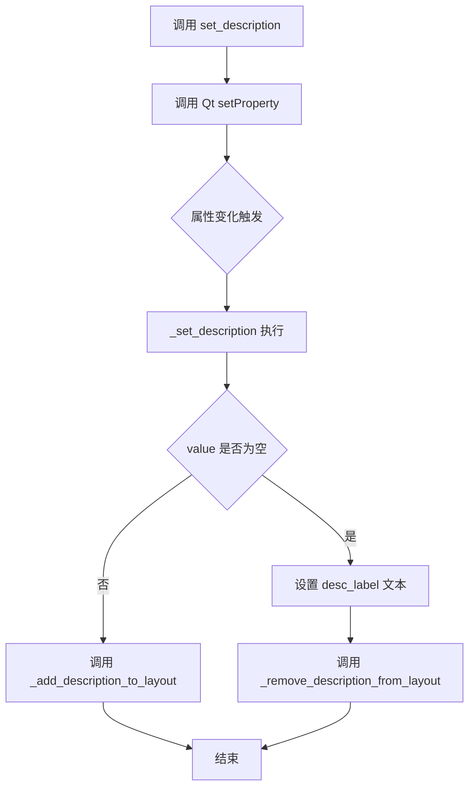

#### 带注释源码

```python
def set_description(self, value):
    """
    设置描述文本
    
    该方法通过 Qt 的属性机制设置描述属性值，
    会自动触发 _set_description 私有方法的执行
    
    参数:
        value: str, 新的描述文本内容
    """
    # 调用 Qt 的 setProperty 方法设置属性
    # 这会触发 property_mixin 装饰器包装的 setter
    # 最终调用 _set_description 方法
    self.setProperty("description", value)
```


### `MSectionItem._set_description`

该方法用于设置分段项的描述文本，并根据描述内容是否为空来动态管理描述标签在布局中的显示状态。

参数：

- `value`：`str`，要设置的描述文本内容

返回值：`None`，该方法没有返回值

#### 流程图

```mermaid
flowchart TD
    A[接收 value 参数] --> B[设置 desc_label 的文本为 value]
    B --> C{value 是否为真值?}
    C -->|是 (非空字符串)| D[调用 _add_description_to_layout]
    C -->|否 (空字符串)| E[调用 _remove_description_from_layout]
    D --> F[结束]
    E --> F
```

#### 带注释源码

```python
def _set_description(self, value):
    """
    设置分段项的描述文本
    
    参数:
        value: str, 新的描述文本内容
    返回:
        None
    """
    # 将传入的值设置为描述标签的文本
    self.desc_label.setText(value)
    
    # 判断描述文本是否有效（非空）
    if value:
        # 如果描述文本有效，则将描述标签添加到布局中
        self._add_description_to_layout()
    else:
        # 如果描述文本为空，则从布局中移除描述标签
        self._remove_description_from_layout()
```


### `MSectionItem._add_description_to_layout`

该方法用于将描述标签（desc_label）添加到文本布局管理器（text_lay）中，前提是描述标签当前不在该布局的子控件列表中。

参数：

- `self`：实例本身，无需显式传递

返回值：`None`，无返回值（Python 中默认返回 None）

#### 流程图

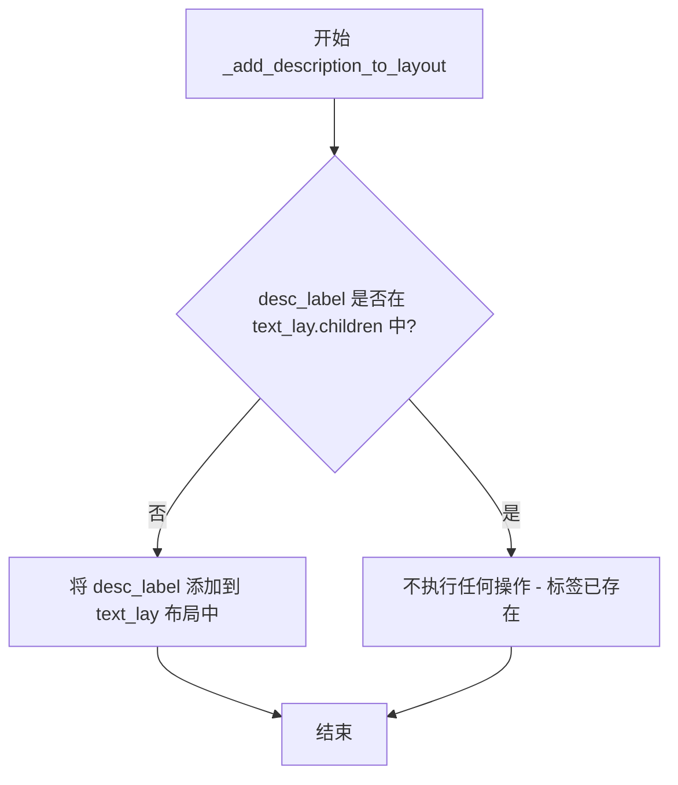

#### 带注释源码

```python
def _add_description_to_layout(self):
    """
    将描述标签添加到文本布局中。
    
    该方法检查描述标签是否已经存在于 text_lay 布局的子控件中，
    如果不存在，则将其添加到布局中。这样可以避免重复添加同一个控件。
    """
    # 检查描述标签是否已经是 text_lay 的子控件
    if self.desc_label not in self.text_lay.children():
        # 如果不在子控件列表中，则将其添加到布局中
        self.text_lay.addWidget(self.desc_label)
```


### `MSectionItem._remove_description_from_layout`

从布局中移除描述标签（desc_label），如果描述标签存在于文本布局（text_lay）的子组件中，则将其从布局中移除并解除父子关系。

参数：

- 无

返回值：`None`，无返回值

#### 流程图

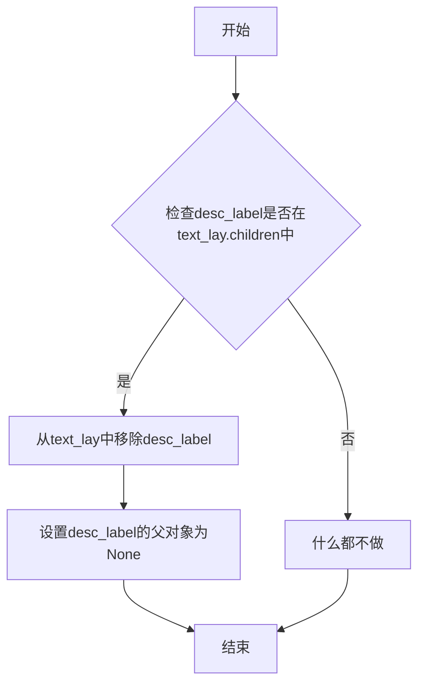

#### 带注释源码

```python
def _remove_description_from_layout(self):
    """
    从布局中移除描述标签。
    如果描述标签存在于文本布局的子组件中，则将其移除。
    """
    # 检查描述标签是否在文本布局的子组件中
    if self.desc_label in self.text_lay.children():
        # 从布局中移除小部件
        self.text_lay.removeWidget(self.desc_label)
        # 解除父子关系，使desc_label不再受该布局管理
        self.desc_label.setParent(None)
```


### `MSectionItem.eventFilter`

该方法是一个事件过滤器，用于拦截并处理标题栏和标题标签的鼠标点击事件，当用户点击时切换折叠面板的展开/收起状态。

参数：

- `widget`：`PySide6.QtCore.QObject`，被过滤事件的组件对象
- `event`：`PySide6.QtCore.QEvent`，Qt事件对象，包含事件类型和相关数据

返回值：`bool`，返回父类事件过滤器的处理结果，表示事件是否被处理

#### 流程图

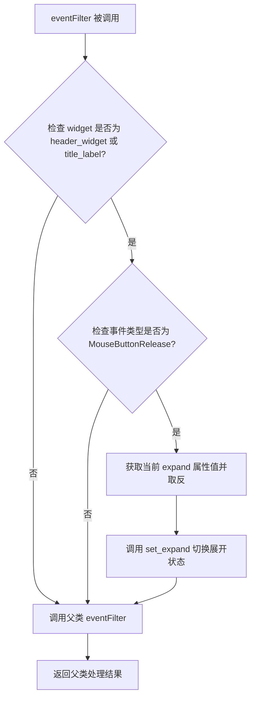

#### 带注释源码

```python
def eventFilter(self, widget, event):
    """
    事件过滤器，处理 header_widget 和 title_label 的鼠标点击事件。
    
    当用户点击标题区域时，切换折叠面板的展开/收起状态。
    
    参数:
        widget: 产生事件的 Qt 组件对象
        event: Qt 事件对象，包含事件类型和数据
        
    返回:
        bool: 父类事件过滤器的返回结果
    """
    # 检查事件是否来自标题栏或标题标签
    if widget in [self.header_widget, self.title_label]:
        # 检查是否为鼠标释放事件（点击完成）
        if event.type() == QtCore.QEvent.MouseButtonRelease:
            # 获取当前展开状态的相反值并设置
            # 如果当前是展开的，则切换为收起；反之亦然
            self.set_expand(not self.property("expand"))
    
    # 调用父类的事件过滤器，确保事件能被正常传递和处理
    return super(QtWidgets.QWidget, self).eventFilter(widget, event)
```


### `MSectionItem.set_selected_value`

该方法用于设置当前MSectionItem组件的选中值显示，通过将传入的值转换为文本并显示在右侧的标签上，常与MRadioButtonGroup配合使用以展示用户选择的选项。

参数：
- `value`：`str`，需要显示的选中值文本内容

返回值：`None`，该方法无返回值

#### 流程图

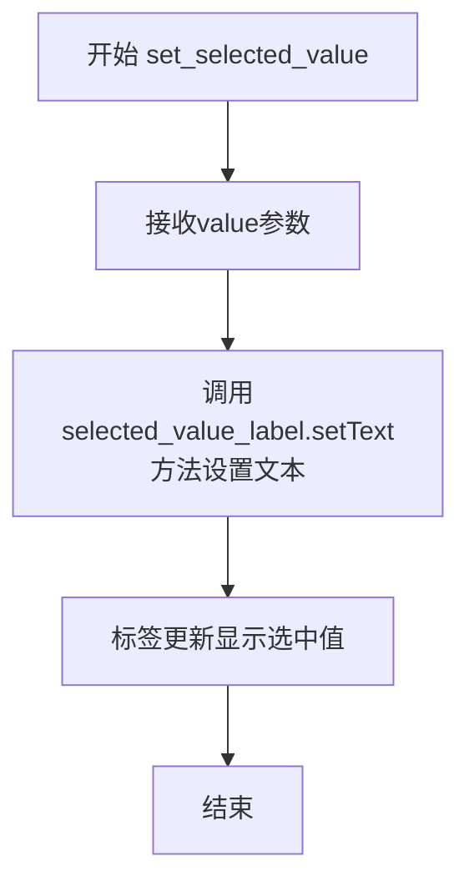

#### 带注释源码

```python
def set_selected_value(self, value):
    """
    设置选中值的显示文本
    
    该方法通常与MRadioButtonGroup配合使用，当用户选择某个选项后，
    会调用此方法将选中的值显示在section item的右侧标签上
    
    参数:
        value: str - 要显示的选中值文本
    返回:
        None
    """
    # 将传入的值设置为标签的显示文本
    # selected_value_label是一个MLabel组件，位于header的右侧
    self.selected_value_label.setText(value)
```


### `MCollapse.__init__`

这是 `MCollapse` 类的构造函数，用于初始化一个可折叠的分区容器控件。

参数：

- `parent`：`QtWidgets.QWidget` 或 `None`，父控件，默认为 `None`

返回值：`None`，构造函数无返回值

#### 流程图

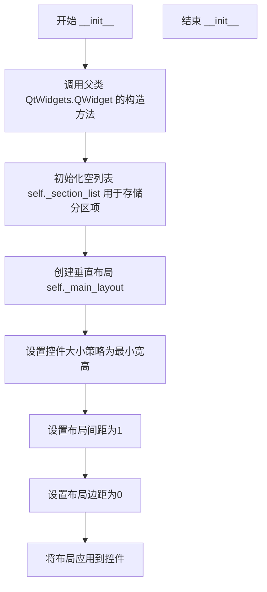

#### 带注释源码

```python
def __init__(self, parent=None):
    # 调用父类 QtWidgets.QWidget 的构造函数
    # parent 参数指定父控件，用于建立 Qt 对象父子关系
    super(MCollapse, self).__init__(parent)
    
    # 初始化一个空列表，用于存储所有的分区项（MSectionItem）
    self._section_list = []
    
    # 创建一个垂直布局管理器，用于排列各个分区项
    self._main_layout = QtWidgets.QVBoxLayout()
    
    # 设置控件的大小策略为最小宽高
    # Minimum 表示控件会根据内容调整到最小所需尺寸
    self.setSizePolicy(QtWidgets.QSizePolicy.Minimum, QtWidgets.QSizePolicy.Minimum)
    
    # 设置垂直布局中各分区项之间的间距为1像素
    self._main_layout.setSpacing(1)
    
    # 设置布局的四周外边距为0，即紧贴控件边缘
    self._main_layout.setContentsMargins(0, 0, 0, 0)
    
    # 将创建好的垂直布局应用到当前控件
    self.setLayout(self._main_layout)
```


### `MCollapse.add_section`

该方法用于向折叠面板组件中添加一个新的可折叠部分，接收包含标题、描述、图标、内容部件等信息的字典，根据配置创建对应的 `MSectionItem` 对象并添加到布局中，同时处理与单选按钮组的联动以及默认选中值的设置。

**参数：**

- `section_data`：`dict`，包含片段配置信息的字典，必须包含以下键值对：
  - `title`：字符串，片段的标题文本
  - `expand`：布尔值（可选），初始是否展开，默认为 `False`
  - `widget`：QtWidgets.QWidget（可选），片段的内容部件
  - `closable`：布尔值（可选），是否显示关闭按钮，默认为 `False`
  - `icon`：字符串（可选），图标路径
  - `description`：字符串（可选），描述文本
  - `default_selection`：元组（可选），默认选中项，格式为 `(id, string)`

**返回值：**`MSectionItem`，返回创建的片段部件对象

#### 流程图

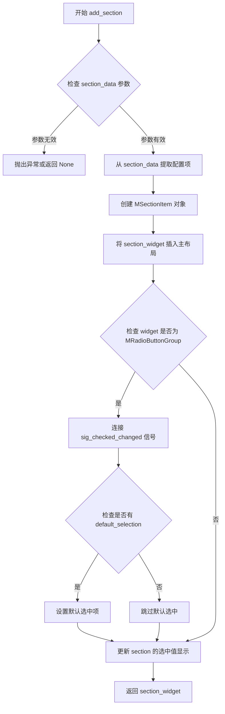

#### 带注释源码

```python
def add_section(self, section_data):
    # 使用 section_data 字典中的配置项创建 MSectionItem 对象
    # title: 标题文本
    # expand: 初始展开状态，默认为 False
    # widget: 内容部件，可为任意 Qt 控件
    # closable: 是否显示关闭按钮，默认为 False
    # icon: 头像图标路径
    # description: 描述文本
    section_widget = MSectionItem(
        title=section_data.get("title"),
        expand=section_data.get("expand", False),
        widget=section_data.get("widget"),
        closable=section_data.get("closable", False),
        icon=section_data.get("icon"),
        description=section_data.get("description")
    )
    # 将新创建的片段部件插入到主布局的末尾
    # insertWidget 参数：位置索引（count() 返回当前部件数量）
    self._main_layout.insertWidget(self._main_layout.count(), section_widget)

    # 检查内容部件是否为 MRadioButtonGroup（单选按钮组）
    # 如果是，则需要监听选中状态变化以更新显示的选中值
    if isinstance(section_data.get("widget"), MRadioButtonGroup):
        radio_group = section_data["widget"]
        # 连接选中状态变化信号，当选中项改变时更新 section 的选中值显示
        # lambda 参数：index-选中索引, text-选中项文本
        radio_group.sig_checked_changed.connect(
            lambda index, text: self.update_section_value(section_widget, text)
        )
        
        # 检查是否配置了默认选中项
        # default_selection 格式：(id, string) 元组
        default_selection = section_data.get("default_selection")
        if default_selection is not None:
            # 设置默认选中状态
            id, string = default_selection
            radio_group.set_dayu_checked(id, string)
            # 获取默认选中的按钮并更新 section 的选中值显示
            default_button = radio_group.get_button_group().button(id)
            if default_button:
                self.update_section_value(section_widget, default_button.text())

    # 返回创建的片段部件，供调用者使用
    return section_widget
```


### `MCollapse.update_section_value`

该方法用于更新折叠面板中指定分区的选中值显示，通过调用目标分区组件的`set_selected_value`方法将选中的文本内容展示在分区标题栏上。

参数：

- `section_widget`：`MSectionItem`，目标分区组件对象，指定需要更新值的分区
- `text`：`str`，选中的文本值，将在分区标题栏上显示

返回值：`None`，无返回值，仅执行值更新操作

#### 流程图

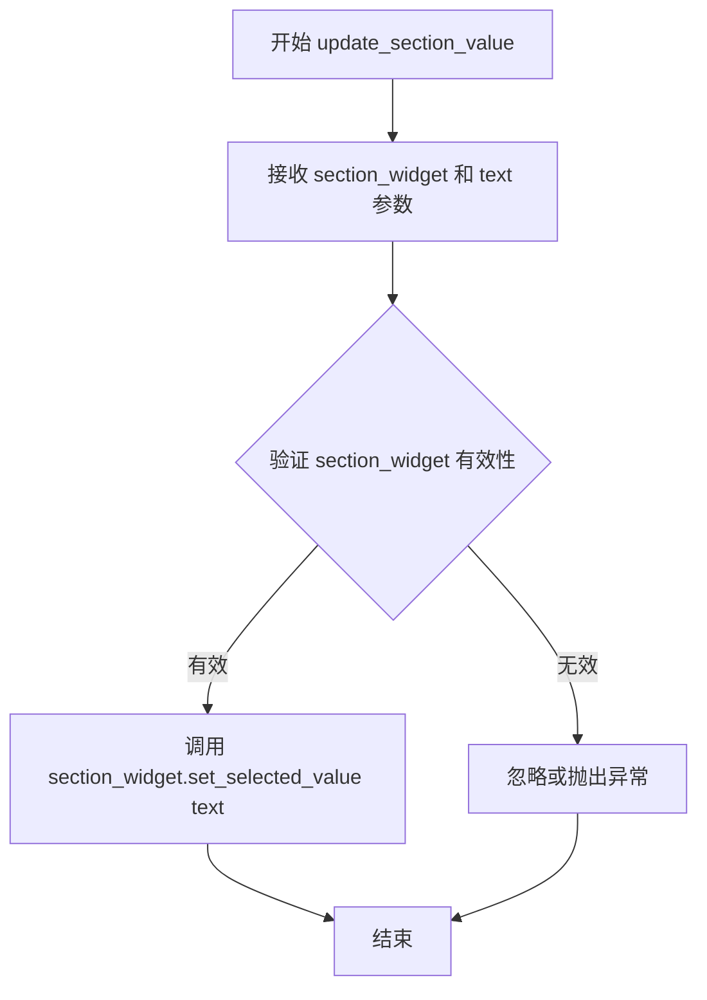

#### 带注释源码

```python
def update_section_value(self, section_widget, text):
    """
    更新指定分区的选中值显示
    
    Args:
        section_widget: MSectionItem类型，目标分区组件对象
        text: str类型，要显示的选中值文本
    
    Returns:
        None: 无返回值，直接修改组件状态
    """
    # 调用分区组件的set_selected_value方法更新显示文本
    # 该方法会设置selected_value_label的文本内容
    section_widget.set_selected_value(text)
```


### `MCollapse.add_section_list`

该方法用于批量添加多个折叠面板 section 项到 MCollapse 组件中。它遍历传入的 section 列表，为每个 section 数据调用 add_section 方法创建对应的 UI 组件，并将关闭按钮与移除逻辑绑定，最后将创建的 section 组件添加到内部列表中进行管理。

参数：

- `section_list`：`list`，包含多个字典的列表，每个字典代表一个 section 的配置数据，字典键包括 title（标题）、expand（是否展开）、widget（内容 widget）、closable（是否可关闭）、icon（图标）、description（描述）、default_selection（默认选中项）等

返回值：`None`，该方法无返回值，仅执行副作用（添加 UI 组件）

#### 流程图

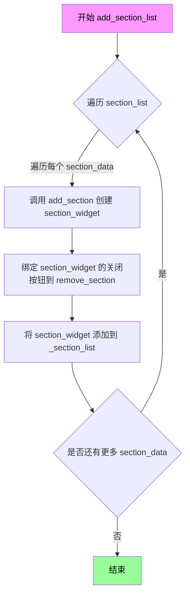

#### 带注释源码

```python
def add_section_list(self, section_list):
    """
    批量添加多个折叠面板 section 项
    
    参数:
        section_list: 列表，包含多个字典，每个字典配置一个 section
                     字典键: title, expand, widget, closable, icon, description, default_selection
    
    返回:
        None
    """
    # 遍历传入的 section 列表
    for section_data in section_list:
        # 调用 add_section 方法创建 MSectionItem 组件
        # 返回创建好的 section_widget 对象
        section_widget = self.add_section(section_data)
        
        # 将该 section 的关闭按钮点击信号连接到 remove_section 槽函数
        # 使用 functools.partial 绑定当前 section_widget 作为参数
        # 这样点击关闭按钮时会移除对应的 section
        section_widget._close_button.clicked.connect(
            functools.partial(self.remove_section, section_widget)
        )
        
        # 将创建好的 section_widget 添加到内部列表进行管理
        # _section_list 用于追踪所有已添加的 section 组件
        self._section_list.append(section_widget)
```


### `MCollapse.remove_section`

从折叠面板中移除指定的章节部件，并更新内部章节列表。

参数：

- `widget`：`QtWidgets.QWidget`，需要移除的章节部件对象，对应之前通过 `add_section` 或 `add_section_list` 添加的 `MSectionItem` 实例

返回值：`None`，该方法不返回任何值，仅执行副作用操作（修改内部列表）

#### 流程图

```mermaid
flowchart TD
    A[开始 remove_section] --> B{检查 widget 是否在列表中}
    B -->|在列表中| C[从 _section_list 中移除 widget]
    C --> D[方法结束]
    B -->|不在列表中| E[抛出 ValueError 异常]
    E --> D
```

#### 带注释源码

```python
def remove_section(self, widget):
    """
    移除折叠面板中指定的章节部件
    
    参数:
        widget: QtWidgets.QWidget, 需要移除的章节部件对象
                应该是通过 add_section 或 add_section_list 添加的 MSectionItem 实例
    
    返回值:
        None
    
    注意:
        该方法仅从内部列表中移除部件引用，
        不会自动从布局中移除或销毁部件对象。
        如需完全移除，建议先调用 _main_layout.removeWidget(widget)
    """
    self._section_list.remove(widget)
```


### `MCollapse.sections`

获取当前折叠面板中所有添加的章节项（MSectionItem）的列表。

参数：

- （无参数）

返回值：`List[MSectionItem]`，返回当前折叠面板中所有章节项对象的列表

#### 流程图

```mermaid
flowchart TD
    A[调用 sections 方法] --> B{返回列表}
    B --> C[返回 self._section_list]
    C --> D[包含所有 MSectionItem 实例的列表]
```

#### 带注释源码

```python
def sections(self):
    """
    获取当前折叠面板中所有章节项的列表。
    
    返回:
        list: 包含所有 MSectionItem 实例的列表
    """
    return self._section_list
```


### `MCollapse.clear`

该方法用于清空MCollapse容器中的所有折叠区块，通过遍历内部维护的section列表，逐个从布局中移除并销毁widget对象。

参数：
- 该方法无显式参数（隐含self参数）

返回值：`None`，无返回值

#### 流程图

```mermaid
flowchart TD
    A[开始 clear] --> B{self._section_list 是否为空}
    B -->|否| C[取出第一个 widget]
    C --> D[调用 self._main_layout.removeWidget(widget)]
    D --> E[执行 del widget 删除对象]
    E --> B
    B -->|是| F[结束 clear]
```

#### 带注释源码

```python
def clear(self):
    """
    清空MCollapse容器中的所有折叠区块。
    
    该方法会遍历内部维护的section列表(_section_list)，
    将每个section widget从主布局中移除，并销毁widget对象以释放资源。
    """
    # 遍历所有已添加的section widget
    for widget in self._section_list:
        # 从QVBoxLayout布局中移除widget（不再显示）
        self._main_layout.removeWidget(widget)
        # 删除widget对象，释放内存
        del widget
```

## 关键组件


### MSectionItem

单个可折叠section项的UI组件，封装了标题、描述、图标、内容区域、展开/收起状态和关闭按钮，提供完整的交互功能。

### MCollapse

折叠容器管理器，负责管理多个MSectionItem的添加、删除和布局，支持批量添加section列表，提供section列表的清理功能。

### 属性混入系统 (property_mixin)

通过装饰器模式自动为类生成setter/getter方法，实现属性的响应式设置与获取，简化UI组件的属性管理。

### 事件过滤机制

通过eventFilter捕获鼠标点击事件，实现点击标题栏或标题文本时切换展开/收起状态，提供流畅的交互体验。

### 选中值显示

在section标题栏右侧动态显示当前选中的值，通过selected_value_label组件展示，适用于与MRadioButtonGroup联动显示选中项。

### 动态内容管理

支持运行时动态设置和更换content widget，自动处理旧widget的移除和新widget的添加，确保内容区域始终保持最新状态。

### 关闭按钮功能

提供可配置的closable属性，控制关闭按钮的可见性，关闭时仅隐藏内容区域而不真正删除widget。

### MRadioButtonGroup联动

与单选按钮组集成，监听sig_checked_changed信号自动更新section的选中值显示，支持默认值设置和初始化。


## 问题及建议


### 已知问题

-   **default_selection 解包顺序错误**：在 `add_section` 方法中，先对 `default_selection` 进行解包 `id, string = default_selection`，然后才判断是否为 `None`，当 `default_selection` 为 `None` 时会导致 `TypeError: cannot unpack non-iterable NoneType` 错误
-   **Lambda 闭包捕获循环变量**：`add_section` 方法中连接信号时使用 `lambda index, text: self.update_section_value(section_widget, text)`，在循环中创建 lambda 会导致闭包捕获延迟绑定的问题，可能引用错误的 `section_widget`
-   **事件过滤器返回值问题**：`eventFilter` 方法中 `return super(QtWidgets.QWidget, self).eventFilter(widget, event)` 直接使用 `QtWidgets.QWidget` 而不是 `self`，虽然功能上可能工作，但不符合最佳实践
-   **clear 方法内存管理不完整**：`clear` 方法只删除 widget 引用但未断开信号连接，可能导致循环引用和内存泄漏
-   **布局索引依赖脆弱性**：`header_lay.insertWidget(header_lay.count() - 2, self.selected_value_label)` 依赖于当前布局状态，当布局结构变化时可能导致 UI 显示错位

### 优化建议

-   **修复 default_selection 处理逻辑**：先判断是否为 `None`，再进行解包操作
-   **使用默认参数捕获 lambda 变量**：改为 `lambda index, text, sw=section_widget: self.update_section_value(sw, text)` 避免闭包问题
-   **完善 clear 方法**：在删除 widget 前断开所有信号连接，并从 `_section_list` 中清空
-   **统一属性 setter 模式**：考虑直接调用私有方法如 `_set_closable()` 而不是依赖 Qt 属性系统触发
-   **添加文档字符串**：为类和方法添加文档说明，提高代码可维护性
-   **优化资源管理**：考虑添加 `cleanup` 或 `destroyed` 信号处理，确保资源正确释放

## 其它


### 项目概述

本代码实现了一个基于PySide6的可折叠面板组件系统，包含MSectionItem（单个可折叠区块）和MCollapse（多个区块的容器管理）两个核心类，支持标题、描述、图标、内容widget、可关闭和默认展开等功能，适用于配置面板、分组信息展示等场景。

### 整体运行流程

程序启动时，MCollapse作为主容器通过add_section或add_section_list方法接收区块数据，每条数据包含title、description、widget、expand、closable、icon等属性。实例化MSectionItem时，会创建包含图标、标题、描述、展开/关闭图标、关闭按钮的头部区域，以及存放内容widget的内容区域。头部区域安装事件过滤器，响应鼠标点击切换展开状态。若内容widget是MRadioButtonGroup，则监听其sig_checked_changed信号，当选项变更时通过update_section_value更新区块右侧显示的选中值。用户可通过close按钮移除可关闭的区块，也可通过clear方法清空所有区块。

### 类的详细信息

#### MSectionItem类

**类字段（属性）**

| 名称 | 类型 | 描述 |
|------|------|------|
| sig_context_menu | QtCore.Signal | 右键菜单信号 |
| _central_widget | QtWidgets.QWidget或None | 当前显示的内容widget |
| title_label | MLabel | 标题标签 |
| desc_label | MLabel | 描述标签 |
| icon | MAvatar | 图标组件 |
| expand_icon | MLabel | 展开/收起图标 |
| _close_button | MToolButton | 关闭按钮 |
| header_lay | QtWidgets.QHBoxLayout | 头部水平布局 |
| text_lay | QtWidgets.QVBoxLayout | 文本垂直布局 |
| header_widget | QtWidgets.QWidget | 头部容器 |
| content_widget | QtWidgets.QWidget | 内容容器 |
| content_layout | QtWidgets.QHBoxLayout | 内容布局 |
| main_lay | QtWidgets.QVBoxLayout | 主布局 |
| selected_value_label | MLabel | 选中值显示标签 |

**类方法**

**__init__方法**

| 项目 | 详情 |
|------|------|
| 名称 | __init__ |
| 参数 | title: str = "", description: str = "", expand: bool = False, widget: QtWidgets.QWidget = None, closable: bool = False, icon: str = None, parent: QtWidgets.QWidget = None |
| 参数类型 | title: str, description: str, expand: bool, widget: QtWidgets.QWidget, closable: bool, icon: str, parent: QtWidgets.QWidget |
| 参数描述 | title为区块标题，description为区块描述，expand为初始是否展开，widget为内容widget，closable为是否可关闭，icon为图标路径，parent为父widget |
| 返回值类型 | None |
| 返回值描述 | 初始化完成后返回None |

```python
def __init__(self, title="", description="", expand=False, widget=None, closable=False, icon=None, parent=None):
    super(MSectionItem, self).__init__(parent)
    # 初始化中央widget为None
    self._central_widget = None
    # 设置属性以支持QSS样式
    self.setAttribute(QtCore.Qt.WA_StyledBackground)
    # 创建标题标签，使用strong样式
    self.title_label = MLabel().strong()
    # 创建描述标签，使用secondary样式
    self.desc_label = MLabel().secondary()
    # 创建头像组件用于显示图标
    self.icon = MAvatar(parent=self)
    self.icon.setSizePolicy(QtWidgets.QSizePolicy.Minimum, QtWidgets.QSizePolicy.Minimum)
    # 创建展开/收起图标
    self.expand_icon = MLabel(parent=self)
    self.expand_icon.setSizePolicy(QtWidgets.QSizePolicy.Minimum, QtWidgets.QSizePolicy.Minimum)
    # 创建关闭按钮，设置图标为close_line.svg，尺寸为tiny
    self._close_button = MToolButton().icon_only().tiny().svg("close_line.svg")
    # 点击关闭按钮时触发close槽
    self._close_button.clicked.connect(self.close)
    # 创建头部水平布局
    header_lay = QtWidgets.QHBoxLayout()
    # 将图标添加到头部布局
    header_lay.addWidget(self.icon)
    # 创建文本垂直布局
    self.text_lay = QtWidgets.QVBoxLayout()
    # 将标题标签添加到文本布局
    self.text_lay.addWidget(self.title_label)
    # 设置垂直间距为0
    self.text_lay.setSpacing(0)
    # 设置文本布局边距为0
    self.text_lay.setContentsMargins(0, 0, 0, 0)
    # 将文本布局添加到头部布局
    header_lay.addLayout(self.text_lay)
    # 添加弹性空间
    header_lay.addStretch()
    # 将展开图标添加到头部布局
    header_lay.addWidget(self.expand_icon)
    # 将关闭按钮添加到头部布局
    header_lay.addWidget(self._close_button)
    # 创建选中值标签，用于显示当前选中项
    self.selected_value_label = MLabel().secondary()
    # 设置选中值标签右对齐和垂直居中
    self.selected_value_label.setAlignment(QtCore.Qt.AlignRight | QtCore.Qt.AlignVCenter)
    # 在关闭按钮前插入选中值标签
    header_lay.insertWidget(header_lay.count() - 2, self.selected_value_label)
    # 创建头部widget容器
    self.header_widget = QtWidgets.QWidget(parent=self)
    # 设置属性以支持QSS样式
    self.header_widget.setAttribute(QtCore.Qt.WA_StyledBackground)
    # 设置对象名
    self.header_widget.setObjectName("title")
    # 设置头部布局
    self.header_widget.setLayout(header_lay)
    # 设置尺寸策略为最小
    self.header_widget.setSizePolicy(QtWidgets.QSizePolicy.Minimum, QtWidgets.QSizePolicy.Minimum)
    # 设置鼠标指针为手型
    self.header_widget.setCursor(QtCore.Qt.PointingHandCursor)
    self.title_label.setCursor(QtCore.Qt.PointingHandCursor)
    # 安装事件过滤器用于处理点击事件
    self.header_widget.installEventFilter(self)
    self.title_label.installEventFilter(self)
    # 创建内容widget
    self.content_widget = QtWidgets.QWidget(parent=self)
    # 创建内容水平布局
    self.content_layout = QtWidgets.QHBoxLayout()
    self.content_widget.setLayout(self.content_layout)
    # 创建主垂直布局
    self.main_lay = QtWidgets.QVBoxLayout()
    # 设置主布局边距为0
    self.main_lay.setContentsMargins(0, 0, 0, 0)
    # 设置主布局间距为0
    self.main_lay.setSpacing(0)
    # 将头部widget添加到主布局
    self.main_lay.addWidget(self.header_widget)
    # 将内容widget添加到主布局
    self.main_lay.addWidget(self.content_widget)
    # 设置当前布局为主布局
    self.setLayout(self.main_lay)
    # 设置尺寸策略为水平扩展，垂直最小
    self.setSizePolicy(QtWidgets.QSizePolicy.Expanding, QtWidgets.QSizePolicy.Minimum)
    # 启用鼠标追踪
    self.setMouseTracking(True)
    # 设置标题
    self.set_title(title)
    # 设置描述
    self.set_description(description)
    # 设置是否可关闭
    self.set_closable(closable)
    # 如果提供了图标
    if icon is not None:
        # 设置图标图片
        self.icon.set_dayu_image(icon)
        # 设置图标尺寸为主题小
        self.icon.set_dayu_size(dayu_theme.small)
        # 显示图标
        self.icon.setVisible(True)
    else:
        # 隐藏图标
        self.icon.setVisible(False)
    # 如果提供了内容widget
    if widget:
        # 设置内容
        self.set_content(widget)
    # 设置展开状态
    self.set_expand(expand)
```

**set_content方法**

| 项目 | 详情 |
|------|------|
| 名称 | set_content |
| 参数 | widget: QtWidgets.QWidget |
| 参数类型 | widget: QtWidgets.QWidget |
| 参数描述 | 要设置的内容widget |
| 返回值类型 | None |
| 返回值描述 | 设置完成后返回None |

```python
def set_content(self, widget):
    # 如果已存在内容widget
    if self._central_widget:
        # 从布局中移除旧的widget
        self.content_layout.removeWidget(self._central_widget)
        # 关闭旧widget
        self._central_widget.close()
    # 将新widget添加到布局
    self.content_layout.addWidget(widget)
    # 更新当前内容widget引用
    self._central_widget = widget
```

**get_content方法**

| 项目 | 详情 |
|------|------|
| 名称 | get_content |
| 参数 | 无 |
| 参数类型 | 无 |
| 参数描述 | 无 |
| 返回值类型 | QtWidgets.QWidget或None |
| 返回值描述 | 返回当前的内容widget，如果不存在则返回None |

```python
def get_content(self):
    return self._central_widget
```

**set_closable方法**

| 项目 | 详情 |
|------|------|
| 名称 | set_closable |
| 参数 | value: bool |
| 参数类型 | value: bool |
| 参数描述 | 设置区块是否可关闭 |
| 返回值类型 | None |
| 返回值描述 | 设置完成后返回None |

```python
def set_closable(self, value):
    # 设置closable属性（Qt属性系统）
    self.setProperty("closable", value)
```

**_set_closable方法**

| 项目 | 详情 |
|------|------|
| 名称 | _set_closable |
| 参数 | value: bool |
| 参数类型 | value: bool |
| 参数描述 | 实际执行设置可关闭状态的内部方法 |
| 返回值类型 | None |
| 返回值描述 | 设置完成后返回None |

```python
def _set_closable(self, value):
    # 设置内容widget可见性
    self.content_widget.setVisible(value)
    # 设置关闭按钮可见性
    self._close_button.setVisible(value)
```

**set_expand方法**

| 项目 | 详情 |
|------|------|
| 名称 | set_expand |
| 参数 | value: bool |
| 参数类型 | value: bool |
| 参数描述 | 设置区块是否展开 |
| 返回值类型 | None |
| 返回值描述 | 设置完成后返回None |

```python
def set_expand(self, value):
    # 设置expand属性（Qt属性系统）
    self.setProperty("expand", value)
```

**_set_expand方法**

| 项目 | 详情 |
|------|------|
| 名称 | _set_expand |
| 参数 | value: bool |
| 参数类型 | value: bool |
| 参数描述 | 实际执行展开/收起操作的内部方法 |
| 返回值类型 | None |
| 返回值描述 | 设置完成后返回None |

```python
def _set_expand(self, value):
    # 设置内容widget可见性
    self.content_widget.setVisible(value)
    # 更新展开图标，根据value选择up_line.svg或down_line.svg
    self.expand_icon.setPixmap(MPixmap("up_line.svg" if value else "down_line.svg").scaledToHeight(12))
```

**set_title方法**

| 项目 | 详情 |
|------|------|
| 名称 | set_title |
| 参数 | value: str |
| 参数类型 | value: str |
| 参数描述 | 设置区块标题 |
| 返回值类型 | None |
| 返回值描述 | 设置完成后返回None |

```python
def set_title(self, value):
    # 设置title属性（Qt属性系统）
    self.setProperty("title", value)
```

**_set_title方法**

| 项目 | 详情 |
|------|------|
| 名称 | _set_title |
| 参数 | value: str |
| 参数类型 | value: str |
| 参数描述 | 实际执行设置标题的内部方法 |
| 返回值类型 | None |
| 返回值描述 | 设置完成后返回None |

```python
def _set_title(self, value):
    # 设置标题标签文本
    self.title_label.setText(value)
```

**set_description方法**

| 项目 | 详情 |
|------|------|
| 名称 | set_description |
| 参数 | value: str |
| 参数类型 | value: str |
| 参数描述 | 设置区块描述 |
| 返回值类型 | None |
| 返回值描述 | 设置完成后返回None |

```python
def set_description(self, value):
    # 设置description属性（Qt属性系统）
    self.setProperty("description", value)
```

**_set_description方法**

| 项目 | 详情 |
|------|------|
| 名称 | _set_description |
| 参数 | value: str |
| 参数类型 | value: str |
| 参数描述 | 实际执行设置描述的内部方法 |
| 返回值类型 | None |
| 返回值描述 | 设置完成后返回None |

```python
def _set_description(self, value):
    # 设置描述标签文本
    self.desc_label.setText(value)
    # 如果有描述内容
    if value:
        # 添加描述标签到布局
        self._add_description_to_layout()
    else:
        # 从布局移除描述标签
        self._remove_description_from_layout()
```

**_add_description_to_layout方法**

| 项目 | 详情 |
|------|------|
| 名称 | _add_description_to_layout |
| 参数 | 无 |
| 参数类型 | 无 |
| 参数描述 | 无 |
| 返回值类型 | None |
| 返回值描述 | 添加完成后返回None |

```python
def _add_description_to_layout(self):
    # 如果描述标签不在布局中
    if self.desc_label not in self.text_lay.children():
        # 添加到文本布局
        self.text_lay.addWidget(self.desc_label)
```

**_remove_description_from_layout方法**

| 项目 | 详情 |
|------|------|
| 名称 | _remove_description_from_layout |
| 参数 | 无 |
| 参数类型 | 无 |
| 参数描述 | 无 |
| 返回值类型 | None |
| 返回值描述 | 移除完成后返回None |

```python
def _remove_description_from_layout(self):
    # 如果描述标签在布局中
    if self.desc_label in self.text_lay.children():
        # 从布局移除
        self.text_lay.removeWidget(self.desc_label)
        # 设置父对象为None
        self.desc_label.setParent(None)
```

**eventFilter方法**

| 项目 | 详情 |
|------|------|
| 名称 | eventFilter |
| 参数 | widget: QtWidgets.QWidget, event: QtCore.QEvent |
| 参数类型 | widget: QtWidgets.QWidget, event: QtCore.QEvent |
| 参数描述 | widget为事件过滤的widget，event为事件对象 |
| 返回值类型 | bool |
| 返回值描述 | 返回是否处理该事件 |

```python
def eventFilter(self, widget, event):
    # 如果事件来自头部widget或标题标签
    if widget in [self.header_widget, self.title_label]:
        # 如果是鼠标释放事件
        if event.type() == QtCore.QEvent.MouseButtonRelease:
            # 切换展开状态
            self.set_expand(not self.property("expand"))
    # 调用父类的事件过滤器
    return super(QtWidgets.QWidget, self).eventFilter(widget, event)
```

**set_selected_value方法**

| 项目 | 详情 |
|------|------|
| 名称 | set_selected_value |
| 参数 | value: str |
| 参数类型 | value: str |
| 参数描述 | 设置显示的选中值文本 |
| 返回值类型 | None |
| 返回值描述 | 设置完成后返回None |

```python
def set_selected_value(self, value):
    self.selected_value_label.setText(value)
```

#### MCollapse类

**类字段（属性）**

| 名称 | 类型 | 描述 |
|------|------|------|
| _section_list | list | 存储所有区块widget的列表 |
| _main_layout | QtWidgets.QVBoxLayout | 主垂直布局 |

**类方法**

**__init__方法**

| 项目 | 详情 |
|------|------|
| 名称 | __init__ |
| 参数 | parent: QtWidgets.QWidget = None |
| 参数类型 | parent: QtWidgets.QWidget |
| 参数描述 | 父widget |
| 返回值类型 | None |
| 返回值描述 | 初始化完成后返回None |

```python
def __init__(self, parent=None):
    super(MCollapse, self).__init__(parent)
    # 初始化区块列表
    self._section_list = []
    # 创建主垂直布局
    self._main_layout = QtWidgets.QVBoxLayout()
    # 设置尺寸策略为最小
    self.setSizePolicy(QtWidgets.QSizePolicy.Minimum, QtWidgets.QSizePolicy.Minimum)
    # 设置布局间距为1
    self._main_layout.setSpacing(1)
    # 设置布局边距为0
    self._main_layout.setContentsMargins(0, 0, 0, 0)
    # 设置当前布局
    self.setLayout(self._main_layout)
```

**add_section方法**

| 项目 | 详情 |
|------|------|
| 名称 | add_section |
| 参数 | section_data: dict |
| 参数类型 | section_data: dict |
| 参数描述 | 包含title、description、widget、expand、closable、icon、default_selection等键的字典 |
| 返回值类型 | MSectionItem |
| 返回值描述 | 返回创建的区块widget |

```python
def add_section(self, section_data):
    # 从section_data获取各项参数创建MSectionItem
    section_widget = MSectionItem(
        title=section_data.get("title"),
        expand=section_data.get("expand", False),
        widget=section_data.get("widget"),
        closable=section_data.get("closable", False),
        icon=section_data.get("icon"),
        description=section_data.get("description")
    )
    # 将区块widget添加到布局
    self._main_layout.insertWidget(self._main_layout.count(), section_widget)
    # 如果内容widget是MRadioButtonGroup类型
    if isinstance(section_data.get("widget"), MRadioButtonGroup):
        # 获取radio_group
        radio_group = section_data["widget"]
        # 连接选中项变更信号到更新函数，使用lambda捕获section_widget
        radio_group.sig_checked_changed.connect(
            lambda index, text: self.update_section_value(section_widget, text)
        )
        # 获取默认选中项
        default_selection = section_data.get("default_selection")
        # 解包默认选中项
        id, string = default_selection
        # 如果提供了默认选中项
        if default_selection is not None:
            # 设置默认选中状态
            radio_group.set_dayu_checked(id, string)
            # 获取对应按钮
            default_button = radio_group.get_button_group().button(id)
            # 如果按钮存在
            if default_button:
                # 更新section的选中值显示
                self.update_section_value(section_widget, default_button.text())
    # 返回创建的区块widget
    return section_widget
```

**update_section_value方法**

| 项目 | 详情 |
|------|------|
| 名称 | update_section_value |
| 参数 | section_widget: MSectionItem, text: str |
| 参数类型 | section_widget: MSectionItem, text: str |
| 参数描述 | section_widget为目标区块，text为要显示的选中值文本 |
| 返回值类型 | None |
| 返回值描述 | 更新完成后返回None |

```python
def update_section_value(self, section_widget, text):
    section_widget.set_selected_value(text)
```

**add_section_list方法**

| 项目 | 详情 |
|------|------|
| 名称 | add_section_list |
| 参数 | section_list: list |
| 参数类型 | section_list: list |
| 参数描述 | 包含多个section_data字典的列表 |
| 返回值类型 | None |
| 返回值描述 | 添加完成后返回None |

```python
def add_section_list(self, section_list):
    # 遍历section_list
    for section_data in section_list:
        # 调用add_section添加每个区块
        section_widget = self.add_section(section_data)
        # 连接关闭按钮信号到移除函数
        section_widget._close_button.clicked.connect(functools.partial(self.remove_section, section_widget))
        # 将区块添加到列表
        self._section_list.append(section_widget)
```

**remove_section方法**

| 项目 | 详情 |
|------|------|
| 名称 | remove_section |
| 参数 | widget: QtWidgets.QWidget |
| 参数类型 | widget: QtWidgets.QWidget |
| 参数描述 | 要移除的区块widget |
| 返回值类型 | None |
| 返回值描述 | 移除完成后返回None |

```python
def remove_section(self, widget):
    self._section_list.remove(widget)
```

**sections方法**

| 项目 | 详情 |
|------|------|
| 名称 | sections |
| 参数 | 无 |
| 参数类型 | 无 |
| 参数描述 | 无 |
| 返回值类型 | list |
| 返回值描述 | 返回所有区块widget的列表 |

```python
def sections(self):
    return self._section_list
```

**clear方法**

| 项目 | 详情 |
|------|------|
| 名称 | clear |
| 参数 | 无 |
| 参数类型 | 无 |
| 参数描述 | 无 |
| 返回值类型 | None |
| 返回值描述 | 清空完成后返回None |

```python
def clear(self):
    # 遍历所有区块
    for widget in self._section_list:
        # 从布局移除widget
        self._main_layout.removeWidget(widget)
        # 删除widget
        del widget
```

### 关键组件信息

| 组件名称 | 一句话描述 |
|----------|------------|
| MSectionItem | 可折叠的单个区块组件，包含头部（图标、标题、描述、展开/关闭图标、关闭按钮、选中值显示）和内容区域 |
| MCollapse | 可折叠区块的容器管理器，提供添加、移除、清空区块的功能，支持与RadioButtonGroup联动显示选中值 |
| MLabel | 自定义标签组件，提供strong()和secondary()等样式方法 |
| MAvatar | 头像/图标组件，用于显示区块图标 |
| MToolButton | 工具按钮组件，用于关闭按钮 |
| MPixmap | 图片处理组件，用于加载和缩放图标 |
| MRadioButtonGroup | 单选按钮组组件，用于提供可选择的选项列表 |
| property_mixin | 属性混入装饰器，用于自动生成setter/getter方法并关联Qt属性系统 |
| dayu_theme | 主题配置模块，提供尺寸常量如small |

### 潜在技术债务与优化空间

1. **事件过滤器的实现缺陷**：eventFilter方法中判断属性时使用了self.property("expand")获取当前属性值，但set_expand方法只是设置了Qt属性系统中的属性，实际的展开/收起逻辑由_set_expand方法执行。这种模式依赖于Qt的元对象系统自动调用_set_xxx形式的槽函数，但如果属性变化没有正确触发，可能导致UI状态与实际状态不一致。建议明确属性变化时的信号连接机制。

2. **lambda闭包捕获问题**：在add_section方法中，lambda表达式捕获了section_widget，但这种写法在循环中可能导致闭包陷阱（后期绑值问题）。虽然当前代码只调用一次connect，但在某些动态添加场景下可能出现问题。建议使用functools.partial或显式默认参数方式。

3. **内存管理不够完善**：clear方法中使用了del widget，但这只是删除Python引用，如果widget有父对象且父对象未正确处理，可能导致内存泄漏。建议显式调用widget.setParent(None)后再进行删除。

4. **缺少错误处理**：add_section方法中直接使用section_data.get获取各种值，但如果widget不是MRadioButtonGroup类型却尝试访问default_selection、get_button_group等属性，会抛出AttributeError。缺乏对异常情况的处理。

5. **类型注解缺失**：代码中没有任何类型注解，不利于静态分析和IDE支持。建议添加完整的类型注解。

6. **重复布局逻辑**：MSectionItem中多次创建布局并添加组件，布局逻辑较为复杂且分散在__init__中，可考虑抽取为私有方法提高可读性。

7. **未使用的信号**：sig_context_menu信号已定义但从未发出和使用，属于冗余代码。

8. **硬编码的图标路径**：展开/关闭图标使用了硬编码的字符串"up_line.svg"和"down_line.svg"，缺乏灵活性。

### 设计目标与约束

**设计目标**：
- 提供可折叠的分块UI组件，适用于配置面板、表单分组等场景
- 支持动态添加和移除区块
- 与MRadioButtonGroup组件联动，自动显示选中值
- 保持与Dayu Theme设计系统的一致性

**设计约束**：
- 依赖PySide6 Qt库
- 依赖项目内部的dayu_theme主题模块和MLabel、MAvatar等自定义组件
- 使用Qt的属性系统（setProperty）进行状态管理
- 使用Qt的信号槽机制处理交互

### 错误处理与异常设计

**当前错误处理方式**：
- 依赖Python的异常传播机制
- 使用dict.get()方法提供默认值避免KeyError

**潜在异常场景**：
1. section_data中的widget不是MRadioButtonGroup但包含了default_selection键，会在运行时因访问不存在的方法抛出AttributeError
2. section_data.get("widget")返回None时，后续的isinstance检查会返回False，不会执行相关逻辑，但不会报错
3. remove_section时如果widget不在列表中会抛出ValueError

**建议改进**：
- 在add_section方法中添加类型检查和异常捕获
- 对default_selection的处理添加None检查
- 在remove_section前检查widget是否在列表中

### 数据流与状态机

**数据输入**：
- 通过MCollapse.add_section()或add_section_list()接收section_data字典
- section_data包含：title（str）、description（str）、widget（QWidget）、expand（bool）、closable（bool）、icon（str）、default_selection（tuple）字段

**状态变化**：
- expand属性控制content_widget的可见性和expand_icon的图标
- closable属性控制_close_button和content_widget的可见性
- title属性控制title_label的文本
- description属性控制desc_label的文本及是否添加到布局
- selected_value属性控制selected_value_label的文本

**数据输出**：
- 通过sections()方法获取所有区块的列表
- 通过各区块的get_content()方法获取内容widget
- 通过MRadioButtonGroup的sig_checked_changed信号传递选中状态变化

**状态机描述**：
```
[初始化] -> [创建区块] -> [展开/收起状态] <-> [用户点击头部]
                              |
                              v
                        [可关闭状态] -> [点击关闭按钮] -> [移除区块]
                              |
                              v
                        [RadioGroup联动] -> [选项变更] -> [更新选中值显示]
```

### 外部依赖与接口契约

**外部依赖模块**：

| 模块名 | 用途 |
|--------|------|
| PySide6.QtCore | Qt核心功能（信号、属性、事件） |
| PySide6.QtWidgets | Qt控件系统 |
| .label.MLabel | 文本标签组件 |
| .mixin.property_mixin | 属性混入装饰器 |
| .qt.MPixmap | 图片处理组件 |
| .tool_button.MToolButton | 工具按钮组件 |
| .button_group.MRadioButtonGroup | 单选按钮组组件 |
| .avatar.MAvatar | 头像/图标组件 |
| .dayu_theme | 主题配置常量 |
| functools | 函数工具（partial） |

**接口契约**：

1. **MCollapse.add_section(section_data: dict) -> MSectionItem**
   - 输入：包含title、expand、widget、closable、icon、description、default_selection等键的字典
   - 输出：创建的MSectionItem实例
   - 异常：若widget为MRadioButtonGroup且default_selection格式不正确可能抛出异常

2. **MSectionItem.set_content(widget: QWidget) -> None**
   - 输入：任意Qt widget
   - 输出：无
   - 副作用：替换原有内容widget，触发旧widget的close()

3. **MSectionItem.set_expand(value: bool) -> None**
   - 输入：布尔值
   - 输出：无
   - 副作用：修改content_widget可见性和expand_icon图标

4. **事件过滤接口**：MSectionItem通过eventFilter处理header_widget和title_label的鼠标点击事件

### 线程安全与并发考虑

- 当前实现为UI组件，线程安全由Qt的主事件循环机制保证
- 所有UI更新应在主线程中执行
- 若从工作线程添加/修改区块，需使用Qt的信号槽跨线程调用或QMetaObject.invokeMethod

### 样式与主题集成

- 使用Qt的WA_StyledBackground属性启用自定义样式
- 通过setProperty设置属性值，配合QSS选择器实现样式变化
- 图标尺寸使用dayu_theme.small常量保持主题一致性
- 鼠标指针设置为PointingHandCursor提供交互提示

### 可访问性支持

- 使用setCursor提供鼠标视觉反馈
- 缺少ARIA相关属性支持
- 未实现键盘导航和焦点管理
- 建议添加键盘事件处理（空格/回车键展开/收起）

### 测试建议

1. 单元测试：测试MSectionItem的属性设置与UI更新的一致性
2. 集成测试：测试MCollapse与MRadioButtonGroup的联动功能
3. 边界测试：测试空title、description，widget为None等情况
4. 内存测试：验证add_section和remove_section/clear的内存管理正确性

    