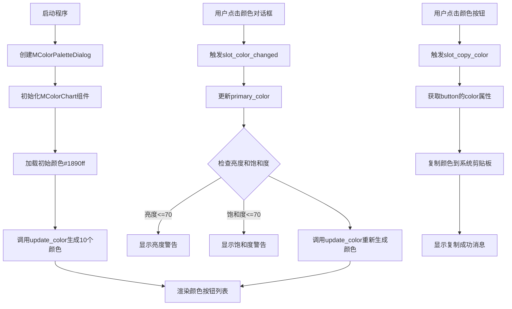
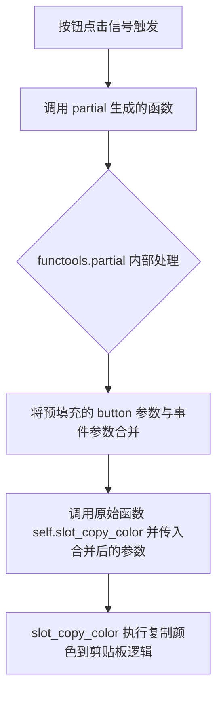
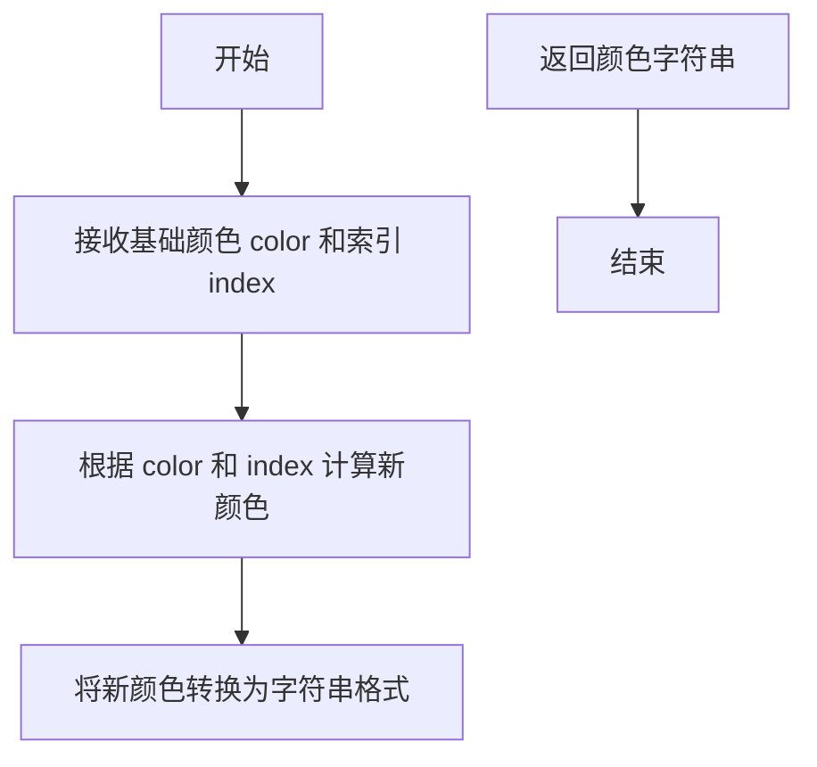
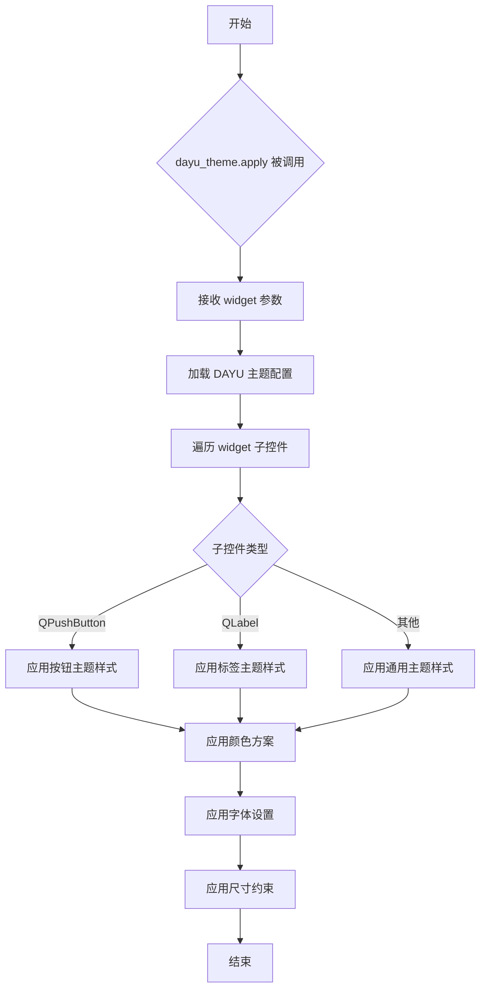
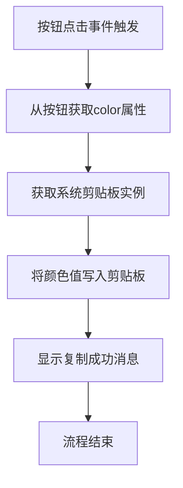
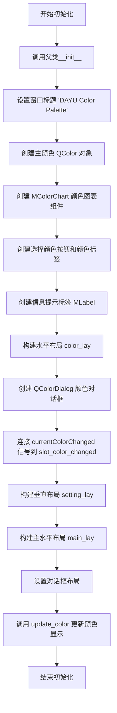
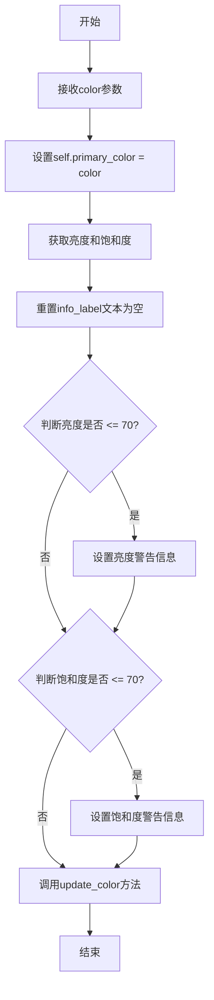
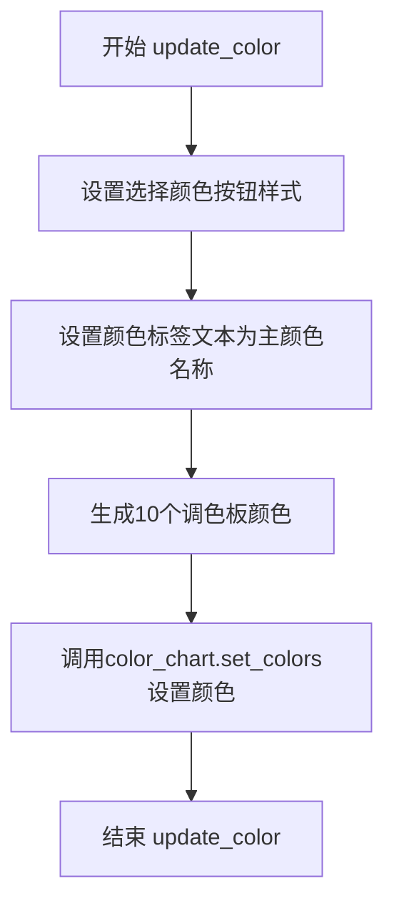

# `comic-translate\app\ui\dayu_widgets\color_palette.py` 详细设计文档

这是一个基于PySide6的Qt颜色选择器组件，提供了颜色选择对话框和调色板预览功能，支持一键复制颜色值，并能为用户生成互补色/渐变色系列

## 整体流程



## 类结构

```
QtWidgets.QWidget
└── MColorChart (颜色图表组件)

QtWidgets.QDialog
└── MColorPaletteDialog (颜色选择对话框)
```

## 全局变量及字段


### `parent`
    
父组件参数，用于指定对话框或组件的父对象

类型：`QtWidgets.QWidget`
    


### `index`
    
循环索引，用于遍历颜色按钮列表或生成颜色序号

类型：`int`
    


### `button`
    
临时按钮变量，在循环中创建的单个颜色按钮

类型：`QtWidgets.QPushButton`
    


### `color`
    
颜色参数，表示当前选中的颜色对象

类型：`QtGui.QColor`
    


### `light`
    
亮度值，表示颜色的明暗程度（0-255）

类型：`int`
    


### `saturation`
    
饱和度值，表示颜色的鲜艳程度（0-255）

类型：`int`
    


### `target`
    
目标颜色值，以十六进制字符串形式表示（如#1890ff）

类型：`str`
    


### `color_list`
    
颜色列表参数，传入待显示的颜色值列表

类型：`list`
    


### `main_lay`
    
主布局，垂直排列所有颜色按钮

类型：`QtWidgets.QVBoxLayout`
    


### `dialog`
    
Qt标准颜色对话框组件，用于选择颜色

类型：`QtWidgets.QColorDialog`
    


### `color_lay`
    
颜色布局，水平排列颜色选择相关的标签和按钮

类型：`QtWidgets.QHBoxLayout`
    


### `setting_lay`
    
设置布局，垂直排列颜色设置区域

类型：`QtWidgets.QVBoxLayout`
    


### `app`
    
Qt应用程序实例

类型：`QtWidgets.QApplication`
    


### `test`
    
测试用的颜色调色板对话框实例

类型：`MColorPaletteDialog`
    


### `MColorChart.button_list`
    
存储颜色按钮的列表

类型：`list`
    


### `MColorPaletteDialog.primary_color`
    
当前选中的主颜色

类型：`QtGui.QColor`
    


### `MColorPaletteDialog.color_chart`
    
颜色图表组件，显示生成的10个衍生颜色

类型：`MColorChart`
    


### `MColorPaletteDialog.choose_color_button`
    
颜色预览按钮，显示当前选中的主颜色

类型：`QtWidgets.QPushButton`
    


### `MColorPaletteDialog.color_label`
    
颜色值显示标签，显示颜色的十六进制值

类型：`QtWidgets.QLabel`
    


### `MColorPaletteDialog.info_label`
    
亮度/饱和度信息提示标签，显示颜色参数建议

类型：`MLabel`
    
    

## 全局函数及方法


### `functools.partial`

`functools.partial` 是 Python 标准库中的函数，用于创建一个部分应用函数（partial function）。在代码中，它被用于预先填充 `slot_copy_color` 方法的 `button` 参数，使得每次按钮点击时无需手动传递按钮参数。

参数：

- `func`：`self.slot_copy_color`，要部分应用的函数（方法），类型为 `Callable`，需要被部分应用的原始函数
- `*args`：`button`，预先填充的位置参数，类型为 `QtWidgets.QPushButton`，要绑定到函数的可变长度位置参数

返回值：`functools.partial`，返回一个新的部分应用函数，类型为 `functools.partial`，当该函数被调用时，会自动将预先填充的参数与调用时传入的参数合并

#### 流程图



#### 带注释源码

```python
# 在 MColorChart.__init__ 方法中
# functools.partial 用于创建部分应用函数
# 预先绑定 button 参数到 slot_copy_color 方法
# 这样当按钮点击时，无需手动传递 button 参数

button.clicked.connect(functools.partial(self.slot_copy_color, button))

# 等价于:
# def partial_wrapper():
#     self.slot_copy_color(button)
# button.clicked.connect(partial_wrapper)

# functools.partial 的实现原理简述:
# class partial:
#     def __new__(cls, func, *args, **kwargs):
#         instance = super().__new__(cls)
#         instance.func = func
#         instance.args = args
#         instance.keywords = kwargs
#         return instance
#
#     def __call__(self, *args, **kwargs):
#         # 合并预填充的参数和调用时传入的参数
#         return self.func(*self.args, *args, **self.keywords, **kwargs)
```

#### 技术债务或优化空间

1. **可读性考虑**：虽然 `functools.partial` 功能强大，但在某些情况下，使用 lambda 表达式或闭包可能更直观。例如：`lambda: self.slot_copy_color(button)` 在简单场景下更容易理解。

2. **内存泄漏风险**：如果按钮对象被销毁但部分应用函数仍然持有引用，可能导致内存泄漏。建议在按钮销毁时断开信号连接。

3. **Qt 信号连接最佳实践**：在 Qt 中，更推荐的方式是使用 `lambda` 或显式的方法绑定，因为这允许更灵活地传递参数且调试时堆栈更清晰。

#### 外部依赖与接口契约

- **依赖模块**：`functools`（Python 标准库）
- **Qt 信号**：`button.clicked` 信号
- **目标方法**：`self.slot_copy_color(button: QtWidgets.QPushButton) -> None`
- **参数契约**：第一个参数必须是 `QtWidgets.QPushButton` 类型

#### 错误处理与异常设计

- **参数类型错误**：如果传入的 `func` 不是可调用对象，会在调用时抛出 `TypeError`
- **参数数量不匹配**：如果 `slot_copy_color` 的参数签名与 partial 提供的参数不匹配，会在调用时抛出 `TypeError`
- **Qt 对象生命周期**：需要确保 `button` 对象在信号触发时仍然有效，否则可能导致程序崩溃


### `utils.generate_color`

生成调色板颜色的工具函数，根据输入的基础颜色和索引生成对应的调色板颜色值。

参数：

- `color`：`QtGui.QColor`，基础颜色对象，用于生成调色板的基准颜色。
- `index`：整数，表示颜色索引，用于计算生成的颜色。

返回值：`str`，返回生成的颜色值，通常为十六进制颜色字符串（如 "#1890ff"）。

#### 流程图



#### 带注释源码

```python
# 注意：以下代码为基于使用方式的推断，具体实现需查看 utils 模块源码
def generate_color(color, index):
    """
    生成调色板颜色。
    
    参数:
        color (QtGui.QColor): 基础颜色对象。
        index (int): 颜色索引，用于计算生成的颜色。
    
    返回:
        str: 生成的颜色字符串（十六进制格式）。
    """
    # 根据索引对基础颜色进行变换，生成新的颜色
    # 具体算法需查看 utils 模块实现
    new_color = color  # 假设进行某种变换
    return new_color.name()  # 返回十六进制颜色字符串
```

#### 补充说明

由于提供的代码片段中未包含 `utils` 模块的具体实现，以上信息基于代码中的使用方式推断得出：
- 在 `MColorPaletteDialog.update_color` 方法中调用了 `utils.generate_color(self.primary_color, index + 1)`。
- `self.primary_color` 是 `QtGui.QColor` 类型。
- 返回值被用于设置按钮的颜色（见 `MColorChart.set_colors` 方法中的使用）。

如需获取 `generate_color` 函数的完整实现，请查阅 `utils` 模块的源代码文件（通常为 `utils.py` 或类似文件）。


### `MMessage.success`

显示成功消息的静态方法，用于在用户界面中弹出成功提示信息，通常在用户完成某项操作后给出反馈。

参数：

- `text`：`str`，要显示的成功消息文本内容
- `parent`：`QtWidgets.QWidget`，可选参数，指定消息提示的父窗口组件，默认为 None

返回值：`None`，该方法无返回值，直接在界面上显示消息提示

#### 流程图

```mermaid
graph TD
    A[slot_copy_color 被调用] --> B[获取按钮颜色属性]
    B --> C[复制颜色到剪贴板]
    C --> D[调用 MMessage.success]
    D --> E[显示成功消息: copied: {color}]
    E --> F[用户确认或自动消失]
```

#### 带注释源码

由于 `MMessage` 类定义在 `message.py` 模块中（该模块未在当前代码中展示），以下是调用处的源码：

```python
def slot_copy_color(self, button):
    """
    复制颜色到剪贴板并显示成功消息的槽函数
    
    参数:
        button: QtWidgets.QPushButton - 被点击的按钮对象
    """
    # 从按钮属性中获取颜色值
    color = button.property("color")
    
    # 将颜色值复制到系统剪贴板
    QtWidgets.QApplication.clipboard().setText(color)
    
    # 调用 MMessage.success 显示成功消息
    # 参数1: 消息文本内容，使用格式化字符串显示复制的颜色
    # 参数2: parent=self，指定当前 MColorChart 实例为父窗口
    MMessage.success("copied: {}".format(color), parent=self)
```


# 提取结果

## 注意事项

**无法找到完整的 `dayu_theme.apply` 函数实现**

在提供的代码中，虽然在 `if __name__ == "__main__":` 块中使用了 `dayu_theme.apply(test)`，但是 `dayu_theme` 模块的实际实现代码并未包含在给定的代码片段中。当前文件只包含 `MColorChart` 和 `MColorPaletteDialog` 类的定义。

**推断信息**：

基于代码使用方式 `dayu_theme.apply(test)`，可以推断：

- 这是一个应用主题样式的函数
- 接收一个 Qt 组件对象作为参数
- 可能是将 DAYU 主题样式应用到该组件及其子组件

---

### `dayu_theme.apply`

应用 DAYU 主题样式到指定的 Qt 控件。

**注意**：以下信息是基于代码调用方式的推断，实际实现代码未在提供的内容中。

参数：

- `widget`：`QtWidgets.QWidget`，需要应用主题的目标控件

返回值：`None`，无返回值（根据使用方式推断）

#### 流程图



#### 带注释源码

```
# 注意：以下为推断代码，实际实现未在提供代码中
# 基于使用方式 dayu_theme.apply(test) 推断

def apply(widget):
    """
    应用 DAYU 主题样式到指定的 Qt 控件
    
    参数:
        widget: QtWidgets.QWidget - 需要应用主题的目标控件
    返回值:
        None
    """
    # 1. 获取主题配置
    theme_config = get_theme_config()
    
    # 2. 应用样式表
    widget.setStyleSheet(theme_config.get_stylesheet())
    
    # 3. 遍历子控件并应用主题
    for child in widget.children():
        apply_child_theme(child, theme_config)
```

---

## 建议

若需要完整的 `dayu_theme.apply` 函数详细信息，请提供：

1. `dayu_theme.py` 模块的完整源代码
2. 或者该函数的具体实现位置

这样我可以提供精确的参数、返回值、流程图和带注释的源码。


### MColorChart.__init__

初始化方法，创建10个颜色按钮用于颜色选择和复制功能。该方法继承自QWidget，设置垂直布局，循环创建10个QPushButton按钮，配置光标、工具提示、点击事件等，并将所有按钮存入列表中管理。

参数：

- `parent`：`QtWidgets.QWidget or None`，父组件，默认为None，用于指定对话框的父窗口

返回值：`None`，无返回值，作为初始化方法不返回任何值

#### 流程图

```mermaid
graph TD
    A[开始 __init__] --> B[调用父类初始化方法]
    B --> C[创建 QVBoxLayout 布局]
    C --> D[设置布局间距为0]
    D --> E[初始化空按钮列表 button_list]
    E --> F{循环 index: 0-9}
    F -->|是| G[创建 QPushButton 按钮]
    G --> H[设置光标为手型]
    H --> I[设置工具提示 Click to Copy Color]
    I --> J[连接点击信号到 slot_copy_color]
    J --> K[设置按钮固定大小 250x45]
    K --> L[设置按钮文本 color-{index+1}]
    L --> M[将按钮添加到布局]
    M --> N[将按钮添加到 button_list]
    N --> F
    F -->|否| O[设置当前widget的布局]
    O --> P[结束]
```

#### 带注释源码

```python
def __init__(self, parent=None):
    """
    初始化MColorChart组件
    
    参数:
        parent: 父组件，默认为None
    """
    # 调用父类QWidget的初始化方法
    super(MColorChart, self).__init__(parent)
    
    # 创建垂直布局管理器
    main_lay = QtWidgets.QVBoxLayout()
    # 设置布局内控件之间的间距为0
    main_lay.setSpacing(0)
    
    # 初始化按钮列表，用于存储所有创建的颜色按钮
    self.button_list = []
    
    # 循环创建10个颜色按钮
    for index in range(10):
        # 创建QPushButton实例
        button = QtWidgets.QPushButton()
        
        # 设置鼠标悬停时显示手型光标
        button.setCursor(QtCore.Qt.PointingHandCursor)
        
        # 设置工具提示，提示用户点击可复制颜色
        button.setToolTip(self.tr("Click to Copy Color"))
        
        # 连接按钮点击信号到复制颜色的槽函数
        # 使用functools.partial传递button参数
        button.clicked.connect(functools.partial(self.slot_copy_color, button))
        
        # 设置按钮固定大小：宽度250，高度45
        button.setFixedSize(QtCore.QSize(250, 45))
        
        # 设置按钮初始文本
        button.setText("color-{}".format(index + 1))
        
        # 将按钮添加到垂直布局中
        main_lay.addWidget(button)
        
        # 将按钮保存到列表中以便后续操作
        self.button_list.append(button)
    
    # 为当前widget设置布局管理器
    self.setLayout(main_lay)
```


### `MColorChart.set_colors`

该方法用于设置颜色列表并根据提供的颜色列表更新所有按钮的文本、颜色属性和样式表，实现颜色可视化展示功能。

**参数：**

- `color_list`：`list`，包含颜色值的列表，用于设置每个按钮的背景颜色

**返回值：** `None`，该方法无返回值，直接修改按钮的视觉属性

#### 流程图

```mermaid
flowchart TD
    A[开始 set_colors] --> B[遍历 enumerate self.button_list]
    B --> C{遍历是否结束?}
    C -->|否| D[获取当前颜色 target = color_list[index]]
    D --> E[设置按钮文本: color-{index+1}\t{target}]
    E --> F[设置按钮属性: button.setProperty color]
    F --> G{index < 5?}
    G -->|是| H[文字颜色设为 #000 黑色]
    G -->|否| I[文字颜色设为 #fff 白色]
    H --> J[设置按钮样式表 setStyleSheet]
    I --> J
    J --> B
    C -->|是| K[结束]
```

#### 带注释源码

```python
def set_colors(self, color_list):
    """
    设置颜色列表并更新按钮样式
    
    参数:
        color_list: 颜色值列表，每个元素应为颜色字符串如"#RRGGBB"
    
    返回:
        None
    """
    # 遍历所有按钮及其索引
    for index, button in enumerate(self.button_list):
        # 获取对应索引的颜色值
        target = color_list[index]
        
        # 设置按钮显示文本，格式为 "color-N\t#RRGGBB"
        button.setText("color-{}\t{}".format(index + 1, target))
        
        # 将颜色值存储为按钮的 custom 属性，供复制功能使用
        button.setProperty("color", target)
        
        # 设置按钮样式表:
        # - background-color: 背景色为目标颜色
        # - color: 文字颜色，根据索引决定（索引<5用黑色，否则用白色，保证对比度）
        # - border: 无边框
        # - hover状态: 鼠标悬停时字体加粗
        button.setStyleSheet(
            "QPushButton{{background-color:{};color:{};border: 0 solid black}}"
            "QPushButton:hover{{font-weight:bold;}}".format(target, "#000" if index < 5 else "#fff")
        )
```


### `MColorChart.slot_copy_color`

该函数是 MColorChart 类中的槽函数，用于响应颜色按钮的点击事件，将按钮上存储的颜色值复制到系统剪贴板，并通过消息提示用户复制成功。

参数：

- `button`：`QtWidgets.QPushButton`，触发点击事件的按钮对象，从中获取颜色属性

返回值：`None`，该方法执行颜色复制操作后无返回值

#### 流程图



#### 带注释源码

```python
def slot_copy_color(self, button):
    """
    复制颜色到剪贴板的槽函数
    
    参数:
        button: 触发点击事件的按钮对象,包含颜色属性
    返回值:
        None
    """
    # 从按钮的属性中获取存储的颜色值
    color = button.property("color")
    
    # 获取应用程序的剪贴板对象并将颜色文本复制到剪贴板
    QtWidgets.QApplication.clipboard().setText(color)
    
    # 使用MMessage显示复制成功的提示信息
    MMessage.success("copied: {}".format(color), parent=self)
```


### MColorPaletteDialog.__init__

初始化颜色调色板对话框，构建包含颜色选择器、颜色图表和颜色预览的完整UI布局，并设置信号槽连接。

参数：

- `init_color`：字符串，初始颜色值（如 "#1890ff"），用于设置对话框的初始选中颜色
- `parent`：`QtWidgets.QWidget`，父窗口组件（可选，默认为 None），用于建立对话框的父子层级关系

返回值：无（`__init__` 方法返回 `None`）

#### 流程图



#### 带注释源码

```python
def __init__(self, init_color, parent=None):
    # 调用父类 QDialog 的初始化方法，建立父子关系
    super(MColorPaletteDialog, self).__init__(parent)
    
    # 设置对话框窗口标题
    self.setWindowTitle("DAYU Color Palette")
    
    # 将传入的初始颜色字符串转换为 QColor 对象，用于后续颜色处理
    self.primary_color = QtGui.QColor(init_color)
    
    # 创建颜色图表组件，显示生成的10个颜色选项
    self.color_chart = MColorChart()
    
    # 创建选择颜色按钮，用于触发颜色选择器
    self.choose_color_button = QtWidgets.QPushButton()
    # 设置按钮固定大小为 100x30
    self.choose_color_button.setFixedSize(QtCore.QSize(100, 30))
    
    # 创建颜色值显示标签
    self.color_label = QtWidgets.QLabel()
    
    # 创建信息提示标签，用于显示颜色建议（如亮度和饱和度提示）
    self.info_label = MLabel()
    # 设置错误属性为 True，用于特殊样式显示
    self.info_label.setProperty("error", True)
    
    # 构建水平布局，包含标签、按钮和标签
    color_lay = QtWidgets.QHBoxLayout()
    color_lay.addWidget(MLabel("Primary Color:"))
    color_lay.addWidget(self.choose_color_button)
    color_lay.addWidget(self.color_label)
    color_lay.addWidget(self.info_label)
    # 添加弹性空间，使组件靠左对齐
    color_lay.addStretch()
    
    # 创建 Qt 原生颜色对话框，传入初始颜色
    dialog = QtWidgets.QColorDialog(self.primary_color, parent=self)
    # 设置颜色对话框为 Widget 模式（非顶级窗口）
    dialog.setWindowFlags(QtCore.Qt.Widget)
    # 隐藏颜色对话框的按钮区域
    dialog.setOption(QtWidgets.QColorDialog.NoButtons)
    # 连接颜色变化信号到槽函数
    dialog.currentColorChanged.connect(self.slot_color_changed)
    
    # 构建垂直布局，包含颜色选择区域和分隔线
    setting_lay = QtWidgets.QVBoxLayout()
    setting_lay.addLayout(color_lay)
    setting_lay.addWidget(MDivider())  # 分隔线组件
    setting_lay.addWidget(dialog)     # 添加颜色对话框
    
    # 构建主水平布局，左侧为颜色图表，右侧为设置区域
    main_lay = QtWidgets.QHBoxLayout()
    main_lay.addWidget(self.color_chart)
    main_lay.addLayout(setting_lay)
    
    # 设置对话框的主布局
    self.setLayout(main_lay)
    
    # 初始化时更新颜色显示，包括按钮样式和图表颜色
    self.update_color()
```


### `MColorPaletteDialog.slot_color_changed`

当用户通过颜色对话框选择新颜色时触发此槽函数，用于更新主颜色并检查颜色参数是否符合设计规范（亮度和饱和度），同时显示相应的警告信息。

参数：

- `color`：`QtGui.QColor`，用户选择的新颜色对象

返回值：`None`，该方法为槽函数，不返回任何值

#### 流程图



#### 带注释源码

```python
@QtCore.Slot(QtGui.QColor)
def slot_color_changed(self, color):
    """
    颜色变化时的回调槽函数
    
    参数:
        color: QtGui.QColor - 用户通过颜色对话框选择的新颜色
    """
    # 1. 更新当前主颜色
    self.primary_color = color
    
    # 2. 获取颜色的亮度和饱和度用于验证
    light = self.primary_color.lightness()
    saturation = self.primary_color.saturation()
    
    # 3. 先清空之前可能存在的警告信息
    self.info_label.setText("")
    
    # 4. 检查亮度是否符合建议（不应低于70）
    if light <= 70:
        self.info_label.setText("亮度建议不低于70（现在 {}）".format(light))
    
    # 5. 检查饱和度是否符合建议（不应低于70）
    if saturation <= 70:
        self.info_label.setText("饱和度建议不低于70（现在 {}）".format(saturation))

    # 6. 触发界面更新以反映新的颜色选择
    self.update_color()
```


### `MColorPaletteDialog.update_color`

该方法负责更新对话框中的颜色显示，包括更新选择颜色按钮的样式、颜色标签文本，以及根据当前主颜色生成并显示10个调色板颜色。

参数： 无

返回值：`None`，无返回值

#### 流程图



#### 带注释源码

```python
def update_color(self):
    """
    更新颜色显示和调色板。
    根据当前的主颜色更新按钮样式、标签显示，并生成新的调色板颜色。
    """
    # 设置选择颜色按钮的样式表，包括边框和背景色
    # border-radius: 0 - 设置按钮为直角
    # border: none - 移除默认边框
    # border:1px solid gray - 添加灰色边框
    # background-color - 设置按钮背景色为主颜色
    self.choose_color_button.setStyleSheet(
        "border-radius: 0;border: none;border:1px solid gray;"
        "background-color:{};".format(self.primary_color.name())
    )
    
    # 更新颜色标签的文本显示为主颜色的十六进制名称
    self.color_label.setText(self.primary_color.name())
    
    # 使用utils.generate_color函数根据主颜色生成10个渐变色
    # index + 1 表示颜色序号（1-10）
    # range(10) 生成0-9的序列
    self.color_chart.set_colors([utils.generate_color(self.primary_color, index + 1) for index in range(10)])
```

## 关键组件


### MColorChart

显示颜色列表的Qt组件，包含10个可点击的颜色按钮，每个按钮显示颜色编号和色值，点击后自动复制颜色到剪贴板。

### MColorPaletteDialog

颜色选择对话框，整合了颜色图表和Qt原生颜色选择器，支持实时预览和调色板生成，提供亮度/饱和度建议提示。

### 颜色生成与转换

使用 utils.generate_color 函数从主颜色按索引生成调色板中的10个衍生颜色，支持生成同色系不同亮度的颜色序列。

### 剪贴板交互

通过 QtWidgets.QApplication.clipboard() 实现颜色值的系统级复制功能，提供跨应用程序的颜色粘贴能力。

### 消息反馈机制

使用 MMessage.success 显示复制成功提示，为用户提供操作反馈和确认。

### 布局管理系统

使用 QVBoxLayout 和 QHBoxLayout 实现垂直和水平嵌套布局，设置间距为0确保紧凑的视觉呈现。

### 主题样式应用

通过 setStyleSheet 动态设置按钮背景色、文字颜色，根据颜色亮度自动切换文字为黑/白色以保证可读性。


## 问题及建议


### 已知问题

- **硬编码的按钮数量**：MColorChart类中`range(10)`是硬编码的magic number，若需要调整颜色数量需修改多处代码
- **缺少长度校验**：MColorChart.set_colors()方法直接通过索引访问color_list，若传入列表长度不足会导致IndexError异常
- **文本对比度判断不准确**：使用索引index<5判断文字颜色黑白（`"#000" if index < 5 else "#fff"`），不够科学，应基于实际生成颜色的亮度计算
- **缺少类型注解**：所有方法和变量都缺少类型提示，降低了代码的可读性和IDE支持
- **局部变量引用**：MColorPaletteDialog.__init__中创建的dialog变量未保存为实例属性，可能导致对话框行为异常
- **国际化支持缺失**：提示信息使用硬编码中文（"亮度建议不低于70"、"饱和度建议不低于70"），不支持多语言
- **字符串格式化**：按钮文本使用`\t`制表符进行对齐，在不同平台或字体下显示可能不一致

### 优化建议

- 将按钮数量提取为类常量或配置参数，增强灵活性
- 在set_colors方法中添加参数校验，当color_list长度不足时给出明确错误处理
- 使用QColor的lightness()方法动态计算文字颜色，而非固定索引判断
- 为关键方法和变量添加类型注解（PEP 484风格）
- 将color_dialog保存为实例属性（如self.color_dialog），确保生命周期管理
- 使用Qt的国际化机制（QCoreApplication.translate或QObject.tr）替换硬编码中文字符串
- 使用QFontMetrics计算文本宽度实现对齐，或使用Qt布局的stretch机制
- 考虑将颜色生成逻辑缓存，避免重复计算
- 添加单元测试覆盖边界条件（如空列表、颜色格式错误等）


## 其它


### 设计目标与约束

本模块旨在为用户提供一个直观的颜色选择和预览界面，支持从预设颜色列表中选择、复制颜色到剪贴板，并通过颜色对话框自定义主颜色。设计约束包括：仅支持QtWidgets GUI框架、依赖PySide6库、颜色数量固定为10个、亮度/饱和度阈值为70。

### 错误处理与异常设计

代码中主要通过条件判断处理业务逻辑错误（如亮度/饱和度检查），未实现完整的异常捕获机制。潜在异常包括：color_list长度不足10时的索引越界、剪贴板操作失败、QColor无效等。建议增加try-except包裹clipboard操作，并对set_colors方法的输入进行长度校验。

### 数据流与状态机

数据流：用户选择颜色 → QColorDialog触发currentColorChanged信号 → slot_color_changed槽函数更新primary_color → update_color方法计算10个派生颜色 → set_colors更新按钮显示。状态机包含：初始状态（init_color）、选择中状态（颜色变化中）、完成状态（颜色已应用）。

### 外部依赖与接口契约

依赖模块包括：PySide6.QtCore、PySide6.QtGui、PySide6.QtWidgets（GUI框架）、本地模块divider、label、message、utils、dayu_theme。接口契约：MColorPaletteDialog构造函数接受init_color字符串参数；MColorChart.set_colors()接受color_list列表参数且长度需为10；utils.generate_color()需返回有效的颜色字符串。

### 性能考虑

当前实现每次颜色变化都重新生成10个派生颜色并更新所有按钮样式，可能存在性能优化空间。建议：缓存未变化的颜色、批量更新UI、使用Qt的update()而非重新设置样式表。

### 资源管理

按钮列表self.button_list持有10个QPushButton引用，对话框销毁时自动释放。clipboard操作使用QApplication全局实例，无需显式释放。未发现内存泄漏风险。

### 并发/线程安全

所有操作均在主线程执行，未涉及多线程。QColorDialog信号槽机制自动在主线程处理，不存在线程安全问题。

### 可测试性

建议增加单元测试覆盖：MColorChart.set_colors()输入边界测试、slot_copy_color剪贴板验证、slot_color_changed亮度饱和度计算逻辑测试、utils.generate_color颜色生成算法测试。

### 版本兼容性

代码使用PySide6，需确保Qt版本兼容5.15+。from __future__ import语句表明考虑了Python2/3兼容性，但当前代码仅支持Python3。

### 国际化/本地化

部分文本未使用tr()国际化：按钮文本"Click to Copy Color"、提示信息"亮度建议不低于70"、"饱和度建议不低于70"、MMessage文本"copied:"。建议统一使用tr()或外部翻译机制。

### 配置管理

颜色数量（10个）、按钮尺寸（250x45, 100x30）、阈值（70）均为硬编码。建议提取为配置常量或初始化参数，提高可维护性。

    