# `comic-translate\app\ui\dayu_widgets\combo_box.py` 详细设计文档

这是一个基于PySide6的自定义组合框组件，提供了增强的搜索功能、大小调整、格式化显示和自定义菜单支持。该组件通过mixin类实现了搜索过滤、鼠标光标样式、焦点阴影等高级UI交互功能，适用于需要下拉选择和快速搜索的场景。

## 整体流程

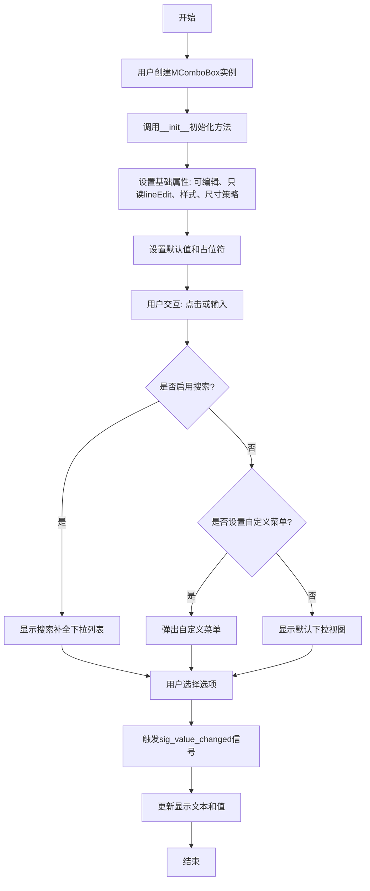

## 类结构

```
MComboBoxSearchMixin (搜索功能mixin)
├── filter_model: QtCore.QSortFilterProxyModel
└── completer: MCompleter

MComboBox (组合框主类)
├── 继承自: MComboBoxSearchMixin + QtWidgets.QComboBox
├── _root_menu: 根菜单
├── _display_formatter: 显示格式化函数
├── _has_custom_view: 自定义视图标志
└── _dayu_size: 组件尺寸

MFontComboBox (字体组合框)
├── 继承自: MComboBoxSearchMixin + QtWidgets.QFontComboBox
└── (结构与MComboBox相同)
```

## 全局变量及字段


### `Separator`
    
分隔符常量，值为'/'

类型：`str`
    


### `MComboBoxSearchMixin.filter_model`
    
搜索过滤代理模型

类型：`QtCore.QSortFilterProxyModel`
    


### `MComboBoxSearchMixin.completer`
    
自动补全器

类型：`MCompleter`
    


### `MComboBox._root_menu`
    
根菜单对象

类型：`object`
    


### `MComboBox._display_formatter`
    
显示格式化函数

类型：`Callable`
    


### `MComboBox._has_custom_view`
    
是否使用自定义视图

类型：`bool`
    


### `MComboBox._dayu_size`
    
组件尺寸大小

类型：`int`
    


### `MFontComboBox._root_menu`
    
根菜单对象

类型：`object`
    


### `MFontComboBox._display_formatter`
    
显示格式化函数

类型：`Callable`
    


### `MFontComboBox._has_custom_view`
    
是否使用自定义视图

类型：`bool`
    


### `MFontComboBox._dayu_size`
    
组件尺寸大小

类型：`int`
    
    

## 全局函数及方法


根据提供的代码，`display_formatter` 函数来自 `utils` 模块，但该模块的具体实现未在当前代码中提供。我需要基于代码中的使用方式来推断其功能。

从代码中的使用方式可以看出：
```python
self._display_formatter = utils.display_formatter
# 在 _set_value 方法中使用
self.lineEdit().setProperty("text", self._display_formatter(value))
```

这表明 `display_formatter` 是一个接受值并返回格式化字符串的函数。

---

### `display_formatter`

该函数用于格式化显示文本，将输入的值转换为适合在 UI 中显示的字符串格式。通常用于下拉框、列表等控件中显示格式化后的文本。

参数：

-  `value`：`任意类型`，需要格式化的值，可以是字符串、数字或自定义对象

返回值：`str`，格式化后的字符串，用于在 UI 控件中显示

#### 流程图

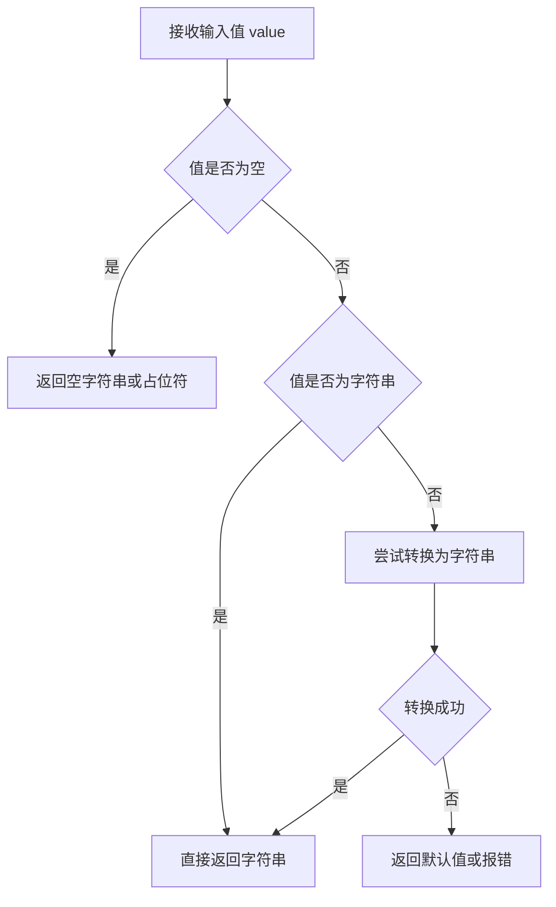

#### 带注释源码

由于 `utils` 模块的具体代码未提供，以下是基于代码使用方式推断的源码：

```python
def display_formatter(value):
    """
    格式化显示文本的函数
    
    该函数接收一个值，将其转换为适合在 UI 中显示的字符串格式。
    在 MComboBox 和 MFontComboBox 中用于设置下拉框的显示文本。
    
    参数:
        value: 任意类型，需要格式化的值
        
    返回:
        str: 格式化后的字符串，如果值为 None 或空则返回空字符串
    """
    # 处理空值和 None 的情况
    if value is None:
        return ""
    
    # 如果值已经是字符串，直接返回
    if isinstance(value, str):
        return value if value else ""
    
    # 对于其他类型，转换为字符串
    try:
        return str(value)
    except Exception:
        # 转换失败时返回空字符串
        return ""
```

---

**注意**：由于 `utils` 模块的完整代码未在当前提供的代码块中，以上信息是基于 `MComboBox` 和 `MFontComboBox` 类中使用方式的合理推断。如需获取准确的实现细节，请提供 `utils` 模块的完整代码。


### `dayu_theme.default_size`

这是 `dayu_theme` 模块中定义的全局整数常量，用于指定 UI 组件（如 `MComboBox`、`MFontComboBox`）的默认尺寸（高度或大小）。该常量通常是一个预定义的标准尺寸值（如 Small, Medium, Large 中的某一个），在组件初始化时被读取并赋值给实例的 `_dayu_size` 属性。

参数：

-  `{参数名称}`：`无`（全局变量，非函数，故无参数）
-  ...

返回值：`int`，返回默认的尺寸数值（像素值，例如 30 或 36）。

#### 流程图

由于它是模块级别的常量访问，流程较为简单，仅涉及读取操作。

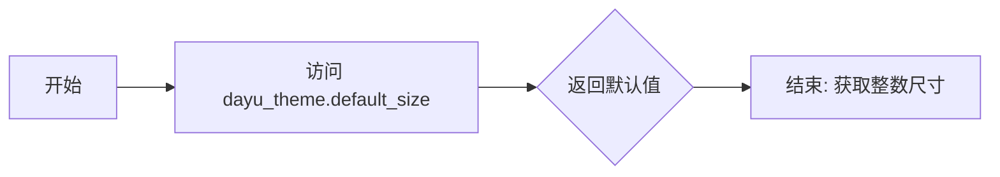

#### 带注释源码

由于 `dayu_theme` 模块的源码未直接提供，此处根据其在 `MComboBox` 中的调用方式（赋值给整数属性并与 `huge`, `large` 等常量比较）推断出的模拟实现。该常量通常对应一个中等或标准的尺寸。

```python
# file: dayu_theme.py
# -*- coding: utf-8 -*-

# 定义 UI 组件的尺寸常量 (像素)
# 这些常量用于控制组件的大小级别
tiny = 24      # 超小号尺寸
small = 30     # 小号尺寸
medium = 36    # 中号尺寸 (通常为标准默认)
large = 42     # 大号尺寸
huge = 48      # 超大号尺寸

# 默认尺寸 (default_size)
# 定义组件在未指定特定尺寸时使用的默认大小。
# 通常系统默认风格倾向于使用 'medium' (中等) 作为标准。
default_size = medium
```


### `MComboBox.huge`

设置组合框为巨大尺寸

参数：

- 无

返回值：`MComboBox`，返回组合框实例本身，支持链式调用

#### 流程图

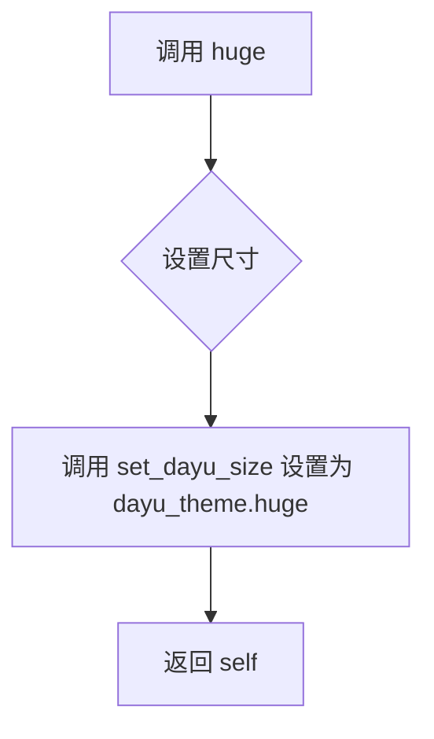

#### 带注释源码

```python
def huge(self):
    """Set MComboBox to huge size"""
    # 调用 set_dayu_size 方法，传入 dayu_theme.huge 常量设置巨大尺寸
    self.set_dayu_size(dayu_theme.huge)
    # 返回自身实例，支持链式调用
    return self
```

---

### `MComboBox.large`

设置组合框为大尺寸

参数：

- 无

返回值：`MComboBox`，返回组合框实例本身，支持链式调用

#### 流程图

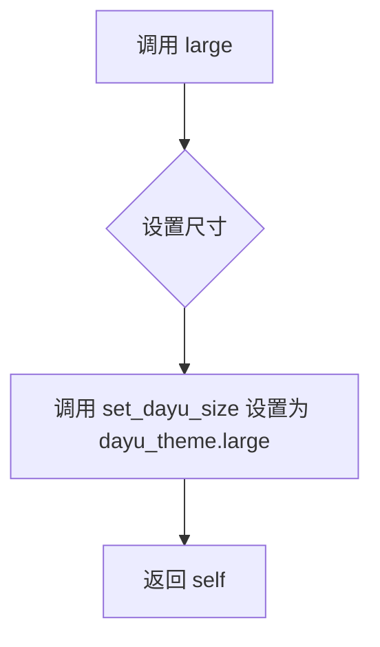

#### 带注释源码

```python
def large(self):
    """Set MComboBox to large size"""
    # 调用 set_dayu_size 方法，传入 dayu_theme.large 常量设置大尺寸
    self.set_dayu_size(dayu_theme.large)
    # 返回自身实例，支持链式调用
    return self
```

---

### `MComboBox.medium`

设置组合框为中等尺寸

参数：

- 无

返回值：`MComboBox`，返回组合框实例本身，支持链式调用

#### 流程图

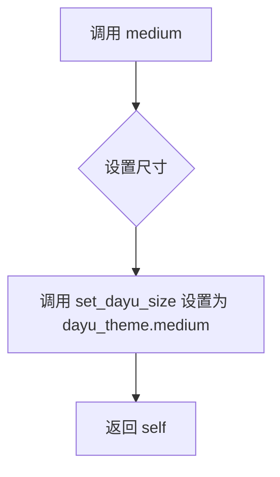

#### 带注释源码

```python
def medium(self):
    """Set MComboBox to  medium"""
    # 调用 set_dayu_size 方法，传入 dayu_theme.medium 常量设置中等尺寸
    self.set_dayu_size(dayu_theme.medium)
    # 返回自身实例，支持链式调用
    return self
```

---

### `MComboBox.small`

设置组合框为小尺寸

参数：

- 无

返回值：`MComboBox`，返回组合框实例本身，支持链式调用

#### 流程图

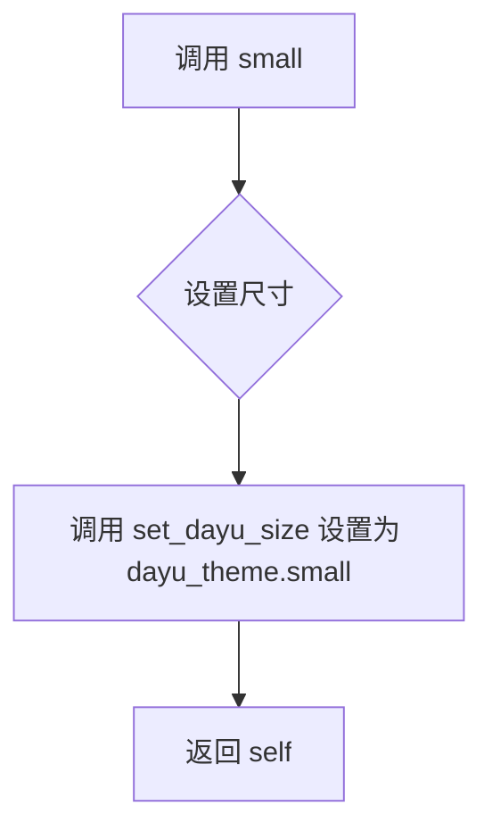

#### 带注释源码

```python
def small(self):
    """Set MComboBox to small size"""
    # 调用 set_dayu_size 方法，传入 dayu_theme.small 常量设置小尺寸
    self.set_dayu_size(dayu_theme.small)
    # 返回自身实例，支持链式调用
    return self
```

---

### `MComboBox.tiny`

设置组合框为微小尺寸

参数：

- 无

返回值：`MComboBox`，返回组合框实例本身，支持链式调用

#### 流程图

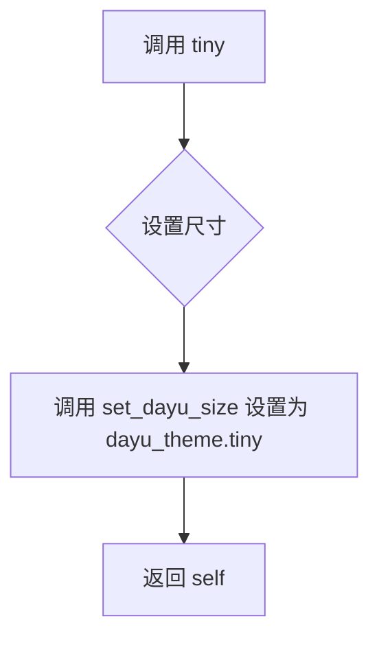

#### 带注释源码

```python
def tiny(self):
    """Set MComboBox to tiny size"""
    # 调用 set_dayu_size 方法，传入 dayu_theme.tiny 常量设置微小尺寸
    self.set_dayu_size(dayu_theme.tiny)
    # 返回自身实例，支持链式调用
    return self
```

---

### `MFontComboBox.huge`

设置字体组合框为巨大尺寸

参数：

- 无

返回值：`MFontComboBox`，返回组合框实例本身，支持链式调用

#### 流程图


#### 带注释源码

```python
def huge(self):
    """Set MComboBox to huge size"""
    # 调用 set_dayu_size 方法，传入 dayu_theme.huge 常量设置巨大尺寸
    self.set_dayu_size(dayu_theme.huge)
    # 返回自身实例，支持链式调用
    return self
```

---

### `MFontComboBox.large`

设置字体组合框为大尺寸

参数：

- 无

返回值：`MFontComboBox`，返回组合框实例本身，支持链式调用

#### 流程图


#### 带注释源码

```python
def large(self):
    """Set MComboBox to large size"""
    # 调用 set_dayu_size 方法，传入 dayu_theme.large 常量设置大尺寸
    self.set_dayu_size(dayu_theme.large)
    # 返回自身实例，支持链式调用
    return self
```

---

### `MFontComboBox.medium`

设置字体组合框为中等尺寸

参数：

- 无

返回值：`MFontComboBox`，返回组合框实例本身，支持链式调用

#### 流程图


#### 带注释源码

```python
def medium(self):
    """Set MComboBox to  medium"""
    # 调用 set_dayu_size 方法，传入 dayu_theme.medium 常量设置中等尺寸
    self.set_dayu_size(dayu_theme.medium)
    # 返回自身实例，支持链式调用
    return self
```

---

### `MFontComboBox.small`

设置字体组合框为小尺寸

参数：

- 无

返回值：`MFontComboBox`，返回组合框实例本身，支持链式调用

#### 流程图


#### 带注释源码

```python
def small(self):
    """Set MComboBox to small size"""
    # 调用 set_dayu_size 方法，传入 dayu_theme.small 常量设置小尺寸
    self.set_dayu_size(dayu_theme.small)
    # 返回自身实例，支持链式调用
    return self
```

---

### `MFontComboBox.tiny`

设置字体组合框为微小尺寸

参数：

- 无

返回值：`MFontComboBox`，返回组合框实例本身，支持链式调用

#### 流程图


#### 带注释源码

```python
def tiny(self):
    """Set MComboBox to tiny size"""
    # 调用 set_dayu_size 方法，传入 dayu_theme.tiny 常量设置微小尺寸
    self.set_dayu_size(dayu_theme.tiny)
    # 返回自身实例，支持链式调用
    return self
```


### `MComboBoxSearchMixin.__init__`

该方法是 `MComboBoxSearchMixin` 类的构造函数，用于初始化组合框的搜索功能。它通过设置代理模型（ProxyModel）来实现文本过滤，并配置自动补全器（Completer）以支持模糊搜索。

参数：

- `self`：隐式参数，类的实例本身。
- `*args`：可变位置参数，用于传递给父类（`object`）的初始化方法。
- `**kwargs`：可变关键字参数，用于传递给父类的初始化方法。

返回值：`None`，构造函数不返回值。

#### 流程图

```mermaid
flowchart TD
    A([开始 __init__]) --> B[调用父类初始化: super().__init__]
    B --> C[创建 QSortFilterProxyModel]
    C --> D[设置过滤规则: 大小写不敏感]
    D --> E[设置源模型: self.model()]
    E --> F[创建 MCompleter]
    F --> G[设置补全模式: UnfilteredPopupCompletion]
    G --> H[设置补全器模型: filter_model]
    H --> I([结束])
```

#### 带注释源码

```python
def __init__(self, *args, **kwargs):
    # 1. 调用父类(object)的初始化方法，确保对象基础结构正确
    super(MComboBoxSearchMixin, self).__init__(*args, **kwargs)
    
    # 2. 初始化过滤器模型 (代理模型)
    # 用于在不影响原始数据模型的情况下，对显示内容进行过滤筛选
    self.filter_model = QtCore.QSortFilterProxyModel(self)
    
    # 3. 设置过滤规则：忽略大小写
    # 这允许用户输入 'abc' 时匹配 'ABC'
    self.filter_model.setFilterCaseSensitivity(QtCore.Qt.CaseInsensitive)
    
    # 4. 将原始模型(source model)设置给代理模型
    # 注意：此时 self.model() 返回的是组合框当前的模型
    self.filter_model.setSourceModel(self.model())
    
    # 5. 初始化自动补全器
    # MCompleter 是自定义的补全器类
    self.completer = MCompleter(self)
    
    # 6. 设置补全模式为 UnfilteredPopupCompletion
    # 模式下拉框会显示所有匹配的项，而不是仅显示最佳匹配
    self.completer.setCompletionMode(QtWidgets.QCompleter.UnfilteredPopupCompletion)
    
    # 7. 将代理模型设置给补全器
    # 这样补全器检索的数据来自于经过过滤的代理模型
    self.completer.setModel(self.filter_model)
```


### MComboBoxSearchMixin.search

该方法用于为组合框添加搜索功能，配置自动补全器、过滤模型和编辑器行为，使组合框支持实时过滤搜索。

参数：

- 无

返回值：`None`，无返回值

#### 流程图

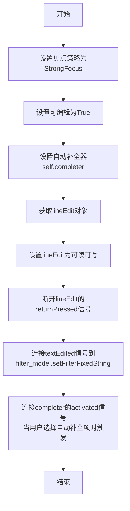

#### 带注释源码

```python
def search(self):
    """
    配置组合框的搜索功能。
    设置自动补全、过滤模型和编辑器行为以支持实时搜索过滤。
    """
    # 1. 设置焦点策略为强焦点，支持键盘导航
    self.setFocusPolicy(QtCore.Qt.StrongFocus)
    # 2. 设置组合框为可编辑状态
    self.setEditable(True)

    # 3. 设置自动补全器
    self.setCompleter(self.completer)

    # 4. 获取内置的行编辑器
    edit = self.lineEdit()
    # 5. 设置编辑器可写（允许用户输入搜索文本）
    edit.setReadOnly(False)
    # 6. 断开returnPressed信号，避免回车时触发默认行为
    edit.returnPressed.disconnect()
    # 7. 连接文本编辑信号到过滤模型的固定字符串过滤
    #    当用户输入文本时，自动过滤下拉列表中的项
    edit.textEdited.connect(self.filter_model.setFilterFixedString)
    # 8. 连接自动补全激活信号
    #    当用户从自动补全列表中选择一项时，更新当前选中项
    self.completer.activated.connect(lambda t: t and self.setCurrentIndex(self.findText(t)))
```


### `MComboBoxSearchMixin._set_searchable`

设置搜索属性为True时触发搜索功能。当传入的值为True时，调用search方法启用组合框的搜索/自动补全功能。

参数：

- `value`：`bool`，布尔值，为True时触发搜索功能，为False时不做任何操作

返回值：`None`，该方法仅执行副作用操作（启用搜索功能），不返回任何值

#### 流程图

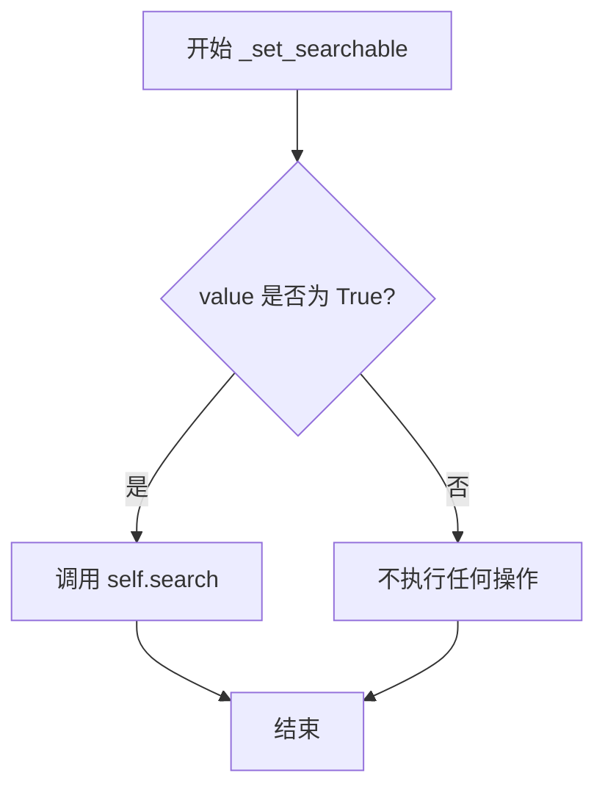

#### 带注释源码

```python
def _set_searchable(self, value):
    """
    search property to True then trigger search
    
    当searchable属性被设置为True时，触发search方法来初始化
    组合框的搜索/自动补全功能。该方法利用Python的短路求值
    特性：只有当value为True时才执行self.search()。
    
    Args:
        value: bool, 是否启用搜索功能的标志位
        
    Returns:
        None: 此方法不返回值，仅执行副作用操作
    """
    # 使用短路求值：只有value为True时才调用search
    value and self.search()
```


### `MComboBoxSearchMixin.setModel`

该方法用于设置组合框的数据模型，同时更新过滤器模型和自动补全器的模型，以支持搜索功能。

参数：

- `model`：`model`，要设置的数据模型（Qt 模型对象，如 QAbstractItemModel）

返回值：`None`，无返回值

#### 流程图

```mermaid
graph TD
    A[开始 setModel] --> B[调用父类 setModel: super.setModel(model)]
    B --> C[设置过滤器模型的数据源: filter_model.setSourceModel(model)]
    C --> D[设置自动补全器的模型: completer.setModel(filter_model)]
    D --> E[结束]
```

#### 带注释源码

```python
def setModel(self, model):
    """
    设置组合框的数据模型
    
    该方法重写父类的 setModel 方法，除了设置基本模型外，
    还同步更新过滤器模型和自动补全器的模型，以确保搜索功能正常工作。
    
    参数:
        model: Qt 模型对象, 作为组合框的数据来源
    """
    # 调用父类的 setModel 方法，设置基础数据模型
    super(MComboBoxSearchMixin, self).setModel(model)
    
    # 将传入的模型设置为过滤器模型的源模型
    # 这样过滤器模型可以对数据进行过滤处理
    self.filter_model.setSourceModel(model)
    
    # 将过滤器模型设置为自动补全器的模型
    # 这样自动补全器显示的是经过过滤后的数据
    self.completer.setModel(self.filter_model)
```


### `MComboBoxSearchMixin.setModelColumn`

该方法用于设置组合框搜索功能的模型列，它配置了自动补全列和过滤键列，并将操作委托给父类方法。

参数：

- `column`：`int`，指定模型中用于搜索和补全的列索引

返回值：`None`，无返回值

#### 流程图

```mermaid
flowchart TD
    A[开始 setModelColumn] --> B[设置补全器列: self.completer.setCompletionColumn]
    B --> C[设置过滤模型键列: self.filter_model.setFilterKeyColumn]
    C --> D[调用父类方法: super().setModelColumn]
    D --> E[结束]
```

#### 带注释源码

```python
def setModelColumn(self, column):
    """
    设置搜索和补全功能使用的模型列
    
    参数:
        column: int, 模型中的列索引，用于搜索过滤和自动补全
    """
    # 设置自动补全器使用的列
    self.completer.setCompletionColumn(column)
    
    # 设置过滤模型使用的键列（用于搜索过滤）
    self.filter_model.setFilterKeyColumn(column)
    
    # 调用父类的setModelColumn方法，保持原有的模型列设置逻辑
    super(MComboBoxSearchMixin, self).setModelColumn(column)
```


### MComboBox.__init__

该方法是 `MComboBox` 类的构造函数，负责初始化一个自定义的下拉组合框控件，设置其基本属性、样式、事件过滤器以及与搜索功能相关的组件。

参数：

- `parent`：`Optional[QtWidgets.QWidget]`，父控件对象，用于建立Qt对象层级关系，默认为 `None`

返回值：`None`，构造函数无返回值

#### 流程图

```mermaid
flowchart TD
    A[开始 __init__] --> B[接收 parent 参数]
    B --> C[调用父类 QComboBox 构造函数 super().__init__]
    C --> D[初始化实例变量]
    D --> E[设置控件为可编辑 setEditable True]
    E --> F[获取并配置 lineEdit 样式属性]
    F --> G[安装事件过滤器到 lineEdit]
    G --> H[初始化内部状态标志]
    H --> I[设置默认值和占位符]
    I --> J[配置尺寸策略]
    J --> K[初始化主题大小]
    K --> L[结束]
```

#### 带注释源码

```python
def __init__(self, parent=None):
    """
    初始化 MComboBox 实例
    
    参数:
        parent: 父控件对象，默认为 None
    """
    # 调用父类 QtWidgets.QComboBox 的初始化方法
    super(MComboBox, self).__init__(parent)

    # 初始化根菜单引用，用于存储自定义菜单对象
    self._root_menu = None
    
    # 设置显示格式化器，使用 utils 模块中的 display_formatter 函数
    self._display_formatter = utils.display_formatter
    
    # 设置组合框为可编辑状态，允许用户输入或选择
    self.setEditable(True)
    
    # 获取组合框的行编辑器控件
    line_edit = self.lineEdit()
    
    # 设置行编辑器为只读，用户只能通过下拉选择不能直接编辑
    line_edit.setReadOnly(True)
    
    # 设置文本边距：左4px，右4px，上下为0
    line_edit.setTextMargins(4, 0, 4, 0)
    
    # 设置背景色为透明
    line_edit.setStyleSheet("background-color:transparent")
    
    # 设置光标为手型指针，提示用户可点击
    line_edit.setCursor(QtCore.Qt.PointingHandCursor)
    
    # 安装事件过滤器，监听行编辑器的鼠标按下事件
    line_edit.installEventFilter(self)
    
    # 标记是否设置了自定义视图
    self._has_custom_view = False
    
    # 设置初始值为空字符串
    self.set_value("")
    
    # 设置占位符文本，提示用户选择
    self.set_placeholder(self.tr("Please Select"))
    
    # 设置尺寸策略：水平方向可扩展，垂直方向最小尺寸
    self.setSizePolicy(QtWidgets.QSizePolicy.Expanding, QtWidgets.QSizePolicy.Minimum)
    
    # 初始化 dayu 主题大小为默认值
    self._dayu_size = dayu_theme.default_size
```


### `MComboBox.set_editable`

设置组合框是否处于可编辑状态。

参数：

- `editable`：`bool`，表示是否将组合框设置为可编辑状态。为 `True` 时可编辑，为 `False` 时仅显示（不可编辑）。

返回值：`None`，无返回值。

#### 流程图

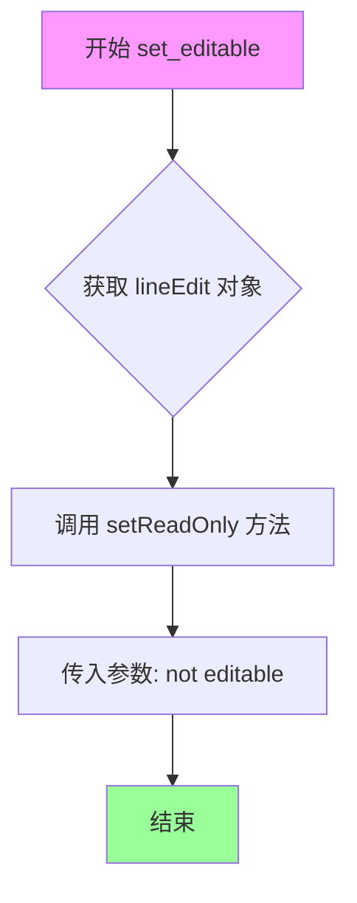

#### 带注释源码

```python
def set_editable(self, editable: bool):
    """Set whether the combo box is editable.
    
    通过设置内部 QLineEdit 的 readOnly 属性来控制组合框的可编辑状态。
    
    Args:
        editable: bool, True 表示可编辑, False 表示仅显示不可编辑
    """
    # 获取组合框内部的行编辑器对象，并设置其只读属性
    # 当 editable 为 True 时，setReadOnly(False) 允许用户输入
    # 当 editable 为 False 时，setReadOnly(True) 禁止用户输入
    self.lineEdit().setReadOnly(not editable) 
```


### `MComboBox.get_dayu_size`

获取组合框（ComboBox）的当前尺寸大小。

参数：

- `self`：`MComboBox`，调用此方法的实例对象本身。

返回值：`int`，返回当前设置的 `dayu_size` 值（整数类型）。

#### 流程图

```mermaid
flowchart TD
    A[Start] --> B[读取 self._dayu_size]
    B --> C[Return Value]
    C --> D[End]
```

#### 带注释源码

```python
def get_dayu_size(self):
    """
    获取组合框的高度尺寸
    :return: integer
    """
    return self._dayu_size
```


### `MComboBox.set_dayu_size`

该方法用于设置 MComboBox 组件的尺寸大小，通过修改内部 `_dayu_size` 属性的值，并将其应用到 lineEdit 组件的样式属性中，最后调用样式系统的 polish 方法来刷新样式。

参数：

- `value`：`int`，要设置的尺寸大小值

返回值：`None`，无返回值

#### 流程图

```mermaid
flowchart TD
    A[开始 set_dayu_size] --> B{检查 value 参数}
    B --> C[将 value 赋值给 self._dayu_size]
    C --> D[获取 lineEdit 对象]
    D --> E[调用 lineEdit.setProperty dayu_size]
    E --> F[调用 self.style.polish 刷新样式]
    F --> G[结束]
```

#### 带注释源码

```python
def set_dayu_size(self, value):
    """
    Set the avatar size.
    :param value: integer
    :return: None
    """
    # 将传入的尺寸值保存到实例变量 _dayu_size 中
    self._dayu_size = value
    # 获取组合框的编辑器组件，并设置自定义属性 dayu_size
    # 这个属性可以用于 QSS 样式表中的属性选择器
    self.lineEdit().setProperty("dayu_size", value)
    # 调用样式系统刷新组件样式，使属性更改生效
    self.style().polish(self)
```


### `MComboBox.set_formatter`

该方法用于设置自定义的显示格式化函数，以便在下拉组合框中显示文本时调用该函数进行处理。

参数：

- `func`：`Callable`，自定义的显示格式化函数，用于将值转换为显示文本

返回值：`None`，该方法没有返回值

#### 流程图

```mermaid
flowchart TD
    A[开始 set_formatter] --> B[接收 func 参数]
    B --> C[将 self._display_formatter 设置为 func]
    C --> D[结束]
```

#### 带注释源码

```python
def set_formatter(self, func):
    """
    设置显示格式化函数
    
    参数:
        func: 用于格式化显示文本的函数
        
    返回值:
        None
        
    示例:
        # 设置自定义格式化函数
        def custom_formatter(value):
            return f"Selected: {value}"
        
        combo_box.set_formatter(custom_formatter)
    """
    self._display_formatter = func  # 将传入的函数赋值给内部属性，用于后续显示文本的格式化
```


### `MComboBox.set_placeholder`

设置下拉框的占位符文本，当没有项目被选中时显示该提示文本。

参数：

-  `text`：`str`，需要设置的占位符文本内容

返回值：`None`，该方法没有返回值

#### 流程图

```mermaid
flowchart TD
    A[开始 set_placeholder] --> B[获取lineEdit控件]
    B --> C[调用setPlaceholderText设置占位符]
    C --> D[结束]
```

#### 带注释源码

```python
def set_placeholder(self, text):
    """Display the text when no item selected."""
    # 获取当前下拉框的行编辑控件
    # 并调用Qt的setPlaceholderText方法设置占位符文本
    self.lineEdit().setPlaceholderText(text)
```

---

### 补充说明

该方法是一个简单的包装器方法，它将传入的文本参数传递给内部 `lineEdit()` 控件的 `setPlaceholderText()` 方法。在 `MComboBox` 类的初始化方法 `__init__` 中，通过 `self.set_placeholder(self.tr("Please Select"))` 调用，将默认的占位符文本设置为 "Please Select"（请选择）。

**技术债务/优化空间**：
1. **代码重复**：在 `MFontComboBox` 类中存在完全相同的 `set_placeholder` 方法实现，可以考虑提取到 mixin 类中复用
2. **缺乏验证**：没有对 `text` 参数进行类型检查或空值处理
3. **国际化支持**：虽然使用了 `self.tr()` 进行翻译，但在 `set_placeholder` 调用时直接传递文本而非使用翻译函数


### `MComboBox.set_value`

设置组合框的值，通过 Qt 的 setProperty 方法将值存储在 "value" 属性中。

参数：

- `value`：`object`，要设置的值，可以是任意类型

返回值：`None`，无返回值

#### 流程图

```mermaid
graph TD
    A[开始 set_value] --> B{接收 value 参数}
    B --> C[调用 self.setProperty<br/>'value' 属性]
    C --> D[结束]
```

#### 带注释源码

```python
def set_value(self, value):
    """
    设置组合框的值。
    
    该方法通过 Qt 的 setProperty 将值存储在 'value' 属性中，
    实现与 Qt 属性系统的集成。
    
    参数:
        value: 任意类型，要设置的值
        
    返回值:
        None
    """
    self.setProperty("value", value)  # 使用 Qt 属性系统存储值
```


### `MComboBox._set_value`

该方法用于设置组合框的显示值，通过格式化器处理后显示在LineEdit上，并在存在根菜单时同步设置菜单的值。

参数：

- `value`：任意类型，需要设置的值，会经过格式化器处理后显示

返回值：`None`，无返回值

#### 流程图

```mermaid
flowchart TD
    A[开始 _set_value] --> B{value是否有值?}
    B -->|是| C[调用 _display_formatter 处理 value]
    B -->|否| D[调用 _display_formatter 处理空值]
    C --> E[将格式化后的文本设置到 lineEdit 的 text 属性]
    F{_root_menu 是否存在?}
    E --> F
    D --> F
    F -->|是| G[调用 _root_menu.set_value 同步设置菜单值]
    F -->|否| H[结束]
    G --> H
```

#### 带注释源码

```python
def _set_value(self, value):
    """
    设置组合框的显示值
    
    参数:
        value: 需要设置的值,可以是任意类型,会被_display_formatter格式化后显示
    """
    # 使用_display_formatter格式化器处理value,然后设置到lineEdit的text属性
    # _display_formatter负责将原始值转换为显示文本
    self.lineEdit().setProperty("text", self._display_formatter(value))
    
    # 如果存在_root_menu(自定义菜单),则同步将value传递给菜单
    # 这样可以保持组合框和菜单的值一致性
    if self._root_menu:
        self._root_menu.set_value(value)
```


### `MComboBox.set_menu`

该方法用于设置组合框的根菜单，并将菜单的值变化信号连接到组合框的信号上，实现菜单与组合框的联动。

参数：

- `menu`：任意类型，自定义菜单对象，用于作为组合框的下拉菜单根节点

返回值：`None`，无返回值

#### 流程图

```mermaid
graph TD
    A[开始 set_menu] --> B[将 menu 参数赋值给 self._root_menu]
    B --> C[连接 _root_menu.sig_value_changed 到 self.sig_value_changed]
    C --> D[连接 _root_menu.sig_value_changed 到 self.set_value]
    D --> E[结束]
```

#### 带注释源码

```python
def set_menu(self, menu):
    """
    设置组合框的根菜单
    :param menu: 菜单对象，通常为自定义的菜单类实例
    :return: None
    """
    # 将传入的菜单对象保存为当前组合框的根菜单
    self._root_menu = menu
    # 将根菜单的值变化信号连接到组合框的信号，当菜单值变化时发出 sig_value_changed
    self._root_menu.sig_value_changed.connect(self.sig_value_changed)
    # 将根菜单的值变化信号连接到 set_value 方法，实现菜单值同步到组合框显示
    self._root_menu.sig_value_changed.connect(self.set_value)
```


### `MComboBox.setView`

重写 `setView` 方法以标记 `_has_custom_view` 变量。当调用此方法设置自定义视图时，将 `_has_custom_view` 标志设置为 `True`，从而影响 `showPopup` 的行为显示自定义菜单还是默认弹出窗口。

参数：

- `*args`：可变位置参数，传递给父类 QtWidgets.QComboBox 的 setView 方法，用于指定视图模型或其他参数
- `**kwargs`：可变关键字参数，传递给父类 QtWidgets.QComboBox 的 setView 方法，用于指定视图模型或其他参数

返回值：`None`，无返回值（继承自父类 QComboBox.setView 的行为）

#### 流程图

```mermaid
flowchart TD
    A[开始 setView] --> B[设置 _has_custom_view = True]
    B --> C[调用父类 setView 方法]
    C --> D[传递 args 和 kwargs]
    D --> E[结束]
```

#### 带注释源码

```python
def setView(self, *args, **kwargs):
    """Override setView to flag _has_custom_view variable."""
    # 标记已设置自定义视图，后续 showPopup 会根据此标志决定行为
    self._has_custom_view = True
    # 调用父类 QComboBox 的 setView 方法，传递所有参数
    super(MComboBox, self).setView(*args, **kwargs)
```


### `MComboBox.showPopup`

该方法是 `MComboBox` 类的核心交互方法之一，用于重写 Qt 标准组合框的弹出行为。当用户触发下拉显示时，该方法会根据是否设置了自定义视图或根菜单来智能切换显示逻辑：若存在自定义视图或未设置根菜单，则调用父类的标准弹出显示；若已设置根菜单，则先隐藏标准弹出框，再在组合框下方弹出自定义菜单，从而实现自定义菜单与标准下拉行为的无缝融合。

参数：

- `self`：隐式参数，`MComboBox` 实例本身

返回值：`None`，该方法继承自 `QtWidgets.QComboBox.showPopup`，无返回值

#### 流程图

```mermaid
flowchart TD
    A[用户触发 showPopup] --> B{检查 _has_custom_view 或 _root_menu}
    B -->|是（存在自定义视图或无根菜单）| C[调用父类 showPopup]
    C --> D[显示标准下拉列表]
    B -->|否（存在根菜单）| E[调用父类 hidePopup]
    E --> F[获取全局坐标点]
    F --> G[在组合框底部弹出根菜单]
    G --> H[显示自定义菜单]
```

#### 带注释源码

```python
def showPopup(self):
    """
    Override default showPopup. When set custom menu, show the menu instead.
    
    该方法重写了 QComboBox 的 showPopup，用以实现自定义菜单的弹出显示。
    当组合框设置了自定义视图(_has_custom_view)或未设置根菜单(_root_menu为None)时，
    行为与标准组合框一致；当设置了根菜单时，则弹出自定义菜单替代默认下拉列表。
    """
    # 检查是否存在自定义视图或未设置根菜单
    if self._has_custom_view or self._root_menu is None:
        # 调用父类(QComboBox)的showPopup方法，显示标准下拉列表
        super(MComboBox, self).showPopup()
    else:
        # 存在根菜单的情况
        # 先隐藏标准弹出框（避免同时显示两个弹出框）
        super(MComboBox, self).hidePopup()
        # 计算菜单位置：组合框左下角的全局坐标
        # mapToGlobal将局部坐标转换为全局坐标，QPoint(0, self.height())表示组合框底部
        self._root_menu.popup(self.mapToGlobal(QtCore.QPoint(0, self.height())))
```


### `MComboBox.eventFilter`

该方法是一个事件过滤器，用于处理组合框中只读行编辑的鼠标按下事件。当用户点击只读的行编辑控件时，自动弹出下拉菜单，提升用户体验。

参数：

- `widget`：`QtCore.QObject`，被过滤事件的控件对象
- `event`：`QtCore.QEvent`，Qt事件对象，包含事件类型和相关信息

返回值：`bool`，返回父类 eventFilter 的处理结果，表示事件是否被处理

#### 流程图

```mermaid
flowchart TD
    A([开始 eventFilter]) --> B{检查 widget 是否为 lineEdit 且只读?}
    B -->|否| C[调用父类 eventFilter]
    B -->|是| D{事件类型是否为鼠标按钮按下?}
    D -->|否| C
    D -->|是| E[调用 showPopup 显示下拉菜单]
    E --> C
    C --> F([返回处理结果])
```

#### 带注释源码

```python
def eventFilter(self, widget, event):
    """
    事件过滤器，处理组合框的鼠标点击事件
    
    Args:
        widget: 被过滤事件的控件对象
        event: Qt事件对象
    
    Returns:
        bool: 父类eventFilter的返回值
    """
    # 检查是否为组合框的行编辑控件，且该控件是否为只读模式
    if widget is self.lineEdit() and widget.isReadOnly():
        # 检查是否为鼠标按钮按下事件
        if event.type() == QtCore.QEvent.MouseButtonPress:
            # 触发弹出下拉菜单
            self.showPopup()
    # 调用父类的事件过滤器，保持事件传递链的完整性
    return super(MComboBox, self).eventFilter(widget, event)
```


### `MComboBox.huge`

设置MComboBox为超大尺寸，用于快速调整下拉框组件的显示大小。该方法是fluent interface设计模式的一部分，支持方法链式调用。

参数： 无

返回值：`MComboBox`，返回实例本身以支持方法链式调用

#### 流程图

```mermaid
flowchart TD
    A[调用 huge 方法] --> B{检查 dayu_theme.huge 值}
    B --> C[调用 set_dayu_size 设置尺寸]
    C --> D[设置 lineEdit 的 dayu_size 属性]
    D --> E[调用 style polish 刷新样式]
    E --> F[返回 self 实例]
```

#### 带注释源码

```python
def huge(self):
    """Set MComboBox to huge size"""
    # 调用 set_dayu_size 方法，传入 dayu_theme.huge 常量来设置超大尺寸
    self.set_dayu_size(dayu_theme.huge)
    # 返回 self 以支持方法链式调用（如 combo.huge().set_value('xxx')）
    return self
```


### `MComboBox.large`

设置MComboBox组合框控件为大尺寸规格，通过调用set_dayu_size方法将控件尺寸设置为dayu_theme.large定义的大尺寸值，并返回自身以支持链式调用。

参数：

- 无

返回值：`MComboBox`，返回自身实例，支持链式调用

#### 流程图

```mermaid
flowchart TD
    A[开始 large 方法] --> B[调用 set_dayu_size 方法]
    B --> C[传入 dayu_theme.large 参数]
    C --> D{设置尺寸属性}
    D --> E[更新 lineEdit 的 dayu_size 属性]
    E --> F[调用 style polish 刷新样式]
    F --> G[返回 self 实例]
    G --> H[结束]
```

#### 带注释源码

```python
def large(self):
    """
    设置 MComboBox 为大尺寸
    
    该方法将组合框的尺寸设置为预定义的large规格，
    用于满足较大界面的布局需求。
    
    Returns:
        MComboBox: 返回自身实例，支持链式调用
                  例如: combo.large().set_value("test")
    """
    # 调用内部方法设置尺寸为dayu_theme.large
    self.set_dayu_size(dayu_theme.large)
    # 返回self以支持链式调用
    return self
```


### MComboBox.medium

设置 MComboBox 为中等尺寸。

参数：

- `self`：`MComboBox`，隐式参数，表示类的实例本身。

返回值：`MComboBox`，返回实例本身（self），以支持 Qt/Python 常见的链式调用风格。

#### 流程图

```mermaid
graph TD
    A([开始]) --> B[调用 set_dayu_size<br>参数: dayu_theme.medium]
    B --> C[设置组件尺寸属性]
    C --> D[返回 self]
    D --> E([结束])
```

#### 带注释源码

```python
def medium(self):
    """Set MComboBox to  medium"""
    # 调用 set_dayu_size 方法，传入 dayu_theme 模块中定义的中等大小数值
    self.set_dayu_size(dayu_theme.medium)
    # 返回实例本身，允许进行链式调用（例如：widget.medium().set_value('xxx')）
    return self
```


### `MComboBox.small`

设置 MComboBox 组件为小尺寸，通过调用 `set_dayu_size` 方法将尺寸设置为 `dayu_theme.small` 定义的小尺寸值，并返回实例本身以支持链式调用。

参数：

- 该方法无参数（仅包含 `self` 隐式参数）

返回值：`MComboBox`，返回实例本身，支持链式调用（例如 `combo.small().set_value("xxx")`）

#### 流程图

```mermaid
flowchart TD
    A[开始 small 方法] --> B{检查 dayu_theme.small 值}
    B --> C[调用 set_dayu_size 方法]
    C --> D[设置 lineEdit 的 dayu_size 属性]
    D --> E[调用 style polish 刷新样式]
    E --> F[返回 self 实例]
    F --> G[结束]
```

#### 带注释源码

```python
def small(self):
    """
    Set MComboBox to small size
    
    该方法将组合框的尺寸设置为小尺寸，适用于需要紧凑 UI 的场景。
    内部通过 dayu_theme.small 获取小尺寸的数值，然后调用 set_dayu_size
    方法进行实际设置。返回 self 以支持链式调用。
    
    Args:
        无
    
    Returns:
        MComboBox: 返回实例本身，支持链式调用
    """
    # 设置组合框尺寸为小尺寸
    self.set_dayu_size(dayu_theme.small)
    # 返回 self 以支持链式调用，如 combo.small().set_value("xxx")
    return self
```


### `MComboBox.tiny`

设置 MComboBox 为极小(tiny)尺寸，用于界面组件的大小调整。

参数：

- 无

返回值：`MComboBox`，返回 self 以支持链式调用（如 `combo.tiny().setEditable(True)`）

#### 流程图

```mermaid
graph TD
    A[开始] --> B{调用 tiny}
    B --> C[调用 self.set_dayu_size<br/>参数: dayu_theme.tiny]
    C --> D[设置 self._dayu_size = dayu_theme.tiny]
    D --> E[设置 lineEdit 的 property<br/>'dayu_size' = value]
    E --> F[调用 self.style().polish<br/>刷新组件样式]
    F --> G[返回 self]
    G --> H[结束]
    
    style B fill:#e1f5fe
    style G fill:#e8f5e8
    style H fill:#fff3e0
```

#### 带注释源码

```python
def tiny(self):
    """Set MComboBox to tiny size"""
    # 调用内部方法 set_dayu_size，传入 dayu_theme.tiny 常量
    # 该方法会完成三件事：
    # 1. 设置 self._dayu_size 属性值为 tiny
    # 2. 通过 setProperty 设置 lineEdit 的 dayu_size 属性
    # 3. 调用 style().polish() 刷新组件样式
    self.set_dayu_size(dayu_theme.tiny)
    
    # 返回 self 本身，支持链式调用
    # 例如: combo.tiny().setEditable(False)
    return self
```


### `MFontComboBox.__init__`

MFontComboBox类的初始化方法，用于创建一个支持搜索功能的字体选择下拉框组件，继承自MComboBoxSearchMixin和QtWidgets.QFontComboBox，设置下拉框的编辑状态、样式、事件过滤器和默认值。

参数：

- `parent`：`QtWidgets.QWidget` 或 `None`，父控件，默认为None

返回值：`None`，无返回值

#### 流程图

```mermaid
flowchart TD
    A[开始 __init__] --> B[调用父类__init__]
    B --> C[初始化_root_menu为None]
    C --> D[设置_display_formatter为工具函数]
    D --> E[设置下拉框为可编辑]
    E --> F[获取lineEdit控件]
    F --> G[设置文本边距4,0,4,0]
    G --> H[设置背景透明样式]
    H --> I[设置鼠标指针为手型]
    I --> J[安装事件过滤器]
    J --> K[设置_has_custom_view为False]
    K --> L[设置初始值为空字符串]
    L --> M[设置占位文本Please Select]
    M --> N[设置尺寸策略]
    N --> O[设置_dayu_size为默认大小]
    O --> P[结束 __init__]
```

#### 带注释源码

```python
def __init__(self, parent=None):
    """
    初始化MFontComboBox实例
    
    参数:
        parent: 父控件对象,默认为None
    """
    # 调用父类MComboBoxSearchMixin和QFontComboBox的初始化方法
    super(MFontComboBox, self).__init__(parent)

    # 初始化根菜单为None,用于存储自定义菜单
    self._root_menu = None
    # 使用工具模块的display_formatter作为默认显示格式化函数
    self._display_formatter = utils.display_formatter
    # 设置下拉框为可编辑状态,允许用户输入搜索
    self.setEditable(True)
    # 获取下拉框的行编辑控件
    line_edit = self.lineEdit()
    # 注释掉设置为只读的代码,允许用户编辑
    # line_edit.setReadOnly(True)
    # 设置文本边距:左4,上0,右4,下0
    line_edit.setTextMargins(4, 0, 4, 0)
    # 设置背景色为透明
    line_edit.setStyleSheet("background-color:transparent")
    # 设置鼠标悬停时为手型指针
    line_edit.setCursor(QtCore.Qt.PointingHandCursor)
    # 安装事件过滤器到行编辑控件,用于处理鼠标点击事件
    line_edit.installEventFilter(self)
    # 标记是否设置了自定义视图
    self._has_custom_view = False
    # 设置初始值为空字符串
    self.set_value("")
    # 设置占位符文本,提示用户选择
    self.set_placeholder(self.tr("Please Select"))
    # 设置尺寸策略:水平方向扩展,垂直方向最小
    self.setSizePolicy(QtWidgets.QSizePolicy.Expanding, QtWidgets.QSizePolicy.Minimum)
    # 设置组件的dayu_size属性为默认大小
    self._dayu_size = dayu_theme.default_size
```


### `MFontComboBox.get_dayu_size`

获取 MFontComboBox 的 dayu_size 属性值，用于控制组合框的尺寸大小。

参数：

-  `self`：`MFontComboBox`（隐式参数），调用该方法的实例对象本身

返回值：`int`，返回当前组合框的尺寸值（整数）

#### 流程图

```mermaid
flowchart TD
    A[开始] --> B{执行 get_dayu_size 方法}
    B --> C[返回 self._dayu_size]
    C --> D[结束]
```

#### 带注释源码

```python
def get_dayu_size(self):
    """
    Get the push button height
    :return: integer
    """
    return self._dayu_size
```

---

**备注**：
- 该方法是 Qt Property 系统的一部分，配合 `set_dayu_size` 方法通过 `QtCore.Property(int, get_dayu_size, set_dayu_size)` 定义了 `dayu_size` 属性
- `_dayu_size` 是实例变量，在 `MFontComboBox.__init__` 中初始化为 `dayu_theme.default_size`
- 该方法是一个简单的 getter 方法，用于获取组合框的尺寸配置值


### `MFontComboBox.set_dayu_size`

该方法用于设置字体组合框（Font ComboBox）的尺寸大小。它不仅更新了对象内部的 `_dayu_size` 属性，还将该尺寸值传递给内部的行编辑组件（QLineEdit），并强制刷新组件的样式，以确保 UI 上的尺寸变化能够立即生效。

**参数：**

- `value`：`int`，要设置的尺寸大小值。

**返回值：** `None`，无返回值。

#### 流程图

```mermaid
graph TD
    A([开始设置尺寸]) --> B[更新内部变量: self._dayu_size = value]
    B --> C[获取内部行编辑组件: line_edit = self.lineEdit()]
    C --> D[设置行编辑组件属性: line_edit.setProperty('dayu_size', value)]
    D --> E[刷新组件样式: self.style().polish(self)]
    E --> F([结束])
```

#### 带注释源码

```python
def set_dayu_size(self, value):
    """
    Set the avatar size.
    :param value: integer
    :return: None
    """
    # 1. 更新实例内部的尺寸状态变量
    self._dayu_size = value
    
    # 2. 获取当前的下拉框中的行编辑框(LineEdit)对象
    # 这里假设 self.lineEdit() 总是返回一个有效的 QLineEdit 对象
    line_edit = self.lineEdit()
    
    # 3. 在行编辑框上设置自定义属性 'dayu_size'
    # 这允许 Qt 的样式表 (QSS/QSS) 根据这个属性动态调整外观(如高度、字体大小等)
    line_edit.setProperty("dayu_size", value)
    
    # 4. 强制刷新整个组合框的样式
    # pollish 会重新应用样式表，确保属性更改立即在UI上体现
    self.style().polish(self)
```


### `MFontComboBox.set_formatter`

该方法用于设置 MFontComboBox 的显示格式化函数，通过传入的自定义函数来控制下拉框中选项的文本显示格式。

参数：

- `func`：`callable`，自定义的格式化函数，用于将数据值转换为显示文本

返回值：`None`，该方法无返回值

#### 流程图

```mermaid
graph TD
    A[开始 set_formatter] --> B[接收 func 参数]
    B --> C{func 是否为有效函数}
    C -->|是| D[将 func 赋值给 _display_formatter]
    C -->|否| E[保持原有的 _display_formatter]
    D --> F[结束]
    E --> F
```

#### 带注释源码

```python
def set_formatter(self, func):
    """
    设置显示格式化函数
    
    该方法允许用户自定义下拉框中选项的文本显示格式。
    传入的函数将会在显示选项时被调用，用于将原始数据值
    转换为用户可见的文本内容。
    
    Args:
        func: 一个可调用对象（函数），接受一个参数（数据值），
              返回一个字符串（显示文本）
    
    Returns:
        None
    """
    # 将传入的格式化函数赋值给内部属性 _display_formatter
    # 该属性会在 _set_value 方法中被使用来格式化显示文本
    self._display_formatter = func
```


### `MFontComboBox.set_placeholder`

设置当没有选中任何项目时显示的占位符文本。

参数：

- `text`：`str`，要显示的占位符文本内容

返回值：`None`，该方法不返回值，仅执行设置操作

#### 流程图

```mermaid
flowchart TD
    A[开始 set_placeholder] --> B{获取 lineEdit}
    B --> C[调用 lineEdit.setPlaceholderText]
    C --> D[传入参数 text]
    D --> E[结束]
```

#### 带注释源码

```python
def set_placeholder(self, text):
    """Display the text when no item selected."""
    # 获取当前组合框的行编辑对象
    # 然后调用 Qt 的 setPlaceholderText 方法设置占位符
    self.lineEdit().setPlaceholderText(text)
```


### MFontComboBox.set_value

该方法用于设置 `MFontComboBox` 组件的内部值属性，它通过 Qt 的属性系统将传入的值绑定到控件的 `value` 属性上。

参数：

-  `value`：`object`，需要设置的具体值

返回值：`None`，无返回值

#### 流程图

```mermaid
graph TD
    A[Start] --> B{执行 self.setProperty<br/>('value', value)}
    B --> C[End]
```

#### 带注释源码

```python
def set_value(self, value):
    """
    设置组件的值属性。
    :param value: 任意对象，需要保存的值
    """
    self.setProperty("value", value)
```


### MFontComboBox._set_value

该方法是一个私有方法（非公开API），用于内部更新组合框的显示文本。当外部通过set_value设置值时，会调用此方法来更新UI显示的文本内容，并同步更新关联菜单的值。

参数：

- `value`：`object`，需要设置到组合框的值，会经过_display_formatter格式化后显示

返回值：`None`，该方法没有返回值

#### 流程图

```mermaid
graph TD
    A[开始 _set_value] --> B[获取 lineEdit 对象]
    B --> C[调用 _display_formatter 格式化 value]
    C --> D[设置 lineEdit 的 text 属性为格式化后的文本]
    D --> E{检查 _root_menu 是否存在}
    E -->|是| F[调用 _root_menu.set_value 同步更新菜单值]
    E -->|否| G[结束]
    F --> G
```

#### 带注释源码

```python
def _set_value(self, value):
    """
    内部方法，用于设置组合框的显示值
    
    参数:
        value: 任意类型，需要显示的值，会经过_display_formatter格式化
    """
    # 获取组合框的行编辑控件
    self.lineEdit().setProperty("text", self._display_formatter(value))
    
    # 如果存在关联的根菜单，则同步更新菜单的值
    if self._root_menu:
        self._root_menu.set_value(value)
```


### `MFontComboBox.set_menu`

该方法用于设置 `MFontComboBox` 的根菜单，将传入的菜单对象关联到组合框，并建立信号连接以实现菜单值变化时同步更新组合框的值。

参数：

- `menu`：菜单对象（类型视具体实现而定，通常为自定义菜单类），要设置的根菜单对象

返回值：`None`，无返回值描述

#### 流程图

```mermaid
flowchart TD
    A[开始 set_menu] --> B[将 menu 赋值给 self._root_menu]
    B --> C[连接菜单的 sig_value_changed 信号到组合框的 sig_value_changed 信号]
    C --> D[连接菜单的 sig_value_changed 信号到组合框的 set_value 方法]
    D --> E[结束]
```

#### 带注释源码

```python
def set_menu(self, menu):
    """
    设置根菜单并连接信号
    :param menu: 菜单对象
    :return: None
    """
    # 将传入的菜单对象保存为根菜单
    self._root_menu = menu
    
    # 连接菜单的值变化信号到组合框的值变化信号
    # 这样当菜单值变化时，会触发组合框的信号
    self._root_menu.sig_value_changed.connect(self.sig_value_changed)
    
    # 连接菜单的值变化信号到组合框的 set_value 方法
    # 这样当菜单值变化时，会自动更新组合框的显示值
    self._root_menu.sig_value_changed.connect(self.set_value)
```


### `MFontComboBox.setView`

该方法用于重写 QFontComboBox 的 setView 方法，在调用父类方法之前设置 `_has_custom_view` 标志，以指示已使用自定义视图。

参数：

- `*args`：可变位置参数，传递给父类 QFontComboBox.setView 方法的参数
- `**kwargs`：可变关键字参数，传递给父类 QFontComboBox.setView 方法的关键字参数

返回值：`None`，无返回值（该方法修改实例的内部状态 `_has_custom_view`）

#### 流程图

```mermaid
flowchart TD
    A[开始 setView] --> B[设置 self._has_custom_view = True]
    B --> C[调用父类 setView 方法]
    C --> D[传入 *args 和 **kwargs 参数]
    D --> E[结束]
```

#### 带注释源码

```python
def setView(self, *args, **kwargs):
    """Override setView to flag _has_custom_view variable."""
    # 将实例变量 _has_custom_view 设置为 True
    # 用于标记该组合框已使用自定义视图
    self._has_custom_view = True
    # 调用父类 QtWidgets.QFontComboBox 的 setView 方法
    # 传递所有接收到的参数
    super(MFontComboBox, self).setView(*args, **kwargs)
```


### `MFontComboBox.showPopup`

覆盖默认的 showPopup 方法。当设置了自定义菜单时，显示自定义菜单而不是默认的弹出框；否则使用父类的默认行为。

参数：

- 该方法无显式参数（仅有隐含的 `self` 参数）

返回值：`None`，无返回值

#### 流程图

```mermaid
flowchart TD
    A[开始 showPopup] --> B{检查条件: _has_custom_view or _root_menu is None}
    B -->|是| C[调用父类 QComboBox.showPopup]
    B -->|否| D[调用父类 hidePopup 隐藏当前弹出框]
    D --> E[计算菜单位置: mapToGlobal(QPoint(0, height))]
    E --> F[_root_menu.popup 在计算位置弹出菜单]
    C --> G[结束]
    F --> G
```

#### 带注释源码

```python
def showPopup(self):
    """
    Override default showPopup. When set custom menu, show the menu instead.
    覆盖默认的 showPopup 方法。当设置了自定义菜单时，显示菜单而不是默认的弹出框。
    """
    # 判断条件：是否有自定义视图 或者 根菜单是否为空
    if self._has_custom_view or self._root_menu is None:
        # 如果有自定义视图或没有根菜单，调用父类的默认 showPopup 方法
        super(MFontComboBox, self).showPopup()
    else:
        # 否则，先隐藏当前的弹出框
        super(MFontComboBox, self).hidePopup()
        # 计算菜单位置：相对于控件全局坐标，y 坐标为控件底部
        # self.mapToGlobal 将局部坐标转换为全局屏幕坐标
        # QPoint(0, self.height()) 表示控件底部左侧位置
        self._root_menu.popup(self.mapToGlobal(QtCore.QPoint(0, self.height())))
```


### `MFontComboBox.eventFilter`

该方法是 `MFontComboBox` 类的事件过滤器，用于拦截只读状态下的 LineEdit 控件的鼠标按下事件，当用户点击只读的下拉选择框时自动弹出下拉菜单。

参数：

- `widget`：`QtCore.QObject`，事件过滤的目标对象，通常是 QLineEdit 控件
- `event`：`QtCore.QEvent`，Qt 事件对象，包含事件类型和相关数据

返回值：`bool`，返回 False 表示事件未被处理，传递给父类处理

#### 流程图

```mermaid
flowchart TD
    A[开始 eventFilter] --> B{检查 widget 是否为 LineEdit}
    B -->|否| F[调用父类 eventFilter]
    B -->|是| C{检查 widget.isReadOnly}
    C -->|否| F
    C -->|是| D{检查事件类型}
    D -->|MouseButtonPress| E[调用 showPopup]
    D -->|其他| F
    E --> F
    F --> G[返回结果]
```

#### 带注释源码

```python
def eventFilter(self, widget, event):
    """
    事件过滤器，处理只读状态下的 LineEdit 鼠标按下事件
    
    参数:
        widget: QtCore.QObject - 事件过滤的目标对象
        event: QtCore.QEvent - Qt 事件对象
    返回:
        bool - 事件是否被处理
    """
    # 判断事件目标是否为当前 ComboBox 的 LineEdit 控件
    # 并且 LineEdit 是否处于只读模式（用户不可编辑）
    if widget is self.lineEdit() and widget.isReadOnly():
        # 检查是否是鼠标按钮按下事件
        if event.type() == QtCore.QEvent.MouseButtonPress:
            # 触发显示下拉弹出菜单
            self.showPopup()
    
    # 调用父类的事件过滤器，确保 Qt 的默认处理逻辑正常执行
    return super(MFontComboBox, self).eventFilter(widget, event)
```


### `MFontComboBox.huge`

该方法用于将 MFontComboBox 组件的尺寸设置为 "huge"（超大）规格，通过调用 `set_dayu_size` 方法并传入 `dayu_theme.huge` 常量来实现，同时返回实例本身以支持链式调用。

参数：

- （无参数）

返回值：`MFontComboBox`，返回实例本身，支持链式调用（如 `combo.huge().set_value("text")`）

#### 流程图

```mermaid
flowchart TD
    A[开始] --> B[调用 self.set_dayu_size dayu_theme.huge]
    B --> C[设置 lineEdit 的 dayu_size 属性]
    C --> D[调用 style polish 更新样式]
    D --> E[返回 self]
    E --> F[结束]
```

#### 带注释源码

```python
def huge(self):
    """Set MComboBox to huge size"""
    # 调用 set_dayu_size 方法，传入 dayu_theme.huge 常量
    # 这会将 _dayu_size 属性设置为 huge 对应的整数值
    self.set_dayu_size(dayu_theme.huge)
    # 返回 self 本身，实现链式调用
    # 例如：combo.huge().set_value("text")
    return self
```


### `MFontComboBox.large`

设置 MFontComboBox 为大号尺寸，并返回自身以支持链式调用。

参数： 无

返回值：`MFontComboBox`，返回实例本身（self），用于链式调用。

#### 流程图

```mermaid
flowchart TD
    A[开始 large 方法] --> B{检查尺寸配置}
    B --> C[调用 set_dayu_size 方法]
    C --> D[传入 dayu_theme.large 参数]
    D --> E[设置 lineEdit 的 dayu_size 属性]
    E --> F[调用 style polish 刷新样式]
    F --> G[返回 self 实例]
    G --> H[结束]
```

#### 带注释源码

```python
def large(self):
    """Set MComboBox to large size"""
    # 调用 set_dayu_size 方法，传入大号尺寸常量
    self.set_dayu_size(dayu_theme.large)
    # 返回 self 自身，支持链式调用（如 combo.large().set_value('xxx')）
    return self
```


### `MFontComboBox.medium`

设置字体组合框（MFontComboBox）的尺寸为中等大小（Medium），并返回实例本身以支持链式调用。

参数：

-  `self`：`MFontComboBox`，调用此方法的类实例本身。

返回值：`MFontComboBox`，返回实例对象本身，实现 Fluent Interface（流式接口），便于进行连续的方法调用（如 `widget.medium().set_value(...)`）。

#### 流程图

```mermaid
graph LR
    A((Start)) --> B[调用 self.set_dayu_size<br/>参数: dayu_theme.medium]
    B --> C[更新内部属性 _dayu_size]
    C --> D[更新 lineEdit 的 dayu_size 属性并刷新样式]
    D --> E[return self]
    E --> F((End))
```

#### 带注释源码

```python
def medium(self):
    """Set MComboBox to  medium"""
    # 调用 set_dayu_size 方法，将尺寸设置为 dayu_theme 中定义的中等值
    self.set_dayu_size(dayu_theme.medium)
    # 返回实例本身，允许方法链式调用
    return self
```


### `MFontComboBox.small`

设置MFontComboBox为小尺寸，并返回自身以支持链式调用。

参数：

- 无

返回值：`MFontComboBox`，返回实例本身，支持链式调用

#### 流程图

```mermaid
flowchart TD
    A[调用 small 方法] --> B{检查当前尺寸}
    B -->|设置新尺寸| C[调用 set_dayu_size dayu_theme.small]
    C --> D[设置 lineEdit 的 dayu_size 属性]
    D --> E[调用 style polish 刷新样式]
    F[返回 self]
    E --> F
```

#### 带注释源码

```python
def small(self):
    """Set MComboBox to small size"""
    # 调用set_dayu_size方法，将尺寸设置为dayu_theme.small定义的小尺寸值
    # dayu_theme.small是一个预定义的整数值，代表小号尺寸的像素高度
    self.set_dayu_size(dayu_theme.small)
    # 返回self实例本身，支持链式调用，例如: combo.small().medium()
    return self
```


### `MFontComboBox.tiny`

该方法用于将字体组合框的尺寸设置为预定义的“tiny”大小，并返回实例本身以支持方法链式调用。

参数：

-  `self`：`MFontComboBox`，调用此方法的实例本身。

返回值：`MFontComboBox`，返回实例本身（Self），以支持链式调用（例如 `combo.tiny().medium()`）。

#### 流程图

```mermaid
flowchart TD
    A([Start tiny()]) --> B{Set Size}
    B --> C[调用 self.set_dayu_size(dayu_theme.tiny)]
    C --> D[返回 self]
    D --> E([End])
```

#### 带注释源码

```python
def tiny(self):
    """Set MComboBox to tiny size"""
    # 调用内部的 setter 方法，将 _dayu_size 属性设置为 dayu_theme 中定义的 tiny 值
    self.set_dayu_size(dayu_theme.tiny)
    # 返回 self，这是实现 fluent interface (流式接口) 的关键，允许连续调用其他方法
    return self
```

#### 潜在的技术债务或优化空间

1.  **代码重复 (Code Duplication)**：`MFontComboBox` 类中的 `tiny()`, `small()`, `medium()`, `large()`, `huge()` 方法与 `MComboBox` 类中的对应方法实现完全相同。这违反了 DRY (Don't Repeat Yourself) 原则。
    *   **建议**：可以将这些尺寸设置方法提取到一个通用的 Mixin 类（如 `MDayuSizeMixin`）或基类中，让 `MComboBox` 和 `MFontComboBox` 继承该组件，以减少维护成本。
2.  **设计模式应用**：当前通过 `huge()`, `tiny()` 等方法返回 `self` 实现了 Fluent Interface，但如果需要动态获取当前尺寸，可能需要增强状态管理。

#### 其它项目

**设计目标与约束**：
*   **目标**：提供一个支持 Fluent Interface 的字体选择下拉框组件，允许通过链式调用快速调整 UI 尺寸。
*   **约束**：依赖于 `dayu_theme` 模块中定义的尺寸常量。

**错误处理与异常设计**：
*   该方法本身不涉及复杂的业务逻辑或外部输入验证，因此没有显式的异常捕获。如果 `dayu_theme.tiny` 未定义，在运行时调用 `set_dayu_size` 时会抛出 `AttributeError` 或 `NameError`，这属于上游配置错误。

**数据流与状态机**：
*   **状态**：修改了对象内部的 `_dayu_size` 属性。
*   **副作用**：调用 `set_dayu_size` 会触发 Qt 的 `style().polish(self)`，这会重新应用样式表（QSS），可能导致界面闪烁或性能开销。


## 关键组件


### MComboBoxSearchMixin

搜索功能混入类，提供组合框的搜索过滤和自动补全功能。通过QSortFilterProxyModel实现惰性过滤，使用MCompleter实现无过滤弹出式自动完成，支持大小写不敏感搜索。

### MComboBox

主组合框组件类，继承自QtWidgets.QComboBox。支持自定义根菜单弹出、可配置大小(tiny/small/medium/large/huge)、占位符文本显示、自定义格式化器、事件过滤实现只读状态下的点击弹出、信号value_changed传递。

### MFontComboBox

字体选择组合框组件类，继承自QtWidgets.QFontComboBox。功能与MComboBox类似，用于字体选择场景。

### filter_model (QSortFilterProxyModel)

搜索过滤模型，提供大小写不敏感的文本过滤功能，作为数据源与completer之间的代理层。

### completer (MCompleter)

自动完成器，使用无过滤弹出模式(UnfilteredPopupCompletion)，直接从filter_model获取候选数据。

### _root_menu

根菜单对象，支持自定义菜单弹出逻辑，当设置自定义菜单时，showPopup会优先显示菜单而非默认下拉框。

### _display_formatter

显示格式化函数，用于格式化组合框显示的文本值。

### dayu_size 属性

Qt属性系统实现的尺寸配置，支持通过set_dayu_size和get_dayu_size方法动态调整组合框尺寸。

### eventFilter 事件过滤

处理只读lineEdit的鼠标点击事件，触发弹出框显示，实现自定义交互逻辑。


## 问题及建议


### 已知问题

- **严重的代码重复**：MComboBox 和 MFontComboBox 类存在约90%的重复代码，除继承父类不同外，方法实现几乎完全一致，应提取为基类或使用组合模式。
- **未使用的代码**：MComboBoxSearchMixin 中的 `_set_searchable` 方法定义但未被调用作为 Qt Property 使用，可能是有意设计但未完成的功能。
- **信号重复连接**：在 `set_menu` 方法中，`sig_value_changed` 信号被连接到两个不同的槽（`sig_value_changed` 和 `set_value`），可能导致重复触发和意外行为。
- **不一致的只读设置**：MComboBox 中 lineEdit 设置为只读，而 MFontComboBox 中对应代码被注释，导致两个类的行为不一致。
- **过时的导入**：使用 `from __future__ import` 导入 absolute_import、division、print_function，这些是 Python 2 兼容代码，在 Python 3 时代已无必要。
- **魔法值和硬编码**：分隔符 "/"、文本边距 (4,0,4,0)、背景色 "transparent" 等值硬编码在多处。
- **事件过滤器潜在缺陷**：eventFilter 中对只读状态的判断逻辑在不同组合框类型间可能产生不同行为。

### 优化建议

- 将 MComboBox 和 MFontComboBox 的公共逻辑提取到抽象基类中，通过参数化或模板方法模式处理差异。
- 清理未使用的 `_set_searchable` 方法，或完成其作为 Qt Property 的实现。
- 修复信号连接逻辑，避免重复触发，可使用唯一的中间槽方法处理。
- 统一 MComboBox 和 MFontComboBox 的只读设置行为。
- 移除 Python 2 兼容的 future 导入。
- 将硬编码的配置值（如边距、颜色、占位符文本）提取为类属性或配置常量。
- 添加更完善的文档字符串，特别是参数和返回值说明。
- 考虑添加资源清理机制（如析构函数或上下文管理器支持）以处理 filter_model 和 completer 的生命周期。


## 其它


### 设计目标与约束

本组件的设计目标是提供一个功能增强的下拉选择框控件，支持搜索过滤、自定义菜单弹出、多种尺寸主题定制以及值的格式化显示。设计约束包括：必须继承自Qt的QComboBox和QFontComboBox以保持Qt原生兼容性；使用mixin机制实现功能解耦；通过dayu_theme统一管理尺寸主题；搜索功能依赖MCompleter和QSortFilterProxyModel实现模糊匹配。

### 错误处理与异常设计

代码中存在被注释掉的`setCurrentIndex`方法抛出`NotImplementedError`，表明该功能未实现。当模型（model）为空时，`filter_model.setSourceModel(model)`可能导致异常。`findText`方法在未找到匹配项时返回-1，需要处理这种情况。事件过滤器中需要检查`widget`是否为`None`以避免空指针异常。建议添加模型为空时的防御性检查，以及对`findText`返回-1的处理逻辑。

### 数据流与状态机

数据流向如下：用户输入文本 → `textEdited`信号 → `filter_model.setFilterFixedString`过滤 → 过滤后的模型显示在补全列表中 → 用户选择项 → `completer.activated`信号 → `setCurrentIndex`更新选中项 → `_set_value`更新显示文本 → 触发`sig_value_changed`信号。状态机包括：默认状态（显示占位符）、选中状态（显示选中值）、编辑状态（可输入搜索）、弹出菜单显示状态。当`_has_custom_view`为True或`_root_menu`为None时显示默认弹出菜单，否则显示自定义菜单。

### 外部依赖与接口契约

主要外部依赖包括：PySide6.QtCore和PySide6.QtWidgets（Qt核心库）、MCompleter（自定义补全器，接口需提供setCompletionMode、setModel、setCompletionColumn、activated信号）、cursor_mixin、focus_shadow_mixin、property_mixin（三个mixin类提供光标、焦点阴影和属性功能）、dayu_theme（提供default_size、huge、large、medium、small、tiny尺寸常量）、utils.display_formatter（格式化显示函数）。公开接口包括：setModel、setModelColumn、set_editable、get_dayu_size、set_dayu_size、set_formatter、set_placeholder、set_value、set_menu、setView、showPopup、eventFilter、huge/large/medium/small/tiny尺寸方法。

### 线程安全与并发考虑

该组件主要运行在主UI线程中，信号槽机制本身是线程安全的，但需要注意模型（model）的线程亲和性。如果在非主线程中修改模型，可能导致未定义行为。建议所有模型操作都在主线程中执行，或使用Qt的信号槽跨线程机制进行通信。

### 性能优化建议

当前实现中每次文本编辑都会触发过滤操作，对于大数据量模型可能存在性能瓶颈。建议考虑：1）添加输入防抖（debounce）机制；2）对filter_model设置合理的过滤策略；3）对于超大数据量考虑虚拟化或分页加载。另外，`_display_formatter`在每次值变化时都会调用，如果格式化逻辑复杂可考虑缓存机制。

### 可访问性（Accessibility）支持

当前实现主要依赖视觉交互，对屏幕阅读器支持有限。建议：1）为lineEdit添加合适的accessibleName和accessibleDescription；2）确保键盘导航正常工作（当前通过eventFilter处理鼠标点击，但Tab键导航需验证）；3）考虑添加键盘快捷键触发弹出菜单。

    