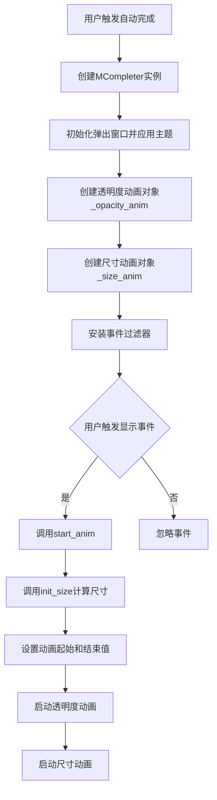
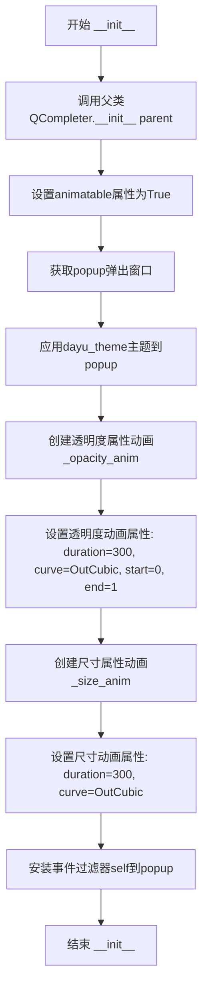
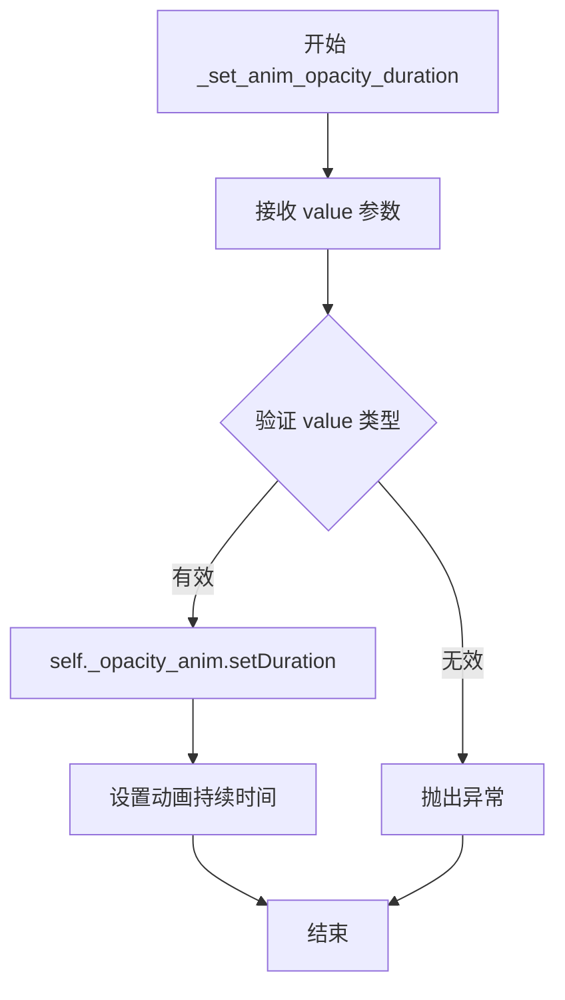
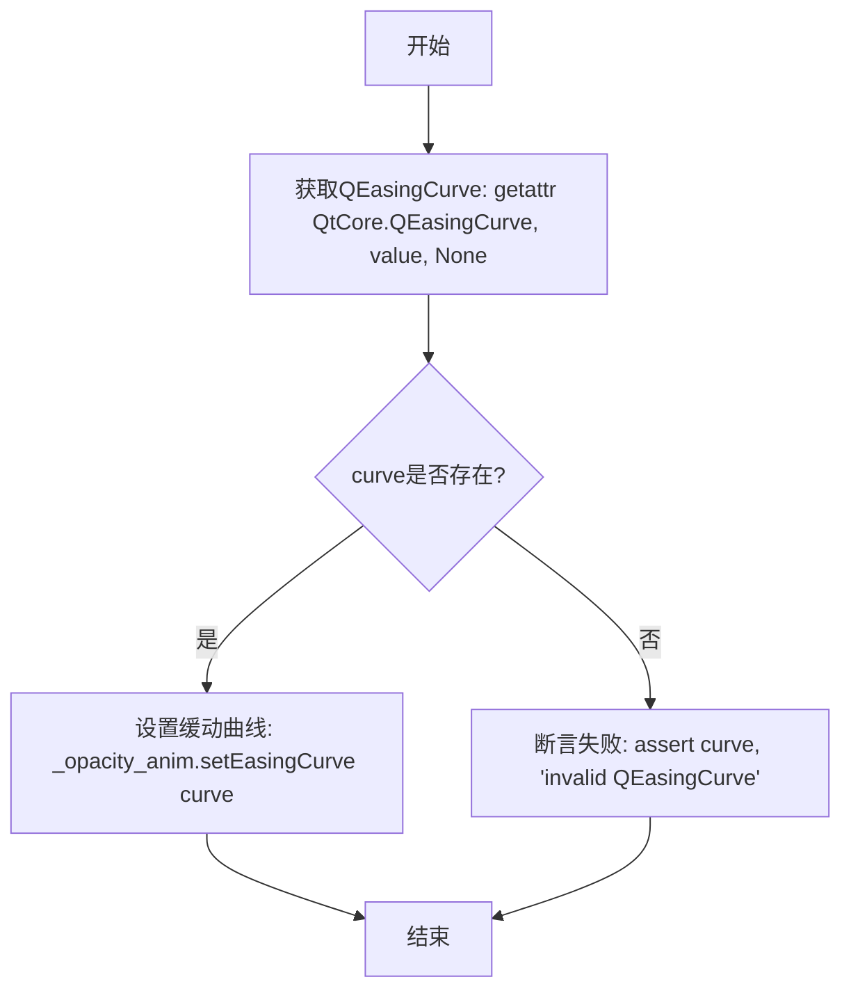
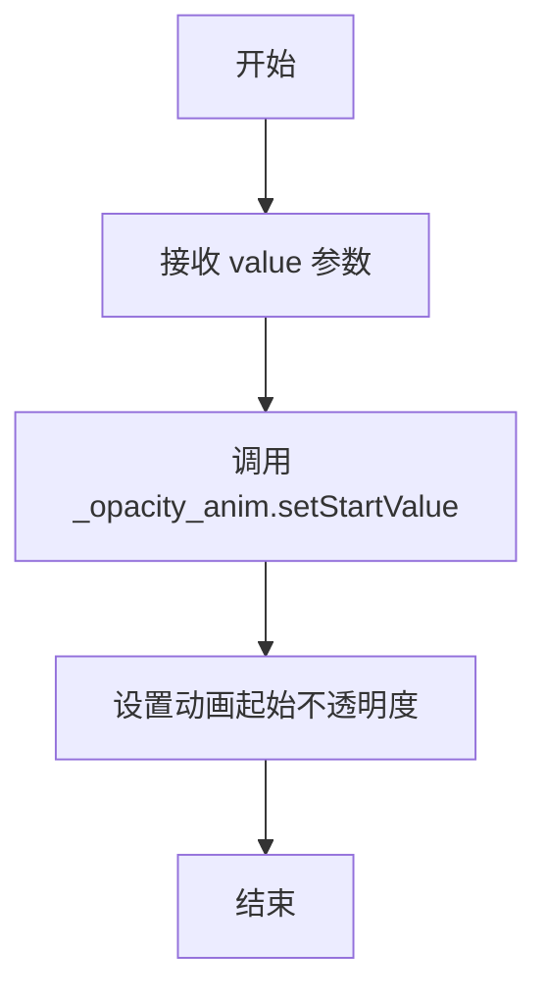
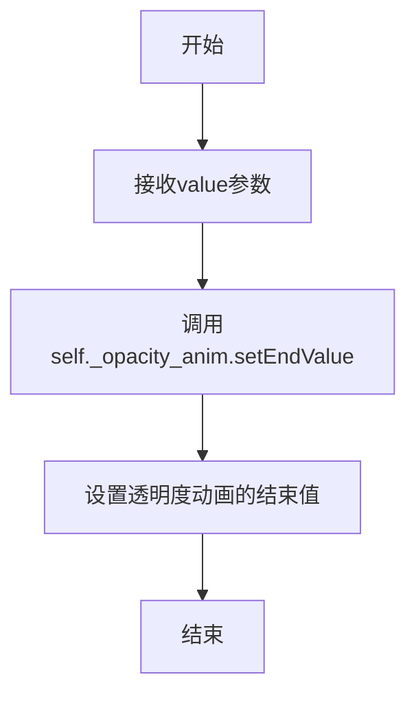
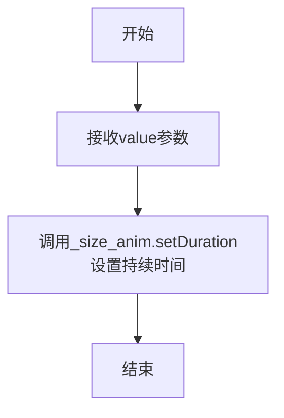
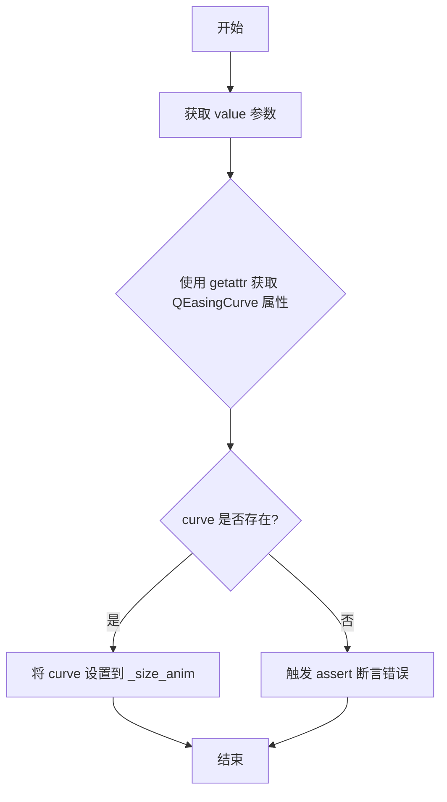
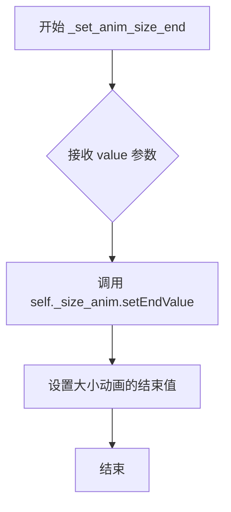
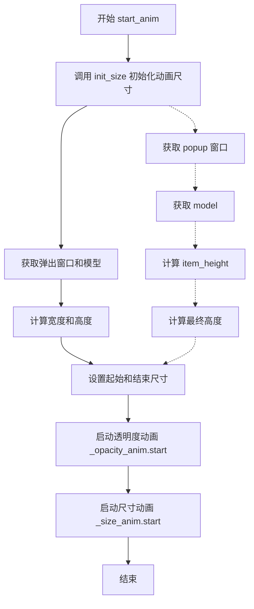

# `comic-translate\app\ui\dayu_widgets\completer.py` 详细设计文档

MCompleter是一个继承自Qt QCompleter的自定义自动完成组件，通过QPropertyAnimation实现了弹出列表的透明度（windowOpacity）和尺寸（size）动画效果，支持通过Qt属性系统配置动画持续时间、缓动曲线和起始/结束值。

## 整体流程



## 类结构

```
QtWidgets.QCompleter (Qt内置基类)
└── MCompleter (自定义实现)
```

## 全局变量及字段


### `dayu_theme`
    
用于应用主题样式的模块

类型：`模块对象`
    


### `property_mixin`
    
提供属性混入功能的模块

类型：`混入类/函数`
    


### `MCompleter.ITEM_HEIGHT`
    
自动补全项的高度常量，值为28像素

类型：`整数(int)`
    


### `MCompleter._opacity_anim`
    
控制弹出窗口透明度变化的动画对象

类型：`QPropertyAnimation`
    


### `MCompleter._size_anim`
    
控制弹出窗口尺寸变化的动画对象

类型：`QPropertyAnimation`
    
    

## 全局函数及方法


### `MCompleter.__init__`

该方法是MCompleter类的初始化方法，负责设置自动补全弹出框的动画效果，包括透明度动画和尺寸动画，并安装事件过滤器以在显示时触发动画。

参数：

- `self`：`MCompleter`，MCompleter类的实例对象
- `parent`：`QWidget | None`，父控件对象，传递给Qt基类的初始化参数，默认为None

返回值：`None`，Python中`__init__`方法不返回值

#### 流程图



#### 带注释源码

```python
def __init__(self, parent=None):
    """
    MCompleter类的初始化方法
    
    参数:
        parent: 父控件，默认为None
    """
    # 调用父类QCompleter的初始化方法，传入parent参数
    super(MCompleter, self).__init__(parent)
    
    # 设置animatable属性为True，标记该控件支持动画
    self.setProperty("animatable", True)

    # 获取自动补全的弹出窗口popup
    popup = self.popup()
    
    # 应用dayu_theme主题到popup
    dayu_theme.apply(popup)

    # 创建透明度属性动画，针对popup的windowOpacity属性
    self._opacity_anim = QtCore.QPropertyAnimation(popup, b"windowOpacity")
    
    # 设置透明度动画持续时间300毫秒
    self.setProperty("anim_opacity_duration", 300)
    # 设置透明度动画曲线为OutCubic
    self.setProperty("anim_opacity_curve", "OutCubic")
    # 设置透明度动画起始值为0
    self.setProperty("anim_opacity_start", 0)
    # 设置透明度动画结束值为1
    self.setProperty("anim_opacity_end", 1)

    # 创建尺寸属性动画，针对popup的size属性
    self._size_anim = QtCore.QPropertyAnimation(popup, b"size")
    # 设置尺寸动画持续时间300毫秒
    self.setProperty("anim_size_duration", 300)
    # 设置尺寸动画曲线为OutCubic
    self.setProperty("anim_size_curve", "OutCubic")

    # 为popup安装事件过滤器，监听Show事件
    popup.installEventFilter(self)
```


### `MCompleter._set_anim_opacity_duration`

设置透明度动画的持续时间，通过直接调用内部动画对象的 `setDuration` 方法来配置动画时长。

参数：

- `value`：`int`，动画持续时间值（毫秒），传递给 QPropertyAnimation 的 setDuration 方法

返回值：`None`，无返回值，该方法直接修改对象内部状态

#### 流程图



#### 带注释源码

```python
def _set_anim_opacity_duration(self, value):
    """
    设置透明度动画的持续时间
    
    参数:
        value: 动画持续时间值，单位为毫秒
        
    说明:
        该方法是作为 property_mixin 的 setter 使用的，
        通过自定义 Qt 属性 'anim_opacity_duration' 来间接调用此方法。
        内部委托给 self._opacity_anim 对象的 setDuration 方法。
    """
    # 调用内部 QPropertyAnimation 对象的 setDuration 方法设置持续时间
    self._opacity_anim.setDuration(value)
```


### `MCompleter._set_anim_opacity_curve`

设置弹出框透明度动画的缓动曲线，通过属性名动态获取对应的QEasingCurve类型并应用到透明度动画上。

参数：

- `value`：`str`，缓动曲线名称（如"OutCubic"），对应QtCore.QEasingCurve的类属性名

返回值：`None`，无返回值，仅执行副作用（设置动画缓动曲线）

#### 流程图



#### 带注释源码

```python
def _set_anim_opacity_curve(self, value):
    """
    设置透明度动画的缓动曲线
    
    参数:
        value: str类型,QEasingCurve的名称(如'OutCubic','Linear','InOutQuad'等)
               该值对应QtCore.QEasingCurve类的类属性名
    """
    # 使用getattr动态获取QEasingCurve类中对应名称的曲线类型
    # 如果不存在则返回None,value参数无效时curve为None
    curve = getattr(QtCore.QEasingCurve, value, None)
    
    # 断言曲线必须存在,否则抛出AssertionError异常
    # 这是一个防御性编程技巧,确保传入的曲线名称是有效的
    assert curve, "invalid QEasingCurve"
    
    # 将获取到的缓动曲线应用到透明度动画对象
    # QEasingCurve定义了动画的时间缓动函数,影响动画的速度曲线
    self._opacity_anim.setEasingCurve(curve)
```


### `MCompleter._set_anim_opacity_start`

设置动画的起始不透明度值，用于控制补全弹出框的淡入效果起点。

参数：

- `value`：`float`，动画起始时的不透明度值，通常为 0.0（完全透明）到 1.0（完全不透明）之间的浮点数

返回值：`None`，无返回值，仅执行属性设置操作

#### 流程图



#### 带注释源码

```python
def _set_anim_opacity_start(self, value):
    """
    设置透明度动画的起始值
    
    该方法作为 Qt 属性系统的 setter 使用，通过 property_mixin 装饰器
    将其与 'anim_opacity_start' 属性关联。当通过 setProperty 设置该属性时，
    会自动调用此方法配置动画的起始不透明度。
    
    参数:
        value: float 类型，表示动画开始时的不透明度值
               0.0 表示完全透明，1.0 表示完全不透明
    """
    # 调用 QPropertyAnimation 的 setStartValue 方法设置动画起始值
    self._opacity_anim.setStartValue(value)
```


### `MCompleter._set_anim_opacity_end`

设置透明度动画的结束值，用于控制补全器弹出窗口的透明度渐变动画的终点。

参数：

- `value`：`float`，透明度动画的结束值，通常为0到1之间的浮点数，用于定义动画结束时的窗口不透明度

返回值：`None`，该方法不返回任何值，仅执行设置动画结束值的副作用

#### 流程图



#### 带注释源码

```
def _set_anim_opacity_end(self, value):
    """
    设置透明度动画的结束值
    
    该方法是一个属性setter方法（配合@property_mixin装饰器使用），
    用于设置QPropertyAnimation的结束值，控制补全器弹出窗口
    透明度动画的终点状态
    
    参数:
        value: float类型，透明度结束值，范围通常为0.0-1.0
               0.0表示完全透明，1.0表示完全不透明
    
    返回:
        None: 无返回值，仅修改动画对象的状态
    """
    self._opacity_anim.setEndValue(value)
```


### `MCompleter._set_anim_size_duration`

设置大小动画的持续时间。该方法接收一个数值参数，并将其传递给内部的大小动画对象（`_size_anim`）的 `setDuration` 方法，用于控制弹出窗口大小变化的动画时长。

参数：

- `value`：`int`，动画持续时间值（单位：毫秒），用于设置弹出窗口大小动画的持续时间

返回值：`None`，该方法不返回任何值，仅执行副作用（设置动画持续时间）

#### 流程图



#### 带注释源码

```python
def _set_anim_size_duration(self, value):
    """
    设置大小动画的持续时间
    
    参数:
        value: int, 动画持续时间（毫秒）
    返回:
        None
    """
    # 使用内部维护的QPropertyAnimation对象设置持续时间
    # _size_anim是用于控制弹出窗口大小变化的动画对象
    self._size_anim.setDuration(value)
```


### `MCompleter._set_anim_size_curve`

设置自动补全弹出框大小动画的缓动曲线。

参数：

- `value`：`str`，缓动曲线名称（如 "OutCubic"、"Linear" 等 QEasingCurve 支持的曲线类型）

返回值：`None`，无返回值，仅修改对象内部状态

#### 流程图



#### 带注释源码

```python
def _set_anim_size_curve(self, value):
    """
    设置大小动画的缓动曲线
    
    参数:
        value: 缓动曲线名称字符串，如 'OutCubic', 'Linear' 等
    """
    # 从 QEasingCurve 类中获取对应的曲线类型
    # getattr 第三个参数为默认值，如果属性不存在则返回 None
    curve = getattr(QtCore.QEasingCurve, value, None)
    
    # 断言确保获取到了有效的曲线类型，否则抛出 AssertionError
    assert curve, "invalid QEasingCurve"
    
    # 将获取到的缓动曲线应用到大小动画对象上
    self._size_anim.setEasingCurve(curve)
```


### `MCompleter._set_anim_size_start`

设置补全器弹出框大小动画的起始值，用于控制动画开始时的窗口大小。

参数：

- `value`：`任意`，动画起始值，通常为 `QSize` 类型，表示动画开始时弹出框的尺寸

返回值：`None`，无返回值

#### 流程图

```mermaid
flowchart TD
    A[开始 _set_anim_size_start] --> B[接收 value 参数]
    B --> C[调用 self._size_anim.setStartValue(value)]
    C --> D[设置大小动画的起始值]
    D --> E[结束]
```

#### 带注释源码

```python
def _set_anim_size_start(self, value):
    """
    设置补全器弹出框大小动画的起始值
    
    参数:
        value: 动画起始值，通常为 QSize 类型，表示弹出框在动画开始时的大小
               例如：QtCore.QSize(0, 0) 表示从不可见状态开始
    
    返回:
        None: 此方法为 setter 方法，不返回任何值
    """
    # 通过 QPropertyAnimation 的 setStartValue 方法设置动画起始值
    # _size_anim 是用于控制弹出框大小变化的动画对象
    self._size_anim.setStartValue(value)
```


### `MCompleter._set_anim_size_end`

该方法用于设置自动补全弹出窗口大小动画的结束值，通过调用内部维护的 QPropertyAnimation 对象的 `setEndValue` 方法来配置动画的最终尺寸。

参数：

- `self`：`MCompleter`，方法所属的实例对象
- `value`：`Any`，动画结束时的尺寸值（通常为 `QtCore.QSize` 类型）

返回值：`None`，该方法无返回值，仅执行副作用（设置动画结束值）

#### 流程图



#### 带注释源码

```python
def _set_anim_size_end(self, value):
    """
    设置大小动画的结束值
    
    该方法通过调用内部维护的 _size_anim (QPropertyAnimation对象) 的 setEndValue 方法，
    来配置弹出窗口大小动画的最终尺寸。这个方法通常与 property_mixin 配合使用，
    通过 Qt 的元对象系统将属性设置路由到该方法。
    
    参数:
        value: 动画结束时的尺寸值，通常为 QtCore.QSize 类型，
               例如 QtCore.QSize(width, height)
    
    返回值:
        None
    """
    self._size_anim.setEndValue(value)  # 调用 QPropertyAnimation 的 setEndValue 方法设置动画结束值
```


### `MCompleter.init_size`

初始化补全弹出框的尺寸动画，计算弹出框的宽度和高度，并设置动画的起始和结束尺寸。

参数：

- `self`：实例方法，无显式参数

返回值：`None`，无返回值（该方法仅执行副作用操作）

#### 流程图

```mermaid
flowchart TD
    A[开始 init_size] --> B[获取popup弹出窗口]
    B --> C[获取popup的model]
    C --> D[获取widget宽度作为弹出框宽度]
    D --> E[获取popup的建议最大高度]
    E --> F[从model中获取第一个item的高度]
    F --> G{item_height是否存在?}
    G -->|是| H[使用item_height]
    G -->|否| I[使用ITEM_HEIGHT默认值28]
    H --> J[计算理论高度: item_height * rowCount]
    I --> J
    J --> K{计算高度是否超过最大高度?}
    K -->|是| L[使用max_height]
    K -->|否| M[使用计算出的height]
    L --> N[获取anim_size_start属性]
    M --> N
    N --> O{start_size是否存在?}
    O -->|是| P[使用start_size]
    O -->|否| Q[使用QtCore.QSize(0, 0)]
    P --> R[获取anim_size_end属性]
    Q --> R
    R --> S{end_size是否存在?}
    S -->|是| T[使用end_size]
    S -->|否| U[使用QtCore.QSize(width, height)]
    T --> V[设置动画起始值]
    U --> V
    V --> W[设置动画结束值]
    W --> X[结束]
```

#### 带注释源码

```
def init_size(self):
    """
    初始化补全弹出框的尺寸动画。
    
    该方法计算弹出框的合适尺寸（宽度基于widget，高度基于model中的项数量），
    并配置尺寸动画的起始和结束值。
    """
    # 获取补全器的弹出窗口
    popup = self.popup()

    # 获取弹出窗口的数据模型
    model = popup.model()

    # 获取关联widget的宽度作为弹出框宽度
    width = self.widget().width()
    
    # 获取弹出框的建议最大高度
    max_height = popup.sizeHint().height()
    
    # 从模型中获取第一个项目的尺寸提示角色数据作为单个项目高度
    item_height = model.data(model.index(0, 0), QtCore.Qt.SizeHintRole)
    
    # 计算总高度：单个项目高度 × 项目总数
    # 如果item_height为None，则使用默认的ITEM_HEIGHT(28)
    height = (item_height or self.ITEM_HEIGHT) * model.rowCount()
    
    # 如果计算高度超过最大高度，则使用最大高度作为限制
    height = height if height < max_height else max_height

    # 从属性中获取动画起始尺寸，如果未设置则默认为零尺寸
    start_size = self.property("anim_size_start")
    start_size = start_size if start_size else QtCore.QSize(0, 0)
    
    # 从属性中获取动画结束尺寸，如果未设置则使用计算出的实际尺寸
    end_size = self.property("anim_size_end")
    end_size = end_size if end_size else QtCore.QSize(width, height)
    
    # 配置尺寸动画的起始和结束值
    self._size_anim.setStartValue(start_size)
    self._size_anim.setEndValue(end_size)
```


### MCompleter.start_anim

该方法用于启动自动补全弹出框的动画效果，包括透明度动画和尺寸动画，使补全列表的显示更加平滑和美观。

参数：

- `self`：`MCompleter` 实例，方法的调用者，无需显式传递

返回值：`None`，该方法无返回值，仅执行动画启动逻辑

#### 流程图



#### 带注释源码

```python
def start_anim(self):
    """
    启动自动补全弹出框的动画效果
    
    该方法执行两个动画：
    1. 透明度动画：使弹出框从透明渐变到不透明
    2. 尺寸动画：使弹出框从起始尺寸渐变到最终尺寸
    
    动画参数通过 init_size 方法和类属性进行配置
    """
    # 初始化动画的尺寸参数
    # 包括计算弹出框的起始尺寸和结束尺寸
    self.init_size()
    
    # 启动透明度动画
    # 动画属性：windowOpacity
    # 从 anim_opacity_start 渐变到 anim_opacity_end
    # 持续时间：anim_opacity_duration
    # 缓动曲线：anim_opacity_curve
    self._opacity_anim.start()
    
    # 启动尺寸动画
    # 动画属性：size
    # 从 anim_size_start 渐变到 anim_size_end
    # 持续时间：anim_size_duration
    # 缓动曲线：anim_size_curve
    self._size_anim.start()
```


### `MCompleter.eventFilter`

该方法是MCompleter类的事件过滤器，用于拦截并处理popup窗口的显示事件，当popup窗口显示且启用了动画属性时，触发动画效果。

参数：

- `widget`：`QtWidgets.QWidget`，被安装事件过滤器的控件（通常是QCompleter的popup窗口）
- `event`：`QtCore.QEvent`，捕获的事件对象，包含事件类型和相关数据

返回值：`bool`，返回父类QCompleter的eventFilter处理结果，以保持事件传播链的完整性

#### 流程图

```mermaid
flowchart TD
    A[eventFilter被调用] --> B{检查事件类型}
    B -->|event.type() == QtCore.QEvent.Show| C{检查animatable属性}
    C -->|self.property("animatable") 为真| D[调用start_anim触发动画]
    C -->|animatable为假或不存在| E[跳过动画]
    D --> F[调用父类eventFilter]
    E --> F
    F --> G[返回父类处理结果]
```

#### 带注释源码

```python
def eventFilter(self, widget, event):
    """
    事件过滤器，用于处理popup窗口的显示事件
    
    Args:
        widget: 被过滤事件的QWidget对象（通常是popup窗口）
        event: QEvent事件对象，包含事件类型和相关信息
    
    Returns:
        bool: 父类QCompleter.eventFilter的返回值
    """
    # 判断事件类型为Show（popup窗口显示）且animatable属性为真
    if event.type() == QtCore.QEvent.Show and self.property("animatable"):
        # 触发动画效果，包括透明度动画和尺寸动画
        self.start_anim()
    # 调用父类的事件过滤器，保持事件传播链的完整性
    return super(MCompleter, self).eventFilter(widget, event)
```

## 关键组件


### 属性混入 (property_mixin)

通过装饰器模式为 MCompleter 类注入属性相关的功能支持，使得类能够使用动态属性的 get/set 机制。

### 透明度动画系统 (_opacity_anim)

使用 QPropertyAnimation 实现弹出窗口的透明度渐变动画，支持自定义持续时间、缓动曲线、起始和结束透明度值，提供流畅的淡入效果。

### 尺寸动画系统 (_size_anim)

使用 QPropertyAnimation 实现弹出窗口的尺寸缩放动画，支持自定义持续时间、缓动曲线、起始和结束尺寸，提供平滑的展开效果。

### 事件过滤器 (eventFilter)

监听弹出窗口的 Show 事件，在自动补全弹出时自动触发动画播放，实现用户交互与动画的自动同步。

### 尺寸初始化 (init_size)

根据当前模型数据动态计算弹出窗口的合理尺寸，综合考虑项目高度、行数以及最大高度限制，设置动画的起始和结束尺寸。

### 动画启动器 (start_anim)

协调初始化尺寸参数并依次启动透明度动画和尺寸动画，确保两个动画同步执行，提供完整的视觉反馈。


## 问题及建议


### 已知问题

-   **硬编码的动画参数**：动画持续时间(300ms)、曲线("OutCubic")、ITEM_HEIGHT等参数被硬编码，分散在多处，难以统一配置和维护。
-   **不恰当的错误处理**：使用`assert`语句验证`QEasingCurve`，这在生产环境中可能被优化掉，应使用`raise ValueError`或类似异常。
-   **魔法字符串和属性**：使用字符串形式的属性名（如"animatable"、"anim_opacity_duration"）容易导致拼写错误且无IDE自动补全支持。
-   **重复代码模式**：`_set_anim_opacity_*`和`_set_anim_size_*`方法结构高度相似，存在代码重复，可通过抽象基类或装饰器重构。
-   **缺少类型注解**：所有方法均无类型提示，不利于静态分析和IDE支持。
-   **不完整的生命周期管理**：仅在`Show`事件触发动画，未处理`Hide`事件进行动画停止或清理，可能导致资源泄漏或意外行为。
-   **eventFilter返回值逻辑**：对所有非`Show`事件都返回父类结果，但未考虑`QEvent.Hide`或其他相关事件的特殊处理需求。

### 优化建议

-   将动画参数提取为类常量或配置对象，使用`dataclass`或`TypedDict`管理配置。
-   将`assert`改为`raise ValueError(f"Invalid QEasingCurve: {value}")`。
-   使用`__slots__`或明确的实例变量代替动态`setProperty`来管理动画配置。
-   提取公共逻辑创建`AnimationBuilder`辅助类或使用装饰器模式减少重复代码。
-   为所有方法添加类型注解（参数和返回值）。
-   在`eventFilter`中添加对`QEvent.Hide`的处理，确保动画正确停止；实现`hide()`方法清理动画状态。
-   考虑使用`Qt.ConnectionType.UniqueConnection`防止重复连接信号槽。
-   添加文档字符串说明类和方法用途，提高可维护性。


## 其它


### 设计目标与约束

设计目标：为Qt的QCompleter组件添加弹出动画效果，增强用户体验，使自动补全弹窗以渐显和缩放动画方式展示。
约束：依赖PySide6 Qt库，需要配合dayu_theme主题使用，动画参数通过Qt属性系统动态设置。

### 错误处理与异常设计

1. QEasingCurve验证：_set_anim_opacity_curve和_set_anim_size_curve方法中使用assert验证曲线名称有效性，无效时抛出AssertionError
2. 属性值校验：动画相关属性通过setProperty设置，需确保传入值类型正确
3. 异常传播：eventFilter中调用start_anim()的异常会被Qt事件循环捕获

### 数据流与状态机

状态：动画初始状态（anim_opacity_start, anim_size_start）-> 动画结束状态（anim_opacity_end, anim_size_end）
触发条件：popup显示事件（QEvent.Show）+ animatable属性为True
数据流：用户触发补全 -> QCompleter显示popup -> eventFilter捕获Show事件 -> init_size()计算尺寸 -> 启动透明度动画和尺寸动画

### 外部依赖与接口契约

1. dayu_theme模块：apply()函数用于应用主题样式到popup
2. property_mixin装饰器：提供属性访问混入功能
3. QtCore.QPropertyAnimation：Qt属性动画类
4. QtCore.QEasingCurve：缓动曲线枚举
5. QCompleter标准接口：popup(), widget(), model()等

### 性能考虑

1. 动画使用QPropertyAnimation，在Qt主线程运行
2. init_size()在每次显示时重新计算，可考虑缓存优化
3. model().rowCount()和sizeHint()可能涉及复杂计算，大数据量时需考虑虚拟化

### 线程安全性

动画操作应在主线程执行，代码未做线程安全保护，不建议在非主线程调用start_anim()

### 资源管理

1. 动画对象（_opacity_anim, _size_anim）在组件生命周期内持续存在
2. eventFilter使用super().eventFilter()调用父类实现，未拦截事件
3. 无需显式释放资源，由Qt父对象生命周期管理

### 兼容性考虑

1. PySide6版本：需PySide6 6.0+
2. Python版本：支持Python 2.7+（因from __future__ import导入）
3. Qt版本：Qt 6.0+特性

### 使用示例

```python
completer = MCompleter(parent)
model = QStringListModel(['item1', 'item2', 'item3'], completer)
completer.setModel(model)
# 设置自定义动画参数
completer.setProperty("animatable", True)
completer.setProperty("anim_opacity_duration", 500)
completer.setProperty("anim_size_curve", "InOutQuad")
```

### 关键设计模式

1. 装饰器模式：@property_mixin装饰器添加属性mixin功能
2. 模板方法：eventFilter中调用start_anim()作为钩子
3. 策略模式：通过property动态设置不同缓动曲线策略

### 事件流程

用户输入触发补全 -> popup显示 -> eventFilter捕获Show事件 -> 检查animatable属性 -> 调用start_anim() -> init_size()计算起始/结束尺寸 -> _opacity_anim.start() -> _size_anim.start() -> 动画执行完成

    