# `comic-translate\app\ui\dayu_widgets\db_path_buttons.py` 详细设计文档

这是一个基于PyQt的路径导航组件，用于在文件系统和数据库ORM对象之间进行层级导航，支持类似文件浏览器目录树展开的UI交互模式。

## 整体流程

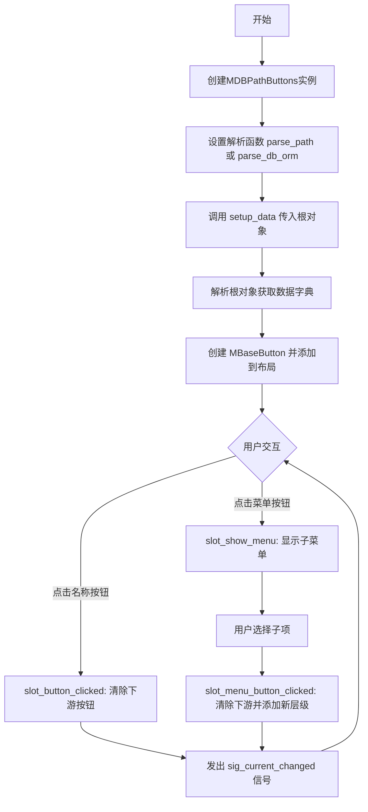

## 类结构

```
MBaseButton (QWidget)
└── 处理单个层级按钮的显示和交互
MDBPathButtons (QFrame)
└── 管理多个MBaseButton的容器，处理导航逻辑
```

## 全局变量及字段


### `MBaseButton.sig_name_button_clicked`
    
按钮点击信号，携带索引

类型：`Signal(int)`
    


### `MBaseButton.sig_menu_action_clicked`
    
菜单项点击信号，携带索引和子对象数据

类型：`Signal(int, dict)`
    


### `MBaseButton.data_dict`
    
存储当前节点数据（名称、图标、子节点获取函数等）

类型：`dict`
    


### `MBaseButton.menu_button`
    
展开子菜单的右侧箭头按钮

类型：`QToolButton`
    


### `MDBPathButtons.sig_current_changed`
    
当前选中项改变信号

类型：`Signal()`
    


### `MDBPathButtons.parse_function`
    
解析对象为数据字典的函数

类型：`function`
    


### `MDBPathButtons.data_list`
    
存储所有层级的数据字典列表

类型：`list`
    
    

## 全局函数及方法


### `parse_db_orm(orm)`

该函数用于将数据库ORM对象解析为标准化的数据字典结构，包含名称、图标、子节点获取函数、子节点存在性判断函数及原始数据，便于在UI组件中统一展示层级数据。

参数：

- `orm`：`object`，数据库ORM对象，需要解析的实体对象，需包含`name`、`__tablename__`等属性

返回值：`dict`，返回包含名称、图标、子节点获取函数、存在性判断函数及原始数据的字典

#### 流程图

```mermaid
flowchart TD
    A[开始 parse_db_orm] --> B[定义orm_map字典映射表]
    B --> C{检查orm是否有parent属性且值为None}
    C -->|是| D[设置name为"ROOT"]
    C -->|否| E[设置name为orm.name]
    D --> F[调用utils.icon_formatter生成图标]
    E --> F
    F --> G[构建get_children匿名函数<br>根据__tablename__获取对应属性<br>过滤active=True的子ORM]
    G --> H[构建has_children匿名函数<br>检查是否存在对应子属性]
    H --> I[组装返回字典<br>包含name/icon/get_children/has_children/data]
    I --> J[返回字典]
```

#### 带注释源码

```python
def parse_db_orm(orm):
    """
    解析数据库ORM对象为数据字典
    
    参数:
        orm: 数据库ORM对象，需要包含name属性和__tablename__属性
        
    返回:
        dict: 包含UI展示所需信息的字典
    """
    # 定义ORM类型到属性名的映射关系
    # view和search类型使用items属性获取子节点
    # folder类型使用children属性获取子节点
    orm_map = {"view": "items", "search": "items", "folder": "children"}
    
    # 构建返回的数据字典
    # name字段：如果ORM没有父对象（即为根节点），则命名为"ROOT"，否则使用ORM的name属性
    # icon字段：使用工具函数根据ORM对象生成对应的图标
    # get_children字段：lambda函数，用于递归获取所有子节点
    #   - 根据__tablename__从orm_map获取对应的属性名
    #   - 使用getattr获取该属性下的所有子ORM对象
    #   - 过滤出active=True的子对象进行递归解析
    # has_children字段：lambda函数，用于判断是否存在子节点
    #   - 检查ORM对象是否具有对应于__tablename__的属性
    # data字段：保存原始的ORM对象引用
    return {
        "name": "ROOT" if hasattr(orm, "parent") and orm.parent is None else orm.name,
        "icon": utils.icon_formatter(orm),
        "get_children": lambda x: [
            parse_db_orm(orm) for orm in getattr(x, orm_map.get(x.__tablename__, None)) if orm.active
        ],
        "has_children": lambda x: hasattr(x, orm_map.get(x.__tablename__, None)),
        "data": orm,
    }
```


### `parse_path`

解析文件系统路径为数据字典，用于构建文件浏览器UI的树形数据结构。

参数：

- `path`：`str`，文件系统路径（绝对路径或相对路径）

返回值：`dict`，包含路径名称、图标、子节点获取函数、是否有子节点标志和原始路径数据的字典

#### 流程图

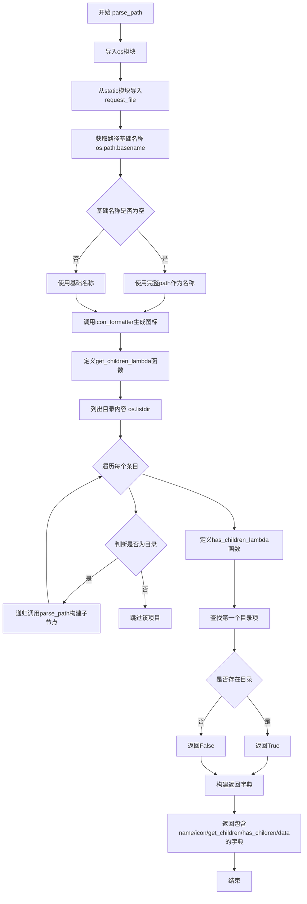

#### 带注释源码

```python
def parse_path(path):
    """
    解析文件系统路径为数据字典，用于UI树形组件
    
    参数:
        path: 文件系统路径字符串
    
    返回:
        字典，包含路径的名称、图标、子节点获取函数等信息
    """
    # 导入内置os模块，用于文件系统操作
    import os

    # 从static模块导入request_file函数，用于获取图标资源
    from static import request_file

    # 构建返回的数据字典
    return {
        # name: 路径的基础名称（文件名或目录名）
        # 如果basename为空（如根路径），则使用完整path作为名称
        "name": os.path.basename(path) or path,
        
        # icon: 使用icon_formatter处理图标资源
        # 加载浏览器图标用于显示
        "icon": utils.icon_formatter(request_file("icon-browser.png")),
        
        # get_children: lambda函数，用于获取当前路径的子目录列表
        # 遍历路径下的所有条目，筛选出目录并递归解析
        "get_children": lambda x: [
            # 对每个子目录递归调用parse_path，构建子节点数据
            parse_path(os.path.join(path, i)) 
            # 列出当前路径下的所有条目
            for i in os.listdir(path) 
            # 只处理目录类型的条目
            if os.path.isdir(os.path.join(path, i))
        ],
        
        # has_children: lambda函数，判断当前路径是否有子目录
        # 使用生成器表达式查找第一个目录项，提高效率
        "has_children": lambda x: next(
            # 遍历目录条目，寻找第一个目录
            (True for i in os.listdir(path) if os.path.isdir(os.path.join(path, i))),
            # 如果没有目录则返回False
            False,
        ),
        
        # data: 存储原始路径数据，供后续处理使用
        "data": path,
    }
```


### `MBaseButton.__init__`

该方法是 `MBaseButton` 类的构造函数，用于初始化一个包含主按钮和菜单按钮的复合按钮组件。主按钮显示名称和图标，菜单按钮用于展示层级数据（如文件系统或数据库结构）的子节点。

**参数：**

- `data_dict`：`dict`，包含按钮数据的字典，必须包含 `name`（按钮文本）、`icon`（图标）、`has_children`（判断是否有子项的函数）、`get_children`（获取子项的函数）、`data`（关联的数据对象）等键值
- `parent`：`QWidget`，可选参数，指定父控件，默认为 `None`

**返回值：** `None`，该方法为构造函数，不返回任何值

#### 流程图

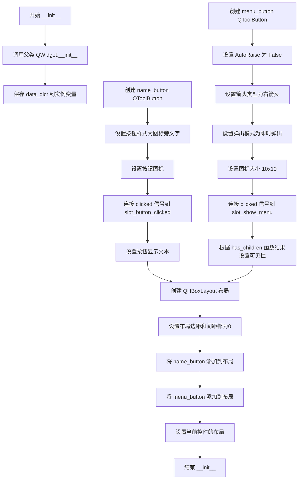

#### 带注释源码

```python
def __init__(self, data_dict, parent=None):
    """
    初始化 MBaseButton 按钮组件
    
    参数:
        data_dict: dict, 包含按钮数据的字典，必须包含 name, icon, has_children, 
                   get_children, data 等键
        parent: QWidget, 可选的父控件，默认为 None
    """
    # 调用父类 QWidget 的构造函数进行初始化
    super(MBaseButton, self).__init__(parent)
    
    # 将传入的数据字典保存为实例变量，供后续方法使用
    self.data_dict = data_dict
    
    # --- 创建主按钮 (name_button) ---
    name_button = QToolButton(parent=self)
    # 设置按钮样式：图标在文字旁边
    name_button.setToolButtonStyle(Qt.ToolButtonTextBesideIcon)
    # 从 data_dict 中获取图标并设置
    name_button.setIcon(data_dict.get("icon"))
    # 将按钮的 clicked 信号连接到槽函数，点击时发出信号
    name_button.clicked.connect(self.slot_button_clicked)
    # 从 data_dict 中获取名称并设置为按钮文本
    name_button.setText(data_dict.get("name"))
    
    # --- 创建菜单按钮 (menu_button) ---
    self.menu_button = QToolButton(parent=self)
    # 设置按钮不会自动提升（保持平面样式）
    self.menu_button.setAutoRaise(False)
    # 默认显示右箭头，表示有子菜单
    self.menu_button.setArrowType(Qt.RightArrow)
    # 设置为即时弹出模式，点击立即显示菜单
    self.menu_button.setPopupMode(QToolButton.InstantPopup)
    # 设置箭头图标大小为 10x10
    self.menu_button.setIconSize(QSize(10, 10))
    # 连接点击信号到显示菜单的槽函数
    self.menu_button.clicked.connect(self.slot_show_menu)
    # 根据 has_children 函数判断是否有子节点，决定菜单按钮是否可见
    self.menu_button.setVisible(data_dict.get("has_children")(data_dict.get("data")))
    
    # --- 创建布局 ---
    main_lay = QHBoxLayout()
    # 设置布局的外边距为0，紧凑布局
    main_lay.setContentsMargins(0, 0, 0, 0)
    # 设置控件间距为0
    main_lay.setSpacing(0)
    # 将主按钮添加到水平布局
    main_lay.addWidget(name_button)
    # 将菜单按钮添加到水平布局
    main_lay.addWidget(self.menu_button)
    # 将布局设置给当前控件
    self.setLayout(main_lay)
```


### `MBaseButton.slot_button_clicked`

该方法是MBaseButton类的槽函数，当用户点击名称按钮（name_button）时触发，用于发出`sig_name_button_clicked`信号，将当前数据项的索引传递给外部处理常。

参数：

- 无显式参数（`self`为实例自身，不计入参数列表）

返回值：`None`，无返回值（Python中默认返回None）

#### 流程图

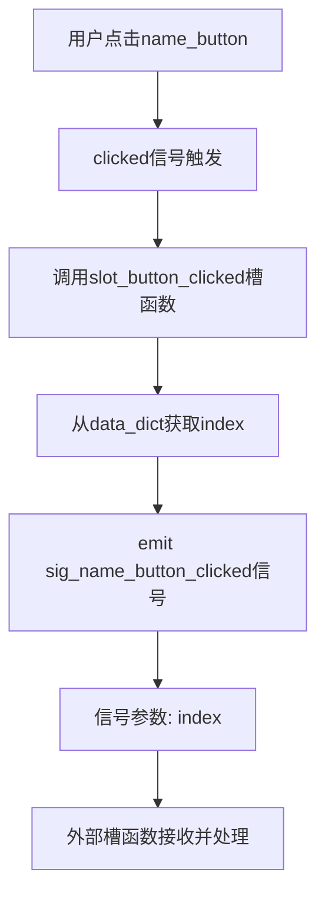

#### 带注释源码

```python
@Slot()
def slot_button_clicked(self):
    """
    槽函数：当name_button被点击时触发
    功能：发出sig_name_button_clicked信号，将当前数据项的索引传递给外部
    
    参数：
        无
    
    返回值：
        None
    
    信号：
        sig_name_button_clicked：发出信号，参数为当前数据项的索引
    """
    # 从data_dict中获取当前数据项的索引值
    # data_dict在初始化时已包含index字段，由父类MDBPathButtons.add_level设置
    index = self.data_dict.get("index")
    
    # 发出sig_name_button_clicked信号，通知外部该按钮被点击
    # 信号参数为当前数据项的索引，用于外部定位和处理
    self.sig_name_button_clicked.emit(index)
```


### `MBaseButton.slot_action_clicked`

处理菜单子项的点击事件，当用户点击菜单中的某个子项时触发，发射 `sig_menu_action_clicked` 信号以通知外部处理该菜单动作。

参数：

- `sub_obj`：`object`，表示被点击的菜单子项数据对象（通常为字典类型，包含子项的名称、图标等信息）

返回值：`None`，无返回值，仅发射信号

#### 流程图

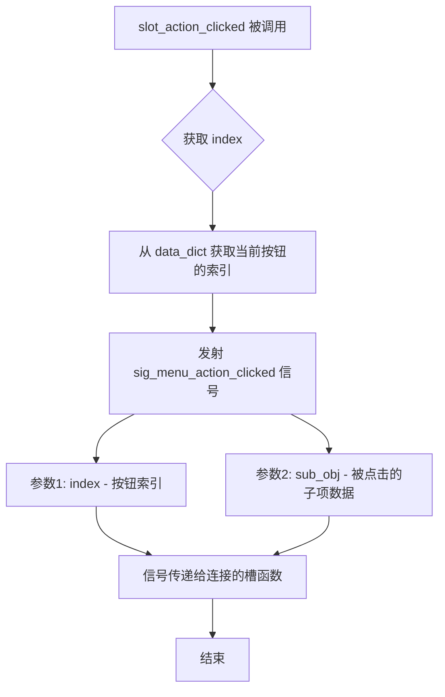

#### 带注释源码

```python
@Slot()
def slot_action_clicked(self, sub_obj):
    """
    处理菜单子项点击事件的槽函数。
    
    当用户在菜单中点击某个子项时，此方法被调用，
    它会发射 sig_menu_action_clicked 信号来通知外部处理该操作。
    
    参数:
        sub_obj: 菜单子项的数据对象，通常是一个字典，
                包含子项的 name、icon 等属性
    """
    # 从 data_dict 中获取当前按钮的索引值
    # data_dict 在初始化时包含了 index 字段，用于标识当前按钮的位置
    index = self.data_dict.get("index")
    
    # 发射 sig_menu_action_clicked 信号，传递两个参数：
    # 1. index: 当前按钮的索引，用于确定是哪个按钮下的菜单项被点击
    # 2. sub_obj: 被点击的子项数据对象，供信号接收者使用
    self.sig_menu_action_clicked.emit(index, sub_obj)
```


### `MBaseButton.slot_show_menu`

该方法是一个Qt槽函数，用于动态构建并显示当前按钮对应的子节点菜单。当用户点击菜单按钮时，此方法会从数据字典中获取子节点列表，为每个子节点创建菜单项，并将菜单绑定到菜单按钮上后立即显示。

参数：

- `self`：`MBaseButton`，隐式参数，当前按钮实例的引用，用于访问实例属性（如`data_dict`、`menu_button`）和调用实例方法

返回值：`None`，无返回值。该方法通过副作用（创建并显示Qt菜单）完成功能，不返回任何数据。

#### 流程图

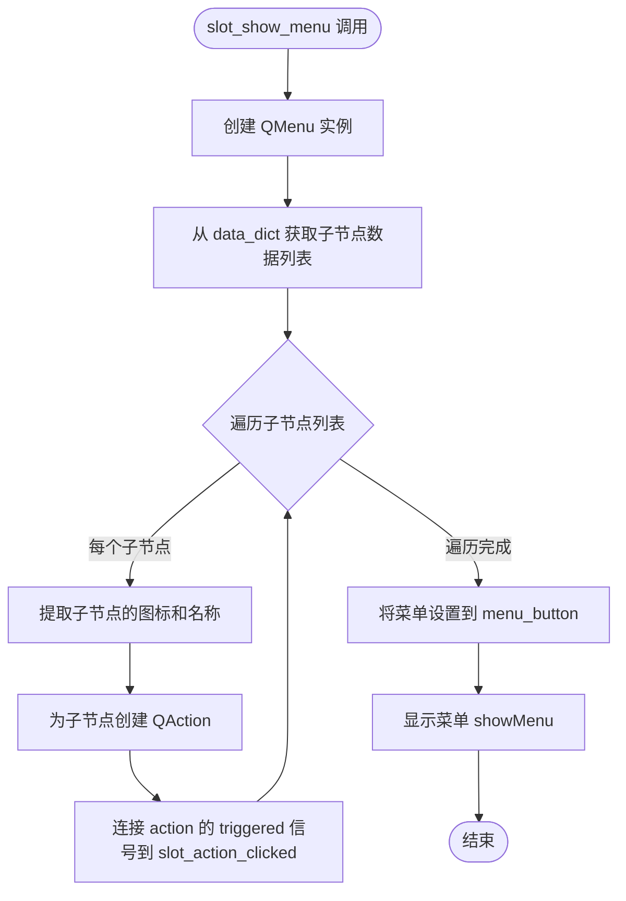

#### 带注释源码

```python
@Slot()
def slot_show_menu(self):
    """
    显示子节点菜单的槽函数。
    当用户点击菜单按钮时，此方法被调用，用于动态生成并显示当前节点的子节点菜单。
    """
    # 创建一个新的QMenu对象，父对象为当前widget
    menu = QMenu(self)
    
    # 从数据字典中获取子节点列表
    # get_children 是一个lambda函数，用于根据当前数据对象获取其子节点
    # data 是当前节点的数据，可以是ORM对象或文件路径等
    data_list = self.data_dict.get("get_children")(self.data_dict.get("data"))
    
    # 遍历所有子节点，为每个子节点创建菜单项
    for sub_obj in data_list:
        # 从子节点数据中获取图标和名称
        # sub_obj 是一个字典，包含 'icon'、'name' 等键
        action = menu.addAction(sub_obj.get("icon"), sub_obj.get("name"))
        
        # 使用 partial 绑定当前子节点数据到槽函数
        # 这样当菜单项被点击时，会传递正确的子节点对象
        action.triggered.connect(partial(self.slot_action_clicked, sub_obj))
    
    # 将创建好的菜单设置到菜单按钮
    self.menu_button.setMenu(menu)
    
    # 立即显示菜单
    self.menu_button.showMenu()
```


### MBaseButton.enterEvent

当鼠标进入按钮区域时，将菜单按钮的箭头类型设置为向下箭头（Qt.DownArrow），提示用户当前菜单可以展开。

参数：

- `*args`：可变位置参数，传递给父类 QWidget.enterEvent 的位置参数
- `**kwargs`：可变关键字参数，传递给父类 QWidget.enterEvent 的关键字参数

返回值：`Any`，返回父类 QWidget.enterEvent 方法的返回值，通常为 None

#### 流程图

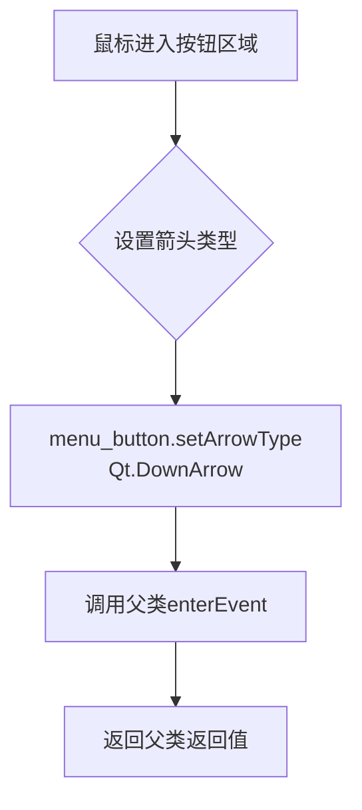

#### 带注释源码

```python
def enterEvent(self, *args, **kwargs):
    """
    重写父类enterEvent事件处理方法
    当鼠标进入按钮组件区域时触发此事件
    
    参数:
        *args: 可变位置参数,透传给父类事件处理方法
        **kwargs: 可变关键字参数,透传给父类事件处理方法
    
    返回值:
        返回父类QWidget.enterEvent的返回值
    """
    # 将菜单按钮的箭头类型设置为向下箭头
    # 提示用户当前有下拉菜单可以展开
    self.menu_button.setArrowType(Qt.DownArrow)
    
    # 调用父类的事件处理方法,确保父类的默认行为也被执行
    # 传递所有参数给父类,保持参数完整性
    return super(MBaseButton, self).enterEvent(*args, **kwargs)
```


### `MBaseButton.leaveEvent`

该方法是 `MBaseButton` 类的鼠标离开事件处理函数。当鼠标光标离开该自定义按钮部件的覆盖区域时触发，其核心功能是将关联的菜单按钮（`menu_button`）的箭头图标重置为向右（`RightArrow`），表示菜单处于收起或静止状态，并调用父类的事件处理方法以确保Qt原生逻辑的完整性。

参数：

- `*args`：可变位置参数，接收Qt事件系统传递的额外参数（通常为 `QEvent`）。
- `**kwargs`：可变关键字参数，接收Qt事件系统传递的额外关键字参数。

返回值：`None`，该方法的主要职责是执行副作用（设置箭头），并透传父类方法的返回值。

#### 流程图

```mermaid
graph TD
    A([鼠标离开 MBaseButton 组件]) --> B{执行 self.menu_button.setArrowType}
    B --> C[设置箭头为 Qt.RightArrow]
    C --> D[调用 super().leaveEvent]
    D --> E([事件处理结束])
```

#### 带注释源码

```python
def leaveEvent(self, *args, **kwargs):
    """
    重写 Qt 的 leaveEvent。
    当鼠标离开按钮区域时，将菜单指示箭头恢复为向右，
    表明当前没有展开的下级菜单。
    """
    # 获取内部维护的菜单按钮部件，并将其箭头类型设置为向右
    self.menu_button.setArrowType(Qt.RightArrow)
    
    # 调用父类 (QWidget) 的 leaveEvent 方法，
    # 以保证 Qt 内部状态（如鼠标跟踪）的正确性
    return super(MBaseButton, self).leaveEvent(*args, **kwargs)
```


### `MDBPathButtons.__init__`

初始化 MDBPathButtons 容器布局，设置主水平布局和内部水平布局，并将内部布局添加到主布局中，同时添加伸缩项以实现左对齐效果。

参数：

- `parent`：`QWidget`，父窗口部件，默认为 None

返回值：`None`，该方法为构造函数，不返回任何值

#### 流程图

```mermaid
flowchart TD
    A[开始 __init__] --> B[调用父类 QFrame 构造函数]
    B --> C[初始化实例变量 parse_function = None]
    C --> D[初始化实例变量 data_list = []]
    D --> E[创建内部水平布局 layout]
    E --> F[设置 layout 边距和间距为 0]
    F --> G[创建主水平布局 main_lay]
    G --> H[设置 main_lay 边距和间距为 0]
    H --> I[将 layout 添加到 main_lay]
    I --> J[在 main_lay 末尾添加伸缩项]
    J --> K[设置当前控件布局为 main_lay]
    K --> L[结束 __init__]
```

#### 带注释源码

```python
@utils.dayu_css()  # 装饰器：应用自定义样式
def __init__(self, parent=None):
    """
    初始化 MDBPathButtons 控件
    
    参数:
        parent: 父窗口部件，默认为 None
    """
    # 调用父类 QFrame 的构造函数进行初始化
    super(MDBPathButtons, self).__init__(parent)
    
    # 初始化解析函数为 None，后续通过 set_parse_function 设置
    self.parse_function = None
    
    # 初始化数据列表，用于存储路径按钮的数据
    self.data_list = []

    # 创建内部水平布局，用于放置路径按钮
    self.layout = QHBoxLayout()
    
    # 设置内部布局的边距为 0（无上下左右边距）
    self.layout.setContentsMargins(0, 0, 0, 0)
    
    # 设置内部布局的间距为 0（按钮之间无间隙）
    self.layout.setSpacing(0)

    # 创建主水平布局
    main_lay = QHBoxLayout()
    
    # 设置主布局边距为 0
    main_lay.setContentsMargins(0, 0, 0, 0)
    
    # 将内部布局添加到主布局中
    main_lay.addLayout(self.layout)
    
    # 在主布局末尾添加伸缩项，使按钮靠左对齐
    main_lay.addStretch()
    
    # 设置当前控件的布局为主布局
    self.setLayout(main_lay)
```


### `MDBPathButtons.set_parse_function`

设置解析函数，用于将对象（如数据库ORM或文件系统路径）转换为按钮数据字典。该方法允许外部自定义数据解析逻辑，使组件能够适应不同的数据源类型。

参数：

- `func`：`callable`，解析函数，接收一个对象参数并返回包含"name"（按钮显示名称）、"icon"（图标）、"get_children"（获取子项的函数）、"has_children"（判断是否有子项的函数）、"data"（原始数据）键的字典

返回值：`None`，无返回值，仅修改实例状态

#### 流程图

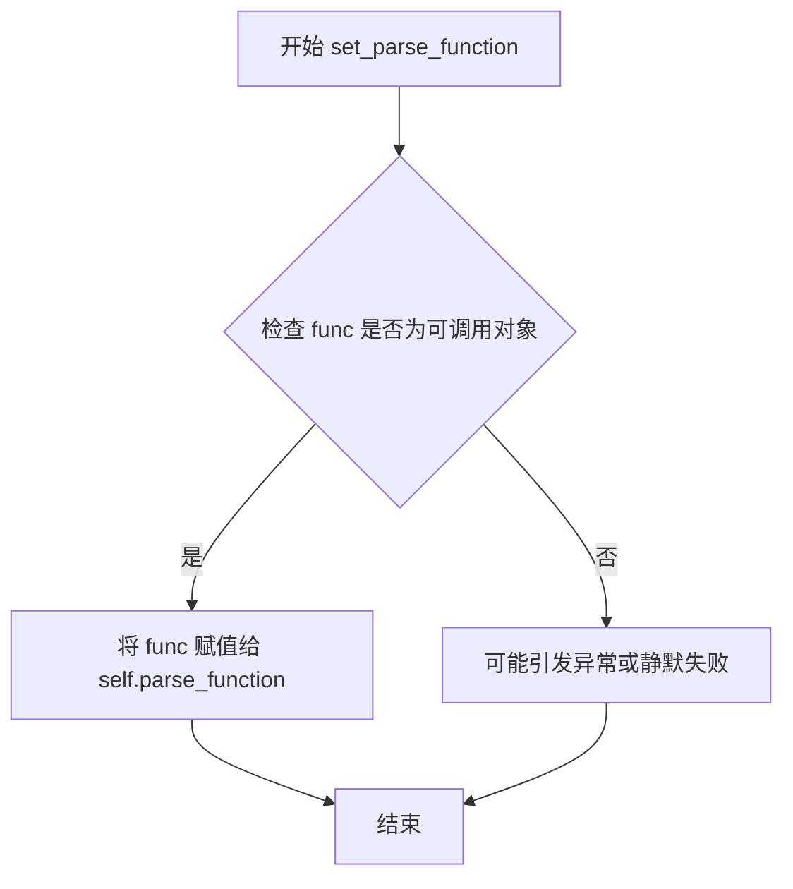

#### 带注释源码

```python
def set_parse_function(self, func):
    """
    设置解析函数，用于将外部对象转换为按钮数据字典
    
    参数:
        func: callable类型，要求接收一个对象参数，
              返回包含以下键的字典：
              - name: 字符串，按钮显示名称
              - icon: QIcon对象，按钮图标
              - get_children: callable，获取子项的函数
              - has_children: callable，判断是否有子项的函数
              - data: 原始数据对象
    
    示例:
        # 设置路径解析函数
        button.set_parse_function(parse_path)
        
        # 设置数据库ORM解析函数
        button.set_parse_function(parse_db_orm)
    """
    self.parse_function = func
```


### `MDBPathButtons.setup_data`

设置根对象并初始化导航路径。该方法接收一个根对象作为参数，清除现有路径，然后根据解析函数生成第一级导航按钮。

参数：

- `obj`：`object`，根对象，可以是数据库ORM对象或文件路径等，取决于已注册的解析函数

返回值：`None`，该方法无返回值，仅通过信号通知界面更新

#### 流程图

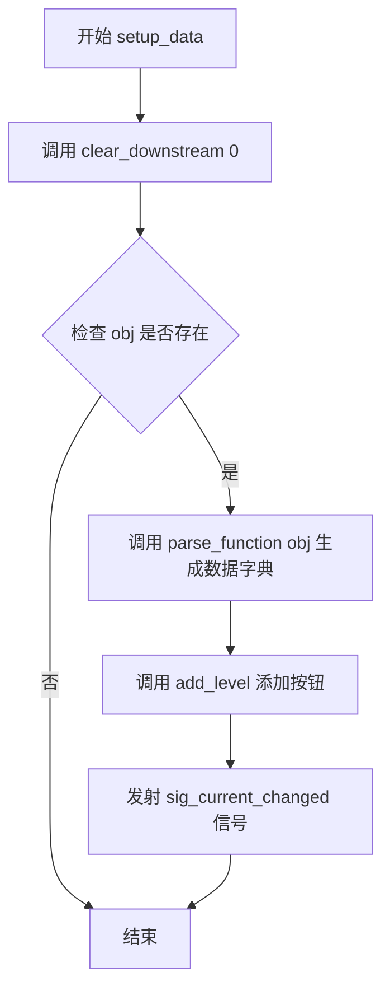

#### 带注释源码

```python
def setup_data(self, obj):
    """
    设置根对象并初始化导航路径
    
    参数:
        obj: 根对象，用于初始化第一级导航
    """
    # 首先清除所有现有的下游按钮（从索引0开始清除所有）
    self.clear_downstream(0)
    
    # 如果传入了有效的根对象
    if obj:
        # 使用解析函数将对象转换为数据字典
        # parse_function 可以是 parse_db_orm 或 parse_path 等
        data_dict = self.parse_function(obj)
        
        # 添加第一级导航按钮
        self.add_level(data_dict)
        
        # 发射信号通知界面当前选中项已更改
        self.sig_current_changed.emit()
```


### `MDBPathButtons.add_level`

该方法用于在路径按钮控件中添加一个新层级的按钮，将传入的数据字典转换为按钮组件并注册到事件处理系统中，同时维护按钮的索引和 widget 引用。

参数：

- `data_dict`：`dict`，包含按钮显示数据的字典，必须包含"name"、"icon"、"get_children"、"has_children"和"data"键，用于构建按钮和菜单项。

返回值：`None`，该方法无返回值，通过副作用更新内部状态。

#### 流程图

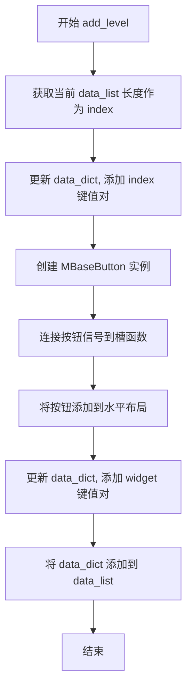

#### 带注释源码

```python
def add_level(self, data_dict):
    # 获取当前按钮列表的长度作为新按钮的索引
    index = len(self.data_list)
    # 在数据字典中记录当前按钮的索引位置
    data_dict.update({"index": index})
    # 创建基础按钮对象，传入数据字典和父控件
    button = MBaseButton(data_dict, parent=self)
    # 连接按钮点击信号到槽函数，处理按钮点击事件
    button.sig_name_button_clicked.connect(self.slot_button_clicked)
    # 连接菜单动作信号到槽函数，处理菜单项点击事件
    button.sig_menu_action_clicked.connect(self.slot_menu_button_clicked)
    # 将按钮控件添加到水平布局中显示
    self.layout.addWidget(button)
    # 在数据字典中保存按钮控件的引用，便于后续操作
    data_dict.update({"widget": button})
    # 将数据字典添加到按钮列表中，维护完整的数据链
    self.data_list.append(data_dict)
```


### `MDBPathButtons.clear_downstream`

清除指定索引之后的所有按钮，用于在用户导航到某个层级时，移除该层级之后的所有已显示按钮。

参数：

- `index`：`int`，起始索引，表示从该索引开始（包括该索引）之后的所有按钮都将被清除

返回值：`None`，无返回值

#### 流程图

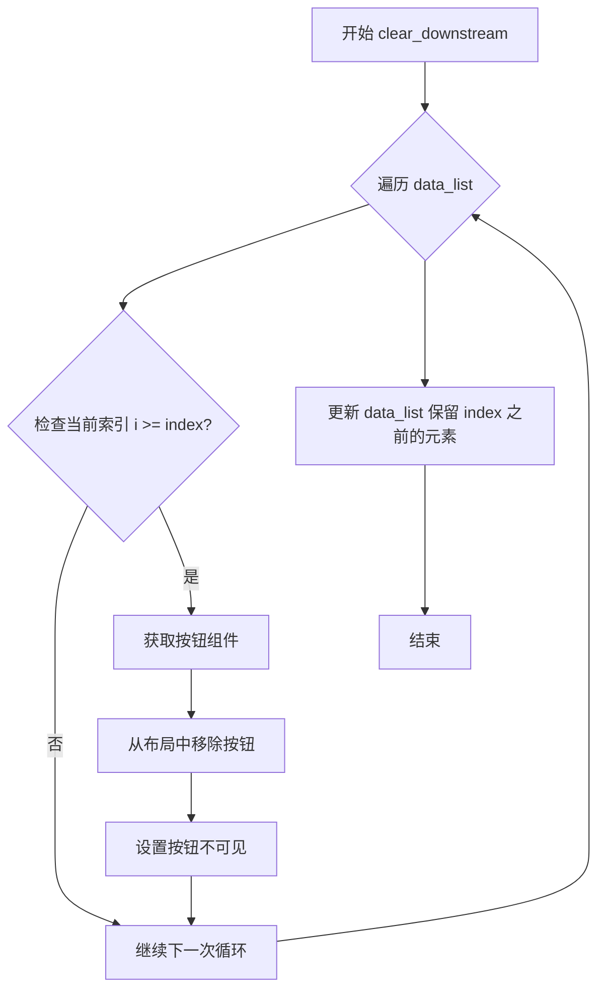

#### 带注释源码

```
def clear_downstream(self, index):
    """
    清除指定索引之后的所有按钮
    
    参数:
        index: 起始索引，从该索引开始之后的所有按钮都会被清除
    """
    # 遍历所有的数据字典（每个代表一个按钮层级）
    for i, data_dict in enumerate(self.data_list):
        # 判断当前索引是否大于等于指定的索引
        if i >= index:
            # 从数据字典中获取对应的按钮组件
            button = data_dict.get("widget")
            # 将按钮从水平布局中移除（但不会销毁对象）
            self.layout.removeWidget(button)
            # 设置按钮为不可见状态
            button.setVisible(False)
    
    # 更新数据列表，只保留指定索引之前的元素
    # 这样就实现了清除指定索引之后所有按钮的功能
    self.data_list = self.data_list[:index]
```


### `MDBPathButtons.slot_button_clicked`

该方法是路径导航按钮栏的核心交互逻辑之一。当用户点击当前路径中的某个历史节点（例如点击根目录或上级文件夹）时，此方法被触发。它的主要功能是**“回溯”或“重置”**，即清除该节点之后的所有下游UI元素（按钮），并将当前状态重置到该节点层级。

参数：

- `index`：`int`，表示被点击的按钮在 `data_list` 中的索引位置（即路径的层级深度）。

返回值：`None`，该方法通过修改UI状态（清除下游组件）和发送信号来表达结果，不返回具体值。

#### 流程图

```mermaid
flowchart TD
    A[用户点击路径按钮] --> B{接收 index 参数}
    B --> C[调用 clear_downstream(index + 1)]
    C --> D[清除 index 之后的所有按钮和状态]
    D --> E[发出 sig_current_changed 信号]
    E --> F[结束]
    
    style C fill:#f9f,stroke:#333,stroke-width:2px
    style E fill:#bbf,stroke:#333,stroke-width:2px
```

#### 带注释源码

```python
@Slot(object)
def slot_button_clicked(self, index):
    """
    处理普通名称按钮的点击事件。
    当用户点击路径导航条中的某个按钮（如 D:/, folder）时触发。
    
    参数:
        index (int): 被点击按钮的索引。对应 data_list 中的位置，
                     用于确定需要保留的路径层级。
    """
    # 1. 清除下游：调用 clear_downstream 清除 index 之后的所有按钮。
    #    这里传入 index + 1，意味着保留当前点击的按钮及其之前的所有按钮，
    #    删除其后面的所有按钮（例如点击根目录，则删除所有子目录按钮）。
    self.clear_downstream(index + 1)
    
    # 2. 状态同步：发出信号通知外部（如 QTreeWidget）当前选中的路径已改变。
    self.sig_current_changed.emit()
```


### `MDBPathButtons.slot_menu_button_clicked`

该方法是一个槽函数（Slot），用于处理用户在路径按钮下拉菜单中点击具体子项的事件。当用户在第 `index` 个按钮的菜单中选择了某个子项（`data_dict`）时，该方法会清除该按钮之后的所有后续路径，并将其下方新增的子项作为新的层级添加到界面中，同时发出路径已变更的信号。

参数：

- `index`：`int`，表示用户点击菜单的父级按钮的索引。
- `data_dict`：`dict`，包含所选子项数据的字典，结构通常包括 name、icon、get_children、data 等键。

返回值：`None`，无返回值。

#### 流程图

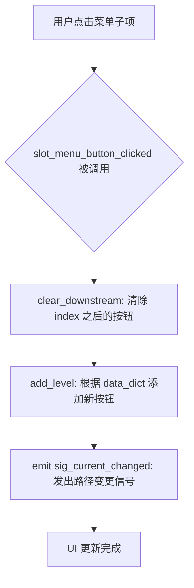

#### 带注释源码

```python
@Slot(object)
def slot_menu_button_clicked(self, index, data_dict):
    # 1. 清除当前选中的索引位置之后的所有下游按钮和数据
    #    确保路径展示从当前选中项重新开始
    self.clear_downstream(index + 1)
    
    # 2. 根据选中项的数据字典 (data_dict) 创建新的按钮并添加到界面
    #    data_dict 通常包含子节点的名称、图标及获取孙子节点的方法
    self.add_level(data_dict)
    
    # 3. 发出信号通知外部（如主窗口）当前路径已发生改变
    self.sig_current_changed.emit()
```


### `MDBPathButtons.slot_show_menu`

该方法是一个槽函数（Slot），用于动态显示指定工具按钮上的弹出式菜单。它根据传入的 `data_dict` 中的数据（通常包含当前路径的子节点信息），生成对应的菜单项（QAction），并将点击事件连接到菜单按钮的点击处理逻辑上，最终立即显示该菜单。

参数：

- `menu_button`：`QToolButton`，触发菜单显示的工具按钮对象。
- `data_dict`：`dict`，包含当前节点数据的字典，必须包含 `get_children`（获取子节点的方法）、`data`（当前数据对象）和 `index`（当前层级索引）。

返回值：`None`，该方法为void类型，不返回值，仅执行UI操作。

#### 流程图

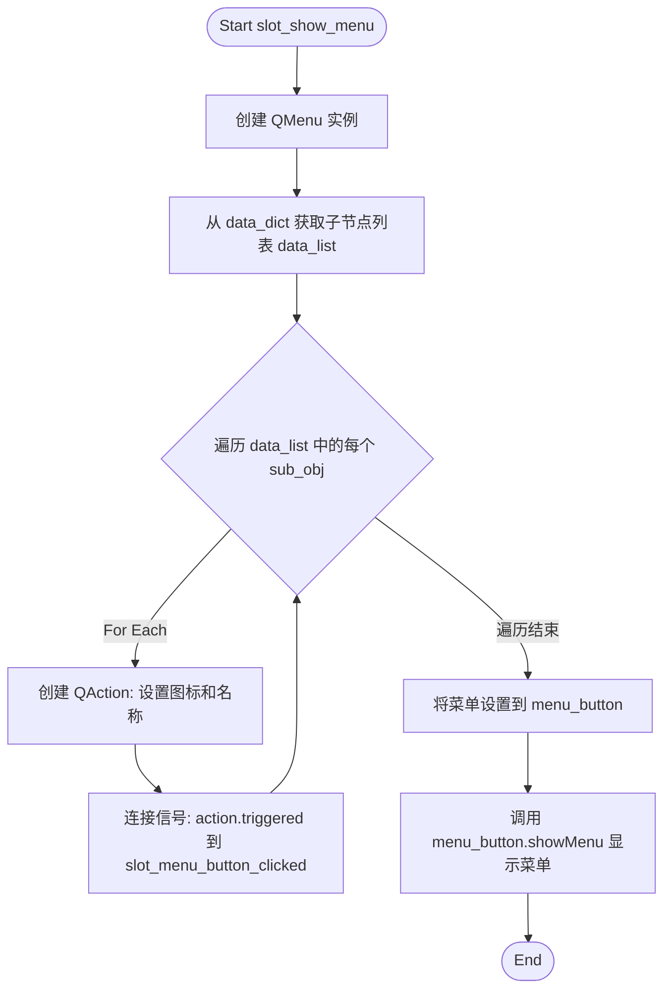

#### 带注释源码

```python
@Slot(QToolButton, dict)
def slot_show_menu(self, menu_button, data_dict):
    """
    显示菜单的槽函数。
    :param menu_button: QToolButton, 用于显示菜单的按钮
    :param data_dict: dict, 包含菜单数据的字典
    """
    # 1. 创建一个临时菜单，父对象为当前MDBPathButtons
    menu = QMenu(self)
    
    # 2. 获取子节点数据列表
    # 调用 data_dict 中保存的 lambda 函数 get_children，传入当前数据对象
    data_list = data_dict.get("get_children")(data_dict.get("data"))
    
    # 3. 获取当前节点的索引，用于后续导航逻辑
    index = data_dict.get("index")
    
    # 4. 遍历子节点，生成菜单项
    for sub_obj in data_list:
        # 为每个子节点创建一个 Action，包含图标和名称
        action = menu.addAction(sub_obj.get("icon"), sub_obj.get("name"))
        
        # 5. 连接点击信号
        # 使用 functools.partial 绑定当前索引 index 和子对象 sub_obj
        # 当点击该菜单项时，触发 slot_menu_button_clicked
        action.triggered.connect(partial(self.slot_menu_button_clicked, index, sub_obj))
    
    # 6. 将生成好的菜单设置到对应的按钮上
    menu_button.setMenu(menu)
    
    # 7. 立即显示菜单（类似右键点击效果）
    menu_button.showMenu()
```


### `MDBPathButtons.slot_go_to`

该方法实现了导航逻辑，负责将当前显示的路径按钮列表（`data_list`）与传入的目标对象列表（`obj_list`）进行同步。它通过遍历对比两者之间的差异，来决定是新增按钮、清除多余的按钮，还是保持不变，从而将视图更新到指定的状态。

参数：

-  `obj_list`：`list`，目标对象列表（通常为数据库 ORM 对象或文件路径对象），代表期望显示的完整路径层级。

返回值：`None`，该方法无返回值，通过副作用（修改 UI 组件）生效。

#### 流程图

```mermaid
flowchart TD
    A([开始 slot_go_to]) --> B[获取当前按钮对应的对象列表 current_list]
    B --> C[使用 izip_longest 遍历 obj_list 和 current_list]
    C --> D{获取下一对元素 (his_obj, our_obj)}
    D --> E{his_obj is None?}
    E -- 是 --> F[调用 clear_downstream清除当前位置之后的按钮]
    F --> G([结束并返回])
    E -- 否 --> H{our_obj is None?}
    H -- 是 --> I[调用 parse_function 解析 his_obj 并添加新按钮 add_level]
    I --> C
    H -- 否 --> J{his_obj != our_obj?}
    J -- 是 --> K[调用 clear_downstream 清除当前位置之后的按钮]
    K --> L[调用 parse_function 解析 his_obj 并添加新按钮 add_level]
    L --> C
    J -- 否 --> C
    C -.-> M([循环结束])
```

#### 带注释源码

```python
@Slot(object)
def slot_go_to(self, obj_list):
    """
    导航到指定的对象列表。
    通过对比目标列表(obj_list)和当前列表(self.get_obj_list())来同步UI。
    """
    # 使用 izip_longest 并行遍历两个列表，填充缺失值为 None
    # enumerate 同时提供索引 index
    for index, (his_obj, our_obj) in enumerate(izip_longest(obj_list, self.get_obj_list())):
        if his_obj is None:
            # 场景1：如果传入列表结束（为None），而当前列表还有值
            # 说明目标路径是当前路径的子集（或比当前短），清除多余的按钮并返回
            self.clear_downstream(index)
            return
        elif our_obj is None:
            # 场景2：如果当前列表已结束（为None），而传入列表还有值
            # 说明需要补全路径，追加新的按钮层级
            self.add_level(self.parse_function(his_obj))
        elif his_obj != our_obj:
            # 场景3：两者都存在但内容不同
            # 清除当前按钮后的所有层级，并重新添加传入的层级
            self.clear_downstream(index)
            self.add_level(self.parse_function(his_obj))
        else:
            # 场景4：完全匹配
            # 什么都不做，继续下一个层级
            continue
```


### `MDBPathButtons.get_obj_list`

获取当前所有层级对应的对象列表，用于外部调用或同步状态。

参数：无

返回值：`list`，返回存储在 `data_list` 中的每个层级节点的 `data` 字段组成的列表。

#### 流程图

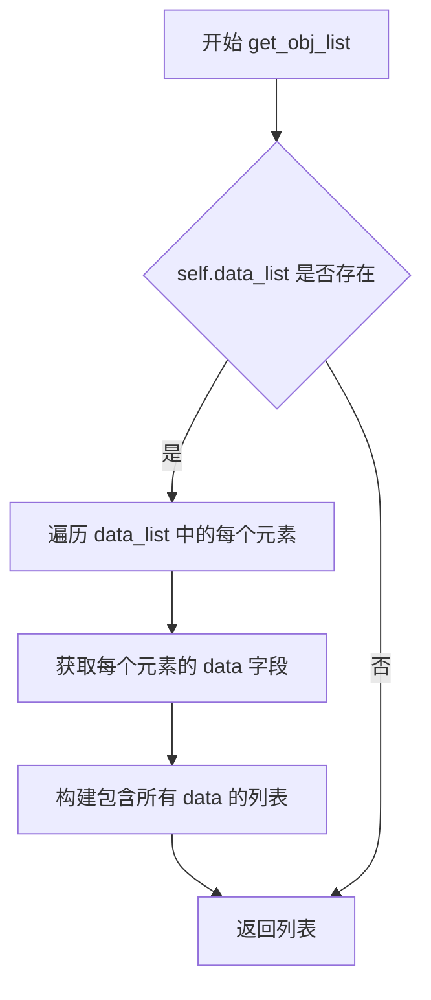

#### 带注释源码

```python
def get_obj_list(self):
    """
    获取当前所有层级对应的对象列表
    
    该方法将 data_list 中每个字典的 data 字段提取出来，
    组成一个列表返回。data 字段存储了每一层级对应的实际数据对象
    （可能是数据库 ORM 对象或文件路径等）。
    
    Returns:
        list: 包含所有层级 data 字段的列表
    """
    # 使用列表推导式提取每个层级节点的 data 字段
    # i 是 data_list 中的字典，调用 get("data") 获取存储的数据对象
    return [i.get("data") for i in self.data_list]
```

## 关键组件


### 树形数据结构解析器 (parse_db_orm, parse_path)

将数据库ORM对象或文件系统路径解析为统一的树形节点数据结构，包含name、icon、get_children、has_children、data等字段，支持惰性加载子节点。

### 统一数据字典结构

通用的树形节点表示格式，包含name(名称)、icon(图标)、get_children(获取子节点函数)、has_children(是否有子节点判断函数)、data(原始数据)字段，实现数据与UI的解耦。

### MBaseButton 类

Qt按钮组件，负责渲染单个树形节点，包含主按钮(显示名称和图标)和菜单按钮(显示子节点菜单)，支持点击事件和鼠标悬停效果切换箭头方向。

### MDBPathButtons 类

路径导航容器组件，管理整个导航栏的按钮层级，支持动态添加/删除级别、解析函数设置、菜单点击处理、路径回溯导航(sig_current_changed信号)等核心导航功能。

### 信号与槽机制

基于PyQt信号槽的交互模式，包括sig_name_button_clicked(主按钮点击)、sig_menu_action_clicked(菜单项点击)、sig_current_changed(当前路径改变)等信号，实现组件间的解耦通信。

### 惰性加载实现

通过get_children和has_children函数指针实现子节点的惰性加载，只有在点击展开时才调用相关函数获取子节点数据，避免一次性加载整个树形结构。

### 导航状态管理

通过data_list列表维护当前导航路径的所有节点，支持clear_downstream清理下游节点、add_level添加新层级、get_obj_list获取完整路径等状态管理操作。


## 问题及建议


### 已知问题

-   **模块导入位置不规范**：parse_path函数内部导入os和request_file模块，应移至文件顶部统一导入
-   **重复调用os.listdir**：parse_path和has_children lambda中都调用了os.listdir(path)，导致重复文件系统操作
-   **缺少空值和异常处理**：parse_db_orm中getattr调用未检查orm对象属性是否存在；parse_path未检查路径是否存在或是否为目录
-   **资源未正确释放**：clear_downstream方法仅隐藏widget但未从布局中彻底移除或销毁，可能导致内存泄漏
-   **信号槽参数类型不一致**：slot_button_clicked和slot_menu_button_clicked使用@Slot(object)但实际传递int类型参数
-   **slot_go_to逻辑缺陷**：当his_obj为None时直接return，导致obj_list后续元素未被处理
-   **硬编码配置**：orm_map字典硬编码在parse_db_orm中，缺乏灵活配置机制
-   **lambda函数重复创建**：get_children和has_children每次调用都创建新的lambda对象，增加内存开销
-   **魔法数字**：如setIconSize(QSize(10, 10))等硬编码数值应提取为常量

### 优化建议

-   **优化导入结构**：将parse_path中的os和request_file导入移至文件顶部，使用提前导入的模块引用
-   **缓存文件系统操作**：将os.listdir结果缓存，避免重复遍历目录
-   **添加防御性检查**：为parse_db_orm和parse_path添加参数验证和异常捕获，处理无效输入
-   **完善资源管理**：在clear_downstream中调用button.deleteLater()确保控件正确销毁
-   **统一信号槽类型**：使用@Slot(int)替代@Slot(object)，或使用Python3的类型注解明确参数类型
-   **修复slot_go_to逻辑**：移除提前return，确保遍历完整个obj_list
-   **配置外部化**：将orm_map配置提取为配置文件或类属性，提高可维护性
-   **使用生成器或局部函数**：替代lambda重复创建问题，可使用闭包或生成器模式
-   **提取常量**：将10、0等魔法数字定义为类或模块级常量，如ICON_SIZE = QSize(10, 10)
-   **增加日志和调试支持**：添加适当的日志记录，便于运行时问题排查


## 其它


### 设计目标与约束

本组件旨在提供一个可配置的树形路径导航按钮控件，支持点击切换层级和通过菜单快速跳转。设计约束包括：依赖PyQt4/PySide Qt库；支持自定义解析函数以适配不同数据源（数据库ORM或文件系统路径）；按钮层级动态增删，无最大层级限制；UI样式依赖`utils.dayu_css()`装饰器。

### 错误处理与异常设计

1. **文件路径解析异常**：在`parse_path`函数中，`os.listdir(path)`若路径不存在或无权限会抛出OSError，调用方需确保路径合法或在`setup_data`调用前做异常捕获。  
2. **ORM属性访问异常**：`parse_db_orm`中通过`getattr`获取`orm_map`映射的属性，若ORM模型缺少对应表名映射或属性，会返回None导致`get_children`返回空列表，不抛异常。  
3. **信号槽参数类型**：`slot_button_clicked`和`slot_menu_button_clicked`接收的参数类型声明为`object`，但实际传入int(dict.get("index"))或dict，实际调用时需确保类型匹配。

### 数据流与状态机

数据流：外部通过`set_parse_function`设置解析函数（`parse_db_orm`或`parse_path`），再调用`setup_data`传入根节点对象。解析函数返回包含name、icon、get_children、has_children、data的字典，MDBPathButtons据此创建MBaseButton并加入布局，同时维护`data_list`记录所有层级数据。  
状态机：组件维护一个线性层级状态，索引从0开始。点击按钮时调用`clear_downstream(index+1)`清除后续层级；点击菜单项时先`clear_downstream`再`add_level`新层级。`slot_go_to`方法通过比较历史对象列表与当前对象列表进行批量同步，支持前进、后退和跳转场景。

### 外部依赖与接口契约

1. **Qt依赖**：PyQt4/PySide，需导入QWidget、QToolButton、QMenu、QLayout等组件，使用`Signal`、`Slot`实现事件通信。  
2. **utils模块**：依赖`utils.icon_formatter`生成图标，`utils.dayu_css()`装饰器应用于MDBPathButtons类以设置样式。  
3. **static模块**：在`parse_path`中动态导入`static.request_file`获取图标文件路径。  
4. **接口契约**：`parse_function`必须返回包含"name"（str）、"icon"（QIcon）、"get_children"（callable）、"has_children"（callable）、"data"（任意）的字典；调用方需保证传入的obj能被解析函数正确处理。

### 性能考虑

1. **列表重复遍历**：`parse_path`中`has_children`实现每次调用都执行`os.listdir`，可考虑缓存结果。  
2. **布局更新**：每次`add_level`或`clear_downstream`都会触发布局重新计算，在大量层级时可能有性能瓶颈，建议批量操作或使用`QLayout.takeAt()`直接管理。  
3. **Lambda捕获**：`parse_db_orm`和`parse_path`中lambda捕获外部变量（如path、orm），若对象被复用需注意闭包引用可能导致内存泄漏。

### 资源管理

1. **图标资源**：图标通过`utils.icon_formatter`和`request_file`加载，需确保静态资源文件存在。  
2. **菜单内存**：每次`slot_show_menu`创建新QMenu但未显式删除，需依赖Qt父对象自动析构。  
3. **按钮清理**：`clear_downstream`仅调用`setVisible(False)`而未调用`deleteLater`，潜在内存泄漏，建议显式删除或复用按钮实例。

### 配置与扩展性

1. **解析函数可替换**：通过`set_parse_function`可接入任意数据源解析逻辑，实现灵活扩展。  
2. **按钮样式**：MBaseButton内部硬编码布局和ArrowType，样式定制需修改类本身，可考虑开放样式配置接口。  
3. **信号参数**：当前信号仅携带index和dict，扩展需求（如携带完整对象）需修改信号签名。

### 测试策略建议

1. **单元测试**：针对`parse_db_orm`和`parse_path`进行输入输出测试，验证返回字典结构完整性。  
2. **UI测试**：模拟点击按钮和菜单项，验证层级切换逻辑正确性。  
3. **异常测试**：传入非法路径或不完整ORM对象，验证容错行为。

### 版本兼容性

代码使用`from __future__ import`导入确保Python2/3兼容性，但依赖的Qt库（PyQt4/PySide）在Python3环境下可能存在API差异；`izip_longest`在Python3中为`itertools.zip_longest`，需确认实际运行环境。


    