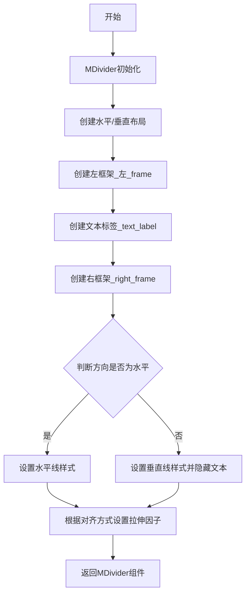
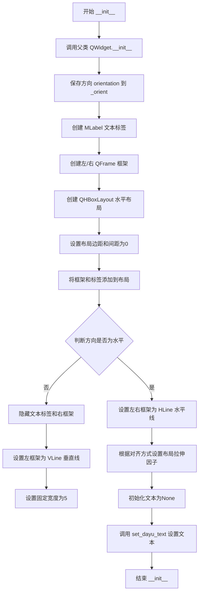
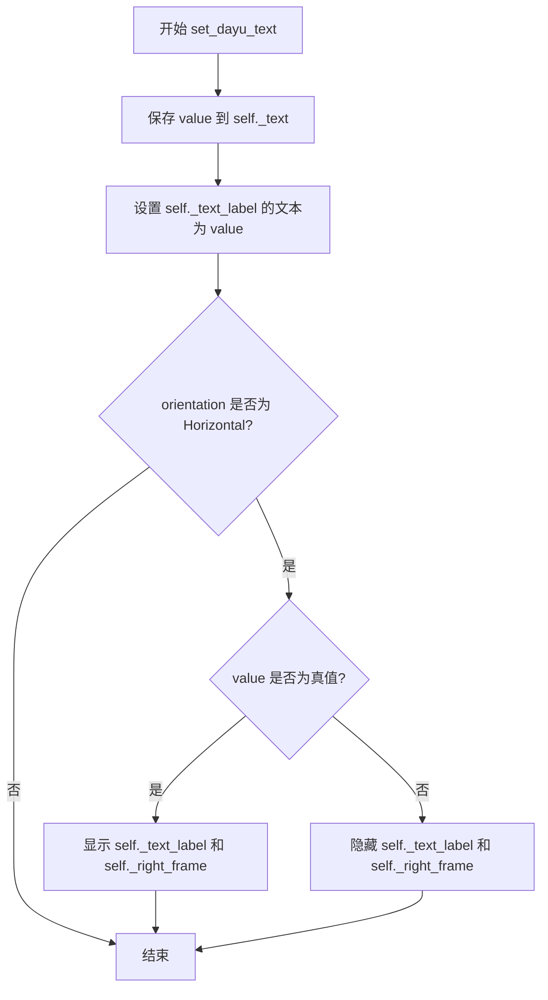
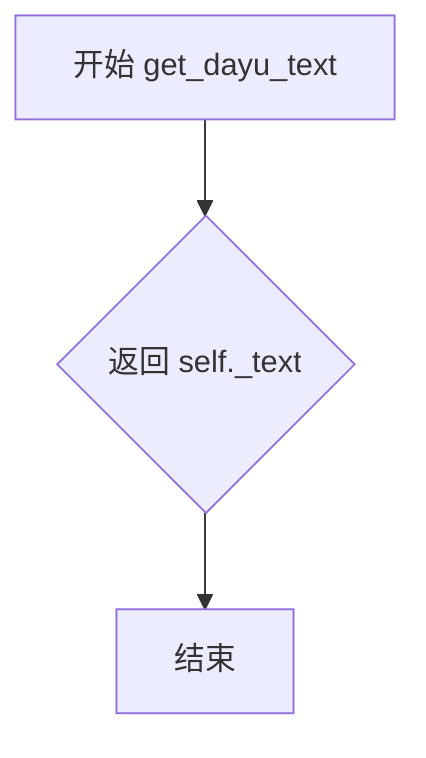
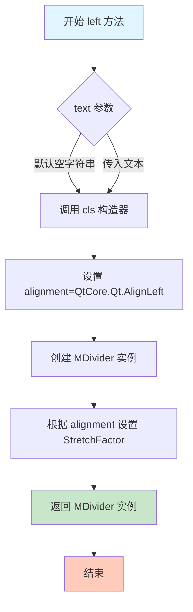
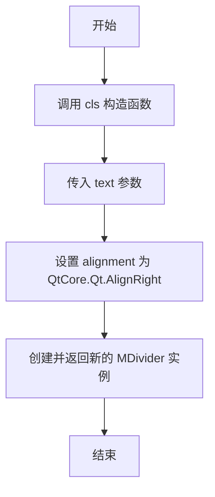
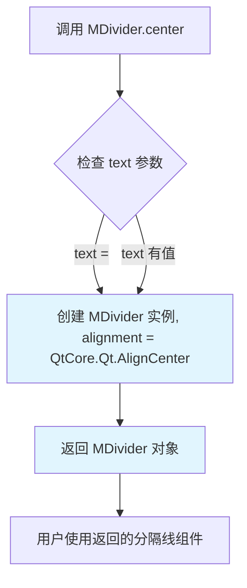
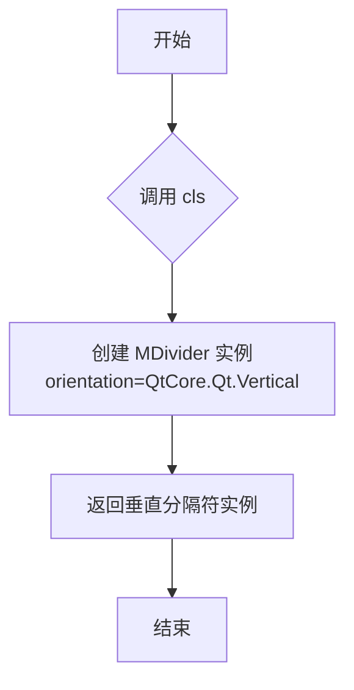

# `comic-translate\app\ui\dayu_widgets\divider.py` 详细设计文档

MDivider是一个Qt分隔线组件，用于在不同内容之间显示水平或垂直的分隔线，支持文本标签显示以及左、中、右三种对齐方式。

## 整体流程



## 类结构

```
QtWidgets.QWidget (Qt基类)
└── MDivider (自定义分隔线组件)
```

## 全局变量及字段


### `MDivider._alignment_map`
    
对齐方式映射表，类属性

类型：`dict`
    


### `MDivider._orient`
    
分隔线方向

类型：`QtCore.Qt.Orientation`
    


### `MDivider._text_label`
    
文本标签对象

类型：`MLabel`
    


### `MDivider._left_frame`
    
左侧框架

类型：`QtWidgets.QFrame`
    


### `MDivider._right_frame`
    
右侧框架

类型：`QtWidgets.QFrame`
    


### `MDivider._main_lay`
    
主水平布局

类型：`QtWidgets.QHBoxLayout`
    


### `MDivider._text`
    
分隔线文本内容

类型：`str`
    
    

## 全局函数及方法


### `MDivider.__init__`

这是一个Qt控件的构造函数，用于初始化一个分隔线（Divider）控件。该方法接受文本内容、方向、对齐方式和父控件作为参数，创建一个带有可选文本的水平或垂直分隔线。

参数：

- `self`：隐式参数，表示当前创建的MDivider实例对象
- `text`：`str`，默认值`""`，分隔线上显示的文本内容
- `orientation`：`QtCore.Qt.Orientation`，默认值`QtCore.Qt.Horizontal`，分隔线的方向（水平或垂直）
- `alignment`：`QtCore.Qt.AlignmentFlag`，默认值`QtCore.Qt.AlignCenter`，文本的对齐方式（左/中/右）
- `parent`：`QtWidgets.QWidget`，默认值`None`，父控件对象，用于Qt的对象层次结构

返回值：`None`，构造函数没有返回值，初始化完成后对象创建成功

#### 流程图



#### 带注释源码

```python
def __init__(
    self,
    text="",
    orientation=QtCore.Qt.Horizontal,
    alignment=QtCore.Qt.AlignCenter,
    parent=None,
):
    """
    初始化 MDivider 分隔线控件
    
    参数:
        text: 分隔线上显示的文本，默认为空字符串
        orientation: 分隔线方向，默认为水平方向
        alignment: 文本对齐方式，默认为居中
        parent: 父控件，用于Qt对象层次管理
    """
    # 调用父类QtWidgets.QWidget的构造函数进行初始化
    super(MDivider, self).__init__(parent)
    
    # 保存方向参数到实例变量
    self._orient = orientation
    
    # 创建文本标签，使用MLabel的secondary样式
    self._text_label = MLabel().secondary()
    
    # 创建左/右两侧的QFrame框架用于显示分隔线
    self._left_frame = QtWidgets.QFrame()
    self._right_frame = QtWidgets.QFrame()
    
    # 创建水平布局管理器
    self._main_lay = QtWidgets.QHBoxLayout()
    
    # 设置布局的边距为0（无外边距）
    self._main_lay.setContentsMargins(0, 0, 0, 0)
    # 设置布局内元素间距为0
    self._main_lay.setSpacing(0)
    
    # 按顺序添加左框架、文本标签、右框架到布局
    self._main_lay.addWidget(self._left_frame)
    self._main_lay.addWidget(self._text_label)
    self._main_lay.addWidget(self._right_frame)
    
    # 将布局应用到控件
    self.setLayout(self._main_lay)

    # 根据方向类型配置框架样式
    if orientation == QtCore.Qt.Horizontal:
        # 水平方向：设置左右框架为水平线样式
        self._left_frame.setFrameShape(QtWidgets.QFrame.HLine)
        self._left_frame.setFrameShadow(QtWidgets.QFrame.Sunken)
        self._right_frame.setFrameShape(QtWidgets.QFrame.HLine)
        self._right_frame.setFrameShadow(QtWidgets.QFrame.Sunken)
    else:
        # 垂直方向配置
        self._text_label.setVisible(False)  # 隐藏文本标签
        self._right_frame.setVisible(False)  # 隐藏右框架
        self._left_frame.setFrameShape(QtWidgets.QFrame.VLine)
        self._left_frame.setFrameShadow(QtWidgets.QFrame.Sunken)
        # 设置垂直分隔线的固定宽度
        self.setFixedWidth(5)
    
    # 根据对齐方式设置布局的拉伸因子
    # 映射表：AlignCenter->50, AlignLeft->20, AlignRight->80
    self._main_lay.setStretchFactor(self._left_frame, self._alignment_map.get(alignment, 50))
    self._main_lay.setStretchFactor(self._right_frame, 100 - self._alignment_map.get(alignment, 50))
    
    # 初始化内部文本存储变量
    self._text = None
    # 调用setter方法设置文本内容
    self.set_dayu_text(text)
```


### `MDivider.set_dayu_text`

设置分割线的文本内容。当文本为空时，隐藏文本标签和右侧框架以确保分割线没有间隙。

参数：

- `value`：`six.string_types`（即 Python 3 中的 `str`），要设置在分割线上的文本内容

返回值：`None`，无返回值描述

#### 流程图



#### 带注释源码

```python
def set_dayu_text(self, value):
    """
    Set the divider's text.
    When text is empty, hide the text_label and right_frame to ensure the divider not has a gap.

    :param value: six.string_types
    :return: None
    """
    # 1. 将传入的值保存到实例变量 _text 中
    self._text = value
    
    # 2. 更新文本标签的显示内容
    self._text_label.setText(value)
    
    # 3. 仅在水平方向时处理可见性
    if self._orient == QtCore.Qt.Horizontal:
        # 4. 根据文本是否为空字符串来控制标签和右侧框架的显示/隐藏
        #    这样可以避免分割线中间出现不必要的间隙
        self._text_label.setVisible(bool(value))
        self._right_frame.setVisible(bool(value))
```


### `MDivider.get_dayu_text`

获取分隔线的当前文本内容。

参数：

- （无参数，仅有隐式参数 `self`）

返回值：`six.string_types`，当前设置的文本内容，如果没有设置则返回 `None`。

#### 流程图



#### 带注释源码

```python
def get_dayu_text(self):
    """
    Get current text
    :return: six.string_types
    """
    return self._text  # 返回存储的文本值
```


### `MDivider.left`

创建一个水平分隔符，文本靠左对齐。该方法是一个类方法（classmethod），用于快速创建具有左侧对齐文本的 MDivider 组件。

参数：

- `text`：`str`，默认值 `""`，分隔符上显示的文本内容

返回值：`MDivider`，返回一个新的 MDivider 实例，其文本对齐方式为左对齐（QtCore.Qt.AlignLeft）

#### 流程图



#### 带注释源码

```python
@classmethod
def left(cls, text=""):
    """Create a horizontal divider with text at left."""
    # cls: 类本身 (MDivider)
    # text: str 类型，可选参数，默认值为空字符串
    # 返回值: 新的 MDivider 实例，对齐方式为左对齐
    
    # 调用类的构造函数，传入:
    # - text: 用户提供的文本内容
    # - orientation: 默认值 QtCore.Qt.Horizontal (水平分隔符)
    # - alignment: QtCore.Qt.AlignLeft (左对齐)
    # - parent: 默认值 None
    return cls(text, alignment=QtCore.Qt.AlignLeft)
```


### `MDivider.right`

创建一个水平分隔线，文本靠右对齐。

参数：

-  `text`：`str`，分隔线上显示的文本内容，默认为空字符串

返回值：`MDivider`，返回一个新的右侧文本对齐的 MDivider 实例

#### 流程图



#### 带注释源码

```python
@classmethod
def right(cls, text=""):
    """
    Create a horizontal divider with text at right.
    
    这是一个类方法，用于创建文本靠右对齐的水平分隔线。
    内部通过调用类的构造函数，传入 QtCore.Qt.AlignRight 对齐参数来实现。
    
    Args:
        cls: 类本身（类方法自动传入）
        text: six.string_types, 分隔线上显示的文本，默认为空字符串
    
    Returns:
        MDivider: 返回一个新创建的 MDivider 实例，文本靠右对齐
    """
    return cls(text, alignment=QtCore.Qt.AlignRight)
```


### `MDivider.center`

创建一个水平分隔线，文本居中显示。

参数：

- `text`：`six.string_types`，默认值 `""`，分隔线上显示的文本内容

返回值：`MDivider`，返回一个新的 `MDivider` 实例，文本居中显示

#### 流程图



#### 带注释源码

```python
@classmethod
def center(cls, text=""):
    """
    Create a horizontal divider with text at center.
    
    这是一个类方法，用于快速创建文本居中显示的水平分隔线。
    内部调用类的构造函数，传入 QtCore.Qt.AlignCenter 对齐方式。
    
    :param text: six.string_types, 分隔线中间显示的文本，默认为空字符串
    :return: MDivider, 返回一个配置好的 MDivider 实例
    """
    return cls(text, alignment=QtCore.Qt.AlignCenter)
```


### `MDivider.vertical`

创建一个垂直分隔符的类方法，用于生成垂直方向的分割线组件。

参数：

- 无（除了隐式的 `cls` 参数）

返回值：`MDivider`，返回一个垂直方向的 MDivider 实例

#### 流程图



#### 带注释源码

```python
@classmethod
def vertical(cls):
    """
    创建一个垂直分隔符。
    该方法是一个类方法，用于快速创建垂直方向的分隔线。
    内部通过调用类的构造函数，传入 QtCore.Qt.Vertical 方向参数来创建实例。
    
    :return: MDivider 返回一个垂直方向的 MDivider 实例
    :rtype: MDivider
    """
    return cls(orientation=QtCore.Qt.Vertical)
```

## 关键组件


### MDivider 类

QtWidgets.QWidget的子类，用于在UI中创建水平或垂直的分隔线，可带文本标签并支持左、中、右对齐方式。

### _alignment_map 字典

对齐方式映射字典，将Qt对齐常量映射到stretch因子，用于控制分隔线左右部分的宽度比例。

### set_dayu_text 方法

设置分隔线的文本，当文本为空时隐藏文本标签和右侧框架以消除间隙。

### get_dayu_text 方法

获取当前分隔线显示的文本内容。

### dayu_text 属性

Qt属性，用于Qt属性系统集成的文本属性，使用getter和setter方法。

### left/right/center 工厂方法

类方法，分别创建左对齐、居中、右对齐的水平分隔线。

### vertical 工厂方法

类方法，创建垂直分隔线。

### _orient 属性

存储分隔线方向（水平或垂直），用于控制布局和显示逻辑。

### _text_label 组件

MLabel实例，用于显示分隔线中间的文本内容。

### _left_frame / _right_frame 组件

QFrame实例，分别表示分隔线左右两侧的线条部件。


## 问题及建议


### 已知问题

-   使用了过时的 `six` 库来实现 Python 2/3 兼容性，而 Python 2 已不再维护，增加了不必要的依赖
-   `__init__` 中对水平/垂直分割线的布局设置使用同一个水平布局 `QHBoxLayout`，垂直分割线时存在逻辑不一致
-   `set_dayu_text` 方法在初始化时 `self._text` 被设置为 `None`，与后续 `set_dayu_text("")` 调用时的逻辑可能产生冲突
-   硬编码了 `alignment_map` 中的数值（50, 20, 80）和固定宽度值（5），缺乏灵活的配置接口
-   类方法 `left/right/center/vertical` 每次调用都创建新实例，没有提供缓存或单例机制
-   存在注释掉的代码 `#self._left_frame.setFrameShadow(QtWidgets.QFrame.Plain)` 未清理
-   继承自 `QtWidgets.QWidget` 但未显式设置尺寸策略（sizePolicy），可能导致布局问题
-   `dayu_text` 属性使用 `six.string_types[0]` 作为类型，在 Python 3 中存在潜在兼容性问题

### 优化建议

-   移除 `six` 库依赖，改用 Python 3 原生的类型提示或 `str`
-   垂直分割线应使用 `QVBoxLayout` 或 `QGridLayout` 以获得更好的布局支持
-   统一 `_text` 的初始化逻辑，避免 `None` 和空字符串的不一致
-   将硬编码的数值提取为类属性或构造函数参数，提供更灵活的定制能力
-   添加 `@staticmethod` 或类方法缓存机制，如需复用可考虑单例模式
-   清理注释掉的代码，保持代码整洁
-   在 `__init__` 中显式设置 `setSizePolicy` 或重写 `sizeHint` 方法
-   完善类的文档字符串，增加属性和方法的详细说明
-   考虑使用 `typing.Optional` 替代 `six.string_types` 进行类型标注


## 其它


### 设计目标与约束

本组件的设计目标是提供一个轻量级的UI分割线组件，用于在PySide6应用程序中视觉分隔不同内容区域。约束条件包括：必须继承自QtWidgets.QWidget，支持水平/垂直两种方向，支持可选的文本标签显示，文本对齐方式可选左/中/右。组件应保持最小化的API复杂度，提供便捷的类方法用于快速创建常见类型的分割线。

### 错误处理与异常设计

组件本身的错误处理较为简单，主要处理以下场景：
1. 当传入的text参数不是字符串类型时，Qt属性系统会自动进行类型转换
2. 当alignment参数不在_alignment_map中时，使用默认值50（居中）
3. 组件内部不抛出异常，所有错误都由Qt框架处理
4. set_dayu_text方法接收空字符串时会自动隐藏文本标签和右侧框架

### 数据流与状态机

组件的主要状态包括：
- 方向状态（_orient）：Horizontal或Vertical
- 对齐状态（alignment）：AlignLeft、AlignCenter或AlignRight
- 文本状态（_text）：字符串值，决定文本标签和右侧框架的可见性
- 布局状态：通过setStretchFactor控制的左右框架宽度比例

数据流：外部通过set_dayu_text设置文本 → 更新_text属性 → 更新MLabel文本 → 根据文本是否为空控制可见性

### 外部依赖与接口契约

主要外部依赖：
1. PySide6.QtCore：用于Qt核心功能、Qt属性系统、枚举值
2. PySide6.QtWidgets：用于QWidget、QFrame、QLayout等UI组件
3. six模块：用于字符串类型兼容（six.string_types）
4. 本地模块.from .label import MLabel：自定义标签组件

接口契约：
- 构造函数参数：text(str), orientation(Qt::Orientation), alignment(Qt::AlignmentFlag), parent(QWidget)
- 属性：dayu_text（Qt Property，支持读写）
- 类方法：left(text), right(text), center(text), vertical()
- 所有方法返回None或组件实例

### 性能考虑

1. 组件使用QHBoxLayout进行布局，设置setContentsMargins(0,0,0,0)和setSpacing(0)最小化空白区域
2. 文本为空时隐藏右侧框架和文本标签，避免不必要的渲染
3. 使用Qt属性系统实现属性读写，性能与Qt内置属性相当
4. 垂直分割线设置setFixedWidth(5)，避免重复计算

### 安全性考虑

1. 本组件不处理敏感数据，安全性风险较低
2. text参数通过QLabel.setText设置，Qt会自动处理HTML转义
3. parent参数传递给父类QtWidgets.QWidget，正确管理组件生命周期

### 兼容性考虑

1. 使用six模块实现Python 2/3兼容（six.string_types）
2. 使用from __future__ import导入future模块支持Python 2/3语法兼容
3. 依赖PySide6（Qt for Python），需确保Qt版本为5.12+或6.x
4. _alignment_map使用Qt枚举值，需与当前Qt版本兼容

### 可测试性

1. 组件提供公开的get_dayu_text方法，便于验证文本设置正确性
2. 组件提供公开的set_dayu_text方法，便于测试各种输入
3. 类方法（left/right/center/vertical）返回实例，可直接验证返回类型和属性
4. 建议测试用例：空文本、正常文本、水平/垂直切换、不同对齐方式

### 使用示例

```python
# 基本用法
divider = MDivider("Section Title")

# 使用类方法创建
left_divider = MDivider.left("Left Aligned")
right_divider = MDivider.right("Right Aligned")
center_divider = MDivider.center("Centered")
vertical_divider = MDivider.vertical()

# 使用Qt属性
divider.dayu_text = "New Title"
print(divider.dayu_text)

# 垂直分割线
vertical = MDivider(orientation=QtCore.Qt.Vertical)
```

### 版本变更记录

- 2019.2：初始版本，由Mu yanru创建
- 支持水平/垂直分割线
- 支持文本标签显示
- 支持三种对齐方式
- 提供便捷类方法（left/right/center/vertical）

    