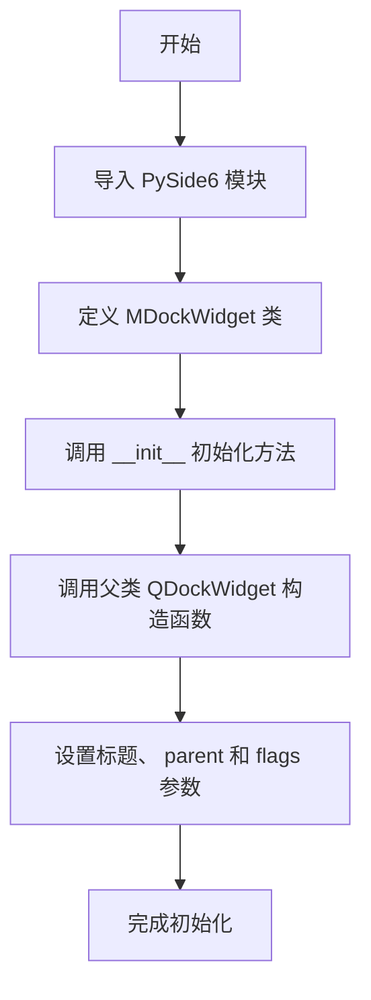

# `comic-translate\app\ui\dayu_widgets\dock_widget.py` 详细设计文档

这是一个基于 PySide6.QtWidgets.QDockWidget 的简单子类,用于创建可应用 QSS 样式表的停靠窗口部件,仅重写了父类的构造函数以设置标题、 parent 和 flags,没有额外的功能扩展。

## 整体流程



## 类结构

```
QtCore.Qt (枚举类)
└── QtWidgets.QDockWidget (父类)
    └── MDockWidget (当前类)
```

## 全局变量及字段


    

## 全局函数及方法


### `MDockWidget.__init__`

构造函数，初始化 MDockWidget 实例，设置标题、父窗口和窗口标志，并调用父类 QDockWidget 的构造函数进行初始化。

参数：

- `title`：`str`，窗口标题，默认为空字符串
- `parent`：`QWidget`，父窗口部件，默认为 None
- `flags`：`Qt.WindowFlags`，窗口标志，默认为 QtCore.Qt.Widget

返回值：`None`，构造函数不返回任何值

#### 流程图

```mermaid
flowchart TD
    A[开始 __init__] --> B[接收参数: title, parent, flags]
    B --> C[调用 super().__init__ 初始化父类]
    C --> D[传入 title, parent, flags 参数]
    D --> E[结束 __init__]
```

#### 带注释源码

```python
#!/usr/bin/env python
# -*- coding: utf-8 -*-
###################################################################
# Author: Mu yanru
# Date  : 2019.3
# Email : muyanru345@163.com
###################################################################
"""MDockWidget"""
# 导入未来模块（兼容性处理）
from __future__ import absolute_import
from __future__ import division
from __future__ import print_function

# 导入第三方模块（PySide6）
from PySide6 import QtCore
from PySide6 import QtWidgets


class MDockWidget(QtWidgets.QDockWidget):
    """
    Just apply the qss. No more extend.
    简单的QDockWidget子类，仅应用QSS样式，不做更多扩展。
    """

    def __init__(self, title="", parent=None, flags=QtCore.Qt.Widget):
        """
        初始化MDockWidget
        
        参数:
            title: str, 窗口标题，默认为空字符串
            parent: QWidget, 父窗口部件，默认为None
            flags: Qt.WindowFlags, 窗口标志，默认为QtCore.Qt.Widget
        """
        # 调用父类QDockWidget的构造函数
        # title: 窗口标题
        # parent: 父窗口部件，用于建立父子关系
        # flags: 窗口标志，控制窗口行为
        super(MDockWidget, self).__init__(title, parent=parent, flags=flags)
```

## 关键组件


### MDockWidget 类

MDockWidget 是一个简单的 Qt 停靠窗口组件包装类，继承自 QtWidgets.QDockWidget，仅用于应用 QSS 样式，无额外扩展功能。

### __init__ 方法

类的初始化方法，接受标题、父窗口和窗口标志参数，用于创建停靠窗口实例。

### 继承关系

继承自 QtWidgets.QDockWidget，利用 Qt 框架的停靠窗口功能。


## 问题及建议


### 已知问题

-   **文档与实现不一致**：类文档说明"Just apply the qss. No more extend"，但代码中未实现任何QSS（样式表）应用逻辑，文档描述具有误导性。
-   **Python 2兼容代码冗余**：导入了`__future__`模块（`absolute_import`、`division`、`print_function`），这些是Python 2的兼容写法，对于基于Python 3的PySide6项目无需使用。
-   **功能未完成**：该类被设计为扩展QDockWidget功能，但目前仅是一个空壳包装器，未实现任何有意义的扩展。
-   **缺少类型提示**：作为公共类，缺乏参数和返回值的类型注解，不利于IDE静态分析和代码维护。
-   **默认参数可能不当**：使用`QtCore.Qt.Widget`作为flags默认值，对于QDockWidget可能不是最合适的默认值。

### 优化建议

-   **补充QSS功能实现**：若确实需要应用QSS，应在`__init__`或单独方法中实现样式表加载逻辑，或移除误导性文档。
-   **清理冗余导入**：移除`__future__`相关导入，直接使用`from PySide6.QtCore import Qt, Widget`。
-   **添加类型提示**：使用Python 3的类型注解，如`def __init__(self, title: str = "", parent: Optional[QtWidgets.QWidget] = None, flags: Qt.WindowFlags = Qt.Widget) -> None`。
-   **考虑添加常用功能**：如设置停靠区域、设置特性、设置标题栏widget等常用方法的封装。
-   **使用Python 3super语法**：简化为`super().__init__(title, parent=parent, flags=flags)`。

## 其它


### 设计目标与约束

**设计目标**：
为Qt应用程序提供统一的DockWidget基础类，简化样式定制流程，实现DockWidget的快速样式化部署。

**约束条件**：
- 必须继承自QtWidgets.QDockWidget
- 保持与PySide6版本的兼容性
- 不引入额外的第三方GUI依赖
- 遵循最小化扩展原则，仅做样式包装

### 错误处理与异常设计

由于该类实现极为简单，未涉及复杂业务逻辑，因此：
- 异常处理：依赖Qt框架自身的异常机制
- 错误传播：通过Qt信号槽机制向上传递错误状态
- 边界检查：仅对title参数进行默认值处理

### 外部依赖与接口契约

**依赖项**：
- PySide6.QtCore
- PySide6.QtWidgets

**接口契约**：
- 构造函数参数：title(str), parent(QWidget), flags(Qt.WindowFlags)
- 返回值：无返回值（构造函数）
- 继承自QDockWidget的所有原有接口保持不变

### 使用示例

```python
# 基础使用
dock = MDockWidget("工具面板")
dock.setWidget(SomeWidget())

# 配合样式表使用
dock.setStyleSheet("QDockWidget { border: 1px solid red; }")
```

### 兼容性考虑

- Python版本：支持Python 2.7+（通过__future__导入实现兼容）
- Qt版本：PySide6（Qt6）
- 跨平台：支持Windows、Linux、MacOS（Qt原生支持）

### 性能特性

- 性能开销：极低，仅增加一次super()调用
- 内存占用：无额外内存占用
- 加载时机：随模块导入即时加载

    